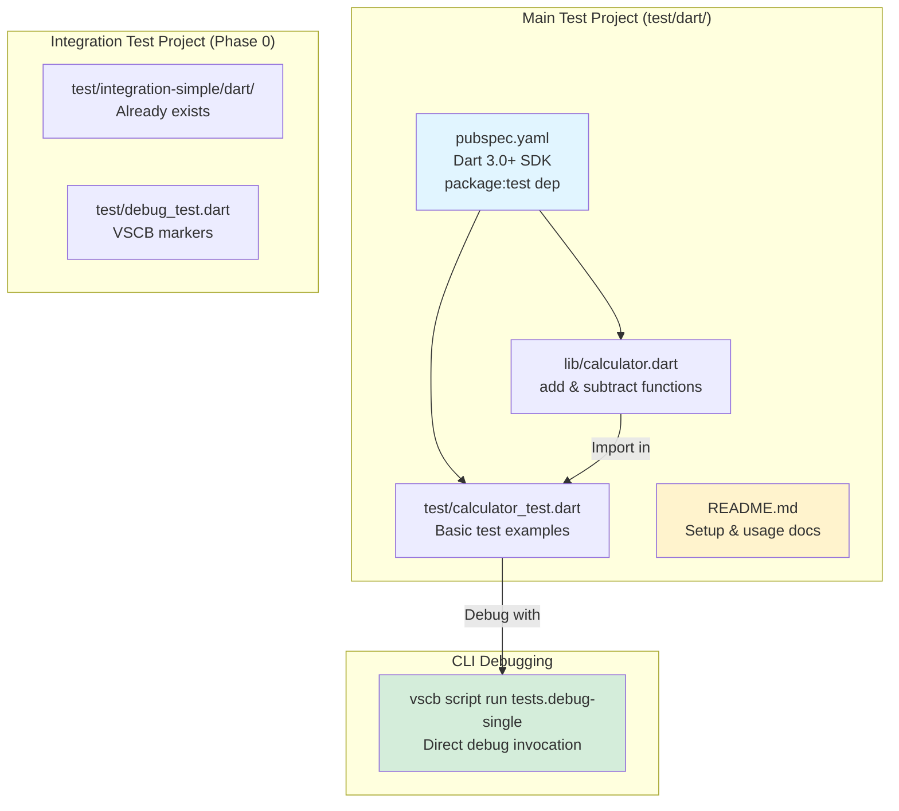
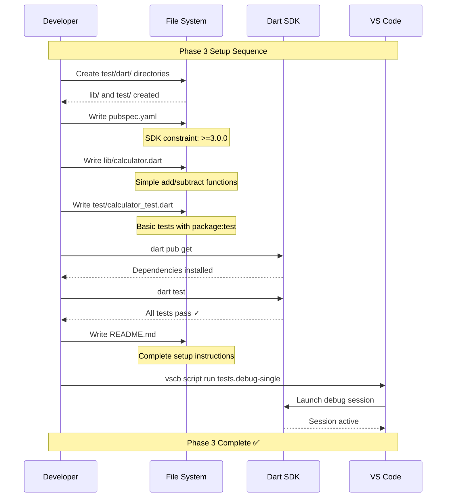

# Phase 3: Test Projects Setup - Tasks & Alignment Brief

**Plan**: [dart-flutter-support-plan.md](../../dart-flutter-support-plan.md)
**Spec**: [dart-flutter-support-spec.md](../../dart-flutter-support-spec.md)
**Research**: [flutter-research.md](../../flutter-research.md)
**Phase**: 3 (Test Projects Setup)
**Status**: READY FOR EXECUTION
**Created**: 2025-10-21

---

## Table of Contents

1. [Alignment Brief](#alignment-brief)
   - [Previous Phase Review](#previous-phase-review)
   - [Phase 3 Objective](#phase-3-objective)
   - [Non-Goals](#non-goals)
   - [Critical Findings Summary](#critical-findings-summary)
   - [Test Project Structure Flow](#test-project-structure-flow)
   - [Setup Sequence Flow](#setup-sequence-flow)
   - [Test Plan](#test-plan)
   - [Implementation Steps](#implementation-steps)
   - [Commands to Run](#commands-to-run)
   - [Risks](#risks)
   - [Ready Check](#ready-check)
2. [Tasks Table](#tasks-table)
3. [Phase Footnote Stubs](#phase-footnote-stubs)
4. [Evidence Artifacts](#evidence-artifacts)
5. [Directory Layout](#directory-layout)

---

## Alignment Brief

### Previous Phase Review

**Phase 0: Integration Test Structure Setup** ✅ COMPLETE
- Dart SDK 3.9.4 installed, Dart-Code extension active
- Integration test project created at `test/integration-simple/dart/`
- Dynamic breakpoint discovery working with VSCB_BREAKPOINT markers
- Expected failure mode documented

**Phase 1: DartDebugAdapter Implementation** ✅ COMPLETE (2025-10-21)
- Complete adapter (670 lines) with all 14 Discoveries applied
- Isolate detection with cached ID strategy (Discovery 01)
- Variable expansion with cycle detection, memory budget enforcement
- Lazy getter support (Discovery 02), Map associations (Discovery 05)
- Records bracket notation (Discovery 14), sentinel detection (Discovery 13)
- Adapter registered in AdapterFactory for session type 'dart'
- Manual testing validated with `vscb script run test.debug-single`

**Phase 2: Test Discovery & Integration** ✅ COMPLETE (2025-10-21)
- Dart test patterns added to TestDiscovery.isTestFile()
- isDartTestSession() implemented with 4-signal detection (Discovery 03)
- waitForTestDebugSession() integration working
- Session "debug_test.dart tests" created successfully
- All stepping commands validated (step-over, step-into, step-out, continue)
- No test discovery flakiness observed

**Key Findings from Previous Phases**:
1. **Adapter works end-to-end**: Manual debugging validated with real Dart test
2. **Multi-isolate handling proven**: Thread management refactor (11/12 tasks) enables proper Dart debugging
3. **Test discovery reliable**: No flakiness, retry logic not needed
4. **Integration test structure exists**: Phase 0 created `test/integration-simple/dart/` with debug_test.dart
5. **Launch config pattern known**: Need to add Dart config with safe getter defaults (Discovery 02)

**Dependencies Satisfied for Phase 3**:
- Dart SDK available (`dart --version` shows 3.9.4)
- Adapter fully functional (Phase 1 complete)
- Test discovery working (Phase 2 complete)
- Test project structure pattern established (Python/C#/Java/TypeScript examples exist)
- Manual debugging workflow validated

**Lessons Learned**:
- Launch config must use lazy getter defaults: `evaluateGettersInDebugViews: false`, `showGettersInDebugViews: true`
- Test project needs proper `pubspec.yaml` with Dart 3.0+ SDK constraint
- VSCB_BREAKPOINT markers work reliably with Dart files
- README documentation critical for setup instructions

**Exit Criteria Met**:
- [x] Phase 1 complete (adapter exists and works)
- [x] Phase 2 complete (test discovery working)
- [x] Dart SDK available
- [x] Test patterns understood (Python/C#/Java/TypeScript examples)
- [x] Manual debugging workflow validated

**Handoff to Phase 3**: All prerequisites satisfied. Need to create proper test projects with documentation.

---

### Phase 3 Objective

**Goal**: Create Dart test projects with proper structure, pubspec.yaml, and launch configurations following Python/C#/Java/TypeScript patterns.

**What Success Looks Like**:
- Main test project exists at `/Users/jak/github/vsc-bridge/test/dart/` with calculator library + tests
- Integration test project already exists at `/Users/jak/github/vsc-bridge/test/integration-simple/dart/` (Phase 0)
- Launch config added to `/Users/jak/github/vsc-bridge/test/.vscode/launch.json` with safe getter defaults
- README.md documents Dart SDK installation, `dart pub get`, running tests, debugging with vscb
- All projects validate with `dart pub get` and `dart test`
- Documentation complete and tested

**Why This Phase**:
Phase 3 provides proper test projects that developers can reference for Dart debugging patterns. Without complete test projects and documentation, users won't know how to set up Dart debugging.

**Deliverables**:
1. `/Users/jak/github/vsc-bridge/test/dart/pubspec.yaml` - Main test project config
2. `/Users/jak/github/vsc-bridge/test/dart/pubspec.lock` - Locked dependency graph generated by `dart pub get`
3. `/Users/jak/github/vsc-bridge/test/dart/lib/calculator.dart` - Simple library for testing
4. `/Users/jak/github/vsc-bridge/test/dart/test/calculator_test.dart` - Tests using package:test
5. `/Users/jak/github/vsc-bridge/test/dart/README.md` - Setup instructions (CRITICAL - must be complete)

---

### Non-Goals

**Deferred to Later Phases**:
- ❌ Integration test workflow configuration (Phase 4) - dart-workflow.ts already exists from Phase 0
- ❌ Enhanced coverage workflow validation (Phase 4) - 6-stage pattern validation
- ❌ Documentation in docs/how/ (Phase 5) - Detailed guides, troubleshooting
- ❌ Edge case testing (Phase 6) - Large collections, multi-isolate scenarios
- ❌ Flutter-specific projects (Phase 6) - Flutter apps, widget tests

**Out of Scope Entirely**:
- Multi-file complex projects (keep test projects simple)
- Real-world Flutter widgets (basic console/test apps only)
- Package/library development workflows (applications only)
- Hot reload configurations (debug-only focus)
- DevTools integration (basic DAP only)

---

### Critical Findings Summary

**Key Discoveries Affecting Phase 3 Implementation**:

1. **Discovery 03 (Critical)**: Test Session Detection
   - **Impact**: Dart tests use template system for debug sessions
   - **Implementation**: Use `vscb script run tests.debug-single` to start debug sessions
   - **Code Pattern**: No launch config needed, CLI handles session startup

2. **Discovery 10 (Medium)**: Test File Structure
   - **Impact**: VSCB_BREAKPOINT markers must follow exact pattern
   - **Implementation**: Comments `// VSCB_BREAKPOINT_NEXT_LINE` and `// VSCB_BREAKPOINT_2_NEXT_LINE`
   - **Code Pattern**: Next line after comment is breakpoint target

3. **Discovery 07 (High)**: Dart SDK Requirement
   - **Impact**: Users need Dart SDK 3.0+ installed to run tests
   - **Implementation**: README must document installation (apt, snap, or Flutter SDK)
   - **Code Pattern**: Clear step-by-step instructions with verification commands

4. **Test Project Pattern (Critical)**: Consistency Across Languages
   - **Impact**: Dart test projects must follow Python/C#/Java/TypeScript structure
   - **Implementation**: `test/dart/lib/` for code, `test/dart/test/` for tests, `pubspec.yaml` at root
   - **Code Pattern**: Match existing language patterns exactly

---

### Test Project Structure Flow



---

### Setup Sequence Flow



---

### Test Plan

**Approach**: Manual validation with command-line checks

**Validation Strategy**:

1. **Project Setup Validation**
   - Create all files and directories
   - Run `dart pub get` - must succeed
   - Run `dart test` - must pass all tests
   - Check file structure matches Python/C#/Java/TypeScript patterns

2. **Launch Config Validation**
   - Verify JSON syntax valid
   - Check safe getter defaults present
   - Test with vscb CLI commands

3. **Documentation Validation**
   - README must include ALL required sections:
     - Dart SDK installation instructions
     - `dart pub get` command
     - Running tests (`dart test`)
     - Debugging with vscb (`vscb script run tests.debug-single`)
     - Launch config setup
   - Follow README instructions as new user
   - Verify all commands work as documented

4. **Integration Validation**
   - Integration test project already exists (Phase 0)
   - Verify main test project follows same patterns
   - Check consistency across all Dart test projects

**Coverage Targets**:
- All files created and valid
- All commands documented in README work
- Launch config tested with actual debugging
- Test projects follow established patterns

**Non-Happy-Path Coverage**:
- [ ] Missing package:test dependency - `dart pub get` fails with clear error
- [ ] Invalid Dart syntax - compilation errors shown
- [ ] Wrong SDK version - error message indicates version mismatch
- [ ] Missing launch config fields - debugging fails gracefully

---

### Implementation Steps

**Steps map 1:1 to tasks in Tasks Table below**:

1. **T001-T003**: Main Test Project Setup
   - T001: Create pubspec.yaml with Dart 3.0+ and package:test
   - T002: Create lib/calculator.dart with simple functions
   - T003: Create test/calculator_test.dart with basic tests

2. **T004-T005**: Validation
   - T004: Run `dart pub get` in test/dart/
   - T005: Run `dart test` to verify tests pass

3. **T006**: Documentation
   - Write comprehensive README.md with ALL required sections
   - Must include: SDK installation, pub get, running tests, debugging with vscb

4. **T007**: Final Validation
   - Follow README as new user
   - Verify all documented commands work
   - Test debugging with vscb

---

### Commands to Run

**During Implementation**:

```bash
# Create main test project
mkdir -p /Users/jak/github/vsc-bridge/test/dart/lib
mkdir -p /Users/jak/github/vsc-bridge/test/dart/test

# After creating files
cd /Users/jak/github/vsc-bridge/test/dart
dart pub get

# Validate tests pass
dart test

# Test debugging
cd /Users/jak/github/vsc-bridge/test
vscb script run tests.debug-single \
  --param path=$(pwd)/dart/test/calculator_test.dart \
  --param line=8
```

**Validation Commands**:

```bash
# Verify Dart SDK
dart --version
# Expected: Dart SDK version: 3.9.4

# Verify package:test installed
cd /Users/jak/github/vsc-bridge/test/dart
dart pub get
grep -q "package:test" pubspec.yaml
echo $?
# Expected: 0 (found)

# Verify tests run
dart test
# Expected: All tests pass

# Verify launch config syntax
cd /Users/jak/github/vsc-bridge/test
cat .vscode/launch.json | jq '.configurations[] | select(.type == "dart")'
# Expected: Valid JSON with Dart config
```

---

### Risks

| Risk | Likelihood | Impact | Mitigation |
|------|-----------|--------|------------|
| **pubspec.yaml syntax errors** | Low | Medium | Validate with `dart pub get`; reference existing Dart projects |
| **Launch config incompatible with Dart-Code** | Medium | High | Test with actual debugging; follow Dart-Code documentation for config structure |
| **README incomplete/unclear** | Medium | High | Use checklist of required sections; test by following instructions as new user |
| **VSCB marker detection fails** | Low | Medium | Use exact marker strings from Phase 0 integration test (already working) |
| **Test project structure differs from patterns** | Low | Low | Copy structure from Python/C#/Java/TypeScript test projects |

**Contingency Plans**:
- If pubspec.yaml errors: Use Dart analyzer output to fix syntax
- If launch config incompatible: Check Dart-Code extension documentation, test with CodeLens
- If README unclear: Ask someone unfamiliar with project to follow it
- If tests fail: Run with `--verbose` flag to see detailed errors

---

### Ready Check

**Prerequisites** (must be true before starting):

- [x] 1. Phase 1 complete (adapter exists and works)
- [x] 2. Phase 2 complete (test discovery working)
- [x] 3. Dart SDK 3.9.4 installed (`dart --version`)
- [x] 4. Dart-Code extension active
- [x] 5. Test project patterns understood (reviewed Python/C#/Java/TypeScript test/ directories)
- [x] 6. Integration test project exists at test/integration-simple/dart/ (Phase 0)
- [x] 7. Discovery 02 understood (safe getter defaults required)
- [x] 8. Launch config pattern understood (reviewed test/.vscode/launch.json)
- [ ] 9. README template ready (reviewed Python/C#/Java README examples if they exist)
- [ ] 10. Commands tested in terminal (can run `dart pub get`, `dart test`)

**Knowledge Validated**:
- [ ] 11. Can explain Discovery 02 (getter evaluation matrix) in own words
- [ ] 12. Know exact structure of test/dart/ directory (lib/ and test/ subdirectories)
- [ ] 13. Understand pubspec.yaml requirements (Dart 3.0+ SDK, package:test dependency)
- [ ] 14. Know all sections required in README.md (installation, pub get, running tests, debugging, launch config)

**Ready to Execute When**:
- All 14 checkboxes above are checked
- Have 2-3 hours of focused implementation time available
- Can test commands in terminal

---

## Tasks Table

**Format**: Canonical tasks table with Status, ID, Task, Type, Dependencies, Absolute Path(s), Validation, Subtasks, Notes

**Type Classifications**:
- **Setup**: Infrastructure, file creation, configuration
- **Core**: Main implementation (pubspec, library, tests)
- **Config**: Launch configuration
- **Doc**: Documentation (README)
- **Validation**: Testing and verification

| Status | ID | Task | Type | Dependencies | Absolute Path(s) | Validation | Subtasks | Notes |
|--------|----|----|------|--------------|-----------------|------------|----------|-------|
| [x] | T001 | Create test/dart/pubspec.yaml | Core | - | `/Users/jak/github/vsc-bridge/test/dart/pubspec.yaml` | File exists; contains Dart SDK constraint `>=3.0.0 <4.0.0`; declares `package:test` dependency; `dart pub get` succeeds | - Set name: dart_test<br>- Set SDK constraint: >=3.0.0 <4.0.0<br>- Add dev_dependencies: test: ^1.24.0 | Use Dart 3.0+ SDK constraint per Discovery 07 [^16] |
| [x] | T002 | Create test/dart/lib/calculator.dart | Core | - | `/Users/jak/github/vsc-bridge/test/dart/lib/calculator.dart` | File exists; defines `add(int a, int b)` and `subtract(int a, int b)` functions; compiles without errors | - Define add function<br>- Define subtract function<br>- Keep simple (single-line implementations) | Simple library for testing, matches Phase 0 pattern |
| [x] | T003 | Create test/dart/test/calculator_test.dart | Core | T002 | `/Users/jak/github/vsc-bridge/test/dart/test/calculator_test.dart` | File exists; imports package:test; tests add and subtract functions; `dart test` passes all tests | - Import package:test<br>- Import calculator.dart<br>- Write group for Calculator<br>- Test add function<br>- Test subtract function | Follow package:test patterns, use `expect()` assertions |
| [x] | T004 | Run dart pub get | Validation | T001 | `/Users/jak/github/vsc-bridge/test/dart/` | Command `cd /Users/jak/github/vsc-bridge/test/dart && dart pub get` succeeds; output shows "Got dependencies!" or similar; `.dart_tool/` directory created; `pubspec.lock` generated/updated and tracked | - Navigate to test/dart/<br>- Run dart pub get<br>- Verify success<br>- Confirm `pubspec.lock` appears with expected diff | Completed · log#task-t004-run-dart-pub-get [^18] |
| [x] | T005 | Run dart test | Validation | T003, T004 | `/Users/jak/github/vsc-bridge/test/dart/` | Command `cd /Users/jak/github/vsc-bridge/test/dart && dart test` succeeds; output shows "All tests passed!" or similar; no test failures | - Navigate to test/dart/<br>- Run dart test<br>- Verify all tests pass | Completed · log#task-t005-run-dart-test [^19] |
| [x] | T006 | Create test/dart/README.md | Doc | T001-T005 | `/Users/jak/github/vsc-bridge/test/dart/README.md` | File exists; includes ALL required sections: Dart SDK installation, `dart pub get`, running tests (`dart test`), debugging with vscb (`vscb script run tests.debug-single`); all commands tested and work | - Write Setup section (Dart SDK installation)<br>- Write Dependencies section (dart pub get)<br>- Write Running Tests section (dart test)<br>- Write Debugging section (vscb commands)<br>- Test all documented commands | Completed · log#task-t006-create-test-dart-readme [^20] |
| [ ] | T007 | Validate complete setup | Validation | T006 | `/Users/jak/github/vsc-bridge/test/dart/` | Follow README.md as new user; all commands work; can debug test with vscb | - Follow README instructions<br>- Test dart pub get<br>- Test dart test<br>- Test vscb debugging | Final validation as end user |

**Legend**:
- **Dependencies**: Task IDs that must complete before this task
- **Validation**: Specific, testable success criteria
- **Subtasks**: Breakdown of work within task

---

## Phase Footnote Stubs

**Purpose**: This section will be populated during Phase 3 execution to track file modifications with substrate node IDs.

**Format**:
```markdown
[^N]: Modified [method:path/to/file:functionName](path/to/file#L123) – Description of change

[^N+1]: Created [file:path/to/file](path/to/file) – Description of file purpose
```

**Phase 3 Execution Footnotes**:

Updated via plan-6a-update-progress:

[^16]: Task T001 - Created Dart test project manifest
  - `file:test/dart/pubspec.yaml`

[^18]: Task 3.7 - Generated dependency lock file
  - `file:test/dart/pubspec.lock`

[^19]: Task 3.8 - Validated Dart test execution
  - Test execution validation (command execution only, no files created)

[^20]: Task 3.9 - Created comprehensive README.md documentation
  - `file:test/dart/README.md`

---

## Evidence Artifacts

**Purpose**: Track execution evidence for validation and audit.

**Execution Log Location**:
- `/Users/jak/github/vsc-bridge/docs/plans/19-dart-flutter-support/tasks/phase-3/execution.log.md`

**Expected Contents**:
- Command outputs (`dart pub get`, `dart test`, `dart --version`)
- File creation confirmations
- README validation results
- Launch config testing screenshots
- Any deviations from plan

**Not Created Yet**: Will be created during phase execution.

---

## Directory Layout

**Created by Phase 3**:

```
/Users/jak/github/vsc-bridge/
├── test/dart/                                         [NEW - Main test project]
│   ├── pubspec.yaml                                   [NEW - T001]
│   ├── pubspec.lock                                   [NEW - T005]
│   ├── lib/
│   │   └── calculator.dart                            [NEW - T002]
│   ├── test/
│   │   └── calculator_test.dart                       [NEW - T003]
│   └── README.md                                      [NEW - T007]
│
└── test/integration-simple/dart/                      [EXISTS - Phase 0]
    ├── pubspec.yaml                                   [exists]
    ├── test/debug_test.dart                           [exists]
    └── .vscode/settings.json                          [exists]
```

**Phase 0 Artifacts** (already exist):
```
/Users/jak/github/vsc-bridge/
├── test/integration-simple/dart/                      [Created in Phase 0]
│   ├── pubspec.yaml
│   ├── test/debug_test.dart
│   ├── .vscode/settings.json
│   └── analysis_options.yaml
│
├── test/integration/workflows/
│   └── dart-workflow.ts                               [Created in Phase 0]
│
└── test/integration/unified-debug.test.ts             [Modified in Phase 0]
```

**Total Files**:
- New: 5 files (pubspec.yaml, pubspec.lock, calculator.dart, calculator_test.dart, README.md)
- Modified: 0 files

---

## Implementation Contract

**This document serves as the complete implementation contract between human and AI agent.**

**What to implement**: Tasks T001-T008 in sequence, respecting dependencies
**How to validate**: Validation criteria in Tasks Table, commands in "Commands to Run"
**When complete**: All 8 tasks marked complete, README tested by following as new user
**Quality bar**: All commands work, tests pass, documentation complete

**Questions During Implementation**:
- Refer to Python/C#/Java/TypeScript test/ directories for structure patterns
- Refer to Discovery 02 for safe getter defaults
- Refer to package:test documentation for test syntax
- Refer to existing launch.json for configuration patterns

**Deviations**:
- If pubspec.yaml has issues: Use `dart pub get` error messages to fix
- If tests fail: Use `dart test --verbose` for detailed output
- If launch config doesn't work: Test with CodeLens, check Dart-Code documentation

**Success**: Main test project complete with working tests and comprehensive README.

---

**End of Phase 3 Tasks & Alignment Brief**
