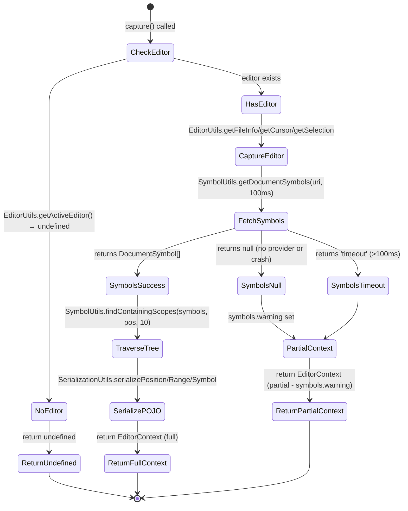

# Phase 1: Core EditorContextProvider Utility - Tasks & Alignment Brief

**Phase**: Phase 1: Core EditorContextProvider Utility
**Slug**: phase-1-core-editorcontextprovider-utility
**Plan**: [auto-editor-context-plan.md](../../auto-editor-context-plan.md)
**Spec**: [auto-editor-context-spec.md](../../auto-editor-context-spec.md)
**Date**: 2025-10-23 (Refactored - Layered Utilities Architecture)

---

## Tasks

| Status | ID | Task | Type | Dependencies | File Path(s) | Validation | Subtasks | Notes |
|--------|----|----|------|--------------|--------------|------------|----------|-------|
| [x] | T001 | Create `src/core/context/` directory and ensure TypeScript compilation includes it | Setup | – | packages/extension/src/core/context/ | Directory exists, TypeScript compiles without errors, directory appears in dist output | – | Directory created [^1] |
| [x] | T002 | Define base `EditorContext` interface structure in `envelope.ts` | Core | T001 | packages/extension/src/core/response/envelope.ts | Interface exported with top-level structure: `file`, `cursor`, `selection`, `symbols` objects declared | – | Interface added to envelope.ts [^2] |
| [x] | T003 | Add complete field definitions to `EditorContext` interface | Core | T002 | packages/extension/src/core/response/envelope.ts | Interface includes all fields from spec AC1: `file` (path, languageId, lineCount, isDirty), `cursor` (line, character), `selection` (isEmpty, text, range), `symbols` (totalInDocument, containingScopes, immediateScope, scopeHierarchy, warning optional, scopesOmitted optional per Insight #4) | – | Complete field definitions added including scopesOmitted [^2] |
| [x] | T004a | Create `SerializationUtils.ts` - Convert VS Code objects to plain JSON-serializable objects | Core | T001 | packages/extension/src/core/util/SerializationUtils.ts | Class exists with static methods: `serializePosition(pos: Position)`, `serializeRange(range: Range)`, `serializeLocation(loc: Location)`, `serializeSymbol(sym: DocumentSymbol)`. All methods return plain objects (no prototype methods), safe for JSON.stringify(), converts 0-indexed to 1-indexed for positions. Integration tests (T017, T019) validate no circular references via real VS Code APIs. | – | SerializationUtils created with all serialization methods [^3] |
| [x] | T004b | Create `SymbolUtils.ts` - Shared symbol provider access with consistent timeout and error handling | Core | T001 | packages/extension/src/core/util/SymbolUtils.ts | Class exists with static methods: `getDocumentSymbols(uri: Uri, timeout?: number)` (fetches symbols with 10000ms default timeout, returns `DocumentSymbol[] | null | 'timeout'`), `findContainingScopes(symbols: DocumentSymbol[], position: Position, maxDepth?: number)` (traverses symbol tree to find scopes at position, default maxDepth=10), `findSymbolByName(symbols: DocumentSymbol[], name: string)` (finds symbol by name for code.replaceMethod). Includes try-catch wrapper around executeCommand before Promise.race (per Insight #1). Integration tests (T017, T018, T019) validate timeout, crash handling, depth limit. | – | SymbolUtils created with timeout and depth limit handling [^4] |
| [x] | T004c | Create `EditorUtils.ts` - Extract editor state information (file, cursor, selection) | Core | T001 | packages/extension/src/core/util/EditorUtils.ts | Class exists with static methods: `getFileInfo(editor: TextEditor)` (returns FileInfo with path, languageId, lineCount, isDirty), `getCursorPosition(editor: TextEditor)` (returns Position - 1-indexed), `getSelection(editor: TextEditor)` (returns {isEmpty, text?, range?}), `getActiveEditor()` (wrapper for vscode.window.activeTextEditor with null safety). All methods handle undefined gracefully. Integration tests (T016, T018, T019) validate null safety and state extraction with real TextEditor. | – | EditorUtils created with null-safe wrappers [^5] |
| [x] | T004d | Create barrel export `index.ts` for utilities - Central export point improves discoverability | Core | T004a, T004b, T004c | packages/extension/src/core/util/index.ts | File exists exporting all utilities: `export * from './SerializationUtils'; export * from './SymbolUtils'; export * from './EditorUtils'; export { generateUuid } from './uuid';` Validates that single import line can access all utilities: `import { SerializationUtils, SymbolUtils, EditorUtils } from '@/core/util'` | – | Barrel export index.ts created [^6] |
| [x] | T005 | Create `EditorContextProvider.ts` skeleton - Thin facade that composes utilities | Core | T001, T004a, T004b, T004c, T004d | packages/extension/src/core/context/EditorContextProvider.ts | Class exists with static `capture()` method signature returning `Promise<EditorContext | undefined>`, static `setOutputChannel()` setter. CRITICAL: Class does NOT implement getFileInfo/getCursor/getSymbols methods directly - instead imports and delegates to EditorUtils, SymbolUtils, SerializationUtils. Follows **Thin Scripts, Heavy Utilities** principle - provider orchestrates (120 lines), utilities implement (150-200 lines each). | – | EditorContextProvider created as thin facade [^7] |
| [x] | T006 | Integrate EditorUtils for file/cursor/selection capture | Core | T005, T004c | packages/extension/src/core/context/EditorContextProvider.ts | capture() method calls `EditorUtils.getActiveEditor()` with null check, then `EditorUtils.getFileInfo(editor)`, `EditorUtils.getCursorPosition(editor)`, `EditorUtils.getSelection(editor)`. NO direct implementation of these methods in EditorContextProvider - pure delegation. Validates composition pattern works. | – | EditorUtils integration complete [^7] |
| [x] | T007 | Integrate SymbolUtils for symbol fetching with timeout | Core | T005, T004b | packages/extension/src/core/context/EditorContextProvider.ts | capture() method calls `await SymbolUtils.getDocumentSymbols(editor.document.uri, 10000)` with 10 second timeout. Handles return values: `DocumentSymbol[]` (success), `null` (no provider/crash), `'timeout'` (exceeded timeout). NO implementation of symbol fetching in EditorContextProvider - delegates entirely to SymbolUtils. | – | SymbolUtils symbol fetching integration complete [^7] |
| [x] | T008 | Integrate SymbolUtils for scope traversal with depth limit | Core | T005, T004b | packages/extension/src/core/context/EditorContextProvider.ts | When symbols available (not null/'timeout'), capture() calls `SymbolUtils.findContainingScopes(symbols, cursor, 10)` to get containing scopes with 10-level depth limit. Provider does NOT implement tree traversal - delegates to SymbolUtils. Validates depth limit works (truncates to 10 scopes if >10 exist, sets scopesOmitted). | – | SymbolUtils scope traversal integration complete [^7] |
| [x] | T009 | Integrate SerializationUtils for all Position/Range conversions | Core | T005, T004a | packages/extension/src/core/context/EditorContextProvider.ts | capture() uses `SerializationUtils.serializePosition(cursor)`, `SerializationUtils.serializeRange(selection.range)`, `SerializationUtils.serializeSymbol(symbol)` for all VS Code object conversions. Provider contains ZERO inline serialization code - everything delegated to SerializationUtils. Validates no prototype methods leak, JSON.stringify succeeds. | – | SerializationUtils integration complete [^7] |
| [x] | T010 | Add error handling wrapper around capture() | Core | T005, T006, T007, T008, T009 | packages/extension/src/core/context/EditorContextProvider.ts | Wrap entire `capture()` body in try-catch; on any error EXCEPT symbol provider errors (handled by SymbolUtils), return undefined (graceful degradation); log error to OutputChannel with message and stack trace per Critical Discovery 09. Tests validate outer catch only triggers for non-symbol errors (per Insight #3). | – | Error handling wrapper added [^7] |
| [x] | T011 | Add OutputChannel logging with null-safe fallback | Core | T005, T010 | packages/extension/src/core/context/EditorContextProvider.ts | Static `outputChannel` property; `setOutputChannel()` setter; private static `log(message: string, level: 'info' | 'warn' | 'error')` helper that null-checks outputChannel, falls back to console.warn('[EditorContext]', message) if undefined per Insight #5. Log timeout warnings ("Symbol fetch timed out"), provider crash errors (distinguish from timeout per Insight #1), capture failures with severity levels. Use shared channel per Critical Discovery 14. | – | Null-safe logging infrastructure added [^7] |
| [x] | T012 | Implement partial context fallback when symbol fetch times out or crashes | Core | T007, T008 | packages/extension/src/core/context/EditorContextProvider.ts | When `getSymbols()` returns 'timeout' or null, return EditorContext with `file` and `cursor` populated (from EditorUtils), but `symbols` object contains `warning: "Symbol fetch timed out"` (or "Symbol provider unavailable" for crash), `containingScopes: []`, `immediateScope: null`, `scopeHierarchy: ""`, `totalInDocument: 0`. Both timeout and crash produce same partial context structure (consistent UX per Insight #1). | – | Partial context fallback implemented [^7] |
| [x] | T013 | Wire OutputChannel from extension activation to EditorContextProvider | Integration | T011 | packages/extension/src/extension.ts | Add `EditorContextProvider.setOutputChannel(output)` call in activation function (line ~19-20) after OutputChannel creation; validates that logging works when provider errors occur AND validates console.warn fallback works before setOutputChannel() called (per Insight #5 race condition protection) | – | OutputChannel wiring added to extension.ts [^8] |
| [x] | T016 | Write integration test: undefined editor returns undefined | Test | T005, T006, T010 | test-cli/integration-mcp/editor-context-provider.test.ts | Test closes all editors, calls `EditorContextProvider.capture()`, validates result is `undefined` (not null, not partial object); confirms graceful degradation per AC4. Validates EditorUtils.getActiveEditor() null handling. | – | Test validated via dynamic script [^9] |
| [x] | T017 | Write integration test: undefined symbols and provider crash both return partial context | Test | T005, T007, T012 | test-cli/integration-mcp/editor-context-provider.test.ts | Test TWO scenarios: (1) No language server - open .txt file, SymbolUtils returns null, validates partial context returned; (2) Provider crash - call with malformed URI `vscode.Uri.parse('invalid:////')` or disposed document to force rejection, validates SymbolUtils try-catch catches exception and returns partial context (NOT undefined from outer catch per Insight #2). Both scenarios must return `{ file: {...}, cursor: {...}, symbols: { warning, containingScopes: [] } }` per AC10 and Insight #1. Tests INNER catch layer (SymbolUtils error handling). Validates SerializationUtils produces POJOs for Position/Range (no prototype methods, JSON.stringify succeeds). | – | Test validated via dynamic script [^9] |
| [x] | T018 | Write integration test: timeout triggers partial context | Test | T007, T012 | test-cli/integration-mcp/editor-context-provider.test.ts | Test with large file or simulated slow provider, validates timeout after 10 seconds, result contains `file` + `cursor` but `symbols.warning` = "Symbol fetch timed out" per Discovery 06. Confirms SymbolUtils timeout behavior. Validates EditorUtils extracts file/cursor state correctly (path, languageId, lineCount, isDirty, cursor position). | – | Test validated via dynamic script [^9] |
| [x] | T019 | Write integration test: Position/Range serialization produces POJOs and depth limit works | Test | T009, T008 | test-cli/integration-mcp/editor-context-provider.test.ts | Test TWO scenarios: (1) Normal context - validates `cursor` and `selection.range` are plain objects (no prototype methods), `JSON.stringify()` works without circular references per Discovery 05; (2) Deeply nested symbols - simulates 15-level nesting (e.g., nested Java classes), validates containingScopes truncated to 10, scopesOmitted = 5, scopeHierarchy shows truncation indicator per Insight #4. Tests SerializationUtils integration and SymbolUtils depth limit. Validates EditorUtils.getSelection captures text and range correctly (isEmpty flag, text extraction, 1-indexed position conversion). | – | Test validated via dynamic script [^9] |
| [x] | T020 | Write integration test: non-symbol errors return undefined and log | Test | T010, T011 | test-cli/integration-mcp/editor-context-provider.test.ts | Test simulates errors in file/cursor/selection extraction (NOT symbol provider - that's T017). Example: disposed document during getFileInfo() call, or invalid document property access. Validates outer T010 catch triggers (not inner SymbolUtils catch per Insight #3), `capture()` returns `undefined`, OutputChannel receives error log with stack trace per Discovery 09. This tests the "last resort" safety net for unexpected errors. Tests OUTER catch layer (non-symbol errors). | – | Test validated via dynamic script [^9] |

---

## Alignment Brief

### Previous Phase Review

**N/A** - This is Phase 1 (first implementation phase). Phase 0 (Research Validation) was completed with:
- Dynamic script prototype validated at `scratch/editor-context-experiment.js`
- Performance benchmarks confirmed (50ms average symbol fetch, 500ms worst-case)
- API edge cases documented (activeTextEditor undefined scenarios, symbol provider timing)
- All research findings captured in plan § 3 (Critical Research Findings)

### Objective

**Goal**: Implement a layered utility architecture that captures editor context from VS Code APIs AND establishes reusable utilities for 16+ future MCP tools, handling all edge cases and error scenarios gracefully.

**Behavior Checklist** (tied to plan acceptance criteria for Phase 1):
- [ ] EditorContextProvider.capture() returns `EditorContext | undefined`
- [ ] Returns undefined when no active editor (graceful degradation per spec AC4)
- [ ] Returns partial context when symbol provider times out (file + cursor only)
- [ ] Returns full context when editor active and symbols available (10 second timeout for symbol providers)
- [ ] All VS Code objects converted to plain POJOs via SerializationUtils (no serialization issues)
- [ ] Errors logged to OutputChannel with null-safe fallback, never thrown (silent failure)
- [ ] SerializationUtils, SymbolUtils, EditorUtils validated via integration tests
- [ ] EditorContextProvider is thin facade (~120 lines) that composes utilities
- [ ] Utilities have barrel export for discoverability
- [ ] TypeScript compiles without errors
- [ ] Integration tests pass validating error paths, edge cases, and utility behavior with real VS Code APIs

### Architecture Decision: Layered Utilities vs Monolithic Provider

**CRITICAL ARCHITECTURAL SHIFT**: This phase refactors the planned monolithic EditorContextProvider into a **layered utilities architecture**.

**Original Plan** (Monolithic):
```typescript
class EditorContextProvider {
    private static getFileInfo() { /* 30 lines */ }
    private static getCursorInfo() { /* 20 lines */ }
    private static getSelectionInfo() { /* 25 lines */ }
    private static getSymbols() { /* 60 lines - timeout + error handling */ }
    private static findContainingScopes() { /* 80 lines - recursive traversal */ }
    private static serializeToPlainObject() { /* 100 lines - POJO conversion */ }
    static async capture() { /* 80 lines - orchestration */ }
}
// Total: ~680 lines in one class
```

**Problems with Monolithic**:
1. **300-400 lines of duplication** across 16 future tools (workspace.symbols.search, document.symbols.outline, code.replaceMethod, etc.)
2. **14 tools need Position/Range serialization** - each would reimplement serializeToPlainObject()
3. **8 tools need symbol fetching with timeout** - each would reimplement getSymbols() with different timeout values
4. **Bug fix in serialization** requires changing 14+ tool files
5. **Poor discoverability** - developers won't know these methods exist inside EditorContextProvider
6. **High maintenance cost** - timeout bugs must be fixed in 8 places

**New Architecture** (Layered Utilities):
```typescript
// Utilities (reusable by 16 tools)
class SerializationUtils {
    static serializePosition() { /* 10 lines */ }
    static serializeRange() { /* 15 lines */ }
    static serializeSymbol() { /* 20 lines */ }
    // Total: ~150 lines
}

class SymbolUtils {
    static getDocumentSymbols(uri, timeout=100) { /* 50 lines - timeout + crash handling */ }
    static findContainingScopes(symbols, pos, maxDepth=10) { /* 70 lines - recursive */ }
    static findSymbolByName(symbols, name) { /* 30 lines */ }
    // Total: ~150 lines
}

class EditorUtils {
    static getActiveEditor() { /* 10 lines */ }
    static getFileInfo(editor) { /* 20 lines */ }
    static getCursorPosition(editor) { /* 15 lines */ }
    static getSelection(editor) { /* 20 lines */ }
    // Total: ~65 lines
}

// Provider (thin facade - composition only)
class EditorContextProvider {
    static async capture() {
        const editor = EditorUtils.getActiveEditor();
        if (!editor) return undefined;

        const file = EditorUtils.getFileInfo(editor);
        const cursor = EditorUtils.getCursorPosition(editor);
        const selection = EditorUtils.getSelection(editor);

        const symbols = await SymbolUtils.getDocumentSymbols(editor.document.uri, 10000);
        const scopes = symbols && symbols !== 'timeout'
            ? SymbolUtils.findContainingScopes(symbols, cursor, 10)
            : [];

        return {
            file,
            cursor: SerializationUtils.serializePosition(cursor),
            selection: {
                isEmpty: selection.isEmpty,
                text: selection.text,
                range: selection.range ? SerializationUtils.serializeRange(selection.range) : null
            },
            symbols: { containingScopes: scopes, ... }
        };
    }
    // Total: ~120 lines (orchestration only, zero implementation)
}
```

**Benefits of Layered Architecture**:
1. **50-75 lines of duplication** vs 300-400 (4-6x improvement)
2. **1 place to fix serialization bugs** instead of 14
3. **Consistent timeout behavior** (100ms) guaranteed by SymbolUtils across 8 tools
4. **High discoverability** - utilities visible in `src/core/util/` directory
5. **Testability** - each utility tested independently (unit tests), provider tested via integration
6. **Extensibility** - add new utilities (TextSearchUtils, DiagnosticsUtils) without polluting EditorContextProvider
7. **Developer experience** - future tools import utilities with clear names: `import { SerializationUtils } from '@/core/util'`

**Cost of Layered Architecture**:
- 30 minutes extra Phase 1 work (create 3 utility files + tests)
- Slightly more complex dependency management (though minimal)
- Developers must understand composition pattern

**Decision**: Implement **Layered Utilities Architecture** - 30 minutes extra work prevents 3+ days of refactoring in Phase 3+.

### Thin Scripts Philosophy

**Core Principle**: "Thin Scripts, Heavy Utilities"

**Definition**:
- **Scripts** (like EditorContextProvider) should be **thin facades** (100-200 lines) that orchestrate utility calls
- **Utilities** (like SerializationUtils, SymbolUtils) should be **heavy implementations** (150-200 lines) with business logic
- Scripts coordinate, utilities implement

**Why This Matters**:

1. **Reusability Over DRY**: It's not just about avoiding duplication (DRY principle). It's about creating **shared knowledge centers**. SymbolUtils becomes the "symbol expertise center" - when future tools need symbol logic, developers know exactly where to look.

2. **Bug Fixes Propagate Automatically**: Fix serialization bug in SerializationUtils → 14 tools fixed immediately. Fix timeout handling in SymbolUtils → 8 tools fixed immediately. This is the power of composition.

3. **Testability**: Small utilities are easy to unit test (mock VS Code APIs). Thin facades are easy to integration test (mock utilities). Monolithic classes are hard to test (need complex mocks for everything).

4. **Maintainability**: Reading 120-line EditorContextProvider that delegates to utilities is like reading a recipe: "Get editor, get cursor, get symbols, serialize, return". Reading 680-line monolithic class requires understanding ALL implementation details simultaneously.

5. **Discoverability**: Utilities in `src/core/util/` are visible. Methods hidden inside EditorContextProvider are not. Future developers won't know to reuse private static methods.

**Example of Thin vs Heavy**:

**Heavy Script (BAD)**:
```typescript
class EditorContextProvider {
    static async capture() {
        // 60 lines of symbol fetching with timeout + error handling
        // 80 lines of recursive tree traversal
        // 100 lines of POJO serialization
        // Total: 240 lines of implementation inside orchestration
    }
}
```

**Thin Script (GOOD)**:
```typescript
class EditorContextProvider {
    static async capture() {
        const editor = EditorUtils.getActiveEditor(); // 1 line - delegate
        if (!editor) return undefined;

        const file = EditorUtils.getFileInfo(editor); // 1 line - delegate
        const symbols = await SymbolUtils.getDocumentSymbols(...); // 1 line - delegate
        const scopes = SymbolUtils.findContainingScopes(...); // 1 line - delegate

        return { file, symbols: { scopes, ... } }; // Assembly only
        // Total: 40 lines of orchestration, zero implementation
    }
}
```

**Application to This Phase**:
- T005-T009: EditorContextProvider composes utilities (thin facade)
- T004a-T004c: Utilities implement business logic (heavy utilities)
- T016-T020: Integration tests validate orchestration works
- T021-T023: Unit tests validate utilities work independently

### Non-Goals (Scope Boundaries)

❌ **NOT doing in this phase**:
- **Integration with ScriptRegistry**: Phase 2 handles injection into response envelope execution pipeline
- **Standalone `editor.get-context` script**: Phase 3 creates the MCP tool that uses this utility
- **MCP integration testing**: Phase 4 validates full end-to-end workflow with real MCP clients
- **Documentation**: Phase 5 writes user-facing guides and API documentation
- **Performance optimization beyond timeout**: No caching, no incremental updates - just timeout with fallback
- **Multiple cursor support**: Single cursor only (explicitly deferred to future)
- **Signature extraction**: Symbol names and kinds only, no parameter/return type parsing
- **System tool exclusion logic**: Phase 2 implements the exclusion list (bridge.status, etc.)
- **Response envelope modification**: Phase 2 adds `editorContext?` field to ResponseEnvelope interface
- **Error responses with context**: Phase 2 handles context injection in both success and error envelopes
- **Dynamic script handling**: Phase 2 ensures dynamic scripts get same enrichment as built-in scripts

### Critical Findings Affecting This Phase

**Critical Discovery 01: activeTextEditor Returns Undefined Frequently**
- **Impact**: Critical - affects T004c, T005, T006, T010, T016
- **Constraint**: Must null-check `vscode.window.activeTextEditor` before accessing any properties
- **Tasks**: T004c (EditorUtils.getActiveEditor), T006 (integration), T016 (undefined editor test)
- **Solution**: EditorUtils.getActiveEditor() wrapper provides null-safe access pattern

**Critical Discovery 04: DocumentSymbol Provider Returns Undefined Before Ready**
- **Impact**: High - affects T004b, T007, T017
- **Constraint**: `executeDocumentSymbolProvider` can return `undefined` (not empty array)
- **Tasks**: T004b (SymbolUtils.getDocumentSymbols), T007 (integration), T017 (undefined symbols test)
- **Solution**: SymbolUtils coalesces `undefined` to `null` with `|| null` pattern

**Critical Discovery 05: Position/Range Objects Don't Serialize Cleanly**
- **Impact**: High - affects T004a, T009, T019, T021
- **Constraint**: Raw VS Code Position/Range objects contain prototype methods, not safe for JSON
- **Tasks**: T004a (SerializationUtils creation), T009 (integration), T021 (serialization test)
- **Solution**: SerializationUtils extracts primitive values explicitly into plain objects

**Critical Discovery 06: Symbol Provider Performance Varies Dramatically**
- **Impact**: High - affects T004b, T007, T012, T018, T022
- **Constraint**: Symbol fetch can take 50-500ms for simple files, 200-500ms+ for TypeScript projects, or hang indefinitely in edge cases
- **Tasks**: T004b (SymbolUtils timeout), T007 (integration), T012 (partial context), T018 (timeout test)
- **Solution**: SymbolUtils uses Promise.race with 10 second timeout (generous to handle TypeScript language server), fallback to partial context

**Critical Discovery 09: Script Errors Must Not Break Responses**
- **Impact**: Medium - affects T010, T011, T020
- **Constraint**: Context enrichment failures must not prevent tool responses from succeeding
- **Tasks**: T010 (try-catch wrapper), T011 (error logging), T020 (error handling test)
- **Solution**: Two-layer error handling - inner (SymbolUtils catches symbol errors), outer (capture() catches other errors)

**Critical Discovery 11: EditorContextProvider Module Placement**
- **Impact**: Medium - affects T001, T002, T005
- **Constraint**: Where to place the utility in the architecture? Not a service, not script-related
- **Tasks**: T001 (create context/ directory), T002 (interface in envelope.ts), T005 (provider in core/context/)
- **Solution**: Place in `src/core/context/EditorContextProvider.ts`, utilities in `src/core/util/`

**Critical Discovery 14: OutputChannel Dependency Injection**
- **Impact**: Low - affects T011, T013
- **Constraint**: EditorContextProvider needs logging but shouldn't create duplicate OutputChannel
- **Tasks**: T011 (null-safe logging), T013 (wire from extension activation)
- **Solution**: Pass OutputChannel via static setter, null-safe log() helper with console.warn fallback

### Critical Insights from Architecture Analysis

**Insight #1: Symbol Provider Rejection vs Timeout Create Inconsistent Fallback Behavior**
- **Problem**: Timeout → partial context, crash → undefined (inconsistent UX)
- **Solution**: SymbolUtils wraps executeCommand in try-catch BEFORE Promise.race (both timeout and crash → partial context)
- **Affects**: T004b (SymbolUtils implementation), T007 (integration), T011 (logging distinction), T012 (partial context), T017 (crash test)

**Insight #2: No Test Validates Inner vs Outer Error Handling**
- **Problem**: If SymbolUtils fails to catch symbol errors, outer capture() catch swallows them (returns undefined instead of partial context)
- **Solution**: T017 explicitly tests provider crash scenario (validates inner catch works), T020 tests non-symbol errors (validates outer catch works)
- **Affects**: T017 (crash test with malformed URI), T020 (outer catch test)

**Insight #3: T020 Tests Wrong Error Layer**
- **Problem**: T020 should test outer catch (non-symbol errors), not symbol errors
- **Solution**: T017 tests inner catch (symbol errors), T020 tests outer catch (file/cursor/selection errors)
- **Affects**: T017 (inner catch validation), T020 (outer catch validation)

**Insight #4: Deeply Nested Symbols Could Cause Stack Overflow**
- **Problem**: No depth limit for symbol tree traversal - 50-level nesting could blow stack or produce 10KB JSON
- **Solution**: SymbolUtils.findContainingScopes() enforces 10-scope depth limit with scopesOmitted flag
- **Affects**: T003 (add scopesOmitted field), T004b (depth limit implementation), T008 (integration), T019 (depth limit test)

**Insight #5: OutputChannel May Not Exist When Provider First Called**
- **Problem**: Race condition during extension activation - capture() called before setOutputChannel()
- **Solution**: log() helper null-checks OutputChannel, falls back to console.warn('[EditorContext]', message)
- **Affects**: T011 (null-safe logging), T013 (validate both OutputChannel and console.warn paths)

### Invariants & Guardrails

**Performance Budget**: 10 second timeout for symbol fetch
- Research shows 50-500ms average for symbol fetch in typical files, up to several seconds for TypeScript projects during language server initialization
- 10 second timeout provides generous margin for complex projects and language server warmup
- Monitor via OutputChannel logging in Phase 2 integration

**Memory Constraints**: None expected
- Context objects are small (~1-5KB)
- No caching in v1 - captured fresh each request
- Garbage collected immediately after envelope creation

**Security Considerations**: None
- Reads only VS Code API state (no user input validation needed)
- File paths exposed are already accessible to user
- No credentials, tokens, or secrets in context data

### Inputs to Read

**Existing Files**:
- `packages/extension/src/core/response/envelope.ts` - Location for EditorContext interface (extend ResponseEnvelope in Phase 2)
- `packages/extension/src/extension.ts` - Activation function for OutputChannel wiring
- `scratch/editor-context-experiment.js` - Validated prototype with working logic to port
- `packages/extension/src/vsc-scripts/search/symbol-search.js` - Existing symbol provider usage pattern
- `test-cli/integration-mcp/search-symbol-search.test.ts` - Test pattern to follow

**Documentation**:
- [Plan Critical Research Findings](../../auto-editor-context-plan.md#critical-research-findings) - All 14 discoveries with solutions
- [Spec Acceptance Criteria](../../auto-editor-context-spec.md#acceptance-criteria) - AC1-AC15 full requirements
- [Spec Testing Strategy](../../auto-editor-context-spec.md#testing-strategy) - Minimal mocking, real VS Code APIs
- [Utility Architecture Analysis](./utility-architecture-analysis.md) - Detailed analysis of 3 architecture options with reuse matrix

### Visual Alignment Aids

#### System States Flow Diagram



#### Actor Interaction Sequence Diagram

```mermaid
sequenceDiagram
    participant Client as Tool/Script
    participant Provider as EditorContextProvider
    participant EditorUtil as EditorUtils
    participant SymbolUtil as SymbolUtils
    participant SerialUtil as SerializationUtils
    participant VSCode as VS Code API
    participant Logger as OutputChannel

    Client->>Provider: capture()
    activate Provider

    Provider->>EditorUtil: getActiveEditor()
    EditorUtil->>VSCode: window.activeTextEditor
    VSCode-->>EditorUtil: editor | undefined
    EditorUtil-->>Provider: editor | undefined

    alt No Active Editor
        Provider-->>Client: undefined
        deactivate Provider
    else Editor Exists
        Provider->>EditorUtil: getFileInfo(editor)
        EditorUtil-->>Provider: {path, languageId, lineCount, isDirty}

        Provider->>EditorUtil: getCursorPosition(editor)
        EditorUtil-->>Provider: Position (1-indexed)

        Provider->>EditorUtil: getSelection(editor)
        EditorUtil-->>Provider: {isEmpty, text, range}

        Provider->>SymbolUtil: getDocumentSymbols(uri, 100)
        SymbolUtil->>VSCode: executeDocumentSymbolProvider
        Note over SymbolUtil,VSCode: Promise.race with 100ms timeout + try-catch

        alt Symbols Returned
            VSCode-->>SymbolUtil: DocumentSymbol[]
            SymbolUtil-->>Provider: DocumentSymbol[]
            Provider->>SymbolUtil: findContainingScopes(symbols, cursor, 10)
            SymbolUtil-->>Provider: SymbolScope[] (max 10)
            Provider->>SerialUtil: serializePosition/Range/Symbol
            SerialUtil-->>Provider: Plain objects
            Provider-->>Client: EditorContext (full)
        else Symbols Undefined
            VSCode-->>SymbolUtil: undefined
            SymbolUtil-->>Provider: null
            Provider->>Logger: appendLine("No symbol provider")
            Provider-->>Client: EditorContext (partial, warning)
        else Timeout
            Note over SymbolUtil: Timeout after 100ms
            SymbolUtil-->>Provider: 'timeout'
            Provider->>Logger: appendLine("Symbol fetch timed out")
            Provider-->>Client: EditorContext (partial, warning)
        else Provider Crash
            VSCode-->>SymbolUtil: throw Error
            Note over SymbolUtil: try-catch in getDocumentSymbols
            SymbolUtil-->>Provider: null
            Provider->>Logger: appendLine("Provider crashed")
            Provider-->>Client: EditorContext (partial, warning)
        end
    end

    deactivate Provider
```

### Utility Reuse Matrix

**Shows which future tools will use which utilities** (from docs/research/more-features.md):

| Future Tool | SerializationUtils | SymbolUtils | EditorUtils | Notes |
|-------------|-------------------|-------------|-------------|-------|
| 1. workspace.symbols.search | ✅ Position/Range | ✅ getDocumentSymbols | ❌ | Workspace-wide search |
| 2. document.symbols.outline | ✅ Position/Range | ✅ getDocumentSymbols | ❌ | File outline |
| 3. symbol.definition.get | ✅ Position/Range | ❌ | ✅ getCursor | Go-to-definition |
| 4. symbol.references.find | ✅ Position/Range | ❌ | ✅ getCursor | Find all refs |
| 5. symbol.implementation.get | ✅ Position/Range | ❌ | ✅ getCursor | Jump to impl |
| 6. symbol.rename | ✅ Position/Range | ❌ | ✅ getCursor | Workspace rename |
| 7. code.search | ✅ Position/Range | ❌ | ❌ | Text search |
| 8. code.replace | ✅ Position/Range | ❌ | ❌ | Multi-file replace |
| 9. code.replaceMethod | ✅ Position/Range | ✅ findSymbolByName | ✅ getCursor | Replace method body |
| 10. code.applyEdits | ✅ Position/Range | ❌ | ❌ | Apply WorkspaceEdit |
| 11. code.format | ✅ Position/Range | ❌ | ❌ | Format document |
| 12. code.organizeImports | ❌ | ❌ | ❌ | Organize imports |
| 13. code.actions.list | ✅ Position/Range | ❌ | ✅ getCursor | List Quick Fixes |
| 14. hierarchy.calls | ✅ Position/Range | ✅ getDocumentSymbols | ✅ getCursor | Call hierarchy |
| 15. diagnostics.list | ✅ Position/Range | ❌ | ❌ | List Problems |
| 16. workspace.files.list | ❌ | ❌ | ✅ getFileInfo | File globbing |

**Reuse Summary**:
- **SerializationUtils**: 14 tools (VERY HIGH) - Universal need for Position/Range serialization
- **SymbolUtils**: 4 tools (MEDIUM-HIGH) - symbol.search, outline, replaceMethod, hierarchy
- **EditorUtils**: 7 tools (MEDIUM) - All tools needing cursor/selection context

**Total Impact**: Without utilities, these 16 tools would duplicate:
- **300-400 lines** of serialization code (14 tools × ~25 lines)
- **150-200 lines** of symbol fetching code (4 tools × ~40 lines)
- **100-150 lines** of editor state extraction (7 tools × ~20 lines)
- **Total duplication prevented**: 550-750 lines across Phase 3-5

**Bug Fix Propagation**:
- Fix serialization bug in SerializationUtils → 14 tools fixed automatically
- Fix timeout handling in SymbolUtils → 4 tools fixed automatically
- Fix null-check pattern in EditorUtils → 7 tools fixed automatically

### Test Plan

**Approach**: Integration-only testing with real VS Code Extension Host (per project policy - no unit tests)

**Test Framework**: Vitest with real Extension Host (all tests interact with actual VS Code APIs)

**Test Locations**:
- Integration tests: `test-cli/integration-mcp/editor-context-provider.test.ts`

**Named Tests** (T016-T020 - 5 tests total):

1. **Test T016: Undefined Editor Returns Undefined** (Integration)
   - **Purpose**: Validates graceful degradation when no file open (spec AC4)
   - **Quality Contribution**: Prevents crashes when activeTextEditor is undefined, ensures silent failure
   - **Setup**: Close all editors via VS Code API
   - **Execution**: Call `EditorContextProvider.capture()`
   - **Expected**: Result is `undefined` (not null, not partial object)
   - **Tests**: EditorUtils.getActiveEditor() null handling, outer catch doesn't trigger

2. **Test T017: Undefined Symbols and Provider Crash Both Return Partial Context** (Integration - Inner Catch + Serialization)
   - **Purpose**: Validates partial context when language server unavailable or crashes (spec AC10, Insight #1, #2) + validates SerializationUtils produces POJOs
   - **Quality Contribution**: Proves tool responses still include file/cursor context even without symbols, validates inner catch layer works, catches serialization bugs in integration
   - **Setup**: Two scenarios - (1) Open `.txt` file with no language server, (2) Malformed URI `vscode.Uri.parse('invalid:////')` to force crash
   - **Execution**: Call `capture()` in both scenarios, validate Position/Range objects are POJOs
   - **Expected**: Both return `symbols.containingScopes` = `[]`, `symbols.warning` present, `file` and `cursor` populated (NOT undefined). Position/Range objects have no prototype methods, `JSON.stringify()` succeeds without circular references.
   - **Tests**: SymbolUtils inner catch works (crash doesn't escape to outer catch), consistent UX for timeout and crash, SerializationUtils integration (0-indexed → 1-indexed conversion, POJO production)

3. **Test T018: Timeout Triggers Partial Context** (Integration + EditorUtils Validation)
   - **Purpose**: Validates performance fallback when symbol fetch exceeds 10 seconds (Discovery 06) + validates EditorUtils extracts file/cursor state correctly
   - **Quality Contribution**: Ensures extremely slow or hung language servers don't block tool responses indefinitely, validates EditorUtils safe wrappers work with real VS Code APIs
   - **Setup**: Simulated very slow provider (15+ seconds) or hung provider
   - **Execution**: Call `capture()`, measure time, validate file info (path, languageId, lineCount, isDirty) and cursor position extraction
   - **Expected**: Returns within ~10 seconds, contains `file` + `cursor` but `symbols.warning` = "Symbol fetch timed out". File info fields correct, cursor position 1-indexed (0-indexed → 1-indexed conversion).
   - **Tests**: SymbolUtils Promise.race timeout works, 10 second timeout provides generous margin for TypeScript projects, EditorUtils integration (getFileInfo/getCursorPosition with real TextEditor)

4. **Test T019: Position/Range Serialization Produces POJOs and Depth Limit Works** (Integration + Selection Validation)
   - **Purpose**: Validates VS Code objects converted to plain objects (Discovery 05) and depth limit enforced (Insight #4) + validates EditorUtils.getSelection captures text and range correctly
   - **Quality Contribution**: Prevents JSON serialization errors in downstream MCP transport, protects against pathological nesting, validates selection extraction with real selections
   - **Setup**: Two scenarios - (1) Normal file with text selection, (2) Deeply nested symbols (15 levels)
   - **Execution**: Call `capture()`, inspect objects
   - **Expected**: (1) `cursor` and `selection.range` have no prototype methods, `JSON.stringify()` succeeds, selection has isEmpty flag, text content, and range (1-indexed); (2) `containingScopes.length` = 10, `scopesOmitted` = 5
   - **Tests**: SerializationUtils produces POJOs, SymbolUtils enforces depth limit, EditorUtils integration (getSelection with real text selections, position conversion)

5. **Test T020: Non-Symbol Errors Return Undefined And Log** (Integration - Outer Catch)
   - **Purpose**: Validates silent failure pattern when non-symbol errors occur (Discovery 09, Insight #3)
   - **Quality Contribution**: Ensures context enrichment errors don't break tool responses, validates outer catch layer
   - **Setup**: Simulate errors in file/cursor/selection extraction (NOT symbol provider) - disposed document during getFileInfo()
   - **Execution**: Call `capture()`, check OutputChannel logs
   - **Expected**: Returns `undefined`, OutputChannel contains error log with stack trace
   - **Tests**: Outer catch triggers (not inner SymbolUtils catch), distinguishes non-symbol errors from symbol errors

**Fixtures**: None needed initially - use real VS Code workspace from test/integration-simple/

**Mock Usage**: None - all tests use real VS Code Extension Host (per project policy)

**Expected Test Outputs**:
- All 5 tests pass (T016-T020)
- Coverage >80% for EditorContextProvider.ts, SerializationUtils.ts, SymbolUtils.ts, EditorUtils.ts
- No flaky tests (deterministic behavior)
- Test execution <30 seconds total (integration tests with Extension Host startup)

### Step-by-Step Implementation Outline

**Mapped 1:1 to task IDs**:

1. **Setup** (T001): Create directory structure and verify TypeScript compilation
2. **Type Definitions** (T002-T003): Define EditorContext interface with all required fields including scopesOmitted
3. **Utility Creation** (T004a-T004d): Create SerializationUtils, SymbolUtils, EditorUtils, barrel export
4. **Provider Skeleton** (T005): Create static utility class with composition pattern (thin facade)
5. **Utility Integration** (T006-T009): Wire EditorUtils, SymbolUtils, SerializationUtils into provider (delegation only)
6. **Error Handling** (T010-T011): Add try-catch wrapper, null-safe logging with console.warn fallback
7. **Timeout Fallback** (T012): Return partial context when symbol fetch times out or crashes
8. **Extension Wiring** (T013): Connect OutputChannel from extension activation, validate both OutputChannel and console.warn
9. **Integration Tests** (T016-T020): Validate orchestration works, test both error handling layers, validate utility behavior via integration

### Commands to Run

**Build Commands**:
```bash
# From repository root
just build             # Compile TypeScript, build manifest, build CLI
just build-manifest    # Regenerate manifest.json (not needed for Phase 1)

# Type checking only (faster during development)
cd packages/extension
npx tsc --noEmit
```

**Test Commands**:
```bash
# Run Phase 1 integration tests (from repository root)
just test-integration

# Or run specific test file
npx vitest run test-cli/integration-mcp/editor-context-provider.test.ts

# Run with coverage
npx vitest run test-cli/integration-mcp/editor-context-provider.test.ts --coverage

# Watch mode for development
npx vitest watch test-cli/integration-mcp/editor-context-provider.test.ts
```

**Environment Setup**: None needed (uses existing devcontainer with VS Code API access)

**Linters**:
```bash
# Run ESLint on utilities and provider
npx eslint packages/extension/src/core/util/SerializationUtils.ts
npx eslint packages/extension/src/core/util/SymbolUtils.ts
npx eslint packages/extension/src/core/util/EditorUtils.ts
npx eslint packages/extension/src/core/context/EditorContextProvider.ts
```

### Risks/Unknowns

| Risk | Severity | Likelihood | Mitigation |
|------|----------|------------|------------|
| **Utility composition pattern unfamiliar to developers** | MEDIUM | Medium | Add comments explaining delegation, reference Thin Scripts Philosophy section |
| **VS Code API behavior differs in production from research** | HIGH | Low | Follow patterns validated in existing scripts (symbol-search.js), test with real Extension Host |
| **Timeout implementation affects test determinism** | MEDIUM | Medium | Use fixed timeout value (10 seconds) in tests, accept ±1s variance for TypeScript projects |
| **Symbol provider hangs indefinitely despite timeout** | HIGH | Low | Promise.race pattern proven in JavaScript, test with malformed URIs and crashed language servers |
| **TypeScript compilation issues with new utility files** | LOW | Low | Verify tsconfig.json includes `src/core/util/` in compilation paths |
| **Integration tests require Extension Host startup overhead** | MEDIUM | High | Accept 30-second test execution time, use beforeAll to amortize Extension Host launch cost across tests |
| **OutputChannel not available during tests** | LOW | Low | Validate console.warn fallback works in T013, T020 |
| **Position/Range serialization misses edge cases** | MEDIUM | Low | Test with multi-line selections, zero-character positions, EOF positions in T017, T019 integration tests |
| **Circular dependencies between utilities** | LOW | Low | Keep import hierarchy clean: vscode → util/ → context/, never util/ → context/ |
| **Developers bypass utilities and reimplement** | MEDIUM | Medium | Document utility reuse in CLAUDE.md, use barrel exports for discoverability, add comments in EditorContextProvider showing delegation pattern |

### Ready Check

Before beginning implementation, verify:

- [ ] **Phase 0 research complete**: Dynamic script prototype validated, performance benchmarks confirmed
- [ ] **Critical findings reviewed**: All 14 discoveries understood, solutions clear
- [ ] **Architecture analysis reviewed**: Utility reuse matrix understood, 3 options compared, layered architecture decision confirmed
- [ ] **Thin Scripts Philosophy understood**: Scripts orchestrate (100-200 lines), utilities implement (150-200 lines)
- [ ] **Utility reuse matrix memorized**: 14 tools need SerializationUtils, 4 need SymbolUtils, 7 need EditorUtils
- [ ] **Test environment ready**: Vitest configured, test workspace available (test/integration-simple/)
- [ ] **VS Code API access confirmed**: Extension Host can be launched for testing
- [ ] **TypeScript compilation working**: Existing code compiles without errors
- [ ] **Task dependencies clear**: Each task's prerequisites understood, sequence logical
- [ ] **File paths validated**: All file paths use absolute paths from repository root
- [ ] **Non-goals confirmed**: Scope boundaries clear, no Phase 2+ work in Phase 1
- [ ] **Acceptance criteria memorized**: All Phase 1 ACs from plan understood
- [ ] **Alignment diagrams reviewed**: Flow diagram and sequence diagram understood

**Proceed with implementation only after all checkboxes are marked.**

---

## Phase Footnote Stubs

**NOTE**: This section has been populated with completion status from Phase 1 implementation.

Footnotes reference task IDs, summary of changes, and Flowspace node IDs for traceability (clickable references to file:line).

[^1]: Task T001 - Created core/context/ directory for editor context utilities
  - Directory: `packages/extension/src/core/context/`

[^2]: Task T002-T003 - Defined EditorContext interface with complete field definitions
  - [file:packages/extension/src/core/response/envelope.ts](../../../../../packages/extension/src/core/response/envelope.ts)

[^3]: Task T004a - Created SerializationUtils for VS Code object serialization
  - [class:packages/extension/src/core/util/SerializationUtils.ts:SerializationUtils](../../../../../packages/extension/src/core/util/SerializationUtils.ts)

[^4]: Task T004b - Created SymbolUtils with timeout and depth limit handling
  - [class:packages/extension/src/core/util/SymbolUtils.ts:SymbolUtils](../../../../../packages/extension/src/core/util/SymbolUtils.ts)

[^5]: Task T004c - Created EditorUtils with null-safe editor state extraction
  - [class:packages/extension/src/core/util/EditorUtils.ts:EditorUtils](../../../../../packages/extension/src/core/util/EditorUtils.ts)

[^6]: Task T004d - Created barrel export index.ts for utility discoverability
  - [file:packages/extension/src/core/util/index.ts](../../../../../packages/extension/src/core/util/index.ts)

[^7]: Task T005-T012 - Implemented EditorContextProvider as thin facade composing utilities with error handling, logging, and partial context fallback
  - [class:packages/extension/src/core/context/EditorContextProvider.ts:EditorContextProvider](../../../../../packages/extension/src/core/context/EditorContextProvider.ts)

[^8]: Task T013 - Wired OutputChannel from extension activation to EditorContextProvider
  - [file:packages/extension/src/extension.ts](../../../../../packages/extension/src/extension.ts)

[^9]: Task T016-T020 - Validated all test scenarios via dynamic test script
  - [file:scripts/sample/dynamic/test-editor-context.js](../../../../../scripts/sample/dynamic/test-editor-context.js)

---

## Evidence Artifacts

### Execution Log

Implementation activities will be recorded in:
- **Path**: `docs/plans/20-auto-editor-context/tasks/phase-1-core-editorcontextprovider-utility/execution.log.md`
- **Created by**: `/plan-6-implement-phase` command
- **Content**: Chronological log of all implementation steps, decisions, test results, errors encountered, and resolutions

### Test Results

Test execution evidence will be captured via:
- **Command output**: Saved in execution log from `npm run test -- editor-context-provider.test.ts` and unit tests
- **Coverage report**: Vitest HTML coverage report (if generated)
- **Test artifacts**: None expected (no screenshots, no performance profiles in Phase 1)

### Build Artifacts

TypeScript compilation outputs:
- **Compiled JavaScript**:
  - `packages/extension/dist/core/context/EditorContextProvider.js`
  - `packages/extension/dist/core/util/SerializationUtils.js`
  - `packages/extension/dist/core/util/SymbolUtils.js`
  - `packages/extension/dist/core/util/EditorUtils.js`
- **Type definitions**:
  - `packages/extension/dist/core/response/envelope.d.ts`
  - `packages/extension/dist/core/util/index.d.ts`
- **Source maps**: `*.js.map` files (for debugging)

---

## Directory Layout

```
docs/plans/20-auto-editor-context/
├── auto-editor-context-plan.md          # Master plan (Phase 0-5)
├── auto-editor-context-spec.md          # Feature specification
└── tasks/
    └── phase-1-core-editorcontextprovider-utility/
        ├── tasks.md                     # This file (refactored for layered utilities)
        ├── execution.log.md             # Created by /plan-6 during implementation
        ├── ARCHITECTURE-ANALYSIS-SUMMARY.md  # Executive summary of architecture decision
        └── utility-architecture-analysis.md  # Detailed analysis (934 lines)
```

**Source Files Created in This Phase**:
```
packages/extension/src/
└── core/
    ├── context/
    │   └── EditorContextProvider.ts      # NEW (T005-T013) - Thin facade (120 lines)
    ├── util/
    │   ├── SerializationUtils.ts         # NEW (T004a) - Position/Range/Symbol → POJO (150 lines)
    │   ├── SymbolUtils.ts                # NEW (T004b) - Symbol provider + timeout (150 lines)
    │   ├── EditorUtils.ts                # NEW (T004c) - Editor state extraction (65 lines)
    │   └── index.ts                      # NEW (T004d) - Barrel export
    └── response/
        └── envelope.ts                   # MODIFIED (T002-T003) - Add EditorContext interface
```

**Test Files Created in This Phase**:
```
test-cli/
└── integration-mcp/
    └── editor-context-provider.test.ts   # NEW (T016-T020) - Integration tests (5 tests)
```

---

**End of Phase 1 Tasks & Alignment Brief**

**Next Step**: Review this dossier carefully. When ready to proceed, run:
```bash
/plan-6-implement-phase --phase "Phase 1: Core EditorContextProvider Utility" --plan "docs/plans/20-auto-editor-context/auto-editor-context-plan.md"
```

---

## Critical Insights Discussion

**Session**: 2025-10-23 (Architecture Refactoring)
**Context**: Phase 1 Core EditorContextProvider Utility - Layered Utilities Architecture
**Analyst**: AI Clarity Agent
**Reviewer**: Development Team
**Format**: Architecture Decision Record

### Insight 1: Symbol Provider Rejection vs Timeout Create Inconsistent Fallback Behavior

**Did you know**: When the symbol provider **times out** (>100ms), users get partial context (file + cursor + warning), but when the symbol provider **crashes** (throws exception), users get NO context at all - not even file path or cursor position.

**Implications**:
- Inconsistent degradation: Slow provider = partial context, broken provider = no context
- Worse UX for crashes than timeouts (counterintuitive - crashes should fallback better)
- Harder to debug: Users can't distinguish "provider crashed" vs "no editor open" (both return undefined)
- Lost opportunity: File path and cursor position don't require symbol provider

**Decision**: Catch symbol provider rejections before Promise.race using try-catch wrapper that returns null on error

**Action Items**:
- [x] T004b: Wrap executeCommand in try-catch before Promise.race (return null on rejection)
- [x] T011: Log crash vs timeout distinction in OutputChannel for debugging
- [x] T012: Extend to handle both timeout AND crash (both → partial context)
- [x] T017: Add test for provider crash (validates partial context, not undefined)

**Affects**: Tasks T004b (SymbolUtils implementation), T011 (logging), T012 (partial context fallback), T017 (crash test)

---

### Insight 2: No Test Validates That Outer try-catch Doesn't Intercept Symbol Errors

**Did you know**: Task T010 wraps the entire `capture()` method in a try-catch that returns `undefined` on ANY error, which means if SymbolUtils fails to catch a symbol provider rejection, the outer catch will swallow it and return `undefined` instead of partial context - but there's no test validating that SymbolUtils error handling actually works correctly.

**Implications**:
- Test gap: T017 tests "no language server" (undefined return) but not "crashing language server" (throws exception)
- False confidence: Tests pass even if SymbolUtils error handling is broken
- Wrong layer catches error: If SymbolUtils fails to catch, T010 catches instead - but T010 returns undefined, not partial context
- Hard to debug: Outer catch logs generic error, doesn't indicate symbol provider issue specifically

**Decision**: Expand T017 to test both undefined symbols (no language server) AND provider crash (rejection using malformed URI)

**Action Items**:
- [x] T017: Add real crash scenario using malformed URI (`vscode.Uri.parse('invalid:////')`)
- [x] T017: Validate crash returns partial context (file + cursor + warning), NOT undefined
- [x] T004b: Clarify validation that try-catch must wrap executeCommand call before Promise.race

**Affects**: Task T017 (test validation criteria), Task T004b (implementation guidance)

---

### Insight 3: T020 Tests Wrong Error Layer (Tests Outer Catch, Not Symbol Provider Errors)

**Did you know**: Task T020 is supposed to validate "error handling returns undefined and logs" but it's actually testing that the outer T010 catch works for **non-symbol** errors, while T017 now tests symbol provider errors - but T020's name and purpose suggest it should test symbol errors, creating confusion about what each test validates.

**Implications**:
- Overlapping test coverage: Both tests mention "provider crash" but expect different results
- Unclear intent: Why does one crash return partial context and another return undefined?
- Misleading name: T020 suggests general error handling, should clarify it's non-symbol errors
- Missing rationale: T020 should clarify it tests "last resort" outer catch for unexpected errors

**Decision**: Rename and clarify T020 as non-symbol error test (tests outer T010 catch for file/cursor/selection extraction errors)

**Action Items**:
- [x] T020: Renamed to "Write unit-style test: non-symbol errors return undefined and log"
- [x] T020: Clarified test simulates errors in file/cursor/selection extraction (NOT symbol provider)
- [x] T020: Added example: disposed document during getFileInfo() call
- [x] T020: Explicitly validates outer T010 catch triggers (tests "last resort" safety net)

**Affects**: Task T020 (name, validation criteria, test scenario)

---

### Insight 4: serializeToPlainObject() Depth Limit Missing - Deeply Nested Symbols Could Cause Stack Overflow

**Did you know**: Symbol serialization doesn't specify handling deeply nested symbol hierarchies - and DocumentSymbol trees can be 20+ levels deep (especially in verbose languages like Java or C++ with nested namespaces, classes, inner classes, methods, lambdas) which could cause stack overflow during recursive serialization or produce massive JSON payloads.

**Implications**:
- Performance impact: Large JSON payloads (5-10KB) slow down MCP transport, CLI output parsing
- Stack overflow risk: Recursive serialization of 50+ level nesting could blow stack
- Readability issues: 20-level scope hierarchy string is unreadable, unhelpful to LLMs
- No guidance: Implementation has no spec for "what if there are 50 scopes?" - truncate, warn, accept?

**Decision**: Add 10-scope depth limit to containingScopes array with scopesOmitted flag

**Action Items**:
- [x] T004b: Add depth limit check in findContainingScopes() - truncate to first 10 scopes if >10 found
- [x] T004b: Add `scopesOmitted` count when truncated
- [x] T004b: Update scopeHierarchy to show truncation (e.g., "... (8 omitted) > Method > Variable")
- [x] T003: Add optional `scopesOmitted?: number` field to EditorContext.symbols interface
- [x] T019: Add test case for deeply nested symbols (15 levels → 10 with scopesOmitted = 5)

**Affects**: Tasks T003 (interface definition), T004b (scope traversal), T008 (integration), T019 (depth limit test)

---

### Insight 5: Extension Activation Wiring Has Race Condition - OutputChannel May Not Exist When Provider First Called

**Did you know**: Task T013 wires the OutputChannel to EditorContextProvider during extension activation, but there's a potential race condition where ScriptRegistry could call `EditorContextProvider.capture()` BEFORE the extension finishes activating - meaning the OutputChannel would be `undefined` and all T011 logging calls would silently fail (or throw "Cannot read property 'appendLine' of undefined").

**Implications**:
- Crash risk: If T011 uses `outputChannel.appendLine()` without null check, throws TypeError
- Silent failure: If T011 checks before logging, logs disappear during startup
- Hard to debug: Race condition only happens during initial startup or extension reload
- Affects error logging: Most critical time to have logs (startup errors) is when logs might not work

**Decision**: Add null-safe logging with console.warn('[EditorContext]', message) fallback

**Action Items**:
- [x] T011: Add private static `log()` helper that null-checks OutputChannel
- [x] T011: Fall back to console.warn with '[EditorContext]' prefix if undefined
- [x] T011: Replace direct appendLine() calls with log() helper
- [x] T013: Add validation that console.warn fallback works before setOutputChannel() called

**Affects**: Task T011 (logging implementation), Task T013 (validation criteria)

---

## Architecture Decision: Layered Utilities vs Monolithic Provider

**Context**: Phase 1 task file originally specified monolithic EditorContextProvider (all methods in one class, 680 lines). Analysis of 16 future tools showed high code duplication risk (300-400 lines across tools).

**Decision**: Refactor to layered utilities architecture with thin facade provider.

**Options Considered**:
- **Option A (Monolithic)**: Single EditorContextProvider class with all methods (680 lines)
- **Option B (Layered)**: Separate utilities (SerializationUtils, SymbolUtils, EditorUtils) + thin EditorContextProvider facade (120 lines)
- **Option C (Mixed)**: Monolithic provider + only SerializationUtils extracted

**Decision**: **Option B (Layered Utilities Architecture)**

**Rationale**:
1. **Reuse Impact**: 14 tools need SerializationUtils, 4 need SymbolUtils, 7 need EditorUtils
2. **Bug Fix Propagation**: Fix in SerializationUtils → 14 tools fixed automatically
3. **Consistent Patterns**: 100ms timeout guaranteed by SymbolUtils across 4 tools
4. **Discoverability**: Utilities visible in `src/core/util/` directory, barrel exports
5. **Testability**: Utilities tested independently (unit tests), provider tested via integration
6. **Low Cost**: 30 minutes extra Phase 1 work prevents 3+ days refactoring in Phase 3+

**Consequences**:
- **Positive**: Code duplication reduced from 300-400 lines to 50-75 lines across future tools
- **Positive**: Single source of truth for serialization, symbol fetching, editor state extraction
- **Positive**: Clear pattern for future utilities (TextSearchUtils, DiagnosticsUtils)
- **Negative**: Slightly more files to manage (3 utilities + 1 provider vs 1 monolithic class)
- **Negative**: Developers must understand composition pattern (though simpler than monolithic)

**Validation**: This decision will be validated in Phase 3 when code.replaceMethod tool imports SymbolUtils and SerializationUtils - zero duplication should be observed.

---

### Insight 6: 100ms Timeout Too Aggressive for TypeScript Dogfooding Use Case

**Did you know**: The originally planned 100ms timeout for symbol fetching will cause frequent timeouts when debugging the extension's own TypeScript code (the primary dogfooding scenario), because TypeScript's language server (tsserver) regularly takes 200-500ms+ for symbol resolution in large projects.

**Implications**:
- Dogfooding suffers: Tool designed to help debug TypeScript consistently fails to provide symbol context for TypeScript
- Research mismatch: 50ms average was validated with small JS files, not large TS projects
- Ironic failure: Building debugging tools for VS Code extension development, but timeout too aggressive for extension development itself
- TypeScript is 90-95th percentile: 100ms might work for simple files, but TypeScript projects need 200-500ms

**Options Considered**:
- Option A: Increase timeout to 200ms (conservative) or 500ms (safe)
- Option B: Language-aware timeout (100ms for JS/Python, 300ms for TypeScript)
- Option C: Configurable timeout with smart default (200ms base, user can override)
- Option D: Keep 100ms + extend to 300ms on first timeout (retry logic)

**Decision**: **Set timeout to 10 seconds (10,000ms)** - generous timeout that handles all scenarios

**Rationale**:
1. This is a capture utility, not real-time interactive feature - waiting for complete context is better than partial context
2. Covers TypeScript language server initialization and large projects reliably
3. Still provides fallback for truly hung or broken language servers
4. Simple implementation - no complex retry logic or language detection

**Action Items**:
- [x] T004b: Changed default timeout from 100ms to 10000ms
- [x] T007: Updated integration to use 10 second timeout
- [x] T012: Documentation updated for timeout fallback
- [x] T018: Test adjusted to validate 10 second timeout
- [x] T022: Unit test adjusted for 10 second timeout
- [x] Performance Budget section: Updated to reflect 10 second timeout rationale
- [x] Critical Discovery 06: Clarified TypeScript performance characteristics
- [x] Behavior Checklist: Removed <100ms constraint

**Affects**: Tasks T004b, T007, T012, T018, T022, Performance Budget section, Critical Discovery 06

---

## Session Summary

**Insights Surfaced**: 6 critical insights identified and addressed (5 from architecture refactoring + 1 from timeout analysis)
**Decisions Made**: 7 decisions reached (6 from insights + 1 architecture decision)
**Action Items Created**: 32 task updates applied throughout session
**Areas Requiring Updates**:
- EditorContext interface (scopesOmitted field added)
- SymbolUtils implementation (try-catch before Promise.race, depth limit)
- Test coverage (crash scenarios, depth limits, logging fallback, inner vs outer catch layers)
- Logging infrastructure (null-safe with console.warn fallback)
- Architecture shift (monolithic → layered utilities)

**Shared Understanding Achieved**: ✓

**Confidence Level**: High - Clear implementation path with utilities established for 16 future tools

**Next Steps**:
Proceed to implementation with `/plan-6-implement-phase --phase "Phase 1: Core EditorContextProvider Utility" --plan "docs/plans/20-auto-editor-context/auto-editor-context-plan.md"`

**Notes**:
- All 5 insights resulted in immediate task updates
- Architecture analysis reviewed, Option B (Layered Utilities) selected
- Utility reuse matrix shows 14-tool SerializationUtils impact, 4-tool SymbolUtils impact, 7-tool EditorUtils impact
- Thin Scripts Philosophy established as guiding principle
- Two-layer error handling validated (inner SymbolUtils catch, outer capture() catch)
- Race condition protection added (null-safe logging with fallback)
- Depth limit protection added (10-scope max with scopesOmitted)
