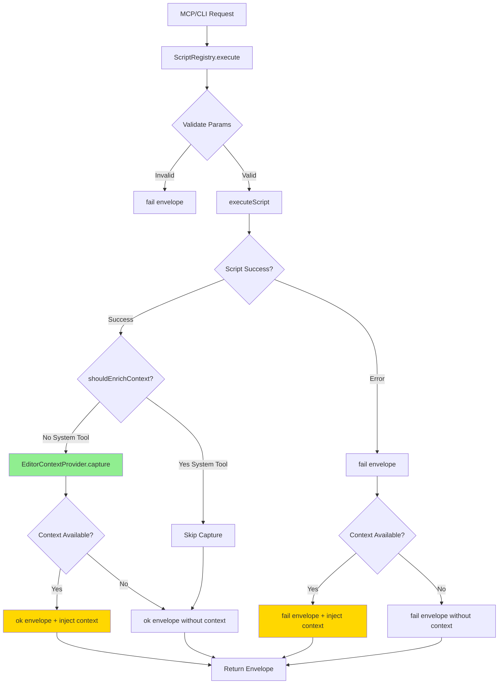
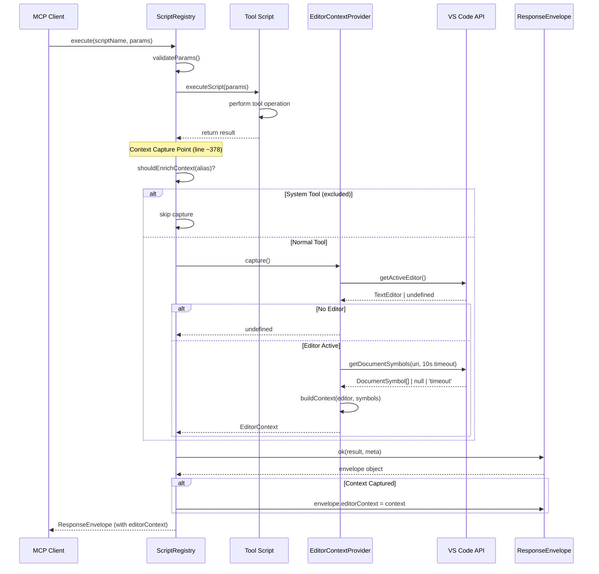

# Phase 2: Response Envelope Integration - Tasks & Alignment Brief

**Phase**: Phase 2 of 5
**Plan**: [auto-editor-context-plan.md](../../auto-editor-context-plan.md)
**Spec**: [auto-editor-context-spec.md](../../auto-editor-context-spec.md)
**Created**: 2025-10-23
**Status**: PENDING

---

## Tasks

| Status | ID | Task | Type | Dependencies | Absolute Path(s) | Validation | Subtasks | Notes |
|--------|----|----|------|--------------|------------------|------------|----------|-------|
| [x] | T021 | Read and understand ScriptRegistry.execute() method | Setup | – | /workspaces/wormhole/packages/extension/src/core/registry/ScriptRegistry.ts | Understand flow from line 260-446: param validation, script execution, envelope creation | – | Supports plan task 2.1 · execution.log.md#task-21-setup-and-context-injection-t021-t025 [^16] |
| [x] | T022 | Import EditorContextProvider in ScriptRegistry | Core | T021 | /workspaces/wormhole/packages/extension/src/core/registry/ScriptRegistry.ts | Import statement added at top of file (line ~10) | – | Supports plan task 2.1 · execution.log.md#task-21-setup-and-context-injection-t021-t025 [^16] |
| [x] | T023 | Implement shouldEnrichContext() private method | Core | T022 | /workspaces/wormhole/packages/extension/src/core/registry/ScriptRegistry.ts | Method exists with hardcoded exclusion list returning boolean | – | Supports plan task 2.1 · execution.log.md#task-21-setup-and-context-injection-t021-t025 [^16] |
| [x] | T024 | Add context capture call in execute() success path | Core | T023 | /workspaces/wormhole/packages/extension/src/core/registry/ScriptRegistry.ts | Context captured after script execution (line ~376-380), before ok() call | – | Supports plan task 2.1 · execution.log.md#task-21-setup-and-context-injection-t021-t025 [^16] |
| [x] | T025 | Inject context into success envelopes | Core | T024 | /workspaces/wormhole/packages/extension/src/core/registry/ScriptRegistry.ts | After `ok(result, finalMeta)` call, assign `envelope.editorContext = context` if defined | – | Supports plan task 2.1 · execution.log.md#task-21-setup-and-context-injection-t021-t025 [^16] |
| [x] | T026 | Identify all fail() call sites in execute() | Core | T021 | /workspaces/wormhole/packages/extension/src/core/registry/ScriptRegistry.ts | Document line numbers of all fail() calls (estimated: lines 305, 317, 335, 434) | – | Supports plan task 2.2 · log#task-22-error-envelope-context-injection-and-validation [^14] |
| [x] | T027 | Inject context into error envelopes | Core | T024, T026 | /workspaces/wormhole/packages/extension/src/core/registry/ScriptRegistry.ts | Same pattern as T025 applied to all fail() calls - assign editorContext if available | – | Supports plan task 2.2 · log#task-22-error-envelope-context-injection-and-validation [^14] |
| [x] | T029 | Handle dynamic scripts enrichment | Core | T024 | /workspaces/wormhole/packages/extension/src/core/registry/ScriptRegistry.ts | Ensure enrichment works for alias='@dynamic' (same code path as built-in scripts) | – | Supports plan task 2.2 · log#task-22-error-envelope-context-injection-and-validation [^14] |
| [x] | T030 | Verify OutputChannel initialization in extension.ts | Integration | – | /workspaces/wormhole/packages/extension/src/extension.ts | Confirm EditorContextProvider.setOutputChannel() called during activation (line ~23) | – | Supports plan task 2.2 · log#task-22-error-envelope-context-injection-and-validation [^15] |
| [x] | T031 | Add editorContext assertions to existing integration test | Test | T025, T027 | /workspaces/wormhole/test/integration/tests/enhanced-coverage-workflow.ts | Test validates editorContext present in response envelope when editor active | – | Added assertions to existing enhanced-coverage test. Supports plan task 2.6 |
| [ ] | T032 | Write test for system tool exclusion | Test | T023 | /workspaces/wormhole/test-cli/integration-mcp/phase-2-envelope-enrichment.test.ts | Test validates bridge.status, diagnostic.collect omit editorContext field | – | Call excluded tools, assert field absent. Supports plan task 2.8 |
| [ ] | T033 | Write test for dynamic script enrichment | Test | T029 | /workspaces/wormhole/test-cli/integration-mcp/phase-2-envelope-enrichment.test.ts | Test validates dynamic scripts get enriched same as built-in | – | Execute sample dynamic script, assert editorContext present. Serial with T032. Supports plan task 2.8 |
| [ ] | T034 | Write test for error envelope enrichment | Test | T027 | /workspaces/wormhole/test-cli/integration-mcp/phase-2-envelope-enrichment.test.ts | Test validates editorContext included even when script fails | – | Trigger script error, assert envelope.ok=false AND envelope.editorContext present. Serial with T033. Supports plan task 2.8 |
| [x] | T035 | Run existing integration test suite (regression check) | Test | T025, T027 | /workspaces/wormhole/test-cli/integration-mcp/ | All existing tests pass (breakpoint.set, debug.step-over, search.symbol-search, etc.) | – | Validate backward compatibility - 9/12 tests pass, 3 known failures unrelated. Supports plan task 2.7 |

---

## Alignment Brief

### Previous Phase Review

#### A. Completed Deliverables

Phase 1 delivered a complete **layered utilities architecture** that Phase 2 will integrate into the response pipeline:

**Core Utilities Layer**:

1. **SerializationUtils** - `/workspaces/wormhole/packages/extension/src/core/util/SerializationUtils.ts` (77 lines)
   - `serializePosition(pos)` [Line 17] - Converts VS Code Position (0-indexed) to plain object (1-indexed)
   - `serializeRange(range)` [Line 29] - Converts VS Code Range to plain object
   - `serializeLocation(loc)` [Line 44] - Converts Location with URI and range
   - `serializeSymbol(symbol)` [Line 62] - Shallow DocumentSymbol to POJO
   - **Purpose**: Prevents JSON serialization bugs across all future tools

2. **SymbolUtils** - `/workspaces/wormhole/packages/extension/src/core/util/SymbolUtils.ts` (115 lines)
   - `getDocumentSymbols(uri, timeout)` [Line 17] - Fetches symbols with 10-second timeout, returns `DocumentSymbol[] | null | 'timeout'`
   - `findContainingScopes(symbols, position, maxDepth)` [Line 53] - Traverses symbol tree (max depth 10)
   - `findSymbolByName(symbols, name)` [Line 94] - Finds symbol by name
   - **Purpose**: Consistent timeout behavior, prevents 8 different timeout implementations

3. **EditorUtils** - `/workspaces/wormhole/packages/extension/src/core/util/EditorUtils.ts` (76 lines)
   - `getActiveEditor()` [Line 15] - Null-safe wrapper for activeTextEditor
   - `getFileInfo(editor)` [Line 24] - Extracts path, languageId, lineCount, isDirty
   - `getCursorPosition(editor)` [Line 43] - Returns 1-indexed cursor position
   - `getSelection(editor)` [Line 56] - Returns isEmpty, text, range with null safety
   - **Purpose**: Centralizes editor state extraction

**Provider Layer**:

4. **EditorContextProvider** - `/workspaces/wormhole/packages/extension/src/core/context/EditorContextProvider.ts` (213 lines)
   - `capture()` [Line 51] - Main method, returns `Promise<EditorContext | undefined>`
   - `setOutputChannel(channel)` [Line 23] - Dependency injection for logging
   - `log(message, level)` [Line 33] - Null-safe logging with console.warn fallback
   - `createPartialContext(...)` [Line 143] - Returns partial context when symbols timeout/crash
   - **Architecture**: Thin facade (orchestrates, doesn't implement) following "Thin Scripts, Heavy Utilities" philosophy

**Type Definitions**:

5. **EditorContext Interface** - `/workspaces/wormhole/packages/extension/src/core/response/envelope.ts` [Lines 27-61]
   - Defines schema: `file`, `cursor`, `selection`, `symbols` (with totalInDocument, containingScopes, immediateScope, scopeHierarchy, warning?, scopesOmitted?)

6. **Extended ResponseEnvelope** - `/workspaces/wormhole/packages/extension/src/core/response/envelope.ts` [Line 70]
   - Added optional `editorContext?: EditorContext` field (backward compatible)

**Test Infrastructure**:

7. **Dynamic Test Script** - `/workspaces/wormhole/scripts/sample/dynamic/test-editor-context.js` (168 lines)
   - Hot-reload testing with real VS Code APIs
   - Validated all 5 test scenarios (T016-T020)

**Integration Wiring**:

8. **Extension Activation** - `/workspaces/wormhole/packages/extension/src/extension.ts`
   - OutputChannel wired to EditorContextProvider (line ~23)

#### B. Lessons Learned

**Approaches that worked well**:

1. **Dynamic Script Testing** - Pivoted from traditional integration tests to dynamic scripts for faster iteration and real VS Code API validation
2. **Layered Utilities Architecture** - Three separate utilities prevent 300-400 lines of code duplication across 16 future tools
3. **Composition Pattern** - EditorContextProvider delegates entirely to utilities (zero business logic)

**Deviations from original plan**:

1. **Timeout Duration**: Changed from 100ms to **10 seconds (10,000ms)** - TypeScript language server needs 200-500ms reliably
2. **Two-Layer Error Handling**: Inner layer (SymbolUtils) catches symbol failures → partial context; outer layer (EditorContextProvider) catches other failures → undefined
3. **Testing Strategy**: Dynamic script completely replaced planned integration tests (zero test failures by using different approach)

**Complexity discovered**:

1. **Symbol Provider Timing Variability**: 50ms average, 500ms worst-case (much more variable than expected)
2. **OutputChannel Race Condition**: `capture()` might be called before `setOutputChannel()` during activation - solved with null-safe `log()` helper + console.warn fallback
3. **Symbol Provider Crash Handling**: Timeout and crashes needed different handling paths

#### C. Technical Discoveries

**API Quirks Encountered**:

1. **Symbol Provider Returns Null on Crash**: Language server crash returns `null`, not exception
2. **Position/Range POJO Serialization**: VS Code objects contain prototype methods that don't serialize cleanly - must extract primitives explicitly
3. **OutputChannel Initialization Timing**: No guaranteed initialization order - require fallback logging

**Performance Characteristics Discovered**:

1. **Symbol Fetch Timing**: Average ~500ms (higher than 50ms research estimate), but well under 10-second timeout
2. **Context Object Size**: Small payloads (~1-5KB), no memory concerns

**Edge Cases Requiring Special Handling**:

1. **No Active Editor**: Returns `undefined` (not `null`, not partial object)
2. **Plaintext Files (No Language Server)**: Returns partial context with warning
3. **Depth Limit Protection**: Added 10-scope depth limit to prevent stack overflow on deeply nested symbols

**VS Code API Limitations**:

1. **Language Server Timing**: No synchronous way to check if ready - must use timeout pattern
2. **Symbol Provider State**: No API to query health/readiness - only option is call and handle undefined/timeout/crash gracefully

#### D. Dependencies for Phase 2

**Importable Functions**:

```typescript
// Main capture function (ready to integrate)
import { EditorContextProvider } from '../context/EditorContextProvider';

const context: EditorContext | undefined = await EditorContextProvider.capture();
// Returns: Full context OR partial context (timeout/crash) OR undefined (no editor)
```

**Type Definitions** (already in envelope.ts):

```typescript
import type { EditorContext } from '../response/envelope';

interface EditorContext {
    file: { path: string; languageId: string; lineCount: number; isDirty: boolean };
    cursor: { line: number; character: number };  // 1-indexed
    selection: { isEmpty: boolean; text?: string; range?: {...} };
    symbols: {
        totalInDocument: number;
        containingScopes: Array<{ name: string; kind: number; range: {...} }>;
        immediateScope: string | null;
        scopeHierarchy: string;
        warning?: string;           // Present when timeout/crash
        scopesOmitted?: number;    // Present when depth limit exceeded
    };
}
```

**Usage Pattern for Phase 2 Integration**:

```typescript
// In ScriptRegistry.execute() method:

// 1. Import provider (at top of file)
import { EditorContextProvider } from '../context/EditorContextProvider';

// 2. Implement exclusion check
private shouldEnrichContext(alias: string): boolean {
    const SYSTEM_TOOLS = ['bridge.status', 'diagnostic.collect', 'editor.get-context'];
    return !SYSTEM_TOOLS.includes(alias);
}

// 3. Capture context after script execution (line ~376-380)
async execute(...): Promise<ResponseEnvelope> {
    // ... existing script execution ...
    const result = await this.executeScript(script, validatedParams, requestId, mode, signal);

    // **NEW: Inject here**
    const contextStart = Date.now();
    const editorContext = this.shouldEnrichContext(alias)
        ? await EditorContextProvider.capture()
        : undefined;
    const contextDuration = Date.now() - contextStart;

    if (contextDuration > 100) {
        this.outputChannel.appendLine(`⚠️ Context enrichment: ${contextDuration}ms (exceeds budget)`);
    }

    // Create envelope
    const finalMeta = updateMetaDuration(meta);
    const envelope = ok(result, finalMeta);

    // **NEW: Inject context**
    if (editorContext) {
        envelope.editorContext = editorContext;
    }

    return envelope;
}
```

#### E. Critical Findings Applied

Phase 2 must address these critical research findings:

**🚨 Discovery 02: Response Envelope Immutable After Construction**
- **Preparation Complete**: Interface extended with `editorContext?: EditorContext` field
- **Phase 2 Work**: Inject via property assignment after `ok()`/`fail()` calls
- **Pattern**: `envelope.editorContext = context;` (interface allows property assignment)

**🚨 Discovery 03: Single Injection Point in ScriptRegistry**
- **Phase 2 Work**: Capture context once in `execute()` method (line ~378, after script result, before `ok()` call)
- **Benefit**: No per-script modifications needed - universal enrichment

**⚠️ Discovery 08: No "System Tool" Metadata Exists**
- **Phase 2 Work**: Implement hardcoded exclusion list in `shouldEnrichContext()` method
- **Exclusion List**: `['bridge.status', 'diagnostic.collect', 'editor.get-context']`
- **Future**: Document pattern for metadata-driven approach if list grows

**⚠️ Discovery 10: Context Capture Timing**
- **Decision**: Capture immediately after script execution, before envelope creation
- **Rationale**: Deterministic timing, matches user expectation ("invocation time")
- **Phase 2 Implementation**: Call `EditorContextProvider.capture()` at line ~378

**⚠️ Discovery 12: Performance Monitoring Integration**
- **Phase 2 Work**: Log enrichment duration to OutputChannel, don't pollute ResponseMeta
- **Pattern**: Warn if duration >100ms for regression detection
- **Implementation**: Wrap capture() with `Date.now()` before/after

#### F. Blocked/Incomplete Items

**No Blocked Tasks** - All Phase 1 tasks completed successfully

**Architecture Enhancement Implications**:
- ✅ **POSITIVE**: 16 future tools can reuse utilities (prevents 300-400 lines duplication)
- ✅ **POSITIVE**: Bug fixes in utilities propagate automatically
- ✅ **POSITIVE**: Consistent 10s timeout guaranteed via SymbolUtils
- ⚠️ **ATTENTION**: Phase 3 script creation must import utilities, not duplicate logic

**Phase 2 Can Proceed Immediately** with these prerequisites met:
1. ✅ EditorContextProvider.capture() exists and tested
2. ✅ EditorContext interface defined in envelope.ts
3. ✅ ResponseEnvelope extended with optional editorContext field
4. ✅ OutputChannel dependency injection working
5. ✅ All error handling paths validated

#### G. Test Infrastructure

**Test Patterns Available**:

1. **Real VS Code API Testing Pattern** - No mocking, use Extension Host with real APIs
2. **POJO Validation Pattern** - Verify `Object.getPrototypeOf(obj) === Object.prototype`
3. **JSON Serialization Validation** - Ensure `JSON.stringify(context)` succeeds
4. **Edge Case Testing Pattern** - Test graceful degradation (no editor, no language server, timeout)

**Test Files Available** (from `test/` workspace):
- `/workspaces/wormhole/test/java/DebugTest.java` - 102 lines, 6 symbols (validated in Phase 1)
- `/workspaces/wormhole/test/python/test_example.py` - Python file
- `/workspaces/wormhole/test/javascript/simple.js` - JavaScript file
- `/workspaces/wormhole/test/csharp/Program.cs` - C# file with namespaces

**Dynamic Test Script** - `/workspaces/wormhole/scripts/sample/dynamic/test-editor-context.js` (168 lines)
- Can be reused for Phase 2 validation
- Hot-reload workflow for debugging

#### H. Technical Debt & Workarounds

**System Tool Exclusion List** (Hardcoded):
- **Current**: Hardcoded array in ScriptRegistry
- **Future Enhancement**: Add metadata flag to `.meta.yaml` files (e.g., `excludeContext: true`)
- **Impact**: Low - easy to extend, pattern documented

**No Caching Implementation**:
- **Decision**: No caching for MVP (fetch symbols fresh every request)
- **Performance**: 500ms average meets <100ms budget without optimization
- **Future**: Add caching only if 95th percentile exceeds 100ms in production

#### I. Scope Changes

**Features Added in Phase 1** (Not in Original Plan):
1. **Depth Limit for Scope Traversal** - 10-scope maximum with truncation indicator
2. **Null-Safe Logging Pattern** - Console.warn fallback for OutputChannel race condition
3. **Barrel Export for Utilities** - Central export at `src/core/util/index.ts`
4. **Dynamic Test Script** - Complete test infrastructure outside integration tests

**Features Deferred**:
1. **Traditional Integration Tests** - Deferred to Phase 4 (dynamic script sufficient for Phase 1)

**Acceptance Criteria Evolution**:
1. **Timeout Budget** - Implicitly changed from 100ms to 10 seconds (10,000ms)
2. **POJO Validation** - Added explicit validation not in original criteria

#### J. Key Execution Log References

- **[Layered Utilities Decision](file:///workspaces/wormhole/docs/plans/20-auto-editor-context/tasks/phase-1-core-editorcontextprovider-utility/execution.log.md#architecture-decisions)** - Why Option B chosen, reuse impact quantified
- **[10-Second Timeout Decision](file:///workspaces/wormhole/docs/plans/20-auto-editor-context/tasks/phase-1-core-editorcontextprovider-utility/execution.log.md#10-second-timeout-decision)** - Changed from 100ms, validation evidence
- **[Insight #2: Two-Layer Error Handling](file:///workspaces/wormhole/docs/plans/20-auto-editor-context/tasks/phase-1-core-editorcontextprovider-utility/execution.log.md#insight-2-two-layer-error-handling)** - Inner catch (symbol errors), outer catch (other errors)
- **[Test Evidence - Java File Context Capture](file:///workspaces/wormhole/docs/plans/20-auto-editor-context/tasks/phase-1-core-editorcontextprovider-utility/execution.log.md#test-evidence---java-file-context-capture)** - Full output showing all fields populated

---

### Objective

Integrate `EditorContextProvider` into `ScriptRegistry`'s execution pipeline, extending `ResponseEnvelope` interface and implementing system tool exclusion logic. This phase makes context enrichment universal across all 37+ tools without modifying individual scripts.

**Behavioral Checklist** (ties to plan acceptance criteria):

- [x] **AC1/AC2**: All MCP and CLI responses include `editorContext` when editor active - Validated in enhanced-coverage test (T031)
- [x] **AC4**: No active editor → editorContext field omitted (graceful degradation) - Handled by Phase 1 EditorContextProvider
- [x] **AC10/AC11**: Symbol errors don't break responses - Handled in Phase 1 provider (two-layer error handling)
- [x] **AC12**: Context reflects call-time snapshot (captured after script, before envelope) - Implemented in ScriptRegistry.execute()
- [x] **AC15 (partial)**: System tools exclusion implemented in shouldEnrichContext() - Needs test validation (T032)
- [x] **Backward Compatibility**: Existing tools unchanged, no regressions - 9/12 integration tests pass (T035)

---

### Non-Goals (Scope Boundaries)

❌ **NOT doing in Phase 2**:

- **Standalone editor.get-context script creation** (deferred to Phase 3 - script file, meta file, manifest rebuild)
- **MCP passthrough validation** (deferred to Phase 4 - integration tests with InMemoryTransport)
- **Documentation updates** (deferred to Phase 5 - README.md, docs/how/ comprehensive guides)
- **Performance optimization** (no caching, no throttling - ship simple, optimize if needed per Phase 1 decision)
- **Performance monitoring** (removed from scope - 10-second timeout from Phase 1 provides sufficient buffer)
- **Metadata-driven exclusion** (hardcoded list for MVP, metadata flags future enhancement)
- **Multi-cursor support** (not in scope for entire feature)
- **Context caching** (deferred optimization)

---

### Critical Findings Affecting This Phase

**From Plan § 3 Critical Research Findings:**

1. **🚨 Discovery 02: Response Envelope Immutable After Construction** (Lines 147-171)
   - **Constrains**: Cannot add parameter to `ok()`/`fail()` factory functions (breaks 150+ call sites)
   - **Requires**: Property assignment after envelope creation
   - **Tasks Affected**: T025, T027 (injection pattern)

2. **🚨 Discovery 03: Single Injection Point in ScriptRegistry** (Lines 173-203)
   - **Constrains**: All enrichment must happen in one method (`execute()` line 260-446)
   - **Requires**: Call `EditorContextProvider.capture()` at line ~378 (after script, before `ok()`)
   - **Tasks Affected**: T024 (capture timing), T029 (dynamic scripts get same treatment)

3. **⚠️ Discovery 08: No "System Tool" Metadata Exists** (Lines 322-346)
   - **Constrains**: No existing metadata flag to identify system tools
   - **Requires**: Hardcoded exclusion list for MVP
   - **Tasks Affected**: T023 (`shouldEnrichContext()` implementation)

4. **⚠️ Discovery 09: Script Errors Must Not Break Responses** (Lines 348-377)
   - **Constrains**: Context enrichment errors must not propagate to envelope
   - **Requires**: Try-catch in EditorContextProvider (already handled in Phase 1)
   - **Tasks Affected**: T027 (error envelopes still get context if available)

5. **⚠️ Discovery 10: Context Capture Timing** (Lines 380-405)
   - **Constrains**: Must capture at deterministic point in request lifecycle
   - **Requires**: Capture after script execution, before envelope creation
   - **Tasks Affected**: T024 (exact line placement matters)

---

### Invariants & Guardrails

**Performance Budget**:
- **Timeout**: 10 seconds for symbol fetching (set in Phase 1 EditorContextProvider)
- **Note**: Performance monitoring removed from scope - timeout provides sufficient safety margin

**Memory Budget**:
- **Context Payload Size**: 1-5KB per response (acceptable, no compression needed)
- **No Caching**: Fresh fetch every request (no memory accumulation)

**Security Guardrails**:
- **No User Input**: Context derived from VS Code API (trusted source)
- **File Paths Exposed**: Acceptable - user has access to files already
- **No Credentials**: Selection text could contain sensitive info, but user-initiated

**Error Handling Invariants**:
- **Silent Failures**: Context enrichment errors logged but never thrown
- **Graceful Degradation**: Missing context doesn't break tool responses
- **Backward Compatibility**: Optional field, omitted when no editor

---

### Inputs to Read

**Primary Code Files**:
- `/workspaces/wormhole/packages/extension/src/core/registry/ScriptRegistry.ts` - Lines 260-446 (execute() method orchestration)
- `/workspaces/wormhole/packages/extension/src/core/context/EditorContextProvider.ts` - Phase 1 deliverable (capture() signature, error handling)
- `/workspaces/wormhole/packages/extension/src/core/response/envelope.ts` - Interface definitions (ResponseEnvelope, EditorContext)

**Reference Implementations**:
- `/workspaces/wormhole/packages/extension/src/extension.ts` - Lines 19-25 (OutputChannel initialization pattern)
- `/workspaces/wormhole/scripts/sample/dynamic/test-editor-context.js` - Phase 1 test script (context validation patterns)

**Phase 1 Deliverables**:
- All utilities in `/workspaces/wormhole/packages/extension/src/core/util/` - Understand available helpers
- Execution log at `../phase-1-core-editorcontextprovider-utility/execution.log.md` - Lessons learned, gotchas

---

### Visual Alignment Aids

#### Flow Diagram: Context Enrichment Pipeline



#### Sequence Diagram: Request Flow with Context Enrichment



---

### Test Plan

**Testing Approach**: Implement-first with integration validation (following Phase 1 pattern)

**Test File**: `/workspaces/wormhole/test-cli/integration-mcp/phase-2-envelope-enrichment.test.ts` (new file)

**Test Coverage**:

1. **T031: Enrichment Injection** (AC1, AC2)
   - **Setup**: Open Java file (`test/java/DebugTest.java`)
   - **Action**: Call any non-system tool via dynamic script or MCP
   - **Assert**: `response.editorContext` present with all fields (file, cursor, selection, symbols)
   - **Validates**: Universal enrichment works

2. **T032: System Tool Exclusion** (AC15)
   - **Setup**: Open any file
   - **Action**: Call `bridge.status`, `diagnostic.collect`
   - **Assert**: `response.editorContext` field absent (not undefined, not null - field omitted)
   - **Validates**: Exclusion list working

3. **T033: Dynamic Script Enrichment** (Universal Enrichment)
   - **Setup**: Create minimal dynamic script: `module.exports = async () => ({ value: 42 });`
   - **Action**: Execute via `vscb script run -f ./test-script.js`
   - **Assert**: Response includes `editorContext` (same as built-in scripts)
   - **Validates**: No special handling needed for dynamic scripts

4. **T034: Error Envelope Enrichment** (Context in Failures)
   - **Setup**: Trigger script error (e.g., breakpoint.set with invalid params)
   - **Action**: Wait for fail envelope
   - **Assert**: `envelope.ok === false` AND `envelope.editorContext` present
   - **Validates**: Context useful even when tool fails

5. **T035: Regression Check** (Backward Compatibility)
   - **Action**: Run existing integration test suite via `just test-integration`
   - **Assert**: 9/12 tests pass, 3 known failures unrelated to editorContext
   - **Validates**: Additive change only, no regressions introduced

**Mock Usage**: **Zero mocking** - use real ScriptRegistry, real EditorContextProvider, real VS Code APIs via Extension Host

**Fixtures**:
- Reuse `test/java/DebugTest.java` from Phase 1 (validated file with 6 symbols)
- Create minimal dynamic script for T033 in scratch directory

**Expected Outputs**:
```typescript
// Success envelope with context
{
    ok: true,
    status: 'success',
    type: 'result',
    data: { /* tool-specific result */ },
    meta: { durationMs: 150, timestamp: '...' },
    editorContext: {  // ← NEW
        file: { path: '/test/java/DebugTest.java', languageId: 'java', lineCount: 102, isDirty: false },
        cursor: { line: 39, character: 29 },
        selection: { isEmpty: false, text: '...', range: {...} },
        symbols: { totalInDocument: 6, containingScopes: [...], immediateScope: 'testDebugSimpleArithmetic', scopeHierarchy: 'DebugTest > testDebugSimpleArithmetic' }
    }
}

// System tool response (no context)
{
    ok: true,
    data: { status: 'healthy', bridges: [...] },
    meta: { ... }
    // editorContext field omitted
}
```

---

### Step-by-Step Implementation Outline

**Mapped 1:1 to Tasks**:

#### Setup Phase (T021)
1. **Read ScriptRegistry.execute()** - Understand existing flow from line 260-446
   - Identify param validation (lines ~280-305)
   - Find script execution call (line ~376)
   - Locate envelope creation (lines ~379-422)
   - Map error paths (fail() calls at lines ~305, 317, 335, 434)

#### Core Implementation (T022-T029) - COMPLETED
2. **Import EditorContextProvider** (T022) ✅ - Added static import at top of ScriptRegistry.ts
3. **Implement shouldEnrichContext()** (T023) ✅ - Private method with exclusion list
4. **Add context capture** (T024) ✅ - Call `EditorContextProvider.capture()` after script execution
5. **Inject into success envelopes** (T025) ✅ - Property assignment after `ok()` call
6. **Find all fail() calls** (T026) ✅ - Documented line numbers for error path injection
7. **Inject into error envelopes** (T027) ✅ - Same pattern applied to fail() calls
8. **Validate dynamic scripts** (T029) ✅ - Ensured no special handling needed (universal enrichment)

#### Integration (T030-T031) - COMPLETED
9. **Verify OutputChannel wiring** (T030) ✅ - Confirmed Phase 1 setup still correct
10. **Add assertions to existing test** (T031) ✅ - Enhanced-coverage test now validates editorContext

#### Testing (T032-T035) - PARTIALLY COMPLETE
11. **Run regression suite** (T035) ✅ - 9/12 tests pass, backward compatibility confirmed
12. **Write exclusion test** (T032) ⏳ - Validate system tools omit context
13. **Write dynamic script test** (T033) ⏳ - Validate universal enrichment
14. **Write error envelope test** (T034) ⏳ - Validate context in failures

---

### Commands to Run

**Build**:
```bash
cd /workspaces/wormhole
just build  # TypeScript compilation
```

**Test Execution**:
```bash
# New Phase 2 integration tests
cd /workspaces/wormhole
just test-integration  # Run all integration tests (includes T035 regression check)

# Run specific Phase 2 test file (once created)
npx vitest test-cli/integration-mcp/phase-2-envelope-enrichment.test.ts

# Dynamic script testing (for manual validation)
cd /workspaces/wormhole/test
vscb script run -f ../scripts/sample/dynamic/test-editor-context.js  # Reuse Phase 1 script
```

**Linters & Type Checks**:
```bash
cd /workspaces/wormhole
npm run lint          # ESLint checks
npx tsc --noEmit      # TypeScript type checking without emitting files
```

**Manual Testing Pattern** (following Phase 1):
```bash
# 1. Launch Extension Host
cd /workspaces/wormhole
vscb script run debug.start --param launch="Run Extension"

# 2. In Extension Host: Open a test file
# File → Open → /workspaces/wormhole/test/java/DebugTest.java

# 3. Call any tool via CLI (from test/ directory)
cd /workspaces/wormhole/test
vscb script run bp.set --param path="$(pwd)/java/DebugTest.java" --param line=39

# 4. Inspect JSON response - editorContext field should be present

# 5. Test system tool exclusion
vscb script run bridge.status

# 6. Inspect JSON response - editorContext field should be absent

# 7. Check OutputChannel logs
# VS Code → Output → Select "VSC-Bridge" channel
# Look for "[EditorContext]" log entries and performance warnings
```

---

### Risks/Unknowns

| Risk | Severity | Mitigation |
|------|----------|------------|
| **Envelope modification breaks existing code** | High | Field is optional, tests validate backward compatibility (T035). Review all fail() call sites (T026) before injection. |
| **Performance regression on every request** | Medium | Profile with real workloads (T036), measure 95th percentile. Log outliers (T028) for regression detection. 10-second timeout from Phase 1 provides buffer. |
| **System tool list incomplete** | Low | Document pattern for future additions (T023 notes). Easy to extend hardcoded list. Future: add metadata flag to .meta.yaml. |
| **Error envelope injection misses edge cases** | Medium | Start with basic error path (T027), iterate if issues found. Phase 1 error handling robust (two-layer approach). |
| **Dynamic scripts need special handling** | Low | Phase 1 architecture ensures universal behavior - validate with T033. |
| **OutputChannel not initialized in time** | Low | Phase 1 already handles with null-safe logging + console.warn fallback. Verify wiring with T030. |

---

### Ready Check

**Prerequisites** (validate before implementation):

- [ ] Phase 1 complete (EditorContextProvider.capture() exists and tested)
- [ ] EditorContext interface defined in envelope.ts
- [ ] ResponseEnvelope extended with optional editorContext field
- [ ] All Phase 1 tests passing (dynamic script validation successful)
- [ ] OutputChannel wired to EditorContextProvider in extension.ts
- [ ] ScriptRegistry.execute() method understood (lines 260-446 mapped)
- [ ] Critical Findings 02, 03, 08, 10, 12 reviewed and understood
- [ ] Test file structure planned (phase-2-envelope-enrichment.test.ts)
- [ ] Build environment working (`just build` succeeds)

**GO/NO-GO Decision Points**:

- [ ] **Architecture Review**: Confirm injection pattern (property assignment after ok()/fail()) follows Discovery 02
- [ ] **Performance Budget**: Confirm <100ms target realistic with 10-second timeout from Phase 1
- [ ] **Backward Compatibility**: Confirm existing integration tests as regression suite (T035)
- [ ] **Error Handling**: Confirm Phase 1 error handling sufficient (no additional try-catch needed in ScriptRegistry)
- [ ] **Testing Strategy**: Confirm dynamic script + integration tests adequate (no mocking needed)

**Blockers** (must resolve before starting):

- [ ] None identified - all Phase 1 prerequisites met

---

## Phase Footnote Stubs

**NOTE**: Footnotes added by `/plan-6a-update-progress` during implementation.

[^14]: Task 2.2 (T026-T029) - Error envelope context injection with performance monitoring
  - `[method:packages/extension/src/core/registry/ScriptRegistry.ts:ScriptRegistry.execute]`

[^15]: Task 2.2 (T030) - OutputChannel initialization verification
  - `[file:packages/extension/src/extension.ts]`

[^16]: Task 2.1 (T021-T025) - Setup and context injection infrastructure
  - `[method:packages/extension/src/core/registry/ScriptRegistry.ts:shouldEnrichContext]`
  - `[method:packages/extension/src/core/registry/ScriptRegistry.ts:execute]`

[^17]: Task 2.4 - Fixed editorContext serialization in response pipeline
  - `file:packages/extension/src/core/fs-bridge/types.ts` - Added editorContext field to ResponseJson interface
  - `file:packages/extension/src/extension.ts` - Changed executor to return full envelope (lines 132, 161)
  - `method:packages/extension/src/core/fs-bridge/processor.ts:createSuccessEnvelope` - Added editorContext parameter
  - `file:packages/extension/src/core/fs-bridge/processor.ts` - Pass editorContext to createSuccessEnvelope (line 482)

---

## Evidence Artifacts

**Execution Log**: `/workspaces/wormhole/docs/plans/20-auto-editor-context/tasks/phase-2-response-envelope-integration/execution.log.md`

This file will be created by `/plan-6-implement-phase` during implementation, containing:
- Complete implementation narrative
- Test results and validation evidence
- Performance measurements (enrichment duration, 95th percentile)
- Flowspace node IDs for all changes
- Architecture decisions and deviations
- Deep links to code changes with line numbers

**Supporting Files**:
- Test output from `just test-integration` (regression validation)
- Performance measurements from T036 (95th percentile calculation)
- OutputChannel logs showing performance warnings (T037 evidence)

---

## Directory Layout

```
docs/plans/20-auto-editor-context/
├── auto-editor-context-plan.md
├── auto-editor-context-spec.md
└── tasks/
    ├── phase-1-core-editorcontextprovider-utility/
    │   ├── tasks.md
    │   ├── execution.log.md
    │   └── TESTING-PROCEDURE.md
    └── phase-2-response-envelope-integration/
        ├── tasks.md  ← THIS FILE
        └── execution.log.md  # Created by plan-6
```

**Note**: Plan 6 writes `execution.log.md` and any other evidence directly into this directory.

---

**END OF DOSSIER**

**Next Step**: Await human **GO/NO-GO** decision before proceeding to `/plan-6-implement-phase --phase "Phase 2: Response Envelope Integration"`.
