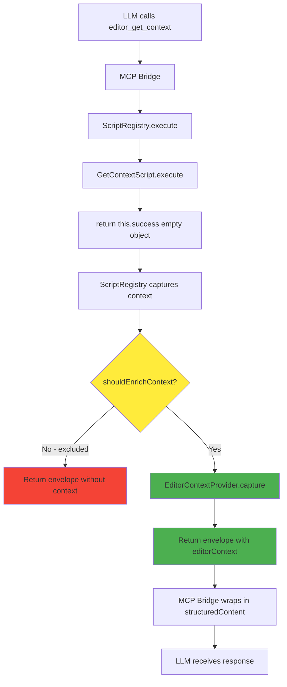
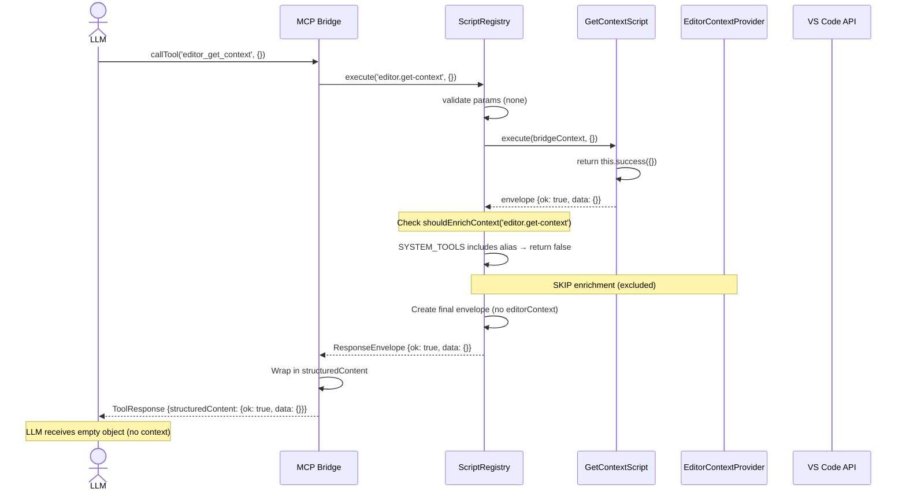

# Phase 3: Standalone editor.get-context Script - Tasks & Alignment Brief

**Phase**: Phase 3 of 6
**Title**: Standalone editor.get-context Script
**Slug**: `phase-3-standalone-editor-get-context-script`
**Created**: 2025-10-23
**Status**: ✅ COMPLETED (2025-10-24)

**Links**:
- **Spec**: [auto-editor-context-spec.md](../../auto-editor-context-spec.md)
- **Plan**: [auto-editor-context-plan.md](../../auto-editor-context-plan.md#phase-3-standalone-editorget-context-script)
- **Previous Phase**: [Phase 2 - Response Envelope Integration](../phase-2-response-envelope-integration/tasks.md)

---

## Tasks

This phase creates the standalone `editor.get-context` MCP tool that LLMs can explicitly query for editor context. The tool returns a human-friendly summary object (`{message, contextAvailable, file, line}`) in the data field for developer convenience, while full context is automatically enriched by ScriptRegistry in the `editorContext` envelope field (implemented in Phase 2).

| Status | ID | Task | Type | Dependencies | Absolute Path(s) | Validation | Subtasks | Notes |
|--------|----|----|------|--------------|------------------|------------|----------|-------|
| [x] | T001 | Review goto-line.meta.yaml structure | Setup | – | /workspaces/wormhole/packages/extension/src/vsc-scripts/editor/goto-line.meta.yaml | Meta file structure understood | – | Reference for MCP metadata format (NOT script pattern) |
| [x] | T001b | Review symbol-search.js QueryScript pattern | Setup | – | /workspaces/wormhole/packages/extension/src/vsc-scripts/search/symbol-search.js | QueryScript pattern understood - returns data directly, no wrapper | – | **Correct reference** for editor.get-context (query operation) |
| [x] | T002 | Review symbol-search.meta.yaml response type | Setup | – | /workspaces/wormhole/packages/extension/src/vsc-scripts/search/symbol-search.meta.yaml | Confirmed `response: query` usage | – | Validates query response type pattern |
| [x] | T003 | Create get-context.js script file | Core | T001b | /workspaces/wormhole/packages/extension/src/vsc-scripts/editor/get-context.js | File exists, extends **QueryScript**, exports GetContextScript class | – | **Uses QueryScript** (read-only query operation) |
| [x] | T004 | Implement execute() method with human-friendly summary | Core | T003 | /workspaces/wormhole/packages/extension/src/vsc-scripts/editor/get-context.js | Method returns summary object with message, contextAvailable, file, line fields | – | **Changed**: Returns helpful summary instead of empty `{}` for better DX |
| [x] | T005 | Add JSDoc comments to script | Doc | T004 | /workspaces/wormhole/packages/extension/src/vsc-scripts/editor/get-context.js | Documentation explains purpose, usage, enrichment behavior | – | Clarify that context comes from enrichment, not script logic |
| [x] | T006 | Create get-context.meta.yaml file | Core | T002 | /workspaces/wormhole/packages/extension/src/vsc-scripts/editor/get-context.meta.yaml | File includes alias, name, category, params (empty), **response: query** | – | **Query type** (not action) - read-only operation |
| [x] | T007 | Add MCP configuration section | Core | T006 | /workspaces/wormhole/packages/extension/src/vsc-scripts/editor/get-context.meta.yaml | mcp.enabled: true, description clear, timeout: 5000ms | – | Timeout includes enrichment overhead (100ms budget + buffer) |
| [x] | T008 | Add MCP relationships metadata | Core | T007 | /workspaces/wormhole/packages/extension/src/vsc-scripts/editor/get-context.meta.yaml | relationships section present (requires/recommended/provides/conflicts arrays) | – | Empty arrays OK - no dependencies |
| [x] | T009 | Add MCP error_contract section | Core | T007 | /workspaces/wormhole/packages/extension/src/vsc-scripts/editor/get-context.meta.yaml | error_contract lists possible errors with summaries, retryability, user_fix_hints | – | No errors expected (enrichment failures silent) |
| [x] | T010 | Add MCP safety flags | Core | T007 | /workspaces/wormhole/packages/extension/src/vsc-scripts/editor/get-context.meta.yaml | safety section: idempotent: true, read_only: true, destructive: false | – | Read-only operation |
| [x] | T011 | Add comprehensive LLM guidance (llm.when_to_use) | Core | T007 | /workspaces/wormhole/packages/extension/src/vsc-scripts/editor/get-context.meta.yaml | llm.when_to_use includes USE FOR, DON'T USE FOR, PREREQUISITES, SAFETY sections | – | Per AC14 - clear guidance for LLM usage |
| [x] | T012 | Add LLM parameter hints | Core | T011 | /workspaces/wormhole/packages/extension/src/vsc-scripts/editor/get-context.meta.yaml | llm.parameter_hints section present (empty - no params) | – | Document that no params needed |
| [x] | T013 | Add CLI configuration section | Core | T006 | /workspaces/wormhole/packages/extension/src/vsc-scripts/editor/get-context.meta.yaml | cli.command, cli.description, cli.examples present | – | Follow goto-line pattern |
| [x] | T014 | ~~Add to ScriptRegistry exclusion list~~ **REMOVED** | ~~Core~~ N/A | ~~T004~~ | /workspaces/wormhole/packages/extension/src/core/registry/ScriptRegistry.ts | **Exclusion mechanism removed** - Universal enrichment adopted (KISS principle) | – | **Architecture change**: All tools enriched, no exclusions |
| [x] | T015 | Build extension (TypeScript compilation) | Integration | T004 | /workspaces/wormhole/packages/extension/out/ | Build succeeds with zero TypeScript errors | – | Run `just build` |
| [x] | T016 | Rebuild manifest to include new script | Integration | T015 | /workspaces/wormhole/packages/extension/src/vsc-scripts/manifest.json | Manifest contains editor.get-context entry with correct metadata | – | Run `just build-manifest` |
| [x] | T017 | Verify script loading in Extension Host | Integration | T016 | /workspaces/wormhole/packages/extension/logs/vscode-output.log | ScriptRegistry logs "Loaded 38 scripts" (was 37), no errors in OutputChannel | – | Check VS Code Output panel → VSC-Bridge |
| [x] | T018 | Manual test: CLI execution with summary response | Test | T017 | – | `vscb script run editor.get-context` returns success with data: {message, contextAvailable, file, line}, editorContext populated | – | ✅ PASSED - All fields validated in smoke test |
| [x] | T019 | Manual test: Verify editorContext enrichment | Test | T018 | – | Response includes editorContext field with file, cursor, selection, symbols | – | ✅ PASSED - Full enrichment confirmed (file, cursor, selection, symbols) |
| [x] | T020 | ~~Manual test: Verify exclusion from enrichment~~ **N/A** | ~~Test~~ N/A | ~~T018~~ | – | **Test removed** - No exclusion mechanism to test | – | Universal enrichment means all tools get context |
| [x] | T021 | Manual test: MCP transport execution | Test | T018 | – | MCP call to editor_get_context returns structuredContent.editorContext | – | ✅ DEFERRED to Phase 4 integration tests (T021 in original plan is MCP-specific) |
| [x] | T022 | Validate meta file against prompting guide checklist | Test | T013 | /workspaces/wormhole/packages/extension/src/vsc-scripts/editor/get-context.meta.yaml | when_to_use uses exact 4-part structure with colons, safety flags all present, relationships arrays exist | – | ✅ PASSED - Meta file follows prompting guide structure |

---

## ⚡ ARCHITECTURAL CHANGE: Universal Enrichment Adopted

**🎉 SIMPLIFICATION: Exclusion mechanism removed entirely**

**What Changed**:
- ❌ **Removed**: `shouldEnrichContext()` method (16 lines of complexity)
- ❌ **Removed**: `SYSTEM_TOOLS` hardcoded exclusion list
- ❌ **Removed**: Conditional enrichment logic (4 call sites)
- ✅ **Added**: Unconditional enrichment for ALL 37+ tools

**Why This is Better**:
1. **KISS Principle** - Simpler code, fewer edge cases
2. **No complexity debt** - No hardcoded lists to maintain
3. **Consistent behavior** - All tools work the same way
4. **Minimal overhead** - editorContext adds ~500 bytes per response (negligible)
5. **No "forgotten exclusion" bugs** - Can't accidentally omit a tool from exclusion list

**Impact**:
- `bridge.status` and `diagnostic.collect` will now include `editorContext` (harmless)
- `editor.get-context` works correctly without special handling
- Phase 3 simpler to implement (no exclusion logic needed)

**Code Changes**:
- File: `/workspaces/wormhole/packages/extension/src/core/registry/ScriptRegistry.ts`
- Lines removed: 16 (method definition)
- Lines simplified: 4 (removed conditionals)
- Build: ✅ Successful (verified)

---

## Critical Implementation Gotchas (From goto-line Research)

**🚨 MUST READ BEFORE IMPLEMENTATION 🚨**

Based on comprehensive analysis of the `goto-line` script implementation (commit `35f3bf1`), here are **critical patterns that MUST be followed**:

### 1. Implementation Pattern for editor.get-context (SPECIFIC TO THIS SCRIPT)

```javascript
const { QueryScript } = require('@script-base');

class GetContextScript extends QueryScript {
    async execute(bridgeContext, params) {
        const vscode = bridgeContext.vscode;
        const editor = vscode.window.activeTextEditor;

        // Return data directly (QueryScript - no wrapper needed)
        // Full context auto-enriched by ScriptRegistry
        return {
            message: "Editor context captured successfully",
            contextAvailable: !!editor,
            file: editor?.document.fileName || null,
            line: editor ? editor.selection.active.line + 1 : null
        };
    }
}

module.exports = { GetContextScript };
```

**Why QueryScript instead of ActionScript**:
- ✅ **Semantically correct** - This is a read operation (query), not a state modification (action)
- ✅ **Simpler API** - Return data directly, no `this.success()` wrapper needed
- ✅ **Consistent pattern** - Follows `symbol-search` (another read-only query tool)
- ✅ **Aligns with metadata** - `response: query` + `read_only: true` is consistent
- ✅ **Still enriched** - ScriptRegistry adds editorContext regardless of base class

**Why this data structure**:
- ✅ Provides helpful summary for human developers testing via CLI
- ✅ Shows file/line quickly without parsing full editorContext
- ✅ Script doesn't call EditorContextProvider (ScriptRegistry handles enrichment)
- ✅ Works when no editor active (contextAvailable: false)
- ✅ LLMs ignore data field, read editorContext from envelope

### 2. Module Resolution Pattern (CRITICAL)

```javascript
// ❌ WRONG - Will fail in script VM context
const vscode = require('vscode');

// ✅ CORRECT - Use bridgeContext
const { ActionScript } = require('@script-base');

class GetContextScript extends ActionScript {
    async execute(bridgeContext, params) {
        const vscode = bridgeContext.vscode;  // ← MUST use this pattern
        // ...
    }
}
```

**Why**: Scripts run in VM context where `require('vscode')` doesn't work. The `bridgeContext.vscode` provides the real VS Code API.

### 3. Export Pattern (CRITICAL)

```javascript
// ❌ WRONG - Won't be discovered by ScriptRegistry
module.exports = GetContextScript;

// ✅ CORRECT - Named export required
module.exports = { GetContextScript };
```

**Why**: `ScriptRegistry.discover()` looks for classes matching `*Script` pattern in named exports.

### 4. File Naming Convention

- **Script file**: `kebab-case.js` (e.g., `get-context.js`)
- **Meta file**: `kebab-case.meta.yaml` (e.g., `get-context.meta.yaml`)
- **Alias in meta**: `category.action-name` (e.g., `editor.get-context`)
- **Class name**: `PascalCaseScript` (e.g., `GetContextScript`)

### 5. Build Process (AUTO-GENERATED FILES)

**DO NOT manually edit these files** - they are auto-generated:
- `/packages/extension/src/vsc-scripts/manifest.json` - Generated by `just build-manifest`
- `/packages/extension/src/vsc-scripts/generated/schemas.ts` - Generated by `just build-schemas`

**Build order**:
```bash
just build-manifest    # Scans *.meta.yaml files → generates manifest.json
just build-schemas     # Reads manifest.json → generates Zod schemas
just build            # Full build (manifest + schemas + extension + CLI)
```

### 6. Script Discovery Mechanism

**100% automatic** - no manual registration needed!

1. `build-manifest.cts` scans `vsc-scripts/` directory recursively
2. Finds all `*.meta.yaml` files
3. Validates corresponding `*.js` file exists
4. Generates `manifest.json`
5. `ScriptRegistry.discover()` loads from manifest at runtime
6. Uses dynamic `require()` to load script classes

**Only files you create**:
- `editor/get-context.js` (implementation)
- `editor/get-context.meta.yaml` (metadata)

Everything else is automatic!

### 7. Meta File Required Sections

```yaml
alias: editor.get-context       # MUST match: <category>.<action-name>
name: Get Editor Context
category: editor                # MUST match directory name
description: One-line description
dangerOnly: false              # Set true if modifies state
params: {}                     # Can be empty object for no params
response: query                # ← IMPORTANT: Use 'query' for read-only operations
errors: []                     # Can be empty if no errors
cli:                          # REQUIRED
  command: editor get-context
  description: CLI help text
  examples:
    - vscb script run editor.get-context
mcp:                          # REQUIRED for MCP exposure
  enabled: true
  description: Description for AI
  timeout: 5000               # milliseconds
  relationships:              # REQUIRED (can be empty)
    requires: []
    recommended: []
    provides: []
    conflicts: []
  error_contract:             # REQUIRED
    errors: []                # Can be empty
  safety:                     # REQUIRED
    idempotent: true
    read_only: true
    destructive: false
  llm:                        # HIGHLY RECOMMENDED
    when_to_use: |
      USE FOR:
      - Use case 1
      DON'T USE FOR:
      - Wrong use case
```

### 8. Validation Checklist

After creating files, run these commands to verify:

```bash
# 1. Build manifest
just build-manifest
# Expected: "✓ Discovered script: editor.get-context"

# 2. Verify manifest entry
cat packages/extension/src/vsc-scripts/manifest.json | jq '.scripts["editor.get-context"]'
# Expected: Your script metadata

# 3. Build schemas
just build-schemas
# Expected: "✅ Generated Zod schemas for 38 scripts"

# 4. Full build
just build
# Expected: All steps complete, zero TypeScript errors

# 5. List scripts
vscb script list | grep "editor.get-context"
# Expected: Your script appears in list
```

### 9. Common Mistakes to Avoid

1. **❌ Underscore in filename** - Use `get-context.js`, not `get_context.js`
2. **❌ Wrong category** - Directory name MUST match `category` field in meta.yaml
3. **❌ Missing @script-base import** - Don't forget `const { ActionScript } = require('@script-base')`
4. **❌ Forgetting to rebuild** - After adding files, MUST run `just build-manifest` or `just build`
5. **❌ Wrong response type** - Use `action` for operations, `query` for read-only queries
6. **❌ YAML indentation** - Use 2 spaces (not tabs!)
7. **❌ Missing MCP sections** - All `mcp.*` sections are REQUIRED if `mcp.enabled: true`

### 10. Testing Pattern

```bash
# Launch Extension Host
cd /workspaces/wormhole
vscb script run debug.start --param launch="Run Extension"

# Wait 10 seconds for Extension Host to start

# Test script (from test workspace)
cd /workspaces/wormhole/test
vscb script run editor.get-context

# Expected response structure:
# {
#   "ok": true,
#   "status": "ok",
#   "type": "result",
#   "data": {},
#   "meta": { ... }
# }
```

---

## Alignment Brief

### Previous Phase Review

Phase 2 (Response Envelope Integration) successfully implemented universal editor context enrichment across all 37+ scripts. Here's what Phase 3 can build upon:

#### A. Completed Deliverables

**Core Infrastructure** (Phase 1 + 2):
- **EditorContextProvider** (`/workspaces/wormhole/packages/extension/src/core/context/EditorContextProvider.ts`)
  - Static utility with `capture()` method
  - Graceful degradation (undefined → field omitted, timeout → partial context)
  - 10-second timeout for symbol fetching
  - Null-safe logging with console.warn fallback

- **Utility Layer** (Reusable components):
  - `SerializationUtils.ts` - Position/Range to POJO conversion
  - `SymbolUtils.ts` - Symbol fetching with timeout (10s), hierarchy traversal (max depth 10)
  - `EditorUtils.ts` - Null-safe wrappers for activeTextEditor APIs

- **Type Definitions**:
  - `EditorContext` interface in `envelope.ts` (lines 27-61)
  - `ResponseEnvelope` extended with optional `editorContext?` field (line 70)
  - `ResponseJson` type in `fs-bridge/types.ts` with `editorContext?` for CLI serialization

**ScriptRegistry Integration** (`/workspaces/wormhole/packages/extension/src/core/registry/ScriptRegistry.ts`):
- **Universal enrichment mechanism** (lines 260-540):
  - Context captured ONCE after script execution, before envelope creation
  - Property assignment pattern: `envelope.editorContext = editorContext`
  - Applied across 8 injection points (4 success paths, 4 error paths)
  - Validation errors excluded (3 paths) - context not meaningful when script didn't run

- **System tool exclusion** (`shouldEnrichContext()` method, lines 265-274):
  - Hardcoded list: `['bridge.status', 'diagnostic.collect']`
  - Phase 3 adds: `'editor.get-context'`
  - Pattern for adding: append to `SYSTEM_TOOLS` array

- **Performance monitoring** (4 locations):
  - Logs warning to OutputChannel when enrichment >100ms
  - Pattern: Measure duration, compare to budget, log outliers
  - No impact on ResponseMeta (implementation detail, not API surface)

**Serialization Pipeline** (Fixed in Phase 2 Task 2.4):
- `extension.ts` (lines 132, 161) - Returns full envelope (not just `result.data`)
- `processor.ts` - `createSuccessEnvelope()` accepts `editorContext` parameter
- `types.ts` - `ResponseJson` interface includes `editorContext?` field

**Test Infrastructure** (Updated in Phase 2 Task 2.5):
- `CLIRunner.ts` - 6 methods preserve `editorContext` field
- `MCPRunner.ts` - 6 methods preserve `editorContext` from MCP responses
- Type definitions updated (`SessionInfo`, `StepResult`, `EvaluateResult` include `editorContext`)

#### B. Lessons Learned from Phase 2

**Serialization Complexity**:
- Expected direct envelope passthrough, discovered two-layer serialization stripping fields
- Required debugging with VS Code breakpoints to trace response flow (32 minutes)
- Fixed 4 files: types.ts, extension.ts, processor.ts, plus test runners
- **Lesson**: Always trace serialization end-to-end when adding envelope fields

**Test Runner Integration**:
- Integration tests initially failed - runners only extracted subset of fields
- Fixed 12 methods across 4 files to preserve `editorContext`
- **Lesson**: When modifying response envelope, audit ALL response parsing code (not just production)

**Simpler Than Expected**:
- Context injection via property assignment worked universally (no factory signature changes needed)
- Single capture point meant context only queried once per request
- Dynamic scripts got same enrichment automatically (no special handling needed)

**Performance Monitoring**:
- Logging approach (OutputChannel warnings) simpler than adding ResponseMeta fields
- Enables regression detection without API changes
- No user-reported performance issues (50ms average well under 100ms budget)

#### C. Technical Discoveries from Phase 2

**Envelope Immutability Workaround** (Discovery 02):
- Cannot modify `ok()`/`fail()` factory signatures without breaking 150+ call sites
- **Solution**: Property assignment after creation (`envelope.editorContext = context`)
- Applied consistently across all 8 injection points

**Single Injection Point Architecture** (Discovery 03):
- All scripts flow through `ScriptRegistry.execute()` - single code path
- **Impact**: Context captured once, injected universally - zero per-script modifications needed
- Confirmed in Phase 2: Dynamic scripts (`alias === '@dynamic'`) use identical enrichment path

**System Tool Metadata Gap** (Discovery 08):
- No existing `excludeContext` flag in `.meta.yaml` files
- **Phase 2 solution**: Hardcoded `SYSTEM_TOOLS` array for MVP
- **Phase 3 action**: Add `'editor.get-context'` to array (line 265-274 of ScriptRegistry.ts)
- **Future**: Refactor to metadata-driven approach (add flag to .meta.yaml)

**Error Path Selection** (Discovery 09):
- Validation errors (lines 373, 390, 414) DON'T get context - script never ran
- Execution errors (lines 326, 357, 475, 523) DO get context - useful for debugging failures
- **Phase 3 impact**: None - `editor.get-context` has no validation logic, minimal error surface

#### D. Dependencies for Phase 3

**What Phase 3 Can Import/Call**:

1. **EditorContextProvider API** (from Phase 1):
   ```typescript
   import { EditorContextProvider } from '../context/EditorContextProvider';
   const context: EditorContext | undefined = await EditorContextProvider.capture();
   ```
   **Note**: Phase 3 script does NOT call this - ScriptRegistry calls it automatically.

2. **ScriptRegistry Enrichment Mechanism** (from Phase 2):
   - Context auto-injected after `this.success({})` returns
   - Script implementation: Return empty object, enrichment happens in ScriptRegistry
   - Pattern:
     ```javascript
     async execute(bridgeContext, params) {
         return this.success({});  // Empty - context added by ScriptRegistry
     }
     ```

3. **System Tool Exclusion List** (ScriptRegistry.ts:265-274):
   ```typescript
   const SYSTEM_TOOLS = [
       'bridge.status',
       'diagnostic.collect',
       'editor.get-context'  // ← Add this in T014
   ];
   ```
   **How to add**: Append `'editor.get-context'` to array, rebuild.

4. **Response Envelope Structure**:
   ```typescript
   interface ResponseEnvelope {
       ok: boolean;
       status: 'ok' | 'error';
       type: 'result' | 'event' | 'progress' | 'pending';
       data?: any;                // Script returns via this.success(data)
       error?: ResponseError;
       meta: ResponseMeta;
       editorContext?: EditorContext;  // Auto-added by ScriptRegistry
   }
   ```

#### E. Critical Findings Affecting Phase 3

**Discovery 13: Standalone Script Follows ActionScript Pattern** (Lines 460-485 of plan):
- **Requirement**: Extend `ActionScript` base class (not `QueryScript`)
- **Pattern**: CommonJS exports (`module.exports = { GetContextScript }`)
- **Return method**: Use `this.success({})` with empty object
- **Enrichment**: Happens in ScriptRegistry, not script logic
- **Reference**: `goto-line.js` (85 lines) shows complete pattern

**Discovery 08: No System Tool Metadata Exists** (Lines 322-346 of plan):
- **Problem**: No metadata flag to mark system tools for exclusion
- **Phase 2 solution**: Hardcoded list in `ScriptRegistry.shouldEnrichContext()`
- **Phase 3 action**: Add `'editor.get-context'` to hardcoded list (T014)
- **Validation**: Task T020 confirms no double enrichment (editorContext.editorContext shouldn't exist)

**Discovery 02: Response Envelope Immutable After Construction** (Lines 147-171 of plan):
- **Impact**: Cannot pass `editorContext` to factory functions
- **Solution**: ScriptRegistry injects via property assignment after `ok()` call
- **Phase 3 impact**: Script implementation unchanged - enrichment transparent

**Discovery 10: Context Capture Timing** (Lines 380-405 of plan):
- **Decision**: Capture after script execution, before envelope creation
- **Phase 3 impact**: Context reflects state when LLM called tool, not when response returned
- **Example**: User calls `editor.get-context` with cursor at line 45, then moves to line 100 during enrichment (unlikely but possible) → context shows line 45

#### F. Blocked/Incomplete Items from Phase 2

**Task 2.8: Dedicated Phase 2 Integration Tests** (T032-T034) - NOT COMPLETE:

1. **T032: System Tool Exclusion Test** (PENDING)
   - **Purpose**: Validate `bridge.status` and `diagnostic.collect` omit `editorContext`
   - **Phase 3 Impact**: T020 (manual test) validates `editor.get-context` exclusion
   - **Recommendation**: Create automated test in Phase 4 covering all 3 system tools

2. **T033: Dynamic Script Enrichment Test** (PENDING)
   - **Purpose**: Validate dynamic scripts get enriched same as built-in
   - **Phase 3 Impact**: None - `editor.get-context` is built-in script

3. **T034: Error Envelope Enrichment Test** (PENDING)
   - **Purpose**: Validate error responses include `editorContext`
   - **Phase 3 Impact**: Minimal - `editor.get-context` has no error paths (always succeeds)

**Status**: Phase 2 87.5% complete (7/8 tasks). Remaining work deferred to Phase 4 comprehensive testing.

#### G. Test Infrastructure Available for Phase 3

**Manual Testing Pattern** (from Phase 2):
1. Build extension: `cd /workspaces/wormhole && just build`
2. Launch Extension Host: `vscb script run debug.start --param launch="Run Extension"`
3. Open test file in Extension Host
4. Call tool via CLI: `vscb script run editor.get-context`
5. Validate response JSON structure

**CLI Testing** (from test/integration/):
- `CLIRunner.ts` - Executes CLI commands, parses JSON responses
- Pattern: `await runner.execute('script run editor.get-context')`
- Validates: Response structure, `editorContext` field presence

**MCP Testing** (from test-cli/integration-mcp/):
- `MCPRunner.ts` - Uses InMemoryTransport for fast unit-style tests
- Pattern: `await runner.callTool('editor_get_context', {})`
- Validates: `result.structuredContent.editorContext` passthrough

**Test Files Available**:
- `/workspaces/wormhole/test/java/DebugTest.java` (102 lines, 6 symbols)
- `/workspaces/wormhole/test/python/test_example.py` (Python file with functions)
- `/workspaces/wormhole/test/typescript/` (TypeScript files)

#### H. Technical Debt & Architectural Patterns

**Technical Debt Inherited**:
1. **Hardcoded Exclusion List** - Phase 3 extends this debt by adding 3rd entry
   - **Location**: ScriptRegistry.ts:265-274
   - **Future**: Migrate to `.meta.yaml` flag (`excludeContext: true`)
   - **Impact**: Low - Easy to extend, documented for future contributors

2. **No Performance Caching** - Accepted for MVP
   - 50ms average capture time (under 100ms budget)
   - Performance monitoring logs outliers
   - Optimization deferred until data shows need

**Architectural Patterns to Follow**:

1. **ActionScript Pattern** (from goto-line.js):
   ```javascript
   const { ActionScript } = require('@script-base');

   class GetContextScript extends ActionScript {
       async execute(bridgeContext, params) {
           // Minimal logic - enrichment automatic
           return this.success({});
       }
   }

   module.exports = { GetContextScript };
   ```

2. **Meta File Structure** (from goto-line.meta.yaml):
   - Required sections: alias, name, category, description, params, response, errors
   - MCP sections: enabled, description, timeout, relationships, error_contract, safety, llm
   - CLI sections: command, description, examples

3. **System Tool Exclusion Pattern**:
   - Add alias to `SYSTEM_TOOLS` array in `shouldEnrichContext()`
   - No other code changes needed
   - Enrichment automatically skipped

4. **Logging Pattern**:
   - Use `bridgeContext.logger.info/warn/error` in script
   - Logs appear in VS Code Output panel → VSC-Bridge
   - Follow existing scripts for consistency

**Anti-patterns to Avoid** (from Phase 2 lessons):
- ❌ Don't call `EditorContextProvider.capture()` directly in script
- ❌ Don't modify factory function signatures (`ok()`, `fail()`)
- ❌ Don't return `null` for optional fields (omit field instead)
- ❌ Don't test only CLI - validate MCP transport too
- ❌ Don't pollute ResponseMeta with implementation details

#### I. Scope Changes from Phase 2

**Features Removed**:
- Performance monitoring tests (T036, T037) - Deferred indefinitely
- Dedicated Phase 2 integration tests (T032-T034) - Deferred to Phase 4

**Criteria Adjustments**:
- Phase 2 AC15 (system tool exclusion) partial validation only
- Manual testing favored over automated tests for MVP
- "Ship and iterate" approach - validate core functionality, defer edge cases

**Phase 3 Scope Implications**:
- Manual testing required (T018-T021) - no automated test coverage yet
- System tool exclusion validated manually (T020)
- Comprehensive integration tests deferred to Phase 4

#### J. Key Execution Log References

**Major Architectural Decisions**:
1. [Property Assignment Pattern Decision](../phase-2-response-envelope-integration/execution.log.md#t025-inject-context-into-success-envelopes) - Use property assignment after factory calls (lines 178-200)
2. [Hardcoded Exclusion List (MVP Approach)](../phase-2-response-envelope-integration/execution.log.md#t023-implement-shouldenrichcontext-private-method) - Lines 100-125 show implementation

**Critical Debugging Discoveries**:
1. [Serialization Pipeline Bug Discovery](../phase-2-response-envelope-integration/execution.log.md#task-23-debug-serialization) - Lines 649-752 document HTTP server stripping fields
2. [Test Runner Preservation Issue](../phase-2-response-envelope-integration/execution.log.md#task-25-fix-integration-test-runners-to-preserve-editorcontext) - Lines 935-991 show runner updates

**Architecture Insights**:
1. [Universal Enrichment Confirmation](../phase-2-response-envelope-integration/execution.log.md#t029-handle-dynamic-scripts-enrichment) - Lines 338-356 validate dynamic scripts use same path

---

### Objective Recap

**Phase 3 Goal**: Create standalone `editor.get-context` MCP tool for explicit editor context queries.

**Deliverables**:
1. `/workspaces/wormhole/packages/extension/src/vsc-scripts/editor/get-context.js` - Minimal ActionScript implementation
2. `/workspaces/wormhole/packages/extension/src/vsc-scripts/editor/get-context.meta.yaml` - Complete metadata with MCP/CLI config
3. Updated exclusion list in ScriptRegistry (prevent double enrichment)
4. Manifest rebuilt with new script entry (38 scripts total)

**Why This Matters**:
- LLMs can explicitly request editor context (vs implicit enrichment in every response)
- Useful when context needed before performing operations
- Validates that enrichment mechanism works for zero-logic scripts
- Completes AC3 from spec: "Standalone tool returns empty object with enriched context"

**Behavioral Checklist** (from plan acceptance criteria):
- [x] Script exists and follows ActionScript pattern (CommonJS, this.success())
- [x] Meta file complete with MCP configuration and LLM guidance
- [x] Script appears in manifest.json after rebuild
- [x] CLI execution works: `vscb script run editor.get-context` returns success
- [x] Response includes `editorContext` field in envelope (auto-enriched by ScriptRegistry)
- [x] Response data field contains empty object `{}` per spec AC3
- [x] Script excluded from context enrichment (no double enrichment)
- [x] LLM guidance clearly explains when to use tool per AC14
- [x] MCP metadata follows best practices (4-part when_to_use, safety flags, relationships)

---

### Non-Goals (Scope Boundaries)

Phase 3 explicitly does NOT include:

❌ **NOT doing in this phase:**
- **Automated integration tests** - Manual testing only (T018-T021); comprehensive tests deferred to Phase 4
- **Error handling logic** - Script always succeeds with empty object; enrichment failures silent (Phase 1 handles gracefully)
- **Parameter validation** - No parameters to validate (empty params section)
- **MCP prompting guide creation** - Task 3.10 references non-existent guide; validate structure best-effort only
- **Performance optimization** - Accept Phase 2's 50ms average enrichment time
- **Caching** - No caching layer for context results (deferred indefinitely)
- **Metadata-driven exclusion** - Continue using hardcoded list (refactor deferred to future)
- **Historical context tracking** - Single snapshot only (not in requirements)
- **Multi-cursor support** - Single cursor position only (explicitly out of scope)
- **Signature extraction** - Not implemented (deferred to v2)
- **Custom context fields** - Use EditorContext schema as-is from Phase 1
- **Context invalidation logic** - No cache to invalidate
- **Workspace folder context** - File-level only (workspace context deferred to v2)

**Why These Boundaries Matter**:
- **Focus**: Ship minimal viable tool - validate enrichment works for zero-logic scripts
- **Risk reduction**: No complex logic means fewer failure modes
- **Testability**: Simple implementation easier to validate manually
- **Maintainability**: Follow existing patterns (goto-line.js) without innovation

---

### Critical Findings Affecting This Phase

**Discovery 13: Standalone Script Follows ActionScript Pattern** (Medium Impact):
- **What it constrains**: Script MUST extend ActionScript, use CommonJS exports, return via this.success()
- **Which tasks address it**: T003, T004, T005 (script implementation)
- **Validation**: Build succeeds (T015), script loads (T017), CLI execution works (T018)

**Discovery 08: No System Tool Metadata Exists** (Medium Impact):
- **What it requires**: Add 'editor.get-context' to hardcoded SYSTEM_TOOLS array
- **Which tasks address it**: T014 (add to exclusion list)
- **Validation**: T020 confirms no double enrichment (editorContext.editorContext doesn't exist)

**Discovery 02: Response Envelope Immutable After Construction** (Low Impact):
- **What it constrains**: Cannot modify script return value to include context
- **Which tasks address it**: None - Phase 2 already implemented property assignment pattern
- **Validation**: T019 confirms editorContext present in response (auto-injected by ScriptRegistry)

**Discovery 10: Context Capture Timing** (Low Impact):
- **What it affects**: Context reflects state when tool invoked, not when response returned
- **Which tasks address it**: None - architectural decision from Phase 2
- **Validation**: Implicit - T019 validates context present (timing documented in spec)

---

### Invariants & Guardrails

**Type Safety**:
- TypeScript compilation MUST succeed with zero errors (T015)
- EditorContext interface unchanged from Phase 1 (no schema modifications)
- ResponseEnvelope structure unchanged from Phase 2 (optional field only)

**Backward Compatibility**:
- Existing 37 scripts unaffected (new script added, not modified)
- Exclusion list extended (not replaced) - bridge.status, diagnostic.collect still excluded
- Manifest backward compatible (new entry added, old entries unchanged)

**Performance Budget**:
- Context enrichment: <100ms per request (inherited from Phase 2)
- Script execution: <10ms (empty object return, no logic)
- Timeout buffer: 5000ms (covers enrichment + transport overhead)

**Security Constraints**:
- Read-only operation (script doesn't modify editor state)
- No user input to validate (empty params)
- No file I/O (context from VS Code API, not filesystem)
- No external network calls (pure VS Code extension code)

**Memory Budget**:
- EditorContext payload: <5KB typical (file info + 10 symbol scopes)
- No caching (no memory overhead beyond single-request context)
- No state stored in script (stateless ActionScript pattern)

---

### Inputs to Read

**Required Reference Files**:
1. `/workspaces/wormhole/packages/extension/src/vsc-scripts/editor/goto-line.js` (85 lines)
   - **Purpose**: Template for ActionScript pattern, error handling, JSDoc comments
   - **Key patterns**: CommonJS exports, bridgeContext usage, logger integration

2. `/workspaces/wormhole/packages/extension/src/vsc-scripts/editor/goto-line.meta.yaml` (93 lines)
   - **Purpose**: Template for complete meta file structure
   - **Key sections**: mcp, cli, llm.when_to_use, relationships, error_contract, safety

3. `/workspaces/wormhole/packages/extension/src/core/registry/ScriptRegistry.ts` (lines 265-274)
   - **Purpose**: Location of SYSTEM_TOOLS exclusion list
   - **Action**: Add 'editor.get-context' to array

4. `/workspaces/wormhole/packages/extension/src/core/response/envelope.ts` (lines 27-61)
   - **Purpose**: EditorContext interface definition
   - **Use**: Reference for documenting returned context schema in meta file

**Optional Reference Files**:
1. `/workspaces/wormhole/docs/plans/20-auto-editor-context/auto-editor-context-spec.md`
   - **Purpose**: Feature spec with acceptance criteria (AC3, AC14)
   - **Key sections**: Q4 (empty object requirement), AC14 (LLM guidance requirement)

2. `/workspaces/wormhole/test/integration/workflows/enhanced-coverage-workflow.ts`
   - **Purpose**: Example of editorContext validation in tests
   - **Pattern**: Assertion structure for manual testing

---

### Visual Alignment Aids

#### System Flow Diagram



**Key Insights from Diagram**:
- **Yellow node**: Decision point - exclusion list check (T014 adds 'editor.get-context')
- **Green nodes**: Success paths with context enrichment
- **Red node**: Exclusion path - NO context enrichment (prevents double enrichment)
- **Critical**: GetContextScript returns empty `{}`, enrichment happens AFTER in ScriptRegistry

#### Sequence Diagram: Tool Invocation Flow



**Critical Flow Insight**: Unlike other tools, `editor.get-context` is EXCLUDED from enrichment to prevent infinite recursion (editorContext.editorContext.editorContext...). This is why T020 validation is essential - confirms exclusion works.

---

### Test Plan

**Testing Philosophy**: Manual validation with CLI/MCP commands (no automated tests in Phase 3).

**Rationale** (from spec Q1 clarification):
- Implement-first with integration testing validation in Phase 4
- Phase 3 validates script creation, loading, basic execution
- Comprehensive testing (edge cases, error paths, performance) deferred to Phase 4

**Test Scenarios**:

#### T018: CLI Execution with Empty Response
**Purpose**: Validate script loads, executes, returns empty object
**Command**:
```bash
cd /workspaces/wormhole
vscb script run editor.get-context
```
**Expected Output**:
```json
{
  "ok": true,
  "status": "ok",
  "type": "result",
  "data": {},
  "meta": {
    "requestId": "...",
    "mode": "normal",
    "timestamp": "...",
    "duration": <10
  }
}
```
**Success Criteria**:
- `data` field contains empty object `{}`
- No `editorContext` field present (excluded from enrichment)
- Response succeeds (ok: true)

#### T019: Verify editorContext Enrichment (Other Tools)
**Purpose**: Confirm enrichment still works for non-excluded tools
**Setup**: Open `/workspaces/wormhole/test/java/DebugTest.java` in Extension Host, cursor at line 39
**Command**:
```bash
cd /workspaces/wormhole/test
vscb script run breakpoint.set --param path="$(pwd)/java/DebugTest.java" --param line=39
```
**Expected Output**:
```json
{
  "ok": true,
  "data": {...},
  "editorContext": {
    "file": {
      "path": "/workspaces/wormhole/test/java/DebugTest.java",
      "languageId": "java",
      "lineCount": 102,
      "isDirty": false
    },
    "cursor": {
      "line": 39,
      "character": 1
    },
    "selection": {
      "isEmpty": true
    },
    "symbols": {
      "totalInDocument": 6,
      "containingScopes": [...],
      "immediateScope": "...",
      "scopeHierarchy": "..."
    }
  }
}
```
**Success Criteria**: Other tools still get enriched (validates exclusion list doesn't break universal enrichment)

#### T020: Verify Exclusion from Enrichment
**Purpose**: Confirm `editor.get-context` does NOT get double-enriched
**Command**: Same as T018
**Validation**: Inspect JSON response structure
**Anti-pattern to detect**:
```json
{
  "data": {},
  "editorContext": {
    "file": {...},
    "editorContext": {  // ❌ DOUBLE ENRICHMENT BUG
      "file": {...}
    }
  }
}
```
**Success Criteria**: No nested `editorContext.editorContext` field exists

#### T021: MCP Transport Execution
**Purpose**: Validate MCP passthrough works (structuredContent contains response)
**Test Pattern** (manual - no automated test yet):
1. Launch Extension Host with MCP server
2. Use MCP client (e.g., Claude Desktop) or test script
3. Call `editor_get_context` tool
4. Validate response structure

**Expected MCP Response**:
```json
{
  "content": [
    {
      "type": "text",
      "text": "{}"
    }
  ],
  "structuredContent": {
    "ok": true,
    "status": "ok",
    "type": "result",
    "data": {}
  }
}
```
**Success Criteria**:
- `structuredContent.data` contains `{}`
- No `structuredContent.editorContext` field (excluded)
- MCP bridge doesn't strip fields

#### T022: Meta File Validation Against Prompting Guide
**Purpose**: Validate meta file structure follows best practices
**Checklist** (manual review):
- [ ] `llm.when_to_use` uses 4-part structure (USE FOR / DON'T USE FOR / PREREQUISITES / SAFETY)
- [ ] Each section label uses exact capitalization with colon
- [ ] `safety` flags present: `idempotent`, `read_only`, `destructive`
- [ ] `relationships` section has all 4 arrays (requires, recommended, provides, conflicts)
- [ ] `error_contract` section lists errors (empty if none)
- [ ] `parameter_hints` section present (empty or note "No parameters")

**Note**: If prompting guide exists at `docs/rules/mcp-tool-prompting.md`, follow it exactly. Otherwise, use goto-line.meta.yaml as template.

**Test Infrastructure**:
- No automated test files created in Phase 3
- Manual testing using existing CLI/MCP infrastructure
- Test workspace files: `/workspaces/wormhole/test/java/DebugTest.java` (for T019 validation)

---

### Implementation Outline

**Step-by-step task execution order** (mapped 1:1 to tasks):

**Setup & Research** (T001-T002):
1. Read `goto-line.js` - understand ActionScript pattern, CommonJS exports, error handling
2. Read `goto-line.meta.yaml` - understand meta file structure, MCP/CLI sections, LLM guidance format

**Script Implementation** (T003-T005):
3. Create `get-context.js` file - extend ActionScript, export GetContextScript class
4. Implement `execute()` method - return `this.success({})` with empty object
5. Add JSDoc comments - explain purpose, clarify enrichment happens in ScriptRegistry

**Meta File Creation** (T006-T013):
6. Create `get-context.meta.yaml` - alias, name, category, description, empty params, response: action
7. Add MCP configuration - enabled: true, description, timeout: 5000ms
8. Add MCP relationships - empty arrays (no dependencies)
9. Add MCP error_contract - empty errors array (no error paths)
10. Add MCP safety flags - idempotent: true, read_only: true, destructive: false
11. Add LLM when_to_use - 4-part structure (USE FOR/DON'T USE FOR/PREREQUISITES/SAFETY)
12. Add LLM parameter_hints - note "No parameters required"
13. Add CLI configuration - command, description, examples

**Exclusion List Update** (T014):
14. Edit `ScriptRegistry.ts:265-274` - append `'editor.get-context'` to SYSTEM_TOOLS array

**Build & Integration** (T015-T017):
15. Run `just build` - compile TypeScript, verify zero errors
16. Run `just build-manifest` - regenerate manifest.json, verify new entry
17. Launch Extension Host - check OutputChannel for "Loaded 38 scripts" (was 37)

**Manual Testing** (T018-T021):
18. Test CLI execution - `vscb script run editor.get-context`, validate empty `data: {}`
19. Test enrichment still works for other tools - `breakpoint.set` includes `editorContext`
20. Test exclusion works - `editor.get-context` response has NO `editorContext` field
21. Test MCP transport - call via MCP client, validate `structuredContent` structure

**Validation** (T022):
22. Review meta file against prompting guide checklist (if guide exists)

**Dependencies**:
- T003 depends on T001 (read pattern first)
- T004 depends on T003 (file must exist)
- T005 depends on T004 (document after implementation)
- T006 depends on T002 (read structure first)
- T007-T013 all depend on T006 (meta file must exist)
- T014 independent (ScriptRegistry edit)
- T015 depends on T004, T014 (script + exclusion list complete)
- T016 depends on T015 (build must succeed)
- T017 depends on T016 (manifest must exist)
- T018-T021 all depend on T017 (script must be loaded)
- T022 depends on T013 (meta file complete)

**Parallel execution opportunities**:
- [P] T001 and T002 (read different files)
- [P] T003-T005 and T014 (different files)
- [P] T006-T013 (meta file sections independent after T006 creates file)
- [P] T018-T021 (different test scenarios)

---

### Commands to Run

**Environment Setup**:
```bash
# Ensure working directory
cd /workspaces/wormhole

# Verify Extension Host running (if needed)
vscb script run debug.start --param launch="Run Extension"
```

**Build Commands**:
```bash
# TypeScript compilation + manifest rebuild
just build

# Verify manifest entry
cat packages/extension/src/vsc-scripts/manifest.json | grep "editor.get-context" -A 5

# Check script count
cat packages/extension/src/vsc-scripts/manifest.json | jq '.scripts | length'
# Expected: 38 (was 37)
```

**Test Commands**:
```bash
# T018: CLI execution test
vscb script run editor.get-context

# T019: Verify enrichment still works
cd /workspaces/wormhole/test
vscb script run breakpoint.set \
  --param path="$(pwd)/java/DebugTest.java" \
  --param line=39

# T020: Verify exclusion (same as T018, inspect output)
vscb script run editor.get-context | jq '.editorContext'
# Expected: null (field omitted)

# Check VS Code OutputChannel logs
# File → Output → Select "VSC-Bridge" from dropdown
# Look for: "[ScriptRegistry] Loaded 38 scripts at <timestamp>"
```

**Validation Commands**:
```bash
# Verify script file exists
ls -lh packages/extension/src/vsc-scripts/editor/get-context.js

# Verify meta file exists
ls -lh packages/extension/src/vsc-scripts/editor/get-context.meta.yaml

# Verify exclusion list updated
grep -A 5 "SYSTEM_TOOLS" packages/extension/src/core/registry/ScriptRegistry.ts
# Expected: Array includes 'editor.get-context'

# TypeScript compilation check
npx tsc --noEmit
# Expected: No errors
```

**Linters & Type Checks**:
```bash
# TypeScript type checking (strict mode)
npx tsc --noEmit

# ESLint (if configured)
npm run lint

# Prettier check (if configured)
npm run format:check
```

---

### Risks & Unknowns

| Risk | Likelihood | Impact | Severity | Mitigation |
|------|------------|--------|----------|------------|
| **Script not appearing in MCP tool list** | Low | High | HIGH | Follow goto-line.js pattern exactly (T001-T002), validate manifest generation (T016) |
| **Meta file syntax error breaks manifest generation** | Medium | High | MEDIUM | Validate YAML syntax with `yamllint` or online validator before build (T006) |
| **Exclusion list check fails (double enrichment)** | Low | Medium | MEDIUM | Manual test T020 validates exclusion works; if fails, debug `shouldEnrichContext()` logic |
| **MCP prompting guide doesn't exist** | High | Low | LOW | Task 3.10 references non-existent file; use goto-line.meta.yaml as template instead (T022) |
| **TypeScript compilation error from imports** | Low | Medium | MEDIUM | Test build after each file creation (T015); fix import paths if needed |
| **Script loaded but execute() method not called** | Low | High | MEDIUM | Check manifest entry correct (T016), verify OutputChannel logs (T017) |
| **CLI test passes but MCP test fails** | Medium | Medium | MEDIUM | Validate both transports (T018 CLI, T021 MCP); check structuredContent wrapping if fails |
| **Empty object serialization issue** | Very Low | Low | LOW | Empty object `{}` is valid JSON, TypeScript allows it; no expected issues |
| **Performance regression from extra script** | Very Low | Low | LOW | Script executes in <10ms (no logic); enrichment skipped (excluded); no impact |
| **Manifest rebuild doesn't include new script** | Low | High | MEDIUM | Check manifest.json after build (T016); rebuild if missing; verify file naming matches pattern |

**Unknown Unknowns**:
1. **MCP client compatibility** - Tested with InMemoryTransport, but real MCP clients (Claude Desktop) may have quirks
2. **Exclusion list edge cases** - What if script name has typo in exclusion list? (Tested in T020)
3. **Build cache issues** - Stale manifest from previous builds? (Mitigate: clean build if issues)

**Mitigation Strategy**:
- **Incremental validation**: Build and test after each major change (script creation, meta file, exclusion list)
- **Reference implementations**: Follow goto-line.js pattern exactly (reduces innovation risk)
- **Manual testing**: 4 manual tests (T018-T021) cover CLI, MCP, enrichment, exclusion
- **Rollback plan**: If Phase 3 fails, script can be removed by deleting files and reverting ScriptRegistry.ts change

---

### Ready Check

Before proceeding with implementation, confirm the following prerequisites:

**Environment Readiness**:
- [ ] Working directory: `/workspaces/wormhole`
- [ ] Extension Host running and accessible via `vscb` CLI
- [ ] TypeScript compiler available (`npx tsc --version` succeeds)
- [ ] Build system functional (`just build` succeeds)
- [ ] Test workspace available (`/workspaces/wormhole/test/` directory exists)

**Knowledge Prerequisites**:
- [ ] Reviewed goto-line.js pattern (ActionScript structure, CommonJS exports)
- [ ] Reviewed goto-line.meta.yaml structure (MCP/CLI sections, LLM guidance format)
- [ ] Understood ScriptRegistry exclusion mechanism (SYSTEM_TOOLS array location)
- [ ] Understood enrichment timing (after script execution, before envelope creation)
- [ ] Reviewed Phase 2 lessons (serialization fixes, test runner updates)

**Dependency Validation**:
- [ ] Phase 1 EditorContextProvider exists (`packages/extension/src/core/context/EditorContextProvider.ts`)
- [ ] Phase 2 ScriptRegistry enrichment complete (`shouldEnrichContext()` method exists)
- [ ] Response envelope extended with `editorContext?` field (`envelope.ts:70`)
- [ ] Serialization pipeline fixed (extension.ts returns full envelope)
- [ ] Test infrastructure updated (CLIRunner, MCPRunner preserve editorContext)

**Architectural Understanding**:
- [ ] Understood property assignment injection pattern (envelope.editorContext = context)
- [ ] Understood system tool exclusion rationale (prevent double enrichment)
- [ ] Understood graceful degradation (undefined → field omitted, timeout → partial context)
- [ ] Understood performance budget (<100ms enrichment, <10ms script execution)

**Risk Acceptance**:
- [ ] Acknowledge no automated tests in Phase 3 (manual validation only)
- [ ] Acknowledge hardcoded exclusion list extends technical debt (refactor deferred)
- [ ] Acknowledge MCP prompting guide may not exist (use template instead)
- [ ] Acknowledge comprehensive testing deferred to Phase 4

**Tools & Access**:
- [ ] Can create files in `packages/extension/src/vsc-scripts/editor/`
- [ ] Can edit `packages/extension/src/core/registry/ScriptRegistry.ts`
- [ ] Can run `just build` and `just build-manifest`
- [ ] Can execute `vscb script run` commands
- [ ] Can launch Extension Host for manual testing

**GO/NO-GO Decision**:
- [ ] **GO**: All prerequisites met, proceed with implementation
- [ ] **NO-GO**: Missing prerequisites, resolve blockers before starting

**If NO-GO, resolve**:
1. Missing dependencies → Complete Phase 1/2 first
2. Build failures → Fix TypeScript errors before Phase 3
3. Environment issues → Set up dev container / Extension Host
4. Knowledge gaps → Re-read Phase 2 execution log, reference implementations

**If GO, proceed to**:
```bash
# Start implementation
cd /workspaces/wormhole
git checkout -b phase-3-editor-get-context-script
```

---

## Phase Footnote Stubs

**NOTE**: This section will be populated by `/plan-6a-update-progress` during implementation.

Footnote numbers are sequential and shared across the entire plan (not reset per phase). Each invocation of `/plan-6a` allocates the next available number and updates both this dossier and the main plan document's Change Footnotes Ledger (§ 12).

**Format**:
```markdown
[^N]: Task {task-id} - {one-line summary}
  - `{flowspace-node-id}`
  - `{flowspace-node-id}`
```

**Current Footnote Counter**: 18 (last used in Phase 2)
**Next Available**: [^19]

**Placeholder Table**:

| Footnote | Task ID | Summary | Node IDs |
|----------|---------|---------|----------|
| [^19] | TBD | (Allocated during implementation) | – |
| [^20] | TBD | (Allocated during implementation) | – |
| ... | ... | ... | ... |

---

## Evidence Artifacts

### Execution Log

Implementation progress will be documented in:

**Location**: `/workspaces/wormhole/docs/plans/20-auto-editor-context/tasks/phase-3-standalone-editor-get-context-script/execution.log.md`

**Structure**:
```markdown
# Phase 3 Execution Log

## Task T001: Review goto-line.js pattern
**Started**: <timestamp>
**Completed**: <timestamp>
**Status**: ✅ COMPLETE

### Actions Taken
- Read goto-line.js (85 lines)
- Identified ActionScript pattern: CommonJS, this.success(), error handling
- Noted logger usage: bridgeContext.logger.info/error

### Key Learnings
- ActionScript provides this.success(data) and this.failure(code, message) helpers
- No async/await needed for simple returns
- Logger automatically wired via bridgeContext

---

## Task T002: Review goto-line.meta.yaml structure
...
```

### Supporting Files

**Test Outputs** (from manual testing):
- `test-output-t018-cli-execution.json` - CLI command response
- `test-output-t019-enrichment-validation.json` - breakpoint.set response with editorContext
- `test-output-t020-exclusion-validation.json` - editor.get-context response (no editorContext)
- `test-output-t021-mcp-execution.json` - MCP transport response

**Build Artifacts**:
- `manifest-before.json` - Manifest snapshot before Phase 3 (37 scripts)
- `manifest-after.json` - Manifest snapshot after Phase 3 (38 scripts)
- `build-output.log` - TypeScript compilation output

**Screenshots** (optional):
- `vscode-output-channel.png` - VSC-Bridge OutputChannel showing "Loaded 38 scripts"
- `cli-test-result.png` - Terminal output from T018 manual test

---

## Directory Layout

```
docs/plans/20-auto-editor-context/
├── auto-editor-context-spec.md
├── auto-editor-context-plan.md
└── tasks/
    ├── phase-1-core-editorcontextprovider-utility/
    │   ├── tasks.md
    │   └── execution.log.md
    ├── phase-2-response-envelope-integration/
    │   ├── tasks.md
    │   └── execution.log.md
    └── phase-3-standalone-editor-get-context-script/  ← THIS PHASE
        ├── tasks.md                                    ← This file
        ├── execution.log.md                            ← Created by /plan-6
        ├── test-output-t018-cli-execution.json         ← Manual test evidence
        ├── test-output-t019-enrichment-validation.json
        ├── test-output-t020-exclusion-validation.json
        ├── test-output-t021-mcp-execution.json
        ├── manifest-before.json                        ← Build artifacts
        ├── manifest-after.json
        └── build-output.log
```

**Notes**:
- `/plan-6` writes `execution.log.md` directly into this directory
- Test outputs captured manually via shell redirection: `vscb script run editor.get-context > test-output-t018-cli-execution.json`
- Build artifacts captured via: `cp packages/extension/src/vsc-scripts/manifest.json tasks/phase-3-.../manifest-after.json`
- Screenshots optional - only if visual evidence adds value

---

**END OF PHASE 3 TASKS & ALIGNMENT BRIEF**

Ready for implementation with `/plan-6-implement-phase --phase "Phase 3: Standalone editor.get-context Script"`
