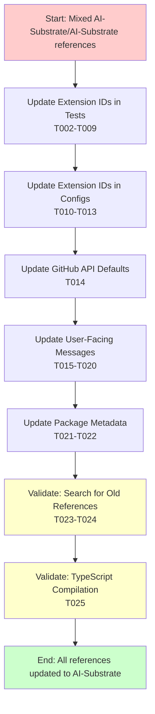
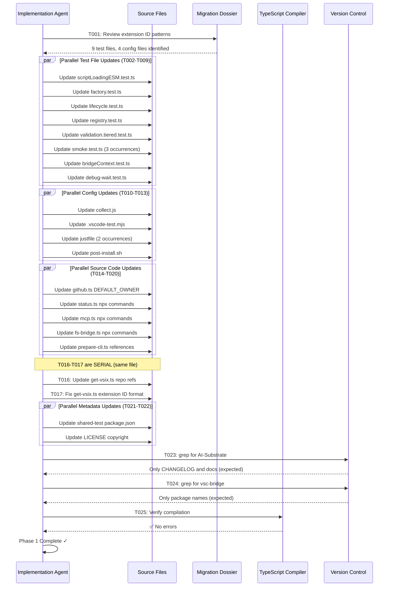

# Phase 1: Update Repository References - Tasks and Alignment Brief

**Phase**: Phase 1 of 4
**Phase Title**: Update Repository References
**Created**: 2025-10-22
**Spec**: [/workspaces/wormhole/docs/plans/21-org-migration-version-reset/org-migration-version-reset-spec.md](/workspaces/wormhole/docs/plans/21-org-migration-version-reset/org-migration-version-reset-spec.md)
**Plan**: [/workspaces/wormhole/docs/plans/21-org-migration-version-reset/org-migration-version-reset-plan.md](/workspaces/wormhole/docs/plans/21-org-migration-version-reset/org-migration-version-reset-plan.md)
**Migration Dossier**: [/workspaces/wormhole/docs/plans/21-org-migration-version-reset/migration-dossier.md](/workspaces/wormhole/docs/plans/21-org-migration-version-reset/migration-dossier.md)

---

## Tasks

| Status | ID | Task | Type | Dependencies | Absolute Path(s) | Validation | Subtasks | Notes |
|--------|----|----|------|--------------|------------------|------------|----------|-------|
| [ ] | T001 | Review test files to understand extension ID usage patterns | Setup | – | /workspaces/wormhole/packages/extension/src/test/integration/ | Extension ID patterns documented | – | Understand test structure before batch updates |
| [ ] | T002 | Update extension ID in scriptLoadingESM.test.ts | Core | T001 | /workspaces/wormhole/packages/extension/src/test/integration/scriptLoadingESM.test.ts | Line 18: `AI-Substrate.vsc-bridge-extension` | – | Per Critical Discovery 01 (plan § 3) |
| [ ] | T003 | Update extension ID in factory.test.ts | Core | T001 | /workspaces/wormhole/packages/extension/src/test/integration/factory.test.ts | Line 14: `AI-Substrate.vsc-bridge-extension` | – | [P] eligible (different file from T002) |
| [ ] | T004 | Update extension ID in lifecycle.test.ts | Core | T001 | /workspaces/wormhole/packages/extension/src/test/integration/lifecycle.test.ts | Line 24: `AI-Substrate.vsc-bridge-extension` | – | [P] eligible (different file) |
| [ ] | T005 | Update extension ID in registry.test.ts | Core | T001 | /workspaces/wormhole/packages/extension/src/test/integration/registry.test.ts | Line 18: `AI-Substrate.vsc-bridge-extension` | – | [P] eligible (different file) |
| [ ] | T006 | Update extension ID in validation.tiered.test.ts | Core | T001 | /workspaces/wormhole/packages/extension/src/test/integration/validation.tiered.test.ts | Line 19: `AI-Substrate.vsc-bridge-extension` | – | [P] eligible (different file) |
| [ ] | T007 | Update extension ID in smoke.test.ts (3 locations) | Core | T001 | /workspaces/wormhole/packages/extension/src/test/integration/smoke.test.ts | Lines 27, 40, 58: `AI-Substrate.vsc-bridge-extension` | – | [P] eligible (different file) |
| [ ] | T008 | Update extension ID in bridgeContext.test.ts | Core | T001 | /workspaces/wormhole/packages/extension/src/test/integration/bridgeContext.test.ts | Line 15: `AI-Substrate.vsc-bridge-extension` | – | [P] eligible (different file) |
| [ ] | T009 | Update extension ID in debug-wait.test.ts | Core | T001 | /workspaces/wormhole/packages/extension/src/test/integration/scripts/debug-wait.test.ts | Line 27: `AI-Substrate.vsc-bridge-extension` | – | [P] eligible (different file) |
| [ ] | T010 | Update extension ID in diagnostic collection script | Core | – | /workspaces/wormhole/packages/extension/src/vsc-scripts/diag/collect.js | Line 69: `AI-Substrate.vsc-bridge-extension` (include `-extension` suffix) | – | Per Critical Discovery 01 - runtime code |
| [ ] | T011 | Update extension ID in .vscode-test.mjs | Core | – | /workspaces/wormhole/packages/extension/.vscode-test.mjs | Line 50: `AI-Substrate.vsc-bridge-extension` | – | [P] eligible (different file from T010) |
| [ ] | T012 | Update extension ID in justfile (2 locations) | Core | – | /workspaces/wormhole/justfile | Lines 198, 203: `AI-Substrate.vsc-bridge-extension` | – | [P] eligible (different file) |
| [ ] | T013 | Update extension ID in post-install.sh | Core | – | /workspaces/wormhole/.devcontainer/post-install.sh | Line 146: `AI-Substrate.vsc-bridge-extension` | – | [P] eligible (different file) |
| [ ] | T014 | Update GitHub API DEFAULT_OWNER constant | Core | – | /workspaces/wormhole/src/lib/github.ts | Line 25: `DEFAULT_OWNER = 'AI-Substrate'` and `DEFAULT_REPO = 'wormhole'` | – | Per Critical Discovery 02 (plan § 3); [P] eligible (different file) |
| [ ] | T015 | Update npx commands in status.ts | Core | – | /workspaces/wormhole/src/commands/status.ts | Lines 72, 74: `npx github:AI-Substrate/wormhole` | – | Per Critical Discovery 03 (plan § 3); [P] eligible (different file) |
| [ ] | T016 | Update GitHub repo references in get-vsix.ts (3 locations) | Core | – | /workspaces/wormhole/src/commands/get-vsix.ts | Lines 153, 220: `AI-Substrate/wormhole` | – | [P] eligible (different file) |
| [ ] | T017 | Fix short-form extension ID in get-vsix.ts | Core | T016 | /workspaces/wormhole/src/commands/get-vsix.ts | Line 147: `AI-Substrate.vsc-bridge-extension` (not `ai-substrate.vsc-bridge`) | – | Serial (same file as T016); Per migration dossier special case |
| [ ] | T018 | Update npx commands in mcp.ts | Core | – | /workspaces/wormhole/src/commands/mcp.ts | Lines 95, 97: `npx github:AI-Substrate/wormhole` | – | [P] eligible (different file) |
| [ ] | T019 | Update npx commands in fs-bridge.ts | Core | – | /workspaces/wormhole/src/lib/fs-bridge.ts | Lines 83, 85: `npx github:AI-Substrate/wormhole` | – | [P] eligible (different file) |
| [ ] | T020 | Update GitHub repo references in prepare-cli.ts | Core | – | /workspaces/wormhole/ci/scripts/prepare-cli.ts | Lines 7, 118: `AI-Substrate/wormhole` | – | [P] eligible (different file) |
| [ ] | T021 | Update repository URL in shared-test package.json | Core | – | /workspaces/wormhole/packages/shared-test/package.json | Line 27: `AI-Substrate/wormhole` | – | [P] eligible (different file) |
| [ ] | T022 | Update LICENSE copyright holder | Core | – | /workspaces/wormhole/LICENSE | Line 3: `Copyright (c) 2025 AI-Substrate` | – | [P] eligible (different file) |
| [ ] | T023 | Search codebase for remaining AI-Substrate references | Validation | T002-T022 | /workspaces/wormhole/ | Search returns only CHANGELOG and historical docs | – | Run: `grep -r "AI-Substrate" --exclude-dir=node_modules --exclude-dir=dist --exclude="CHANGELOG.md" .` |
| [ ] | T024 | Search for old vsc-bridge repo name | Validation | T002-T022 | /workspaces/wormhole/ | Search returns only package names (intentional) | – | Run: `grep -r "vsc-bridge" --exclude-dir=node_modules --exclude-dir=dist .` |
| [ ] | T025 | Verify TypeScript compilation succeeds | Validation | T002-T022 | /workspaces/wormhole/ | No TypeScript errors | – | Run: `cd /workspaces/wormhole && npx tsc --noEmit` |

---

## Alignment Brief

### Objective Recap

**Primary Goal**: Update all 30 critical references from `AI-Substrate/vsc-bridge` to `AI-Substrate/wormhole`, ensuring the codebase is fully aligned with the new organization.

**Behavior Checklist** (from plan acceptance criteria):
- ✅ All 30 critical references updated per migration dossier
- ✅ No compilation errors in TypeScript files
- ✅ Search confirms only historical references remain (CHANGELOG, docs)
- ✅ LICENSE updated with correct copyright holder

**Why This Matters**: Extension ID mismatches will cause all integration tests to fail and prevent extension activation. GitHub API defaults control where CLI commands download releases. User-facing messages with old commands create support burden.

---

### Non-Goals (Scope Boundaries)

❌ **NOT doing in this phase**:
- Version number changes (Phase 2 handles version reset to 0.1.0)
- Semantic-release configuration (Phase 2)
- CHANGELOG updates (Phase 2 adds migration notice)
- Documentation creation (Phase 3 handles semantic-versioning docs)
- Build verification (Phase 4 runs full build and test suite)
- Updating CHANGELOG historical entries (explicitly preserving history per Critical Discovery 05)
- Modifying compiled artifacts in `dist/` (auto-regenerates in Phase 4 build)
- Updating GitHub Actions workflows (already correct per migration dossier)
- Updating root `package.json` or extension `package.json` repo URLs (already updated)

**Scope Constraint**: This phase ONLY updates hardcoded string references in source code, tests, and configuration files. No version changes, no builds, no releases.

---

### Critical Findings Affecting This Phase

**🚨 Critical Discovery 01: Extension ID Must Match Everywhere**
- **Impact**: Critical
- **Constraint**: Extension ID `AI-Substrate.vsc-bridge-extension` must be updated atomically in all 13 locations
- **Why**: VS Code APIs use extension ID to locate and activate extensions; any mismatch causes failures
- **Tasks Affected**: T002-T013 (all extension ID updates)
- **Validation**: Must verify extension ID is consistent across all files (T023)

**🚨 Critical Discovery 02: GitHub API Default Owner Controls Downloads**
- **Impact**: Critical
- **Constraint**: `src/lib/github.ts` DEFAULT_OWNER must be `AI-Substrate` or CLI downloads fail
- **Why**: Controls where `get-vsix`, `status`, and `mcp` commands download releases from
- **Tasks Affected**: T014
- **Validation**: Will be verified in Phase 4 when testing CLI commands

**🚨 Critical Discovery 03: User-Facing Messages Show Wrong Install Commands**
- **Impact**: High
- **Constraint**: 7 source files embed old `npx github:AI-Substrate/vsc-bridge` commands
- **Why**: Users see incorrect installation instructions in error messages
- **Tasks Affected**: T015-T020
- **Validation**: Will be verified in Phase 4 when running `vscb status` and inspecting output

**ℹ️ Medium Discovery 06: Compiled Files Auto-Regenerate**
- **Impact**: Medium
- **Constraint**: Do NOT update files in `dist/` directory
- **Why**: TypeScript compilation from `src/` regenerates `dist/` automatically
- **Tasks Affected**: None (explicitly avoiding dist/)
- **Validation**: Phase 4 build will regenerate dist/ correctly

---

### Invariants & Guardrails

**Atomicity Requirement**:
- Extension ID must be updated in ALL 13 locations before tests run
- Pattern: `AI-Substrate.vsc-bridge-extension` → `AI-Substrate.vsc-bridge-extension`

**Special Cases**:
- `get-vsix.ts` line 147: Uses short form `ai-substrate.vsc-bridge`, must become full form `AI-Substrate.vsc-bridge-extension`
- `smoke.test.ts`: Has 3 occurrences (lines 27, 40, 58) - update all
- `justfile`: Has 2 occurrences (lines 198, 203) - update both

**Guardrails**:
- Do NOT modify CHANGELOG.md (historical record)
- Do NOT modify files in `dist/` (build artifacts)
- Do NOT modify `node_modules/` (dependencies)
- Preserve exact line breaks and formatting (only change strings)

---

### Inputs to Read

**Before starting any task, read these files**:
1. `/workspaces/wormhole/docs/plans/21-org-migration-version-reset/migration-dossier.md` - Complete reference inventory with line numbers
2. `/workspaces/wormhole/docs/plans/21-org-migration-version-reset/org-migration-version-reset-plan.md` § 3 - Critical Research Findings

**For each file modification**:
1. Read the target file first to verify current content
2. Locate exact line numbers from migration dossier
3. Apply change with Edit tool (preserve formatting)
4. Move to next file (use [P] guidance for parallel vs serial)

---

### Visual Alignment Aids

#### System State Flow



#### Task Execution Sequence



---

### Test Plan

**Approach**: Manual Only (per spec § Testing Philosophy)

**Rationale**: This is chore work - metadata and string replacements with no new logic or algorithms. No automated tests needed for configuration changes.

**Manual Verification Strategy**:

1. **Inline Validation** (during implementation):
   - Each Edit tool call verifies exact line number and content
   - Each file read confirms expected patterns exist
   - TypeScript errors surface immediately if syntax broken

2. **Post-Implementation Searches** (T023-T024):
   - Comprehensive `grep` searches ensure no references missed
   - Excludes expected locations (CHANGELOG, node_modules, dist)
   - Expected results documented in validation column

3. **Compilation Check** (T025):
   - TypeScript compiler acts as syntax validator
   - No errors = all changes syntactically correct
   - Deferred to Phase 4: Runtime tests, CLI output verification

**Test Fixtures**: None required (string replacements only)

**Expected Outputs**:
- T023: `grep` returns only CHANGELOG.md and historical docs
- T024: `grep` returns only package names (intentional, like `@vsc-bridge/shared-test`)
- T025: `tsc --noEmit` exits with code 0 (no errors)

---

### Step-by-Step Implementation Outline

**Order of Execution** (mapped to tasks):

1. **Setup** (T001): Read migration dossier and test file structure
   - Understand extension ID usage patterns
   - Verify line numbers are accurate
   - Document any changes since dossier was generated

2. **Test Files Batch** (T002-T009, parallel eligible):
   - Process 9 test files
   - Pattern: `AI-Substrate.vsc-bridge-extension` → `AI-Substrate.vsc-bridge-extension`
   - Use Edit tool for each file
   - Mark each task complete immediately after edit

3. **Config Files Batch** (T010-T013, parallel eligible):
   - Process .vscode-test.mjs, justfile, post-install.sh, collect.js
   - Same pattern as test files
   - Verify justfile has 2 occurrences (lines 198, 203)

4. **Source Code Batch** (T014-T020, mostly parallel):
   - T014: Update github.ts (DEFAULT_OWNER and DEFAULT_REPO)
   - T015-T020: Update user-facing messages (npx commands, repo URLs)
   - **SERIAL DEPENDENCY**: T016 → T017 (same file get-vsix.ts)
   - Special case T017: short form → full form extension ID

5. **Metadata Batch** (T021-T022, parallel eligible):
   - T021: Update shared-test package.json
   - T022: Update LICENSE copyright

6. **Validation Batch** (T023-T025, serial):
   - T023: Search for AI-Substrate (expect only CHANGELOG/docs)
   - T024: Search for vsc-bridge (expect only package names)
   - T025: TypeScript compilation check (expect no errors)

**Parallel Execution Opportunities**:
- Tasks T002-T009 can run in parallel (different files)
- Tasks T010-T013 can run in parallel (different files)
- Tasks T014-T015, T018-T020 can run in parallel (different files)
- Tasks T021-T022 can run in parallel (different files)
- **Exception**: T016 and T017 are serial (same file)

---

### Commands to Run

**Working Directory**: `/workspaces/wormhole/` (project root)

**Setup** (T001):
```bash
# Review migration dossier
cat /workspaces/wormhole/docs/plans/21-org-migration-version-reset/migration-dossier.md

# List test files to update
ls -la /workspaces/wormhole/packages/extension/src/test/integration/*.test.ts
```

**Validation Searches** (T023-T024):
```bash
# From project root
cd /workspaces/wormhole

# T023: Find remaining AI-Substrate references (expect only CHANGELOG, docs)
grep -r "AI-Substrate" \
  --exclude-dir=node_modules \
  --exclude-dir=dist \
  --exclude="CHANGELOG.md" \
  .

# T024: Find old repo name vsc-bridge (expect package names only)
grep -r "vsc-bridge" \
  --exclude-dir=node_modules \
  --exclude-dir=dist \
  .
```

**TypeScript Compilation Check** (T025):
```bash
# From project root
cd /workspaces/wormhole

# Verify no TypeScript errors
npx tsc --noEmit
```

**Post-Phase Verification** (manual):
```bash
# Verify extension ID consistency (expect all AI-Substrate)
grep -r "vsc-bridge-extension" \
  --exclude-dir=node_modules \
  --exclude-dir=dist \
  . \
  | grep -v "AI-Substrate.vsc-bridge-extension"

# Should return empty (no old extension IDs)
```

---

### Risks & Unknowns

| Risk | Severity | Mitigation | Status |
|------|----------|------------|--------|
| **Miss a reference during manual edits** | High | Use migration dossier checklist; run comprehensive grep searches (T023-T024) | Mitigated |
| **Break syntax with typo in replacement** | Medium | Use Edit tool (not manual typing); TypeScript compilation check (T025) | Mitigated |
| **Line numbers changed since dossier created** | Low | Read each file before editing to verify current content | Mitigated |
| **New references added since migration dossier scan** | Low | Post-implementation grep searches catch any new additions | Mitigated |
| **Special characters in file paths break grep** | Low | Use absolute paths; exclude known build/dependency directories | Mitigated |

**Unknowns**: None remaining (migration dossier provides complete inventory)

---

### Ready Check

Complete this checklist before proceeding to implementation:

**Planning Validation**:
- [ ] Migration dossier reviewed and understood (30 critical references identified)
- [ ] Critical Research Findings (plan § 3) reviewed - understand Discovery 01, 02, 03
- [ ] All task absolute paths verified against repository structure
- [ ] Parallel execution strategy understood (T016→T017 are serial exception)

**Environment Validation**:
- [ ] Working directory is `/workspaces/wormhole/` (project root)
- [ ] Git status clean (no uncommitted changes that could interfere)
- [ ] Migration dossier accessible at expected path
- [ ] `grep` command available (for validation searches)
- [ ] TypeScript compiler available (`npx tsc --noEmit` works)

**Scope Confirmation**:
- [ ] Understand this phase does NOT change versions (Phase 2)
- [ ] Understand this phase does NOT modify CHANGELOG (Phase 2)
- [ ] Understand this phase does NOT run builds (Phase 4)
- [ ] Understand dist/ files are NOT updated (auto-regenerate in Phase 4)

**GO/NO-GO Decision**:
- [ ] **All above checkboxes verified** → Proceed with implementation
- [ ] **Any checkbox unchecked** → Resolve blockers before starting

---

## Phase Footnote Stubs

**Purpose**: Track implementation changes with flowspace node IDs for traceability.

**Authority**: `/plan-6-implement-phase` will populate this section during implementation.

**Format**: Each footnote includes:
- Substrate node reference (method, class, or file)
- One-line description of change
- Clickable file path link

**Initial State** (before implementation):

[^1]: [To be added during implementation]
[^2]: [To be added during implementation]
[^3]: [To be added during implementation]
[^4]: [To be added during implementation]
[^5]: [To be added during implementation]

---

## Evidence Artifacts

### Execution Log

**Location**: `/workspaces/wormhole/docs/plans/21-org-migration-version-reset/tasks/phase-1/execution.log.md`

**Created By**: `/plan-6-implement-phase` during implementation

**Contents**:
- Timestamp for each task start/completion
- Edit tool results (success/failure)
- Validation command outputs (grep results, tsc errors)
- Any deviations from plan or unexpected findings
- Final acceptance criteria verification

### Search Results

**Location**: Embedded in execution.log.md

**Contents**:
- T023 grep output (AI-Substrate references)
- T024 grep output (vsc-bridge references)
- T025 TypeScript compilation output

### Task Status Tracking

**Location**: This file (tasks.md) - Status column updated by `/plan-6a-update-progress`

**Format**:
- `[ ]` = Not started
- `[~]` = In progress
- `[x]` = Complete

---

## Directory Layout

```
docs/plans/21-org-migration-version-reset/
├── org-migration-version-reset-spec.md          # Feature specification
├── org-migration-version-reset-plan.md          # Implementation plan (4 phases)
├── migration-dossier.md                          # Reference inventory (30 critical, 42 docs)
└── tasks/
    └── phase-1/                                  # Current phase
        ├── tasks.md                              # This file (tasks + alignment brief)
        └── execution.log.md                      # Created by /plan-6 during implementation
```

**Next Phase Structure** (after Phase 1 complete):
```
docs/plans/21-org-migration-version-reset/tasks/
├── phase-1/
│   ├── tasks.md
│   └── execution.log.md                          # ✅ Complete
└── phase-2/
    ├── tasks.md                                  # Created by /plan-5 for Phase 2
    └── execution.log.md                          # Created by /plan-6 for Phase 2
```

---

## Notes

**Phase Dependencies**: Phase 1 is foundational - no dependencies on other phases. Phases 2-4 depend on Phase 1 completion.

**Estimated Time**: 30-45 minutes (per migration dossier estimate)

**Success Criteria Summary**:
1. All 30 critical references updated (validated by grep searches)
2. No TypeScript compilation errors (validated by tsc)
3. Extension ID consistent across all 13 locations
4. LICENSE copyright updated to AI-Substrate

**Critical Success Factor**: Atomicity - all extension ID references must be updated before running any tests or builds in Phase 4.

---

**Status**: READY for implementation via `/plan-6-implement-phase --phase "Phase 1: Update Repository References"`
