# Phase 2: Version Reset and Semantic-Release Configuration - Tasks and Alignment Brief

**Phase**: Phase 2 of 4
**Phase Title**: Version Reset and Semantic-Release Configuration
**Created**: 2025-10-22
**Spec**: [/workspaces/wormhole/docs/plans/21-org-migration-version-reset/org-migration-version-reset-spec.md](/workspaces/wormhole/docs/plans/21-org-migration-version-reset/org-migration-version-reset-spec.md)
**Plan**: [/workspaces/wormhole/docs/plans/21-org-migration-version-reset/org-migration-version-reset-plan.md](/workspaces/wormhole/docs/plans/21-org-migration-version-reset/org-migration-version-reset-plan.md)

---

## Tasks

| Status | ID | Task | Type | Dependencies | Absolute Path(s) | Validation | Subtasks | Notes |
|--------|----|----|------|--------------|------------------|------------|----------|-------|
| [x] | T001 | Verify Phase 1 completion | Setup | – | /workspaces/wormhole/ | All extension IDs use AI-Substrate, GitHub defaults updated | – | Pre-flight check before version changes · [log#task-t001-verify-phase-1-completion](execution.log.md#task-t001-verify-phase-1-completion) [^1] |
| [x] | T002 | Reset root package.json version to 0.1.0 | Core | T001 | /workspaces/wormhole/package.json | Line 3: `"version": "0.1.0"` | – | Standard 0.x.y start version · [log#t002-reset-root-packagejson-version-to-010](execution.log.md#t002-reset-root-packagejson-version-to-010) [^2] |
| [x] | T003 | Reset extension package.json version to 0.1.0 | Core | T001 | /workspaces/wormhole/packages/extension/package.json | Line 5: `"version": "0.1.0"` | – | [P] eligible (different file from T002) · [log#t003-reset-extension-packagejson-version-to-010](execution.log.md#t003-reset-extension-packagejson-version-to-010) [^3] |
| [x] | T004 | Synchronize workspace dependencies | Core | T002, T003 | /workspaces/wormhole/ | `npm install` completes, package-lock.json updated | – | Resolves version conflicts · [log#t004-synchronize-workspace-dependencies](execution.log.md#t004-synchronize-workspace-dependencies) [^4] |
| [x] | T005 | Update .releaserc.json breaking change rule + add explanatory comment | Core | – | /workspaces/wormhole/.releaserc.json | Line 65: `"release": "minor"` (was "major"); Add comment explaining 0.x.y versioning rationale | – | [P] eligible; Per Critical Discovery 04 and Insight #3 · [log#t005-update-releasercjson-breaking-change-rule--add-explanatory-comment](execution.log.md#t005-update-releasercjson-breaking-change-rule--add-explanatory-comment) [^5] |
| [x] | T006 | Validate JSON syntax | Validation | T005 | /workspaces/wormhole/.releaserc.json | `cat .releaserc.json \| jq .` succeeds | – | Catch syntax errors early · [log#t006-validate-json-syntax](execution.log.md#t006-validate-json-syntax) [^6] |
| [x] | T007 | Run semantic-release dry-run | Validation | T002-T006 | /workspaces/wormhole/ | Dry-run completes without errors; May show "no release" before commit (Phase 4 validates actual 0.1.0) | – | Validates config syntax and plugin loading · [log#t007-run-semantic-release-dry-run](execution.log.md#t007-run-semantic-release-dry-run) [^7] |
| [x] | T008 | Verify TypeScript compilation | Validation | T002-T004 | /workspaces/wormhole/ | `npx tsc --noEmit` exits with code 0 | – | Ensure no version-related type errors · [log#t008-verify-typescript-compilation](execution.log.md#t008-verify-typescript-compilation) [^8] |

---

## Alignment Brief

### Previous Phase Review

**Phase 1 Deliverables** (from subagent analysis):

**A. Completed Deliverables**: 22 files modified across 34 critical references
- **Test files**: 8 files, 10 extension ID occurrences
- **Config files**: 4 files, 5 extension ID occurrences
- **Source files**: 8 files, 17 GitHub repo/npx command occurrences
- **Metadata files**: 2 files (shared-test package.json, LICENSE)

**D. Dependencies Phase 2 Can Use**:
- ✅ All extension IDs now use `AI-Substrate.vsc-bridge-extension` (15 locations)
- ✅ GitHub API defaults: `DEFAULT_OWNER = 'AI-Substrate'`, `DEFAULT_REPO = 'wormhole'`
- ✅ All user-facing npx commands show `AI-Substrate/wormhole`
- ✅ LICENSE copyright holder is `AI-Substrate`
- ✅ TypeScript compilation clean (zero errors)

**B. Lessons Learned**:
- Migration dossier line numbers were 100% accurate (zero find-replace failures)
- Batch processing similar files was highly efficient (8 test files in ~3 minutes)
- Validation-first approach (T001 review task) de-risked entire phase
- Systematic grep validation at phase end created high confidence

**C. Technical Discoveries**:
- Edit tool worked flawlessly (22 files, zero syntax errors)
- Special case (get-vsix.ts short form → full form) handled correctly per dossier
- Build artifacts in `dist/` correctly left untouched (will regenerate Phase 4)

**E. Critical Findings Applied in Phase 1**:
- ✅ **Discovery 01** (Extension ID atomicity): All 15 locations updated
- ✅ **Discovery 02** (GitHub API defaults): `src/lib/github.ts` constants updated
- ✅ **Discovery 03** (User-facing messages): 7 files, 12 npx command occurrences updated
- ⏸️ **Discovery 04** (Semantic-release too aggressive): Phase 2 responsibility
- ⏸️ **Discovery 05** (CHANGELOG historical links): Phase 2 responsibility
- ✅ **Discovery 06** (Compiled artifacts): `dist/` correctly skipped

**F. Blocked/Incomplete Items**: None - Phase 1 100% complete

**H. Technical Debt & Patterns**:
- **Pattern established**: Source-only updates, build artifacts regenerate automatically
- **Pattern established**: Atomic version updates across multiple package.json files
- **Anti-pattern to avoid**: Do NOT manually edit CHANGELOG.md (semantic-release owns it)
- **Files Phase 2 must NOT modify**: `dist/` directory, historical documentation

**J. Key Execution Log References**:
- Version format decision: `/workspaces/wormhole/docs/plans/21-org-migration-version-reset/tasks/phase-1/execution.log.md` lines 106-108
- Validation patterns: execution.log.md lines 225-329 (T023-T025)

---

### Objective Recap

**Primary Goal**: Reset version to 0.1.0 and configure standard 0.x.y semantic versioning where breaking changes and features trigger minor bumps, fixes trigger patch bumps.

**Behavior Checklist** (from plan acceptance criteria):
- ✅ Version 0.1.0 in both package.json files
- ✅ `npm install` completes without errors
- ✅ `.releaserc.json` configured for standard 0.x.y (breaking/feat → minor, fix → patch)
- ✅ Dry-run shows 0.1.0 initial release without errors

**Why This Matters**:
- **Version 0.1.0 signals pre-1.0 development** with semantic signaling for breaking changes
- **Standard 0.x.y versioning** enables users to distinguish breaking changes (minor bump) from fixes (patch bump)
- **Semantic-release automation** ensures consistent versioning without manual intervention

---

### Non-Goals (Scope Boundaries)

❌ **NOT doing in this phase**:

- **CHANGELOG manual edits** - Semantic-release owns CHANGELOG.md via @semantic-release/changelog plugin. The plan called for manual prepending (Task 2.5), but this conflicts with automation. **Decision**: Skip manual CHANGELOG edit; let semantic-release generate 0.1.0 entry automatically on first release.

- **Build verification** - Phase 4 handles `just build` and `dist/` regeneration

- **Documentation creation** - Phase 3 creates `docs/how/semantic-versioning/` guides

- **Integration test execution** - Phase 4 runs `just test-extension` after build

- **Publisher ID changes** - Already completed in Phase 1; Phase 2 only touches versions

- **Package name changes** - Package names remain `vsc-bridge` (not `wormhole`)

**Scope Constraint**: This phase ONLY updates version numbers and semantic-release configuration. No builds, no tests, no documentation.

---

### Critical Findings Affecting This Phase

**🚨 Critical Discovery 04: Semantic-Release Currently Too Aggressive**
- **Impact**: Critical for Phase 2
- **Constraint**: Current `.releaserc.json` has `{"type": "breaking", "release": "major"}` which enables 1.0.0+ releases
- **Why it matters**: Standard 0.x.y versioning requires breaking changes → minor bump (0.1.0 → 0.2.0), not major
- **Tasks affected**: T005 (update breaking rule), T007 (validate dry-run)
- **Solution**: Change line 65 from `"release": "major"` to `"release": "minor"`

**ℹ️ Medium Discovery 05: CHANGELOG Contains Historical Links**
- **Impact**: Low (deferred)
- **Original plan**: Task 2.5 prepends migration notice to CHANGELOG.md
- **Conflict**: Semantic-release owns CHANGELOG.md (plugin config lines 130-134)
- **Decision**: Skip manual CHANGELOG edit to avoid conflicts with automation
- **Alternative**: First release (0.1.0) will be the migration commit itself, documenting the org change naturally

---

### Invariants & Guardrails

**Version Atomicity**:
- Root and extension package.json must have identical version (0.1.0)
- `npm install` synchronizes package-lock.json after version changes
- **Order matters**: Edit both package.json → run npm install → validate

**Semantic-Release Configuration**:
- `.releaserc.json` is JSON (not TypeScript) - use `jq` for syntax validation
- Breaking change rule must be `minor` (not `major`) for 0.x.y versioning
- Existing rules for feat/fix/perf/refactor are already correct

**Build Artifacts**:
- Do NOT modify `dist/` directory (Phase 4 rebuilds)
- Do NOT modify `CHANGELOG.md` manually (semantic-release owns it)
- Do NOT modify `package-lock.json` directly (generated by npm install)

---

### Inputs to Read

**Before starting**:
1. `/workspaces/wormhole/package.json` - Current version (verify Phase 1 didn't change it)
2. `/workspaces/wormhole/packages/extension/package.json` - Current version
3. `/workspaces/wormhole/.releaserc.json` - Current breaking rule (line 64-66)

**During implementation**:
- For each package.json: Read entire file to locate version line precisely
- For .releaserc.json: Read lines 60-70 to see breaking rule context

---

### Visual Alignment Aids

#### System State Flow

```mermaid
flowchart TD
    A[Start: Version 1.2.0, breaking→major] --> B[Verify Phase 1 Complete<br/>T001]
    B --> C[Reset Versions to 0.1.0<br/>T002-T003]
    C --> D[Synchronize Dependencies<br/>T004: npm install]
    D --> E[Update Breaking Rule<br/>T005: breaking→minor]
    E --> F[Validate JSON Syntax<br/>T006: jq]
    F --> G[Semantic-Release Dry-Run<br/>T007]
    G --> H[Verify TypeScript Compilation<br/>T008]
    H --> I[End: Version 0.1.0, standard 0.x.y]

    style A fill:#ffcccc
    style I fill:#ccffcc
    style G fill:#ffffcc
    style H fill:#ffffcc
```



#### Task Execution Sequence


---

### Test Plan

**Approach**: Manual Only (per spec § Testing Philosophy)

**Rationale**: Phase 2 changes configuration files and version strings with no new logic or algorithms. Validation comes from tool outputs, not automated tests.

**Manual Verification Strategy**:

1. **Pre-flight validation** (T001):
   - Grep for `AI-Substrate.vsc-bridge-extension` confirms Phase 1 complete
   - No AI-Substrate references in active source code

2. **Version synchronization** (T002-T004):
   - Edit tool confirms version changes at correct lines
   - npm install runs without version conflicts
   - package-lock.json updated (git diff shows changes)

3. **Semantic-release configuration** (T005-T007):
   - `jq` validates JSON syntax
   - Dry-run shows correct behavior (0.1.0 initial release)
   - No errors during dry-run execution

4. **Type safety** (T008):
   - TypeScript compiler acts as syntax validator
   - Zero errors = version strings syntactically valid

**Test Fixtures**: None required (configuration changes only)

**Expected Outputs**:
- T001: grep finds all AI-Substrate references, zero AI-Substrate in source
- T004: `npm install` exits 0, package-lock.json shows version 0.1.0
- T006: `cat .releaserc.json | jq .` exits 0, valid JSON output
- T007: Dry-run exits 0, no error messages (may show "no release" before commit; Phase 4 validates actual release)
- T008: `npx tsc --noEmit` exits 0

---

### Step-by-Step Implementation Outline

**Execution Order** (8 tasks, ~15-20 minutes estimated):

1. **Setup** (T001): Pre-flight validation
   - Search for AI-Substrate.vsc-bridge-extension (expect 15 occurrences)
   - Search for AI-Substrate in source code (expect zero in active code)
   - Confirm Phase 1 acceptance criteria all met

2. **Version Reset** (T002-T003, parallel eligible):
   - Read root package.json to locate version line (expect line 3)
   - Edit: `"version": "1.2.0"` → `"version": "0.1.0"`
   - Read extension package.json to locate version line (expect line 5)
   - Edit: `"version": "1.2.0"` → `"version": "0.1.0"`

3. **Dependency Synchronization** (T004, serial after T002-T003):
   - Run `npm install` from project root
   - Verify package-lock.json updated (git status shows modification)
   - Verify no version conflicts in output

4. **Semantic-Release Configuration** (T005, parallel eligible):
   - Read .releaserc.json lines 60-70
   - Add explanatory comment before breaking rule (lines 63-64):
     ```json
     // Standard 0.x.y versioning: breaking changes trigger minor bump (0.1→0.2)
     // while in pre-1.0 range. Major versions (1.0+) reserved for manual milestones.
     ```
   - Edit line 65: `"release": "major"` → `"release": "minor"`

5. **Validation Batch** (T006-T008, serial):
   - T006: `cat .releaserc.json | jq .` (validate JSON)
   - T007: `npx semantic-release --dry-run` (test release logic)
   - T008: `npx tsc --noEmit` (verify TypeScript)

**Parallel Execution Opportunities**:
- T002-T003 can run in parallel (different files)
- T005 can run in parallel with T002-T003 (different file)
- T006-T008 must run serially (validation order matters)

---

### Commands to Run

**Working Directory**: `/workspaces/wormhole/` (project root)

**Pre-flight Check** (T001):
```bash
# Verify Phase 1 completion
grep -r "AI-Substrate.vsc-bridge-extension" \
  --include="*.ts" --include="*.js" --include="*.mjs" --include="*.sh" \
  . | wc -l
# Expected: 15 occurrences

# Verify no AI-Substrate in active source
grep -r "AI-Substrate" \
  --exclude-dir=node_modules \
  --exclude-dir=dist \
  --exclude="CHANGELOG.md" \
  --exclude-dir="docs/plans" \
  .
# Expected: Only test/ workspace examples (historical)
```

**Dependency Synchronization** (T004):
```bash
cd /workspaces/wormhole
npm install
# Expected: package-lock.json updated, no errors
```

**JSON Validation** (T006):
```bash
cd /workspaces/wormhole
cat .releaserc.json | jq .
# Expected: Valid JSON output, exit code 0
```

**Semantic-Release Dry-Run** (T007):
```bash
cd /workspaces/wormhole
npx semantic-release --dry-run
# Expected: Completes without errors (exit code 0)
# Note: May show "no release necessary" if changes not yet committed
# Phase 4 will validate actual 0.1.0 release behavior after commit
```

**TypeScript Compilation** (T008):
```bash
cd /workspaces/wormhole
npx tsc --noEmit
# Expected: No output, exit code 0
```

---

### Risks & Unknowns

| Risk | Severity | Mitigation | Status |
|------|----------|------------|--------|
| **npm install fails due to version conflict** | Medium | Atomic updates (both package.json files before npm install) | Mitigated |
| **Semantic-release dry-run fails** | Medium | Validate JSON syntax first (T006); check releaseRules format | Mitigated |
| **TypeScript compilation fails** | Low | Version strings are primitives; unlikely to cause type errors | Mitigated |
| **CHANGELOG.md conflict on first release** | Low | Skip manual CHANGELOG edit (semantic-release owns it) | Resolved |
| **Breaking rule change doesn't take effect** | Low | Dry-run validates configuration before commit | Mitigated |

**Unknowns**: None remaining (all decisions made during plan-4 validation)

---

### Ready Check

Complete this checklist before proceeding to implementation:

**Planning Validation**:
- [ ] Phase 1 execution log reviewed and understood (22 files modified, 34 references)
- [ ] Critical Discovery 04 (semantic-release) reviewed - breaking → minor change understood
- [ ] Decision confirmed: Skip manual CHANGELOG edit to avoid semantic-release conflicts
- [ ] Version target confirmed: 0.1.0 (not 0.0.1) for standard 0.x.y versioning

**Environment Validation**:
- [ ] Working directory is `/workspaces/wormhole/` (project root)
- [ ] Git status shows only Phase 1 changes (uncommitted from previous phase)
- [ ] `npm` command available (`npm --version` works)
- [ ] `jq` command available (`jq --version` works)
- [ ] TypeScript compiler available (`npx tsc --version` works)

**File State Validation**:
- [ ] Root package.json version is currently 1.2.0 (line 3)
- [ ] Extension package.json version is currently 1.2.0 (line 5)
- [ ] .releaserc.json breaking rule is currently "major" (line 65)

**GO/NO-GO Decision**:
- [ ] **All above checkboxes verified** → Proceed with implementation
- [ ] **Any checkbox unchecked** → Resolve blockers before starting

---

## Phase Footnote Stubs

**Purpose**: Track implementation changes with flowspace node IDs for traceability.

**Authority**: `/plan-6-implement-phase` will populate this section during implementation.

**Format**: Each footnote includes:
- Substrate node reference (file, line, change description)
- One-line description of change
- Clickable file path link

**Initial State** (before implementation):

[^1]: T001 - Phase 1 verification complete
  - `file:docs/plans/21-org-migration-version-reset/tasks/phase-2/execution.log.md` - Verification evidence with grep results
[^2]: T002 - Reset root package.json version to 0.1.0
  - `file:package.json` - Version changed from 0.0.1 to 0.1.0 (line 3)
[^3]: T003 - Reset extension package.json version to 0.1.0
  - `file:packages/extension/package.json` - Version changed from 0.0.1 to 0.1.0 (line 5)
[^4]: T004 - Synchronize workspace dependencies
  - `file:package-lock.json` - Regenerated with new version 0.1.0
[^5]: T005 - Update .releaserc.json breaking change rule
  - `file:.releaserc.json` - Breaking rule changed to "minor", explanatory comment added (lines 64-67)
[^6]: T006 - Validate JSON syntax
  - Validation: jq syntax check passed
[^7]: T007 - Run semantic-release dry-run
  - Validation: Semantic-release configuration validated, all plugins loaded
[^8]: T008 - Verify TypeScript compilation
  - Validation: TypeScript compilation succeeded with no errors

---

## Evidence Artifacts

### Execution Log

**Location**: `/workspaces/wormhole/docs/plans/21-org-migration-version-reset/tasks/phase-2/execution.log.md`

**Created By**: `/plan-6-implement-phase` during implementation

**Contents**:
- Timestamp for each task start/completion
- Edit tool results (version changes, semantic-release config)
- Validation command outputs (npm install, jq, dry-run, tsc)
- Any deviations from plan or unexpected findings
- Final acceptance criteria verification

### Command Outputs

**Location**: Embedded in execution.log.md

**Contents**:
- T001 grep results (Phase 1 verification)
- T004 npm install output
- T006 jq validation output
- T007 semantic-release dry-run output (full log)
- T008 TypeScript compilation output

### Task Status Tracking

**Location**: This file (tasks.md) - Status column updated by `/plan-6a-update-progress`

**Format**:
- `[ ]` = Not started
- `[~]` = In progress
- `[x]` = Complete

---

## Directory Layout

```
docs/plans/21-org-migration-version-reset/
├── org-migration-version-reset-spec.md          # Feature specification
├── org-migration-version-reset-plan.md          # Implementation plan (4 phases)
├── migration-dossier.md                          # Reference inventory
└── tasks/
    ├── phase-1/
    │   ├── tasks.md                              # ✅ Complete
    │   └── execution.log.md                      # ✅ Complete
    └── phase-2/                                  # Current phase
        ├── tasks.md                              # This file (tasks + alignment brief)
        └── execution.log.md                      # Created by /plan-6 during implementation
```

**Next Phase Structure** (after Phase 2 complete):
```
docs/plans/21-org-migration-version-reset/tasks/
├── phase-1/ [✅ Complete]
├── phase-2/ [After implementation]
│   ├── tasks.md
│   └── execution.log.md                          # ✅ Complete
└── phase-3/
    ├── tasks.md                                  # Created by /plan-5 for Phase 3
    └── execution.log.md                          # Created by /plan-6 for Phase 3
```

---

## Notes

**Phase Dependencies**: Phase 2 depends on Phase 1 completion (all repository references updated). Phases 3-4 depend on Phase 2.

**Estimated Time**: 15-20 minutes (simpler than Phase 1 due to fewer files)

**Success Criteria Summary**:
1. Version 0.1.0 in both package.json files
2. npm install completes without errors
3. .releaserc.json configured for standard 0.x.y (breaking/feat → minor, fix → patch)
4. Semantic-release dry-run shows 0.1.0 initial release

**Key Simplification**: Skipped manual CHANGELOG edit (Task 2.5 from plan) to avoid conflicts with semantic-release automation. First release will document migration naturally.

**Critical Success Factor**: Version atomicity - both package.json files must be updated before running npm install.

---

**Status**: READY for implementation via `/plan-6-implement-phase --phase "Phase 2: Version Reset and Semantic-Release Configuration"`

---

## Critical Insights Discussion

**Session**: 2025-10-22
**Context**: Phase 2: Version Reset and Semantic-Release Configuration - Tasks and Alignment Brief
**Analyst**: AI Clarity Agent
**Reviewer**: Development Team
**Format**: Water Cooler Conversation (5 Critical Insights)

### Insight 1: Version "Downgrade" Could Break VS Code Marketplace Auto-Updates

**Did you know**: Resetting from version 1.2.0 → 0.1.0 creates a semantic version "downgrade" that might prevent existing users from receiving automatic updates through the VS Code marketplace, as `0.1.0 < 1.2.0` semantically?

**Implications**:
- Existing users on 1.2.0 wouldn't get auto-update notifications for 0.1.0 (blocked as "downgrade")
- VS Code marketplace might reject version upload detecting backward version movement
- Publisher change (AI-Substrate → AI-Substrate) already forces reinstall anyway (different extension IDs)

**Options Considered**:
- Option A: Unpublish 1.2.0 from marketplace before migration
- Option B: Continue from 1.2.0 → 1.3.0 (skip version reset)
- Option C: Proceed with 0.1.0 as planned (accept publisher change forces reinstall)
- Option D: Increment to 2.0.0 (semver major for breaking change)

**AI Recommendation**: Option C (Proceed with 0.1.0)
- Reasoning: Publisher change already forces reinstall; 0.x.y versioning matches project stage and team preference for "pre-1.0 development" signal

**Discussion Summary**: Team confirmed extension never published to marketplace yet (only local VSIX installs), completely eliminating the version continuity concern. Version reset to 0.1.0 is clean.

**Decision**: Proceed with 0.1.0 version reset as planned

**Action Items**: None (current plan correct)

**Affects**: No changes needed

---

### Insight 2: Semantic-Release Will Try to Commit to Main During First Release

**Did you know**: When the first release runs after migration, semantic-release will automatically try to commit version bumps and CHANGELOG updates back to main branch via @semantic-release/git plugin, which would fail if branch protection were enabled without proper bypass configuration?

**Implications**:
- First release would fail with "protected branch" error if branch protection enabled
- Requires GitHub admin access to configure branch protection bypass
- Wouldn't discover failure until after merging to main (too late to fix easily)
- Could block Phase 4 verification which depends on having a release

**Options Considered**:
- Option A: Configure branch protection bypass now (before merging)
- Option B: Disable branch protection temporarily
- Option C: Document the blocker, proceed with migration
- Option D: Use Personal Access Token with admin scope

**AI Recommendation**: Option C (Document blocker, proceed)
- Reasoning: Separates migration work from repo admin work, matches plan's "will enable later today" timeline, explicit dependency tracking

**Discussion Summary**: Team confirmed branch protection isn't enabled yet, eliminating the concern entirely. Semantic-release will work immediately on first release.

**Decision**: No action needed - branch protection not enabled, semantic-release will work

**Action Items**:
- Phase 3 docs should still include branch protection setup instructions (for future enablement)
- Phase 4 can do full end-to-end release validation

**Affects**: No changes needed to current plan

---

### Insight 3: The "Breaking Change" Rule Change Has Zero Immediate Effect

**Did you know**: Changing `.releaserc.json` line 65 from `"release": "major"` to `"release": "minor"` won't actually affect the first release (0.1.0) at all, because semantic-release determines initial versions from package.json, not from release rules?

**Implications**:
- First release uses package.json version (0.1.0) regardless of breaking rule
- Breaking rule only matters for second release onwards
- Without the change, second breaking commit would jump 0.1.0 → 1.0.0 (skipping 0.x range entirely!)
- Task T005 is critical for future releases, just not immediate first release

**Options Considered**:
- Option A: Keep Task T005 as planned (change breaking rule now)
- Option B: Defer breaking rule change to later phase
- Option C: Make breaking rule change more explicit (keep T005 + add explanatory comment)

**AI Recommendation**: Option C (Keep T005 + Add Explanatory Comment)
- Reasoning: Prevents future confusion, documents "no majors unless big party" constraint locally, minimal extra effort

**Discussion Summary**: Team chose Option C - adding explanatory comment to .releaserc.json explaining why breaking="minor" for 0.x.y versioning.

**Decision**: Add explanatory comment to .releaserc.json explaining 0.x.y versioning rationale

**Action Items**:
- ✅ Updated T005 task description to include comment requirement
- ✅ Updated Step-by-Step Implementation section with comment text
- ✅ Comment text: "Standard 0.x.y versioning: breaking changes trigger minor bump (0.1→0.2) while in pre-1.0 range. Major versions (1.0+) reserved for manual milestones."

**Affects**: Phase 2 tasks.md (updated)

---

### Insight 4: Package-lock.json Will Show Massive Diff (But It's Harmless)

**Did you know**: Running `npm install` after changing both package.json versions will trigger complete package-lock.json regeneration showing thousands of lines changed, even though no actual dependencies are changing - just integrity hashes and version metadata?

**Implications**:
- Scary-looking +500/-500 line diff in package-lock.json
- Code review confusion ("Why did all these hashes change?")
- Large diff obscures the simple version change
- Git history noise

**Options Considered**:
- Option A: Accept the large diff (current plan)
- Option B: Split into two commits (version change, then lock file regeneration)
- Option C: Add commit message explanation
- Option D: Use `npm install --package-lock-only` flag

**AI Recommendation**: Option C (Accept diff + clear commit message)
- Reasoning: Standard npm practice, atomic commit, clear communication solves confusion problem

**Discussion Summary**: Team chose Option C - use standard `npm install` with clear commit message explaining package-lock.json diff is version metadata, not dependency changes.

**Decision**: Use standard `npm install` (T004) + clear commit message explaining package-lock.json diff

**Action Items**: Phase 2 execution should include commit message template noting package-lock.json regeneration

**Affects**: No task changes needed (npm install already planned in T004)

---

### Insight 5: Semantic-Release Dry-Run Might Show "No Release" Instead of "0.1.0"

**Did you know**: When running `npx semantic-release --dry-run` in T007, it might report "No release necessary" instead of "Would publish 0.1.0" if Phase 2 changes haven't been committed yet, because semantic-release analyzes git commit history (not working directory changes)?

**Implications**:
- T007 validation might give false negative if files uncommitted
- Two different workflows depending on when dry-run executes (before vs after commit)
- Order dependency between commit and dry-run validation

**Options Considered**:
- Option A: Require commit before T007 (add task T006b)
- Option B: Update T007 validation criteria to "completes without errors"
- Option C: Document two-stage validation (T007 pre-commit syntax check, Phase 4 post-commit release validation)
- Option D: Use manual commit object for dry-run testing

**AI Recommendation**: Option C (Document two-stage validation)
- Reasoning: T007 validates config syntax (sufficient for Phase 2 goal), Phase 4 validates actual release behavior (appropriate phase for end-to-end testing), flexible iteration workflow

**Discussion Summary**: Team chose Option C - T007 validates semantic-release runs without crashing (config syntax), Phase 4 validates actual 0.1.0 release production.

**Decision**: T007 validates config syntax via dry-run (exit code 0), Phase 4 validates actual 0.1.0 release behavior

**Action Items**:
- ✅ Updated T007 validation criteria to "completes without errors"
- ✅ Added note explaining "no release" output expected before commit
- ✅ Updated expected outputs documentation
- ✅ Updated commands section with clarifying note

**Affects**: Phase 2 tasks.md (updated)

---

## Session Summary

**Insights Surfaced**: 5 critical insights identified and discussed
**Decisions Made**: 5 decisions reached through collaborative discussion
**Action Items Created**: 3 documentation updates applied immediately during session
**Areas Updated**:
- T005: Added explanatory comment requirement to .releaserc.json
- T007: Updated validation criteria to focus on error-free execution
- Implementation outline: Added comment text and dry-run clarifications

**Shared Understanding Achieved**: ✓

**Confidence Level**: High - All concerns addressed, no blockers identified

**Next Steps**: Proceed with `/plan-6-implement-phase --phase "Phase 2: Version Reset and Semantic-Release Configuration"`

**Notes**:
- Extension not published to marketplace yet = version reset clean, no auto-update concerns
- Branch protection not enabled yet = semantic-release will work immediately
- Two-stage validation approach (Phase 2: config syntax, Phase 4: release behavior) matches workflow naturally
- Clear commit messages will prevent confusion about large package-lock.json diff
