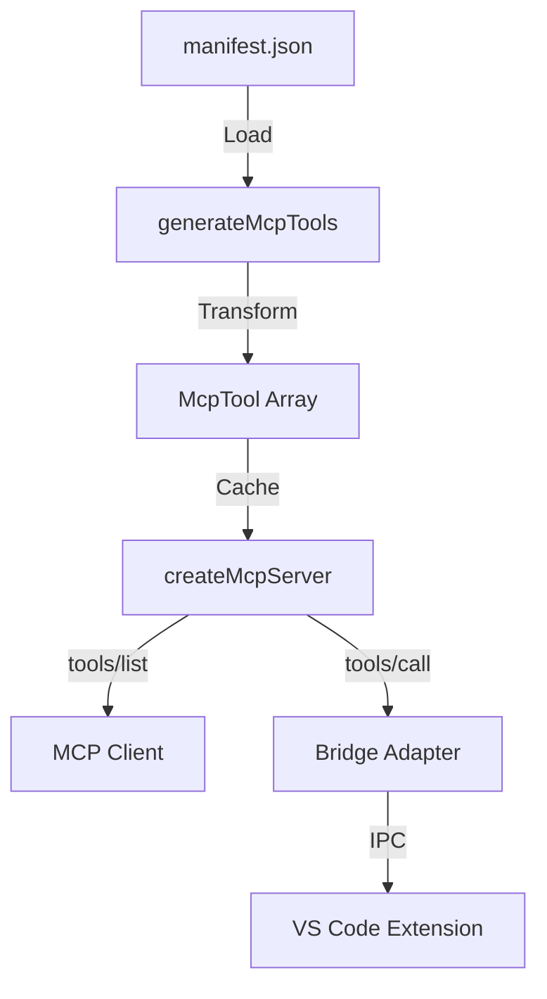
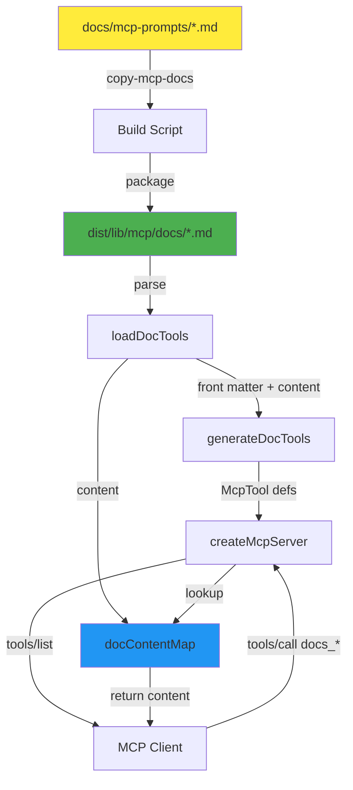

# MCP Documentation Tools - Implementation Plan

**Feature**: Dynamic MCP documentation tools from markdown files with YAML front matter
**Created**: 2025-10-24
**Status**: PLANNING

---

## Overview

Add capability for MCP server to dynamically expose documentation as callable tools. AI agents can invoke these tools to receive guidance on using VSC-Bridge effectively.

### User Story

As an AI agent using VSC-Bridge MCP tools, I want to discover and access comprehensive usage guides through the tool interface, so I can learn debugging workflows and best practices without requiring external documentation.

### Key Design Decisions

1. **Tool Naming Convention**: All doc tools prefixed with `docs_` (e.g., `docs_debugging_guide`)
2. **Front Matter Format**: YAML front matter in markdown files (standard markdown convention)
3. **Source Location**: Keep docs in `docs/mcp-prompts/` for easy editing
4. **Build-Time Packaging**: Copy to `dist/lib/mcp/docs/` during build
5. **Parameters**: First version returns full content (no parameters)
6. **Local Execution**: Doc tools execute locally like `bridge_status` (no bridge crossing)

---

## Architecture

### Current MCP Tool Flow



### New Doc Tools Flow



---

## Implementation Phases

### Phase 0: Preparation and Setup ✅ COMPLETE

**Goal**: Understand architecture, design system, get approval

**Tasks**:
- [x] Explore MCP server implementation
- [x] Review existing HOW-TO-DEBUG.md
- [x] Design front matter schema
- [x] Design build and packaging strategy
- [x] Get user approval on design

**Success Criteria**:
- ✅ Architecture documented
- ✅ Front matter format defined
- ✅ Build strategy approved
- ✅ Tool naming convention confirmed (`docs_*` prefix)

---

### Phase 1: Front Matter Schema and Loader

**Goal**: Implement markdown parsing with YAML front matter support

**Dependencies**: None

**Tasks**:

| # | Status | Task | Success Criteria | Notes |
|---|--------|------|-----------------|-------|
| 1.1 | [ ] | Add `yaml` dependency | Package installed, types available | `npm install yaml` |
| 1.2 | [ ] | Create `src/lib/mcp/doc-tools/types.ts` | TypeScript interfaces for front matter and parsed docs | See type definitions below |
| 1.3 | [ ] | Create `src/lib/mcp/doc-tools/loader.ts` | Functions parse single doc and load all docs from directory | Front matter validation included |
| 1.4 | [ ] | Write unit tests for `parseDocTool()` | Tests cover valid docs, missing front matter, invalid YAML | Use Vitest |
| 1.5 | [ ] | Write unit tests for front matter validation | Tests validate required fields (`tool_name`, `description`) | Error messages clear |

**Deliverables**:
- `src/lib/mcp/doc-tools/types.ts`
- `src/lib/mcp/doc-tools/loader.ts`
- `test-cli/unit/mcp/doc-tools/loader.test.ts`

**Success Criteria**:
- Parser extracts YAML front matter correctly
- Validation catches missing required fields
- Tests pass with 100% coverage
- Error messages are actionable

**Type Definitions**:
```typescript
// src/lib/mcp/doc-tools/types.ts
export interface DocToolFrontMatter {
  tool_name: string;          // Required: MCP tool name (e.g., "docs_debugging_guide")
  category?: string;          // Optional: Category (defaults to "documentation")
  tags?: string[];            // Optional: Tags for filtering
  description: string;        // Required: Brief description for LLM
  when_to_use?: string;       // Optional: Guidance on when to invoke
  timeout?: number;           // Optional: Timeout in ms (defaults to 3000)
  read_only?: boolean;        // Optional: Read-only hint (defaults to true)
  idempotent?: boolean;       // Optional: Idempotent hint (defaults to true)
}

export interface ParsedDocTool {
  frontMatter: DocToolFrontMatter;
  content: string;            // Markdown content after front matter
}
```

---

### Phase 2: Doc Tool Generator

**Goal**: Convert parsed docs to MCP tool definitions

**Dependencies**: Phase 1 complete

**Tasks**:

| # | Status | Task | Success Criteria | Notes |
|---|--------|------|-----------------|-------|
| 2.1 | [ ] | Create `src/lib/mcp/doc-tools/generator.ts` | Functions convert parsed docs to McpTool format | Reuses `McpTool` type |
| 2.2 | [ ] | Implement `docToolToMcpTool()` | Single doc → single McpTool with correct schema | No input parameters |
| 2.3 | [ ] | Implement `generateDocTools()` | Array of parsed docs → array of McpTools | Batch transformation |
| 2.4 | [ ] | Write unit tests for generator | Tests verify tool structure, defaults, annotations | Mock parsed docs |

**Deliverables**:
- `src/lib/mcp/doc-tools/generator.ts`
- `test-cli/unit/mcp/doc-tools/generator.test.ts`

**Success Criteria**:
- Generated tools have empty `inputSchema` (no parameters)
- Category defaults to `"documentation"`
- `readOnlyHint` and `idempotentHint` default to `true`
- Timeout defaults to `3000ms`
- Tests pass with 100% coverage

**Tool Structure**:
```typescript
// Example generated tool
{
  name: "docs_debugging_guide",
  description: "Comprehensive guide for using VSC-Bridge MCP tools...",
  inputSchema: {
    type: "object",
    properties: {},
    additionalProperties: false
  },
  _meta: {
    category: "documentation",
    tags: ["debugging", "guide", "workflow"]
  },
  annotations: {
    timeout: 3000,
    when_to_use: "Use this when starting a debugging task...",
    readOnlyHint: true,
    idempotentHint: true
  }
}
```

---

### Phase 3: Build Script and Packaging

**Goal**: Copy docs from source to dist during build

**Dependencies**: None (can run parallel with Phase 1-2)

**Tasks**:

| # | Status | Task | Success Criteria | Notes |
|---|--------|------|-----------------|-------|
| 3.1 | [ ] | Add `copy-mcp-docs` script to `package.json` | Script copies `docs/mcp-prompts/*.md` to `dist/lib/mcp/docs/` | Creates dir if missing |
| 3.2 | [ ] | Update `build` script to include doc copy | `just build` runs TypeScript + doc copy | No manual steps |
| 3.3 | [ ] | Add `dist/lib/mcp/docs/` to `.gitignore` | Build artifacts not tracked | Keep dist clean |
| 3.4 | [ ] | Test build script | Run `just build`, verify docs in `dist/lib/mcp/docs/` | Manual verification |
| 3.5 | [ ] | Add front matter to `HOW-TO-DEBUG.md` | YAML front matter with correct `tool_name: docs_debugging_guide` | First doc ready |

**Deliverables**:
- Updated `package.json` with `copy-mcp-docs` script
- Updated `.gitignore`
- `docs/mcp-prompts/HOW-TO-DEBUG.md` with front matter

**Success Criteria**:
- `just build` copies docs automatically
- Docs appear in `dist/lib/mcp/docs/` after build
- No manual copy steps required
- Build succeeds with docs present or absent (resilient)

**Front Matter for HOW-TO-DEBUG.md**:
```yaml
---
tool_name: docs_debugging_guide
category: documentation
tags: [debugging, guide, workflow, testing, breakpoints]
description: "Comprehensive guide for using VSC-Bridge MCP tools to debug code. Covers the 5-step debug pattern, tool selection, language-specific syntax, and common workflows."
when_to_use: "Use this when starting a debugging task, troubleshooting test failures, or learning VSC-Bridge debugging workflows and best practices."
timeout: 3000
read_only: true
idempotent: true
---
```

---

### Phase 4: Server Integration

**Goal**: Integrate doc tools into MCP server creation

**Dependencies**: Phase 1, 2, 3 complete

**Tasks**:

| # | Status | Task | Success Criteria | Notes |
|---|--------|------|-----------------|-------|
| 4.1 | [ ] | Import doc tools modules in `server.ts` | Import `loadDocTools`, `generateDocTools` | Clean imports |
| 4.2 | [ ] | Load docs during server creation | `createMcpServer()` loads from `dist/lib/mcp/docs/` | Uses `__dirname` |
| 4.3 | [ ] | Generate doc tools and add to tools array | Doc tools appear in cached tools array | After manifest tools, before `bridge_status` |
| 4.4 | [ ] | Create `docContentMap` for execution | Map `tool_name → content` for fast lookup | In server closure |
| 4.5 | [ ] | Add doc tool handler in `tools/call` | Check `docContentMap`, return content if match | Before bridge execution |
| 4.6 | [ ] | Handle doc loading errors gracefully | Server starts even if doc loading fails | Log warnings |

**Deliverables**:
- Updated `src/lib/mcp/server.ts`

**Success Criteria**:
- Doc tools appear in `tools/list` response
- `tools/call` with doc tool name returns content
- Response format matches spec (text + structuredContent)
- Server starts successfully with or without docs
- No performance regression (doc loading is fast)

**Implementation Details**:

Add to `createMcpServer()` around line 128-156:
```typescript
// Load documentation tools
const __dirname = path.dirname(fileURLToPath(import.meta.url));
const docsDir = path.join(__dirname, 'docs');

let docTools: ParsedDocTool[] = [];
const docContentMap = new Map<string, string>();

try {
  docTools = await loadDocTools(docsDir);
  const docMcpTools = generateDocTools(docTools);

  // Store content for execution
  for (const docTool of docTools) {
    docContentMap.set(docTool.frontMatter.tool_name, docTool.content);
  }

  // Add to tools array
  tools.push(...docMcpTools);
} catch (error) {
  console.warn('Failed to load documentation tools:', error);
  // Continue without doc tools
}
```

Add to `tools/call` handler around line 183:
```typescript
// T031: Special case for documentation tools (local execution)
if (docContentMap.has(toolName)) {
  return {
    content: [{
      type: 'text',
      text: docContentMap.get(toolName)!
    }],
    structuredContent: {
      ok: true,
      type: 'documentation',
      data: {
        tool: toolName,
        content: docContentMap.get(toolName)!
      },
      meta: {
        timestamp: new Date().toISOString()
      }
    }
  };
}
```

---

### Phase 5: Integration Testing

**Goal**: Verify doc tools work end-to-end with MCP server

**Dependencies**: Phase 4 complete

**Tasks**:

| # | Status | Task | Success Criteria | Notes |
|---|--------|------|-----------------|-------|
| 5.1 | [ ] | Write integration test for doc tools in `tools/list` | Test verifies `docs_debugging_guide` appears in tool list | Use InMemoryTransport |
| 5.2 | [ ] | Write integration test for doc tool execution | Test calls `docs_debugging_guide`, verifies content returned | Check front matter removed |
| 5.3 | [ ] | Test doc tool with missing file | Server starts, returns error on call | Graceful degradation |
| 5.4 | [ ] | Test doc tool with invalid front matter | Parser rejects, server continues | Warning logged |
| 5.5 | [ ] | Manual test with MCP client | Use `mcp` CLI to list and call doc tools | Verify real-world usage |

**Deliverables**:
- `test-cli/integration-mcp/doc-tools.test.ts`
- Manual test documentation

**Success Criteria**:
- All integration tests pass
- Doc tools discoverable via `tools/list`
- Doc content returned correctly (no front matter)
- Errors handled gracefully
- Manual test confirms tool works with real MCP client

**Test Structure**:
```typescript
// test-cli/integration-mcp/doc-tools.test.ts
import { describe, it, expect, beforeEach, afterEach } from 'vitest';
import { createMcpTestEnvironment } from './helpers/mcp-test-environment.js';

describe('MCP Documentation Tools', () => {
  let env: McpTestEnvironment;

  beforeEach(async () => {
    env = await createMcpTestEnvironment();
  });

  afterEach(async () => {
    await env.cleanup();
  });

  it('should list doc tools in tools/list', async () => {
    const result = await env.client.listTools();
    const docTool = result.tools.find(t => t.name === 'docs_debugging_guide');

    expect(docTool).toBeDefined();
    expect(docTool?.description).toContain('Comprehensive guide');
  });

  it('should return doc content when called', async () => {
    const result = await env.client.callTool('docs_debugging_guide', {});

    expect(result.content[0].text).toContain('VSC-Bridge MCP: Quick Agent Guide');
    expect(result.content[0].text).not.toContain('---'); // No front matter
  });
});
```

---

### Phase 6: Documentation and Cleanup

**Goal**: Document the feature and ensure code quality

**Dependencies**: Phase 5 complete

**Tasks**:

| # | Status | Task | Success Criteria | Notes |
|---|--------|------|-----------------|-------|
| 6.1 | [ ] | Update README with doc tools section | Explains how to add new docs | Developer guide |
| 6.2 | [ ] | Document front matter schema | Reference for doc authors | Include examples |
| 6.3 | [ ] | Add JSDoc comments to all new functions | Code is self-documenting | TypeScript standards |
| 6.4 | [ ] | Run full test suite | All tests pass (unit + integration) | No regressions |
| 6.5 | [ ] | Update CHANGELOG | Feature documented for release | Semantic versioning |

**Deliverables**:
- Updated README.md
- Updated CHANGELOG.md
- Complete JSDoc coverage

**Success Criteria**:
- Documentation is clear and complete
- Other developers can add new docs easily
- All tests pass
- Code review ready

---

## Testing Strategy

### Unit Tests
- **Parser**: Valid/invalid YAML, missing front matter, malformed markdown
- **Validation**: Required fields, type checking, defaults
- **Generator**: Tool structure, annotations, defaults

### Integration Tests
- **Tool Discovery**: Doc tools appear in `tools/list`
- **Tool Execution**: Content returned correctly
- **Error Handling**: Graceful failures, server resilience

### Manual Tests
- Build and verify docs copied to dist
- Use real MCP client to call `docs_debugging_guide`
- Verify content matches source (minus front matter)

---

## Risk Assessment

| Risk | Probability | Impact | Mitigation |
|------|------------|--------|------------|
| YAML parsing errors | Medium | Low | Comprehensive validation, clear error messages |
| Build script fails silently | Low | Medium | Add build verification step |
| Doc content too large for LLM | Low | Medium | Monitor doc sizes, add truncation if needed |
| Performance impact on server startup | Low | Low | Docs loaded once at startup, cached in memory |

---

## Success Metrics

- ✅ Doc tools appear in `tools/list` alongside regular tools
- ✅ `docs_debugging_guide` returns HOW-TO-DEBUG.md content
- ✅ No performance regression on server startup
- ✅ Build includes doc copying automatically
- ✅ All tests pass (unit + integration)
- ✅ Documentation complete and clear

---

## Future Enhancements

1. **Parameterized Docs**: Accept parameters like `{ section: "breakpoints" }` to return specific sections
2. **Doc Search**: Full-text search across all docs
3. **Doc Versioning**: Track doc versions, warn if outdated
4. **Templates**: Use templating engine to customize content
5. **Categories**: Group docs by category in tool list
6. **Multi-language**: Support docs in multiple languages

---

## Notes

- All doc tools use `docs_*` prefix for clear grouping
- Doc tools execute locally (no bridge crossing, like `bridge_status`)
- First doc is `docs_debugging_guide` from HOW-TO-DEBUG.md
- Front matter format is standard YAML (widely supported)
- Build script integrated into `just build` (no manual steps)
