# Phase 1: Foundation and Infrastructure — Tasks & Alignment Brief

**Phase**: Phase 1: Foundation and Infrastructure
**Slug**: `phase-1`
**Date Created**: 2025-01-24
**Spec**: [application-insights-telemetry-spec.md](/workspaces/wormhole/docs/plans/22-application-insights-telemetry/application-insights-telemetry-spec.md)
**Plan**: [application-insights-telemetry-plan.md](/workspaces/wormhole/docs/plans/22-application-insights-telemetry/application-insights-telemetry-plan.md)
**Deep Research**: [deep-research.md](/workspaces/wormhole/docs/plans/22-application-insights-telemetry/deep-research.md)

---

## Tasks

| Status | ID | Task | Type | Dependencies | Absolute Path(s) | Validation | Subtasks | Notes |
|--------|----|----- |------|--------------|------------------|------------|----------|-------|
| [x] | T001 | Install `@vscode/extension-telemetry` npm package version ^0.9.0 | Setup | – | `/workspaces/wormhole/packages/extension/package.json`, `/workspaces/wormhole/packages/extension/package-lock.json` | Package appears in package.json dependencies with version ^0.9.0, node_modules/@vscode/extension-telemetry/ exists | – | Run: `cd /workspaces/wormhole/packages/extension && npm install @vscode/extension-telemetry@^0.9.0`. [P] with T002, T014 (different files/operations) |
| [x] | T002 | Create telemetry directory structure | Setup | – | `/workspaces/wormhole/packages/extension/src/core/telemetry/` | Directory exists and is writable | – | Run: `mkdir -p /workspaces/wormhole/packages/extension/src/core/telemetry`. [P] with T001, T014 |
| [x] | T003 | Create ITelemetry interface in types.ts | Core | T002 | `/workspaces/wormhole/packages/extension/src/core/telemetry/types.ts` | Interface exports: sendEvent, sendErrorEvent, sendException, isEnabled, dispose with correct signatures per deep-research.md Example 1 | – | Reference: deep-research.md lines 30-49. Interface must match TelemetryReporter API surface |
| [x] | T017 | Create TelemetryInitializeOptions interface in types.ts | Core | T003 | `/workspaces/wormhole/packages/extension/src/core/telemetry/types.ts` | Interface exports: TelemetryInitializeOptions with required fields (context: ExtensionContext, outputChannel: OutputChannel) and optional field (connectionString?: string). JSDoc comments explain each property and precedence chain for connectionString. | – | Insight #5: Options object pattern for extensibility (Phase 2+ can add optional properties without breaking changes). Makes initialize() readable and type-safe. |
| [x] | T004 | Implement TelemetryService singleton class skeleton | Core | T002, T003 | `/workspaces/wormhole/packages/extension/src/core/telemetry/TelemetryService.ts` | Class has: private static _instance, static get instance() getter, private constructor, implements ITelemetry, private sessionId: string field, private reporter?: TelemetryReporter field, private enabled: boolean field, private outputChannel?: OutputChannel field, private context?: ExtensionContext field | – | Follow Discovery 03 pattern. Insight #4: Add sessionId field for event correlation. Insight #5: Store options values as fields for use in other methods. Reference DebugSessionCaptureService at `/workspaces/wormhole/packages/extension/src/core/debug/debug-session-capture.ts` for singleton pattern |
| [x] | T005 | Implement initialize() method accepting TelemetryInitializeOptions | Core | T004, T017 | `/workspaces/wormhole/packages/extension/src/core/telemetry/TelemetryService.ts` | Method signature: `initialize(options: TelemetryInitializeOptions): void`. Validate required params (context, outputChannel) - throw if missing. Store outputChannel and context references. Check vscode.env.isTelemetryEnabled (NOT workspace config), register onDidChangeTelemetryEnabled listener, store enabled flag. Early return (with log) if: already initialized, telemetry disabled, dev mode without override, no connection string. Generate sessionId: `this.sessionId = crypto.randomUUID()` only if initialization succeeds. | – | Critical Discovery 02: MUST use vscode.env.isTelemetryEnabled API. Insight #4: Generate UUID session ID. Insight #5: Options object pattern. Throw for required params, early return for operational gates. Reference deep-research.md lines 62-69 |
| [x] | T006 | Add development mode gating logic to initialize() | Core | T005 | `/workspaces/wormhole/packages/extension/src/core/telemetry/TelemetryService.ts` | If extensionMode === Development && VSCBRIDGE_TELEMETRY_IN_DEV !== '1', then enabled = false and early return | – | Critical Discovery 09: Precedence chain (VS Code global > ext setting > dev mode > env var). Reference deep-research.md lines 72-79 |
| [x] | T007 | Add connection string configuration with environment override | Core | T004, T005 | `/workspaces/wormhole/packages/extension/src/core/telemetry/TelemetryService.ts` | Extract connection string to constant DEFAULT_CONNECTION_STRING at top of file (placeholder value for Phase 1). In initialize(), resolve connection string with precedence: `process.env.APPLICATIONINSIGHTS_CONNECTION_STRING || options.connectionString || DEFAULT_CONNECTION_STRING`. Validate not empty; if empty, set enabled=false and early return with log. Create TelemetryReporter wrapped in try-catch for graceful degradation. Add TODO comment: "Consider configuration file or remote config for rotation without code release" | – | Insight #3: Hardcoded is acceptable for VSIX distribution. Insight #5: Add options.connectionString to precedence chain. Empty string validation prevents silent failures. Reference deep-research.md lines 82-83 |
| [x] | T008 | Implement dispose() method with 3-second timeout guard | Core | T004 | `/workspaces/wormhole/packages/extension/src/core/telemetry/TelemetryService.ts` | dispose() returns Promise<void>, races reporter.dispose() against 3000ms timeout using Promise.race(), logs completion status | – | CRITICAL Discovery 01: Proxy resolution can hang indefinitely. MUST implement timeout. Reference plan lines 128-140 for correct implementation pattern |
| [x] | T009 | Add OutputChannel logging for initialization and dispose | Core | T005, T008 | `/workspaces/wormhole/packages/extension/src/core/telemetry/TelemetryService.ts` | Log all state transitions: '[Telemetry] ⚠️ Already initialized' (idempotency check), '[Telemetry] ⚠️ Disabled (VS Code telemetry off)', '[Telemetry] ⚠️ Disabled (development mode, set VSCBRIDGE_TELEMETRY_IN_DEV=1 to enable)', '[Telemetry] ⚠️ Disabled (no connection string available)', '[Telemetry] ⚠️ Failed to create reporter: ${error.message}', '[Telemetry] ✅ Initialized' (success), '[Telemetry] Disposed' (dispose completion). Use stored outputChannel reference from options. | – | Critical Discovery 10: OutputChannel is THE user-visible logging surface. Insight #5: Enumerate all log message cases for complete state machine visibility. Reference plan lines 320-331 |
| [x] | T010 | Create privacy.ts file with utility function stubs | Core | T002 | `/workspaces/wormhole/packages/extension/src/core/telemetry/privacy.ts` | File exports: sanitizePath(), scrubPII(), sanitizeParams() function stubs (implementation in next tasks) | – | Reference deep-research.md Example 2 (lines 147-193). [P] with T004 (different files) |
| [x] | T011 | Implement sanitizePath() with workspace-relative transformation | Core | T010 | `/workspaces/wormhole/packages/extension/src/core/telemetry/privacy.ts` | Function returns: `<ws:0>/path` for workspace files (using INDEX not name per Discovery 08), `~/path` for home directory, `<abs#hash>` for others using SHA256 hash | – | Critical Discovery 08: Use workspace INDEX `<ws:0>` not name to avoid PII. Reference deep-research.md lines 153-180. Must handle multi-root workspaces |
| [x] | T012 | Implement scrubPII() with email/token regex scrubbing | Core | T010 | `/workspaces/wormhole/packages/extension/src/core/telemetry/privacy.ts` | Function replaces: email addresses with `<email>`, bearer tokens (20+ chars) with `<token>`, limits output to 2048 chars | – | Reference deep-research.md lines 183-192. Regex patterns: `/[A-Z0-9._%+-]+@[A-Z0-9.-]+\.[A-Z]{2,}/gi` for emails |
| [x] | T013 | Implement sanitizeParams() for script parameter sanitization | Core | T010 | `/workspaces/wormhole/packages/extension/src/core/telemetry/privacy.ts` | Function accepts Record<string, unknown>, returns Record<string, string> with primitives (numbers, booleans, enums) kept, file paths removed/sanitized, objects omitted | – | Per spec: No user data transmitted. Only primitives safe to include. Document sanitization rules in function JSDoc comment |
| [x] | T014 | Add vscBridge.telemetry.enabled configuration to package.json | Core | – | `/workspaces/wormhole/packages/extension/package.json` | contributes.configuration contains: `vscBridge.telemetry.enabled` with type: boolean, default: true, description provided | – | Add to contributes.configuration: `{ "vscBridge.telemetry.enabled": { "type": "boolean", "default": true, "description": "Enable Application Insights telemetry collection for VSC-Bridge extension" } }`. [P] with T001, T002 |
| [x] | T015 | Create index.ts barrel export for telemetry module | Core | T004, T010, T017 | `/workspaces/wormhole/packages/extension/src/core/telemetry/index.ts` | File exports: TelemetryService, ITelemetry interface, TelemetryInitializeOptions interface, sanitizePath, scrubPII, sanitizeParams | – | Barrel export pattern. Insight #5: Export TelemetryInitializeOptions for type-safe initialization. Makes imports clean: `import { TelemetryService, TelemetryInitializeOptions, sanitizePath } from './core/telemetry'` |
| [x] | T016 | Add smoke test event and logging wrapper to send methods | Core | T007, T009 | `/workspaces/wormhole/packages/extension/src/core/telemetry/TelemetryService.ts` | After reporter creation (inside try block), send TelemetryInitialized event with properties: { sessionId: this.sessionId, extensionVersion: this.context.extension.packageJSON.version, platform: process.platform }. All sendEvent/sendErrorEvent/sendException methods: check isEnabled() first, then call reporter, then log to OutputChannel: '[Telemetry] 📤 Event: ${eventName} [props: ${Object.keys(props || {}).join(", ")}]'. CRITICAL: NEVER log property values (PII risk). Add JSDoc comment warning on each send method. | – | Insight #1: Provides immediate verification and debug trail. Insight #2: Logging property keys (not values) shows event structure without PII exposure. Insight #4: sessionId enables event correlation. Insight #5: Use stored context reference for version. Handle undefined props in logging. Safe for VS Code issue reports. |

---

## Alignment Brief

### Objective

Create a privacy-first TelemetryService singleton that:
1. Respects VS Code's global telemetry setting via `vscode.env.isTelemetryEnabled` API (NOT configuration)
2. Implements graceful dispose() with 3-second timeout to avoid deactivation deadlock
3. Provides privacy utilities (path sanitization, PII scrubbing) for Phase 3 usage
4. Integrates with OutputChannel for user-visible logging
5. Gates telemetry in development mode (opt-in via environment variable)
6. Exposes clean ITelemetry interface for dependency injection

**Behavior Checklist** (maps to plan Acceptance Criteria):
- [x] TelemetryService.instance returns singleton consistently
- [x] Respects `vscode.env.isTelemetryEnabled` (tested by toggling VS Code setting)
- [x] Development mode disabled by default unless `VSCBRIDGE_TELEMETRY_IN_DEV=1` set
- [x] dispose() completes within 3 seconds (timeout guard prevents hang)
- [x] OutputChannel shows '[Telemetry] ✅ Initialized' on success
- [x] OutputChannel shows '[Telemetry] 📤 Event: TelemetryInitialized' after initialization (smoke test)
- [x] All telemetry events logged to OutputChannel for debugging
- [x] Privacy utilities (sanitizePath, scrubPII, sanitizeParams) available and tested

---

### Non-Goals (Scope Boundaries)

❌ **NOT doing in Phase 1:**
- Event instrumentation (Phase 2: Core Event Instrumentation)
- Integration with ScriptRegistry or filesystem bridge processor (Phase 2)
- BridgeContext integration (Phase 4: Integration and Configuration)
- Documentation (Phase 5: Documentation)
- Application Insights portal verification (Phase 6: Manual Validation)
- Connection string management in Azure portal (out of scope, hardcoded placeholder for now)
- Automated tests (per spec Testing Strategy: Manual Verification Only)
- Dynamic configuration change handling beyond initialize() (Phase 4 adds onDidChangeConfiguration)
- Event schema design (happens during Phase 2 instrumentation)
- Performance measurement (Phase 6 validation)

---

### Critical Findings Affecting This Phase

**🚨 Critical Discovery 01: Deactivation Flush Deadlock (Proxy Resolution)**
- **What it constrains**: dispose() implementation MUST use timeout guard
- **Why it matters**: TelemetryReporter.dispose() can hang indefinitely during extension shutdown due to proxy resolution blocking on terminated renderer process
- **Which tasks address it**: T008 (dispose implementation)
- **Implementation requirement**: `Promise.race([reporter.dispose(), timeout(3000)])` pattern

**🚨 Critical Discovery 02: Use vscode.env.isTelemetryEnabled, Not Configuration Setting**
- **What it constrains**: NEVER read `telemetry.telemetryLevel` configuration directly
- **Why it matters**: Configuration setting doesn't reflect enterprise policies, CLI flags, or remote contexts. Using API ensures marketplace compliance.
- **Which tasks address it**: T005 (initialize implementation)
- **Implementation requirement**: `vscode.env.isTelemetryEnabled` + `vscode.env.onDidChangeTelemetryEnabled` listener

**🚨 Critical Discovery 03: Singleton Service Pattern with Instance Getter**
- **What it constrains**: TelemetryService must follow exact singleton pattern used by DebugSessionCaptureService
- **Why it matters**: Consistency with existing codebase patterns, ensures single reporter instance
- **Which tasks address it**: T004 (TelemetryService skeleton)
- **Implementation requirement**: `private static _instance`, `static get instance()` with nullish coalescing, private constructor

**🔶 Medium Discovery 08: Path Sanitization for Multi-Root Workspaces**
- **What it constrains**: sanitizePath() must use workspace INDEX not name
- **Why it matters**: Workspace names can contain PII (project names, company names)
- **Which tasks address it**: T011 (sanitizePath implementation)
- **Implementation requirement**: `<ws:0>/path` format using workspaceFolders array index

**🔶 Medium Discovery 09: Development Mode Environment Variable Precedence**
- **What it constrains**: Explicit 4-tier precedence chain
- **Why it matters**: Prevents accidental telemetry during local development
- **Which tasks address it**: T006 (dev mode gating)
- **Implementation requirement**: Precedence (highest to lowest): 1) VS Code global API, 2) Extension setting, 3) Dev mode gating, 4) Env var override

**🔶 Medium Discovery 10: OutputChannel as Dual-Purpose Logging Channel**
- **What it constrains**: TelemetryService must accept OutputChannel in initialize()
- **Why it matters**: OutputChannel is THE user-visible logging surface for VSC-Bridge
- **Which tasks address it**: T009 (logging implementation)
- **Implementation requirement**: `[Telemetry]` prefix for all log messages

---

### Invariants & Guardrails

**Privacy**:
- No connection strings logged to OutputChannel (security violation)
- No PII in any log messages (use sanitization utilities)
- All file paths passed to telemetry MUST use sanitizePath() (enforced in Phase 3)
- **OutputChannel logging**: Event names + property keys ONLY (never log values - PII risk for VS Code issue reports)
- Format: `[Telemetry] 📤 Event: ${eventName} [props: ${keys}]` - Safe for public GitHub issues

**Performance**:
- TelemetryService operations must not block extension activation (< 50ms initialization)
- dispose() timeout at 3 seconds (hard requirement per Discovery 01)

**Compatibility**:
- VS Code engine ^1.104.0 (already declared in package.json)
- @vscode/extension-telemetry ^0.9.0 (compatible with above)

**Error Handling**:
- Graceful degradation: if telemetry initialization fails, extension continues normally
- All telemetry operations wrapped in try-catch (never crash extension due to telemetry)

---

### Inputs to Read

**Required Reading**:
1. `/workspaces/wormhole/docs/plans/22-application-insights-telemetry/deep-research.md`
   - Example 1 (lines 23-141): TelemetryService singleton pattern
   - Example 2 (lines 144-196): Privacy utilities (sanitizePath, scrubPII)

2. `/workspaces/wormhole/packages/extension/src/core/debug/debug-session-capture.ts`
   - Lines 1-50: Singleton pattern reference (DebugSessionCaptureService)
   - Lines 51-100: install() method pattern for lifecycle management

3. `/workspaces/wormhole/packages/extension/src/extension.ts`
   - Lines 19-102: activate() function - understand service initialization pattern
   - Lines 275-310: deactivate() function - understand cleanup pattern

4. `/workspaces/wormhole/packages/extension/package.json`
   - Existing contributes.configuration structure for adding telemetry setting

**Reference Documentation**:
- [@vscode/extension-telemetry README](https://github.com/microsoft/vscode-extension-telemetry)
- [VS Code Telemetry API](https://code.visualstudio.com/api/references/vscode-api#env.isTelemetryEnabled)

---

### Visual Alignment Aids

#### Flow Diagram: TelemetryService Lifecycle

```mermaid
flowchart TD
    A[Extension activate] --> B{Create TelemetryService.instance}
    B --> C[Call initializecontext, connectionString]
    C --> D{Check vscode.env.isTelemetryEnabled}
    D -->|false| E[Set enabled = false, early return]
    D -->|true| F{Check extensionMode}
    F -->|Development| G{Check VSCBRIDGE_TELEMETRY_IN_DEV}
    G -->|not set| E
    G -->|set to '1'| H[Create TelemetryReporter]
    F -->|Production| H
    H --> I[Register onDidChangeTelemetryEnabled]
    I --> J[Log 'Telemetry ✅ Initialized']
    J --> K[Extension running]
    K --> L[Extension deactivate]
    L --> M[Call TelemetryService.instance.dispose]
    M --> N[Race: reporter.dispose vs 3s timeout]
    N --> O[Log 'Telemetry Disposed']
    O --> P[Extension shutdown complete]

    E --> Q[Log 'Telemetry ⚠️ Disabled']
    Q --> K

    style D fill:#ff9999
    style N fill:#ff9999
    style H fill:#99ff99
```



#### Sequence Diagram: Initialize & Dispose Flow

```mermaid
sequenceDiagram
    participant Ext as extension.ts
    participant TS as TelemetryService
    participant VSCode as vscode.env API
    participant Reporter as TelemetryReporter
    participant Output as OutputChannel

    Note over Ext,Output: Extension Activation
    Ext->>TS: TelemetryService.instance.initialize(context, connString)
    TS->>VSCode: Check isTelemetryEnabled
    VSCode-->>TS: true
    TS->>VSCode: Register onDidChangeTelemetryEnabled
    alt Development Mode
        TS->>TS: Check VSCBRIDGE_TELEMETRY_IN_DEV
        alt not set
            TS->>Output: Log '[Telemetry] ⚠️ Disabled (dev mode)'
            TS-->>Ext: Early return
        end
    end
    TS->>Reporter: new TelemetryReporter(connString)
    Reporter-->>TS: reporter instance
    TS->>Output: Log '[Telemetry] ✅ Initialized'
    TS->>Reporter: Send TelemetryInitialized event (smoke test)
    TS->>Output: Log '[Telemetry] 📤 Event: TelemetryInitialized'
    TS-->>Ext: Initialization complete

    Note over Ext,Output: Extension Running

    Note over Ext,Output: Extension Deactivation
    Ext->>TS: dispose()
    TS->>TS: Create 3s timeout Promise
    par Dispose race
        TS->>Reporter: dispose() [flush events]
        Reporter-->>TS: Promise<void>
    and
        TS->>TS: setTimeout(3000)
    end
    TS->>TS: Promise.race([dispose, timeout])
    TS->>Output: Log '[Telemetry] Disposed'
    TS-->>Ext: Dispose complete
```



---

### Test Plan

**Approach**: Manual Verification Only (per spec Testing Strategy)

**Rationale**: This is primarily configuration and infrastructure wiring. The complexity doesn't justify automated testing; manual verification during development is sufficient.

**Manual Test Procedures**:

#### Test 1: Singleton Pattern Verification
**Objective**: Verify TelemetryService.instance returns same object
**Procedure**:
1. Launch Extension Host in development mode
2. Open VS Code Developer Console (Help > Toggle Developer Tools)
3. Execute: `const inst1 = (globalThis as any).telemetryService?.instance; const inst2 = (globalThis as any).telemetryService?.instance; console.log('Singleton:', inst1 === inst2);`
4. **Expected**: Console shows `Singleton: true`

#### Test 2: Initialization Logging & Smoke Test
**Objective**: Verify OutputChannel shows initialization status and smoke test event with safe logging format
**Procedure**:
1. Set `VSCBRIDGE_TELEMETRY_IN_DEV=1` in terminal
2. Launch Extension Host
3. Open Output pane (View > Output), select "VSC-Bridge" channel
4. **Expected**: See both:
   - `[Telemetry] ✅ Initialized` within 2 seconds of activation
   - `[Telemetry] 📤 Event: TelemetryInitialized [props: sessionId, extensionVersion, platform]` immediately after initialization
5. **Verifies**:
   - Smoke test event confirms telemetry path is working (not just initialization)
   - Property keys shown (sessionId, extensionVersion, platform) but NO VALUES (privacy safe)
   - Format is safe for VS Code issue reports (no PII exposure)

#### Test 3: Development Mode Gating
**Objective**: Verify telemetry disabled in dev mode by default
**Procedure**:
1. Unset `VSCBRIDGE_TELEMETRY_IN_DEV` (or set to '0')
2. Launch Extension Host
3. Check Output pane
4. **Expected**: See `[Telemetry] ⚠️ Disabled (development mode)` OR no telemetry initialization

#### Test 4: VS Code Telemetry Setting Respect
**Objective**: Verify vscode.env.isTelemetryEnabled is respected
**Procedure**:
1. Set VS Code setting `telemetry.telemetryLevel` to `"off"` (File > Preferences > Settings)
2. Set `VSCBRIDGE_TELEMETRY_IN_DEV=1` (to override dev gating)
3. Launch Extension Host
4. Check Output pane
5. **Expected**: See `[Telemetry] ⚠️ Disabled (VS Code telemetry off)` OR no initialization

#### Test 5: Dispose Timeout Guard
**Objective**: Verify dispose() completes within 3 seconds
**Procedure**:
1. Launch Extension Host with telemetry enabled
2. Use system timer/stopwatch: start timing
3. Close VS Code window (File > Exit)
4. Stop timer when VS Code fully closes
5. **Expected**: VS Code closes completely in < 5 seconds total (allows 2s for other cleanup)

#### Test 6: Path Sanitization (Workspace-Relative)
**Objective**: Verify sanitizePath() transforms workspace paths correctly
**Procedure**:
1. Create test file: `/workspaces/wormhole/test/test-sanitize.ts`
2. Add code:
   ```typescript
   import { sanitizePath } from '../packages/extension/src/core/telemetry/privacy';
   import * as vscode from 'vscode';
   const testPath = '/workspaces/wormhole/packages/extension/src/test.ts';
   const sanitized = sanitizePath(testPath, vscode.workspace.workspaceFolders);
   console.log('Sanitized:', sanitized);
   ```
3. Run in debugger with breakpoint on console.log
4. **Expected**: Output shows `Sanitized: <ws:0>/packages/extension/src/test.ts` (using index 0, not workspace name)

#### Test 7: PII Scrubbing
**Objective**: Verify scrubPII() removes emails and tokens
**Procedure**:
1. Create test in Developer Console:
   ```typescript
   const { scrubPII } = require('./privacy');
   const input = 'User email is john.doe@example.com, token is abc123def456ghi789jkl012mno345pqr678stu901vwx234yz';
   console.log('Scrubbed:', scrubPII(input));
   ```
2. **Expected**: Output shows `Scrubbed: User email is <email>, token is <token>` (both patterns replaced)

---

### Step-by-Step Implementation Outline

**Mapped 1:1 to Tasks**:

**Phase 1A: Environment Setup** (T001-T002)
1. T001: Install npm package → Run `npm install`, verify package.json + node_modules
2. T002: Create directory → Run `mkdir -p`, verify directory exists

**Phase 1B: Type Definitions** (T003)
3. T003: Create ITelemetry interface → Copy from deep-research.md Example 1, verify exports

**Phase 1C: TelemetryService Core** (T004-T009, T016)
4. T004: Implement singleton skeleton → Add static _instance, get instance(), private constructor
5. T005: Add initialize() with API check → Implement vscode.env.isTelemetryEnabled logic
6. T006: Add dev mode gating → Add extensionMode + env var check
7. T007: Add connection string → Create TelemetryReporter with connection string
8. T008: Implement dispose() timeout → Add Promise.race([dispose, timeout(3000)])
9. T009: Add OutputChannel logging → Inject OutputChannel, add log statements
10. T016: Add smoke test + event logging → Send TelemetryInitialized event, wrap send methods with OutputChannel logging

**Phase 1D: Privacy Utilities** (T010-T013)
11. T010: Create privacy.ts skeleton → Create file, add function stubs
12. T011: Implement sanitizePath() → Add workspace-relative transformation with index
13. T012: Implement scrubPII() → Add email/token regex replacement
14. T013: Implement sanitizeParams() → Add parameter sanitization logic

**Phase 1E: Configuration & Exports** (T014-T015)
15. T014: Add package.json config → Add vscBridge.telemetry.enabled setting
16. T015: Create index.ts → Barrel export all public APIs

**Phase 1F: Manual Validation** (Post-Implementation)
17. Execute Test 1-7 procedures (see Test Plan above)
18. Document results in execution.log.md

---

### Commands to Run

**Environment Setup**:
```bash
# Navigate to extension directory
cd /workspaces/wormhole/packages/extension

# Install dependencies (T001)
npm install @vscode/extension-telemetry@^0.9.0

# Verify installation
npm list @vscode/extension-telemetry

# Create directory (T002)
mkdir -p src/core/telemetry
```

**Build & Verify**:
```bash
# Build extension (from project root)
cd /workspaces/wormhole
just build

# Verify no TypeScript errors
npx tsc --noEmit -p packages/extension/tsconfig.json
```

**Launch Extension Host for Testing**:
```bash
# From project root, with telemetry enabled
VSCBRIDGE_TELEMETRY_IN_DEV=1 code /workspaces/wormhole

# Then: F5 (Start Debugging) OR Run > Start Debugging
# Select "Run Extension" launch configuration
```

**Manual Test Execution**:
```bash
# Execute manual tests T1-T7 as described in Test Plan section
# Document results in execution.log.md
```

---

### Risks & Unknowns

| Risk | Severity | Likelihood | Mitigation |
|------|----------|------------|------------|
| Connection string format changes | High | Low | Use environment variable override for flexibility; document format in code comments |
| VS Code API changes in future versions | Medium | Low | Pin VS Code engine version (already at 1.104.0); monitor VS Code changelog |
| Initialization race with other services | Medium | Medium | Initialize TelemetryService early in activate() (after OutputChannel creation, before any failures); document order |
| OutputChannel not available at initialization | Low | Low | Defer logging until OutputChannel passed to initialize(); add null check |
| TelemetryReporter constructor throws | Medium | Low | Wrap in try-catch, log error, set enabled=false for graceful degradation |
| Privacy utilities false positives/negatives | Medium | Medium | Test with real workspace paths + PII examples in Test Plan; document edge cases |
| Dispose timeout too short (< 3s insufficient) | Low | Low | 3 seconds is per Microsoft guidance (Discovery 01); can adjust based on Phase 6 validation |
| Development mode detection fails | Low | Low | Multiple gating conditions (extensionMode check + env var); fail-safe to disabled |

**Unknowns Requiring Investigation**:
- [ ] What is the actual connection string format/GUID to use? (Placeholder for now, real key in Phase 2 or later)
- [ ] Should we expose telemetry service globally (like debugSessionCaptureService)? (Defer to Phase 4 BridgeContext integration)
- [ ] How to handle multiple workspace folders with same name? (Discovery 08 recommends index, but need to verify behavior)

---

### Ready Check

**Prerequisites** (must be true before starting implementation):
- [ ] Plan approved and READY status confirmed
- [ ] Phase 1 tasks reviewed and understood
- [ ] Critical Findings 01, 02, 03, 08, 09, 10 read and internalized
- [ ] deep-research.md Examples 1-2 read and available for reference
- [ ] Extension Host launch configuration verified working (`F5` in VS Code)
- [ ] OutputChannel "VSC-Bridge" visible in Output pane
- [ ] Git branch `22-application-insights-telemetry` checked out

**Go/No-Go Decision**:
- [ ] **GO**: All prerequisites checked, proceed with T001
- [ ] **NO-GO**: Clarify unknowns, resolve blockers, then retry ready check

---

## Phase Footnote Stubs

**Note**: Footnotes will be added during implementation by `/plan-6a-update-progress`. This section is intentionally empty at planning time.

Footnote ledger will track:
- File modifications with substrate node IDs (flowspace references)
- Code references in format: `[method:path/to/file:functionName](path/to/file#L123)`
- Architecture decisions and their rationale
- Deviations from plan with justifications

**Initial State** (before implementation):
```markdown
[^1]: [To be added during implementation via plan-6a]
[^2]: [To be added during implementation via plan-6a]
...
```

---

## Evidence Artifacts

**Execution Log**: `/workspaces/wormhole/docs/plans/22-application-insights-telemetry/tasks/phase-1/execution.log.md`

**Purpose**: Chronological record of implementation progress, decisions, test results, and issues encountered.

**Content Structure**:
1. **Task Completion Log**: Each task (T001-T015) with:
   - Timestamp
   - Task ID and description
   - Implementation notes
   - Issues encountered and resolutions
   - Files modified with diffs
   - Test results (if applicable)

2. **Manual Test Results**: Execution of Test 1-7 with:
   - Timestamp
   - Test procedure followed
   - Actual results
   - Pass/Fail determination
   - Screenshots (if applicable)

3. **Critical Decisions**: Any deviations from plan or architectural choices with:
   - Decision context
   - Options considered
   - Rationale for choice
   - Impact on future phases

**Log Template** (created by `/plan-6-implement-phase`):
```markdown
# Phase 1: Foundation and Infrastructure — Execution Log

## Task Completion Log

### T001: Install @vscode/extension-telemetry
**Timestamp**: [To be filled]
**Status**: [ ] Not Started | [~] In Progress | [x] Complete
**Implementation Notes**:
...

[Repeat for T002-T015]

## Manual Test Results

### Test 1: Singleton Pattern Verification
**Timestamp**: [To be filled]
**Result**: [ ] Pass | [ ] Fail
**Actual Output**:
...

[Repeat for Test 2-7]

## Critical Decisions

[To be filled during implementation]
```

---

## Directory Layout

```
/workspaces/wormhole/docs/plans/22-application-insights-telemetry/
├── application-insights-telemetry-plan.md
├── application-insights-telemetry-spec.md
├── deep-research.md
└── tasks/
    └── phase-1/
        ├── tasks.md                    # This file
        └── execution.log.md            # Created by /plan-6-implement-phase
```

**Future phases will create**:
```
└── tasks/
    ├── phase-1/
    │   ├── tasks.md
    │   └── execution.log.md
    ├── phase-2/
    │   ├── tasks.md
    │   └── execution.log.md
    ...
```

---

**Status**: READY — Awaiting explicit GO to proceed with `/plan-6-implement-phase`

---

## Critical Insights Discussion

**Session**: 2025-01-24
**Context**: Phase 1: Foundation and Infrastructure Tasks & Alignment Brief
**Analyst**: AI Clarity Agent
**Reviewer**: Development Team
**Format**: Water Cooler Conversation (5 Critical Insights)

### Insight 1: The Telemetry Verification Gap

**Did you know**: With the current design, we have absolutely no way to verify telemetry is working until someone manually checks the Application Insights portal 2-5 minutes after activation. We could ship completely broken telemetry and not discover it for days.

**Implications**:
- No local feedback loop - can't verify telemetry during development without waiting minutes
- Silent failures - malformed connection string, network issues, or region unavailability all fail silently
- Deployment risk - could ship to production with broken telemetry
- Debugging nightmare - when telemetry stops working, no diagnostic trail
- Testing gap - initialization success ≠ events being sent successfully

**Options Considered**:
- Option A: Smoke test + local logging (event names + property keys logged to OutputChannel)
- Option B: Health check endpoint test (HTTP request to verify ingestion endpoint reachable)
- Option C: Development mode local file output (events written to .vscode/telemetry-debug.jsonl)
- Option D: Do nothing + rely on Phase 6 portal verification

**AI Recommendation**: Option A (Smoke Test + Local Logging)
- Reasoning: Immediate feedback, debuggable in production, tests actual event path, low effort

**Discussion Summary**: User chose Option A. OutputChannel logging provides the feedback loop needed without overengineering. Logging property keys (not values) gives schema visibility for debugging.

**Decision**: Add initialization smoke test event + local logging for all telemetry events

**Action Items**:
- [x] Add Task T016: Smoke test event and logging wrapper
- [x] Update Behavior Checklist: Add smoke test verification expectations
- [x] Update Test 2: Verify both initialization message and smoke test event with property keys
- [x] Update Sequence Diagram: Show TelemetryInitialized event being sent

**Affects**: Task T016 (new task), Test Plan Test 2, Behavior Checklist, Sequence Diagram

---

### Insight 2: The OutputChannel Privacy Leak

**Did you know**: OutputChannel is a user-visible debugging surface that gets included in VS Code issue reports when users submit bugs. If we log event properties without sanitization, we could leak PII directly into public GitHub issues.

**Implications**:
- OutputChannel logs automatically collected by VS Code's "Report Issue" feature
- User-submitted bugs may contain telemetry logs with file paths, emails, tokens
- Public GitHub issues = PII exposed on the internet
- GDPR violation, user trust destroyed, marketplace reputation damaged
- Manual tests don't catch this - no procedure verifies OutputChannel content is PII-free

**Options Considered**:
- Option A: Event names only (strict) - zero properties/measurements logged
- Option B: Sanitized properties logging (debug mode only) - production logs names only, dev mode logs sanitized
- Option C: Property keys only (compromise) - log event name + keys, never values
- Option D: Do nothing + document warning

**AI Recommendation**: Option C (Property Keys Only)
- Reasoning: Safety first (no values = no PII), schema visibility for debugging, simple implementation, consistent behavior

**Discussion Summary**: User chose Option C. Property keys give enough visibility to validate event structure without exposing sensitive data. Safe for VS Code issue reports.

**Decision**: Log event names + property keys (no values) to OutputChannel

**Action Items**:
- [x] Update Task T016: Specify logging format with Object.keys()
- [x] Add code comment warning about never logging property values
- [x] Update Test 2: Expected output format includes property keys example
- [x] Update Invariants & Guardrails: Add OutputChannel logging privacy rule

**Affects**: Task T016, Test Plan Test 2, Invariants & Guardrails

---

### Insight 3: The Connection String Hardcoding Problem

**Did you know**: Hardcoding the Application Insights connection string directly in TelemetryService.ts creates a deployment nightmare when we need to rotate the key, add staging/production environments, or migrate to a different Application Insights resource.

**Implications**:
- Zero operational flexibility - can't change connection string without code release
- Slow incident response - security rotation takes days instead of hours
- No environment separation - dev, staging, production share same telemetry
- Marketplace coupling - can't decouple telemetry config from extension releases
- Testing difficulties - can't test with temporary AI resources without code changes

**Options Considered**:
- Option A: Configuration file + extension storage (workspace/user settings)
- Option B: External config file (gitignored .vscode/vsc-bridge.telemetry.json)
- Option C: Remote config fetch (extension fetches connection string from API)
- Option D: Keep hardcoded + document override pattern

**AI Recommendation**: Option D (Keep Hardcoded) with Caveat
- Reasoning: Don't over-engineer for hypothetical needs, environment override exists, defer complexity

**Discussion Summary**: User confirmed hardcoding is acceptable for VSIX distribution. Connection string can be overridden via environment variable. Added note for future config file consideration.

**Decision**: Keep connection string hardcoded with constant + documentation note

**Action Items**:
- [x] Update Task T007: Extract to DEFAULT_CONNECTION_STRING constant
- [x] Add TODO comment for future config file/remote config consideration
- [x] Document env var override pattern in code comments

**Affects**: Task T007, Future Phase 5 documentation

---

### Insight 4: The Session ID Missing Link

**Did you know**: The smoke test event says to send `sessionId, extensionVersion, platform` as properties, but we have no task that actually generates or manages the sessionId. Without a session ID, we can't correlate events from the same activation session.

**Implications**:
- No event correlation - can't link events from same activation session
- Missing workflow visibility - can't see user behavior patterns across operations
- Harder debugging - can't reproduce issues requiring specific event sequences
- Incomplete telemetry - TelemetryInitialized event spec is broken
- Phase 2 blocked - script execution events need sessionId for correlation

**Options Considered**:
- Option A: UUID session ID (standard) - `crypto.randomUUID()`
- Option B: Timestamp-based session ID - `Date.now().toString()`
- Option C: VS Code session ID (reuse) - `vscode.env.sessionId`
- Option D: No session ID (defer to Phase 2)

**AI Recommendation**: Option A (UUID Session ID)
- Reasoning: Industry standard, globally unique, activation-scoped, privacy-safe, trivial implementation

**Discussion Summary**: User chose Option A. Standard UUIDs provide proper correlation without collision risk or privacy concerns.

**Decision**: Generate UUID v4 session ID on initialization using `crypto.randomUUID()`

**Action Items**:
- [x] Update Task T004: Add private sessionId: string field to class skeleton
- [x] Update Task T005: Generate sessionId in initialize()
- [x] Update Task T016: Use sessionId in smoke test event properties

**Affects**: Tasks T004, T005, T016, Future Phase 2 event correlation

---

### Insight 5: The Initialize Signature Mismatch

**Did you know**: We're about to create an initialize() method with 3+ parameters (context, outputChannel, connectionString) in a specific order, which is error-prone, hard to extend, and inconsistent with modern TypeScript patterns.

**Implications**:
- Parameter explosion - 3 required params now, likely more in future
- Fragile call sites - positional arguments error-prone
- Hard to extend - adding optional parameters breaks all call sites
- TypeScript won't help much - different types, but order confusion only caught at runtime
- Inconsistent with VS Code API patterns - most use options objects

**Options Considered**:
- Option A: Options object pattern - `initialize(options: TelemetryInitializeOptions)`
- Option B: Incremental setters pattern - separate methods then start()
- Option C: Extract connection string from context - only 2 parameters
- Option D: Keep multi-parameter (current design)

**AI Recommendation**: Option A (Options Object Pattern)
- Reasoning: Industry standard, future-proof, type-safe, readable, consistent with modern patterns

**Discussion Summary**: User requested subagent analysis to properly discover and assess the requirement. Subagent provided comprehensive design including interface definition, validation logic, call site examples, and future extensibility plan. User approved Option A.

**Decision**: Implement options object pattern with TelemetryInitializeOptions interface

**Action Items**:
- [x] Create new Task T017: TelemetryInitializeOptions interface
- [x] Update Task T004: Add additional private fields (reporter, enabled, outputChannel, context)
- [x] Update Task T005: Change signature to accept options object, add validation logic
- [x] Update Task T007: Add options.connectionString to precedence chain
- [x] Update Task T009: Enumerate all log message cases
- [x] Update Task T015: Add TelemetryInitializeOptions to barrel exports
- [x] Update Task T016: Clarify smoke test placement and isEnabled() guard

**Affects**: Tasks T004, T005, T007, T009, T015, T016, and new T017

---

## Session Summary

**Insights Surfaced**: 5 critical insights identified and discussed
**Decisions Made**: 5 decisions reached through collaborative discussion
**Action Items Created**: 17 task updates applied throughout session
**Areas Requiring Updates**:
- Task table: 1 new task (T017), 6 existing tasks updated (T004, T005, T007, T009, T015, T016)
- Behavior Checklist: 2 new items added
- Test Plan: Test 2 updated with property keys verification
- Sequence Diagram: Added smoke test event
- Invariants & Guardrails: Added OutputChannel logging privacy rule

**Shared Understanding Achieved**: ✓

**Confidence Level**: High - All critical gaps identified and resolved before implementation

**Next Steps**:
Review updated tasks.md file, then proceed with `/plan-6-implement-phase --phase "Phase 1: Foundation and Infrastructure" --plan "/workspaces/wormhole/docs/plans/22-application-insights-telemetry/application-insights-telemetry-plan.md"`

**Notes**:
- Integration testing assessment confirmed manual verification is appropriate (OutputChannel not accessible from tests)
- Options object pattern enables future extensibility (Phase 2+ can add samplingRate, customProperties, etc.)
- All insights addressed real risks: verification gap, privacy leak, operational inflexibility, missing correlation, parameter complexity
