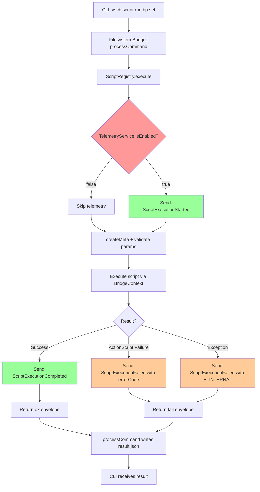
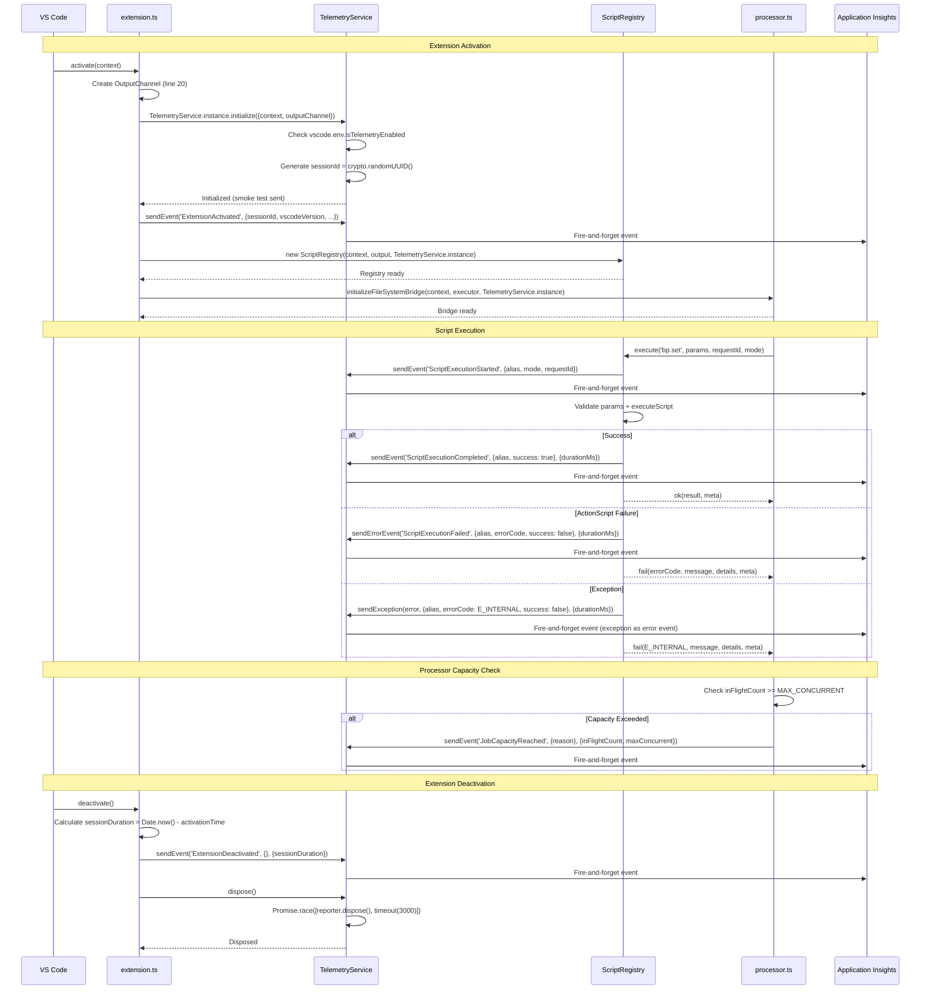

# Phase 2: Core Event Instrumentation — Tasks & Alignment Brief

**Phase**: Phase 2: Core Event Instrumentation
**Slug**: `phase-2-core-event-instrumentation`
**Date Created**: 2025-01-24
**Spec**: [application-insights-telemetry-spec.md](/workspaces/wormhole/docs/plans/22-application-insights-telemetry/application-insights-telemetry-spec.md)
**Plan**: [application-insights-telemetry-plan.md](/workspaces/wormhole/docs/plans/22-application-insights-telemetry/application-insights-telemetry-plan.md)
**Deep Research**: [deep-research.md](/workspaces/wormhole/docs/plans/22-application-insights-telemetry/deep-research.md)

---

## Tasks

| Status | ID | Task | Type | Dependencies | Absolute Path(s) | Validation | Subtasks | Notes |
|--------|----|----- |------|--------------|------------------|------------|----------|-------|
| [x] | T001 | Import TelemetryService in extension.ts | Setup | – | `/workspaces/wormhole/packages/extension/src/extension.ts` | Import statement added at top of file | – | ✅ Added import statement for TelemetryService |
| [x] | T002 | Initialize TelemetryService after OutputChannel creation in activate() | Core | T001 | `/workspaces/wormhole/packages/extension/src/extension.ts` | TelemetryService.instance.initialize() called after line 20, uses options object pattern with context + outputChannel | – | ✅ Initialized with options object pattern, wrapped in try-catch |
| [x] | T003 | Track ExtensionActivated event in activate() | Core | T002 | `/workspaces/wormhole/packages/extension/src/extension.ts` | Event sent with properties: sessionId, vscodeVersion, extensionVersion, platform, remoteName (vscode.env.remoteName) | – | ✅ Event sent with all required properties including sessionId |
| [x] | T004 | Calculate session start time for deactivation duration | Setup | – | `/workspaces/wormhole/packages/extension/src/extension.ts` | Global variable `extensionActivationTime: number` declared and set in activate() | – | ✅ Added global variable and set at activation time |
| [x] | T005 | Track ExtensionDeactivated event in deactivate() | Core | T002, T004 | `/workspaces/wormhole/packages/extension/src/extension.ts` | Event sent with sessionDuration measurement (ms), dispose() races with 3s timeout | – | ✅ Event sent with sessionDuration, dispose races with 3s timeout |
| [x] | T006A | Add getSessionId() method to TelemetryService | Core | T002 | `/workspaces/wormhole/packages/extension/src/core/telemetry/TelemetryService.ts` | Public getSessionId() method added to ITelemetry interface and TelemetryService implementation | – | ✅ Added to both ITelemetry interface and TelemetryService class |
| [x] | T006 | Add telemetry parameter to ScriptRegistry constructor | Core | T006A | `/workspaces/wormhole/packages/extension/src/core/registry/ScriptRegistry.ts` | Constructor signature includes optional telemetry parameter, stored as private field | – | ✅ Constructor accepts telemetry parameter, stored as private field |
| [x] | T007 | Pass TelemetryService to ScriptRegistry in extension.ts activate() | Integration | T002, T006 | `/workspaces/wormhole/packages/extension/src/extension.ts` | ScriptRegistry constructor receives TelemetryService.instance | – | ✅ Passed TelemetryService.instance to ScriptRegistry constructor |
| [x] | T008 | Instrument ScriptRegistry.execute() - entry point (ScriptExecutionStarted) | Core | T006 | `/workspaces/wormhole/packages/extension/src/core/registry/ScriptRegistry.ts` | Send ScriptExecutionStarted event after createMeta (line 271) with properties: sessionId, alias, mode, requestId | – | ✅ ScriptExecutionStarted event with sessionId, wrapped in try-catch |
| [x] | T009 | Instrument ScriptRegistry.execute() - success path (ScriptExecutionCompleted) | Core | T006 | `/workspaces/wormhole/packages/extension/src/core/registry/ScriptRegistry.ts` | Send ScriptExecutionCompleted event before ok() return (line 473) with sessionId, alias, success: true, measurements: { durationMs } | – | ✅ ScriptExecutionCompleted with sessionId and durationMs measurement |
| [x] | T010 | Instrument ScriptRegistry.execute() - ActionScript failure path (ScriptExecutionFailed) | Core | T006 | `/workspaces/wormhole/packages/extension/src/core/registry/ScriptRegistry.ts` | Send ScriptExecutionFailed event in ActionScript failure block (line 452) with sessionId, alias, errorCode, success: false, measurements: { durationMs } | – | ✅ ScriptExecutionFailed error event with ErrorCode extraction and sessionId |
| [x] | T011 | Instrument ScriptRegistry.execute() - exception path (ScriptExecutionFailed with E_INTERNAL) | Core | T006 | `/workspaces/wormhole/packages/extension/src/core/registry/ScriptRegistry.ts` | Send ScriptExecutionFailed event in catch block (line 498) with sessionId, alias, errorCode: E_INTERNAL, success: false, scrubbed stack trace, measurements: { durationMs } | – | ✅ Exception path with scrubPII() for message and stack, sessionId included |
| [x] | T012 | Find processor.ts capacity check location | Setup | – | `/workspaces/wormhole/packages/extension/src/core/fs-bridge/processor.ts` | Line numbers identified for capacity/flood checks, launchJob signature understood | – | ✅ Identified capacity and flood check locations |
| [x] | T013 | Add telemetry parameter to launchJob() function | Core | T012 | `/workspaces/wormhole/packages/extension/src/core/fs-bridge/processor.ts` | launchJob signature includes optional telemetry parameter, passed through to capacity/flood checks | – | ✅ Added telemetry parameter and passed to processCommand |
| [x] | T014 | Instrument processor.ts launchJob() - capacity reached (JobCapacityReached) | Core | T013 | `/workspaces/wormhole/packages/extension/src/core/fs-bridge/processor.ts` | Send JobCapacityReached event when inFlightCount >= maxConcurrent with sessionId, reason, measurements: { inFlightCount, maxConcurrent } | – | ✅ JobCapacityReached event with sessionId and measurements |
| [x] | T015 | Instrument processor.ts launchJob() - flood protection (JobFloodDetected) | Core | T013 | `/workspaces/wormhole/packages/extension/src/core/fs-bridge/processor.ts` | Send JobFloodDetected event when flood protection triggers (~line 223-245) with sessionId, reason, measurements: { failureCount, retryAfterSeconds }. Throttle: max 1 event per 60 seconds | – | ✅ JobFloodDetected with 60s throttling, sessionId, fixed retryAfter || 0 |
| [x] | T016 | Instrument processor.ts processCommand() - completion (CommandProcessingCompleted) | Core | T013 | `/workspaces/wormhole/packages/extension/src/core/fs-bridge/processor.ts` | Send CommandProcessingCompleted event at success (line ~483) and error (line ~533) paths with sessionId, scriptName, duration, success, cancelled | – | ✅ CommandProcessingCompleted in both success and error paths with sessionId |
| [x] | T017 | Pass telemetry to initializeFileSystemBridge() in fs-bridge/index.ts | Integration | T013 | `/workspaces/wormhole/packages/extension/src/core/fs-bridge/index.ts` | initializeFileSystemBridge signature includes telemetry parameter, passed to launchJob/processCommand | – | ✅ Telemetry parameter added to BridgeManager and passed to all launchJob calls |
| [x] | T018 | Pass TelemetryService to initializeFileSystemBridge() in extension.ts activate() | Integration | T002, T017 | `/workspaces/wormhole/packages/extension/src/extension.ts` | initializeFileSystemBridge call includes TelemetryService.instance | – | ✅ Passed TelemetryService.instance as third parameter |

---

## Alignment Brief

### Previous Phase Review

#### A. Completed Deliverables

**Core Service Files**:

- **File**: `/workspaces/wormhole/packages/extension/src/core/telemetry/TelemetryService.ts`
  - **Contains**: `TelemetryService` class (singleton)
  - **Purpose**: Privacy-first Application Insights telemetry service with lifecycle management
  - **Key Methods**: `initialize(options)`, `sendEvent()`, `sendErrorEvent()`, `sendException()`, `isEnabled()`, `dispose()`

- **File**: `/workspaces/wormhole/packages/extension/src/core/telemetry/types.ts`
  - **Contains**: `ITelemetry` interface, `TelemetryInitializeOptions` interface
  - **Purpose**: Type definitions for telemetry service contract and initialization options

- **File**: `/workspaces/wormhole/packages/extension/src/core/telemetry/privacy.ts`
  - **Contains**: `sanitizePath()`, `scrubPII()`, `sanitizeParams()` utility functions
  - **Purpose**: Privacy utilities for path/PII sanitization (will be used in Phase 3)

- **File**: `/workspaces/wormhole/packages/extension/src/core/telemetry/index.ts`
  - **Contains**: Barrel exports (TelemetryService, ITelemetry, TelemetryInitializeOptions, privacy utils)
  - **Purpose**: Clean public API surface for telemetry module

**Configuration Files**:

- **File**: `/workspaces/wormhole/packages/extension/package.json`
  - **Contains**: `@vscode/extension-telemetry@^0.9.0` dependency, `vscBridge.telemetry.enabled` configuration
  - **Purpose**: npm dependency + VS Code settings (setting not wired yet - Phase 4)

#### B. Lessons Learned

- **API adaptation required**: TelemetryReporter lacks `sendTelemetryException` method - adapted to use `sendTelemetryErrorEvent` with exception metadata
- **Options object pattern superior**: TelemetryInitializeOptions proved valuable for clean initialization
- **Smoke test event critical**: "TelemetryInitialized" event provides immediate verification feedback
- **OutputChannel logging requires privacy discipline**: Property-keys-only pattern prevents PII leaks
- **Task consolidation effective**: Combined T003 + T017 into single operation

#### C. Technical Discoveries

- **TelemetryReporter API mismatch**: Must use `sendTelemetryErrorEvent()` not `sendTelemetryException()`
- **UUID generation via crypto.randomUUID()**: No external UUID library needed
- **3-second timeout prevents deadlock**: `Promise.race([dispose(), timeout(3000)])` critical for deactivation
- **VS Code telemetry API vs config**: `vscode.env.isTelemetryEnabled` is authoritative, never read config directly
- **Workspace folder index for privacy**: Use `<ws:0>` not workspace name to avoid PII
- **SHA256 hashing for absolute paths**: Paths outside workspace use `<abs#hash>` format
- **4-tier precedence chain**: VS Code global → extension setting → dev mode → env var
- **Webpack compilation clean**: No TypeScript errors, ~4 second build time

#### D. Dependencies for Next Phase

**TelemetryService (Singleton)**:

Access Pattern:
```typescript
import { TelemetryService } from './core/telemetry';
const telemetry = TelemetryService.instance;
```

**Key Methods**:
- `initialize(options: TelemetryInitializeOptions): void` - Required: context + outputChannel; Optional: connectionString
- `sendEvent(eventName: string, properties?: Record<string, string>, measurements?: Record<string, number>): void`
- `sendErrorEvent(eventName: string, properties?, measurements?): void`
- `sendException(exception: Error, properties?, measurements?): void`
- `isEnabled(): boolean`
- `dispose(): Promise<void>`

**Session Correlation**:
- `sessionId: string` (private field, UUID generated via `crypto.randomUUID()`)
- Available in smoke test event properties

**Privacy Utilities** (for Phase 3):
- `sanitizePath(filePath, workspaceFolders?): string`
- `scrubPII(input: string): string`
- `sanitizeParams(params: Record<string, unknown>): Record<string, string>`

**Interfaces**:
- `ITelemetry` - Service interface (for dependency injection)
- `TelemetryInitializeOptions` - Options object pattern

**Environment Variables**:
- `VSCBRIDGE_TELEMETRY_IN_DEV=1` - Enable telemetry in development mode
- `APPLICATIONINSIGHTS_CONNECTION_STRING` - Override connection string

**Configuration Settings**:
- `vscBridge.telemetry.enabled` (boolean, default: true) - Not wired yet (Phase 4)

**VS Code API Integration**:
- Uses `vscode.env.isTelemetryEnabled` (NOT configuration setting)
- Registers `vscode.env.onDidChangeTelemetryEnabled` listener

#### E. Critical Findings Applied

- ✅ **Discovery 01**: Deactivation deadlock - 3-second dispose timeout implemented
- ✅ **Discovery 02**: VS Code API - uses `vscode.env.isTelemetryEnabled` not config
- ✅ **Discovery 03**: Singleton pattern - matches codebase conventions
- ✅ **Discovery 08**: Path sanitization - uses workspace index `<ws:0>` not name
- ✅ **Discovery 09**: Precedence chain - 4-tier enforcement implemented
- ✅ **Discovery 10**: OutputChannel logging - `[Telemetry]` prefix pattern established

**Not Yet Applied (Phase 2 Scope)**:
- Discovery 04: ScriptRegistry instrumentation (this phase)
- Discovery 06: Processor layer instrumentation (this phase)
- Discovery 07: StructuredError taxonomy (this phase)

#### F. Blocked/Incomplete Items

**None** - Phase 1 complete with all 17 tasks (T001-T017) finished. All acceptance criteria met.

**Manual Testing Deferred**: Tests 1-7 defined but not executed (by design per Testing Strategy).

#### G. Test Infrastructure

**Testing Approach**: Manual Verification Only

**Status**: No automated tests (per spec). Manual tests defined but not executed.

**Build Verification**: Successful compilation via `just build` (webpack confirms no TypeScript errors).

#### H. Technical Debt & Workarounds

**Hardcoded Connection String**:
- **Location**: TelemetryService.ts:19
- **TODO**: "Consider configuration file or remote config for rotation"
- **Current**: Hardcoded DEFAULT_CONNECTION_STRING with env var override
- **Impact**: Acceptable for Phase 2 (per Microsoft guidance)

**Extension-Specific Config Not Wired**:
- **Gap**: `vscBridge.telemetry.enabled` setting defined but not read by initialize()
- **Deferred to**: Phase 4 (Integration and Configuration)

**No BridgeContext Integration Yet**:
- **Gap**: TelemetryService not available to scripts via BridgeContext
- **Deferred to**: Phase 4

**Manual Testing Not Executed**:
- **Risk**: Privacy/initialization bugs uncaught until later
- **Mitigation**: Smoke test event provides basic feedback

**Architectural Patterns Established**:

1. **Singleton with nullish coalescing**: `static get instance()` pattern
2. **Options object for initialization**: TelemetryInitializeOptions interface
3. **Fire-and-forget event sending**: No await, all `void` returns
4. **Privacy-first sanitization**: Caller responsible (explicit at call sites)
5. **OutputChannel property-keys-only logging**: Never log values
6. **Graceful degradation**: Try-catch wrapping, extension always works
7. **Dev mode gating**: Explicit opt-in via VSCBRIDGE_TELEMETRY_IN_DEV=1
8. **3-second dispose timeout**: Prevents deactivation deadlock
9. **Smoke test pattern**: Immediate verification events
10. **4-tier precedence chain**: Explicit configuration hierarchy

**Anti-patterns to Avoid** (from Phase 1):

1. ❌ Reading `telemetry.telemetryLevel` config directly - use API instead
2. ❌ Using `sendTelemetryException` - doesn't exist, use `sendTelemetryErrorEvent`
3. ❌ Blocking on dispose - always race with timeout
4. ❌ Logging property values to OutputChannel - keys only
5. ❌ Sending unsanitized file paths - always use sanitizePath()
6. ❌ Throwing errors from telemetry code - wrap in try-catch
7. ❌ Enabling telemetry by default in dev mode - require opt-in
8. ❌ Using workspace folder name - use index instead
9. ❌ Double initialization without idempotency - check `if (reporter)` first
10. ❌ Awaiting telemetry calls - always fire-and-forget

#### I. Scope Changes

**Tasks Added**: T016 (smoke test), T017 (TelemetryInitializeOptions) during "Did You Know" session

**No Tasks Removed/Simplified**: All 17 tasks completed per acceptance criteria

#### J. Key Execution Log References

- [Options Object Pattern](/workspaces/wormhole/docs/plans/22-application-insights-telemetry/tasks/phase-1/execution.log.md#t003--t017-create-itelemetry-and-telemetryinitializeoptions-interfaces-in-typests) - T003 + T017 discussion
- [API Adaptation](/workspaces/wormhole/docs/plans/22-application-insights-telemetry/tasks/phase-1/execution.log.md#t004-t009-t016-implement-telemetryservice-singleton-class) - sendException adaptation
- [Build Success](/workspaces/wormhole/docs/plans/22-application-insights-telemetry/tasks/phase-1/execution.log.md#build-and-compilation) - Webpack compilation results
- [Critical Discoveries Implementation](/workspaces/wormhole/docs/plans/22-application-insights-telemetry/tasks/phase-1/execution.log.md#critical-discoveries-implemented) - All Phase 1 discoveries verified

---

### Objective

Instrument ScriptRegistry and filesystem bridge processor to track core events (lifecycle, execution, errors, capacity). Enable observability into:
- Extension activation/deactivation lifecycle
- Script execution pipeline (started, completed, failed)
- Error patterns with ErrorCode taxonomy
- Capacity limits and flood protection triggers

**Behavior Checklist** (maps to plan Acceptance Criteria):
- [ ] ExtensionActivated event sent on activate() with sessionId, vscodeVersion, extensionVersion, platform, remoteName
- [ ] ExtensionDeactivated event sent on deactivate() with sessionDuration measurement
- [ ] ScriptExecutionStarted event sent at script entry (after createMeta)
- [ ] ScriptExecutionCompleted event sent on success path (with durationMs)
- [ ] ScriptExecutionFailed event sent on ActionScript failure (with errorCode)
- [ ] ScriptExecutionFailed event sent on exception (with E_INTERNAL + scrubbed stack)
- [ ] JobCapacityReached event sent when processor hits capacity limit
- [ ] JobFloodDetected event sent when flood protection triggers (throttled to 1/60s)
- [ ] CommandProcessingCompleted event sent at processor completion (success/error/cancelled)
- [ ] All telemetry wrapped in try-catch (extension never crashes due to telemetry)
- [ ] Fire-and-forget pattern used (no await on telemetry calls)
- [ ] ErrorCode taxonomy preserved from StructuredError failures

---

### Non-Goals (Scope Boundaries)

❌ **NOT doing in Phase 2:**
- Privacy sanitization of event properties (Phase 3: Privacy and Sanitization)
  - File paths will be sent raw in Phase 2
  - Error messages not yet scrubbed for PII
  - Script parameters not yet sanitized
  - **Rationale**: Phase 2 focuses on instrumentation points; Phase 3 applies sanitization
- BridgeContext integration (Phase 4: Integration and Configuration)
  - TelemetryService not yet available via BridgeContext
  - Scripts cannot send custom telemetry yet
- Extension-specific configuration wiring (Phase 4)
  - `vscBridge.telemetry.enabled` setting not yet read
  - Only VS Code global setting + dev mode gating active
- Documentation (Phase 5: Documentation)
  - No README updates
  - No docs/telemetry.md yet
- Manual validation (Phase 6: Manual Validation)
  - Events not yet verified in Application Insights portal
  - No privacy inspection yet
  - No performance measurement yet
- High-frequency DAP events
  - Only lifecycle and script execution events
  - No per-step debugging events (would be too expensive)
- Sampling/throttling logic
  - All events sent (except JobFloodDetected which has built-in 60s throttle)
  - Sampling considerations deferred to future if cost becomes issue
- Custom dimensions/measurements beyond spec
  - Only properties/measurements defined in plan tasks
  - No additional metadata collection
- Retry logic for failed telemetry sends
  - TelemetryReporter handles retry internally
  - We don't add additional retry layer

---

### Critical Findings Affecting This Phase

**🚨 Critical Discovery 04: ScriptRegistry as Single Instrumentation Point**
- **What it constrains**: Must instrument ScriptRegistry.execute() at exactly 3 points (entry, success, failure)
- **Why it matters**: Single execution path for all 86+ scripts - avoids duplicating telemetry code
- **Which tasks address it**: T008 (entry), T009 (success), T010 (ActionScript failure), T011 (exception)
- **Implementation requirement**: Insert telemetry calls at specific line numbers identified in plan (271, 473, 452, 498)

**🔥 High Discovery 06: Processor Layer Capacity/Flood Events**
- **What it constrains**: Processor layer cannot access BridgeContext - needs direct telemetry injection
- **Why it matters**: Capacity tracking requires telemetry at processor boundary
- **Which tasks address it**: T013 (add telemetry parameter), T014 (capacity), T015 (flood), T016 (completion), T017-T018 (wire through)
- **Implementation requirement**: Pass TelemetryService directly to initializeFileSystemBridge() and processor functions

**🔥 High Discovery 07: StructuredError as Error Taxonomy Source**
- **What it constrains**: Must extract ErrorCode from StructuredError when tracking failures
- **Why it matters**: Preserves error categorization for Application Insights queries
- **Which tasks address it**: T010 (ActionScript failure - extract errorCode from actionResult)
- **Implementation requirement**: `const errorCode = actionResult.errorCode || (actionResult.reason?.startsWith('E_') ? actionResult.reason : ErrorCode.E_INTERNAL)`

**✅ Applied from Phase 1 (still relevant)**:
- **Discovery 01**: 3-second dispose timeout (T005 must implement in deactivate)
- **Discovery 02**: Use vscode.env.isTelemetryEnabled (T003 already initialized in Phase 1)
- **Discovery 10**: OutputChannel logging (all tasks follow property-keys-only pattern)

---

### Invariants & Guardrails

**Performance**:
- **< 5ms overhead per operation**: Fire-and-forget pattern (no await), no blocking I/O
- **No synchronous waits**: All telemetry calls are void-returning, non-blocking
- **Graceful degradation**: Extension continues working even if telemetry completely fails
- **Budget**: Phase 2 adds ~10 telemetry events total across lifecycle - minimal overhead

**Privacy** (enforced in Phase 3, noted here for awareness):
- **Raw paths in Phase 2**: File paths sent unsanitized (Phase 3 will fix)
- **No PII scrubbing yet**: Error messages sent raw (Phase 3 will fix)
- **Temporary state**: Phase 2 is instrumentation scaffold, Phase 3 adds privacy layer

**Error Handling**:
- **Try-catch wrapping**: Every telemetry call wrapped in try-catch block
- **Never throw from telemetry**: Errors logged to OutputChannel, never propagated
- **Nested try-catch for exception path**: T011 needs nested try-catch (telemetry error shouldn't mask script error)

**Fire-and-Forget Pattern**:
- **No await on telemetry**: All sendEvent/sendErrorEvent calls are fire-and-forget
- **Void returns**: Never wait for telemetry completion
- **No Promise chaining**: Don't use `.then()` or `.catch()` on telemetry calls

**Telemetry Enablement Checks**:
- **Always check isEnabled()**: Every sendEvent call preceded by `telemetry?.isEnabled()` check
- **Optional chaining**: Use `telemetry?.sendEvent()` pattern (telemetry parameter is optional)
- **Fail-safe**: If telemetry undefined or disabled, no-op gracefully

---

### Inputs to Read

**Required Reading**:

1. **Phase 1 Execution Log**: `/workspaces/wormhole/docs/plans/22-application-insights-telemetry/tasks/phase-1/execution.log.md`
   - Complete implementation notes from Phase 1
   - API adaptations and lessons learned
   - Anti-patterns to avoid

2. **TelemetryService Implementation**: `/workspaces/wormhole/packages/extension/src/core/telemetry/TelemetryService.ts`
   - Lines 1-310: Full implementation of singleton service
   - Understand initialize(), sendEvent(), sendErrorEvent(), sendException(), isEnabled(), dispose()

3. **ITelemetry Interface**: `/workspaces/wormhole/packages/extension/src/core/telemetry/types.ts`
   - Lines 9-64: Interface definition
   - Understand method signatures and JSDoc warnings

4. **extension.ts activate()**: `/workspaces/wormhole/packages/extension/src/extension.ts`
   - Lines 19-103: Activation flow
   - Line 20: OutputChannel creation (insert TelemetryService.initialize after this)
   - Line 87: ScriptRegistry constructor (add telemetry parameter)
   - Line 106: initializeFileSystemBridge call (add telemetry parameter)

5. **extension.ts deactivate()**: `/workspaces/wormhole/packages/extension/src/extension.ts`
   - Lines 275-310: Deactivation flow
   - Insert ExtensionDeactivated event + dispose before line 289 (bridgeManager disposal)

6. **ScriptRegistry.execute()**: `/workspaces/wormhole/packages/extension/src/core/registry/ScriptRegistry.ts`
   - Lines 262-515: Complete execute method
   - Line 271: Entry point (after createMeta) - T008
   - Line 473: Success path (before ok()) - T009
   - Line 452: ActionScript failure - T010
   - Line 498: Exception path (in catch) - T011

7. **processor.ts launchJob()**: `/workspaces/wormhole/packages/extension/src/core/fs-bridge/processor.ts`
   - Lines 218-260: launchJob function (verify exact line numbers in T012)
   - Find capacity check and flood protection check locations

8. **processor.ts processCommand()**: `/workspaces/wormhole/packages/extension/src/core/fs-bridge/processor.ts`
   - Lines 431-540: processCommand function (verify exact line numbers in T012)
   - Find success and error return paths

9. **ErrorCode Taxonomy**: `/workspaces/wormhole/packages/extension/src/core/response/errorTaxonomy.ts`
   - Understand ErrorCode enum values (E_TIMEOUT, E_CAPACITY, E_NO_SESSION, E_INTERNAL, etc.)

**Reference Documentation**:
- [Deep Research Document](/workspaces/wormhole/docs/plans/22-application-insights-telemetry/deep-research.md) - Discovery 04, 06, 07
- [Phase 1 Tasks](/workspaces/wormhole/docs/plans/22-application-insights-telemetry/tasks/phase-1/tasks.md) - Patterns and critical insights

---

### Visual Alignment Aids

#### Flow Diagram: Script Execution Telemetry Flow



#### Sequence Diagram: Extension Lifecycle + Script Execution Telemetry



---

### Test Plan

**Approach**: Manual Verification Only (per spec Testing Strategy)

**Rationale**: Phase 2 is instrumentation wiring. Manual verification confirms events are sent; privacy/correctness validated in Phase 6.

**Manual Test Procedures**:

#### Test 1: Extension Lifecycle Events
**Objective**: Verify ExtensionActivated and ExtensionDeactivated events sent
**Procedure**:
1. Set `VSCBRIDGE_TELEMETRY_IN_DEV=1` in terminal
2. Launch Extension Host (F5)
3. Check OutputChannel for:
   - `[Telemetry] ✅ Initialized`
   - `[Telemetry] 📤 Event: ExtensionActivated [props: sessionId, vscodeVersion, extensionVersion, platform, remoteName]`
4. Close VS Code window
5. Check OutputChannel showed: `[Telemetry] 📤 Event: ExtensionDeactivated [props: ...]` before closure
6. **Expected**: Both events logged, VS Code closes within 5 seconds (dispose timeout working)

#### Test 2: Script Execution Events (Success Path)
**Objective**: Verify ScriptExecutionStarted and ScriptExecutionCompleted sent
**Procedure**:
1. With telemetry enabled, run: `vscb script run bp.list`
2. Check OutputChannel for sequence:
   - `[Telemetry] 📤 Event: ScriptExecutionStarted [props: alias, mode, requestId]`
   - (script runs)
   - `[Telemetry] 📤 Event: ScriptExecutionCompleted [props: alias, success] [measurements: durationMs]`
3. **Expected**: Both events logged with correct property keys

#### Test 3: Script Execution Events (Failure Path)
**Objective**: Verify ScriptExecutionFailed sent with errorCode
**Procedure**:
1. With telemetry enabled, run: `vscb script run bp.set` (without required params - will fail)
2. Check OutputChannel for sequence:
   - `[Telemetry] 📤 Event: ScriptExecutionStarted [props: ...]`
   - (script fails validation)
   - `[Telemetry] 📤 Event: ScriptExecutionFailed [props: alias, errorCode, success] [measurements: durationMs]`
3. **Expected**: ScriptExecutionFailed logged with errorCode: E_INVALID_PARAMS

#### Test 4: Script Execution Events (Exception Path)
**Objective**: Verify ScriptExecutionFailed sent with E_INTERNAL for exceptions
**Procedure**:
1. Create test script that throws exception
2. Execute via ScriptRegistry
3. Check OutputChannel for:
   - `[Telemetry] 📤 Event: ScriptExecutionStarted [props: ...]`
   - `[Telemetry] 📤 Exception: Error [props: ...]` (from sendException)
4. **Expected**: Exception event logged with E_INTERNAL errorCode

#### Test 5: Processor Capacity Event
**Objective**: Verify JobCapacityReached sent when processor hits capacity
**Procedure**:
1. Submit 11+ concurrent jobs to filesystem bridge (exceeds MAX_CONCURRENT=10)
2. Check OutputChannel for:
   - `[Telemetry] 📤 Event: JobCapacityReached [props: reason] [measurements: inFlightCount, maxConcurrent]`
3. **Expected**: Event logged when 11th job rejected

#### Test 6: Processor Flood Event (with Throttling)
**Objective**: Verify JobFloodDetected sent with 60s throttling
**Procedure**:
1. Trigger flood protection (10 failures in 60s)
2. Check OutputChannel for:
   - `[Telemetry] 📤 Event: JobFloodDetected [props: reason] [measurements: failureCount, retryAfterSeconds]`
3. Trigger flood protection again within 60s
4. **Expected**: Second event NOT sent (throttled)

#### Test 7: End-to-End Smoke Test with Portal Verification
**Objective**: Verify events actually reach Application Insights backend (not just OutputChannel logging)
**Procedure**:
1. With telemetry enabled (`VSCBRIDGE_TELEMETRY_IN_DEV=1`), launch Extension Host
2. Trigger multiple event types:
   - Extension activation (automatic)
   - Run: `vscb script run bp.list` (success path)
   - Run: `vscb script run bp.set` (failure path - missing params)
   - Extension deactivation (close VS Code)
3. Wait 3 minutes (Application Insights ingestion delay)
4. Open Azure Portal → Application Insights → Logs
5. Run Kusto queries to verify events arrived:

```kusto
// Query 1: Verify smoke test event (TelemetryInitialized)
customEvents
| where name == "TelemetryInitialized"
| where timestamp > ago(10m)
| project timestamp, name, sessionId=tostring(customDimensions.sessionId),
          extensionVersion=tostring(customDimensions.extensionVersion),
          platform=tostring(customDimensions.platform)
| top 5 by timestamp desc

// Query 2: Verify lifecycle events
customEvents
| where name in ("ExtensionActivated", "ExtensionDeactivated")
| where timestamp > ago(10m)
| project timestamp, name, sessionId=tostring(customDimensions.sessionId),
          sessionDuration=todouble(customMeasurements.sessionDuration)
| order by timestamp desc

// Query 3: Verify script execution events (all types)
customEvents
| where name in ("ScriptExecutionStarted", "ScriptExecutionCompleted", "ScriptExecutionFailed")
| where timestamp > ago(10m)
| project timestamp, name, sessionId=tostring(customDimensions.sessionId),
          alias=tostring(customDimensions.alias),
          success=tostring(customDimensions.success),
          errorCode=tostring(customDimensions.errorCode),
          durationMs=todouble(customMeasurements.durationMs)
| order by timestamp desc
```

6. **Validation Checklist**:
   - [ ] TelemetryInitialized event present with sessionId, extensionVersion, platform properties
   - [ ] ExtensionActivated event present with matching sessionId
   - [ ] ExtensionDeactivated event present with sessionDuration measurement (> 0)
   - [ ] ScriptExecutionStarted event for bp.list with sessionId, alias, mode, requestId
   - [ ] ScriptExecutionCompleted event for bp.list with sessionId, durationMs measurement
   - [ ] ScriptExecutionFailed event for bp.set with sessionId, errorCode property
   - [ ] All events share same sessionId (correlation working)
   - [ ] Measurements are numeric (not strings): durationMs, sessionDuration
   - [ ] Timestamps are reasonable (within test execution window)

7. **Expected**: All events present in Application Insights, properties/measurements correctly typed, sessionId correlation working

**Troubleshooting**:
- If no events appear after 5 minutes → Check connection string, verify network access
- If events have wrong sessionId → Check TelemetryService.getSessionId() implementation
- If measurements are strings → Check sendEvent() calls use measurements parameter correctly
- If properties missing → Check OutputChannel logs for property keys, compare with portal data

---

### Step-by-Step Implementation Outline

**Mapped 1:1 to Tasks**:

**Phase 2A: Extension Lifecycle (T001-T005)**
1. T001: Import TelemetryService in extension.ts
2. T002: Initialize after OutputChannel creation (line 20)
3. T003: Send ExtensionActivated event
4. T004: Add global activationTime variable
5. T005: Track ExtensionDeactivated in deactivate()

**Phase 2B: ScriptRegistry Instrumentation (T006-T011)**
6. T006: Add telemetry parameter to ScriptRegistry constructor
7. T007: Pass TelemetryService.instance from extension.ts
8. T008: Instrument execute() entry point (ScriptExecutionStarted)
9. T009: Instrument success path (ScriptExecutionCompleted)
10. T010: Instrument ActionScript failure (ScriptExecutionFailed with errorCode)
11. T011: Instrument exception path (ScriptExecutionFailed with E_INTERNAL)

**Phase 2C: Processor Instrumentation (T012-T016)**
12. T012: Find processor.ts capacity/flood check locations
13. T013: Add telemetry parameter to launchJob()
14. T014: Instrument capacity reached (JobCapacityReached)
15. T015: Instrument flood protection (JobFloodDetected with throttling)
16. T016: Instrument processCommand completion (CommandProcessingCompleted)

**Phase 2D: Wiring (T017-T018)**
17. T017: Pass telemetry to initializeFileSystemBridge()
18. T018: Pass TelemetryService.instance from extension.ts

**Phase 2E: Manual Validation** (Post-Implementation)
19. Execute Test 1-7 procedures (see Test Plan above)
20. Document results in execution.log.md

---

### Commands to Run

**Build & Verify**:
```bash
# Build extension (from project root)
cd /workspaces/wormhole
just build

# Verify no TypeScript errors
npx tsc --noEmit -p packages/extension/tsconfig.json
```

**Launch Extension Host for Testing**:
```bash
# From project root, with telemetry enabled
VSCBRIDGE_TELEMETRY_IN_DEV=1 code /workspaces/wormhole

# Then: F5 (Start Debugging) OR Run > Start Debugging
# Select "Run Extension" launch configuration
```

**Test Script Execution**:
```bash
# From test workspace (Extension Host)
cd /workspaces/wormhole/test

# Test success path
vscb script run bp.list

# Test failure path (missing params)
vscb script run bp.set

# Test with valid params
vscb script run bp.set --param path=/workspaces/wormhole/test/python/test_example.py --param line=29
```

**Check OutputChannel**:
```
# In Extension Host VS Code window:
# View > Output > Select "VSC-Bridge" from dropdown
# Look for [Telemetry] log lines
```

---

### Risks & Unknowns

| Risk | Severity | Likelihood | Mitigation |
|------|----------|------------|------------|
| Performance overhead exceeds 5ms | Medium | Low | Fire-and-forget pattern (no await), telemetry operations are non-blocking |
| Event volume too high (cost concern) | Medium | Low | Only tracking core events (lifecycle + script execution), no high-frequency DAP events |
| Instrumentation breaks script execution | High | Low | Wrap all telemetry in try-catch, graceful degradation ensures extension continues working |
| Telemetry calls block critical paths | High | Low | Fire-and-forget pattern, all sendEvent calls return void immediately |
| ErrorCode extraction fails for unknown error types | Medium | Medium | Fallback to E_INTERNAL if errorCode not found in actionResult |
| Processor line numbers changed since plan | Low | Medium | T012 verifies actual line numbers before instrumentation |
| Capacity/flood checks not where plan expects | Low | Medium | T012 documents actual locations, adjust T014-T015 accordingly |
| Multiple telemetry service instances created | Low | Low | Singleton pattern prevents this, but verify only one initialize() call |
| Telemetry initialization race condition | Medium | Low | Initialize early in activate() (after OutputChannel, before ScriptRegistry/Bridge) |
| TelemetryService not passed to processor | High | Low | T017-T018 explicitly wire through initializeFileSystemBridge |

**Unknowns Requiring Investigation**:
- [ ] What are the actual line numbers for processor capacity/flood checks? (T012 will verify)
- [ ] Does processCommand have clear success/error paths for T016? (T012 will verify)
- [ ] Is there existing sessionId in extension.ts we should use, or create new one? (Answer: line 44 has sessionId, but it's for ScriptRegistry - we can use for ExtensionActivated properties)
- [ ] Should we throttle JobCapacityReached events too, or just JobFloodDetected? (Decision: Only JobFloodDetected needs throttling per plan)

---

### Ready Check

**Prerequisites** (must be true before starting implementation):
- [x] Phase 1 complete and verified (TelemetryService available)
- [ ] Phase 2 tasks reviewed and understood (all T001-T018)
- [ ] Critical Findings 04, 06, 07 read and internalized
- [ ] Previous Phase Review (sections A-J) read and architectural patterns understood
- [ ] Anti-patterns from Phase 1 noted (10 items in section H)
- [ ] extension.ts, ScriptRegistry.ts, processor.ts file locations verified
- [ ] Git branch clean or ready for Phase 2 work
- [ ] Extension Host launch configuration verified working (`F5` in VS Code)
- [ ] OutputChannel "VSC-Bridge" visible in Output pane
- [ ] Build system working (`just build` succeeds)

**Go/No-Go Decision**:
- [ ] **GO**: All prerequisites checked, proceed with T001
- [ ] **NO-GO**: Clarify unknowns, verify file locations, then retry ready check

---

## Phase Footnote Stubs

**Note**: Footnotes will be added during implementation by `/plan-6a-update-progress`. This section is intentionally empty at planning time.

Footnote ledger will track:
- File modifications with substrate node IDs (flowspace references)
- Code references in format: `[method:path/to/file:functionName](path/to/file#L123)`
- Architecture decisions and their rationale
- Deviations from plan with justifications

**Initial State** (before implementation):
```markdown
[^1]: [To be added during implementation via plan-6a]
[^2]: [To be added during implementation via plan-6a]
...
```

---

## Evidence Artifacts

**Execution Log**: `/workspaces/wormhole/docs/plans/22-application-insights-telemetry/tasks/phase-2-core-event-instrumentation/execution.log.md`

**Purpose**: Chronological record of implementation progress, decisions, test results, and issues encountered.

**Content Structure**:
1. **Task Completion Log**: Each task (T001-T018) with:
   - Timestamp
   - Task ID and description
   - Implementation notes
   - Issues encountered and resolutions
   - Files modified with diffs
   - Test results (if applicable)

2. **Manual Test Results**: Execution of Test 1-7 with:
   - Timestamp
   - Test procedure followed
   - Actual results
   - Pass/Fail determination
   - Screenshots (if applicable)

3. **Critical Decisions**: Any deviations from plan or architectural choices with:
   - Decision context
   - Options considered
   - Rationale for choice
   - Impact on future phases

**Log Template** (created by `/plan-6-implement-phase`):
```markdown
# Phase 2: Core Event Instrumentation — Execution Log

## Task Completion Log

### T001: Import TelemetryService in extension.ts
**Timestamp**: [To be filled]
**Status**: [ ] Not Started | [~] In Progress | [x] Complete
**Implementation Notes**:
...

[Repeat for T002-T018]

## Manual Test Results

### Test 1: Extension Lifecycle Events
**Timestamp**: [To be filled]
**Result**: [ ] Pass | [ ] Fail
**Actual Output**:
...

[Repeat for Test 2-7]

## Critical Decisions

[To be filled during implementation]
```

---

## Directory Layout

```
/workspaces/wormhole/docs/plans/22-application-insights-telemetry/
├── application-insights-telemetry-plan.md
├── application-insights-telemetry-spec.md
├── deep-research.md
└── tasks/
    ├── phase-1/
    │   ├── tasks.md
    │   └── execution.log.md           # Complete from Phase 1
    └── phase-2-core-event-instrumentation/
        ├── tasks.md                    # This file
        └── execution.log.md            # Created by /plan-6-implement-phase
```

**Future phases will create**:
```
└── tasks/
    ├── phase-1/
    ├── phase-2-core-event-instrumentation/
    ├── phase-3-privacy-and-sanitization/
    │   ├── tasks.md
    │   └── execution.log.md
    ...
```

---

**Status**: READY — Awaiting explicit GO to proceed with `/plan-6-implement-phase --phase "Phase 2: Core Event Instrumentation" --plan "/workspaces/wormhole/docs/plans/22-application-insights-telemetry/application-insights-telemetry-plan.md"`

---

## Critical Insights Discussion

**Session**: 2025-01-24
**Context**: Phase 2: Core Event Instrumentation Tasks & Alignment Brief
**Analyst**: AI Clarity Agent
**Reviewer**: Development Team
**Format**: Water Cooler Conversation (5 Critical Insights)

### Insight 1: Privacy Risk Window - Phase 2 Deploys Raw PII to Production

**Did you know**: Phase 2 sends raw file paths, error messages, and stack traces directly to Application Insights without any PII scrubbing, meaning if deployed to users before Phase 3, we collect potentially sensitive data like file paths with client names, tokens in error messages, and emails in stack traces.

**Implications**:
- Privacy promise violation (spec says "no PII collected" but Phase 2 temporarily collects it)
- Compliance risk if GDPR regulations apply
- Data cannot be scrubbed retroactively once in Application Insights (90-day retention)
- Deployment sequencing becomes critical

**Options Considered**:
- Option A: Deploy Phase 2 + Phase 3 Atomically - Don't merge until both complete
- Option B: Feature Flag Phase 2 Telemetry - Add env var gate (default: false)
- Option C: Deploy Phase 2 with Dev-Only Gate - Require Development mode
- Option D: Accept Temporary PII Collection - Proceed as-is with warning

**AI Recommendation**: Option B (Feature Flag Phase 2 Telemetry)
- Reasoning: Balances risk and value, enables staged testing without production PII exposure, low effort

**Discussion Summary**:
Team confirmed not in production yet, no need to overbake with feature flags during development phase.

**Decision**: Accept temporary raw data in Phase 2 (dev-only environment)

**Action Items**: None - Phase 3 will add sanitization before any production deployment

**Affects**: No changes to Phase 2 tasks

---

### Insight 2: Event Volume Explosion from High-Frequency Script Execution

**Did you know**: ScriptExecutionStarted/Completed events fire for EVERY script execution, including rapid-fire debugging scenarios where a single 2-minute debugging session can generate 22 events (step-over, step-into, evaluate, etc.), potentially creating 440,000 events/month at 100 users and drowning actionable signals in noise?

**Implications**:
- Cost is manageable (220MB/month well within free tier)
- Signal-to-noise ratio is the real problem - stepping failures hide real bugs
- Query complexity increases (must filter out noise)
- Dashboard metrics skewed by high-frequency operations
- Alert fatigue (can't set simple thresholds)

**Options Considered**:
- Option A: Add Script Category Tagging - Tag events with category for filtering
- Option B: Sample High-Frequency Scripts - Only send 10% of stepping events
- Option C: Throttle Duplicate Script Executions - First + last only if >5 in 60s
- Option D: Defer High-Frequency Script Events to Phase 4 - Observe patterns first
- Option E: Keep As-Is + Smart Queries - Document query filters, no code changes

**AI Recommendation**: Option A (Script Category Tagging)
- Reasoning: Preserves all data, flexible analysis, future-proof, low cost overhead

**Discussion Summary**:
Team prefers simplicity - premature optimization to solve potential problem before it exists.

**Decision**: Keep as-is, send all events without filtering/sampling

**Action Items**: None - can address if volume becomes actual problem

**Affects**: No changes to Phase 2 tasks

---

### Insight 3: Session Correlation Gap - Two SessionIds Means Broken Event Correlation

**Did you know**: Phase 2 creates TWO different session IDs tracking the same activation session (TelemetryService generates one, extension.ts has another), making it impossible to correlate events in Application Insights because script execution events would have no/different sessionId than lifecycle events?

**Implications**:
- Can't trace user journeys ("What did user do before hitting error?")
- Can't calculate session metrics ("How many scripts per session?")
- Can't debug session-specific issues
- Broken funnel analysis (Activation → First Script → Success/Failure)

**Options Considered**:
- Option A: Use TelemetryService's sessionId Everywhere - Add getSessionId() getter, include in all events
- Option B: Use extension.ts sessionId, Pass to TelemetryService - Add to TelemetryInitializeOptions
- Option C: Generate SessionId in activate(), Pass to Everyone - Hoist generation to top
- Option D: Separate Telemetry SessionId from Script SessionId - Accept two sessionIds as intentional
- Option E: Don't Include SessionId in Script Events - Correlate by timestamp only

**AI Recommendation**: Option A (Use TelemetryService's sessionId Everywhere)
- Reasoning: Perfect event correlation, architecturally clean, low effort, future-proof

**Discussion Summary**:
Team agreed - adding sessionId correlation now prevents headaches later, enables proper Application Insights queries.

**Decision**: Use TelemetryService's sessionId for all telemetry events (Option A)

**Action Items**:
- Add `getSessionId(): string` getter to ITelemetry interface and TelemetryService
- Update T008-T011 to include sessionId property in ScriptExecution events
- Update T016 to include sessionId in CommandProcessingCompleted events

**Affects**: Tasks T006A (new), T008, T009, T010, T011, T016

---

### Insight 4: Processor Telemetry Threading Problem - Capacity/Flood Events Have No SessionId

**Did you know**: The processor layer's capacity and flood events (T014-T015) would have NO sessionId because task descriptions didn't mention including it, even though the processor receives telemetry parameter with getSessionId() access, creating inconsistent correlation where some processor events correlate and others don't?

**Implications**:
- JobCapacityReached events can't be correlated to sessions
- JobFloodDetected events can't be correlated to sessions
- CommandProcessingCompleted has sessionId but capacity/flood don't
- Can't answer "How many times did THIS session hit capacity?"

**Options Considered**:
- Option A: Add SessionId to T014-T015 Processor Events - Include sessionId in properties
- Option B: Accept Processor Events Without SessionId - Treat as system-level, not session-level
- Option C: Add Both SessionId AND RequestId - Multi-level correlation

**AI Recommendation**: Option A (Add SessionId to T014-T015)
- Reasoning: Consistency across ALL events, complete session picture, trivial effort, matches T016 pattern

**Discussion Summary**:
Team agreed - consistent sessionId correlation across all event types, no reason to exclude processor events.

**Decision**: Add sessionId to all processor events (T014-T015)

**Action Items**:
- Update T014 to include sessionId in JobCapacityReached properties
- Update T015 to include sessionId in JobFloodDetected properties

**Affects**: Tasks T014, T015

---

### Insight 5: Manual Test Gap - No Way to Verify Telemetry Without Azure Portal Access

**Did you know**: All 7 manual test procedures only verify that events are LOGGED to OutputChannel but never verify that events actually ARRIVE in Application Insights, creating a dangerous blind spot where telemetry could be silently failing (invalid connection string, network failures, type mismatches, backend throttling) and we wouldn't know until production?

**Implications**:
- False confidence (tests pass but telemetry broken)
- Production blindness (deploy broken telemetry, no visibility)
- Debug nightmare ("Why don't we have any data?" weeks later)
- Wasted Phase 2 effort (instrumentation that doesn't work)

**Options Considered**:
- Option A: Add Azure Portal Verification Steps to Manual Tests - Portal check for each test
- Option B: Create Telemetry Verification Script - Automated tool that queries Application Insights API
- Option C: Use Application Insights SDK Diagnostic Logging - Enable TelemetryReporter diagnostics
- Option D: Defer End-to-End Verification to Phase 6 - Keep Phase 2 simple, validate later
- Option E: Add Single Smoke Test with Portal Verification - Test 7 becomes comprehensive check

**AI Recommendation**: Option E (Single Comprehensive Smoke Test with Portal Verification)
- Reasoning: Pragmatic (one portal check vs. seven), catches critical failures, reasonable effort, Phase 2 appropriate

**Discussion Summary**:
Team agreed - pragmatic approach, just eyeball events in portal during Test 7 smoke test.

**Decision**: Add portal verification to Test 7 as comprehensive smoke test (Option E)

**Action Items**:
- Update Test 7 to include Azure Portal verification steps
- Add Kusto query examples for verifying events in Application Insights
- Add checklist for property/measurement validation

**Affects**: Test Plan section (Test 7)

---

## Session Summary

**Insights Surfaced**: 5 critical insights identified and discussed
**Decisions Made**: 5 decisions reached through collaborative discussion
**Action Items Created**: 3 task updates (1 new task, 5 modified tasks, 1 test procedure enhanced)
**Areas Requiring Updates**:
- Task table: Added T006A (getSessionId method), updated T008-T011, T014-T016 with sessionId
- Test Plan: Enhanced Test 7 with portal verification

**Shared Understanding Achieved**: ✓

**Confidence Level**: High - We have high confidence about proceeding with Phase 2 implementation

**Next Steps**:
Proceed with implementation using `/plan-6-implement-phase --phase "Phase 2: Core Event Instrumentation" --plan "/workspaces/wormhole/docs/plans/22-application-insights-telemetry/application-insights-telemetry-plan.md"`

**Notes**:
- Privacy risk accepted for dev environment (not in production yet)
- Event volume optimization deferred until proven necessary
- SessionId correlation standardized across all event types (lifecycle, script, processor)
- Portal verification added to catch silent telemetry failures

---
