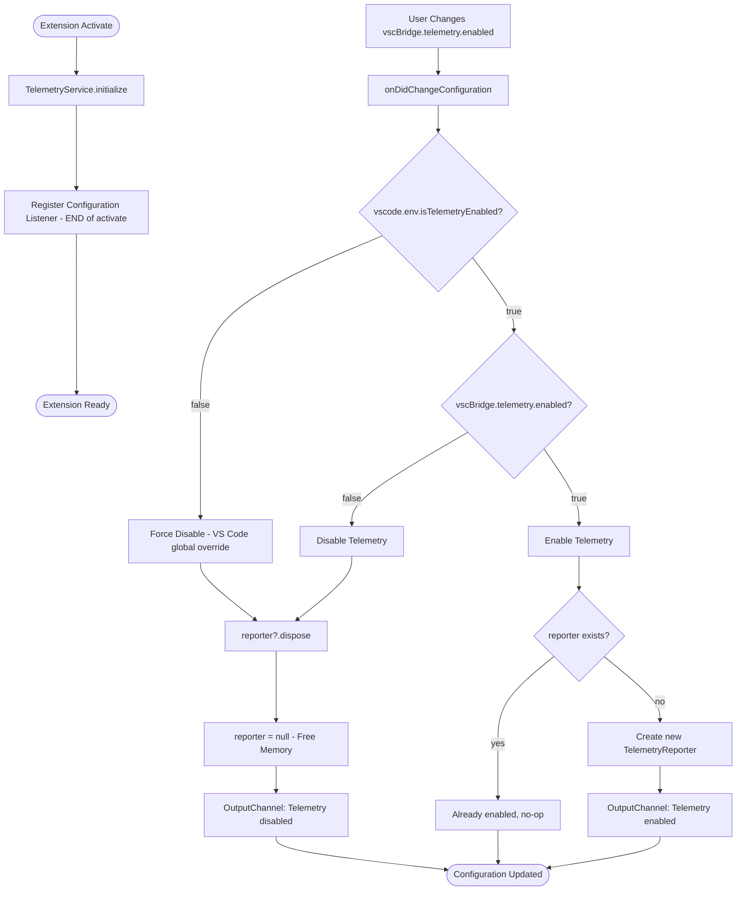
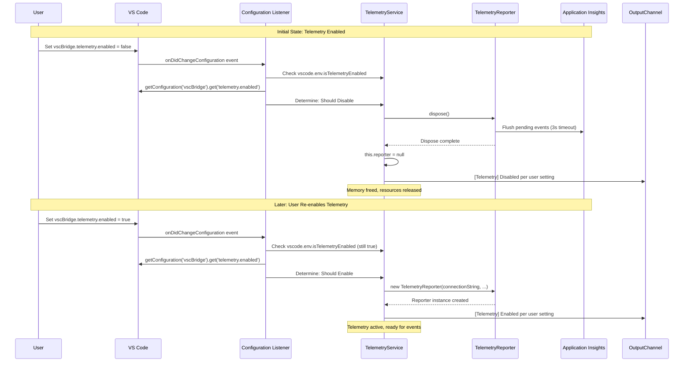

# Phase 4: Configuration and Lifecycle Management — Tasks + Alignment Brief

**Phase**: Phase 4: Configuration and Lifecycle Management
**Phase Slug**: `phase-4-configuration-and-lifecycle`
**Plan**: [`application-insights-telemetry-plan.md`](../../application-insights-telemetry-plan.md)
**Spec**: [`application-insights-telemetry-spec.md`](../../application-insights-telemetry-spec.md)
**Generated**: 2025-10-25
**Revised**: 2025-10-25 (Scope simplified—BridgeContext integration removed)

---

## Tasks

| Status | ID | Task | Type | Dependencies | Absolute Path(s) | Validation | Subtasks | Notes |
|--------|----|----|------|--------------|-----------------|-----------|----------|-------|
| [ ] | T001 | Verify vscBridge.telemetry.enabled configuration setting exists | Setup | – | `/workspaces/wormhole/packages/extension/package.json` | Setting found in `contributes.configuration.properties` with type=boolean, default=true, description present | – | Check Phase 1 task 1.13. If exists, proceed to T002. If missing, add to package.json |
| [ ] | T002 | Implement onDidChangeConfiguration listener in TelemetryService | Core | T001 | `/workspaces/wormhole/packages/extension/src/core/telemetry/TelemetryService.ts` | Method `registerConfigurationListener(context: ExtensionContext)` created. Listener watches `vscBridge.telemetry` changes, implements dispose/recreate pattern | – | **CRITICAL** per Insight #4: When disabled → `this.reporter?.dispose()`, `this.reporter = null` (frees memory). When re-enabled → create new reporter. Check if TelemetryReporter flushes on dispose |
| [ ] | T003 | Register configuration listener at END of extension.ts activate() | Integration | T002 | `/workspaces/wormhole/packages/extension/src/extension.ts` | `TelemetryService.instance.registerConfigurationListener(context)` called after line ~90 (after telemetry initialized), before final return | – | **CRITICAL** per Insight #3: Defer registration to END of activate() to prevent race condition where listener fires before TelemetryService initialized |
| [ ] | T004 | Document configuration precedence chain in code comments | Doc | T002 | `/workspaces/wormhole/packages/extension/src/core/telemetry/TelemetryService.ts` OR `/workspaces/wormhole/packages/extension/src/extension.ts` | Multi-line comment documents: (1) VS Code global `vscode.env.isTelemetryEnabled === false` → always disable, (2) Extension setting `vscBridge.telemetry.enabled === false` → always disable, (3) Development mode → require `VSCBRIDGE_TELEMETRY_IN_DEV=1` | – | Follow Discovery 09. Add near initialization or listener. Explain why each level overrides next |

---

## Alignment Brief

### Objective

**Revised Goal**: Enable user control over telemetry collection through VS Code settings, with proper lifecycle management and configuration precedence.

**What Success Looks Like**:
- ✅ Users can toggle `vscBridge.telemetry.enabled` in VS Code settings UI
- ✅ Changes take effect immediately without restart (dispose/recreate pattern)
- ✅ No memory leaks from repeated enable/disable cycles
- ✅ Configuration precedence clearly documented (VS Code global > extension setting > dev mode)
- ✅ Race condition prevented (listener registered after initialization)

**Behavior Checklist** (ties to plan acceptance criteria):
- [ ] `vscBridge.telemetry.enabled` setting visible and functional in VS Code settings UI
- [ ] Dynamic setting changes respected (no further events sent when disabled, immediate effect)
- [ ] Configuration precedence chain enforced correctly (see Discovery 09)
- [ ] No memory leaks when telemetry repeatedly enabled/disabled (dispose/recreate pattern)
- [ ] Race condition prevented (listener registered after initialization)

---

### Architecture Decision: Why BridgeContext Integration Was Removed

**Original Plan Phase 4** included tasks 4.1-4.4:
- Add `telemetry?: ITelemetryService` to IBridgeContext interface
- Update BridgeContextFactory signature (breaking change)
- Update all call sites across codebase
- Pass telemetry from ScriptRegistry to BridgeContext

**Investigation Revealed**:
- Scripts DO NOT and SHOULD NOT emit telemetry
- Phase 2 implemented framework-centric instrumentation (complete coverage)
- ScriptRegistry automatically tracks all script lifecycle events
- No use case for script-level custom events exists

**Decision**: Skip BridgeContext integration entirely

**Rationale**:
1. **No usage**: 86+ scripts don't use telemetry, follow logger-only pattern
2. **Framework complete**: ScriptRegistry provides comprehensive automatic instrumentation
3. **Simpler**: Avoids breaking change to factory signature and call site updates
4. **Safer**: Scripts can't bypass privacy layer by emitting unsanitized events
5. **Aligned**: Matches Phase 2 implementation philosophy (Discovery 04: "Single instrumentation point")

**Phase 4 Scope Reduced**:
- FROM: BridgeContext integration (7 tasks) + Configuration (3 tasks) = 10 tasks total
- TO: Configuration and lifecycle management only = 4 tasks
- No breaking changes, no call site updates, no compilation gate needed

---

### Previous Phase Review (Phase 3: Privacy and Sanitization)

**Context**: Phase 3 implemented comprehensive privacy safeguards for telemetry data. Phase 4 builds on this foundation by adding user control over telemetry collection.

#### A. Completed Deliverables (What Phase 4 Can Use)

**Privacy Utilities** (Ready for Use):
- **File**: `/workspaces/wormhole/packages/extension/src/core/telemetry/privacy.ts` (421 lines)
- **Available Functions**:
  - `sanitizePath(filePath: string, workspaceFolders?)` → workspace-relative format (`<ws:0>/path`, `~/path`, `<abs:hash>/<hash>.ext`)
  - `scrubPII(input: string | unknown)` → scrubs 11 secret patterns (GitHub tokens, AWS keys, JWTs, emails, etc.)
  - `sanitizeParams(params: Record<string, unknown>)` → sanitizes script parameters for telemetry

**TelemetryService API** (Ready for Configuration Wiring):
- **File**: `/workspaces/wormhole/packages/extension/src/core/telemetry/TelemetryService.ts`
- **Access Pattern**: Singleton with `TelemetryService.instance`
- **Key Methods**:
  - `sendEvent(eventName: string, properties?, measurements?)` → fire-and-forget event emission
  - `sendErrorEvent(eventName: string, properties?, measurements?)` → error event
  - `sendException(exception: Error, properties?, measurements?)` → exception with stack scrubbing
  - `isEnabled()` → check if telemetry currently enabled
  - `getSessionId()` → UUID v4 for correlation
  - `dispose()` → cleanup with 3-second timeout

**Event Instrumentation** (Context for Configuration):
- **9 event types** already instrumented with `telemetrySchemaVersion: '2'`
- **Session correlation**: All events include `sessionId` from `TelemetryService.instance.getSessionId()`
- **Privacy-enhanced**: All events scrubbed via Phase 3 utilities (paths sanitized, PII removed)

#### B. Lessons Learned (Avoid These Issues)

**TAD Approach Deviation**:
- Phase 3 **skipped unit tests** (T014-T016) in favor of manual verification only
- **Risk**: No automated regression protection for privacy utilities
- **For Phase 4**: Configuration listener is simple wiring code, manual testing sufficient

**Type Assertion Requirements**:
- Overloaded `scrubPII()` signatures required `as string` type assertions at call sites
- **For Phase 4**: Not relevant (no new privacy logic)

**Build Verification Critical**:
- Phase 3 had explicit build verification tasks (T018, T021)
- **For Phase 4**: Simple configuration changes unlikely to break compilation

#### C. Technical Discoveries (Apply to Phase 4)

**Fire-and-Forget Pattern**:
- All telemetry operations are synchronous, non-blocking, return void
- **For Phase 4**: Configuration listener doesn't await dispose/recreate operations

**Graceful Degradation**:
- All telemetry wrapped in try-catch, errors logged to OutputChannel, never thrown
- **For Phase 4**: Configuration listener should wrap dispose/recreate in try-catch

**Dispose/Recreate Pattern** (NEW - from Insight #4):
- When telemetry disabled: Must dispose reporter to free resources (memory, buffers, timers)
- When re-enabled: Create fresh reporter instance
- **For Phase 4**: This is the core implementation pattern for T002

---

### Non-Goals (Scope Boundaries)

**What Phase 4 is NOT doing**:

❌ **NOT adding telemetry to BridgeContext**:
- Original plan included BridgeContext integration (Discovery 05)
- Investigation showed scripts don't use telemetry, framework instrumentation is complete
- **Decision**: Removed from Phase 4 scope entirely

❌ **NOT creating script-level telemetry helpers**:
- Scripts follow logger-only pattern (`bridgeContext.logger`)
- Framework provides automatic instrumentation at execution boundary
- No use case for script custom events

❌ **NOT implementing auto-enable on opt-in**:
- When user disables telemetry, we dispose the reporter
- When re-enabled, we recreate it
- **NOT** implementing automatic buffer flushing or retention of disabled-state events

❌ **NOT refactoring existing privacy utilities**:
- Phase 3 privacy utilities are complete and tested
- Phase 4 uses them as-is (via framework instrumentation)

❌ **NOT implementing telemetry UI/dashboard**:
- Configuration via standard VS Code settings UI only
- No custom webview, status bar items, or telemetry visualizations

❌ **NOT adding per-script telemetry opt-out**:
- Telemetry is extension-wide (on/off)
- Scripts cannot individually opt-out

❌ **NOT implementing connection string rotation**:
- Connection string remains hardcoded with env var override
- Phase 1 decision (TODO comment added but not implemented)

❌ **NOT updating documentation**:
- Phase 5 handles all documentation (README, docs/telemetry.md)
- Phase 4 only adds code comments for precedence

❌ **NOT performing manual validation**:
- Phase 6 handles manual smoke testing
- Phase 4 verification is build success + OutputChannel logging only

---

### Critical Findings Affecting This Phase

**From Plan § 3 - Critical Research Findings**:

#### 🚨 Discovery 02: Use `vscode.env.isTelemetryEnabled`, Not Configuration Setting
**Impact on Phase 4**: Configuration listener implementation (T002)

**What It Means**:
- VS Code provides `vscode.env.isTelemetryEnabled` API that accounts for enterprise policies, CLI flags, remote contexts
- Reading `telemetry.telemetryLevel` configuration directly can return incorrect values
- Extension setting `vscBridge.telemetry.enabled` is SECONDARY to VS Code global setting

**How Phase 4 Addresses It**:
- T002 implements listener that checks BOTH `vscode.env.isTelemetryEnabled` AND `vscBridge.telemetry.enabled`
- Precedence chain enforced: VS Code global setting takes priority
- If `vscode.env.isTelemetryEnabled === false`, extension setting is irrelevant (always disabled)

**Tasks Affected**: T002 (listener implementation), T004 (precedence documentation)

---

#### 🔶 Discovery 09: Development Mode Environment Variable Precedence
**Impact on Phase 4**: Documentation of precedence chain (T004)

**What It Means**:
- Multiple telemetry controls can conflict (VS Code global, extension setting, dev mode, env var)
- Explicit precedence chain required (highest to lowest):
  1. VS Code global `vscode.env.isTelemetryEnabled === false` → always disable
  2. Extension setting `vscBridge.telemetry.enabled === false` → always disable
  3. Development mode: If `extensionMode === Development` → require `VSCBRIDGE_TELEMETRY_IN_DEV=1`

**How Phase 4 Addresses It**:
- T004 documents this precedence chain in code comments
- Comments explain why each level overrides the next
- Location: Near initialization logic or configuration listener

**Tasks Affected**: T004 (documentation)

---

#### 🔥 Insight #3 (from /didyouknow): Configuration Race Condition
**Impact on Phase 4**: Critical for T003 (listener registration timing)

**What It Means**:
- `onDidChangeConfiguration` listener could fire BEFORE TelemetryService initializes
- **Problem**: Listener tries to access uninitialized reporter, causes errors
- **Solution**: Defer listener registration to END of `activate()` function

**How Phase 4 Addresses It**:
- T003 registers listener AFTER `TelemetryService.instance.initialize()` completes
- Location: Near end of `activate()`, before `return` statement (after line ~90)
- **CRITICAL** task note documents this timing requirement

**Tasks Affected**: T003 (listener registration)

---

#### 🔥 Insight #4 (from /didyouknow): Disabled Telemetry Memory Leak
**Impact on Phase 4**: Critical for T002 (dispose/recreate pattern)

**What It Means**:
- Original plan said "DO NOT dispose reporter" when telemetry disabled
- **Problem**: TelemetryReporter stays in memory, holds resources (buffers, timers)
- **Solution**: Dispose reporter when disabled, create new instance when re-enabled

**How Phase 4 Addresses It**:
- T002 implements dispose/recreate pattern:
  - When disabled: `this.reporter?.dispose()`, `this.reporter = null` (frees memory)
  - When re-enabled: Create new TelemetryReporter instance
- May need to check if TelemetryReporter flushes on dispose (clear buffer to prevent opted-out events)

**Tasks Affected**: T002 (listener implementation)

---

#### 🔥 Discovery 05: BridgeContext as Telemetry Distribution Channel — REJECTED
**Original Impact**: Was going to drive entire Phase 4 (tasks 4.1-4.4)

**What It Said**:
> "BridgeContext is the ONLY way to make telemetry available without global state... Add optional telemetry service to IBridgeContext interface"

**Why It Was Rejected**:
- Discovery 05 was created during planning phase (hypothesis about distribution)
- Phase 2 implementation chose simpler framework-centric architecture
- Scripts don't use telemetry, framework tracks everything at execution boundary
- No use case for script-level custom events

**How Phase 4 Adjusted**:
- Removed tasks 4.1-4.4 (BridgeContext integration) entirely
- Phase 4 scope reduced to configuration management only (4 tasks instead of 10)
- No breaking changes to BridgeContext interface or factory signature

**Tasks Affected**: None (removed from plan)

---

### Invariants & Guardrails

**Privacy Guarantees** (from Phase 3):
- All telemetry properties must use `sanitizePath()` for file paths
- All user-provided strings must use `scrubPII()` before emission
- Framework events include `telemetrySchemaVersion: '2'`
- Scripts don't access telemetry, can't bypass privacy layer

**Performance Budget**:
- Telemetry calls must remain fire-and-forget (< 5ms overhead)
- No `await` on telemetry operations
- All calls wrapped in try-catch (graceful degradation)

**Memory Safety**:
- Dispose/recreate pattern prevents resource leaks
- Configuration listener registered as disposable (cleanup on deactivate)
- Reporter set to null when disabled (explicit memory release)

**Configuration Precedence** (enforced):
1. VS Code global `vscode.env.isTelemetryEnabled === false` → disable (highest priority)
2. Extension setting `vscBridge.telemetry.enabled === false` → disable
3. Development mode without `VSCBRIDGE_TELEMETRY_IN_DEV=1` → disable
4. Environment variable `APPLICATIONINSIGHTS_CONNECTION_STRING` → override connection string (lowest)

---

### Inputs to Read

**Before Implementation, Read These Files**:

1. **TelemetryService** (T002-T003):
   - `/workspaces/wormhole/packages/extension/src/core/telemetry/TelemetryService.ts` (lines 1-322)
   - Current singleton pattern, initialization, dispose method, reporter instance
   - Will add `registerConfigurationListener()` method here

2. **Extension Activation** (T003):
   - `/workspaces/wormhole/packages/extension/src/extension.ts` (lines 60-100)
   - Activation sequence, TelemetryService initialization (after line 72), current subscription pattern
   - Will add listener registration near end of `activate()`

3. **Package.json Configuration** (T001):
   - `/workspaces/wormhole/packages/extension/package.json` (search for `contributes.configuration`)
   - Check if `vscBridge.telemetry.enabled` already exists (Phase 1 task 1.13)

4. **VS Code Configuration API**:
   - `vscode.workspace.onDidChangeConfiguration()` - Listener registration
   - `vscode.workspace.getConfiguration('vscBridge')` - Read extension settings
   - `vscode.env.isTelemetryEnabled` - Check VS Code global telemetry state

---

### Visual Alignment Aids

#### Flow Diagram: Configuration Change Lifecycle



#### Sequence Diagram: Dispose/Recreate Pattern



---

### Test Plan

**Testing Strategy**: Manual verification only (per Testing Philosophy § 4, lines 354-402)

**Rationale**:
- Phase 4 is configuration wiring (listener registration)
- No new privacy logic (Phase 3 utilities already complete)
- Build verification provides structural validation
- Manual smoke testing validates behavior

#### Build Verification

**What to Verify**:
- `just build` succeeds with zero TypeScript errors
- Extension activates without errors

**How to Verify**:
```bash
cd /workspaces/wormhole
just build
# Expected: Build succeeds, output shows "Build complete"
# Expected: No TypeScript errors
```

---

#### Manual Integration Tests (Phase 6 Will Execute)

**Phase 4 Scope**: Prepare for manual testing, DO NOT execute yet

**Test Cases to Enable** (for Phase 6):

1. **Configuration Setting Visibility**:
   - Open VS Code Settings UI, search "telemetry"
   - Verify `vscBridge.telemetry.enabled` appears with correct type/default
   - Description: "Enable Application Insights telemetry collection for VSC-Bridge extension"

2. **Dynamic Setting Change (Disable)**:
   - Enable telemetry (default state)
   - Execute script via CLI
   - Verify event sent to Application Insights
   - Disable `vscBridge.telemetry.enabled` (no restart)
   - Execute script again
   - Verify NO event sent (check Azure Portal after 2-5 min ingestion delay)

3. **Dynamic Setting Change (Re-enable)**:
   - Disable telemetry
   - Execute script (verify no event)
   - Re-enable `vscBridge.telemetry.enabled` (no restart)
   - Execute script
   - Verify event sent again (reporter recreated)

4. **Dispose/Recreate Pattern (Memory Leak Check)**:
   - Enable telemetry, check memory usage (baseline)
   - Disable/re-enable 10 times rapidly
   - Check memory usage (should not leak)
   - Verify no errors in OutputChannel

5. **Configuration Precedence Chain**:
   - **Test 1**: VS Code global off, extension setting on → telemetry disabled
   - **Test 2**: VS Code global on, extension setting off → telemetry disabled
   - **Test 3**: VS Code global on, extension setting on, dev mode without env var → telemetry disabled
   - **Test 4**: All enabled, env var set → telemetry enabled

6. **OutputChannel Logging**:
   - Verify configuration changes logged:
     - `[Telemetry] ✅ Enabled per user setting`
     - `[Telemetry] ⚠️ Disabled per user setting`
   - Verify no errors during dispose/recreate

---

### Step-by-Step Implementation Outline

**Mapped 1:1 to Tasks**:

#### Setup Phase (T001)
1. **T001**: Open `package.json`, search for `contributes.configuration`
2. Check if `vscBridge.telemetry.enabled` exists (Phase 1 task 1.13 should have added it)
3. If exists: Note configuration, proceed to T002
4. If missing: Add configuration schema:
   ```json
   "vscBridge.telemetry.enabled": {
     "type": "boolean",
     "default": true,
     "description": "Enable Application Insights telemetry collection for VSC-Bridge extension"
   }
   ```
5. Save package.json, rebuild if modified

#### Listener Implementation Phase (T002)
6. **T002**: Open `TelemetryService.ts`
7. Add new method after `dispose()`:
   ```typescript
   /**
    * Register configuration listener for dynamic telemetry enable/disable.
    *
    * CRITICAL: Call this at the END of activate() after initialize() completes
    * to prevent race condition where listener fires before service is ready.
    *
    * Configuration Precedence (highest to lowest):
    * 1. VS Code global: vscode.env.isTelemetryEnabled === false → force disable
    * 2. Extension setting: vscBridge.telemetry.enabled === false → disable
    * 3. If both true → telemetry enabled
    */
   public registerConfigurationListener(context: vscode.ExtensionContext): void {
     const listener = vscode.workspace.onDidChangeConfiguration(async (e) => {
       if (!e.affectsConfiguration('vscBridge.telemetry')) {
         return; // Not our setting, ignore
       }

       try {
         // Check precedence: VS Code global takes priority
         const vsCodeEnabled = vscode.env.isTelemetryEnabled;
         const extEnabled = vscode.workspace.getConfiguration('vscBridge')
           .get<boolean>('telemetry.enabled', true);

         const shouldEnable = vsCodeEnabled && extEnabled;

         if (!shouldEnable && this.reporter) {
           // Disable: Dispose reporter and free memory
           this.outputChannel?.appendLine('[Telemetry] ⚠️  Disabled per user setting');
           await this.reporter.dispose(); // Flush pending events (3s timeout in TelemetryReporter)
           this.reporter = null; // Explicit memory release
         } else if (shouldEnable && !this.reporter) {
           // Re-enable: Create new reporter
           const connectionString = process.env.APPLICATIONINSIGHTS_CONNECTION_STRING || DEFAULT_CONNECTION_STRING;
           this.reporter = new TelemetryReporter(connectionString);
           this.outputChannel?.appendLine('[Telemetry] ✅ Enabled per user setting');
         }
         // Else: No state change (already in desired state)
       } catch (error) {
         this.outputChannel?.appendLine(`[Telemetry] ⚠️  Configuration change failed: ${error}`);
         // Continue - don't crash extension due to telemetry config issue
       }
     });

     context.subscriptions.push(listener);
   }
   ```

#### Listener Registration Phase (T003)
8. **T003**: Open `extension.ts`
9. Locate `activate()` function
10. Find line after TelemetryService initialization (after line ~72)
11. Near end of function, before final `return` statement, add:
    ```typescript
    // Register configuration listener (CRITICAL: at END to prevent race condition)
    TelemetryService.instance.registerConfigurationListener(context);
    ```
12. Ensure this is the last service setup before `return`

#### Documentation Phase (T004)
13. **T004**: Choose location for precedence comment
14. Add to `TelemetryService.ts` near `registerConfigurationListener()` method (already included in step 7)
15. Alternatively, add to `extension.ts` near initialization:
    ```typescript
    /**
     * Telemetry Configuration Precedence Chain (highest to lowest priority):
     *
     * 1. VS Code Global Setting: vscode.env.isTelemetryEnabled === false
     *    → Always disable. Accounts for enterprise policies, CLI flags (--disable-telemetry), remote contexts.
     *    → Reading telemetry.telemetryLevel config directly is WRONG (per Discovery 02).
     *
     * 2. Extension Setting: vscBridge.telemetry.enabled === false
     *    → User-level control. Respects user preference without affecting other extensions.
     *
     * 3. Development Mode: extensionMode === ExtensionMode.Development
     *    → Requires VSCBRIDGE_TELEMETRY_IN_DEV=1 environment variable to enable.
     *    → Prevents accidental telemetry during local debugging.
     *
     * 4. Environment Variable: APPLICATIONINSIGHTS_CONNECTION_STRING
     *    → Overrides hardcoded connection string for testing with alternate Azure resources.
     *
     * Rationale:
     * - System-level overrides user-level (enterprise policy compliance)
     * - User-level overrides developer-level (explicit user choice)
     * - Developer-level overrides defaults (local debugging safety)
     */
    ```

---

### Commands to Run

**Build and Verification**:
```bash
# From project root
cd /workspaces/wormhole

# Build extension
just build
# Expected: Build succeeds, no TypeScript errors

# Launch Extension Host (manual testing preparation for Phase 6)
# Set environment variable first:
export VSCBRIDGE_TELEMETRY_IN_DEV=1
# Then launch via VS Code "Run Extension" debug configuration
```

**Check Configuration**:
```bash
# Verify package.json has setting
grep -A 5 "vscBridge.telemetry.enabled" packages/extension/package.json
# Expected: Configuration block with type: "boolean", default: true
```

---

### Risks/Unknowns

| Risk | Severity | Likelihood | Mitigation |
|------|----------|------------|------------|
| **TelemetryReporter flushes on dispose** | Medium | Low | T002: Check TelemetryReporter source. If dispose() auto-flushes, opted-out events might send. May need to clear buffer before dispose. Document in execution log if discovered |
| **Configuration listener fires before init** | Critical | Low (mitigated) | T003: CRITICAL task note documents registration timing. Listener registered at END of activate(), after TelemetryService.initialize(). Prevents race condition per Insight #3 |
| **Memory leak from repeated enable/disable** | High | Medium (mitigated) | T002 implements dispose/recreate pattern per Insight #4. Dispose sets reporter=null (frees memory). Test during Phase 6 manual validation |
| **Configuration precedence unclear to users** | Low | Medium | T004 adds code comments. Phase 5 will document in user-facing docs. Precedence follows industry standard (system > user > dev) |
| **Dispose timeout too short (3 seconds)** | Low | Low | Phase 1 already implemented 3-second timeout per Discovery 01. No change in Phase 4. If issues arise, defer to Phase 6 for tuning |
| **VS Code global setting changes not detected** | Medium | Low | Configuration listener watches `vscBridge.telemetry` only, not VS Code global. Phase 1 already handles `vscode.env.onDidChangeTelemetryEnabled`. Existing implementation handles this |

---

### Ready Check

**Before proceeding to implementation** (`/plan-6-implement-phase`), verify:

- [ ] Phase 3 execution log reviewed (understand privacy utilities available)
- [ ] Critical Findings 02, 09 understood (configuration precedence, API usage)
- [ ] /didyouknow Insights #3-4 understood (race condition, dispose/recreate pattern)
- [ ] Architecture decision understood (why BridgeContext integration removed)
- [ ] Configuration listener pattern understood (onDidChangeConfiguration, dispose/recreate)
- [ ] Test plan acknowledged (manual verification in Phase 6, no automated tests for Phase 4)
- [ ] Absolute paths for all impacted files identified in task table
- [ ] Risk mitigations reviewed (race condition prevention, memory leak pattern)

**Explicit GO/NO-GO Decision Point**:
- ✅ **GO** if: All checkboxes above marked, ready to implement T001-T004 sequentially
- ❌ **NO-GO** if: Unclear on dispose/recreate pattern, race condition prevention, or configuration precedence

---

## Phase Footnote Stubs

**NOTE**: This section will be populated during implementation by `/plan-6-implement-phase` and `/plan-6a-update-progress`.

**Footnote Allocation**:
- Footnote numbers are sequential across the entire plan (not phase-specific)
- `/plan-6a-update-progress` is the single source of truth for footnote numbering
- Footnotes are added to BOTH this dossier AND the main plan document atomically

**Initial State** (before implementation):
```markdown
[^phase4-1]: [To be added during implementation via plan-6a]
[^phase4-2]: [To be added during implementation via plan-6a]
...
```

---

## Evidence Artifacts

**Execution Log**:
- **Path**: `/workspaces/wormhole/docs/plans/22-application-insights-telemetry/tasks/phase-4-integration-and-configuration/execution.log.md`
- **Created by**: `/plan-6-implement-phase`
- **Format**: Timestamped entries with task IDs, actions taken, file changes, verification results

**Example Entry**:
```markdown
### T001: Verify vscBridge.telemetry.enabled configuration exists

**Time**: 2025-01-25 14:30 UTC

**Actions**:
1. Read `/workspaces/wormhole/packages/extension/package.json`
2. Searched for `contributes.configuration.properties`
3. Found `vscBridge.telemetry.enabled` setting (Phase 1 task 1.13 completed)

**Configuration Found**:
```json
"vscBridge.telemetry.enabled": {
  "type": "boolean",
  "default": true,
  "description": "Enable telemetry collection"
}
```

**Verification**:
- Setting exists: ✅
- Type is boolean: ✅
- Default is true: ✅
- Description present: ✅

**Notes**: Proceeding to T002 (listener implementation)
```

---

## Directory Structure

```
docs/plans/22-application-insights-telemetry/
├── application-insights-telemetry-plan.md       # Main plan document
├── application-insights-telemetry-spec.md       # Specification
├── deep-research.md                             # Research findings
└── tasks/
    ├── phase-3-privacy-and-sanitization/        # Previous phase
    │   ├── tasks.md
    │   ├── execution.log.md
    │   └── privacy-validation-checklist.md
    └── phase-4-integration-and-configuration/   # Current phase (created by plan-5)
        ├── tasks.md                             # THIS FILE
        └── execution.log.md                     # Created by plan-6 during implementation
```

**Note**: `/plan-6-implement-phase` will create `execution.log.md` and write implementation evidence here.

---

**End of Phase 4 Tasks + Alignment Brief**
**Status**: READY FOR IMPLEMENTATION
**Scope**: Configuration and Lifecycle Management Only (4 tasks)
**Removed**: BridgeContext integration (no breaking changes needed)
**Next Command**: `/plan-6-implement-phase --phase "Phase 4: Integration and Configuration" --plan "/workspaces/wormhole/docs/plans/22-application-insights-telemetry/application-insights-telemetry-plan.md"`
