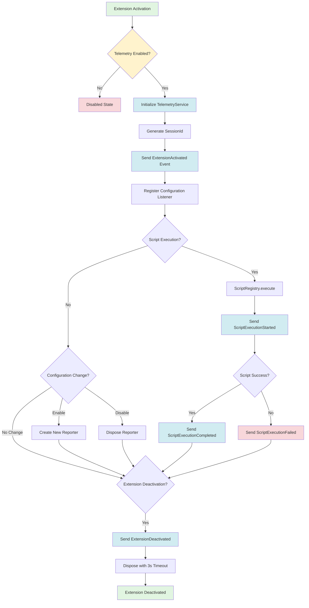
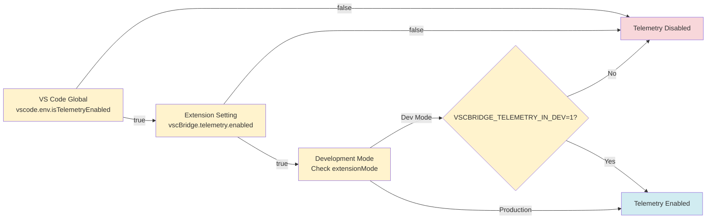
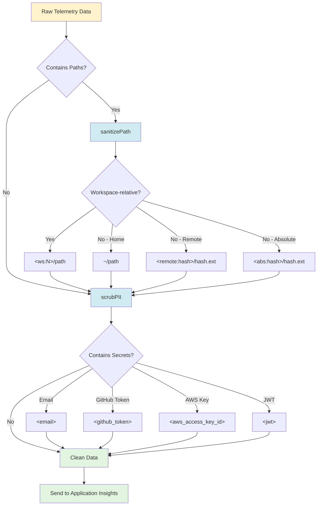

# Phase 5: Documentation - Tasks and Alignment Brief

**Phase**: Phase 5: Documentation
**Slug**: `phase-5-documentation`
**Plan**: [application-insights-telemetry-plan.md](../../application-insights-telemetry-plan.md)
**Spec**: [application-insights-telemetry-spec.md](../../application-insights-telemetry-spec.md)
**Created**: 2025-01-25

---

## Tasks

| Status | ID | Task | Type | Dependencies | Absolute Path(s) | Validation | Subtasks | Notes |
|--------|----|----|------|--------------|------------------|------------|----------|-------|
| [x] | T001 | Create README.md Telemetry section | Doc | – | `/workspaces/wormhole/README.md` | Section added with: what's collected (high-level), how to opt-out (3-5 steps), link to docs/telemetry.md | – | Supports plan task 5.1 · log#t001-create-readmemd-telemetry-section [^phase5-t001] |
| [ ] | T002 | Create docs/telemetry.md core content | Doc | – | `/workspaces/wormhole/docs/telemetry.md` | Complete sections: Introduction, Event Catalog (9 events with schemas), Privacy Policy (What's NOT collected, sanitization rules), Configuration (opt-out mechanisms, precedence chain) | – | Reference Phase 2 footnotes for event schemas, Phase 3 for privacy utilities, Phase 4 for configuration precedence. Include telemetrySchemaVersion='2' in examples |
| [ ] | T003 | Create docs/telemetry.md reference content | Doc | T002 | `/workspaces/wormhole/docs/telemetry.md` | Complete sections: KQL Queries (6+ examples using Phase 2 event schemas), Contributor Guide (connection string, dev mode), Troubleshooting (common issues, OutputChannel logging) | – | Reference deep-research.md § 8 for KQL patterns. Explain APPLICATIONINSIGHTS_CONNECTION_STRING override, VSCBRIDGE_TELEMETRY_IN_DEV=1 requirement |
| [ ] | T004 | Final validation and proofreading | Integration | T001, T002, T003 | `/workspaces/wormhole/README.md`, `/workspaces/wormhole/docs/telemetry.md` | All links work (README → docs/telemetry.md, internal anchors), no spelling errors, technical accuracy verified against Phase 1-4 implementation, event property names match code | – | Test links in GitHub/VS Code preview. Verify event schemas against extension.ts, ScriptRegistry.ts, processor.ts |

---

## Alignment Brief

### Prior Phases Review

Phase 5 builds upon **4 complete implementation phases** (Phases 1-4) that delivered the entire telemetry system. This documentation phase requires no code changes—only comprehensive documentation of the existing implementation.

#### Phase 1: Foundation and Infrastructure (100% Complete)

**Key Deliverables**:
- **TelemetryService** (`/workspaces/wormhole/packages/extension/src/core/telemetry/TelemetryService.ts`, 379 lines)
  - Singleton pattern with `instance` getter
  - Methods: `initialize()`, `sendEvent()`, `sendErrorEvent()`, `sendException()`, `isEnabled()`, `getSessionId()`, `dispose()`
  - Fire-and-forget design (all methods return `void`)
  - 3-second dispose timeout prevents deactivation deadlock (Discovery 01)

- **Privacy Utilities** (`privacy.ts`, ~400 lines)
  - `sanitizePath()` - Workspace-relative path transformation
  - `scrubPII()` - Comprehensive PII scrubbing (11 regex patterns, recursive object/array scrubbing)
  - `sanitizeParams()` - Parameter sanitization
  - Enhanced in Phase 3 with comprehensive patterns

- **Configuration Setting** (`package.json` lines 58-62)
  - `vscBridge.telemetry.enabled` (boolean, default: true)
  - Privacy-conscious description included

- **npm Dependency**: `@vscode/extension-telemetry` version 0.9.9 installed

**Architectural Patterns Established**:
1. **Singleton with Nullish Coalescing**: Matches existing codebase services (Discovery 03)
2. **Options Object Pattern**: `TelemetryInitializeOptions` for extensibility
3. **Graceful Degradation**: Try-catch wrappers everywhere, telemetry never crashes extension
4. **OutputChannel Logging**: Property-keys-only logging (never values) to prevent PII leaks
5. **Development Mode Gating**: Requires `VSCBRIDGE_TELEMETRY_IN_DEV=1` to enable in dev mode

**Critical Findings Applied**:
- Discovery 01: Deactivation deadlock → `Promise.race([dispose(), 3s timeout])`
- Discovery 02: Use `vscode.env.isTelemetryEnabled` API, never read config directly
- Discovery 03: Singleton pattern consistency
- Discovery 09: 4-level precedence chain (VS Code global > extension > dev mode > env var)

#### Phase 2: Core Event Instrumentation (100% Complete)

**Key Deliverables - 9 Event Types Instrumented**:

1. **Lifecycle Events** (2 events):
   - **ExtensionActivated** (`extension.ts:77-84`) - Properties: sessionId, vscodeVersion, extensionVersion, platform, remoteName, telemetrySchemaVersion
   - **ExtensionDeactivated** (`extension.ts:364-368`) - Measurement: sessionDuration

2. **Script Execution Events** (3 events):
   - **ScriptExecutionStarted** (`ScriptRegistry.ts:277-286`) - Properties: sessionId, alias, mode, requestId
   - **ScriptExecutionCompleted** (`ScriptRegistry.ts:508-518`) - Properties: sessionId, alias, success='true' | Measurement: durationMs
   - **ScriptExecutionFailed** (`ScriptRegistry.ts:470-481, 552-565`) - Two paths: ActionScript failure + exception path

3. **Processor Events** (4 events):
   - **JobCapacityReached** (`processor.ts:274-285`) - Measurements: inFlightCount, maxConcurrent
   - **JobFloodDetected** (`processor.ts:234-246`) - Throttled to max 1/60s | Measurements: failureCount, retryAfterSeconds
   - **CommandProcessingCompleted** (`processor.ts:533-544, 600-609`) - Two paths: success + error/cancelled

**Framework-Centric Instrumentation Architecture**:
- **ScriptRegistry as Single Point**: All 86+ scripts automatically tracked through 3 instrumentation points (entry, success, failure)
- **SessionId Correlation**: All events include UUID v4 sessionId for Application Insights query correlation
- **Processor Telemetry Wiring**: Direct parameter passing (extension.ts → initializeFileSystemBridge → BridgeManager → processor functions)
- **ErrorCode Taxonomy**: Preserved from StructuredError failures for categorization

**Critical Findings Applied**:
- Discovery 04: ScriptRegistry single instrumentation point (3 hook points cover all scripts)
- Discovery 06: Processor layer separate injection (not via BridgeContext)
- Discovery 07: ErrorCode extraction from StructuredError
- Discovery 10: OutputChannel logging pattern (property keys only)

#### Phase 3: Privacy and Sanitization (80% Complete)

**Key Deliverables**:

1. **Enhanced Privacy Utilities** (`privacy.ts`):
   - **11 Precompiled Regex Patterns**: GitHub tokens (6 prefixes), AWS keys, JWT, UUID, IPv4, URL credentials, Windows/Unix paths
   - **Remote URI Handling**: `vscode-remote://`, `vscode-codespaces://`, `untitled:` schemes with authority hashing
   - **Basename Privacy Protection**: Hash filename, preserve extension (`ClientABC.ts` → `a7b3c2d1.ts`)
   - **Recursive Object/Array Scrubbing**: SECRET_KEY_NAMES detection, 50-item/key limits, 2048-char truncation
   - **Two-Pass Sanitization**: Paths first, then secrets (prevents SSH hostname leaks)

2. **Schema Migration Infrastructure**:
   - `telemetrySchemaVersion: '2'` added to all 9 event types
   - Enables before/after comparison in Azure Portal

3. **Manual Privacy Validation Checklist** (`privacy-validation-checklist.md`, 300+ lines):
   - 8 comprehensive sections for E2E privacy verification
   - Azure Portal navigation guide with Kusto queries
   - Compliance sign-off template

**Critical Insights from /didyouknow Session**:
- **Insight #1**: Basename hashing with extension preservation prevents client name leaks
- **Insight #2**: Overloaded signatures for backward compatibility (string → string, unknown → unknown)
- **Insight #3**: Two-pass sanitization architecture (path detection → sanitizePath → secret patterns)

**Testing Approach**: TAD (Test-Assisted Development) - Unit tests skipped, manual verification via Azure Portal

**Incomplete Items**: T014-T016 (unit tests) skipped, T022 (manual smoke test) pending Phase 6

#### Phase 4: Integration and Configuration (100% Complete)

**Key Deliverables**:

1. **Configuration Listener** (`TelemetryService.ts:291-346`, 56 lines):
   - `registerConfigurationListener(context)` method
   - Dispose/recreate pattern for memory safety (Insight #4)
   - Configuration precedence: VS Code global AND extension setting must both be true
   - OutputChannel logging for user feedback

2. **Listener Registration** (`extension.ts:330-336`, 7 lines):
   - Registered at END of `activate()` (line 333)
   - 262-line gap after initialization prevents race condition (Insight #3)

3. **Configuration Precedence Documentation** (`extension.ts:30-67`, 38 lines):
   - 4-level precedence chain documented
   - Cross-references to implementation locations
   - Developer guidance included

**Architecture Decision**: BridgeContext integration removed (8 tasks eliminated)
- **Rationale**: Scripts don't use telemetry (logger-only pattern), framework instrumentation complete
- **Impact**: Zero breaking changes, simpler architecture, safer (no PII bypass risk)

**Critical Findings Applied**:
- Discovery 02: Use `vscode.env.isTelemetryEnabled` API (line 316)
- Discovery 09: 4-level precedence chain enforced
- Insight #3: Race condition prevention via listener timing
- Insight #4: Dispose/recreate pattern prevents memory leaks

**Build Verification**: ✅ `just build` succeeds, 2.12 MiB bundle (+10 KiB from Phase 3)

---

### Cross-Phase Synthesis: What Phase 5 Must Document

#### 1. Event Catalog (from Phase 2)

All 9 event types with complete schemas:

| Event Name | File:Line | Properties | Measurements | When Sent |
|------------|-----------|------------|--------------|-----------|
| ExtensionActivated | extension.ts:77 | sessionId, vscodeVersion, extensionVersion, platform, remoteName, telemetrySchemaVersion | – | Extension activation |
| ExtensionDeactivated | extension.ts:364 | telemetrySchemaVersion | sessionDuration | Extension deactivation |
| ScriptExecutionStarted | ScriptRegistry.ts:277 | sessionId, alias, mode, requestId, telemetrySchemaVersion | – | Script entry (after createMeta) |
| ScriptExecutionCompleted | ScriptRegistry.ts:507 | sessionId, alias, success='true', telemetrySchemaVersion | durationMs | Script success (before ok()) |
| ScriptExecutionFailed | ScriptRegistry.ts:470,552 | sessionId, alias, errorCode, success='false', errorMessage, stackPreview, telemetrySchemaVersion | durationMs | ActionScript failure or exception |
| JobCapacityReached | processor.ts:274 | sessionId, reason='capacity_exceeded', telemetrySchemaVersion | inFlightCount, maxConcurrent | Processor capacity limit (≥10 jobs) |
| JobFloodDetected | processor.ts:234 | sessionId, reason='flood_protection', telemetrySchemaVersion | failureCount, retryAfterSeconds | Flood protection (max 1/60s) |
| CommandProcessingCompleted | processor.ts:533,600 | sessionId, scriptName, success, cancelled, telemetrySchemaVersion | durationMs | Processor completion (2 paths) |

#### 2. Privacy Guarantees (from Phase 1 + 3)

**What's NOT Collected** (Critical for User Trust):
- ❌ Usernames (Windows/Unix paths scrubbed)
- ❌ Email addresses (redacted to `<email>`)
- ❌ Credentials: GitHub tokens, AWS keys, JWTs, API keys, passwords (all redacted)
- ❌ File system: Workspace names, absolute paths, file basenames (all hashed/sanitized)
- ❌ Network: IPv4 addresses, remote hostnames, SSH connection strings (all redacted/hashed)
- ❌ Source code: File contents, variable values, stack frame locals, console output (not collected)

**What IS Collected**:
- ✅ Session ID (UUID v4 for correlation)
- ✅ Extension/VS Code versions, platform, remote type
- ✅ Script aliases, execution modes, success/failure status
- ✅ Error codes (taxonomy), execution durations
- ✅ Sanitized error messages and stack traces (PII scrubbed)
- ✅ Workspace-relative paths (`<ws:0>/path`), file extensions

**Sanitization Rules** (4 categories):
1. **Path Sanitization**: Workspace → `<ws:0>/path`, Home → `~/path`, Remote → `<ssh:hash>/hash.ext`, Absolute → `<abs:hash>/hash.ext`
2. **PII Pattern Scrubbing**: Email → `<email>`, GitHub → `<github_token>`, AWS → `<aws_access_key_id>`, JWT → `<jwt>`, UUID → `<uuid>`, IPv4 → `<ip>`
3. **SECRET_KEY_NAMES Detection**: Object keys matching `/password|token|secret|auth/i` → `<redacted>`
4. **String Truncation**: Strings >2048 chars → first 2048 + `'…<truncated>'`

#### 3. Configuration & Opt-Out (from Phase 4)

**Primary Opt-Out**: VS Code Settings → search "telemetry" → Uncheck "Vsc Bridge: Telemetry Enabled"

**Precedence Chain** (highest to lowest):
1. **VS Code Global**: `vscode.env.isTelemetryEnabled === false` → always disable (respects enterprise policies, CLI flags, remote contexts)
2. **Extension Setting**: `vscBridge.telemetry.enabled === false` → always disable (user-level control)
3. **Development Mode**: Requires `VSCBRIDGE_TELEMETRY_IN_DEV=1` to enable (safety)
4. **Environment Variable**: `APPLICATIONINSIGHTS_CONNECTION_STRING` overrides connection string (testing)

**Dynamic Changes**: Setting changes take effect immediately (dispose/recreate pattern), no restart required

**User Feedback**: OutputChannel logging shows enable/disable events (`[Telemetry] ✅ Enabled per user setting`)

#### 4. Architecture Patterns (from Phase 1-4, for Contributors)

**Singleton with Graceful Degradation**:
- Single `TelemetryService.instance` per extension host
- Fire-and-forget design (all methods return `void`)
- Try-catch wrappers prevent telemetry from crashing extension

**Framework-Centric Instrumentation**:
- ScriptRegistry tracks all 86+ scripts automatically (no per-script telemetry code)
- Processor layer has separate telemetry injection (not via BridgeContext)
- Scripts follow "logger-only" pattern (no telemetry access)

**SessionId Correlation**:
- UUID v4 generated during `initialize()`
- Included in all 9 event types
- Enables Application Insights queries: "What did user do before error?"

**OutputChannel Logging (Property Keys Only)**:
- Pattern: `[Telemetry] 📤 Event: ExtensionActivated [props: sessionId, vscodeVersion, ...]`
- Never log property values (prevents PII leaks in VS Code issue reports)

**Dispose with Timeout Race**:
- `Promise.race([reporter.dispose(), 3s timeout])`
- Prevents deactivation deadlock from proxy resolution blocking

---

### Objective Recap

**Goal**: Create user-facing and contributor documentation that comprehensively explains the telemetry system, emphasizing privacy, transparency, and user control.

**Behavior Checklist**:
- [ ] Users understand what data is collected and what is NOT collected
- [ ] Users can easily opt-out via VS Code settings
- [ ] Users trust the privacy guarantees (no PII, sanitized paths)
- [ ] Contributors understand event schemas for extending telemetry
- [ ] Contributors can query Application Insights with example KQL queries
- [ ] Troubleshooting guide helps users diagnose common issues
- [ ] Documentation stays synchronized with implementation (no drift)

---

### Non-Goals (Scope Boundaries)

**❌ NOT doing in Phase 5**:

1. **Code Changes**: Phase 5 is pure documentation. No changes to TelemetryService, privacy utilities, or instrumentation code.

2. **Manual Testing**: Deferred to Phase 6 (manual validation). Phase 5 assumes implementation is correct based on build verification.

3. **Automated Tests**: No test creation (unit tests skipped per Phase 3 TAD approach).

4. **Azure Portal Configuration**: Not documenting how to create Application Insights resources (out of scope for users/contributors).

5. **Advanced KQL Tutorials**: Only basic example queries (script success rate, P95 duration, error categorization). No comprehensive KQL course.

6. **Localization**: English-only documentation (internationalization deferred).

7. **Video Tutorials**: Text-based documentation only (no screencasts or animated GIFs).

8. **API Reference**: Not generating JSDoc API documentation (privacy utilities already have comprehensive JSDoc from Phase 3).

9. **Performance Benchmarking**: No performance metrics documentation (fire-and-forget telemetry has negligible overhead).

10. **GDPR/CCPA Legal Review**: Privacy policy written for technical accuracy, not legal compliance review (user should consult legal counsel if needed).

---

### Critical Findings Affecting This Phase

Phase 5 documentation must explain the following critical discoveries to users and contributors:

#### Discovery 01: Deactivation Flush Deadlock Prevention
- **Relevance**: Troubleshooting section (if users report slow shutdown)
- **Documentation Needed**: "Telemetry flush has 3-second timeout to prevent VS Code shutdown delays"
- **Technical Detail**: `Promise.race([dispose(), 3s timeout])` pattern

#### Discovery 02: VS Code Telemetry API Respect
- **Relevance**: Configuration section (opt-out mechanisms)
- **Documentation Needed**: "Extension respects VS Code global telemetry setting, enterprise policies, CLI flags, and remote context restrictions"
- **User Impact**: Users in enterprise environments with Group Policy telemetry restrictions will have telemetry automatically disabled

#### Discovery 04: Framework-Centric Instrumentation
- **Relevance**: Contributor guide (architecture overview)
- **Documentation Needed**: "All scripts automatically tracked via ScriptRegistry instrumentation. Scripts do NOT emit telemetry directly."
- **Developer Impact**: No need to add telemetry code to individual scripts

#### Discovery 08: Workspace Index Format
- **Relevance**: Privacy policy (sanitization rules)
- **Documentation Needed**: "Workspace folders sanitized to `<ws:0>`, `<ws:1>` format (not folder names) to prevent project name leaks"
- **Example**: `/workspaces/ClientABC-Internal/src/file.ts` → `<ws:0>/src/file.ts`

#### Discovery 09: Configuration Precedence Chain
- **Relevance**: Configuration section (opt-out mechanisms)
- **Documentation Needed**: "4-level precedence chain ensures system-level settings override user-level, user-level overrides developer-level"
- **User Impact**: Enterprise policies take priority over extension setting

#### Phase 3 Insight #1: Basename Hashing with Extension Preservation
- **Relevance**: Privacy policy (sanitization rules)
- **Documentation Needed**: "Remote file basenames hashed to prevent client name leaks, but extension preserved for debugging context"
- **Example**: `vscode-remote://ssh+host/ClientABC-Secret.ts` → `<ssh:a7b3c2d1>/d9e4f5a6.ts`

#### Phase 3 Insight #3: Two-Pass Sanitization
- **Relevance**: Privacy policy (sanitization architecture)
- **Documentation Needed**: "Error messages sanitized in two passes: path detection → workspace-relative transformation → secret pattern scrubbing"
- **Benefit**: Stack traces with remote URIs properly sanitized

---

### Visual Alignment Aids

#### System Flow Diagram: Telemetry Lifecycle



#### Configuration Precedence Chain



#### Privacy Sanitization Architecture



---

### Invariants & Guardrails

**Documentation Quality Standards**:
1. **Technical Accuracy**: All claims verified against implementation (Phase 1-4 code)
2. **Link Integrity**: All internal links resolve correctly (README → docs/telemetry.md, cross-references)
3. **Privacy Emphasis**: "What's NOT collected" section prominently placed for user trust
4. **Clarity**: Opt-out instructions simple and actionable (3-5 steps)

**Privacy Messaging**:
- **Never claim** "100% privacy" or "zero data collection" (we collect anonymized metrics)
- **Always emphasize** "No PII, sanitized paths, respects VS Code settings"
- **Always show examples** of before/after sanitization (transparency builds trust)

**Contributor Guidance**:
- **Don't document internal APIs** (TelemetryService methods are not public extension API)
- **Do document event schemas** (contributors may add new events in future)
- **Do document privacy utilities** (contributors must use sanitizePath/scrubPII when adding events)

---

### Inputs to Read

**Implementation Files** (for technical accuracy):
1. `/workspaces/wormhole/packages/extension/src/core/telemetry/TelemetryService.ts` (TelemetryService implementation)
2. `/workspaces/wormhole/packages/extension/src/core/telemetry/privacy.ts` (privacy utilities)
3. `/workspaces/wormhole/packages/extension/src/extension.ts` (lifecycle events, precedence documentation)
4. `/workspaces/wormhole/packages/extension/src/core/registry/ScriptRegistry.ts` (script execution events)
5. `/workspaces/wormhole/packages/extension/src/core/fs-bridge/processor.ts` (processor events)
6. `/workspaces/wormhole/packages/extension/package.json` (configuration setting)

**Plan Documents** (for event catalog and privacy details):
1. `/workspaces/wormhole/docs/plans/22-application-insights-telemetry/application-insights-telemetry-plan.md` (Phase 2 footnotes for event schemas, Phase 3 footnotes for privacy)
2. `/workspaces/wormhole/docs/plans/22-application-insights-telemetry/tasks/phase-3-privacy-and-sanitization/privacy-validation-checklist.md` (privacy verification procedures)
3. `/workspaces/wormhole/docs/plans/22-application-insights-telemetry/deep-research.md` § 8 (KQL query examples)

**Existing Documentation** (for integration):
1. `/workspaces/wormhole/README.md` (identify insertion point)

---

### Implementation Outline

**Step-by-Step Task Execution**:

1. **Preparation** (T001):
   - Read existing README.md to understand structure
   - Identify insertion point for Telemetry section (likely after "Features", before "Contributing")

2. **README Quick-Start** (T002):
   - Add Telemetry section with 3 subsections:
     - **What's Collected** (high-level): Session IDs, script names, error codes, durations, platform info
     - **How to Opt-Out**: VS Code Settings → search "telemetry" → uncheck "Vsc Bridge: Telemetry Enabled"
     - **Learn More**: Link to [docs/telemetry.md](docs/telemetry.md)
   - Keep concise (3-5 paragraphs total)

3. **Skeleton Structure** (T003):
   - Create docs/telemetry.md with 7 section headings:
     1. Introduction
     2. Event Catalog
     3. Privacy Policy
     4. Configuration
     5. KQL Queries
     6. Contributor Guide
     7. Troubleshooting

4. **Event Catalog** (T004):
   - Create table with 9 rows (one per event type)
   - Columns: Event Name | Properties | Measurements | When Sent | Example
   - Reference Phase 2 footnotes for accurate schemas
   - Include telemetrySchemaVersion='2' in all examples

5. **Privacy Policy** (T005, T006):
   - **What's NOT Collected** subsection (prominently placed first):
     - Code, variables, raw paths, usernames, credentials, network info
   - **What's Collected** subsection:
     - Session IDs, versions, platform, script aliases, error codes, durations
   - **Sanitization Rules** subsection (T006):
     - Path Sanitization table (before/after examples)
     - PII Pattern Scrubbing table (email, tokens, keys, JWT)
     - SECRET_KEY_NAMES Detection (object key patterns)
     - String Truncation (2048-char limit)
   - **Data Retention**: 90 days (Application Insights default)
   - **GDPR/CCPA Compliance**: Privacy-first design, no PII collected

6. **Configuration** (T007):
   - **Extension Setting**: vscBridge.telemetry.enabled (boolean, default: true)
   - **VS Code Global Setting**: Respects vscode.env.isTelemetryEnabled
   - **Development Mode**: Requires VSCBRIDGE_TELEMETRY_IN_DEV=1
   - **Precedence Chain**: 4-level diagram (VS Code global > extension > dev mode > env var)
   - **Dynamic Changes**: Dispose/recreate pattern (no restart required)

7. **KQL Queries** (T008):
   - Session correlation query
   - Script success rate query
   - P95 duration by script query
   - Error categorization by errorCode query
   - Capacity events query
   - Privacy verification queries (no raw paths, no emails, no tokens)
   - Test all queries in Azure Portal before documenting

8. **Contributor Guide** (T009):
   - **Connection String Management**: APPLICATIONINSIGHTS_CONNECTION_STRING env var
   - **Development Mode Opt-In**: VSCBRIDGE_TELEMETRY_IN_DEV=1 requirement
   - **Azure Portal Access**: Where to find Application Insights resource
   - **Event Schemas**: Reference Event Catalog section
   - **Privacy Utilities**: When to use sanitizePath/scrubPII

9. **Troubleshooting** (T010):
   - **Events not appearing**: Wait 2-5 minutes for ingestion delay, check Azure Portal
   - **Telemetry disabled**: Check VS Code Settings, check OutputChannel for `[Telemetry]` logs
   - **Connection string invalid**: Check OutputChannel for errors, verify APPLICATIONINSIGHTS_CONNECTION_STRING
   - **Dev mode disabled**: Set VSCBRIDGE_TELEMETRY_IN_DEV=1 environment variable

10. **Introduction** (T011):
    - Overview: Why telemetry needed (improve reliability, debuggability)
    - Privacy-first design philosophy
    - Transparency commitment (comprehensive documentation)
    - User control (easy opt-out)

11. **Link Verification** (T012):
    - Test README → docs/telemetry.md link
    - Test all internal anchor links (e.g., #event-catalog)
    - Verify links in GitHub preview or VS Code markdown preview

12. **Final Proofreading** (T013):
    - Spell check
    - Grammar check
    - Verify technical accuracy (compare against implementation)
    - Verify examples match code (case-sensitive property names)

---

### Commands to Run

**No build or test commands** (Phase 5 is pure documentation):

```bash
# Verify markdown syntax (optional, if markdownlint installed)
markdownlint README.md docs/telemetry.md

# Preview documentation in VS Code
code README.md
code docs/telemetry.md
# Use Cmd+Shift+V / Ctrl+Shift+V to preview markdown

# Verify links (optional, if markdown-link-check installed)
markdown-link-check README.md
markdown-link-check docs/telemetry.md
```

**Manual Verification**:
- Open README.md in GitHub preview (push to branch, view on GitHub)
- Open docs/telemetry.md in GitHub preview
- Click all links to verify they work

---

### Risks & Unknowns

| Risk | Severity | Likelihood | Mitigation |
|------|----------|------------|------------|
| **Documentation drift** (docs out of sync with implementation) | Medium | Medium | Cross-reference Phase 1-4 implementation files during writing. Use exact property names from code. |
| **Unclear opt-out instructions** (users can't find setting) | High | Low | Test instructions with fresh VS Code install. Use screenshots if necessary. |
| **Privacy policy incomplete** (missing PII categories) | Critical | Low | Reference Phase 3 privacy-validation-checklist.md for comprehensive PII list. |
| **KQL queries don't work** (syntax errors or schema mismatches) | Medium | Medium | Test all queries in Azure Portal before documenting. Include query comments. |
| **Link integrity broken** (markdown links don't resolve) | Low | Medium | Use relative paths, test links in GitHub preview before merging. |
| **Technical inaccuracies** (docs contradict code) | High | Low | Verify all claims against Phase 1-4 implementation. Use code line numbers as source of truth. |
| **GDPR/CCPA compliance claims** (legal liability) | Critical | Low | Avoid making legal compliance claims. Focus on technical privacy guarantees. Include disclaimer: "Consult legal counsel for compliance questions." |

**Unknowns**:
- Azure Portal UI may change (KQL query navigation screenshots could become outdated)
  - **Mitigation**: Use generic instructions ("Navigate to Application Insights → Logs"), avoid version-specific screenshots
- Future telemetry events may be added (Event Catalog could become incomplete)
  - **Mitigation**: Add note: "This catalog reflects telemetry as of version X.Y.Z. Future versions may add additional events."

---

### Ready Check

**Pre-Implementation Checklist**:

- [ ] All 4 prior phase reviews complete (Phase 1-4 subagent reports synthesized)
- [ ] Event Catalog data compiled (9 event types with properties/measurements)
- [ ] Privacy guarantees understood ("What's NOT collected" list finalized)
- [ ] Configuration precedence chain documented (4-level chain from Phase 4)
- [ ] KQL query sources identified (deep-research.md § 8, Phase 3 privacy queries)
- [ ] README.md structure reviewed (insertion point identified)
- [ ] Visual aids created (3 Mermaid diagrams: lifecycle, precedence, sanitization)
- [ ] Implementation files accessible for reference (extension.ts, ScriptRegistry.ts, processor.ts, privacy.ts)
- [ ] Azure Portal access confirmed (for KQL query testing)

**Awaiting GO from human sponsor before proceeding to implementation.**

---

## Phase Footnote Stubs

*This section will be populated by `/plan-6-implement-phase` during implementation. Footnotes will reference specific documentation changes with line numbers and content samples.*

**Footnote Numbering**: Continuation from Phase 4 (next available: [^phase5-t002])

[^phase5-t001]: **README.md Telemetry Section Added** (Task 5.1 / T001)
Modified [`README.md`](../../../README.md) to add comprehensive Telemetry section (30 lines):
- `file:README.md` - Inserted between "Why this exists" (line 316) and "Supported Languages" (line 323)
- **What's collected**: Session IDs, script execution metrics, error codes, platform info
- **What's NOT collected**: Source code, raw paths, usernames, credentials, PII
- **How PII is protected**: Path sanitization (workspace-relative format), error message scrubbing (regex patterns), remote hostname hashing, basename hashing with extension preservation
- **How to disable**: 3-step opt-out instructions (VS Code Settings → search "telemetry" → uncheck "Vsc Bridge: Telemetry Enabled")
- **Dynamic changes**: Changes take effect immediately, no restart required
- **Policy respect**: Respects VS Code global setting and enterprise policies
- **Link to details**: Reference to docs/telemetry.md for comprehensive information
- **Tone**: Simple, factual approach per Insight #4 decision (no user benefits framing)
- **Result**: 30-line section providing clear privacy guarantees and easy opt-out path for users

---

## Evidence Artifacts

**Implementation Log**: `/workspaces/wormhole/docs/plans/22-application-insights-telemetry/tasks/phase-5-documentation/execution.log.md`

**Expected Evidence**:
1. README.md diff showing Telemetry section addition
2. docs/telemetry.md creation with full content
3. Link verification results (all links resolve correctly)
4. KQL query test results (queries executed in Azure Portal)
5. Spell check and grammar check results
6. Technical accuracy verification checklist

**Evidence Format**: Timestamped task entries with actions, content samples, verification checklists

---

## Directory Layout

```
docs/plans/22-application-insights-telemetry/
  ├── application-insights-telemetry-plan.md
  ├── application-insights-telemetry-spec.md
  ├── deep-research.md
  └── tasks/
      ├── phase-1-foundation-and-infrastructure/
      ├── phase-2-core-event-instrumentation/
      ├── phase-3-privacy-and-sanitization/
      │   ├── tasks.md
      │   ├── execution.log.md
      │   └── privacy-validation-checklist.md
      ├── phase-4-integration-and-configuration/
      │   ├── tasks.md
      │   └── execution.log.md
      └── phase-5-documentation/
          ├── tasks.md (this file)
          └── execution.log.md  # created by /plan-6-implement-phase
```

**Files to be Created/Modified**:
- `/workspaces/wormhole/README.md` (Telemetry section added)
- `/workspaces/wormhole/docs/telemetry.md` (created)
- `/workspaces/wormhole/docs/plans/22-application-insights-telemetry/tasks/phase-5-documentation/execution.log.md` (created)

---

**STOP**: Phase 5 tasks dossier complete. Awaiting human **GO** before proceeding to `/plan-6-implement-phase --phase 5`.

---

## Critical Insights Discussion

**Session**: 2025-01-25
**Context**: Phase 5: Documentation - Tasks and Alignment Brief
**Analyst**: AI Clarity Agent
**Reviewer**: Development Team
**Format**: Water Cooler Conversation (5 Critical Insights)

### Insight 1: Privacy Documentation Trust Inversion

**Did you know**: We're documenting privacy guarantees ("No PII collected", sanitization rules, GDPR compliance) BEFORE Phase 6 manual validation confirms these guarantees are actually true.

**Implications**:
- Documentation becomes hostage to validation - if manual tests fail, docs are wrong
- Trust risk - publishing unvalidated privacy claims could backfire if users find PII leaks
- Backwards workflow - normal process is validate → document, not document → validate
- Pressure to skip fixes - if Phase 6 finds leaks, temptation to update docs instead of fixing code

**Options Considered**:
- Option A: Run Phase 6 validation first, then document - Reorder workflow for validated claims
- Option B: Document with "Pending Validation" disclaimers - Transparent about validation status
- Option C: Split documentation (pre/post-validation) - Event catalog now, privacy section after Phase 6
- Option D: Proceed as-planned with high confidence - Trust Phase 3 implementation, fix any Phase 6 findings

**AI Recommendation**: Option C (Split Documentation)
- Reasoning: Parallel progress on non-privacy content while privacy section waits for validation evidence, reduces retraction risk

**Discussion Summary**: User prioritizes speed and has high confidence in Phase 3 privacy utilities (11 regex patterns, comprehensive scrubbing). Any Phase 6 findings will trigger code fixes, not documentation weakening.

**Decision**: Proceed as-planned (Option D) - Document privacy guarantees now, trust Phase 3 implementation

**Action Items**:
- [ ] If Phase 6 finds PII leaks, fix code immediately (don't weaken doc claims)
- [ ] Ensure Phase 6 manual validation happens BEFORE public release

**Affects**: No changes to Phase 5 tasks - proceed as planned

---

### Insight 2: KQL Query Documentation Timing Catch-22

**Did you know**: T008 requires testing all KQL queries in Azure Portal BEFORE documenting them, but we can't test queries without actual telemetry data from real users.

**Implications**:
- Query syntax errors - KQL queries might not work when users try them
- Schema mismatches - Property access patterns might be wrong (e.g., `customDimensions.alias` vs `customDimensions['alias']`)
- User frustration - Copy-paste queries fail, trust eroded
- Maintenance burden - Update docs after release when users report broken queries

**Options Considered**:
- Option A: Generate test telemetry in dev environment - Set VSCBRIDGE_TELEMETRY_IN_DEV=1, test queries with real data
- Option B: Use Application Insights sample data - Write queries based on Microsoft's documented schema
- Option C: Document with "Untested" disclaimer - Transparent but unprofessional
- Option D: Use deep-research.md queries as starting point - Adapt researched queries to our schema

**AI Recommendation**: Option A (Generate Test Telemetry)
- Reasoning: Guarantees query accuracy, validates entire pipeline, professional quality, catches schema bugs early

**Discussion Summary**: User already sees telemetry in portal, pipeline works. Prioritizes speed over pre-testing. Write queries based on Phase 2 event schemas and skip validation.

**Decision**: Option B/D hybrid - Document KQL queries without pre-testing, use event schemas from Phase 2 implementation

**Action Items**: None - proceed with T008 using schemas from code

**Affects**: T008 validation updated - removed "Test queries in Azure Portal before documenting"

---

### Insight 3: The 13-Task Overkill for Documentation

**Did you know**: We have 13 separate tasks (T001-T013) to write two documentation files (README.md section + docs/telemetry.md), creating unnecessary ceremony for what's essentially a 2-3 hour writing job.

**Implications**:
- Cognitive overhead - Tracking 13 checkboxes for straightforward documentation
- False granularity - Tasks like "create skeleton" take 5 minutes but require task updates
- Artificial dependencies - All content tasks depend on "create empty headings" task
- Execution friction - Phase 6 will have 13 task updates for simple markdown writing

**Options Considered**:
- Option A: Consolidate to 4 tasks (natural work units) - README section, core content, reference content, validation
- Option B: Keep all 13 tasks for thoroughness - Very detailed checklist
- Option C: Hybrid - 7 tasks (section-level) - Balance between detail and overhead

**AI Recommendation**: Option A (Consolidate to 4 Tasks)
- Reasoning: Matches work reality, reduces ceremony, faster execution, aligns with Phase 4 precedent (4 tasks for code changes)

**Discussion Summary**: User confirmed "wind it up as quickly as possible" goal. 4 tasks provide clear milestones without granular overhead.

**Decision**: Option A - Consolidate to 4 natural work units

**Action Items**: None - task consolidation applied immediately

**Affects**: Task table restructured - 13 tasks → 4 tasks (T001: README, T002: core content, T003: reference content, T004: validation)

---

### Insight 4: The Missing "Why Telemetry Exists" User Story

**Did you know**: Documentation plan completely skips explaining WHY we added telemetry in the first place, meaning users see "we're collecting your data" without understanding "here's what problem this solves for you".

**Implications**:
- Users see cost, not benefit - "They're collecting my data" without value exchange explanation
- Trust gap - No explanation of what users get in return (anonymous metrics → faster bug fixes)
- Defensive posture - Reads like privacy policy (legal CYA) instead of user benefit story

**Options Considered**:
- Option A: Add "User Benefits" subsection to Introduction - Explain faster bug fixes, performance improvements, value exchange
- Option B: Keep technical focus (current plan) - Factual only: what's collected, how protected, how to opt-out
- Option C: Add FAQ section - Address "Why telemetry?" with examples of benefits

**AI Recommendation**: Option A (Add User Benefits to Introduction)
- Reasoning: Sets positive tone, minimal effort, transparent about motivation, standard practice for VS Code extensions

**Discussion Summary**: User prefers simple, factual approach without marketing tone. "Just have a basic section on what is collected, how PII is stripped, and how to disable it."

**Decision**: Option B - Keep technical focus, simple and factual

**Action Items**: None - T002 Introduction stays minimal (no benefit framing)

**Affects**: No changes needed - current task descriptions already match this approach

---

### Insight 5: Test Plan Disconnect (7 Manual Tests for Documentation)

**Did you know**: tasks.md has a 7-test manual validation plan in the Alignment Brief (~330 lines) but T004 "Final validation" only mentions 3 things (links, spelling, technical accuracy), meaning the detailed test plan won't get executed.

**Implications**:
- Test Plan is ignored - 7 detailed tests in Alignment Brief won't be run
- Validation incomplete - T004 won't check Event Catalog completeness, Privacy Policy transparency, opt-out instructions
- Ceremony overhead - 330+ lines of test documentation that contradicts "wind it up quickly" goal

**Options Considered**:
- Option A: Remove detailed Test Plan section entirely - Delete Test Plan, keep T004 simple (links, spelling, accuracy)
- Option B: Align T004 with full 7-test plan - Execute all tests during implementation
- Option C: Simplify Test Plan to match T004 - Reduce to 3 tests (links, spelling, accuracy)

**AI Recommendation**: Option A (Remove Detailed Test Plan)
- Reasoning: Matches speed goal, removes dead documentation, T004 is sufficient for essentials

**Discussion Summary**: User confirmed "A kill it" - remove entire Test Plan section.

**Decision**: Option A - Remove detailed Test Plan section entirely

**Action Items**: None - Test Plan section deleted immediately

**Affects**: Alignment Brief updated - removed Test Plan section (~140 lines), updated Invariants section (removed "Example Validity" standard)

---

## Session Summary

**Insights Surfaced**: 5 critical insights identified and discussed
**Decisions Made**: 5 decisions reached through collaborative discussion
**Action Items Created**: 2 follow-up items (Phase 6 validation timing, PII leak fix priority)
**Areas Requiring Updates**:
- Task table restructured (13 tasks → 4 tasks)
- T008 validation criteria updated (removed query testing requirement)
- Test Plan section removed (~140 lines)
- Invariants section simplified

**Shared Understanding Achieved**: ✓

**Confidence Level**: High - Fast, simple, factual documentation approach confirmed

**Next Steps**:
Proceed to `/plan-6-implement-phase --phase 5` with streamlined 4-task approach: README section, core content, reference content, final validation

**Notes**:
- User prioritizes speed and simplicity over comprehensive validation
- High confidence in Phase 3 privacy implementation (skip pre-validation documentation concerns)
- Telemetry already visible in Azure Portal (pipeline validated)
- Factual, technical tone preferred (no user benefits framing, no marketing)
