# Phase 2: YAML Parser and Front Matter Extraction

**Phase**: Phase 2: YAML Parser and Front Matter Extraction
**Slug**: `phase-2-yaml-parser-and-front-matter-extraction`
**Spec**: [mcp-doc-tools-spec.md](../../mcp-doc-tools-spec.md)
**Plan**: [mcp-doc-tools-plan.md](../../mcp-doc-tools-plan.md)
**Created**: 2025-10-25
**Status**: READY

---

## Tasks

| Status | ID | Task | Type | Dependencies | Absolute Path(s) | Validation | Subtasks | Notes |
|--------|----|----|------|--------------|-----------------|------------|----------|-------|
| [ ] | T001 | Create parser.ts module | Setup | – | `/workspaces/wormhole/src/lib/mcp/doc-tools/parser.ts` | File exists and compiles | – | [P] eligible (new file). Plan task 2.1 |
| [ ] | T002 | Import Phase 1 dependencies | Setup | T001 | `/workspaces/wormhole/src/lib/mcp/doc-tools/parser.ts` | Imports validateFrontMatter, types | – | Serial (same file). Use ESM `.js` extensions |
| [ ] | T003 | Create scratch test file for parser | Test | T001 | `/workspaces/wormhole/scratch/doc-tools/parser.test.ts` | Test file with structure | – | TAD: start in scratch/. [P] eligible (new scratch file) |
| [ ] | T004 | Write test: valid doc with front matter parses successfully | Test | T003 | `/workspaces/wormhole/scratch/doc-tools/parser.test.ts` | Uses docs_test_valid.md fixture | – | Baseline test with Test Doc comment block. Serial (same file) |
| [ ] | T005 | Write test: missing front matter throws error | Test | T003 | `/workspaces/wormhole/scratch/doc-tools/parser.test.ts` | Tests files without `---` delimiters | – | Per Discovery 18 (delimiter edge cases). Serial (same file) |
| [ ] | T006 | Write test: invalid YAML syntax throws error | Test | T003 | `/workspaces/wormhole/scratch/doc-tools/parser.test.ts` | Uses docs_test_invalid_yaml.md | – | Tests malformed YAML rejection. Serial (same file) |
| [ ] | T007 | Write test: YAML injection attempt blocked | Test | T003 | `/workspaces/wormhole/scratch/doc-tools/parser.test.ts` | Uses docs_test_injection.md, verifies no code execution | – | Per Discovery 03 (YAML security). Serial (same file) |
| [ ] | T008 | Write test: horizontal rules in content don't break parser | Test | T003 | `/workspaces/wormhole/scratch/doc-tools/parser.test.ts` | Markdown with `---` in body parses correctly | – | Per Discovery 18 (delimiter edge cases). Serial (same file) |
| [ ] | T009 | Write test: content is returned without front matter delimiters | Test | T003 | `/workspaces/wormhole/scratch/doc-tools/parser.test.ts` | Verifies `---` not in returned content | – | Per AC2 (no formatting artifacts). Serial (same file) |
| [ ] | T010 | Write test: UTF-8 content (emoji, Unicode) parses correctly | Test | T003 | `/workspaces/wormhole/scratch/doc-tools/parser.test.ts` | Content with emoji retained | – | Per Discovery 19 (Unicode support). Serial (same file) |
| [ ] | T011 | Run scratch tests and verify they fail | Integration | T004-T010 | `/workspaces/wormhole/scratch/doc-tools/parser.test.ts` | Tests fail with "not implemented" | – | TAD RED phase verification. Serial (verification step) |
| [ ] | T012 | Implement parseFrontMatter regex extraction | Core | T011 | `/workspaces/wormhole/src/lib/mcp/doc-tools/parser.ts` | Regex matches `^---\n...\n---\n` pattern | – | Per Discovery 16 (manual parsing), Discovery 18 (anchor to start). Serial (same file as T001) |
| [ ] | T013 | Implement YAML parsing with SAFE_SCHEMA | Core | T012 | `/workspaces/wormhole/src/lib/mcp/doc-tools/parser.ts` | Uses yaml.load with SAFE_SCHEMA | – | Per Discovery 03 (security - CVE-2013-4660). Serial (same file) |
| [ ] | T014 | Implement validation using Phase 1 validateFrontMatter | Core | T013 | `/workspaces/wormhole/src/lib/mcp/doc-tools/parser.ts` | Calls validateFrontMatter(rawYaml, filePath) | – | Reuses Phase 1 validation logic. Serial (same file) |
| [ ] | T015 | Implement error handling with structured messages | Core | T014 | `/workspaces/wormhole/src/lib/mcp/doc-tools/parser.ts` | Errors include file path and context | – | Per Discovery 10 (error codes). Serial (same file) |
| [ ] | T016 | Implement parseDocument function returning DocEntry | Core | T015 | `/workspaces/wormhole/src/lib/mcp/doc-tools/parser.ts` | Returns { frontMatter, content, filePath } | – | Completes DocEntry contract from Phase 1. Serial (same file) |
| [ ] | T017 | Run scratch tests and verify they pass | Integration | T016 | `/workspaces/wormhole/scratch/doc-tools/parser.test.ts` | All 7 tests passing | – | TAD GREEN phase verification. Serial (verification step) |
| [ ] | T018 | Organize scratch tests by priority | Doc | T017 | `/workspaces/wormhole/scratch/doc-tools/parser.test.ts` | Tests in describe() blocks: Critical Contract, Edge Cases, Security | – | Per Phase 1 pattern. Serial (review step) |
| [ ] | T019 | Promote ALL tests to test-cli/ | Test | T018 | `/workspaces/wormhole/test-cli/lib/mcp/doc-tools/parser.test.ts` | All tests copied with organization maintained | – | TAD promotion per Insight 3. [P] eligible (new test-cli file) |
| [ ] | T020 | Add barrel export for parser | Core | T016 | `/workspaces/wormhole/src/lib/mcp/doc-tools/index.ts` | Exports parseDocument function | – | Update existing barrel export. Serial (shared file) |
| [ ] | T021 | Run promoted tests in CI | Integration | T019 | `/workspaces/wormhole/test-cli/lib/mcp/doc-tools/parser.test.ts` | npm test passes for parser tests | – | Final verification. Serial (verification step) |

---

## Alignment Brief

### Previous Phase Review

#### A. Completed Deliverables

**Source Files Created (Phase 1)**:

1. **`/workspaces/wormhole/src/lib/mcp/doc-tools/types.ts`**
   - `DocFrontMatterSchema` (Zod schema for runtime validation)
   - `DocFrontMatter` (TypeScript type inferred from schema)
   - `DocEntry` interface with `frontMatter`, `content`, `filePath` fields

2. **`/workspaces/wormhole/src/lib/mcp/doc-tools/validator.ts`**
   - `validateFrontMatter(raw: unknown, filePath: string): DocFrontMatter`
   - Validates against Zod schema using `safeParse()`
   - Checks filename matches `tool_name` (case-insensitive)
   - Returns structured errors with field paths

3. **`/workspaces/wormhole/src/lib/mcp/doc-tools/index.ts`**
   - Barrel export providing single import point for all types and functions

**Test Files Created**:
- `/workspaces/wormhole/test-cli/lib/mcp/doc-tools/validator.test.ts` (12 tests, 100% passing)

**Dependencies Added**:
- `js-yaml@^4.1.0` in root package.json

#### B. Lessons Learned

**TAD Workflow Effectiveness**:
- Scratch→promote pattern delivered high value in ~30 minutes
- Tests failed predictably (RED phase), then all passed after implementation (GREEN phase)
- Promotion heuristic simplified to "promote all" with describe() organization

**Type-First Design Accelerated Implementation**:
- Zero TypeScript compilation errors throughout
- Implementation "just worked" because contracts were predefined
- Phase 1 established clear interfaces that Phase 2 can import

**ESM Import Requirements**:
- All imports must use `.js` extensions even for `.ts` source files
- Pattern: `import { validateFrontMatter } from './validator.js'`

#### C. Technical Discoveries

**Zod Validation Patterns**:
- `safeParse()` provides better error messages than `parse()`
- Structured errors allow custom formatting with field paths
- Pattern: Extract `issues` array and format as `field: message`

**Test Organization**:
- Describe blocks better than test filtering for priority organization
- Given-When-Then naming clarified intent
- All 12 tests promoted (no fragmentation)

**Removed Fields**:
- No `.strict()` mode on Zod schema (extensibility)
- No `timeout` field (YAGNI - docs return instantly)
- Lowercase normalization for filename matching (cross-platform)

#### D. Dependencies for Next Phase

**Phase 2 Can Import**:
```typescript
import {
  validateFrontMatter,      // Validation function
  type DocFrontMatter,       // Front matter type
  type DocEntry,             // Parsed entry interface
  DocFrontMatterSchema       // Zod schema (if needed)
} from './doc-tools/index.js';
```

**Validation Function Signature**:
```typescript
validateFrontMatter(raw: unknown, filePath: string): DocFrontMatter
// Throws: Error with structured message if validation fails
```

**DocEntry Interface Contract**:
```typescript
interface DocEntry {
  frontMatter: DocFrontMatter;  // Validated metadata
  content: string;              // Markdown content (no front matter)
  filePath: string;             // Absolute path to .md file
}
```

#### E. Critical Findings Applied (Phase 1)

**Discovery 02: Type-First Design** ✅
- Created types.ts before validator implementation
- Validator imports types, never reverse direction

**Discovery 06: Type Validation** ✅
- Zod schema validates all field types strictly
- Runtime validation via `safeParse()`

**Discovery 07: docs_ Prefix** ✅
- Regex pattern enforced in schema: `^docs_[a-z0-9_]+$`

**Discovery 14: Token Budget** ✅
- Description constrained to 10-500 characters

**Insight 1: Case Normalization** ✅
- Lowercase filename comparison for cross-platform compatibility

**Insight 2: Extensibility** ✅
- No `.strict()` mode allows custom metadata fields

**Insight 5: YAGNI** ✅
- No `timeout` field (docs return instantly)

#### F. Blocked/Incomplete Items

**Phase 1 Status**: ✅ All 20 tasks completed (100%)

**No Deferred Work**: Phase 1 had clear scope boundaries. Items intentionally excluded for Phase 2:
- YAML parsing implementation
- File reading/filesystem operations
- Front matter delimiter edge cases

**No TODOs or Known Issues**: Code is production-ready.

**Optional Cleanup**:
- Scratch test file can be deleted (tests promoted to test-cli)

#### G. Test Infrastructure

**Available Fixtures** (`/workspaces/wormhole/test-cli/fixtures/mcp-docs/`):
1. `docs_test_valid.md` - Happy path
2. `docs_test_invalid_yaml.md` - Malformed YAML
3. `docs_test_wrong_types.md` - Type errors
4. `docs_test_missing_fields.md` - Missing required fields
5. `docs_test_duplicate_a.md` + `docs_test_duplicate_b.md` - Duplicate names
6. `test_missing_prefix.md` - Missing `docs_` prefix
7. `docs_test_injection.md` - YAML injection payload (`!!python/object/apply:os.system`)
8. `README.md` - Fixture documentation

**Test Patterns from Phase 1**:
- TAD workflow: Scratch → RED → GREEN → Promote
- Test naming: `given_X_when_Y_then_Z` format
- Test organization: describe() blocks (Critical Contract, Edge Cases, Additional Coverage)
- Test documentation: Test Doc comment blocks with What/Why/How

**Mock Usage Policy**: Avoid mocks entirely (use real fixtures and implementations)

#### H. Technical Debt & Workarounds

**Phase 1 Status**: No technical debt. Code is clean and production-ready.

**Architectural Patterns Established**:
1. Type-first design (Zod schema → TypeScript types)
2. Barrel export pattern (index.ts)
3. TAD workflow (scratch → promote all)
4. ESM with `.js` import extensions
5. Lowercase filename normalization

**Anti-Patterns to Avoid**:
- No `.strict()` mode on Zod schemas
- No timeout fields without use case
- No case-sensitive filename matching

#### I. Scope Changes (Phase 1)

**Removed**:
- `timeout` field (YAGNI)
- `.strict()` mode (extensibility)

**Added**:
- Lowercase normalization (cross-platform)
- Description length constraint (10-500 chars)
- Promote-all test strategy (no filtering)

#### J. Key Execution Log References

**Phase 1 Execution Log**: `/workspaces/wormhole/docs/plans/23-mcp-doc-tools/tasks/phase-1-type-definitions-and-interfaces/execution.log.md`

**Critical Sections**:
- T003-T005: Type definitions (lines 95-143)
- T013: Validator with normalization (lines 226-274)
- T016: Test promotion (lines 340-382)

---

### Objective

**What**: Implement YAML parser to extract front matter from markdown files and return validated `DocEntry` objects.

**Why**: Enable Phase 3 (Loader) to read documentation files and create MCP tools. Phase 2 is the bridge between raw markdown files and structured documentation entries.

**Behavior Checklist** (ties to spec acceptance criteria):

- [ ] **AC2 (Documentation Accessibility)**: Content returned without front matter artifacts (no `---` delimiters in output)
- [ ] **AC3 (Authoring Simplicity)**: Clear error messages for malformed markdown or YAML
- [ ] **AC4 (Automatic Packaging)**: Parser reads from `dist/lib/mcp/docs/` (packaged location from Phase 0)
- [ ] **AC6 (Error Resilience)**: Invalid documentation fails gracefully with structured errors
- [ ] **FR1 (Front Matter Required)**: Files without valid front matter are rejected
- [ ] **FR2 (Content Separation)**: Markdown body separated cleanly from metadata
- [ ] **NFR2 (Security)**: YAML parsing blocks code execution via `SAFE_SCHEMA`

---

### Non-Goals (Scope Boundaries)

❌ **NOT doing in Phase 2**:

**Deferred to Phase 3 (Loader)**:
- Directory scanning to discover documentation files
- Loading multiple documents into memory
- Caching parsed documents
- Duplicate tool name detection across files

**Deferred to Phase 4 (Server Integration)**:
- Converting `DocEntry` to `McpTool` objects
- Registering tools with MCP server
- Tool invocation handling

**Deferred to Phase 5 (Integration Testing)**:
- End-to-end MCP server testing
- Performance benchmarks
- Load time validation

**Deferred to Phase 6 (Documentation)**:
- Authoring guidelines for markdown content
- Best practices for documentation structure
- Documentation quality standards

**Out of Scope for All Phases**:
- Markdown content validation (spelling, grammar, completeness)
- Rich media support (images, videos)
- Parameterized content or section filtering
- Hot-reloading of documentation at runtime

**Why these boundaries matter**:
- Phase 2 focuses purely on parsing **one** file at a time
- No filesystem traversal (Phase 3 handles discovery)
- No MCP protocol concerns (Phase 4 handles integration)
- Parser is a pure function: markdown string → DocEntry object

---

### Critical Findings Affecting This Phase

**From plan § 3 (Critical Research Findings)**:

#### 🚨 **Discovery 03: YAML Security Vulnerability (yaml.load Code Execution)** - CRITICAL

**Impact**: MUST use `yaml.SAFE_SCHEMA` to prevent arbitrary code execution

**What it constrains**:
- YAML parsing MUST use: `yaml.load(content, { schema: yaml.SAFE_SCHEMA })`
- NEVER use unsafe: `yaml.load(content)` without schema option
- Test fixture `docs_test_injection.md` contains `!!python/object/apply:os.system` payload

**Tasks addressing**:
- T007: Write test for injection attempt blocking
- T013: Implement YAML parsing with SAFE_SCHEMA
- T021: CI verification includes security test

**Example**:
```typescript
// ❌ VULNERABLE
const data = yaml.load(yamlContent); // CVE-2013-4660

// ✅ SAFE
const data = yaml.load(yamlContent, { schema: yaml.SAFE_SCHEMA });
```

---

#### 📊 **Discovery 16: gray-matter Version Conflict** - MEDIUM

**Impact**: MUST implement manual front matter parsing (no `gray-matter` package)

**What it constrains**:
- Cannot use `gray-matter` package (depends on old `js-yaml@^3.13.1`)
- Must implement regex-based extraction manually
- Use existing `js-yaml@4.1.0` from Phase 1

**Tasks addressing**:
- T012: Implement parseFrontMatter regex extraction
- T013: Use `js-yaml@4.1.0` for YAML parsing

**Example**:
```typescript
function parseFrontmatter(markdown: string): { data: any; content: string } {
  const match = markdown.match(/^---\n([\s\S]*?)\n---\n([\s\S]*)$/);
  if (!match) throw new Error('Missing front matter');

  const [, yamlContent, bodyContent] = match;
  const data = yaml.load(yamlContent, { schema: yaml.SAFE_SCHEMA });

  return { data, content: bodyContent };
}
```

---

#### 📊 **Discovery 18: Front Matter Delimiter Edge Cases** - MEDIUM

**Impact**: Regex must anchor to start of file to avoid matching horizontal rules in content

**What it constrains**:
- Regex pattern MUST use `^` anchor: `^---\n...\n---\n`
- Front matter MUST be at start of file (not mid-document)
- Horizontal rules (`---`) in markdown body won't match (not at start)

**Tasks addressing**:
- T008: Test horizontal rules in content don't break parser
- T012: Implement regex with `^` anchor

**Example**:
```typescript
// ✅ CORRECT - anchored to start
const match = markdown.match(/^---\n([\s\S]*?)\n---\n([\s\S]*)$/);

// ❌ WRONG - would match horizontal rules mid-document
const match = markdown.match(/---\n([\s\S]*?)\n---\n([\s\S]*)$/);
```

---

#### 📊 **Discovery 10: Structured Error Codes** - HIGH

**Impact**: All errors must use structured codes with recovery hints

**What it constrains**:
- Error codes: `E_INVALID_DOC_YAML`, `E_MISSING_DOC_FIELD`, `E_MISSING_FRONT_MATTER`
- Error messages must include file path and recovery hints
- Multi-line format with context

**Tasks addressing**:
- T015: Implement error handling with structured messages

**Example**:
```typescript
throw new Error(
  `[E_MISSING_FRONT_MATTER] No front matter found in ${filePath}\n\n` +
  `Documentation files must start with YAML front matter:\n` +
  `---\n` +
  `tool_name: docs_example\n` +
  `description: Example documentation\n` +
  `---\n\n` +
  `Your markdown content here...`
);
```

---

#### 📊 **Discovery 19: Unicode and Special Characters** - LOW

**Impact**: Content should preserve UTF-8 (emoji, Unicode) while tool_name remains ASCII

**What it constrains**:
- Markdown content can contain emoji, Unicode (preserved as-is)
- Tool names already restricted to ASCII by Phase 1 schema (`[a-z0-9_]`)

**Tasks addressing**:
- T010: Test UTF-8 content parsing

---

#### 📊 **Discovery 20: Console Logging Pattern** - LOW

**Impact**: Use `console.error()` for logging (CLI context, not VS Code OutputChannel)

**What it constrains**:
- Log errors with prefix: `console.error('[doc-parser] ...')`
- Never import extension loggers

**Tasks addressing**:
- T015: Error handling uses console.error() pattern

---

### Invariants & Guardrails

**Type Safety**:
- Parser returns `DocEntry` type (from Phase 1)
- Uses `validateFrontMatter()` for runtime validation
- No `any` types in function signatures

**Security Constraints**:
- YAML parsing MUST use `SAFE_SCHEMA` (CVE-2013-4660 mitigation)
- Test with injection fixture to verify blocking
- No code execution via YAML tags

**Error Handling**:
- Structured error codes (`E_` prefix)
- Include file path in all error messages
- Provide recovery hints for common failures

**Performance Budgets**:
- Parse time <10ms per document (I/O bound, not CPU bound)
- No caching at parser level (deferred to Phase 3 loader)

**Testing Requirements**:
- TAD workflow (scratch → RED → GREEN → promote)
- Test Doc comment blocks for all tests
- Fixtures from Phase 0 (no new fixtures needed)

---

### Inputs to Read

**Phase 1 Deliverables**:
- `/workspaces/wormhole/src/lib/mcp/doc-tools/types.ts` - Import `DocEntry`, `DocFrontMatter`
- `/workspaces/wormhole/src/lib/mcp/doc-tools/validator.ts` - Import `validateFrontMatter`
- `/workspaces/wormhole/src/lib/mcp/doc-tools/index.ts` - Update barrel export

**Test Fixtures** (from Phase 0):
- `/workspaces/wormhole/test-cli/fixtures/mcp-docs/docs_test_valid.md` - Happy path
- `/workspaces/wormhole/test-cli/fixtures/mcp-docs/docs_test_invalid_yaml.md` - Malformed YAML
- `/workspaces/wormhole/test-cli/fixtures/mcp-docs/docs_test_injection.md` - Security test
- `/workspaces/wormhole/test-cli/fixtures/mcp-docs/README.md` - Fixture documentation

**Spec Sections**:
- [mcp-doc-tools-spec.md § Testing Strategy](../../mcp-doc-tools-spec.md) - TAD workflow, no mocks
- [mcp-doc-tools-spec.md § AC2](../../mcp-doc-tools-spec.md) - Content without formatting artifacts

**Plan Sections**:
- [mcp-doc-tools-plan.md § 3](../../mcp-doc-tools-plan.md) - Critical Research Findings (Discovery 03, 10, 16, 18, 19, 20)

---

### Visual Alignment: System States


**State Transitions**:
1. **Input**: Raw markdown file content (string)
2. **Front Matter Check**: Regex matches `^---\n...\n---\n` pattern
3. **YAML Parsing**: Extract and parse with `SAFE_SCHEMA`
4. **Security Check**: `SAFE_SCHEMA` blocks `!!js/function` tags automatically
5. **Validation**: Call Phase 1 `validateFrontMatter()` for schema validation
6. **Filename Check**: Phase 1 validator checks filename matches tool_name
7. **Output**: `DocEntry` object ready for Phase 3 loader

---

### Visual Alignment: Actor Interactions

```mermaid
sequenceDiagram
    participant Test as Test Suite<br/>(Vitest)
    participant Parser as parseDocument()<br/>parser.ts
    participant Regex as Front Matter Regex<br/>^---\n...\n---\n
    participant YAML as js-yaml<br/>SAFE_SCHEMA
    participant Validator as validateFrontMatter()<br/>from Phase 1
    participant Fixture as Test Fixture<br/>fixtures/mcp-docs/

    Test->>Fixture: Read docs_test_valid.md
    Fixture-->>Test: Markdown string with front matter

    Test->>Parser: parseDocument(markdown, filePath)

    Parser->>Regex: Match ^---\n...\n---\n pattern
    alt No Match
        Regex-->>Parser: null
        Parser-->>Test: throw E_MISSING_FRONT_MATTER
        Test->>Test: ❌ Assert error message
    else Match Found
        Regex-->>Parser: [fullMatch, yamlContent, bodyContent]

        Parser->>YAML: yaml.load(yamlContent, {schema: SAFE_SCHEMA})

        alt Injection Attempt
            YAML-->>Parser: YAMLException (!!js blocked)
            Parser-->>Test: throw E_INVALID_DOC_YAML
            Test->>Test: ❌ Assert security error
        else Valid YAML
            YAML-->>Parser: Raw YAML object

            Parser->>Validator: validateFrontMatter(rawYaml, filePath)

            alt Schema Invalid
                Validator-->>Parser: throw ZodError
                Parser-->>Test: throw with formatted error
                Test->>Test: ❌ Assert validation error
            else Schema Valid
                Validator-->>Parser: DocFrontMatter (typed)

                Parser->>Parser: Construct DocEntry {frontMatter, content, filePath}
                Parser-->>Test: DocEntry object

                Test->>Test: ✅ Assert DocEntry shape
                Test->>Test: ✅ Assert content has no '---'
                Test->>Test: ✅ Assert filePath matches
            end
        end
    end
```



**Interaction Flow**:
1. Test reads markdown fixture file
2. Test calls `parseDocument(markdown, filePath)`
3. Parser uses regex to split front matter from content
4. Parser calls `yaml.load()` with `SAFE_SCHEMA` (security)
5. Parser calls Phase 1 `validateFrontMatter()` for type checking
6. Parser constructs `DocEntry` object
7. Test asserts expected structure and values

---

### Test Plan (TAD Approach)

**Testing Strategy**: Test-Assisted Development per spec § Testing Strategy

**TAD Workflow**:
1. **Scratch Phase**: Write tests in `scratch/doc-tools/parser.test.ts` (T003-T010)
2. **RED Phase**: Run tests, verify they fail (T011)
3. **Implementation**: Write parser code (T012-T016)
4. **GREEN Phase**: Run tests, verify they pass (T017)
5. **Organization**: Organize tests by priority (T018)
6. **Promotion**: Promote ALL tests to `test-cli/` (T019)
7. **CI**: Verify tests pass in CI environment (T021)

**Mock Usage**: Avoid mocks entirely (per spec)
- Use real test fixtures from `test-cli/fixtures/mcp-docs/`
- Use real `js-yaml` library with `SAFE_SCHEMA`
- Use real Phase 1 `validateFrontMatter()` function
- No mocking of filesystem (tests accept markdown strings)

---

#### Test Cases

**Test Doc Comment Block Template**:
```typescript
/**
 * TEST DOCUMENTATION
 *
 * What: [Brief description of what this test validates]
 * Why: [Why this behavior matters / what could break]
 * How: [Key testing approach or edge cases covered]
 */
```

---

**T004: Valid document with front matter parses successfully**

```typescript
/**
 * TEST DOCUMENTATION
 *
 * What: Validates that well-formed markdown with YAML front matter parses to DocEntry
 * Why: Establishes baseline - if this fails, parser fundamentals are broken
 * How: Uses docs_test_valid.md fixture; asserts DocEntry structure and content separation
 */
test('given_valid_markdown_when_parsing_then_returns_docentry', async () => {
  const markdown = await readFile('test-cli/fixtures/mcp-docs/docs_test_valid.md', 'utf-8');
  const filePath = 'docs_test_valid.md';

  const result = parseDocument(markdown, filePath);

  expect(result).toHaveProperty('frontMatter');
  expect(result).toHaveProperty('content');
  expect(result).toHaveProperty('filePath');
  expect(result.frontMatter.tool_name).toBe('docs_test_valid');
  expect(result.content).not.toContain('---'); // No front matter delimiters
});
```

**Fixture**: `docs_test_valid.md`
**Expected**: Returns `DocEntry` with validated front matter and clean content
**Promotion**: **CRITICAL** - Core contract test

---

**T005: Missing front matter throws error**

```typescript
/**
 * TEST DOCUMENTATION
 *
 * What: Validates that markdown without front matter delimiters is rejected
 * Why: Ensures documentation authoring requirements are enforced
 * How: Tests plain markdown without --- delimiters; asserts E_MISSING_FRONT_MATTER
 */
test('given_no_frontmatter_when_parsing_then_throws_error', () => {
  const markdown = '# Just a heading\n\nSome content without front matter.';
  const filePath = 'no-frontmatter.md';

  expect(() => {
    parseDocument(markdown, filePath);
  }).toThrow(/E_MISSING_FRONT_MATTER.*front matter/i);
});
```

**Fixture**: Inline test data (plain markdown)
**Expected**: Throws `E_MISSING_FRONT_MATTER` with recovery hints
**Promotion**: **CRITICAL** - Validates required front matter

---

**T006: Invalid YAML syntax throws error**

```typescript
/**
 * TEST DOCUMENTATION
 *
 * What: Validates that malformed YAML in front matter is rejected with clear error
 * Why: Prevents silent failures or corrupted metadata parsing
 * How: Uses docs_test_invalid_yaml.md (missing quote); asserts E_INVALID_DOC_YAML
 */
test('given_invalid_yaml_when_parsing_then_throws_yaml_error', async () => {
  const markdown = await readFile('test-cli/fixtures/mcp-docs/docs_test_invalid_yaml.md', 'utf-8');
  const filePath = 'docs_test_invalid_yaml.md';

  expect(() => {
    parseDocument(markdown, filePath);
  }).toThrow(/E_INVALID_DOC_YAML.*syntax/i);
});
```

**Fixture**: `docs_test_invalid_yaml.md`
**Expected**: Throws `E_INVALID_DOC_YAML` with YAML syntax error details
**Promotion**: **CRITICAL** - Error handling for common authoring mistake

---

**T007: YAML injection attempt blocked**

```typescript
/**
 * TEST DOCUMENTATION
 *
 * What: Validates that YAML code execution tags (!!js/function) are blocked by SAFE_SCHEMA
 * Why: Prevents arbitrary code execution via malicious documentation files (CVE-2013-4660)
 * How: Uses docs_test_injection.md with !!python/object payload; asserts YAMLException
 */
test('given_yaml_injection_when_parsing_then_blocked_by_safe_schema', async () => {
  const markdown = await readFile('test-cli/fixtures/mcp-docs/docs_test_injection.md', 'utf-8');
  const filePath = 'docs_test_injection.md';

  expect(() => {
    parseDocument(markdown, filePath);
  }).toThrow(/YAMLException|unknown tag/i); // SAFE_SCHEMA blocks !! tags
});
```

**Fixture**: `docs_test_injection.md`
**Expected**: `yaml.load()` throws exception blocking injection
**Promotion**: **CRITICAL** - Security test per Discovery 03

---

**T008: Horizontal rules in content don't break parser**

```typescript
/**
 * TEST DOCUMENTATION
 *
 * What: Validates that markdown horizontal rules (---) in content don't confuse parser
 * Why: Ensures regex anchoring works correctly (only matches front matter at start)
 * How: Tests markdown with --- in body; asserts front matter extracted correctly
 */
test('given_horizontal_rules_in_content_when_parsing_then_extracts_frontmatter_only', () => {
  const markdown = `---
tool_name: docs_test_hr
description: Test with horizontal rules in content
---

# Content

---

More content after horizontal rule.`;
  const filePath = 'docs_test_hr.md';

  const result = parseDocument(markdown, filePath);

  expect(result.frontMatter.tool_name).toBe('docs_test_hr');
  expect(result.content).toContain('---'); // HR in content preserved
  expect(result.content).not.toMatch(/^---/); // But not at start
});
```

**Fixture**: Inline test data (markdown with horizontal rules)
**Expected**: Parser extracts front matter correctly, preserves HR in content
**Promotion**: **EDGE** - Per Discovery 18 (delimiter edge cases)

---

**T009: Content returned without front matter delimiters**

```typescript
/**
 * TEST DOCUMENTATION
 *
 * What: Validates that returned content does not include front matter --- delimiters
 * Why: Ensures AC2 (no formatting artifacts) - agents receive clean markdown
 * How: Parses valid doc; asserts content starts with markdown heading, not ---
 */
test('given_valid_doc_when_parsing_then_content_has_no_delimiters', async () => {
  const markdown = await readFile('test-cli/fixtures/mcp-docs/docs_test_valid.md', 'utf-8');
  const filePath = 'docs_test_valid.md';

  const result = parseDocument(markdown, filePath);

  expect(result.content).not.toMatch(/^---/); // Doesn't start with ---
  expect(result.content.trim()).toMatch(/^#/); // Starts with markdown heading
});
```

**Fixture**: `docs_test_valid.md`
**Expected**: Content is clean markdown without YAML artifacts
**Promotion**: **CRITICAL** - Validates AC2 (no formatting artifacts)

---

**T010: UTF-8 content (emoji, Unicode) parses correctly**

```typescript
/**
 * TEST DOCUMENTATION
 *
 * What: Validates that markdown content with emoji and Unicode is preserved
 * Why: Ensures UTF-8 support for international characters and modern markdown
 * How: Tests markdown with emoji; asserts emoji retained in parsed content
 */
test('given_utf8_content_when_parsing_then_preserves_emoji_and_unicode', () => {
  const markdown = `---
tool_name: docs_test_utf8
description: Test with UTF-8 content
---

# Documentation with emoji 🚀

Unicode characters: é, ñ, 中文

Emoji in headings: ✅ Success, ❌ Error`;
  const filePath = 'docs_test_utf8.md';

  const result = parseDocument(markdown, filePath);

  expect(result.content).toContain('🚀');
  expect(result.content).toContain('é');
  expect(result.content).toContain('中文');
  expect(result.content).toContain('✅');
});
```

**Fixture**: Inline test data (UTF-8 markdown)
**Expected**: Emoji and Unicode preserved in content
**Promotion**: **EDGE** - Per Discovery 19 (Unicode support)

---

**Test Organization Strategy**:

Promote ALL 7 tests to `test-cli/` organized by priority using `describe()` blocks:

```typescript
describe('Critical Contract Tests', () => {
  // T004: Valid parsing
  // T005: Missing front matter error
  // T006: Invalid YAML error
  // T009: Content without delimiters
});

describe('Security Tests', () => {
  // T007: Injection blocked
});

describe('Edge Case Tests', () => {
  // T008: Horizontal rules
  // T010: UTF-8 content
});
```

This ensures full CI coverage while maintaining TAD prioritization clarity (per Phase 1 Insight 3).

---

### Step-by-Step Implementation Outline

**Mapped 1:1 to tasks:**

**1. T001-T002: Setup**
```bash
# Create parser module
touch src/lib/mcp/doc-tools/parser.ts

# Add imports
# - import yaml from 'js-yaml';
# - import { validateFrontMatter, type DocEntry } from './index.js';
# - import { readFile } from 'fs/promises';
```

**2. T003-T010: TAD Scratch Tests**
```bash
# Create scratch test file
mkdir -p scratch/doc-tools
touch scratch/doc-tools/parser.test.ts

# Write 7 test cases with Test Doc blocks
# - T004: Valid parsing
# - T005: Missing front matter
# - T006: Invalid YAML
# - T007: Injection blocked
# - T008: Horizontal rules
# - T009: No delimiters in content
# - T010: UTF-8 content
```

**3. T011: RED Phase Verification**
```bash
npx vitest run scratch/doc-tools/parser.test.ts
# Expected: All tests fail with "parseDocument is not defined"
```

**4. T012: Implement Front Matter Regex**
```typescript
function extractFrontMatter(markdown: string, filePath: string): { yaml: string; content: string } {
  // Per Discovery 18: Regex anchored to start with ^
  const match = markdown.match(/^---\n([\s\S]*?)\n---\n([\s\S]*)$/);

  if (!match) {
    throw new Error(
      `[E_MISSING_FRONT_MATTER] No front matter found in ${filePath}\n\n` +
      `Documentation files must start with YAML front matter:\n` +
      `---\ntool_name: docs_example\ndescription: Example\n---\n\n` +
      `Your markdown content here...`
    );
  }

  const [, yamlContent, bodyContent] = match;
  return { yaml: yamlContent, content: bodyContent };
}
```

**5. T013: Implement YAML Parsing with SAFE_SCHEMA**
```typescript
import yaml from 'js-yaml';

function parseYaml(yamlContent: string, filePath: string): unknown {
  try {
    // Per Discovery 03: MUST use SAFE_SCHEMA (CVE-2013-4660)
    const data = yaml.load(yamlContent, { schema: yaml.SAFE_SCHEMA });
    return data;
  } catch (err) {
    throw new Error(
      `[E_INVALID_DOC_YAML] Failed to parse YAML in ${filePath}\n\n` +
      `YAML syntax error: ${err instanceof Error ? err.message : String(err)}\n\n` +
      `Check your front matter syntax.`
    );
  }
}
```

**6. T014: Use Phase 1 Validation**
```typescript
import { validateFrontMatter, type DocEntry } from './index.js';

// In parseDocument function:
const rawYaml = parseYaml(yamlContent, filePath);
const frontMatter = validateFrontMatter(rawYaml, filePath); // Phase 1 function
```

**7. T015-T016: Complete Implementation**
```typescript
export function parseDocument(markdown: string, filePath: string): DocEntry {
  // 1. Extract front matter and content
  const { yaml: yamlContent, content } = extractFrontMatter(markdown, filePath);

  // 2. Parse YAML with SAFE_SCHEMA
  const rawYaml = parseYaml(yamlContent, filePath);

  // 3. Validate using Phase 1 function
  const frontMatter = validateFrontMatter(rawYaml, filePath);

  // 4. Return DocEntry
  return {
    frontMatter,
    content,
    filePath
  };
}
```

**8. T017: GREEN Phase Verification**
```bash
npx vitest run scratch/doc-tools/parser.test.ts
# Expected: All 7 tests passing
```

**9. T018: Organize Tests**
```typescript
// Wrap tests in describe() blocks in scratch file:
describe('Critical Contract Tests', () => { /* T004, T005, T006, T009 */ });
describe('Security Tests', () => { /* T007 */ });
describe('Edge Case Tests', () => { /* T008, T010 */ });
```

**10. T019: Promote Tests**
```bash
mkdir -p test-cli/lib/mcp/doc-tools
cp scratch/doc-tools/parser.test.ts test-cli/lib/mcp/doc-tools/parser.test.ts

# Update import paths:
# - import { parseDocument } from '../../../../src/lib/mcp/doc-tools/parser.js';
```

**11. T020: Update Barrel Export**
```typescript
// In src/lib/mcp/doc-tools/index.ts:
export { parseDocument } from './parser.js';
```

**12. T021: CI Verification**
```bash
npm test
npx tsc --noEmit
npx vitest run test-cli/lib/mcp/doc-tools/
```

---

### Commands to Run

**Environment Setup**:
```bash
# Verify dependencies
npm list js-yaml  # Should show ^4.1.0

# Verify Phase 1 deliverables
ls -la src/lib/mcp/doc-tools/{types,validator,index}.ts
```

**Create Directories**:
```bash
mkdir -p src/lib/mcp/doc-tools
mkdir -p scratch/doc-tools
mkdir -p test-cli/lib/mcp/doc-tools
```

**Run Scratch Tests** (development):
```bash
# Watch mode (re-runs on file changes)
npx vitest scratch/doc-tools/parser.test.ts --watch

# Single run
npx vitest run scratch/doc-tools/parser.test.ts
```

**Run Promoted Tests** (CI):
```bash
# All tests (includes Phase 1 validator tests)
npm test

# Specific test file
npx vitest run test-cli/lib/mcp/doc-tools/parser.test.ts

# With coverage
npx vitest --coverage test-cli/lib/mcp/doc-tools/
```

**Type Checking**:
```bash
# Check TypeScript types
npx tsc --noEmit

# Watch mode
npx tsc --noEmit --watch
```

**Verify Fixtures Available**:
```bash
ls -la test-cli/fixtures/mcp-docs/
cat test-cli/fixtures/mcp-docs/README.md
```

**Test Specific Scenarios**:
```bash
# Security test only
npx vitest run test-cli/lib/mcp/doc-tools/parser.test.ts -t "injection"

# Edge cases only
npx vitest run test-cli/lib/mcp/doc-tools/parser.test.ts -t "horizontal|utf8"
```

---

### Risks & Unknowns

#### Risk R1: YAML Parser Edge Cases Beyond SAFE_SCHEMA

**Severity**: Medium
**Description**: `js-yaml` might have parsing quirks or edge cases not covered by test fixtures
**Example**: Unusual YAML features (anchors, aliases, multi-line strings with exotic folding)
**Mitigation**:
- Rely on well-tested `js-yaml@4.1.0` library (widely used, mature)
- Test with diverse fixtures from Phase 0
- Document any discovered edge cases in execution log
**Detection**: Integration testing in Phase 5 with real documentation files

---

#### Risk R2: Regex Performance on Large Documents

**Severity**: Low
**Description**: Regex matching on very large markdown files (>1MB) might be slow
**Example**: Documentation file with hundreds of pages of content
**Mitigation**:
- Spec assumption A3: Docs <50KB are acceptable for LLM context
- Files exceeding this are authoring issue, not parser issue
- Can add file size warning in Phase 3 loader if needed
**Detection**: Performance testing in Phase 5 (not critical for Phase 2)

---

#### Risk R3: Platform-Specific Line Ending Handling

**Severity**: Low
**Description**: Regex might behave differently with `\r\n` (Windows) vs `\n` (Unix) line endings
**Example**: Front matter regex expects `\n` but file has `\r\n`
**Mitigation**:
- Normalize line endings before regex: `markdown.replace(/\r\n/g, '\n')`
- Test with Windows-style line endings if issue discovered
- `js-yaml` handles line endings correctly already
**Detection**: Cross-platform testing (if available)

---

#### Risk R4: Error Message Clarity for Authors

**Severity**: Medium
**Description**: Error messages might not be clear enough for non-technical documentation authors
**Example**: "YAMLException: unknown tag" vs "Your front matter contains unsafe YAML tags"
**Mitigation**:
- Use structured error codes with recovery hints (Discovery 10)
- Include examples in error messages showing correct format
- Iterate on message clarity based on execution log feedback
**Detection**: Review error messages during testing (T005, T006, T007)

---

### Ready Check

Before proceeding to implementation (`/plan-6-implement-phase`), verify:

- [ ] **Phase 1 complete**: types.ts, validator.ts, index.ts exist and compile
- [ ] **Phase 1 tests passing**: 12/12 validator tests green in test-cli
- [ ] **Dependencies available**: js-yaml@^4.1.0 installed
- [ ] **Test fixtures ready**: 8 fixtures in test-cli/fixtures/mcp-docs/
- [ ] **Critical findings understood**: Discoveries 03, 10, 16, 18, 19, 20 inform tasks
- [ ] **TAD workflow clear**: Scratch → RED → GREEN → Promote process documented
- [ ] **Acceptance criteria mapped**: AC2, AC3, AC4, AC6 addressed in tests
- [ ] **Non-goals documented**: No loader, no MCP integration, no caching yet
- [ ] **Security requirement clear**: MUST use SAFE_SCHEMA (CVE-2013-4660)
- [ ] **Import pattern understood**: ESM with `.js` extensions required

**Status**: ✅ READY for implementation

**Next Step**: Run `/plan-6-implement-phase --phase "Phase 2: YAML Parser and Front Matter Extraction" --plan "/workspaces/wormhole/docs/plans/23-mcp-doc-tools/mcp-doc-tools-plan.md"`

---

## Phase Footnote Stubs

Footnotes will be added during Phase 2 implementation (via `/plan-6-implement-phase`). This section serves as a placeholder for the footnote ledger that will capture file modifications and flowspace node IDs.

**Format**:
```markdown
[^1]: Task 2.X - Description
  - `type:file/path:symbol` - Change description
```

**Note**: Footnotes are created by `/plan-6` during implementation, not during planning.

---

## Evidence Artifacts

### Execution Log

**File**: `tasks/phase-2-yaml-parser-and-front-matter-extraction/execution.log.md`

**Created by**: `/plan-6-implement-phase` command

**Contents**:
- Task-by-task implementation log with timestamps
- TAD cycle evidence (scratch tests RED → implementation → tests GREEN)
- Diffs showing file changes
- Test output (scratch tests + promoted tests)
- Security test validation (injection blocked)
- Type checking validation
- Blockers/issues encountered
- Footnote references to plan § 12

**Format**: Markdown with code blocks for diffs and command output

---

### Directory Structure

```
docs/plans/23-mcp-doc-tools/
├── mcp-doc-tools-plan.md
├── mcp-doc-tools-spec.md
└── tasks/
    ├── phase-0-project-setup/
    │   ├── tasks.md
    │   └── execution.log.md
    ├── phase-1-type-definitions-and-interfaces/
    │   ├── tasks.md
    │   └── execution.log.md
    └── phase-2-yaml-parser-and-front-matter-extraction/
        ├── tasks.md (this file)
        └── execution.log.md  # created by /plan-6
```

**Note**: Phase 2 implementation will also create:
- `src/lib/mcp/doc-tools/parser.ts` (new module)
- `scratch/doc-tools/parser.test.ts` (TAD scratch tests)
- `test-cli/lib/mcp/doc-tools/parser.test.ts` (promoted tests)
- Updated `src/lib/mcp/doc-tools/index.ts` (add parser export)

---

**Phase 2 Status**: READY - Awaiting GO signal for implementation

---
