# Phase 0: Project Setup and Build Configuration

**Phase Slug**: `phase-0-project-setup`
**Created**: 2025-10-24
**Plan**: [mcp-doc-tools-plan.md](../../mcp-doc-tools-plan.md)
**Spec**: [mcp-doc-tools-spec.md](../../mcp-doc-tools-spec.md)
**Status**: READY FOR IMPLEMENTATION

---

## Tasks

| Status | ID | Task | Type | Dependencies | Absolute Path(s) | Validation | Subtasks | Notes |
|--------|----|----|------|--------------|-----------------|------------|----------|-------|
| [x] | T001 | Create source documentation directory | Setup | – | `/workspaces/wormhole/src/lib/mcp/docs/` | Directory exists and is empty | – | Build artifact staging directory. [P] eligible (new isolated directory) |
| [x] | T002 | Add src/lib/mcp/docs/ to .gitignore | Setup | T001 | `/workspaces/wormhole/.gitignore` | src/lib/mcp/docs/ entry exists in .gitignore | – | Treat staging directory as build artifact (like dist/). Prevents duplication in repo. Serial (shared file) |
| [x] | T003 | Create test fixtures directory structure | Setup | – | `/workspaces/wormhole/test-cli/fixtures/mcp-docs/` | Directory exists and is empty | – | [P] eligible (new isolated directory) |
| [x] | T004 | Create docs_debugging_guide.md with front matter in mcp-prompts | Core | – | `/workspaces/wormhole/docs/mcp-prompts/docs_debugging_guide.md` | File exists with valid YAML front matter + content from HOW-TO-DEBUG.md | – | Addresses Critical Discovery 03 (YAML security), Discovery 07 (prefix), Discovery 14 (concise description). Filename exactly matches tool_name. Source of truth. [P] eligible (new file) |
| [x] | T005 | Copy docs from mcp-prompts to src/lib/mcp/docs | Core | T001, T002, T004 | `/workspaces/wormhole/src/lib/mcp/docs/docs_debugging_guide.md` (copied from `/workspaces/wormhole/docs/mcp-prompts/docs_debugging_guide.md`) | File copied with identical name and content | – | Simple copy - filename matches tool_name exactly (KISS). Serial (depends on T004) |
| [x] | T006 | Add copy-mcp-docs npm script | Core | – | `/workspaces/wormhole/package.json` | Script defined in package.json scripts section | – | Addresses Critical Discovery 05 (build process integration). Serial (shared file) |
| [x] | T007 | Update build:cli script to include copy-mcp-docs | Core | T006 | `/workspaces/wormhole/package.json` | build:cli runs copy-mcp-docs after tsc | – | Serial (shared file with T006) |
| [x] | T008 | Add copy-docs target to justfile | Core | T006 | `/workspaces/wormhole/justfile` | Justfile has build-docs target | – | [P] eligible (different file from package.json) |
| [x] | T009 | Update justfile build target to include docs | Core | T008 | `/workspaces/wormhole/justfile` | build target calls build-docs | – | Serial (shared file with T008) |
| [x] | T010 | Run build and verify docs copied to dist | Integration | T005, T006, T007, T008, T009 | `/workspaces/wormhole/dist/lib/mcp/docs/docs_debugging_guide.md` | File exists in dist after `just build` | – | Validates build integration. [P] eligible (verification step) |
| [x] | T011 | Create valid doc test fixture with inline comments | Test | T003 | `/workspaces/wormhole/test-cli/fixtures/mcp-docs/docs_test_valid.md` | Valid front matter + content, filename matches tool_name, has inline comment explaining happy path | – | Filename exactly matches tool_name (KISS). Include comment explaining what makes it valid. [P] eligible (isolated test file) |
| [x] | T012 | Create invalid YAML test fixture with inline comments | Test | T003 | `/workspaces/wormhole/test-cli/fixtures/mcp-docs/docs_test_invalid_yaml.md` | Malformed YAML in front matter, inline comment shows what's wrong | – | Comment must explain YAML syntax error (e.g., missing quote, unclosed bracket). [P] eligible (isolated test file) |
| [x] | T013 | Create missing fields test fixture with inline comments | Test | T003 | `/workspaces/wormhole/test-cli/fixtures/mcp-docs/docs_test_missing_fields.md` | Valid YAML but missing required fields, comment explains which field is missing | – | Comment identifies missing required field. [P] eligible (isolated test file) |
| [x] | T014 | Create wrong types test fixture with inline comments | Test | T003 | `/workspaces/wormhole/test-cli/fixtures/mcp-docs/docs_test_wrong_types.md` | Valid YAML but wrong field types, comment explains type mismatch | – | Addresses Critical Discovery 06 (type validation). Comment shows expected vs actual type. [P] eligible (isolated test file) |
| [x] | T015 | Create duplicate tool name test fixture with inline comments | Test | T003 | `/workspaces/wormhole/test-cli/fixtures/mcp-docs/docs_test_duplicate_a.md`, `/workspaces/wormhole/test-cli/fixtures/mcp-docs/docs_test_duplicate_b.md` | Two files with same tool_name (both have tool_name: docs_test_duplicate), comments explain collision scenario | – | Addresses Discovery 07 (collision detection). Both fixtures have comments. [P] eligible (isolated test files) |
| [x] | T016 | Create missing prefix test fixture with inline comments | Test | T003 | `/workspaces/wormhole/test-cli/fixtures/mcp-docs/test_missing_prefix.md` | Filename AND tool_name missing docs_ prefix, comment explains prefix requirement | – | Addresses Discovery 07 (prefix enforcement). Comment shows required prefix. [P] eligible (isolated test file) |
| [x] | T017 | Create YAML injection attack test fixture with inline comments | Test | T003 | `/workspaces/wormhole/test-cli/fixtures/mcp-docs/docs_test_injection.md` | Contains !!js/function tag for security testing, comment warns about security risk | – | Addresses Critical Discovery 03 (YAML security). Comment explains CVE-2013-4660. [P] eligible (isolated test file) |
| [x] | T018 | Document front matter schema with reference examples in README | Doc | T011, T012, T013, T014, T015, T016, T017 | `/workspaces/wormhole/test-cli/fixtures/mcp-docs/README.md` | README documents schema + includes reference examples for each edge case fixture | – | Must include example snippets showing exact YAML for each fixture type. [P] eligible (isolated doc file) |
| [x] | T019 | Verify build produces valid npm package structure | Integration | T010 | `/workspaces/wormhole/dist/`, `/workspaces/wormhole/package.json` (files field) | dist/lib/mcp/docs/ exists; package.json files includes /dist | – | Addresses Critical Discovery 05 (packaging). [P] eligible (verification step) |
| [x] | T020 | Clean build verification (clean + build + verify) | Integration | T019 | `/workspaces/wormhole/` | Clean build successfully packages docs | – | Final validation. [P] eligible (independent verification) |

---

## Alignment Brief

### Objective

**Phase Goal**: Establish the foundational directory structure, build configuration, and test fixtures required for MCP documentation tools implementation.

**Architecture Note**: Single source of truth in `docs/mcp-prompts/*.md` with front matter → copied to `src/lib/mcp/docs/` (staging) → copied to `dist/lib/mcp/docs/` (distribution). **KISS**: Filename exactly matches tool_name (no kebab→snake transformations).

**Success Criteria** (from Spec AC4):
- ✅ Created `docs/mcp-prompts/docs_debugging_guide.md` with YAML front matter (source of truth)
- ✅ Build process copies from `docs/mcp-prompts/` to `src/lib/mcp/docs/` to `dist/lib/mcp/docs/` with identical filenames
- ✅ Running `just build` successfully packages documentation
- ✅ Test fixture directory contains representative valid/invalid test cases
- ✅ npm package structure validated (dist/ contains docs after build)

**Behavior Checklist**:
- [ ] **Build Integration**: Documentation files copied during `just build` without manual intervention
- [ ] **Package Validation**: Built distribution includes docs in correct location (`dist/lib/mcp/docs/`)
- [ ] **Front Matter Quality**: First doc has concise description (<500 chars), required fields, valid YAML
- [ ] **Test Readiness**: Fixtures cover all edge cases needed for Phase 2 parser testing
- [ ] **Clean Builds**: Repeated builds work correctly; no stale artifacts

---

### Previous Phase Review

**N/A** - This is Phase 0 (initial setup phase). No previous phase to review.

---

### Non-Goals (Scope Boundaries)

❌ **NOT doing in this phase**:

1. **Type Definitions** - No TypeScript interfaces or Zod schemas (deferred to Phase 1)
2. **YAML Parsing Logic** - No front matter parser implementation (deferred to Phase 2)
3. **Documentation Loader** - No file discovery or caching logic (deferred to Phase 3)
4. **MCP Integration** - No server factory changes or tool generation (deferred to Phase 4)
5. **Automated Tests** - No Vitest test files yet (deferred to Phase 5); only manual build verification
6. **Authoring Guide** - No docs/how/ documentation (deferred to Phase 6)
7. **Content Quality** - Not validating HOW-TO-DEBUG.md content; assuming it's already good
8. **Performance Optimization** - Not measuring build time or doc loading speed yet
9. **Hot Reloading** - Server restart required for doc updates (acceptable per Assumption A4)
10. **Multiple Documents** - Only creating one doc (`debugging-guide.md`) in v1; extensibility proven via fixtures

**Why These Boundaries Matter**:
- Keeps Phase 0 focused on infrastructure setup, not implementation
- Enables parallel Phase 1 work once directories exist
- Prevents scope creep into parser/loader complexity
- Fixtures provide contract for later phases without implementation coupling

---

### Critical Findings Affecting This Phase

This phase must address the following critical discoveries:

| Finding | Title | Impact on Phase 0 | Tasks Affected |
|---------|-------|-------------------|----------------|
| **🚨 Discovery 03** | YAML Security Vulnerability | Must use `SAFE_SCHEMA` for all YAML parsing | T016 (create injection test fixture) |
| **🚨 Discovery 04** | CLI/Extension Boundary | Doc tools live in `src/lib/mcp/` (CLI side), never import extension code | T001 (directory placement) |
| **🚨 Discovery 05** | Build Process Integration Gap | Must explicitly copy docs to dist/ during build | T005, T006, T007, T008, T009 (build scripts) |
| **🚨 Discovery 06** | Front Matter Type Validation | Wrong types (e.g., `tool_name: 123`) must be rejected | T013 (wrong types fixture) |
| **🚨 Discovery 07** | Tool Name Collision Risk | Enforce `docs_` prefix; detect duplicates | T014, T015 (collision/prefix fixtures) |
| **📊 Discovery 08** | File Naming Convention | Use kebab-case for files (`debugging-guide.md`), snake_case for tool names (`docs_debugging_guide`) | T004 (file naming) |
| **📊 Discovery 14** | Token Budget for Descriptions | Keep descriptions concise (1-2 sentences, <500 chars) | T004 (front matter creation) |

**Key Constraints**:
- All doc files **must** go in `src/lib/mcp/docs/` (Discovery 04 - CLI boundary)
- Build **must** explicitly copy files (Discovery 05 - no auto-packaging)
- Front matter **must** use kebab-case filenames (Discovery 08)
- Descriptions **must** be concise for LLM context (Discovery 14)

---

### Invariants & Guardrails

**Build Invariants**:
1. **Idempotent Builds**: Running `just build` multiple times produces identical output
2. **Clean Builds**: `npm run clean && just build` works without errors
3. **Package Integrity**: `/dist` contains exactly what npm will publish (verified by package.json files field)

**File Structure Invariants**:
1. **Source Truth**: `src/lib/mcp/docs/` is the canonical source; `dist/lib/mcp/docs/` is build artifact
2. **Flat Structure**: No subdirectories in `docs/` directory (Assumption A2)
3. **Markdown Only**: Only `.md` files in docs directory

**Front Matter Invariants** (enforced in T004):
1. **Required Fields**: `tool_name`, `description` always present
2. **Naming Convention**: File is `kebab-case.md`, tool_name is `docs_snake_case`
3. **Prefix Enforcement**: All tool_name values start with `docs_`
4. **Description Length**: 10-500 characters (concise but informative)

**Security Invariants**:
1. **YAML Safety**: All YAML parsing uses `SAFE_SCHEMA` (validated in Phase 2, fixture prepared in T016)
2. **No Code Execution**: `!!js/function` tags rejected by parser

**Performance Budget**:
- Build time increase: <5 seconds for copying docs (measured in T009)
- Package size increase: ~10KB for debugging-guide.md (acceptable per Assumption A3)

---

### Inputs to Read

**Required Reading** (must understand before implementation):

1. **Specification** ([mcp-doc-tools-spec.md](../../mcp-doc-tools-spec.md))
   - Section: Acceptance Criteria (AC4: Automatic Packaging)
   - Section: Success Metrics (build process validation)

2. **Plan** ([mcp-doc-tools-plan.md](../../mcp-doc-tools-plan.md))
   - Section: Critical Research Findings (all 20 discoveries)
   - Section: Technical Context → Build System

3. **Source Documentation** ([/workspaces/wormhole/docs/mcp-prompts/HOW-TO-DEBUG.md](/workspaces/wormhole/docs/mcp-prompts/HOW-TO-DEBUG.md))
   - Understand content structure for front matter creation (T003)
   - Extract description summary for tool_name field

4. **Current Build System**:
   - `/workspaces/wormhole/package.json` (scripts section)
   - `/workspaces/wormhole/justfile` (build targets)
   - `/workspaces/wormhole/scripts/build-manifest.cts` (reference for copy pattern)

5. **Package Structure**:
   - `/workspaces/wormhole/package.json` (files field - must include /dist)
   - Existing `/workspaces/wormhole/dist/manifest.json` (copy pattern reference)

**Optional Context** (helpful but not required):
- `/workspaces/wormhole/src/lib/mcp/server.ts` (understand integration point for Phase 4)
- `/workspaces/wormhole/src/lib/mcp/tool-generator.ts` (understand tool generation pattern)

---

### Visual Alignment Aids

#### System State Flow Diagram


#### Build Process Sequence Diagram

```mermaid
sequenceDiagram
    actor Dev as Developer
    participant CLI as just build
    participant NPM as npm scripts
    participant TSC as TypeScript Compiler
    participant Copy as Copy Scripts
    participant Dist as dist/ Directory

    Dev->>CLI: just build

    Note over CLI: Phase: Manifest Build
    CLI->>NPM: build-manifest
    NPM->>NPM: tsx scripts/build-manifest.cts
    NPM-->>CLI: manifest.json generated

    Note over CLI: Phase: Extension Build
    CLI->>NPM: build-extension
    NPM->>NPM: cd packages/extension && compile
    NPM-->>CLI: Extension compiled

    Note over CLI: Phase: CLI Build
    CLI->>NPM: build-cli
    NPM->>TSC: tsc -p tsconfig.json
    TSC->>Dist: Write compiled .js files
    TSC-->>NPM: Compilation complete

    NPM->>Copy: copy-manifest
    Copy->>Dist: cp manifest.json → dist/
    Copy-->>NPM: Manifest copied

    Note over Copy,Dist: NEW: Documentation Copy
    NPM->>Copy: copy-mcp-docs
    Copy->>Copy: mkdir -p dist/lib/mcp/docs
    Copy->>Dist: cp src/lib/mcp/docs/*.md → dist/lib/mcp/docs/
    Copy-->>NPM: Docs copied

    NPM-->>CLI: CLI build complete
    CLI-->>Dev: ✅ Build complete

    Note over Dev,Dist: Verification Step
    Dev->>Dist: ls dist/lib/mcp/docs/
    Dist-->>Dev: debugging-guide.md ✓

    Dev->>Dev: Validate package.json files field
    Note over Dev: Ensure /dist includes docs
```



---

### Test Plan

**Approach**: Manual verification only (no automated tests in Phase 0)

**Rationale**: This phase establishes infrastructure. Automated tests come in Phase 5 after parser/loader exist. Manual verification ensures build integration works before writing test infrastructure.

#### Manual Test Cases

**MT-001: Build Process Verification**
- **What**: Verify `just build` copies docs to dist/
- **How**:
  1. Run `npm run clean` to remove dist/
  2. Run `just build`
  3. Check `ls dist/lib/mcp/docs/debugging-guide.md`
  4. Verify file content matches source
- **Success**: File exists in dist with identical content
- **Why**: Validates Critical Discovery 05 (build integration)

**MT-002: Idempotent Build Check**
- **What**: Verify repeated builds work correctly
- **How**:
  1. Run `just build` twice
  2. Compare dist/ contents using `diff` or file hash
  3. No errors during second build
- **Success**: Identical dist/ after both builds
- **Why**: Ensures build doesn't break on reruns

**MT-003: Clean Build Validation**
- **What**: Verify clean builds work
- **How**:
  1. Run `npm run clean`
  2. Run `just build`
  3. Check dist/lib/mcp/docs/ exists
- **Success**: Docs copied even after clean
- **Why**: Validates build script robustness

**MT-004: Package Structure Inspection**
- **What**: Verify package.json files field includes docs
- **How**:
  1. Check `package.json` files field includes `/dist`
  2. Run `npm pack --dry-run` to simulate packaging
  3. Inspect output for `dist/lib/mcp/docs/`
- **Success**: npm package would include docs
- **Why**: Validates Critical Discovery 05 (packaging)

**MT-005: Front Matter Manual Inspection**
- **What**: Verify debugging-guide.md has valid YAML
- **How**:
  1. Open `src/lib/mcp/docs/debugging-guide.md`
  2. Check YAML delimiters (`---`)
  3. Verify required fields: `tool_name`, `description`
  4. Verify tool_name starts with `docs_`
  5. Verify description is 10-500 chars
- **Success**: Front matter meets all requirements
- **Why**: Validates Discoveries 07, 08, 14

**MT-006: Test Fixture Completeness**
- **What**: Verify all test fixtures exist and are valid
- **How**:
  1. Check `test-cli/fixtures/mcp-docs/` contains:
     - valid-doc.md
     - invalid-yaml.md
     - missing-fields.md
     - wrong-types.md
     - duplicate-name-1.md, duplicate-name-2.md
     - missing-prefix.md
     - yaml-injection.md
  2. Inspect each fixture to confirm it tests its intended case
- **Success**: All fixtures present and correctly structured
- **Why**: Enables Phase 2 parser testing

#### Test Fixtures Summary

| Fixture | Purpose | Valid YAML? | Valid Front Matter? | Expected Outcome |
|---------|---------|-------------|---------------------|------------------|
| `docs_test_valid.md` | Happy path | ✅ Yes | ✅ Yes | Should parse successfully, filename matches tool_name |
| `docs_test_invalid_yaml.md` | Malformed YAML | ❌ No | N/A | Parser should reject with clear error |
| `docs_test_missing_fields.md` | Missing required fields | ✅ Yes | ❌ No (missing `tool_name`) | Validation should reject |
| `docs_test_wrong_types.md` | Wrong field types | ✅ Yes | ❌ No (`tool_name: 123`) | Validation should reject |
| `docs_test_duplicate_a.md`, `docs_test_duplicate_b.md` | Duplicate tool names | ✅ Yes | ✅ Yes (both have `tool_name: docs_test_duplicate`) | Loader should detect collision |
| `test_missing_prefix.md` | No `docs_` prefix | ✅ Yes | ❌ No (filename + `tool_name: test_missing_prefix`) | Validation should reject |
| `docs_test_injection.md` | Security test | ✅ Yes (but dangerous) | ❌ No (contains `!!js/function`) | Parser should reject injection attempt |

---

### Step-by-Step Implementation Outline

**Mapped 1:1 to task table**:

#### Setup Phase (T001-T004)

1. **T001: Create source docs directory**
   ```bash
   mkdir -p /workspaces/wormhole/src/lib/mcp/docs
   ```
   - Verify: `ls -la /workspaces/wormhole/src/lib/mcp/docs`
   - Expected: Empty directory exists
   - Note: This is a build artifact staging directory

2. **T002: Add src/lib/mcp/docs/ to .gitignore**

   Edit: `/workspaces/wormhole/.gitignore`

   Add entry:
   ```gitignore
   # MCP docs staging directory (build artifact)
   src/lib/mcp/docs/
   ```

   - Add after existing src/ ignores or in appropriate section
   - Comment explains it's a build artifact like dist/
   - Prevents accidental commits of staging files
   - Verify: `git status` doesn't show src/lib/mcp/docs/ after build

3. **T003: Create test fixtures directory**
   ```bash
   mkdir -p /workspaces/wormhole/test-cli/fixtures/mcp-docs
   ```
   - Verify: `ls -la /workspaces/wormhole/test-cli/fixtures/mcp-docs`
   - Expected: Empty directory exists

#### Core Phase (T004-T009)

4. **T004: Create docs_debugging_guide.md in mcp-prompts**

   File: `/workspaces/wormhole/docs/mcp-prompts/docs_debugging_guide.md` (SOURCE OF TRUTH)

   Create new file with front matter + content from HOW-TO-DEBUG.md:
   ```markdown
   ---
   tool_name: docs_debugging_guide
   description: "Comprehensive guide for using VSC-Bridge MCP tools to debug code"
   category: documentation
   tags: ["debugging", "workflows", "best-practices"]
   ---

   [Copy content from HOW-TO-DEBUG.md here]
   ```

   - Filename `docs_debugging_guide.md` exactly matches `tool_name: docs_debugging_guide` (KISS - no transformations)
   - Verify: YAML delimiters present (`---`)
   - Verify: Required fields present (tool_name, description)
   - Verify: tool_name starts with `docs_`
   - Verify: Filename (minus `.md`) == tool_name
   - Note: HOW-TO-DEBUG.md remains as human-readable reference; this is the MCP source

5. **T005: Copy docs from mcp-prompts to src/lib/mcp/docs**

   Command:
   ```bash
   cp /workspaces/wormhole/docs/mcp-prompts/docs_debugging_guide.md \
      /workspaces/wormhole/src/lib/mcp/docs/docs_debugging_guide.md
   ```

   - Simple file copy - identical filename (KISS)
   - Front matter already present from T004
   - Verify: Content and filename identical to source
   - Note: This file is gitignored (build artifact)

6. **T006: Add copy-mcp-docs npm script**

   Edit: `/workspaces/wormhole/package.json`

   Add to `scripts` section:
   ```json
   "copy-mcp-docs": "shx mkdir -p src/lib/mcp/docs && shx cp docs/mcp-prompts/*.md src/lib/mcp/docs/ && shx mkdir -p dist/lib/mcp/docs && shx cp src/lib/mcp/docs/*.md dist/lib/mcp/docs/"
   ```

   - Copies from `docs/mcp-prompts/*.md` (source) → `src/lib/mcp/docs/` (staging) → `dist/lib/mcp/docs/` (distribution)
   - Uses `shx` for cross-platform compatibility (already in devDependencies)
   - Creates target directories if missing

7. **T007: Update build:cli to include copy-mcp-docs**

   Edit: `/workspaces/wormhole/package.json`

   Change:
   ```json
   "build:cli": "tsc -p tsconfig.json && npm run copy-manifest"
   ```
   To:
   ```json
   "build:cli": "tsc -p tsconfig.json && npm run copy-manifest && npm run copy-mcp-docs"
   ```

   - Runs after compilation and manifest copy
   - Ensures docs always copied during CLI build

8. **T008: Add copy-docs target to justfile**

   Edit: `/workspaces/wormhole/justfile`

   Add new recipe:
   ```makefile
   # Build documentation (copy docs to dist)
   build-docs:
       @echo "Copying MCP documentation..."
       npm run copy-mcp-docs
       @echo "✅ MCP docs copied to dist/"
   ```

   - Consistent with existing just patterns
   - Provides standalone docs build target

9. **T009: Update justfile build target**

   Edit: `/workspaces/wormhole/justfile`

   Change:
   ```makefile
   build: build-manifest build-base-classes build-extension build-cli
   ```
   To:
   ```makefile
   build: build-manifest build-base-classes build-extension build-cli build-docs
   ```

   - Ensures docs always built as part of full build
   - Explicit dependency on build-cli (docs copied after CLI compiles)

#### Integration Phase (T010)

10. **T010: Run build and verify docs copied**

   Commands:
   ```bash
   npm run clean
   just build
   ls -la /workspaces/wormhole/dist/lib/mcp/docs/
   cat /workspaces/wormhole/dist/lib/mcp/docs/docs_debugging_guide.md | head -20
   ```

   - Expected output: `docs_debugging_guide.md` exists in dist with front matter intact
   - Compare source and dist versions for identity (filenames identical)
   - Check build time (should add <5 seconds)

#### Test Fixtures Phase (T011-T018)

11. **T011-T017: Create test fixtures with inline comments**

    See "Test Fixtures Summary" table above for each fixture's structure.

    **CRITICAL**: Each fixture MUST have inline comments explaining:
    - What edge case it tests
    - What makes it valid/invalid
    - Expected parser/validator behavior

    Key requirements:
    - All fixtures use consistent front matter format
    - Each fixture tests exactly one edge case
    - **Inline comments** in YAML explain the issue
    - Comments help reviewer verify fixture correctness

    Example (`docs_test_valid.md`):
    ```markdown
    ---
    # TEST FIXTURE: Valid Documentation
    # Purpose: Tests happy path - all required fields, correct types, docs_ prefix
    # Expected: Parser should accept this and generate valid tool
    # Filename: docs_test_valid.md matches tool_name: docs_test_valid (KISS)
    tool_name: docs_test_valid
    description: "Test documentation for parser validation"
    category: testing
    ---

    # Test Documentation

    This is test content.
    ```

    Example (`docs_test_invalid_yaml.md`):
    ```markdown
    ---
    # TEST FIXTURE: Invalid YAML Syntax
    # Purpose: Tests malformed YAML (missing closing quote)
    # Expected: Parser should reject with YAML syntax error
    tool_name: docs_test_invalid_yaml
    description: "This string is missing a closing quote
    category: testing
    ---

    # Test Content
    ```

    Example (`docs_test_wrong_types.md`):
    ```markdown
    ---
    # TEST FIXTURE: Wrong Field Types
    # Purpose: tool_name should be string, but is number
    # Expected: Zod validation should reject with type error
    tool_name: 123
    description: "Valid description"
    ---

    # Test Content
    ```

12. **T018: Document front matter schema with reference examples**

    File: `/workspaces/wormhole/test-cli/fixtures/mcp-docs/README.md`

    Content:
    ```markdown
    # MCP Documentation Test Fixtures

    ## Required Fields
    - `tool_name`: string, pattern `^docs_[a-z0-9_]+$`, 1-50 chars
    - `description`: string, 10-500 chars

    ## Optional Fields
    - `category`: string (e.g., "documentation", "testing")
    - `tags`: string[] (e.g., ["debugging", "workflows"])
    - `timeout`: number (milliseconds, default 30000)

    ## Naming Convention

    **KISS**: Filename must exactly match `tool_name` field (plus `.md` extension).
    Example: `docs_test_valid.md` → `tool_name: docs_test_valid`

    ## Fixtures

    ### Valid Documentation (`docs_test_valid.md`)
    **Purpose**: Happy path - all valid
    **Expected**: Parser accepts, generates tool
    ```yaml
    ---
    tool_name: docs_test_valid
    description: "Test documentation for parser validation"
    category: testing
    ---
    ```

    ### Invalid YAML Syntax (`docs_test_invalid_yaml.md`)
    **Purpose**: Malformed YAML (missing closing quote)
    **Expected**: Parser rejects with YAML syntax error
    ```yaml
    ---
    tool_name: docs_test_invalid_yaml
    description: "This string is missing a closing quote
    category: testing
    ---
    ```

    ### Missing Required Fields (`docs_test_missing_fields.md`)
    **Purpose**: Valid YAML but missing `tool_name`
    **Expected**: Validation rejects (missing required field)
    ```yaml
    ---
    description: "Description without tool_name"
    category: testing
    ---
    ```

    ### Wrong Field Types (`docs_test_wrong_types.md`)
    **Purpose**: `tool_name` is number instead of string
    **Expected**: Zod validation rejects (type mismatch)
    ```yaml
    ---
    tool_name: 123
    description: "Valid description"
    ---
    ```

    ### Duplicate Tool Names (`docs_test_duplicate_a.md`, `docs_test_duplicate_b.md`)
    **Purpose**: Two files with same `tool_name`
    **Expected**: Loader detects collision, rejects both
    ```yaml
    # Both files have:
    ---
    tool_name: docs_test_duplicate
    description: "Duplicate tool name test"
    ---
    ```

    ### Missing Prefix (`test_missing_prefix.md`)
    **Purpose**: Filename and `tool_name` missing `docs_` prefix
    **Expected**: Validation rejects (prefix requirement)
    ```yaml
    ---
    tool_name: test_missing_prefix
    description: "Missing docs_ prefix"
    ---
    ```

    ### YAML Injection Attack (`docs_test_injection.md`)
    **Purpose**: Security test - `!!js/function` tag (CVE-2013-4660)
    **Expected**: Parser rejects (SAFE_SCHEMA blocks code execution)
    ```yaml
    ---
    tool_name: docs_test_injection
    description: !!js/function "function() { return 'hacked'; }"
    ---
    ```
    ```

#### Final Validation Phase (T019-T020)

13. **T019: Verify npm package structure**

    Commands:
    ```bash
    npm pack --dry-run | grep "dist/lib/mcp/docs"
    ```

    - Expected: Package would include docs directory
    - Check package.json `files` field includes `/dist`
    - Validate dist/ structure matches expected layout

14. **T020: Clean build verification**

    Commands:
    ```bash
    npm run clean
    ls dist/  # Should be empty or not exist
    just build
    ls -R dist/lib/mcp/docs/
    git status  # Verify src/lib/mcp/docs/ NOT shown (gitignored)
    ```

    - Validates build from scratch works
    - Ensures no dependency on stale dist/ contents
    - Confirms staging directory properly gitignored
    - Final green light for Phase 0 completion

---

### Commands to Run

**Environment Setup**:
```bash
# Ensure in project root
cd /workspaces/wormhole

# Verify dependencies installed
npm install  # If needed
```

**Development Commands**:
```bash
# Create directories
mkdir -p src/lib/mcp/docs
mkdir -p test-cli/fixtures/mcp-docs

# Full build
just build

# Clean build (from scratch)
npm run clean && just build

# Copy docs only (after build script added)
npm run copy-mcp-docs

# Verify package contents
npm pack --dry-run

# Inspect dist structure
find dist/lib/mcp/docs -type f

# Compare source and dist
diff src/lib/mcp/docs/debugging-guide.md dist/lib/mcp/docs/debugging-guide.md
```

**Verification Commands**:
```bash
# Verify directories exist
ls -la src/lib/mcp/docs/
ls -la test-cli/fixtures/mcp-docs/

# Verify front matter format
head -10 src/lib/mcp/docs/debugging-guide.md

# Verify build output
ls -la dist/lib/mcp/docs/

# Verify fixtures
ls -1 test-cli/fixtures/mcp-docs/
```

**Type Checks** (Phase 0 has no TypeScript code, but verify build still works):
```bash
# CLI compilation
npm run build:cli

# Verify no type errors introduced by directory changes
npx tsc --noEmit -p tsconfig.json
```

---

### Risks & Unknowns

#### Risk Matrix

| Risk | Severity | Probability | Mitigation |
|------|----------|-------------|------------|
| **R1: Build script fails on Windows** | Medium | Low | Using `shx` (cross-platform shell commands) instead of Unix-specific commands |
| **R2: docs/ not included in npm package** | High | Medium | Explicit verification in T018; check `package.json` files field |
| **R3: HOW-TO-DEBUG.md content too large** | Low | Low | Current file ~10KB (well within 50KB assumption); no enforced limit in v1 |
| **R4: Front matter breaks markdown rendering** | Low | Low | YAML front matter is standard markdown feature; GitHub/editors support it |
| **R5: Duplicate build targets cause conflicts** | Medium | Low | Careful ordering in justfile; test clean builds |
| **R6: Test fixtures invalid for Phase 2 testing** | Medium | Medium | Document fixtures clearly; reference in Phase 2 tests; review in Phase 2 kickoff |

#### Known Unknowns

**U1: js-yaml version compatibility**
- **Question**: Is js-yaml@4.1.0 compatible with our Node version?
- **Impact**: Medium - If incompatible, parser (Phase 2) may fail
- **Discovery**: Check during Phase 1 when adding Zod + js-yaml imports
- **Mitigation**: Project already has js-yaml@4.1.0 in dependencies (verified in plan); should work

**U2: Build time impact**
- **Question**: How much does copying docs add to build time?
- **Impact**: Low - Unlikely to exceed 5-second budget
- **Discovery**: Measure during T009
- **Mitigation**: Only copying 1-2 files initially; optimize if needed

**U3: Git handling of test fixtures**
- **Question**: Should test fixtures be committed to repo?
- **Impact**: Low - Affects test reproducibility
- **Discovery**: Phase 0 (this phase)
- **Decision**: **YES, commit fixtures** - They're source code for tests, not generated artifacts

**U4: Fixture YAML complexity**
- **Question**: Do fixtures need to test nested YAML structures?
- **Impact**: Low - Spec only requires flat front matter
- **Discovery**: Phase 1 (schema definition)
- **Mitigation**: Start simple (flat structures); add complexity if schema grows

---

### Ready Check

**Before starting implementation, verify**:

#### Prerequisites
- [ ] Read and understood spec ([mcp-doc-tools-spec.md](../../mcp-doc-tools-spec.md))
- [ ] Read and understood all 20 Critical Research Findings
- [ ] Reviewed current build system (package.json, justfile)
- [ ] Understood HOW-TO-DEBUG.md content for front matter creation

#### Environment
- [ ] Working directory is `/workspaces/wormhole`
- [ ] Dependencies installed (`npm install` completed)
- [ ] Current build works (`just build` succeeds before changes)
- [ ] Git status clean (or changes committed)

#### Tooling
- [ ] `shx` package available (check `package.json` devDependencies)
- [ ] `just` command available (run `just --version`)
- [ ] Text editor ready for YAML front matter editing

#### Understanding
- [ ] Understand difference between source (`src/lib/mcp/docs/`) and dist (`dist/lib/mcp/docs/`)
- [ ] Understand build flow: `just build` → `build:cli` → `copy-mcp-docs`
- [ ] Understand front matter requirements: tool_name, description, docs_ prefix
- [ ] Understand test fixture purposes (valid/invalid cases)

#### Alignment
- [ ] Acceptance criteria clear (AC4: Automatic Packaging from spec)
- [ ] Non-goals clear (no parser, no types, no tests in Phase 0)
- [ ] Critical findings understood (especially 03, 05, 07, 08, 14)
- [ ] Ready to implement tasks T001-T019 sequentially

#### Go/No-Go Decision Point

**GO** ✅ if all checkboxes above are checked

**NO-GO** ❌ if any of these conditions exist:
- Build currently broken (fix first before adding docs)
- Unclear on YAML front matter requirements (re-read Discovery 06, 07)
- Don't understand build flow (review package.json scripts)
- Missing dependencies (run `npm install`)

**Human Review Required** if:
- Uncertain about HOW-TO-DEBUG.md content structure
- Questions about fixture edge cases
- Concerns about build time impact

---

## Phase Footnote Stubs

**Note**: Footnotes are added during Phase 6 (`/plan-6-implement-phase`) to track implementation changes. This section remains empty during planning.

### Footnote Table

| Footnote | Task | Summary | File References | Details |
|----------|------|---------|-----------------|---------|
| [^1] | – | (Placeholder) | – | Footnotes added during implementation by plan-6 |

---

## Evidence Artifacts

### Execution Log

**Location**: `/workspaces/wormhole/docs/plans/23-mcp-doc-tools/tasks/phase-0-project-setup/execution.log.md`

**Created by**: `/plan-6-implement-phase --phase "Phase 0: Project Setup and Build Configuration"`

**Contents**:
- Detailed implementation steps
- Build output logs
- Verification results
- Test fixture validation
- Issues encountered and resolutions
- Footnote entries for change ledger
- Success criteria validation

### Supporting Files

All files created during this phase will be tracked in the execution log with absolute paths and clickable references.

**Expected Artifacts**:
- `/workspaces/wormhole/src/lib/mcp/docs/debugging-guide.md` - First documentation file
- `/workspaces/wormhole/test-cli/fixtures/mcp-docs/*.md` - Test fixtures (7 files)
- `/workspaces/wormhole/test-cli/fixtures/mcp-docs/README.md` - Fixture documentation
- `/workspaces/wormhole/dist/lib/mcp/docs/debugging-guide.md` - Build artifact (verified but not committed)

---

## Directory Layout

```
docs/plans/23-mcp-doc-tools/
├── mcp-doc-tools-plan.md              # Main plan document
├── mcp-doc-tools-spec.md              # Feature specification
└── tasks/
    └── phase-0-project-setup/
        ├── tasks.md                   # This file (phase dossier)
        └── execution.log.md           # Created by plan-6 during implementation
```

**Post-Implementation**:
```
docs/plans/23-mcp-doc-tools/
└── tasks/
    └── phase-0-project-setup/
        ├── tasks.md                   # Updated with task status [x] and footnotes
        └── execution.log.md           # Complete implementation log with evidence
```

**Note**: Plan-6 updates this file's task table Status column (`[ ]` → `[~]` → `[x]`) and adds footnote references during implementation.

---

**END OF PHASE 0 DOSSIER**

**Next Step**: Await human **GO/NO-GO** decision. If GO, run:
```bash
/plan-6-implement-phase --phase "Phase 0: Project Setup and Build Configuration" --plan "/workspaces/wormhole/docs/plans/23-mcp-doc-tools/mcp-doc-tools-plan.md"
```
