# Phase 1: Type Definitions and Interfaces

**Phase**: Phase 1: Type Definitions and Interfaces
**Slug**: `phase-1-type-definitions-and-interfaces`
**Spec**: [mcp-doc-tools-spec.md](../../mcp-doc-tools-spec.md)
**Plan**: [mcp-doc-tools-plan.md](../../mcp-doc-tools-plan.md)
**Created**: 2025-10-25
**Status**: READY

---

## Tasks

| Status | ID | Task | Type | Dependencies | Absolute Path(s) | Validation | Subtasks | Notes |
|--------|----|----|------|--------------|-----------------|------------|----------|-------|
| [x] | T001 | Add js-yaml dependency to package.json | Setup | – | `/workspaces/wormhole/package.json` | js-yaml listed in dependencies | – | Added js-yaml@^4.1.0 [^1] |
| [x] | T002 | Create doc-tools directory structure | Setup | – | `/workspaces/wormhole/src/lib/mcp/doc-tools/` | Directory exists and is empty | – | Created src/ and scratch/ directories [^1] |
| [x] | T003 | Define DocFrontMatter Zod schema in types.ts | Core | T002 | `/workspaces/wormhole/src/lib/mcp/doc-tools/types.ts` | Schema enforces: tool_name pattern `^docs_[a-z0-9_]+$`, description 10-500 chars, optional fields (category, tags) | – | Schema complete with Insights 2,5 applied [^2] |
| [x] | T004 | Add TypeScript type inference from Zod schema | Core | T003 | `/workspaces/wormhole/src/lib/mcp/doc-tools/types.ts` | `export type DocFrontMatter = z.infer<typeof DocFrontMatterSchema>` | – | Type inference using z.infer<> [^2] |
| [x] | T005 | Define DocEntry interface | Core | T003 | `/workspaces/wormhole/src/lib/mcp/doc-tools/types.ts` | Interface has frontMatter, content, filePath fields | – | Type-first design complete [^2] |
| [x] | T006 | Create scratch test file for front matter validation | Test | T003 | `/workspaces/wormhole/scratch/doc-tools/validate-frontmatter.test.ts` | Test file exists with basic structure | – | Created with 12 tests [^3] |
| [x] | T007 | Write test: valid front matter passes schema validation | Test | T006 | `/workspaces/wormhole/scratch/doc-tools/validate-frontmatter.test.ts` | Test uses `docs_test_valid.md` fixture, validates successfully | – | Baseline test with TAD doc block [^3] |
| [x] | T008 | Write test: wrong types rejected (tool_name as number) | Test | T006 | `/workspaces/wormhole/scratch/doc-tools/validate-frontmatter.test.ts` | Test uses `docs_test_wrong_types.md`, expects Zod error | – | Type validation test [^3] |
| [x] | T009 | Write test: missing required fields rejected | Test | T006 | `/workspaces/wormhole/scratch/doc-tools/validate-frontmatter.test.ts` | Test uses `docs_test_missing_fields.md`, expects validation error | – | Required field test [^3] |
| [x] | T010 | Write test: missing docs_ prefix rejected | Test | T006 | `/workspaces/wormhole/scratch/doc-tools/validate-frontmatter.test.ts` | Test uses `test_missing_prefix.md`, expects pattern mismatch error | – | Prefix pattern test [^3] |
| [x] | T011 | Write test: description length constraints enforced | Test | T006 | `/workspaces/wormhole/scratch/doc-tools/validate-frontmatter.test.ts` | Test validates 10 char min, 500 char max for description | – | Token budget test [^3] |
| [x] | T012 | Run scratch tests and verify they fail appropriately | Integration | T007, T008, T009, T010, T011 | `/workspaces/wormhole/scratch/doc-tools/validate-frontmatter.test.ts` | Tests fail with "not yet implemented" or similar | – | TAD RED phase verified [^4] |
| [x] | T013 | Implement validateFrontMatter function | Core | T012 | `/workspaces/wormhole/src/lib/mcp/doc-tools/validator.ts` | Function accepts unknown, returns validated DocFrontMatter or throws | – | Validation with lowercase normalization [^5] |
| [x] | T014 | Run scratch tests again and verify they pass | Integration | T013 | `/workspaces/wormhole/scratch/doc-tools/validate-frontmatter.test.ts` | All validation tests pass | – | TAD GREEN phase, 12/12 passing [^4] |
| [x] | T015 | Organize scratch tests by priority category | Doc | T014 | `/workspaces/wormhole/scratch/doc-tools/validate-frontmatter.test.ts` | Tests organized in describe() blocks: Critical Contract, Edge Cases, Additional Coverage | – | Already organized by priority [^6] |
| [x] | T016 | Promote ALL tests to test-cli/ with priority organization | Test | T015 | `/workspaces/wormhole/test-cli/lib/mcp/doc-tools/validator.test.ts` | All tests copied with describe() block structure maintained | – | All 12 tests promoted [^6] |
| [x] | T017 | Add barrel export in types.ts | Core | T005, T013 | `/workspaces/wormhole/src/lib/mcp/doc-tools/types.ts` | Exports DocFrontMatterSchema, DocFrontMatter, DocEntry | – | Exports added to types.ts [^7] |
| [x] | T018 | Add barrel export in validator.ts | Core | T013 | `/workspaces/wormhole/src/lib/mcp/doc-tools/validator.ts` | Exports validateFrontMatter function | – | Export added to validator.ts [^7] |
| [x] | T019 | Create index.ts barrel export for doc-tools module | Core | T017, T018 | `/workspaces/wormhole/src/lib/mcp/doc-tools/index.ts` | Re-exports all public types and functions | – | Barrel export created [^7] |
| [x] | T020 | Run promoted tests in CI environment | Integration | T016 | `/workspaces/wormhole/test-cli/lib/mcp/doc-tools/validator.test.ts` | `npm test` or `vitest` runs successfully | – | 12/12 tests passing in CI [^8] |

---

## Alignment Brief

### Previous Phase Review

**Phase 0: Project Setup and Build Configuration** - COMPLETE (20/20 tasks, 100%)

#### A. Completed Deliverables

**Source Files Created:**
- `/workspaces/wormhole/docs/mcp-prompts/docs_debugging_guide.md` - First production doc with YAML front matter (10,317 bytes)
- `/workspaces/wormhole/test-cli/fixtures/mcp-docs/` - 8 test fixtures + README covering all validation scenarios

**Configuration Modified:**
- `.gitignore` - Added `src/lib/mcp/docs/` staging directory exclusion
- `package.json` - Added `copy-mcp-docs` script integrated into `build:cli`
- `justfile` - Added `build-docs` target integrated into main `build`

**Build Artifacts (Generated):**
- `src/lib/mcp/docs/` - Staging directory (gitignored, contains copied docs)
- `dist/lib/mcp/docs/` - Distribution directory (packaged in npm, contains final docs)

#### B. Lessons Learned

**KISS Naming Convention**: Filename must match `tool_name` exactly (no transformations)
- Example: `docs_debugging_guide.md` → `tool_name: docs_debugging_guide`
- Simplifies validation: `basename(filePath, '.md') === frontMatter.tool_name`

**Build Chain Integration**: Documentation follows same pattern as script manifest
- Explicit copy step (`copy-mcp-docs`) ensures files packaged correctly
- Sequential execution (`tsc && copy-manifest && copy-mcp-docs`) prevents partial builds

**Staging as Build Artifact**: Treat `src/lib/mcp/docs/` like `dist/`
- Gitignored (not committed to repo)
- Reproducible from source (`docs/mcp-prompts/`)
- Simplifies version control (only source files tracked)

#### C. Technical Discoveries

**Cross-Platform Build**: Using `shx` for shell commands ensures Windows/Linux/Mac compatibility
- Example: `shx mkdir -p` works everywhere (vs `mkdir -p` failing on Windows)
- Already in devDependencies, no new package needed

**npm Package Verification**: `npm pack --dry-run` confirms docs included
- Shows all files that will be packaged
- Phase 0 verified docs appear in list (98 total files)

**Clean Build Workflow**: `npm run clean && just build` always succeeds
- Verifies build is reproducible
- Staging directory correctly recreated from source

#### D. Dependencies for Phase 1

**Test Fixtures Available** (`test-cli/fixtures/mcp-docs/`):
1. `docs_test_valid.md` - Happy path (all fields valid)
2. `docs_test_invalid_yaml.md` - Malformed YAML (missing quote)
3. `docs_test_wrong_types.md` - `tool_name: 12345` (type error)
4. `docs_test_missing_fields.md` - Missing `description` field
5. `docs_test_duplicate_a.md` + `docs_test_duplicate_b.md` - Duplicate `tool_name`
6. `test_missing_prefix.md` - Missing `docs_` prefix
7. `docs_test_injection.md` - `!!python/object/apply:os.system` payload
8. `README.md` - Documents expected parser behavior for each

**Build Infrastructure Ready**:
- `just build` automatically copies docs to `dist/lib/mcp/docs/`
- Parser will read from `dist/lib/mcp/docs/` (not source)
- Clean builds verified working

**Existing Dependencies**:
- `zod: ^3.22.4` - Already installed for schema validation

#### E. Critical Findings Applied

Phase 0 addressed these discoveries:

**Discovery 05: Build Process Integration Gap** → RESOLVED
- Added `copy-mcp-docs` script to package.json
- Integrated into `build:cli` chain
- Verified docs present in `npm pack` output

**Discovery 08: KISS Naming Convention** → ESTABLISHED
- Filename matches tool_name exactly (no transformations)
- `docs_debugging_guide.md` → `tool_name: docs_debugging_guide`
- Documented in fixture README

#### F. Blocked/Incomplete Items

**None** - Phase 0 completed all 20 tasks successfully.

#### G. Test Infrastructure

**Fixture Directory**: `/workspaces/wormhole/test-cli/fixtures/mcp-docs/`
- Contains all 8 validation scenarios
- Inline comments explain expected parser behavior
- README documents schema requirements

**Test Runner**: Vitest (already configured)
- Run via `npm test` or `vitest`
- Supports TypeScript out of box
- Watch mode available for development

#### H. Technical Debt & Workarounds

**None created** - Phase 0 was purely setup (no implementation shortcuts).

**Architectural Decisions to Follow**:
- **Single Source of Truth**: `docs/mcp-prompts/` is canonical; staging/dist are derivatives
- **Build Artifact Pattern**: Treat staging like `dist/` (gitignore, reproducible)
- **KISS Naming**: No filename transformations (exact match required)

#### I. Scope Changes

**None** - Phase 0 completed exactly as planned.

#### J. Key Execution Log References

**Complete execution log**: [tasks/phase-0-project-setup/execution.log.md](../phase-0-project-setup/execution.log.md)

**Critical sections**:
- T002: Gitignore strategy (staging as build artifact) - Lines 26-41
- T004: YAML front matter format established - Lines 59-88
- T006-T009: Build integration details - Lines 111-161
- T010: Build verification (docs in dist/) - Lines 236-250
- T013-T017: Test fixture creation - Lines 254-335
- T020: Clean build verification - Lines 366-395

---

### Objective

**What**: Define TypeScript types and Zod schemas for documentation front matter validation.

**Why**: Establish type-safe contracts before implementing parser (Phase 2) and loader (Phase 3). Enables compile-time safety and runtime validation.

**Behavior Checklist** (ties to spec acceptance criteria):

- [ ] **AC3 (Authoring Simplicity)**: Required metadata fields minimal (tool_name, description only)
- [ ] **AC3 (Authoring Simplicity)**: Clear error messages for invalid metadata
- [ ] **AC6 (Error Resilience)**: Invalid metadata fails gracefully with structured errors
- [ ] **FR1**: `tool_name` must match pattern `^docs_[a-z0-9_]+$` (enforced by Zod)
- [ ] **FR2**: `description` must be 10-500 characters (token budget constraint)
- [ ] **NFR1**: Type-safe validation using Zod schemas with TypeScript inference

---

### Non-Goals (Scope Boundaries)

❌ **NOT doing in Phase 1**:

- **YAML parsing implementation** (deferred to Phase 2)
  - *Why*: Phase 1 only defines schemas; parser comes next

- **File reading or filesystem operations** (deferred to Phase 2-3)
  - *Why*: Focus on pure validation logic (data in → validated data out)

- **Duplicate tool name detection** (deferred to Phase 3 - Loader)
  - *Why*: Requires cross-file state tracking; loader handles this

- **Integration with MCP server** (deferred to Phase 4)
  - *Why*: Need parser and loader first

- **Documentation content validation** (out of scope for all phases)
  - *Why*: Content quality is authoring concern, not infrastructure

- **Performance optimization or caching** (deferred to Phase 3)
  - *Why*: Premature optimization; schema validation is already fast

- **Error message localization** (out of scope for v1)
  - *Why*: English-only per spec assumption A5

- **Custom validation rules beyond schema** (defer unless needed)
  - *Why*: Zod schema sufficient for current requirements

---

### Critical Findings Affecting This Phase

**From plan § 3 Critical Research Findings:**

#### 🚨 Critical Discovery 02: Type-First Design (Interfaces Before Implementation)
**Impact**: **Blocks Phase 2**
**Constraint**: Must define all interfaces in `types.ts` before implementing parser
**Tasks addressing**: T003 (Zod schema), T004 (type inference), T005 (DocEntry interface)
**Why it matters**: Parser (Phase 2) imports from types.ts; circular dependencies break build

#### 🚨 Critical Discovery 06: Front Matter Type Validation Gap
**Impact**: **Critical**
**Constraint**: Must validate field types strictly (reject `tool_name: 123`, `description: [array]`)
**Tasks addressing**: T003 (Zod schema with type constraints), T008 (test wrong types)
**Why it matters**: Prevents runtime errors in tool generation (Phase 4)

#### 🚨 Critical Discovery 07: `docs_` Prefix Requirement
**Impact**: **High**
**Constraint**: `tool_name` must match pattern `^docs_[a-z0-9_]+$`
**Tasks addressing**: T003 (Zod regex validation), T010 (test missing prefix)
**Why it matters**: Distinguishes doc tools from functional tools in MCP listing

#### 🚨 Critical Discovery 14: Description Length (Token Budget)
**Impact**: **Medium**
**Constraint**: `description` must be 10-500 characters
**Tasks addressing**: T003 (Zod min/max), T011 (test length constraints)
**Why it matters**: Keeps MCP tool list from consuming excessive LLM context

---

### Invariants & Guardrails

**Type Safety**:
- All front matter fields must have Zod schemas
- No `any` types allowed in public interfaces
- TypeScript strict mode enforced (`tsconfig.json`)

**Validation Consistency**:
- Zod schema is single source of truth for validation rules
- TypeScript types inferred from Zod (not manually duplicated)
- Error messages must reference field names and constraints

**Security**:
- No code execution via YAML tags (enforced in Phase 2 parser, tested here)
- Input validation at type level (Zod schema rejects invalid data)

**Performance Budgets**:
- Schema validation <1ms per document (Zod is synchronous and fast)
- No network I/O in validation (pure function)

---

### Inputs to Read

**Phase 0 Deliverables**:
- `/workspaces/wormhole/docs/mcp-prompts/docs_debugging_guide.md` - Example of valid front matter
- `/workspaces/wormhole/test-cli/fixtures/mcp-docs/README.md` - Schema documentation
- `/workspaces/wormhole/test-cli/fixtures/mcp-docs/docs_test_valid.md` - Baseline valid example

**Existing Codebase Patterns**:
- `/workspaces/wormhole/packages/extension/src/core/discovery/types.ts` - Example of Zod schema pattern
- `/workspaces/wormhole/packages/extension/src/vsc-scripts/generated/schemas.ts` - Example of `z.infer<>` usage

**Spec Sections**:
- [mcp-doc-tools-spec.md § Testing Strategy](../../mcp-doc-tools-spec.md#testing-strategy) - TAD workflow guidance
- [mcp-doc-tools-spec.md § Clarifications Q9](../../mcp-doc-tools-spec.md#clarifications) - Zod-first decision

---

### Visual Alignment: System States


**State Transitions**:
1. **Input**: Unknown YAML object (parsed by Phase 2, validated here)
2. **Schema Validation**: Zod checks all required fields, types, patterns
3. **Success Path**: Returns typed `DocFrontMatter` object
4. **Failure Path**: Returns `ZodError` with structured field-level errors
5. **Filename Validation**: Separate check (not in Zod schema)
6. **Output**: Ready for parser integration (Phase 2)

---

### Visual Alignment: Actor Interactions

```mermaid
sequenceDiagram
    participant Test as Test Suite<br/>(Vitest)
    participant Val as validateFrontMatter()<br/>validator.ts
    participant Zod as DocFrontMatterSchema<br/>types.ts
    participant Fixture as Test Fixture<br/>fixtures/mcp-docs/

    Test->>Fixture: Read docs_test_valid.md
    Fixture-->>Test: { tool_name: "docs_test_valid", description: "..." }

    Test->>Val: validateFrontMatter(rawYaml)
    Val->>Zod: safeParse(rawYaml)

    alt Valid Schema
        Zod-->>Val: { success: true, data: DocFrontMatter }
        Val->>Val: Check filename match
        alt Filename matches tool_name
            Val-->>Test: DocFrontMatter (typed)
            Test->>Test: ✅ Assert success
        else Filename mismatch
            Val-->>Test: throw ValidationError
            Test->>Test: ❌ Assert error message
        end
    else Invalid Schema
        Zod-->>Val: { success: false, error: ZodError }
        Val-->>Test: throw ValidationError(ZodError)
        Test->>Test: ❌ Assert error contains field name
    end
```



**Interaction Flow**:
1. Test reads fixture file (e.g., `docs_test_valid.md`)
2. Test extracts front matter (simulates Phase 2 YAML parsing)
3. Test calls `validateFrontMatter()` with raw YAML object
4. Validator delegates to Zod schema for type/field validation
5. If Zod passes, validator checks filename match
6. Returns typed `DocFrontMatter` or throws structured error
7. Test asserts expected outcome (success or specific error)

---

### Test Plan (TAD Approach)

**Testing Strategy**: Test-Assisted Development (TAD) per spec § Testing Strategy

**Workflow**: Scratch → Promote
1. Write tests in `scratch/doc-tools/` initially
2. Run tests (they should fail - no implementation yet)
3. Implement validation logic in `src/lib/mcp/doc-tools/validator.ts`
4. Run tests again (they should pass)
5. Review tests for promotion using heuristic: Critical/Opaque/Regression/Edge
6. Promote to `test-cli/lib/mcp/doc-tools/validator.test.ts`

**Mock Usage**: Avoid mocks entirely (per spec § Testing Strategy)
- Use real test fixtures from `test-cli/fixtures/mcp-docs/`
- No mocking of fs.readFile (tests don't read files - accept objects directly)
- No mocking of Zod (test real validation behavior)

---

#### Test Cases

**Test Doc Comment Block Template**:
```typescript
/**
 * TEST DOCUMENTATION
 *
 * What: [Brief description of what this test validates]
 * Why: [Why this behavior matters / what could break]
 * How: [Key testing approach or edge cases covered]
 */
```

---

**T007: Valid front matter passes schema validation**
```typescript
/**
 * TEST DOCUMENTATION
 *
 * What: Validates that well-formed front matter with all required fields passes Zod schema
 * Why: Establishes baseline - if this fails, schema is too strict or fixture is wrong
 * How: Uses docs_test_valid.md fixture; asserts no errors, returns typed object
 */
test('valid front matter passes validation', () => {
  const validFrontMatter = {
    tool_name: 'docs_test_valid',
    description: 'Test documentation for parser validation',
    category: 'testing'
  };

  const result = validateFrontMatter(validFrontMatter, 'docs_test_valid.md');

  expect(result).toEqual(validFrontMatter);
  expect(result.tool_name).toBe('docs_test_valid');
});
```

**Fixture**: `test-cli/fixtures/mcp-docs/docs_test_valid.md`
**Expected**: Validation succeeds, returns typed `DocFrontMatter`
**Promotion**: **CRITICAL** - Validates core contract

---

**T008: Wrong types rejected (tool_name as number)**
```typescript
/**
 * TEST DOCUMENTATION
 *
 * What: Validates that wrong field types are rejected by Zod schema
 * Why: Prevents runtime errors in tool generation (Phase 4) from type mismatches
 * How: Uses docs_test_wrong_types.md with tool_name: 12345; asserts Zod error with field path
 */
test('wrong types rejected - tool_name as number', () => {
  const invalidFrontMatter = {
    tool_name: 12345,  // Should be string
    description: 'Test documentation with wrong type for tool_name'
  };

  expect(() => {
    validateFrontMatter(invalidFrontMatter, 'docs_test_wrong_types.md');
  }).toThrow(/tool_name.*string/i);  // Error mentions field and expected type
});
```

**Fixture**: `test-cli/fixtures/mcp-docs/docs_test_wrong_types.md`
**Expected**: Throws with error message mentioning "tool_name" and "string"
**Promotion**: **CRITICAL** - Addresses Discovery 06 (type validation)

---

**T009: Missing required fields rejected**
```typescript
/**
 * TEST DOCUMENTATION
 *
 * What: Validates that missing required fields cause validation to fail
 * Why: Ensures doc tools can't be created without essential metadata
 * How: Uses docs_test_missing_fields.md (missing description); asserts error mentions field name
 */
test('missing required fields rejected', () => {
  const missingFieldsFrontMatter = {
    tool_name: 'docs_test_missing_fields',
    category: 'testing'
    // Missing: description (required field)
  };

  expect(() => {
    validateFrontMatter(missingFieldsFrontMatter, 'docs_test_missing_fields.md');
  }).toThrow(/description.*required/i);
});
```

**Fixture**: `test-cli/fixtures/mcp-docs/docs_test_missing_fields.md`
**Expected**: Throws with error mentioning "description" and "required"
**Promotion**: **CRITICAL** - Validates required field enforcement

---

**T010: Missing docs_ prefix rejected**
```typescript
/**
 * TEST DOCUMENTATION
 *
 * What: Validates that tool_name pattern ^docs_[a-z0-9_]+$ is enforced
 * Why: Ensures doc tools are distinguishable from functional tools in MCP listing
 * How: Uses test_missing_prefix.md with tool_name: test_missing_prefix; asserts pattern error
 */
test('missing docs_ prefix rejected', () => {
  const noPrefixFrontMatter = {
    tool_name: 'test_missing_prefix',  // Missing docs_ prefix
    description: 'Test documentation missing required docs_ prefix'
  };

  expect(() => {
    validateFrontMatter(noPrefixFrontMatter, 'test_missing_prefix.md');
  }).toThrow(/tool_name.*docs_/i);  // Error mentions docs_ prefix requirement
});
```

**Fixture**: `test-cli/fixtures/mcp-docs/test_missing_prefix.md`
**Expected**: Throws with error mentioning "docs_" prefix requirement
**Promotion**: **CRITICAL** - Addresses Discovery 07 (prefix enforcement)

---

**T011: Description length constraints enforced**
```typescript
/**
 * TEST DOCUMENTATION
 *
 * What: Validates that description length is constrained to 10-500 characters
 * Why: Prevents token budget issues (short descriptions useless, long ones waste LLM context)
 * How: Tests both too-short (<10 chars) and too-long (>500 chars) descriptions
 */
test('description too short rejected', () => {
  const shortDescFrontMatter = {
    tool_name: 'docs_test_short',
    description: 'Too short'  // Only 9 chars
  };

  expect(() => {
    validateFrontMatter(shortDescFrontMatter, 'docs_test_short.md');
  }).toThrow(/description.*10/i);  // Mentions minimum length
});

test('description too long rejected', () => {
  const longDescFrontMatter = {
    tool_name: 'docs_test_long',
    description: 'A'.repeat(501)  // 501 chars
  };

  expect(() => {
    validateFrontMatter(longDescFrontMatter, 'docs_test_long.md');
  }).toThrow(/description.*500/i);  // Mentions maximum length
});
```

**Fixture**: Inline test data (no fixture file needed)
**Expected**: Both tests throw with length constraint errors
**Promotion**: **OPAQUE** - Constraint not obvious from code; test documents it

---

**Test Organization Strategy**:

**All tests will be promoted** to `test-cli/` organized by priority using `describe()` blocks:

| Test | Priority Category | Reason |
|------|-------------------|--------|
| T007 (valid) | **Critical Contract** | Validates core contract (baseline) |
| T008 (wrong types) | **Critical Contract** | Addresses Discovery 06 (type validation) |
| T009 (missing fields) | **Critical Contract** | Required field enforcement |
| T010 (missing prefix) | **Critical Contract** | Addresses Discovery 07 (prefix pattern) |
| T011 (length) | **Edge Cases** | Constraint not obvious; documents token budget |

**Promotion approach**: Promote ALL tests to avoid fragmentation, organize with describe blocks:
```typescript
describe('Critical Contract Tests', () => {
  // T007, T008, T009, T010
});

describe('Edge Case Tests', () => {
  // T011
});

describe('Additional Coverage', () => {
  // Any additional tests written during development
});
```

This ensures full CI coverage while maintaining TAD prioritization clarity.

---

### Step-by-Step Implementation Outline

**Mapped 1:1 to tasks:**

1. **T001**: Add `js-yaml: ^4.1.0` to `dependencies` in package.json
   - Run: `npm install js-yaml@^4.1.0`
   - Verify: `grep js-yaml package.json`

2. **T002**: Create directory structure
   - Run: `mkdir -p src/lib/mcp/doc-tools`
   - Verify: `ls -la src/lib/mcp/doc-tools/`

3. **T003**: Define Zod schema in `types.ts`
   ```typescript
   import { z } from 'zod';

   export const DocFrontMatterSchema = z.object({
     tool_name: z.string()
       .min(1, "tool_name is required")
       .max(50, "tool_name too long")
       .regex(/^docs_[a-z0-9_]+$/, "tool_name must match: docs_[a-z0-9_]+"),

     description: z.string()
       .min(10, "Description too short (min 10 chars)")
       .max(500, "Description too long (max 500 chars for token budget)"),

     category: z.string().optional(),
     tags: z.array(z.string()).optional(),
   });
   // Note: No .strict() mode - allows authors to add custom metadata fields
   // for organizational purposes (author, last_updated, version, etc.)
   // This maintains forward compatibility and aligns with "minimal required fields" philosophy
   //
   // Note: timeout field removed (YAGNI) - documentation tools return instantly (<1ms).
   // Can be added later if async doc generation becomes a requirement.
   ```

4. **T004**: Add type inference
   ```typescript
   export type DocFrontMatter = z.infer<typeof DocFrontMatterSchema>;
   ```

5. **T005**: Define DocEntry interface
   ```typescript
   export interface DocEntry {
     frontMatter: DocFrontMatter;
     content: string;
     filePath: string;
   }
   ```

6. **T006-T011**: Write tests in `scratch/doc-tools/validate-frontmatter.test.ts`
   - Copy test cases from Test Plan section above
   - Add test doc comment blocks to each test

7. **T012**: Run scratch tests (expect failures)
   - Run: `vitest scratch/doc-tools/`
   - Expect: "validateFrontMatter is not defined" or similar

8. **T013**: Implement `validateFrontMatter()` in `validator.ts`
   ```typescript
   import { basename } from 'path';
   import { DocFrontMatterSchema, type DocFrontMatter } from './types.js';

   export function validateFrontMatter(
     raw: unknown,
     filePath: string
   ): DocFrontMatter {
     // 1. Validate against Zod schema
     const result = DocFrontMatterSchema.safeParse(raw);

     if (!result.success) {
       const issues = result.error.issues
         .map(i => `${i.path.join('.')}: ${i.message}`)
         .join(', ');
       throw new Error(`Invalid front matter in ${filePath}: ${issues}`);
     }

     // 2. Check filename matches tool_name (normalized to lowercase)
     // Normalize both sides to handle case-insensitive filesystems
     const expectedToolName = basename(filePath, '.md').toLowerCase();
     const actualToolName = result.data.tool_name.toLowerCase();

     if (actualToolName !== expectedToolName) {
       throw new Error(
         `Filename/tool_name mismatch in ${filePath}: ` +
         `expected tool_name="${expectedToolName}" (normalized), ` +
         `got tool_name="${actualToolName}" (normalized)`
       );
     }

     return result.data;
   }
   ```

   **Note**: Comparison normalized to lowercase to avoid case sensitivity issues across filesystems (macOS/Windows case-insensitive, Linux case-sensitive).

9. **T014**: Run scratch tests again (expect passes)
   - Run: `vitest scratch/doc-tools/`
   - Expect: All tests green

10. **T015**: Organize tests by priority category
    - Wrap tests in describe() blocks:
      * `describe('Critical Contract Tests', () => { /* T007, T008, T009, T010 */ })`
      * `describe('Edge Case Tests', () => { /* T011 */ })`
      * `describe('Additional Coverage', () => { /* Any extra tests */ })`
    - All tests will be promoted (no filtering)

11. **T016**: Promote ALL tests to `test-cli/lib/mcp/doc-tools/validator.test.ts`
    - Run: `mkdir -p test-cli/lib/mcp/doc-tools`
    - Run: `cp scratch/doc-tools/validate-frontmatter.test.ts test-cli/lib/mcp/doc-tools/validator.test.ts`
    - Update imports to use `src/lib/mcp/doc-tools/validator.js` (ESM with .js extension)
    - Verify describe() block organization is preserved

12. **T017-T019**: Add barrel exports
    - `types.ts`: Export schema, type, interface
    - `validator.ts`: Export validation function
    - `index.ts`: Re-export all public API

13. **T020**: Run promoted tests in CI
    - Run: `npm test` or `vitest test-cli/lib/mcp/doc-tools/`
    - Expect: All tests green in CI environment

---

### Commands to Run

**Environment Setup**:
```bash
# Install dependencies (if not already installed)
npm install

# Verify zod is available
npm list zod

# Create VS Code settings for ESM import support (if not exists)
mkdir -p .vscode
cat > .vscode/settings.json <<'EOF'
{
  "typescript.preferences.importModuleSpecifierEnding": "js",
  "typescript.tsdk": "node_modules/typescript/lib"
}
EOF
```

**Import Extension Pattern**:
All imports in Phase 1 must use `.js` extensions for ESM compatibility:
```typescript
// ✅ Correct - use .js even for .ts source files
import { DocFrontMatterSchema } from './types.js';

// ❌ Wrong - missing extension
import { DocFrontMatterSchema } from './types';
```

Note: IDE may show warnings about `.js` files not existing - this is expected. The TypeScript compiler handles this correctly with `"moduleResolution": "node16"`. VS Code settings above minimize false warnings.

**Add js-yaml**:
```bash
npm install js-yaml@^4.1.0
```

**Create directory structure**:
```bash
mkdir -p src/lib/mcp/doc-tools
mkdir -p scratch/doc-tools
mkdir -p test-cli/lib/mcp/doc-tools
```

**Run scratch tests** (development):
```bash
# Watch mode (re-runs on file changes)
npx vitest scratch/doc-tools/ --watch

# Single run
npx vitest scratch/doc-tools/
```

**Run promoted tests** (CI):
```bash
# All tests
npm test

# Specific test file
npx vitest test-cli/lib/mcp/doc-tools/validator.test.ts

# With coverage
npx vitest --coverage test-cli/lib/mcp/doc-tools/
```

**Type checking**:
```bash
# Check TypeScript types
npx tsc --noEmit

# Watch mode
npx tsc --noEmit --watch
```

**Linting** (if configured):
```bash
npm run lint
```

**Verify fixture availability**:
```bash
ls -la test-cli/fixtures/mcp-docs/
cat test-cli/fixtures/mcp-docs/README.md
```

---

### Risks & Unknowns

#### Risk R1: Zod Error Message Clarity
**Severity**: Medium
**Description**: Zod's default error messages might not be clear enough for documentation authors.
**Example**: `Expected string, received number` vs `tool_name must be a string, got number`
**Mitigation**:
- Use Zod's `.min()`, `.max()`, `.regex()` with custom error messages
- Test error messages explicitly (T008-T011 verify error text)
- Iterate on message clarity based on test readability
**Detection**: Run tests and check error messages in output

#### Risk R2: Filename Matching Edge Cases
**Severity**: Low
**Description**: Filename/tool_name matching might have edge cases (uppercase, special chars, etc.)
**Example**: What if filename is `Docs_Guide.md`? Or `docs-guide.md`?
**Mitigation**:
- Phase 0 established KISS convention: exact match required
- Reject any mismatch (fail-fast per spec Q4)
- Document assumption: filenames are lowercase snake_case
**Detection**: Tests use fixtures with exact matches; mismatches caught in Phase 2

#### Risk R3: Optional Field Defaults
**Severity**: Low
**Description**: Unclear if optional fields should have defaults or be `undefined`
**Example**: Should missing `timeout` default to 30000 or remain `undefined`?
**Mitigation**:
- Zod schema uses `.optional().default(30000)` for timeout
- Other optional fields (`category`, `tags`) have no defaults (remain `undefined`)
- Tests verify default behavior (timeout=30000 when not specified)
**Detection**: T007 test verifies defaults applied correctly

#### Risk R4: Test Fixture Maintenance
**Severity**: Low
**Description**: Fixtures created in Phase 0 might need updates if schema changes
**Example**: Add new required field → fixtures become invalid
**Mitigation**:
- Fixtures have inline comments explaining purpose
- README documents schema version
- Tests fail loudly if fixtures become invalid (good thing!)
**Detection**: Test failures after schema changes

---

### Ready Check

Before proceeding to implementation (`/plan-6-implement-phase`), verify:

- [ ] **Phase 0 complete**: All 20 tasks done, docs in `dist/lib/mcp/docs/`
- [ ] **Test fixtures available**: 8 fixtures + README in `test-cli/fixtures/mcp-docs/`
- [ ] **Dependencies installed**: `zod` available, `js-yaml` will be added in T001
- [ ] **Build infrastructure works**: `just build` succeeds, docs packaged
- [ ] **Critical findings understood**: Discoveries 02, 06, 07, 14 inform task design
- [ ] **TAD workflow clear**: Scratch → Promote process documented
- [ ] **Acceptance criteria mapped**: AC3, AC6, FR1, FR2, NFR1 addressed in tests
- [ ] **Non-goals documented**: No YAML parsing, no file I/O, no integration yet

**Status**: ✅ READY for implementation

**Next Step**: Run `/plan-6-implement-phase --phase "Phase 1: Type Definitions and Interfaces" --plan "/workspaces/wormhole/docs/plans/23-mcp-doc-tools/mcp-doc-tools-plan.md"`

---

## Phase Footnote Stubs

Footnotes will be added during Phase 1 implementation (via `/plan-6-implement-phase`). This section serves as a placeholder for the footnote ledger that will capture file modifications and flowspace node IDs.

**Format**:
```markdown
[^1]: Task 1.X - Description
  - `type:file/path:symbol` - Change description
```

**Note**: Footnotes are created by `/plan-6` during implementation, not during planning.

---

## Evidence Artifacts

### Execution Log

**File**: `tasks/phase-1-type-definitions-and-interfaces/execution.log.md`

**Created by**: `/plan-6-implement-phase` command

**Contents**:
- Task-by-task implementation log with timestamps
- Diffs showing file changes
- Test output (scratch tests + promoted tests)
- Validation evidence (type checking, linting)
- Blockers/issues encountered
- Footnote references to plan § 12

**Format**: Markdown with code blocks for diffs and command output

---

### Directory Structure

```
docs/plans/23-mcp-doc-tools/
├── mcp-doc-tools-plan.md
├── mcp-doc-tools-spec.md
└── tasks/
    ├── phase-0-project-setup/
    │   ├── tasks.md
    │   └── execution.log.md
    └── phase-1-type-definitions-and-interfaces/
        ├── tasks.md (this file)
        └── execution.log.md (created by /plan-6)
```

**Note**: Phase 1 implementation will also create:
- `src/lib/mcp/doc-tools/types.ts`
- `src/lib/mcp/doc-tools/validator.ts`
- `src/lib/mcp/doc-tools/index.ts`
- `scratch/doc-tools/validate-frontmatter.test.ts` (temporary)
- `test-cli/lib/mcp/doc-tools/validator.test.ts` (promoted)

---

**Phase 1 Status**: READY - Awaiting GO signal for implementation

---

## Critical Insights Discussion

**Session**: 2025-10-25
**Context**: Phase 1 Type Definitions and Interfaces - Tasks + Alignment Brief Review
**Analyst**: AI Clarity Agent
**Reviewer**: Development Team
**Format**: Water Cooler Conversation (5 Critical Insights)

### Insight 1: Filename Case Sensitivity Trap

**Did you know**: The KISS filename matching requirement will reject files with ANY case mismatch, even on case-insensitive filesystems (macOS, Windows)?

**Implications**:
- Authors must get both filename AND tool_name lowercase/snake_case perfectly
- Filesystem might be case-insensitive but validation is case-sensitive
- Error messages could be confusing without normalization
- No validation during authoring (only fails at parse time)

**Options Considered**:
- Option A: Force Lowercase Filenames (strict enforcement)
- Option B: Normalize Filename Before Comparison (forgiving)
- Option C: Document Case Sensitivity + Better Errors
- Option D: Validate at Build Time (fail fast)

**AI Recommendation**: Option B (Normalize to Lowercase)
- Reasoning: Reduces author friction, works consistently across all filesystems, aligns with lowercase-only pattern requirement

**Discussion Summary**: Agreed that normalizing to lowercase is more practical and filesystem-agnostic. The pattern already requires lowercase anyway.

**Decision**: Normalize both filename and tool_name to lowercase before comparison using `.toLowerCase()`

**Action Items**:
- [x] Updated T013 implementation to use `.toLowerCase()` in comparison
- [x] Updated error message to show normalized values

**Affects**: Phase 1 Task T013 (validateFrontMatter implementation)

---

### Insight 2: Zod's `.strict()` Mode Will Reject Unknown Fields

**Did you know**: The Zod schema uses `.strict()` mode, which means ANY extra fields in YAML front matter will cause validation to fail, even if they're harmless organizational metadata?

**Implications**:
- Authors can't add custom metadata for organizational purposes
- No forward compatibility - adding new schema fields later breaks old docs
- Potential documentation loss - existing docs with extra fields get rejected
- Migration pain if we add optional fields in future

**Options Considered**:
- Option A: Keep `.strict()` Mode (enforce schema exactly)
- Option B: Remove `.strict()` Mode (allow extra fields)
- Option C: `.passthrough()` Mode + Warning (log unknown fields)
- Option D: Explicit Allow-List for Common Extensions

**AI Recommendation**: Option B (Remove `.strict()` Mode)
- Reasoning: Aligns with spec's "minimal required fields" approach, forward compatible, author-friendly, KISS principle

**Discussion Summary**: Agreed that allowing extra fields aligns with the "minimal required fields" philosophy and provides flexibility for authors to add metadata.

**Decision**: Remove `.strict()` mode from Zod schema (allow extra fields to pass through)

**Action Items**:
- [x] Updated T003 Zod schema to remove `.strict()`
- [x] Added comment explaining extensibility rationale

**Affects**: Phase 1 Task T003 (DocFrontMatterSchema definition)

---

### Insight 3: The TAD Promotion Heuristic Creates a Test Discoverability Gap

**Did you know**: The TAD "scratch→promote" workflow means only tests meeting the Critical/Opaque/Regression/Edge heuristic get promoted, creating fragmentation where developers can't find all tests?

**Implications**:
- Test fragmentation - some tests in test-cli/, some in scratch/
- CI gap - tests in scratch/ don't run automatically
- Discovery problem - new developers don't know scratch/ tests exist
- Maintenance burden - unclear which tests need updating when code changes
- Coverage confusion - is 8 tests good coverage, or should it be 15?

**Options Considered**:
- Option A: Promote All Tests (no heuristic filter)
- Option B: Document Scratch Tests in README (keep separate)
- Option C: Run Scratch Tests in CI Too (dual test suite)
- Option D: Delete Non-Promoted Tests (strict promotion)
- Option E: Promote All + Organize by Priority (describe blocks)

**AI Recommendation**: Option E (Promote All + Organize by Priority)
- Reasoning: Avoids fragmentation, ensures full CI coverage, preserves TAD prioritization intent, standard Vitest pattern

**Discussion Summary**: Agreed that organizing by priority with describe() blocks gives best of both worlds - full coverage plus clear prioritization.

**Decision**: Promote ALL tests to test-cli/ and organize using `describe()` blocks by priority (Critical Contract, Edge Cases, Additional Coverage)

**Action Items**:
- [x] Updated T015 to organize tests by priority category
- [x] Updated T016 to promote ALL tests with describe() structure
- [x] Updated test organization strategy documentation

**Affects**: Phase 1 Tasks T015 (review), T016 (promotion)

---

### Insight 4: ESM Import Extension Requirement Will Break IntelliSense

**Did you know**: Using `.js` extensions in imports (even for `.ts` source files) breaks TypeScript IntelliSense and auto-imports in most IDEs, showing red squiggles despite code compiling correctly?

**Implications**:
- Poor developer experience - red squiggles everywhere despite working code
- No auto-import - must manually type imports and add `.js` extensions
- Confusing for new developers - "Why .js when file is .ts?"
- IDE features degraded - go-to-definition might not work
- Linter conflicts - tools might flag `.js` imports as incorrect

**Options Considered**:
- Option A: Accept IDE Limitations (keep `.js` extensions)
- Option B: Use Extension-less Imports + Path Mapping
- Option C: Use `.ts` Extensions + Build-time Rewriting
- Option D: Configure IDE to Ignore `.js` Import Warnings

**AI Recommendation**: Option D (Configure IDE Settings)
- Reasoning: Preserves ESM correctness, minimal changes, team-wide consistency via committed config, future-proof

**Discussion Summary**: Agreed that configuring the IDE properly is better than compromising on ESM correctness or requiring complex build tooling.

**Decision**: Add VS Code settings to handle `.js` extensions in TypeScript imports via `.vscode/settings.json`

**Action Items**:
- [x] Added VS Code settings configuration to Environment Setup
- [x] Documented import extension pattern and rationale
- [x] Explained why IDE warnings are expected and harmless

**Affects**: Project root (`.vscode/settings.json`), Phase 1 implementation guidance

---

### Insight 5: The Default Timeout Value Creates an Implicit Contract

**Did you know**: Setting `timeout: ...default(30000)` in the Zod schema creates an implicit contract for timeout behavior that isn't implemented anywhere in Phases 1-4, resulting in dead metadata?

**Implications**:
- Implicit contract created - schema promises timeout behavior that doesn't exist
- Unclear semantics - what does "timeout" mean for a documentation tool that returns text instantly?
- Wasted metadata - every doc tool carries 30000ms timeout that does nothing
- Future confusion - developers see timeout and assume it's implemented
- Potential breaking change - if removed later, existing docs might reference it

**Options Considered**:
- Option A: Remove Timeout Field Entirely (not needed)
- Option B: Keep Timeout as Placeholder (future-proofing)
- Option C: Implement Timeout Validation Now (prevent misuse)
- Option D: Document Timeout as "Reserved" (explicit non-use)

**AI Recommendation**: Option A (Remove Timeout Field)
- Reasoning: YAGNI principle (docs return instantly), cleaner schema, easy to add later if needed, matches reality (no timeout implementation), reduces token budget

**Discussion Summary**: Agreed that timeout isn't needed for static documentation that returns instantly. Can be added later if async doc generation becomes a requirement.

**Decision**: Remove timeout field from DocFrontMatterSchema

**Action Items**:
- [x] Updated T003 Zod schema to remove timeout field
- [x] Added comment explaining YAGNI decision
- [x] Updated task table to remove timeout from validation criteria

**Affects**: Phase 1 Task T003 (schema definition)

---

## Session Summary

**Insights Surfaced**: 5 critical insights identified and discussed
**Decisions Made**: 5 decisions reached through collaborative discussion
**Action Items Created**: 11 updates applied immediately to tasks document
**Areas Updated**:
- T003: Zod schema definition (removed .strict(), removed timeout)
- T013: validateFrontMatter implementation (lowercase normalization)
- T015-T016: Test promotion strategy (promote all with describe() organization)
- Environment Setup: Added VS Code settings for ESM imports
- Import Extension Pattern: Documented `.js` requirement

**Shared Understanding Achieved**: ✓

**Confidence Level**: High - All 5 insights resolved with clear decisions, schema simplified, test strategy clarified, IDE configured

**Next Steps**:
Proceed to Phase 1 implementation with `/plan-6-implement-phase --phase "Phase 1: Type Definitions and Interfaces" --plan "/workspaces/wormhole/docs/plans/23-mcp-doc-tools/mcp-doc-tools-plan.md"`

**Notes**:
- All updates applied immediately during discussion (not deferred)
- Schema now has 2 required fields (tool_name, description) + 2 optional (category, tags)
- Filename validation uses case-insensitive comparison for cross-platform compatibility
- All tests will be promoted (no fragmentation) with priority-based organization
- ESM imports use `.js` extensions with IDE configured to handle them properly
