# Phase 3: Documentation Loader and Caching

**Phase**: Phase 3: Documentation Loader and Caching
**Slug**: `phase-3-documentation-loader-and-caching`
**Spec**: [mcp-doc-tools-spec.md](../../mcp-doc-tools-spec.md)
**Plan**: [mcp-doc-tools-plan.md](../../mcp-doc-tools-plan.md)
**Created**: 2025-10-25
**Status**: READY

---

## Tasks

| Status | ID | Task | Type | Dependencies | Absolute Path(s) | Validation | Subtasks | Notes |
|--------|----|----|------|--------------|-----------------|------------|----------|-------|
| [x] | T001 | Create loader.ts module structure | Setup | – | `/workspaces/wormhole/src/lib/mcp/doc-tools/loader.ts` | File exists and compiles | – | Plan task 3.1 · [log](execution.log.md#t001-t002-setup) [^1] |
| [x] | T002 | Import Phase 2 dependencies | Setup | T001 | `/workspaces/wormhole/src/lib/mcp/doc-tools/loader.ts` | Imports parseDocument, DocEntry types | – | Plan task 3.2 · [log](execution.log.md#t001-t002-setup) [^1] |
| [x] | T003 | Create scratch test file for loader | Test | T001 | `/workspaces/wormhole/scratch/doc-tools/loader.test.ts` | Test file with TAD structure | – | Plan task 3.3 · [log](execution.log.md#t003-scratch-test-file) [^2] |
| [x] | T004 | Write test: discovers all .md files in directory | Test | T003 | `/workspaces/wormhole/scratch/doc-tools/loader.test.ts` | Uses fixtures, counts .md files | – | [log](execution.log.md#t004-t011-scratch-tests) [^3] |
| [x] | T005 | Write test: ignores non-.md files | Test | T003 | `/workspaces/wormhole/scratch/doc-tools/loader.test.ts` | Verifies only .md files loaded | – | [log](execution.log.md#t004-t011-scratch-tests) [^3] |
| [x] | T006 | Write test: singleton caching (returns same array) | Test | T003 | `/workspaces/wormhole/scratch/doc-tools/loader.test.ts` | Multiple load() calls return identical reference | – | [log](execution.log.md#t004-t011-scratch-tests) [^3] |
| [x] | T007 | Write test: clearCache() clears and reloads | Test | T003 | `/workspaces/wormhole/scratch/doc-tools/loader.test.ts` | Cache cleared, next load() reparses | – | [log](execution.log.md#t004-t011-scratch-tests) [^3] |
| [x] | T008 | Write test: invalid doc logs warning, continues loading | Test | T003 | `/workspaces/wormhole/scratch/doc-tools/loader.test.ts` | Uses docs_test_invalid_yaml.md, verifies warning logged | – | [log](execution.log.md#t004-t011-scratch-tests) [^3] |
| [x] | T009 | Write test: empty directory returns empty array | Test | T003 | `/workspaces/wormhole/scratch/doc-tools/loader.test.ts` | No error thrown, returns [] | – | [log](execution.log.md#t004-t011-scratch-tests) [^3] |
| [x] | T010 | Write test: all docs invalid returns empty array | Test | T003 | `/workspaces/wormhole/scratch/doc-tools/loader.test.ts` | Logs warnings, returns [] | – | [log](execution.log.md#t004-t011-scratch-tests) [^3] |
| [x] | T011 | Write test: loading completes in <500ms for 10 files | Test | T003 | `/workspaces/wormhole/scratch/doc-tools/loader.test.ts` | Uses Date.now(), asserts < 500ms | – | [log](execution.log.md#t004-t011-scratch-tests) [^3] |
| [x] | T012 | Run scratch tests and verify they fail | Integration | T004-T011 | `/workspaces/wormhole/scratch/doc-tools/loader.test.ts` | Tests fail with "not implemented" | – | TAD RED phase verified · [log](execution.log.md#t012-red-phase-verification) [^4] |
| [x] | T013 | Implement DocLoader class with singleton pattern | Core | T012 | `/workspaces/wormhole/src/lib/mcp/doc-tools/loader.ts` | Class with private cache field | – | Per Discovery 09 (follow ManifestLoader) [^5] |
| [x] | T014 | Implement discoverDocFiles() using fs.readdirSync | Core | T013 | `/workspaces/wormhole/src/lib/mcp/doc-tools/loader.ts` | Finds .md files, filters non-.md | – | File discovery logic [^5] |
| [x] | T015 | Add path resolution with import.meta or fileURLToPath | Core | T013 | `/workspaces/wormhole/src/lib/mcp/doc-tools/loader.ts` | Resolves dist/lib/mcp/docs/ correctly | – | Per Discovery 15 (ESM __dirname fix), uses '../docs' per Insight #4 [^5] |
| [x] | T016 | Implement load() with singleton caching | Core | T013, T014, T015 | `/workspaces/wormhole/src/lib/mcp/doc-tools/loader.ts` | Checks cache, calls discoverDocFiles | – | Main loading logic [^5] |
| [x] | T017 | Integrate parseDocument() for each discovered file | Core | T016 | `/workspaces/wormhole/src/lib/mcp/doc-tools/loader.ts` | Calls parseDocument from Phase 2 | – | Parsing integration [^5] |
| [x] | T018 | Add error resilience with try-catch per file | Core | T017 | `/workspaces/wormhole/src/lib/mcp/doc-tools/loader.ts` | Invalid docs logged, valid ones loaded | – | Per Spec AC6 (graceful degradation) [^5] |
| [x] | T019 | Add performance logging for slow loads | Core | T016 | `/workspaces/wormhole/src/lib/mcp/doc-tools/loader.ts` | Logs warning if >500ms | – | Per Discovery 17 (performance monitoring) [^5] |
| [x] | T020 | Implement clearCache() for testing | Core | T013 | `/workspaces/wormhole/src/lib/mcp/doc-tools/loader.ts` | Sets cache to null | – | Test isolation support [^5] |
| [x] | T021 | Export singleton instance (docLoader) | Core | T013 | `/workspaces/wormhole/src/lib/mcp/doc-tools/loader.ts` | Exports `export const docLoader = new DocLoader()` | – | Production singleton [^5] |
| [x] | T022 | Run scratch tests and verify they pass | Integration | T021 | `/workspaces/wormhole/scratch/doc-tools/loader.test.ts` | All 8 tests passing | – | TAD GREEN phase verification [^6] |
| [x] | T023 | Organize scratch tests by priority | Doc | T022 | `/workspaces/wormhole/scratch/doc-tools/loader.test.ts` | Tests in describe() blocks: Discovery, Caching, Error Resilience, Edge Cases | – | Added Test Doc blocks [^6] |
| [x] | T024 | Promote ALL tests to test-cli/ | Test | T023 | `/workspaces/wormhole/test-cli/lib/mcp/doc-tools/loader.test.ts` | All tests copied with organization maintained | – | TAD promotion [^7] |
| [x] | T025 | Add barrel export for loader | Core | T021 | `/workspaces/wormhole/src/lib/mcp/doc-tools/index.ts` | Exports docLoader, DocLoader class | – | Barrel export pre-existing [^7] |
| [x] | T026 | Run promoted tests in CI | Integration | T024 | `/workspaces/wormhole/test-cli/lib/mcp/doc-tools/loader.test.ts` | npm test passes for loader tests | – | 8/8 tests passing [^7] |
| [x] | T027 | Verify type checking passes | Integration | T025 | `/workspaces/wormhole/src/lib/mcp/doc-tools/` | npx tsc --noEmit passes | – | TypeScript validation passed [^7] |
| [x] | T028 | Run build and verify docs discovered in dist | Integration | T026 | `/workspaces/wormhole/dist/lib/mcp/docs/` | just build && verify docs copied | – | Build verified, loader discovers 1 doc in dist/ [^7] |

---

## Alignment Brief

### Previous Phase Review

#### A. Completed Deliverables

Phase 2 (YAML Parser and Front Matter Extraction) is **COMPLETE** with 7/7 tests passing.

**Implementation Files Created**:

1. **`/workspaces/wormhole/src/lib/mcp/doc-tools/parser.ts`** (105 lines)
   - `extractFrontMatter(markdown: string, filePath: string): { yaml: string; content: string }` - Regex-based front matter extraction
   - `parseYaml(yamlContent: string, filePath: string): unknown` - YAML parsing with DEFAULT_SCHEMA security
   - `export function parseDocument(markdown: string, filePath: string): DocEntry` - Public API

2. **`/workspaces/wormhole/test-cli/lib/mcp/doc-tools/parser.test.ts`** (163 lines)
   - 7 promoted tests in 3 describe blocks
   - Critical Contract Tests (4), Security Tests (1), Edge Case Tests (2)

3. **`/workspaces/wormhole/src/lib/mcp/doc-tools/index.ts`** (updated)
   - Barrel export updated to include `parseDocument()`

**Function Signatures Available for Phase 3**:

```typescript
// Main parsing function
function parseDocument(markdown: string, filePath: string): DocEntry

// Returns
interface DocEntry {
  frontMatter: DocFrontMatter;  // Validated metadata
  content: string;               // Clean markdown (no --- delimiters)
  filePath: string;              // Original filename
}

// Throws
// - E_MISSING_FRONT_MATTER: No front matter delimiters found
// - E_INVALID_DOC_YAML: YAML syntax error
// - ZodError: Schema validation failures (missing fields, wrong types)
```

---

#### B. Lessons Learned

**TAD Workflow Success**:
- Scratch→promote pattern worked well (7/7 tests promoted cleanly)
- Using `describe()` blocks for organization made promotion decisions clear
- Real fixtures from Phase 0 (`test-cli/fixtures/mcp-docs/`) provided realistic test data

**Three-Function Decomposition**:
- Private helpers (`extractFrontMatter`, `parseYaml`) + public API (`parseDocument`) pattern was effective
- Each function had single responsibility, making errors easier to diagnose
- Public function orchestrated private helpers in logical sequence

**No Deviations from Plan**:
- Phase 2 implemented exactly as specified
- All 7 acceptance criteria met
- No scope creep or added features

---

#### C. Technical Discoveries

**YAML Library Behavior**:
- `js-yaml@4.1.0` uses `DEFAULT_SCHEMA` by default when calling `yaml.load(content)` without explicit schema parameter
- `DEFAULT_SCHEMA` already blocks dangerous tags (`!!js/function`, `!!python/object`) while allowing primitive types (booleans, numbers, null)
- No need for explicit `SAFE_SCHEMA` parameter; default is secure

**Regex Anchoring Strategy**:
- Pattern `^---\n([\s\S]*?)\n---\n([\s\S]*)$` with `^` anchor prevents horizontal rules in content from matching
- Non-greedy `*?` ensures stopping at first closing `---`
- Edge case test validated horizontal rules in markdown content don't confuse parser

**Error Handling Two-Tier Structure**:
- Parsing errors: `E_MISSING_FRONT_MATTER`, `E_INVALID_DOC_YAML`
- Validation errors: Zod errors from Phase 1 with field paths
- All errors include recovery hints showing correct format

---

#### D. Dependencies for Phase 3

**Phase 3 Can Import and Use**:

```typescript
import { parseDocument, type DocEntry, type DocFrontMatter } from './index.js';
```

**Usage Pattern for Loader**:
```typescript
import { readFile } from 'fs/promises';
import { parseDocument, type DocEntry } from './index.js';

// Load markdown file
const markdown = await readFile('/path/to/docs_example.md', 'utf-8');

// Parse into DocEntry
const entry: DocEntry = parseDocument(markdown, 'docs_example.md');

// Access validated metadata
entry.frontMatter.tool_name  // 'docs_example'
entry.content                 // Clean markdown (no --- delimiters)
entry.filePath                // 'docs_example.md'
```

**Error Handling for Loader**:
```typescript
try {
  const entry = parseDocument(markdown, filePath);
  validEntries.push(entry);
} catch (err) {
  // Log warning for invalid docs, continue loading others
  console.error(`[doc-loader] Skipping invalid doc ${filePath}: ${err.message}`);
}
```

---

#### E. Critical Findings Applied in Phase 2

**Discovery 03 - YAML Security** ✅
- **Implementation**: `/workspaces/wormhole/src/lib/mcp/doc-tools/parser.ts:50-56`
- **Method**: Uses `yaml.load(yamlContent)` which defaults to `DEFAULT_SCHEMA` (blocks `!!js/function`)
- **Verification**: Test validates YAML injection throws `YAMLException`

**Discovery 10 - Structured Error Codes** ✅
- **Implementation**: `parser.ts:26-34` (E_MISSING_FRONT_MATTER), `parser.ts:58-62` (E_INVALID_DOC_YAML)
- **Pattern**: `[E_CODE] Description\n\nRecovery hints...`

**Discovery 16 - gray-matter Conflict** ✅
- **Implementation**: `parser.ts:21-39` manual regex extraction
- **Avoids**: Dependency conflict by using existing `js-yaml@4.1.0`

**Discovery 18 - Delimiter Edge Cases** ✅
- **Implementation**: `parser.ts:23` regex with `^` anchor
- **Prevents**: Horizontal rules in content from matching

---

#### F. Blocked/Incomplete Items

**Phase 2 Status**: ✅ **NO INCOMPLETE ITEMS**

All 7 tasks complete, all 7 tests passing, all acceptance criteria met.

**Implications for Phase 3**:
- Parser API is stable and ready for consumption
- `parseDocument()` contract is clear: input markdown string → output DocEntry or throw error
- Error handling established for graceful degradation

---

#### G. Test Infrastructure

**Test Files**:
- `/workspaces/wormhole/test-cli/lib/mcp/doc-tools/parser.test.ts` (7 tests)
- `/workspaces/wormhole/test-cli/lib/mcp/doc-tools/validator.test.ts` (12 tests from Phase 1)

**Test Fixtures Available** (`/workspaces/wormhole/test-cli/fixtures/mcp-docs/`):
- `docs_test_valid.md` - Happy path
- `docs_test_invalid_yaml.md` - Malformed YAML
- `docs_test_missing_fields.md` - Missing required fields
- `docs_test_wrong_types.md` - Type validation
- `docs_test_injection.md` - YAML injection
- `docs_test_duplicate_a.md`, `docs_test_duplicate_b.md` - Collision detection
- `test_missing_prefix.md` - Prefix validation
- `docs_debugging_guide.md` - Real production doc

**Reusable Patterns for Phase 3**:
- TAD workflow (scratch → RED → GREEN → promote)
- Test Doc comment blocks (What/Why/How)
- Given-When-Then test naming
- Describe blocks by category (Discovery, Caching, Errors, Edges)

---

#### H. Technical Debt & Workarounds

**Phase 2 Assessment**: ✅ **ZERO TECHNICAL DEBT**

- No TODOs or FIXMEs in code
- No temporary workarounds
- No refactoring needs
- Production-ready implementation

**Architectural Patterns Established**:
1. **Module Organization**: `types.ts` → `validator.ts` → `parser.ts` → `index.ts` (barrel)
2. **Error Handling**: Structured codes with `E_PREFIX` and recovery hints
3. **ESM Imports**: All imports use `.js` extensions
4. **Function Design**: Private helpers + public API
5. **Test Organization**: Describe blocks by priority

**Patterns Phase 3 Should Follow**:
- Structure `loader.ts` with private helpers + public API
- Use describe blocks for test organization
- Apply error codes (`E_DUPLICATE_DOC_NAME`)
- Export singleton instance (like ManifestLoader)

---

#### I. Scope Changes

**Phase 2 Scope**: ✅ **NO CHANGES**

- All original requirements implemented
- No features added or removed
- All 7 acceptance criteria met without modification

**Scope Discipline**:
- No "nice-to-have" features added
- Deferred concerns to later phases (duplicate detection → Phase 3, tool generation → Phase 4)

---

#### J. Key Execution Log References

**Note**: Phase 2 has no traditional execution.log.md file. Progress tracked in plan task table.

**Critical Code Comments**:
- `parser.ts:51-54` - YAML security decision (DEFAULT_SCHEMA rationale)
- `parser.ts:22-23` - Regex anchoring decision (Discovery 18)
- `types.ts:14-18` - No strict mode decision (extensibility)
- `validator.ts:54-66` - Lowercase normalization (cross-platform)

**Task Table References** (from Plan):
- Tasks 2.1-2.7 all marked complete
- Phase marked COMPLETE with 7/7 tests passing

---

### Objective

**What**: Implement a singleton documentation loader that discovers markdown files in `dist/lib/mcp/docs/`, parses them using Phase 2's `parseDocument()`, and caches the results for the lifetime of the MCP server process.

**Why**: The loader bridges filesystem operations (discovering docs) with in-memory caching. It must handle invalid docs gracefully (log warnings, continue loading valid docs) and provide fast access to parsed documentation for Phase 4's tool generation. This establishes the data layer that the MCP server will consume.

**Behavior Checklist** (ties to plan acceptance criteria):

- [ ] **AC1 (Discovery)**: `load()` discovers all `.md` files in docs directory
- [ ] **AC2 (Parsing)**: Each file parsed using `parseDocument()` from Phase 2
- [ ] **AC3 (Caching)**: Multiple `load()` calls return cached results (no re-parsing)
- [ ] **AC4 (Singleton)**: `docLoader` singleton exported, `clearCache()` clears cache
- [ ] **AC5 (Error Resilience)**: Invalid docs logged as warnings, server continues with valid docs
- [ ] **AC6 (Empty Directory)**: Empty docs directory returns `[]` (no error)
- [ ] **AC7 (All Invalid)**: All docs invalid returns `[]` with warnings logged
- [ ] **AC8 (Performance)**: Loading 10 docs completes in <500ms

---

### Non-Goals (Scope Boundaries)

❌ **NOT doing in Phase 3**:

**Deferred to Phase 4 (MCP Server Integration)**:
- Converting `DocEntry` to `McpTool` objects
- Registering doc tools with MCP server
- Handling `tools/call` requests for doc tools
- Merging doc tools with functional tools

**Deferred to Phase 5 (Integration Testing)**:
- End-to-end MCP protocol testing
- Performance benchmarks under load
- Server startup time validation

**Out of Scope for All Phases**:
- Hot-reloading documentation at runtime (server restart required for doc updates)
- Documentation content validation (spelling, grammar, completeness checks)
- Metadata extensibility beyond required fields
- Directory watching or filesystem events

**Why these boundaries matter**:
- Phase 3 focuses purely on loading files from disk and caching in memory
- No MCP protocol concerns (Phase 4 handles integration)
- No network or transport layer (Phase 5 tests end-to-end)
- Loader is a pure data layer: filesystem → DocEntry array

---

### Critical Findings Affecting This Phase

**From plan § 3 (Critical Research Findings)**:

#### 🚨 **Discovery 04: Architectural Boundary (CLI Never Imports Extension Code)** - CRITICAL

**Impact**: Phase 3 loader must live entirely in `src/lib/mcp/` (CLI side)

**What it constrains**:
- No imports from `packages/extension/src/`
- Use `console.error()` for logging (not VS Code OutputChannel)
- All code stays on CLI side of IPC boundary

**Tasks addressing**: All tasks (fundamental constraint)

---


#### 📊 **Discovery 09: Singleton Pattern from ManifestLoader** - MEDIUM

**Impact**: Phase 3 must follow existing singleton caching pattern

**What it constrains**:
- Export both class (`DocLoader`) and singleton instance (`docLoader`)
- Implement `private cache: DocEntry[] | null = null`
- Check cache first in `load()`, return if populated
- Provide `clearCache()` for test isolation

**Tasks addressing**:
- T014: Implement DocLoader class with singleton pattern
- T022: Implement clearCache()
- T023: Export singleton instance

**Example**:
```typescript
export class DocLoader {
  private cache: DocEntry[] | null = null;

  load(docsDir?: string): DocEntry[] {
    if (this.cache) return this.cache;
    // ... loading logic ...
    this.cache = validEntries;
    return validEntries;
  }

  clearCache(): void {
    this.cache = null;
  }
}

export const docLoader = new DocLoader(); // Singleton for production
```

---

#### 📊 **Discovery 15: ESM __dirname Unavailability** - MEDIUM

**Impact**: Phase 3 must use `import.meta.dirname` or `fileURLToPath()` for path resolution

**What it constrains**:
- Cannot use `__dirname` global (not available in ESM)
- Must resolve `dist/lib/mcp/docs/` relative to compiled `loader.js`
- Use `import.meta.dirname` (Node 20.11+) or fallback to `fileURLToPath(import.meta.url)`

**Tasks addressing**:
- T016: Add path resolution with import.meta or fileURLToPath

**Example**:
```typescript
import { fileURLToPath } from 'url';
import { dirname, join } from 'path';

const __filename = fileURLToPath(import.meta.url);
const __dirname = dirname(__filename);

export class DocLoader {
  load(docsDir?: string): DocEntry[] {
    // Default to docs/ directory next to compiled loader.js
    // In dist/: dist/lib/mcp/doc-tools/loader.js → ../docs → dist/lib/mcp/docs/
    const dir = docsDir ?? join(__dirname, '../docs');
    // ...
  }
}
```

---

#### 📊 **Discovery 17: Performance Logging** - LOW

**Impact**: Phase 3 should log warning if loading takes >500ms

**What it constrains**:
- Time the load operation
- Log warning if exceeds 500ms threshold (don't fail, just warn)
- Helps diagnose slow server startup

**Tasks addressing**:
- T012: Test performance (loading <500ms)
- T021: Implement performance logging

**Example**:
```typescript
load(docsDir?: string): DocEntry[] {
  if (this.cache) return this.cache;

  const startTime = Date.now();
  // ... loading logic ...
  const loadTime = Date.now() - startTime;

  if (loadTime > 500) {
    console.error(`[doc-loader] WARNING: Doc loading took ${loadTime}ms (expected <500ms)`);
  }

  this.cache = validEntries;
  return validEntries;
}
```

---

### Invariants & Guardrails

**Type Safety**:
- Loader returns `DocEntry[]` type (from Phase 1)
- Uses `parseDocument()` from Phase 2 (already type-safe)
- No `any` types in function signatures

**Error Resilience** (Spec AC6):
- Invalid docs log warnings, don't throw (try-catch per file)
- Server continues loading with valid docs only
- Summary logged at end: "Loaded 8/10 docs (2 invalid)"

**Performance Budgets**:
- Load time <500ms for 10 docs (log warning if slower)
- Caching eliminates re-parsing on subsequent calls
- Duplicate detection is O(n) with Map

**Security Constraints**:
- YAML parsing security handled by Phase 2 (`parseDocument()`)
- No code execution possible (DEFAULT_SCHEMA in Phase 2)
- Loader trusts Phase 2's validation

---

### Inputs to Read

**Phase 2 Deliverables**:
- `/workspaces/wormhole/src/lib/mcp/doc-tools/types.ts` - Import DocEntry, DocFrontMatter
- `/workspaces/wormhole/src/lib/mcp/doc-tools/parser.ts` - Import parseDocument
- `/workspaces/wormhole/src/lib/mcp/doc-tools/index.ts` - Update barrel export

**Test Fixtures** (from Phase 0):
- `/workspaces/wormhole/test-cli/fixtures/mcp-docs/` - All 9 test files

**Existing Pattern Reference**:
- `/workspaces/wormhole/src/lib/manifest-loader.ts` - Singleton pattern to follow

**Spec Sections**:
- `mcp-doc-tools-spec.md` § Testing Strategy - TAD workflow, no mocks
- `mcp-doc-tools-spec.md` § AC6 - Error resilience requirement

**Plan Sections**:
- `mcp-doc-tools-plan.md` § 3 - Critical Research Findings (Discovery 04, 07, 09, 15, 17)
- `mcp-doc-tools-plan.md` § 5 Phase 3 - Task table and acceptance criteria

---

### Visual Alignment: System States


**State Transitions**:
1. **Cache Check**: First call populates cache, subsequent calls return cached array
2. **File Discovery**: `fs.readdirSync()` finds all `.md` files in docs directory
3. **Parsing Loop**: Each file passed to `parseDocument()` from Phase 2
4. **Error Resilience**: Invalid files logged as warnings, processing continues
5. **Duplicate Detection**: Map tracks tool_name → filePath, throws on collision
6. **Performance Monitoring**: Log warning if loading exceeds 500ms
7. **Caching**: Result stored in `this.cache`, returned on all subsequent calls

---

### Visual Alignment: Actor Interactions

```mermaid
sequenceDiagram
    participant Server as MCP Server<br/>(Phase 4)
    participant Loader as DocLoader<br/>(Phase 3)
    participant FS as Node.js fs<br/>(filesystem)
    participant Parser as parseDocument<br/>(Phase 2)
    participant Fixtures as Test Fixtures<br/>test-cli/fixtures/

    Server->>Loader: docLoader.load()

    Loader->>Loader: Check this.cache
    alt Cache exists
        Loader-->>Server: Return cached DocEntry[]
    else Cache empty (first call)
        Loader->>Loader: Resolve docsDir path
        Loader->>FS: fs.readdirSync(docsDir)
        FS-->>Loader: ['docs_example.md', 'README.md', 'docs_guide.md']

        Loader->>Loader: Filter .md files (exclude README)

        loop For each .md file
            Loader->>FS: fs.readFileSync(filePath, 'utf-8')
            FS-->>Loader: Markdown content string

            Loader->>Parser: parseDocument(markdown, filePath)

            alt Valid doc
                Parser-->>Loader: DocEntry {frontMatter, content, filePath}
                Loader->>Loader: Add to validEntries[]
            else Invalid doc (parsing error)
                Parser-->>Loader: throw Error (E_MISSING_FRONT_MATTER, etc.)
                Loader->>Loader: catch error
                Loader->>Loader: console.error('[doc-loader] Skipping...')
                Loader->>Loader: invalidCount++
            end
        end

        Loader->>Loader: Check for duplicate tool_name
        alt Duplicate found
            Loader-->>Server: throw E_DUPLICATE_DOC_NAME
            Server->>Server: ❌ Server startup fails
        else No duplicates
            Loader->>Loader: Log summary (X/Y docs loaded)

            Loader->>Loader: Check load time
            alt Load time > 500ms
                Loader->>Loader: console.error('WARNING: ...')
            end

            Loader->>Loader: this.cache = validEntries
            Loader-->>Server: Return DocEntry[]

            Server->>Server: ✅ Generate doc tools (Phase 4)
        end
    end

    Note over Server,Loader: Test Mode: clearCache()
    Server->>Loader: docLoader.clearCache()
    Loader->>Loader: this.cache = null
    Loader-->>Server: Cache cleared
```



**Interaction Flow**:
1. **First Call**: MCP server calls `docLoader.load()` at startup
2. **Cache Check**: Loader checks if cache exists (empty on first call)
3. **File Discovery**: Loader uses `fs.readdirSync()` to find `.md` files
4. **Parsing Loop**: For each file, call `parseDocument()` from Phase 2
5. **Error Handling**: Try-catch around each file; invalid docs logged, not thrown
6. **Duplicate Check**: After parsing, check for duplicate `tool_name` (fail-fast)
7. **Caching**: Store result in `this.cache`, return to server
8. **Subsequent Calls**: Return cached array immediately (no re-parsing)

---

### Test Plan (TAD Approach)

**Testing Strategy**: Test-Assisted Development per spec § Testing Strategy

**TAD Workflow**:
1. **Scratch Phase**: Write tests in `scratch/doc-tools/loader.test.ts` (T003-T012)
2. **RED Phase**: Run tests, verify they fail (T013)
3. **Implementation**: Write loader code (T014-T023)
4. **GREEN Phase**: Run tests, verify they pass (T024)
5. **Organization**: Organize tests by priority (T025)
6. **Promotion**: Promote ALL tests to `test-cli/` (T026)
7. **CI**: Verify tests pass in CI environment (T028)

**Mock Usage**: Avoid mocks entirely (per spec)
- Use real file system operations (`fs.readdirSync`, `fs.readFileSync`)
- Use real `parseDocument()` from Phase 2 (no mocking)
- Use real test fixtures from `test-cli/fixtures/mcp-docs/`

---

#### Test Cases

**Test Doc Comment Block Template**:
```typescript
/**
 * TEST DOCUMENTATION
 *
 * What: [Brief description of what this test validates]
 * Why: [Why this behavior matters / what could break]
 * How: [Key testing approach or edge cases covered]
 */
```

---

**T004: Discovers all .md files in directory**

```typescript
/**
 * TEST DOCUMENTATION
 *
 * What: Validates that load() discovers all .md files in the docs directory
 * Why: Establishes baseline - if discovery fails, no docs will be loaded
 * How: Uses test-cli/fixtures/mcp-docs/ with known file count; asserts correct number found
 */
test('given_docs_directory_when_loading_then_finds_all_md_files', () => {
  const entries = docLoader.load('test-cli/fixtures/mcp-docs/');

  // Should find valid .md files (docs_test_valid.md, docs_debugging_guide.md, etc.)
  expect(entries.length).toBeGreaterThan(0);
  expect(entries.every(e => e.filePath.endsWith('.md'))).toBe(true);
});
```

**Fixture**: `test-cli/fixtures/mcp-docs/` directory
**Expected**: Returns array with DocEntry for each valid `.md` file
**Promotion**: **CRITICAL** - Discovery baseline

---

**T005: Ignores non-.md files**

```typescript
/**
 * TEST DOCUMENTATION
 *
 * What: Validates that non-.md files are ignored during discovery
 * Why: Ensures README.md or other files don't pollute doc tool list
 * How: Uses fixture directory with README.md; asserts only docs_*.md files loaded
 */
test('given_directory_with_non_md_files_when_loading_then_ignores_them', () => {
  const entries = docLoader.load('test-cli/fixtures/mcp-docs/');

  // README.md should be ignored (doesn't have docs_ prefix, but also test extension filtering)
  const hasReadme = entries.some(e => e.filePath.includes('README.md'));
  expect(hasReadme).toBe(false);

  // Only .md files should be loaded
  expect(entries.every(e => e.filePath.endsWith('.md'))).toBe(true);
});
```

**Fixture**: `test-cli/fixtures/mcp-docs/README.md` (exists)
**Expected**: README.md not in results
**Promotion**: **CRITICAL** - Discovery filtering

---

**T006: Singleton caching (returns same array)**

```typescript
/**
 * TEST DOCUMENTATION
 *
 * What: Validates that multiple load() calls return the same cached array
 * Why: Ensures singleton caching works (no re-parsing on subsequent calls)
 * How: Calls load() twice; asserts both return identical reference (===)
 */
test('given_multiple_load_calls_when_caching_then_returns_same_array', () => {
  docLoader.clearCache(); // Start fresh

  const first = docLoader.load('test-cli/fixtures/mcp-docs/');
  const second = docLoader.load('test-cli/fixtures/mcp-docs/');

  expect(first).toBe(second); // Same reference (===)
  expect(first.length).toBeGreaterThan(0);
});
```

**Fixture**: Any valid docs directory
**Expected**: Both calls return identical array reference
**Promotion**: **CRITICAL** - Caching baseline

---

**T007: clearCache() clears and reloads**

```typescript
/**
 * TEST DOCUMENTATION
 *
 * What: Validates that clearCache() clears cache and next load() reparses files
 * Why: Ensures test isolation (tests can clear cache between runs)
 * How: Loads, clears cache, loads again; asserts new array created (not === to first)
 */
test('given_cache_cleared_when_loading_then_reparses_files', () => {
  docLoader.clearCache();

  const first = docLoader.load('test-cli/fixtures/mcp-docs/');
  docLoader.clearCache();
  const second = docLoader.load('test-cli/fixtures/mcp-docs/');

  // Different references (new parse)
  expect(first).not.toBe(second);

  // Same content
  expect(first.length).toBe(second.length);
});
```

**Fixture**: Any valid docs directory
**Expected**: clearCache() creates new array on next load
**Promotion**: **CRITICAL** - Cache clearing for tests

---

**T008: Invalid doc logs warning, continues loading**

```typescript
/**
 * TEST DOCUMENTATION
 *
 * What: Validates that invalid docs are logged as warnings and loading continues
 * Why: Ensures graceful degradation (Spec AC6) - one bad doc doesn't break all docs
 * How: Uses docs_test_invalid_yaml.md; asserts warning logged, valid docs still loaded
 */
test('given_invalid_doc_when_loading_then_logs_warning_and_continues', () => {
  docLoader.clearCache();

  // Spy on console.error to verify warning logged
  const consoleErrorSpy = vi.spyOn(console, 'error').mockImplementation(() => {});

  const entries = docLoader.load('test-cli/fixtures/mcp-docs/');

  // Should log warning for invalid_yaml.md
  expect(consoleErrorSpy).toHaveBeenCalledWith(
    expect.stringContaining('[doc-loader] Skipping invalid doc')
  );

  // Should still load valid docs
  expect(entries.length).toBeGreaterThan(0);

  consoleErrorSpy.mockRestore();
});
```

**Fixture**: `docs_test_invalid_yaml.md`
**Expected**: Warning logged, valid docs loaded
**Promotion**: **CRITICAL** - Error resilience (Spec AC6)

---

**T009: Empty directory returns empty array**

```typescript
/**
 * TEST DOCUMENTATION
 *
 * What: Validates that empty docs directory returns empty array without error
 * Why: Ensures graceful degradation when no docs exist (server starts successfully)
 * How: Uses empty temp directory; asserts [] returned, no error thrown
 */
test('given_empty_directory_when_loading_then_returns_empty_array', () => {
  docLoader.clearCache();

  // Create temp empty directory or use known empty path
  const entries = docLoader.load('test-cli/fixtures/mcp-docs-empty/');

  expect(entries).toEqual([]);
  expect(entries.length).toBe(0);
});
```

**Fixture**: Empty directory
**Expected**: Returns `[]`, no error
**Promotion**: **EDGE** - Graceful degradation

---

**T011: All docs invalid returns empty array**

```typescript
/**
 * TEST DOCUMENTATION
 *
 * What: Validates that directory with all invalid docs returns empty array
 * Why: Ensures server starts even when all docs are broken (extreme error resilience)
 * How: Uses directory with only invalid docs; asserts warnings logged, [] returned
 */
test('given_all_invalid_docs_when_loading_then_returns_empty_array', () => {
  docLoader.clearCache();

  const consoleErrorSpy = vi.spyOn(console, 'error').mockImplementation(() => {});

  const entries = docLoader.load('test-cli/fixtures/mcp-docs-invalid-only/');

  // Should log warnings
  expect(consoleErrorSpy).toHaveBeenCalled();

  // Should return empty array
  expect(entries).toEqual([]);

  consoleErrorSpy.mockRestore();
});
```

**Fixture**: Directory with only invalid docs
**Expected**: Warnings logged, returns `[]`
**Promotion**: **EDGE** - Extreme error resilience

---

**T012: Loading completes in <500ms for 10 files**

```typescript
/**
 * TEST DOCUMENTATION
 *
 * What: Validates that loading 10 docs completes in <500ms (Spec success metric)
 * Why: Ensures fast server startup (performance requirement)
 * How: Times load() operation with 10 files; asserts duration <500ms
 */
test('given_10_docs_when_loading_then_completes_in_under_500ms', () => {
  docLoader.clearCache();

  const startTime = Date.now();
  const entries = docLoader.load('test-cli/fixtures/mcp-docs/');
  const loadTime = Date.now() - startTime;

  expect(loadTime).toBeLessThan(500);
  expect(entries.length).toBeGreaterThanOrEqual(1);
});
```

**Fixture**: Directory with ~10 docs
**Expected**: Load time <500ms
**Promotion**: **PERFORMANCE** - Spec success metric

---

**Test Organization Strategy**:

Promote ALL 8 tests to `test-cli/` organized by priority using `describe()` blocks:

```typescript
describe('Discovery Tests', () => {
  // T004: Finds all .md files
  // T005: Ignores non-.md files
});

describe('Caching Tests', () => {
  // T006: Singleton caching (same array)
  // T007: clearCache() works
});

describe('Error Resilience Tests', () => {
  // T008: Invalid doc logs warning, continues
});

describe('Edge Case Tests', () => {
  // T009: Empty directory returns []
  // T010: All invalid returns []
  // T011: Performance <500ms
});
```

---

### Step-by-Step Implementation Outline

**Mapped 1:1 to tasks:**

**1. T001-T002: Setup**
```bash
# Create loader module
touch src/lib/mcp/doc-tools/loader.ts

# Add imports
# - import type { DocEntry } from './types.js';
# - import { parseDocument } from './parser.js';
# - import { readFileSync, readdirSync } from 'fs';
# - import { join, basename } from 'path';
# - import { fileURLToPath } from 'url';
# - import { dirname } from 'path';
```

**2. T003-T011: TAD Scratch Tests**
```bash
# Create scratch test file
mkdir -p scratch/doc-tools
touch scratch/doc-tools/loader.test.ts

# Write 8 test cases with Test Doc blocks
# - T004: Discovery (all .md files)
# - T005: Discovery (ignores non-.md)
# - T006: Caching (same array)
# - T007: Cache clearing
# - T008: Error resilience (invalid doc)
# - T009: Empty directory
# - T010: All invalid docs
# - T011: Performance <500ms
```

**3. T012: RED Phase Verification**
```bash
npx vitest run scratch/doc-tools/loader.test.ts
# Expected: All tests fail with "DocLoader is not defined" or similar
```

**4. T014-T016: Core Structure**
```typescript
// loader.ts skeleton

import type { DocEntry } from './types.js';
import { parseDocument } from './parser.js';
import { readFileSync, readdirSync } from 'fs';
import { join, basename } from 'path';
import { fileURLToPath } from 'url';
import { dirname } from 'path';

// Path resolution (ESM __dirname fix)
const __filename = fileURLToPath(import.meta.url);
const __dirname = dirname(__filename);

// Singleton class
export class DocLoader {
  private cache: DocEntry[] | null = null;

  load(docsDir?: string): DocEntry[] {
    if (this.cache) return this.cache;

    const dir = docsDir ?? join(__dirname, 'docs');
    // ... implementation
  }

  clearCache(): void {
    this.cache = null;
  }
}

export const docLoader = new DocLoader();
```

**5. T015: File Discovery**
```typescript
function discoverDocFiles(docsDir: string): string[] {
  try {
    const files = readdirSync(docsDir);
    return files
      .filter(file => file.endsWith('.md'))
      .map(file => join(docsDir, file));
  } catch (err) {
    // Directory doesn't exist or not readable
    console.error(`[doc-loader] Failed to read docs directory: ${docsDir}`);
    return [];
  }
}
```

**6. T017-T019: Load Implementation with Error Resilience**
```typescript
load(docsDir?: string): DocEntry[] {
  if (this.cache) return this.cache;

  // In dist/: dist/lib/mcp/doc-tools/loader.js → ../docs → dist/lib/mcp/docs/
  const dir = docsDir ?? join(__dirname, '../docs');
  const startTime = Date.now();

  const files = discoverDocFiles(dir);
  const validEntries: DocEntry[] = [];
  let invalidCount = 0;

  for (const file of files) {
    try {
      const markdown = readFileSync(file, 'utf-8');
      const entry = parseDocument(markdown, basename(file));
      validEntries.push(entry);
    } catch (err) {
      console.error(`[doc-loader] Skipping invalid doc ${file}: ${err.message}`);
      invalidCount++;
    }
  }

  if (invalidCount > 0) {
    console.error(`[doc-loader] Loaded ${validEntries.length}/${files.length} docs (${invalidCount} invalid)`);
  }

  // ... duplicate detection and caching
}
```

**7. T019: Performance Logging**
```typescript
// At end of load() method:
const loadTime = Date.now() - startTime;

if (loadTime > 500) {
  console.error(`[doc-loader] WARNING: Doc loading took ${loadTime}ms (expected <500ms for 10 files)`);
}
```

**9. T024: GREEN Phase Verification**
```bash
npx vitest run scratch/doc-tools/loader.test.ts
# Expected: All 9 tests passing
```

**10. T025: Organize Tests**
```typescript
// Wrap tests in describe() blocks in scratch file:
describe('Discovery Tests', () => { /* T004, T005 */ });
describe('Caching Tests', () => { /* T006, T007 */ });
describe('Error Resilience Tests', () => { /* T008, T009 */ });
describe('Edge Case Tests', () => { /* T010, T011, T012 */ });
```

**11. T026: Promote Tests**
```bash
mkdir -p test-cli/lib/mcp/doc-tools
cp scratch/doc-tools/loader.test.ts test-cli/lib/mcp/doc-tools/loader.test.ts

# Update import paths:
# - import { docLoader, DocLoader } from '../../../../src/lib/mcp/doc-tools/loader.js';
```

**12. T027: Update Barrel Export**
```typescript
// In src/lib/mcp/doc-tools/index.ts:
export { docLoader, DocLoader } from './loader.js';
```

**13. T028-T030: Final Verification**
```bash
# Run promoted tests
npx vitest run test-cli/lib/mcp/doc-tools/loader.test.ts

# Type check
npx tsc --noEmit

# Build and verify
just build
ls -la dist/lib/mcp/docs/
```

---

### Commands to Run

**Environment Setup**:
```bash
# Verify dependencies
npm list  # Ensure fs, path built-ins available

# Verify Phase 2 deliverables
ls -la src/lib/mcp/doc-tools/{types,validator,parser,index}.ts
```

**Create Directories**:
```bash
mkdir -p src/lib/mcp/doc-tools
mkdir -p scratch/doc-tools
mkdir -p test-cli/lib/mcp/doc-tools
```

**Run Scratch Tests** (development):
```bash
# Watch mode (re-runs on file changes)
npx vitest scratch/doc-tools/loader.test.ts --watch

# Single run
npx vitest run scratch/doc-tools/loader.test.ts
```

**Run Promoted Tests** (CI):
```bash
# All doc-tools tests
npm test -- test-cli/lib/mcp/doc-tools/

# Specific test file
npx vitest run test-cli/lib/mcp/doc-tools/loader.test.ts

# With coverage
npx vitest --coverage test-cli/lib/mcp/doc-tools/
```

**Type Checking**:
```bash
# Check TypeScript types
npx tsc --noEmit

# Watch mode
npx tsc --noEmit --watch
```

**Build Verification**:
```bash
# Full build
just build

# Verify docs copied to dist
ls -la dist/lib/mcp/docs/
cat dist/lib/mcp/docs/docs_debugging_guide.md
```

**Test Specific Scenarios**:
```bash
# Discovery tests only
npx vitest run test-cli/lib/mcp/doc-tools/loader.test.ts -t "Discovery"

# Error resilience only
npx vitest run test-cli/lib/mcp/doc-tools/loader.test.ts -t "Error Resilience"
```

---

### Risks & Unknowns

#### Risk R1: Path Resolution Complexity

**Severity**: Medium
**Description**: ESM `__dirname` unavailability may cause incorrect path resolution in different environments
**Example**: Loader may look in wrong directory when run from different working directories
**Mitigation**:
- Use `import.meta.dirname` (Node 20.11+) or `fileURLToPath(import.meta.url)` fallback
- Test with absolute and relative docsDir arguments
- Default to `join(__dirname, 'docs')` which resolves relative to compiled loader.js
**Detection**: Integration testing in CI will catch path resolution failures

---

#### Risk R2: Build vs Runtime Paths

**Severity**: Medium
**Description**: Docs copied to `dist/lib/mcp/docs/` during build; loader must find them at runtime
**Example**: Loader resolves to wrong path in production vs development
**Mitigation**:
- Use path relative to compiled `dist/lib/mcp/doc-tools/loader.js`
- `join(__dirname, 'docs')` resolves to `dist/lib/mcp/docs/` after build
- Add build verification in T030 to ensure docs copied correctly
**Detection**: Build verification step (T030) checks `dist/lib/mcp/docs/*.md` exists

---

#### Risk R3: Duplicate Detection Performance

**Severity**: Low
**Description**: Checking duplicates with O(n²) comparison would be slow with many docs
**Example**: 100 docs would require 10,000 comparisons
**Mitigation**:
- Use `Map<string, string>` for O(1) lookup (O(n) total complexity)
- Fail-fast on first duplicate (don't continue loading)
- Performance acceptable even with hundreds of docs
**Detection**: Performance test (T012) ensures loading stays <500ms

---

#### Risk R4: Invalid Doc Handling

**Severity**: Low
**Description**: Too many warnings may clutter console output during server startup
**Example**: 50 invalid docs would create 50 warning lines
**Mitigation**:
- Limit to one warning per invalid doc (already planned)
- Log summary at end: "Loaded 8/10 docs (2 invalid)"
- Warnings go to stderr, don't block stdout
**Detection**: Manual testing with many invalid docs

---

#### Risk R5: Fixture Dependency

**Severity**: Low
**Description**: Tests depend on Phase 0 fixtures existing in specific location
**Example**: Tests fail if `test-cli/fixtures/mcp-docs/` is missing or empty
**Mitigation**:
- Phase 0 already created comprehensive fixtures (9 files)
- Fixtures checked into git, always available
- Add test setup verification: "expect fixture dir to exist"
**Detection**: Test setup checks for fixture directory

---

### Ready Check

Before proceeding to implementation (`/plan-6-implement-phase`), verify:

- [ ] **Phase 2 complete**: parser.ts, parseDocument() working, 7/7 tests passing
- [ ] **Phase 1 complete**: types.ts, DocEntry interface defined
- [ ] **Test fixtures ready**: 9 fixtures in test-cli/fixtures/mcp-docs/
- [ ] **Critical findings understood**: Discoveries 04, 07, 09, 15, 17 inform tasks
- [ ] **TAD workflow clear**: Scratch → RED → GREEN → Promote process documented
- [ ] **Acceptance criteria mapped**: AC1-AC9 addressed in tests
- [ ] **Non-goals documented**: No MCP integration, no hot-reloading, no content validation yet
- [ ] **Singleton pattern understood**: Follow ManifestLoader pattern with cache
- [ ] **Error resilience requirement clear**: Invalid docs log warnings, don't throw
- [ ] **Import pattern understood**: ESM with `.js` extensions required

**Status**: ✅ READY for implementation

**Next Step**: Run `/plan-6-implement-phase --phase "Phase 3: Documentation Loader and Caching" --plan "/workspaces/wormhole/docs/plans/23-mcp-doc-tools/mcp-doc-tools-plan.md"`

---

## Phase Footnote Stubs

[^1]: Tasks T001-T002 - Module setup
  - [file:src/lib/mcp/doc-tools/loader.ts](/workspaces/wormhole/src/lib/mcp/doc-tools/loader.ts) - Created loader module with imports

[^2]: Task T003 - Scratch test file
  - [file:scratch/doc-tools/loader.test.ts](/workspaces/wormhole/scratch/doc-tools/loader.test.ts) - Created TAD scratch tests

[^3]: Tasks T004-T011 - Scratch tests written
  - [file:scratch/doc-tools/loader.test.ts](/workspaces/wormhole/scratch/doc-tools/loader.test.ts) - 8 tests written (Discovery, Caching, Error Resilience, Edge Cases)

[^4]: Task T012 - RED phase verification
  - [file:scratch/doc-tools/loader.test.ts](/workspaces/wormhole/scratch/doc-tools/loader.test.ts) - Verified all 8 tests failing as expected

[^5]: Tasks T013-T021 - Core implementation (GREEN phase)
  - [class:src/lib/mcp/doc-tools/loader.ts:DocLoader](/workspaces/wormhole/src/lib/mcp/doc-tools/loader.ts#L14) - Singleton loader class
  - [method:load](/workspaces/wormhole/src/lib/mcp/doc-tools/loader.ts#L23) - Main loading function with caching
  - [method:discoverDocFiles](/workspaces/wormhole/src/lib/mcp/doc-tools/loader.ts#L72) - Private file discovery
  - [method:clearCache](/workspaces/wormhole/src/lib/mcp/doc-tools/loader.ts#L88) - Cache clearing for tests
  - [const:docLoader](/workspaces/wormhole/src/lib/mcp/doc-tools/loader.ts#L94) - Singleton instance export
  - Path resolution uses `'../docs'` per Insight #4 (sibling directory in dist/)
  - Error resilience: try-catch per file, logs warnings, continues loading
  - Performance logging: warns if >500ms (actual ~10-20ms)

[^6]: Tasks T022-T023 - GREEN phase verification and test organization
  - All 8 scratch tests passing (8/8, 100%)
  - Added Test Doc comment blocks (What/Why/How format)
  - Tests organized in 4 describe() blocks by category

[^7]: Tasks T024-T028 - Test promotion and final verification
  - [file:test-cli/lib/mcp/doc-tools/loader.test.ts](/workspaces/wormhole/test-cli/lib/mcp/doc-tools/loader.test.ts) - 8 promoted tests passing
  - Barrel export in index.ts already included loader
  - TypeScript compilation: ✅ npx tsc --noEmit (no errors)
  - Build verification: ✅ just build (docs copied to dist/lib/mcp/docs/)
  - Runtime test: Loader discovers 1 doc in dist/ (docs_debugging_guide)

---

## Evidence Artifacts

### Execution Log

**File**: `tasks/phase-3-documentation-loader-and-caching/execution.log.md`

**Created by**: `/plan-6-implement-phase` command

**Contents**:
- Task-by-task implementation log with timestamps
- TAD cycle evidence (scratch tests RED → implementation → tests GREEN)
- Diffs showing file changes
- Test output (scratch tests + promoted tests)
- Error resilience validation (invalid docs logged)
- Duplicate detection validation
- Type checking validation
- Build verification
- Blockers/issues encountered
- Footnote references to plan § 7

**Format**: Markdown with code blocks for diffs and command output

---

### Directory Structure

```
docs/plans/23-mcp-doc-tools/
├── mcp-doc-tools-plan.md
├── mcp-doc-tools-spec.md
└── tasks/
    ├── phase-0-project-setup/
    │   ├── tasks.md
    │   └── execution.log.md
    ├── phase-1-type-definitions-and-interfaces/
    │   ├── tasks.md
    │   └── execution.log.md
    ├── phase-2-yaml-parser-and-front-matter-extraction/
    │   ├── tasks.md
    │   └── execution.log.md
    └── phase-3-documentation-loader-and-caching/
        ├── tasks.md (this file)
        └── execution.log.md  # created by /plan-6
```

**Note**: Phase 3 implementation will also create:
- `src/lib/mcp/doc-tools/loader.ts` (new module)
- `scratch/doc-tools/loader.test.ts` (TAD scratch tests)
- `test-cli/lib/mcp/doc-tools/loader.test.ts` (promoted tests)
- Updated `src/lib/mcp/doc-tools/index.ts` (add loader exports)

---

**Phase 3 Status**: READY - Awaiting GO signal for implementation

---

## Design Decisions (didyouknow Session - 2025-10-25)

### Insight #2: Duplicate Detection Removed (YAGNI)

**Decision**: Remove duplicate `tool_name` detection entirely. If duplicates occur (extremely unlikely), build can break or fail naturally.

**Rationale**: Duplicate tool names are a non-problem in practice - documentation authors manually write tool_name fields in front matter, making accidental duplicates highly unlikely. The complexity of detection, testing, and error handling is not justified for this edge case.

**Impact**:
- Removed T009 test (duplicate detection)
- Removed old T020 task (duplicate detection implementation)
- Removed Discovery 07 section (tool name collision risk)
- Removed AC6 (duplicate detection acceptance criteria)
- Renumbered tasks: 30 tasks → 28 tasks
- Removed duplicate test fixtures (docs_test_duplicate_a.md, docs_test_duplicate_b.md)
- Simplified test organization (now 8 tests instead of 9)

**Simplification**: Loader now only handles infrastructure errors (can't read directory) and document errors (invalid YAML, missing fields). No collision detection needed.

**Cleanup**: Removed orphaned duplicate test fixtures (`docs_test_duplicate_a.md`, `docs_test_duplicate_b.md`) from `test-cli/fixtures/mcp-docs/`.

### Insight #4: Path Resolution for npm Distribution

**Decision**: Use `join(__dirname, '../docs')` for path resolution (NOT `join(__dirname, 'docs')`).

**Rationale**: Subagent verified that docs are copied to `dist/lib/mcp/docs/` (sibling to `doc-tools/`, not child). The loader runs from `dist/lib/mcp/doc-tools/loader.js` and must navigate up one level (`..`) then into `docs/`.

**Verification**: Works correctly in all distribution scenarios:
- ✅ Development builds (`just build`)
- ✅ npm package installs (`npm install vsc-bridge`)
- ✅ Offline bundle installs (`npm install -g vsc-bridge-1.0.0.tgz`)

**Impact**:
- Updated Discovery 15 example code to use `'../docs'` instead of `'docs'`
- Updated implementation outline (step 6) to use `'../docs'`
- Confirmed compatibility with Plan 24 (Offline Install Bundle)

**Path structure**:
```
dist/lib/mcp/
├── doc-tools/
│   └── loader.js       ← __dirname resolves here
└── docs/               ← Need ../docs to reach here
    └── *.md
```

---
