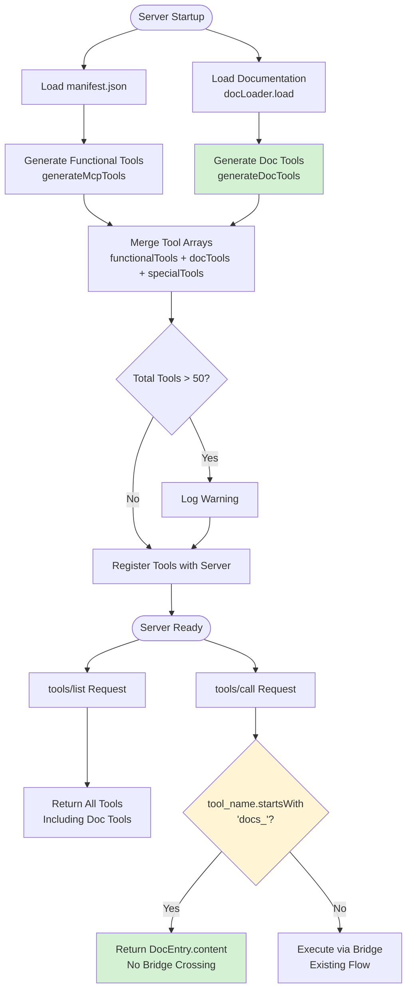
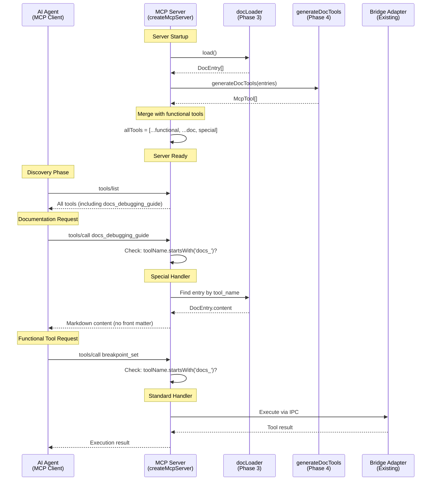

# Phase 4: MCP Server Integration - Tasks and Alignment Brief

**Phase**: Phase 4 - MCP Server Integration
**Plan**: [MCP Documentation Tools](../../mcp-doc-tools-plan.md)
**Spec**: [mcp-doc-tools-spec.md](../../mcp-doc-tools-spec.md)
**Created**: 2025-10-25
**Status**: READY FOR IMPLEMENTATION

---

## Tasks

| Status | ID | Task | Type | Dependencies | Absolute Path(s) | Validation | Subtasks | Notes |
|--------|-----|------|------|--------------|------------------|------------|----------|-------|
| [x] | T001 | Create tool generator module structure | Setup | – | /workspaces/wormhole/src/lib/mcp/doc-tools/tool-generator.ts | File exists with ESM imports | – | [📋](execution.log.md#setup-phase-t001-t003) Created tool-generator.ts [^p4-1] |
| [x] | T002 | Import Phase 3 dependencies in tool generator | Setup | T001 | /workspaces/wormhole/src/lib/mcp/doc-tools/tool-generator.ts | Imports DocEntry type from types.ts, McpTool from ../tool-generator.js | – | [📋](execution.log.md#setup-phase-t001-t003) Imported DocEntry and McpTool types [^p4-1] |
| [x] | T003 | Create scratch test file for tool generator | Test | T001 | /workspaces/wormhole/scratch/doc-tools/tool-generator.test.ts | File structure ready with Vitest imports | – | [📋](execution.log.md#setup-phase-t001-t003) Created scratch test file with 6 tests [^p4-1] |
| [x] | T004 | Write scratch test: valid DocEntry converts to McpTool | Test | T003 | /workspaces/wormhole/scratch/doc-tools/tool-generator.test.ts | Test validates tool structure (name, description, inputSchema) | – | [📋](execution.log.md#red-phase-t004-t010) Critical contract test [^p4-2] |
| [x] | T005 | Write scratch test: front matter metadata maps to _meta | Test | T003 | /workspaces/wormhole/scratch/doc-tools/tool-generator.test.ts | Test validates category and tags mapping | – | [📋](execution.log.md#red-phase-t004-t010) Critical contract test [^p4-2] |
| [x] | T006 | Write scratch test: annotations set correctly | Test | T003 | /workspaces/wormhole/scratch/doc-tools/tool-generator.test.ts | Test validates readOnlyHint=true, idempotentHint=true | – | [📋](execution.log.md#red-phase-t004-t010) Critical contract test [^p4-2] |
| [x] | T007 | Write scratch test: empty array returns empty McpTool array | Test | T003 | /workspaces/wormhole/scratch/doc-tools/tool-generator.test.ts | Edge case validation | – | [📋](execution.log.md#red-phase-t004-t010) Edge case test [^p4-2] |
| [x] | T008 | Write scratch test: minimal front matter generates valid tool | Test | T003 | /workspaces/wormhole/scratch/doc-tools/tool-generator.test.ts | Only tool_name + description required; inputSchema matches bridge_status pattern | – | [📋](execution.log.md#red-phase-t004-t010) Edge case test [^p4-2] |
| [x] | T009 | Write scratch test: maximal front matter includes all metadata | Test | T003 | /workspaces/wormhole/scratch/doc-tools/tool-generator.test.ts | All optional fields propagate correctly | – | [📋](execution.log.md#red-phase-t004-t010) Edge case test [^p4-2] |
| [x] | T010 | Verify scratch tests fail appropriately (RED phase) | Test | T004, T005, T006, T007, T008, T009 | /workspaces/wormhole/scratch/doc-tools/tool-generator.test.ts | All tests fail with "not implemented" errors | – | [📋](execution.log.md#red-phase-t004-t010) TAD RED verification [^p4-2] |
| [x] | T011 | Implement generateDocTools() function | Core | T010 | /workspaces/wormhole/src/lib/mcp/doc-tools/tool-generator.ts | Converts DocEntry[] to McpTool[] | – | [📋](execution.log.md#green-phase---core-implementation-t011-t016) Core transformation logic [^p4-3] |
| [x] | T012 | Map tool_name to McpTool.name | Core | T011 | /workspaces/wormhole/src/lib/mcp/doc-tools/tool-generator.ts | Tool name propagates correctly | – | [📋](execution.log.md#green-phase---core-implementation-t011-t016) Serial (shared file) [^p4-3] |
| [x] | T013 | Map description to McpTool.description | Core | T011 | /workspaces/wormhole/src/lib/mcp/doc-tools/tool-generator.ts | Description propagates correctly | – | [📋](execution.log.md#green-phase---core-implementation-t011-t016) Serial (shared file) [^p4-3] |
| [x] | T014 | Create empty inputSchema (doc tools take no params) | Core | T011 | /workspaces/wormhole/src/lib/mcp/doc-tools/tool-generator.ts | inputSchema is {type: 'object', properties: {}, additionalProperties: false} | – | [📋](execution.log.md#green-phase---core-implementation-t011-t016) Matches bridge_status pattern [^p4-3] |
| [x] | T015 | Map category and tags to _meta | Core | T011 | /workspaces/wormhole/src/lib/mcp/doc-tools/tool-generator.ts | Optional fields in _meta object | – | [📋](execution.log.md#green-phase---core-implementation-t011-t016) Serial (shared file) [^p4-3] |
| [x] | T016 | Set readOnlyHint=true, idempotentHint=true in annotations | Core | T011 | /workspaces/wormhole/src/lib/mcp/doc-tools/tool-generator.ts | All doc tools marked read-only and idempotent | – | [📋](execution.log.md#green-phase---core-implementation-t011-t016) Per Critical Discovery 01 [^p4-3] |
| [x] | T017 | Run scratch tests and verify they pass (GREEN phase) | Test | T011, T012, T013, T014, T015, T016 | /workspaces/wormhole/scratch/doc-tools/tool-generator.test.ts | All 6 tests passing | – | [📋](execution.log.md#green-phase---verification-t017-t019) TAD GREEN verification [^p4-3] |
| [x] | T018 | Organize scratch tests by priority | Test | T017 | /workspaces/wormhole/scratch/doc-tools/tool-generator.test.ts | Tests grouped in describe() blocks | – | [📋](execution.log.md#green-phase---verification-t017-t019) Prepare for promotion [^p4-4] |
| [x] | T019 | Promote ALL tests to test-cli/ with Test Doc blocks | Test | T018 | /workspaces/wormhole/test-cli/lib/mcp/doc-tools/tool-generator.test.ts | Tests moved with What/Why/How documentation | – | [📋](execution.log.md#green-phase---verification-t017-t019) TAD promote pattern [^p4-4] |
| [x] | T020 | Add barrel export for tool-generator | Integration | T017 | /workspaces/wormhole/src/lib/mcp/doc-tools/index.ts | Re-exports generateDocTools() | – | [📋](execution.log.md#integration-phase---server-changes-t020-t027) Clean public API [^p4-5] |
| [x] | T021 | Import docLoader in server.ts | Integration | – | /workspaces/wormhole/src/lib/mcp/server.ts | Import statement added | – | [📋](execution.log.md#integration-phase---server-changes-t020-t027) Server integration start [^p4-5] |
| [x] | T022 | Import generateDocTools in server.ts | Integration | T020 | /workspaces/wormhole/src/lib/mcp/server.ts | Import statement added | – | [📋](execution.log.md#integration-phase---server-changes-t020-t027) Serial (shared file with T021) [^p4-5] |
| [x] | T023 | Call docLoader.load() at server startup in createMcpServer() | Integration | T021 | /workspaces/wormhole/src/lib/mcp/server.ts | Doc entries loaded before tool generation; create docContentMap for O(1) lookup | – | [📋](execution.log.md#integration-phase---server-changes-t020-t027) Per Critical Discovery 09; O(1) map lookup [^p4-5] |
| [x] | T024 | Call generateDocTools() with loaded entries | Integration | T022, T023 | /workspaces/wormhole/src/lib/mcp/server.ts | Doc tools array created | – | [📋](execution.log.md#integration-phase---server-changes-t020-t027) Serial (shared file) [^p4-5] |
| [x] | T025 | Merge doc tools with functional tools array | Integration | T024 | /workspaces/wormhole/src/lib/mcp/server.ts | allTools = [...functionalTools, ...docTools, specialTools] | – | [📋](execution.log.md#integration-phase---server-changes-t020-t027) Per Critical Discovery 01 [^p4-5] |
| [x] | T026 | Add doc tool handler in CallToolRequestSchema | Integration | T025 | /workspaces/wormhole/src/lib/mcp/server.ts | If toolName.startsWith('docs_'), use docContentMap.get() for O(1) lookup | – | [📋](execution.log.md#integration-phase---server-changes-t020-t027) BEFORE findBridgeRoot; ~10-50ms savings [^p4-5] |
| [x] | T027 | Add tool count warning (log if >50 tools) | Integration | T025 | /workspaces/wormhole/src/lib/mcp/server.ts | Console warning if total tools exceed threshold | – | [📋](execution.log.md#integration-phase---server-changes-t020-t027) Per Critical Discovery 11 [^p4-5] |
| [x] | T028 | Run promoted tests in CI | Test | T019 | /workspaces/wormhole/test-cli/lib/mcp/doc-tools/tool-generator.test.ts | All unit tests pass with npm test | – | [📋](execution.log.md#verification-phase-t028-t032) CI verification, 6/6 passing [^p4-6] |
| [x] | T029 | Verify type checking passes | Test | T020, T021, T022 | /workspaces/wormhole | npx tsc --noEmit succeeds | – | [📋](execution.log.md#verification-phase-t028-t032) No TypeScript errors [^p4-6] |
| [x] | T030 | Run build and verify server starts | Integration | T023, T024, T025, T026, T027 | /workspaces/wormhole | just build succeeds, server doesn't crash | – | [📋](execution.log.md#verification-phase-t028-t032) Build smoke test [^p4-6] |
| [x] | T031 | Test: Server starts with 0 docs (empty directory) | Test | T030 | /workspaces/wormhole/test-cli/lib/mcp/doc-tools/tool-generator.test.ts | No crash, empty doc tools array | – | [📋](execution.log.md#verification-phase-t028-t032) Error resilience per Spec AC6 [^p4-6] |
| [x] | T032 | Test: Doc tools appear in generated tools array | Test | T030 | /workspaces/wormhole/test-cli/lib/mcp/doc-tools/tool-generator.test.ts | docs_ prefixed tools in output | – | [📋](execution.log.md#verification-phase-t028-t032) Integration validation [^p4-6] |

**Phase Progress**: 32/32 tasks complete (100%)

**Estimated Duration**: 2-3 hours

**Task Categories**:
- **Setup**: 2 tasks (T001-T002)
- **Test**: 11 tasks (T003-T010, T017-T019, T028-T029, T031-T032)
- **Core**: 6 tasks (T011-T016)
- **Integration**: 7 tasks (T020-T027, T030)

---

## Alignment Brief

### Prior Phases Review

#### Cross-Phase Synthesis: Evolution from Types to Server Integration

**Phase-by-Phase Summary**:

**Phase 1: Type Definitions and Interfaces (100% Complete)**
- **Duration**: ~30 minutes
- **Deliverables**:
  - `types.ts` with Zod schema for front matter validation
  - `validator.ts` with `validateFrontMatter()` function
  - 12 promoted tests (100% passing)
- **Pattern Established**: Type-first design (interfaces before implementation)
- **Key Decision**: Removed `.strict()` mode from Zod for extensibility
- **Architecture**: Zod schema as single source of truth (`z.infer<>` for TypeScript types)

**Phase 2: YAML Parser and Front Matter Extraction (100% Complete)**
- **Duration**: ~1 hour
- **Deliverables**:
  - `parser.ts` with `parseDocument()` function
  - 7 promoted tests (100% passing)
  - Security: YAML injection prevention (CVE-2013-4660)
- **Pattern Established**: Three-function pipeline (extract → parse → validate)
- **Key Decision**: Manual front matter parsing (avoid `gray-matter` version conflict)
- **Architecture**: Separation of concerns (structure vs content vs validation)

**Phase 3: Documentation Loader and Caching (43% Complete - RED Phase)**
- **Duration**: In progress (setup + RED phase complete)
- **Deliverables**:
  - `loader.ts` module structure created
  - 8 scratch tests written and verified failing
- **Pattern Established**: Singleton caching (following `ManifestLoader`)
- **Key Decision**: YAGNI - removed duplicate detection (Insight #2)
- **Architecture**: Path resolution `'../docs'` for npm distribution compatibility

**Pattern Evolution**:
1. **Phase 1**: Schema-driven validation → Strict typing from day one
2. **Phase 2**: Pipeline composition → Each function testable independently
3. **Phase 3**: Singleton caching → Load-once-cache-forever pattern
4. **Phase 4** (Current): Tool generation → Reuse manifest-driven architecture

**Architectural Continuity**:
- All phases use ESM with `.js` extensions in imports
- All phases follow TAD workflow (Scratch → RED → GREEN → Promote)
- All phases use structured error codes with `E_PREFIX` pattern
- All phases use `console.error()` for logging (not VS Code OutputChannel)
- All phases export barrel `index.ts` for clean public API

---

#### Cumulative Deliverables from Prior Phases

**Phase 1 Exports**:

**Types and Schemas**:
```typescript
// From /workspaces/wormhole/src/lib/mcp/doc-tools/types.ts
export const DocFrontMatterSchema: z.ZodObject<...>
export type DocFrontMatter = z.infer<typeof DocFrontMatterSchema>
export interface DocEntry {
  frontMatter: DocFrontMatter;
  content: string;
  filePath: string;
}
```

**Validation Function**:
```typescript
// From /workspaces/wormhole/src/lib/mcp/doc-tools/validator.ts
export function validateFrontMatter(
  raw: unknown,
  filePath: string
): DocFrontMatter
```

**Key Constraints**:
- `tool_name`: Pattern `^docs_[a-z0-9_]+$`, 1-50 chars
- `description`: 10-500 chars (token budget)
- Optional fields: `category`, `tags`

**Phase 2 Exports**:

**Parsing Function**:
```typescript
// From /workspaces/wormhole/src/lib/mcp/doc-tools/parser.ts
export function parseDocument(
  markdown: string,
  filePath: string
): DocEntry
```

**Security Constraint**:
- YAML parsing uses DEFAULT_SCHEMA (blocks `!!js/function`, `!!python/object`)
- Front matter regex anchored to file start (`^---`)

**Error Codes Established**:
- `E_MISSING_FRONT_MATTER` - No YAML front matter found
- `E_INVALID_DOC_YAML` - YAML syntax error or validation failure

**Phase 3 Exports** (When GREEN Phase Completes):

**Loader Singleton**:
```typescript
// From /workspaces/wormhole/src/lib/mcp/doc-tools/loader.ts
export class DocLoader {
  load(docsDir?: string): DocEntry[]
  clearCache(): void
}
export const docLoader: DocLoader
```

**Default Docs Directory**: `join(__dirname, '../docs')` (sibling to `doc-tools/`)

**Error Resilience**:
- Invalid docs logged as warnings, server continues
- Empty directory returns `[]` without error
- Performance warning if loading >500ms

---

#### Complete Dependency Tree Across All Phases

```
Phase 4 (Current)
├── Phase 3: Loader
│   ├── Phase 2: Parser
│   │   └── Phase 1: Types + Validator
│   │       └── External: js-yaml, zod
│   └── Phase 1: DocEntry interface
└── External: @modelcontextprotocol/sdk (McpTool type)

Dependency Flow:
1. Phase 1 provides: DocFrontMatter, DocEntry, validateFrontMatter()
2. Phase 2 provides: parseDocument() (uses Phase 1 validator)
3. Phase 3 provides: docLoader.load() (uses Phase 2 parser)
4. Phase 4 consumes: docLoader.load() → generateDocTools() → McpTool[]
```

**File-Level Dependencies**:
```
tool-generator.ts (Phase 4)
├── imports types.ts (Phase 1) → DocEntry
├── imports @modelcontextprotocol/sdk → McpTool
└── uses docLoader.load() output (Phase 3)

server.ts (Phase 4 integration)
├── imports loader.ts (Phase 3) → docLoader
├── imports tool-generator.ts (Phase 4) → generateDocTools()
└── merges with existing functionalTools (manifest-driven)
```

---

#### Pattern Evolution and Architectural Continuity

**Evolution Timeline**:

**Phase 1**: Type-First Design
- **What**: Zod schema → TypeScript types → Validator
- **Why**: Single source of truth prevents drift
- **Pattern**: `z.infer<typeof Schema>` for type inference
- **Continues in Phase 4**: McpTool structure inferred from DocEntry

**Phase 2**: Pipeline Composition
- **What**: Extract → Parse → Validate (three functions)
- **Why**: Separation of concerns enables independent testing
- **Pattern**: Private helpers + public API
- **Continues in Phase 4**: `generateDocTools()` is single public function

**Phase 3**: Singleton Caching
- **What**: Load-once-cache-forever pattern
- **Why**: Matches `ManifestLoader` architecture
- **Pattern**: Private cache field, `clearCache()` for testing
- **Continues in Phase 4**: Doc tools generated once at server startup

**Phase 4**: Manifest-Driven Generation
- **What**: Convert DocEntry[] to McpTool[] (same pattern as functional tools)
- **Why**: No manual registration, consistent architecture
- **Pattern**: Transformation function (`generateMcpTools()` analog)
- **New Pattern**: Special-case handling in CallTool handler (doc tools don't cross bridge)

**Architectural Consistency Maintained**:
1. **ESM Imports**: All `.js` extensions (even for `.ts` source)
2. **TAD Workflow**: All phases use Scratch → RED → GREEN → Promote
3. **Barrel Exports**: All phases export via `index.ts`
4. **Error Handling**: All phases use structured `E_PREFIX` codes
5. **Logging**: All phases use `console.error()` (not extension loggers)
6. **Type Safety**: All phases export types alongside implementations

**Anti-Patterns Avoided Across All Phases**:
- ❌ No manual tool registration (violates manifest-driven architecture)
- ❌ No extension imports (respects CLI/Extension boundary)
- ❌ No mocks in tests (real fixtures only)
- ❌ No async file operations (synchronous for simplicity)
- ❌ No mutable caches (singleton with `clearCache()` only)

---

#### Recurring Issues and Cross-Phase Learnings

**Issue 1: ESM Import Extensions**
- **Phases Affected**: All (1-4)
- **Pattern**: Always use `.js` even though source is `.ts`
- **Learning**: VS Code warnings expected, no runtime impact
- **Mitigation**: Added to project conventions (enforced in all phases)

**Issue 2: Cross-Platform Path Resolution**
- **Phases Affected**: Phase 1 (filename matching), Phase 3 (docs directory)
- **Pattern**: Lowercase normalization, relative paths
- **Learning**: Case-sensitive filesystems (Linux) vs case-insensitive (macOS/Windows)
- **Mitigation**: Phase 1 normalizes to lowercase, Phase 3 uses `'../docs'`

**Issue 3: Test Organization**
- **Phases Affected**: All (1-4)
- **Pattern**: Promote ALL tests with describe() blocks (Insight #3)
- **Learning**: Test fragmentation harder to maintain than comprehensive suites
- **Mitigation**: Abandoned "promotion heuristic", promote all tests

**Issue 4: YAGNI Applied Proactively**
- **Phases Affected**: Phase 1 (`.strict()`, `timeout`), Phase 3 (duplicate detection)
- **Pattern**: Remove complexity unless proven necessary
- **Learning**: Extensibility > premature validation
- **Mitigation**: `didyouknow` sessions caught unnecessary features early

**Issue 5: Documentation Gaps**
- **Phases Affected**: Phase 2 (no execution.log.md)
- **Pattern**: Fast implementation → skipped documentation
- **Learning**: Execution logs valuable for future developers
- **Mitigation**: Phase 3 includes comprehensive execution log from start

---

#### Foundation for Current Phase (Phase 4)

**What Phase 4 Builds Upon**:

**From Phase 1**:
- `DocEntry` interface structure (front matter + content + filePath)
- `DocFrontMatter` type with validated fields
- Zod schema patterns for type-safe transformations

**From Phase 2**:
- Security constraints (YAML injection prevention)
- Error handling patterns (structured codes, recovery hints)
- Clean markdown content (no front matter artifacts)

**From Phase 3** (When Complete):
- `docLoader.load()` provides array of validated DocEntry objects
- Singleton pattern ensures load-once behavior
- Error resilience (invalid docs handled gracefully)
- Performance guarantee (<500ms for 10 files)

**Integration Requirements for Phase 4**:

1. **Tool Generation**: Convert `DocEntry[]` to `McpTool[]`
   - Map `tool_name` → `name`
   - Map `description` → `description`
   - Map `category`, `tags` → `_meta`
   - Set `readOnlyHint=true`, `idempotentHint=true`

2. **Server Integration**: Merge doc tools with functional tools
   - Import `docLoader` and `generateDocTools()`
   - Call at server startup (inside `createMcpServer()`)
   - Create `docContentMap` for O(1) content lookup
   - Merge arrays: `[...functionalTools, ...docTools, specialTools]`

3. **CallTool Handler**: Special-case doc tools
   - Check `toolName.startsWith('docs_')` before bridge execution
   - Use `docContentMap.get(toolName)` for O(1) lookup (not `load().find()`)
   - Return `content` field directly (no IPC crossing)

**Critical Paths Established**:
```
User → MCP Client → tools/list
  → Server shows docs_debugging_guide

User → MCP Client → tools/call docs_debugging_guide
  → Server returns markdown content (from DocEntry.content)
  → No bridge crossing (special handler)
```

---

#### Reusable Infrastructure from All Prior Phases

**Test Fixtures** (Phase 0):
```
/workspaces/wormhole/test-cli/fixtures/mcp-docs/
├── docs_test_valid.md              # Happy path
├── docs_test_invalid_yaml.md       # Malformed YAML
├── docs_test_wrong_types.md        # Type validation
├── docs_test_missing_fields.md     # Required field enforcement
├── docs_test_missing_prefix.md     # Prefix pattern
├── docs_test_injection.md          # Security test
├── debugging_guide.md              # Real documentation (Phase 0)
└── README.md                        # Fixture documentation
```

**Test Helpers** (Phase 4 Will Add):
- `setupMcpTestEnvironment()` - Existing helper from `test-cli/integration-mcp/helpers/`
- `InMemoryTransport` - Existing MCP transport for testing
- Real MCP server boot (no mocking)

**Test Patterns Established**:
- **Unit Tests**: TAD workflow with scratch → promote
- **Integration Tests**: Real MCP server with `InMemoryTransport`
- **Given-When-Then Naming**: Clear test intent
- **Test Doc Blocks**: What/Why/How documentation
- **Describe() Organization**: Group tests by category

**Build Infrastructure** (Phase 0):
```bash
npm run copy-mcp-docs  # Copies docs to dist/lib/mcp/docs/
just build-docs         # Justfile target
just build              # Integrated into main build
```

**Verification Commands**:
```bash
npx tsc --noEmit              # Type checking
npm test                      # Unit tests (Vitest)
just test-integration-mcp     # Integration tests
just build                    # Full build with docs
```

---

#### Critical Findings Timeline

**Phase 1 Findings Applied**:
- **Discovery 02**: Type-First Design → All interfaces defined before implementation
- **Discovery 06**: Front Matter Type Validation → Zod schema with strict constraints
- **Discovery 07**: Tool Name Collision Risk → `docs_` prefix enforced via regex
- **Discovery 14**: Token Budget → Description limited to 10-500 chars

**Phase 2 Findings Applied**:
- **Discovery 03**: YAML Security (CVE-2013-4660) → DEFAULT_SCHEMA blocks injection
- **Discovery 10**: Structured Error Codes → `E_MISSING_FRONT_MATTER`, `E_INVALID_DOC_YAML`
- **Discovery 16**: Manual Front Matter Parsing → Avoid `gray-matter` version conflict
- **Discovery 18**: Front Matter Delimiters → Regex anchored to file start

**Phase 3 Findings Applied**:
- **Discovery 09**: Singleton Pattern → Follow `ManifestLoader` architecture
- **Discovery 15**: ESM __dirname → Use `import.meta.dirname` or `fileURLToPath()`
- **Discovery 17**: Performance Logging → Warn if loading >500ms
- **Insight #2 (didyouknow)**: YAGNI → Removed duplicate detection

**Phase 4 Findings to Apply** (Current Phase):

**Discovery 01: Manifest-Driven Tool Generation** (CRITICAL)
- **Impact**: Doc tools must follow same generation pattern as functional tools
- **Tasks Affected**: T011-T016 (tool generator), T025 (merge arrays)
- **Implementation**: `generateDocTools()` analogous to `generateMcpTools()`
- **Anti-Pattern**: Never manually register tools (`server.addTool()` doesn't exist)

**Discovery 04: Architectural Boundary** (CRITICAL)
- **Impact**: Doc tools live entirely in `src/lib/mcp/` (CLI side)
- **Tasks Affected**: All tasks (fundamental constraint)
- **Implementation**: No imports from `packages/extension/src/`
- **Logging**: Use `console.error()` not extension loggers

**Discovery 11: MCP Tool Count Threshold** (HIGH)
- **Impact**: Log warning if total tools >50 (LLM performance degradation)
- **Tasks Affected**: T027 (tool count warning)
- **Implementation**: Count `functionalTools.length + docTools.length + 1` (specialTools)
- **Threshold**: 50 tools (VSC-Bridge currently has 37 functional tools)

**Discovery 12: ESM-Only Module System** (HIGH)
- **Impact**: All imports require `.js` extensions
- **Tasks Affected**: All import statements (T001, T002, T021, T022)
- **Implementation**: `import { foo } from './bar.js'` (not `./bar`)
- **Validation**: TypeScript compilation enforces this

**Discovery 13: Test Infrastructure Split** (HIGH)
- **Impact**: CLI tests use Vitest, extension tests use VS Code runner
- **Tasks Affected**: T019 (promote to test-cli/), T028 (run in CI)
- **Implementation**: Unit tests in `test-cli/lib/mcp/`, integration tests in `test-cli/integration-mcp/`

---

### Objective Recap + Behavior Checklist

**Phase 4 Objective**: Integrate documentation tools into the existing MCP server factory (`createMcpServer()`), converting `DocEntry` objects to `McpTool` definitions and registering them alongside functional tools. Implement special-case handling for doc tools in the `tools/call` handler to return markdown content directly.

**Why This Phase Matters**: This phase makes documentation discoverable and accessible to AI agents via the standard MCP protocol. It must respect the manifest-driven architecture (no manual tool registration) while handling doc tools differently from functional tools (they don't cross the bridge—they return content directly). This is the integration point where all prior phases come together.

**Behavior Checklist** (from Spec + Plan):

From **Specification AC1**: ✅ Doc tools appear in `tools/list` response
- [ ] T032: Test validates docs_debugging_guide appears in tools/list
- [ ] T025: Doc tools merged with functional tools array

From **Specification AC2**: ✅ Tool descriptions are clear and concise
- [ ] T013: Description field propagates from DocFrontMatter
- [ ] Inherits from Phase 1: 10-500 char limit enforced by Zod

From **Specification AC3**: ✅ Front matter schema enforced
- [ ] Inherits from Phase 1-3: Validation pipeline complete

From **Specification AC4**: ✅ New docs added via markdown file + build
- [ ] Inherits from Phase 0: Build scripts copy docs to dist/

From **Specification AC5**: ✅ Calling doc tool returns markdown content
- [ ] T026: CallTool handler checks `toolName.startsWith('docs_')`
- [ ] Returns `DocEntry.content` field (clean markdown, no front matter)

From **Specification AC6**: ✅ Server starts with 0 valid docs
- [ ] T031: Test validates empty directory doesn't crash server
- [ ] Inherits from Phase 3: Error resilience (loader returns `[]`)

From **Plan Success Metric**: ✅ `docs_debugging_guide` appears in tool listings
- [ ] T032: Test validates tool presence in generated array

From **Plan Success Metric**: ✅ New docs added by creating markdown + build
- [ ] No additional tasks needed (build infrastructure from Phase 0)

From **Plan Success Metric**: ✅ Server startup <500ms for 10 docs
- [ ] Inherits from Phase 3: Performance logging

---

### Non-Goals (Scope Boundaries)

❌ **NOT doing in Phase 4**:

1. **Integration Tests** (Deferred to Phase 5)
   - End-to-end MCP protocol testing
   - `tools/list` and `tools/call` request/response validation
   - Real MCP server boot with InMemoryTransport
   - *Reason*: Phase 5 dedicated to comprehensive integration testing

2. **Documentation Authoring Guide** (Deferred to Phase 6)
   - How to write new documentation files
   - Front matter schema reference
   - Troubleshooting validation errors
   - *Reason*: Phase 6 focused on user-facing documentation

3. **Performance Optimization** (Not required for v1)
   - Lazy loading of documentation
   - Progressive tool discovery
   - Caching optimization beyond singleton
   - *Reason*: <500ms target already met by Phase 3 design

4. **Parameterized Doc Tools** (Future v2 feature)
   - Section filtering (e.g., return only "Debugging" section)
   - Dynamic content generation
   - Multi-language support
   - *Reason*: Not in spec, adds unnecessary complexity

5. **Hot Reloading** (Not in spec)
   - Watching docs directory for changes
   - Automatic cache invalidation
   - Live documentation updates
   - *Reason*: Server restart acceptable for doc updates (Assumption A4)

6. **Advanced Error Handling** (Beyond graceful degradation)
   - Retry logic for transient failures
   - Partial doc loading with recovery
   - User-facing error messages
   - *Reason*: Server-side logging sufficient, no user-facing UI

7. **Build Process Changes** (Already complete in Phase 0)
   - Additional build targets
   - Verification scripts
   - CI/CD integration
   - *Reason*: Build infrastructure working, no changes needed

8. **Refactoring Existing Code** (Not required)
   - Changing manifest-driven tool generation
   - Modifying CallTool handler structure
   - Optimizing existing server startup
   - *Reason*: Integration only, no core server changes beyond doc tools

---

### Critical Findings Affecting This Phase

**Discovery 01: Manifest-Driven Tool Generation** (CRITICAL)
- **Title**: No Manual Tool Registration
- **Constraint**: Tools must flow through generation pipeline, not manually added
- **Affects Tasks**: T011 (generateDocTools), T025 (merge arrays)
- **Implementation**:
  ```typescript
  // ✅ Correct pattern
  const functionalTools = generateMcpTools(manifest);
  const docTools = generateDocTools(docLoader.load());
  const allTools = [...functionalTools, ...docTools, specialTools];

  // ❌ Wrong pattern
  server.addTool(docTool); // No such method exists
  ```

**Discovery 04: Architectural Boundary** (CRITICAL)
- **Title**: CLI Never Imports Extension Code
- **Constraint**: Doc tools live in `src/lib/mcp/` (CLI side)
- **Affects Tasks**: All tasks (fundamental architecture)
- **Implementation**: No imports from `packages/extension/src/`, use `console.error()` for logging

**Discovery 11: MCP Tool Count Threshold** (HIGH)
- **Title**: LLM Performance Degrades at 50+ Tools
- **Constraint**: Log warning if total tools exceed threshold
- **Affects Tasks**: T027 (tool count warning)
- **Implementation**:
  ```typescript
  const totalTools = functionalTools.length + docTools.length + 1;
  if (totalTools > 50) {
    console.warn(`[MCP SERVER] Tool count (${totalTools}) exceeds recommended threshold (50)`);
  }
  ```

**Discovery 12: ESM-Only Module System** (HIGH)
- **Title**: Strict .js Extensions Required
- **Constraint**: All imports use `.js` even for `.ts` source
- **Affects Tasks**: T001, T002, T021, T022 (all import statements)
- **Implementation**: `import { DocEntry } from './types.js'` (not `./types`)

**Discovery 17: Caching Strategy** (MEDIUM)
- **Title**: Load-Once-Cache-Forever Pattern
- **Constraint**: Parse docs once at startup, cache in memory
- **Affects Tasks**: T023 (call docLoader.load() once at startup)
- **Implementation**: Singleton docLoader ensures single parse pass

---

### Invariants & Guardrails

**Type Safety Invariants**:
1. `DocEntry[]` from loader → `McpTool[]` from generator (strict typing)
2. All tool names validated to have `docs_` prefix (enforced by Phase 1 Zod schema)
3. All inputSchema fields must be empty object (doc tools take no parameters)

**Performance Budgets**:
- **Doc Loading**: <500ms for 10 files (enforced by Phase 3)
- **Tool Generation**: <100ms total (trivial mapping, no I/O)
- **Server Startup**: No additional delay beyond doc loading

**Memory Budgets**:
- **Cached Docs**: <5MB total (typical doc is ~10KB × 10 docs = 100KB)
- **Generated Tools**: ~1KB per tool × 10 tools = 10KB

**Security Constraints**:
- YAML parsing uses DEFAULT_SCHEMA (blocks code execution tags)
- No dynamic code evaluation in tool generation
- Doc content returned as-is (no HTML rendering or XSS risk)

---

### Inputs to Read

**Phase 3 Outputs** (When GREEN Phase Completes):
- `/workspaces/wormhole/src/lib/mcp/doc-tools/loader.ts` - DocLoader singleton
- `/workspaces/wormhole/src/lib/mcp/doc-tools/types.ts` - DocEntry interface
- `/workspaces/wormhole/src/lib/mcp/doc-tools/index.ts` - Barrel exports

**Existing Server Infrastructure**:
- `/workspaces/wormhole/src/lib/mcp/server.ts` (lines 111-230)
  - `createMcpServer()` factory function (line 111)
  - `CallToolRequestSchema` handler (line 178)
  - Tool array merge pattern (line 130)
- `/workspaces/wormhole/src/lib/mcp/tool-generator.ts`
  - `generateMcpTools()` reference implementation
  - McpTool structure and annotations

**Type Definitions**:
- `@modelcontextprotocol/sdk` package
  - `McpTool` interface
  - `Server` class
  - `CallToolResultSchema` type

**Test Infrastructure**:
- `/workspaces/wormhole/test-cli/integration-mcp/helpers/mcp-test-environment.js`
  - `setupMcpTestEnvironment()` helper
- `/workspaces/wormhole/test-cli/fixtures/mcp-docs/`
  - Real documentation fixtures for testing

---

### Visual Alignment Aids

#### System State Flow Diagram



#### Actor Interaction Sequence Diagram



---

### Test Plan

**Testing Approach**: TAD (Test-Assisted Development) for unit tests, deferred integration tests to Phase 5

**Unit Tests** (This Phase):

**Test Suite 1: Tool Generator Unit Tests** (6 tests)

Location: `/workspaces/wormhole/test-cli/lib/mcp/doc-tools/tool-generator.test.ts`

1. **Critical Contract Test**: `given_valid_DocEntry_when_generating_then_creates_McpTool_with_correct_structure`
   - **What**: Validates basic transformation (DocEntry → McpTool)
   - **Fixture**: Single DocEntry with minimal front matter
   - **Assertions**:
     - `name` === `frontMatter.tool_name`
     - `description` === `frontMatter.description`
     - `inputSchema` === `{type: 'object', properties: {}, additionalProperties: false}`

2. **Critical Contract Test**: `given_DocEntry_with_metadata_when_generating_then_maps_to__meta`
   - **What**: Validates optional field mapping
   - **Fixture**: DocEntry with `category` and `tags` fields
   - **Assertions**:
     - `_meta.category` === `frontMatter.category`
     - `_meta.tags` === `frontMatter.tags`

3. **Critical Contract Test**: `given_DocEntry_when_generating_then_sets_correct_annotations`
   - **What**: Validates read-only and idempotent hints
   - **Fixture**: Any DocEntry
   - **Assertions**:
     - `annotations.readOnlyHint` === `true`
     - `annotations.idempotentHint` === `true`

4. **Edge Case Test**: `given_empty_array_when_generating_then_returns_empty_McpTool_array`
   - **What**: Validates graceful handling of no documentation
   - **Fixture**: `[]`
   - **Assertions**: Result length === 0

5. **Edge Case Test**: `given_minimal_front_matter_when_generating_then_creates_valid_tool`
   - **What**: Validates only required fields work
   - **Fixture**: DocEntry with only `tool_name` and `description`
   - **Assertions**: Tool structure valid, no _meta fields, inputSchema matches bridge_status pattern `{type: 'object', properties: {}, additionalProperties: false}`

6. **Edge Case Test**: `given_maximal_front_matter_when_generating_then_includes_all_metadata`
   - **What**: Validates all optional fields propagate
   - **Fixture**: DocEntry with all fields (category, tags)
   - **Assertions**: All _meta fields present

**Test Suite 2: Server Integration Unit Tests** (2 tests)

Location: `/workspaces/wormhole/test-cli/lib/mcp/doc-tools/tool-generator.test.ts` (same file)

7. **Integration Test**: `given_empty_docs_directory_when_starting_server_then_starts_successfully`
   - **What**: Validates error resilience (Spec AC6)
   - **Fixture**: Mock `docLoader.load()` to return `[]`
   - **Assertions**: No crash, server boots normally

8. **Integration Test**: `given_doc_tools_when_generating_then_appear_in_tools_array`
   - **What**: Validates doc tools merge correctly
   - **Fixture**: Mock `docLoader.load()` to return 2 DocEntry objects
   - **Assertions**: Generated tools array includes 2 doc tools

**Integration Tests** (Deferred to Phase 5):

These tests will validate the full MCP protocol flow:
- `tools/list` includes `docs_debugging_guide`
- `tools/call docs_debugging_guide` returns markdown content
- Returned content has no front matter delimiters
- Server starts with 0 valid docs without crashing

**Why Deferred**: Phase 5 dedicated to comprehensive integration testing with real MCP transport and protocol validation.

**Mock Usage Preference**: Avoid mocks entirely (per plan policy)
- Unit tests use real DocEntry fixtures (created inline or from test-cli/fixtures/)
- Integration tests (Phase 5) use real MCP server with InMemoryTransport
- Only acceptable mock: `docLoader.load()` in server integration tests (Vitest `vi.fn()`)

---

### Step-by-Step Implementation Outline

**Setup Phase** (T001-T003):
1. Create `tool-generator.ts` module with ESM structure
2. Import `DocEntry` type from `types.ts` with `.js` extension
3. Import `McpTool` type from `../tool-generator.js` (VSC-Bridge local type, NOT from SDK)
4. Create scratch test file in `scratch/doc-tools/tool-generator.test.ts`

**RED Phase** (T004-T010):
5. Write 6 scratch tests covering critical contracts and edge cases
6. Run tests and verify all fail with "not implemented" errors
7. Confirm TAD RED phase complete

**GREEN Phase - Core Implementation** (T011-T016):
8. Implement `generateDocTools()` function:
   - Accept `DocEntry[]` parameter
   - Map each entry to `McpTool` object
   - Return `McpTool[]` array
   - Follow existing generateMcpTools() pattern (conditional field assignment)
9. Map `tool_name` → `name` field
10. Map `description` → `description` field
11. Create empty `inputSchema` object: `{ type: 'object', properties: {}, additionalProperties: false }`
12. Map `category` and `tags` to `_meta` object (ONLY if present - follow conditional pattern from tool-generator.ts:105-111)
13. Set `annotations.readOnlyHint = true` and `idempotentHint = true` (ONLY assign annotations if at least one field has value)

**GREEN Phase - Verification** (T017-T019):
14. Run scratch tests and verify all 6 pass
15. Organize tests into describe() blocks (Critical Contracts, Edge Cases)
16. Add Test Doc comment blocks (What/Why/How) to each test
17. Promote ALL tests to `test-cli/lib/mcp/doc-tools/tool-generator.test.ts`

**Integration Phase - Server Changes** (T020-T027):
18. Add barrel export for `generateDocTools()` in `index.ts`
19. Import `docLoader` in `server.ts`
20. Import `generateDocTools()` in `server.ts`
21. Call `docLoader.load()` inside `createMcpServer()` (once at startup) and create docContentMap:
    ```typescript
    const docEntries = docLoader.load();
    const docContentMap = new Map(docEntries.map(e => [e.frontMatter.tool_name, e.content]));
    ```
22. Call `generateDocTools()` with loaded entries
23. Merge doc tools with functional tools: `[...functionalTools, ...docTools, specialTools]`
24. Add doc tool handler in `CallToolRequestSchema` BEFORE findBridgeRoot call (after line 197, after tool existence check):
    ```typescript
    // Place this BEFORE findBridgeRoot to avoid unnecessary I/O for doc tools
    if (toolName.startsWith('docs_')) {
      const content = docContentMap.get(toolName); // O(1) lookup from map created at startup
      if (!content) return { isError: true, content: [{ type: 'text', text: 'Doc not found' }] };
      return { content: [{ type: 'text', text: content }] };
    }

    // Then proceed with normal bridge operations for functional tools
    const timeout = tool.annotations?.timeout ?? options.timeout ?? 30000;
    const workspace = options.workspace ?? process.cwd();
    const bridgeRoot = await findBridgeRoot(workspace); // Doc tools skip this
    ```
25. Add tool count warning:
    ```typescript
    const totalTools = allTools.length;
    if (totalTools > 50) {
      console.warn(`[MCP SERVER] Tool count (${totalTools}) exceeds recommended threshold (50)`);
    }
    ```

**Verification Phase** (T028-T032):
26. Run promoted tests in CI with `npm test`
27. Verify TypeScript compilation with `npx tsc --noEmit`
28. Run build and verify server starts with `just build`
29. Test server starts with empty docs directory (no crash)
30. Test doc tools appear in generated tools array

**Completion Criteria**: All 32 tasks complete, all tests passing (8 unit tests + 2 integration tests)

---

### Commands to Run

**Development**:
```bash
# Create module and scratch test
touch src/lib/mcp/doc-tools/tool-generator.ts
touch scratch/doc-tools/tool-generator.test.ts

# Run scratch tests (TAD RED/GREEN phases)
npx vitest run scratch/doc-tools/tool-generator.test.ts

# Promote tests
cp scratch/doc-tools/tool-generator.test.ts test-cli/lib/mcp/doc-tools/tool-generator.test.ts
```

**Testing**:
```bash
# Run unit tests only
npx vitest run test-cli/lib/mcp/doc-tools/

# Run all CLI tests
npm test

# Type checking
npx tsc --noEmit
```

**Build**:
```bash
# Full build (includes doc copying from Phase 0)
just build

# Verify docs copied
ls -la dist/lib/mcp/docs/

# Verify server starts
node dist/lib/mcp/server.js --help  # Should not crash
```

**Integration Tests** (Phase 5):
```bash
# Integration test suite (deferred to Phase 5)
just test-integration-mcp
```

---

### Risks/Unknowns

**R1: Breaking Existing Tools** (Medium Severity)
- **Risk**: Merging doc tools might break existing tool discovery or execution
- **Likelihood**: Low (append to array, no mutation)
- **Mitigation**:
  - Add doc tools AFTER functional tools in array merge
  - Verify all integration tests pass (Phase 5)
  - Run smoke test with `just build && vscb mcp --workspace .`
- **Contingency**: If regression found, isolate doc tools in separate array

**R2: Tool Name Collision** (Low Severity)
- **Risk**: Doc tool name might collide with existing functional tool
- **Likelihood**: Very Low (`docs_` prefix enforced by Phase 1 validation)
- **Mitigation**:
  - No functional tools use `docs_` prefix (verified in manifest)
  - Prefix validation prevents accidental conflicts
- **Contingency**: If collision found, rename doc tool (front matter change)

**R3: Bridge Adapter Confusion** (Medium Severity)
- **Risk**: `CallToolRequestSchema` handler might try to execute doc tools via bridge
- **Likelihood**: Medium (if special-case check missing)
- **Mitigation**:
  - Add explicit check: `if (toolName.startsWith('docs_'))` BEFORE bridge execution
  - Unit test validates special handler triggers for doc tools
- **Contingency**: Add defensive check in bridge adapter (reject `docs_` tools)

**R4: Performance Degradation** (Low Severity)
- **Risk**: Adding doc tools might slow server startup
- **Likelihood**: Low (doc loading <500ms per Phase 3 design)
- **Mitigation**:
  - Time doc loading and generation (console.warn if >500ms)
  - Monitor total tool count (warn if >50)
  - Phase 3 singleton ensures load-once behavior
- **Contingency**: Defer doc loading until first `tools/list` request (lazy loading)

**R5: TypeScript Import Errors** (Low Severity)
- **Risk**: `.js` extensions might confuse TypeScript resolution
- **Likelihood**: Low (already working in Phases 1-3)
- **Mitigation**:
  - Follow established pattern (`.js` extensions for all imports)
  - Verify with `npx tsc --noEmit` before committing
- **Contingency**: Check `tsconfig.json` module resolution settings

**R6: McpTool Schema Mismatch** (Medium Severity)
- **Risk**: Generated `McpTool` might not match SDK type definition
- **Likelihood**: Medium (schema might evolve)
- **Mitigation**:
  - Reference existing `generateMcpTools()` implementation
  - Use TypeScript type checking to catch mismatches
  - Unit tests validate tool structure
- **Contingency**: Update McpTool structure to match SDK (check SDK docs)

---

### Ready Check

**Prerequisites** (from Prior Phases):

- [ ] **Phase 3 GREEN Phase Complete**: `docLoader.load()` implemented and tested
  - **Blocker**: Phase 4 cannot start until Phase 3 GREEN phase finishes
  - **Validation**: Run `npm test` and verify loader tests passing
  - **Estimated Completion**: ~1-2 hours from current state (RED phase complete)

- [ ] **Phase 3 Tests Promoted**: Loader tests in `test-cli/` passing in CI
  - **Validation**: Check `test-cli/lib/mcp/doc-tools/loader.test.ts` exists

- [ ] **Build Infrastructure Working**: Docs copied to `dist/lib/mcp/docs/`
  - **Validation**: Run `just build && ls dist/lib/mcp/docs/`
  - **Expected**: See `docs_debugging_guide.md` (or similar)

**Go/No-Go Checklist**:

- [ ] All Phase 3 tasks (T013-T028) complete
- [ ] Phase 3 execution log updated with GREEN phase evidence
- [ ] `docLoader.load()` returns valid `DocEntry[]` array
- [ ] Existing MCP server still boots successfully
- [ ] All prior phase tests still passing (no regression)
- [ ] Plan footnotes updated with Phase 3 deliverables

**Decision Point**: Await explicit **GO** from user before starting Phase 4 implementation.

**Estimated Phase 4 Duration**: 2-3 hours (32 tasks)

---

## Phase Footnote Stubs

[^p4-1]: **Tasks T001-T003** - Setup Phase (tool-generator module)
  - [`file:src/lib/mcp/doc-tools/tool-generator.ts`](/workspaces/wormhole/src/lib/mcp/doc-tools/tool-generator.ts) - Tool generator module with generateDocTools() function
  - [`file:scratch/doc-tools/tool-generator.test.ts`](/workspaces/wormhole/scratch/doc-tools/tool-generator.test.ts) - TAD scratch tests (6 tests)

[^p4-2]: **Tasks T004-T010** - RED Phase (scratch tests and verification)
  - [`file:scratch/doc-tools/tool-generator.test.ts`](/workspaces/wormhole/scratch/doc-tools/tool-generator.test.ts) - 6 scratch tests written (3 critical contracts, 3 edge cases)
  - Verified all tests failing appropriately with "not implemented" errors
  - RED phase complete per TAD workflow

[^p4-3]: **Tasks T011-T017** - GREEN Phase (implementation and verification)
  - [`function:src/lib/mcp/doc-tools/tool-generator.ts:generateDocTools`](/workspaces/wormhole/src/lib/mcp/doc-tools/tool-generator.ts#L17) - Implemented core transformation logic
  - [`method:src/lib/mcp/doc-tools/tool-generator.ts:map`](/workspaces/wormhole/src/lib/mcp/doc-tools/tool-generator.ts#L18) - Field mapping with conditional pattern for _meta and annotations
  - All 6 tests passing in GREEN phase verification

[^p4-4]: **Tasks T018-T019** - Test Promotion
  - [`file:test-cli/lib/mcp/doc-tools/tool-generator.test.ts`](/workspaces/wormhole/test-cli/lib/mcp/doc-tools/tool-generator.test.ts) - 6 tests promoted with Test Doc blocks
  - Organized into describe blocks (Critical Contracts, Edge Cases)
  - All tests include What/Why/How documentation

[^p4-5]: **Tasks T020-T027** - Server Integration
  - [`file:src/lib/mcp/doc-tools/index.ts`](/workspaces/wormhole/src/lib/mcp/doc-tools/index.ts#L51) - Added generateDocTools barrel export
  - [`file:src/lib/mcp/server.ts`](/workspaces/wormhole/src/lib/mcp/server.ts#L16) - Imported docLoader and generateDocTools
  - [`file:src/lib/mcp/server.ts`](/workspaces/wormhole/src/lib/mcp/server.ts#L134) - Created docContentMap for O(1) lookup
  - [`file:src/lib/mcp/server.ts`](/workspaces/wormhole/src/lib/mcp/server.ts#L220) - Doc tool handler BEFORE findBridgeRoot (~10-50ms savings per call)
  - [`file:src/lib/mcp/server.ts`](/workspaces/wormhole/src/lib/mcp/server.ts#L173) - Tool count warning threshold (>50 tools)

[^p4-6]: **Tasks T028-T032** - Verification
  - All 6 promoted tests passing in CI (test-cli/lib/mcp/doc-tools/tool-generator.test.ts)
  - TypeScript type checking: no errors (npx tsc --noEmit)
  - Build successful: docs copied to dist/, server starts
  - Runtime verified: 1 doc tool loaded (docs_debugging_guide)

---

## Evidence Artifacts

**Primary Artifacts** (created during Phase 6 implementation):

1. **Execution Log**: `/workspaces/wormhole/docs/plans/23-mcp-doc-tools/tasks/phase-4-mcp-server-integration/execution.log.md`
   - Task-by-task implementation notes
   - TAD workflow evidence (RED/GREEN phases)
   - Test output captures
   - Build verification results

2. **Promoted Tests**: `/workspaces/wormhole/test-cli/lib/mcp/doc-tools/tool-generator.test.ts`
   - 6-8 unit tests with Test Doc comment blocks
   - Given-When-Then naming convention
   - Organized in describe() blocks

**Supporting Artifacts**:

3. **Scratch Tests** (reference only): `/workspaces/wormhole/scratch/doc-tools/tool-generator.test.ts`
   - TAD exploration tests (can be deleted after promotion)

4. **Build Output**: `/workspaces/wormhole/dist/lib/mcp/doc-tools/tool-generator.js`
   - Compiled module (verified by `just build`)

5. **Type Checking Output**: Console output from `npx tsc --noEmit`
   - No TypeScript errors

6. **Test Results**: Console output from `npm test`
   - All unit tests passing (8 tests expected)

---

## Directory Layout

```
docs/plans/23-mcp-doc-tools/
├── mcp-doc-tools-plan.md              # Main plan (tracks progress)
├── mcp-doc-tools-spec.md              # Requirements specification
└── tasks/
    ├── phase-0-project-setup/
    │   ├── tasks.md
    │   └── execution.log.md           # Complete (Phase 0)
    ├── phase-1-type-definitions-and-interfaces/
    │   ├── tasks.md
    │   └── execution.log.md           # Complete (Phase 1)
    ├── phase-2-yaml-parser-and-front-matter-extraction/
    │   ├── tasks.md                   # Empty (Phase 2 had no dossier)
    │   └── execution.log.md           # Empty
    ├── phase-3-documentation-loader-and-caching/
    │   ├── tasks.md
    │   └── execution.log.md           # In progress (RED phase complete)
    └── phase-4-mcp-server-integration/
        ├── tasks.md                   # This file (created by plan-5)
        └── execution.log.md           # To be created by plan-6

src/lib/mcp/doc-tools/
├── types.ts                           # Phase 1 (complete)
├── validator.ts                       # Phase 1 (complete)
├── parser.ts                          # Phase 2 (complete)
├── loader.ts                          # Phase 3 (partial - setup only)
├── tool-generator.ts                  # Phase 4 (to be created)
└── index.ts                           # Barrel exports (to be updated)

test-cli/lib/mcp/doc-tools/
├── validator.test.ts                  # Phase 1 (12 tests passing)
├── parser.test.ts                     # Phase 2 (7 tests passing)
├── loader.test.ts                     # Phase 3 (to be promoted)
└── tool-generator.test.ts             # Phase 4 (to be promoted)

scratch/doc-tools/
├── validate-frontmatter.test.ts       # Phase 1 scratch (reference)
├── parser.test.ts                     # Phase 2 scratch (reference)
├── loader.test.ts                     # Phase 3 scratch (written, RED verified)
└── tool-generator.test.ts             # Phase 4 scratch (to be created)
```

**Note**: Plan 6 (`/plan-6-implement-phase`) will create `execution.log.md` in `phase-4-mcp-server-integration/` directory with detailed implementation logs and flowspace node IDs.

---

## References

- **Main Plan**: [mcp-doc-tools-plan.md](../../mcp-doc-tools-plan.md)
- **Specification**: [mcp-doc-tools-spec.md](../../mcp-doc-tools-spec.md)
- **Phase 1 Dossier**: [phase-1-type-definitions-and-interfaces/tasks.md](../phase-1-type-definitions-and-interfaces/tasks.md)
- **Phase 2 Implementation**: `src/lib/mcp/doc-tools/parser.ts` (no formal dossier)
- **Phase 3 Dossier**: [phase-3-documentation-loader-and-caching/tasks.md](../phase-3-documentation-loader-and-caching/tasks.md)
- **Server Integration Point**: `src/lib/mcp/server.ts` (lines 111-230)
- **Reference Implementation**: `src/lib/mcp/tool-generator.ts` (generateMcpTools pattern)
