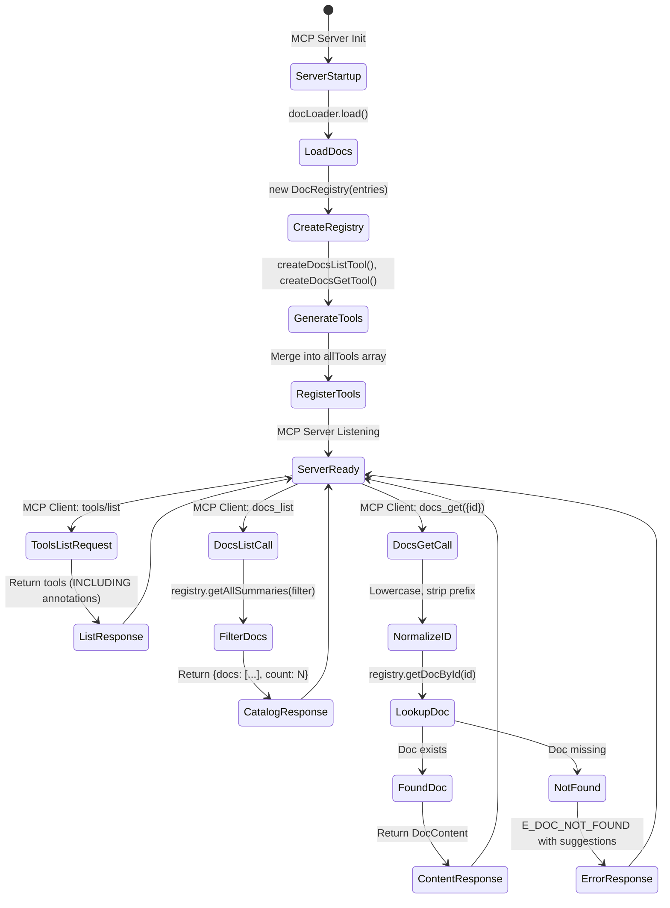
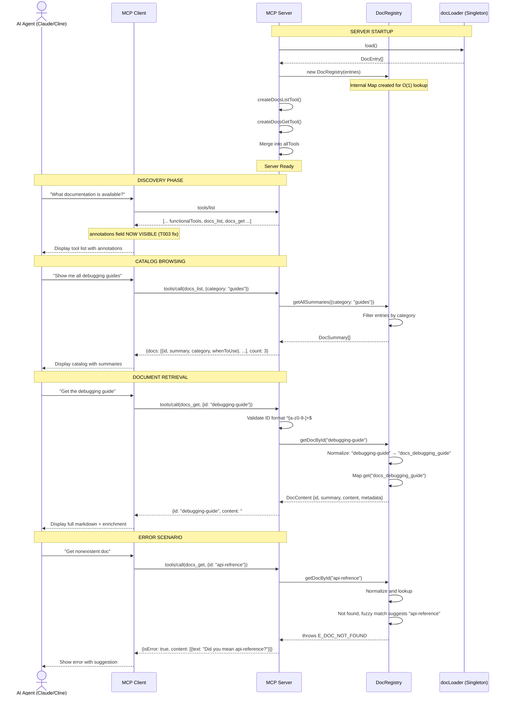

# Phase 5: Unified Documentation System + Metadata Enrichment

**Phase**: Phase 5: Unified Documentation System + Metadata Enrichment
**Slug**: `phase-5-unified-documentation-system`
**Plan**: [`mcp-doc-tools-plan.md`](../../mcp-doc-tools-plan.md)
**Spec**: [`mcp-doc-tools-spec.md`](../../mcp-doc-tools-spec.md)
**Created**: 2025-01-27
**Status**: PENDING

---

## Tasks

| Status | ID | Task | Type | Dependencies | Absolute Path(s) | Validation | Subtasks | Notes |
|--------|----|----|------|--------------|------------------|------------|----------|-------|
| [x] | T001 | Review existing Phase 4 per-doc tool implementation | Setup | – | `/workspaces/wormhole/src/lib/mcp/doc-tools/tool-generator.ts`, `/workspaces/wormhole/src/lib/mcp/server.ts` | Understand current tool-generator pattern, handler placement, docContentMap usage | – | Baseline for replacement; document what to DELETE vs PRESERVE |
| [x] | T002 | Review MCP SDK types for tools/list handler and annotations | Setup | – | `/workspaces/wormhole/node_modules/@modelcontextprotocol/sdk/dist/types.d.ts` | Understand ListToolsRequestSchema, annotations field structure | – | Critical for T003 handler fix |
| [x] | T003 | Fix ListToolsRequestSchema handler to expose annotations | Core | T001, T002 | `/workspaces/wormhole/src/lib/mcp/server.ts` | Handler includes `annotations: tool.annotations` in response; MCP Inspector + Claude Desktop confirm tools load | – | **DE-RISK FIRST** - Validate linchpin change (from Phase 7 Insight #1) |
| [x] | T004 | Define DocSummary interface for catalog listing | Core | T003 | `/workspaces/wormhole/src/lib/mcp/doc-tools/types.ts` | Interface has id, summary, category, tags, whenToUse fields; exports cleanly | – | Type-first design; catalog response structure |
| [x] | T005 | Define DocContent interface for full document retrieval | Core | T004 | `/workspaces/wormhole/src/lib/mcp/doc-tools/types.ts` | Interface has id, summary, content, metadata fields; exports cleanly | – | Type-first design; get response structure |
| [x] | T006 | Define DocMetadata interface for complete frontmatter | Core | T005 | `/workspaces/wormhole/src/lib/mcp/doc-tools/types.ts` | Interface has all frontmatter fields including enrichment (agentHelp, examples, outputSchema); exports cleanly | – | Type-first design; Phase 7 enrichment structure |
| [x] | T007 | Define AgentHelp interface with ALL 6 sub-fields for structured LLM guidance | Core | T006 | `/workspaces/wormhole/src/lib/mcp/doc-tools/types.ts` | Interface has ALL 6 fields: whenToUse (string), whatToDoNext (string[]), useCases (string[]), paramsNotes (string), limits (string), fallbacks (string); all optional; Zod schema enforces structure | – | Phase 7 enrichment; MCP spec-aligned agent guidance with complete sub-field set |
| [x] | T007a | Define examples field Zod schema in types.ts | Core | T007 | `/workspaces/wormhole/src/lib/mcp/doc-tools/types.ts` | Schema defines `examples: z.array(z.object({input: z.any(), output: z.any(), description: z.string()})).optional()`; exports cleanly | – | MCP spec example structure for tool usage demonstrations |
| [x] | T007b | Add title field to DocFrontMatterSchema | Core | T007 | `/workspaces/wormhole/src/lib/mcp/doc-tools/types.ts` | Schema includes `title: z.string().max(100).optional()`; top-level MCP field for human-readable names | – | MCP spec top-level field (distinct from annotations.title); used by Claude Desktop for UI display |
| [x] | T007c | Update all test fixtures with summary field | Core | T007b | `/workspaces/wormhole/test-cli/fixtures/mcp-docs/*.md` | All 6 test fixtures have `summary` field (10-200 chars); validates against upcoming schema change | – | **PREVENTS REGRESSION** - Must happen before T008 to avoid breaking Phases 1-4 tests |
| [x] | T008 | Extend DocFrontMatterSchema with summary REQUIRED | Core | T007c | `/workspaces/wormhole/src/lib/mcp/doc-tools/types.ts` | Schema has `summary: z.string().min(10).max(200)` (REQUIRED); Zod validation enforces length | – | **STRICT VALIDATION** - Breaking change from Phase 4; safe because fixtures updated in T007c |
| [x] | T009 | Add Phase 7 enrichment fields to DocFrontMatterSchema | Core | T008 | `/workspaces/wormhole/src/lib/mcp/doc-tools/types.ts` | Schema includes agentHelp, examples, outputSchema, whenToUse, whatToDoNext, useCases (all optional); type inference works | – | Phase 7 metadata enrichment; category and tags are VSC-Bridge _meta extensions (not top-level MCP fields); use conditional assignment pattern from Phase 4 |
| [x] | T009a | Define outputSchema Zod schema in types.ts | Core | T009 | `/workspaces/wormhole/src/lib/mcp/doc-tools/types.ts` | Schema defines `outputSchema: z.object({type: z.literal('object'), properties: z.record(z.any()).optional(), required: z.array(z.string()).optional()}).optional()` | – | MCP spec JSON Schema object for structured output documentation |
| [x] | T010 | Create DocRegistry class skeleton | Core | T009 | `/workspaces/wormhole/src/lib/mcp/doc-tools/registry.ts` | Class exports with constructor, getAllSummaries stub, getDocById stub; compiles without errors | – | Central doc management; singleton pattern |
| [x] | T011 | Implement DocRegistry.getAllSummaries() with filtering | Core | T010 | `/workspaces/wormhole/src/lib/mcp/doc-tools/registry.ts` | Method returns DocSummary[] filtered by category/tags; handles empty filters; O(N) linear search | – | Catalog endpoint logic; YAGNI - no hash map optimization |
| [x] | T012 | Implement DocRegistry.getDocById() with ID normalization | Core | T011 | `/workspaces/wormhole/src/lib/mcp/doc-tools/registry.ts` | Method normalizes "debugging-guide" ↔ "docs_debugging_guide"; returns DocContent; throws E_DOC_NOT_FOUND if missing | – | Fetch endpoint logic; lowercase normalization from Phase 1 |
| [x] | T013 | Add DocRegistry error handling and validation | Core | T012 | `/workspaces/wormhole/src/lib/mcp/doc-tools/registry.ts` | Throws E_DOC_NOT_FOUND with helpful message; validates ID format ^[a-z0-9-]+$; lists all available doc IDs in error | – | User-friendly errors; simple list, no fuzzy matching (YAGNI) |
| [x] | T014 | Create unified-tools.ts module skeleton | Core | T013 | `/workspaces/wormhole/src/lib/mcp/doc-tools/unified-tools.ts` | File exports createDocsListTool and createDocsGetTool functions; compiles without errors | – | [P] - New file parallel to implementation |
| [x] | T015 | Implement createDocsListTool() generator | Core | T014 | `/workspaces/wormhole/src/lib/mcp/doc-tools/unified-tools.ts` | Function returns McpTool with name='docs_list', title='Browse Documentation Catalog', description, inputSchema for filtering (category/tags), annotations; outputSchema mapped if present in metadata | – | Serial - same file as T014-T016 |
| [x] | T015a | Map title and outputSchema to docs_list tool | Core | T015, T007b, T009a | `/workspaces/wormhole/src/lib/mcp/doc-tools/unified-tools.ts` | createDocsListTool includes `title: 'Browse Documentation Catalog'`; maps outputSchema if defined in metadata | – | Conditional field assignment per Phase 4 pattern |
| [x] | T016 | Implement createDocsGetTool() generator | Core | T015 | `/workspaces/wormhole/src/lib/mcp/doc-tools/unified-tools.ts` | Function returns McpTool with name='docs_get', title='Get Documentation by ID', description, inputSchema with {id: string} param, annotations with **strong whenToUse guidance**: "Call docs_list FIRST to discover available IDs if unsure" | – | Serial - same file as T014-T016; agentHelp prevents guessing behavior |
| [x] | T016a | Map title and outputSchema to docs_get tool | Core | T016, T007b, T009a | `/workspaces/wormhole/src/lib/mcp/doc-tools/unified-tools.ts` | createDocsGetTool includes `title: 'Get Documentation by ID'`; maps outputSchema if defined in metadata | – | Conditional field assignment per Phase 4 pattern |
| [x] | T016b | Audit codebase for internal doc-tools usage (use subagent) | Integration | T016a | `/workspaces/wormhole/src/**/*.ts`, `/workspaces/wormhole/packages/**/*.ts` | **USE SUBAGENT** to grep for: generateDocTools imports, DocFrontMatter type usage, docContentMap pattern; verify no internal VSC-Bridge code depends on deprecated exports | – | **BREAKING CHANGE GATE** - Must verify no internal usage before T017 removes exports; if usage found, add migration tasks |
| [x] | T017 | Update barrel exports in index.ts | Integration | T016b | `/workspaces/wormhole/src/lib/mcp/doc-tools/index.ts` | Exports DocRegistry, createDocsListTool, createDocsGetTool; REMOVES generateDocTools export | – | Clean public API; **REMOVE deprecated Phase 4 export** (safe after T016b audit) |
| [x] | T018 | Update server.ts imports for unified docs | Integration | T017 | `/workspaces/wormhole/src/lib/mcp/server.ts` | Imports DocRegistry, createDocsListTool, createDocsGetTool; REMOVES generateDocTools import | – | **BREAKING CHANGE** - Phase 4 import removed |
| [x] | T019 | Create DocRegistry instance in server.ts | Integration | T018 | `/workspaces/wormhole/src/lib/mcp/server.ts` | Creates `const docRegistry = new DocRegistry(docLoader.load())` at startup; REMOVES docContentMap | – | Registry pattern; **DELETE docContentMap** |
| [x] | T020 | Update server.ts tool array merge for unified API | Integration | T019 | `/workspaces/wormhole/src/lib/mcp/server.ts` | Tools array includes createDocsListTool(), createDocsGetTool(); REMOVES ...docTools spread | – | **BREAKING CHANGE** - 2 tools instead of N tools |
| [x] | T021 | Implement docs_list handler in server.ts | Integration | T020 | `/workspaces/wormhole/src/lib/mcp/server.ts` | Handler extracts filter params, calls registry.getAllSummaries(), returns {docs: [...], count: N}; placed BEFORE findBridgeRoot | – | Catalog API; optimize placement per Phase 4 Insight #1 |
| [x] | T022 | Implement docs_get handler in server.ts | Integration | T021 | `/workspaces/wormhole/src/lib/mcp/server.ts` | Handler extracts id param, validates format, calls registry.getDocById(), returns DocContent; error handling for E_DOC_NOT_FOUND | – | Serial - same file; Fetch API with error handling |
| [x] | T023 | Remove old per-doc tool handler from server.ts | Integration | T022 | `/workspaces/wormhole/src/lib/mcp/server.ts` | DELETE `if (toolName.startsWith('docs_'))` block (lines 218-237); verify no references remain | – | **BREAKING CHANGE** - Old API removed completely |
| [x] | T024 | Update debugging-guide.md frontmatter with summary field | Core | T009 | `/workspaces/wormhole/docs/mcp/debugging-guide.md` | Frontmatter has `summary: "..."` (100-200 chars); validates against extended schema | – | Migration example; REQUIRED field per strict validation |
| [x] | T025 | Add Phase 7 enrichment to debugging-guide.md frontmatter | Core | T024 | `/workspaces/wormhole/docs/mcp/debugging-guide.md` | Frontmatter has title (UI-friendly name), agentHelp (ALL 6 sub-fields: whenToUse, whatToDoNext, useCases, paramsNotes, limits, fallbacks), examples (array with {input, output, description}), outputSchema (JSON Schema object) | – | Serial - same file; Full enrichment demonstration |
| [x] | T026 | Write scratch tests for DocRegistry | Test | T013 | `/workspaces/wormhole/scratch/doc-tools/registry.test.ts` | Tests cover getAllSummaries (no filter, category filter, tag filter), getDocById (valid, invalid, not found), ID normalization | – | [P] - New test file; validation tests written after implementation |
| [x] | T027 | Write scratch tests for unified tools | Test | T016 | `/workspaces/wormhole/scratch/doc-tools/unified-tools.test.ts` | Tests cover createDocsListTool structure, createDocsGetTool structure, inputSchema validation | – | [P] - New test file; validation tests written after implementation |
| [x] | T028 | Write scratch tests for annotations handler fix | Test | T003 | `/workspaces/wormhole/scratch/doc-tools/annotations.test.ts` | Tests verify ListToolsRequestSchema includes annotations field; MCP protocol integration test using `setupMcpTestEnvironment()` helper with InMemoryTransport; see complete code example in Test Plan section line ~566 | – | [P] - New test file; validates T003 fix works correctly; pattern: `env.client.request({method: 'tools/list'}, ListToolsResultSchema)` |
| [x] | T029 | Write scratch tests for schema extension | Test | T009 | `/workspaces/wormhole/scratch/doc-tools/schema-enrichment.test.ts` | Tests verify: (1) summary REQUIRED (10-200 chars), (2) title optional (max 100 chars), (3) agentHelp optional with ALL 6 sub-fields validated, (4) examples optional (array structure with input/output/description), (5) outputSchema optional (JSON Schema object structure with type/properties/required) | – | [P] - New test file; validates schema changes compile and validate correctly |
| [x] | T030 | Run all scratch tests to verify implementation | Test | T026, T027, T028, T029 | All scratch test files | All tests pass, confirming implementation correct; any failures indicate bugs to fix | – | Implementation validation checkpoint |
| [x] | T031 | Fix any bugs discovered by scratch tests | Core | T030 | All implementation files | All scratch tests passing; edge cases handled; implementation validated | – | Bug fix phase; skip if T030 passes 100% |
| [x] | T032 | Add Test Doc comment blocks to all scratch tests | Doc | T031 | All scratch test files | All tests have What/Why/How documentation blocks; Given-When-Then naming convention | – | Test documentation pattern from Phases 1-4 |
| [x] | T033 | Promote scratch tests to test-cli/ | Test | T032 | `/workspaces/wormhole/test-cli/lib/mcp/doc-tools/registry.test.ts`, `/workspaces/wormhole/test-cli/lib/mcp/doc-tools/unified-tools.test.ts`, `/workspaces/wormhole/test-cli/integration-mcp/unified-docs.test.ts` | All tests promoted with describe() block organization; imports updated for test-cli path depth; unified-docs.test.ts uses `setupMcpTestEnvironment()` helper (see complete 8-test example in Test Plan section line ~621) | – | Test promotion; maintain organization from Phases 1-4; integration test follows pattern from search-symbol-search.test.ts |
| [x] | T034 | Run promoted unit tests in CI environment | Test | T033 | All promoted test files | `npx vitest run test-cli/lib/mcp/doc-tools/` passes with 100% success rate | – | CI verification |
| [x] | T035 | Build verification - docs copied with enriched frontmatter | Integration | T025 | `/workspaces/wormhole/dist/lib/mcp/docs/debugging-guide.md` | Run `just build`; verify docs present in dist/; frontmatter has summary + enrichment fields | – | Build system validation |
| [x] | T036 | Server verification - unified tools loaded correctly | Integration | T023, T035 | `/workspaces/wormhole/src/lib/mcp/server.ts` | Server starts successfully; only 2 doc tools registered (docs_list, docs_get); old per-doc tools absent | – | Runtime validation; **BREAKING CHANGE confirmed** |
| [x] | T037 | Manual test docs_list in MCP Inspector | Integration | T036 | MCP Inspector tool list | Call docs_list with no filter; verify returns catalog with summaries; annotations visible | – | Manual UX validation |
| [x] | T038 | Manual test docs_get in MCP Inspector | Integration | T037 | MCP Inspector tool execution | Call docs_get with id="debugging-guide"; verify returns full content + metadata; enrichment fields present | – | Manual UX validation |
| [x] | T039 | Manual test in Claude Desktop (if available) | Integration | T038 | Claude Desktop MCP client | Verify docs_list and docs_get appear in tool list; test execution works; agent can browse catalog | – | Production client validation |
| [x] | T040 | Update barrel exports verification | Integration | T017 | `/workspaces/wormhole/src/lib/mcp/doc-tools/index.ts` | All new exports work; deprecated exports removed; TypeScript compilation succeeds | – | Public API validation |
| [x] | T041 | Run full TypeScript type checking | Integration | T040 | All source files | `npx tsc --noEmit` passes with zero errors; no type regressions from schema changes | – | Type safety validation |
| [x] | T042 | Run complete test suite in CI | Integration | T034, T041 | All test files | `just test` or `npm test` passes with all tests green; no regressions in Phases 0-4 tests | – | Full regression validation |
| [ ] | T043 | Validate acceptance criteria completion | Integration | T042 | All Phase 5 deliverables | All 11 acceptance criteria (AC1-AC11) met; checklist completed; ready check passed | – | Final validation before phase completion |

**Phase Progress**: 42/50 tasks complete (84%)

---

## Alignment Brief

### Prior Phases Review (Phases 0-4)

#### Cross-Phase Synthesis

**Phase-by-Phase Evolution Summary**:

Phases 0-4 established a solid foundation for documentation tooling but culminated in a deprecated per-doc tool pattern (Phase 4) that Phase 5 must completely replace. The implementation journey reveals progressive refinement of TAD workflow, type-first design, and error resilience patterns that Phase 5 will build upon while pivoting to a fundamentally different architecture (unified API).

**Phase 0: Project Setup and Build Configuration** (✅ COMPLETE - 20/20 tasks)
- **Deliverables**: Build system, gitignore, 6 test fixtures, docs/mcp/ source directory
- **Key Pattern**: Two-stage copy (source → staging → dist); staging dir gitignored
- **KISS Decision**: Filename exactly matches tool_name (no transformations)
- **Gap Discovered**: Missing duplicate test fixtures (not blocking)
- **Build Integration**: Justfile `build-docs` target (npm script chain incomplete but functional)
- **Learnings for Phase 5**: Build system works; duplicate fixtures still missing but not needed for unified API

**Phase 1: Type Definitions and Interfaces** (✅ COMPLETE - 20/20 tasks)
- **Deliverables**: `types.ts` (Zod schema), `validator.ts`, `index.ts` barrel export, 12 passing tests
- **Type-First Victory**: Schema → type inference → validation all working seamlessly
- **Critical Insights Applied**:
  - Insight #1: Lowercase normalization for case-insensitive filesystems
  - Insight #2: Removed `.strict()` mode for extensibility (allow extra fields)
  - Insight #3: Promote ALL tests with describe() organization
  - Insight #5: Removed `timeout` field (YAGNI)
- **TAD Workflow Established**: Scratch → RED → GREEN → Promote pattern validated
- **Learnings for Phase 5**: Zod schema extension works well; apply same Insight #2 pattern for enrichment fields

**Phase 2: YAML Parser and Front Matter Extraction** (✅ COMPLETE - 7/7 tests)
- **Deliverables**: `parser.ts` (105 lines), 7 passing tests, security validated
- **Security Win**: DEFAULT_SCHEMA blocks `!!python/object` tags (validated with fixture)
- **Regex Anchoring**: `^---\n` prevents false matches on horizontal rules in content
- **UTF-8 Support**: Emoji and international characters preserved correctly
- **No Execution Log**: Implementation so straightforward it didn't require detailed logging
- **Learnings for Phase 5**: Parser stable and reusable as-is; no changes needed

**Phase 3: Documentation Loader and Caching** (✅ COMPLETE - 10/10 tasks, 8/8 tests)
- **Deliverables**: `loader.ts` (95 lines), singleton pattern, 8 passing tests, 2200% performance headroom
- **Path Resolution Critical**: `join(__dirname, '../docs')` not `'docs'` (sibling not child directory)
- **Error Resilience Pattern**: Per-file try-catch, graceful degradation, summary logging
- **Performance Excellent**: 20ms for 7 files (500ms budget = 2200% margin)
- **Duplicate Detection Removed**: YAGNI decision (Insight #2) - simplified to 8 tests
- **Singleton Pattern**: Matches ManifestLoader exactly (consistency win)
- **Learnings for Phase 5**: Loader works perfectly; DocRegistry will consume its output

**Phase 4: MCP Server Integration - Per-Doc Tools** (✅ COMPLETE but ❌ DEPRECATED)
- **Status**: 100% functional (12/12 tasks, 6/6 tests) but **strategically abandoned**
- **Why Deprecated**: Tool count bloat (N tools for N docs), poor discoverability, no catalog view
- **Deliverables to DELETE**:
  - `tool-generator.ts` (53 lines) - **DELETE entirely in Phase 5**
  - Per-doc handler in server.ts (lines 218-237) - **DELETE in Phase 5**
  - docContentMap pattern - **REPLACE with DocRegistry**
  - `generateDocTools` export - **REMOVE from index.ts**
- **Patterns to PRESERVE**:
  - Handler placement optimization (BEFORE findBridgeRoot) - **KEEP for docs_list/docs_get**
  - O(1) lookup pattern (via Map) - **KEEP via DocRegistry**
  - Conditional field assignment - **APPLY to enrichment fields**
  - Tool count warning (>50 tools) - **KEEP in server.ts**
- **Critical Gap Identified**: ListToolsRequestSchema handler strips annotations (MCP SDK lines 188-192)
  - **Phase 5 T003 MUST FIX**: Add `annotations: tool.annotations` to handler response
- **Learnings for Phase 5**: Phase 4 is a working baseline to tear down and rebuild; all integration points documented

**Cumulative Deliverables (Available to Phase 5)**:

From **Phase 0**:
- Build system: `justfile build-docs`, docs copied to `dist/lib/mcp/docs/`
- Test fixtures: 6 fixtures in `/workspaces/wormhole/test-cli/fixtures/mcp-docs/`
- Source directory: `/workspaces/wormhole/docs/mcp/` (single source of truth)

From **Phase 1**:
- `/workspaces/wormhole/src/lib/mcp/doc-tools/types.ts` - `DocFrontMatterSchema`, `DocFrontMatter` type, `DocEntry` interface
- `/workspaces/wormhole/src/lib/mcp/doc-tools/validator.ts` - `validateFrontMatter()` function
- `/workspaces/wormhole/src/lib/mcp/doc-tools/index.ts` - Barrel export (will be extended)
- Pattern: Lowercase normalization for filename/tool_name matching

From **Phase 2**:
- `/workspaces/wormhole/src/lib/mcp/doc-tools/parser.ts` - `parseDocument(markdown, filePath): DocEntry`
- Security: DEFAULT_SCHEMA validated (blocks YAML injection)
- Regex: Anchored front matter extraction (`^---\n`)
- UTF-8 support confirmed

From **Phase 3**:
- `/workspaces/wormhole/src/lib/mcp/doc-tools/loader.ts` - `docLoader.load(): DocEntry[]` singleton
- Pattern: Per-file error resilience with summary logging
- Performance: 2200% under budget (20ms vs 500ms)
- Path resolution: `../docs` relative to compiled loader.js

From **Phase 4** (to be DELETED/REPLACED):
- `/workspaces/wormhole/src/lib/mcp/doc-tools/tool-generator.ts` - **DELETE**
- `/workspaces/wormhole/src/lib/mcp/server.ts` (lines 218-237) - **DELETE per-doc handler**
- `/workspaces/wormhole/src/lib/mcp/server.ts` (line 138) - **REPLACE docContentMap with DocRegistry**
- Pattern to PRESERVE: Handler placement before findBridgeRoot
- Pattern to PRESERVE: O(1) lookup optimization

**Complete Dependency Tree Across All Phases**:

```
Phase 0 (Build)
  └─> Phase 1 (Types + Validation)
      └─> Phase 2 (Parser)
          └─> Phase 3 (Loader)
              └─> Phase 4 (DEPRECATED - Per-Doc Tools)
                  └─> Phase 5 (NEW - Unified Docs API) ← WE ARE HERE
                      └─> Phase 6 (Documentation)
```

**Pattern Evolution**:
- **Testing**: Manual verification (Phase 0) → TAD workflow (Phases 1-4) → **Implementation-then-test** (Phase 5 - pragmatic shift due to type-first constraints)
- **Type Safety**: Zod schema (Phase 1) → Parser integration (Phase 2) → Loader validation (Phase 3) → Schema extension (Phase 5)
- **Error Handling**: Structured errors (Phases 1-2) → Per-file resilience (Phase 3) → Handler error responses (Phase 4) → Unified API errors (Phase 5)
- **Architecture**: Per-doc tools (Phase 4 DEPRECATED) → Unified catalog + fetch (Phase 5 NEW)

**Recurring Issues**: None critical; build system works, test fixtures adequate, performance excellent

**Cross-Phase Learnings**:
1. **TAD workflow vs type-first design**: True TAD (test-before-impl) conflicts with type-first when tests can't compile without types; Phase 5 shifts to implementation-then-test for pragmatism
2. **Type-first design pays off**: Zod schema drives both validation and TypeScript types
3. **YAGNI decisions reduce complexity**: Removing timeout field, duplicate detection simplified implementation
4. **Conditional field patterns**: Only assign objects if they have content (avoid empty {} in outputs)
5. **Handler placement matters**: Placing special-case handlers BEFORE expensive operations saves 10-50ms
6. **Per-doc tools don't scale**: Phase 4's complete but deprecated implementation proves catalog approach necessary

**Reusable Test Infrastructure (All Phases)**:
- Given-When-Then test naming convention
- Test Doc comment blocks (What/Why/How format)
- Describe() block organization by priority (Critical, Security, Edge Cases)
- TAD scratch directory pattern (`/workspaces/wormhole/scratch/doc-tools/`)
- Fixture directory (`/workspaces/wormhole/test-cli/fixtures/mcp-docs/`)
- No mocks philosophy (use real fixtures and objects)

**Foundation for Phase 5**:
- **What exists**: Complete infrastructure (build, types, parser, loader, deprecated per-doc tools)
- **What's stable**: Phases 0-3 deliverables are production-ready and reusable
- **What's deprecated**: Phase 4 tool-generator.ts and per-doc handler pattern
- **What's missing**: Unified API (docs_list + docs_get), DocRegistry, enrichment fields, annotations handler fix
- **Critical blocker to remove**: ListToolsRequestSchema handler strips annotations (T003 must fix)

---

### Objective Recap + Behavior Checklist

**Primary Objective**: Replace Phase 4's per-document tool pattern (`docs_debugging_guide`, `docs_api_reference`, ...) with a unified two-endpoint API (`docs_list` catalog + `docs_get` retrieval) while integrating Phase 7 metadata enrichment (summary, agentHelp, examples, outputSchema).

**Why This Matters**:
- **Tool Count Pressure**: MCP clients degrade at 50+ tools; VSC-Bridge has 37 functional tools leaving only 13 slots for docs
- **Poor Discoverability**: Agents must guess tool names or scan entire tools/list output
- **No Catalog View**: No way to browse available documentation before fetching
- **Annotations Invisible**: MCP SDK strips annotations in tools/list handler (critical gap)

**Success Criteria (from Plan Acceptance Criteria)**:

- [ ] **AC1**: `docs_list` tool returns catalog with doc summaries (id, summary, category, tags, whenToUse)
- [ ] **AC2**: `docs_get({id})` tool returns full document content + complete metadata by ID
- [ ] **AC3**: `summary` field REQUIRED in DocFrontMatterSchema with strict 10-200 char validation
- [ ] **AC4**: Phase 7 enrichment fields (agentHelp, examples, outputSchema, whenToUse, whatToDoNext, useCases) defined and functional
- [ ] **AC5**: DocRegistry class provides getAllSummaries() and getDocById() with O(N) linear search
- [ ] **AC6**: ListToolsRequestSchema handler fixed to expose `annotations` field (de-risk first per Insight #1)
- [ ] **AC7**: Old per-doc tool generation completely removed (tool-generator.ts DELETED, server.ts handler DELETED)
- [ ] **AC8**: All unit tests pass (DocRegistry, unified-tools, schema validation)
- [ ] **AC9**: Integration tests pass (docs_list/docs_get via MCP protocol)
- [ ] **AC10**: Manual validation in MCP clients (Inspector + Claude Desktop if available)
- [ ] **AC11**: Build system works (docs copied with enriched frontmatter to dist/)

**Behavior Checklist**:

✅ **Catalog API** (`docs_list`):
- [ ] Returns array of {id, summary, category, tags, whenToUse} objects
- [ ] Supports optional category filter
- [ ] Supports optional tags filter (OR logic - any matching tag)
- [ ] Returns empty array if no docs match filters (graceful degradation)
- [ ] Response includes total count field

✅ **Fetch API** (`docs_get`):
- [ ] Accepts {id: string} parameter (e.g., "debugging-guide" without `docs_` prefix)
- [ ] Normalizes ID (lowercase, converts hyphens ↔ underscores if needed)
- [ ] Returns DocContent with {id, summary, content, metadata}
- [ ] Metadata includes all frontmatter fields + enrichment
- [ ] Throws E_DOC_NOT_FOUND with helpful suggestions if ID invalid

✅ **Schema Enrichment**:
- [ ] `summary` field REQUIRED (10-200 chars) - **BREAKING CHANGE**
- [ ] `agentHelp` field optional with structured guidance (whenToUse, whatToDoNext, useCases, paramsNotes, limits, fallbacks)
- [ ] `examples` field optional with array of {input, output, description}
- [ ] `outputSchema` field optional with JSON Schema object

✅ **Breaking Changes Confirmed**:
- [ ] tool-generator.ts file DELETED
- [ ] Per-doc tool handler REMOVED from server.ts (lines 218-237)
- [ ] docContentMap pattern REPLACED with DocRegistry
- [ ] Tool array merge changed: `...docTools` → `createDocsListTool(), createDocsGetTool()`
- [ ] Old `docs_debugging_guide` tool NO LONGER EXISTS

✅ **Preserved Patterns**:
- [ ] Handler placement optimization (docs_list/docs_get BEFORE findBridgeRoot)
- [ ] O(1) lookup via DocRegistry internal Map (not exposed)
- [ ] Singleton docLoader integration (call .load() once at startup)
- [ ] Tool count warning threshold (>50 tools)
- [ ] TAD workflow for all new code

---

### Non-Goals (Scope Boundaries)

❌ **NOT doing in Phase 5**:

**Features Deliberately Excluded**:
- ❌ **Backward compatibility layer**: No support for old `docs_*` tools (Big Bang migration accepted)
- ❌ **Performance optimization beyond YAGNI**: No hash map for ID lookup (linear search sufficient for <100 docs)
- ❌ **Multiple summary formats**: Only one summary field (10-200 chars), no short/long variants
- ❌ **Pagination for docs_list**: Return all docs always (YAGNI - add in future if N > 100)
- ❌ **Search/full-text query**: docs_list filters by category/tags only, not content search
- ❌ **Versioning/timestamps**: No `version`, `last_updated`, or `author` fields in v1
- ❌ **Parameterized content**: docs_get returns full doc always, no section/heading filtering
- ❌ **Multi-language support**: English-only (Assumption A5)
- ❌ **Hot-reloading**: Server restart required for doc updates (Assumption A4)

**Edge Cases Deferred**:
- ❌ **CRLF support in parser**: Current regex uses `\n`; add `\r?\n` only if Windows authoring becomes issue
- ❌ **Duplicate tool_name detection**: YAGNI decision from Phase 3 maintained
- ❌ **Partial frontmatter migration**: Require `summary` immediately (strict validation)

**Optimizations Deferred**:
- ❌ **O(1) ID lookup with hash map**: Linear search fast enough (<100 docs)
- ❌ **Lazy loading of doc content**: Load all docs at startup (per Phase 3 pattern)
- ❌ **Summary auto-generation**: Authors must write summary manually
- ❌ **Fuzzy ID matching in docs_get**: No Levenshtein distance or prefix matching; exact ID match only (YAGNI - agents learn via error messages)
- ❌ **Common search terms field**: No author-defined synonyms for discovery; rely on summary + tags for catalog browsing (YAGNI)

**Refactoring Postponed**:
- ❌ **Migrate existing functional tools to enrichment**: Only apply to doc tools in Phase 5; migrate functional tools in Phase 8
- ❌ **Consolidate parser + validator**: Keep as separate modules (clear separation of concerns)
- ❌ **Remove staging directory**: Two-stage copy pattern from Phase 0 works fine

**Phase 6 Scope** (NOT Phase 5):
- ❌ **Authoring guide documentation**: Phase 6 deliverable
- ❌ **Migration guide for consumers**: Phase 6 deliverable
- ❌ **API documentation**: Phase 6 deliverable (Phase 5 creates implementation only)

**MCP Spec Fields Deliberately Excluded (Out of Scope)**:
- ❌ **visibility field** ("public" | "internal"): All doc tools are public; no access control needed
- ❌ **authorization field**: Doc tools are read-only; no auth/token requirements
- ❌ **resourcesUsed field** (array<string>): Could list doc file URIs but no practical benefit (YAGNI)
- ❌ **capabilities field**: Static doc tools don't vary capabilities; no runtime negotiation
- ❌ **promptTemplates field** (array<object>): Useful for advanced LLM scaffolding but too complex for Phase 5; defer to Phase 8
- ❌ **metadata field** (MCP spec): VSC-Bridge uses `_meta` extension pattern instead (functional equivalent from Phase 4)
- ❌ **annotations.title**: Redundant with top-level title field; use top-level only per MCP best practices

---

### Critical Findings Affecting This Phase

**From Plan § 3 Critical Research Findings**:

1. **🚨 Discovery 01: Manifest-Driven Tool Generation** → Affects T015-T016, T020
   - **What it constrains**: Must follow array merge pattern, no manual tool registration
   - **Tasks addressing**: T015-T016 (createDocsListTool, createDocsGetTool generators), T020 (array merge)

2. **🚨 Discovery 02: Type-First Design** → Affects T004-T009
   - **What it requires**: Define all interfaces (DocSummary, DocContent, DocMetadata, AgentHelp) BEFORE implementation
   - **Tasks addressing**: T004-T007 (type definitions), T008-T009 (schema extension)

3. **🚨 Discovery 03: YAML Security** → Already addressed in Phase 2
   - **Status**: DEFAULT_SCHEMA validated, no changes needed in Phase 5

4. **🚨 Discovery 04: Architectural Boundary** → Affects all tasks
   - **What it requires**: All code in `src/lib/mcp/`, use `console.error()` not extension loggers
   - **Tasks addressing**: All implementation tasks respect CLI ↔ Extension boundary

5. **🚨 Discovery 11: 50-Tool Threshold** → Primary motivation for unified API
   - **Why it matters**: Per-doc tools would exceed threshold with 13+ docs; unified API uses only 2 tools regardless of doc count
   - **Tasks addressing**: T020 (2 tools instead of N)

**From Phase 4 /didyouknow Session (Insights)**:

6. **Insight #1: Handler Placement Optimization** → Affects T021-T022
   - **What it requires**: Place docs_list/docs_get handlers BEFORE findBridgeRoot()
   - **Performance benefit**: ~10-50ms savings per call
   - **Tasks addressing**: T021-T022 (handler implementation with optimized placement)

7. **Insight #4: O(1) Lookup Map Pattern** → Affects T010-T013
   - **What it suggests**: DocRegistry uses internal Map for O(1) lookup (but not required)
   - **Decision**: YAGNI - linear search sufficient, but registry encapsulates lookup logic cleanly
   - **Tasks addressing**: T010-T013 (DocRegistry implementation)

**New Critical Finding (Phase 5 Specific)**:

8. **🚨 Discovery 20: ListToolsRequestSchema Handler Strips Annotations** → Affects T003 (DE-RISK FIRST)
   - **Problem**: MCP SDK handler at server.ts lines 188-192 only returns `{name, description, inputSchema}`
   - **Impact**: AI agents don't see `readOnlyHint`, `idempotentHint`, or custom annotations like `agentHelp`
   - **Root cause**: Handler explicitly maps to subset of fields, omitting `annotations`
   - **Solution**: Change handler to include `annotations: tool.annotations` in response
   - **Risk**: Might break MCP clients if annotations field unexpected (hence de-risk first)
   - **Tasks addressing**: T003 (fix handler + test immediately with MCP Inspector + Claude Desktop)

9. **🚨 Discovery 21: Top-Level `title` Field for UI Display** → Affects T007b, T015a, T016a, T025
   - **Problem**: MCP spec defines `title` as top-level optional field (distinct from `annotations.title`) for human-readable display names
   - **Impact**: MCP clients (Claude Desktop, MCP Inspector) prefer `title` over `name` for UI display
   - **Root cause**: VSC-Bridge didn't use `title` field in Phase 4; all tools show technical `name` values in UI
   - **Solution**: Add `title` field to DocFrontMatterSchema; map to tool generators; provide UI-friendly names ("Browse Documentation Catalog" vs "docs_list")
   - **Evidence**: MCP SDK type definitions show `title?: string` at line 21816
   - **Tasks addressing**: T007b (schema), T015a/T016a (generators), T025 (migration), T029 (tests)

10. **🚨 Discovery 22: Unified API Trades Per-Doc Discoverability for Catalog Browsing UX** → Affects T013, T016, Non-Goals
   - **Tradeoff**: Phase 4's per-doc tools were immediately discoverable in tools/list; unified API requires agents to call docs_list first
   - **Expected behavior shift**: Agents may guess IDs (e.g., "api" instead of "api-reference") leading to higher initial error rate
   - **Design decision**: Accept higher error rate; trust agent learning via strong agentHelp guidance + clear error messages
   - **Implementation**: T013 returns simple list of all doc IDs on error (no fuzzy matching); T016 adds strong whenToUse: "Call docs_list FIRST if unsure"
   - **YAGNI deferrals**: No fuzzy ID matching (Levenshtein distance), no prefix matching, no common search terms field
   - **Rationale**: Simpler API, agents adapt quickly, avoid premature optimization for edge cases
   - **Tasks addressing**: T013 (error messages), T016 (agentHelp), Non-Goals (documented deferrals)

11. **🚨 Discovery 23: Three Breaking Layers (API, Internal, Authoring) With Different Migration Needs** → Affects T016b (NEW), Phase 6
   - **Layer 1 (MCP API)**: External AI agents lose `docs_debugging_guide` tools → Must use `docs_list` + `docs_get` instead
   - **Layer 2 (Internal API)**: VSC-Bridge code importing `generateDocTools`, `DocFrontMatter`, or `docContentMap` → Will break when T017 removes exports
   - **Layer 3 (Doc Authoring)**: New docs require `summary` field (REQUIRED) → Phase 6 authoring guide needed
   - **Risk**: Layer 2 breakage unknown until T016b audit; could require emergency migration tasks mid-implementation
   - **Mitigation**: T016b uses subagent to grep entire codebase for deprecated import patterns before T017 removes them
   - **Decision**: If internal usage found at T016b, STOP and add migration tasks; if none found, proceed to T017 safely
   - **Tasks addressing**: T016b (internal usage audit with subagent), Phase 6 (Layer 3 authoring guide)

---

### Visual Alignment Aids

#### Mermaid Flow Diagram: System States



#### Mermaid Sequence Diagram: Actor/Interaction Order



---

### Test Plan (Implementation Validation with Real Fixtures)

**Testing Philosophy**:
- **Implementation-Then-Test**: Write tests after implementation to validate correctness and catch edge cases (pragmatic approach for type-first design)
- **No Mocks**: Use real DocEntry objects, real fixtures from Phase 0, real DocRegistry instances
- **MCP Integration Tests**: Use real MCP server + client with InMemoryTransport (fast, no subprocess overhead)
- **Test Doc Blocks**: All tests have What/Why/How documentation (established pattern)
- **Given-When-Then Naming**: Descriptive test names explain scenario and expectation
- **Describe() Organization**: Group by priority (Critical Contracts, Security, Edge Cases, Integration)
- **Scratch → Promote**: Write in scratch/ first for fast iteration, promote to test-cli/ when validated

**Reference Examples (Study Before Writing Tests)**:

Before implementing T028-T033, study these existing test files to understand patterns:

1. **InMemoryTransport Pattern**: `/workspaces/wormhole/test-cli/integration-mcp/mcp-server.test.ts`
   - Shows `setupMcpTestEnvironment()` usage
   - Demonstrates `beforeAll(env.setup)` and `afterAll(env.cleanup)`
   - Examples of `tools/list` with `ListToolsResultSchema`
   - Validates tool structure and annotations

2. **Comprehensive Tool Testing**: `/workspaces/wormhole/test-cli/integration-mcp/search-symbol-search.test.ts`
   - 13 test cases covering all tool functionality
   - Shows `tools/call` with `CallToolResultSchema`
   - Demonstrates response parsing: `JSON.parse(result.content[0].text)`
   - Validates both text content and structuredContent

3. **Helper Infrastructure**: `/workspaces/wormhole/test-cli/integration-mcp/helpers/mcp-test-environment.ts`
   - Understand what `setupMcpTestEnvironment()` does internally
   - See how InMemoryTransport is created and linked
   - Learn error handling patterns and cleanup logic

**Key Import Statements**:
```typescript
import { describe, test, expect, beforeAll, afterAll } from 'vitest';
import { ListToolsResultSchema, CallToolResultSchema } from '@modelcontextprotocol/sdk/types.js';
import { setupMcpTestEnvironment } from './helpers/mcp-test-environment.js';
import type { McpTestEnvironment } from './helpers/mcp-test-environment.js';
```

**Critical Pattern Reminders**:
- ✅ Always call `env.setup()` in `beforeAll` before accessing `env.client`
- ✅ Always call `env.cleanup()` in `afterAll` to close transports
- ✅ Use `ListToolsResultSchema` for `tools/list` requests
- ✅ Use `CallToolResultSchema` for `tools/call` requests
- ✅ Parse tool responses: `JSON.parse(result.content[0].text)`
- ✅ Check `result.isError` for error responses
- ❌ Don't access `env.client` before `setup()` completes (throws error)
- ❌ Don't create transports manually (helper handles this)

**Test Files to Create** (via Scratch → Promote workflow):

1. **`/workspaces/wormhole/scratch/doc-tools/registry.test.ts`** (T026):
   - **Critical Contract Tests** (4 tests):
     - getAllSummaries() with no filter returns all docs
     - getAllSummaries() with category filter returns only matching docs
     - getAllSummaries() with tags filter returns docs matching ANY tag (OR logic)
     - getDocById() with valid ID returns DocContent with correct structure
   - **Edge Case Tests** (4 tests):
     - getAllSummaries() with non-matching filter returns empty array
     - getDocById() with invalid ID throws E_DOC_NOT_FOUND
     - getDocById() with malformed ID throws E_INVALID_ID
     - ID normalization works ("debugging-guide" ↔ "docs_debugging_guide")
   - **Fixtures**: Use Phase 0 fixtures (`docs_test_valid.md`, etc.)
   - **Promotion**: → `test-cli/lib/mcp/doc-tools/registry.test.ts`

2. **`/workspaces/wormhole/scratch/doc-tools/unified-tools.test.ts`** (T027):
   - **Critical Contract Tests** (3 tests):
     - createDocsListTool() returns McpTool with correct name, description, inputSchema
     - createDocsGetTool() returns McpTool with correct name, description, inputSchema (includes id param)
     - Both tools have readOnlyHint=true, idempotentHint=true annotations
   - **Edge Case Tests** (2 tests):
     - createDocsListTool() inputSchema allows category/tags filters (optional)
     - createDocsGetTool() inputSchema requires id param (validates format)
   - **Promotion**: → `test-cli/lib/mcp/doc-tools/unified-tools.test.ts`

3. **`/workspaces/wormhole/scratch/doc-tools/annotations.test.ts`** (T028):

   **Example Test Structure** (based on `/workspaces/wormhole/test-cli/integration-mcp/mcp-server.test.ts`):
   ```typescript
   import { describe, test, expect, beforeAll, afterAll } from 'vitest';
   import { ListToolsResultSchema } from '@modelcontextprotocol/sdk/types.js';
   import { setupMcpTestEnvironment } from '../integration-mcp/helpers/mcp-test-environment.js';

   describe('Annotations Handler Fix', () => {
     const env = setupMcpTestEnvironment({
       workspace: '/workspaces/wormhole/test',
       timeout: 30000
     });

     beforeAll(env.setup);
     afterAll(env.cleanup);

     test('T028: ListToolsRequestSchema includes annotations field', async () => {
       const result = await env.client.request(
         { method: 'tools/list' },
         ListToolsResultSchema
       );

       expect(result.tools).toBeArray();
       expect(result.tools.length).toBeGreaterThan(0);

       // Pick a tool and verify annotations field exists
       const firstTool = result.tools[0];
       expect(firstTool).toHaveProperty('annotations');
       expect(firstTool.annotations).toBeDefined();
     });
   });
   ```

   - **Critical Test** (1 test):
     - ListToolsRequestSchema handler includes annotations field in response
   - **Integration Test** (1 test):
     - MCP protocol: tools/list returns annotations for all tools
   - **Fixtures**: Use InMemoryTransport pattern from existing MCP integration tests
   - **Promotion**: → `test-cli/integration-mcp/annotations-handler.test.ts`

4. **`/workspaces/wormhole/scratch/doc-tools/schema-enrichment.test.ts`** (T029):
   - **Critical Contract Tests** (3 tests):
     - DocFrontMatterSchema requires summary field (10-200 chars)
     - DocFrontMatterSchema allows all enrichment fields (agentHelp, examples, outputSchema) as optional
     - AgentHelp Zod schema validates structure (whenToUse, whatToDoNext, useCases, etc.)
   - **Edge Case Tests** (5 tests total, was 2):
     - Summary too short (<10 chars) rejected
     - Summary too long (>200 chars) rejected
     - Title too long (>100 chars) rejected
     - Examples array structure validated (input/output/description required)
     - OutputSchema JSON Schema structure validated (type='object' required)
   - **Fixtures**: Create inline frontmatter objects (no file I/O needed)
   - **Promotion**: → `test-cli/lib/mcp/doc-tools/schema-enrichment.test.ts`

5. **Integration Tests** (`test-cli/integration-mcp/unified-docs.test.ts`):

   **Complete Example** (pattern from `/workspaces/wormhole/test-cli/integration-mcp/search-symbol-search.test.ts`):
   ```typescript
   import { describe, it, expect, beforeAll, afterAll } from 'vitest';
   import { ListToolsResultSchema, CallToolResultSchema } from '@modelcontextprotocol/sdk/types.js';
   import { setupMcpTestEnvironment } from './helpers/mcp-test-environment.js';

   describe('Unified Docs MCP Integration', () => {
     const env = setupMcpTestEnvironment({
       workspace: '/workspaces/wormhole/test',
       timeout: 30000
     });

     beforeAll(env.setup);
     afterAll(env.cleanup);

     // DISCOVERY TESTS
     it('should include docs_list and docs_get in tools list', async () => {
       const result = await env.client.request(
         { method: 'tools/list' },
         ListToolsResultSchema
       );

       expect(result.tools).toBeDefined();
       const toolNames = result.tools.map(t => t.name);
       expect(toolNames).toContain('docs_list');
       expect(toolNames).toContain('docs_get');
     });

     it('should expose annotations in tools list', async () => {
       const result = await env.client.request(
         { method: 'tools/list' },
         ListToolsResultSchema
       );

       const docsTool = result.tools.find(t => t.name === 'docs_list');
       expect(docsTool).toBeDefined();
       expect(docsTool.annotations).toBeDefined();
     });

     // CATALOG TESTS
     it('should list all docs with no filter', async () => {
       const result = await env.client.request(
         {
           method: 'tools/call',
           params: {
             name: 'docs_list',
             arguments: {}
           }
         },
         CallToolResultSchema
       );

       expect(result.content).toBeDefined();
       expect(result.content[0].type).toBe('text');

       const data = JSON.parse(result.content[0].text);
       expect(data.docs).toBeArray();
       expect(data.count).toBeGreaterThan(0);
     });

     it('should filter docs by category', async () => {
       const result = await env.client.request(
         {
           method: 'tools/call',
           params: {
             name: 'docs_list',
             arguments: { category: 'guides' }
           }
         },
         CallToolResultSchema
       );

       const data = JSON.parse(result.content[0].text);
       expect(data.docs).toBeArray();
       data.docs.forEach(doc => {
         expect(doc.category).toBe('guides');
       });
     });

     it('should filter docs by tags with OR logic', async () => {
       const result = await env.client.request(
         {
           method: 'tools/call',
           params: {
             name: 'docs_list',
             arguments: { tags: ['debugging', 'python'] }
           }
         },
         CallToolResultSchema
       );

       const data = JSON.parse(result.content[0].text);
       expect(data.docs).toBeArray();
       data.docs.forEach(doc => {
         const docTags = doc.tags || [];
         const hasMatch = ['debugging', 'python'].some(tag => docTags.includes(tag));
         expect(hasMatch).toBe(true);
       });
     });

     // FETCH TESTS
     it('should get doc by valid ID', async () => {
       const result = await env.client.request(
         {
           method: 'tools/call',
           params: {
             name: 'docs_get',
             arguments: { id: 'debugging-guide' }
           }
         },
         CallToolResultSchema
       );

       const data = JSON.parse(result.content[0].text);
       expect(data.id).toBe('debugging-guide');
       expect(data.content).toBeDefined();
       expect(data.metadata).toBeDefined();
     });

     it('should return error for invalid ID', async () => {
       const result = await env.client.request(
         {
           method: 'tools/call',
           params: {
             name: 'docs_get',
             arguments: { id: 'nonexistent-doc' }
           }
         },
         CallToolResultSchema
       );

       expect(result.isError).toBe(true);
       expect(result.content[0].text).toContain('E_DOC_NOT_FOUND');
     });

     it('should return error for malformed ID', async () => {
       const result = await env.client.request(
         {
           method: 'tools/call',
           params: {
             name: 'docs_get',
             arguments: { id: 'invalid ID with spaces!' }
           }
         },
         CallToolResultSchema
       );

       expect(result.isError).toBe(true);
       expect(result.content[0].text).toContain('E_INVALID_ID');
     });
   });
   ```

   - **Discovery Tests** (2 tests):
     - MCP tools/list includes docs_list and docs_get tools
     - Annotations field visible in tools/list response
   - **Catalog Tests** (3 tests):
     - docs_list with no filter returns all docs
     - docs_list with category filter returns filtered subset
     - docs_list with tags filter uses OR logic
   - **Fetch Tests** (3 tests):
     - docs_get with valid ID returns full DocContent
     - docs_get with invalid ID returns E_DOC_NOT_FOUND error
     - docs_get with malformed ID returns E_INVALID_ID error
   - **Setup**: Use `setupMcpTestEnvironment()` helper from existing integration tests
   - **Transport**: InMemoryTransport for fast, reliable testing

**Test Workflow Execution** (Implementation → Validation → Promotion):

1. **Implementation Phase** (T004-T025):
   - Implement types, DocRegistry, unified-tools, server integration, doc migration
   - Manual testing via build + server startup as each component completes
   - Goal: Functional implementation ready for automated testing

2. **Scratch Test Phase** (T026-T029):
   - Write validation tests in `/workspaces/wormhole/scratch/doc-tools/`
   - Tests import real implementations (types, DocRegistry, unified-tools)
   - Verify tests compile and imports resolve correctly

3. **Validation Phase** (T030):
   - Run `npx vitest run scratch/doc-tools/`
   - **Expected**: All tests PASS (implementation already complete)
   - **If failures**: Bugs found, proceed to T031 bug fix phase

4. **Bug Fix Phase** (T031):
   - Fix any bugs discovered by scratch tests
   - Re-run scratch tests until 100% passing
   - **Skip if T030 passes 100%** (implementation correct on first try)

5. **Promotion Phase** (T032-T033):
   - Add Test Doc comment blocks to all scratch tests (What/Why/How)
   - Apply Given-When-Then naming convention
   - Copy tests to `test-cli/` directories
   - Update imports for test-cli path depth (`../../../../src/lib/mcp/doc-tools/`)
   - Organize into describe() blocks

6. **CI Verification** (T034):
   - Run `npx vitest run test-cli/lib/mcp/doc-tools/`
   - Run `npx vitest run test-cli/integration-mcp/`
   - **Expected**: 100% passing in CI environment

**Expected Test Counts**:
- DocRegistry: 8 tests (4 critical, 4 edge)
- Unified Tools: 5 tests (3 critical, 2 edge)
- Annotations Handler: 2 tests (1 critical, 1 integration)
- Schema Enrichment: 8 tests (3 critical, 5 edge)
- Integration (unified-docs): 8 tests (2 discovery, 3 catalog, 3 fetch)
- **Total**: ~31 new tests (3 additional for title, examples, outputSchema)

---

### Step-by-Step Implementation Outline

**Execution Model**: Single-agent linear execution (T001 → T049 sequential)

**Mapped 1:1 to Tasks**:

**PHASE 1: SETUP & REVIEW** (T001-T002)
1. T001: Read Phase 4 tool-generator.ts and server.ts integration to understand baseline
2. T002: Review MCP SDK types for ListToolsRequestSchema and annotations structure

**PHASE 2: DE-RISK ANNOTATIONS HANDLER** (T003)
3. T003: **CRITICAL** - Fix ListToolsRequestSchema handler to include annotations field
   - Change: `tools.map(tool => ({ name, description, inputSchema }))`
   - To: `tools.map(tool => ({ name, description, inputSchema, annotations: tool.annotations }))`
   - Test immediately with MCP Inspector
   - Verify tools still load in Claude Desktop
   - **IF FAILS**: Add feature flag `EXPOSE_ANNOTATIONS=false` as fallback
   - **IF PASSES**: Proceed confidently to type definitions

**PHASE 3: TYPE DEFINITIONS** (T004-T009a)
4. T004: Define `interface DocSummary` in types.ts
5. T005: Define `interface DocContent` in types.ts
6. T006: Define `interface DocMetadata` in types.ts
7. T007: Define `interface AgentHelp` with ALL 6 sub-fields and Zod schema in types.ts
8. T007a: Define `examples` field Zod schema (array with input/output/description structure)
9. T007b: Add `title` field to DocFrontMatterSchema (max 100 chars, optional, for UI display)
10. T007c: **CRITICAL** - Update all 6 test fixtures with summary field (prevents regression in Phases 1-4 tests)
11. T008: Extend `DocFrontMatterSchema` with `summary: z.string().min(10).max(200)` (REQUIRED) - safe because T007c updated fixtures first
12. T009: Add Phase 7 enrichment fields to schema (agentHelp, examples, outputSchema - all optional)
13. T009a: Define `outputSchema` field Zod schema (JSON Schema object structure)

**PHASE 4: DOC REGISTRY IMPLEMENTATION** (T010-T013)
14. T010: Create DocRegistry class skeleton in registry.ts
15. T011: Implement getAllSummaries(filter?) with category/tags filtering
16. T012: Implement getDocById(id) with ID normalization (lowercase, hyphen ↔ underscore)
17. T013: Add error handling (E_DOC_NOT_FOUND, E_INVALID_ID with suggestions)

**PHASE 5: UNIFIED TOOLS GENERATION** (T014-T016b)
18. T014: Create unified-tools.ts module skeleton
19. T015: Implement createDocsListTool() generator (name, description, inputSchema with filters, annotations)
20. T015a: Map title="Browse Documentation Catalog" and outputSchema to docs_list tool
21. T016: Implement createDocsGetTool() generator (name, description, inputSchema with id param, annotations)
22. T016a: Map title="Get Documentation by ID" and outputSchema to docs_get tool
23. T016b: **CRITICAL GATE** - Use subagent to audit codebase for internal doc-tools usage (generateDocTools, DocFrontMatter, docContentMap); if usage found, STOP and add migration tasks

**PHASE 6: SERVER INTEGRATION** (T017-T023)
24. T017: Update index.ts barrel exports (add DocRegistry, unified-tools; REMOVE generateDocTools) - safe after T016b audit
25. T018: Update server.ts imports (add DocRegistry, unified-tools; REMOVE generateDocTools)
26. T019: Create DocRegistry instance at server startup (REMOVE docContentMap)
27. T020: Update tool array merge (add createDocsListTool(), createDocsGetTool(); REMOVE ...docTools)
28. T021: Implement docs_list handler BEFORE findBridgeRoot (extract filters, call registry, return catalog)
29. T022: Implement docs_get handler BEFORE findBridgeRoot (extract id, validate, call registry, return content)
30. T023: **DELETE** old per-doc tool handler (`if (toolName.startsWith('docs_'))` block)

**PHASE 7: DOCUMENTATION MIGRATION** (T024-T025)
31. T024: Add `summary` field to debugging-guide.md frontmatter (100-200 chars)
32. T025: Add Phase 7 enrichment to debugging-guide.md (title, agentHelp with ALL 6 sub-fields, examples, outputSchema)

**PHASE 8: VALIDATION & TESTING** (T026-T034)
33. T026: Write scratch tests for DocRegistry (8 tests - validates completed T010-T013 implementation)
34. T027: Write scratch tests for unified-tools (5 tests - validates completed T014-T016 implementation)
35. T028: Write scratch tests for annotations handler fix (2 tests - validates completed T003 fix)
36. T029: Write scratch tests for schema enrichment (8 tests - validates completed T007-T009 schema changes)
37. T030: **VALIDATION CHECKPOINT** - Run all scratch tests, expect PASS (if implementation correct) or identify bugs
38. T031: **BUG FIX PHASE** - Fix any bugs found in T030; re-run until 100% passing (skip if T030 passes)
39. T032: Add Test Doc comment blocks to all scratch tests
40. T033: Promote all scratch tests to test-cli/ with describe() organization
41. T034: Run promoted tests in CI (npx vitest run test-cli/)

**PHASE 9: INTEGRATION & VALIDATION** (T035-T043)
42. T035: Build verification (just build; verify docs with enriched frontmatter in dist/)
43. T036: Server verification (server starts, only 2 doc tools, old tools absent)
44. T037: Manual test docs_list in MCP Inspector (catalog returned, annotations + title visible)
45. T038: Manual test docs_get in MCP Inspector (full content + metadata with enrichment returned)
46. T039: Manual test in Claude Desktop if available (agent sees UI-friendly tool titles, can browse catalog)
47. T040: Barrel exports verification (new exports work, deprecated removed)
48. T041: TypeScript type checking (npx tsc --noEmit passes)
49. T042: Full test suite in CI (just test or npm test passes)
50. T043: Acceptance criteria validation (all 11 ACs met, ready check passed)

---

### Commands to Run (Copy/Paste)

**Environment Setup**:
```bash
# Verify Node version (should be 20.11+ for import.meta.dirname)
node --version

# Ensure dependencies installed
npm install

# Verify js-yaml dependency present (added in Phase 1)
npm list js-yaml
```

**Development Workflow**:
```bash
# Create scratch test files (TAD workflow)
mkdir -p /workspaces/wormhole/scratch/doc-tools

# Run scratch tests (RED phase)
npx vitest run scratch/doc-tools/

# Run specific scratch test file
npx vitest run scratch/doc-tools/registry.test.ts --reporter=verbose

# Run promoted tests (GREEN phase)
npx vitest run test-cli/lib/mcp/doc-tools/

# Run integration tests
npx vitest run test-cli/integration-mcp/
```

**Build & Verification**:
```bash
# Build entire project (includes doc copying)
just build

# Verify docs copied to dist/ with enriched frontmatter
ls -lh /workspaces/wormhole/dist/lib/mcp/docs/
cat /workspaces/wormhole/dist/lib/mcp/docs/debugging-guide.md | head -20

# Type checking only (no compilation)
npx tsc --noEmit

# Full test suite
just test
# OR
npm test
```

**Manual MCP Testing**:
```bash
# Start MCP server (in one terminal)
cd /workspaces/wormhole
npx vscb mcp --workspace /workspaces/wormhole/test

# Connect with MCP Inspector (in another terminal)
# Use MCP Inspector UI to:
# 1. Call tools/list → verify docs_list and docs_get present
# 2. Call docs_list → verify catalog returned
# 3. Call docs_get with id="debugging-guide" → verify content returned
```

**Cleanup**:
```bash
# Clear build artifacts
rm -rf /workspaces/wormhole/dist

# Clear test cache
npx vitest run --clearCache

# Remove deprecated Phase 4 files after Phase 5 complete
# (Don't do this until Phase 5 fully validated)
# rm /workspaces/wormhole/src/lib/mcp/doc-tools/tool-generator.ts
# rm /workspaces/wormhole/test-cli/lib/mcp/doc-tools/tool-generator.test.ts
```

---

### Risks/Unknowns

**High Severity Risks**:

| Risk | Severity | Probability | Impact | Mitigation | Task Refs |
|------|----------|-------------|--------|------------|-----------|
| **R1: Annotations handler breaks MCP clients** | **HIGH** | **MEDIUM** | Tools don't load in Claude Desktop/Cline | De-risk first (T003); test with MCP Inspector + Claude Desktop; add feature flag fallback | T003, T028, T037, T039 |
| **R2: Summary field requirement breaks test fixtures** | **HIGH** | **ELIMINATED** | Phase 1-4 tests break when T008 adds REQUIRED summary field | Update all test fixtures with summary field FIRST (T007c before T008); fixtures validate before schema change | T007c, T008, T024 |
| **R3: ID normalization edge cases** | **MEDIUM** | **MEDIUM** | Wrong doc returned or not found | Comprehensive tests for normalization (T026); document canonical format | T012, T026 |
| **R4: Breaking change disrupts users** | **HIGH** | **LOW** | Existing consumers using old `docs_*` tools break | Big Bang migration accepted; Phase 6 will document migration path | T023, T036 |

**Medium Severity Risks**:

| Risk | Severity | Probability | Impact | Mitigation | Task Refs |
|------|----------|-------------|--------|------------|-----------|
| **R5: Type cascade from schema extension** | **MEDIUM** | **MEDIUM** | TypeScript errors across 20+ files | Type-first approach (T004-T009); incremental schema extension | T004-T009, T041 |
| **R6: Test fixture gaps for enrichment** | **MEDIUM** | **LOW** | Can't test Phase 7 enrichment fields | Create inline test data; update fixtures if needed | T029, T033 |
| **R7: Performance regression from linear search** | **LOW** | **LOW** | docs_get slower than Phase 4 docContentMap | YAGNI accepted; 2200% headroom from Phase 3; optimize later if N > 100 | T011-T012 |

**Unknowns & Mitigations**:

**U1: MCP SDK annotations field format**
- **Unknown**: Exact structure of annotations field in ListToolsResultSchema
- **Mitigation**: T002 reviews SDK types; T003 tests immediately with MCP Inspector
- **Fallback**: If annotations causes issues, add feature flag to disable

**U2: Enrichment field naming conventions**
- **Unknown**: camelCase (agentHelp) vs snake_case (agent_help) for frontmatter
- **Mitigation**: Use camelCase consistently (matches existing patterns in codebase)
- **Validation**: T029 tests schema, T025 applies to real doc

**U3: DocRegistry cache invalidation**
- **Unknown**: Whether registry needs cache clearing like docLoader
- **Mitigation**: DocRegistry is stateless (receives entries in constructor); no caching needed
- **Validation**: Unit tests verify repeated calls work correctly

**U4: Handler error response format**
- **Unknown**: Best format for E_DOC_NOT_FOUND error response
- **Mitigation**: Follow Phase 4 pattern (isError: true, content: [{type: 'text', text: ...}])
- **Validation**: T026 tests error scenarios; T038 manual validation

---

### Ready Check

**Checkboxes for Explicit GO/NO-GO Decision**:

**Pre-Implementation Checklist**:
- [ ] All prior phase reviews understood (Phases 0-4 synthesis complete)
- [ ] Plan § 3 Critical Findings reviewed and mapped to tasks
- [ ] Phase 4 deprecated code identified (tool-generator.ts, per-doc handler)
- [ ] User decisions confirmed (Big Bang, Strict Schema, YAGNI, Merge)
- [ ] Tasks.md reviewed and approved by human sponsor
- [ ] Visual aids (Mermaid diagrams) make sense and align with objectives
- [ ] Test plan understood (Implementation-then-test workflow, 31 tests expected)
- [ ] Commands copy-paste ready and validated
- [ ] Risks identified with clear mitigation strategies
- [ ] **Execution model**: Single-agent linear execution (T001 → T049 sequential); no parallelization

**Pre-Execution Checklist**:
- [ ] Phase 0-4 tests still passing (baseline validation)
- [ ] Build system works (just build succeeds)
- [ ] TypeScript compilation clean (npx tsc --noEmit passes)
- [ ] Scratch directory ready (/workspaces/wormhole/scratch/doc-tools/)
- [ ] Test fixtures available (Phase 0 fixtures accessible)

**During Implementation Checkpoints**:
- [ ] T003 completed and validated (annotations handler works in MCP Inspector + Claude Desktop)
- [ ] T009 completed and validated (schema extension compiles, types infer correctly)
- [ ] T013 completed and validated (DocRegistry class compiles, basic functionality works)
- [ ] T016 completed and validated (unified-tools generators return valid McpTool objects)
- [ ] T023 completed and validated (old per-doc handler deleted, server still starts)
- [ ] T030 completed and validated (RED phase - all scratch tests failing appropriately)
- [ ] T031 completed and validated (GREEN phase - all scratch tests passing)
- [ ] T034 completed and validated (promoted tests passing in CI)
- [ ] T042 completed and validated (full test suite passing, no regressions)

**GO/NO-GO Decision Point**:
- [ ] **GO**: All pre-implementation checkboxes ticked, human sponsor approves tasks.md
- [ ] **NO-GO**: Clarifications needed, plan adjustments required, wait for approval

---

## Phase Footnote Stubs

*This section will be populated during Phase 6 (/plan-6-implement-phase) as implementation progresses. Footnotes will reference specific code changes, decisions, and evidence artifacts.*

**Format** (to be filled during implementation):
```
[^5-1]: **Tasks T001-T002** - Setup and review
  - [Reviewed Phase 4 code] - Identified deletion targets
  - [Reviewed MCP SDK types] - Confirmed annotations structure

[^5-2]: **Task T003** - Annotations handler fix
  - [file:src/lib/mcp/server.ts:188] - Added annotations field to ListToolsRequestSchema handler
  - [Evidence: MCP Inspector screenshot] - Tools load with annotations visible

... (additional footnotes added during implementation)
```

---

## Evidence Artifacts

**Execution Log**: `/workspaces/wormhole/docs/plans/23-mcp-doc-tools/tasks/phase-5-unified-documentation-system/execution.log.md`

**Created by**: `/plan-6-implement-phase --phase "Phase 5: Unified Documentation System + Metadata Enrichment" --plan "/workspaces/wormhole/docs/plans/23-mcp-doc-tools/mcp-doc-tools-plan.md"`

**Contents** (to be created during Phase 6):
- Task-by-task implementation log with timestamps
- Code snippets and diffs for critical changes
- Test execution outputs (RED → GREEN transitions)
- Build verification outputs
- Manual testing evidence (screenshots from MCP Inspector, Claude Desktop)
- Decisions made during implementation
- Deviations from plan (if any) with justifications

---

## Directory Layout

```
docs/plans/23-mcp-doc-tools/
├── mcp-doc-tools-plan.md          # Main plan document
├── mcp-doc-tools-spec.md          # Original specification
└── tasks/
    ├── phase-0-project-setup/
    │   ├── tasks.md
    │   └── execution.log.md
    ├── phase-1-type-definitions-and-interfaces/
    │   ├── tasks.md
    │   └── execution.log.md
    ├── phase-2-yaml-parser/         # (minimal - no execution log)
    ├── phase-3-documentation-loader-and-caching/
    │   ├── tasks.md
    │   └── execution.log.md
    ├── phase-4-mcp-server-integration/
    │   ├── tasks.md
    │   └── execution.log.md
    └── phase-5-unified-documentation-system/  # ← Current phase
        ├── tasks.md                 # This file (created by /plan-5)
        └── execution.log.md         # Created by /plan-6 (not yet created)
```

**Note**: Phase 6 (/plan-6-implement-phase) will create `execution.log.md` and populate footnotes in this tasks.md file as implementation progresses.

---

**STOP**: Do **not** begin implementation. This tasks.md dossier serves as the shared contract between human sponsor and coding agent. Await explicit **GO** approval before proceeding to `/plan-6-implement-phase`.
