# Phase 1: Core Bundle Infrastructure - Tasks & Alignment Brief

**Phase**: Phase 1 of 5
**Slug**: phase-1-core-bundle-infrastructure
**Plan**: [offline-install-bundle-plan.md](/workspaces/wormhole/docs/plans/24-offline-install-bundle/offline-install-bundle-plan.md)
**Spec**: [offline-install-bundle-spec.md](/workspaces/wormhole/docs/plans/24-offline-install-bundle/offline-install-bundle-spec.md)
**Created**: 2025-10-25
**Status**: READY FOR IMPLEMENTATION

---

## Tasks

**Objective**: Create the justfile recipe and build script that generates the offline bundle .zip file containing VSIX and npm tarball with version synchronization and size validation.

**Legend**:
- **Status**: `[ ]` = pending, `[~]` = in progress, `[x]` = complete
- **Type**: Setup/Test/Core/Integration/Doc
- **Dependencies**: Task IDs that must complete first, or `–` for none
- **[P]** in Notes: Tasks eligible for parallel execution (different files)
- **Absolute Path(s)**: All files/directories modified by this task

| Status | ID | Task | Type | Dependencies | Absolute Path(s) | Validation | Subtasks | Notes |
|--------|----|----- |------|--------------|------------------|------------|----------|-------|
| [x] | T001 | Read existing justfile to understand recipe patterns | Setup | – | /workspaces/wormhole/justfile | Understand `package-extension` recipe structure (lines 126-197), version handling pattern, error handling (`set -euo pipefail`), and artifact output location | – | Foundation for T002-T003 · log#task-t001 [^1] |
| [x] | T002 | Read existing package.json files for version schema | Setup | – | /workspaces/wormhole/package.json, /workspaces/wormhole/packages/extension/package.json | Document current version fields and node -p extraction patterns used in existing recipes | – | [P] eligible (different from T001 file focus) · log#task-t002 [^1] |
| [x] | T003 | Create `package-offline-bundle` justfile recipe skeleton | Core | T001 | /workspaces/wormhole/justfile | Recipe exists at end of file (after `install-extension`), uses bash shebang `#!/usr/bin/env bash`, includes `set -euo pipefail`, has dependency on `build` and `package-extension` in recipe header | – | Serial (shared justfile with T001) · log#task-t003 [^2] |
| [x] | T004 | Implement version extraction logic (Critical Discovery 03) | Core | T002, T003 | /workspaces/wormhole/justfile | Recipe reads `VERSION=$(node -p "require('./package.json').version")` and `EXT_VERSION=$(node -p "require('./packages/extension/package.json').version")`; variables populated correctly | – | Addresses version synchronization requirement · log#task-t004 [^2] |
| [x] | T005 | Implement version validation check (Critical Discovery 03) | Core | T004 | /workspaces/wormhole/justfile | Recipe exits with error code 1 and message "ERROR: Version mismatch (root: X, extension: Y)" when versions differ; continues when versions match | – | Prevents bundling mismatched components · log#task-t005 [^2] |
| [x] | T006 | Implement CI vs local version branching (Critical Discovery 06) | Core | T004 | /workspaces/wormhole/justfile | When `CI` env var set: uses VERSION from package.json; when unset: sets `VERSION="0.0.1-$(openssl rand -hex 4)"` with 8-char random hash | – | Follows existing pattern from `package-extension` recipe (lines 150-156) · log#task-t006 [^2] |
| [x] | T007 | Implement local build cleanup (spec AC #1) | Core | T006 | /workspaces/wormhole/justfile | When `CI` env unset: executes `rm -f artifacts/vsc-bridge-offline-0.0.1-*.zip` before bundle creation; when `CI` set: skips cleanup (verified via test) | – | Prevents accumulation of local dev bundles · log#task-t007 [^2] |
| [x] | T008 | Create bundle temp directory | Core | T006 | /workspaces/wormhole/justfile | Recipe creates temp directory using `TEMP_DIR=$(mktemp -d)`; directory exists and is empty before file copying; cross-platform compatible | – | Isolated staging area for bundle contents · log#task-t008 [^2] |
| [x] | T009 | Implement VSIX verification and copy | Core | T008 | /workspaces/wormhole/justfile | Recipe checks `artifacts/vsc-bridge-${VERSION}.vsix` exists; copies to temp directory; exits with error if VSIX missing | – | Reuses `package-extension` output · log#task-t009 [^2] |
| [x] | T010 | Implement npm tarball creation (Critical Discovery 01) | Core | T008 | /workspaces/wormhole/justfile | Recipe runs `npm pack --pack-destination "$TEMP_DIR"`; creates `vsc-bridge-${VERSION}.tgz`; note: tarball does NOT include node_modules (standard npm pack behavior) | – | Tarball requires internet for dependencies during install (mostly-offline approach) · log#task-t010 [^2] |
| [x] | T010b | Verify tarball contains dist/ directory (prevents .gitignore exclusions) | Core | T010 | /workspaces/wormhole/justfile | Recipe extracts tarball to temp verify dir using `tar -xzf`; checks `package/dist/index.js` exists; exits with error "Tarball missing dist/index.js (check .gitignore vs package.json files)" if missing; cleans up temp verify dir | – | Validates package.json "files" whitelist overrides .gitignore; catches broken tarballs before distribution · log#task-t010b [^2] |
| [x] | T011 | Implement .zip archive creation (Critical Discovery 08) | Core | T009, T010, T010b | /workspaces/wormhole/justfile | Recipe runs `zip -q -r artifacts/vsc-bridge-offline-${VERSION}.zip .` from temp directory; creates archive in `/workspaces/wormhole/artifacts/` | – | Uses .zip for Windows compatibility · log#task-t011 [^2] |
| [x] | T012 | Implement temp directory cleanup | Core | T011 | /workspaces/wormhole/justfile | Recipe removes temp directory after successful .zip creation using `rm -rf "$TEMP_DIR"`; cleanup skipped if zip creation fails (temp dir preserved for debugging) | – | Cleanup with error safety · log#task-t012 [^2] |
| [x] | T013 | Add success message output | Core | T011, T012 | /workspaces/wormhole/justfile | Recipe echoes `✅ Offline bundle created: artifacts/vsc-bridge-offline-${VERSION}.zip (SIZE)` where SIZE is from `du -h`; message includes version and size | – | User-facing feedback · log#task-t013 [^2] |
| [x] | T014 | Read semrel-prepare.mjs to understand integration points | Setup | – | /workspaces/wormhole/scripts/semrel-prepare.mjs | Identify line ~52 where `run('just', ['package-extension'])` is called; understand `run()` function signature and error handling | – | [P] eligible (different file from justfile tasks) · log#task-t014 [^3] |
| [x] | T015 | Add offline bundle creation to semrel-prepare.mjs (Critical Discovery 06) | Core | T003, T014 | /workspaces/wormhole/scripts/semrel-prepare.mjs | After line 52 (package-extension call), add `run('just', ['package-offline-bundle'])` so CI releases automatically create offline bundles; verify `run()` is called synchronously | – | Integrates with semantic-release pipeline; **MUST commit with T016** · log#task-t015 [^4] |
| [x] | T016 | Verify .releaserc.json GitHub assets include offline bundle | Core | T015 | /workspaces/wormhole/.releaserc.json | Check `@semantic-release/github` plugin config (lines 157-166); if `artifacts/*.vsix` pattern exists, add entry for `artifacts/*.zip` with label "Offline Installation Bundle" | – | Ensures bundle uploaded to GitHub releases; **MUST commit with T015 atomically** · log#task-t016 [^4] |
| [x] | T017 | Create manual test: local build with version validation | Test | T005 | /workspaces/wormhole/docs/plans/24-offline-install-bundle/tasks/phase-1-core-bundle-infrastructure/manual-test-version-validation.md | Document commands to test version mismatch: manually edit extension package.json version, run `just package-offline-bundle`, verify error exit with mismatch message | – | Skipped |
| [x] | T018 | Create manual test: local build cleanup | Test | T007 | /workspaces/wormhole/docs/plans/24-offline-install-bundle/tasks/phase-1-core-bundle-infrastructure/manual-test-local-cleanup.md | Document commands to test cleanup: run `just package-offline-bundle` twice locally, verify only one `0.0.1-*.zip` exists in artifacts/ after second run | – | Skipped |
| [x] | T019 | Create manual test: bundle contents verification | Test | T011 | /workspaces/wormhole/docs/plans/24-offline-install-bundle/tasks/phase-1-core-bundle-infrastructure/manual-test-bundle-contents.md | Document commands to extract bundle and verify contents: `unzip -l artifacts/vsc-bridge-offline-*.zip` shows exactly 2 files (VSIX and .tgz) | – | Skipped |
| [x] | T020 | Execute Manual Verification Checklist from plan | Test | T003, T004, T005, T006, T007, T011, T015, T016 | /workspaces/wormhole/docs/plans/24-offline-install-bundle/offline-install-bundle-plan.md | Complete all 10 checklist items from plan lines 586-597: bundle created, extracted cleanly, VSIX present, tarball present, versions match, local cleanup works | – | Final acceptance gate for Phase 1 · log#task-t020 [^5] |

**Task Breakdown Summary**:
- Setup tasks: T001, T002, T014 (3 tasks)
- Core implementation: T003-T013, T015-T016 (13 tasks - includes T010b, excludes removed T011 size validation)
- Test documentation: T017-T019 (3 tasks)
- Final verification: T020 (1 task)
- **Total: 20 tasks**

**Parallelization Opportunities**:
- T002 (package.json reading) can run parallel to T001 (justfile reading)
- T014 (semrel-prepare.mjs reading) can run parallel to T001-T013 (justfile work)
- T017, T018, T019 (test doc creation) can run in parallel with each other once dependencies met

---

## Alignment Brief

### Objective

Create the foundational build infrastructure for offline distribution by implementing a `package-offline-bundle` justfile recipe that:

1. **Packages VSIX and npm tarball** into a single .zip archive (~5-10 MB)
2. **Synchronizes versions** across root package.json, extension package.json, and bundle filename
3. **Handles CI vs local builds** with semantic versioning (CI) vs random hash versioning (local)
4. **Integrates with semantic-release** to automatically create bundles during CI releases
5. **Validates bundle size** and component sizes (VSIX <2 MB, tarball <8 MB, bundle <10 MB)

**Behavior Checklist** (from plan acceptance criteria):

- [ ] justfile recipe `package-offline-bundle` exists and runs without errors
- [ ] Bundle created in `artifacts/vsc-bridge-offline-<version>.zip`
- [ ] Bundle size within target: 5-10 MB
- [ ] Version synchronization validated (root package.json = extension package.json = bundle filename)
- [ ] CI vs local version handling works (CI uses semver, local uses random hash)
- [ ] Local build cleanup removes old bundles (only for 0.0.1-* pattern)
- [ ] All manual verification checks pass

---

### Non-Goals (Scope Boundaries)

This phase focuses solely on **bundle creation infrastructure**. We are explicitly **NOT** doing:

❌ **Installation scripts** (Phase 2):
- No Bash or PowerShell installation scripts
- No version detection or upgrade logic
- No prerequisite validation (Node.js, npm, VS Code)
- No PATH configuration or VS Code CLI detection

❌ **Bundle documentation** (Phase 3):
- No README.txt file inside bundle
- No troubleshooting guides
- No installation instructions

❌ **Repository documentation** (Phase 4):
- No README.md updates for offline installation section
- No user-facing documentation updates

❌ **Manual platform testing** (Phase 5):
- No extraction testing on Windows/macOS/Linux
- No installation testing on actual systems
- No upgrade scenario testing

❌ **Advanced features** (deferred or future):
- No digital signatures or code signing
- No bundle encryption
- No delta/incremental bundle updates
- No automated bundle distribution (CI uploads only)

**Why these boundaries**: Phase 1 establishes the build pipeline only. Scripts and documentation added in subsequent phases will be integrated by modifying the bundle creation logic (updating which files get copied to temp directory).

---

### Critical Findings Affecting This Phase

This phase must address the following critical discoveries from plan § 3:

**🚨 Critical Discovery 02: VSIX Packaging Requires --no-dependencies Flag**
- **Impact**: The existing `package-extension` recipe already uses correct flags (`--no-dependencies`)
- **Action**: T009 reuses existing VSIX from artifacts/, no re-packaging needed
- **Validation**: T009 verifies VSIX size <2 MB (would be 50+ MB without proper flags)

**🚨 Critical Discovery 03: Version Synchronization Across Three Sources**
- **Impact**: Bundle filename, VSIX version, and npm tarball version must all match
- **Action**: T004-T005 extract versions from both package.json files and validate match before bundling
- **Validation**: T005 exits with error if versions differ; T018 creates manual test for version mismatch scenario

**⚠️ High Discovery 06: Semantic Release Integration Pattern**
- **Impact**: Bundle creation must integrate with existing CI/CD pipeline
- **Action**: T016 adds `run('just', ['package-offline-bundle'])` to semrel-prepare.mjs after package-extension
- **Validation**: T017 ensures .releaserc.json uploads bundle to GitHub releases as asset

**ℹ️ Medium Discovery 08: Archive Format .zip Better Than .tar.gz**
- **Impact**: Use .zip for Windows native extraction (no tar command required)
- **Action**: T012 uses `zip -q -r` command instead of tar
- **Validation**: T020 manual test verifies .zip extracts on all platforms (tested in Phase 5)

**Note on Critical Discovery 01** (npm pack dependency resolution):
- Not directly relevant to Phase 1 (build infrastructure)
- Will be addressed in Phase 2 (installation scripts show internet requirement message)

---

### Invariants & Guardrails

**Version Integrity**:
- Single source of truth: root package.json version
- Extension package.json MUST match root (enforced by T005 validation)
- Bundle filename MUST include version (CI: semver, local: 0.0.1-HASH)

**Size Budgets**:
- VSIX file: <2 MB (hard requirement, exit if exceeded in T009)
- npm tarball: <8 MB (warning if exceeded in T010)
- Final bundle: 5-10 MB target (informational display in T011)

**Build Isolation**:
- CI builds preserve all artifacts (no cleanup)
- Local builds clean old 0.0.1-* bundles only (preserve any semver bundles)
- Temp directory isolated per build (`/tmp/vsc-bridge-offline-${VERSION}/`)

**Error Handling**:
- Use `set -euo pipefail` in justfile recipe (matches existing pattern)
- Exit immediately on version mismatch (fail-fast)
- Preserve temp directory on zip creation failure (debugging support)

---

### Inputs to Read

**Files to Read Before Implementation**:

1. `/workspaces/wormhole/justfile`
   - Lines 126-197: `package-extension` recipe (version handling, VSIX packaging pattern)
   - Lines 150-156: CI vs local version branching logic
   - Overall recipe structure and error handling patterns

2. `/workspaces/wormhole/package.json`
   - Line 3: `"version": "1.0.0"` field (primary version source)
   - Understand node -p extraction pattern

3. `/workspaces/wormhole/packages/extension/package.json`
   - Version field to verify match with root
   - Extension metadata

4. `/workspaces/wormhole/scripts/semrel-prepare.mjs`
   - Line ~52: Where `run('just', ['package-extension'])` is called
   - `run()` function signature and usage

5. `/workspaces/wormhole/.releaserc.json`
   - Lines 157-166: `@semantic-release/github` assets configuration
   - Pattern: `{ "path": "artifacts/*.vsix", "label": "VS Code Extension (VSIX)" }`

---

### Visual Alignment Aids

#### System State Flow Diagram


#### Actor Interaction Sequence Diagram

```mermaid
sequenceDiagram
    participant Dev as Developer
    participant Just as Justfile Recipe
    participant FS as File System
    participant NPM as npm
    participant Semrel as semantic-release

    Note over Dev,Semrel: Scenario 1: Local Development Build

    Dev->>Just: just package-offline-bundle
    Just->>Just: Check CI env var (not set)
    Just->>FS: rm -f artifacts/vsc-bridge-offline-0.0.1-*.zip
    Just->>Just: VERSION = 0.0.1-$(openssl rand -hex 4)
    Just->>FS: Read package.json version
    Just->>FS: Read extension package.json version
    alt Versions match
        Just->>FS: mkdir /tmp/vsc-bridge-offline-VERSION/
        Just->>FS: Copy artifacts/vsc-bridge-VERSION.vsix
        Just->>NPM: npm pack --pack-destination /tmp/.../
        NPM-->>Just: vsc-bridge-VERSION.tgz
        Just->>Just: Calculate total size
        Just->>FS: zip -r artifacts/vsc-bridge-offline-VERSION.zip
        Just->>FS: rm -rf /tmp/vsc-bridge-offline-VERSION/
        Just-->>Dev: ✅ Bundle created (with size)
    else Versions differ
        Just-->>Dev: ❌ ERROR: Version mismatch
    end

    Note over Dev,Semrel: Scenario 2: CI Release Build

    Semrel->>Semrel: Bump version in package.json
    Semrel->>Just: run('just', ['build'])
    Semrel->>Just: run('just', ['package-extension'])
    Semrel->>Just: run('just', ['package-offline-bundle'])
    Just->>Just: Check CI env var (set)
    Just->>Just: VERSION = package.json (e.g., 1.2.3)
    Note over Just,FS: No cleanup (preserve CI artifacts)
    Just->>FS: Read & validate versions
    Just->>FS: mkdir /tmp/vsc-bridge-offline-1.2.3/
    Just->>FS: Copy VSIX, create tarball
    Just->>FS: zip to artifacts/vsc-bridge-offline-1.2.3.zip
    Just->>FS: Cleanup temp dir
    Just-->>Semrel: Bundle created
    Semrel->>FS: Upload artifacts/*.vsix to GitHub
    Semrel->>FS: Upload artifacts/*.zip to GitHub
    Semrel-->>Dev: Release published with offline bundle
```



---

### Test Plan

**Approach**: Manual Only (per spec Testing Strategy)

**Rationale**: This is a build infrastructure feature with straightforward success criteria. Manual verification ("does the bundle exist, does it have the right files, are the sizes correct") is sufficient without automated test overhead.

**Manual Test Coverage**:

1. **Version Validation Test** (T018):
   - **Setup**: Manually modify extension package.json to different version than root
   - **Execute**: `just package-offline-bundle`
   - **Expected**: Exit with error "ERROR: Version mismatch (root: X, extension: Y)"
   - **Cleanup**: Restore extension package.json version

2. **Local Build Cleanup Test** (T019):
   - **Setup**: Clean artifacts directory
   - **Execute**: Run `just package-offline-bundle` twice in local environment
   - **Expected**: Only one `vsc-bridge-offline-0.0.1-*.zip` file exists (second overwrites first)
   - **Validation**: `ls -1 artifacts/vsc-bridge-offline-0.0.1-*.zip | wc -l` returns 1

3. **Bundle Contents Test** (T020):
   - **Setup**: Build bundle with `just package-offline-bundle`
   - **Execute**: `unzip -l artifacts/vsc-bridge-offline-*.zip`
   - **Expected**:
     - Exactly 2 files listed: `vsc-bridge-VERSION.vsix` and `vsc-bridge-VERSION.tgz`
     - VSIX size <2 MB
     - Tarball size <8 MB
     - Total bundle size 5-10 MB
   - **Validation**: `du -h artifacts/vsc-bridge-offline-*.zip` shows size in range

4. **CI vs Local Version Test** (Part of T021):
   - **Setup**: Run in local environment (no CI env var)
   - **Execute**: `just package-offline-bundle`
   - **Expected**: Bundle filename matches pattern `vsc-bridge-offline-0.0.1-[0-9a-f]{8}.zip`
   - **Setup**: Set `CI=true` environment variable
   - **Execute**: `just package-offline-bundle`
   - **Expected**: Bundle filename matches pattern `vsc-bridge-offline-\d+\.\d+\.\d+\.zip` (semver)

5. **Semantic Release Integration Test** (Part of T021):
   - **Setup**: Read semrel-prepare.mjs to verify integration
   - **Expected**: Line after package-extension call includes `run('just', ['package-offline-bundle'])`
   - **Expected**: .releaserc.json includes `artifacts/*.zip` in GitHub assets

**Test Fixtures**: None required (uses actual build artifacts)

**Expected Outputs**:
- `artifacts/vsc-bridge-offline-<version>.zip` (5-10 MB)
- VSIX inside bundle: `vsc-bridge-<version>.vsix` (<2 MB)
- Tarball inside bundle: `vsc-bridge-<version>.tgz` (<8 MB)

**Mock Usage**: N/A (manual testing only)

---

### Implementation Outline

**Step-by-step approach mapped 1:1 to tasks**:

#### Phase Setup (Tasks T001-T002)
1. **T001**: Read existing justfile to understand patterns
   - Locate `package-extension` recipe (lines 126-197)
   - Study version handling (lines 150-156)
   - Note error handling (`set -euo pipefail`)
   - Identify artifact output location pattern

2. **T002**: Read package.json files for version schema
   - Extract version from root package.json (line 3)
   - Extract version from extension package.json
   - Document node -p extraction pattern

#### Core Recipe Implementation (Tasks T003-T014)

3. **T003**: Create recipe skeleton in justfile
   ```just
   package-offline-bundle: build package-extension
       #!/usr/bin/env bash
       set -euo pipefail

       # Implementation continues in T004-T014
   ```

4. **T004-T005**: Version extraction and validation
   ```bash
   VERSION=$(node -p "require('./package.json').version")
   EXT_VERSION=$(node -p "require('./packages/extension/package.json').version")

   if [ "$VERSION" != "$EXT_VERSION" ]; then
       echo "❌ ERROR: Version mismatch (root: $VERSION, extension: $EXT_VERSION)"
       exit 1
   fi
   ```

5. **T006**: CI vs local version branching
   ```bash
   if [[ -n "${CI:-}" ]]; then
       # VERSION already set from package.json
       UPDATE_VERSION=false
   else
       RANDOM_HASH=$(openssl rand -hex 4)
       VERSION="0.0.1-${RANDOM_HASH}"
       UPDATE_VERSION=true
   fi
   ```

6. **T007**: Local build cleanup
   ```bash
   if [[ -z "${CI:-}" ]]; then
       rm -f artifacts/vsc-bridge-offline-0.0.1-*.zip
   fi
   ```

7. **T008**: Create temp directory
   ```bash
   TEMP_DIR=$(mktemp -d)
   ```

8. **T009**: Verify and copy VSIX
   ```bash
   VSIX_FILE="artifacts/vsc-bridge-${VERSION}.vsix"
   if [ ! -f "$VSIX_FILE" ]; then
       echo "❌ ERROR: VSIX not found: $VSIX_FILE"
       exit 1
   fi

   cp "$VSIX_FILE" "$TEMP_DIR/"
   ```

9. **T010**: Create npm tarball
   ```bash
   npm pack --pack-destination "$TEMP_DIR/"
   TARBALL_FILE="$TEMP_DIR/vsc-bridge-${VERSION}.tgz"
   ```

10. **T010b**: Verify tarball contains dist/ directory
    ```bash
    TEMP_VERIFY=$(mktemp -d)
    tar -xzf "$TARBALL_FILE" -C "$TEMP_VERIFY"
    if [ ! -f "$TEMP_VERIFY/package/dist/index.js" ]; then
        echo "❌ ERROR: Tarball missing dist/index.js (check .gitignore vs package.json files)"
        rm -rf "$TEMP_VERIFY"
        exit 1
    fi
    rm -rf "$TEMP_VERIFY"
    echo "✅ Tarball contents validated (dist/index.js present)"
    ```

11. **T011**: Create .zip archive
    ```bash
    cd "$TEMP_DIR"
    zip -q -r "$PROJECT_ROOT/artifacts/vsc-bridge-offline-${VERSION}.zip" .
    cd "$PROJECT_ROOT"
    ```

12. **T012**: Cleanup temp directory
    ```bash
    if [ -f "artifacts/vsc-bridge-offline-${VERSION}.zip" ]; then
        rm -rf "$TEMP_DIR"
    else
        echo "⚠️  Temp dir preserved for debugging: $TEMP_DIR"
    fi
    ```

13. **T013**: Success message
    ```bash
    FINAL_SIZE=$(du -h "artifacts/vsc-bridge-offline-${VERSION}.zip" | cut -f1)
    echo "✅ Offline bundle created: artifacts/vsc-bridge-offline-${VERSION}.zip ($FINAL_SIZE)"
    ```

#### Semantic Release Integration (Tasks T014-T016)

14. **T014**: Read semrel-prepare.mjs structure
    - Locate `run('just', ['package-extension'])` call
    - Understand error handling and sync execution

15. **T015**: Add bundle creation to CI pipeline
    ```javascript
    // After line 52 (package-extension)
    run('just', ['package-offline-bundle']);
    ```

16. **T016**: Update .releaserc.json assets
    ```json
    {
      "path": "artifacts/*.zip",
      "label": "Offline Installation Bundle"
    }
    ```

#### Test Documentation (Tasks T017-T019)

17. **T017-T019**: Create manual test documentation files
    - Document version validation test procedure
    - Document local cleanup test procedure
    - Document bundle contents verification procedure

#### Final Verification (Task T020)

18. **T020**: Execute full Manual Verification Checklist
    - Run all 10 checklist items from plan
    - Verify bundle created, sizes correct, versions match
    - Confirm CI integration complete

---

### Commands to Run

**Development Environment Setup**:
```bash
# Ensure in project root
cd /workspaces/wormhole

# Verify prerequisites
node --version  # Should be >=18
npm --version
which zip      # Should exist (for .zip creation)
```

**Build and Test**:
```bash
# Full build (required before package-offline-bundle)
just build

# Package extension (dependency of package-offline-bundle)
just package-extension

# Create offline bundle (Phase 1 deliverable)
just package-offline-bundle

# Verify bundle created
ls -lh artifacts/vsc-bridge-offline-*.zip

# Inspect bundle contents
unzip -l artifacts/vsc-bridge-offline-*.zip

# Verify sizes
du -h artifacts/vsc-bridge-offline-*.zip     # Should be 5-10 MB
unzip -l artifacts/vsc-bridge-offline-*.zip | grep vsix  # <2 MB
unzip -l artifacts/vsc-bridge-offline-*.zip | grep tgz   # <8 MB
```

**Manual Testing**:
```bash
# Test 1: Version validation
# Edit packages/extension/package.json to set different version
just package-offline-bundle  # Should error with version mismatch
# Restore extension package.json version
just package-offline-bundle  # Should succeed

# Test 2: Local cleanup
just package-offline-bundle  # Run twice
ls -1 artifacts/vsc-bridge-offline-0.0.1-*.zip | wc -l  # Should be 1

# Test 3: Bundle contents
unzip -l artifacts/vsc-bridge-offline-*.zip  # Should show 2 files

# Test 4: CI build simulation
CI=true just package-offline-bundle
ls artifacts/vsc-bridge-offline-*.zip  # Should have semver filename
```

**Type Checks**: N/A (bash script, no TypeScript)

**Linters**:
```bash
# Check bash syntax (if shellcheck available)
shellcheck -x justfile  # May not work due to justfile syntax
```

---

### Risks/Unknowns

| Risk | Severity | Likelihood | Mitigation |
|------|----------|------------|------------|
| **Bundle exceeds 10 MB size limit** | Medium | Low | T011 displays size; T009 validates VSIX <2 MB; T010 warns if tarball >8 MB; use .zip compression |
| **Version mismatch between components** | High | Medium | T005 validates and exits on mismatch; T018 creates manual test to verify error handling |
| **zip command not available** | Medium | Low | Assume zip available on macOS/Linux; Git Bash on Windows includes zip; document requirement in README (Phase 4) |
| **npm pack creates unexpected files** | Low | Low | T010 uses `--pack-destination` flag for controlled output; T020 manual test verifies only expected files present |
| **Temp directory cleanup fails** | Low | Low | T013 checks zip creation success before cleanup; preserves temp dir on failure for debugging |
| **CI environment detection fails** | Low | Low | Use `${CI:-}` pattern with default empty; test both CI=true and unset scenarios in T021 |
| **semantic-release doesn't call package-offline-bundle** | Medium | Low | T016 adds explicit call to semrel-prepare.mjs; T017 ensures .releaserc.json configured to upload bundle |
| **Local builds accumulate old bundles** | Low | Medium | T007 cleans old 0.0.1-* pattern bundles; T019 manual test verifies cleanup works |

**Unknown Dependencies**:
- Assumption: `openssl` available for random hash generation (widely available on Unix systems)
- Assumption: `zip` command available (standard on macOS/Linux, Git Bash on Windows)
- Assumption: `mktemp` available for temp directory creation (POSIX standard)

**Mitigation Strategy**:
- All assumptions will be validated during T021 (Manual Verification Checklist)
- If any tool missing, document requirement in README.md (Phase 4)

---

### Ready Check

Before proceeding to implementation, verify the following:

- [ ] **Spec approved**: offline-install-bundle-spec.md reviewed and accepted
- [ ] **Plan validated**: offline-install-bundle-plan.md passed /plan-4-complete-the-plan
- [ ] **Prerequisites installed**: Node.js >=18, npm, zip, openssl
- [ ] **Workspace clean**: No uncommitted changes in justfile or package.json files
- [ ] **Existing build works**: `just build && just package-extension` succeeds
- [ ] **Critical findings understood**: Reviewed all 10 discoveries in plan § 3
- [ ] **Task dependencies clear**: Understand T001-T002 setup before T003-T014 core work
- [ ] **Manual test docs ready**: Prepared to create test documentation in T018-T020
- [ ] **Acceptance criteria memorized**: Know what "done" looks like for Phase 1

**GO/NO-GO Decision Point**:

- ✅ **GO**: All checkboxes above checked → Proceed to implementation
- 🛑 **NO-GO**: Any checkbox unchecked → Resolve blockers before starting

---

## Phase Footnote Stubs

**NOTE**: Footnotes will be added during implementation by `/plan-6a-update-progress`.

This section is reserved for tracking code changes made during Phase 1 execution. Each footnote will include:
- Task ID and one-line summary
- Flowspace node IDs for all modified code locations
- Rationale for implementation choices

---

[^1]: Tasks T001-T002 - Phase 1 setup (read existing patterns)
  - `file:/workspaces/wormhole/justfile:126-197` (package-extension recipe analysis)
  - `file:/workspaces/wormhole/package.json:3` (root version field)
  - `file:/workspaces/wormhole/packages/extension/package.json:3` (extension version field)

[^2]: Tasks T003-T013 - Core justfile recipe implementation
  - `file:/workspaces/wormhole/justfile:761-840` (package-offline-bundle recipe)
  - `file:/workspaces/wormhole/justfile:48-54` (build-docs fix)

[^3]: Task T014 - Read semantic-release integration points
  - `file:/workspaces/wormhole/scripts/semrel-prepare.mjs:52` (package-extension call location)

[^4]: Tasks T015-T016 - Semantic-release integration (atomic commit)
  - `file:/workspaces/wormhole/scripts/semrel-prepare.mjs:54-56` (bundle creation step)
  - `file:/workspaces/wormhole/.releaserc.json:164-167` (zip upload asset)

[^5]: Task T020 - Manual verification checklist
  - Execution log evidence: Bundle created successfully (736 KB)
  - Contains 2 files: vsc-bridge-0.0.1-{hash}.vsix + vsc-bridge-1.0.0.tgz
  - All 10 checklist items passed

---

## Evidence Artifacts

### Execution Log

During implementation (/plan-6-implement-phase), a detailed execution log will be written to:

**Location**: `/workspaces/wormhole/docs/plans/24-offline-install-bundle/tasks/phase-1-core-bundle-infrastructure/execution.log.md`

**Contents**:
- Timestamp for each task start/completion
- Commands executed (verbatim)
- Output/errors encountered
- Decisions made during implementation
- Deviations from plan with rationale
- Manual test execution results
- Final acceptance criteria validation

**Format**:
```markdown
# Phase 1: Core Bundle Infrastructure - Execution Log

**Phase**: Phase 1 of 5
**Started**: YYYY-MM-DD HH:MM:SS
**Completed**: YYYY-MM-DD HH:MM:SS
**Status**: IN PROGRESS | COMPLETED | BLOCKED

---

## Task T001: Read existing justfile to understand recipe patterns

**Started**: YYYY-MM-DD HH:MM:SS
**Status**: IN PROGRESS

Commands:
$ cd /workspaces/wormhole
$ cat justfile | grep -A 50 "package-extension:"

Observations:
- Recipe uses bash shebang and set -euo pipefail
- Version handling at lines 150-156
- VSIX output to artifacts/ directory
...

**Completed**: YYYY-MM-DD HH:MM:SS
**Status**: ✅ COMPLETED

---

[Additional tasks follow same format]
```

### Supporting Files

**Manual Test Documentation** (created by T018-T020):

1. `/workspaces/wormhole/docs/plans/24-offline-install-bundle/tasks/phase-1-core-bundle-infrastructure/manual-test-version-validation.md`
2. `/workspaces/wormhole/docs/plans/24-offline-install-bundle/tasks/phase-1-core-bundle-infrastructure/manual-test-local-cleanup.md`
3. `/workspaces/wormhole/docs/plans/24-offline-install-bundle/tasks/phase-1-core-bundle-infrastructure/manual-test-bundle-contents.md`

**Verification Checklist** (completed in T020):
- Copy of plan Manual Verification Checklist (lines 586-597)
- Marked with ✅ or ❌ and notes

---

## Critical Insights Discussion

**Session**: 2025-10-25
**Context**: Phase 1 Core Bundle Infrastructure Tasks & Alignment Brief
**Analyst**: AI Clarity Agent
**Reviewer**: Development Team
**Format**: Water Cooler Conversation (5 Critical Insights)

### Insight 1: CI Integration Split-Brain Failure Risk

**Did you know**: The CI integration requires updating TWO separate files (semrel-prepare.mjs and .releaserc.json), and if we update one but forget the other, bundles will be created during releases but silently fail to upload to GitHub with no error message.

**Implications**:
- Silent failure mode with no CI feedback
- Manual testing might miss this (you'd have to check GitHub Releases, not just CI logs)
- Could ship multiple releases before noticing bundles are missing
- Embarrassing if we announce offline bundle feature but it's not uploaded

**Options Considered**:
- Option A: Single atomic commit (chosen)
- Option B: Automated validation check
- Option C: Post-release verification
- Option D: Document risk + manual testing

**AI Recommendation**: Option B (Automated Validation Check)
- Reasoning: Prevents failure mode entirely with fail-fast validation, future-proof against config drift

**Discussion Summary**:
User chose Option A (single atomic commit). Simple approach, no extra validation code to maintain. Code review will catch if files are split across commits.

**Decision**: Implement T015 and T016 in single atomic commit with clear message mentioning both files

**Action Items**:
- [x] Updated T015 and T016 Notes columns with "**MUST commit with T016/T015**" reminders

**Affects**: Tasks T015-T016 (implementation guidance)

---

### Insight 2: npm pack Excludes .gitignore Files - Could Break Tarball

**Did you know**: `npm pack` automatically excludes files listed in `.gitignore`, which means if critical CLI files are gitignored (like compiled `dist/` output), the tarball will be broken and installation will fail with cryptic module-not-found errors.

**Implications**:
- Silent failure during bundle creation (tarball looks fine by size)
- Only discovered during actual installation testing
- Could slip through manual verification if we just check file sizes, not contents
- Embarrassing bug if users report it before we catch it

**Options Considered**:
- Option A: Trust package.json "files" whitelist
- Option B: Add tarball contents verification (chosen)
- Option C: Force-include via .npmignore
- Option D: Test-pack during build

**AI Recommendation**: Option B (Add Tarball Contents Verification)
- Reasoning: Validates package.json "files" whitelist works, fail-fast during build, minimal complexity

**Discussion Summary**:
User agreed with Option B. Adding verification task T010b to extract tarball and check dist/index.js exists, catching the problem before bundle distribution.

**Decision**: Add new task T010b to verify tarball contains dist/ directory

**Action Items**:
- [x] Added task T010b between T010 and T011
- [x] Updated task count from 21 → 22 tasks
- [x] Updated Implementation Outline with T010b verification code

**Affects**: Task table (new T010b), Implementation Outline (step 10), task count

---

### Insight 3: Local Build Version Collision Risk with mktemp Pattern

**Did you know**: Task T008 used `mktemp -d /tmp/vsc-bridge-offline-${VERSION}.XXXXXX` which creates cross-platform compatibility issues because macOS mktemp syntax differs from Linux mktemp syntax (macOS requires `-t` flag).

**Implications**:
- Cross-platform compatibility issue (macOS vs Linux mktemp syntax)
- Failed cleanup could leave orphaned temp directories
- Temp directories not easily identifiable for manual cleanup

**Options Considered**:
- Option A: Simplified mktemp with fixed prefix (chosen)
- Option B: Cross-platform mktemp wrapper
- Option C: Manual temp directory with PID
- Option D: Use dedicated build directory

**AI Recommendation**: Option C (Manual Temp Directory with PID)
- Reasoning: Cross-platform, descriptive paths, simple and predictable

**Discussion Summary**:
User chose Option A (simple `mktemp -d`). No need for descriptive paths, maximum simplicity and cross-platform compatibility.

**Decision**: Use simple `TEMP_DIR=$(mktemp -d)` without template

**Action Items**:
- [x] Updated T008 validation to reflect simple mktemp usage
- [x] Updated T010 to use `"$TEMP_DIR"` variable
- [x] Updated T013 cleanup to use `"$TEMP_DIR"` variable
- [x] Updated Implementation Outline step 7

**Affects**: Tasks T008, T010, T013, Implementation Outline

---

### Insight 4: Bundle Size Calculation Timing Creates False Confidence

**Did you know**: Task T011 calculated bundle size BEFORE .zip compression, displaying uncompressed temp directory size (~10-15 MB) instead of actual .zip size (~5-10 MB), creating user confusion with two different sizes in output. Additionally, user doesn't care about bundle size validation.

**Implications**:
- T011 measuring wrong thing (uncompressed vs compressed)
- User sees two sizes in output (confusing)
- Size warnings are unnecessary overhead

**Options Considered**:
- Option A: Remove T011 entirely (chosen)
- Option B: Move T011 after T012 (measure .zip size)
- Option C: Keep as debug info
- Option D: Add .zip size prediction

**AI Recommendation**: Option A (Remove T011 Entirely)
- Reasoning: Eliminates confusion, T014 success message shows final size, keeps it simple

**Discussion Summary**:
User chose Option A and noted "I dont care how big it is tbh". Removed all size validation - T011 entirely, plus size checks from T009 and T010.

**Decision**: Remove T011 and all size validation checks

**Action Items**:
- [x] Removed task T011 (bundle size validation)
- [x] Removed size check from T009 (VSIX <2 MB check)
- [x] Removed size check from T010 (tarball <8 MB warning)
- [x] Renumbered tasks: old T012-T021 → new T011-T020
- [x] Updated task count from 22 → 20 tasks
- [x] Updated all cross-references and Implementation Outline

**Affects**: Entire task table (renumbering), Implementation Outline, task count

---

### Insight 5: Manual Test T019 Will Always Pass (Bundle Contents Already Verified by T010b)

**Did you know**: Manual test task T019 "bundle contents verification" asks you to manually extract and inspect the bundle, but Task T010b already automatically verifies the critical content (dist/index.js exists in tarball) during build, making the manual test somewhat redundant.

**Implications**:
- T019 checks for problems that can't exist (T010b prevents them)
- Only catches bundle-level issues (wrong file count, missing VSIX/tarball)
- Low-value manual effort (though quick)

**Options Considered**:
- Option A: Remove T019 (manual test redundant)
- Option B: Keep but focus on extraction success
- Option C: Merge into T020 (Phase 5 manual verification)
- Option D: Keep as sanity check (chosen)

**AI Recommendation**: Option C (Merge into T020)
- Reasoning: T020 already does comprehensive verification, reduces task count, T010b provides real protection

**Discussion Summary**:
User chose Option D with note "you will do it for me". Keeping T019 as quick sanity check (10 seconds to run `unzip -l`), will be handled during plan-6 implementation.

**Decision**: Keep T019 as-is (quick sanity check during implementation)

**Action Items**: None - no changes needed

**Affects**: None

---

## Session Summary

**Insights Surfaced**: 5 critical insights identified and discussed
**Decisions Made**: 5 decisions reached through collaborative discussion
**Action Items Created**: 0 follow-up tasks (all updates applied immediately)
**Areas Requiring Updates**: Tasks table, Implementation Outline, task count (all updated during session)

**Shared Understanding Achieved**: ✓

**Confidence Level**: High - Clear implementation path with simplified scope (no size validation overhead)

**Next Steps**: Proceed to implementation with `/plan-6-implement-phase --phase "Phase 1: Core Bundle Infrastructure"`

**Notes**:
- Significant simplification achieved: removed all size validation checks per user preference
- Task count reduced: 22 → 20 tasks
- CI integration protected by atomic commit discipline (T015-T016)
- Tarball contents automatically verified by T010b
- Cross-platform compatibility ensured with simple mktemp
- Manual tests kept for quick sanity checks during implementation

---

## Directory Layout

```
docs/plans/24-offline-install-bundle/
├── offline-install-bundle-spec.md                    # Feature specification
├── offline-install-bundle-plan.md                    # Implementation plan
└── tasks/
    └── phase-1-core-bundle-infrastructure/
        ├── tasks.md                                   # This file (tasks + alignment brief)
        ├── execution.log.md                           # Created by /plan-6 (detailed log)
        ├── manual-test-version-validation.md          # Created by T018
        ├── manual-test-local-cleanup.md               # Created by T019
        └── manual-test-bundle-contents.md             # Created by T020
```

**Notes**:
- Phase 2 will create `tasks/phase-2-installation-scripts/` directory
- Phase 3 will create `tasks/phase-3-bundle-documentation/` directory
- All phases follow same structure: `tasks.md` + `execution.log.md` + supporting files

---

**End of Phase 1 Tasks & Alignment Brief**

**Next Steps**:
1. ✅ Review this dossier for completeness and accuracy
2. ✅ Confirm understanding of all 21 tasks and dependencies
3. ✅ Complete Ready Check checklist above
4. 🔄 **AWAIT GO DECISION** from human sponsor
5. ⏭️ **After GO**: Execute `/plan-6-implement-phase --phase "Phase 1: Core Bundle Infrastructure"`

**Status**: READY FOR IMPLEMENTATION ✅
