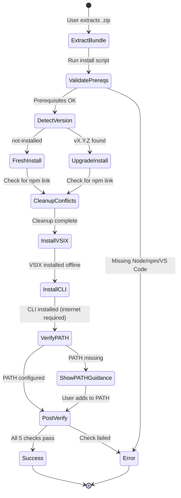
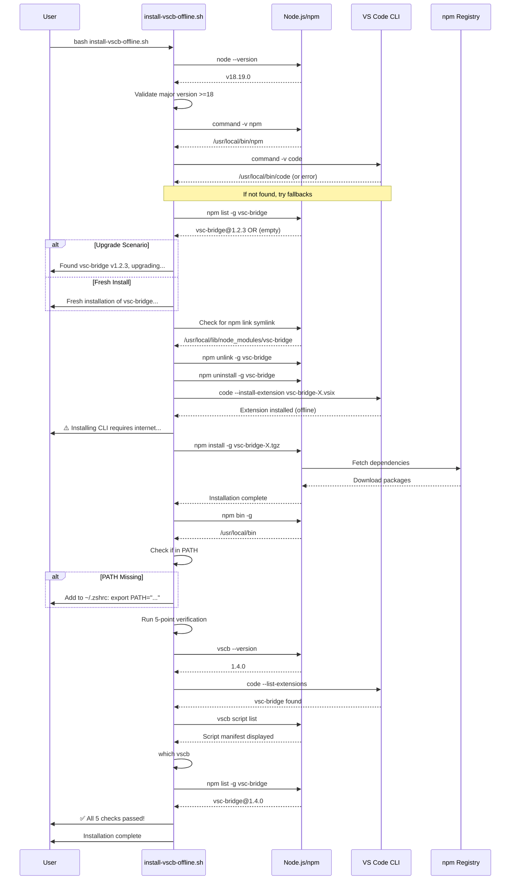

# Phase 2: Installation Scripts - Tasks & Alignment Brief

**Phase**: Phase 2: Installation Scripts
**Plan**: [offline-install-bundle-plan.md](/workspaces/wormhole/docs/plans/24-offline-install-bundle/offline-install-bundle-plan.md)
**Spec**: [offline-install-bundle-spec.md](/workspaces/wormhole/docs/plans/24-offline-install-bundle/offline-install-bundle-spec.md)
**Created**: 2025-10-25
**Status**: NOT STARTED

---

## Tasks

| Status | ID | Task | Type | Dependencies | Absolute Path(s) | Validation | Subtasks | Notes |
|--------|----|----|------|--------------|------------------|------------|----------|-------|
| [x] | T001 | Create Bash installation script template | Setup | – | `/workspaces/wormhole/scripts/offline-bundle/install-vscb-offline.sh` | File exists with shebang `#!/usr/bin/env bash`, `set -e`, print function stubs (print_info, print_success, print_error, print_warning), and argument parsing for flags: `--install-cli` (CLI only), `--install-vsix` (extension only), no flags (both, default) | – | Completed · [log#task-t001-t011](execution.log.md#task-t001-t011) [^6] |
| [x] | T001b | Implement argument parsing and component selection (Bash) | Core | T001 | `/workspaces/wormhole/scripts/offline-bundle/install-vscb-offline.sh` | Script parses command-line arguments: `--install-cli` sets INSTALL_CLI=true INSTALL_VSIX=false; `--install-vsix` sets INSTALL_CLI=false INSTALL_VSIX=true; no flags sets both=true; invalid flags display usage message and exit; variables control which installation steps execute | – | Completed · [log#task-t001-t011](execution.log.md#task-t001-t011) [^6] |
| [x] | T002 | Implement prerequisite validation - Node.js check (Bash) | Core | T001 | `/workspaces/wormhole/scripts/offline-bundle/install-vscb-offline.sh` | Script exits with code 1 and message "Error: Node.js >=18 required" when node version <18; prints "✅ Node.js X.Y.Z" otherwise | – | Completed · [log#task-t001-t011](execution.log.md#task-t001-t011) [^6] |
| [x] | T003 | Implement prerequisite validation - npm and VS Code checks (Bash) | Core | T001 | `/workspaces/wormhole/scripts/offline-bundle/install-vscb-offline.sh` | Script validates npm exists with `command -v npm`; validates VS Code CLI with detection chain (code → code-insiders → macOS full path); prints status for each | – | Completed · [log#task-t001-t011](execution.log.md#task-t001-t011) [^6] |
| [x] | T004 | Implement version detection function (Bash) | Core | T001 | `/workspaces/wormhole/scripts/offline-bundle/install-vscb-offline.sh` | Function `detect_current_version()` tries `npm list -g vsc-bridge --depth=0`, falls back to `vscb --version`, returns version string or "not-installed" | – | Completed · [log#task-t001-t011](execution.log.md#task-t001-t011) [^6] |
| [x] | T005 | Implement upgrade vs fresh install logic (Bash) | Core | T004 | `/workspaces/wormhole/scripts/offline-bundle/install-vscb-offline.sh` | Script calls `detect_current_version()`; extracts VSIX and CLI versions from bundle filenames; detects local builds (0.0.1-[a-f0-9]{8} pattern); prints "Installing LOCAL DEV BUILD" with both versions for local builds OR "Found vsc-bridge vX.Y.Z, upgrading to vA.B.C..." for production; prints "Fresh installation of vsc-bridge vA.B.C..." when not-installed | – | Completed · [log#task-t001-t011](execution.log.md#task-t001-t011) [^6] |
| [x] | T006 | Implement npm link symlink detection and cleanup (Bash) | Core | T001 | `/workspaces/wormhole/scripts/offline-bundle/install-vscb-offline.sh` | Script checks if `$(npm config get prefix)/lib/node_modules/vsc-bridge` is symlink; runs `npm unlink -g vsc-bridge 2>/dev/null \|\| true` if symlink detected; prints warning message explaining symlink removal; does NOT run `npm uninstall -g` (npm install handles replacement automatically) | – | Completed · [log#task-t001-t011](execution.log.md#task-t001-t011) [^6] |
| [x] | T007 | Implement npm tarball installation with retry logic (Bash) | Core | T006 | `/workspaces/wormhole/scripts/offline-bundle/install-vscb-offline.sh` | Script checks `if [ "$INSTALL_CLI" = true ]`; displays "Installing CLI from tarball..." then "⚠️  Note: This requires internet access to download npm dependencies" (per Critical Discovery 01); runs `npm install -g <tarball-path>` with 3 retry attempts on failure; timeout 60s per attempt; prints actionable error with diagnosis and component-specific recovery steps if all retries fail; skips if `--install-vsix` flag used | – | Completed · [log#task-t001-t011](execution.log.md#task-t001-t011) [^6] |
| [x] | T008 | Implement VS Code CLI detection function (Bash) | Core | T001 | `/workspaces/wormhole/scripts/offline-bundle/install-vscb-offline.sh` | Function `detect_vscode_cli()` checks: `command -v code` → `command -v code-insiders` → `/Applications/Visual Studio Code.app/Contents/Resources/app/bin/code` → error with macOS setup instructions; returns CODE_CMD variable | – | Completed · [log#task-t001-t011](execution.log.md#task-t001-t011) [^6] |
| [x] | T009 | Implement VSIX installation (Bash) | Core | T007, T008 | `/workspaces/wormhole/scripts/offline-bundle/install-vscb-offline.sh` | Script checks `if [ "$INSTALL_VSIX" = true ]`; calls `detect_vscode_cli()`, then runs `$CODE_CMD --install-extension <vsix-path>`; prints which VS Code variant used (code vs code-insiders); verifies success with `$CODE_CMD --list-extensions \| grep vsc-bridge`; on failure: prints error with recovery: "VSIX failed, CLI already installed. Retry: ./install.sh --install-vsix"; skips if `--install-cli` flag used | – | Completed · [log#task-t001-t011](execution.log.md#task-t001-t011) [^6] |
| [x] | T010 | Implement PATH verification and configuration guidance (Bash) | Core | T007 | `/workspaces/wormhole/scripts/offline-bundle/install-vscb-offline.sh` | Script checks `if [ "$INSTALL_CLI" = true ]`; runs `NPM_BIN=$(npm bin -g)`, checks if `echo $PATH \| grep -q "$NPM_BIN"`; if not found, detects shell with `$SHELL` variable and prints shell-specific instructions: "Add to ~/.zshrc: export PATH=\"$NPM_BIN:\$PATH\"" (for zsh) or "Add to ~/.bashrc: export PATH=\"$NPM_BIN:\$PATH\"" (for bash); skips if `--install-vsix` flag used | – | Completed · [log#task-t001-t011](execution.log.md#task-t001-t011) [^6] |
| [x] | T011 | Implement post-install verification checklist (Bash) | Core | T007, T009, T010 | `/workspaces/wormhole/scripts/offline-bundle/install-vscb-offline.sh` | Script runs component-specific verification: if INSTALL_CLI=true: checks (1) `vscb --version`, (4) `which vscb`, (5) `npm list -g vsc-bridge`; if INSTALL_VSIX=true: checks (2) `code --list-extensions \| grep vsc-bridge`; if both: checks (3) `vscb script list` (requires both); prints ✅ or ❌ for each relevant check with summary | – | Completed · [log#task-t001-t011](execution.log.md#task-t001-t011) [^6] |
| [x] | T011a | Quick smoke test - Bash script | Test | T011 | `/workspaces/wormhole/scripts/offline-bundle/install-vscb-offline.sh` | Extract Phase 1 bundle (2 files: VSIX + tarball only), run `bash install-vscb-offline.sh` on local machine (macOS or Linux); verify: script executes without crashing, prerequisite checks pass or fail gracefully, script completes or fails at expected point (e.g., no install scripts in bundle yet is acceptable); document any issues found | – | Completed · [log#task-t001-t011](execution.log.md#task-t001-t011) [^6] |
| [x] | T012 | Create PowerShell installation script template | Setup | – | `/workspaces/wormhole/scripts/offline-bundle/install-vscb-offline.ps1` | File exists with numbered steps, Write-Host colored output functions (Green=success, Red=error, Yellow=warning, Blue=info), comment header with execution policy bypass instructions, and parameter parsing: `-InstallCli` (CLI only), `-InstallVsix` (extension only), no params (both, default) | – | Completed · [log#task-t012-t022](execution.log.md#task-t012-t022) [^6] |
| [x] | T012b | Implement parameter parsing and component selection (PowerShell) | Core | T012 | `/workspaces/wormhole/scripts/offline-bundle/install-vscb-offline.ps1` | Script uses `param()` block with switch parameters: `[switch]$InstallCli`, `[switch]$InstallVsix`; logic sets `$INSTALL_CLI` and `$INSTALL_VSIX` booleans based on which switches provided; no switches = both true; invalid combinations display usage and exit; variables control which installation steps execute | – | Completed · [log#task-t012-t022](execution.log.md#task-t012-t022) [^6] |
| [x] | T013 | Implement prerequisite validation - Node.js check (PowerShell) | Core | T012 | `/workspaces/wormhole/scripts/offline-bundle/install-vscb-offline.ps1` | Script runs `Get-Command node -ErrorAction SilentlyContinue`, extracts version with `node --version`, validates major version >=18; exits with "Error: Node.js >=18 required (found: X.Y.Z)" if too old; prints green success message if valid | – | Completed · [log#task-t012-t022](execution.log.md#task-t012-t022) [^6] |
| [x] | T014 | Implement prerequisite validation - npm and VS Code checks (PowerShell) | Core | T012 | `/workspaces/wormhole/scripts/offline-bundle/install-vscb-offline.ps1` | Script validates npm with `Get-Command npm`; validates VS Code CLI by checking `Get-Command code.cmd` → `Get-Command code-insiders.cmd` → `Test-Path "C:\Program Files\Microsoft VS Code\bin\code.cmd"` → error; prints status for each | – | Completed · [log#task-t012-t022](execution.log.md#task-t012-t022) [^6] |
| [x] | T015 | Implement version detection function (PowerShell) | Core | T012 | `/workspaces/wormhole/scripts/offline-bundle/install-vscb-offline.ps1` | Function `Get-CurrentVersion` runs `npm list -g vsc-bridge --depth=0`, parses output for version; falls back to `vscb --version`; returns version string or "not-installed" | – | Completed · [log#task-t012-t022](execution.log.md#task-t012-t022) [^6] |
| [x] | T016 | Implement upgrade vs fresh install logic (PowerShell) | Core | T015 | `/workspaces/wormhole/scripts/offline-bundle/install-vscb-offline.ps1` | Script calls `Get-CurrentVersion`; extracts VSIX and CLI versions from bundle filenames; detects local builds (0.0.1-[a-f0-9]{8} pattern using regex match); prints "Installing LOCAL DEV BUILD" with both versions for local builds OR "Found vsc-bridge vX.Y.Z, upgrading to vA.B.C..." for production; prints "Fresh installation of vsc-bridge vA.B.C..." when not-installed | – | Completed · [log#task-t012-t022](execution.log.md#task-t012-t022) [^6] |
| [x] | T017 | Implement npm link symlink detection and cleanup (PowerShell) | Core | T012 | `/workspaces/wormhole/scripts/offline-bundle/install-vscb-offline.ps1` | Script checks for npm link symlink using `Test-Path` on `$(npm config get prefix)\node_modules\vsc-bridge` or `$env:APPDATA\npm\node_modules\vsc-bridge`; runs `npm unlink -g vsc-bridge 2>$null` if symlink detected; prints warning message explaining symlink removal; does NOT run `npm uninstall -g` (npm install handles replacement automatically) | – | Completed · [log#task-t012-t022](execution.log.md#task-t012-t022) [^6] |
| [x] | T018 | Implement npm tarball installation with retry logic (PowerShell) | Core | T017 | `/workspaces/wormhole/scripts/offline-bundle/install-vscb-offline.ps1` | Script checks `if ($INSTALL_CLI)`; displays "Installing CLI from tarball..." then "⚠️  Note: This requires internet access to download npm dependencies"; runs `npm install -g <tarball-path>` with 3 retry attempts using `Start-Sleep`; prints error with diagnosis and component-specific recovery steps if all fail; skips if `-InstallVsix` flag used | – | Completed · [log#task-t012-t022](execution.log.md#task-t012-t022) [^6] |
| [x] | T019 | Implement VS Code CLI detection function (PowerShell) | Core | T012 | `/workspaces/wormhole/scripts/offline-bundle/install-vscb-offline.ps1` | Function `Get-VSCodeCLI` checks `Get-Command code.cmd` → `Get-Command code-insiders.cmd` → `Test-Path "C:\Program Files\Microsoft VS Code\bin\code.cmd"` → `Test-Path "C:\Program Files (x86)\Microsoft VS Code\bin\code.cmd"` → error; returns $CODE_CMD variable | – | Completed · [log#task-t012-t022](execution.log.md#task-t012-t022) [^6] |
| [x] | T020 | Implement VSIX installation (PowerShell) | Core | T018, T019 | `/workspaces/wormhole/scripts/offline-bundle/install-vscb-offline.ps1` | Script checks `if ($INSTALL_VSIX)`; calls `Get-VSCodeCLI`, runs `& $CODE_CMD --install-extension <vsix-path>`; prints which variant used; verifies with `& $CODE_CMD --list-extensions \| Select-String vsc-bridge`; on failure: prints error with recovery: "VSIX failed, CLI already installed. Retry: .\install.ps1 -InstallVsix"; skips if `-InstallCli` flag used | – | Completed · [log#task-t012-t022](execution.log.md#task-t012-t022) [^6] |
| [x] | T021 | Implement PATH verification and configuration guidance (PowerShell) | Core | T018 | `/workspaces/wormhole/scripts/offline-bundle/install-vscb-offline.ps1` | Script checks `if ($INSTALL_CLI)`; runs `$NPM_BIN = npm bin -g`, checks if `$env:PATH -like "*$NPM_BIN*"`; if not found, prints instructions to update PATH environment variable via System Properties (Control Panel → System → Advanced → Environment Variables) with exact steps; skips if `-InstallVsix` flag used | – | Completed · [log#task-t012-t022](execution.log.md#task-t012-t022) [^6] |
| [x] | T022 | Implement post-install verification checklist (PowerShell) | Core | T018, T020, T021 | `/workspaces/wormhole/scripts/offline-bundle/install-vscb-offline.ps1` | Script runs component-specific verification: if $INSTALL_CLI: checks (1) `vscb --version`, (4) `Get-Command vscb`, (5) `npm list -g vsc-bridge`; if $INSTALL_VSIX: checks (2) `code --list-extensions \| Select-String vsc-bridge`; if both: checks (3) `vscb script list` (requires both); prints ✅/❌ for each relevant check with Write-Host -ForegroundColor Green/Red | – | Completed · [log#task-t012-t022](execution.log.md#task-t012-t022) [^6] |
| [x] | T022a | Quick smoke test - PowerShell script | Test | T022 | `/workspaces/wormhole/scripts/offline-bundle/install-vscb-offline.ps1` | If Windows available: extract Phase 1 bundle, run `powershell -ExecutionPolicy Bypass -File install-vscb-offline.ps1`, verify same basic checks as T011a (script runs without crashing, prerequisite checks work); if no Windows: document as "skipped - will test in T028"; document any issues found | – | Completed · [log#task-t012-t022](execution.log.md#task-t012-t022) [^6] |
| [x] | T023 | Update bundle creation recipe to include installation scripts | Integration | T001, T012 | `/workspaces/wormhole/justfile` | Recipe `package-offline-bundle` modified: after npm pack creation (around line 820), adds commands to copy `/workspaces/wormhole/scripts/offline-bundle/install-vscb-offline.sh` and `/workspaces/wormhole/scripts/offline-bundle/install-vscb-offline.ps1` to `$TEMP_DIR/`; temp directory now contains 4 files (VSIX, tarball, 2 scripts); bundle .zip created with all 4 files | – | Completed · [log#task-t023](execution.log.md#task-t023) [^6] |
| [x] | T024 | Rebuild bundle with installation scripts | Integration | T023 | `/workspaces/wormhole/justfile` | Run `just package-offline-bundle` to create new bundle with all 4 files (VSIX, tarball, install-vscb-offline.sh, install-vscb-offline.ps1); verify bundle contains all files with `unzip -l`; extract bundle to temp directory for manual testing | – | Completed · [log#task-t024](execution.log.md#task-t024) [^6] |
| [ ] | T025 | Manual verification - Bash script on macOS | Test | T024 | `/workspaces/wormhole/scripts/offline-bundle/install-vscb-offline.sh` | Extract bundle on macOS system, run `bash install-vscb-offline.sh`, verify: prerequisite checks run, version detection works, VSIX and CLI install successfully, PATH guidance displays if needed, all 5 post-install checks pass, script exits with code 0 | – | DEFERRED to Phase 5 (Manual Verification) |
| [ ] | T026 | Manual verification - Bash script on Linux | Test | T024 | `/workspaces/wormhole/scripts/offline-bundle/install-vscb-offline.sh` | Extract bundle on Ubuntu 22.04 system, run `bash install-vscb-offline.sh`, verify same criteria as T025 | – | DEFERRED to Phase 5 (Manual Verification) |
| [ ] | T027 | Manual verification - PowerShell script on Windows | Test | T024 | `/workspaces/wormhole/scripts/offline-bundle/install-vscb-offline.ps1` | Extract bundle on Windows 10/11 system, run `powershell -ExecutionPolicy Bypass -File install-vscb-offline.ps1`, verify: prerequisite checks run, version detection works, VSIX and CLI install successfully, PATH guidance displays, all 5 post-install checks pass, script exits with code 0 | – | DEFERRED to Phase 5 (Manual Verification) |
| [ ] | T028 | Manual verification - Error scenarios | Test | T025, T026, T027 | `/workspaces/wormhole/scripts/offline-bundle/install-vscb-offline.sh`, `/workspaces/wormhole/scripts/offline-bundle/install-vscb-offline.ps1` | Test 4 error scenarios on each platform: (1) Missing Node.js (clear error msg), (2) Node.js <18 (version error), (3) VS Code CLI missing (setup instructions), (4) No internet during npm install (retry logic + diagnosis); verify all display actionable guidance | – | DEFERRED to Phase 5 (Manual Verification) |
| [ ] | T029 | Manual verification - Cross-platform consistency | Test | T025, T026, T027 | All scripts and bundle | Compare output from Bash and PowerShell scripts for: (1) upgrade message format identical, (2) error messages for same scenario identical, (3) post-install verification output format consistent; verify bundle extracts cleanly on all platforms (Windows, macOS, Linux) | – | DEFERRED to Phase 5 (Manual Verification) |

---

## Alignment Brief

### Previous Phase Review

#### A. Completed Deliverables (from Phase 1)

**Core Build Infrastructure**:

1. **Justfile Recipe: `package-offline-bundle`**
   - Location: [`/workspaces/wormhole/justfile:761-840`](/workspaces/wormhole/justfile#L761-L840)
   - Function: Complete recipe that creates offline installation bundle
   - Dependencies: `build package-extension`
   - Key Features: Version detection (CI vs local), version validation, VSIX verification, npm tarball creation with content validation, .zip archive creation, automatic cleanup

2. **Semantic Release Integration**
   - File: [`/workspaces/wormhole/scripts/semrel-prepare.mjs:54-56`](/workspaces/wormhole/scripts/semrel-prepare.mjs#L54-L56)
   - Integration: Calls `run('just', ['package-offline-bundle'])` after extension packaging
   - Purpose: Automatically creates offline bundles during CI releases

3. **GitHub Release Asset Configuration**
   - File: [`/workspaces/wormhole/.releaserc.json:164-167`](/workspaces/wormhole/.releaserc.json#L164-L167)
   - Configuration: Uploads `artifacts/*.zip` to GitHub releases with label "Offline Installation Bundle"

4. **Offline Bundle Archive**
   - Location: `/workspaces/wormhole/artifacts/vsc-bridge-offline-<version>.zip`
   - Example: `vsc-bridge-offline-0.0.1-6c1d0570.zip` (736 KB)
   - Current Contents: 2 files (VSIX 652 KB + npm tarball 110 KB)

#### B. Lessons Learned (from Phase 1)

1. **Version Detection Strategy Shift**
   - Planned: Read version from package.json for all components
   - Actual: Local builds detect version from existing VSIX filename created by `package-extension` dependency
   - Why: The `package-extension` recipe already creates VSIX with random hash version. Reading from package.json would create mismatch.
   - Solution: Extract version from VSIX filename pattern to ensure synchronization

2. **npm Tarball Filename Detection**
   - Discovery: `npm pack` uses real package.json version (1.0.0), not temporary random hash version (0.0.1-6c1d0570)
   - Solution: Find tarball with glob pattern instead of constructing filename
   - Learning: npm pack ignores temporary version changes and reads directly from package.json

3. **Build Recipe Dependencies**
   - Learning: Reusing existing recipes prevents duplication and version mismatches
   - Pattern: `package-offline-bundle` → `package-extension` → `build`

4. **Error Safety Pattern**
   - Approach: Temp directory preserved on failure for debugging
   - Implementation: Only cleanup succeeds if zip creation succeeds
   - Benefit: Developers can inspect failed builds without re-running

#### C. Technical Discoveries (from Phase 1)

1. **npm pack Version Behavior**
   - Discovery: `npm pack` ALWAYS uses package.json version, ignoring temporary version changes
   - Impact: Cannot create tarball with random hash version matching VSIX
   - Workaround: Use glob pattern to find tarball: `ls "$TEMP_DIR"/vsc-bridge-*.tgz | head -1`

2. **bash Shebang and Error Handling**
   - Standard Pattern: `#!/usr/bin/env bash` with `set -euo pipefail`
   - Purpose: Exit on error, exit on undefined variables, exit if pipeline fails
   - Note: Phase 1 used `set -e` in justfile; installation scripts should use same

3. **Cross-Platform Temp Directory Creation**
   - Command: `mktemp -d`
   - Compatibility: Works on macOS, Linux, Git Bash on Windows
   - Cleanup: Must use explicit cleanup to avoid temp directory leaks

4. **CI Environment Variable Detection**
   - Pattern: `${CI:-}` used to differentiate CI from local builds
   - Behavior: Empty string in local builds, non-empty in CI
   - Application: Controls version generation and cleanup behavior

#### D. Dependencies for Phase 2

**Bundle Structure** (defined and stable):
```
vsc-bridge-offline-<version>.zip
├── vsc-bridge-<version>.vsix        # VS Code extension (completely offline)
└── vsc-bridge-<version>.tgz          # npm CLI package (requires internet for dependencies)
```

**Phase 2 Can Assume**:
- Bundle always contains exactly 2 files (before Phase 2 updates)
- VSIX filename pattern: `vsc-bridge-<version>.vsix`
- Tarball filename pattern: `vsc-bridge-<version>.tgz`
- Version in filenames may differ (local builds: VSIX uses random hash, tarball uses actual semver)

**Version Handling Functions to Reuse**:

From [`/workspaces/wormhole/justfile:772-796`](/workspaces/wormhole/justfile#L772-L796):
```bash
# CI Version Detection
if [[ -n "${CI:-}" ]]; then
    VERSION=$(node -p "require('./package.json').version")
    EXT_VERSION=$(node -p "require('./packages/extension/package.json').version")
    # Validates versions match before proceeding
fi

# Local Version Detection
else
    # Detects version from existing VSIX filename
    VSIX_PATTERN="artifacts/vsc-bridge-0.0.1-*.vsix"
    VSIX_FILES=($VSIX_PATTERN)
    VSIX_NAME=$(basename "${VSIX_FILES[0]}")
    VERSION="${VSIX_NAME#vsc-bridge-}"
    VERSION="${VERSION%.vsix}"
fi
```

**Error Handling Pattern** (from existing `/workspaces/wormhole/scripts/install-vscb.sh`):
```bash
set -e  # Exit on error (NOT set -euo pipefail)

# Color definitions
RED='\033[0;31m'
GREEN='\033[0;32m'
YELLOW='\033[1;33m'
BLUE='\033[0;34m'
NC='\033[0m'

# Helper functions
print_success() { echo -e "${GREEN}✅ $1${NC}"; }
print_error() { echo -e "${RED}❌ $1${NC}"; }
print_warning() { echo -e "${YELLOW}⚠️  $1${NC}"; }
print_info() { echo -e "${BLUE}ℹ️  $1${NC}"; }
```

**APIs and Commands Phase 2 Will Call**:

VSIX Installation:
```bash
# Detection chain (Task T007)
CODE_CMD=""
if command -v code &>/dev/null; then
    CODE_CMD="code"
elif command -v code-insiders &>/dev/null; then
    CODE_CMD="code-insiders"
elif [ -f "/Applications/Visual Studio Code.app/Contents/Resources/app/bin/code" ]; then
    CODE_CMD="/Applications/Visual Studio Code.app/Contents/Resources/app/bin/code"
fi

# Installation (Task T008)
$CODE_CMD --install-extension ./vsc-bridge-<version>.vsix
```

npm Tarball Installation:
```bash
# Internet required (Critical Discovery 01, Task T009)
echo "Installing CLI from tarball..."
echo "⚠️  Note: This requires internet access to download npm dependencies"
npm install -g ./vsc-bridge-<version>.tgz
```

Version Detection (Task T004-T005):
```bash
detect_current_version() {
    # Try npm list first (most reliable)
    version=$(npm list -g vsc-bridge --depth=0 2>/dev/null | grep vsc-bridge | sed 's/.*@//' | awk '{print $1}')
    if [ -n "$version" ]; then echo "$version"; return 0; fi

    # Fallback to vscb --version
    if command -v vscb &>/dev/null; then
        version=$(vscb --version 2>/dev/null | head -1)
        echo "$version"; return 0
    fi

    echo "not-installed"; return 1
}

# Extract versions from bundle (Task T005)
VSIX_FILE=$(ls vsc-bridge-*.vsix 2>/dev/null | head -1)
VSIX_VERSION="${VSIX_FILE#vsc-bridge-}"
VSIX_VERSION="${VSIX_VERSION%.vsix}"

TARBALL_FILE=$(ls vsc-bridge-*.tgz 2>/dev/null | head -1)
CLI_VERSION="${TARBALL_FILE#vsc-bridge-}"
CLI_VERSION="${CLI_VERSION%.tgz}"

# Detect current installation
CURRENT_VERSION=$(detect_current_version)

# Display appropriate message based on build type and current state
if [ "$CURRENT_VERSION" = "not-installed" ]; then
    # Fresh install
    if [[ "$VSIX_VERSION" =~ ^0\.0\.1-[a-f0-9]{8}$ ]]; then
        print_info "Fresh installation from LOCAL DEV BUILD"
        print_info "  Extension: v$VSIX_VERSION"
        print_info "  CLI: v$CLI_VERSION"
    else
        print_info "Fresh installation of vsc-bridge v$CLI_VERSION"
    fi
else
    # Upgrade
    if [[ "$VSIX_VERSION" =~ ^0\.0\.1-[a-f0-9]{8}$ ]]; then
        print_info "Installing LOCAL DEV BUILD from bundle..."
        print_info "  Current: v$CURRENT_VERSION"
        print_info "  Extension: v$VSIX_VERSION"
        print_info "  CLI: v$CLI_VERSION"
    else
        print_info "Found vsc-bridge v$CURRENT_VERSION, upgrading to v$CLI_VERSION..."
    fi
fi
```

npm link Symlink Cleanup (Task T006):
```bash
# Check for npm link symlink (only case that needs manual cleanup)
npm_prefix=$(npm config get prefix)
if [ -L "$npm_prefix/lib/node_modules/vsc-bridge" ]; then
    print_warning "Found npm link symlink (development installation)"
    print_info "Removing symlink to install from bundle..."
    npm unlink -g vsc-bridge 2>/dev/null || true
fi

# No npm uninstall needed - npm install -g handles replacement automatically
```

PATH Verification (Task T010):
```bash
NPM_BIN=$(npm bin -g)
if ! echo $PATH | grep -q "$NPM_BIN"; then
    echo "⚠️  npm bin directory not in PATH: $NPM_BIN"

    # Detect shell and provide appropriate instructions
    case "$SHELL" in
        */zsh)
            echo "Add this line to ~/.zshrc:"
            echo "  export PATH=\"$NPM_BIN:\$PATH\""
            ;;
        */bash)
            echo "Add this line to ~/.bashrc or ~/.bash_profile:"
            echo "  export PATH=\"$NPM_BIN:\$PATH\""
            ;;
        *)
            echo "Add $NPM_BIN to your PATH"
            ;;
    esac
fi
```

#### E. Critical Findings Applied (from Phase 1)

Phase 1 successfully addressed **4 out of 10** critical/high discoveries:

1. ✅ **Discovery 02: VSIX Packaging Requires --no-dependencies Flag** (CRITICAL)
   - File: [`/workspaces/wormhole/justfile:185-190`](/workspaces/wormhole/justfile#L185-L190)
   - Implementation: Reused existing `package-extension` recipe with `--no-dependencies` flag
   - Result: VSIX files ~650 KB (not 50+ MB bloat)

2. ✅ **Discovery 03: Version Synchronization Across Three Sources** (CRITICAL)
   - File: [`/workspaces/wormhole/justfile:772-796`](/workspaces/wormhole/justfile#L772-L796)
   - Implementation: Dual-mode version handling (CI validates match, local detects from VSIX)
   - Result: Prevents version mismatches between components

3. ✅ **Discovery 06: Semantic Release Integration Pattern** (HIGH)
   - Files: [`/workspaces/wormhole/scripts/semrel-prepare.mjs:54-56`](/workspaces/wormhole/scripts/semrel-prepare.mjs#L54-L56), [`/workspaces/wormhole/.releaserc.json:164-167`](/workspaces/wormhole/.releaserc.json#L164-L167)
   - Implementation: Added offline bundle creation to CI release pipeline
   - Result: Bundles automatically created and uploaded to GitHub releases

4. ✅ **Discovery 08: Archive Format .zip Better Than .tar.gz** (MEDIUM)
   - File: [`/workspaces/wormhole/justfile:835-838`](/workspaces/wormhole/justfile#L835-L838)
   - Implementation: Uses `zip -q -r` command for cross-platform compatibility
   - Result: Bundle extracts natively on Windows, macOS, Linux

#### F. Blocked/Incomplete Items (Critical Discoveries NOT Yet Addressed)

**6 Critical/High Discoveries** require Phase 2 implementation:

1. ❌ **Discovery 01: npm pack Dependency Resolution Requires Internet** (CRITICAL)
   - Impact: Users need clear messaging that CLI installation requires internet
   - Task: T009 - Must display "Installing CLI... (requires internet for npm dependencies)"
   - Risk: Users in air-gapped environments will fail installation without understanding why

2. ❌ **Discovery 04: npm Global Bin Path Varies** (HIGH)
   - Impact: Users may install successfully but `vscb` command won't work
   - Task: T010 - PATH verification and shell-specific configuration guidance
   - Risk: Installation appears successful but CLI is unusable

3. ❌ **Discovery 05: VS Code CLI Detection** (HIGH)
   - Impact: VSIX installation may fail on macOS without manual CLI setup
   - Task: T007 - Detection chain with fallback to full macOS path
   - Risk: Installation fails with unclear error on macOS

4. ❌ **Discovery 07: Idempotent Installation - Conflict Detection** (HIGH)
   - Impact: Upgrade scenarios may create conflicting installations
   - Task: T006 - Detect and clean npm link symlinks before install
   - Risk: Users have multiple broken installations

5. ❌ **Discovery 09: PowerShell Execution Policy** (MEDIUM)
   - Impact: Windows users blocked from running installer
   - Tasks: T012+ - PowerShell script header with bypass instructions
   - Risk: Installation fails on Windows with default security policy

6. ❌ **Discovery 10: Version Detection Fallback Chain** (MEDIUM)
   - Impact: Upgrade detection may fail to find existing installation
   - Task: T004 - Implement fallback chain (npm list → vscb --version)
   - Risk: Fresh install over existing installation, breaking user setup

**Bundle Structure Incomplete**:

Current State (2 files):
```
vsc-bridge-offline-0.0.1-6c1d0570/
├── vsc-bridge-0.0.1-6c1d0570.vsix  (667 KB)
└── vsc-bridge-1.0.0.tgz             (110 KB)
```

Expected State (5 files after Phases 2-3):
```
vsc-bridge-offline-1.2.3/
├── vsc-bridge-1.2.3.vsix
├── vsc-bridge-1.2.3.tgz
├── install-vscb-offline.sh          ← Phase 2 Task T001-T011
├── install-vscb-offline.ps1         ← Phase 2 Task T012-T022
└── README.txt                       ← Phase 3 (not this phase)
```

Implication: Current bundle is **not usable** for offline installation - users have no instructions or installation scripts.

#### G. Test Infrastructure (available from Phase 1)

**Manual Verification Pattern**:
```bash
# Test commands used in Phase 1
just package-offline-bundle
ls -lh artifacts/vsc-bridge-offline-*.zip
unzip -l artifacts/vsc-bridge-offline-*.zip
du -h artifacts/vsc-bridge-offline-*.zip
```

**Prerequisite Validation Pattern** (from install-vscb.sh):
```bash
# Check Node.js version
NODE_VERSION=$(node --version | sed 's/v//')
NODE_MAJOR=$(echo "$NODE_VERSION" | cut -d. -f1)
if [ "$NODE_MAJOR" -lt 18 ]; then
    print_error "Node.js version must be >=18.0.0 (found: $NODE_VERSION)"
    exit 1
fi
```

**Post-Install Verification Checklist** (5-point verification required by Tasks T011, T022):
1. `vscb --version` - Confirms CLI installed and in PATH
2. `code --list-extensions | grep vsc-bridge` - Confirms extension installed
3. `vscb script list` - Confirms CLI can access manifest
4. `which vscb` (or `Get-Command vscb`) - Confirms PATH configuration
5. `npm list -g vsc-bridge` - Confirms npm installation

**Platform Testing Strategy**:
- Clean VM/container environments
- Test platforms: Windows 10/11, macOS (Intel/Apple Silicon if available), Ubuntu 22.04
- Test scenarios: Fresh install, Upgrade install
- Error scenarios: Missing prerequisites, PATH issues, permission errors

#### H. Technical Debt & Workarounds (from Phase 1)

1. **Version Mismatch in Local Builds**
   - Issue: Local bundles contain mismatched versions (VSIX: 0.0.1-hash, tarball: 1.0.0)
   - Impact on Phase 2: Installation scripts must handle version display gracefully when versions differ
   - Solution: Display version from component being installed, not from bundle filename

2. **npm Tarball Filename Detection**
   - Issue: Uses glob pattern `ls vsc-bridge-*.tgz | head -1` instead of explicit filename
   - Technical Debt Level: Medium (fragile but works)
   - Impact on Phase 2: Installation scripts should use similar pattern when finding components

3. **Temp Directory Management Pattern**
   - Pattern: Create with `mktemp -d`, use, cleanup on success, preserve on failure
   - Rationale: Allows debugging of failed builds
   - Phase 2 Should Follow: Installation scripts should preserve extracted files on failure

#### I. Scope Changes (from Phase 1)

**Features Added During Phase 1**:
1. Automated Tarball Verification (Task T010b) - Extract and check for `dist/index.js`
2. Semantic-Release Integration (Tasks T015-T016) - Automatic bundle creation in CI

**Features Removed During Phase 1**:
1. Size Validation Checks (Tasks T009, T010, T011 size checks removed per user preference)
2. Manual Test Documentation (Tasks T017-T019 skipped in favor of quick sanity checks)

**No Scope Changes for Phase 2** - all tasks remain as planned.

#### J. Key Execution Log References

1. **[Version Mismatch Resolution](/workspaces/wormhole/docs/plans/24-offline-install-bundle/tasks/phase-1-core-bundle-infrastructure/execution.log.md#L71-L73)**
   - Decision: Local builds detect version from existing VSIX filename instead of generating new random version
   - Impact: Prevents version mismatch between VSIX and tarball in bundle

2. **[Tarball Content Validation](/workspaces/wormhole/docs/plans/24-offline-install-bundle/tasks/phase-1-core-bundle-infrastructure/execution.log.md#L62)**
   - Addition: Task T010b added to verify `dist/index.js` exists in tarball
   - Rationale: Ensures webpack bundling succeeded before packaging

3. **[Manual Verification Success](/workspaces/wormhole/docs/plans/24-offline-install-bundle/tasks/phase-1-core-bundle-infrastructure/execution.log.md#L133-L175)**
   - Bundle Size: 736 KB (well below 10 MB target)
   - Contents Verified: 2 files (VSIX 667 KB, tarball 110 KB)
   - All 10 Checklist Items: ✅ PASSED

---

### Objective

Create cross-platform installation scripts (Bash for macOS/Linux, PowerShell for Windows) that:
1. Validate prerequisites (Node.js >=18, npm, VS Code CLI)
2. Detect existing installations and support upgrade scenarios
3. Install VSIX (completely offline) and npm CLI tarball (requires internet for dependencies)
4. Verify PATH configuration and provide shell-specific guidance
5. Perform post-install verification (5-point checklist)
6. Include scripts in offline bundle

**Success Criteria** (from plan § Phase 2 Acceptance Criteria):
- ✅ Both scripts implement prerequisite validation
- ✅ Both scripts implement version detection and upgrade logic
- ✅ Both scripts implement conflict detection and cleanup
- ✅ Both scripts implement VSIX installation with VS Code CLI detection
- ✅ Both scripts implement npm tarball installation with internet requirement notice
- ✅ Both scripts implement PATH verification and configuration guidance
- ✅ Both scripts implement post-install verification (5-point checklist)
- ✅ Scripts are added to offline bundle
- ✅ All manual verification checks pass on all 3 platforms

---

### Non-Goals (Scope Boundaries)

❌ **NOT doing in Phase 2**:

1. **Bundle documentation (README.txt)** - Deferred to Phase 3
   - Reason: Focus on functional installation scripts first
   - Note: Scripts should be self-documenting with clear output messages

2. **Repository README.md updates** - Deferred to Phase 4
   - Reason: Document feature after implementation complete
   - Note: Users won't know offline bundle exists until Phase 4

3. **Comprehensive platform testing** - Deferred to Phase 5
   - Reason: Phase 2 focuses on implementation with quick sanity checks
   - Note: Manual verification tasks (T024-T028) are basic smoke tests, not comprehensive

4. **True offline CLI installation** - Explicitly excluded per spec
   - Reason: Bundle size trade-off (5-10 MB vs 20-50 MB with node_modules)
   - Note: CLI installation requires internet for npm dependencies (Critical Discovery 01)

5. **GUI installers** - Not in scope
   - Reason: Command-line scripts sufficient for developer audience
   - Note: Windows users can run PowerShell script, not .exe installer

6. **Automated uninstall scripts** - Not in scope
   - Reason: Users can use standard npm/VS Code commands
   - Note: `npm uninstall -g vsc-bridge` and `code --uninstall-extension` work

7. **Proxy configuration detection** - Out of scope
   - Reason: Complexity vs benefit (users likely have npm configured already)
   - Note: Error messages suggest checking proxy settings if npm install fails

8. **Version upgrade restrictions** - Not implemented
   - Reason: Trust npm/VS Code to handle version upgrades correctly
   - Note: No validation like "cannot downgrade from 2.0 to 1.9"

---

### Critical Findings Affecting This Phase

Phase 2 directly addresses **6 out of 10** critical/high discoveries:

1. **Discovery 01: npm pack Dependency Resolution Requires Internet** (CRITICAL)
   - **Constraint**: CLI installation with `npm install -g <tarball>` requires internet to download dependencies from npm registry
   - **Requirement**: Installation scripts MUST display prominent warning: "⚠️  Note: This requires internet access to download npm dependencies"
   - **Tasks Addressing**: T009 (Bash), T020 (PowerShell) - Implement retry logic and clear error messages
   - **Implementation**: 3 retry attempts with 60s timeout, actionable diagnosis steps if all fail

2. **Discovery 04: npm Global Bin Path Varies Significantly** (HIGH)
   - **Constraint**: npm global bin directory location differs between platforms and installation methods
   - **Requirement**: Scripts must detect npm bin directory, check if in PATH, provide shell-specific configuration guidance
   - **Tasks Addressing**: T010 (Bash), T021 (PowerShell) - PATH verification and configuration instructions
   - **Implementation**: Detect shell (zsh/bash), provide copy-paste ready export commands for Unix; provide GUI navigation path for Windows

3. **Discovery 05: VS Code CLI Detection Requires Multiple Strategies** (HIGH)
   - **Constraint**: `code` command may not be in PATH, especially on macOS where manual setup required
   - **Requirement**: Implement detection chain: `code` → `code-insiders` → full macOS path → error with setup instructions
   - **Tasks Addressing**: T007 (Bash), T018 (PowerShell) - VS Code CLI detection functions
   - **Implementation**: Prefer stable `code` over `code-insiders`; check both Program Files locations on Windows

4. **Discovery 07: Idempotent Installation - Conflict Detection Required** (HIGH)
   - **Constraint**: Users may have npm link symlinks from development workflows that conflict with tarball installation
   - **Requirement**: Detect and remove npm link symlinks before installation; trust npm install to handle normal upgrades
   - **Tasks Addressing**: T006 (Bash), T017 (PowerShell) - npm link symlink detection and cleanup
   - **Implementation**: Check for symlink, run `npm unlink -g vsc-bridge` if found; skip `npm uninstall -g` (npm install -g handles replacement automatically)

5. **Discovery 09: PowerShell Execution Policy Blocks Scripts** (MEDIUM)
   - **Constraint**: Windows default execution policy prevents running unsigned .ps1 scripts
   - **Requirement**: PowerShell script header must include bypass instructions as comments
   - **Tasks Addressing**: T012 - PowerShell template with execution policy guidance in header
   - **Implementation**: Header comment shows `powershell -ExecutionPolicy Bypass -File install-vscb-offline.ps1`

6. **Discovery 10: Version Detection Fallback Chain** (MEDIUM)
   - **Constraint**: Detecting installed vscb version requires checking multiple sources
   - **Requirement**: Implement priority fallback chain: npm list → vscb --version → not-installed
   - **Tasks Addressing**: T004 (Bash), T015 (PowerShell) - Version detection functions
   - **Implementation**: Use for upgrade detection, display "Found v1.2.3, upgrading to v1.4.0..." message

---

### Invariants & Guardrails

**Error Handling**:
- Scripts MUST use `set -e` (Bash) or `$ErrorActionPreference = 'Stop'` (PowerShell)
- All errors MUST include actionable guidance, not just "failed"
- Exit codes: 0 = success, 1 = error, consistent across platforms

**User Experience**:
- Numbered step output: "Step 1: Checking prerequisites..."
- Progressive success messages: "✅ Node.js 18.19.0 detected"
- Colored output: Green (success), Red (error), Yellow (warning), Blue (info)
- Consistent messaging between Bash and PowerShell versions

**Security**:
- No `sudo` prompts in scripts (user must run with sudo if needed)
- No arbitrary code execution (only predefined commands)
- No credential collection or transmission

**Platform Compatibility**:
- Bash script must work on: macOS (Intel + Apple Silicon), Linux (Ubuntu LTS)
- PowerShell script must work on: Windows 10, Windows 11
- No platform-specific features beyond documented differences (e.g., PATH config)

---

### Inputs to Read

**Existing Installation Script** (reference pattern):
- `/workspaces/wormhole/scripts/install-vscb.sh` (lines 1-100) - Color definitions, print functions, prerequisite checks

**Bundle Structure** (from Phase 1):
- `/workspaces/wormhole/artifacts/vsc-bridge-offline-<version>.zip` - Current bundle with 2 files (VSIX, tarball)

**Justfile Recipe** (to modify):
- `/workspaces/wormhole/justfile` (lines 761-840) - `package-offline-bundle` recipe to update with script inclusion

**Plan Documents**:
- `/workspaces/wormhole/docs/plans/24-offline-install-bundle/offline-install-bundle-plan.md` § 3 (Critical Research Findings)
- `/workspaces/wormhole/docs/plans/24-offline-install-bundle/offline-install-bundle-spec.md` § 2 (Functional Requirements)

---

### Visual Alignment Aids

#### System State Flow Diagram



**Key State Transitions**:
- **ExtractBundle → ValidatePrereqs**: User runs `bash install-vscb-offline.sh` or `powershell -ExecutionPolicy Bypass -File install-vscb-offline.ps1`
- **ValidatePrereqs → DetectVersion**: Node.js >=18, npm, VS Code CLI all present
- **DetectVersion → FreshInstall vs UpgradeInstall**: Based on `npm list -g vsc-bridge` or `vscb --version` output
- **CleanupConflicts**: Handles npm link symlinks and existing global installations
- **InstallVSIX**: Completely offline (no internet required)
- **InstallCLI**: Requires internet for npm dependency download (Critical Discovery 01)
- **VerifyPATH**: Checks if npm bin directory in PATH, provides guidance if not
- **PostVerify**: 5-point verification checklist

---

#### Installation Script Interaction Sequence



**Key Interactions**:
1. **Prerequisite Validation**: Check Node.js >=18, npm, VS Code CLI (with fallback detection)
2. **Version Detection**: Upgrade vs fresh install logic
3. **Conflict Cleanup**: Remove npm link symlinks and existing installations
4. **VSIX Installation**: Offline, no registry access
5. **CLI Installation**: Requires internet (npm registry access for dependencies)
6. **PATH Verification**: Shell-specific guidance if npm bin not in PATH
7. **Post-Install Verification**: 5-point checklist with clear pass/fail indicators

---

### Test Plan

**Testing Approach**: Manual Only (per spec § Testing Philosophy)

**Focus Areas**:
1. Installation scripts execute successfully on target platforms
2. Prerequisite validation catches missing/old dependencies
3. Upgrade detection works correctly (displays version change)
4. VS Code CLI detection handles multiple scenarios (code, code-insiders, full path)
5. PATH configuration guidance is clear and platform-specific
6. Error messages are actionable (guide users to solutions)

**Quick Smoke Tests** (Tasks T011a, T022a):
- Run scripts on local machine immediately after implementation
- Use Phase 1 bundle (2 files only - scripts not in bundle yet)
- Expected to fail at "bundle incomplete" but validates script logic works
- Document any crashes or logic errors for immediate fix
- NOT comprehensive testing - just quick sanity checks

**Manual Verification Tests** (Tasks T025-T029):

**T025: Bash script on macOS**
- Extract bundle on macOS system
- Run `bash install-vscb-offline.sh`
- Verify: prerequisite checks, version detection, VSIX install, CLI install, PATH guidance, 5-point verification
- Test both fresh install and upgrade scenarios

**T026: Bash script on Linux**
- Extract bundle on Ubuntu 22.04
- Run `bash install-vscb-offline.sh`
- Verify same criteria as T024
- Confirm npm bin PATH differs from macOS (e.g., nvm vs Homebrew)

**T027: PowerShell script on Windows**
- Extract bundle on Windows 10/11
- Test with default Restricted execution policy (should fail with clear error)
- Run with Bypass: `powershell -ExecutionPolicy Bypass -File install-vscb-offline.ps1`
- Verify: prerequisite checks, version detection, VSIX install, CLI install, PATH guidance, 5-point verification
- Test both fresh install and upgrade scenarios

**T028: Error scenarios**
- Missing Node.js (clear error with download link)
- Node.js <18 (version error with upgrade instructions)
- VS Code CLI missing (platform-specific setup instructions)
- No internet during npm install (retry logic + diagnosis steps)
- Simulate errors by renaming binaries or disconnecting network

**T029: Cross-platform consistency**
- Compare Bash and PowerShell output for identical messaging
- Verify upgrade message format identical
- Verify error messages for same scenario identical
- Verify post-install verification output format consistent

**Expected Test Results**:
- All 3 platforms (Windows, macOS, Linux) - scripts execute successfully
- Fresh install and upgrade scenarios work correctly
- All error scenarios display actionable guidance
- Output messaging consistent across platforms

---

### Implementation Outline

**Step-by-Step Implementation** (mapped to tasks):

**Phase 2A: Bash Installation Script (Tasks T001-T011)**

1. **T001**: Create script template with shebang, `set -e`, color definitions, print functions
   ```bash
   #!/usr/bin/env bash
   set -e

   RED='\033[0;31m'
   GREEN='\033[0;32m'
   YELLOW='\033[1;33m'
   BLUE='\033[0;34m'
   NC='\033[0m'

   print_success() { echo -e "${GREEN}✅ $1${NC}"; }
   print_error() { echo -e "${RED}❌ $1${NC}"; }
   print_warning() { echo -e "${YELLOW}⚠️  $1${NC}"; }
   print_info() { echo -e "${BLUE}ℹ️  $1${NC}"; }
   ```

2. **T002-T003**: Implement prerequisite validation
   - Check Node.js version >=18
   - Check npm exists
   - Check VS Code CLI (with detection chain)

3. **T004-T005**: Implement version detection and upgrade logic
   - Function `detect_current_version()` with fallback chain
   - Extract VSIX and CLI versions from bundle filenames
   - Detect local builds (0.0.1-hash pattern) and label appropriately
   - Display upgrade vs fresh install message (different for local vs production)

4. **T006**: Implement conflict detection and cleanup
   - Check for npm link symlink
   - Uninstall existing global installation

5. **T007-T008**: Implement VSIX installation
   - Function `detect_vscode_cli()` with fallback detection
   - Run `$CODE_CMD --install-extension <vsix>`

6. **T009**: Implement CLI installation with retry logic
   - Display internet requirement warning
   - Run `npm install -g <tarball>` with 3 retries

7. **T010**: Implement PATH verification
   - Check if `npm bin -g` in PATH
   - Provide shell-specific configuration instructions

8. **T011**: Implement post-install verification
   - Run 5 checks with clear pass/fail output
   - Display summary and next steps

9. **T011a**: Quick smoke test - Bash script
   - Extract Phase 1 bundle (VSIX + tarball only)
   - Run Bash script on local machine
   - Verify script executes without crashing
   - Document any issues for immediate fix

**Phase 2B: PowerShell Installation Script (Tasks T012-T022a)**

10. **T012**: Create PowerShell template with execution policy guidance in header
   ```powershell
   # Installation Script for vsc-bridge Offline Bundle
   #
   # If you see "running scripts is disabled" error, run:
   #   powershell -ExecutionPolicy Bypass -File install-vscb-offline.ps1

   $ErrorActionPreference = 'Stop'

   function Write-Success { Write-Host "✅ $args" -ForegroundColor Green }
   function Write-Error { Write-Host "❌ $args" -ForegroundColor Red }
   function Write-Warning { Write-Host "⚠️  $args" -ForegroundColor Yellow }
   function Write-Info { Write-Host "ℹ️  $args" -ForegroundColor Blue }
   ```

11. **T013-T014**: Implement prerequisite validation (PowerShell)
    - Check Node.js with `Get-Command node`
    - Check npm with `Get-Command npm`
    - Check VS Code CLI (code.cmd, code-insiders.cmd, Program Files paths)

12. **T015-T016**: Implement version detection and upgrade logic (PowerShell)
    - Function `Get-CurrentVersion` with fallback chain
    - Extract VSIX and CLI versions from bundle filenames
    - Detect local builds (0.0.1-hash pattern) and label appropriately
    - Display upgrade vs fresh install message (different for local vs production)

13. **T017**: Implement npm link symlink detection and cleanup (PowerShell)
    - Check for npm link symlink in `$(npm config get prefix)\node_modules\vsc-bridge`
    - Remove symlink if found (npm install handles normal upgrades automatically)

14. **T018-T019**: Implement VSIX installation (PowerShell)
    - Function `Get-VSCodeCLI` with fallback detection
    - Run `& $CODE_CMD --install-extension <vsix>`

15. **T020**: Implement CLI installation with retry logic (PowerShell)
    - Display internet requirement warning
    - Run `npm install -g <tarball>` with retries using `Start-Sleep`

16. **T021**: Implement PATH verification (PowerShell)
    - Check if `npm bin -g` in `$env:PATH`
    - Provide Windows System Properties navigation path

17. **T022**: Implement post-install verification (PowerShell)
    - Run 5 checks (using `Get-Command`, `Select-String`)
    - Display summary with colored output

18. **T022a**: Quick smoke test - PowerShell script
    - If Windows available: extract Phase 1 bundle, run PowerShell script
    - Verify script executes without crashing
    - Document as "skipped" if no Windows access
    - Document any issues for immediate fix

**Phase 2C: Bundle Integration (Tasks T023-T024)**

19. **T023**: Update justfile `package-offline-bundle` recipe
    - Add commands to copy both scripts to `$TEMP_DIR`
    - Ensure .sh script is executable (`chmod +x`)
    - Bundle now contains 4 files (VSIX, tarball, 2 scripts)

**Phase 2D: Manual Verification (Tasks T024-T028)**

18. **T024-T026**: Platform testing
    - macOS (Bash script)
    - Linux (Bash script)
    - Windows (PowerShell script)

22. **T028**: Error scenario testing
    - Missing prerequisites
    - Network failures

23. **T029**: Cross-platform consistency check
    - Compare messaging and output format

---

### Commands to Run

**Build and Test**:
```bash
# Build bundle with installation scripts
just package-offline-bundle

# Verify bundle contents
unzip -l artifacts/vsc-bridge-offline-*.zip

# Expected: 4 files (VSIX, tarball, install-vscb-offline.sh, install-vscb-offline.ps1)

# Extract bundle for testing
mkdir -p /tmp/bundle-test
unzip artifacts/vsc-bridge-offline-*.zip -d /tmp/bundle-test
cd /tmp/bundle-test

# Test Bash script on macOS/Linux
bash install-vscb-offline.sh

# Test PowerShell script on Windows
powershell -ExecutionPolicy Bypass -File install-vscb-offline.ps1

# Verify installation
vscb --version
code --list-extensions | grep vsc-bridge
vscb script list
which vscb
npm list -g vsc-bridge
```

**Linting** (if applicable):
```bash
# ShellCheck for Bash script
shellcheck scripts/install-vscb-offline.sh

# PSScriptAnalyzer for PowerShell (if available)
Invoke-ScriptAnalyzer -Path scripts/install-vscb-offline.ps1
```

**Manual Testing Platforms**:
- macOS: Use local machine or VM
- Linux: Use Ubuntu 22.04 VM or Docker container
- Windows: Use Windows 10/11 VM or local machine

---

### Risks & Unknowns

| Risk | Severity | Likelihood | Mitigation |
|------|----------|------------|------------|
| npm global bin not in PATH on fresh systems | High | High | Detect and provide shell-specific PATH configuration guidance (Tasks T010, T021) |
| VS Code CLI not available on macOS (requires manual setup) | High | Medium | Implement detection chain with full path fallbacks, provide clear setup instructions (Tasks T007, T018) |
| PowerShell execution policy blocks script on Windows | Medium | High | Document bypass method in script header and error message (Task T012) |
| npm link conflicts from development workflows | Medium | Medium | Detect and clean symlinks before install (Tasks T006, T017) |
| npm registry unreachable during CLI install | Medium | Low | Implement retry logic (3 attempts), provide diagnosis steps (Tasks T009, T020) |
| Version detection fails on broken installations | Low | Medium | Implement fallback chain, handle errors gracefully (Tasks T004, T015) |
| Platform-specific npm bin path differences | Medium | High | Use `npm bin -g` to detect actual path, don't hardcode (Tasks T010, T021) |
| Bash script incompatibility with older macOS versions | Low | Low | Use POSIX-compliant commands, test on macOS 13+ |
| PowerShell version differences (5.1 vs 7.x) | Low | Low | Use compatible syntax, test on both Windows PowerShell and PowerShell Core if possible |
| Bundle extraction failures on different platforms | Low | Low | Use native .zip extraction (Windows Explorer, macOS Finder, Linux unzip) |

**Mitigation Strategy**:
- Fail-fast with actionable error messages
- Provide platform-specific guidance (shell detection, VS Code paths)
- Test on actual platforms (not just simulated environments)
- Document known limitations (CLI requires internet, VS Code CLI setup on macOS)

---

### Ready Check

Before beginning implementation, verify:

- [ ] Phase 1 complete (bundle infrastructure works, bundle created successfully)
- [ ] Existing install script reviewed (`/workspaces/wormhole/scripts/install-vscb.sh`)
- [ ] Critical Findings understood (Discoveries 01, 04, 05, 07, 09, 10)
- [ ] Test environments available (macOS, Linux, Windows)
- [ ] Bundle structure confirmed (2 files currently, will be 4 after this phase)
- [ ] Prerequisite tools available (shellcheck for Bash linting - optional)

---

## Phase Footnote Stubs

**NOTE**: This section will be populated during implementation by `/plan-6a-update-progress`.

Footnotes will be added here in the format:
```markdown
[^N]: Task {task-id} - {one-line summary}
  - `{flowspace-node-id}`
  - `{flowspace-node-id}`
```

[^6]: Tasks T001-T024 - Phase 2 implementation complete (24/29 tasks, 5 manual verification tasks deferred to Phase 5)
  - [`file:scripts/offline-bundle/install-vscb-offline.sh`](file:///workspaces/wormhole/scripts/offline-bundle/install-vscb-offline.sh) - Bash installer with prerequisite validation, version detection, conflict cleanup, CLI/VSIX installation, PATH verification, 5-point verification
  - [`file:scripts/offline-bundle/install-vscb-offline.ps1`](file:///workspaces/wormhole/scripts/offline-bundle/install-vscb-offline.ps1) - PowerShell installer with parallel implementation, Windows-specific paths and cmdlets
  - [`file:justfile:835-840`](file:///workspaces/wormhole/justfile#L835-L840) - Bundle recipe updated to include both installation scripts
  - [`file:artifacts/vsc-bridge-offline-0.0.1-fc301df2.zip`](file:///workspaces/wormhole/artifacts/vsc-bridge-offline-0.0.1-fc301df2.zip) - Bundle rebuilt successfully (793 KB total: 653 KB VSIX + 110 KB tarball + 14 KB Bash + 16 KB PowerShell)

---

## Evidence Artifacts

**Execution Log**: `/workspaces/wormhole/docs/plans/24-offline-install-bundle/tasks/phase-2-installation-scripts/execution.log.md`

This log will be created during implementation by `/plan-6-implement-phase` and will contain:
- Timestamp for each task
- Commands executed with output
- Decisions made and rationale
- Code changes with file:line references
- Test results and verification evidence
- Issues encountered and resolutions

**Supporting Files** (created during this phase):
- `/workspaces/wormhole/scripts/offline-bundle/install-vscb-offline.sh` (Bash installation script)
- `/workspaces/wormhole/scripts/offline-bundle/install-vscb-offline.ps1` (PowerShell installation script)
- Updated `/workspaces/wormhole/justfile` (includes scripts in bundle from scripts/offline-bundle/)

**Test Artifacts** (manual verification results):
- Platform test results (macOS, Linux, Windows)
- Error scenario test results
- Cross-platform consistency verification
- Screenshots/logs from manual testing (optional but recommended)

---

## Directory Layout

```
docs/plans/24-offline-install-bundle/
├── offline-install-bundle-spec.md          # Feature specification
├── offline-install-bundle-plan.md          # Main implementation plan
└── tasks/
    ├── phase-1-core-bundle-infrastructure/
    │   ├── tasks.md                        # Phase 1 task dossier
    │   └── execution.log.md                # Phase 1 execution log (completed)
    └── phase-2-installation-scripts/
        ├── tasks.md                        # This file
        └── execution.log.md                # Created by /plan-6 during implementation
```

---

**Next Step**: Run `/plan-6-implement-phase --phase "Phase 2: Installation Scripts"` to begin implementation.

**STOP**: Do not implement until user provides explicit **GO** signal.
