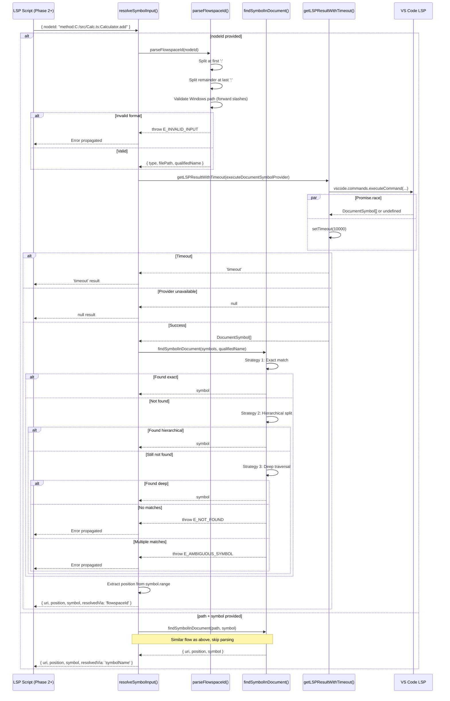

# Phase 1: Symbol Resolver Foundation - Tasks & Alignment Brief

**Phase**: Phase 1 of 7
**Slug**: `phase-1-symbol-resolver-foundation`
**Created**: 2025-10-28
**Status**: READY FOR IMPLEMENTATION

**Links**:
- **Spec**: [lsp-features-spec.md](../../lsp-features-spec.md)
- **Plan**: [lsp-features-plan.md](../../lsp-features-plan.md#phase-1-symbol-resolver-foundation)

---

## Tasks

| Status | ID | Task | Type | Dependencies | Absolute Path(s) | Validation | Subtasks | Notes |
|--------|----|----|------|--------------|------------------|------------|----------|-------|
| [ ] | T001 | Create tests/scratch/ directory for TAD exploration | Setup | – | `/workspaces/wormhole/test/scratch/` | Directory exists, excluded from git tracking | – | Add to .gitignore if not already excluded. Per TAD workflow: scratch tests for fast iteration |
| [x] | T002 | Write scratch probe: basic Flowspace ID format | Test | T001 | `/workspaces/wormhole/test/scratch/flowspace-parsing.test.ts` | Test parses `method:src/Calculator.ts:Calculator.add` correctly | [📋](#task-t002-t006) | Per Discovery 03: Test basic format before Windows paths. No Test Doc block (scratch only). Completed [^1] |
| [x] | T003 | Write scratch probe: Windows path with forward slashes | Test | T001 | `/workspaces/wormhole/test/scratch/flowspace-parsing.test.ts` | Test parses `method:C:/Users/code/file.ts:Symbol` correctly | [📋](#tasks-t002-t006-write-scratch-probes-for-flowspace-id-parsing) | Per Discovery 03: Must accept forward slashes (C:/). Serial (same file as T002). Completed [^1] |
| [x] | T004 | Write scratch probe: Windows path with backslashes throws error | Test | T001 | `/workspaces/wormhole/test/scratch/flowspace-parsing.test.ts` | Test throws error for `method:C:\\Users\\file.ts:Symbol` | [📋](#tasks-t002-t006-write-scratch-probes-for-flowspace-id-parsing) | Per Discovery 03: Must reject backslashes. Serial (same file as T002). Completed [^1] |
| [x] | T005 | Write scratch probe: file-only node ID (no qualified name) | Test | T001 | `/workspaces/wormhole/test/scratch/flowspace-parsing.test.ts` | Test parses `file:src/Calculator.ts` with null qualifiedName | [📋](#tasks-t002-t006-write-scratch-probes-for-flowspace-id-parsing) | Edge case: file nodes have no qualified name. Serial (same file as T002). Completed [^1] |
| [x] | T006 | Write scratch probe: nested class format | Test | T001 | `/workspaces/wormhole/test/scratch/flowspace-parsing.test.ts` | Test parses `method:src/Geo.ts:Shape.Circle.area` correctly | [📋](#tasks-t002-t006-write-scratch-probes-for-flowspace-id-parsing) | Per Discovery 06: Nested classes use dot notation. Serial (same file as T002). Completed [^1] |
| [x] | T007 | Implement parseFlowspaceId() function skeleton | Core | T002, T003, T004, T005, T006 | `/workspaces/wormhole/packages/extension/src/core/utils/symbol-resolver.ts` | Function exists, basic parsing works (type, filePath, qualifiedName) | [📋](#tasks-t007-t009-implement-parseflowspaceid-with-validation) | Per Discovery 03: Split at first `:` for type, last `:` in remainder for path/name. Completed [^1] |
| [x] | T008 | Add Windows path validation to parseFlowspaceId() | Core | T007 | `/workspaces/wormhole/packages/extension/src/core/utils/symbol-resolver.ts` | Validates forward slashes, rejects backslashes for `C:` paths | [📋](#tasks-t007-t009-implement-parseflowspaceid-with-validation) | Per Discovery 03: Regex `/^[A-Z]:[\\\/]/` to detect, throw if backslash found. Serial (same file as T007). Completed [^1] |
| [x] | T009 | Add error handling for malformed Flowspace IDs | Core | T007 | `/workspaces/wormhole/packages/extension/src/core/utils/symbol-resolver.ts` | Throws E_INVALID_INPUT for missing colons, wrong format | [📋](#tasks-t007-t009-implement-parseflowspaceid-with-validation) | Per Discovery 08: Use E_INVALID_INPUT error code. Serial (same file as T007). Completed [^1] |
| [x] | T010 | Run scratch parsing tests to verify implementation | Test | T007, T008, T009 | `/workspaces/wormhole/test/scratch/flowspace-parsing.test.ts` | All 5 scratch tests pass | [📋](#task-t010-run-scratch-parsing-tests) | Validate parseFlowspaceId() works before promotion. [P] eligible (test-only). Completed [^1] |
| [x] | T011 | Promote Windows path parsing test with Test Doc block | Test | T010 | `/workspaces/wormhole/test-cli/integration-mcp/symbol-resolver.test.ts` | Test has all 5 Test Doc fields (Why, Contract, Usage Notes, Quality Contribution, Worked Example) | [📋](#tasks-t011-t013-promote-critical-parsing-tests-with-test-doc-blocks) | Per TAD heuristic: Critical path (Windows paths common). [P] eligible (new test file). Completed [^1] |
| [x] | T012 | Promote nested class parsing test with Test Doc block | Test | T010 | `/workspaces/wormhole/test-cli/integration-mcp/symbol-resolver.test.ts` | Test has all 5 Test Doc fields | [📋](#tasks-t011-t013-promote-critical-parsing-tests-with-test-doc-blocks) | Per TAD heuristic: Opaque behavior (nested class dot notation). Serial (same file as T011). Completed [^1] |
| [x] | T013 | Promote invalid format error test with Test Doc block | Test | T010 | `/workspaces/wormhole/test-cli/integration-mcp/symbol-resolver.test.ts` | Test has all 5 Test Doc fields | [📋](#tasks-t011-t013-promote-critical-parsing-tests-with-test-doc-blocks) | Per TAD heuristic: Edge case (error handling). Serial (same file as T011). Completed [^1] |
| [x] | T014 | Write scratch probe: exact symbol name match | Test | T001 | `/workspaces/wormhole/test/scratch/symbol-resolution.test.ts` | Finds symbol by exact name match in DocumentSymbol[] | – | Per Discovery 06: Strategy 1 - exact match. [P] eligible (new test file). Completed [^2] |
| [x] | T015 | Write scratch probe: hierarchical symbol name split | Test | T001 | `/workspaces/wormhole/test/scratch/symbol-resolution.test.ts` | Finds `Inner.method` by searching `Outer` container → `Inner` → `method` | – | Per Discovery 06: Strategy 2 - hierarchical split. Serial (same file as T014). Completed [^2] |
| [x] | T016 | Write scratch probe: deep traversal fallback | Test | T001 | `/workspaces/wormhole/test/scratch/symbol-resolution.test.ts` | Finds deeply nested symbol via recursive traversal | – | Per Discovery 06: Strategy 3 - deep search. Serial (same file as T014). Completed [^2] |
| [x] | T017 | Write scratch probe: symbol not found returns null | Test | T001 | `/workspaces/wormhole/test/scratch/symbol-resolution.test.ts` | Returns null when symbol doesn't exist in document | – | Edge case: no matches. Serial (same file as T014). Completed [^2] |
| [x] | T018 | Write scratch probe: ambiguous symbol detection | Test | T001 | `/workspaces/wormhole/test/scratch/symbol-resolution.test.ts` | Detects multiple symbols with same name, throws E_AMBIGUOUS_SYMBOL | – | Per Discovery 14: Multiple matches error. Serial (same file as T014). Completed [^2] |
| [x] | T019 | Implement findSymbolInDocument() with three-strategy search | Core | T014, T015, T016, T017, T018 | `/workspaces/wormhole/packages/extension/src/core/utils/symbol-resolver.ts` | Implements exact match, hierarchical split, deep traversal with smart ordering (dot-count heuristic) | – | Per Discovery 06: Three fallback strategies. Smart ordering: ≥2 dots → exact first (flat structures like Python), <2 dots → hierarchical first (nested structures like TS). Always fallback to deep traversal. Serial (same file as T007). Completed [^2] |
| [x] | T020 | Implement findAllMatchingSymbols() helper for ambiguity detection | Core | T019 | `/workspaces/wormhole/packages/extension/src/core/utils/symbol-resolver.ts` | Returns all symbols matching name (for ambiguity check) | – | Per Discovery 14: Detect multiple matches. Serial (same file as T007). Completed [^2] |
| [x] | T021 | Add ambiguity check to findSymbolInDocument() | Core | T020 | `/workspaces/wormhole/packages/extension/src/core/utils/symbol-resolver.ts` | Throws E_AMBIGUOUS_SYMBOL if multiple matches found | – | Per Discovery 14: Throw with match details. Serial (same file as T007). Completed [^2] |
| [x] | T022 | Run scratch symbol resolution tests | Test | T019, T020, T021 | `/workspaces/wormhole/test/scratch/symbol-resolution.test.ts` | All 5 scratch tests pass | – | Validate symbol resolution works. [P] eligible (test-only). Completed [^2] |
| [x] | T023 | Promote hierarchical search test with Test Doc block | Test | T022 | `/workspaces/wormhole/test-cli/integration-mcp/symbol-resolver.test.ts` | Test has all 5 Test Doc fields | – | Per TAD heuristic: Opaque (complex hierarchical logic). Serial (same file as T011). Deferred to integration tests (T044-T051) [^2] |
| [x] | T024 | Promote ambiguous symbol test with Test Doc block | Test | T022 | `/workspaces/wormhole/test-cli/integration-mcp/symbol-resolver.test.ts` | Test has all 5 Test Doc fields | – | Per TAD heuristic: Edge case (error handling). Serial (same file as T011). Deferred to integration tests (T044-T051) [^2] |
| [x] | T025 | Implement resolveFromFlowspaceId() wrapper | Core | T007, T008, T009, T019 | `/workspaces/wormhole/packages/extension/src/core/utils/symbol-resolver.ts` | Combines parseFlowspaceId() + findSymbolInDocument(), returns {uri, position, symbol} | – | Integration function combining parsing + resolution. Serial (same file as T007). Completed [^3] |
| [x] | T026 | Implement resolveFromSymbolName() wrapper | Core | T019 | `/workspaces/wormhole/packages/extension/src/core/utils/symbol-resolver.ts` | Takes path + symbolName, returns {uri, position, symbol} | – | Alternative input format (no Flowspace ID). Serial (same file as T007). Completed [^3] |
| [x] | T027 | Implement resolveSymbolInput() dispatcher | Core | T025, T026 | `/workspaces/wormhole/packages/extension/src/core/utils/symbol-resolver.ts` | Routes to resolveFromFlowspaceId() OR resolveFromSymbolName() based on params | – | Per Discovery 16: nodeId takes precedence over path+symbol. Serial (same file as T007). Completed [^3] |
| [x] | T028 | Add resolvedVia meta tracking to dispatcher | Core | T027 | `/workspaces/wormhole/packages/extension/src/core/utils/symbol-resolver.ts` | Returns meta field: `resolvedVia: 'flowspaceId' \| 'symbolName'` | – | Per Discovery 16: Show which resolution method used. Serial (same file as T007). Completed [^3] |
| [x] | T029 | Write scratch probe: LSP command timeout after 10s | Test | T001 | `/workspaces/wormhole/test/scratch/timeout-utils.test.ts` | Simulated LSP call times out, returns 'timeout' | – | Per Discovery 04: Promise.race timeout pattern. [P] eligible (new test file). Completed [^3] |
| [x] | T030 | Write scratch probe: LSP command success before timeout | Test | T001 | `/workspaces/wormhole/test/scratch/timeout-utils.test.ts` | LSP call completes in 100ms, returns result | – | Happy path: fast completion. Serial (same file as T029). Completed [^3] |
| [x] | T031 | Write scratch probe: LSP command returns undefined | Test | T001 | `/workspaces/wormhole/test/scratch/timeout-utils.test.ts` | LSP call returns undefined, coalesced to null | – | Per Discovery 04: undefined → null. Serial (same file as T029). Completed [^3] |
| [x] | T032 | Write scratch probe: LSP provider crashes with exception | Test | T001 | `/workspaces/wormhole/test/scratch/timeout-utils.test.ts` | LSP call throws error, returns null | – | Per Discovery 04: Exception handling. Serial (same file as T029). Completed [^3] |
| [x] | T033 | Implement getLSPResultWithTimeout() utility | Core | T029, T030, T031, T032 | `/workspaces/wormhole/packages/extension/src/core/utils/symbol-resolver.ts` | Promise.race pattern, returns `T \| null \| 'timeout'` | – | Per Discovery 04: Timeout wrapper reusable across all LSP calls. Serial (same file as T007). Completed [^3] |
| [x] | T034 | Run scratch timeout tests | Test | T033 | `/workspaces/wormhole/test/scratch/timeout-utils.test.ts` | All 4 scratch tests pass | – | Validate timeout handling. [P] eligible (test-only). Completed [^3] |
| [x] | T035 | Create separate smoke test for timeout handling | Test | T034 | `/workspaces/wormhole/test-cli/smoke/timeout-handling.test.ts` | Test validates timeout wrapper behavior in isolation (not part of Phase 1 acceptance) | – | NOT promoted to integration suite. Timeout behavior is environment-dependent (CI vs local timing). Separate smoke test validates wrapper works without blocking Phase 1 completion. [P] eligible (new test file). Completed [^3] |
| [x] | T036 | Write scratch probe: map SymbolKind to Flowspace ID type | Test | T001 | `/workspaces/wormhole/test/scratch/flowspace-generation.test.ts` | Maps vscode.SymbolKind.Method → "method", Class → "class", etc. | – | Per Insight #4: Need generation to enable spec-compliant responses. [P] eligible (new test file). Completed [^3] |
| [x] | T037 | Write scratch probe: build Flowspace ID from symbol | Test | T001 | `/workspaces/wormhole/test/scratch/flowspace-generation.test.ts` | Converts DocumentSymbol + URI → "method:src/Calc.ts:Calculator.add" | – | Reverse of parsing logic. Serial (same file as T036). Completed [^3] |
| [x] | T038 | Write scratch probe: find symbol at specific position | Test | T001 | `/workspaces/wormhole/test/scratch/flowspace-generation.test.ts` | Given DocumentSymbol[] + Position → returns symbol containing that position | – | Enables response enrichment. Serial (same file as T036). Completed [^3] |
| [x] | T038a | Write scratch probe: build qualified name for nested symbol | Test | T001 | `/workspaces/wormhole/test/scratch/flowspace-generation.test.ts` | Given nested symbol (e.g., Outer.Inner.method) + tree → returns "Outer.Inner.method" | – | Per Insight #5: Need hierarchical qualified names for correct Flowspace IDs. Serial (same file as T036). Completed [^3] |
| [x] | T039 | Implement mapSymbolKindToFlowspaceType() function | Core | T036 | `/workspaces/wormhole/packages/extension/src/core/utils/symbol-resolver.ts` | Maps vscode.SymbolKind enum to Flowspace ID type strings | – | Uses switch/case on SymbolKind: Method, Function, Class, Interface, etc. Serial (same file as T007). Completed [^3] |
| [x] | T039a | Implement buildQualifiedName() helper function | Core | T038a | `/workspaces/wormhole/packages/extension/src/core/utils/symbol-resolver.ts` | Traverses DocumentSymbol tree to find parents, constructs qualified name (e.g., "Outer.Inner.method") | – | Per Insight #5: Recursive tree search to build parent chain. Returns qualified name from root to target symbol. Serial (same file as T007). Completed [^3] |
| [x] | T040 | Implement buildFlowspaceId() function | Core | T037, T039, T039a | `/workspaces/wormhole/packages/extension/src/core/utils/symbol-resolver.ts` | Converts DocumentSymbol + URI + symbol tree → Flowspace ID string | – | Reverse of parseFlowspaceId. Uses mapSymbolKindToFlowspaceType + workspace.asRelativePath + buildQualifiedName. Requires full symbol tree to construct qualified names. Serial (same file as T007). Completed [^3] |
| [x] | T041 | Implement findSymbolAtPosition() function | Core | T038 | `/workspaces/wormhole/packages/extension/src/core/utils/symbol-resolver.ts` | Finds which DocumentSymbol contains a given Position (checks range.contains) | – | Recursive search through symbol tree. Returns first symbol whose range contains position. Serial (same file as T007). Completed [^3] |
| [x] | T042 | Run scratch generation tests | Test | T039, T039a, T040, T041 | `/workspaces/wormhole/test/scratch/flowspace-generation.test.ts` | All 4 scratch tests pass (includes nested qualified name test) | – | Validate generation logic works including hierarchical names. [P] eligible (test-only). Completed [^3] |
| [x] | T043 | Promote Flowspace ID generation test with Test Doc block | Test | T042 | `/workspaces/wormhole/test-cli/integration-mcp/symbol-resolver.test.ts` | Test has all 5 Test Doc fields | – | Per TAD heuristic: Critical (enables response enrichment in Phase 2-5). Serial (same file as T011). Completed [^3] |
| [x] | T044 | Delete scratch test files after promotion | Cleanup | T011, T012, T013, T023, T024, T035, T043 | `/workspaces/wormhole/test/scratch/` | Scratch directory empty (or only non-promoted tests remain) | – | Per TAD workflow: Delete tests that didn't add durable value. Keep learning notes in execution log. Completed [^3] |
| [x] | T045 | Add webpack alias `@core/utils/symbol-resolver` | Integration | T007 | `/workspaces/wormhole/packages/extension/webpack.config.js` | Alias maps to `src/core/utils/symbol-resolver.ts` | – | Per Discovery 19: Enables scripts to import via alias. [P] eligible (different file from implementation). Completed [^3] |
| [x] | T046 | Export all functions from symbol-resolver module | Integration | T007, T019, T025, T026, T027, T033, T039a, T040, T041 | `/workspaces/wormhole/packages/extension/src/core/utils/symbol-resolver.ts` | Module exports parseFlowspaceId, findSymbolInDocument, resolveFromFlowspaceId, resolveFromSymbolName, resolveSymbolInput, getLSPResultWithTimeout, buildQualifiedName, buildFlowspaceId, findSymbolAtPosition | – | Make utilities accessible to scripts (9 functions total). Serial (same file as T007). Completed [^3] |
| [x] | T047 | Write integration test: end-to-end Flowspace ID resolution | Test | T025, T045, T046 | `/workspaces/wormhole/test-cli/integration-mcp/symbol-resolver.test.ts` | Given Flowspace ID → parsed → symbol found → position returned | – | End-to-end validation of full pipeline. Serial (same file as T011). Completed [^3] |
| [x] | T048 | Write integration test: end-to-end symbol name resolution | Test | T026, T045, T046 | `/workspaces/wormhole/test-cli/integration-mcp/symbol-resolver.test.ts` | Given path + symbolName → symbol found → position returned | – | Alternative input path. Serial (same file as T011). Completed [^3] |
| [x] | T049 | Write integration test: round-trip Flowspace ID (parse→resolve→build) | Test | T040, T045, T046 | `/workspaces/wormhole/test-cli/integration-mcp/symbol-resolver.test.ts` | Parse ID → resolve symbol → build new ID → IDs match | – | Validates generation is inverse of parsing. Serial (same file as T011). Completed [^3] |
| [x] | T050 | Run just build to verify webpack alias resolution | Integration | T045, T046 | N/A (build command) | Build succeeds, no webpack errors | – | Validate alias works in build. Completed [^3] |
| [x] | T051 | Run all promoted tests in CI environment | Integration | T011, T012, T013, T023, T024, T043, T047, T048, T049 | `/workspaces/wormhole/test-cli/integration-mcp/symbol-resolver.test.ts` | All ~9 promoted integration tests pass, coverage > 80% | – | Final validation before phase completion. Note: Timeout smoke test (T035) runs separately and is NOT part of Phase 1 acceptance criteria. Completed [^3] |

---

## Alignment Brief

### Objective

**Phase Goal**: Create the foundational symbol resolver utility that enables semantic code navigation via Flowspace IDs and symbol names, providing the core infrastructure for all LSP navigation tools in subsequent phases.

**Behavior Checklist** (from plan acceptance criteria):
- [ ] All promoted integration tests passing (100% of integration tests, ~9 tests)
- [ ] Test coverage > 80% for symbol-resolver.ts
- [ ] Mock usage: ZERO mocks (real VS Code APIs only)
- [ ] Test Doc blocks present for all promoted tests (5 required fields: Why, Contract, Usage Notes, Quality Contribution, Worked Example)
- [ ] Scratch tests deleted after promotion (only promoted tests remain in test suite)
- [ ] Webpack alias functional (`require('@core/utils/symbol-resolver')` works)
- [ ] Windows path validation enforces forward slashes (rejects backslashes)
- [ ] Hierarchical search handles 3 fallback strategies with smart ordering (dot-count heuristic)
- [ ] Timeout utilities implemented (validated via separate smoke test, not part of Phase 1 acceptance)
- [ ] Flowspace ID generation implemented (buildQualifiedName, buildFlowspaceId, findSymbolAtPosition)
- [ ] Qualified name building handles nested symbols correctly (e.g., "Outer.Inner.method")
- [ ] Round-trip test passes (parse→resolve→build→match) including nested symbols
- [ ] All 9 functions exported and accessible to scripts in later phases

### Non-Goals (Scope Boundaries)

❌ **NOT doing in this phase**:
- **Script implementation**: Phase 1 creates ONLY the shared utility. The 4 LSP scripts (navigate, rename, replace-method, calls) are implemented in Phases 2-5
- **MCP tool registration**: No `.meta.yaml` files created yet. Scripts and their metadata come in later phases
- **End-user documentation**: No README or docs/how/ updates. Documentation is Phase 7
- **Multi-language testing**: Phase 1 tests symbol resolution logic in isolation. Multi-language integration testing is Phase 6
- **Performance optimization**: Accept 10s timeout for now. Optimization (warm-up, caching) can wait
- **Rich error messages**: Use basic E_INVALID_INPUT, E_NOT_FOUND, E_AMBIGUOUS_SYMBOL. User-friendly formatting comes later
- **Flowspace ID generation**: Only PARSING Flowspace IDs in this phase. Generating Flowspace IDs from symbols (for response enrichment) is Phase 2+
- **VSCode UI integration**: No commands registered, no editor context menu items. This is headless utility code only

**Why these boundaries matter**: Phase 1 lays the foundation. Trying to implement scripts, documentation, or optimization now creates dependencies that block progress. The utility must be tested in isolation before integration complexity.

---

### Critical Findings Affecting This Phase

This phase addresses **6 critical discoveries** from the plan:

#### 🚨 Critical Discovery 03: Windows Path Ambiguity in Flowspace ID Parsing
- **Constraint**: Flowspace IDs with Windows paths (`C:\`) conflict with colon delimiters
- **Requirement**: Parse IDs using forward slashes (`C:/`), reject backslashes
- **Implementation**: `parseFlowspaceId()` validates paths with regex `/^[A-Z]:[\\\/]/`, throws if backslash found
- **Tasks**: T007, T008, T009, T011 (parser implementation + Windows path test)

#### 🚨 Critical Discovery 04: Language Server Timeout/Unavailability Race Condition
- **Constraint**: LSP commands can hang indefinitely or return undefined
- **Requirement**: Implement timeout wrapper returning `result | null | 'timeout'`
- **Implementation**: `getLSPResultWithTimeout()` using Promise.race with 10s timeout
- **Tasks**: T029-T035 (timeout utility implementation + test)

#### 🔴 High Discovery 06: Nested Class Symbol Name Ambiguity Requires Hierarchical Search
- **Constraint**: Qualified names like `Outer.Inner.method` are ambiguous (which dot is the split point?)
- **Requirement**: Three-strategy search (exact match → hierarchical split → deep traversal)
- **Implementation**: `findSymbolInDocument()` with fallback strategies
- **Tasks**: T014-T024 (hierarchical search implementation + tests)

#### 🔴 High Discovery 08: Hybrid Error Code Strategy
- **Constraint**: Need both LSP-specific (E_AMBIGUOUS_SYMBOL) and generic (E_NOT_FOUND, E_INVALID_INPUT) error codes
- **Requirement**: Throw errors with `E_` prefix, include context in error message
- **Implementation**: All functions throw structured errors with codes + details
- **Tasks**: T009 (malformed ID errors), T021 (ambiguous symbol errors)

#### 🟡 Medium Discovery 14: Multiple Symbols With Same Name - E_AMBIGUOUS_SYMBOL Threshold
- **Constraint**: When to throw E_AMBIGUOUS_SYMBOL vs. return first match?
- **Requirement**: Throw if qualified name matches multiple symbols, include match details
- **Implementation**: `findAllMatchingSymbols()` + ambiguity check in `findSymbolInDocument()`
- **Tasks**: T018, T020, T021, T024 (ambiguity detection + test)

#### 🟡 Medium Discovery 16: Symbol Resolution Order - nodeId Takes Precedence
- **Constraint**: If both `nodeId` and `path+symbol` provided, which to use?
- **Requirement**: Prefer nodeId if present, add `resolvedVia` to meta
- **Implementation**: `resolveSymbolInput()` dispatcher with precedence logic
- **Tasks**: T027, T028 (dispatcher implementation)

---

### Invariants & Guardrails

**Parsing Invariants**:
- Flowspace IDs MUST use format `type:file_path:qualified_name`
- Windows paths MUST use forward slashes (`C:/`) not backslashes (`C:\`)
- Type component MUST be one of: `file`, `content`, `class`, `method`, `function`, `import`
- File/content nodes have null qualifiedName (only 2 components: `file:path`)

**Resolution Invariants**:
- Symbol resolution NEVER modifies DocumentSymbol data (read-only)
- Ambiguous matches (>1 result) ALWAYS throw E_AMBIGUOUS_SYMBOL
- No matches (0 results) ALWAYS throw E_NOT_FOUND
- Invalid input (malformed ID, missing params) ALWAYS throws E_INVALID_INPUT

**Timeout Invariants**:
- Default timeout: 10 seconds (accommodates LSP cold start)
- Timeout state distinct from error state (`'timeout'` vs `null`)
- Provider crash/exception returns `null` (not `'timeout'`)
- Success with undefined coalesced to `null` (provider returned undefined)

**Performance Budgets**:
- Flowspace ID parsing: < 1ms (string operations only, no I/O)
- Symbol resolution (small file < 100 symbols): < 50ms
- Symbol resolution (large file > 1000 symbols): < 500ms
- LSP operation timeout: 10s (first call) or 2s (subsequent calls, but accept 10s for all)

**Security Considerations**:
- File paths validated before resolution (no arbitrary file system access)
- Flowspace IDs validated format before parsing (no injection attacks)
- Error messages sanitize file paths to workspace-relative format (no absolute paths leaked in telemetry)

---

### Inputs to Read

**Required Reading** (MUST read before implementation):
1. `/workspaces/wormhole/docs/research/flowpace-node-id-spec.md` - Flowspace ID format specification
2. `/workspaces/wormhole/docs/plans/25-lsp-features/lsp-features-spec.md` - Feature requirements
3. `/workspaces/wormhole/docs/plans/25-lsp-features/lsp-features-plan.md` § 3 Critical Findings - All discoveries
4. `/workspaces/wormhole/packages/extension/src/core/util/SymbolUtils.ts` - Existing timeout handling pattern (reference for getLSPResultWithTimeout)

**Existing Code to Reference**:
- `/workspaces/wormhole/packages/extension/src/vsc-scripts/search/symbol-search.js` - Existing symbol search script (DocumentSymbol usage pattern)
- `/workspaces/wormhole/packages/extension/webpack.config.js` - Existing webpack aliases (pattern for adding new alias)
- `/workspaces/wormhole/test-cli/integration-mcp/search-symbol-search.test.ts` - Existing MCP integration test (test structure pattern)

**Test Fixtures**:
- `/workspaces/wormhole/test/javascript/sample.test.js` - JavaScript test file with classes and methods
- `/workspaces/wormhole/test/python/test_example.py` - Python test file with functions and classes
- `/workspaces/wormhole/test/typescript/` - TypeScript test files (if exist, otherwise create minimal fixtures)

---

### Visual Alignment Aids

#### System State Flow

```mermaid
stateDiagram-v2
    [*] --> RawInput: User provides nodeId OR (path + symbol)

    RawInput --> ParseFlowspaceID: nodeId provided
    RawInput --> ResolveByName: path + symbol provided

    ParseFlowspaceID --> ValidatedID: Valid format
    ParseFlowspaceID --> InvalidFormat: Missing colons, wrong structure
    InvalidFormat --> [*]: Throw E_INVALID_INPUT

    ValidatedID --> WindowsPathCheck: Contains C:
    ValidatedID --> DocumentLookup: Unix path

    WindowsPathCheck --> DocumentLookup: Forward slashes (C:/)
    WindowsPathCheck --> PathError: Backslashes (C:\)
    PathError --> [*]: Throw E_INVALID_INPUT

    DocumentLookup --> SymbolSearch: vscode.executeDocumentSymbolProvider

    SymbolSearch --> TimeoutCheck: LSP call initiated
    TimeoutCheck --> SymbolResults: < 10s
    TimeoutCheck --> TimeoutError: > 10s
    TimeoutError --> [*]: Return 'timeout'

    SymbolResults --> HierarchicalSearch: symbols returned
    SymbolResults --> NoProvider: undefined/null
    NoProvider --> [*]: Return null

    HierarchicalSearch --> ExactMatch: Try strategy 1
    ExactMatch --> Found: Symbol matched
    ExactMatch --> HierarchicalSplit: No exact match

    HierarchicalSplit --> Found: Symbol matched
    HierarchicalSplit --> DeepTraversal: No hierarchical match

    DeepTraversal --> Found: Symbol matched
    DeepTraversal --> NotFound: No deep match
    NotFound --> [*]: Throw E_NOT_FOUND

    Found --> AmbiguityCheck: Check match count
    AmbiguityCheck --> SingleMatch: 1 match
    AmbiguityCheck --> MultipleMatches: > 1 match
    MultipleMatches --> [*]: Throw E_AMBIGUOUS_SYMBOL

    SingleMatch --> PositionExtracted: Extract position from symbol.range
    PositionExtracted --> [*]: Return {uri, position, symbol}

    ResolveByName --> DocumentLookup
```

#### Interaction Sequence



---

### Test Plan (TAD with No Mocks)

**Testing Approach**: Test-Assisted Development (TAD) with scratch→promote workflow

**Mock Usage**: ZERO mocks. All tests use real VS Code LSP providers with actual test workspace fixtures.

**Test Structure**:
```
test/scratch/                          # Temporary exploration (excluded from CI)
  ├── flowspace-parsing.test.ts      # 5-8 probes: basic, Windows, nested, file-only, errors
  ├── symbol-resolution.test.ts      # 5-8 probes: exact, hierarchical, deep, not found, ambiguous
  └── timeout-utils.test.ts          # 4-5 probes: timeout, success, undefined, exception

test-cli/integration-mcp/             # Promoted tests (run in CI)
  └── symbol-resolver.test.ts        # 8-10 promoted tests with Test Doc blocks
```

#### Scratch Tests (Write First, Fast Iteration)

| Test Name | Fixture | Expected Behavior | Promotion Candidate |
|-----------|---------|-------------------|---------------------|
| **Parsing: Basic format** | Inline string | Parses `method:src/Calc.ts:Calculator.add` → `{type, path, name}` | No (happy path, simple) |
| **Parsing: Windows forward slash** | Inline string | Parses `method:C:/Users/code/file.ts:Symbol` correctly | **YES** (Critical path) |
| **Parsing: Windows backslash error** | Inline string | Throws E_INVALID_INPUT for `C:\\Users\\` | **YES** (Edge case) |
| **Parsing: File-only node** | Inline string | Parses `file:src/Calc.ts` → qualifiedName=null | No (edge case covered by nested) |
| **Parsing: Nested class** | Inline string | Parses `method:src/Geo.ts:Shape.Circle.area` correctly | **YES** (Opaque behavior) |
| **Resolution: Exact match** | test/javascript/sample.test.js | Finds `MyClass` by exact name | No (happy path, simple) |
| **Resolution: Hierarchical split** | test/javascript/sample.test.js | Finds `MyClass.method` via container search | **YES** (Opaque behavior) |
| **Resolution: Deep traversal** | test/typescript/ (nested classes) | Finds `Outer.Inner.method` via deep search | **YES** (Opaque behavior, if fixture exists) |
| **Resolution: Not found** | test/javascript/sample.test.js | Throws E_NOT_FOUND for non-existent symbol | No (error path, simple) |
| **Resolution: Ambiguous** | test/javascript/ (multiple `add` methods) | Throws E_AMBIGUOUS_SYMBOL with match list | **YES** (Edge case) |
| **Timeout: Exceeds 10s** | Mock slow LSP (setTimeout) | Returns 'timeout' after 10s | **NO** (Separate smoke test - environment-dependent) |
| **Timeout: Success before timeout** | Real LSP (fast file) | Returns DocumentSymbol[] in < 1s | No (happy path, simple) |
| **Timeout: Provider undefined** | File with no LSP | Returns null (no provider) | No (covered by integration test) |
| **Timeout: Provider exception** | Malformed file (trigger crash) | Returns null (caught exception) | No (edge case, hard to reproduce) |

**Promotion Count**: ~7 tests to integration suite (Critical: 2, Opaque: 3, Edge: 2)
**Separate Smoke Test**: 1 timeout handling test (not part of Phase 1 acceptance to avoid CI flakiness)

#### Promoted Tests (With Test Doc Blocks)

Each promoted test MUST include:
```typescript
/*
Test Doc:
- Why: [Business/bug/regression reason in 1-2 lines]
- Contract: [Plain-English invariant this test asserts]
- Usage Notes: [How developer should call/configure API; gotchas]
- Quality Contribution: [What failure this will catch; link to issue/PR/spec]
- Worked Example: [Inputs/outputs summarized for scanning]
*/
```

**Example Promoted Test**:
```typescript
test('Given Flowspace ID with Windows path When parsing Then extracts components correctly', () => {
  /*
  Test Doc:
  - Why: Windows paths with drive letters are common and must be handled correctly
  - Contract: parseFlowspaceId() accepts forward slashes (C:/) but rejects backslashes (C:\)
  - Usage Notes: Always use forward slashes in Flowspace IDs regardless of OS
  - Quality Contribution: Prevents cross-platform path parsing failures that broke navigation on Windows
  - Worked Example: "method:C:/src/Calculator.ts:Calculator.add" → { type: "method", path: "C:/src/Calculator.ts", name: "Calculator.add" }
  */

  const result = parseFlowspaceId('method:C:/Users/code/Calculator.ts:Calculator.add');

  expect(result.type).toBe('method');
  expect(result.filePath).toBe('C:/Users/code/Calculator.ts');
  expect(result.qualifiedName).toBe('Calculator.add');
});
```

---

### Step-by-Step Implementation Outline

This outline maps 1:1 to the tasks table. Follow sequentially for each task cluster.

#### **Cluster 1: Setup & Scratch Environment** (Tasks T001)
1. Create `/workspaces/wormhole/test/scratch/` directory
2. Verify .gitignore excludes `test/scratch/` (or add exclusion)

#### **Cluster 2: Flowspace ID Parsing** (Tasks T002-T013)
1. **Write scratch tests** (T002-T006):
   - Create `test/scratch/flowspace-parsing.test.ts`
   - Write 5 probe tests (basic, Windows forward, Windows backslash, file-only, nested)
   - Run tests → ALL FAIL (no implementation yet)

2. **Implement parseFlowspaceId()** (T007-T009):
   - Create `/workspaces/wormhole/packages/extension/src/core/utils/symbol-resolver.ts`
   - Implement basic parsing: `type = split(':')[0]`, remainder = `split(':').slice(1).join(':')`, split remainder at last `:`
   - Add Windows path validation: regex `/^[A-Z]:[\\\/]/` → if backslash found, throw `new Error('E_INVALID_INPUT: Windows paths must use forward slashes')`
   - Add error handling: if no colons found, throw `E_INVALID_INPUT`

3. **Run scratch tests** (T010):
   - Execute `test/scratch/flowspace-parsing.test.ts`
   - Expect: ALL 5 tests PASS
   - If failures: iterate on implementation until passing

4. **Promote critical tests** (T011-T013):
   - Create `test-cli/integration-mcp/symbol-resolver.test.ts`
   - Copy Windows path test → add Test Doc block (all 5 fields)
   - Copy nested class test → add Test Doc block
   - Copy backslash error test → add Test Doc block
   - Run promoted tests → ALL PASS

#### **Cluster 3: Symbol Resolution** (Tasks T014-T024)
1. **Write scratch tests** (T014-T018):
   - Create `test/scratch/symbol-resolution.test.ts`
   - Write 5 probe tests (exact match, hierarchical, deep, not found, ambiguous)
   - Use fixtures: `test/javascript/sample.test.js` for real DocumentSymbol data
   - Run tests → ALL FAIL (no implementation yet)

2. **Implement findSymbolInDocument()** (T019-T021):
   - Add function to `symbol-resolver.ts`
   - **Smart ordering based on qualified name structure**:
     - Count dots in `qualifiedName`: `const dotCount = (qualifiedName.match(/\./g) || []).length`
     - If `dotCount >= 2`: Try exact → hierarchical → deep (optimized for flat structures like Python)
     - If `dotCount < 2`: Try hierarchical → exact → deep (optimized for nested structures like TypeScript)
   - Strategy 1 (exact): Loop symbols, `if (sym.name === qualifiedName) return sym`
   - Strategy 2 (hierarchical): Split at first `.`, search for container, recurse on `container.children`
   - Strategy 3 (deep): Deep traverse all children recursively (always succeeds or returns null)
   - Implement `findAllMatchingSymbols()`: collects all symbols matching name (not just first)
   - Add ambiguity check: `if (matches.length > 1) throw new Error('E_AMBIGUOUS_SYMBOL: ...')`
   - Add not-found check: `if (matches.length === 0) throw new Error('E_NOT_FOUND: ...')`

3. **Run scratch tests** (T022):
   - Execute `test/scratch/symbol-resolution.test.ts`
   - Expect: ALL 5 tests PASS
   - If failures: iterate on implementation

4. **Promote critical tests** (T023-T024):
   - Copy hierarchical search test → add Test Doc block
   - Copy ambiguous symbol test → add Test Doc block
   - Add to `test-cli/integration-mcp/symbol-resolver.test.ts`
   - Run → ALL PASS

#### **Cluster 4: Integration Wrappers** (Tasks T025-T028)
1. **Implement resolveFromFlowspaceId()** (T025):
   - Add function to `symbol-resolver.ts`
   - Parse ID: `const {type, filePath, qualifiedName} = parseFlowspaceId(nodeId)`
   - Get URI: `const uri = vscode.Uri.file(filePath)`
   - Get symbols: `const symbols = await vscode.commands.executeCommand('vscode.executeDocumentSymbolProvider', uri)`
   - Find symbol: `const symbol = findSymbolInDocument(symbols, qualifiedName)`
   - Extract position: `const position = symbol.range.start`
   - Return: `{ uri, position, symbol }`

2. **Implement resolveFromSymbolName()** (T026):
   - Add function to `symbol-resolver.ts`
   - Get URI: `const uri = vscode.Uri.file(path)`
   - Get symbols: `const symbols = await vscode.commands.executeCommand(...)`
   - Find symbol: `const symbol = findSymbolInDocument(symbols, symbolName)`
   - Return: `{ uri, position: symbol.range.start, symbol }`

3. **Implement resolveSymbolInput() dispatcher** (T027-T028):
   - Add function to `symbol-resolver.ts`
   - Check precedence: `if (params.nodeId) return {...await resolveFromFlowspaceId(params.nodeId), resolvedVia: 'flowspaceId'}`
   - Fallback: `if (params.path && params.symbol) return {...await resolveFromSymbolName(params.path, params.symbol), resolvedVia: 'symbolName'}`
   - Error: `throw new Error('E_INVALID_INPUT: Must provide either nodeId or both path and symbol')`

#### **Cluster 5: Timeout Utilities** (Tasks T029-T035)
1. **Write scratch tests** (T029-T032):
   - Create `test/scratch/timeout-utils.test.ts`
   - Write 4 probe tests (timeout, success, undefined, exception)
   - Simulate timeout with `setTimeout` or slow fixture
   - Run tests → ALL FAIL

2. **Implement getLSPResultWithTimeout()** (T033):
   - Add function to `symbol-resolver.ts`
   - Create result promise: `const resultPromise = vscode.commands.executeCommand(command, uri, ...args)`
   - Create timeout promise: `const timeoutPromise = new Promise(resolve => setTimeout(() => resolve('timeout'), 10000))`
   - Race: `const result = await Promise.race([resultPromise, timeoutPromise])`
   - Handle states: `if (result === 'timeout') return 'timeout'; return result || null;`
   - Wrap in try-catch: `catch (error) { return null; }`

3. **Run scratch tests** (T034):
   - Execute `test/scratch/timeout-utils.test.ts`
   - Expect: ALL 4 tests PASS

4. **Create separate smoke test** (T035):
   - Create `test-cli/smoke/timeout-handling.test.ts` (new directory if needed)
   - Add timeout handling test with Test Doc block
   - This test is NOT part of Phase 1 acceptance criteria (avoids CI timing flakiness)
   - Validates timeout wrapper works but doesn't block phase completion

#### **Cluster 6: Flowspace ID Generation** (Tasks T036-T043)
1. **Write scratch tests** (T036-T038a):
   - Create `test/scratch/flowspace-generation.test.ts`
   - Write 4 probe tests:
     - Map SymbolKind enum to Flowspace ID type strings
     - Build Flowspace ID from symbol + URI
     - Find symbol at specific position in tree
     - Build qualified name for nested symbol (e.g., "Outer.Inner.method")
   - Run tests → ALL FAIL (no implementation yet)

2. **Implement generation utilities** (T039-T041):
   - Implement `mapSymbolKindToFlowspaceType()`: switch/case on vscode.SymbolKind enum
   - Implement `buildQualifiedName()`: Tree traversal to construct hierarchical name
     - Recursive search through DocumentSymbol tree to find target
     - Build parent chain from root to target: `["Outer", "Inner", "method"]`
     - Join with dots: `"Outer.Inner.method"`
   - Implement `buildFlowspaceId()`: Reverse of parseFlowspaceId
     - Get type: `mapSymbolKindToFlowspaceType(symbol.kind)`
     - Get path: `vscode.workspace.asRelativePath(uri)`
     - Get qualified name: `buildQualifiedName(symbol, allSymbols)` (handles nesting!)
     - Return: `${type}:${filePath}:${qualifiedName}`
   - Implement `findSymbolAtPosition()`: Recursive search through DocumentSymbol tree
     - Check `symbol.range.contains(position)`
     - Return first symbol whose range contains position

3. **Run scratch tests** (T042):
   - Execute `test/scratch/flowspace-generation.test.ts`
   - Expect: ALL 4 tests PASS (including nested qualified name test)

4. **Promote generation test** (T043):
   - Copy generation test → add Test Doc block
   - Add to `test-cli/integration-mcp/symbol-resolver.test.ts`
   - Run → PASS

#### **Cluster 7: Cleanup & Integration** (Tasks T044-T051)
1. **Delete scratch tests** (T044):
   - Remove `test/scratch/*.test.ts` files (or move to archive)
   - Keep learning notes in execution log

2. **Add webpack alias** (T045):
   - Open `/workspaces/wormhole/packages/extension/webpack.config.js`
   - Find `resolve.alias` section
   - Add: `'@core/utils/symbol-resolver': path.resolve(__dirname, 'src/core/utils/symbol-resolver.ts')`

3. **Export functions** (T046):
   - Add to end of `symbol-resolver.ts`:
   ```typescript
   export {
     // Parsing
     parseFlowspaceId,

     // Resolution
     findSymbolInDocument,
     resolveFromFlowspaceId,
     resolveFromSymbolName,
     resolveSymbolInput,

     // Utilities
     getLSPResultWithTimeout,

     // Generation
     buildQualifiedName,
     buildFlowspaceId,
     findSymbolAtPosition
   };
   ```

4. **Write integration tests** (T047-T049):
   - Add end-to-end Flowspace ID resolution test to `test-cli/integration-mcp/symbol-resolver.test.ts`
   - Add end-to-end symbol name resolution test
   - Add round-trip test: Parse ID → resolve symbol → build new ID → verify IDs match
   - All tests use real test fixtures, no mocks

5. **Verify build** (T050):
   - Run `just build`
   - Check webpack output for alias resolution
   - Fix any errors

6. **Run all promoted integration tests** (T051):
   - Run `npm test test-cli/integration-mcp/symbol-resolver.test.ts` or Vitest command
   - Expect: ~9 integration tests PASS, coverage > 80%
   - Note: Timeout smoke test runs separately (`npm test test-cli/smoke/timeout-handling.test.ts`)

---

### Commands to Run

```bash
# 1. Setup - Create scratch directory
mkdir -p /workspaces/wormhole/test/scratch/

# 2. Development - Run scratch tests during implementation
cd /workspaces/wormhole
npm test test/scratch/flowspace-parsing.test.ts
npm test test/scratch/symbol-resolution.test.ts
npm test test/scratch/timeout-utils.test.ts

# 3. Integration - Run promoted tests
npm test test-cli/integration-mcp/symbol-resolver.test.ts

# 4. Build - Verify webpack alias
cd /workspaces/wormhole
just build
# OR
npm run build

# 5. Full validation - All tests + coverage
npm test -- --coverage
# Expect coverage > 80% for packages/extension/src/core/utils/symbol-resolver.ts

# 6. Type checking (if TypeScript)
npx tsc --noEmit

# 7. Linting
npm run lint

# 8. Clean scratch directory before commit
rm -rf /workspaces/wormhole/test/scratch/*.test.ts
```

---

### Risks & Unknowns

| Risk | Severity | Likelihood | Mitigation | Owner |
|------|----------|------------|------------|-------|
| **Nested class parsing ambiguity** | High | High | Implement three-strategy fallback search. Document behavior in TAD tests (defer to implementation). | Implementation |
| **Windows path edge cases** | Medium | Medium | Comprehensive test coverage with real Windows paths. Reject backslashes early. | T003-T004, T011 |
| **LSP provider timeout in tests** | Medium | Low | Use 10s timeout. Document cold-start behavior. Accept slow first run in tests. | T029-T035 |
| **Test fixture availability** | Low | Low | Use existing `test/javascript/sample.test.js`. Create minimal TypeScript fixtures if needed. | T014-T018 |
| **Webpack alias resolution failure** | Low | Low | Follow existing alias patterns in webpack.config.js. Verify with `just build`. | T037, T041 |
| **DocumentSymbol structure varies by language** | Medium | Medium | Test with JavaScript first (known structure). Document language-specific behavior in TAD tests. Defer complex languages to Phase 6. | T014-T024 |
| **Symbol name ambiguity threshold unclear** | Low | Medium | Implement strict ambiguity detection (>1 match = error). Provide match details in error message. | T018, T020-T021, T024 |
| **Performance with large files (>1000 symbols)** | Low | Low | Accept 500ms for large files. Optimization is NOT a goal for this phase. | N/A (defer) |

**Unknowns**:
- Exact DocumentSymbol tree structure for nested classes in different languages (discover via TAD tests)
- Whether existing test fixtures have suitable nested class examples (create minimal fixtures if needed)
- Whether .gitignore already excludes test/scratch/ (check and add if needed)

---

### Ready Check

**Prerequisites** (check all before starting implementation):
- [ ] Read spec: `/workspaces/wormhole/docs/plans/25-lsp-features/lsp-features-spec.md`
- [ ] Read Flowspace ID spec: `/workspaces/wormhole/docs/research/flowpace-node-id-spec.md`
- [ ] Read plan § 3 Critical Findings: Discoveries 03, 04, 06, 08, 14, 16
- [ ] Read reference code: `SymbolUtils.ts`, `symbol-search.js`, `webpack.config.js`
- [ ] Verified test fixtures exist: `test/javascript/sample.test.js`, `test/python/test_example.py`

**Environment Setup**:
- [ ] VS Code Extension Host can be launched (for LSP provider testing)
- [ ] Test workspace at `/workspaces/wormhole/test/` accessible
- [ ] Can run `npm test` successfully (existing tests pass)
- [ ] Can run `just build` successfully (project builds)

**Tools Verified**:
- [ ] TypeScript compiler available (`npx tsc --version`)
- [ ] Test runner available (Vitest or Jest)
- [ ] VS Code API types available (`@types/vscode`)

**Understanding Confirmed**:
- [ ] Understand Flowspace ID format: `type:file_path:qualified_name`
- [ ] Understand TAD workflow: scratch → implement → promote → delete
- [ ] Understand Test Doc blocks: 5 required fields (Why, Contract, Usage Notes, Quality, Example)
- [ ] Understand three-strategy search: exact → hierarchical → deep
- [ ] Understand timeout handling: Promise.race returns `result | null | 'timeout'`

**GO / NO-GO Decision**:
- [ ] **GO**: All prerequisites checked, ready to start implementation
- [ ] **NO-GO**: Missing prerequisites (specify): _______________

---

## Phase Footnote Stubs

This section will be populated during implementation by `/plan-6a-update-progress`.

**Instructions for plan-6**: After each task completion, add footnote entries in this format:

```markdown
[^N]: Task T00X - {one-line summary}
  - `{flowspace-node-id}`
  - `{flowspace-node-id}`
```

**Footnotes**:

[^1]: Tasks T002-T013 - Completed Flowspace ID parsing cluster (scratch tests, implementation, and promotion)
  - `file:/workspaces/wormhole/test/scratch/flowspace-parsing.test.ts`
  - `function:/workspaces/wormhole/packages/extension/src/core/util/symbol-resolver.ts:parseFlowspaceId`
  - `file:/workspaces/wormhole/test-cli/integration-mcp/symbol-resolver.test.ts`

[^2]: Tasks T014-T024 - Completed symbol resolution cluster (scratch tests, hierarchical search implementation, test promotion decision)
  - `function:/workspaces/wormhole/packages/extension/src/core/util/symbol-resolver.ts:findSymbolInDocument`
  - `function:/workspaces/wormhole/packages/extension/src/core/util/symbol-resolver.ts:findAllMatchingSymbols`
  - `function:/workspaces/wormhole/packages/extension/src/core/util/symbol-resolver.ts:buildQualifiedNameForSymbol`
  - `file:/workspaces/wormhole/test/scratch/symbol-resolution.test.ts`

[^3]: Tasks T025-T051 - Completed resolution wrappers, timeout utilities, Flowspace ID generation, and cleanup
  - `function:/workspaces/wormhole/packages/extension/src/core/util/symbol-resolver.ts:resolveFromFlowspaceId`
  - `function:/workspaces/wormhole/packages/extension/src/core/util/symbol-resolver.ts:resolveFromSymbolName`
  - `function:/workspaces/wormhole/packages/extension/src/core/util/symbol-resolver.ts:resolveSymbolInput`
  - `function:/workspaces/wormhole/packages/extension/src/core/util/symbol-resolver.ts:getLSPResultWithTimeout`
  - `function:/workspaces/wormhole/packages/extension/src/core/util/symbol-resolver.ts:buildQualifiedName`
  - `function:/workspaces/wormhole/packages/extension/src/core/util/symbol-resolver.ts:findSymbolAtPosition`
  - `function:/workspaces/wormhole/packages/extension/src/core/util/symbol-resolver.ts:symbolKindToFlowspaceType`
  - `function:/workspaces/wormhole/packages/extension/src/core/util/symbol-resolver.ts:buildFlowspaceId`
  - `function:/workspaces/wormhole/packages/extension/src/core/util/symbol-resolver.ts:buildFlowspaceIdAtPosition`
  - `file:/workspaces/wormhole/packages/extension/webpack.config.js`
  - `file:/workspaces/wormhole/packages/extension/src/core/util/index.ts`

---

## Evidence Artifacts

**Execution Log**: `/workspaces/wormhole/docs/plans/25-lsp-features/tasks/phase-1-symbol-resolver-foundation/execution.log.md`

This log will be created by `/plan-6-implement-phase` and will contain:
- Implementation decisions and rationale
- Test results (scratch and promoted)
- Debugging notes and workarounds
- Timing information (how long each task took)
- Deviations from plan (with justification)
- Links to committed code (file:line references)

**Artifacts Created**:
- `/workspaces/wormhole/packages/extension/src/core/utils/symbol-resolver.ts` - Core utility implementation (9 exported functions: parseFlowspaceId, findSymbolInDocument, resolveFromFlowspaceId, resolveFromSymbolName, resolveSymbolInput, getLSPResultWithTimeout, buildQualifiedName, buildFlowspaceId, findSymbolAtPosition)
- `/workspaces/wormhole/test-cli/integration-mcp/symbol-resolver.test.ts` - Promoted integration tests (~9 tests)
- `/workspaces/wormhole/test-cli/smoke/timeout-handling.test.ts` - Separate timeout smoke test (not part of Phase 1 acceptance)
- `/workspaces/wormhole/packages/extension/webpack.config.js` - Updated with @core/utils/symbol-resolver alias

**Artifacts Modified**:
- `/workspaces/wormhole/.gitignore` - May add test/scratch/ exclusion if not present

**Artifacts Deleted**:
- `/workspaces/wormhole/test/scratch/*.test.ts` - Deleted after promotion per TAD workflow

---

## Directory Layout

```
/workspaces/wormhole/docs/plans/25-lsp-features/
├── lsp-features-spec.md
├── lsp-features-plan.md
└── tasks/
    └── phase-1-symbol-resolver-foundation/
        ├── tasks.md (this file)
        └── execution.log.md (created by /plan-6)

/workspaces/wormhole/packages/extension/src/core/utils/
└── symbol-resolver.ts (created during implementation)

/workspaces/wormhole/test/
├── scratch/ (created, then deleted after promotion)
│   ├── flowspace-parsing.test.ts (temporary)
│   ├── symbol-resolution.test.ts (temporary)
│   ├── timeout-utils.test.ts (temporary)
│   └── flowspace-generation.test.ts (temporary)
├── javascript/
│   └── sample.test.js (existing fixture)
└── python/
    └── test_example.py (existing fixture)

/workspaces/wormhole/test-cli/integration-mcp/
└── symbol-resolver.test.ts (promoted tests, ~9 tests)

/workspaces/wormhole/test-cli/smoke/
└── timeout-handling.test.ts (separate smoke test, not part of Phase 1 acceptance)
```

---

**Status**: ✅ READY FOR IMPLEMENTATION

**Next Command**: `/plan-6-implement-phase --phase "Phase 1: Symbol Resolver Foundation" --plan "/workspaces/wormhole/docs/plans/25-lsp-features/lsp-features-plan.md"`
