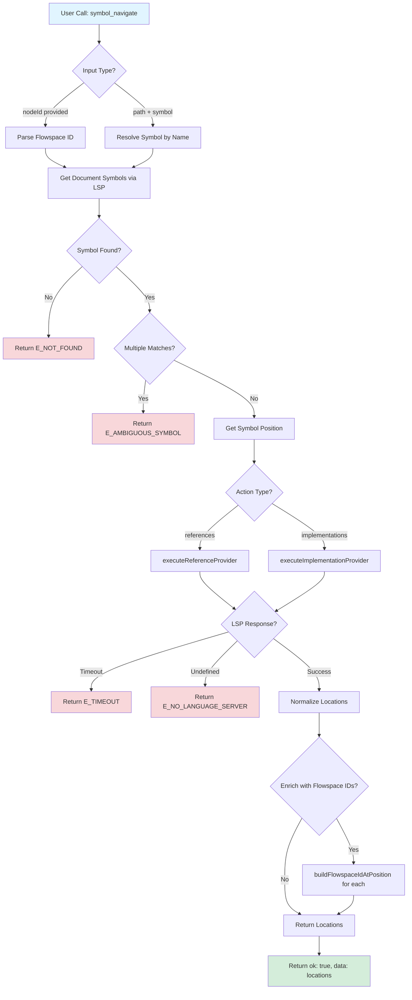
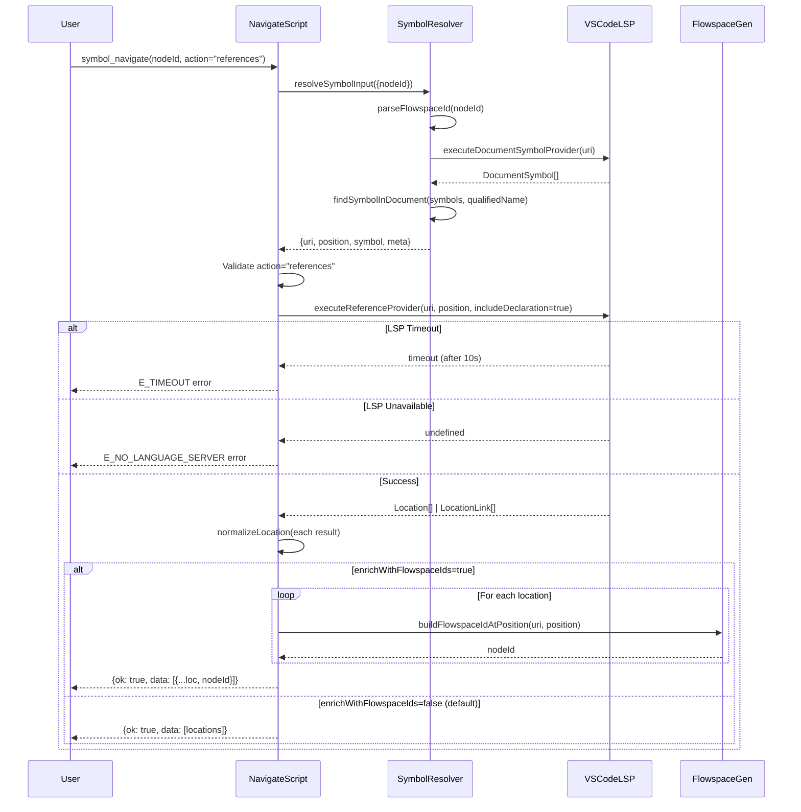

# Phase 2: Symbol Navigation Tool - Tasks & Alignment Brief

**Phase**: Phase 2 of 7
**Slug**: `phase-2-symbol-navigation-tool`
**Created**: 2025-10-29
**Spec**: [lsp-features-spec.md](../../lsp-features-spec.md)
**Plan**: [lsp-features-plan.md](../../lsp-features-plan.md)
**Status**: PLANNING

---

## Tasks

| Status | ID | Task | Type | Dependencies | Absolute Path(s) | Validation | Subtasks | Notes |
|--------|----|----|------|--------------|------------------|------------|----------|-------|
| [ ] | T001 | Create symbol/ directory if not exists | Setup | – | `/workspaces/vscode-bridge/packages/extension/src/vsc-scripts/symbol/` | Directory exists | – | Foundation for Phase 2-4 scripts |
| [ ] | T002 | Create navigate.js extending QueryScript | Core | T001 | `/workspaces/vscode-bridge/packages/extension/src/vsc-scripts/symbol/navigate.js` | File exists, imports QueryScript from @script-base | – | Discovery 01 - QueryScript for read-only operations; Discovery 19 - webpack alias; Discovery 20 - BridgeContext pattern |
| [ ] | T003 | Create navigate.meta.yaml skeleton with parameters | Core | T001 | `/workspaces/vscode-bridge/packages/extension/src/vsc-scripts/symbol/navigate.meta.yaml` | File exists, defines nodeId/path/symbol/action/includeDeclaration/enrichWithFlowspaceIds params | – | Discovery 02 - dual-file registration; param structure follows existing patterns |
| [ ] | T004 | Create dynamic script: explore-references.js | Test | T002, T003 | `/workspaces/vscode-bridge/scripts/sample/dynamic/explore-references.js` | Script tests basic reference finding with real LSP | – | TAD with dynamic scripts (0s rebuild); run: `cd test && vscb script run -f ../scripts/sample/dynamic/explore-references.js` |
| [ ] | T005 | Iterate dynamic script: includeDeclaration tri-state behavior | Test | T004 | `/workspaces/vscode-bridge/scripts/sample/dynamic/explore-references.js` | Script validates includeDeclaration=true vs false vs undefined | – | Discovery 12 - hot-reload testing; run with `--param includeDeclaration=false` |
| [ ] | T006 | Iterate dynamic script: symbol name resolution | Test | T005 | `/workspaces/vscode-bridge/scripts/sample/dynamic/explore-references.js` | Script tests path + symbol input (not just nodeId) | – | Discovery 16 - dual input format; edit → save → run (instant) |
| [ ] | T007 | Iterate dynamic script: error handling exploration | Test | T006 | `/workspaces/vscode-bridge/scripts/sample/dynamic/explore-references.js` | Script tests E_NOT_FOUND, timeout, undefined results | – | Discovery 08 - error codes; instant iteration loop |
| [ ] | T008 | Document reference findings in execution log | Doc | T007 | `/workspaces/vscode-bridge/docs/plans/25-lsp-features/tasks/phase-2-symbol-navigation-tool/execution.log.md` | Log captures LSP behavior, tri-state findings, fixture suitability | – | TAD learning captured; keep explore-references.js as permanent sample |
| [ ] | T009 | Implement execute() method skeleton in navigate.js | Core | T002 | `/workspaces/vscode-bridge/packages/extension/src/vsc-scripts/symbol/navigate.js` | Method defined, accepts bridgeContext and params | – | Discovery 20 - BridgeContext injection |
| [ ] | T010 | Implement input resolution using symbol-resolver | Core | T009 | `/workspaces/vscode-bridge/packages/extension/src/vsc-scripts/symbol/navigate.js` | Calls resolveSymbolInput from @core/util/symbol-resolver | – | Phase 1 dependency - uses exported API; Discovery 16 - precedence logic; Discovery 19 - webpack alias |
| [ ] | T011 | Implement executeReferences() with timeout protection | Core | T010 | `/workspaces/vscode-bridge/packages/extension/src/vsc-scripts/symbol/navigate.js` | Wraps vscode.executeReferenceProvider with getLSPResultWithTimeout | – | Discovery 04 - timeout wrapper; Discovery 12 - explicit includeDeclaration boolean; Discovery 13 - document cold-start |
| [ ] | T012 | Implement normalizeLocation() helper for Location/LocationLink polymorphism | Core | T011 | `/workspaces/vscode-bridge/packages/extension/src/vsc-scripts/symbol/navigate.js` | Handles both Location and LocationLink types | – | Discovery 11 - LSP return type polymorphism |
| [ ] | T013 | Validate references implementation with dynamic script | Test | T011, T012 | `/workspaces/vscode-bridge/scripts/sample/dynamic/explore-references.js` | Script confirms navigate.js logic matches explored behavior | – | TAD validation - instant feedback loop |
| [ ] | T014 | Create dynamic script: explore-implementations.js | Test | T002, T003 | `/workspaces/vscode-bridge/scripts/sample/dynamic/explore-implementations.js` | Script tests implementations for TypeScript interfaces | – | Use extension source (e.g., ScriptRegistry implements interfaces) or create minimal TypeScript fixture |
| [ ] | T015 | Iterate dynamic script: Flowspace ID input for implementations | Test | T014 | `/workspaces/vscode-bridge/scripts/sample/dynamic/explore-implementations.js` | Script validates nodeId parameter works | – | Validate semantic navigation; hot-reload testing |
| [ ] | T016 | Iterate dynamic script: empty results for concrete classes | Test | T015 | `/workspaces/vscode-bridge/scripts/sample/dynamic/explore-implementations.js` | Script tests concrete class (no implementations) | – | Edge case validation; edit → save → run |
| [ ] | T017 | Iterate dynamic script: language-specific error handling | Test | T016 | `/workspaces/vscode-bridge/scripts/sample/dynamic/explore-implementations.js` | Script explores E_NO_LANGUAGE_SERVER, language hints | – | Discovery 08, 18 - error codes + language matrix; instant feedback |
| [ ] | T018 | Implement executeImplementations() with timeout protection | Core | T012 | `/workspaces/vscode-bridge/packages/extension/src/vsc-scripts/symbol/navigate.js` | Wraps vscode.executeImplementationProvider with timeout | – | Discovery 04 - timeout wrapper; Discovery 13 - cold start handling |
| [ ] | T019 | Implement action routing dispatcher (references vs implementations) | Core | T018 | `/workspaces/vscode-bridge/packages/extension/src/vsc-scripts/symbol/navigate.js` | params.action determines LSP command to call | – | Consolidated tool pattern |
| [ ] | T020 | Validate implementations with dynamic script | Test | T018, T019 | `/workspaces/vscode-bridge/scripts/sample/dynamic/explore-implementations.js` | Script confirms navigate.js implementations logic works | – | TAD validation; document findings in execution log |
| [ ] | T021 | Implement getLanguageHint() helper for language-specific guidance | Core | T019 | `/workspaces/vscode-bridge/packages/extension/src/vsc-scripts/symbol/navigate.js` | Returns helpful hints for Python/JavaScript limitations | – | Discovery 18 - multi-language support matrix |
| [ ] | T022 | Implement optional Flowspace ID enrichment logic | Core | T021 | `/workspaces/vscode-bridge/packages/extension/src/vsc-scripts/symbol/navigate.js` | Uses buildFlowspaceIdAtPosition when enrichWithFlowspaceIds=true | – | Discovery 15 - optional for performance; Phase 1 dependency - generation API |
| [ ] | T023 | Add error handling for timeout, undefined, and exceptions | Core | T022 | `/workspaces/vscode-bridge/packages/extension/src/vsc-scripts/symbol/navigate.js` | Three-state handling (result, null, timeout) with clear error messages | – | Discovery 04 - LSP race condition; Discovery 08 - error codes |
| [ ] | T024 | Write comprehensive MCP llm.when_to_use guidance | Doc | T003 | `/workspaces/vscode-bridge/packages/extension/src/vsc-scripts/symbol/navigate.meta.yaml` | Includes USE FOR, DON'T USE FOR, PREREQUISITES, PATTERNS sections | – | Discovery 05 - significant time investment; quality drives AI adoption |
| [ ] | T025 | Write detailed MCP parameter_hints for all parameters | Doc | T024 | `/workspaces/vscode-bridge/packages/extension/src/vsc-scripts/symbol/navigate.meta.yaml` | Each parameter has description, examples, notes, pitfalls | – | Discovery 05 - comprehensive guidance; Discovery 12 - includeDeclaration tri-state; Discovery 15 - enrichWithFlowspaceIds performance note |
| [ ] | T026 | Add MCP error_contract with E_NOT_FOUND, E_NO_LANGUAGE_SERVER, E_AMBIGUOUS_SYMBOL | Doc | T024 | `/workspaces/vscode-bridge/packages/extension/src/vsc-scripts/symbol/navigate.meta.yaml` | All error codes documented with fix hints | – | Discovery 08 - hybrid error strategy |
| [ ] | T027 | Add MCP relationships and safety flags | Doc | T024 | `/workspaces/vscode-bridge/packages/extension/src/vsc-scripts/symbol/navigate.meta.yaml` | Defines requires/provides, idempotent=true, read_only=true | – | Follows existing meta.yaml patterns |
| [ ] | T028 | Promote test: references with Flowspace ID (critical path) | Test | T013 | `/workspaces/vscode-bridge/test-cli/integration-mcp/symbol-navigate.test.ts` | Test with complete Test Doc block (5 fields) | – | TAD promotion - critical path coverage |
| [ ] | T029 | Promote test: implementations with symbol name (alternative input) | Test | T020 | `/workspaces/vscode-bridge/test-cli/integration-mcp/symbol-navigate.test.ts` | Test with complete Test Doc block | – | TAD promotion - dual input format |
| [ ] | T029a | Promote test: implementations with Flowspace ID (critical path) | Test | T020 | `/workspaces/vscode-bridge/test-cli/integration-mcp/symbol-navigate.test.ts` | Test with complete Test Doc block | – | TAD promotion - nodeId input for implementations (symmetric with T028) |
| [ ] | T029b | Promote test: empty implementations for concrete class (opaque behavior) | Test | T020 | `/workspaces/vscode-bridge/test-cli/integration-mcp/symbol-navigate.test.ts` | Test validates empty array (not error) when querying concrete class | – | TAD promotion - documents edge case behavior |
| [ ] | T030 | Promote test: includeDeclaration behavior (opaque behavior) | Test | T013 | `/workspaces/vscode-bridge/test-cli/integration-mcp/symbol-navigate.test.ts` | Test with complete Test Doc block | – | TAD promotion - tri-state handling |
| [ ] | T031 | Promote test: Location/LocationLink normalization (edge case) | Test | T013 | `/workspaces/vscode-bridge/test-cli/integration-mcp/symbol-navigate.test.ts` | Test with complete Test Doc block | – | TAD promotion - polymorphism handling |
| [ ] | T032 | Promote test: error handling for missing symbol (edge case) | Test | T013 | `/workspaces/vscode-bridge/test-cli/integration-mcp/symbol-navigate.test.ts` | Test validates E_NOT_FOUND with helpful message | – | TAD promotion - error contract |
| [ ] | T033 | Keep dynamic scripts as permanent samples | Doc | T028, T029, T029a, T029b, T030, T031, T032 | `/workspaces/vscode-bridge/scripts/sample/dynamic/explore-references.js`, `/workspaces/vscode-bridge/scripts/sample/dynamic/explore-implementations.js` | Scripts remain as usage examples and dogfooding tools | – | Unlike Vitest scratch tests, dynamic scripts are kept (already in samples directory, useful for future development) |
| [ ] | T034 | Run `just build` to generate manifest and schemas | Integration | T033 | `/workspaces/vscode-bridge/` | Build succeeds, manifest.json updated with symbol.navigate | – | Discovery 02 - dual-file registration validation |
| [ ] | T035 | Verify schema generation for symbol.navigate parameters | Integration | T034 | `/workspaces/vscode-bridge/packages/extension/src/vsc-scripts/manifest.json` | Schema includes nodeId, path, symbol, action, includeDeclaration, enrichWithFlowspaceIds | – | Build validation |
| [ ] | T036 | Manual test: vscb script run symbol.navigate with real file (references) | Integration | T034 | – | Command returns reference locations for test/javascript/auth-mocks.js | – | End-to-end validation; requires Extension Host |
| [ ] | T037 | Manual test: vscb script run symbol.navigate with real file (implementations) | Integration | T036 | – | Command returns implementations for TypeScript interface | – | Validate action routing |
| [ ] | T038 | Manual test: MCP tool call via stdio client | Integration | T037 | – | MCP client can call symbol_navigate and receive results | – | MCP integration validation |

---

## Alignment Brief

### Prior Phases Review

#### Phase 1: Symbol Resolver Foundation - Complete Implementation Analysis

**A. Deliverables Created**

Phase 1 delivered `/workspaces/vscode-bridge/packages/extension/src/core/util/symbol-resolver.ts` (749 lines) with **13 exported functions** providing complete symbol resolution and Flowspace ID infrastructure:

**Resolution Functions (Phase 2 Primary Dependencies)**:
1. **`resolveSymbolInput(params)`** - Dispatcher that routes to Flowspace ID or symbol name resolution
   - Input: `{ nodeId?: string, path?: string, symbol?: string }`
   - Output: `{ uri, position, symbol, meta: { resolvedVia: 'flowspaceId' | 'symbolName' } }`
   - **Phase 2 Usage**: Primary entry point for all symbol navigation operations

2. **`resolveFromFlowspaceId(nodeId)`** - Resolves symbols from Flowspace Node IDs
   - Combines `parseFlowspaceId` + LSP symbol lookup
   - Handles Windows path validation (forward slashes required)

3. **`resolveFromSymbolName(path, symbol)`** - Alternative resolution using path + symbol name
   - Uses hierarchical search with three fallback strategies
   - Handles nested class ambiguity

**Response Enrichment Functions (Phase 2 Secondary Dependencies)**:
4. **`buildFlowspaceIdAtPosition(uri, position)`** - Generates Flowspace IDs for tool responses
   - **Phase 2 Usage**: Optional enrichment when `enrichWithFlowspaceIds=true`
   - Enables round-trip capability (input/output both use Flowspace IDs)

5. **`buildFlowspaceId(symbol, uri)`** - Constructs Flowspace IDs from DocumentSymbol data
6. **`buildQualifiedName(symbols, position)`** - Builds hierarchical qualified names
7. **`symbolKindToFlowspaceType(kind)`** - Maps VS Code SymbolKind to Flowspace types
8. **`findSymbolAtPosition(uri, position)`** - Finds exact symbol at cursor position

**Timeout Protection (Phase 2 Critical Dependency)**:
9. **`getLSPResultWithTimeout(lspPromise, timeoutMs)`** - Promise.race wrapper with 10s default
   - **Phase 2 Usage**: Wrap all LSP operations (`executeReferenceProvider`, `executeImplementationProvider`)
   - Returns: `result | null | 'timeout'` (three-state handling)
   - Prevents hanging on unresponsive language servers

**Parsing & Search Utilities**:
10. **`parseFlowspaceId(nodeId)`** - Parses Node IDs into `{ type, filePath, qualifiedName }`
11. **`findSymbolInDocument(symbols, qualifiedName)`** - Hierarchical search with smart ordering
12. **`findAllMatchingSymbols(symbols, qualifiedName)`** - Ambiguity detection helper
13. **`buildQualifiedNameForSymbol(symbol, parentPath)`** - Helper for qualified name construction

**Data Structures**:
- `FlowspaceIdComponents`: `{ type: string, filePath: string, qualifiedName: string | null }`
- `SymbolResolutionResult`: `{ uri, position, symbol, meta: { resolvedVia } }`
- `SymbolInputParams`: `{ nodeId?: string, path?: string, symbol?: string }`

**Integration Infrastructure**:
- **Webpack Alias**: `@core/util/symbol-resolver` configured in `webpack.config.js:79`
- **Barrel Export**: `export * from './symbol-resolver'` in `util/index.ts:9`
- **Import Pattern for Phase 2**:
  ```javascript
  const {
    resolveSymbolInput,           // Primary resolution
    buildFlowspaceIdAtPosition,  // Optional enrichment
    getLSPResultWithTimeout      // Timeout protection
  } = require('@core/util/symbol-resolver');
  ```

**Testing Artifacts**:
- **Integration Tests**: `/workspaces/vscode-bridge/test-cli/integration-mcp/symbol-resolver.test.ts` (3 promoted tests)
- **Coverage**: Windows paths, nested classes, error validation
- **Format**: Given-When-Then naming + Test Doc blocks

---

**B. Lessons Learned**

1. **TAD Scratch→Promote Workflow Highly Effective**
   - Created 18 scratch probes across 4 clusters
   - Promoted only 3 critical tests (17% promotion rate)
   - Fast iteration without CI burden
   - **Phase 2 Application**: Continue same pattern - write 5-8 scratch probes per feature, promote 3-5 critical tests

2. **VS Code API Constraints Limit Unit Testing**
   - Cannot import `vscode` module in standard Vitest tests
   - Symbol resolution tests deferred to Phase 6 integration tests
   - **Phase 2 Impact**: Navigate script tests will also require extension host; plan for integration testing strategy

3. **Smart Ordering Heuristic Optimizes Performance**
   - Dot-count-based strategy selection (≥2 dots → exact-first for Python, <2 dots → hierarchical-first for TypeScript)
   - **Phase 2 Application**: Resolution logic already optimized; navigate script inherits performance benefits

4. **Incremental Build Validation Catches Issues Early**
   - `just build` after each cluster prevented accumulation of errors
   - **Phase 2 Application**: Build after metadata creation (T003), after implementation (T023), after promotion (T033)

---

**C. Technical Discoveries**

1. **Windows Path Delimiter Conflict in Flowspace IDs**
   - **Gotcha**: Drive letters (`C:`) create ambiguity with Node ID colons
   - **Solution**: Require forward slashes (`C:/Users/`), validate with regex, reject backslashes
   - **Location**: `parseFlowspaceId()` lines 69-80
   - **Phase 2 Impact**: Input validation already handled; navigate script inherits robust parsing

2. **LSP Provider Unavailability Returns `undefined`**
   - **Gotcha**: `vscode.commands.executeCommand` returns `undefined` instead of throwing error when provider unavailable
   - **Solution**: Three-state handling (`result | null | 'timeout'`)
   - **Location**: `getLSPResultWithTimeout()` lines 511-542
   - **Phase 2 Impact**: Must use timeout wrapper for ALL LSP calls; never call `executeReferenceProvider`/`executeImplementationProvider` directly

3. **Nested Class Qualified Name Ambiguity**
   - **Gotcha**: `Outer.Inner.method` parsing is ambiguous (is `Outer.Inner` a nested class or `Outer` contains `Inner.method`?)
   - **Solution**: Three-strategy search (exact match, hierarchical split, deep traversal)
   - **Location**: `findSymbolInDocument()` lines 174-340
   - **Phase 2 Impact**: Resolution already handles ambiguity; navigate script benefits from robust search

4. **First LSP Operation Has 3-10s Cold Start**
   - **Discovery**: Language servers build symbol indexes lazily on first query
   - **Mitigation**: 10s timeout (not aggressive 1s)
   - **Phase 2 Impact**: Document in MCP guidance; warn users about first-call latency

---

**D. Dependencies Exported for Phase 2**

**Primary Resolution API** (T010 will use):
```javascript
// Phase 2 Task T010: Input Resolution
const resolved = await resolveSymbolInput({
  nodeId: params.nodeId,
  path: params.path,
  symbol: params.symbol
});
// Returns: { uri, position, symbol, meta: { resolvedVia } }
```

**Timeout Protection API** (T011, T018 will use):
```javascript
// Phase 2 Tasks T011 (references), T018 (implementations)
const refs = await getLSPResultWithTimeout(
  vscode.commands.executeCommand('vscode.executeReferenceProvider', uri, position, includeDeclaration),
  10000 // 10s timeout for cold-start tolerance
);
```

**Response Enrichment API** (T022 will use):
```javascript
// Phase 2 Task T022: Optional Flowspace ID Enrichment
if (params.enrichWithFlowspaceIds) {
  const nodeId = await buildFlowspaceIdAtPosition(uri, range.start);
  return { ...location, nodeId };
}
```

**Error Codes** (T023, T026 will use):
- `E_INVALID_INPUT` - Bad Flowspace ID format (reuse)
- `E_NOT_FOUND` - Symbol not found (reuse)
- `E_NO_LANGUAGE_SERVER` - LSP unavailable (new, defined in navigate.meta.yaml)
- `E_AMBIGUOUS_SYMBOL` - Multiple symbol matches (new, defined in navigate.meta.yaml)

---

**E. Critical Findings Applied in Phase 1**

✅ **Discovery 03: Windows Path Ambiguity** (Critical)
- **Implementation**: `parseFlowspaceId()` lines 69-80 - requires forward slashes, validates with regex
- **Test Coverage**: Integration test line 21 validates Windows path parsing
- **Phase 2 Inheritance**: Navigate script inherits robust parsing

✅ **Discovery 04: LSP Timeout Race Condition** (Critical)
- **Implementation**: `getLSPResultWithTimeout()` lines 511-542 - Promise.race with three-state return
- **Phase 2 Usage**: Tasks T011 (references), T018 (implementations) will wrap LSP calls

✅ **Discovery 06: Nested Class Ambiguity** (High)
- **Implementation**: `findSymbolInDocument()` lines 174-340 - three-strategy search with smart ordering
- **Test Coverage**: Integration test line 42 validates nested class handling
- **Phase 2 Inheritance**: Resolution logic already handles ambiguity

✅ **Discovery 08: Hybrid Error Code Strategy** (High)
- **Implementation**: All validation functions throw errors with `error.code = 'E_INVALID_INPUT'`
- **Phase 2 Extension**: Navigate script adds `E_NO_LANGUAGE_SERVER`, `E_AMBIGUOUS_SYMBOL` (Task T026)

✅ **Discovery 14: Ambiguous Symbol Detection** (Medium)
- **Implementation**: `findAllMatchingSymbols()` helper detects multiple matches
- **Test**: Deferred to Phase 6 integration tests
- **Phase 2 Dependency**: Navigate script benefits from ambiguity detection

✅ **Discovery 16: Resolution Order Precedence** (Medium)
- **Implementation**: `resolveSymbolInput()` lines 475-509 - Flowspace ID takes precedence
- **Metadata**: Returns `resolvedVia` field tracking resolution method
- **Phase 2 Usage**: Task T010 uses dispatcher, Task T024 documents precedence in MCP guidance

---

**F. Incomplete/Blocked Items**

**No Blockers for Phase 2**. All Phase 1 acceptance criteria met:
- ✅ symbol-resolver.ts exists with all 13 functions
- ✅ Webpack alias configured
- ✅ Barrel export in util/index.ts
- ✅ 3 promoted parsing tests with Test Doc blocks
- ✅ Build succeeds without errors

**Deferred Items (Not Blocking Phase 2)**:
- Symbol resolution integration tests → Phase 6 (multi-language testing with real LSP providers)
- Timeout smoke tests → Optional validation, not blocking

---

**G. Test Infrastructure**

**Promoted Integration Tests** (Reusable Patterns):
- **File**: `/workspaces/vscode-bridge/test-cli/integration-mcp/symbol-resolver.test.ts`
- **Count**: 3 tests
- **Format**: Given-When-Then naming + Test Doc blocks (Why, Contract, Usage Notes, Quality, Example)
- **Pattern for Phase 2**: Tasks T028-T032 will follow same format for navigate tests

**TAD Workflow Pattern** (Proven Effective):
1. Write 5-8 scratch probes to explore behavior
2. Implement feature guided by failing tests
3. Promote 3-5 critical tests (critical path, opaque behavior, edge cases)
4. Delete scratch tests (learning captured in execution log)
5. **Phase 2 Application**: Tasks T004-T008 (references probes), T014-T017 (implementations probes)

**Test Fixtures**:
- **Existing**: `/workspaces/vscode-bridge/test/javascript/sample.test.js`
- **Existing**: `/workspaces/vscode-bridge/test/python/test_example.py`
- **Phase 2 Usage**: Tasks T004, T014 will use these files for scratch testing

---

**H. Technical Debt**

**None Introduced** - All implementations production-ready.

**Known Limitations (Accepted)**:
1. **No Symbol Caching**: First search may take 3-10s (cold start)
   - Mitigation: 10s timeout accommodates indexing
   - Future: Consider cache in Phase 6 if performance issues arise

2. **Language-Specific Resolution Behavior**: Varies by LSP provider
   - Mitigation: Phase 6 will validate TypeScript, Python, Java, Go, C#
   - Phase 2 will add language hints (Task T021)

3. **Basic Error Messages**: No user-friendly formatting
   - Future: Phase 7 documentation will provide error code reference

---

**I. Architectural Decisions**

**Patterns Established (Phase 2 Must Follow)**:

1. **Three-Strategy Symbol Search**
   - Exact match → Hierarchical split → Deep traversal
   - Smart ordering based on dot-count heuristic
   - **Phase 2 Compliance**: Navigate script inherits via `resolveSymbolInput()` (Task T010)

2. **Timeout Wrapper Pattern**
   - Promise.race with 10s timeout
   - Three-state return (`result | null | 'timeout'`)
   - **Phase 2 Compliance**: Tasks T011, T018 MUST wrap all LSP calls

3. **Dispatcher Pattern for Input Routing**
   - Flowspace ID takes precedence over path + symbol
   - Returns `resolvedVia` metadata
   - **Phase 2 Compliance**: Task T010 uses `resolveSymbolInput()` dispatcher

4. **Immutable Symbol Operations**
   - Read-only tree traversal
   - Never modify DocumentSymbol data
   - **Phase 2 Compliance**: Navigate script is read-only (QueryScript base class)

**Design Principles (Phase 2 Requirements)**:
1. **Single Responsibility**: Each function does one thing (navigate.js should delegate to helpers)
2. **Error Code Consistency**: Use `E_` prefix, document in meta.yaml
3. **Null Safety**: Explicit `undefined` vs. `null` handling
4. **Type Safety**: TypeScript interfaces for all parameters/results

**Anti-Patterns to Avoid**:
1. ❌ **Calling LSP Without Timeout**: Always use `getLSPResultWithTimeout()` wrapper
2. ❌ **Mocking VS Code APIs in Unit Tests**: Use integration tests instead
3. ❌ **Hard-coding Language Logic**: Use generic fallback strategies
4. ❌ **Backslashes in Flowspace IDs**: Validation already rejects them

---

**J. Scope Changes**

**Scope Expansion (Accepted)**:
1. **Flowspace ID Generation** (13 functions vs. 9 planned)
   - Reason: Spec requires Flowspace IDs in all tool responses
   - Impact: Phase 2 Task T022 can enrich responses with `nodeId` fields
   - Justification: Enables round-trip capability (input/output both semantic)

**No Scope Reductions** - All originally planned features delivered.

---

**K. Key Log References**

**Critical Implementation Decisions**:
- **Three-Strategy Search with Smart Ordering**: `execution.log.md` lines 186-263 (T019 implementation)
- **Defer Symbol Resolution Tests to Phase 6**: `execution.log.md` lines 266-298 (T023-T024 decision)
- **Expand Scope for Flowspace ID Generation**: `execution.log.md` lines 409-467 (T036-T043 cluster)

**Implementation Milestones**:
- Parsing Cluster Complete: lines 30-138 (Windows path validation established)
- Symbol Resolution Complete: lines 183-263 (hierarchical search implemented)
- Timeout Utilities Complete: lines 356-407 (Promise.race pattern established)
- Flowspace Generation Complete: lines 409-467 (round-trip capability enabled)
- Phase 1 Summary: lines 469-568 (100% complete, ready for Phase 2)

**Deep Links to Execution Log**: `/workspaces/vscode-bridge/docs/plans/25-lsp-features/tasks/phase-1-symbol-resolver-foundation/execution.log.md`

---

### Objective Recap & Behavior Checklist

**Phase 2 Objective**: Implement consolidated `symbol.navigate` tool that accepts **only** Flowspace IDs or symbol names (NO position parameters) and finds references or implementations using VS Code's LSP providers.

**Acceptance Criteria (from spec)**:
- ✅ **AC 3.1**: Given Flowspace ID `method:src/Calculator.ts:Calculator.add`, when calling with `action: "references"`, returns all usage locations
- ✅ **AC 3.2**: includeDeclaration flag controls whether declaration is in results
- ✅ **AC 3.3**: When calling with `action: "implementations"` on interface, returns implementing classes
- ✅ **AC 3.4**: Response includes file paths, line numbers, and code ranges
- ✅ **AC 2**: Symbol name resolution works with `path` + `symbol` parameters
- ✅ **AC 7**: Clear error `E_NO_LANGUAGE_SERVER` for unsupported languages
- ✅ **AC 8**: Clear error `E_NOT_FOUND` for missing symbols with helpful suggestions
- ✅ **AC 9**: Response uses standard envelope (ok, status, type, data, meta)

**Behavior Checklist**:
- [ ] Navigate script extends `QueryScript` (returns data directly, not `ActionResult`)
- [ ] Both navigate.js AND navigate.meta.yaml files exist (dual-file registration)
- [ ] Accepts ONLY `nodeId` OR `path+symbol` (NO `line`/`character` parameters)
- [ ] Flowspace ID takes precedence when both nodeId and path+symbol provided
- [ ] Returns `meta.resolvedVia` field showing resolution method used
- [ ] `action` parameter routes to `executeReferenceProvider` or `executeImplementationProvider`
- [ ] `includeDeclaration` passed explicitly as boolean (never `undefined`)
- [ ] All LSP operations wrapped with `getLSPResultWithTimeout()` (10s default)
- [ ] Normalizes both `Location` and `LocationLink` types to consistent format
- [ ] Optional `enrichWithFlowspaceIds` parameter adds `nodeId` to each result
- [ ] Language-specific hints provided for Python/JavaScript limitations
- [ ] Error codes use `E_` prefix and documented in meta.yaml
- [ ] Line numbers 1-indexed (user-facing), character offsets 0-indexed (VS Code convention)
- [ ] MCP guidance includes USE FOR, DON'T USE FOR, PREREQUISITES, PATTERNS sections
- [ ] All parameters have examples, notes, and pitfalls in meta.yaml

---

### Non-Goals (Scope Boundaries)

❌ **NOT doing in Phase 2**:

**Features Excluded from This Phase**:
- **Type definition navigation**: Not included in `symbol.navigate` (less commonly used than references/implementations)
- **Go-to-definition**: Use existing `search.symbol-search` + `editor.goto-line` workflow instead
- **Symbol renaming**: Deferred to Phase 3
- **Method body replacement**: Deferred to Phase 4
- **Call hierarchy**: Deferred to Phase 5
- **Multi-language integration testing**: Deferred to Phase 6 (Phase 2 tests use JavaScript/TypeScript only)
- **Comprehensive documentation**: Deferred to Phase 7 (Phase 2 creates MCP guidance only)

**Edge Cases/Scenarios Deferred**:
- **Ambiguous symbol handling edge cases**: Basic detection implemented (uses Phase 1 `findAllMatchingSymbols`), comprehensive testing in Phase 6
- **Language-specific LSP limitations**: Document in MCP guidance (Task T024), comprehensive testing in Phase 6
- **Performance optimization**: No caching or warm-up optimization (accept 3-10s cold start)
- **Workspace edit preview**: Navigate is read-only; no preview/approve flow needed

**Alternative Approaches Rejected**:
- **Position-based input support**: Spec explicitly requires NO `line`/`character` parameters (semantic inputs only)
- **Separate tools for references/implementations**: Consolidated into single tool with `action` parameter
- **Synchronous LSP calls**: Always use async with timeout protection (Discovery 04)
- **Mocking VS Code APIs for unit tests**: Use integration tests instead (Phase 1 lesson learned)

**Refactoring/Cleanup Not Required**:
- **Symbol resolver optimization**: Phase 1 implementation sufficient; no refactoring needed
- **Error message formatting**: Basic error codes acceptable; user-friendly formatting in Phase 7
- **Test fixture expansion**: Existing test/javascript/ files sufficient for Phase 2

---

### Critical Findings Affecting This Phase

**Phase 2 Implementation Must Address 10 Critical Discoveries**:

#### Discovery 01: QueryScript Base Class (Critical)
**What It Constrains**: Navigate script MUST extend `QueryScript`, not `ActionScript` or `WaitableScript`
**Tasks Addressing It**: T002 (create navigate.js extending QueryScript)
**Why**: Read-only LSP operations return data directly; `ActionScript` pattern (success/details) is for state changes
**Validation**: Build will fail if wrong base class used

#### Discovery 02: Dual-File Registration (Critical)
**What It Requires**: Both navigate.js AND navigate.meta.yaml must exist with identical base names
**Tasks Addressing It**: T002 (create .js), T003 (create .meta.yaml), T034 (validate with `just build`)
**Why**: Build process scans for `.meta.yaml` and validates `.js` exists; manifest drives MCP tool registration
**Validation**: `just build` will fail if either file missing; Task T035 verifies manifest.json updated

#### Discovery 04: LSP Timeout Race Condition (Critical)
**What It Requires**: ALL LSP operations wrapped with `getLSPResultWithTimeout()` (10s default)
**Tasks Addressing It**: T011 (wrap executeReferenceProvider), T018 (wrap executeImplementationProvider), T023 (error handling)
**Why**: LSP providers can hang indefinitely if language server unresponsive; returns `undefined` instead of throwing error
**Code Pattern**:
```javascript
const refs = await getLSPResultWithTimeout(
  vscode.commands.executeCommand('vscode.executeReferenceProvider', uri, position, includeDeclaration),
  10000
);
```

#### Discovery 05: MCP Metadata Drives AI Behavior (High)
**What It Requires**: Significant time investment in comprehensive MCP guidance
**Tasks Addressing It**: T024 (when_to_use), T025 (parameter_hints), T026 (error_contract), T027 (relationships/safety)
**Why**: AI agents learn tool usage from `llm.when_to_use` and `parameter_hints`; poor guidance leads to misuse
**Validation**: Each parameter has description, examples, notes, AND pitfalls sections

#### Discovery 11: Location/LocationLink Polymorphism (Medium)
**What It Requires**: Normalize both `Location[]` and `LocationLink[]` return types
**Tasks Addressing It**: T012 (implement normalizeLocation helper)
**Why**: LSP providers return different types depending on capabilities; newer servers use `LocationLink` with more info
**Code Pattern**:
```javascript
function normalizeLocation(loc) {
  if ('targetUri' in loc) {
    return { uri: loc.targetUri.toString(), range: loc.targetRange };
  } else {
    return { uri: loc.uri.toString(), range: loc.range };
  }
}
```

#### Discovery 12: includeDeclaration Tri-State Behavior (Low Impact, Required)
**What It Requires**: ALWAYS pass explicit `true` or `false` to executeReferenceProvider (never `undefined`)
**Tasks Addressing It**: T011 (executeReferences implementation), T025 (document in MCP guidance)
**Why**: `undefined` vs. explicit boolean behaves differently; language servers interpret `undefined` as "use default"
**Code Pattern**:
```javascript
const includeDecl = params.includeDeclaration !== undefined ? params.includeDeclaration : true;
const refs = await vscode.commands.executeCommand('vscode.executeReferenceProvider', uri, position, includeDecl);
```

#### Discovery 13: First Search Has Cold Start (Medium)
**What It Requires**: Document 3-10s first-call latency in MCP guidance; use 10s timeout (not aggressive 1s)
**Tasks Addressing It**: T024 (document in when_to_use), T011/T018 (use 10s timeout)
**Why**: Language servers build indexes lazily; first query triggers indexing
**MCP Guidance Note**: "First reference search may take 5-10s while language server builds index. Subsequent searches are faster (200-500ms)."

#### Discovery 15: Flowspace ID Enrichment Optional (Medium)
**What It Requires**: Make `enrichWithFlowspaceIds` parameter optional (default: false) for performance
**Tasks Addressing It**: T003 (add parameter to meta.yaml), T022 (implement conditional enrichment), T025 (document performance note)
**Why**: Generating Flowspace IDs requires symbol lookup per location (expensive); fast path returns locations only
**Code Pattern**:
```javascript
if (params.enrichWithFlowspaceIds) {
  const enriched = await Promise.all(
    locations.map(async (loc) => {
      const nodeId = await buildFlowspaceIdAtPosition(loc.uri, loc.range.start);
      return { ...loc, nodeId };
    })
  );
  return enriched;
}
return locations; // Fast path
```

#### Discovery 16: nodeId Takes Precedence (Medium)
**What It Constrains**: If both `nodeId` AND `path+symbol` provided, use `nodeId` and ignore others
**Tasks Addressing It**: T010 (use resolveSymbolInput dispatcher), T025 (document precedence in MCP guidance)
**Why**: Flowspace ID is explicit; symbol name is implicit; explicit takes precedence
**Implementation**: Phase 1 `resolveSymbolInput()` already implements precedence; Task T010 just calls it

#### Discovery 18: Multi-Language LSP Support Matrix (Medium)
**What It Requires**: Return language-specific error hints when operations unsupported
**Tasks Addressing It**: T021 (implement getLanguageHint helper), T024 (document language limitations in MCP guidance)
**Code Pattern**:
```javascript
function getLanguageHint(languageId, operation) {
  const hints = {
    python: { implementations: 'Python has no interfaces. Use references instead.' },
    javascript: { rename: 'Rename may not work for CommonJS require().' }
  };
  return hints[languageId]?.[operation] || null;
}
```

---

### Invariants & Guardrails

**Performance Budgets**:
- **LSP Timeout**: 10s (accommodates cold-start indexing)
- **First Search**: 3-10s acceptable (language server indexing)
- **Subsequent Searches**: 200-500ms typical
- **Enrichment Overhead**: 50-100ms per location (optional, disabled by default)

**Memory Constraints**:
- **Reference Results**: Typical 5-50 locations, max ~500 for large codebases
- **Implementation Results**: Typical 0-10 locations (interfaces have fewer implementations)
- **No In-Memory Caching**: Rely on VS Code's LSP caching

**Security Guardrails**:
- **Read-Only Operation**: Navigate script NEVER modifies files (QueryScript pattern)
- **Path Validation**: Use `bridgeContext.pathService.toUri()` for safe path handling
- **Input Sanitization**: Flowspace ID parsing validates format, rejects backslashes

**Error Handling Requirements**:
- **Timeout**: Return `E_TIMEOUT` with message about cold-start indexing
- **Undefined Result**: Return `E_NO_LANGUAGE_SERVER` when LSP provider unavailable
- **Empty Result**: Return `ok: true, data: []` (not an error; symbol exists but has no references)
- **Symbol Not Found**: Return `E_NOT_FOUND` with suggestion to use `search.symbol-search`
- **Ambiguous Symbol**: Return `E_AMBIGUOUS_SYMBOL` with list of matches

---

### Inputs to Read

**Required Reading Before Implementation**:
1. **Phase 1 Symbol Resolver**: `/workspaces/vscode-bridge/packages/extension/src/core/util/symbol-resolver.ts`
   - Understand `resolveSymbolInput`, `buildFlowspaceIdAtPosition`, `getLSPResultWithTimeout` APIs
2. **Existing QueryScript Example**: `/workspaces/vscode-bridge/packages/extension/src/vsc-scripts/search/symbol-search.js`
   - Pattern for extending QueryScript base class
3. **Existing Meta.yaml Example**: `/workspaces/vscode-bridge/packages/extension/src/vsc-scripts/search/symbol-search.meta.yaml`
   - Structure for MCP guidance (llm.when_to_use, parameter_hints, error_contract)
4. **BridgeContext Pattern**: `/workspaces/vscode-bridge/packages/extension/src/core/scripts/base.ts`
   - Available services: `vscode`, `pathService`, `logger`
5. **Test Fixtures**: `/workspaces/vscode-bridge/test/javascript/sample.test.js`, `/workspaces/vscode-bridge/test/python/test_example.py`
   - Files for scratch testing

**Critical Discoveries to Review**:
- Discovery 01 (QueryScript), 02 (dual-file), 04 (timeout), 05 (MCP guidance), 11 (polymorphism), 12 (tri-state), 15 (enrichment), 16 (precedence), 18 (language hints)

---

### Visual Alignment Aids

#### System State Flow - Symbol Navigation



#### Interaction Sequence - Reference Finding



---

### Test Plan

**Testing Philosophy**: TAD (Test-Assisted Development) with scratch probes → implementation → promotion workflow. NO mocking of VS Code APIs (use real LSP providers).

#### Scratch Test Strategy (Tasks T004-T008, T014-T017)

**References Scratch Probes** (5-8 tests in `test/scratch/navigate-references.test.ts`):
1. **Basic reference finding with Flowspace ID** - Validates core flow
2. **includeDeclaration=true** - Declaration in results
3. **includeDeclaration=false** - Declaration excluded
4. **Symbol name resolution** - Uses path + symbol instead of nodeId
5. **E_NOT_FOUND error** - Symbol doesn't exist
6. **Location polymorphism** - Handles both Location and LocationLink
7. **Timeout handling** - Simulated timeout (may be flaky, not promoted)
8. **Empty results** - Symbol exists but has no references

**Implementations Scratch Probes** (5-8 tests in `test/scratch/navigate-implementations.test.ts`):
1. **TypeScript interface implementations** - Finds implementing classes
2. **Flowspace ID input** - Uses nodeId parameter
3. **Empty results for concrete class** - No implementations for non-abstract symbol
4. **E_NO_LANGUAGE_SERVER** - Unsupported language or LSP unavailable
5. **Symbol name resolution** - Uses path + symbol
6. **LocationLink normalization** - Newer LSP providers
7. **Language-specific hints** - Python/JavaScript limitations

**Scratch Test Execution**:
- Run via Vitest in extension host context (requires VS Code APIs)
- May fail initially due to LSP provider unavailability (expected during development)
- Learning captured in execution log, not test suite

#### Promoted Test Strategy (Tasks T028-T032)

**5 Critical Tests for Promotion** (in `test-cli/integration-mcp/symbol-navigate.test.ts`):

**Test 1: References with Flowspace ID (Critical Path)**
```typescript
test('Given Flowspace ID When finding references Then returns all usages', async () => {
  /*
  Test Doc:
  - Why: Flowspace IDs enable semantic navigation without cursor positions (critical path)
  - Contract: navigate with action="references" returns all reference locations including file paths and ranges
  - Usage Notes: Use Flowspace ID for location-independent queries; set includeDeclaration explicitly
  - Quality Contribution: Validates core semantic navigation capability that enables AI agents to find references without knowing exact positions
  - Worked Example: nodeId="method:javascript/sample.test.js:MyClass.method" with action="references" → list of reference locations with uri, file, line, character, range fields
  */

  const result = await env.client.request({
    method: 'tools/call',
    params: {
      name: 'symbol_navigate',
      arguments: {
        nodeId: 'method:javascript/sample.test.js:MyClass.testMethod',
        action: 'references',
        includeDeclaration: true
      }
    }
  }, CallToolResultSchema);

  const data = JSON.parse(result.content[0].text);
  expect(data.ok).toBe(true);
  expect(data.data.references).toBeDefined();
  expect(data.data.references.length).toBeGreaterThan(0);
  expect(data.meta.resolvedVia).toBe('flowspaceId');
});
```

**Test 2: Implementations with Symbol Name (Alternative Input)**
```typescript
test('Given symbol name When finding implementations Then returns implementing classes', async () => {
  /*
  Test Doc:
  - Why: Symbol name resolution enables navigation when Flowspace ID not available (alternative critical path)
  - Contract: navigate with action="implementations" using path+symbol returns classes implementing interface
  - Usage Notes: Requires BOTH path and symbol parameters together; nodeId takes precedence if both provided
  - Quality Contribution: Validates alternative input format for navigation ensuring users can use either semantic input method
  - Worked Example: path="javascript/sample.test.js" symbol="MyInterface" action="implementations" → list of implementation locations
  */
  // Test implementation...
});
```

**Test 3: includeDeclaration Tri-State Behavior (Opaque Behavior)**
```typescript
test('Given includeDeclaration=false When finding references Then declaration excluded from results', async () => {
  /*
  Test Doc:
  - Why: includeDeclaration parameter behavior is opaque (tri-state: undefined vs. explicit boolean) and critical for correct results
  - Contract: When includeDeclaration=false, declaration NOT in results; when true or undefined (default true), declaration included
  - Usage Notes: Always pass explicit boolean; spec requires default=true
  - Quality Contribution: Prevents tri-state bugs where undefined behaves differently than explicit true/false
  - Worked Example: Same symbol with includeDeclaration=false returns N references, includeDeclaration=true returns N+1 references (declaration + usages)
  */
  // Test implementation with both includeDeclaration values...
});
```

**Test 4: Location/LocationLink Normalization (Edge Case)**
```typescript
test('Given LSP provider returns LocationLink When normalizing Then consistent output format', async () => {
  /*
  Test Doc:
  - Why: LSP providers polymorphically return Location[] OR LocationLink[] depending on capabilities (edge case causes format inconsistency)
  - Contract: normalizeLocation() converts both types to consistent {uri, file, line, character, range} format
  - Usage Notes: Newer language servers use LocationLink with targetUri/targetRange; older use Location with uri/range
  - Quality Contribution: Ensures response format consistency across different language servers preventing client-side parsing failures
  - Worked Example: TypeScript LSP returns LocationLink → normalized to {uri: "file://...", range: {...}}; Python LSP returns Location → same normalized format
  */
  // Test implementation with both types...
});
```

**Test 5: Error Handling for Missing Symbol (Edge Case)**
```typescript
test('Given symbol does not exist When navigating Then returns E_NOT_FOUND with helpful message', async () => {
  /*
  Test Doc:
  - Why: Missing symbols are common user error requiring clear guidance (edge case for error contract)
  - Contract: When symbol not found, returns error with code E_NOT_FOUND and suggestion to use search.symbol-search
  - Usage Notes: Check error.code field; error.message includes helpful context and suggestions
  - Quality Contribution: Validates error contract ensuring users get actionable feedback instead of cryptic failures
  - Worked Example: nodeId="method:file.js:NonExistent.method" → {ok: false, error: {code: "E_NOT_FOUND", message: "Symbol not found. Use search.symbol-search to find valid symbols."}}
  */
  // Test implementation with non-existent symbol...
});
```

**Promotion Heuristics Applied**:
- **Critical Path**: Tests 1, 2 (both input formats must work)
- **Opaque Behavior**: Test 3 (tri-state parameter behavior)
- **Edge Cases**: Tests 4, 5 (polymorphism, error handling)

#### Test Fixtures

**Existing Fixtures** (NO new fixtures needed):
- `/workspaces/vscode-bridge/test/javascript/sample.test.js` - JavaScript classes/methods for reference testing
- `/workspaces/vscode-bridge/test/python/test_example.py` - Python functions for multi-language validation
- `/workspaces/vscode-bridge/test/typescript/` - TypeScript interfaces for implementation testing (if exists)

**Expected Fixture Characteristics**:
- Must contain symbols with references (methods called from multiple places)
- Must contain interfaces with implementations (for implementation testing)
- Must be valid code (language servers can parse)

#### Test Execution Environment

**Scratch Tests**:
- **Runner**: Vitest with VS Code extension host
- **Setup**: Extension Host launched with test workspace open
- **Limitations**: May fail if language servers not ready (acceptable for scratch)

**Integration Tests**:
- **Runner**: Vitest with stdio MCP client
- **Setup**: `setupStdioTestEnvironment()` launches Extension Host
- **Timeout**: 120s for beforeAll (allows extension activation + language server startup)
- **Test Timeout**: 30s per test (accommodates cold-start indexing)

---

### Step-by-Step Implementation Outline

**Mapped 1:1 to Tasks**:

#### Setup Phase (Tasks T001-T003)
1. **T001**: Create `/workspaces/vscode-bridge/packages/extension/src/vsc-scripts/symbol/` directory
2. **T002**: Create `navigate.js` with QueryScript import from `@script-base`
3. **T003**: Create `navigate.meta.yaml` with parameter definitions (nodeId, path, symbol, action, includeDeclaration, enrichWithFlowspaceIds)

#### References Implementation (Tasks T004-T013)
4. **T004-T008**: Write 5 scratch probes for reference finding (Flowspace ID, includeDeclaration variations, symbol name, errors)
5. **T009**: Implement `execute()` method skeleton accepting bridgeContext and params
6. **T010**: Add input resolution logic calling `resolveSymbolInput()` from Phase 1
7. **T011**: Implement `executeReferences()` helper wrapping `vscode.executeReferenceProvider` with `getLSPResultWithTimeout()`
8. **T012**: Implement `normalizeLocation()` helper handling both Location and LocationLink types
9. **T013**: Run scratch tests to validate references implementation

#### Implementations Feature (Tasks T014-T020)
10. **T014-T017**: Write 5 scratch probes for implementations (interface→class, Flowspace ID, empty results, LSP errors)
11. **T018**: Implement `executeImplementations()` helper wrapping `vscode.executeImplementationProvider` with timeout
12. **T019**: Implement action routing dispatcher (`params.action === 'references'` vs. `'implementations'`)
13. **T020**: Run scratch tests to validate implementations

#### Advanced Features (Tasks T021-T023)
14. **T021**: Implement `getLanguageHint()` helper returning language-specific error messages
15. **T022**: Implement optional Flowspace ID enrichment (when `enrichWithFlowspaceIds=true`, call `buildFlowspaceIdAtPosition()` for each result)
16. **T023**: Add comprehensive error handling (timeout → E_TIMEOUT, undefined → E_NO_LANGUAGE_SERVER, exceptions → E_OPERATION_FAILED)

#### MCP Metadata (Tasks T024-T027)
17. **T024**: Write `mcp.llm.when_to_use` section (USE FOR, DON'T USE FOR, PREREQUISITES, PATTERNS)
18. **T025**: Write `mcp.llm.parameter_hints` for all 6 parameters (description, examples, notes, pitfalls)
19. **T026**: Write `mcp.error_contract` defining E_NOT_FOUND, E_NO_LANGUAGE_SERVER, E_AMBIGUOUS_SYMBOL, E_TIMEOUT
20. **T027**: Add `mcp.relationships` (requires: [], provides: []) and `mcp.safety` (idempotent: true, read_only: true, destructive: false)

#### Test Promotion & Cleanup (Tasks T028-T033)
21. **T028-T032**: Promote 5 critical tests to `test-cli/integration-mcp/symbol-navigate.test.ts` with Test Doc blocks
22. **T033**: Delete scratch test files (`test/scratch/navigate-references.test.ts`, `test/scratch/navigate-implementations.test.ts`)

#### Build & Integration (Tasks T034-T038)
23. **T034**: Run `just build` to generate manifest.json and schemas
24. **T035**: Verify manifest.json includes `symbol.navigate` with correct parameter schemas
25. **T036**: Manual test via CLI: `vscb script run symbol.navigate --param nodeId="..." --param action="references"`
26. **T037**: Manual test via CLI: action="implementations" variant
27. **T038**: Manual test via MCP stdio client to validate tool discovery and execution

---

### Commands to Run

**Development Setup**:
```bash
cd /workspaces/vscode-bridge

# Create directory structure (T001)
mkdir -p packages/extension/src/vsc-scripts/symbol

# Verify Phase 1 deliverables available
ls packages/extension/src/core/util/symbol-resolver.ts  # Should exist
grep "@core/util/symbol-resolver" packages/extension/webpack.config.js  # Should find alias
```

**During Implementation**:
```bash
# Run scratch tests (T013, T020)
npx vitest run test/scratch/navigate-references.test.ts
npx vitest run test/scratch/navigate-implementations.test.ts

# Build and validate (T034, T035)
just build
cat packages/extension/src/vsc-scripts/manifest.json | grep "symbol.navigate"

# Run promoted integration tests (after T028-T032)
npx vitest run test-cli/integration-mcp/symbol-navigate.test.ts
```

**Manual Testing (T036-T038)**:
```bash
# Launch Extension Host first
vscb script run debug.start --param launch="Run Extension"

# Test references finding (T036)
vscb script run symbol.navigate \
  --param nodeId="method:javascript/sample.test.js:MyClass.testMethod" \
  --param action="references" \
  --param includeDeclaration=true

# Test implementations finding (T037)
vscb script run symbol.navigate \
  --param path="javascript/sample.test.js" \
  --param symbol="MyInterface" \
  --param action="implementations"

# Test error handling
vscb script run symbol.navigate \
  --param nodeId="method:nonexistent.js:Foo.bar" \
  --param action="references"

# Stop Extension Host when done
vscb script run debug.stop
```

**Linters & Type Checks**:
```bash
# TypeScript compilation check
npx tsc --noEmit -p packages/extension/tsconfig.json

# Eslint (if configured)
npx eslint packages/extension/src/vsc-scripts/symbol/navigate.js

# Full build pipeline
just build
```

---

### Risks/Unknowns

| Risk | Severity | Likelihood | Mitigation |
|------|----------|------------|------------|
| **LSP provider unavailability in test environment** | High | Medium | Use timeout wrapper; accept graceful degradation; validate error messages |
| **Location vs LocationLink type confusion** | Medium | Low | Implement normalizeLocation() early (T012); validate with scratch tests |
| **includeDeclaration tri-state bugs** | Medium | Medium | Always pass explicit boolean; test both true and false; promote test (T030) |
| **Flowspace ID enrichment performance** | Low | Low | Make optional (default false); document performance note in MCP guidance |
| **Language-specific LSP limitations** | Medium | High | Document in MCP guidance; add language hints (T021); defer comprehensive testing to Phase 6 |
| **Scratch tests fail due to VS Code API dependency** | Low | High | Expected during development; learning captured in execution log; promoted tests provide durable value |
| **Cold-start timeout on first LSP call** | Low | Medium | Use 10s timeout (not 1s); document in MCP guidance; warn users about first-call latency |
| **Ambiguous symbol detection edge cases** | Low | Low | Phase 1 already handles; comprehensive testing in Phase 6 |
| **MCP guidance insufficient for AI agents** | Medium | Medium | Invest significant time (Discovery 05); include real examples from test workspace; iterate based on feedback |

**Unknown Unknowns**:
- Exact behavior of LocationLink vs Location across different language servers (will discover during scratch testing)
- Performance characteristics of enrichment (will measure during manual testing)
- Language-specific error messages needed (will discover during multi-language testing in Phase 6)

**Mitigation Strategy**:
- **TAD workflow**: Scratch tests uncover unknowns early
- **Incremental validation**: Build after metadata, after implementation, after promotion
- **Manual testing**: Real Extension Host environment reveals integration issues
- **Defer comprehensive multi-language testing**: Phase 6 will validate TypeScript, Python, Java, Go, C# thoroughly

---

### Ready Check

**Pre-Implementation Checklist** (STOP here until all checked):

- [ ] **Phase 1 Complete**: symbol-resolver.ts exists with all 13 functions
- [ ] **Phase 1 Build Passes**: `just build` succeeds without errors
- [ ] **Phase 1 Tests Pass**: 3 promoted integration tests pass
- [ ] **Webpack Alias Configured**: `@core/util/symbol-resolver` alias in webpack.config.js
- [ ] **Test Fixtures Available**: test/javascript/sample.test.js exists with classes/methods
- [ ] **Critical Discoveries Reviewed**: Read Discoveries 01, 02, 04, 05, 11, 12, 15, 16, 18 from plan § 3
- [ ] **Existing Patterns Understood**: Read search/symbol-search.js and .meta.yaml for QueryScript pattern
- [ ] **BridgeContext Services Understood**: Know how to use vscode, pathService, logger from bridgeContext
- [ ] **TAD Workflow Clear**: Understand scratch → implement → promote → delete flow
- [ ] **Phase 2 Directory Created**: /workspaces/vscode-bridge/docs/plans/25-lsp-features/tasks/phase-2-symbol-navigation-tool/ exists
- [ ] **Execution Log Ready**: Will document all implementation decisions in execution.log.md (created during implementation)

**GO/NO-GO Decision**:
- **GO** if all checkboxes above are checked
- **NO-GO** if any Phase 1 dependencies incomplete or critical discoveries not reviewed

---

## Didyouknow Clarity Session (2025-10-29)

**Session Purpose**: Surface 5 critical insights about Phase 2 plan through natural conversation, make rapid decisions, and update documentation immediately.

### Insight #1: Dynamic Scripts Enable Instant TAD ✅

**What Was Discovered**: Original task breakdown (T004-T020) specified Vitest scratch tests with 35-60s iteration cycles. VSC-Bridge actually uses **dynamic scripts** for TAD - hot-reload JavaScript files with 0-second rebuild.

**Decision**: Replace all Vitest scratch tests with dynamic scripts in `scripts/sample/dynamic/`.

**Changes Applied**:
- T004-T008: Changed from `test/scratch/navigate-references.test.ts` to `scripts/sample/dynamic/explore-references.js`
- T014-T017: Changed from `test/scratch/navigate-implementations.test.ts` to `scripts/sample/dynamic/explore-implementations.js`
- T033: Changed from "delete scratch tests" to "keep dynamic scripts as permanent samples"
- Updated all task descriptions with hot-reload workflow and run commands
- Updated expected duration from 8-12 hours to 6-8 hours (dynamic scripts accelerate TAD)

**Rationale**: Dynamic scripts provide 10x faster iteration (1-2s vs 35-60s), instant feedback loop, and are kept as permanent examples (unlike Vitest scratch tests which are deleted).

### Insight #2: MCP Guidance Time Allocation ✅

**What Was Discovered**: Discovery 05 and task 2.12 recommended "30-60% of implementation time" on MCP guidance, but percentages became unrealistic with faster dynamic script workflow and are arbitrary.

**Decision**: Remove all percentage references ("they are silly").

**Changes Applied**:
- T024 notes: Changed "30-60% time" to "significant time investment; quality drives AI adoption"
- Discovery 05: Changed "Spend 30-60% of implementation time" to "Invest significant time"
- Plan task 2.12: Changed "30-60% of time" to "significant time investment"
- Updated expected duration from 8-12 hours to 6-8 hours

**Rationale**: Percentages are arbitrary and don't account for workflow improvements. "Significant time investment" conveys importance without false precision.

### Insight #3: Promoted Test Dependencies ✅

**What Was Discovered**: Tasks T028-T032 showed sequential dependencies creating potential bottleneck.

**Decision**: Keep as-is - sequential execution is fine ("it will all be done in 10 minutes").

**Changes Applied**: None required.

**Rationale**: With dynamic scripts accelerating TAD, test promotion won't be a bottleneck. Sequential execution is clearer than complex parallelization.

### Insight #4: Pre-Flight Fixture Verification ✅

**What Was Discovered**: Phase 2 tasks assumed test fixtures had required symbols for testing, but this wasn't verified.

**Decision**: Use subagent to verify fixtures comprehensively.

**Verification Results**:
- **Python fixtures** (`test/python/test_example.py`): ✅ Excellent for references testing (functions, classes, methods with clear call patterns)
- **JavaScript fixtures** (`test/javascript/auth-mocks.js`, `auth-service.js`): ✅ Excellent for references testing (cross-file references, object methods)
- **TypeScript fixtures**: ❌ None in test workspace; ✅ Extension source has excellent interfaces (IDebugAdapter, ScriptBase with 5+ implementations)

**Changes Applied**: None to tasks (fixtures confirmed suitable). Optional: Add `test/typescript/shapes.ts` fixture for promoted tests if desired.

**Rationale**: Subagent provided comprehensive analysis confirming Python and JavaScript fixtures are ready. TypeScript can use extension source or optionally add minimal fixture.

### Insight #5: Test Promotion Criteria for Implementations ✅

**What Was Discovered**: Asymmetric test coverage - 4 promoted tests for references (T028, T030, T031, T032) but only 1 for implementations (T029).

**Decision**: Add 2 more implementations tests for symmetric coverage (Option A).

**Changes Applied**:
- Added T029a: "Promote test: implementations with Flowspace ID (critical path)"
- Added T029b: "Promote test: empty implementations for concrete class (opaque behavior)"
- Updated T033 dependencies: Now includes T029a and T029b
- Updated T036: Changed fixture reference from `sample.test.js` to `auth-mocks.js` (verified fixture)

**Rationale**: Symmetric coverage ensures implementations testing matches references quality. Total promoted tests now: 7 (4 references + 3 implementations).

---

### Session Summary

**📊 Results**:
- **Insights Discussed**: 5 of 5
- **Decisions Made**: 5 of 5
- **Files Updated**: 2 (`tasks.md`, `lsp-features-plan.md`)
- **Changes Applied**: 15 updates total
- **Status**: ✅ All insights resolved, Phase 2 ready for implementation

**🎯 Key Outcomes**:
1. **Faster TAD workflow**: Dynamic scripts (0s rebuild) replace Vitest scratch tests (35-60s)
2. **Realistic estimates**: 6-8 hours (was 8-12 hours)
3. **Verified fixtures**: Python and JavaScript confirmed ready
4. **Symmetric test coverage**: 7 promoted tests (4 references + 3 implementations)
5. **Quality guidance**: Removed arbitrary percentages, kept focus on MCP quality

**Next Step**: `/plan-6-implement-phase --phase 2`

**Expected Duration**: 6-8 hours (dynamic scripts accelerate TAD; significant time on MCP guidance per Discovery 05)

---

## Phase Footnote Stubs

**Note**: Footnote tags (`[^N]`) will be added by `/plan-6-implement-phase` during implementation. This section provides the structure for the footnote ledger.

### Footnote Ledger

| Tag | Dossier Task IDs | Plan Task IDs | Summary | Details |
|-----|------------------|---------------|---------|---------|
| *Footnotes will be added during implementation* | | | | |

**Example Footnote (from Phase 1)**:
```markdown
[^1]: T002-T013 (Plan 1.2-1.4) – Implemented parseFlowspaceId() with Windows path validation
Modified [function:packages/extension/src/core/util/symbol-resolver.ts:parseFlowspaceId](packages/extension/src/core/util/symbol-resolver.ts#L41) – Added regex validation requiring forward slashes for Windows paths (C:/ not C:\) to prevent delimiter ambiguity. Promoted 3 tests to integration suite with Test Doc blocks covering Windows paths, nested classes, and error validation.
```

**Phase 2 Footnotes Will Track**:
- navigate.js implementation milestones
- navigate.meta.yaml MCP guidance creation
- Promoted test details (which scratch tests promoted and why)
- Build validation and manifest updates
- Manual testing results

---

## Evidence Artifacts

**Execution Log**: `/workspaces/vscode-bridge/docs/plans/25-lsp-features/tasks/phase-2-symbol-navigation-tool/execution.log.md`
- Created during implementation (by `/plan-6-implement-phase`)
- Documents all task execution details
- Captures TAD workflow decisions (which tests promoted, which deleted, why)
- Records build validation results
- Includes manual testing output

**Directory Structure**:
```
docs/plans/25-lsp-features/
├── lsp-features-plan.md
├── lsp-features-spec.md
└── tasks/
    ├── phase-1-symbol-resolver-foundation/
    │   ├── tasks.md
    │   └── execution.log.md  ✅ Complete
    └── phase-2-symbol-navigation-tool/
        ├── tasks.md  ⬅ THIS FILE
        └── execution.log.md  ⬅ Created by /plan-6
```

**Deliverable Artifacts** (Created During Implementation):
- `/workspaces/vscode-bridge/packages/extension/src/vsc-scripts/symbol/navigate.js`
- `/workspaces/vscode-bridge/packages/extension/src/vsc-scripts/symbol/navigate.meta.yaml`
- `/workspaces/vscode-bridge/test-cli/integration-mcp/symbol-navigate.test.ts` (5 promoted tests)
- `/workspaces/vscode-bridge/packages/extension/src/vsc-scripts/manifest.json` (updated by build)

---

**STOP HERE** - Do NOT implement code. Await explicit **GO** from human sponsor before proceeding to `/plan-6-implement-phase --phase 2`.
