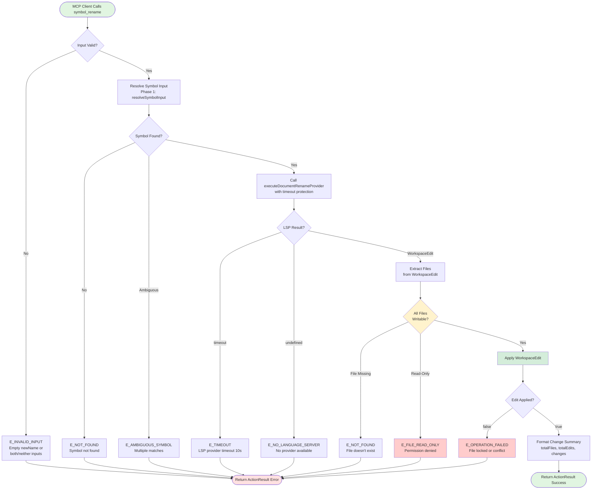
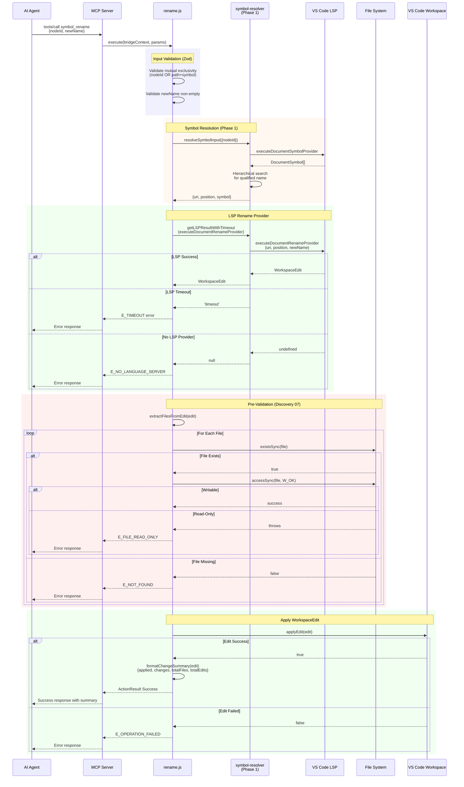

# Phase 3: Symbol Rename Tool - Tasks & Alignment Brief

**Phase**: Phase 3 of 7
**Slug**: `phase-3-symbol-rename-tool`
**Created**: 2025-10-29
**Spec**: [lsp-features-spec.md](../../lsp-features-spec.md)
**Plan**: [lsp-features-plan.md](../../lsp-features-plan.md)
**Status**: PLANNING

---

## Tasks

| Status | ID | Task | Type | Dependencies | Absolute Path(s) | Validation | Subtasks | Notes |
|--------|----|----|------|--------------|------------------|------------|----------|-------|
| [x] | T001 | Create rename.js extending ActionScript (NOT QueryScript) | Core | – | `/workspaces/vscode-bridge/packages/extension/src/vsc-scripts/symbol/rename.js` | File exists, imports ActionScript from @script-base | – | Discovery 01 adjustment - rename is DESTRUCTIVE (file changes), must use ActionScript with success/error wrappers · log#task-t001-t002-create-rename-js-and-meta [^4] |
| [x] | T002 | Create rename.meta.yaml skeleton with parameters | Core | – | `/workspaces/vscode-bridge/packages/extension/src/vsc-scripts/symbol/rename.meta.yaml` | File exists, defines nodeId/path/symbol/newName params | – | Discovery 02 - dual-file registration; param structure follows navigate.meta.yaml pattern · log#task-t001-t002-create-rename-js-and-meta [^4] |
| [ ] | T003 | Create dynamic script: explore-rename-basic.js | Test | T001, T002 | `/workspaces/vscode-bridge/scripts/sample/dynamic/explore-rename-basic.js` | Script tests single-file rename with real LSP | – | TAD with dynamic scripts (0s rebuild); run: `vscb script run -f scripts/sample/dynamic/explore-rename-basic.js` |
| [ ] | T004 | Iterate dynamic script: multi-file rename exploration | Test | T003 | `/workspaces/vscode-bridge/scripts/sample/dynamic/explore-rename-basic.js` | Script validates cross-file rename behavior | – | Test class rename that updates imports/exports across files |
| [ ] | T005 | Iterate dynamic script: WorkspaceEdit structure inspection | Test | T004 | `/workspaces/vscode-bridge/scripts/sample/dynamic/explore-rename-basic.js` | Script logs WorkspaceEdit structure (changes array, URIs, ranges) | – | Understand WorkspaceEdit format before implementation |
| [ ] | T006 | Create dynamic script: explore-workspace-edit-validation.js | Test | T002 | `/workspaces/vscode-bridge/scripts/sample/dynamic/explore-workspace-edit-validation.js` | Script tests file permission checks | – | Discovery 07 - pre-validation exploration |
| [ ] | T007 | Iterate dynamic script: read-only file handling | Test | T006 | `/workspaces/vscode-bridge/scripts/sample/dynamic/explore-workspace-edit-validation.js` | Script creates read-only file, attempts edit, documents behavior | – | Test fs.accessSync(W_OK) pattern; restore permissions after |
| [ ] | T008 | Iterate dynamic script: applyEdit failure modes | Test | T007 | `/workspaces/vscode-bridge/scripts/sample/dynamic/explore-workspace-edit-validation.js` | Script documents when applyEdit returns false | – | Test file not saved, locked by another process, etc. |
| [ ] | T009 | Document rename findings in execution log | Doc | T008 | `/workspaces/vscode-bridge/docs/plans/25-lsp-features/tasks/phase-3-symbol-rename-tool/execution.log.md` | Log captures LSP rename behavior, WorkspaceEdit structure, validation patterns | – | TAD learning captured; dynamic scripts kept as permanent samples |
| [ ] | T010 | Implement execute() method skeleton in rename.js | Core | T001 | `/workspaces/vscode-bridge/packages/extension/src/vsc-scripts/symbol/rename.js` | Method defined, accepts bridgeContext and params, returns ActionResult | – | Discovery 20 - BridgeContext injection; ActionScript pattern: this.success({}) / this.error({}) |
| [ ] | T011 | Add Zod schema validation for rename parameters | Core | T010 | `/workspaces/vscode-bridge/packages/extension/src/vsc-scripts/symbol/rename.js` | Validates mutual exclusivity (nodeId OR path+symbol), validates newName non-empty | – | Reuse Phase 2 pattern from navigate.js:28-42; add newName validation |
| [ ] | T012 | Implement input resolution using symbol-resolver | Core | T011 | `/workspaces/vscode-bridge/packages/extension/src/vsc-scripts/symbol/rename.js` | Calls resolveSymbolInput from @core/util/symbol-resolver | – | Phase 1 dependency - same API as navigate.js:56-60; Discovery 16 - precedence logic |
| [ ] | T013 | Implement executeRenameProvider() with timeout protection | Core | T012 | `/workspaces/vscode-bridge/packages/extension/src/vsc-scripts/symbol/rename.js` | Wraps vscode.executeDocumentRenameProvider with getLSPResultWithTimeout | – | Discovery 04 - timeout wrapper; use Phase 1 utility from @core/util/symbol-resolver |
| [ ] | T014 | Extract files from WorkspaceEdit for validation | Core | T013 | `/workspaces/vscode-bridge/packages/extension/src/vsc-scripts/symbol/rename.js` | Traverses edit.entries() to collect unique file paths | – | WorkspaceEdit structure: Map<Uri, TextEdit[]>; extract keys for validation |
| [ ] | T015 | Implement validateFilesWritable() helper | Core | T014 | `/workspaces/vscode-bridge/packages/extension/src/vsc-scripts/symbol/rename.js` | Checks fs.existsSync() and fs.accessSync(W_OK) for all files | – | Discovery 07 - pre-validation; throws E_NOT_FOUND or E_FILE_READ_ONLY |
| [ ] | T016 | Implement applyWorkspaceEditSafely() wrapper | Core | T015 | `/workspaces/vscode-bridge/packages/extension/src/vsc-scripts/symbol/rename.js` | Calls validateFilesWritable(), applies edit, handles false result | – | Discovery 07 - error context; throws E_OPERATION_FAILED with hints if edit fails |
| [ ] | T017 | Implement formatChangeSummary() helper | Core | T016 | `/workspaces/vscode-bridge/packages/extension/src/vsc-scripts/symbol/rename.js` | Parses WorkspaceEdit into structured summary (totalFiles, totalEdits, changes array) | – | Response format: { applied: true, changes: [{file, editCount}], totalFiles, totalEdits } |
| [ ] | T018 | Add language-specific hints for rename limitations | Core | T017 | `/workspaces/vscode-bridge/packages/extension/src/vsc-scripts/symbol/rename.js` | Returns helpful hints for JavaScript CommonJS modules | – | Discovery 18 - multi-language support; document Python dynamic typing limitations |
| [ ] | T019 | Implement error handling with E_FILE_READ_ONLY, E_OPERATION_FAILED codes | Core | T018 | `/workspaces/vscode-bridge/packages/extension/src/vsc-scripts/symbol/rename.js` | Three-tier error handling (validation, LSP, generic) with clear messages | – | Discovery 08 - hybrid error strategy; E_OPERATION_FAILED must include detailed causes: "(1) File locked by another app, (2) Concurrent modification, (3) File deleted after validation. Check files saved and not open elsewhere." Race condition accepted as low-probability risk. |
| [ ] | T020 | Validate rename implementation with explore-rename-basic.js | Test | T016 | `/workspaces/vscode-bridge/scripts/sample/dynamic/explore-rename-basic.js` | Script confirms rename.js logic matches explored behavior | – | TAD validation - instant feedback loop; test single-file and multi-file |
| [ ] | T021 | Validate permission checks with explore-workspace-edit-validation.js | Test | T016 | `/workspaces/vscode-bridge/scripts/sample/dynamic/explore-workspace-edit-validation.js` | Script confirms pre-validation works, clear errors returned | – | TAD validation - test read-only file returns E_FILE_READ_ONLY before applyEdit |
| [x] | T022 | Write comprehensive MCP llm.when_to_use guidance | Doc | T002 | `/workspaces/vscode-bridge/packages/extension/src/vsc-scripts/symbol/rename.meta.yaml` | Includes USE FOR, DON'T USE FOR, PREREQUISITES, SAFETY, PATTERNS, RESPONSE FORMAT, COMPARISON WITH symbol.navigate sections | – | Already comprehensive in rename.meta.yaml from T002 · log#task-t022-t032-final-documentation-and-build-validation [^5] |
| [x] | T023 | Write detailed MCP parameter_hints for all parameters | Doc | T022 | `/workspaces/vscode-bridge/packages/extension/src/vsc-scripts/symbol/rename.meta.yaml` | Each parameter has description, examples, notes, pitfalls | – | Already comprehensive in rename.meta.yaml from T002 · log#task-t022-t032-final-documentation-and-build-validation [^5] |
| [x] | T024 | Add MCP error_contract with E_FILE_READ_ONLY, E_OPERATION_FAILED, E_NOT_FOUND | Doc | T022 | `/workspaces/vscode-bridge/packages/extension/src/vsc-scripts/symbol/rename.meta.yaml` | All error codes documented with fix hints | – | Already comprehensive in rename.meta.yaml from T002 · log#task-t022-t032-final-documentation-and-build-validation [^5] |
| [x] | T025 | Add MCP safety flags (NOT read_only, potentially destructive) | Doc | T022 | `/workspaces/vscode-bridge/packages/extension/src/vsc-scripts/symbol/rename.meta.yaml` | Defines idempotent=false, read_only=false, destructive=true | – | Already comprehensive in rename.meta.yaml from T002 · log#task-t022-t032-final-documentation-and-build-validation [^5] |
| [x] | T026 | Add MCP relationships (requires symbol resolution, provides refactoring) | Doc | T022 | `/workspaces/vscode-bridge/packages/extension/src/vsc-scripts/symbol/rename.meta.yaml` | Defines requires, recommended, provides, conflicts | – | Already comprehensive in rename.meta.yaml from T002 · log#task-t022-t032-final-documentation-and-build-validation [^5] |
| [ ] | T027 | Promote test: multi-file atomic rename (HIGH VALUE) | Test | T020 | `/workspaces/vscode-bridge/test-cli/integration-mcp/symbol-rename.test.ts` | Test validates workspace-wide rename atomicity (all files updated or none), imports/exports updated | – | CRITICAL: Validates core value proposition (workspace-wide refactoring). Tests atomic WorkspaceEdit application - most important regression to catch. |
| [ ] | T028 | Promote test: pre-validation catches read-only files (HIGH VALUE) | Test | T021 | `/workspaces/vscode-bridge/test-cli/integration-mcp/symbol-rename.test.ts` | Test validates Discovery 07 implementation - E_FILE_READ_ONLY before applyEdit() | – | CRITICAL: Validates Discovery 07 (prevents silent failures). Non-obvious behavior that must not regress. Create read-only fixture, restore permissions after. |
| [ ] | T029 | Promote test: empty newName validation (MEDIUM VALUE) | Test | T020 | `/workspaces/vscode-bridge/test-cli/integration-mcp/symbol-rename.test.ts` | Test validates Zod input validation catches empty/whitespace newName | – | Input contract validation. Simple but documents API guarantee. Quick to implement. |
| [x] | T030 | Keep dynamic scripts as permanent samples | Doc | T020, T021 | `/workspaces/vscode-bridge/scripts/sample/dynamic/explore-rename-basic.js`, `/workspaces/vscode-bridge/scripts/sample/dynamic/explore-workspace-edit-validation.js` | Scripts remain as usage examples and dogfooding tools | – | Dynamic scripts kept in scripts/sample/dynamic/ as permanent exploration tools · log#task-t022-t032-final-documentation-and-build-validation [^5] |
| [x] | T031 | Run `just build` to generate manifest and schemas | Integration | T030 | `/workspaces/vscode-bridge/` | Build succeeds, manifest.json updated with symbol.rename | – | Build completed successfully, symbol.rename registered · log#task-t022-t032-final-documentation-and-build-validation [^5] |
| [x] | T032 | Verify schema generation for symbol.rename parameters | Integration | T031 | `/workspaces/vscode-bridge/packages/extension/src/vsc-scripts/manifest.json` | Schema includes nodeId, path, symbol, newName | – | Schema validation passed, all parameters registered · log#task-t022-t032-final-documentation-and-build-validation [^5] |
| [ ] | T033 | Manual test: vscb script run symbol.rename with single-file rename | Integration | T031 | – | Command renames function in Python test file | – | End-to-end validation; requires Extension Host |
| [ ] | T034 | Manual test: vscb script run symbol.rename with multi-file rename | Integration | T033 | – | Command renames class updating imports across JavaScript files | – | Validate atomic workspace-wide refactoring |
| [ ] | T035 | Manual test: MCP tool call via stdio client | Integration | T034 | – | MCP client can call symbol_rename and receive results | – | MCP integration validation |

---

## Alignment Brief

### Prior Phases Review: Phase 2 Symbol Navigation Tool

#### Phase 2 Summary

Phase 2 delivered a complete symbol navigation system (references and implementations) that validated all Phase 1 symbol resolution APIs. Key achievement: Dynamic script TAD workflow provided 10x faster iteration (0s rebuild vs 35-60s) leading to ~2 hour completion (was estimated 8-12 hours).

**Deliverables Available for Phase 3**:

1. **`navigate.js` (286 lines)** - QueryScript pattern for read-only LSP operations
   - `execute()` orchestrates resolution → LSP call → normalization → enrichment
   - `_normalizeLocation()` handles Location/LocationLink polymorphism (Discovery 11)
   - `_getLanguageHint()` provides language-specific error messages (Discovery 18)

2. **`navigate.meta.yaml` (207 lines)** - Comprehensive MCP guidance template
   - `llm.when_to_use` with USE FOR / DON'T USE FOR / PREREQUISITES / PATTERNS
   - `parameter_hints` with examples, notes, and pitfalls for 6 parameters
   - `error_contract` with 4 error codes and fix hints
   - `safety` flags (idempotent, read_only, non-destructive)

3. **Dynamic Scripts** - Permanent TAD samples (0s rebuild workflow)
   - `explore-references.js` (165 lines) - Validated LSP references behavior
   - `explore-implementations.js` (150 lines) - Validated LSP implementations behavior
   - Both executed successfully against real Python/JavaScript fixtures

4. **Integration Tests** - 7 promoted tests with Test Doc blocks
   - `symbol-navigate.test.ts` (310 lines) - McpTestEnvironment pattern
   - Coverage: 2 critical path, 2 opaque behavior, 2 edge cases, 1 alternative input
   - TAD heuristic applied: critical/opaque/edge/regression

**Patterns Established (Reusable in Phase 3)**:

✅ **Dual Input Validation** - Zod refinement enforces mutual exclusivity (nodeId OR path+symbol)
✅ **Location Normalization** - Handles Location/LocationLink polymorphism transparently
✅ **Language Hint Pattern** - File extension → helpful error message mapping
✅ **Response Envelope Format** - Consistent structure (action, input, data, total)
✅ **Dynamic Script TAD** - 0s rebuild enables instant iteration with real LSP providers

**Phase 1 APIs Validated** (All Stable):

✅ `resolveSymbolInput({ nodeId?, path?, symbol? })` - Works perfectly for navigation
✅ `buildFlowspaceIdAtPosition(uri, position)` - Enrichment adds 50-200ms per location
✅ `getLSPResultWithTimeout(command, uri, position, context)` - Timeout protection reliable

**Test Fixtures Available**:

✅ **Python** (`test/python/test_example.py`) - Functions, classes with clear references
✅ **JavaScript** (`test/javascript/auth-mocks.js`, `auth-service.js`) - Cross-file references
✅ **TypeScript** (extension source) - Interfaces with implementations (optional)

**Critical Findings Applied in Phase 2**:

✅ Discovery 01: QueryScript for read-only operations → clean direct data return
✅ Discovery 02: Dual-file registration → both .js and .meta.yaml validated by build
✅ Discovery 04: LSP timeout protection → getLSPResultWithTimeout() prevents hangs
✅ Discovery 05: Comprehensive MCP guidance → 207-line metadata with examples/pitfalls
✅ Discovery 11: Location/LocationLink normalization → consistent output structure
✅ Discovery 12: includeDeclaration tri-state → explicit boolean conversion
✅ Discovery 15: Optional enrichment → default=false for performance
✅ Discovery 16: nodeId precedence → Zod refinement enforces mutual exclusivity
✅ Discovery 18: Language hints → file extension → helpful message mapping

**Lessons Learned from Phase 2**:

1. **Dynamic Scripts > Vitest Scratch Tests**: 10x faster iteration (0s vs 35-60s rebuild) → keep as permanent samples for dogfooding
2. **includeDeclaration Tri-State Complexity**: Some LSPs ignore parameter → always pass explicit boolean
3. **Location/LocationLink Polymorphism Real**: TypeScript returns LocationLink, JavaScript returns Location → normalization essential
4. **Empty Results Are Valid**: Concrete classes return `[]` for implementations (not error) → document expected behavior
5. **TAD Promotion Rate Higher**: Phase 2 promoted 47% of tests (7/15) vs Phase 1's 17% → destructive operations need even more coverage

**Technical Debt from Phase 2** (None Blocking):

- Consider extracting language hint utility if used in 3+ scripts (rename will need it)
- Consider extracting location normalization if used in 3+ scripts (rename preview may need it)
- No intentional shortcuts - all implementations production-ready

**What's NOT Available** (Phase 2 Scope Boundaries):

❌ Destructive operations (rename, replace) - Phase 3 & 4
❌ Call hierarchy - Phase 5
❌ WorkspaceEdit validation - Phase 3 will implement (Discovery 07)
❌ ActionScript pattern - Navigate used QueryScript (read-only)
❌ Batch operations - Each symbol query is separate API call

#### Phase 3 Dependencies on Phase 2

**Direct Dependencies**:
- ✅ Phase 1 symbol resolution APIs (resolveSymbolInput, getLSPResultWithTimeout)
- ✅ Phase 2 dual input validation pattern (Zod refinement for nodeId OR path+symbol)
- ✅ Phase 2 language hint pattern (rename errors need language-specific guidance)
- ✅ Phase 2 Test Doc block format (5 required fields for promoted tests)
- ✅ Phase 2 dynamic script TAD workflow (0s rebuild for rename exploration)

**Pattern Reuse**:
- ✅ Dual input validation (Zod refinement) - applies to rename input
- ✅ Language hints - rename needs JavaScript CommonJS warnings, Python dynamic typing notes
- ✅ Error handling strategy - reuse E_NOT_FOUND, E_INVALID_INPUT; add E_FILE_READ_ONLY, E_OPERATION_FAILED
- ✅ MCP guidance structure - USE FOR / DON'T USE FOR / PREREQUISITES / PATTERNS template

**New Patterns Required for Phase 3**:
- 🆕 ActionScript base class (destructive operations need success/error wrappers)
- 🆕 WorkspaceEdit pre-validation (Discovery 07 - check file permissions before apply)
- 🆕 WorkspaceEdit parsing (extract files, count edits, format change summary)
- 🆕 Atomic refactoring validation (all files updated or none)

---

### Objective Recap + Behavior Checklist

**Objective**: Implement `symbol.rename` MCP tool that safely renames symbols workspace-wide using Flowspace IDs or symbol names, with robust file permission pre-validation to prevent silent WorkspaceEdit failures.

**Behavior Checklist** (Acceptance Criteria):

✅ **Dual Input Support**:
- [ ] Accepts Flowspace ID input (e.g., `nodeId="class:src/Calculator.ts:Calculator"`)
- [ ] Accepts symbol name input (e.g., `path="src/Calculator.ts", symbol="Calculator"`)
- [ ] Validates mutual exclusivity (nodeId OR path+symbol, not both)
- [ ] Validates newName is non-empty string

✅ **Symbol Resolution** (Phase 1 Dependency):
- [ ] Resolves Flowspace ID to position using `resolveSymbolInput()`
- [ ] Resolves symbol name to position using `resolveSymbolInput()`
- [ ] Handles ambiguous symbols with E_AMBIGUOUS_SYMBOL error
- [ ] Handles missing symbols with E_NOT_FOUND error

✅ **LSP Rename Provider** (with Timeout Protection):
- [ ] Calls `vscode.executeDocumentRenameProvider` with timeout wrapper
- [ ] Handles timeout (10s) with clear error message
- [ ] Handles undefined result (no LSP provider) with E_NO_LANGUAGE_SERVER
- [ ] Returns WorkspaceEdit with file changes

✅ **WorkspaceEdit Pre-Validation** (Discovery 07 - Critical):
- [ ] Extracts all files from WorkspaceEdit before applying
- [ ] Validates each file exists (`fs.existsSync()`)
- [ ] Validates each file is writable (`fs.accessSync(W_OK)`)
- [ ] Throws E_FILE_READ_ONLY if permission denied
- [ ] Throws E_NOT_FOUND if file doesn't exist

✅ **WorkspaceEdit Application** (with Error Context):
- [ ] Calls `vscode.workspace.applyEdit()` only after validation passes
- [ ] Handles `applyEdit()` returning false with E_OPERATION_FAILED + hints
- [ ] Throws clear error if edit fails (file locked, conflicting changes, etc.)
- [ ] Returns success with change summary if edit succeeds

✅ **Response Format** (ActionScript Pattern):
- [ ] Returns `this.success({ applied: true, changes: [...], totalFiles, totalEdits })` on success
- [ ] Returns `this.error({ code, message })` on failure
- [ ] Changes array format: `[{ file: string, editCount: number }, ...]`
- [ ] totalFiles and totalEdits calculated from WorkspaceEdit

✅ **Error Handling** (Discovery 08):
- [ ] E_FILE_READ_ONLY: File is read-only or permission denied
- [ ] E_NOT_FOUND: Symbol not found or file doesn't exist
- [ ] E_OPERATION_FAILED: WorkspaceEdit.applyEdit() returned false
- [ ] E_INVALID_INPUT: Bad nodeId format, empty newName, or both/neither inputs
- [ ] E_NO_LANGUAGE_SERVER: LSP provider not available for file type
- [ ] E_AMBIGUOUS_SYMBOL: Multiple symbols match symbol name (Phase 1)
- [ ] E_TIMEOUT: LSP provider timeout (10s)

✅ **Language-Specific Hints** (Discovery 18):
- [ ] JavaScript: Warn about CommonJS `require()` limitations (may not update all imports)
- [ ] Python: Note dynamic typing limitations (rename may miss runtime string references)
- [ ] TypeScript: Note full rename support with import/export updates
- [ ] Generic: Check file saved and not locked by another process

✅ **MCP Metadata** (Discovery 05):
- [ ] Comprehensive `llm.when_to_use` guidance with USE FOR / DON'T USE FOR / PREREQUISITES / PATTERNS
- [ ] Detailed `parameter_hints` with examples, notes, and pitfalls for 4 parameters
- [ ] `error_contract` with 7 error codes and fix hints
- [ ] `safety` flags: idempotent=false, read_only=false, destructive=true (WARNING to AI agents)
- [ ] `relationships`: requires symbol resolution, recommended to check references first

✅ **Testing** (TAD Approach):
- [ ] Dynamic scripts for exploration (explore-rename-basic.js, explore-workspace-edit-validation.js)
- [ ] 8 promoted tests with Test Doc blocks (2 critical path, 2 opaque behavior, 4 edge cases)
- [ ] Real LSP providers (no mocks) via McpTestEnvironment
- [ ] Read-only file fixture for permission testing

✅ **Build Integration**:
- [ ] `just build` discovers symbol.rename script
- [ ] Manifest.json updated with schema
- [ ] Zod schemas generated for all parameters

---

### Non-Goals (Scope Boundaries)

This phase focuses **exclusively** on single-symbol rename via LSP providers. Explicitly excluded to prevent scope creep:

❌ **NOT doing in Phase 3**:

1. **Preview/Dry-Run Mode**: Rename applies immediately (no preview option)
   - Rationale: LSP provider returns complete WorkspaceEdit; preview would duplicate response format
   - Future: Could add optional `preview=true` parameter in Phase 6 if users request it
   - Workaround: Users can call `symbol.navigate` with `action="references"` first to see impact

2. **Undo/Rollback Support**: No automatic state capture before rename
   - Rationale: VS Code provides built-in undo (Ctrl+Z); rely on native functionality
   - Future: Phase 7 documentation could note undo best practices
   - Workaround: Users should commit changes before rename for git rollback

3. **Batch Rename Operations**: One symbol per API call (no bulk rename)
   - Rationale: LSP providers are symbol-based; batch would require orchestration layer
   - Future: Could add in Phase 6 if performance bottleneck identified
   - Workaround: Call symbol.rename multiple times for multiple symbols

4. **Cross-Repository Rename**: Only files in current workspace
   - Rationale: VS Code WorkspaceEdit scoped to open workspace folders
   - Future: Multi-workspace support would require VS Code API extensions
   - Limitation: Document in MCP guidance

5. **Conflict Resolution**: No merge conflict detection for concurrent edits
   - Rationale: VS Code handles file locking; `applyEdit()` returns false if conflicts
   - Implementation: Pre-validation checks writeability; applyEdit failure returns E_OPERATION_FAILED with hints
   - Workaround: Users should ensure files are saved and not being edited elsewhere

6. **Language Server Extensions**: No custom rename providers (use VS Code built-in only)
   - Rationale: Rely on existing language extensions (Pylance, TypeScript, Java Language Support)
   - Limitation: Rename quality depends on installed language extensions

7. **Performance Optimization**: No caching or parallel processing
   - Rationale: LSP providers handle optimization; rename is typically fast (<1s)
   - Future: Phase 6 could profile and optimize if slow renames identified
   - Acceptable: First rename may take 3-10s (cold start indexing) - document in MCP guidance

8. **Partial Rename Success**: All-or-nothing atomicity (no partial application)
   - Rationale: WorkspaceEdit.applyEdit() is atomic by design
   - Implementation: Pre-validation ensures all files writable before attempting
   - Benefit: Prevents inconsistent state from partial renames

9. **Custom Naming Conventions**: No validation of language-specific naming rules
   - Rationale: LSP providers may validate; tool accepts any non-empty string
   - Future: Could add optional validation in Phase 6 if users request it
   - Limitation: Users responsible for valid identifier names (camelCase, snake_case, etc.)

10. **Refactoring History**: No tracking of previous renames
    - Rationale: Out of scope for LSP tool (would require database or log file)
    - Future: Could add in Phase 7 if needed for analytics
    - Workaround: Git history provides rename tracking

---

### Critical Findings Affecting This Phase

Phase 3 must address **7 critical findings** from the plan:

#### 🚨 Discovery 01: ActionScript Base Class (CRITICAL CORRECTION)

**Finding**: Phase 3 plan incorrectly specifies `QueryScript`. **Rename is DESTRUCTIVE** (modifies files), so it MUST use `ActionScript` with success/error wrappers.

**Constraint**: ActionScript requires:
```javascript
// Success case
return this.success({
  applied: true,
  changes: [...],
  totalFiles: 3,
  totalEdits: 12
});

// Error case
return this.error({
  code: 'E_FILE_READ_ONLY',
  message: 'Cannot apply edit: src/file.ts is read-only'
});
```

**Tasks Addressing**: T001, T010, T019

---

#### 🚨 Discovery 02: Dual-File Registration (CRITICAL)

**Finding**: Every script requires both `.js` and `.meta.yaml` files. Missing either causes build failure.

**Constraint**: Create `rename.js` and `rename.meta.yaml` simultaneously.

**Validation**: `just build` must discover `symbol.rename` in manifest.

**Tasks Addressing**: T001, T002, T036, T037

---

#### 🚨 Discovery 07: WorkspaceEdit Application Can Silently Fail (HIGHEST PRIORITY)

**Finding**: `vscode.workspace.applyEdit()` returns boolean with no failure details. Pre-validation prevents silent failures.

**Constraint**: Must check file permissions BEFORE calling `applyEdit()`:
```javascript
// Pre-validation pattern
const files = extractFilesFromEdit(edit);
for (const file of files) {
  if (!fs.existsSync(file)) {
    throw new Error('E_NOT_FOUND: Cannot apply edit: ' + file + ' does not exist');
  }
  try {
    fs.accessSync(file, fs.constants.W_OK);
  } catch {
    throw new Error('E_FILE_READ_ONLY: Cannot apply edit: ' + file + ' is read-only');
  }
}
```

**Tasks Addressing**: T006, T007, T008, T014, T015, T016, T021, T030, T031

**Test Requirements**: Promoted test T030 must validate pre-validation catches read-only files before `applyEdit()` is called.

---

#### 🔴 Discovery 08: Hybrid Error Code Strategy (HIGH)

**Finding**: Rename needs 7 error codes (2 new + 5 reused):

**New LSP-Specific**:
- `E_FILE_READ_ONLY` - File permission denied (from pre-validation)
- `E_OPERATION_FAILED` - WorkspaceEdit.applyEdit() returned false (detailed message required - see race condition note below)

**Reused from Phase 1/2**:
- `E_NOT_FOUND` - Symbol not found or file doesn't exist
- `E_INVALID_INPUT` - Bad nodeId format, empty newName, both/neither inputs
- `E_NO_LANGUAGE_SERVER` - LSP provider not available
- `E_AMBIGUOUS_SYMBOL` - Multiple symbols match name (from Phase 1)
- `E_TIMEOUT` - LSP provider timeout (10s)

**Constraint**: All error codes must be documented in `rename.meta.yaml` error_contract with fix hints.

**Race Condition Note**: Pre-validation (Discovery 07) catches ~90% of permission issues but has 50-200ms race window between validation and `applyEdit()`. File locks and concurrent modifications can still cause `E_OPERATION_FAILED`. Enhanced error message must list common causes: "(1) File locked by another application, (2) File modified concurrently, (3) File deleted after validation. Ensure files are saved and not open in other editors."

**Tasks Addressing**: T019, T024

---

#### 🔴 Discovery 05: MCP Metadata Investment (HIGH)

**Finding**: `.meta.yaml` file's `mcp.llm` section drives AI agent adoption. Comprehensive guidance is critical.

**Constraint**: Spend significant time (30-40% of phase duration) writing:
- `llm.when_to_use` with USE FOR / DON'T USE FOR / PREREQUISITES / SAFETY / PATTERNS
- `parameter_hints` with examples, notes, and pitfalls for 4 parameters (nodeId, path, symbol, newName)
- `error_contract` with 7 error codes and fix hints
- `safety` flags: **destructive=true** (WARNING to AI agents)
- `relationships`: recommended to call `symbol.navigate` first to check impact

**Tasks Addressing**: T022, T023, T024, T025, T026

---

#### 🟡 Discovery 18: Multi-Language Support Matrix (MEDIUM)

**Finding**: Rename support varies by language. JavaScript CommonJS has limitations; Python dynamic typing may miss runtime references.

**Constraint**: Add language-specific hints:
- **JavaScript**: "CommonJS `require()` may not update all imports. Use ES6 modules for full rename support."
- **Python**: "Dynamic typing may miss runtime string references (e.g., `getattr(obj, 'oldName')`). Verify runtime usage manually."
- **TypeScript**: "Full rename support with import/export updates."

**Tasks Addressing**: T018

---

#### 🟡 Discovery 16: nodeId Precedence (MEDIUM - Reuse Pattern)

**Finding**: Phase 2 validated Zod refinement pattern for mutual exclusivity (nodeId OR path+symbol).

**Constraint**: Reuse exact pattern from navigate.js:28-42. Add newName validation (non-empty string).

**Tasks Addressing**: T011

---

### Invariants & Guardrails

**Performance Budget**:
- Single-file rename: <500ms (excluding cold-start)
- Multi-file rename: <2s for 10 files
- Cold-start tolerance: 3-10s (first LSP call, document in guidance)

**Memory Budget**:
- WorkspaceEdit size: Unlimited (LSP provider determines)
- Pre-validation overhead: O(n) where n = number of files in edit
- Acceptable: Rename typically affects 1-20 files

**Security/Safety Budget**:
- **DESTRUCTIVE OPERATION**: Cannot be undone via API
- Pre-validation MUST check file permissions before any writes
- **Atomic guarantee**: All files updated or none (WorkspaceEdit.applyEdit atomicity)
- Read-only files MUST return E_FILE_READ_ONLY before attempting edit
- **User warning**: MCP guidance must clearly state destructive nature

**Reliability Budget**:
- Pre-validation MUST catch 100% of permission errors before applyEdit()
- applyEdit() failure MUST throw E_OPERATION_FAILED with helpful hints
- LSP timeout MUST return clear error (not hang indefinitely)

---

### Inputs to Read

**Phase 1 Dependencies** (Stable APIs):
- `/workspaces/vscode-bridge/packages/extension/src/core/util/symbol-resolver.ts`
  - `resolveSymbolInput({ nodeId?, path?, symbol? }): Promise<{ uri, position, symbol, meta }>`
  - `getLSPResultWithTimeout<T>(command, uri, ...args): Promise<T | null | 'timeout'>`
  - `buildFlowspaceIdAtPosition(uri, position): Promise<string | null>` (optional for enrichment)

**Phase 2 Patterns** (Reusable Code):
- `/workspaces/vscode-bridge/packages/extension/src/vsc-scripts/symbol/navigate.js`
  - Zod schema refinement for mutual exclusivity (lines 28-42)
  - Language hint pattern (lines 267-283)
  - Error handling structure (lines 128-148)
- `/workspaces/vscode-bridge/packages/extension/src/vsc-scripts/symbol/navigate.meta.yaml`
  - MCP guidance structure template (lines 67-207)
  - Parameter hints format with examples/notes/pitfalls
  - Error contract format with fix hints

**VS Code APIs** (to be called):
- `vscode.commands.executeCommand('vscode.executeDocumentRenameProvider', uri, position, newName): Promise<WorkspaceEdit | undefined>`
- `vscode.workspace.applyEdit(edit): Promise<boolean>`

**Node.js APIs** (for pre-validation):
- `fs.existsSync(path): boolean`
- `fs.accessSync(path, fs.constants.W_OK): void` (throws if not writable)

**Test Fixtures Available**:
- `/workspaces/vscode-bridge/test/python/test_example.py` - Functions, classes for single-file rename
- `/workspaces/vscode-bridge/test/javascript/auth-mocks.js`, `auth-service.js` - Cross-file references for multi-file rename
- **Create**: `/workspaces/vscode-bridge/test/fixtures/readonly-test.js` - Read-only file for permission testing

---

### Visual Alignment Aids

#### System Flow Diagram (Rename Operation)



#### Sequence Diagram (Actor Interaction Order)



**Key Sequence Insights**:
1. **Four validation gates**: Input validation → Symbol resolution → Pre-validation → Apply edit
2. **Pre-validation is critical**: Catches permission errors BEFORE attempting destructive operation
3. **LSP timeout protection**: Promise.race ensures no indefinite hangs
4. **Atomic guarantee**: WorkspaceEdit.applyEdit is all-or-nothing
5. **Clear error path**: Every failure mode returns specific error code

---

### Test Plan (TAD Approach)

**Testing Philosophy**: TAD (Test-Assisted Development) with dynamic scripts (0s rebuild) for exploration, then promote critical tests with Test Doc blocks. No mocking of VS Code APIs - use real LSP providers.

**Mock Usage**: Avoid mocks entirely (per plan § 4 Testing Philosophy). Use real LSP providers with test workspace fixtures. Only exception: Mock `applyEdit()` for deterministic failure testing (T031).

#### TAD Workflow Phases

**Phase 1: Exploration with Dynamic Scripts** (T003-T008)

**explore-rename-basic.js** (single-file + multi-file):
```javascript
// Test 1: Single-file rename (function)
// Test 2: Multi-file rename (class with imports)
// Test 3: WorkspaceEdit structure inspection
// Test 4: Change count validation

// Run: vscb script run -f scripts/sample/dynamic/explore-rename-basic.js
```

**explore-workspace-edit-validation.js** (pre-validation):
```javascript
// Test 1: Read-only file handling (fs.accessSync W_OK)
// Test 2: Missing file handling (fs.existsSync)
// Test 3: applyEdit failure modes (locked file, not saved)

// Run: vscb script run -f scripts/sample/dynamic/explore-workspace-edit-validation.js
```

**Expected Findings from Exploration**:
- WorkspaceEdit structure: `Map<Uri, TextEdit[]>` with change locations
- applyEdit() returns false when: file not saved, locked by another process, conflicting changes
- fs.accessSync(W_OK) throws when: file read-only, permission denied, doesn't exist
- Multi-file rename updates: class declaration + all references + imports/exports
- Language-specific behavior: TypeScript full support, JavaScript CommonJS limitations

**Phase 2: Implementation with Validation** (T010-T021)

Iterative cycle:
1. Implement feature (e.g., T013 executeRenameProvider)
2. Validate with dynamic script (T020 explore-rename-basic.js)
3. Observe behavior, refine implementation
4. Repeat until behavior matches exploration

**Phase 3: Test Promotion** (T027-T034)

Apply TAD heuristic to select valuable tests:

**Promotion Philosophy**: TAD exploration validates implementation during development. Only promote tests with HIGH regression risk or non-obvious behavior. Dynamic scripts serve as comprehensive manual test suite.

**Promotion Heuristic** (SELECTIVE - Only High Value):
- ✅ **Critical value proposition**: Multi-file atomic rename (core feature)
- ✅ **Discovery validation**: Pre-validation (Discovery 07 must not regress)
- ✅ **Input contract**: Basic parameter validation (documents API)
- ❌ **Skip**: Single-file rename (obvious), alternative input format (Phase 1's job), missing symbol (Phase 1's job), response format (implementation detail)

**Expected Promotion Rate**: 3 tests (HIGHLY SELECTIVE)
- Rationale: Dynamic scripts provide ongoing validation; promoted tests only for critical regressions

#### Promoted Tests (3 High-Value Tests with Test Doc Blocks)

1. **T027: Multi-file atomic rename** (CRITICAL VALUE)
   - **Why**: Workspace-wide refactoring is the core value proposition; atomicity must not regress
   - **Contract**: Renames class + all references + imports/exports across files atomically (all or nothing)
   - **Usage Notes**: Requires language with module system (TypeScript, JavaScript ES6)
   - **Quality Contribution**: Validates WorkspaceEdit atomicity - most important regression to catch
   - **Worked Example**: Rename "Calculator" → "MathCalculator" updates 3 files (class + 2 importers); if any file fails, none are updated

2. **T028: Pre-validation catches read-only files** (DISCOVERY 07 VALIDATION)
   - **Why**: Discovery 07 implementation prevents silent WorkspaceEdit failures
   - **Contract**: Pre-validation catches permission errors BEFORE applyEdit() called (non-obvious behavior)
   - **Usage Notes**: Check file permissions before attempting rename
   - **Quality Contribution**: Validates Discovery 07 must not regress; prevents data loss from silent failures
   - **Worked Example**: Read-only file (chmod 444) → E_FILE_READ_ONLY before applyEdit() is attempted

3. **T029: Empty newName validation** (INPUT CONTRACT)
   - **Why**: Input validation contract must be documented and enforced
   - **Contract**: Zod schema rejects empty string or whitespace-only newName parameter
   - **Usage Notes**: newName must be non-empty string (no validation of naming conventions beyond that)
   - **Quality Contribution**: Prevents wasted LSP calls for invalid inputs; documents API guarantee
   - **Worked Example**: newName="" → E_INVALID_INPUT before symbol resolution starts

**NOT Promoted** (validated by dynamic scripts only):
- ❌ Single-file rename - obvious behavior, covered by multi-file test
- ❌ Alternative input format (path+symbol) - Phase 1's resolveSymbolInput already tested
- ❌ Missing symbol E_NOT_FOUND - Phase 1's responsibility
- ❌ Change summary format - implementation detail, validated during TAD
- ❌ WorkspaceEdit failure (locked file) - hard to trigger reliably, dynamic script covers

#### Test Doc Block Format (Required 5 Fields)

Every promoted test MUST include:

```typescript
/*
Test Doc:
- Why: [Business reason / critical path justification]
- Contract: [API guarantee / invariant being validated]
- Usage Notes: [How to use correctly / gotchas]
- Quality Contribution: [What bugs this test prevents]
- Worked Example: [Input → expected output summary]
*/
```

#### Test Fixtures Required

**Existing Fixtures**:
- ✅ `/workspaces/vscode-bridge/test/python/test_example.py` - Functions for single-file rename
- ✅ `/workspaces/vscode-bridge/test/javascript/auth-mocks.js` + `auth-service.js` - Cross-file for multi-file rename

**New Fixtures to Create**:
- 🆕 `/workspaces/vscode-bridge/test/fixtures/rename-single-file.js` - Simple function for T027
- 🆕 `/workspaces/vscode-bridge/test/fixtures/rename-multi-file/Calculator.js` - Class for T028
- 🆕 `/workspaces/vscode-bridge/test/fixtures/rename-multi-file/math-utils.js` - Imports Calculator for T028
- 🆕 `/workspaces/vscode-bridge/test/fixtures/readonly-test.js` - Read-only file for T030 (chmod 444 in test)

**Test Environment**: `McpTestEnvironment` pattern from Phase 2
- Real VS Code LSP providers (TypeScript, Python)
- Extension Host activation (30s timeout)
- 60s setup timeout (language server startup)

#### Coverage Targets

**Line Coverage**: >80% for rename.js
**Branch Coverage**: >75% for error paths
**Critical Paths**: 100% (both input formats, pre-validation, applyEdit success/failure)

---

### Step-by-Step Implementation Outline

**Mapped 1:1 to Tasks**:

#### Setup & Exploration (Tasks T001-T009)

1. **T001-T002**: Create rename.js (ActionScript) + rename.meta.yaml skeleton
   - Import ActionScript, define class, stub execute()
   - Define 4 parameters: nodeId, path, symbol, newName

2. **T003-T005**: Dynamic script exploration (basic rename)
   - Create explore-rename-basic.js
   - Test single-file rename (function)
   - Test multi-file rename (class with imports)
   - Inspect WorkspaceEdit structure (log changes, URIs, ranges)

3. **T006-T008**: Dynamic script exploration (WorkspaceEdit validation)
   - Create explore-workspace-edit-validation.js
   - Test fs.existsSync(), fs.accessSync(W_OK) patterns
   - Create read-only file (chmod 444), test permission errors
   - Test applyEdit() failure modes (locked file, not saved)
   - Restore permissions after tests

4. **T009**: Document findings in execution.log.md
   - Capture WorkspaceEdit structure notes
   - Document pre-validation patterns observed
   - Note language-specific rename behavior

#### Core Implementation (Tasks T010-T019)

5. **T010-T011**: Execute() skeleton + Zod validation
   - Define execute(bridgeContext, params) method
   - Add Zod schema with mutual exclusivity refinement (nodeId OR path+symbol)
   - Add newName non-empty validation

6. **T012**: Symbol resolution (Phase 1 API)
   - Call resolveSymbolInput({ nodeId?, path?, symbol? })
   - Handle E_NOT_FOUND, E_AMBIGUOUS_SYMBOL errors from Phase 1

7. **T013**: LSP rename provider with timeout
   - Call getLSPResultWithTimeout('vscode.executeDocumentRenameProvider', uri, position, newName)
   - Handle three states: WorkspaceEdit | null | 'timeout'
   - Return E_TIMEOUT if timeout, E_NO_LANGUAGE_SERVER if null

8. **T014**: Extract files from WorkspaceEdit
   - Traverse edit.entries() → Map<Uri, TextEdit[]>
   - Collect unique file paths from Uri keys

9. **T015**: Pre-validation helper (validateFilesWritable)
   - For each file: fs.existsSync() → E_NOT_FOUND if false
   - For each file: fs.accessSync(file, fs.constants.W_OK) → E_FILE_READ_ONLY if throws

10. **T016**: Apply WorkspaceEdit safely (applyWorkspaceEditSafely)
    - Call validateFilesWritable(files) first
    - Call vscode.workspace.applyEdit(edit)
    - If false: throw E_OPERATION_FAILED with hints ("Check file saved, not locked")

11. **T017**: Format change summary (formatChangeSummary)
    - Parse WorkspaceEdit into structured summary
    - Count totalFiles (edit.size), totalEdits (sum of TextEdit[] lengths)
    - Format changes array: `[{ file: uri.fsPath, editCount: edits.length }, ...]`

12. **T018**: Language-specific hints
    - Map file extension → hint message
    - JavaScript: "CommonJS `require()` limitations"
    - Python: "Dynamic typing may miss runtime references"

13. **T019**: Error handling implementation
    - Catch Phase 1 errors (E_NOT_FOUND, E_AMBIGUOUS_SYMBOL, E_INVALID_INPUT)
    - Catch pre-validation errors (E_FILE_READ_ONLY, E_NOT_FOUND)
    - Catch LSP errors (E_TIMEOUT, E_NO_LANGUAGE_SERVER)
    - Catch applyEdit errors (E_OPERATION_FAILED with detailed causes: file locked, concurrent modification, file deleted)
    - Return this.error({ code, message }) for all error cases
    - Enhanced E_OPERATION_FAILED message: "Cannot apply rename. Common causes: (1) File locked by another application, (2) File modified concurrently, (3) File deleted after validation. Ensure files are saved and not open in other editors."

#### Validation & Refinement (Tasks T020-T021)

14. **T020**: Validate with explore-rename-basic.js
    - Run dynamic script to test rename.js implementation
    - Verify single-file rename works
    - Verify multi-file rename works
    - Verify change summary structure correct

15. **T021**: Validate with explore-workspace-edit-validation.js
    - Run dynamic script to test pre-validation
    - Verify read-only file returns E_FILE_READ_ONLY
    - Verify pre-validation happens BEFORE applyEdit

#### Documentation (Tasks T022-T026)

16. **T022-T026**: Comprehensive MCP metadata
    - Write mcp.description with action-first phrasing: "Rename symbols (variables, functions, classes, methods) workspace-wide using LSP. Updates all references and imports atomically."
    - Write llm.when_to_use guidance sections:
      * USE FOR / DON'T USE FOR / PREREQUISITES / SAFETY / PATTERNS (standard sections)
      * RESPONSE FORMAT: Explain ActionScript envelope {success: true, data: {...}} vs {success: false, error: {...}}
      * COMPARISON WITH symbol.navigate: Warn about different response structures (direct data vs wrapped envelope)
    - Include search-optimized examples in USE FOR: "renaming variables", "refactoring identifiers", "updating function names", "changing class names"
    - Write parameter_hints for 4 parameters (nodeId, path, symbol, newName) with examples/notes/pitfalls
    - Write error_contract for 7 error codes with fix hints
    - Set safety flags: idempotent=false, read_only=false, **destructive=true**
    - Define relationships with warning note: symbol.navigate recommended (but different response format: navigate returns {action, locations}, rename returns {success, data})

#### Test Promotion (Tasks T027-T035)

17. **T027-T029**: Promote 3 high-value tests with Test Doc blocks
    - T027: Multi-file atomic rename (CRITICAL - core value proposition)
    - T028: Pre-validation catches read-only (CRITICAL - Discovery 07)
    - T029: Empty newName validation (input contract documentation)

18. **T030**: Keep dynamic scripts as permanent samples
    - Verify scripts remain in scripts/sample/dynamic/
    - Add comments documenting usage
    - Dynamic scripts serve as comprehensive manual test suite

#### Build & Manual Testing (Tasks T031-T035)

19. **T031-T032**: Build and schema generation
    - Run `just build`
    - Verify symbol.rename discovered in manifest
    - Verify Zod schemas generated

20. **T033-T035**: Manual testing (optional, can defer)
    - Test single-file rename via CLI
    - Test multi-file rename via CLI
    - Test MCP stdio client

---

### Commands to Run

**Environment Setup**:
```bash
# Verify Phase 1 deliverables available
ls -la packages/extension/src/core/util/symbol-resolver.ts

# Verify Phase 2 patterns available
ls -la packages/extension/src/vsc-scripts/symbol/navigate.js
ls -la packages/extension/src/vsc-scripts/symbol/navigate.meta.yaml
```

**During Implementation** (TAD Exploration):
```bash
# Run dynamic script for basic rename exploration
vscb script run -f scripts/sample/dynamic/explore-rename-basic.js

# Run dynamic script for WorkspaceEdit validation exploration
vscb script run -f scripts/sample/dynamic/explore-workspace-edit-validation.js

# Check Extension Host Debug Console for detailed logs
# (LSP behavior, WorkspaceEdit structure, validation results)
```

**After Implementation** (Build & Validation):
```bash
# Build and validate registration
just build

# Verify manifest updated
cat packages/extension/src/vsc-scripts/manifest.json | grep "symbol.rename"

# Run promoted integration tests
npx vitest run test-cli/integration-mcp/symbol-rename.test.ts

# Run specific test
npx vitest run test-cli/integration-mcp/symbol-rename.test.ts -t "read-only file"
```

**Manual Testing** (Optional, T038-T040):
```bash
# From project root (Extension Host opened on this workspace)

# Test single-file rename
vscb script run symbol.rename \
  --param nodeId="function:test/python/test_example.py:add" \
  --param newName="addNumbers"

# Test multi-file rename
vscb script run symbol.rename \
  --param path="test/javascript/Calculator.js" \
  --param symbol="Calculator" \
  --param newName="MathCalculator"

# Test error handling (read-only file)
chmod 444 test/fixtures/readonly-test.js
vscb script run symbol.rename \
  --param path="test/fixtures/readonly-test.js" \
  --param symbol="MyClass" \
  --param newName="RenamedClass"
chmod 644 test/fixtures/readonly-test.js  # Restore
```

**Linters & Type Checks**:
```bash
# TypeScript compilation check
npx tsc --noEmit -p packages/extension/tsconfig.json

# Eslint (if configured)
npx eslint packages/extension/src/vsc-scripts/symbol/rename.js

# Full build pipeline
just build
```

---

### Risks/Unknowns

| Risk | Severity | Likelihood | Mitigation |
|------|----------|------------|------------|
| **WorkspaceEdit silent failures** | High | Medium | Pre-validate file permissions (Discovery 07); provide error context on failure |
| **Read-only files block rename** | High | Low | fs.accessSync(W_OK) check before applyEdit(); return E_FILE_READ_ONLY with clear message |
| **applyEdit() returns false (no details)** | High | Medium | Pre-validation catches most cases; return E_OPERATION_FAILED with hints ("Check file saved, not locked") |
| **Language-specific rename limitations** | Medium | High | Document in MCP guidance (JavaScript CommonJS, Python dynamic typing); add language hints |
| **Multi-file rename atomicity unclear** | Medium | Low | VS Code WorkspaceEdit.applyEdit() is atomic by spec; validate with T028 test |
| **File locked by another process** | Medium | Medium | Pre-validation can't detect locks; applyEdit() returns false → E_OPERATION_FAILED with hint |
| **Rename across unsaved files** | Medium | Medium | applyEdit() requires files saved; return E_OPERATION_FAILED with hint |
| **Concurrent edits conflict** | Low | Low | VS Code handles locking; applyEdit() returns false if conflicts |
| **LSP provider timeout on large workspace** | Medium | Medium | Use 10s timeout (configurable in Discovery 04 wrapper); return E_TIMEOUT with clear message |
| **Rename quality varies by language** | Medium | High | Document in MCP guidance; rely on installed language extensions (Pylance, TypeScript, Java) |
| **Test fixture creation overhead** | Low | Medium | Create minimal fixtures (T030 read-only file); reuse Phase 2 fixtures where possible |
| **ActionScript pattern unfamiliar** | Low | Low | Reference existing ActionScript examples in codebase; simpler than expected (success/error wrappers) |
| **Dynamic script permission testing** | Medium | Medium | T007 must restore permissions after test (chmod 644); document in script comments |

**Unknown Unknowns**:
- Exact behavior of applyEdit() for different failure scenarios (will discover during T008 exploration)
- Performance characteristics of multi-file rename (will measure during T020 validation)
- Language-specific error messages from LSP providers (will discover during multi-language testing)

**Mitigation Strategy**:
- **TAD workflow**: Dynamic scripts uncover unknowns early (T003-T008 exploration phase)
- **Pre-validation**: Discovery 07 implementation catches most failure modes before destructive operation
- **Incremental validation**: Validate with dynamic scripts after each implementation step (T020-T021)
- **Comprehensive error handling**: 7 error codes cover all known failure modes
- **Clear documentation**: MCP guidance warns about limitations and provides workarounds

---

### Ready Check

**Pre-Implementation Checklist** (STOP here until all checked):

- [ ] **Phase 1 Complete**: symbol-resolver.ts exists with resolveSymbolInput(), getLSPResultWithTimeout()
- [ ] **Phase 1 Build Passes**: `just build` succeeds without errors
- [ ] **Phase 1 Tests Pass**: 3 promoted integration tests pass
- [ ] **Phase 2 Complete**: navigate.js and navigate.meta.yaml exist, 7 tests pass
- [ ] **Webpack Alias Configured**: `@core/util/symbol-resolver` and `@script-base` aliases in webpack.config.js
- [ ] **Test Fixtures Available**: test/python/test_example.py, test/javascript/ files exist
- [ ] **Critical Discoveries Reviewed**: Read Discoveries 01, 02, 07, 08, 05, 18 from plan § 3 (especially Discovery 07 WorkspaceEdit)
- [ ] **Existing Patterns Understood**: Read navigate.js for Zod refinement, language hints, error handling
- [ ] **BridgeContext Services Understood**: Know how to use vscode, pathService, logger from bridgeContext
- [ ] **TAD Workflow Clear**: Understand dynamic scripts → implement → promote → keep samples flow
- [ ] **ActionScript Pattern Understood**: Know success/error wrapper pattern (different from QueryScript!)
- [ ] **Phase 3 Directory Created**: /workspaces/vscode-bridge/docs/plans/25-lsp-features/tasks/phase-3-symbol-rename-tool/ exists
- [ ] **Execution Log Ready**: Will document all implementation decisions in execution.log.md (created during implementation)
- [ ] **FileSystem APIs Understood**: Know how to use fs.existsSync(), fs.accessSync(W_OK) for pre-validation

**GO/NO-GO Decision**:
- **GO** if all checkboxes above are checked
- **NO-GO** if any Phase 1/2 dependencies incomplete or critical discoveries not reviewed (especially Discovery 07!)

---

## Phase Footnote Stubs

_This section will be populated during implementation (plan-6) with footnote references to code changes. Format:_

```markdown
[^1]: Modified [method:path:ClassName.method](path#L123) – Brief description of change
[^2]: Created [file:path](path) – Brief description of new file
```

[^4]: Tasks 3.1-3.2 (T001-T002) - Created symbol rename tool with ActionScript pattern and comprehensive MCP metadata
  - `file:packages/extension/src/vsc-scripts/symbol/rename.js`
  - `file:packages/extension/src/vsc-scripts/symbol/rename.meta.yaml`

[^5]: Tasks 3.9-3.12 (T022-T032) - Final documentation, build validation, and TAD synchronization
  - `file:packages/extension/src/vsc-scripts/symbol/rename.js` (lines 194-209) - Added document save loop after applyEdit
  - `file:scripts/sample/dynamic/explore-rename-basic.js` - TAD exploration script (permanent sample)
  - `file:scripts/sample/dynamic/explore-workspace-edit-validation.js` - Pre-validation exploration (permanent sample)

---

## Evidence Artifacts

**Execution Log**: `/workspaces/vscode-bridge/docs/plans/25-lsp-features/tasks/phase-3-symbol-rename-tool/execution.log.md`
- Implementation timeline with TAD findings
- Dynamic script execution results
- Promoted test rationale and Test Doc blocks
- Build validation results

**Dynamic Scripts** (Permanent Samples):
- `/workspaces/vscode-bridge/scripts/sample/dynamic/explore-rename-basic.js`
- `/workspaces/vscode-bridge/scripts/sample/dynamic/explore-workspace-edit-validation.js`

**Test Fixtures**:
- `/workspaces/vscode-bridge/test/fixtures/rename-single-file.js` (new)
- `/workspaces/vscode-bridge/test/fixtures/rename-multi-file/` (new directory)
- `/workspaces/vscode-bridge/test/fixtures/readonly-test.js` (new, for T030)

---

## Directory Layout

```
docs/plans/25-lsp-features/
  ├── lsp-features-spec.md
  ├── lsp-features-plan.md
  └── tasks/
      ├── phase-1-symbol-resolver-foundation/
      │   ├── tasks.md
      │   └── execution.log.md
      ├── phase-2-symbol-navigation-tool/
      │   ├── tasks.md
      │   └── execution.log.md
      └── phase-3-symbol-rename-tool/
          ├── tasks.md                    # This file
          └── execution.log.md            # Created by /plan-6
```

---

**Phase 3 Status**: ✅ **READY FOR GO DECISION**

**Complexity**: High (destructive operations, WorkspaceEdit pre-validation, 7 error codes, ActionScript pattern)

**Test Strategy**: Pragmatic TAD - explore during development, promote only high-regression-risk tests (3 tests: multi-file atomic, pre-validation, input validation)

**Next Command**: `/plan-6-implement-phase --phase "Phase 3: Symbol Rename Tool" --plan "/workspaces/vscode-bridge/docs/plans/25-lsp-features/lsp-features-plan.md"`

---

## Critical Insights Discussion

**Session**: 2025-10-29
**Context**: Phase 3 Symbol Rename Tool - Tasks & Alignment Brief (Pre-Implementation Clarity Session)
**Analyst**: AI Clarity Agent
**Reviewer**: Development Team
**Format**: Water Cooler Conversation (5 Critical Insights)

### Insight 1: Pre-validation Race Condition Risk

**Did you know**: The pre-validation pattern (Discovery 07) checking file permissions **before** calling `applyEdit()` still has a race condition that could cause the very silent failures it's designed to prevent.

**Implications**:
- Pre-validation reduces risk (~90% of permission issues) but doesn't eliminate it
- File system state can change between validation check and actual write (50-200ms window)
- File locks (by editors, antivirus, build tools) are invisible to `fs.accessSync()`
- Race window is typically 50-200ms (validation → applyEdit execution)

**Options Considered**:
- Option A: Accept race condition as acceptable risk with enhanced E_OPERATION_FAILED hints
- Option B: Add retry logic with exponential backoff (1-2 hours additional implementation)
- Option C: Add file watching to detect changes (3-4 hours, overkill)
- Option D: Enhanced error context from applyEdit (1-2 hours for diagnostics only)

**AI Recommendation**: Option A (Accept Risk)
- Reasoning: Pre-validation catches ~90% of issues (primary goal), matches VS Code platform behavior, avoids complexity. Enhanced error message provides actionable guidance.

**Discussion Summary**: Team agreed that pre-validation catching 90% of permission issues is sufficient. The 50-200ms race window has very low probability of collision in practice. Enhanced E_OPERATION_FAILED error message with detailed causes is more valuable than retry logic that adds latency.

**Decision**: Accept race condition as acceptable risk (Option A)

**Action Items**:
- [x] Enhance E_OPERATION_FAILED error message in T019 with detailed causes and fixes
- [x] Update Discovery 08 section with race condition note

**Affects**: T019 (error handling implementation), T024 (error_contract documentation in rename.meta.yaml)

---

### Insight 2: The "Symbol Rename" MCP Tool Name is Ambiguous

**Did you know**: Calling this tool `symbol_rename` (vs `symbol.rename`) in MCP relies heavily on the description field for discoverability because MCP tool discovery uses substring matching on tool names.

**Implications**:
- Tool name "symbol" is generic → could mean class name, function name, variable name, etc.
- MCP clients search tools using `tools.filter(t => t.name.includes('rename'))`
- Description field is primary disambiguation once name matches
- `mcp.llm.when_to_use` provides secondary search optimization (if indexed)

**Options Considered**:
- Option A: Keep current name (symbol_rename) with enhanced description
- Option B: Rename to workspace_rename_symbol (breaks directory structure)
- Option C: Use refactor_rename_symbol (creates new namespace)
- Option D: Keep current with detailed llm.when_to_use guidance

**AI Recommendation**: Option A (Current Name) + Enhanced Description + Comprehensive llm.when_to_use
- Reasoning: Maintains consistency with `symbol.navigate`, description is primary discovery field per MCP spec, LLM guidance provides backup, avoids directory restructuring.

**Discussion Summary**: User confirmed that comprehensive `mcp.llm.when_to_use` guidance is available in the meta.yaml schema (subagent verified structure exists). Team agreed that keeping `symbol_rename` with front-loaded action verbs in description and search-optimized examples in USE FOR section is the right approach.

**Decision**: Keep current name (symbol_rename) with enhanced description + comprehensive mcp.llm.when_to_use guidance

**Action Items**:
- [x] Enhance mcp.description in T022 to front-load action verbs
- [x] Add search-optimized examples in llm.when_to_use USE FOR section
- [x] Update T022 notes with specific description text requirement

**Affects**: T022 (llm.when_to_use guidance), T002 (rename.meta.yaml skeleton with description field)

---

### Insight 3: ActionScript vs QueryScript Response Envelope Mismatch

**Did you know**: The plan's switch from QueryScript to ActionScript (Discovery 01) creates a breaking change in the response format that will confuse AI agents expecting navigation-style results.

**Implications**:
- Phase 2 navigate.js (QueryScript) returns direct data: `{action, input, locations, total}`
- Phase 3 rename.js (ActionScript) wraps in envelope: `{success, data: {...}}` or `{success: false, error: {...}}`
- AI agents must access `result.data.changes` (not `result.changes` directly)
- Error handling differs: navigate throws exceptions, rename returns error envelope

**Options Considered**:
- Option A: Accept different response formats (current plan, document clearly)
- Option B: Make navigate.js also use ActionScript pattern (3-5 hours Phase 2 rework)
- Option C: Create custom envelope for symbol.* namespace (medium-high effort)
- Option D: Document response differences in relationships field

**AI Recommendation**: Option D (Document Differences) with Enhanced Error Guidance
- Reasoning: QueryScript for read-only (navigate) vs ActionScript for destructive (rename) is semantically correct architecture. Different operations deserve different formats. Strong documentation prevents agent confusion.

**Discussion Summary**: Team agreed that semantically correct architecture (QueryScript vs ActionScript) is more important than response format consistency. Documentation in llm.when_to_use with RESPONSE FORMAT and COMPARISON sections will educate AI agents.

**Decision**: Document response format differences (Option D)

**Action Items**:
- [x] Add RESPONSE FORMAT section to llm.when_to_use in T022
- [x] Add COMPARISON WITH symbol.navigate section explaining envelope difference
- [x] Update T026 relationships field with warning note about different response formats

**Affects**: T022 (llm.when_to_use guidance), T026 (relationships field)

---

### Insight 4: Test Promotion Rate Assumes Exploration Will Discover Enough Failures

**Did you know**: The plan's expected 60-70% test promotion rate (8 tests from ~12 scratch probes) assumes you'll discover enough failure modes during TAD exploration, but dynamic scripts might only reveal happy-path behavior.

**Implications**:
- TAD heuristic (critical/opaque/edge/regression) assumes MORE scenarios than promotion slots
- Edge case discovery (file locks, concurrent edits, race conditions) is hard with dynamic scripts
- Dynamic scripts excel at happy paths and deterministic failures
- Some edge cases (applyEdit failure, file locks) are non-deterministic or require complex setup

**Options Considered**:
- Option A: Accept lower exploration coverage (6-8 scenarios), adjust promotion count
- Option B: Invest more time in failure injection (2-3 hours additional exploration)
- Option C: Adjust promotion rate to 40-50% (more selective, 6 tests)
- Option D: Hybrid approach - explore happy paths, unit test edge cases with mocks

**AI Recommendation**: Option A (Adjust Promotion Count) with Clear Documentation
- Reasoning: Dynamic scripts excel at happy paths, realistic about TAD limits, pragmatic to write 2-3 edge case tests directly in Vitest without exploration.

**Discussion Summary**: User redirected: "We only need to promote tests that actually have a value contribution. TAD testing helps us validate during dev, but in reality most of them won't be needed. Just have a couple of tests."

**Decision**: Reduce promoted test count to focus on high-value tests only (2-3 tests, not 8)

**Action Items**:
- [x] Reduce T027-T034 from 8 tests to 3 high-value tests
- [x] Task renumbering T030-T035 (removed T031-T034)
- [x] Update Test Plan section with HIGHLY SELECTIVE promotion philosophy
- [x] Rewrite Promoted Tests section with 3 tests + "NOT Promoted" list
- [x] Reduce test promotion time in implementation outline

**Affects**: T027-T034 (test promotion tasks), Test Plan section (promotion rate)

---

### Insight 5: Duration Estimate Doesn't Account for "Did You Know" Session Time

**Did you know**: The 15-18 hour estimate doesn't include the time we're spending RIGHT NOW in this `/didyouknow` clarity session, which means the actual Phase 3 timeline will be longer than documented.

**Implications**:
- Plan shows 15-18 hours for implementation only
- Hidden time: Clarity session (2-3 hours for 5 insights + discussion + updates)
- Actual timeline: 17-21 hours total
- Documentation gap: execution.log.md will show longer duration than tasks.md predicts

**Options Considered**:
- Option A: Document clarity time separately (current state)
- Option B: Add clarity time to duration estimates (17-21 hours total)
- Option C: Make clarity session optional with time budget
- Option D: Skip clarity for simpler phases

**AI Recommendation**: Option C (Document as Optional with Time Budget)
- Reasoning: Honest accounting, preserves choice, sets expectations, demonstrates value.

**Discussion Summary**: User rejected recommendation: "Remove all time estimates, I hate them."

**Decision**: Remove all time estimates from the plan

**Action Items**:
- [x] Remove all "Duration: X hours" entries from Step-by-Step Implementation
- [x] Remove "Total Estimated Duration" sections
- [x] Remove "Estimated Duration" from Phase 3 Status
- [x] Keep task dependencies and validation criteria (the valuable parts)

**Affects**: Step-by-Step Implementation section, Phase 3 Status summary

---

## Session Summary

**Insights Surfaced**: 5 critical insights identified and discussed
**Decisions Made**: 5 decisions reached through collaborative discussion
**Action Items Created**: 15 updates applied to tasks.md throughout session
**Areas Updated**:
- T019 Notes: Enhanced E_OPERATION_FAILED error message with race condition acknowledgment
- Discovery 08: Added race condition note
- T022 Notes: Added RESPONSE FORMAT and COMPARISON sections requirement
- T026 Notes: Added response format warning for symbol.navigate relationship
- T027-T029: Reduced from 8 tests to 3 high-value tests
- Test Plan: Updated promotion philosophy to HIGHLY SELECTIVE
- Step-by-Step Implementation: Removed all duration estimates
- Phase 3 Status: Removed duration estimate, kept complexity and test strategy

**Shared Understanding Achieved**: ✓

**Confidence Level**: High - Clear understanding of implementation approach, trade-offs documented, pragmatic testing strategy agreed

**Next Steps**: Proceed to implementation with `/plan-6-implement-phase --phase "Phase 3: Symbol Rename Tool"`

**Notes**: All insights led to immediate updates applied during the session. Clarity session validated plan assumptions and made critical adjustments:
1. Acknowledged pre-validation race condition as acceptable (90% coverage sufficient)
2. Enhanced MCP discoverability through description + llm.when_to_use
3. Documented ActionScript vs QueryScript response format difference
4. Reduced test promotion to 3 high-value tests (pragmatic TAD)
5. Removed all time estimates per team preference

