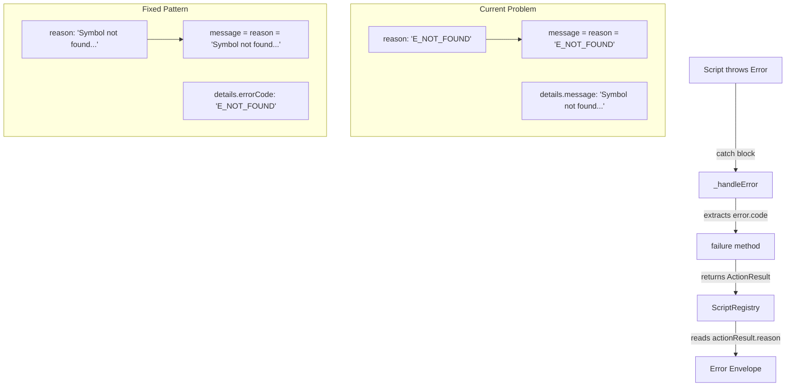
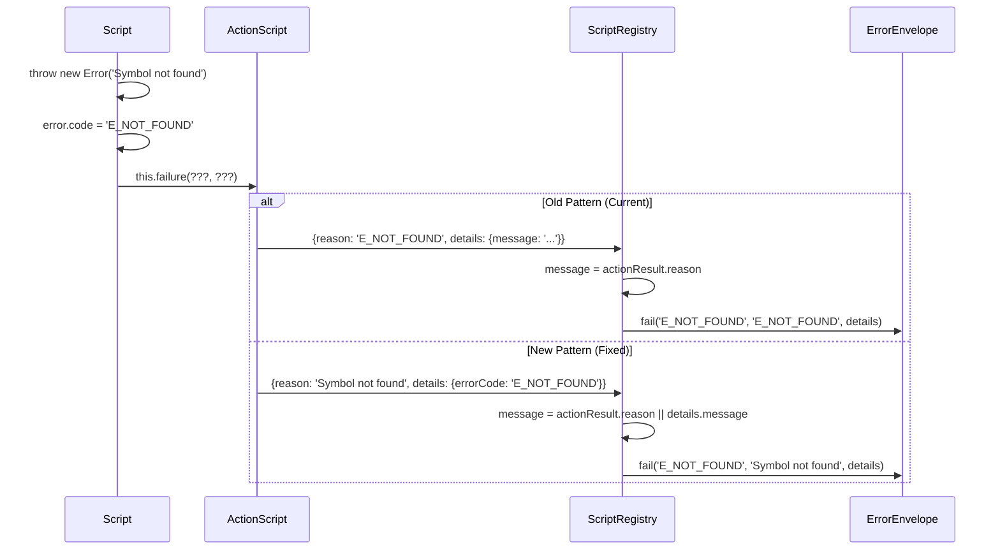

# Subtask 001: Fix ScriptRegistry Error Handling

**Title**: Fix ScriptRegistry error message loss and implement idiomatic error handling pattern
**Parent Plan**: [View Plan](../../lsp-features-plan.md)
**Parent Phase**: Phase 4: Method Replacement Tool
**Created**: 2025-10-31

---

## Parent Context

**Parent Plan:** [View Plan](../../lsp-features-plan.md)
**Parent Phase:** Phase 4: Method Replacement Tool
**Parent Task(s):** [T013: Implement comprehensive error handling](../tasks.md#task-t013), [T022: Execute dynamic scripts end-to-end validation](../tasks.md#task-t022)
**Plan Task Reference:** [Task 4.13 in Plan](../../lsp-features-plan.md#task-413)

**Why This Subtask:**
During Phase 4 testing, discovered that ScriptRegistry swallows descriptive error messages, replacing them with error codes (e.g., "E_NOT_FOUND" instead of "Symbol 'testVariableModification' not found"). This blocks proper error diagnosis and validation.

**Created:** 2025-10-31
**Requested By:** Development Team

---

## Tasks

| Status | ID | Task | Type | Dependencies | Absolute Path(s) | Validation | Notes |
|--------|----|----|------|--------------|------------------|------------|-------|
| [ ] | ST001 | Update ScriptRegistry to extract message from multiple sources | Core | – | /workspaces/vscode-bridge/packages/extension/src/core/registry/ScriptRegistry.ts (lines 462-470) | Message extracted from details.message when reason is error code | Supports T013 - defensive error extraction |
| [ ] | ST002 | Update ALL 41 scripts to use failure(message, { errorCode }) pattern | Core | ST001 | /workspaces/vscode-bridge/packages/extension/src/vsc-scripts/**/*.js | All scripts use idiomatic pattern consistently | Supports T013 - eliminate ambiguity permanently |
| [ ] | ST003 | Create ESLint rule to enforce correct failure() pattern | Core | – | /workspaces/vscode-bridge/.eslintrc.js or custom rule | Lint rule prevents regression to old pattern | Supports T013 - enforce pattern going forward |
| [ ] | ST004 | Rebuild extension with error handling fixes | Build | ST001-ST003 | /workspaces/vscode-bridge | just build completes successfully | Required for testing |
| [ ] | ST005 | Test code.replace-method with meaningful error messages | Test | ST004 | /workspaces/vscode-bridge/test/javascript/simple-debug-test.js | Error messages show full context, not just codes | Validates T022 - proper error reporting |
| [ ] | ST006 | Test symbol.rename with meaningful error messages | Test | ST004 | /workspaces/vscode-bridge/test | Error messages show full context | Validates T022 - proper error reporting |
| [ ] | ST007 | Document error handling pattern for future scripts | Doc | ST005-ST006 | /workspaces/vscode-bridge/docs/rules-idioms-architecture/error-handling-pattern.md | Pattern documented with examples | Prevents regression |

## Alignment Brief

### Objective
Fix ScriptRegistry error handling and migrate ALL 41 scripts to use the idiomatic error pattern. Eliminate the ambiguous dual-pattern situation permanently through comprehensive migration and linting enforcement.

### Checklist
- [ ] ScriptRegistry handles both old pattern (code in reason) and new pattern (message in reason)
- [ ] Scripts use idiomatic pattern: failure(message, { errorCode })
- [ ] Error messages show descriptive text, not just error codes
- [ ] Backward compatibility maintained for 39+ existing scripts
- [ ] No breaking changes to error contract

### Critical Findings Affecting This Subtask

From Phase 4 testing and error survey:

1. **Semantic Bug in Error Flow**: Scripts pass error code as `reason` parameter when calling `failure()`, but `reason` is meant for human-readable messages
2. **ScriptRegistry Line 467**: Extracts message from `actionResult.reason` which contains the error code, not the message
3. **Details Object Ignored**: Real error messages are in `details.message` but ScriptRegistry doesn't check there
4. **39 Existing Scripts**: Must maintain backward compatibility with scripts using old pattern

### Invariants/Guardrails
- **No Breaking Changes**: ScriptRegistry must handle both patterns gracefully
- **Preserve Error Context**: All VS Code API error properties must be preserved
- **Idiomatic Forward**: New pattern follows standard error conventions
- **Defensive Programming**: Check multiple sources for error messages

### Inputs to Read
- `/workspaces/vscode-bridge/packages/extension/src/core/registry/ScriptRegistry.ts` (lines 446-498)
- `/workspaces/vscode-bridge/packages/extension/src/vsc-scripts/code/replace-method.js` (lines 283-297)
- `/workspaces/vscode-bridge/packages/extension/src/vsc-scripts/symbol/rename.js` (lines 119-134)
- `/workspaces/vscode-bridge/packages/extension/src/core/scripts/base.ts` (lines 72-78)

### Visual Aids

#### Error Flow Diagram


#### ScriptRegistry Error Extraction Sequence


### Test Plan
1. **ST005**: Test error message from non-existent symbol
   - Run: `vscb script run code.replace-method --param path="/test/file.js" --param symbol="nonexistent"`
   - Verify: Message shows "Symbol 'nonexistent' not found in /test/file.js"
   - Not: "E_NOT_FOUND"

2. **ST006**: Test rename error messages
   - Run: `vscb script run symbol.rename --param path="/test/file.js" --param symbol="foo" --param newName="bar"`
   - Verify: Descriptive error messages for all failure modes

3. **Backward Compatibility**: Verify existing scripts still work

### Implementation Outline
1. **ST001**: Update ScriptRegistry.ts lines 462-470 to check multiple sources
2. **ST002-ST003**: Update scripts to use idiomatic pattern
3. **ST004**: Rebuild extension
4. **ST005-ST006**: Test both scripts with various error conditions
5. **ST007**: Document pattern for future scripts

### Commands to Run
```bash
# After changes
just build

# Test error messages
cd /workspaces/vscode-bridge/test
vscb script run code.replace-method --param path="$(pwd)/javascript/simple-debug-test.js" --param symbol="nonexistent"
vscb script run symbol.rename --param path="$(pwd)/javascript/simple-debug-test.js" --param symbol="nonexistent" --param newName="bar"
```

### Risks & Unknowns
- **Risk**: Other scripts may have unique error patterns not covered
  - **Mitigation**: ScriptRegistry uses defensive extraction from multiple sources
- **Risk**: Breaking existing scripts
  - **Mitigation**: Backward compatibility by checking both patterns
- **Unknown**: Full extent of scripts using non-idiomatic pattern
  - **Mitigation**: Gradual migration approach

### Ready Check
- [ ] Parent Phase 4 tasks T001-T012 complete (implementation done)
- [ ] Extension Host running with latest build
- [ ] Test files available in /test directory
- [ ] vscb CLI accessible
- [ ] Developer console available for error inspection

## Phase Footnote Stubs

*Footnotes will be added during plan-6 implementation to track specific changes*

| Footnote | File | Line Range | Description |
|----------|------|------------|-------------|
| (To be added during implementation) | | | |

## Evidence Artifacts

**Execution Log**: `001-subtask-fix-scriptregistry-error-handling.execution.log.md`
- Will be created by plan-6 during implementation
- Will capture before/after error messages
- Will document specific line changes

**Test Outputs**:
- Error message comparisons (before/after)
- Console logs showing proper error extraction

## After Subtask Completion

**This subtask resolves a blocker for:**
- Parent Task: [T013: Implement comprehensive error handling](../tasks.md#task-t013)
- Parent Task: [T022: Execute dynamic scripts end-to-end validation](../tasks.md#task-t022)
- Plan Task: [4.13: Implement comprehensive error handling](../../lsp-features-plan.md#task-413)

**When all ST### tasks complete:**

1. **Record completion** in parent execution log:
   ```
   ### Subtask 001-subtask-fix-scriptregistry-error-handling Complete

   Resolved: ScriptRegistry now preserves descriptive error messages
   See detailed log: [subtask execution log](./001-subtask-fix-scriptregistry-error-handling.execution.log.md)
   ```

2. **Update parent task** (if it was blocked):
   - Open: [`tasks.md`](../tasks.md)
   - Find: T013
   - Update Status: `[!]` → `[x]` (complete)
   - Update Notes: Add "Subtask 001-subtask-fix-scriptregistry-error-handling complete"

3. **Resume parent phase work:**
   ```bash
   /plan-6-implement-phase --phase "Phase 4: Method Replacement Tool" \
     --plan "/workspaces/vscode-bridge/docs/plans/25-lsp-features/lsp-features-plan.md"
   ```
   (Note: NO `--subtask` flag to resume main phase)

**Quick Links:**
- 📋 [Parent Dossier](../tasks.md)
- 📄 [Parent Plan](../../lsp-features-plan.md)
- 📊 [Parent Execution Log](../execution.log.md)

---

## Directory Structure

```
phase-4-method-replacement-tool/
├── tasks.md                                              # Parent dossier
├── execution.log.md                                      # Parent execution log
├── 001-subtask-fix-scriptregistry-error-handling.md     # This file
└── 001-subtask-fix-scriptregistry-error-handling.execution.log.md  # Will be created by plan-6
```