# Subtask 002: Remove Orphaned Mocha Test Suite

**Title**: Remove orphaned Mocha tests and consolidate test framework on Vitest
**Parent Plan**: [View Plan](../../lsp-features-plan.md)
**Parent Phase**: Phase 4: Method Replacement Tool
**Created**: 2025-10-31

---

## Parent Context

**Parent Plan:** [View Plan](../../lsp-features-plan.md)
**Parent Phase:** Phase 4: Method Replacement Tool
**Parent Task(s):** [T013: Implement comprehensive error handling](../tasks.md#task-t013), [T022: Execute dynamic scripts end-to-end validation](../tasks.md#task-t022)
**Plan Task Reference:** [Task 4.13 in Plan](../../lsp-features-plan.md#task-413)

**Why This Subtask:**
During Phase 4 test execution, discovered 23 Mocha test files (313 test cases) that are orphaned from the build system. Mocha is NOT in package.json dependencies, only `@types/mocha` exists. These tests conflict with Vitest (the configured test runner) and cause 24 test failures when running `npx vitest run test/unit`. The codebase has a framework mismatch requiring cleanup before test infrastructure can be validated.

**Created:** 2025-10-31
**Requested By:** Phase 4 Build Validation

---

## Tasks

| Status | ID | Task | Type | Dependencies | Absolute Path(s) | Validation | Notes |
|--------|----|----|------|--------------|------------------|------------|-------|
| [ ] | ST001 | Audit and categorize all 23 Mocha test files | Research | – | /workspaces/vscode-bridge/packages/extension/{test,src/test}/**/*.test.ts | Complete inventory created | Supports T013 - test infrastructure cleanup |
| [ ] | ST002 | Remove 11 unit test files (144 test cases) | Core | ST001 | /packages/extension/{test,src/test}/unit/**/*.test.ts | Files deleted, paths confirm removal | Mocha-based unit tests |
| [ ] | ST003 | Remove 11 integration test files (167 test cases) | Core | ST001 | /packages/extension/{src/test}/integration/**/*.test.ts | Files deleted, paths confirm removal | Mocha-based integration tests |
| [ ] | ST004 | Remove placeholder test file | Core | ST001 | /packages/extension/src/test/extension.test.ts | File deleted | Auto-generated sample test |
| [ ] | ST005 | Remove @types/mocha from package.json devDependencies | Config | ST001-ST004 | /packages/extension/package.json | Dependency removed, mocha/chai type imports gone | Cleanup Mocha references |
| [ ] | ST006 | Update package.json test scripts to reference Vitest only | Config | ST005 | /packages/extension/package.json | All test scripts point to Vitest/vscode-test | Remove mocha references |
| [ ] | ST007 | Run just build to verify no breakage | Integration | ST002-ST006 | /workspaces/vscode-bridge | Build succeeds, all 41 scripts compile | No regression |
| [ ] | ST008 | Verify Vitest test suite runs cleanly | Test | ST007 | /workspaces/vscode-bridge | Vitest runs without mocha conflicts | Test framework cleanup |

---

## Alignment Brief

### Objective
Remove 23 orphaned Mocha test files and 1 placeholder test that conflict with Vitest. Clean up @types/mocha dependency and test scripts to consolidate on Vitest as the single test runner.

### Checklist
- [ ] All 23 Mocha test files identified and categorized
- [ ] Unit test files deleted (11 files, 144 test cases)
- [ ] Integration test files deleted (11 files, 167 test cases)
- [ ] Placeholder test file deleted (1 file, 1 test case)
- [ ] @types/mocha removed from package.json
- [ ] Test scripts updated to reference Vitest only
- [ ] Build verification passes (no compilation errors)
- [ ] Vitest test execution validation (no mocha conflicts)

### Critical Findings Affecting This Subtask

**Finding 1: Mocha Not in Dependencies**
- `mocha` package NOT listed in `/packages/extension/package.json`
- Only `@types/mocha` exists (TypeScript type definitions)
- Files import `describe`, `it`, `suite` from mocha but run via Vitest
- This is a framework mismatch, not a supported test runner

**Finding 2: 23 Mocha Test Files Located**
- **11 unit tests** in `/packages/extension/src/test/unit/` and `/packages/extension/test/unit/`
  - Test categories: errors, schema validation, python detection, discovery, testing utilities
  - Contains 144 test cases
- **11 integration tests** in `/packages/extension/src/test/integration/`
  - Test categories: bridge context, lifecycle, factory, discovery, registry, cleanup
  - Contains 167 test cases
- **1 placeholder** in `/packages/extension/src/test/extension.test.ts`
  - Auto-generated by VSCode template
  - Contains 1 test case

**Finding 3: Test Run Failures**
When running `npx vitest run test/unit`:
- 24 test suites failed to load
- Root cause: File path resolution errors + missing 'vscode' module
- mocha/chai imports conflict with Vitest compatibility
- Prevention: Remove all Mocha test files

**Finding 4: Sinon Usage**
Two files use Sinon for mocking (requires migration if tests were to be kept):
- `/packages/extension/test/unit/testing/testExecutor.test.ts`
- `/packages/extension/test/unit/testing/cursorMapper.test.ts`
- Sinon `^21.0.0` IS in package.json (legitimate dependency)
- But only these 2 test files use it

### Invariants/Guardrails
- **No Breaking Changes**: Removing test files must not affect extension compilation
- **Vitest as Single Runner**: After cleanup, Vitest is the only test framework in use
- **Dependency Cleanup**: Remove @types/mocha to eliminate orphaned type references
- **Build Validation**: Extension builds cleanly after test file removal
- **No Code Changes**: Only test files are deleted; no production code is affected

### Inputs to Read
- `/packages/extension/package.json` - Verify Mocha/Chai/Sinon dependencies
- `/packages/extension/package-lock.json` - Verify dependency versions
- All 23 test files identified in audit report

### Visual Aids

#### Mocha Test Cleanup Flow

```mermaid
flowchart TD
    A[Phase 4 Build Validation] -->|Tests fail| B["Run: npx vitest run test/unit"]
    B -->|24 failures discovered| C["Audit Mocha Files"]
    C -->|23 Mocha files + 1 placeholder| D["Categorize by Type"]
    D -->|11 unit + 11 integration| E["Delete Test Files"]
    E -->|ST002-ST004| F["Remove @types/mocha"]
    F -->|ST005| G["Update package.json Scripts"]
    G -->|ST006| H["Run: just build"]
    H -->|Verify success| I["Extension compiles ✅"]
    I -->|All 41 scripts loaded| J["Cleanup complete"]
```



#### Test Framework Migration Timeline

```mermaid
sequenceDiagram
    participant Phase4 as Phase 4: Build
    participant TestAudit as Test Audit
    participant FileMgmt as File Management
    participant PkgMgr as Package Manager
    participant Build as Build System

    Phase4->>TestAudit: Discover Mocha/Vitest conflict
    TestAudit->>TestAudit: Catalog 23 test files
    TestAudit->>FileMgmt: Recommend deletion
    FileMgmt->>FileMgmt: Delete 23 Mocha test files
    FileMgmt->>FileMgmt: Delete 1 placeholder test
    FileMgmt->>PkgMgr: Remove @types/mocha
    PkgMgr->>PkgMgr: Update test scripts
    PkgMgr->>Build: Trigger build
    Build->>Build: Compile 41 scripts
    Build->>Phase4: ✅ Build success
```



### Test Plan

**ST001 - Audit Mocha Files:**
- Verify categorization of all 23 files
- Confirm count: 11 unit + 11 integration + 1 placeholder = 23 total
- Validate test case count: 144 + 167 + 1 = 312 test cases removed

**ST002-ST004 - Delete Test Files:**
- Confirm file deletion via filesystem check
- Verify no `.test.ts` or `.test.js` files remain in `/packages/extension/test/`
- Verify no `.test.ts` files remain in `/packages/extension/src/test/`

**ST005-ST006 - Cleanup Dependencies:**
- Verify @types/mocha removed from `devDependencies`
- Confirm `package.json` test scripts reference only Vitest/vscode-test
- No mocha imports remain in any `package.json` file

**ST007 - Build Verification:**
- Run: `just build`
- Expect: ✅ Full build complete
- Verify: All 41 scripts compile, manifest generated, schemas generated

**ST008 - Vitest Validation:**
- Run: `npx vitest run test-cli/lib` (non-integration tests that don't conflict)
- Expect: Tests pass or skip gracefully (no mocha conflicts)

### Implementation Outline

1. **ST001**: Run audit script to categorize test files
   - Provide detailed inventory: paths, file counts, test counts

2. **ST002-ST004**: Delete test files systematically
   - Delete `/packages/extension/src/test/unit/` (11 files)
   - Delete `/packages/extension/src/test/integration/` (11 files)
   - Delete `/packages/extension/src/test/extension.test.ts` (1 placeholder)
   - Delete `/packages/extension/test/unit/` if exists (1 file)

3. **ST005**: Modify `/packages/extension/package.json`
   - Remove line: `"@types/mocha": "^10.0.10"`
   - Verify no other mocha/chai references

4. **ST006**: Verify test scripts in `package.json`
   - Confirm all test scripts use: `vitest` or `vscode-test`
   - Example: `"test:unit": "vitest run test/core/fs-bridge/..."`

5. **ST007**: Run build verification
   - Command: `just build`
   - Capture: Build output for validation

6. **ST008**: Run Vitest smoke test
   - Command: `npx vitest run test-cli/lib --reporter=verbose`
   - Verify: No mocha/chai conflicts

### Commands to Run

```bash
# ST001: Verify test file locations
find /workspaces/vscode-bridge/packages/extension -name "*.test.ts" -o -name "*.test.js" | wc -l

# ST002-ST004: Delete test directories
rm -rf /workspaces/vscode-bridge/packages/extension/src/test/
rm -rf /workspaces/vscode-bridge/packages/extension/test/unit/

# ST005: Check mocha references
grep -r "mocha\|chai" /workspaces/vscode-bridge/packages/extension/package.json

# ST007: Build verification
just build

# ST008: Vitest smoke test
npx vitest run test-cli/lib --reporter=verbose 2>&1 | head -50
```

### Risks & Unknowns

**Risk 1: Unknown Test Dependencies**
- **Impact**: Removing tests might hide undocumented dependencies
- **Mitigation**: Tests are orphaned (not in CI/CD); Vitest is the real test framework
- **Confidence**: High - audit confirms mocha not in dependencies

**Risk 2: Test Coverage Loss**
- **Impact**: 313 test cases deleted
- **Mitigation**: These tests don't run in current CI/CD; Vitest integration tests are the real coverage
- **Confidence**: High - Mocha is not invoked anywhere

**Risk 3: Side Effects During Deletion**
- **Impact**: Accidentally delete non-test files
- **Mitigation**: Use careful path matching; verify deletions via `find` command
- **Confidence**: High - test directories are isolated

### Ready Check

- [ ] All 23 Mocha test files located and documented
- [ ] Sinon usage in 2 files identified (@types not needed after deletion)
- [ ] @types/mocha location confirmed in package.json
- [ ] Test script examples reviewed for Vitest references
- [ ] Backup of file list created (for reference)
- [ ] Build system tested (just build passes with current code)

---

## Phase Footnote Stubs

*Footnotes will be added during plan-6 implementation to track specific file deletions*

| Footnote | File | Lines Deleted | Description |
|----------|------|---------------|-------------|
| (To be added during implementation) | | | |

---

## Evidence Artifacts

**Execution Log**: `002-subtask-remove-mocha-tests.execution.log.md`
- Will be created by plan-6 during implementation
- Will record: files deleted, grep outputs, build output, test validation results

**Artifacts Directory**:
- Audit report listing all 23 test files (paths, line counts, test counts)
- Before/after screenshots of filesystem
- Build output before/after cleanup

---

## After Subtask Completion

**This subtask resolves blockers for:**
- Parent Task: [T013: Implement comprehensive error handling](../tasks.md#task-t013)
- Parent Task: [T022: Execute dynamic scripts end-to-end validation](../tasks.md#task-t022)
- Plan Task: [4.13: Implement comprehensive error handling](../../lsp-features-plan.md#task-413)
- Plan Task: [4.22: Execute dynamic scripts end-to-end validation](../../lsp-features-plan.md#task-422)

**When all ST### tasks complete:**

1. **Record completion** in parent execution log:
   ```
   ### Subtask 002-subtask-remove-mocha-tests Complete

   Resolved: Removed 23 orphaned Mocha test files and cleaned up test framework
   Cleaned: Deleted 312 test cases, removed @types/mocha dependency
   See detailed log: [subtask execution log](./002-subtask-remove-mocha-tests.execution.log.md)
   ```

2. **Update parent task** (if it was blocked):
   - Open: [`tasks.md`](../tasks.md)
   - Find: T013 and T022
   - Update Status: `[!]` → `[ ]` (unblock if needed)
   - Update Notes: Add "Subtask 002-subtask-remove-mocha-tests complete"

3. **Resume parent phase work:**
   ```bash
   /plan-6-implement-phase --phase "Phase 4: Method Replacement Tool" \
     --plan "/workspaces/vscode-bridge/docs/plans/25-lsp-features/lsp-features-plan.md"
   ```
   (Note: NO `--subtask` flag to resume main phase)

**Quick Links:**
- 📋 [Parent Dossier](../tasks.md)
- 📄 [Parent Plan](../../lsp-features-plan.md)
- 📊 [Parent Execution Log](../execution.log.md)

---

## Directory Structure

```
phase-4-method-replacement-tool/
├── tasks.md                                              # Parent dossier
├── execution.log.md                                      # Parent execution log
├── 001-subtask-fix-scriptregistry-error-handling.md     # Previous subtask
├── 002-subtask-remove-mocha-tests.md                    # This subtask
└── 002-subtask-remove-mocha-tests.execution.log.md      # (Created by plan-6)
```
