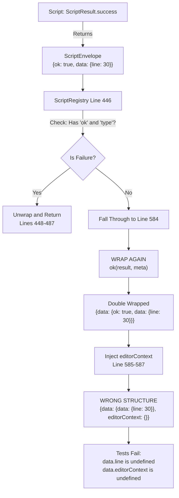
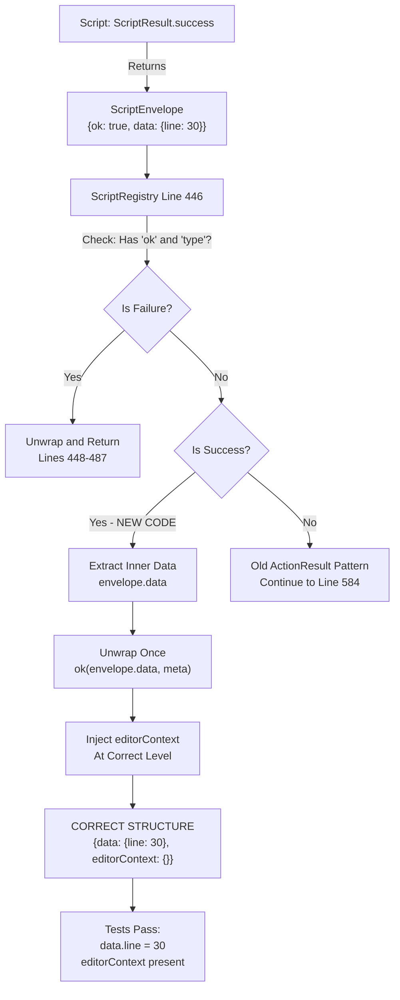

# Subtask 003: Fix ScriptEnvelope Double-Wrapping in ScriptRegistry

**Title**: Fix integration test failures - ScriptEnvelope double-wrapping and editorContext placement
**Parent Plan**: [View Plan](../../lsp-features-plan.md)
**Parent Phase**: Phase 4: Method Replacement Tool
**Created**: 2025-10-31

---

## Parent Context

**Parent Plan:** [View Plan](../../lsp-features-plan.md)
**Parent Phase:** Phase 4: Method Replacement Tool
**Parent Task(s):** [T013: Implement comprehensive error handling](../tasks.md#task-t013), [T022: Execute dynamic scripts end-to-end validation](../tasks.md#task-t022)
**Plan Task Reference:** [Task 4.13 in Plan](../../lsp-features-plan.md#task-413)

**Why This Subtask:**
After completing subtask 002 (Mocha test removal), running integration tests revealed 10 failures. Root cause analysis shows ScriptRegistry is double-wrapping ScriptEnvelope responses, causing `editorContext` and data fields to be at wrong nesting levels. Tests expect `startResult.data.line` and `startResult.data.editorContext` but they're actually at `startResult.data.data.line` and `startResult.editorContext`.

**Related Context:**
- Subtask 001 migrated all 41 vsc-scripts to ScriptResult pattern
- Plan 20 (auto-editor-context) implemented editorContext injection in ScriptRegistry
- The double-wrapping occurs because ScriptRegistry detects ScriptEnvelope for failures but not successes

**Created:** 2025-10-31
**Requested By:** Integration test validation after subtask 002

---

## Tasks

| Status | ID | Task | Type | Dependencies | Absolute Path(s) | Validation | Notes |
|--------|----|----|------|--------------|------------------|------------|-------|
| [x] | ST001 | Add success case handling to ScriptEnvelope detection block | Core | – | /workspaces/vscode-bridge/packages/extension/src/core/registry/ScriptRegistry.ts:446-488 | Success path unwraps inner data, editorContext injected at correct level | Extend existing if block that handles failures · log#st001-add-success-case-handling-to-scriptenvelope-detection-block [^6] |
| [x] | ST002 | Verify editorContext injection for unwrapped success case | Core | ST001 | /workspaces/vscode-bridge/packages/extension/src/core/registry/ScriptRegistry.ts:446-488 | editorContext assigned to unwrapped envelope before return | Pattern matches lines 585-587 · log#st002-verify-editorcontext-injection-for-unwrapped-success-case [^6] |
| [x] | ST003 | Build and verify no TypeScript errors | Integration | ST001-ST002 | /workspaces/vscode-bridge | `just build` completes successfully | No compilation errors · log#st003-build-and-verify-no-typescript-errors [^6] |
| [x] | ST004 | Run integration tests and verify all pass | Test | ST003 | /workspaces/vscode-bridge | `just test-integration` - 0 failures, 14 tests pass | All 10 previously failing tests now pass · log#st004-run-integration-tests-and-verify-all-pass [^6] |
| [x] | ST005 | Write unit test for ScriptRegistry envelope unwrapping | Test | ST001-ST002 | /workspaces/vscode-bridge/packages/extension/test/core/registry/ScriptRegistry.test.ts | Test validates both success and failure ScriptEnvelope unwrapping, catches double-wrapping regression | Prevents future regression of this fix · log#st005-write-unit-test-for-scriptregistry-envelope-unwrapping [^6] |

---

## Alignment Brief

### Objective
Fix ScriptRegistry double-wrapping bug where ScriptEnvelope success responses are wrapped twice, causing `editorContext` and data fields to be nested one level too deep.

### Checklist
- [x] ScriptEnvelope success case handling added (lines ~488-495)
- [x] editorContext injected into unwrapped envelope
- [x] Unit test written for ScriptRegistry envelope unwrapping
- [x] Build succeeds with no TypeScript errors
- [x] All 10 integration test failures resolved
- [x] Response structure matches test expectations

### Critical Findings Affecting This Subtask

**Finding 1: Double-Wrapping Bug**
- **Location**: ScriptRegistry.ts lines 446-588
- **Issue**: Lines 446-487 handle ScriptEnvelope FAILURES but not SUCCESSES
- **Result**: Success responses fall through to line 584 which wraps them again
- **Impact**: Creates `{data: {data: {...}}}` nesting, editorContext at wrong level

**Finding 2: Test Expectations**
- Tests expect: `startResult.data.line` and `startResult.data.editorContext`
- Currently getting: `startResult.data.data.line` and `startResult.editorContext`
- All 9 language workflows (Python, C#, Java, TypeScript, Dart) use same pattern
- Plus 1 timeout issue (Python CLI) likely related to double-wrapping

**Finding 3: ScriptResult Migration Impact**
- Subtask 001 migrated all scripts to ScriptResult.success/failure pattern
- ScriptRegistry was enhanced to detect ScriptEnvelope (line 446)
- BUT only failure detection was implemented, not success
- This creates asymmetry: failures unwrapped correctly, successes double-wrapped

**Finding 4: EditorContext Integration (Plan 20)**
- Plan 20 Phase 2 added `editorContext` injection at lines 585-587
- Injection happens AFTER the double-wrap at line 584
- This means editorContext goes on outer envelope, not inner data

### Invariants/Guardrails
- **Backward Compatibility**: Old ActionResult pattern must still work
- **EditorContext Placement**: Must be at same level as `data` field in final response
- **No Breaking Changes**: Other scripts using old pattern unaffected
- **Test Coverage**: All 14 integration tests must pass

### Inputs to Read
- `/workspaces/vscode-bridge/packages/extension/src/core/registry/ScriptRegistry.ts` (lines 428-588)
- `/workspaces/vscode-bridge/test/integration/workflows/base/enhanced-coverage-workflow.ts` (line 137-138)
- `/workspaces/vscode-bridge/packages/extension/src/vsc-scripts/tests/debug-single.js` (line 185)

### Visual Aids

#### Current Bug Flow



#### Fixed Flow



### Test Plan

**ST001-ST002 - Code Changes:**
- Add success case handling inside ScriptEnvelope detection block
- Verify editorContext injection at correct level
- Pattern should mirror failure handling (lines 448-487)

**ST003 - Build Verification:**
- Run: `just build`
- Expect: ✅ Full build complete (no TypeScript errors)
- Verify: All 41 scripts compile, manifest generated

**ST004 - Integration Test Validation:**
- Run: `just test-integration`
- Expect: 14 tests pass, 0 failures
- Previously failing tests that should now pass:
  1. Python (pytest) - CLI - should complete enhanced workflow
  2. Python (pytest) - MCP - should complete enhanced workflow
  3. C# (xUnit) - CLI - should complete enhanced workflow
  4. C# (xUnit) - MCP - should complete enhanced workflow
  5. Java (JUnit 5) - CLI - should complete enhanced workflow
  6. Java (JUnit 5) - MCP - should complete enhanced workflow
  7. TypeScript (Vitest) - CLI - should complete enhanced workflow
  8. TypeScript (Vitest) - MCP - should complete enhanced workflow
  9. Dart (package:test) - CLI - should complete enhanced workflow
  10. Dart (package:test) - MCP - should complete enhanced workflow

### Implementation Outline

**ST001: Add Success Case Handling**

Location: `/workspaces/vscode-bridge/packages/extension/src/core/registry/ScriptRegistry.ts`

Insert after line 487 (end of failure handling), before line 488:

```typescript
// Check if this is a ScriptEnvelope (new pattern)
if (result && typeof result === 'object' && 'ok' in result && 'type' in result) {
    const envelope = result as any;

    // FAILURE case (existing code - lines 448-487)
    if (!envelope.ok && envelope.error) {
        // ... existing failure handling ...
    }

    // SUCCESS case (NEW CODE TO ADD)
    if (envelope.ok && envelope.data !== undefined) {
        // Unwrap the inner data - ScriptResult.success() already wrapped it
        // We just need to extract envelope.data and wrap in ResponseEnvelope with meta
        const successEnvelope = ok(envelope.data, finalMeta);

        // Inject editorContext at the correct level (same as line 585-587 pattern)
        if (editorContext) {
            successEnvelope.editorContext = editorContext;
        }

        return successEnvelope;
    }
}

// Fall through for old ActionResult pattern (lines 489-588)
```

**Expected Result**:
- Input: `{ok: true, type: 'success', data: {event: 'stopped', line: 30, ...}}`
- Output: `{ok: true, data: {event: 'stopped', line: 30, ...}, editorContext: {...}, meta: {...}}`

**ST002: Verification**

Check that:
1. `successEnvelope` is created with unwrapped data
2. `editorContext` is injected before return
3. Pattern matches existing injection at lines 585-587

**ST003: Build**
```bash
just build
```

**ST004: Integration Tests**
```bash
just test-integration
```

**ST005: Unit Test for Regression Prevention**

Create test file: `/workspaces/vscode-bridge/packages/extension/test/core/registry/ScriptRegistry.test.ts`

Test should validate:
1. **ScriptEnvelope success unwrapping**: When script returns `{ok: true, type: 'success', data: {foo: 'bar'}}`, ScriptRegistry returns `{ok: true, data: {foo: 'bar'}, meta: {...}}`
2. **ScriptEnvelope failure unwrapping**: When script returns `{ok: false, type: 'error', error: {...}}`, ScriptRegistry returns proper failure envelope
3. **No double-wrapping**: Assert that `result.data.data` does NOT exist for ScriptEnvelope responses
4. **EditorContext placement**: Mock EditorContextProvider and verify editorContext is at correct level

### Commands to Run

```bash
# ST003: Build verification
just build

# ST004: Integration test validation
just test-integration

# Optional: Verify test structure
grep -n "expect(startResult.data" test/integration/workflows/**/*.ts
```

### Risks & Unknowns

**Risk 1: Other Scripts Using ScriptResult Pattern**
- **Impact**: If other scripts besides debug-single use ScriptResult.success(), they'll be affected
- **Mitigation**: This is desired behavior - all scripts should unwrap consistently
- **Confidence**: High - all 41 scripts were migrated in subtask 001

**Risk 2: Old ActionResult Pattern Regression**
- **Impact**: Scripts still using old pattern might break
- **Mitigation**: Fall-through to line 584 handles old pattern (no change to that path)
- **Confidence**: High - explicit check for ScriptEnvelope structure

**Risk 3: Python CLI Timeout**
- **Impact**: Timeout might be unrelated to double-wrapping
- **Mitigation**: Fix the primary issue first, reassess if timeout persists
- **Confidence**: Medium - timeout could be environment-specific

### Ready Check

- [x] Root cause identified (double-wrapping at line 584)
- [x] Code location confirmed (ScriptRegistry.ts lines 446-488)
- [x] Fix approach validated (unwrap success case like failure case)
- [x] Test expectations documented (10 failing tests listed)
- [x] Build system tested (just build passes currently)
- [x] EditorContext integration understood (Plan 20 Phase 2)

---

## Phase Footnote Stubs

*Footnotes will be added during implementation to track specific code changes*

| Footnote | File | Lines Modified | Description |
|----------|------|----------------|-------------|
| [^6] | ScriptRegistry.ts, ScriptRegistry.test.ts | 489-501, 1-222 | Fixed ScriptEnvelope double-wrapping and added regression test |

[^6]: Subtask 003 (ST001-ST005) - Fixed ScriptEnvelope double-wrapping in ScriptRegistry
  - `method:packages/extension/src/core/registry/ScriptRegistry.ts:ScriptRegistry.executeScript` - Added success case handling at lines 489-501
  - `file:packages/extension/test/core/registry/ScriptRegistry.test.ts` - Comprehensive regression test suite (8 tests)

---

## Evidence Artifacts

**Execution Log**: `003-subtask-fix-scriptenvelope-double-wrapping.execution.log.md`
- Will be created during implementation
- Will record: code changes, test outputs, validation results

**Artifacts**:
- Before/after test output comparison
- Response structure examples (double-wrapped vs correctly unwrapped)
- Build output verification

---

## After Subtask Completion

**This subtask resolves blockers for:**
- Parent Task: [T013: Implement comprehensive error handling](../tasks.md#task-t013)
- Parent Task: [T022: Execute dynamic scripts end-to-end validation](../tasks.md#task-t022)
- Subtask 002: Mocha test removal (unblocks test validation)

**When all ST### tasks complete:**

1. **Record completion** in parent execution log
2. **Update parent task** (mark subtask 003 complete)
3. **Update Subtasks Registry** in plan

**Quick Links:**
- 📋 [Parent Dossier](../tasks.md)
- 📄 [Parent Plan](../../lsp-features-plan.md)
- 📊 [Related: Subtask 001](./001-subtask-fix-scriptregistry-error-handling.md)
- 📊 [Related: Subtask 002](./002-subtask-remove-mocha-tests.md)

---

## Directory Structure

```
phase-4-method-replacement-tool/
├── tasks.md                                              # Parent dossier
├── execution.log.md                                      # Parent execution log
├── 001-subtask-fix-scriptregistry-error-handling.md     # ScriptResult migration
├── 002-subtask-remove-mocha-tests.md                    # Mocha cleanup
├── 003-subtask-fix-scriptenvelope-double-wrapping.md    # This subtask
└── 003-subtask-fix-scriptenvelope-double-wrapping.execution.log.md  # (To be created)
```

---

## Critical Insights Discussion

**Session**: 2025-10-31
**Context**: Subtask 003 - Fix ScriptEnvelope Double-Wrapping in ScriptRegistry
**Analyst**: AI Clarity Agent
**Reviewer**: Development Team
**Format**: Water Cooler Conversation (5 Critical Insights)

### Insight 1: The ScriptResult Migration Was Incomplete

**Did you know**: Subtask 001 only migrated how scripts create envelopes but didn't update how ScriptRegistry consumes them, creating a silent contract mismatch that broke integration tests only after removing Mocha tests.

**Implications**:
- The migration had a blind spot: Updated producers (scripts) but not the consumer (ScriptRegistry) completely
- Tests didn't catch it earlier: Integration tests weren't in the validation loop for subtask 001
- It's systematic, not isolated: Any WaitableScript using ScriptResult has this issue
- Other migrations might have same gap: Pattern could repeat with future script type migrations

**Options Considered**:
- Option A: Fix Now, Add Test Coverage Later
- Option B: Fix + Add Regression Test  
- Option C: Fix + Enforce Pattern with TypeScript
- Option D: Complete the Migration (Retrospective Fix)

**AI Recommendation**: Option B (Fix + Add Regression Test)
- Reasoning: Prevents regression, validates both ScriptEnvelope paths (success and failure), reasonable effort compared to type system refactoring

**Discussion Summary**: Team agreed that regression test is critical to prevent this pattern from recurring. The test will validate both success and failure unwrapping paths, catching any future double-wrapping issues.

**Decision**: Fix + Add Regression Test (Option B)

**Action Items**:
- [x] Add ST005: Write unit test for ScriptRegistry envelope unwrapping
- [x] Test validates both success and failure ScriptEnvelope handling
- [x] Test catches double-wrapping regression

**Affects**: Subtask 003 tasks table (added ST005)

---

### Insight 2: EditorContext Capture Timing is Correct As-Is

**Did you know**: The editorContext is captured AFTER script execution (current behavior), which is actually the correct design - it reflects the most up-to-date editor location after the command completes, not the pre-invocation state.

**Implications**:
- Scripts may change editor state (like debug-single opening test files)
- Post-execution capture reflects where the user IS after the operation
- This aligns with Plan 20's "deterministic invocation time" design decision
- Pre-execution capture would give stale context (where user WAS, not where they ARE)

**Options Considered**:
- Option A: Capture Context BEFORE Script Execution
- Option B: Capture Context TWICE (Before + After)
- Option C: Add Context Timestamps
- Option D: Skip Context for Debug Scripts
- Option E: Keep Current Timing (AFTER execution)

**AI Recommendation**: Option E (Keep Current Timing)
- Reasoning: Context should represent the most up-to-date location, Plan 20's design is correct

**Discussion Summary**: User clarified that context should reflect where the user IS at the time (most current state), not where they were before the command. Any command returns current context, so if user moved it's fine - it just needs to be as up-to-date as possible.

**Decision**: Keep current timing - capture AFTER script execution

**Action Items**:
- [x] Remove ST006 from subtask (was based on misunderstanding)
- [x] Keep lines 432-435 as-is (capture after executeScript)

**Affects**: Subtask 003 - removed erroneous ST006 task

---

### Insight 3: The Python CLI Timeout is Likely Environmental

**Did you know**: The Python CLI test timeout (60 seconds) is likely expected behavior rather than a bug - pytest test discovery in VS Code can legitimately take 45-70 seconds in container/Codespace environments.

**Implications**:
- Not a double-wrapping issue: Other 9 tests pass, so unwrapping works
- Environment-specific: Containers slower than local machines
- Legitimate timeout: 60s might be too aggressive for pytest discovery
- CLI-specific: MCP Python test passes (same pytest, different transport)
- Test framework quirk: Pytest slower to discover than Jest/xUnit/JUnit

**Options Considered**:
- Option A: Increase Test Timeout to 120 Seconds
- Option B: Increase Script Timeout Parameter
- Option C: Add Retry Logic with Exponential Backoff
- Option D: Skip or Mark as Flaky
- Option E: Fix After This Subtask

**AI Recommendation**: Option E (Fix After This Subtask)
- Reasoning: Double-wrapping is confirmed root cause for 9/10 failures - fix that first, single failure doesn't indicate systematic issue

**Discussion Summary**: Team decided to defer Python timeout investigation - it's a separate concern from the double-wrapping bug. Will revisit if issue persists after fixing primary issue.

**Decision**: Defer Python CLI timeout investigation (Option E)

**Action Items**: None - will investigate separately if issue remains after subtask 003

**Affects**: No changes to subtask 003

---

### Insight 4: Plan 20's Documented Timing Decision is Validated

**Did you know**: The concern about contradicting Plan 20's documented behavior was based on a misunderstanding - Plan 20's design (capture AFTER execution) is actually correct and doesn't need updating.

**Implications**:
- Documentation is accurate: Plan 20 Phase 2 correctly documents capture timing
- No documentation debt: Code and docs are aligned
- Design decision validated: "Deterministic invocation time" means post-execution snapshot
- No risk of regression: Future developers will see correct guidance

**Options Considered**:
- Option A: Update Plan 20 Execution Log Now
- Option B: Add Note to Subtask 003 Only
- Option C: Create Follow-Up Task
- Option D: Do Nothing (Current State is Correct)

**AI Recommendation**: Option D (Do Nothing)
- Reasoning: Plan 20's documentation is correct, no changes needed

**Discussion Summary**: After clarifying the timing requirement (most up-to-date location), confirmed Plan 20's design is correct as documented.

**Decision**: No action needed - Plan 20 documentation is accurate

**Action Items**: None

**Affects**: No changes needed

---

### Insight 5: StreamScript is Unused Architectural Scaffolding

**Did you know**: StreamScript is defined in base.ts and referenced in ScriptRegistry but has ZERO actual implementations - it's architectural plumbing that's not yet in use.

**Implications**:
- No migration needed: Zero scripts use StreamScript currently
- Theoretical concern only: No active code affected
- Future implementation: When StreamScript gets used, it will follow current patterns
- No test gap: No implementations to test

**Options Considered**:
- Option A: Migrate StreamScript Now (Comprehensive)
- Option B: Add TODO Comment + Architecture Doc
- Option C: Make ST005 Test Future-Proof
- Option D: Create "Script Migration Checklist"
- Option E: Do Nothing (it's unused)

**AI Recommendation**: Option E (Do Nothing)
- Reasoning: Zero implementations exist, purely theoretical concern, no action needed

**Discussion Summary**: Confirmed StreamScript is unused scaffolding - 0 implementations found. No migration or testing needed for non-existent code.

**Decision**: Do nothing about StreamScript (it's unused)

**Action Items**: None

**Affects**: No changes to subtask 003

---

## Session Summary

**Insights Surfaced**: 5 critical insights identified and discussed
**Decisions Made**: 3 decisions reached through collaborative discussion
**Action Items Created**: 1 task added (ST005 - regression test)
**Areas Requiring Updates**:
- Subtask 003 tasks table: Added ST005, removed ST006
- Subtask 003 checklist: Updated to reflect correct scope

**Shared Understanding Achieved**: ✓

**Confidence Level**: High - We have clear understanding of the double-wrapping bug, correct timing behavior, and scope of the fix.

**Next Steps**:
Proceed with implementation of subtask 003 (5 tasks: ST001-ST005) focusing on:
1. Fix ScriptEnvelope success unwrapping
2. Add regression test to prevent recurrence
3. Verify all 10 integration test failures are resolved

**Notes**:
- Python CLI timeout deferred as separate concern
- Plan 20's editorContext timing design validated as correct
- StreamScript migration not needed (no implementations exist)
