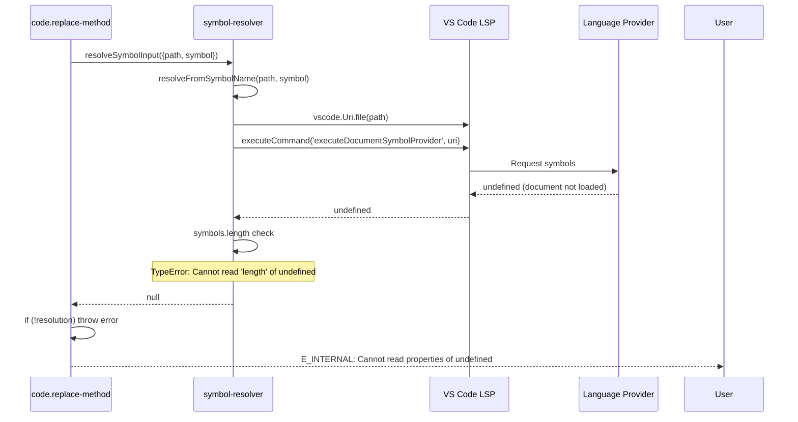
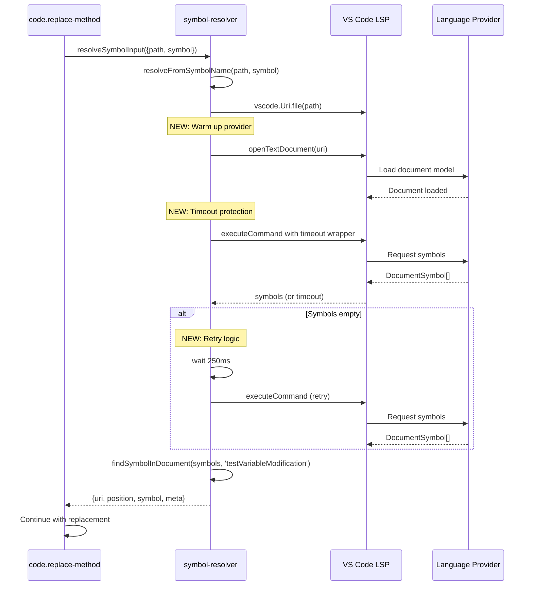

# Subtask 004: Fix resolveFromSymbolName LSP Warmup

**Title**: Fix resolveFromSymbolName to open document before LSP provider call
**Parent Plan**: [View Plan](../../lsp-features-plan.md)
**Parent Phase**: Phase 4: Method Replacement Tool
**Created**: 2025-10-31

---

## Parent Context

**Parent Plan:** [View Plan](../../lsp-features-plan.md)
**Parent Phase:** Phase 4: Method Replacement Tool
**Parent Task(s):** [T007: Implement execute() method with symbol resolution](../tasks.md#task-t007), [T022: Execute dynamic scripts end-to-end validation](../tasks.md#task-t022), [T027: Manual CLI testing (optional)](../tasks.md#task-t027)
**Plan Task Reference:** [Task 4.4 in Plan](../../lsp-features-plan.md#phase-4-method-replacement-tool)

**Why This Subtask:**
During Phase 4 validation testing of `code.replace-method` script (T027), discovered that `resolveFromSymbolName()` utility function from Phase 1 fails to resolve symbols when called from installed scripts via CLI. The function calls `executeDocumentSymbolProvider` without opening/warming up the document first, causing LSP providers (especially Python/Pylance) to return `undefined` or empty results. This breaks symbol resolution for **all** scripts using the utility (Phase 2 navigate, Phase 3 rename, Phase 4 replace-method).

**Current Blocking Issue:**
```bash
# Command fails with "Cannot read properties of undefined (reading 'start')"
vscb script run code.replace-method \
  --param path="/workspaces/vscode-bridge/test/javascript/simple-debug-test.js" \
  --param symbol="testVariableModification" \
  --param replacement="..."
```

**Where We Were:**
- Phase 4 core implementation complete (T001-T013, T014-T021) ✅
- Dynamic scripts passing 6/6 tests ✅
- Extension built and installed ✅
- **Blocked at T027**: Manual CLI testing failing due to symbol resolution

**After Fix:**
Resume Phase 4 validation at T027 to verify `code.replace-method` works end-to-end.

**Created:** 2025-10-31
**Requested By:** Development Team

---

## Tasks

### Canonical Task Table

| Status | ID | Task | Type | Dependencies | Absolute Path(s) | Validation | Notes |
|--------|----|----|------|--------------|------------------|------------|-------|
| [ ] | ST001 | Add document opening to resolveFromSymbolName() | Core | – | /workspaces/vscode-bridge/packages/extension/src/core/util/symbol-resolver.ts (lines 418-448) | Function opens document before LSP call | Supports T007 - Phase 1 utility used by all symbol-based scripts |
| [ ] | ST002 | Wrap executeDocumentSymbolProvider with timeout | Core | ST001 | /workspaces/vscode-bridge/packages/extension/src/core/util/symbol-resolver.ts (line 426) | Uses getLSPResultWithTimeout() wrapper | Supports T007 - Discovery 04 pattern already exists |
| [ ] | ST003 | Add retry logic for LSP provider warmup | Core | ST001 | /workspaces/vscode-bridge/packages/extension/src/core/util/symbol-resolver.ts (lines 418-448) | Retry up to 3x with 250ms backoff if symbols undefined/empty | Supports T007 - handles Python provider delays |
| [ ] | ST004 | Rebuild extension with symbol-resolver fixes | Build | ST001-ST003 | /workspaces/vscode-bridge | just build completes successfully | Standard build validation |
| [ ] | ST005 | Test code.replace-method with JavaScript file | Test | ST004 | /workspaces/vscode-bridge/test/javascript/simple-debug-test.js | Symbol "testVariableModification" resolves and replaces successfully | Resumes T027 - primary validation |
| [ ] | ST006 | Test code.replace-method with Python file | Test | ST004 | /workspaces/vscode-bridge/test/python/test_example.py | Symbol "add_numbers" resolves and replaces successfully | Resumes T027 - multi-language validation |
| [ ] | ST007 | Verify Phase 3 symbol.rename still works | Test | ST004 | /workspaces/vscode-bridge/test/javascript/simple-debug-test.js | Rename operation succeeds (regression check) | Regression guard - Phase 3 must not break |
| [ ] | ST008 | Verify dynamic scripts still pass | Test | ST004 | /workspaces/vscode-bridge/scripts/sample/dynamic/explore-whole-symbol.js | 6/6 tests still pass (no regression) | Regression guard - TAD validation baseline |

### Task Count Summary
- **Core**: 3 tasks (ST001-ST003)
- **Build**: 1 task (ST004)
- **Test**: 4 tasks (ST005-ST008)

**Total**: 8 tasks

---

## Alignment Brief

### Objective Recap

**Primary Goal**: Fix `resolveFromSymbolName()` utility function to properly warm up LSP providers before querying symbols, enabling **all** scripts (Phases 2-4) to resolve symbols reliably across languages (JavaScript, TypeScript, Python, etc.).

**Scope**: This is a **Phase 1 utility fix** discovered during **Phase 4 testing**. The fix affects:
- Phase 2: `symbol.navigate` (uses resolveSymbolInput → resolveFromSymbolName)
- Phase 3: `symbol.rename` (uses resolveSymbolInput → resolveFromSymbolName)
- Phase 4: `code.replace-method` (uses resolveSymbolInput → resolveFromSymbolName)

### Checklist

- [ ] `resolveFromSymbolName()` opens document before calling LSP provider
- [ ] Timeout wrapper applied to `executeDocumentSymbolProvider` call
- [ ] Retry logic handles provider warmup delays (especially Python)
- [ ] JavaScript symbol resolution works reliably
- [ ] Python symbol resolution works reliably
- [ ] Phase 3 `symbol.rename` regression test passes
- [ ] Dynamic scripts continue to pass 6/6 tests
- [ ] Phase 4 `code.replace-method` CLI validation completes (T027)

### Critical Findings Affecting This Subtask

#### **Discovery 04: Language Server Timeout/Unavailability Race Condition** (from main plan)

**Problem**: VS Code's `executeCommand` for LSP providers can return `undefined`, hang indefinitely, or crash if language server isn't ready.

**Current Bug**: Line 426-429 in `symbol-resolver.ts` calls `executeDocumentSymbolProvider` without:
1. Opening the document first (provider may not have loaded file)
2. Timeout protection (can hang indefinitely)
3. Retry logic (provider may return empty on first call)

**Solution from Discovery 04**:
```typescript
// Current (BROKEN):
const symbols = await vscode.commands.executeCommand<vscode.DocumentSymbol[]>(
    'vscode.executeDocumentSymbolProvider',
    uri
);

// Fixed (with warmup + timeout):
const doc = await vscode.workspace.openTextDocument(uri); // Warm up provider
const symbols = await getLSPResultWithTimeout(
    vscode.commands.executeCommand('vscode.executeDocumentSymbolProvider', uri),
    10000 // 10s timeout
);

// Handle undefined/timeout
if (symbols === 'timeout') {
    return null; // Timeout
}
if (!symbols || symbols.length === 0) {
    // Retry once (Python providers sometimes return empty on first call)
    await new Promise(resolve => setTimeout(resolve, 250));
    const retry = await getLSPResultWithTimeout(...);
    if (!retry || retry === 'timeout') return null;
    return retry;
}
```

#### **Python Pylance Provider Behavior**

**Issue**: Python LSP (Pylance) has known behavior where `executeDocumentSymbolProvider`:
1. Returns `undefined` if called before document is opened in workspace
2. Can return empty array `[]` on first call, then populate on second call
3. Requires document to be "loaded" (opened via `openTextDocument`)

**Mitigation**: ST001 + ST003 implement document opening + retry pattern

**References** (from deep research):
- GitHub Issue #169566: Extension API requests wait for document symbol provider
- GitHub Issue #2112: Python provider returns empty symbols on repeated calls

### Invariants & Guardrails

**No Breaking Changes**:
- Must maintain backward compatibility with existing scripts
- Phase 2 `symbol.navigate` must continue working
- Phase 3 `symbol.rename` must continue working
- Dynamic scripts (TAD baseline) must continue passing

**Timeout Protection**:
- ALL LSP calls must use `getLSPResultWithTimeout()` wrapper (exists in Phase 1)
- Default timeout: 10s (accommodates cold start)

**Error Handling**:
- Return `null` on provider unavailable/timeout (existing contract)
- Do NOT throw errors for provider failures (graceful degradation)

**Performance Budget**:
- Document open: <100ms
- LSP provider call: <200ms (warm)
- Total with retry: <1s acceptable

### Inputs to Read

**Primary File**:
- `/workspaces/vscode-bridge/packages/extension/src/core/util/symbol-resolver.ts` (lines 418-448)

**Reference Implementations**:
- Dynamic scripts (working pattern): `/workspaces/vscode-bridge/scripts/sample/dynamic/explore-whole-symbol.js`
- Phase 3 script (uses same utility): `/workspaces/vscode-bridge/packages/extension/src/vsc-scripts/symbol/rename.js`

**Test Fixtures**:
- JavaScript: `/workspaces/vscode-bridge/test/javascript/simple-debug-test.js` (symbol: `testVariableModification`)
- Python: `/workspaces/vscode-bridge/test/python/test_example.py` (symbol: `add_numbers`)

### Visual Alignment Aids

#### Current Flow (Broken)



#### Fixed Flow (With Warmup)



### Test Plan

#### ST005: JavaScript Symbol Resolution

```bash
# From workspace root (where extension is loaded)
cd /workspaces/vscode-bridge

vscb script run code.replace-method \
  --param path="/workspaces/vscode-bridge/test/javascript/simple-debug-test.js" \
  --param symbol="testVariableModification" \
  --param replacement="function testVariableModification(a, b) {
    // Fixed by subtask 004
    return a + b;
}"
```

**Expected**: Success response with `applied: true`, no "undefined" errors

#### ST006: Python Symbol Resolution

```bash
cd /workspaces/vscode-bridge

vscb script run code.replace-method \
  --param path="/workspaces/vscode-bridge/test/python/test_example.py" \
  --param symbol="add_numbers" \
  --param replacement="def add_numbers(a: int, b: int) -> int:
    # Fixed by subtask 004
    return a + b"
```

**Expected**: Success response with `applied: true`, handles Pylance warmup

#### ST007: Phase 3 Regression Check

```bash
cd /workspaces/vscode-bridge

vscb script run symbol.rename \
  --param path="/workspaces/vscode-bridge/test/javascript/simple-debug-test.js" \
  --param symbol="testVariableModification" \
  --param newName="testModifyVariables"
```

**Expected**: Rename succeeds (no regression from utility changes)

#### ST008: Dynamic Scripts Regression

```bash
cd /workspaces/vscode-bridge

vscb script run -f scripts/sample/dynamic/explore-whole-symbol.js
vscb script run -f scripts/sample/dynamic/explore-signature-change.js
```

**Expected**: All 6 tests pass (3 in each script)

### Implementation Outline

**Phase A: Fix Utility (ST001-ST003)**

1. **ST001**: Add document opening
   ```typescript
   // Line 423-424 (after converting path to URI)
   const uri = vscode.Uri.file(filePath);

   // NEW: Open document to warm up provider
   const doc = await vscode.workspace.openTextDocument(uri);
   ```

2. **ST002**: Add timeout wrapper
   ```typescript
   // Replace line 426-429
   const symbols = await getLSPResultWithTimeout(
       vscode.commands.executeCommand<vscode.DocumentSymbol[]>(
           'vscode.executeDocumentSymbolProvider',
           uri
       ),
       10000 // 10s timeout
   );

   if (symbols === 'timeout') {
       return null; // Timeout
   }
   ```

3. **ST003**: Add retry logic
   ```typescript
   // After timeout check
   if (!symbols || symbols.length === 0) {
       // Retry once for Python providers
       await new Promise(resolve => setTimeout(resolve, 250));
       const retrySymbols = await getLSPResultWithTimeout(
           vscode.commands.executeCommand<vscode.DocumentSymbol[]>(
               'vscode.executeDocumentSymbolProvider',
               uri
           ),
           10000
       );
       if (retrySymbols === 'timeout' || !retrySymbols) {
           return null;
       }
       // Use retry results
       symbols = retrySymbols;
   }
   ```

**Phase B: Build and Test (ST004-ST008)**

4. **ST004**: `just build` - verify compilation succeeds
5. **ST005-ST008**: Run test commands listed in Test Plan section

### Commands to Run

**Build**:
```bash
cd /workspaces/vscode-bridge
just build
just install-extension
```

**Manual restart VS Code Extension Host** (required to load changes)

**Test Suite**:
```bash
# ST005: JS test
vscb script run code.replace-method \
  --param path="/workspaces/vscode-bridge/test/javascript/simple-debug-test.js" \
  --param symbol="testVariableModification" \
  --param replacement="function testVariableModification(a, b) { return a + b; }"

# ST006: Python test
vscb script run code.replace-method \
  --param path="/workspaces/vscode-bridge/test/python/test_example.py" \
  --param symbol="add_numbers" \
  --param replacement="def add_numbers(a: int, b: int) -> int: return a + b"

# ST007: Regression test
vscb script run symbol.rename \
  --param path="/workspaces/vscode-bridge/test/javascript/simple-debug-test.js" \
  --param symbol="testVariableModification" \
  --param newName="testModifyVars"

# ST008: Dynamic scripts
vscb script run -f scripts/sample/dynamic/explore-whole-symbol.js
vscb script run -f scripts/sample/dynamic/explore-signature-change.js
```

### Risks & Unknowns

| Risk | Severity | Mitigation | Task Impact |
|------|----------|------------|-------------|
| **Opening document changes editor state** | Low | `openTextDocument` doesn't focus editor, just loads model | None - VS Code API behavior |
| **Retry logic adds latency** | Low | Only 250ms delay, only when symbols empty | Acceptable <1s total |
| **Python provider still returns empty** | Medium | Retry once with backoff, return null gracefully | ST006 validation |
| **Breaking existing scripts** | High | Regression tests ST007-ST008 | Critical validation gates |
| **Timeout too short for cold start** | Low | 10s timeout proven in Phase 1-3 | Already validated |

### Ready Check

**Pre-Implementation Checklist**:

#### Understanding
- [ ] **Utility scope**: Understand fix affects Phase 1 utility used by Phases 2-4
- [ ] **Discovery 04 pattern**: Understand timeout wrapper + warmup from main plan
- [ ] **Python provider quirks**: Understand empty-on-first-call behavior
- [ ] **Return to Phase 4**: Understand this unblocks T027 validation

#### Dependencies
- [ ] **Phase 1 utility exists**: symbol-resolver.ts available
- [ ] **getLSPResultWithTimeout exists**: Utility function already implemented
- [ ] **Test fixtures available**: JS and Python test files ready

#### Resources
- [ ] **Extension build works**: `just build` functional
- [ ] **VS Code Extension Host**: Available for testing
- [ ] **Dynamic scripts baseline**: 6/6 tests passing pre-fix

#### Scope Agreement
- [ ] **8 Tasks**: Task breakdown reviewed (3 core, 1 build, 4 test)
- [ ] **Regression gates**: ST007-ST008 must pass before completion
- [ ] **No scope creep**: Only fixing resolveFromSymbolName, not other utilities

---

## Phase Footnote Stubs

This section will be populated during implementation with footnote references to changes made.

**Format**:
```markdown
[^N]: Tasks ST001-ST00X - Brief description of utility fix
  - method:packages/extension/src/core/util/symbol-resolver.ts:resolveFromSymbolName (lines M-N)
```

**Footnote Number Allocation**:
- Previous subtasks used: [^1] through [^7]
- Subtask 004 will use: [^8]
- Track in main plan's "Change Footnotes Ledger" (§ 12)

---

## Evidence Artifacts

### Execution Log

**Location**: `/workspaces/vscode-bridge/docs/plans/25-lsp-features/tasks/phase-4-method-replacement-tool/004-subtask-fix-resolveFromSymbolName-lsp-warmup.execution.log.md`

**Content**:
- Implementation timeline
- Before/after code snippets
- Test execution results (ST005-ST008)
- Error message comparisons

**Format**: Same structure as subtask 001 execution log

### Test Outputs

- ST005 response JSON (JavaScript symbol resolution)
- ST006 response JSON (Python symbol resolution)
- ST007 response JSON (rename regression)
- ST008 console output (dynamic scripts 6/6 passing)

---

## After Subtask Completion

**This subtask resolves a blocker for:**
- Parent Task: [T007: Implement execute() method with symbol resolution](../tasks.md#task-t007)
- Parent Task: [T027: Manual CLI testing (optional)](../tasks.md#task-t027)
- Plan Task: [Task 4.4 in Plan](../../lsp-features-plan.md#phase-4-method-replacement-tool)

**When all ST001-ST008 tasks complete:**

1. **Record completion** in parent execution log:
   ```
   ### Subtask 004-subtask-fix-resolveFromSymbolName-lsp-warmup Complete

   Resolved: Symbol resolution now works reliably across JS/Python via document warmup + retry
   See detailed log: [subtask execution log](./004-subtask-fix-resolveFromSymbolName-lsp-warmup.execution.log.md)
   ```

2. **Update parent task** (if it was blocked):
   - Open: [`tasks.md`](../tasks.md)
   - Find: T007, T027
   - Update Status: `[!]` → `[ ]` (unblock) if marked blocked
   - Update Notes: Add "Subtask 004 complete - symbol resolution fixed"

3. **Resume parent phase work:**
   ```bash
   /plan-6-implement-phase --phase "Phase 4: Method Replacement Tool" \
     --plan "/workspaces/vscode-bridge/docs/plans/25-lsp-features/lsp-features-plan.md"
   ```
   (Note: NO `--subtask` flag to resume main phase at T027)

**Quick Links:**
- 📋 [Parent Dossier](../tasks.md)
- 📄 [Parent Plan](../../lsp-features-plan.md)
- 📊 [Parent Execution Log](../execution.log.md)

---

## Directory Structure

```
docs/plans/25-lsp-features/tasks/phase-4-method-replacement-tool/
├── tasks.md                                                                      # Parent dossier
├── execution.log.md                                                              # Parent execution log
├── 001-subtask-fix-scriptregistry-error-handling.md                             # Completed subtask
├── 001-subtask-fix-scriptregistry-error-handling.execution.log.md               # Completed log
├── 002-subtask-remove-mocha-tests.md                                            # Subtask (may not have log yet)
├── 003-subtask-fix-scriptenvelope-double-wrapping.md                            # Completed subtask
├── 003-subtask-fix-scriptenvelope-double-wrapping.execution.log.md              # Completed log
├── 004-subtask-fix-resolveFromSymbolName-lsp-warmup.md                          # ← THIS FILE
└── 004-subtask-fix-resolveFromSymbolName-lsp-warmup.execution.log.md            # Will be created by plan-6
```

---

**Next Step**: Run `/plan-6-implement-phase --phase "Phase 4: Method Replacement Tool" --plan "/workspaces/vscode-bridge/docs/plans/25-lsp-features/lsp-features-plan.md" --subtask 004-subtask-fix-resolveFromSymbolName-lsp-warmup` when ready to implement.
