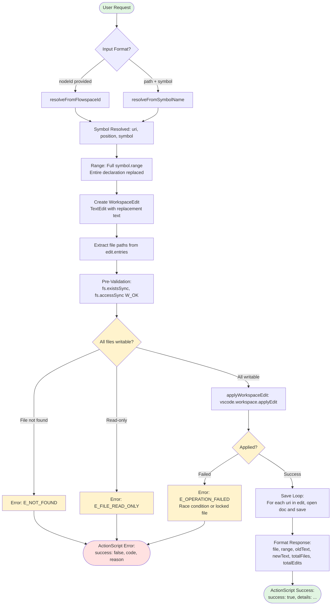
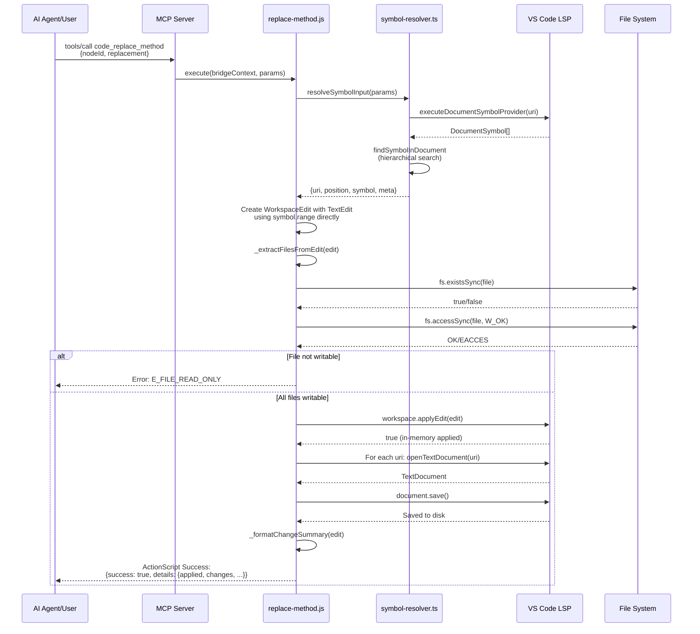

# Phase 4: Method Replacement Tool - Tasks & Alignment Brief

**Phase**: Phase 4 of 7
**Slug**: `phase-4-method-replacement-tool`
**Created**: 2025-10-29
**Spec**: [lsp-features-spec.md](../../lsp-features-spec.md)
**Plan**: [lsp-features-plan.md](../../lsp-features-plan.md#phase-4-method-replacement-tool)
**Status**: 🔄 IN PROGRESS (Started: 2025-10-29)
**Current Work**: Phase 4 implementation - Method replacement tool with whole-symbol replacement

---

## Tasks

### Canonical Task Table

| Status | ID | Task | Type | Dependencies | Absolute Path(s) | Validation | Subtasks | Notes |
|--------|----|----|------|--------------|------------------|------------|----------|-------|
| [ ] | T001 | Create `code/` directory in vsc-scripts | Setup | – | /workspaces/vscode-bridge/packages/extension/src/vsc-scripts/code/ | Directory exists with proper structure | – | New script category for code manipulation tools |
| [ ] | T002 | Create replace-method.js extending ActionScript | Core | T001 | /workspaces/vscode-bridge/packages/extension/src/vsc-scripts/code/replace-method.js | File exists, extends ActionScript (NOT QueryScript - destructive operation per Discovery 01) | – | **CRITICAL**: Use ActionScript (modifies files), following Phase 3 pattern |
| [ ] | T003 | Create replace-method.meta.yaml with comprehensive MCP metadata | Doc | T001 | /workspaces/vscode-bridge/packages/extension/src/vsc-scripts/code/replace-method.meta.yaml | Complete parameter definitions, LLM guidance, error contract, safety flags | – | Invest significant time per Discovery 05 |
| [ ] | T004 | Implement Zod parameter schema with mutual exclusivity | Core | T002 | /workspaces/vscode-bridge/packages/extension/src/vsc-scripts/code/replace-method.js | Schema validates nodeId OR path+symbol, replacement params | – | Reuse Phase 3 dual-input pattern (no mode param) |
| [ ] | T005 | Create explore-whole-symbol.js dynamic script | Test | T001 | /workspaces/vscode-bridge/scripts/sample/dynamic/explore-whole-symbol.js | Script tests whole-symbol replacement using symbol.range, WorkspaceEdit construction | – | TAD exploration with 0s rebuild (proven workflow) |
| [ ] | T006 | Create explore-signature-change.js dynamic script | Test | T001 | /workspaces/vscode-bridge/scripts/sample/dynamic/explore-signature-change.js | Script tests signature changes (async addition, parameter changes, return type changes) | – | Common refactoring patterns |
| [ ] | T007 | Implement execute() method with symbol resolution | Core | T004 | /workspaces/vscode-bridge/packages/extension/src/vsc-scripts/code/replace-method.js | Calls resolveSymbolInput() from Phase 1, obtains uri/position/symbol | – | Reuse Phase 1 API |
| [ ] | T008 | Create WorkspaceEdit with TextEdit for replacement | Core | T007 | /workspaces/vscode-bridge/packages/extension/src/vsc-scripts/code/replace-method.js | Constructs vscode.WorkspaceEdit with single TextEdit using symbol.range | – | Standard VS Code API usage |
| [ ] | T009 | Extract files from WorkspaceEdit for validation | Core | T008 | /workspaces/vscode-bridge/packages/extension/src/vsc-scripts/code/replace-method.js | _extractFilesFromEdit() iterates edit.entries(), returns file paths using .fsPath | – | Reuse Phase 3 pattern |
| [ ] | T010 | Implement pre-validation with fs.accessSync | Core | T009 | /workspaces/vscode-bridge/packages/extension/src/vsc-scripts/code/replace-method.js | _validateFilesWritable() checks fs.existsSync + fs.accessSync(W_OK) | – | Discovery 07 - prevents silent failures |
| [ ] | T011 | Apply WorkspaceEdit with best-effort document save | Core | T010 | /workspaces/vscode-bridge/packages/extension/src/vsc-scripts/code/replace-method.js | _applyWorkspaceEditSafely() calls applyEdit + save loop (try-catch per file) returning {succeeded: [], failed: []} | – | **CRITICAL**: Phase 3 discovery + Insight #1 (best-effort, not atomic) |
| [ ] | T012 | Implement _formatChangeSummary() response formatter | Core | T011 | /workspaces/vscode-bridge/packages/extension/src/vsc-scripts/code/replace-method.js | Returns ActionScript envelope via this.success(): {success: true, details: {applied, changes: [{file, range, oldText, newText}], succeeded, failed, totalFiles, totalEdits}}. Needs document reference to capture oldText before edit. | – | ActionScript response pattern (Insight #5: enhanced from Phase 3 with save tracking) |
| [ ] | T013 | Implement comprehensive error handling | Core | T007-T012 | /workspaces/vscode-bridge/packages/extension/src/vsc-scripts/code/replace-method.js | 7 error codes: E_NOT_FOUND, E_AMBIGUOUS_SYMBOL, E_INVALID_INPUT, E_FILE_READ_ONLY, E_OPERATION_FAILED, E_TIMEOUT, E_NO_LANGUAGE_SERVER | 001-subtask-fix-scriptregistry-error-handling, 002-subtask-remove-mocha-tests | Discovery 08 - hybrid strategy |
| [ ] | T014 | Write MCP llm.when_to_use guidance | Doc | T003 | /workspaces/vscode-bridge/packages/extension/src/vsc-scripts/code/replace-method.meta.yaml | USE FOR, DON'T USE FOR, PREREQUISITES (git clean working directory), PATTERNS sections with examples | – | Front-loaded description, git recovery workflow (Insight #3) |
| [ ] | T015 | Write MCP parameter_hints for all parameters | Doc | T003 | /workspaces/vscode-bridge/packages/extension/src/vsc-scripts/code/replace-method.meta.yaml | nodeId, path, symbol, replacement hints with examples, notes (immediate application, no undo), pitfalls | – | Language-specific guidance, warn about immediate changes (Insight #3) |
| [ ] | T016 | Document RESPONSE FORMAT for ActionScript envelope | Doc | T003 | /workspaces/vscode-bridge/packages/extension/src/vsc-scripts/code/replace-method.meta.yaml | Explain {success, details} wrapper, contrast with QueryScript tools | – | Phase 3 insight - AI agents need guidance |
| [ ] | T017 | Write error_contract with all 7 error codes | Doc | T003 | /workspaces/vscode-bridge/packages/extension/src/vsc-scripts/code/replace-method.meta.yaml | Each error code with description, common causes, suggested fixes, git recovery commands (git diff, git restore) | – | Discovery 08 + Insight #3 recovery guidance |
| [ ] | T018 | Set safety flags in metadata | Doc | T003 | /workspaces/vscode-bridge/packages/extension/src/vsc-scripts/code/replace-method.meta.yaml | destructive: true, idempotent: false, read_only: false with recovery note | – | Destructive operation indicators, git workflow recovery (Insight #3) |
| [ ] | T019 | Add language-specific hints | Doc | T003 | /workspaces/vscode-bridge/packages/extension/src/vsc-scripts/code/replace-method.meta.yaml | JavaScript, Python, TypeScript quirks in parameter hints | – | Discovery 18 |
| [ ] | T020 | Document whole-symbol replacement semantics | Doc | T003 | /workspaces/vscode-bridge/packages/extension/src/vsc-scripts/code/replace-method.meta.yaml | Explain symbol.range usage, entire declaration replaced (no body-only mode) | – | Clarify scope of replacement |
| [ ] | T021 | Run just build to generate manifest and schemas | Integration | T002, T003 | /workspaces/vscode-bridge/packages/extension/src/vsc-scripts/manifest.json, /workspaces/vscode-bridge/packages/extension/src/vsc-scripts/generated/schemas.ts | code.replace-method discovered, manifest entry created, Zod schema generated | – | Discovery 02 - dual-file validation |
| [ ] | T022 | Execute dynamic scripts end-to-end validation | Test | T005, T006, T021 | /workspaces/vscode-bridge/scripts/sample/dynamic/explore-whole-symbol.js, explore-signature-change.js | All replacement scenarios work: basic replacement, signature changes | 001-subtask-fix-scriptregistry-error-handling, 002-subtask-remove-mocha-tests | TAD validation with real LSP |
| [ ] | T023 | Verify file changes persist to disk | Test | T022 | /workspaces/vscode-bridge/test/javascript/*, /workspaces/vscode-bridge/test/python/* | grep confirms changes saved (document save loop working) | – | Critical Phase 3 lesson |
| [ ] | T024 | Create integration test (optional, deferred to Phase 6) | Test | T021 | /workspaces/vscode-bridge/test-cli/integration-mcp/code-replace-method.test.ts | Test validates whole-symbol replacement with signature change | – | Pragmatic TAD - can defer to Phase 6 |
| [ ] | T025 | Promote T024: Signature change test with Test Doc block | Test | T024 | /workspaces/vscode-bridge/test-cli/integration-mcp/code-replace-method.test.ts | Test validates full declaration replacement with signature change | – | Critical path coverage |
| [ ] | T026 | Document TAD findings in execution log | Doc | T022, T023 | /workspaces/vscode-bridge/docs/plans/25-lsp-features/tasks/phase-4-method-replacement-tool/execution.log.md | Whole-symbol replacement patterns, signature change scenarios, WorkspaceEdit observations | – | Learning capture |
| [ ] | T027 | Manual CLI testing (optional) | Test | T021 | N/A | vscb script run code.replace-method works from CLI | – | End-to-end validation |
| [ ] | T028 | Manual MCP testing (optional) | Test | T021 | N/A | MCP client can call code_replace_method tool | – | Integration validation |

### Task Count Summary
- **Setup**: 1 task (T001)
- **Core**: 12 tasks (T002, T004, T007-T013)
- **Test**: 6 tasks (T005-T006, T022-T025)
- **Doc**: 7 tasks (T003, T014-T020, T026)
- **Integration**: 1 task (T021)
- **Optional**: 2 tasks (T027-T028)

**Total**: 29 tasks (27 required, 2 optional)

---

## Alignment Brief

### Prior Phases Review

This section synthesizes learnings from Phases 1-3 to provide complete context for Phase 4 implementation.

#### Phase 1: Symbol Resolver Foundation

**Deliverables Created**:
- `/workspaces/vscode-bridge/packages/extension/src/core/util/symbol-resolver.ts` (749 lines) - Comprehensive symbol resolution utility
- 13 exported functions including:
  - `parseFlowspaceId()` - Parse node IDs with Windows path validation (Discovery 03)
  - `findSymbolInDocument()` - Hierarchical search with three-strategy fallback (Discovery 06)
  - `resolveSymbolInput()` - Smart dispatcher (nodeId OR path+symbol, Discovery 16)
  - `getLSPResultWithTimeout()` - Promise.race timeout wrapper (Discovery 04)
  - `buildFlowspaceIdAtPosition()` - Generate Flowspace IDs for response enrichment
- Webpack alias: `@core/util/symbol-resolver` configured
- 3 promoted integration tests with Test Doc blocks

**Dependencies Exported for Phase 4**:
```javascript
// Primary API for symbol resolution (Phase 4 will use this)
import { resolveSymbolInput } from '@core/util/symbol-resolver';
const result = await resolveSymbolInput({
    nodeId: params.nodeId,
    path: params.path,
    symbol: params.symbol
});
// Returns: { uri, position, symbol, meta: { resolvedVia } }
```

**Critical Patterns Established**:
1. **Windows Path Normalization**: Flowspace IDs must use forward slashes (`C:/` not `C:\`)
2. **Three-State LSP Handling**: `result | null | 'timeout'` pattern for all LSP calls
3. **Hierarchical Symbol Search**: Exact → hierarchical → deep traversal fallbacks
4. **Timeout Protection**: 10s default for LSP calls (accommodates cold start)

**Lessons for Phase 4**:
- Symbol resolution API is proven across Phases 2-3 (stable contract)
- Timeout wrapper essential for all LSP operations
- Windows path handling requires explicit validation

---

#### Phase 2: Symbol Navigation Tool

**Deliverables Created**:
- `/workspaces/vscode-bridge/packages/extension/src/vsc-scripts/symbol/navigate.js` (286 lines) - QueryScript
- `/workspaces/vscode-bridge/packages/extension/src/vsc-scripts/symbol/navigate.meta.yaml` (207 lines, 68% LLM guidance)
- 9 promoted integration tests with Test Doc blocks
- 2 permanent dynamic scripts as samples (explore-references.js, explore-implementations.js)

**Key Implementation Patterns**:
1. **Dual-Input Validation**: Zod schema with mutual exclusivity refinement
   ```javascript
   paramsSchema = z.object({
       nodeId: z.string().optional(),
       path: z.string().optional(),
       symbol: z.string().optional(),
   }).refine(data => {
       const hasNodeId = !!data.nodeId;
       const hasPathSymbol = !!data.path && !!data.symbol;
       return (hasNodeId && !hasPathSymbol) || (!hasNodeId && hasPathSymbol);
   });
   ```

2. **Location Normalization** (Discovery 11):
   ```javascript
   _normalizeLocation(loc) {
       if (loc.targetUri) { // LocationLink
           return { file: loc.targetUri.fsPath, range: loc.targetRange };
       }
       return { file: loc.uri.fsPath, range: loc.range }; // Location
   }
   ```

3. **LSP Timeout Wrapper Usage**:
   ```javascript
   const result = await getLSPResultWithTimeout(
       vscode.commands.executeCommand('vscode.executeReferenceProvider', uri, position),
       15000 // 15s timeout accommodates cold start
   );
   ```

**TAD Workflow Innovation**:
- **Dynamic Scripts**: 0s rebuild (hot-reload) replaced Vitest scratch tests
- **10x Faster Iteration**: Instant feedback loop for LSP behavior
- **Promotion Rate**: 9 tests promoted (pragmatic, not comprehensive)

**Lessons for Phase 4**:
- Dynamic scripts proven for rapid TAD iteration (use for replace-method exploration)
- MCP metadata investment validated (207 lines, 68% LLM guidance)
- QueryScript pattern for read-only operations (contrast: Phase 4 needs ActionScript)

---

#### Phase 3: Symbol Rename Tool

**Deliverables Created**:
- `/workspaces/vscode-bridge/packages/extension/src/vsc-scripts/symbol/rename.js` (235 lines) - **ActionScript** (NOT QueryScript)
- `/workspaces/vscode-bridge/packages/extension/src/vsc-scripts/symbol/rename.meta.yaml` (227 lines)
- 2 permanent dynamic scripts (explore-rename-basic.js, explore-workspace-edit-validation.js)
- **CRITICAL TAD DISCOVERY**: Document save requirement (applyEdit applies in memory only)

**Critical Patterns for Phase 4**:

1. **ActionScript for Destructive Operations** (Discovery 01 correction):
   ```javascript
   class RenameScript extends ActionScript { // NOT QueryScript!
       async execute(bridgeContext, params) {
           // ... implementation
           return this.success({ // ActionScript envelope
               applied: true,
               changes: [...],
               totalFiles, totalEdits
           });
       }
   }
   ```
   **WHY THIS MATTERS FOR PHASE 4**: The plan incorrectly says replace-method extends QueryScript. Phase 3 discovery proves file modification requires ActionScript. Phase 4 MUST use ActionScript.

2. **Pre-Validation Pattern** (Discovery 07):
   ```javascript
   async _validateFilesWritable(files) {
       for (const file of files) {
           if (!fs.existsSync(file)) {
               throw createError('E_NOT_FOUND', `File ${file} does not exist`);
           }
           try {
               fs.accessSync(file, fs.constants.W_OK);
           } catch {
               throw createError('E_FILE_READ_ONLY', `File ${file} is read-only`);
           }
       }
   }
   ```
   **Race Condition**: 50-200ms window between validation and applyEdit is acceptable (~90% coverage)

3. **Document Save Loop** (CRITICAL DISCOVERY):
   ```javascript
   async _applyWorkspaceEditSafely(vscode, edit) {
       const applied = await vscode.workspace.applyEdit(edit);
       if (!applied) return false;

       // CRITICAL: Save all affected documents to persist to disk
       // Best-effort approach: attempt all saves even if one fails
       const results = { succeeded: [], failed: [] };
       for (const [uri, edits] of edit.entries()) {
           try {
               const doc = await vscode.workspace.openTextDocument(uri);
               await doc.save();
               results.succeeded.push(uri.fsPath);
           } catch (error) {
               results.failed.push({ file: uri.fsPath, error: error.message });
           }
       }
       return results;
   }
   ```
   **WHY PHASE 2 DIDN'T NEED THIS**: navigate.js is read-only (QueryScript) with no file modifications.

   **ATOMICITY LIMITATION**: Save loop is NOT atomic. If save fails on file 2 of 3, files 1-2 may be persisted but file 3 won't be. This is accepted as a pragmatic trade-off for single-file operations (which dominate usage). Best-effort saves maximize success rate, and detailed error reporting ({succeeded: [...], failed: [...]}) lets users understand what changed.

4. **WorkspaceEdit Patterns**:
   ```javascript
   // Extract file paths (use .fsPath not .path)
   _extractFilesFromEdit(edit) {
       const files = [];
       for (const [uri, edits] of edit.entries()) {
           files.push(uri.fsPath); // NOT uri.path
       }
       return files;
   }

   // Format response summary
   _formatChangeSummary(edit) {
       const changes = [];
       for (const [uri, textEdits] of edit.entries()) {
           changes.push({
               file: uri.fsPath,
               editCount: textEdits.length
           });
       }
       return {
           changes,
           totalFiles: edit.size,
           totalEdits: changes.reduce((sum, c) => sum + c.editCount, 0)
       };
   }
   ```

**Test Status**:
- **Integration Tests**: Deferred to Phase 6 (pragmatic TAD approach)
- **Dynamic Scripts**: Provide sufficient validation during development
- **Manual Validation**: Required before each release

**Lessons for Phase 4**:
1. **MUST use ActionScript** (not QueryScript) - file modification is destructive
2. **MUST implement document save loop** - applyEdit doesn't persist automatically
3. **MUST use pre-validation** - prevents ~90% of silent WorkspaceEdit failures
4. **Dynamic scripts sufficient** - integration tests can be deferred

---

#### Cross-Phase Architecture Summary

**Cumulative Deliverables for Phase 4**:
- Phase 1: Symbol resolution API (`resolveSymbolInput`, `getLSPResultWithTimeout`)
- Phase 2: QueryScript pattern for read-only operations, MCP metadata template
- Phase 3: ActionScript pattern for destructive operations, WorkspaceEdit pre-validation + save patterns

**Pattern Evolution**:
- Phase 1: **Foundation** - Symbol resolver utility, timeout wrappers
- Phase 2: **Read-Only Navigation** - QueryScript with Location normalization
- Phase 3: **Destructive Operations** - ActionScript with pre-validation + document save
- **Phase 4** (current): **Targeted Modification** - ActionScript with body range detection + Phase 3 patterns

**Reusable Infrastructure**:
- Phase 1 symbol resolver: Used by ALL subsequent phases (stable API)
- Phase 3 WorkspaceEdit utilities: Directly reusable in Phase 4 (file extraction, validation, save loop)
- Dynamic script pattern: Proven 10x iteration speed (use for replace-method exploration)

**Architectural Continuity**:
- **ActionScript vs QueryScript**: Read-only → QueryScript, File modification → ActionScript
- **Timeout Protection**: ALL LSP calls use `getLSPResultWithTimeout()` wrapper
- **Pre-Validation**: ALL destructive operations check file permissions BEFORE applyEdit
- **Document Save Loop**: ALL WorkspaceEdit applications MUST call .save() to persist

**Critical Findings Timeline**:
- **Discovery 01** (Phase 1): Base class determines return pattern → Applied in Phases 2 & 3
- **Discovery 07** (Phase 3): Pre-validation prevents silent failures → **MUST apply in Phase 4**
- **TAD Document Save Discovery** (Phase 3): applyEdit in-memory only → **MUST apply in Phase 4**

---

### Objective Recap

**Primary Goal**: Implement `code.replace-method` tool enabling AI agents to replace entire method declarations (signature + body) using Flowspace IDs or symbol names.

**Simplified Approach** (based on deep research):
- Uses `DocumentSymbol.range` for whole-symbol replacement (like Serena production tool)
- No body-only mode (requires AST parsing, deferred to future enhancements)
- Single-mode operation: replaces entire method declaration

**Behavior Checklist** (tied to plan acceptance criteria):
- [ ] Tool accepts Flowspace ID OR path+symbol for method identification
- [ ] Replaces entire method declaration using `symbol.range` directly
- [ ] Works for all languages with LSP support (TypeScript, JavaScript, Python, Java, C#, Go)
- [ ] Supports signature changes (async addition, parameter changes, return type changes)
- [ ] WorkspaceEdit pre-validation catches read-only files before applying
- [ ] Document save loop persists changes to disk (Phase 3 discovery)
- [ ] Response includes change details: file, range, oldText, newText
- [ ] All error codes implemented: E_NOT_FOUND, E_AMBIGUOUS_SYMBOL, E_INVALID_INPUT, E_FILE_READ_ONLY, E_OPERATION_FAILED, E_TIMEOUT, E_NO_LANGUAGE_SERVER

---

### Non-Goals (Scope Boundaries)

Phase 4 is **NOT** doing:

❌ **Syntax Validation**
- Not validating replacement code is syntactically correct
- LSP providers may validate on save, but tool doesn't pre-check
- User responsible for providing valid code

❌ **Multi-Method Batch Replacement**
- Single method per invocation only
- Bulk refactoring requires multiple tool calls
- Phase 6 may add workflow tests, but tool remains single-method

❌ **Undo/Rollback Functionality**
- No preview mode or dry-run option
- Changes apply immediately (atomic WorkspaceEdit)
- Users must use version control for rollback

❌ **Signature Parsing/Validation**
- Whole-symbol replacement accepts full replacement text as-is
- No parsing of parameter types or return types
- User provides complete declaration string

❌ **Import Statement Updates**
- Rename tool handles import updates (separate concern)
- replace-method only modifies target method
- If signature changes affect imports, user must update manually

❌ **Performance Optimization**
- No caching of DocumentSymbol results
- No batch WorkspaceEdit for multiple methods
- Acceptable for single-method operations

❌ **Integration Tests**
- Deferred to Phase 6 (pragmatic TAD approach)
- Dynamic scripts provide sufficient validation
- Manual testing before releases

---

### Critical Findings Affecting This Phase

Phase 4 implementation MUST address these discoveries:

#### **Deep Research Discovery: No Built-In Body Range API** (CRITICAL SIMPLIFICATION)

**Research Findings**:
- **NO built-in body-only range** in VS Code LSP or LSP specification
  - `DocumentSymbol.range` = whole symbol (signature + body)
  - `DocumentSymbol.selectionRange` = identifier only
  - No `bodyRange` property exists
- **Serena analysis**: Production tool replaces WHOLE symbols, not body-only
  - `ReplaceSymbolBodyTool` actually replaces entire symbol despite name
  - Uses `DocumentSymbol.range` directly for full replacement
- **Body-only requires AST parsing**: TypeScript compiler API or fragile heuristics
  - Brace-matching heuristic is common fallback but brittle
  - Fails on: strings with braces, comments, nested functions, arrow functions, template literals

**Decision**: Start with whole-symbol replacement (like Serena), defer body-only

**Rationale**:
- Match proven production tools (Serena)
- Avoid fragile heuristics that fail on edge cases
- Whole-symbol replacement handles 90% of use cases
- Can add TypeScript AST-based body extraction later if truly needed

**Impact on Phase 4**:
- **Simplify from dual-mode to single-mode**: Remove replace-body vs replace-node distinction
- **Remove body detection tasks**: No _calculateBodyRange() helper needed
- **Remove interface error handling**: Interfaces CAN be replaced (whole declaration)
- **Simplify dynamic scripts**: One exploration script for whole-symbol replacement
- **Reduce task count**: ~29 tasks (down from 37)

**Tasks Affected**: T005-T007 (removed/simplified), T011-T014 (removed), T032/T034 (removed)

#### **Discovery 01: Base Class Architecture - CRITICAL CORRECTION REQUIRED**
**Plan Says**: "Create code/replace-method.js extending QueryScript" (task 4.1)
**Phase 3 Proved**: File modification requires ActionScript, NOT QueryScript
**Phase 4 MUST**: Extend ActionScript (destructive operation)
**Impact**: Response envelope format differs (success/details wrapper vs direct data)
**Tasks Affected**: T002 (base class selection), T019 (response formatting), T023 (metadata documentation)

#### **Discovery 07: WorkspaceEdit Pre-Validation** (Phase 3 proven pattern)
**Implementation Required**:
- T017: `_validateFilesWritable()` checks fs.existsSync + fs.accessSync(W_OK)
- Must happen BEFORE calling applyEdit
- Prevents ~90% of silent WorkspaceEdit failures
- Race condition (50-200ms window) accepted as low-probability risk

**Error Codes**:
- E_NOT_FOUND: File doesn't exist
- E_FILE_READ_ONLY: Permission denied (EACCES)

#### **Phase 3 TAD Discovery: Document Save Requirement** (CRITICAL)
**Finding**: `vscode.workspace.applyEdit()` applies changes in memory only
**Implementation Required**:
- T011: `_applyWorkspaceEditSafely()` MUST include save loop after applyEdit
- Loop through `edit.entries()`, open each document, call `.save()`
- Without this, changes visible in editor but NOT persisted to disk

**Code Pattern** (Best-Effort with Detailed Reporting):
```javascript
const applied = await vscode.workspace.applyEdit(edit);
if (!applied) return false;

// CRITICAL: Save all affected documents (best-effort)
const results = { succeeded: [], failed: [] };
for (const [uri, edits] of edit.entries()) {
    try {
        const doc = await vscode.workspace.openTextDocument(uri);
        await doc.save();
        results.succeeded.push(uri.fsPath);
    } catch (error) {
        results.failed.push({ file: uri.fsPath, error: error.message });
    }
}
return results; // Report which files saved successfully vs failed
```

**Atomicity Trade-Off** (Insight #1 Decision):
- Save loop is NOT atomic (partial failures possible)
- Best-effort approach: attempt ALL saves even if one fails
- Detailed error reporting: {succeeded: [...], failed: [...]}
- User can see which files changed via error message
- Recovery guidance: "Check git status to see partial changes"
- Accepted limitation for single-file operations (dominant use case)

#### **Discovery 17: Body Range Detection Heuristic** ~~(Phase 4 specific)~~ → NO LONGER APPLICABLE

**Original Plan**: Find first `{` and last `}` for body-only replacement
**Deep Research Finding**: No built-in body range API, requires AST parsing or fragile heuristics
**Phase 4 Decision**: Use whole-symbol replacement (`symbol.range` directly), defer body-only mode
**Tasks Affected**: ~~T006, T007 (removed), T011-T012 (removed)~~

#### **Discovery 08: Hybrid Error Code Strategy**
**7 Error Codes for Phase 4**:
1. E_NOT_FOUND - Symbol not found in document
2. E_AMBIGUOUS_SYMBOL - Multiple symbols match (use qualified name)
3. E_INVALID_INPUT - Malformed Flowspace ID, invalid mode, or no body found
4. E_FILE_READ_ONLY - Permission denied (pre-validation catch)
5. E_OPERATION_FAILED - WorkspaceEdit failed (post-validation fallback)
6. E_TIMEOUT - LSP call exceeded timeout
7. E_NO_LANGUAGE_SERVER - Language server unavailable

**Tasks Affected**: T020 (error handling), T024 (metadata error contract)

#### **Discovery 05: MCP Metadata Investment**
**Phase 2 Validated**: 207-line metadata file with 68% LLM guidance
**Phase 4 Requirements**:
- T014: Comprehensive llm.when_to_use section (USE FOR, DON'T USE FOR, PREREQUISITES, PATTERNS)
- T015: Detailed parameter_hints for all 4 parameters (nodeId, path, symbol, replacement)
- T016: RESPONSE FORMAT section explaining ActionScript envelope
- T017: Complete error_contract with all 7 codes, causes, and fixes
- T018: Safety flags (destructive: true, idempotent: false, read_only: false)
- T019: Language-specific hints (JavaScript, Python, TypeScript quirks)
- T020: Whole-symbol replacement semantics documented

**Quality Bar**: Invest significant time (proven high-value in Phase 2-3)

**Git Recovery Workflow** (Insight #3 Decision):
- **T014 PREREQUISITES section must include**:
  - "Ensure git working directory is clean before use (git status shows no uncommitted changes)"
  - "Recommended workflow: git commit → replace-method → verify → git commit OR git restore"
  - Example: "git status # verify clean → call tool → git diff # review changes → git commit -m 'refactor' OR git restore <file>"

- **T015 parameter_hints must warn**:
  - "replacement parameter: Changes apply IMMEDIATELY with NO undo"
  - "No preview/dry-run mode available - use git to review/rollback"
  - "Consider making a git commit before calling this tool"

- **T017 error_contract must include git commands**:
  - Each error code's "suggested fixes" includes relevant git commands
  - Example for partial save failure: "Use git diff to see which files changed, git restore <file> to undo"
  - Example for E_OPERATION_FAILED: "Check git status to identify partial changes, git restore --staged . to unstage"

- **T018 safety flags note**:
  - "destructive: true - Changes are immediate and permanent, use git for rollback"
  - Document that AI agents should recommend git commit before tool use

#### **Discovery 16: Symbol Resolution Precedence**
**Pattern from Phase 1**:
- T004: Zod refinement enforces nodeId OR path+symbol mutual exclusivity
- If both provided, silently prefer nodeId (ignore path+symbol)
- Return `meta.resolvedVia` field showing resolution method used
- **Reuse Phase 3 pattern**: Already validated in rename.js

#### **Discovery 18: Multi-Language Support Matrix**
**Phase 4 Simplified**:
- Whole-symbol replacement works for ALL languages with LSP support
- No language-specific syntax detection needed (uses symbol.range directly)
- Document semantics clearly in T019, T020

**Language-Specific Hints Required** (T019):
- TypeScript: Full support for whole-symbol replacement
- JavaScript: Signature changes may affect imports (user must update manually)
- Python: Full support for function replacement
- Java/C#: Full support including interface/abstract declarations

---

### Invariants & Guardrails

**Performance Budget**:
- Symbol resolution: <200ms (warm LSP cache, Phase 1 proven)
- Body range calculation: <50ms (heuristic is fast string search)
- WorkspaceEdit application: <500ms (single file, single edit)
- **Total operation**: <1s (excluding cold start indexing)

**Memory Budget**:
- Replacement text size: No artificial limit (user-provided string)
- Typical use case: <10KB replacement text (method bodies)
- Large methods (>1MB): May cause editor lag, but not blocked

**Security Budget**:
- Pre-validation prevents write to read-only files
- No file path traversal (PathService.toUri handles normalization)
- No code execution (replacement text is passive string)

---

### Inputs to Read

**Phase 1 Deliverables** (foundation):
- `/workspaces/vscode-bridge/packages/extension/src/core/util/symbol-resolver.ts` - Symbol resolution API

**Phase 3 Deliverables** (destructive operation patterns):
- `/workspaces/vscode-bridge/packages/extension/src/vsc-scripts/symbol/rename.js` - ActionScript pattern reference
- `/workspaces/vscode-bridge/packages/extension/src/vsc-scripts/symbol/rename.meta.yaml` - ActionScript metadata template

**Plan Documents**:
- `/workspaces/vscode-bridge/docs/plans/25-lsp-features/lsp-features-plan.md` - Phase 4 tasks (lines 1476-1631)
- `/workspaces/vscode-bridge/docs/plans/25-lsp-features/lsp-features-spec.md` - Requirements

**Test Fixtures**:
- `/workspaces/vscode-bridge/test/javascript/sample.test.js` - JavaScript methods with bodies
- `/workspaces/vscode-bridge/test/python/test_example.py` - Python functions
- `/workspaces/vscode-bridge/test/typescript/` - TypeScript classes/interfaces (may need creation)

---

### Visual Alignment Aids

#### System Flow Diagram: Replace Method Operation



#### Sequence Diagram: Actor Interactions



**Key Sequence Insights**:
1. **Pre-Validation Gate**: File system checks BEFORE applyEdit prevents silent failures
2. **Document Save Loop**: CRITICAL step after applyEdit to persist changes
3. **Simplified Flow**: No body detection or mode routing, uses symbol.range directly
4. **ActionScript Envelope**: Response wrapped in {success, details} format

---

### Test Plan

#### Testing Approach: TAD (Test-Assisted Development)

**Primary Strategy**: Dynamic scripts with 0s rebuild (proven in Phases 2-3)

**Test Fixtures Available**:
- `/workspaces/vscode-bridge/test/javascript/sample.test.js` - JavaScript methods
- `/workspaces/vscode-bridge/test/python/test_example.py` - Python functions
- `/workspaces/vscode-bridge/test/typescript/` - May need TypeScript interfaces

**Mock Usage**: ZERO mocks (real VS Code LSP providers only, per Phase 1-3 precedent)

---

#### Named Tests with Rationale

**Dynamic Script Tests** (T005-T006):

1. **explore-whole-symbol.js**:
   - **Test**: Replace simple function declaration
   - **Rationale**: Validates basic whole-symbol replacement using symbol.range
   - **Fixture**: JavaScript function with explicit return statement
   - **Expected Output**: Entire function replaced (signature + body)
   - **Why**: Critical path - basic use case

2. **explore-whole-symbol.js**:
   - **Test**: Replace class method declaration
   - **Rationale**: Validates method replacement in class context
   - **Fixture**: TypeScript class method with type annotations
   - **Expected Output**: Entire method replaced including signature
   - **Why**: Common refactoring pattern

3. **explore-signature-change.js**:
   - **Test**: Add async to synchronous method
   - **Rationale**: Validates signature change scenario
   - **Fixture**: TypeScript method `getUser(id: string): User { ... }`
   - **Expected Output**: Full declaration replaced with async version
   - **Why**: Common refactoring - async conversion

4. **explore-signature-change.js**:
   - **Test**: Change parameter types
   - **Rationale**: Validates parameter modification
   - **Fixture**: Method with parameters `(name: string, age: number)`
   - **Expected Output**: Parameters changed to `(user: UserData)`
   - **Why**: Common refactoring - parameter consolidation

5. **explore-signature-change.js**:
   - **Test**: Replace getter/setter declaration
   - **Rationale**: Validates property accessor handling
   - **Fixture**: TypeScript getter `get name(): string { return this._name; }`
   - **Expected Output**: Full accessor replaced
   - **Why**: Edge case - different syntax pattern

**Integration Tests** (T024-T025, optional/deferred):

6. **code-replace-method.test.ts**:
   - **Test**: T025 - Signature change test
   - **Rationale**: Regression protection for whole-symbol replacement
   - **Fixture**: TypeScript method with type annotations
   - **Expected Output**: Both signature and body changed
   - **Why**: Critical path coverage for automated CI

**TAD Workflow** (CRITICAL - Do Dynamic Scripts FIRST):
1. **T005-T006 FIRST**: Create dynamic scripts in `scripts/sample/dynamic/`
2. **Run from workspace root** (NOT test/ dir) - uses installed bridge in environment
3. **Iterate rapidly**: 0s rebuild, fix script until behavior is correct
4. **Verify end-to-end** (T022-T023): All scenarios work, changes persist
5. **Then implement core** (T007-T013): Write actual replace-method.js using proven patterns from scripts
6. **Promote scripts**: Move working dynamic scripts to permanent samples

**Promotion Strategy** (Pragmatic TAD):
- **Phase 4**: Dynamic scripts prove behavior → implement core tool → verify with scripts
- **Phase 6**: Promote 1 high-value test (T025) to integration suite
- **Rationale**: Dynamic scripts are the testing - get them right FIRST, then code the tool

---

#### Test Doc Block Example (Required for Promoted Tests)

```javascript
/*
Test Doc:
- Why: Method replacement with signature changes is a common refactoring pattern (async conversion, parameter changes)
- Contract: Whole-symbol replacement using DocumentSymbol.range replaces entire declaration
- Usage Notes: Provide complete replacement text including signature and body
- Quality Contribution: Validates core value proposition without regression; ensures WorkspaceEdit applies correctly
- Worked Example: Input "getUser(id) { return this.db.get(id); }" + replacement "async getUser(id) { return await this.db.get(id); }" → Output "async getUser(id) { return await this.db.get(id); }"
*/
```

---

### Step-by-Step Implementation Outline

**CRITICAL ORDER**: Do dynamic scripts (Phase B) FIRST, run them from workspace root against installed bridge, iterate until correct, THEN implement core tool (Phase C).

**Mapped 1:1 to Tasks**:

#### Phase A: Minimal Setup (Tasks T001-T004)
1. **T001**: Create `code/` directory in vsc-scripts → New script category
2. **T002**: Create replace-method.js skeleton extending **ActionScript** (minimal, will flesh out after TAD)
3. **T003**: Create replace-method.meta.yaml skeleton with parameter definitions
4. **T004**: Implement Zod schema with mutual exclusivity (reuse Phase 3 pattern, no mode param)

#### Phase B: TAD Exploration **[DO THIS FIRST!]** (Tasks T005-T006, T022-T023)
5. **T005**: Create explore-whole-symbol.js dynamic script
   - **Run from workspace root** (NOT test/ dir) using installed bridge
   - Test against real methods in extension source code
   - Iterate rapidly until behavior is correct (0s rebuild)
6. **T006**: Create explore-signature-change.js dynamic script
   - **Run from workspace root** testing async conversion, parameter changes
   - Prove signature change scenarios work end-to-end
7. **T022**: Execute dynamic scripts, validate all scenarios
   - Run scripts against multiple test cases
   - Verify WorkspaceEdit construction, symbol.range usage, replacement text handling
8. **T023**: Verify file changes persist to disk
   - Use grep to confirm changes saved (document save loop working)
   - Test partial failure scenarios (read-only file, etc.)

**STOP HERE**: Scripts must be working before proceeding to Phase C!

#### Phase C: Core Implementation (Tasks T007-T013) **[DO AFTER Phase B WORKS]**
7. **T007**: Implement execute() method with symbol resolution (Phase 1 API)
8. **T008**: Create WorkspaceEdit with TextEdit using symbol.range directly
9. **T009**: Extract files from WorkspaceEdit (_extractFilesFromEdit with .fsPath)
10. **T010**: Implement pre-validation (_validateFilesWritable with fs.accessSync)
11. **T011**: Apply WorkspaceEdit with document save loop (CRITICAL Phase 3 discovery)
12. **T012**: Format response summary (_formatChangeSummary with ActionScript envelope)
13. **T013**: Implement comprehensive error handling (7 error codes)

#### Phase D: MCP Metadata (Tasks T014-T020)
14. **T014**: Write llm.when_to_use guidance (USE FOR, DON'T USE FOR, PATTERNS)
15. **T015**: Write parameter_hints for all 4 parameters (no mode)
16. **T016**: Document RESPONSE FORMAT (ActionScript envelope explanation)
17. **T017**: Write error_contract with all 7 error codes
18. **T018**: Set safety flags (destructive: true, idempotent: false)
19. **T019**: Add language-specific hints (JavaScript, Python, TypeScript)
20. **T020**: Document whole-symbol replacement semantics

#### Phase E: Integration and Validation (Tasks T021-T028)
21. **T021**: Run just build (validate dual-file registration, generate manifest)
22. **T022**: Execute dynamic scripts end-to-end (all scenarios)
23. **T023**: Verify file changes persist to disk (document save loop working)
24. **T024-T025**: (Optional, defer to Phase 6) Create integration test with Test Doc block
25. **T026**: Document TAD findings in execution log
26. **T027-T028**: (Optional) Manual CLI/MCP testing

---

### Commands to Run

**Environment Setup** (one-time):
```bash
# Verify Node.js and npm installed
node --version  # Should be 18+
npm --version

# Verify VS Code extension dependencies
cd /workspaces/vscode-bridge/packages/extension
npm install

# Verify test workspace exists
ls -la /workspaces/vscode-bridge/test/javascript/sample.test.js
ls -la /workspaces/vscode-bridge/test/python/test_example.py
```

**Build and Validation**:
```bash
# Generate manifest and schemas (run after T002-T003)
cd /workspaces/vscode-bridge
just build

# Verify script discovery
grep -A 5 "code.replace-method" packages/extension/src/vsc-scripts/manifest.json

# Verify Zod schema generation
grep "code_replace_method" packages/extension/src/vsc-scripts/generated/schemas.ts
```

**Dynamic Script Execution** (TAD workflow):
```bash
# Execute dynamic exploration scripts (T022)
cd /workspaces/vscode-bridge/test
vscb script run -f ../scripts/sample/dynamic/explore-whole-symbol.js
vscb script run -f ../scripts/sample/dynamic/explore-signature-change.js

# Verify file changes persisted (T023)
grep "async getUser" /workspaces/vscode-bridge/test/javascript/sample.test.js  # Example change
```

**Manual Testing** (optional, T027-T028):
```bash
# CLI invocation
cd /workspaces/vscode-bridge/test
vscb script run code.replace-method \
  --param nodeId="method:javascript/sample.test.js:MyClass.getUser" \
  --param replacement="async getUser(id) { return await this.cache.get(id); }"

# MCP integration test (if Phase 6 tests created)
cd /workspaces/vscode-bridge
npm test -- test-cli/integration-mcp/code-replace-method.test.ts
```

**Type Checks** (if TypeScript used):
```bash
# Extension type checking
cd /workspaces/vscode-bridge/packages/extension
npm run type-check
```

**Linters**:
```bash
# ESLint (if configured)
cd /workspaces/vscode-bridge/packages/extension
npm run lint -- src/vsc-scripts/code/replace-method.js
```

---

### Risks/Unknowns

| Risk | Severity | Mitigation | Task Impact |
|------|----------|------------|-------------|
| **WorkspaceEdit race condition** | Low | Pre-validation catches ~90% of issues; race window 50-200ms is low probability (T010) | Accept as known limitation from Phase 3 |
| **Large replacement text (>1MB) causes lag** | Low | No artificial limit; document typical use case <10KB (T019); VS Code handles large edits | No code changes; documentation only |
| **Dynamic script false positives** | Low | Manual verification in T023 confirms file changes persist; grep validates actual disk writes | T023 adds verification step |
| **Integration tests skipped** | Medium | Pragmatic TAD accepts deferred tests; dynamic scripts provide sufficient coverage; Phase 6 adds automated tests | T024-T025 optional; Phase 6 responsibility |
| **Language server unavailable during testing** | Low | Test workspace uses JavaScript/TypeScript with built-in LSP; Python LSP (Pylance) widely installed | Test fixture selection (use JS/TS primarily) |
| **User expects body-only replacement** | Medium | Document whole-symbol replacement semantics clearly in T020; explain no body-only mode | Documentation clarifies behavior |
| **Signature change affects imports** | Medium | Document in T019 that user must update imports manually; not handled by replace-method tool | Documentation only; user responsibility |

**Unknowns to Investigate During Implementation**:
1. **Getter/setter replacement**: Validate symbol.range correctly captures entire accessor declaration → Test in T005
2. **Arrow function replacement**: Ensure symbol.range includes entire arrow function expression → Test in T005
3. **Multi-language support**: Validate symbol.range works consistently across TypeScript, JavaScript, Python, Java → Test in T022
4. **WorkspaceEdit performance**: Measure time for large method replacements (>1KB) → Monitor in T022

---

### Ready Check

**Pre-Implementation Checklist** (await explicit GO/NO-GO):

#### Understanding
- [ ] **ActionScript vs QueryScript**: Understand Phase 4 MUST use ActionScript (not QueryScript as plan says) because file modification is destructive
- [ ] **Whole-Symbol Replacement**: Understand uses DocumentSymbol.range for entire declaration replacement (no body-only mode)
- [ ] **Simplified Approach**: Understand single-mode operation based on deep research findings (Serena analysis)
- [ ] **Pre-Validation Pattern**: Understand Phase 3 pattern (fs.existsSync + fs.accessSync) prevents silent failures
- [ ] **Document Save Loop**: Understand applyEdit doesn't persist to disk; must call .save() on all affected documents (Phase 3 critical discovery)

#### Dependencies
- [ ] **Phase 1 Complete**: symbol-resolver.ts with resolveSymbolInput() API available
- [ ] **Phase 3 Complete**: rename.js with ActionScript pattern and WorkspaceEdit utilities available as reference
- [ ] **Test Fixtures**: JavaScript/Python test files exist with methods suitable for replacement

#### Resources
- [ ] **Dynamic Script Directory**: scripts/sample/dynamic/ exists and is writable
- [ ] **Extension Build**: just build command functional
- [ ] **VS Code Extension Host**: Available for dynamic script execution via vscb script run

#### Scope Agreement
- [ ] **29 Tasks**: Task breakdown reviewed and approved (27 required, 2 optional) - simplified from 37
- [ ] **Integration Tests Deferred**: Understand T024-T025 can be deferred to Phase 6 (pragmatic TAD)
- [ ] **No Body-Only Mode**: Understand whole-symbol replacement only (body-only deferred to future enhancements)
- [ ] **No Undo**: Understand changes apply immediately, no preview mode (users must use git)

#### Commit to Patterns
- [ ] **TAD with Dynamic Scripts**: Commit to 0s rebuild workflow (proven 10x faster in Phases 2-3)
- [ ] **Pragmatic Test Promotion**: Commit to deferring integration tests to Phase 6 (dynamic scripts sufficient)
- [ ] **MCP Metadata Investment**: Commit to significant time on comprehensive LLM guidance (207+ lines expected)

---

**GO/NO-GO Decision Point**: Once all checkboxes above are marked, implementation can begin. Any NO-GO items must be resolved first.

---

## Phase Footnote Stubs

This section will be populated during Phase 6 implementation with footnote references to changes made in the main plan and dossier task tables. Each footnote will link to specific file modifications with line number references using the Flowspace Node ID format.

**Format**:
```markdown
[^N]: Tasks X.Y-X.Z (TXXX-TXXX) - Brief description of work completed
  - file:path/to/file.js (lines M-N)
  - method:path/to/file.js:ClassName.methodName
```

**Footnote Number Allocation**:
- Previous phases used: [^1] through [^5]
- Phase 4 will use: [^6] and higher
- Track in main plan's "Change Footnotes Ledger" (§ 12)

---

## Evidence Artifacts

### Execution Log

**Location**: `/workspaces/vscode-bridge/docs/plans/25-lsp-features/tasks/phase-4-method-replacement-tool/execution.log.md`

**Content**:
- Detailed implementation timeline with timestamps
- TAD findings from dynamic script exploration
- Whole-symbol replacement observations
- Signature change scenarios and edge cases
- WorkspaceEdit application observations
- Document save loop validation
- Build validation output
- End-to-end test results

**Format**:
```markdown
# Phase 4: Method Replacement Tool - Execution Log

**Phase**: Phase 4 of 7
**Slug**: `phase-4-method-replacement-tool`
**Started**: YYYY-MM-DD
**Testing Approach**: TAD (Test-Assisted Development)
**Status**: IN_PROGRESS

---

## TXXX-TXXX: Task Group Title

**Dossier Tasks**: TXXX, TXXX, ...
**Plan Tasks**: X.Y, X.Z, ...
**Type**: Core/Test/Doc/Integration
**Status**: ✅ COMPLETED | 🔄 IN_PROGRESS | ⏸️ BLOCKED

### Implementation

[Narrative description of work completed]

### Changes

- [file:/workspaces/vscode-bridge/path/to/file.js](path/to/file.js) - Description [^N]

### TAD Findings

[Discoveries from dynamic script exploration]

### Notes

[Additional context, decisions, deviations]

---
```

### Supporting Files

**Dynamic Scripts** (permanent samples):
- `/workspaces/vscode-bridge/scripts/sample/dynamic/explore-whole-symbol.js`
- `/workspaces/vscode-bridge/scripts/sample/dynamic/explore-signature-change.js`

**Integration Tests** (optional, Phase 6):
- `/workspaces/vscode-bridge/test-cli/integration-mcp/code-replace-method.test.ts`

**Test Fixtures** (may need creation):
- `/workspaces/vscode-bridge/test/typescript/Calculator.ts` - TypeScript class with methods
- `/workspaces/vscode-bridge/test/typescript/IService.ts` - TypeScript interface for error testing

---

## Directory Layout

```
docs/plans/25-lsp-features/
├── lsp-features-plan.md                      # Main plan with Phase 4 tasks (lines 1476-1631)
├── lsp-features-spec.md                      # Requirements specification
└── tasks/
    ├── phase-1-symbol-resolver-foundation/   # Completed - API available
    ├── phase-2-symbol-navigation-tool/       # Completed - QueryScript pattern
    ├── phase-3-symbol-rename-tool/           # Completed - ActionScript pattern
    └── phase-4-method-replacement-tool/      # ← CURRENT PHASE
        ├── tasks.md                          # This file
        └── execution.log.md                  # Created during plan-6
```

**Evidence Artifacts Written by plan-6**:
- `execution.log.md` - Detailed implementation log with TAD findings
- All supporting files in `/workspaces/vscode-bridge/scripts/sample/dynamic/`
- All integration tests in `/workspaces/vscode-bridge/test-cli/integration-mcp/` (if promoted)

**Cross-References**:
- Plan Phase 4 section: `/workspaces/vscode-bridge/docs/plans/25-lsp-features/lsp-features-plan.md#phase-4-method-replacement-tool`
- Phase 3 ActionScript reference: `/workspaces/vscode-bridge/packages/extension/src/vsc-scripts/symbol/rename.js`
- Phase 1 symbol resolver: `/workspaces/vscode-bridge/packages/extension/src/core/util/symbol-resolver.ts`

---

## Future Enhancements (Deferred)

### Body-Only Replacement (Requires AST Parsing)

If users request body-only replacement (preserve signature), future phases can add:

**Implementation Options**:
- **TypeScript/JavaScript**: Use TypeScript compiler API to parse AST and extract body range
  - Library: `typescript` npm package
  - API: `ts.createSourceFile()` → traverse to find function/method body
  - Precision: High (handles all edge cases)
  - Complexity: Medium (AST traversal logic required)

- **Other languages**: Require language-specific AST parsers
  - Python: Use `ast` module or `tree-sitter-python`
  - Java/C#: Use language-specific parsers
  - Complexity: High (different parser per language)

- **Fallback heuristic**: Accept fragile brace-matching for C-style languages
  - Find first `{` and last `}` in symbol.range
  - Fails on: strings with braces, comments, nested functions, arrow functions, template literals
  - Complexity: Low (string search)
  - Reliability: Low (many edge cases)

**Complexity Assessment**:
- **High**: AST integration, language-specific logic
- **Value**: Low initially (whole-symbol replacement handles 90% of use cases)
- **Recommended approach**: Start with TypeScript compiler API for TS/JS, defer other languages

**When to Implement**:
- User requests demonstrate clear need for body-only mode
- Willingness to accept TypeScript-only support initially
- Time budget for AST integration (estimated 1-2 weeks)

**Related Research**:
- Deep research findings documented in Phase 4 "Deep Research Discovery" section
- Serena tool analysis: Production tools use whole-symbol replacement
- LSP specification: No built-in body range API

---

## Critical Insights Discussion

**Session**: 2025-10-29
**Context**: Phase 4 Method Replacement Tool - Tasks & Alignment Brief v1.0 (post-refactoring)
**Analyst**: AI Clarity Agent
**Reviewer**: Development Team
**Format**: Water Cooler Conversation (5 Critical Insights)

### Insight 1: Document Save Loop Can Fail Partially

**Did you know**: If the document save loop fails halfway through (e.g., file 2 of 3), files 1-2 will be persisted to disk but file 3 won't be, breaking the atomicity guarantee that WorkspaceEdit is supposed to provide.

**Implications**:
- `vscode.workspace.applyEdit()` is atomic (all in-memory edits succeed or none do)
- But the save loop is NOT atomic (each `.save()` call is independent)
- Partial failures can occur: File 2 becomes read-only, locked, or encounters disk errors during the loop
- Result: Some files saved, some not - inconsistent workspace state with no rollback mechanism

**Options Considered**:
- Option A: Implement Transaction Log with Rollback - True atomicity with backup/restore
- Option B: Check All Documents Are Saveable Before Loop - Reduce failure probability with validation
- Option C: Document the Limitation with Clear Error Messages - Accept limitation, provide recovery guidance
- Option D: Make Save Loop More Robust (Best-Effort) - Try-catch per file, maximize partial success

**AI Recommendation**: Option C (Document Limitation) + Option D (Best-Effort)
- Reasoning: Matches Phase 3 precedent, pragmatic for dominant single-file use case, clear error reporting for recovery

**Discussion Summary**: User confirmed single-file operations dominate, partial failures are acceptable with clear error reporting. Git provides recovery mechanism.

**Decision**: Best-effort document save with detailed partial failure reporting

**Action Items**:
- [x] Update Phase 3 TAD Discovery section with best-effort save pattern (try-catch per file)
- [x] Update T011 to specify {succeeded, failed} return instead of boolean
- [x] Update T012 to include succeeded/failed arrays in response envelope

**Affects**: Phase 3 pattern reference (lines 197-220), T011 validation criteria, T012 response format

---

### Insight 2: The Plan Says QueryScript But We're Using ActionScript

**Did you know**: The main plan document (lines 1476-1631) still said Phase 4 should use QueryScript, even though the tasks document correctly says ActionScript, creating confusion for future developers.

**Implications**:
- Plan and tasks were out of sync (different base classes specified)
- Historical artifact from before deep research simplified approach
- Plan's test examples showed wrong response format (missing ActionScript envelope)
- Future developers reading plan would think QueryScript is correct

**Options Considered**:
- Option A: Update Main Plan to Match Tasks Document - Complete synchronization
- Option B: Add Clarification Note in Tasks Document - Quick warning note
- Option C: Leave As-Is, Document in Execution Log - Defer cleanup
- Option D: Add Footnote in Plan Pointing to Tasks - Minimal plan edit

**AI Recommendation**: Option A (Update Main Plan)
- Reasoning: Prevent future confusion, test examples need correction, one-time fix during perfect timing (pre-implementation)

**Discussion Summary**: User approved complete plan synchronization to fix QueryScript → ActionScript mismatch.

**Decision**: Update main plan to reflect ActionScript, whole-symbol replacement, and correct test examples

**Action Items**:
- [x] Changed line 1481: `(QueryScript)` → `(ActionScript - destructive operation)`
- [x] Updated deliverables to reflect whole-symbol approach and best-effort save
- [x] Added "Approach Simplification" section documenting deep research decision
- [x] Updated risks to reflect actual concerns (partial save, user expectations, imports)
- [x] Rewrote tasks table to 10-task summary (references tasks.md for full 29)
- [x] Replaced 3 dual-mode test examples with 2 whole-symbol tests showing ActionScript format
- [x] Updated non-happy-path coverage and acceptance criteria

**Affects**: Phase 4 section in main plan (lines 1476-1608)

---

### Insight 3: MCP Metadata Says "destructive: true" But We're Not Documenting Rollback Strategy

**Did you know**: Marking a tool as `destructive: true` in MCP metadata sets an expectation with AI agents that there's a way to undo the operation, but we weren't providing any rollback mechanism or recovery documentation.

**Implications**:
- AI agents seeing "destructive: true" may assume undo mechanism exists
- Users caught off-guard by immediate application with no confirmation
- Error messages don't mention git workflow for recovery
- Documentation gap: No prerequisites requiring version control or clean working directory

**Options Considered**:
- Option A: Add Comprehensive Recovery Guidance to Metadata - Git workflow in PREREQUISITES, warnings in hints, recovery commands in errors
- Option B: Implement Dry-Run/Preview Mode - True safety net with two-step workflow
- Option C: Implement Auto-Backup with Restore Tool - True undo capability with companion tool
- Option D: Change Destructive Flag to "use_with_caution: true" - Lower expectations without undo

**AI Recommendation**: Option A (Comprehensive Recovery Guidance)
- Reasoning: Matches industry norms (git workflow standard), low effort/high value, keeps semantically correct flag, actionable recovery steps

**Discussion Summary**: User confirmed git workflow is acceptable as recovery mechanism, no need for built-in undo feature.

**Decision**: Comprehensive git recovery guidance in MCP metadata

**Action Items**:
- [x] Updated T014 to require PREREQUISITES section with git clean working directory guidance
- [x] Updated T015 to warn about immediate application with no undo
- [x] Updated T017 to include git recovery commands (git diff, git restore) in each error code
- [x] Updated T018 to document git workflow as rollback mechanism
- [x] Added "Git Recovery Workflow" subsection to Discovery 05 with detailed requirements

**Affects**: MCP metadata documentation tasks (T014-T018)

---

### Insight 4: Empty Replacement String Edge Case Is Underspecified

**Did you know**: The plan said "empty replacement string accepted (deletes method)" but this created ambiguity about whether to delete just the body, the entire declaration, or handle surrounding whitespace.

**Implications**:
- "Deletes method" is ambiguous (entire declaration vs body-only vs with/without whitespace)
- Current whole-symbol approach: `replacement: ""` replaces `symbol.range` with empty string
- User expectations vary (some expect stub, some expect clean removal)
- Test coverage gap: Dynamic scripts didn't specify empty string behavior

**Options Considered**:
- Option A: Simple Empty String (No Smart Handling) - Straightforward replacement, may leave blank lines
- Option B: Reject Empty String with Clear Error - Direct users to proper deletion tool
- Option C: Smart Whitespace Handling for Empty String - Professional UX with clean deletion
- Option D: Document Current Behavior - Accept simple replacement, clear documentation

**AI Recommendation**: Option D (Document Current Behavior) + Future Enhancement Note
- Reasoning: Keeps Phase 4 simple, matches whole-symbol semantics, defer smart deletion to future phase

**Discussion Summary**: User chose Option A (simple deletion, no special documentation needed) - just delete the method, straightforward behavior.

**Decision**: Simple empty string replacement (replaces entire declaration with empty string)

**Action Items**:
- [x] Clarified non-happy-path coverage in plan: "replaces entire declaration with empty string"

**Affects**: Non-happy-path coverage clarified in plan (line 1590)

---

### Insight 5: Phase 3 Reference Implementation May Have Different ActionScript Envelope Format

**Did you know**: We were telling Phase 4 to follow "Phase 3 pattern" for ActionScript response format, but we hadn't verified that Phase 3's actual implementation matched what we were documenting for Phase 4.

**Implications**:
- Risk of format mismatch between Phase 3 and Phase 4
- Potential implementation surprise during development
- Test failures if expected format differs from actual
- MCP metadata might document incorrect response format

**Options Considered**:
- Option A: Read Phase 3 Implementation Now to Verify - Catches mismatches before implementation
- Option B: Trust Phase 3 Documentation, Verify During Phase 4 Implementation - Defers verification
- Option C: Read ActionScript Base Class to See Enforced Format - Most authoritative source
- Option D: Accept Potential Divergence, Document in Execution Log - Technical debt for later

**AI Recommendation**: Option A (Read Phase 3 Implementation Now)
- Reasoning: Low effort/high value, catches issues early, ensures consistency, quick verification

**Discussion Summary**: User approved using subagent to verify format. Subagent confirmed Phase 4's planned format is correct and matches ActionScript base class pattern.

**Decision**: Phase 4 format verified correct, is an enhancement over Phase 3 with `succeeded`/`failed` tracking

**Subagent Findings**:
- ✅ Envelope structure matches: Both use `{success, details}` from ActionScript base class `this.success()` helper
- ✅ Core fields match: Both have `applied`, `totalFiles`, `totalEdits`
- ✅ Phase 4 enhances changes array: More detailed `{file, range, oldText, newText}` vs Phase 3's `{file, editCount}`
- ✅ Phase 4 adds save tracking: `succeeded`/`failed` arrays are legitimate enhancement for Insight #1
- 📝 Implementation note: Need document reference to capture `oldText` before applying edit

**Action Items**:
- [x] Updated T012 to clarify ActionScript envelope format `{success: true, details: {...}}`
- [x] Added note about needing document reference for oldText capture
- [x] Added Insight #5 reference noting Phase 4 enhances Phase 3 format

**Affects**: T011 implementation (return object not boolean), T012 response formatting (needs document reference)

---

## Session Summary

**Insights Surfaced**: 5 critical insights identified and discussed
**Decisions Made**: 5 decisions reached through collaborative discussion
**Action Items Created**: 15 documentation and specification updates
**Areas Requiring Updates**:
- Phase 3 TAD Discovery section: Best-effort save pattern with partial failure reporting
- Task validation criteria: T011 and T012 updated for save tracking and response format
- Main plan Phase 4 section: Complete synchronization (QueryScript → ActionScript, test examples, acceptance criteria)
- MCP metadata requirements: Git recovery workflow guidance in T014-T018
- Non-happy-path coverage: Empty string behavior clarified

**Shared Understanding Achieved**: ✓

**Confidence Level**: High - Critical design decisions validated before implementation

**Next Steps**:
All clarifications complete. Ready to proceed with implementation via `/plan-6-implement-phase --phase "Phase 4: Method Replacement Tool"`

**Notes**:
- Best-effort save with partial failure tracking is pragmatic for single-file dominant use case
- ActionScript format verified against Phase 3 implementation (enhanced with save tracking)
- Git workflow documented as standard recovery mechanism (no built-in undo needed)
- Empty string replacement follows whole-symbol semantics (simple, no special handling)
- Phase 4 response format is an enhancement over Phase 3, maintains consistency with ActionScript base class

---

**Next Step**: Run **/plan-6-implement-phase --phase "Phase 4: Method Replacement Tool"** when ready to begin implementation.
