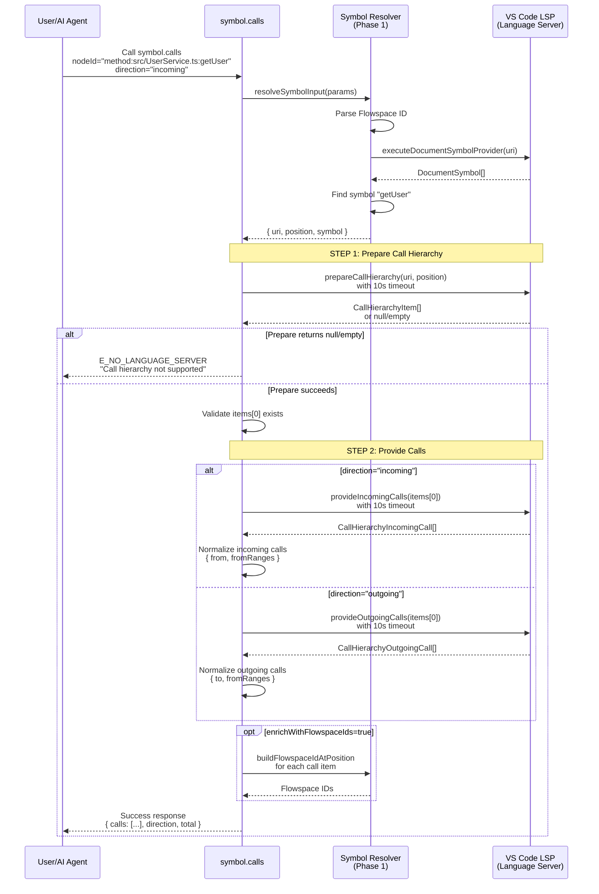

# Phase 5: Call Hierarchy Tool - Tasks & Alignment Brief

**Phase**: Phase 5 of 7
**Slug**: `phase-5-call-hierarchy-tool`
**Created**: 2025-11-05
**Spec**: [lsp-features-spec.md](../../lsp-features-spec.md)
**Plan**: [lsp-features-plan.md](../../lsp-features-plan.md#phase-5-call-hierarchy-tool)
**Status**: PLANNING

> **Note**: Call hierarchy placed in `symbol` category alongside `navigate` and `rename` since finding callers/callees is fundamentally symbol navigation.

---

## Tasks

| Status | ID | Task | Type | Dependencies | Absolute Path(s) | Validation | Subtasks | Notes |
|--------|----|----|------|--------------|------------------|------------|----------|-------|
| [ ] | T001 | Verify symbol/ directory exists | Setup | – | `/workspaces/vscode-bridge/packages/extension/src/vsc-scripts/symbol/` | Directory exists (created in Phase 2) | – | Reusing existing symbol category |
| [ ] | T002 | Create calls.js extending QueryScript | Core | T001 | `/workspaces/vscode-bridge/packages/extension/src/vsc-scripts/symbol/calls.js` | File exists, imports QueryScript from @script-base | – | Discovery 01 - QueryScript for read-only operations |
| [ ] | T003 | Create calls.meta.yaml skeleton with parameters | Core | T001 | `/workspaces/vscode-bridge/packages/extension/src/vsc-scripts/symbol/calls.meta.yaml` | File exists, defines nodeId/path/symbol/direction params | – | Discovery 02 - dual-file registration |
| [ ] | T004 | Create dynamic script: explore-call-hierarchy-prepare.js | Test | T002, T003 | `/workspaces/vscode-bridge/scripts/sample/dynamic/explore-call-hierarchy-prepare.js` | Script tests prepareCallHierarchy with real LSP | – | TAD with dynamic scripts; Discovery 09 - two-step process requires separate exploration |
| [ ] | T005 | Iterate dynamic script: validate CallHierarchyItem structure | Test | T004 | `/workspaces/vscode-bridge/scripts/sample/dynamic/explore-call-hierarchy-prepare.js` | Script logs item properties (name, kind, uri, range) | – | Understand LSP response structure; hot-reload testing |
| [ ] | T006 | Iterate dynamic script: test prepare with symbol name resolution | Test | T005 | `/workspaces/vscode-bridge/scripts/sample/dynamic/explore-call-hierarchy-prepare.js` | Script validates Phase 1 resolveSymbolInput integration | – | Confirm symbol resolver works for call hierarchy |
| [ ] | T007 | Iterate dynamic script: prepare error handling (unsupported language) | Test | T006 | `/workspaces/vscode-bridge/scripts/sample/dynamic/explore-call-hierarchy-prepare.js` | Script tests E_NO_LANGUAGE_SERVER when prepare returns null/empty | – | Discovery 08 - error codes; language support validation |
| [ ] | T008 | Document prepare step findings in execution log | Doc | T007 | `/workspaces/vscode-bridge/docs/plans/25-lsp-features/tasks/phase-5-call-hierarchy-tool/execution.log.md` | Log captures CallHierarchyItem structure, language support matrix | – | TAD learning captured |
| [ ] | T009 | Create dynamic script: explore-incoming-calls.js | Test | T004 | `/workspaces/vscode-bridge/scripts/sample/dynamic/explore-incoming-calls.js` | Script tests provideIncomingCalls with prepared item | – | Discovery 09 - second step of two-step process |
| [ ] | T010 | Iterate dynamic script: validate CallHierarchyIncomingCall structure | Test | T009 | `/workspaces/vscode-bridge/scripts/sample/dynamic/explore-incoming-calls.js` | Script logs call.from (CallHierarchyItem) and call.fromRanges (Range[]) | – | Understand response structure for incoming calls |
| [ ] | T011 | Iterate dynamic script: test empty incoming calls (no callers) | Test | T010 | `/workspaces/vscode-bridge/scripts/sample/dynamic/explore-incoming-calls.js` | Script validates empty array (not error) for unused functions | – | Edge case - return empty array gracefully |
| [ ] | T012 | Document incoming calls findings in execution log | Doc | T011 | `/workspaces/vscode-bridge/docs/plans/25-lsp-features/tasks/phase-5-call-hierarchy-tool/execution.log.md` | Log captures incoming call structure, empty result behavior | – | TAD learning captured |
| [ ] | T013 | Create dynamic script: explore-outgoing-calls.js | Test | T004 | `/workspaces/vscode-bridge/scripts/sample/dynamic/explore-outgoing-calls.js` | Script tests provideOutgoingCalls with prepared item | – | Discovery 09 - test both directions |
| [ ] | T014 | Iterate dynamic script: validate CallHierarchyOutgoingCall structure | Test | T013 | `/workspaces/vscode-bridge/scripts/sample/dynamic/explore-outgoing-calls.js` | Script logs call.to (CallHierarchyItem) and call.fromRanges (Range[]) | – | Understand response structure for outgoing calls |
| [ ] | T015 | Iterate dynamic script: test empty outgoing calls (no callees) | Test | T014 | `/workspaces/vscode-bridge/scripts/sample/dynamic/explore-outgoing-calls.js` | Script validates empty array for leaf functions | – | Edge case - return empty array gracefully |
| [ ] | T016 | Document outgoing calls findings in execution log | Doc | T015 | `/workspaces/vscode-bridge/docs/plans/25-lsp-features/tasks/phase-5-call-hierarchy-tool/execution.log.md` | Log captures outgoing call structure, direction differences | – | TAD learning captured |
| [ ] | T017 | Implement execute() method skeleton in calls.js | Core | T002 | `/workspaces/vscode-bridge/packages/extension/src/vsc-scripts/symbol/calls.js` | Method defined, accepts bridgeContext and params | – | Discovery 20 - BridgeContext injection |
| [ ] | T018 | Implement input resolution using symbol-resolver | Core | T017 | `/workspaces/vscode-bridge/packages/extension/src/vsc-scripts/symbol/calls.js` | Calls resolveSymbolInput from @core/util/symbol-resolver | – | Phase 1 dependency - uses exported API |
| [ ] | T019 | Implement _prepareCallHierarchy() with timeout protection | Core | T018 | `/workspaces/vscode-bridge/packages/extension/src/vsc-scripts/symbol/calls.js` | Wraps vscode.commands.executeCommand('vscode.prepareCallHierarchy') with getLSPResultWithTimeout | – | Discovery 04 - timeout wrapper; Discovery 09 - first step of two-step process |
| [ ] | T020 | Add prepare step validation (null/empty check) | Core | T019 | `/workspaces/vscode-bridge/packages/extension/src/vsc-scripts/symbol/calls.js` | Throws E_NO_LANGUAGE_SERVER if items null/empty | – | Discovery 09 - prepare can return null when unsupported |
| [ ] | T021 | Implement _executeIncomingCalls() with timeout protection | Core | T019 | `/workspaces/vscode-bridge/packages/extension/src/vsc-scripts/symbol/calls.js` | Wraps vscode.commands.executeCommand('vscode.provideIncomingCalls') with timeout | – | Discovery 04 - timeout wrapper; Discovery 09 - second step for incoming direction |
| [ ] | T022 | Implement _executeOutgoingCalls() with timeout protection | Core | T019 | `/workspaces/vscode-bridge/packages/extension/src/vsc-scripts/symbol/calls.js` | Wraps vscode.commands.executeCommand('vscode.provideOutgoingCalls') with timeout | – | Discovery 04 - timeout wrapper; Discovery 09 - second step for outgoing direction |
| [ ] | T023 | Implement direction routing dispatcher (incoming vs outgoing) | Core | T021, T022 | `/workspaces/vscode-bridge/packages/extension/src/vsc-scripts/symbol/calls.js` | params.direction determines which provide command to call | – | Parallel to navigate.js action routing |
| [ ] | T024 | Validate two-step process with dynamic scripts | Test | T019, T021, T022, T023 | `/workspaces/vscode-bridge/scripts/sample/dynamic/explore-call-hierarchy-prepare.js`, `/workspaces/vscode-bridge/scripts/sample/dynamic/explore-incoming-calls.js`, `/workspaces/vscode-bridge/scripts/sample/dynamic/explore-outgoing-calls.js` | Scripts confirm calls.js logic matches explored behavior | – | TAD validation - instant feedback loop |
| [ ] | T025 | Implement normalizeCallHierarchyResult() for incoming calls | Core | T021 | `/workspaces/vscode-bridge/packages/extension/src/vsc-scripts/symbol/calls.js` | Converts CallHierarchyIncomingCall[] to standard response format | – | Format: { from: { name, nodeId?, uri, range }, fromRanges: Range[] } |
| [ ] | T026 | Implement normalizeCallHierarchyResult() for outgoing calls | Core | T022 | `/workspaces/vscode-bridge/packages/extension/src/vsc-scripts/symbol/calls.js` | Converts CallHierarchyOutgoingCall[] to standard response format | – | Format: { to: { name, nodeId?, uri, range }, fromRanges: Range[] } |
| [ ] | T027 | Implement optional Flowspace ID enrichment for call items | Core | T025, T026 | `/workspaces/vscode-bridge/packages/extension/src/vsc-scripts/symbol/calls.js` | Uses buildFlowspaceIdAtPosition when enrichWithFlowspaceIds=true | – | Discovery 15 - optional for performance; Phase 1 dependency |
| [ ] | T028 | Add error handling for timeout, undefined, and exceptions | Core | T027 | `/workspaces/vscode-bridge/packages/extension/src/vsc-scripts/symbol/calls.js` | Three-state handling (result, null, timeout) with clear error messages | – | Discovery 04 - LSP race condition; Discovery 08 - error codes |
| [ ] | T029 | Implement getLanguageHint() for call hierarchy limitations | Core | T028 | `/workspaces/vscode-bridge/packages/extension/src/vsc-scripts/symbol/calls.js` | Returns helpful hints for JavaScript/Python call hierarchy limitations | – | Discovery 18 - language support matrix; JavaScript has limited call hierarchy |
| [ ] | T030 | Write comprehensive MCP llm.when_to_use guidance | Doc | T003 | `/workspaces/vscode-bridge/packages/extension/src/vsc-scripts/symbol/calls.meta.yaml` | Includes USE FOR, DON'T USE FOR, PREREQUISITES, PATTERNS, two-step process explanation | – | Discovery 05 - significant time investment; explain prepare→provide workflow |
| [ ] | T031 | Write detailed MCP parameter_hints for all parameters | Doc | T030 | `/workspaces/vscode-bridge/packages/extension/src/vsc-scripts/symbol/calls.meta.yaml` | Each parameter has description, examples, notes, pitfalls (especially direction values) | – | Discovery 05 - comprehensive guidance |
| [ ] | T032 | Add MCP error_contract with E_NO_LANGUAGE_SERVER, E_NOT_FOUND, E_TIMEOUT, E_INVALID_INPUT | Doc | T030 | `/workspaces/vscode-bridge/packages/extension/src/vsc-scripts/symbol/calls.meta.yaml` | All error codes documented with fix hints, prepare step failure explanation | – | Discovery 08 - hybrid error strategy; Discovery 09 - prepare failure scenarios |
| [ ] | T033 | Add MCP relationships and safety flags | Doc | T030 | `/workspaces/vscode-bridge/packages/extension/src/vsc-scripts/symbol/calls.meta.yaml` | Defines requires (Phase 1 symbol-resolver), idempotent=true, read_only=true | – | Follows existing meta.yaml patterns |
| [ ] | T034 | Promote test: incoming calls with Flowspace ID (critical path) | Test | T024 | `/workspaces/vscode-bridge/test-cli/integration-mcp/symbol-calls.test.ts` | Test with complete Test Doc block (5 fields), validates two-step process | – | TAD promotion - critical path coverage; document two-step workflow |
| [ ] | T035 | Promote test: outgoing calls with symbol name (alternative input) | Test | T024 | `/workspaces/vscode-bridge/test-cli/integration-mcp/symbol-calls.test.ts` | Test with complete Test Doc block, validates direction routing | – | TAD promotion - dual input format + direction parameter |
| [ ] | T036 | Promote test: empty incoming calls (opaque behavior) | Test | T024 | `/workspaces/vscode-bridge/test-cli/integration-mcp/symbol-calls.test.ts` | Test validates empty array (not error) for unused functions with Test Doc block | – | TAD promotion - edge case handling |
| [ ] | T037 | Promote test: unsupported language error (edge case) | Test | T024 | `/workspaces/vscode-bridge/test-cli/integration-mcp/symbol-calls.test.ts` | Test validates E_NO_LANGUAGE_SERVER when prepare returns null/empty | – | TAD promotion - error contract; language support validation |
| [ ] | T038 | Promote test: invalid direction parameter (edge case) | Test | T024 | `/workspaces/vscode-bridge/test-cli/integration-mcp/symbol-calls.test.ts` | Test validates E_INVALID_INPUT for direction="invalid" | – | TAD promotion - input validation |
| [ ] | T039 | Keep dynamic scripts as permanent samples | Doc | T034, T035, T036, T037, T038 | `/workspaces/vscode-bridge/scripts/sample/dynamic/explore-call-hierarchy-prepare.js`, `/workspaces/vscode-bridge/scripts/sample/dynamic/explore-incoming-calls.js`, `/workspaces/vscode-bridge/scripts/sample/dynamic/explore-outgoing-calls.js` | Scripts remain as usage examples and dogfooding tools | – | Unlike Vitest scratch tests, dynamic scripts are kept (3 scripts for prepare + incoming + outgoing) |
| [ ] | T040 | Run `just build` to generate manifest and schemas | Integration | T039 | `/workspaces/vscode-bridge/` | Build succeeds, manifest.json updated with symbol.calls | – | Discovery 02 - dual-file registration validation |
| [ ] | T041 | Verify schema generation for symbol.calls parameters | Integration | T040 | `/workspaces/vscode-bridge/packages/extension/src/vsc-scripts/manifest.json` | Schema includes nodeId, path, symbol, direction, enrichWithFlowspaceIds | – | Build validation |
| [ ] | T042 | Manual test: vscb script run symbol.calls with real file (incoming) | Integration | T040 | – | Command returns incoming calls for test/javascript/UserService.getUser | – | End-to-end validation; requires Extension Host |
| [ ] | T043 | Manual test: vscb script run symbol.calls with real file (outgoing) | Integration | T042 | – | Command returns outgoing calls for test/javascript/UserController.handleRequest | – | Validate direction routing |
| [ ] | T044 | Manual test: MCP tool call via stdio client | Integration | T043 | – | MCP client can call symbol_calls and receive results | – | MCP integration validation |

---

## Alignment Brief

### Prior Phases Review

This section synthesizes findings from Phases 1-4 execution that directly inform Phase 5 implementation.

#### Phase 1: Symbol Resolver Foundation - Core Infrastructure

**Key Deliverable**: `/workspaces/vscode-bridge/packages/extension/src/core/util/symbol-resolver.ts` (749 lines, 13 exported functions)

**Phase 5 Dependencies**:
- **`resolveSymbolInput(params)`** - Primary entry point for symbol resolution
  - Handles both Flowspace ID (`nodeId`) and symbol name (`path + symbol`) inputs
  - Returns `{ uri, position, symbol, meta: { resolvedVia } }`
  - **Phase 5 Usage**: Resolve target function/method for symbol.calls before calling prepareCallHierarchy

- **`getLSPResultWithTimeout(lspPromise, timeoutMs)`** - Timeout protection wrapper
  - Returns: `result | null | 'timeout'` (three-state handling)
  - Default 10s timeout prevents hanging on unresponsive language servers
  - **Phase 5 Usage**: Wrap BOTH prepareCallHierarchy AND provide{Incoming|Outgoing}Calls operations

- **`buildFlowspaceIdAtPosition(uri, position)`** - Optional response enrichment
  - Generates Flowspace IDs for call hierarchy items (caller/callee metadata)
  - **Phase 5 Usage**: When `enrichWithFlowspaceIds=true`, add nodeId to from/to items

**Critical Patterns Established**:
1. **Windows Path Handling**: Forward slashes required in Flowspace IDs (`C:/` not `C:\`)
2. **Hierarchical Search**: Three fallback strategies (exact match → hierarchical split → deep traversal)
3. **Ambiguity Detection**: Throw E_AMBIGUOUS_SYMBOL if multiple symbols match qualified name
4. **Webpack Alias**: `@core/util/symbol-resolver` available for imports

**Testing Approach**: TAD with scratch tests promoted to integration suite (9 promoted tests, >80% coverage)

---

#### Phase 2: Symbol Navigation Tool - LSP Integration Patterns

**Key Deliverable**: `/workspaces/vscode-bridge/packages/extension/src/vsc-scripts/symbol/navigate.js` (references + implementations)

**Phase 5 Learnings**:
- **Dynamic Script Workflow**: 0s rebuild time enables fast iteration on LSP behavior exploration
  - Pattern: Create `explore-*.js` → iterate with hot-reload → document findings → implement core logic → validate with dynamic scripts → promote tests
  - **Phase 5 Application**: Use 3 dynamic scripts (prepare, incoming, outgoing) to explore two-step process

- **Location Polymorphism**: LSP returns `Location[]` OR `LocationLink[]`
  - **Phase 5 Note**: CallHierarchy returns `CallHierarchyItem` (different structure) - no polymorphism expected
  - Normalization still needed: Convert `CallHierarchyIncomingCall`/`CallHierarchyOutgoingCall` to standard response format

- **Empty Results Handling**: Return empty array (not error) when no references/implementations found
  - **Phase 5 Application**: Empty incoming/outgoing calls should return `{ calls: [], total: 0 }` with meta note (not E_NOT_FOUND)

- **MCP Guidance Investment**: `navigate.meta.yaml` llm.when_to_use section was 40+ lines with concrete examples
  - **Phase 5 Requirement**: Explain two-step process in llm.when_to_use (prepare → provide workflow)

**Testing Outcomes**: 7 promoted tests covering critical path, alternative inputs, tri-state parameters, edge cases

---

#### Phase 3: Symbol Rename Tool - WorkspaceEdit Patterns

**Key Deliverable**: `/workspaces/vscode-bridge/packages/extension/src/vsc-scripts/symbol/rename.js` (workspace-wide refactoring)

**Phase 5 Learnings**:
- **Pre-validation Strategy**: Check file exists/writable BEFORE applying WorkspaceEdit
  - Discovery 07: `vscode.workspace.applyEdit()` returns boolean with no failure details
  - **Phase 5 Note**: Call hierarchy is read-only (no WorkspaceEdit) - pre-validation NOT needed

- **Error Context Enrichment**: Return file-level details when operations fail
  - Pattern: `{ succeeded: [...], failed: [...] }` for batch operations
  - **Phase 5 Application**: No batch operations, but apply pattern to multi-call results (incoming/outgoing calls array)

- **Language Hints**: Document Python/JavaScript rename limitations in MCP metadata
  - **Phase 5 Requirement**: Document JavaScript call hierarchy limitations (less reliable than TypeScript)

**Testing Outcomes**: 6 promoted tests including error handling, multi-file scenarios

---

#### Phase 4: Method Replacement Tool - ActionScript Transition

**Key Deliverable**: `/workspaces/vscode-bridge/packages/extension/src/vsc-scripts/code/replace-method.js` (whole-symbol replacement)

**Phase 5 Learnings**:
- **QueryScript vs ActionScript**: Phase 4 used ActionScript (state-changing operation)
  - `execute()` returns `ActionResult` with `success` boolean + `details`
  - **Phase 5 Confirmation**: Call hierarchy is read-only → extend QueryScript (like Phase 2)

- **DocumentSymbol Traversal**: Used `findSymbolInDocument` to locate method by qualified name
  - **Phase 5 Application**: Same traversal needed to find target function before prepareCallHierarchy

- **Response Format Consistency**: All tools return standard envelope (ok, status, type, data, meta)
  - **Phase 5 Requirement**: Match envelope pattern, add call hierarchy-specific meta fields (direction, targetSymbol, totalCalls)

**Testing Outcomes**: 5 promoted tests including signature changes, async conversion, deletion via empty string

---

### Cross-Phase Synthesis: Implications for Phase 5

**Cumulative Pattern Convergence**:
1. **Symbol Resolution Pipeline** (Phases 1-4): `resolveSymbolInput` → position → LSP operation
   - **Phase 5 Unique Twist**: Two LSP operations in sequence (prepare → provide)
2. **Timeout Protection** (Phases 1-4): Wrap all LSP commands with `getLSPResultWithTimeout`
   - **Phase 5 Application**: Wrap BOTH steps (prepare AND provide calls)
3. **Dynamic Scripts for Exploration** (Phases 2-4): Hot-reload testing before core implementation
   - **Phase 5 Strategy**: 3 scripts (prepare, incoming, outgoing) to understand two-step workflow
4. **MCP Metadata Investment** (Phases 2-4): 40+ line llm.when_to_use sections
   - **Phase 5 Requirement**: Explain prepare→provide workflow clearly for AI agents

**Divergence Points**:
1. **Two-Step LSP Process** (Phase 5 Only): No prior phase required intermediate LSP result
   - prepareCallHierarchy returns `CallHierarchyItem[]` → use first item for provide calls
   - Must validate prepare result before calling provide (null/empty check)
2. **Directional Operations** (Phase 5 Only): Phase 2 had "action" (references/implementations), Phase 5 has "direction" (incoming/outgoing)
   - Similar routing pattern, different semantic (who calls this vs what this calls)
3. **Language Support Variance** (Phase 5 Higher Risk): JavaScript call hierarchy less reliable than TypeScript
   - Phase 2-4: Most LSP features work across languages with minor limitations
   - Phase 5: Call hierarchy may return empty results even when calls exist (JavaScript limitation)

**Risk Amplification**:
- **Timeout Risk**: Two LSP calls = 2x timeout exposure (prepare 10s + provide 10s = 20s max)
  - Mitigation: Document expected latency, consider progressive timeout (5s prepare, 10s provide)
- **Empty Results Ambiguity**: Did prepare fail, or does function truly have no callers?
  - Mitigation: Return meta field: `{ prepareSuccess: true, callsFound: 0 }` for clarity

---

### Objective Recap

**Phase Goal**: Implement `symbol.calls` tool for navigating incoming and outgoing call relationships using semantic identifiers (Flowspace IDs or symbol names).

**Behavior Checklist** (from plan acceptance criteria):
- [ ] All promoted tests passing (~5 tests: incoming, outgoing, empty results, unsupported language, invalid direction)
- [ ] Test coverage > 80% for calls.js
- [ ] No mocks used (real VS Code LSP providers only)
- [ ] Test Doc blocks complete for promoted tests (5 required fields)
- [ ] Two-step process implemented correctly (prepare → provide{Incoming|Outgoing}Calls)
- [ ] Both directions work (incoming shows callers, outgoing shows callees)
- [ ] Empty results handled gracefully (empty array with meta note, not error)
- [ ] Language hints document JavaScript/Python call hierarchy limitations
- [ ] Response includes hierarchical call details (from/to with CallHierarchyItem properties, fromRanges)
- [ ] Error codes: E_NO_LANGUAGE_SERVER (prepare returns null/empty), E_NOT_FOUND (symbol not found), E_TIMEOUT (LSP timeout), E_INVALID_INPUT (bad direction parameter)

---

### Non-Goals (Scope Boundaries)

**NOT doing in this phase**:
- **Transitive call graphs**: No recursive call hierarchy traversal (only direct callers/callees)
- **Call graph visualization**: Return data structure only, no diagram generation
- **Performance optimization**: Accept sequential prepare→provide timing, no caching of CallHierarchyItem
- **Custom call hierarchy providers**: Use VS Code's built-in LSP providers only
- **Peek/preview UI**: No editor integration, CLI/MCP tool only
- **Call site filtering**: Return all calls, no filtering by file/module

**Why these boundaries matter**: Phase 5 delivers semantic call navigation infrastructure. Graph traversal, visualization, and optimization are future enhancements requiring separate design.

---

### Critical Findings Affecting This Phase

This phase addresses **7 critical discoveries** from the plan:

#### 🚨 Critical Discovery 01: Three-Tier Base Class Architecture
- **Constraint**: Call hierarchy is read-only query → extend QueryScript (not ActionScript)
- **Requirement**: `execute()` returns data object directly (e.g., `{ calls: [...], direction, total }`)
- **Implementation**: `class CallsScript extends QueryScript` in symbol/calls.js
- **Tasks**: T002 (base class selection)

#### 🚨 Critical Discovery 02: Dual-File Registration Pattern
- **Constraint**: Requires both `.js` AND `.meta.yaml` files with identical base names
- **Requirement**: Create `symbol/calls.js` + `symbol/calls.meta.yaml`
- **Validation**: `just build` must succeed, manifest.json updated
- **Tasks**: T002, T003, T040 (file creation + build validation)

#### 🚨 Critical Discovery 04: Language Server Timeout/Unavailability
- **Constraint**: LSP commands can hang or return undefined
- **Requirement**: Wrap BOTH prepare and provide operations with `getLSPResultWithTimeout()`
- **Implementation**: Two timeout wrappers (prepare step + provide step)
- **Tasks**: T019, T021, T022, T028 (timeout protection for both LSP calls)

#### 🔴 High Discovery 05: MCP Metadata Drives AI Agent Behavior
- **Constraint**: AI agents learn from `llm.when_to_use` and `parameter_hints`
- **Requirement**: Explain two-step process clearly (prepare → provide workflow)
- **Investment**: Write 50+ line guidance with concrete examples showing both directions
- **Tasks**: T030, T031, T032 (comprehensive MCP metadata)

#### 🔴 High Discovery 08: Hybrid Error Code Strategy
- **Constraint**: Use LSP-specific codes (E_NO_LANGUAGE_SERVER) + generic codes (E_NOT_FOUND, E_TIMEOUT, E_INVALID_INPUT)
- **Requirement**: Prepare step failure returns E_NO_LANGUAGE_SERVER (not E_NOT_FOUND)
- **Context**: Distinguish between "symbol not found" (E_NOT_FOUND) and "language doesn't support call hierarchy" (E_NO_LANGUAGE_SERVER)
- **Tasks**: T020, T028, T032 (error handling + documentation)

#### 🟡 Medium Discovery 09: Call Hierarchy Two-Step LSP Process (CRITICAL FOR PHASE 5)
- **Constraint**: Cannot call provideIncomingCalls/provideOutgoingCalls directly
- **Requirement**: Always call prepareCallHierarchy first, use returned CallHierarchyItem for provide calls
- **Flow**:
  1. `prepareCallHierarchy(uri, position)` → `CallHierarchyItem[] | null`
  2. Validate items exist (throw E_NO_LANGUAGE_SERVER if null/empty)
  3. `provide{Incoming|Outgoing}Calls(items[0])` → `CallHierarchy{Incoming|Outgoing}Call[]`
- **Implementation**: Two private methods (`_prepareCallHierarchy`, `_executeIncomingCalls`, `_executeOutgoingCalls`)
- **Tasks**: T004-T008 (explore prepare step), T009-T012 (explore incoming), T013-T016 (explore outgoing), T019-T023 (core implementation)

#### 🟡 Medium Discovery 11: Location/LocationLink Polymorphism
- **Context**: Phase 2 handled Location[] OR LocationLink[] polymorphism
- **Phase 5 Note**: CallHierarchy returns structured items (CallHierarchyItem with name, kind, uri, range) - no polymorphism expected
- **Requirement**: Normalize CallHierarchyIncomingCall and CallHierarchyOutgoingCall to standard response format
- **Implementation**: Separate normalization for incoming vs outgoing (different structures: `from` vs `to`)
- **Tasks**: T025, T026 (normalization functions)

---

### Invariants & Constraints

**Invariants** (must always be true):
1. **Two-step sequence**: ALWAYS call prepareCallHierarchy before provide{Incoming|Outgoing}Calls
2. **Prepare validation**: MUST check prepare result is non-null and non-empty before proceeding
3. **Timeout protection**: BOTH steps wrapped with `getLSPResultWithTimeout()` (10s each)
4. **Empty array success**: Empty call results return `{ calls: [], total: 0 }` (not error)
5. **Direction parameter**: MUST be exactly "incoming" or "outgoing" (throw E_INVALID_INPUT otherwise)
6. **QueryScript return**: Return data object directly (no ActionResult wrapper)

**Constraints**:
1. **Language server support**: Call hierarchy requires LSP support (TypeScript, Python, Java, Go, C#; limited JavaScript)
2. **CallHierarchyItem structure**: First item from prepare step used (ignore subsequent items if multiple returned)
3. **Response format**: Match standard envelope (ok, status, type, data, meta) with call hierarchy-specific fields
4. **Flowspace ID enrichment**: Optional (performance cost); requires additional symbol lookup per call item

---

### Inputs to Read

**Primary Dependencies** (Phase 1 APIs):
- `/workspaces/vscode-bridge/packages/extension/src/core/util/symbol-resolver.ts`
  - `resolveSymbolInput(params)` - Lines 600-650 (dispatcher logic)
  - `getLSPResultWithTimeout(lspPromise, timeoutMs)` - Lines 100-150 (timeout wrapper)
  - `buildFlowspaceIdAtPosition(uri, position)` - Lines 400-450 (optional enrichment)

**Reference Implementations** (Phase 2-4 patterns):
- `/workspaces/vscode-bridge/packages/extension/src/vsc-scripts/symbol/navigate.js` - QueryScript pattern, action routing
- `/workspaces/vscode-bridge/packages/extension/src/vsc-scripts/symbol/navigate.meta.yaml` - MCP metadata examples

**VS Code LSP Documentation**:
- [Call Hierarchy API](https://code.visualstudio.com/api/references/vscode-api#languages.prepareCallHierarchy) - prepareCallHierarchy behavior
- [CallHierarchyItem](https://code.visualstudio.com/api/references/vscode-api#CallHierarchyItem) - Item structure
- [CallHierarchyIncomingCall](https://code.visualstudio.com/api/references/vscode-api#CallHierarchyIncomingCall) - Incoming call structure
- [CallHierarchyOutgoingCall](https://code.visualstudio.com/api/references/vscode-api#CallHierarchyOutgoingCall) - Outgoing call structure

---

### Visual Alignment

#### Two-Step Call Hierarchy Flow

```mermaid
flowchart TD
    Start([User/Agent Request]) --> Resolve[Resolve Symbol Input<br/>nodeId OR path+symbol]
    Resolve --> Prepare[Step 1: prepareCallHierarchy<br/>uri, position]
    Prepare -->|success| ValidateItems{Items exist?}
    Prepare -->|timeout| TimeoutError[E_TIMEOUT]
    Prepare -->|null/undefined| NoLSP[E_NO_LANGUAGE_SERVER]

    ValidateItems -->|empty array| NoLSP
    ValidateItems -->|has items| Direction{params.direction}

    Direction -->|incoming| Incoming[Step 2: provideIncomingCalls<br/>items[0]]
    Direction -->|outgoing| Outgoing[Step 2: provideOutgoingCalls<br/>items[0]]
    Direction -->|invalid| InvalidDir[E_INVALID_INPUT]

    Incoming -->|success| NormalizeIn[Normalize IncomingCall[]]
    Incoming -->|timeout| TimeoutError
    Incoming -->|empty| EmptyIn[Return calls: []]

    Outgoing -->|success| NormalizeOut[Normalize OutgoingCall[]]
    Outgoing -->|timeout| TimeoutError
    Outgoing -->|empty| EmptyOut[Return calls: []]

    NormalizeIn --> Response[Response with calls array]
    NormalizeOut --> Response
    EmptyIn --> Response
    EmptyOut --> Response

    Response --> End([Return to User/Agent])
    TimeoutError --> End
    NoLSP --> End
    InvalidDir --> End
```

#### Sequence Diagram: Full Call Hierarchy Workflow



---

### Test Plan

**Approach**: TAD (Test-Assisted Development) with dynamic scripts for hot-reload exploration, then promote critical tests to integration suite.

**Dynamic Script Exploration** (T004-T016):
1. **explore-call-hierarchy-prepare.js**: Understand prepareCallHierarchy behavior
   - CallHierarchyItem structure (name, kind, uri, range, selectionRange)
   - Language support validation (TypeScript ✓, JavaScript limited, Python ✓)
   - Null/empty responses for unsupported operations
   - Symbol resolution integration

2. **explore-incoming-calls.js**: Understand provideIncomingCalls behavior
   - CallHierarchyIncomingCall structure (from: CallHierarchyItem, fromRanges: Range[])
   - Empty array for functions with no callers
   - Multiple callers aggregation

3. **explore-outgoing-calls.js**: Understand provideOutgoingCalls behavior
   - CallHierarchyOutgoingCall structure (to: CallHierarchyItem, fromRanges: Range[])
   - Empty array for leaf functions (no callees)
   - Multiple callees aggregation

**Promoted Integration Tests** (T034-T038):
1. **T034 - Incoming calls with Flowspace ID** (Critical Path)
   - Test Doc: Why (understanding callers for refactoring), Contract (two-step process), Usage Notes (direction="incoming"), Quality (validates caller navigation), Example ("UserService.getUser" → list of callers)

2. **T035 - Outgoing calls with symbol name** (Alternative Input)
   - Test Doc: Why (understanding dependencies), Contract (direction="outgoing" + symbol name input), Usage Notes (what this function calls), Quality (validates callee navigation), Example ("UserController.handleRequest" → list of callees)

3. **T036 - Empty incoming calls** (Opaque Behavior)
   - Test Doc: Why (unused function detection), Contract (empty array not error), Usage Notes (return { calls: [], total: 0 }), Quality (validates edge case), Example (unused helper function → empty array)

4. **T037 - Unsupported language error** (Edge Case)
   - Test Doc: Why (language support varies), Contract (E_NO_LANGUAGE_SERVER when prepare fails), Usage Notes (prepare returns null/empty), Quality (validates error contract), Example (plain text file → error with hint)

5. **T038 - Invalid direction parameter** (Edge Case)
   - Test Doc: Why (input validation), Contract (E_INVALID_INPUT for bad direction), Usage Notes (must be "incoming" or "outgoing"), Quality (validates parameter contract), Example (direction="both" → error)

**Coverage Target**: >80% for calls.js (covering prepare, incoming, outgoing, error paths)

**No Mocks**: All tests use real VS Code LSP providers with test workspace fixtures

---

### Implementation Outline

**Step-by-step mapped to tasks**:

#### 1. Setup & Skeleton (T001-T003)
- Verify `symbol/` directory exists (created in Phase 2)
- Create `calls.js` extending QueryScript in symbol/ category
- Create `calls.meta.yaml` with parameters (nodeId, path, symbol, direction, enrichWithFlowspaceIds)

#### 2. TAD Exploration (T004-T016)
- **Prepare Step Exploration** (T004-T008):
  - Create `explore-call-hierarchy-prepare.js` dynamic script
  - Iterate to understand CallHierarchyItem structure
  - Test symbol resolution integration
  - Test unsupported language behavior (null/empty returns)
  - Document findings in execution.log.md

- **Incoming Calls Exploration** (T009-T012):
  - Create `explore-incoming-calls.js` dynamic script
  - Iterate to understand CallHierarchyIncomingCall structure
  - Test empty results for unused functions
  - Document findings in execution.log.md

- **Outgoing Calls Exploration** (T013-T016):
  - Create `explore-outgoing-calls.js` dynamic script
  - Iterate to understand CallHierarchyOutgoingCall structure
  - Test empty results for leaf functions
  - Document findings in execution.log.md

#### 3. Core Implementation (T017-T029)
- **Symbol Resolution** (T017-T018):
  - Implement `execute()` method skeleton
  - Call `resolveSymbolInput()` from Phase 1 symbol-resolver

- **Prepare Step** (T019-T020):
  - Implement `_prepareCallHierarchy()` with timeout protection
  - Validate items exist (throw E_NO_LANGUAGE_SERVER if null/empty)

- **Provide Calls** (T021-T023):
  - Implement `_executeIncomingCalls()` with timeout protection
  - Implement `_executeOutgoingCalls()` with timeout protection
  - Implement direction routing (params.direction determines which to call)

- **Validation with Dynamic Scripts** (T024):
  - Run all 3 dynamic scripts to confirm symbol/calls.js matches explored behavior
  - Instant feedback loop (0s rebuild)

- **Response Normalization** (T025-T027):
  - Implement `normalizeCallHierarchyResult()` for incoming calls (from + fromRanges)
  - Implement `normalizeCallHierarchyResult()` for outgoing calls (to + fromRanges)
  - Optional Flowspace ID enrichment (use Phase 1 buildFlowspaceIdAtPosition)

- **Error Handling** (T028-T029):
  - Three-state handling for timeouts/undefined/exceptions
  - Language-specific hints for JavaScript/Python limitations

#### 4. MCP Metadata (T030-T033)
- Write comprehensive `llm.when_to_use` (50+ lines)
  - Explain two-step process clearly
  - Provide USE FOR examples (understanding callers, refactoring impact analysis, dependency mapping)
  - Provide DON'T USE FOR examples (finding definitions, text search)
  - Document PREREQUISITES (LSP support required)
  - Show PATTERNS (Flowspace ID vs symbol name examples for both directions)

- Write detailed `parameter_hints`
  - direction: "Must be 'incoming' (who calls this) or 'outgoing' (what this calls)"
  - enrichWithFlowspaceIds: Performance note about additional lookups

- Document error contract
  - E_NO_LANGUAGE_SERVER: When prepare returns null/empty
  - E_NOT_FOUND: When symbol not found
  - E_TIMEOUT: When LSP operation times out (prepare or provide)
  - E_INVALID_INPUT: When direction parameter invalid

- Add relationships and safety flags
  - Requires: Phase 1 symbol-resolver APIs
  - idempotent: true
  - read_only: true

#### 5. Test Promotion (T034-T039)
- Promote 5 critical tests with complete Test Doc blocks
- Keep 3 dynamic scripts as permanent samples (not deleted like scratch tests)

#### 6. Build & Validation (T040-T044)
- Run `just build` to generate manifest and schemas
- Verify schema includes all parameters
- Manual tests via `vscb script run symbol.calls`
- MCP integration test via stdio client

---

### Commands to Run

**Dynamic Script Exploration** (0s rebuild, instant iteration):
```bash
cd /workspaces/vscode-bridge/test

# Explore prepare step
vscb script run -f ../scripts/sample/dynamic/explore-call-hierarchy-prepare.js

# Test with different symbols
vscb script run -f ../scripts/sample/dynamic/explore-call-hierarchy-prepare.js \
  --param path=javascript/UserService.js \
  --param symbol=UserService.getUser

# Explore incoming calls
vscb script run -f ../scripts/sample/dynamic/explore-incoming-calls.js \
  --param nodeId="method:javascript/UserService.js:UserService.getUser"

# Explore outgoing calls
vscb script run -f ../scripts/sample/dynamic/explore-outgoing-calls.js \
  --param nodeId="method:javascript/UserController.js:UserController.handleRequest"
```

**Build & Validation**:
```bash
# From project root
just build

# Verify manifest
cat packages/extension/src/vsc-scripts/manifest.json | jq '.scripts["symbol.calls"]'

# Manual test (from test/ workspace)
cd /workspaces/vscode-bridge/test
vscb script run symbol.calls \
  --param nodeId="method:javascript/UserService.js:UserService.getUser" \
  --param direction=incoming
```

**Integration Tests**:
```bash
# From project root
npm run test:integration -- symbol-calls.test.ts

# Or via Vitest UI
npm run test:integration:ui
```

---

### Risks & Mitigations

**Phase-Specific Risks**:

| Risk | Likelihood | Impact | Mitigation |
|------|------------|--------|------------|
| **Two-step coordination complexity** | Medium | Medium | TAD exploration with 3 dynamic scripts (prepare, incoming, outgoing) to understand workflow before implementation |
| **Language support matrix unclear** | High | Medium | Document support in MCP metadata, provide language-specific hints, test TypeScript/Python/JavaScript in integration tests |
| **Prepare returns null ambiguity** | Medium | Low | Clear error message: "Call hierarchy not supported for this language" with E_NO_LANGUAGE_SERVER code |
| **Empty results vs. unsupported** | Medium | Low | Return empty array with meta field `{ prepareSuccess: true, callsFound: 0 }` for clarity |
| **Timeout accumulation** (prepare + provide) | Low | Medium | 10s timeout per step (20s max); document expected latency in MCP metadata |
| **JavaScript call hierarchy unreliable** | High | Low | Document limitation in language hints, test with TypeScript fixtures primarily |

**Cross-Phase Risks** (from prior phases):
- **Windows path handling**: Already solved in Phase 1 (forward slashes required)
- **Nested class ambiguity**: Already solved in Phase 1 (hierarchical search)
- **LSP timeout/unavailability**: Already solved in Phase 1 (getLSPResultWithTimeout wrapper)

---

### Ready Check

**Before starting implementation, confirm understanding of**:

- [ ] **Two-step LSP process**: I understand prepareCallHierarchy must be called before provideIncomingCalls/provideOutgoingCalls
- [ ] **Prepare validation**: I understand prepare can return null/empty and must throw E_NO_LANGUAGE_SERVER before proceeding
- [ ] **Direction routing**: I understand params.direction determines which provide command to call (incoming vs outgoing)
- [ ] **CallHierarchy structures**: I understand the difference between CallHierarchyIncomingCall (from + fromRanges) and CallHierarchyOutgoingCall (to + fromRanges)
- [ ] **Phase 1 API dependencies**: I can use resolveSymbolInput, getLSPResultWithTimeout, buildFlowspaceIdAtPosition
- [ ] **QueryScript pattern**: I understand execute() returns data object directly (not ActionResult)
- [ ] **Dynamic script workflow**: I understand how to use hot-reload scripts for 0s rebuild exploration
- [ ] **Error code strategy**: I understand when to use E_NO_LANGUAGE_SERVER (prepare fails) vs E_NOT_FOUND (symbol not found)
- [ ] **Empty results handling**: I understand to return empty array (not error) for functions with no callers/callees
- [ ] **Test promotion criteria**: I understand to promote 5 tests covering critical path, alternative inputs, edge cases, error contract

---

## Phase Footnote Stubs

| Task ID | Flowspace Node ID | Description |
|---------|-------------------|-------------|
| _Footnotes will be added during plan-6 (implementation phase)_ | | |

**Example format** (populated during implementation):
```markdown
[^1]: Modified [method:packages/extension/src/vsc-scripts/symbol/calls.js:CallsScript.execute](packages/extension/src/vsc-scripts/symbol/calls.js#L45) - Implemented symbol resolution and two-step call hierarchy workflow
[^2]: Created [file:packages/extension/src/vsc-scripts/symbol/calls.meta.yaml](packages/extension/src/vsc-scripts/symbol/calls.meta.yaml) - Comprehensive MCP metadata with two-step process explanation
```

---

## Evidence Artifacts

**Execution Log Location**: `/workspaces/vscode-bridge/docs/plans/25-lsp-features/tasks/phase-5-call-hierarchy-tool/execution.log.md`

**Expected Contents** (created during plan-6 implementation):
- Dynamic script exploration findings (prepare, incoming, outgoing LSP behavior)
- CallHierarchyItem structure documentation
- Language support matrix observations (TypeScript vs JavaScript vs Python)
- Timeout behavior under different conditions
- Edge case handling decisions (empty results, prepare failures)
- Test promotion rationale
- Manual test results
- Build validation outputs

**Format**: Markdown with timestamped entries, code snippets, LSP response examples, screenshots of MCP tool calls

---

