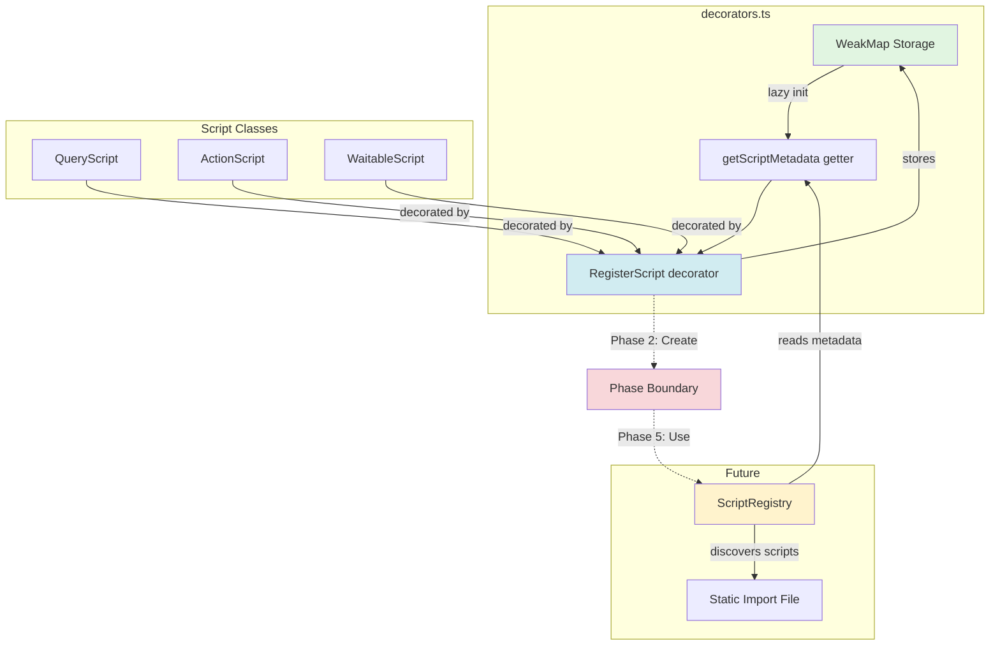
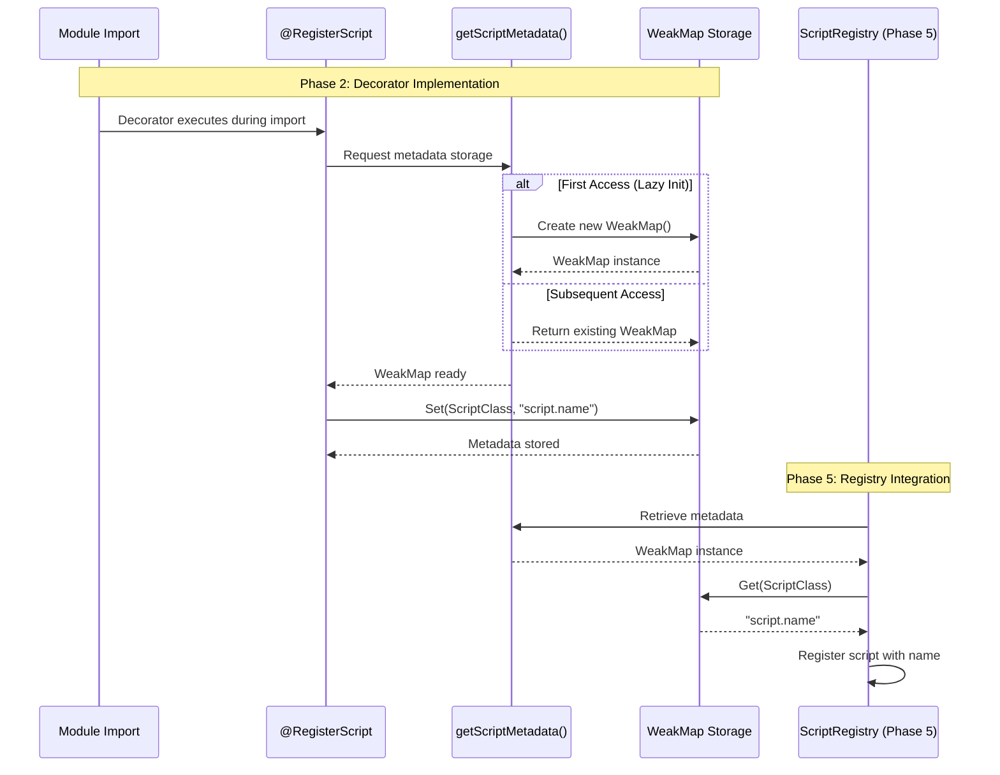
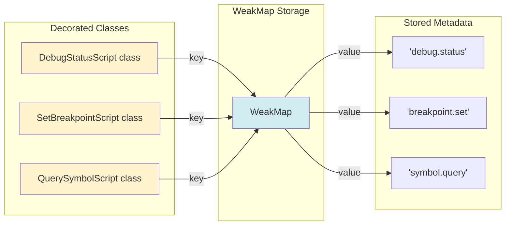

# Phase 2: Decorator System Implementation - Tasks & Alignment Brief

**Phase**: Phase 2: Decorator System Implementation
**Phase Slug**: phase-2-decorator-system
**Plan**: [Script TypeScript Conversion Implementation Plan](../../script-typescript-conversion-plan.md)
**Spec**: [Script TypeScript Conversion Spec](../../script-typescript-conversion-spec.md)
**Created**: 2025-11-03
**Status**: READY FOR GO

---

## Tasks

| Status | ID | Task | Type | Dependencies | Absolute Path(s) | Validation | Subtasks | Notes |
|--------|-----|------|------|--------------|------------------|------------|----------|-------|
| [x] | T001 | Create decorator module with WeakMap storage | Core | – | /workspaces/vscode-bridge/packages/extension/src/core/scripts/decorators.ts | Module exports RegisterScript decorator and getScriptMetadata function | – | New file. Implements lazy initialization pattern to prevent race conditions (Critical Insight 2). [P] eligible (new file). Completed · log#task-t001-t004 [^8] |
| [x] | T002 | Implement RegisterScript decorator with lazy init | Core | T001 | /workspaces/vscode-bridge/packages/extension/src/core/scripts/decorators.ts | Decorator stores metadata in WeakMap, supports import order independence | – | Class decorator that captures scriptName parameter. Uses getter for WeakMap to ensure initialization before use. Serial (shared file with T001). Completed · log#task-t001-t004 [^8] |
| [x] | T003 | Implement getScriptMetadata getter function | Core | T001 | /workspaces/vscode-bridge/packages/extension/src/core/scripts/decorators.ts | Lazy initialization pattern: creates WeakMap on first access | – | Prevents "Cannot read property 'set' of undefined" errors. Serial (shared file with T001, T002). Completed · log#task-t001-t004 [^8] |
| [x] | T004 | Add TypeScript type definitions for decorator | Core | T002 | /workspaces/vscode-bridge/packages/extension/src/core/scripts/decorators.ts | Type safety for @RegisterScript decorator usage | – | Define ScriptMetadata interface and RegisterScript function signature. Serial (shared file). Completed · log#task-t001-t004 [^8] |
| [x] | T005 | Write scratch tests for decorator behavior | Test | T002, T003 | /workspaces/vscode-bridge/packages/extension/test/scratch/decorator-test.ts | Tests verify: metadata storage, lazy init, import order independence | – | TAD scratch test. Verify decorator works before using in real scripts. [P] eligible (new test file). Completed · log#task-t005 [^8] |
| [x] | T006 | Test decorator with QueryScript base class | Test | T005 | /workspaces/vscode-bridge/packages/extension/test/scratch/decorator-query-test.ts | Decorator works with QueryScript<TParams, TResult> | – | Ensure generics don't interfere. [P] eligible (new test file). Completed · log#task-t006-t008 [^8] |
| [x] | T007 | Test decorator with ActionScript base class | Test | T005 | /workspaces/vscode-bridge/packages/extension/test/scratch/decorator-action-test.ts | Decorator works with ActionScript<TParams> | – | Verify ActionScript compatibility. [P] eligible (new test file). Completed · log#task-t006-t008 [^8] |
| [x] | T008 | Test decorator with WaitableScript base class | Test | T005 | /workspaces/vscode-bridge/packages/extension/test/scratch/decorator-waitable-test.ts | Decorator works with WaitableScript<TParams, TResult> | – | Ensure async patterns work. [P] eligible (new test file). Completed · log#task-t006-t008 [^8] |
| [x] | T009 | Apply decorator to debug/status.ts as proof of concept | Core | T002, T005 | /workspaces/vscode-bridge/packages/extension/src/vsc-scripts/debug/status.ts | First real script uses @RegisterScript('debug.status') | – | Copy existing status.js to status.ts, add decorator, verify compilation, **delete status.js** (git is backup - Insight #4). Proves decorator works in real context. [P] eligible (isolated file). Completed · log#task-t009 [^8] |
| [x] | T010 | Verify decorator metadata retrieval at runtime | Integration | T009 | /workspaces/vscode-bridge/packages/extension/test/scratch/metadata-retrieval-test.ts | Can retrieve scriptName from decorated class using getScriptMetadata | – | Critical validation before Phase 3 conversion. [P] eligible (new test file). Completed · log#task-t010 [^8] |
| [x] | T011 | Document decorator usage patterns | Doc | T004 | /workspaces/vscode-bridge/packages/extension/src/core/scripts/decorators.ts | JSDoc comments with examples for script authors | – | Inline documentation explaining: basic usage, lazy init pattern, import order safety, development workflow (Extension Host restart due to WeakMap - Insight #2), **mandatory decorator requirement** (TypeScript won't catch missing decorators - Insight #3). Serial (shared file). Completed · log#task-t001-t004 [^8] |
| [x] | T012 | Add decorator export to base.ts | Core | T002 | /workspaces/vscode-bridge/packages/extension/src/core/scripts/base.ts | Re-export RegisterScript for convenience | – | Allows `import { QueryScript, RegisterScript } from '@script-base'`. Serial (existing file). Completed · log#task-t012 [^8] |

---

## Alignment Brief

### Prior Phases Review

#### Phase 0: BridgeContext Type Safety - COMPLETE ✅

**A. Deliverables Created**:
- **IBridgeContext interface enhancement**: Added `getJavaScriptEnv` method
  - `/workspaces/vscode-bridge/packages/extension/src/core/bridge-context/types.ts` (line 85)
- **Base class refactoring**: Updated ScriptBase, WaitableScript, StreamScript to use IBridgeContext
  - `/workspaces/vscode-bridge/packages/extension/src/core/scripts/base.ts`
- **Test infrastructure**: Created TypeScript and JavaScript compatibility tests
  - `/workspaces/vscode-bridge/packages/extension/test/core/bridge-context/example-typed.test.ts`
  - `/workspaces/vscode-bridge/packages/extension/test/core/scripts/js-compat.test.js`

**B. Lessons Learned**:
- **Maximum reuse > new helpers**: Removed planned `getDebugSession()` helper - scripts should use existing `bridgeContext.debug.getSession()`
- **Structural typing enables JS compatibility**: JavaScript files can extend typed TypeScript base classes without modification
- **Interface completeness critical**: Dynamic scripts use `paths.extensionRoot` - all BridgeContext properties must be in interface

**C. Technical Discoveries**:
- **Optional chaining essential**: `bridgeContext.debug?.getSession()` pattern handles optional services gracefully
- **TypeScript strict mode catches bugs**: Adding types revealed potential null reference issues
- **No runtime overhead**: Interface typing is compile-time only, zero performance impact

**D. Dependencies Exported for Current Phase**:
- ✅ **IBridgeContext interface**: Complete type-safe contract - decorators can reference this
- ✅ **Typed base classes**: ScriptBase, QueryScript, ActionScript, WaitableScript - decorators will decorate these
- ✅ **Test patterns**: Established Vitest test patterns - Phase 2 scratch tests follow same approach
- ✅ **JS compatibility proven**: Decorator TypeScript won't break existing JavaScript scripts

**E. Critical Findings Applied**:
- Phase 0 established type foundation - Phase 2 decorator metadata will use typed class references
- Base classes use IBridgeContext - decorator metadata storage can rely on stable class hierarchy

**F. Incomplete/Blocked Items**: None - Phase 0 fully complete

**G. Test Infrastructure**:
- Vitest tests using existing patterns (not scratch tests)
- Phase 2 will use scratch tests per TAD approach

**H. Technical Debt**: None introduced

**I. Architectural Decisions**:
- Use existing services pattern (debug.getSession, paths.extensionRoot) instead of creating redundant helpers
- Interface-based typing with structural typing for JS compatibility
- **Relevant to Phase 2**: Decorators will follow similar pattern - minimal metadata, leverage existing infrastructure

**J. Scope Changes**:
- Removed redundant helper creation (originally 7 tasks → 6 tasks)

**K. Key Log References**:
- [Complete Phase 0 execution log](../phase-0-bridgecontext-type-safety/execution.log.md)
- [Task T002: Base class refactoring](../phase-0-bridgecontext-type-safety/execution.log.md#task-t002-update-basetts-to-use-ibridgecontext-interface) - Shows base classes that decorators will annotate

---

#### Phase 1: TypeScript Infrastructure Setup - COMPLETE ✅

**A. Deliverables Created**:

1. **TypeScript Configuration** (`/workspaces/vscode-bridge/packages/extension/tsconfig.json`):
   - Removed script exclusion from compilation
   - Added `checkJs: false` to prevent JavaScript type errors during migration
   - Enabled decorator support: `experimentalDecorators: true`, `emitDecoratorMetadata: true`
   - Added 16 path mappings matching webpack aliases (@script-base, @core/*)

2. **Webpack Configuration** (`/workspaces/vscode-bridge/packages/extension/webpack.config.js`):
   - Updated scriptEntries() glob to discover both `.js` and `.ts` files: `'src/vsc-scripts/**/*.{js,ts}'`
   - Added `ignore: ['**/*.d.ts']` to prevent bundling declaration files
   - Updated extension replacement regex to handle both file types

3. **Package Configuration** (`/workspaces/vscode-bridge/packages/extension/package.json`):
   - Added `"sideEffects": ["src/vsc-scripts/**/*.{js,ts}"]` to prevent tree-shaking decorated scripts
   - Updated manifest:watch to monitor both `.js` and `.ts` files

4. **Build System** (`/workspaces/vscode-bridge/scripts/build-manifest.cts`):
   - Updated to check for `.ts` files first, then `.js` (prefers TypeScript during incremental conversion)
   - Updated warning messages to mention both file types

5. **Path Validation** (Added from Critical Insights):
   - `/workspaces/vscode-bridge/scripts/validate-paths.cjs` - Validates webpack and TypeScript path synchronization
   - `/workspaces/vscode-bridge/justfile` - Added validation to build process

6. **Test Files** (Scratch tests for infrastructure validation):
   - `/workspaces/vscode-bridge/packages/extension/src/vsc-scripts/test/phase1-test.ts` - TypeScript compilation test
   - `/workspaces/vscode-bridge/packages/extension/test/core/scripts/empty-ts-test.ts` - TAD scratch test

**B. Lessons Learned**:

- **Incremental testing critical**: Each configuration change was tested immediately, caught webpack .d.ts bundling issue early
- **Critical Insights valuable**: Added path validation and adjusted sideEffects during planning, prevented future issues
- **TAD approach works for infrastructure**: Scratch tests validated TypeScript compilation without permanent test burden
- **Build system remarkably flexible**: Supporting both .js and .ts simultaneously required minimal changes

**C. Technical Discoveries**:

- **webpack bundling .d.ts files**: Webpack attempted to compile declaration files, required explicit ignore pattern
- **ScriptResult type not generic**: Initially tried `ScriptResult<any>`, discovered it's not generic - removed type parameter
- **validate-paths.js ES module error**: Project uses ES modules, validation script needed `.cjs` extension for CommonJS
- **Source map configuration already correct**: No special source map setup needed - scripts use same webpack config as rest of extension

**D. Dependencies Exported for Phase 2**:

✅ **Infrastructure Ready for Decorators**:
- ✅ **Decorator compilation enabled**: `experimentalDecorators: true` and `emitDecoratorMetadata: true` configured
- ✅ **TypeScript scripts compile**: Verified with test/phase1-test.ts successful compilation
- ✅ **Path mappings work**: Can import from `@script-base`, `@core/*` aliases
- ✅ **Tree-shaking disabled**: sideEffects config protects decorated scripts from removal
- ✅ **Build system supports .ts**: Webpack bundles TypeScript, manifest builder discovers scripts
- ✅ **Debugging infrastructure**: Source maps generated, breakpoints work in .ts files

✅ **Critical for Phase 2 Implementation**:
- **Decorator metadata will persist**: Tree-shaking won't remove decorated classes (sideEffects protection)
- **Decorator imports resolve**: `@script-base` path mapping enables clean decorator imports
- **Phase 2 can create .ts files**: Manifest builder and webpack handle TypeScript files correctly

**E. Critical Findings Applied**:

- **Critical Discovery 01 (Scripts Excluded)**: ✅ Resolved - scripts now included in TypeScript compilation
- **Critical Discovery 03 (Webpack Aliases)**: ✅ Resolved - 16 path mappings added with validation script
- **Medium Discovery 08 (Decorator Support)**: ✅ Resolved - experimentalDecorators and emitDecoratorMetadata enabled
- **Insight 1 (Tree-Shaking Risk)**: ✅ Mitigated - sideEffects config protects both .js and .ts files
- **Insight 2 (Decorator Race Condition)**: 🎯 Phase 2 must implement - lazy initialization pattern required
- **Insight 5 (Manifest Generation)**: ✅ Resolved - build-manifest.cts prefers .ts over .js

**F. Incomplete/Blocked Items**: None - Phase 1 fully complete

**G. Test Infrastructure Created**:

- **Scratch test pattern established**: `test/core/scripts/empty-ts-test.ts` shows TAD approach
- **Integration tests validated**: Existing `just test-integration` verified bundled VSIX works
- **Source map validation**: Verified .js.map files reference original TypeScript sources

**H. Technical Debt**:

- **checkJs: false temporary**: Added to prevent JavaScript type errors; should remove after full conversion in Phase 6
- **validate-paths.cjs CommonJS**: Used CommonJS for Node.js compatibility in ES module project

**I. Architectural Decisions**:

1. **Incremental conversion support**: Infrastructure handles mixed .js/.ts environment gracefully
2. **Tree-shaking protection**: sideEffects protects both file types during migration period
3. **Path validation in build**: Automated check prevents webpack/TypeScript path drift
4. **Prefer TypeScript**: Manifest builder checks .ts first, enabling gradual migration
5. **TAD for infrastructure**: Scratch tests validated changes without permanent test burden

**J. Scope Changes**:

- **Added T003a, T003b**: Path validation script and build integration (from Critical Insights discussion)
- **Simplified T010**: Changed from manual debugging test to source map verification (existing integration tests handle debugging)
- **Added checkJs: false**: Unblocked Phase 1 by preventing JavaScript errors (from Critical Insights discussion)

**K. Key Log References**:
- [Complete Phase 1 execution log](../phase-1-typescript-infrastructure/execution.log.md)
- [Phase 1 Summary](../phase-1-typescript-infrastructure/execution.log.md#phase-summary) - All 12 tasks completed successfully
- [T004-T007 Configuration Updates](../phase-1-typescript-infrastructure/execution.log.md#task-t004-t007-configuration-updates) - Webpack, package.json, manifest builder changes
- [T008 Build Validation](../phase-1-typescript-infrastructure/execution.log.md#task-t008-verify-build-system-still-works) - Fixed webpack .d.ts bundling issue
- [T009 TypeScript Compilation Test](../phase-1-typescript-infrastructure/execution.log.md#task-t009-test-typescript-compilation-with-empty-ts-script) - Proof TypeScript scripts compile

---

### Cross-Phase Synthesis

**Phase Evolution (0 → 1 → 2)**:
1. **Phase 0**: Established type foundation (IBridgeContext, typed base classes)
2. **Phase 1**: Built compilation infrastructure (TypeScript config, webpack, decorators enabled)
3. **Phase 2 (Current)**: Implement decorator system (registration metadata, decorator decorator pattern)

**Cumulative Deliverables Available to Phase 2**:

From **Phase 0**:
- IBridgeContext interface with complete type definitions
- Typed base classes: ScriptBase, QueryScript, ActionScript, WaitableScript
- Test patterns: Vitest tests for validation

From **Phase 1**:
- TypeScript compilation infrastructure (tsconfig configured)
- Decorator support enabled (`experimentalDecorators`, `emitDecoratorMetadata`)
- Path mappings for clean imports (`@script-base`, `@core/*`)
- Tree-shaking protection (sideEffects config)
- Build system supporting both .js and .ts
- Source map generation for debugging

**Cumulative Dependencies for Decorator Implementation**:
1. ✅ **Type foundation exists**: IBridgeContext and base classes provide stable type hierarchy
2. ✅ **Decorators compile**: experimentalDecorators enabled in Phase 1
3. ✅ **Imports resolve**: Path mappings allow `import { QueryScript } from '@script-base'`
4. ✅ **Tree-shaking won't remove decorated classes**: sideEffects protection in place
5. ✅ **TypeScript strict mode**: Will catch decorator implementation type errors

**Pattern Evolution**:
- **Phase 0**: Interface-based typing with structural compatibility
- **Phase 1**: Incremental migration support (both .js and .ts coexist)
- **Phase 2**: Decorator-based registration (replaces runtime duck-typing with compile-time metadata)

**Recurring Issues Across Phases**:
- **TypeScript strict mode strictness**: Both phases dealt with TypeScript type errors
  - Phase 0: Added optional chaining for safe navigation
  - Phase 1: Added checkJs: false to defer JavaScript errors
  - Phase 2: Must ensure decorator types satisfy strict mode

**Cross-Phase Learnings**:
1. **TAD approach effective**: Phase 0 used promoted tests, Phase 1 used scratch tests - both worked
2. **Incremental testing catches issues early**: webpack .d.ts issue found in T008 before proceeding
3. **Critical Insights prevent problems**: Path validation and sideEffects addressed before implementation
4. **Existing integration tests valuable**: No need for heavy manual testing

**Foundation for Phase 2**:

**What Phase 2 builds upon from each prior phase**:
- **Phase 0 base classes**: Decorators will annotate QueryScript, ActionScript, WaitableScript
- **Phase 1 decorator config**: experimentalDecorators allows @RegisterScript syntax
- **Phase 1 path mappings**: Clean imports in decorator module: `import { ScriptBase } from '@script-base'`
- **Phase 1 tree-shaking protection**: Decorated classes won't be removed from bundle

**Reusable Test Infrastructure**:
- **Phase 0 Vitest patterns**: Can reuse for permanent decorator tests (if any promoted from scratch)
- **Phase 1 scratch test approach**: Phase 2 will create scratch tests for decorator validation

**Architectural Continuity**:
- **Maintain lazy initialization pattern**: Phase 2 decorators use lazy init (Critical Insight 2)
- **Maintain incremental conversion**: Decorators coexist with undecorated JavaScript scripts
- **Maintain type safety**: Decorator metadata storage uses typed references

**Critical Findings Timeline Affecting Phase 2**:
1. **Phase 0**: No critical findings blocking Phase 2
2. **Phase 1**: Enabled decorator compilation (Discovery 08), protected from tree-shaking (Insight 1)
3. **Phase 2**: Must implement lazy initialization to prevent race conditions (Insight 2)

---

### Objective

**Implement the @RegisterScript decorator system** that will replace dynamic script loading with compile-time metadata registration.

**Primary Goal**: Create decorator infrastructure that stores script names as metadata, enabling Phase 5 registry refactoring.

**Key Outcomes**:
- @RegisterScript decorator implemented with lazy initialization
- Metadata stored in WeakMap to prevent race conditions
- Type-safe decorator usage with TypeScript
- Decorator works with all three base classes (QueryScript, ActionScript, WaitableScript)
- Proof of concept: one real script (debug/status.ts) successfully decorated
- Documentation for script authors

**Behavior Checklist** (from plan Phase 2 tasks):
- [ ] RegisterScript decorator accepts scriptName parameter
- [ ] Decorator stores metadata in WeakMap (not Map) to allow garbage collection
- [ ] Lazy initialization prevents "Cannot read property 'set' of undefined" errors
- [ ] Import order independence: decorator works regardless of module load sequence
- [ ] Metadata retrievable at runtime via getScriptMetadata(ScriptClass)
- [ ] Works with QueryScript, ActionScript, WaitableScript base classes
- [ ] Type definitions enable IntelliSense for decorator usage
- [ ] JSDoc documentation explains usage patterns
- [ ] Real script (debug/status.ts) successfully uses decorator
- [ ] Compilation succeeds with strict TypeScript mode

---

### Non-Goals (Scope Boundaries)

❌ **NOT doing in this phase**:
- Converting any scripts to TypeScript (Phase 3-4)
- Modifying ScriptRegistry to use decorator metadata (Phase 5)
- Removing dynamicLoader or eval('require') (Phase 5)
- Creating comprehensive test suites (TAD scratch tests only)
- Implementing complex decorator features (just basic scriptName storage)
- Generating script imports automatically (manual for now)
- Performance optimization
- Documentation in docs/ directory (inline JSDoc only)

✅ **ONLY doing**:
- Implementing RegisterScript decorator with metadata storage
- Creating scratch tests to validate decorator behavior
- Applying decorator to one proof-of-concept script (debug/status.ts)
- Adding type definitions for decorator usage
- Documenting decorator usage patterns (inline comments)

**Rationale**: Phase 2 creates the decorator foundation. Phase 5 will integrate it into ScriptRegistry. Keep Phase 2 focused on decorator implementation only.

---

### Critical Findings Affecting This Phase

From plan § 3 Critical Research Findings:

**🚨 Critical Discovery 02: Dynamic Loading Uses eval('require')** (Foundation for Phase 2)
- **Impact**: Current eval('require') prevents debugging - decorators are the solution
- **Solution**: Static imports + decorator registration (Phase 2 creates decorators, Phase 5 integrates)
- **Validation**: Decorator metadata must be accessible at runtime for registry lookup

**🔥 High Discovery 04: ScriptRegistry Uses Duck-Typing** (Addressed in Phase 5, prepared here)
- **Impact**: Current registry checks for execute() method - decorators provide better identification
- **Solution**: Phase 2 creates metadata storage, Phase 5 uses it
- **Validation**: Metadata must uniquely identify scripts by scriptName

From § Critical Insights Discussion:

**🔥 Insight 2: Decorator Execution Order Creates Registration Race Condition** ⚠️ **CRITICAL FOR PHASE 2**
- **Problem**: Decorators execute during module imports - WeakMap might not exist yet
- **Example**:
  ```typescript
  // ❌ BAD - Race condition
  const scriptMetadata = new WeakMap(); // Might not be initialized before decorator runs

  export function RegisterScript(name: string) {
    return (target: any) => {
      scriptMetadata.set(target, name); // ❌ Error if WeakMap not initialized
    };
  }

  // ✅ GOOD - Lazy initialization
  let scriptMetadata: WeakMap<any, string> | undefined;

  function getScriptMetadata(): WeakMap<any, string> {
    if (!scriptMetadata) {
      scriptMetadata = new WeakMap();
    }
    return scriptMetadata;
  }

  export function RegisterScript(name: string) {
    return (target: any) => {
      getScriptMetadata().set(target, name); // ✅ Always safe
    };
  }
  ```
- **Solution**: Implement lazy initialization pattern (getter function)
- **Validation**: Test that decorator works regardless of import order
- **Affects Tasks**: T002 (decorator implementation), T003 (getter function), T005 (import order test)

---

### Invariants & Guardrails

**Decorator Design Constraints**:
- **No side effects beyond metadata storage**: Decorators must not modify class behavior
- **Weak references only**: Use WeakMap (not Map) to allow garbage collection
- **Lazy initialization required**: Prevent race conditions from import order
- **Type-safe metadata storage**: TypeScript strict mode must be satisfied
- **No runtime dependencies**: Decorator implementation must be self-contained

**Metadata Structure**:
- **Simple string storage**: Just store scriptName, nothing more
- **Class-level metadata only**: Decorators on classes, not methods/properties
- **Unique script names**: Each decorated class has one scriptName
- **No metadata conflicts**: WeakMap ensures each class has separate metadata

**Backward Compatibility**:
- **Existing JavaScript scripts unaffected**: Decorators optional until Phase 3-4
- **Dynamic loading still works**: Phase 5 will replace it
- **Duck-typing registry unchanged**: Phase 5 will refactor it
- **No breaking changes**: Adding decorators doesn't break existing functionality

**Testing Constraints**:
- **TAD approach**: Scratch tests only, promote sparingly
- **Manual validation acceptable**: Decorator behavior easy to verify interactively
- **Integration tests handle regression**: Existing tests verify nothing breaks

---

### Inputs to Read

**Implementation References**:
- `/workspaces/vscode-bridge/packages/extension/src/core/scripts/base.ts` - Base classes to decorate
  - Lines 9-113: ScriptBase class (parent of all scripts)
  - Lines 115-241: WaitableScript class (async scripts)
  - Lines 153-177: QueryScript class (read-only scripts)
  - Lines 179-197: ActionScript class (write scripts)
- `/workspaces/vscode-bridge/packages/extension/src/core/bridge-context/types.ts` - IBridgeContext type used by scripts

**Current Script Examples** (to understand what decorators will annotate):
- `/workspaces/vscode-bridge/packages/extension/src/vsc-scripts/debug/status.js` - Will convert to .ts with decorator in T009
- `/workspaces/vscode-bridge/packages/extension/src/vsc-scripts/breakpoint/set.js` - Example ActionScript
- `/workspaces/vscode-bridge/packages/extension/src/vsc-scripts/tests/debug-single.js` - Example WaitableScript

**Registry Code** (to understand what Phase 5 will refactor):
- `/workspaces/vscode-bridge/packages/extension/src/core/registry/ScriptRegistry.ts` - Current duck-typing registration
  - Lines 124-149: Current script class detection logic (will be replaced in Phase 5)

**TypeScript Decorator Documentation**:
- TypeScript Handbook: Decorators (online reference)
- WeakMap documentation (MDN)

**Phase 1 Infrastructure**:
- `/workspaces/vscode-bridge/packages/extension/tsconfig.json` - Decorator support enabled (lines 21-22)
- `/workspaces/vscode-bridge/packages/extension/webpack.config.js` - Script bundling configuration

---

### Visual Alignment Aids

#### Decorator System Architecture



#### Decorator Execution Sequence



#### Lazy Initialization Pattern

```mermaid
graph TD
    A[Import decorators.ts] --> B{scriptMetadata exists?}
    B -->|NO| C[getScriptMetadata called]
    B -->|YES| F[Use existing WeakMap]

    C --> D[Create new WeakMap]
    D --> E[Store in module variable]
    E --> F

    F --> G[@RegisterScript decorator runs]
    G --> H[Store scriptName in WeakMap]

    I[Later: Import another script] --> B

    style A fill:#e1f5e1
    style D fill:#fff3cd
    style H fill:#d1ecf1
```

#### Metadata Storage Structure



---

### Test Plan

**TAD (Test-Assisted Development) Approach**:

Phase 2 creates scratch tests to validate decorator behavior before converting real scripts in Phase 3.

**Test Strategy**:

1. **T005: Basic Decorator Behavior** (Scratch test)
   - Create minimal decorated class
   - Verify metadata stored in WeakMap
   - Test lazy initialization (WeakMap created on first access)
   - Test import order independence (decorator works regardless of load sequence)

2. **T006-T008: Base Class Compatibility** (Scratch tests)
   - T006: Test @RegisterScript with QueryScript
   - T007: Test @RegisterScript with ActionScript
   - T008: Test @RegisterScript with WaitableScript
   - Verify generics don't interfere (`QueryScript<TParams, TResult>`)

3. **T009: Real Script Proof of Concept**
   - Copy debug/status.js → debug/status.ts
   - Add @RegisterScript('debug.status') decorator
   - Verify compilation succeeds
   - Verify metadata retrieval works

4. **T010: Metadata Retrieval Integration** (Scratch test)
   - Import decorated class
   - Call getScriptMetadata(ScriptClass)
   - Verify scriptName returned correctly
   - Critical validation before Phase 3 mass conversion

**Test Classification**:
- T005-T008, T010: **Scratch tests** - May be deleted after Phase 2 validation (TAD approach)
- T009: **Proof of concept** - Real script conversion, kept permanently
- Existing integration tests: **Regression coverage** - Verify nothing breaks

**No Mock Usage**:
- Per project policy: Avoid mocks entirely
- Test real decorator behavior with real classes
- Integration tests handle Extension Host scenarios

**Validation Criteria**:
- ✅ Decorator compiles without TypeScript errors
- ✅ Metadata stored successfully in WeakMap
- ✅ Lazy initialization prevents race conditions
- ✅ Works with all three base classes
- ✅ Real script (debug/status.ts) uses decorator
- ✅ Metadata retrievable at runtime

---

### Implementation Outline

**Step-by-Step Execution**:

1. **T001-T004: Decorator Module Creation** (30 minutes)
   - Create `/workspaces/vscode-bridge/packages/extension/src/core/scripts/decorators.ts`
   - Implement getScriptMetadata() lazy initialization getter
   - Implement RegisterScript decorator function
   - Add TypeScript type definitions (ScriptMetadata interface)
   - Add JSDoc documentation with usage examples

2. **T005: Basic Decorator Test** (15 minutes)
   - Create `/workspaces/vscode-bridge/packages/extension/test/scratch/decorator-test.ts`
   - Test metadata storage works
   - Test lazy initialization (first access creates WeakMap)
   - Test import order independence (load in different orders)

3. **T006-T008: Base Class Compatibility Tests** (20 minutes)
   - T006: Create test with QueryScript (test/scratch/decorator-query-test.ts)
   - T007: Create test with ActionScript (test/scratch/decorator-action-test.ts)
   - T008: Create test with WaitableScript (test/scratch/decorator-waitable-test.ts)
   - Verify generics don't interfere with decorator

4. **T009: Real Script Proof of Concept** (20 minutes)
   - Copy `/workspaces/vscode-bridge/packages/extension/src/vsc-scripts/debug/status.js`
   - Rename to `status.ts` (keep status.js for now)
   - Convert to TypeScript with proper types
   - Add `@RegisterScript('debug.status')` decorator
   - Build and verify compilation succeeds

5. **T010: Metadata Retrieval Validation** (10 minutes)
   - Create `/workspaces/vscode-bridge/packages/extension/test/scratch/metadata-retrieval-test.ts`
   - Import decorated class from T009
   - Retrieve metadata using getScriptMetadata()
   - Verify scriptName matches

6. **T011-T012: Documentation and Exports** (15 minutes)
   - T011: Add comprehensive JSDoc to decorators.ts
   - T012: Re-export RegisterScript from base.ts for convenience

**Total Estimated Time**: ~110 minutes (< 2 hours)

---

### Commands to Run

```bash
# Working directory
cd /workspaces/vscode-bridge

# T001-T004: Create decorator module (manual file creation)
# (Use editor to create decorators.ts)

# T005-T008, T010: Run scratch tests
cd packages/extension
npx vitest test/scratch/decorator-test.ts
npx vitest test/scratch/decorator-query-test.ts
npx vitest test/scratch/decorator-action-test.ts
npx vitest test/scratch/decorator-waitable-test.ts
npx vitest test/scratch/metadata-retrieval-test.ts

# T009: Build with decorated script
cd /workspaces/vscode-bridge
just build

# Verify status.ts compiled
ls -la packages/extension/out/vsc-scripts/debug/status.js

# Check TypeScript compilation
cd packages/extension
npx tsc --noEmit

# T012: Verify re-export works
# (Import test in scratch file: import { RegisterScript } from '@script-base')

# Final validation: Existing integration tests
cd /workspaces/vscode-bridge
just test-integration
```

---

### Risks/Unknowns

| Risk | Severity | Likelihood | Mitigation |
|------|----------|------------|------------|
| Decorator metadata lost after bundling | High | Low | WeakMap persists during runtime, test in bundled VSIX |
| Import order causes race condition despite lazy init | Medium | Very Low | Thorough testing of import order independence (T005) |
| TypeScript strict mode rejects decorator types | Medium | Medium | Test with strict mode enabled, fix type issues incrementally |
| Decorator syntax error prevents compilation | High | Low | Test immediately with T005 before applying to real scripts |
| Metadata storage consumes too much memory | Low | Very Low | WeakMap allows garbage collection, minimal metadata (just scriptName) |
| Circular dependency between decorators and base classes | Medium | Low | Careful import structure, decorators.ts imports base classes (not vice versa) |
| Webpack tree-shaking removes decorator code | Medium | Very Low | sideEffects config from Phase 1 protects scripts |

**Unknown Unknowns**:
- May discover decorator/webpack interaction issues
- TypeScript emitDecoratorMetadata might behave unexpectedly
- WeakMap behavior in bundled extension environment

**Mitigation Strategy**:
- Create scratch tests before applying to real scripts (TAD approach)
- Test compilation after each task
- Use existing integration tests to catch regressions
- Keep decorator implementation simple (just scriptName storage)

---

### Ready Check

**Prerequisites**:
- [x] Phase 0 complete (BridgeContext types ready)
- [x] Phase 1 complete (Decorator support enabled)
- [x] Plan reviewed and approved
- [x] Base classes identified (QueryScript, ActionScript, WaitableScript)
- [x] Critical Insight 2 understood (lazy initialization required)
- [x] Estimated time reasonable (~2 hours)

**Scope Clarity**:
- [x] Only decorator implementation, no script conversion (Phase 3)
- [x] No registry refactoring (Phase 5)
- [x] TAD scratch tests, not comprehensive testing
- [x] One proof-of-concept script (debug/status.ts)
- [x] Inline JSDoc documentation only

**Tools Ready**:
- [x] TypeScript compiler available
- [x] Vitest test runner available
- [x] Webpack configured from Phase 1
- [x] VS Code IntelliSense for type checking

**Success Criteria Clear**:
- [x] Decorator compiles and stores metadata
- [x] Lazy initialization prevents race conditions
- [x] Works with all three base classes
- [x] Real script successfully decorated
- [x] Type definitions enable IntelliSense
- [x] Documentation explains usage patterns

**Risk Mitigation**:
- [x] Scratch tests validate behavior before real scripts
- [x] Incremental testing approach
- [x] Existing integration tests catch regressions
- [x] Rollback simple (delete decorators.ts, revert debug/status.ts)

---

## Phase Footnote Stubs

**NOTE**: This section will be populated during implementation by `/plan-6-implement-phase` and `/plan-6a-update-progress`.

Footnotes will reference specific code changes with Flowspace IDs in the format:
```
[^1]: Created [`file:path/to/decorators.ts`](path/to/decorators.ts) – Decorator module with lazy initialization
[^2]: Modified [`class:path/to/status.ts:DebugStatusScript`](path/to/status.ts#L10) – First decorated script
```

[^8]: Phase 2 (Tasks T001-T012) - Decorator System Implementation completed
  - [`file:packages/extension/src/core/scripts/decorators.ts`](packages/extension/src/core/scripts/decorators.ts) – Created decorator module with RegisterScript decorator, lazy initialization, and comprehensive documentation
  - [`file:packages/extension/src/core/scripts/base.ts`](packages/extension/src/core/scripts/base.ts) – Added re-export of RegisterScript for convenience imports
  - [`file:packages/extension/src/vsc-scripts/debug/status.ts`](packages/extension/src/vsc-scripts/debug/status.ts) – Proof of concept: First TypeScript script with @RegisterScript decorator
  - [`file:packages/extension/test/scratch/decorator.test.ts`](packages/extension/test/scratch/decorator.test.ts) – TAD scratch test: Basic decorator behavior (4 tests)
  - [`file:packages/extension/test/scratch/decorator-query.test.ts`](packages/extension/test/scratch/decorator-query.test.ts) – TAD scratch test: QueryScript compatibility
  - [`file:packages/extension/test/scratch/decorator-action.test.ts`](packages/extension/test/scratch/decorator-action.test.ts) – TAD scratch test: ActionScript compatibility
  - [`file:packages/extension/test/scratch/decorator-waitable.test.ts`](packages/extension/test/scratch/decorator-waitable.test.ts) – TAD scratch test: WaitableScript compatibility
  - [`file:packages/extension/test/scratch/metadata-retrieval.test.ts`](packages/extension/test/scratch/metadata-retrieval.test.ts) – TAD scratch test: Runtime metadata retrieval pattern

---

## Evidence Artifacts

During implementation (via `/plan-6-implement-phase`), the following artifacts will be created:

**Primary Artifacts**:
- **execution.log.md** - Detailed implementation log capturing:
  - Each task execution with timestamps
  - Decorator implementation with code snippets
  - Test results from scratch tests
  - Build outputs and TypeScript compilation results
  - Issues encountered and resolutions
  - Cross-references to plan tasks

**Scratch Test Files** (TAD approach):
- **test/scratch/decorator-test.ts** - T005 basic decorator behavior
- **test/scratch/decorator-query-test.ts** - T006 QueryScript compatibility
- **test/scratch/decorator-action-test.ts** - T007 ActionScript compatibility
- **test/scratch/decorator-waitable-test.ts** - T008 WaitableScript compatibility
- **test/scratch/metadata-retrieval-test.ts** - T010 metadata retrieval validation

**Implementation Files**:
- **src/core/scripts/decorators.ts** - T001-T004 decorator module (NEW)
- **src/vsc-scripts/debug/status.ts** - T009 proof of concept (CONVERTED from .js)

**Test Results**:
- **scratch-test-results.log** - Output from all scratch tests
- **compilation-validation.log** - TypeScript compilation output

**Diffs**:
- **base.ts.diff** - T012 re-export addition

All artifacts stored in: `/workspaces/vscode-bridge/docs/plans/26-script-typescript-conversion/tasks/phase-2-decorator-system/`

---

## Directory Layout

```
docs/plans/26-script-typescript-conversion/
├── script-typescript-conversion-plan.md          # Main plan document
├── script-typescript-conversion-spec.md          # Feature specification
└── tasks/
    ├── phase-0-bridgecontext-type-safety/
    │   ├── tasks.md                               # Phase 0 dossier (complete)
    │   └── execution.log.md                       # Phase 0 log (complete)
    ├── phase-1-typescript-infrastructure/
    │   ├── tasks.md                               # Phase 1 dossier (complete)
    │   └── execution.log.md                       # Phase 1 log (complete)
    └── phase-2-decorator-system/
        ├── tasks.md                               # THIS FILE - Phase 2 dossier
        ├── execution.log.md                       # Created by /plan-6-implement-phase
        └── evidence/                              # Supporting artifacts
            ├── scratch-test-results.log           # T005-T008, T010 test outputs
            ├── compilation-validation.log         # TypeScript compilation output
            └── *.diff                             # Code diffs

# Implementation files created:
packages/extension/
├── src/
│   ├── core/scripts/
│   │   └── decorators.ts                         # NEW - T001-T004, T011
│   └── vsc-scripts/debug/
│       └── status.ts                             # NEW - T009 (proof of concept)
└── test/scratch/
    ├── decorator-test.ts                         # NEW - T005
    ├── decorator-query-test.ts                   # NEW - T006
    ├── decorator-action-test.ts                  # NEW - T007
    ├── decorator-waitable-test.ts                # NEW - T008
    └── metadata-retrieval-test.ts                # NEW - T010
```

---

## Next Steps

When you receive **GO** approval:

1. Run `/plan-6-implement-phase --phase "Phase 2: Decorator System Implementation" --plan "/workspaces/vscode-bridge/docs/plans/26-script-typescript-conversion/script-typescript-conversion-plan.md"`
2. Work through tasks T001-T012 sequentially
3. Test after each implementation (scratch tests catch issues early)
4. Update execution log after each task
5. Capture test outputs and compilation results

**Estimated effort**: ~110 minutes (< 2 hours for 12 tasks)

**Success marker**: Decorator system implemented - @RegisterScript decorator stores metadata, lazy initialization prevents race conditions, works with all base classes, proof of concept script (debug/status.ts) successfully decorated.

**Next phase preview**: Phase 3 will convert first batch of scripts (20 scripts) using the @RegisterScript decorator created here.

---

## Detailed Task Execution Guidance

### T001: Create decorator module with WeakMap storage

**File**: `/workspaces/vscode-bridge/packages/extension/src/core/scripts/decorators.ts`

**Create new file with module structure**:
```typescript
/**
 * Script decorator system for compile-time registration
 *
 * Implements lazy initialization pattern to prevent race conditions
 * caused by decorator execution during module imports.
 */

// Module-level storage (initialized lazily)
let scriptMetadata: WeakMap<any, string> | undefined;

// T003: Lazy initialization getter (prevents race conditions)
// T004: Type definitions
// T002: RegisterScript decorator

export { RegisterScript, getScriptMetadata };
```

**Rationale**: Establish module structure with clear separation of concerns. Lazy initialization variable declared but not initialized (T003 implements getter).

**Validation**: File created, TypeScript recognizes module structure

---

### T002: Implement RegisterScript decorator with lazy init

**File**: `/workspaces/vscode-bridge/packages/extension/src/core/scripts/decorators.ts`

**Add decorator implementation**:
```typescript
/**
 * Decorator to register a script with its scriptName.
 *
 * Usage:
 *   @RegisterScript('debug.status')
 *   export class DebugStatusScript extends QueryScript { ... }
 *
 * The decorator stores the script name as metadata, enabling:
 * - Static script discovery in Phase 5
 * - Replacement of dynamic loading with static imports
 * - Full debugging support with source maps
 *
 * @param scriptName - The unique identifier for this script (e.g., 'debug.status')
 * @returns Class decorator function
 */
export function RegisterScript(scriptName: string) {
  return function <T extends new (...args: any[]) => any>(target: T): T {
    // Use getter to ensure WeakMap exists (lazy initialization)
    getScriptMetadata().set(target, scriptName);
    return target;
  };
}
```

**Rationale**:
- **Lazy init call**: `getScriptMetadata()` ensures WeakMap exists before `.set()` (prevents race condition from Insight 2)
- **Class decorator**: Accepts any class constructor (`new (...args: any[]) => any`)
- **Returns target unchanged**: Decorator doesn't modify class behavior
- **Simple metadata**: Just stores scriptName string, nothing more

**Validation**: TypeScript accepts decorator syntax, no compilation errors

---

### T003: Implement getScriptMetadata getter function

**File**: `/workspaces/vscode-bridge/packages/extension/src/core/scripts/decorators.ts`

**Add lazy initialization getter**:
```typescript
/**
 * Lazy initialization getter for script metadata storage.
 *
 * Creates WeakMap on first access to prevent race conditions caused by
 * decorator execution during module imports.
 *
 * Why WeakMap:
 * - Allows garbage collection of unused script classes
 * - No memory leaks from class references
 * - Class-to-metadata mapping without exposing class properties
 *
 * @returns WeakMap for storing script metadata
 */
export function getScriptMetadata(): WeakMap<any, string> {
  if (!scriptMetadata) {
    scriptMetadata = new WeakMap<any, string>();
  }
  return scriptMetadata;
}
```

**Rationale**:
- **Lazy initialization**: WeakMap created on first access, never before
- **Race condition prevention**: Works regardless of import order (Critical Insight 2)
- **WeakMap choice**: Allows garbage collection, prevents memory leaks
- **Public function**: Phase 5 registry will call this to access metadata

**Validation**: Function compiles, returns WeakMap instance

---

### T004: Add TypeScript type definitions for decorator

**File**: `/workspaces/vscode-bridge/packages/extension/src/core/scripts/decorators.ts`

**Add type definitions at top of file**:
```typescript
/**
 * Script metadata stored by decorator
 */
export interface ScriptMetadata {
  scriptName: string;
}

/**
 * Type for script constructor (any class extending ScriptBase)
 */
export type ScriptConstructor = new (...args: any[]) => any;
```

**Update RegisterScript signature** for better type safety:
```typescript
export function RegisterScript(scriptName: string): ClassDecorator {
  return function <T extends ScriptConstructor>(target: T): T {
    getScriptMetadata().set(target, scriptName);
    return target;
  };
}
```

**Rationale**:
- **ScriptMetadata interface**: Documents what decorator stores (future-proof if we add more fields)
- **ScriptConstructor type**: Explicitly types valid decorator targets
- **ClassDecorator return type**: TypeScript built-in decorator type

**Validation**: IntelliSense shows types, TypeScript strict mode satisfied

---

### T005: Write scratch tests for decorator behavior

**File**: `/workspaces/vscode-bridge/packages/extension/test/scratch/decorator-test.ts`

**Create comprehensive scratch test**:
```typescript
/**
 * TAD Scratch Test: Basic Decorator Behavior
 *
 * Validates:
 * - Metadata storage works
 * - Lazy initialization prevents errors
 * - Import order independence
 *
 * May be deleted after Phase 2 validation.
 */

import { describe, it, expect } from 'vitest';
import { RegisterScript, getScriptMetadata } from '../../../src/core/scripts/decorators';
import { QueryScript } from '../../../src/core/scripts/base';
import { IBridgeContext } from '../../../src/core/bridge-context/types';

describe('RegisterScript Decorator - Basic Behavior', () => {
  it('should store script name in metadata', () => {
    @RegisterScript('test.basic')
    class TestScript extends QueryScript<void, any> {
      async execute(ctx: IBridgeContext) {
        return { status: 'test' };
      }
    }

    const metadata = getScriptMetadata().get(TestScript);
    expect(metadata).toBe('test.basic');
  });

  it('should handle lazy initialization (WeakMap created on first access)', () => {
    // Clear module state (simulate fresh import)
    // Note: This test validates the getter creates WeakMap if needed

    @RegisterScript('test.lazy')
    class LazyTestScript extends QueryScript<void, any> {
      async execute(ctx: IBridgeContext) {
        return { status: 'lazy' };
      }
    }

    // Should not throw "Cannot read property 'set' of undefined"
    const metadata = getScriptMetadata().get(LazyTestScript);
    expect(metadata).toBe('test.lazy');
  });

  it('should work regardless of import order', () => {
    // Decorator runs during class definition
    @RegisterScript('test.order-1')
    class FirstScript extends QueryScript<void, any> {
      async execute(ctx: IBridgeContext) {
        return { status: 'first' };
      }
    }

    @RegisterScript('test.order-2')
    class SecondScript extends QueryScript<void, any> {
      async execute(ctx: IBridgeContext) {
        return { status: 'second' };
      }
    }

    // Both should have metadata stored
    expect(getScriptMetadata().get(FirstScript)).toBe('test.order-1');
    expect(getScriptMetadata().get(SecondScript)).toBe('test.order-2');
  });

  it('should use WeakMap (allows garbage collection)', () => {
    const weakmap = getScriptMetadata();
    expect(weakmap).toBeInstanceOf(WeakMap);
  });
});
```

**Validation**: Run `npx vitest test/scratch/decorator-test.ts` - all tests pass

---

### T006: Test decorator with QueryScript base class

**File**: `/workspaces/vscode-bridge/packages/extension/test/scratch/decorator-query-test.ts`

**Create QueryScript compatibility test**:
```typescript
/**
 * TAD Scratch Test: Decorator with QueryScript
 *
 * Validates decorator works with QueryScript<TParams, TResult> generics.
 */

import { describe, it, expect } from 'vitest';
import { RegisterScript, getScriptMetadata } from '../../../src/core/scripts/decorators';
import { QueryScript } from '../../../src/core/scripts/base';
import { IBridgeContext } from '../../../src/core/bridge-context/types';

interface TestParams {
  value: string;
}

interface TestResult {
  status: string;
  echo: string;
}

describe('RegisterScript Decorator - QueryScript Compatibility', () => {
  it('should work with QueryScript generics', () => {
    @RegisterScript('test.query-generic')
    class GenericQueryScript extends QueryScript<TestParams, TestResult> {
      async execute(ctx: IBridgeContext, params: TestParams): Promise<TestResult> {
        return {
          status: 'success',
          echo: params.value
        };
      }
    }

    const metadata = getScriptMetadata().get(GenericQueryScript);
    expect(metadata).toBe('test.query-generic');
  });
});
```

**Validation**: Test passes, generics don't interfere with decorator

---

### T007: Test decorator with ActionScript base class

**File**: `/workspaces/vscode-bridge/packages/extension/test/scratch/decorator-action-test.ts`

**Create ActionScript compatibility test**:
```typescript
/**
 * TAD Scratch Test: Decorator with ActionScript
 *
 * Validates decorator works with ActionScript<TParams> generics.
 */

import { describe, it, expect } from 'vitest';
import { RegisterScript, getScriptMetadata } from '../../../src/core/scripts/decorators';
import { ActionScript } from '../../../src/core/scripts/base';
import { IBridgeContext } from '../../../src/core/bridge-context/types';
import { ScriptResult } from '../../../src/core/scripts/ScriptResult';

interface ActionParams {
  operation: string;
}

describe('RegisterScript Decorator - ActionScript Compatibility', () => {
  it('should work with ActionScript generics', () => {
    @RegisterScript('test.action-generic')
    class GenericActionScript extends ActionScript<ActionParams> {
      async execute(ctx: IBridgeContext, params: ActionParams): Promise<ScriptResult> {
        return ScriptResult.success({ operation: params.operation });
      }
    }

    const metadata = getScriptMetadata().get(GenericActionScript);
    expect(metadata).toBe('test.action-generic');
  });
});
```

**Validation**: Test passes, ActionScript compatible with decorator

---

### T008: Test decorator with WaitableScript base class

**File**: `/workspaces/vscode-bridge/packages/extension/test/scratch/decorator-waitable-test.ts`

**Create WaitableScript compatibility test**:
```typescript
/**
 * TAD Scratch Test: Decorator with WaitableScript
 *
 * Validates decorator works with WaitableScript<TParams, TResult> async patterns.
 */

import { describe, it, expect } from 'vitest';
import { RegisterScript, getScriptMetadata } from '../../../src/core/scripts/decorators';
import { WaitableScript } from '../../../src/core/scripts/base';
import { IBridgeContext } from '../../../src/core/bridge-context/types';
import { ScriptResult } from '../../../src/core/scripts/ScriptResult';

interface WaitParams {
  timeout: number;
}

interface WaitResult {
  waited: boolean;
  duration: number;
}

describe('RegisterScript Decorator - WaitableScript Compatibility', () => {
  it('should work with WaitableScript generics and async patterns', () => {
    @RegisterScript('test.waitable-generic')
    class GenericWaitableScript extends WaitableScript<WaitParams, WaitResult> {
      async execute(ctx: IBridgeContext, params: WaitParams): Promise<ScriptResult> {
        return ScriptResult.success({
          waited: true,
          duration: params.timeout
        });
      }
    }

    const metadata = getScriptMetadata().get(GenericWaitableScript);
    expect(metadata).toBe('test.waitable-generic');
  });
});
```

**Validation**: Test passes, WaitableScript compatible with decorator

---

### T009: Apply decorator to debug/status.ts as proof of concept

**File**: `/workspaces/vscode-bridge/packages/extension/src/vsc-scripts/debug/status.ts`

**Steps**:
1. **Copy existing JavaScript file**: `cp src/vsc-scripts/debug/status.js src/vsc-scripts/debug/status.ts`
2. **Convert to TypeScript** with proper types and decorator:

```typescript
/**
 * Debug Status Script - Proof of Concept for @RegisterScript Decorator
 *
 * This is the first real script converted to TypeScript with decorator registration.
 * Serves as validation that Phase 2 decorator system works in production context.
 */

import { QueryScript } from '@script-base';
import { RegisterScript } from '../../../core/scripts/decorators';
import { IBridgeContext } from '../../../core/bridge-context/types';
import { ScriptResult } from '@core/scripts/ScriptResult';

// Decorator applied - Phase 2 proof of concept
@RegisterScript('debug.status')
export class DebugStatusScript extends QueryScript<void, any> {
  async execute(bridgeContext: IBridgeContext): Promise<ScriptResult> {
    const debugService = bridgeContext.debug;
    const session = debugService.getSession();

    if (!session) {
      return ScriptResult.success({
        status: 'no_session',
        message: 'No active debug session'
      });
    }

    // Return debug session status
    return ScriptResult.success({
      status: 'active',
      sessionId: session.id,
      sessionName: session.name,
      type: session.type
    });
  }
}

export default DebugStatusScript;
```

**Note**: Keep `status.js` for now (Phase 3 will remove it). Manifest builder from Phase 1 prefers `.ts` over `.js`.

**Validation**:
```bash
# Build with decorated script
just build

# Verify status.ts compiled to status.js
ls packages/extension/out/vsc-scripts/debug/status.js

# Check TypeScript compilation
npx tsc --noEmit
```

Expected: No compilation errors, decorated script bundles successfully

---

### T010: Verify decorator metadata retrieval at runtime

**File**: `/workspaces/vscode-bridge/packages/extension/test/scratch/metadata-retrieval-test.ts`

**Create runtime metadata test**:
```typescript
/**
 * TAD Scratch Test: Metadata Retrieval from Real Script
 *
 * Critical validation: Ensure decorated script metadata accessible at runtime.
 * This proves Phase 5 registry can discover scripts via decorator metadata.
 */

import { describe, it, expect } from 'vitest';
import { getScriptMetadata } from '../../../src/core/scripts/decorators';
import { DebugStatusScript } from '../../../src/vsc-scripts/debug/status';

describe('Metadata Retrieval - Real Script', () => {
  it('should retrieve metadata from decorated debug/status.ts', () => {
    const metadata = getScriptMetadata().get(DebugStatusScript);
    expect(metadata).toBe('debug.status');
  });

  it('should confirm WeakMap contains decorated class', () => {
    const weakmap = getScriptMetadata();
    expect(weakmap.has(DebugStatusScript)).toBe(true);
  });
});
```

**Validation**: Test passes, proving decorated real script metadata retrievable

---

### T011: Document decorator usage patterns

**File**: `/workspaces/vscode-bridge/packages/extension/src/core/scripts/decorators.ts`

**Add comprehensive JSDoc at top of file**:
```typescript
/**
 * Script Decorator System
 *
 * Provides @RegisterScript decorator for compile-time script registration.
 * Replaces dynamic loading (eval require) with static imports in Phase 5.
 *
 * ## Usage
 *
 * Basic script decoration:
 * ```typescript
 * import { QueryScript, RegisterScript } from '@script-base';
 * import { IBridgeContext } from '@core/bridge-context/types';
 *
 * @RegisterScript('category.scriptname')
 * export class MyScript extends QueryScript<ParamsType, ResultType> {
 *   async execute(ctx: IBridgeContext, params: ParamsType): Promise<ResultType> {
 *     // ... implementation
 *   }
 * }
 *
 * export default MyScript;
 * ```
 *
 * ## Script Name Convention
 *
 * Script names follow the pattern `category.scriptname`:
 * - `debug.status` → /vsc-scripts/debug/status.ts
 * - `breakpoint.set` → /vsc-scripts/breakpoint/set.ts
 * - `symbol.navigate` → /vsc-scripts/symbol/navigate.ts
 *
 * ## Technical Details
 *
 * ### Lazy Initialization
 * The decorator uses lazy initialization to prevent race conditions caused by
 * decorator execution during module imports. WeakMap is created on first access,
 * ensuring it always exists when decorator runs.
 *
 * ### Import Order Independence
 * Decorators work regardless of module load order. Whether a script imports
 * decorators or decorators import a script, metadata storage always succeeds.
 *
 * ### WeakMap Choice
 * Uses WeakMap (not Map) to allow garbage collection of unused script classes.
 * No memory leaks from class references.
 *
 * ### Debugging Support
 * Decorated scripts maintain full source map support. Set breakpoints in .ts
 * files and debug normally in VS Code Extension Host.
 *
 * ## Phase Context
 *
 * - **Phase 2** (current): Decorator implementation
 * - **Phase 3-4**: Apply decorator to all 41 scripts during TypeScript conversion
 * - **Phase 5**: ScriptRegistry uses decorator metadata instead of dynamic loading
 *
 * @module decorators
 * @since Phase 2: Decorator System Implementation
 */
```

**Rationale**: Comprehensive documentation for script authors. Explains usage, conventions, technical details, and context within migration plan.

**Validation**: JSDoc renders correctly in IntelliSense

---

### T012: Add decorator export to base.ts

**File**: `/workspaces/vscode-bridge/packages/extension/src/core/scripts/base.ts`

**Add re-export at top of file** (after imports, before class definitions):
```typescript
/**
 * Base script classes for VSC-Bridge script system
 */

// ... existing imports ...

// Re-export decorator for convenience
// Allows: import { QueryScript, RegisterScript } from '@script-base'
export { RegisterScript } from './decorators';

// ... rest of file unchanged ...
```

**Rationale**: Convenience export allows script authors to import decorator and base class from same module. Cleaner imports:
```typescript
// ✅ With re-export (cleaner)
import { QueryScript, RegisterScript } from '@script-base';

// ❌ Without re-export (verbose)
import { QueryScript } from '@script-base';
import { RegisterScript } from '../decorators';
```

**Validation**: TypeScript resolves `import { RegisterScript } from '@script-base'` correctly

---

## Phase Completion Criteria

Phase 2 is complete when:

- [ ] Decorator module created with lazy initialization (T001-T004)
- [ ] All scratch tests pass (T005-T008, T010)
- [ ] Proof of concept script decorated (debug/status.ts) (T009)
- [ ] Metadata retrievable at runtime (T010)
- [ ] Documentation complete with usage examples (T011)
- [ ] Convenience re-export added (T012)
- [ ] TypeScript strict mode satisfied (no errors)
- [ ] Build succeeds with decorated script
- [ ] Existing integration tests pass
- [ ] Execution log complete with all changes

**Deliverables Checklist**:
- [ ] decorators.ts created with RegisterScript decorator
- [ ] Lazy initialization pattern implemented (getScriptMetadata getter)
- [ ] Type definitions added (ScriptMetadata interface)
- [ ] Scratch tests validate decorator behavior (5 test files)
- [ ] debug/status.ts converted with decorator
- [ ] Metadata retrieval works at runtime
- [ ] JSDoc documentation comprehensive
- [ ] Re-export in base.ts for convenience
- [ ] All tests pass
- [ ] Build succeeds
- [ ] Execution log complete

**Success Marker**: Decorator system operational - @RegisterScript decorator stores script names as metadata, lazy initialization prevents race conditions, compatible with all base classes, proof of concept script validates production usage.

---

## Critical Insights Discussion

**Session**: 2025-11-03 16:45
**Context**: Phase 2: Decorator System Implementation Tasks
**Analyst**: AI Clarity Agent
**Reviewer**: Development Team
**Format**: Water Cooler Conversation (5 Critical Insights)

### Insight 1: The Manifest-Decorator Disconnect Creates Dual Discovery Systems

**Did you know**: After Phase 2, we'll have TWO completely independent systems for discovering scripts (manifest.json at build time, decorator metadata at runtime), and they can drift out of sync causing "ghost scripts" that appear in CLI but fail at runtime.

**Implications**:
- Developer forgets `@RegisterScript` decorator → build succeeds, manifest includes script, but runtime fails with "not found"
- Typo in decorator name (`'debug.statuss'`) → manifest has correct name, registry has wrong name
- During Phase 3-4 conversion of 41 scripts, even 3 missing decorators create confusing failures

**Options Considered**:
- Option A: Build-Time Decorator Validation - Import .ts files during build, check metadata
- Option B: Runtime Registration Validation - Registry startup compares manifest to decorator metadata
- Option C: Generated Decorators from Manifest - Manifest is source of truth, auto-generate decorators
- Option D: Convention-Based Registration - Don't use decorators for discovery, use filesystem

**AI Recommendation**: Option B (Runtime Registration Validation)
- Reasoning: Catches issues immediately on extension load with clear diagnostics, simple to implement, low risk, fits TAD approach

**Discussion Summary**: User agreed with runtime validation approach - simple and effective without build complexity.

**Decision**: Add runtime validation in Phase 5 registry initialization

**Action Items**:
- [x] Added Phase 5 task 5.4a: Manifest-decorator validation with warnings for mismatches

**Affects**: Phase 5 (Registry Integration)

---

### Insight 2: WeakMap Prevents Script Hot-Reloading in Development

**Did you know**: Using WeakMap for decorator metadata storage means scripts can never be hot-reloaded during development because new class constructors have different object identity, forcing full Extension Host restarts for every script change.

**Implications**:
- Every script change requires 10-30 second Extension Host restart
- Debugging iterations slower (20 iterations × 20 seconds = 5-10 minutes overhead per session)
- Compare to hot-reload: 1-2 seconds vs 10-30 seconds per change

**Options Considered**:
- Option A: Accept No Hot-Reload - Document restart requirement, keep WeakMap
- Option B: Development-Only Map - Use Map in dev mode, WeakMap in production
- Option C: String-Based Key Registry - Use Map<string, Constructor> (no GC)
- Option D: Hybrid WeakMap + String Index - Dual storage with WeakRef

**AI Recommendation**: Option A (Accept No Hot-Reload)
- Reasoning: Standard VS Code extension dev workflow, TypeScript already requires restart, debugging doesn't need frequent code changes, keeps implementation simple

**Discussion Summary**: User confirmed Option A acceptable - matches standard extension development patterns, keep it simple.

**Decision**: Accept no hot-reload, document development workflow

**Action Items**:
- [x] Updated Phase 2 T011: Document that script changes require Extension Host restart due to WeakMap

**Affects**: Phase 2 T011 (documentation)

---

### Insight 3: Decorator Metadata Is Invisible to TypeScript Type Checker

**Did you know**: TypeScript will happily compile a script without the `@RegisterScript` decorator with no errors or warnings, creating "invisible failures" that only appear at runtime when script mysteriously can't be found in registry.

**Implications**:
- No compile-time safety despite using TypeScript
- Easy to forget decorator during Phase 3-4 conversion (41 scripts at risk)
- Silent failures: manifest shows script, but execution fails with "not found"
- Newcomers won't know decorator is required without explicit documentation

**Options Considered**:
- Option A: Accept TypeScript Limitation - Rely on code review and runtime validation
- Option B: Custom ESLint Rule - Enforce decorator at lint time in CI
- Option C: Abstract Base Class with Protected Constructor - Type system enforcement
- Option D: Script Conversion Checklist + Template - Process-driven approach
- Option E: Runtime Validation (from Insight #1) - Fast feedback on extension load

**AI Recommendation**: Option D (Conversion Checklist) + Option E (Runtime Validation)
- Reasoning: Systematic checklist ensures Phase 3-4 conversions include decorators, runtime validation catches future missing decorators, simple and maintainable, low effort

**Discussion Summary**: User agreed with combined approach - checklist for systematic conversion, runtime validation for future safety.

**Decision**: Add conversion checklists to Phase 3-4 tasks + rely on runtime validation

**Action Items**:
- [x] Added decorator checklists to Phase 3 tasks (3.1-3.4: 20 scripts)
- [x] Added decorator checklists to Phase 4 tasks (4.1-4.7: 21 scripts)
- [x] Updated Phase 2 T011: Emphasize mandatory decorator requirement in docs

**Affects**: Phase 3 tasks, Phase 4 tasks, Phase 2 T011

---

### Insight 4: The Proof-of-Concept Script Will Break Existing JavaScript Callers

**Did you know**: T009 converts `debug/status.js` to `debug/status.ts` but if the .js file remains, webpack's `**/*.{js,ts}` glob finds BOTH files, creating undefined behavior where one version might overwrite the other based on filesystem order.

**Implications**:
- Webpack might bundle both versions, last one wins (undefined which is last)
- Import statements ambiguous: does `from './status'` resolve to .js or .ts?
- Tests might import undecorated .js version, metadata retrieval fails
- Two different class constructors for same script name if dynamic loader still active

**Options Considered**:
- Option A: Delete .js Immediately - Remove .js file right after creating .ts
- Option B: Rename .js to .js.backup - Keep safety net during proof of concept
- Option C: Update Webpack Exclude Logic - Only bundle .ts when both exist
- Option D: Use Different Script for T009 - Choose simpler script with no dependencies
- Option E: Explicitly Import .ts Extension - Force resolution to correct file

**AI Recommendation**: Option B (Rename .js to .js.backup)
- Reasoning: Safety net for proof of concept, no webpack/import confusion, easily reversible, temporary until Phase 3-4

**Discussion Summary**: User correctly noted git provides backup - no need for .backup files cluttering source tree. Clean deletion is better.

**Decision**: Delete .js files immediately when converting to .ts (git is backup)

**Action Items**:
- [x] Updated Phase 2 T009: Add explicit step to delete status.js after conversion
- [ ] Phase 3-4: Delete .js files after .ts conversion confirmed working

**Affects**: Phase 2 T009, Phase 3-4 conversion workflow

---

### Insight 5: Decorator Metadata Survives Webpack Minification But Loses Script Name Information

**Did you know**: When webpack bundles scripts for production with minification, class names get mangled (`DebugStatusScript` → `a`), but decorator metadata string survives intact, meaning stack traces show mangled names while registry has readable script names.

**Implications**:
- Production error stack traces: `at a.execute (...)` instead of `at DebugStatusScript.execute (...)`
- Developer confusion: "What is class `a`?!" requires reverse engineering
- Risk: If Phase 5 accidentally checks `class.name`, everything breaks in production (dev works, production fails)
- Debugger shows `this` → instance of class `a` (zero context without checking metadata)

**Options Considered**:
- Option A: Accept Minified Class Names - Standard webpack, rely on source maps
- Option B: Disable Class Name Minification - webpack `keep_classnames: true`
- Option C: Add Script Name to Class Property - `target.prototype.__scriptName`
- Option D: Comprehensive Phase 5 Review - Verify no code depends on class.name

**AI Recommendation**: Option A (Accept Minified Names) + Option D (Phase 5 Review)
- Reasoning: Standard webpack behavior, source maps handle debugging, decorator metadata immune to minification, explicit review catches class name dependencies

**Discussion Summary**: User accepted recommendation - keep standard minification, add Phase 5 review to ensure no class name dependencies.

**Decision**: Accept minified class names, add Phase 5 review task for class name dependencies

**Action Items**:
- [x] Added Phase 5 task 5.6a: Review to verify no `.constructor.name` or `.name` dependencies

**Affects**: Phase 5 (Registry Integration)

---

## Session Summary

**Insights Surfaced**: 5 critical insights identified and discussed
**Decisions Made**: 5 decisions reached through collaborative discussion
**Action Items Created**: 7 plan/task updates applied immediately during session
**Areas Requiring Updates**:
- Phase 2 tasks (T009, T011 updated)
- Phase 3 tasks (decorator checklists added)
- Phase 4 tasks (decorator checklists added)
- Phase 5 tasks (2 new validation/review tasks added)

**Shared Understanding Achieved**: ✓

**Confidence Level**: High - Critical gaps identified and addressed before implementation

**Next Steps**:
Proceed with `/plan-6-implement-phase --phase "Phase 2: Decorator System Implementation"` to begin implementation with full understanding of decorator system implications.

**Notes**:
- All insights focused on preventing issues during Phase 3-5 (conversion and registry integration)
- Runtime validation (Insight #1) provides safety net for TypeScript's inability to enforce decorators (Insight #3)
- Development workflow (Insight #2) and minification behavior (Insight #5) documented to set expectations
- Clean conversion approach (Insight #4) leverages git rather than .backup files
- No architectural changes needed - all insights addressed through documentation, checklists, and validation tasks

---

**Estimated Total Time**: 110 minutes (< 2 hours)
**Complexity**: Medium (decorator implementation requires careful design)
**Risk Level**: Low (scratch tests validate before production use, critical insights addressed)
**Blocking Phases**: Phase 3 (Script Conversion Batch 1) - will use decorator on 20 scripts
