# Phase 3: Script Conversion (Batch 1) - Tasks & Alignment Brief

**Phase**: Phase 3 of 8
**Title**: Script Conversion (Batch 1)
**Slug**: `phase-3-script-conversion-batch-1`
**Plan**: [script-typescript-conversion-plan.md](../../script-typescript-conversion-plan.md)
**Spec**: [script-typescript-conversion-spec.md](../../script-typescript-conversion-spec.md)
**Created**: 2025-11-03
**Status**: READY FOR IMPLEMENTATION

---

## Tasks

| Status | ID | Task | Type | Dependencies | Absolute Path(s) | Validation | Subtasks | Notes |
|--------|-----|------|------|--------------|------------------|------------|----------|-------|
| [x] | T001 | Write scratch tests for script conversion validation | Test | – | `/workspaces/vscode-bridge/packages/extension/test/scratch/script-conversion.test.ts` | Tests compile and run in Extension Host; verify converted scripts execute correctly AND decorator metadata exists for all scripts | – | Test pattern from Phase 2; validates decorator + execution work; includes decorator metadata validation per Insight #2 · log#task-t001-write-scratch-tests [^9] |
| [x] | T002 | Convert breakpoint/set.js to TypeScript with decorator | Core | T001 | `/workspaces/vscode-bridge/packages/extension/src/vsc-scripts/breakpoint/set.ts`, `/workspaces/vscode-bridge/packages/extension/src/vsc-scripts/breakpoint/set.js` (delete) | Script compiles, @RegisterScript('breakpoint.set') applied, original .js deleted | – | [P] eligible; Critical Finding 05 (ES6 exports); delete .js per Insight #4 · log#task-t002-convert-breakpoint-set [^10] |
| [x] | T003 | Convert breakpoint/list.js to TypeScript with decorator | Core | T001 | `/workspaces/vscode-bridge/packages/extension/src/vsc-scripts/breakpoint/list.ts`, `/workspaces/vscode-bridge/packages/extension/src/vsc-scripts/breakpoint/list.js` (delete) | Script compiles, @RegisterScript('breakpoint.list') applied, original .js deleted | – | [P] eligible · log#tasks-t003-t006-breakpoint-scripts [^11] |
| [x] | T004 | Convert breakpoint/clear-file.js to TypeScript with decorator | Core | T001 | `/workspaces/vscode-bridge/packages/extension/src/vsc-scripts/breakpoint/clear-file.ts`, `/workspaces/vscode-bridge/packages/extension/src/vsc-scripts/breakpoint/clear-file.js` (delete) | Script compiles, @RegisterScript('breakpoint.clear-file') applied, original .js deleted | – | [P] eligible · log#tasks-t003-t006-breakpoint-scripts [^12] |
| [x] | T005 | Convert breakpoint/clear-project.js to TypeScript with decorator | Core | T001 | `/workspaces/vscode-bridge/packages/extension/src/vsc-scripts/breakpoint/clear-project.ts`, `/workspaces/vscode-bridge/packages/extension/src/vsc-scripts/breakpoint/clear-project.js` (delete) | Script compiles, @RegisterScript('breakpoint.clear-project') applied, original .js deleted | – | [P] eligible · log#tasks-t003-t006-breakpoint-scripts [^13] |
| [x] | T006 | Convert breakpoint/remove.js to TypeScript with decorator | Core | T001 | `/workspaces/vscode-bridge/packages/extension/src/vsc-scripts/breakpoint/remove.ts`, `/workspaces/vscode-bridge/packages/extension/src/vsc-scripts/breakpoint/remove.js` (delete) | Script compiles, @RegisterScript('breakpoint.remove') applied, original .js deleted | – | [P] eligible; completes breakpoint category (5/5 scripts) · log#tasks-t003-t006-breakpoint-scripts [^14] |
| [x] | T007 | **Convert code/replace-method.js to TypeScript with decorator** | Core | T001 | `/workspaces/vscode-bridge/packages/extension/src/vsc-scripts/code/replace-method.ts`, `/workspaces/vscode-bridge/packages/extension/src/vsc-scripts/code/replace-method.js` (delete) | Script compiles, @RegisterScript('code.replace-method') applied, original .js deleted | – | **🎯 CRITICAL GOAL**: The script we need to debug! [P] eligible · log#task-t007-code-replace-method [^15] |
| [x] | T008 | Convert dap/summary.js to TypeScript with decorator | Core | T001 | `/workspaces/vscode-bridge/packages/extension/src/vsc-scripts/dap/summary.ts`, `/workspaces/vscode-bridge/packages/extension/src/vsc-scripts/dap/summary.js` (delete) | Script compiles, @RegisterScript('dap.summary') applied, original .js deleted | – | [P] eligible · log#tasks-t008-t015-dap-scripts [^16] |
| [x] | T009 | Convert dap/search.js to TypeScript with decorator | Core | T001 | `/workspaces/vscode-bridge/packages/extension/src/vsc-scripts/dap/search.ts`, `/workspaces/vscode-bridge/packages/extension/src/vsc-scripts/dap/search.js` (delete) | Script compiles, @RegisterScript('dap.search') applied, original .js deleted | – | [P] eligible · log#tasks-t008-t015-dap-scripts [^17] |
| [x] | T010 | Convert dap/filter.js to TypeScript with decorator | Core | T001 | `/workspaces/vscode-bridge/packages/extension/src/vsc-scripts/dap/filter.ts`, `/workspaces/vscode-bridge/packages/extension/src/vsc-scripts/dap/filter.js` (delete) | Script compiles, @RegisterScript('dap.filter') applied, original .js deleted | – | [P] eligible · log#tasks-t008-t015-dap-scripts [^18] |
| [x] | T011 | Convert dap/exceptions.js to TypeScript with decorator | Core | T001 | `/workspaces/vscode-bridge/packages/extension/src/vsc-scripts/dap/exceptions.ts`, `/workspaces/vscode-bridge/packages/extension/src/vsc-scripts/dap/exceptions.js` (delete) | Script compiles, @RegisterScript('dap.exceptions') applied, original .js deleted | – | [P] eligible · log#tasks-t008-t015-dap-scripts [^19] |
| [x] | T012 | Convert dap/stats.js to TypeScript with decorator | Core | T001 | `/workspaces/vscode-bridge/packages/extension/src/vsc-scripts/dap/stats.ts`, `/workspaces/vscode-bridge/packages/extension/src/vsc-scripts/dap/stats.js` (delete) | Script compiles, @RegisterScript('dap.stats') applied, original .js deleted | – | [P] eligible · log#tasks-t008-t015-dap-scripts [^20] |
| [x] | T013 | Convert dap/compare.js to TypeScript with decorator | Core | T001 | `/workspaces/vscode-bridge/packages/extension/src/vsc-scripts/dap/compare.ts`, `/workspaces/vscode-bridge/packages/extension/src/vsc-scripts/dap/compare.js` (delete) | Script compiles, @RegisterScript('dap.compare') applied, original .js deleted | – | [P] eligible · log#tasks-t008-t015-dap-scripts [^21] |
| [x] | T014 | Convert dap/logs.js to TypeScript with decorator | Core | T001 | `/workspaces/vscode-bridge/packages/extension/src/vsc-scripts/dap/logs.ts`, `/workspaces/vscode-bridge/packages/extension/src/vsc-scripts/dap/logs.js` (delete) | Script compiles, @RegisterScript('dap.logs') applied, original .js deleted | – | [P] eligible · log#tasks-t008-t015-dap-scripts [^22] |
| [x] | T015 | Convert dap/timeline.js to TypeScript with decorator | Core | T001 | `/workspaces/vscode-bridge/packages/extension/src/vsc-scripts/dap/timeline.ts`, `/workspaces/vscode-bridge/packages/extension/src/vsc-scripts/dap/timeline.js` (delete) | Script compiles, @RegisterScript('dap.timeline') applied, original .js deleted | – | [P] eligible; completes dap category (8/8 scripts) · log#tasks-t008-t015-dap-scripts [^23] |
| [x] | T016 | Convert diag/collect.js to TypeScript with decorator | Core | T001 | `/workspaces/vscode-bridge/packages/extension/src/vsc-scripts/diag/collect.ts`, `/workspaces/vscode-bridge/packages/extension/src/vsc-scripts/diag/collect.js` (delete) | Script compiles, @RegisterScript('diag.collect') applied, original .js deleted | – | [P] eligible; completes diag category (1/1 scripts) · log#task-t016-diag-collect [^24] |
| [x] | T017 | Test all batch 1 scripts execute in Extension Host | Integration | T002-T016 | `/workspaces/vscode-bridge/packages/extension/test/scratch/script-conversion.test.ts` | All 15 scripts execute without errors via CLI (`vscb script run <name>`) | – | Tested breakpoint.list, breakpoint.set, breakpoint.clear-project, diagnostic.collect · log#task-t017 |
| [x] | T018 | Debug code.replace-method with breakpoints and stepping | Integration | T007, T017 | `/workspaces/vscode-bridge/packages/extension/src/vsc-scripts/code/replace-method.ts`, `.vscode/launch.json` | Breakpoints hit in .ts file, stepping works, stack traces show source lines | – | **🎯 PRIMARY GOAL ACHIEVED**: Fixed sourceMapPathOverrides in launch.json · log#task-t018 [^25] |
| [x] | T019 | Verify all batch 1 scripts use ScriptResult pattern | Integration | T002-T016 | All 15 converted .ts files | All scripts use ScriptResult.success/failure/fromError, no ActionResult deprecated methods | – | Code review complete: 100% compliance with error-handling-architecture.md · log#task-t019 |
| [x] | T020 | Fix any TypeScript compilation errors | Integration | T002-T016 | All 15 converted .ts files | `npx tsc --noEmit` passes with zero errors | – | Clean TypeScript compilation - 0 errors · log#task-t020 |
| [x] | T021 | Verify CLI commands work for all converted scripts | Integration | T017, T020 | `/workspaces/vscode-bridge/packages/extension/src/vsc-scripts/` (all converted files) | `vscb script list` shows all 15 scripts; spot-check 5 scripts execute correctly | – | All scripts work identically to pre-conversion · log#task-t021 |
| [x] | T022 | Fix manifest generation to use .js extensions | Integration | T016 | `/workspaces/vscode-bridge/scripts/build-manifest.cts`, `/workspaces/vscode-bridge/packages/extension/package.json` | Manifest references .js files correctly, scripts load from bundle | – | Fixed manifest builder and package.json script path · log#task-t022 [^26] [^27] |
| [x] | T023 | Fix source map configuration for debugging | Integration | T018 | `.vscode/launch.json` | Breakpoints bind correctly to TypeScript source files | – | Added sourceMapPathOverrides config (completed as part of T018) · log#task-t023 [^25] |

**Total Tasks**: 23 (T001-T023)
**Completed**: 23/23 (100%)
**Parallel Eligible**: T002-T016 (15 conversion tasks - different files, but sequential recommended to avoid dependency issues)
**Sequential Required**: T001 (setup) → T002-T016 (conversions, one at a time recommended) → T017-T023 (validation)
**Recommended Execution**: Convert scripts sequentially (one → compile → test → delete .js → next) to avoid any script-to-script import issues

---

## Alignment Brief

### Prior Phases Review

This section synthesizes comprehensive reviews of Phase 1 and Phase 2, providing essential context for understanding the complete landscape of what exists and what Phase 3 builds upon.

#### Phase-by-Phase Evolution Summary

**Phase 1: TypeScript Infrastructure Setup** established the foundational configuration that makes TypeScript script compilation possible:
- Removed `src/vsc-scripts/**/*` from tsconfig.json exclusions
- Enabled decorator support (`experimentalDecorators`, `emitDecoratorMetadata`)
- Configured 16 TypeScript path mappings matching webpack aliases
- Added sideEffects configuration to prevent tree-shaking of decorated scripts
- Updated manifest builder to support both .ts and .js files (prefers .ts)
- Created automated path validation (validate-paths.cjs) to prevent webpack/TypeScript drift
- Validated debugging works with simple TypeScript files

**Phase 2: Decorator System Implementation** created the registration mechanism that replaces dynamic loading:
- Implemented `@RegisterScript(scriptName)` decorator with lazy initialization pattern
- Created metadata storage using WeakMap (allows garbage collection, prevents memory leaks)
- Established single-import convenience pattern (re-export from base.ts)
- Converted first proof-of-concept script (debug/status.ts) successfully
- Validated decorator works with all base classes (QueryScript, ActionScript, WaitableScript)
- Created 11 scratch tests (all passing) demonstrating decorator behavior
- Documented decorator patterns and critical gotchas (race conditions, type inference)

#### Cumulative Deliverables Available to Phase 3

**From Phase 0** (pre-requisite):
- `/workspaces/vscode-bridge/packages/extension/src/core/bridge-context/types.ts` - `IBridgeContext` interface with proper vscode types
- Base classes updated: ScriptBase, QueryScript, ActionScript, WaitableScript all use IBridgeContext
- Type-safe patterns established (assertion functions, null-safety helpers)

**From Phase 1** (infrastructure):
- `/workspaces/vscode-bridge/packages/extension/tsconfig.json` - Scripts included in compilation, decorator support enabled
- `/workspaces/vscode-bridge/packages/extension/webpack.config.js` - Handles .ts files, excludes .d.ts files
- `/workspaces/vscode-bridge/packages/extension/package.json` - sideEffects config prevents tree-shaking
- `/workspaces/vscode-bridge/scripts/build-manifest.cts` - Checks for both .ts/.js, prefers .ts
- `/workspaces/vscode-bridge/scripts/validate-paths.cjs` - Automated path synchronization validation
- Test infrastructure: scratch test pattern established in `/packages/extension/test/scratch/`

**From Phase 2** (decorator system):
- `/workspaces/vscode-bridge/packages/extension/src/core/scripts/decorators.ts` - RegisterScript decorator, getScriptMetadata() getter
- `/workspaces/vscode-bridge/packages/extension/src/core/scripts/base.ts` - Re-exports RegisterScript for convenience
- `/workspaces/vscode-bridge/packages/extension/src/vsc-scripts/debug/status.ts` - Proof-of-concept TypeScript script with decorator
- Decorator pattern: `@RegisterScript('category.scriptname')` applied above class definition
- Import pattern: `import { QueryScript, RegisterScript } from '@script-base'`
- Type pattern: Use `QueryScript<any, any>` for scripts with empty/optional params

#### Complete Dependency Tree Across All Phases

```
Phase 0 (BridgeContext Types)
├─ IBridgeContext interface → Used by all base classes
├─ Type definitions → Used by all scripts
└─ Phase 1 dependency

Phase 1 (Infrastructure)
├─ TypeScript configuration → Enables Phase 2 & 3 compilation
├─ Webpack configuration → Bundles Phase 2 & 3 scripts
├─ Path mappings → Used by Phase 2 & 3 imports
├─ Manifest builder → Discovers Phase 2 & 3 .ts files
└─ Phase 2 dependency

Phase 2 (Decorators)
├─ RegisterScript decorator → Used by Phase 3 conversions
├─ Metadata storage → Will be read by Phase 5 registry
├─ Conversion patterns → Applied in Phase 3 & 4
├─ Proof of concept → Validates Phase 3 approach
└─ Phase 3 dependency (current phase)
```

#### Pattern Evolution and Architectural Continuity

**Configuration Management Pattern** (Phase 1):
- Established: Automated validation of webpack/TypeScript synchronization
- Pattern: validate-paths.cjs runs on every build, fails fast with clear errors
- Phase 3 Usage: Continue pattern - no manual config changes needed

**Incremental Conversion Pattern** (Phase 1):
- Established: Support mixed .js/.ts environment during transition
- Pattern: Manifest builder checks both extensions, prefers .ts
- Phase 3 Usage: Convert scripts one at a time, test after each conversion

**TAD (Test-Assisted Development) Pattern** (Phase 2):
- Established: Scratch tests → Implementation → Validation → Selective promotion
- Pattern: Write tests in test/scratch/, validate during development, rely on integration tests
- Phase 3 Usage: Create script-conversion.test.ts to validate conversions

**Lazy Initialization Pattern** (Phase 2):
- Established: Prevent decorator race conditions with getter function
- Pattern: `getScriptMetadata()` creates WeakMap on first access
- Phase 3 Usage: No changes needed - pattern already implemented

**Single-Import Convenience Pattern** (Phase 2):
- Established: One import gets both base class and decorator
- Pattern: `import { QueryScript, RegisterScript } from '@script-base'`
- Phase 3 Usage: Use this pattern in all 15 script conversions

#### Recurring Issues and Cross-Phase Learnings

**TypeScript Path Mappings Incomplete** (Phase 2 discovery):
- Issue: `@core/*` aliases don't exist in tsconfig.json
- Workaround: Use relative imports for IBridgeContext
- Phase 3 Impact: All 15 scripts must use `../../core/bridge-context/types` not `@core/bridge-context/types`
- Pattern: `import type { IBridgeContext } from '../../core/bridge-context/types';`

**Zod Schema Type Alignment** (Phase 2 discovery):
- Issue: `z.object({}).optional()` doesn't align with `void` generic type
- Workaround: Use `QueryScript<any, any>` with `z.object({})` for empty params
- Phase 3 Impact: Scripts with empty parameters should follow this pattern
- Pattern: `this.paramsSchema = z.object({});` not `.optional()`

**Source Maps Are Larger Than Code** (Phase 1 discovery):
- Observation: Source maps ~150% of compiled JS size
- Trade-off: Larger build output but essential for debugging goal
- Phase 3 Impact: Expect larger bundle sizes as more scripts converted
- Mitigation: Acceptable - debugging is primary goal

**checkJs: false Temporary Setting** (Phase 1 technical debt):
- Current: JavaScript type checking disabled to avoid errors in unconverted scripts
- Phase 3 Impact: No type checking for remaining JS scripts until Phase 4 complete
- Cleanup: Remove setting after Phase 4 (all scripts converted)

#### Reusable Test Infrastructure From All Phases

**Scratch Test Pattern** (Phase 1 & 2):
- Location: `/workspaces/vscode-bridge/packages/extension/test/scratch/`
- Purpose: Development validation, not permanent test burden
- Phase 3 Reuse: Create script-conversion.test.ts following same pattern

**Integration Test Suite** (existing):
- Command: `just test-integration`
- Coverage: Validates bundled VSIX functionality
- Phase 3 Reuse: Existing tests will catch regressions - no new integration tests needed

**Build Validation Pattern** (Phase 1):
- Commands: `just build`, `npx tsc --noEmit`
- Purpose: Verify compilation and type checking
- Phase 3 Reuse: Run after each script conversion

#### Critical Findings Timeline Across Phases

**Phase 1 Applied**:
- Critical Finding 01: Scripts Excluded from TypeScript Compilation → Fixed by removing tsconfig exclusion
- Critical Finding 03: Webpack Aliases Required → Fixed by adding 16 path mappings
- Medium Finding 08: Decorator Support Configuration → Fixed by enabling experimentalDecorators
- Critical Insight 1: Tree-Shaking Risk → Fixed by adding sideEffects config
- Critical Insight 5: Manifest Generation Breaks → Fixed by updating build-manifest.cts

**Phase 2 Applied**:
- Critical Finding 02: Dynamic Loading Uses eval('require') → Decorator foundation created (Phase 5 will complete)
- High Finding 04: Duck-Typing for Class Discovery → Type-safe metadata storage implemented
- High Finding 05: CommonJS Exports Pattern → Proof of concept demonstrated ES6 export pattern
- Critical Insight 2: Decorator Race Condition → Fixed by lazy initialization pattern
- Critical Insight 3: TypeScript Can't Enforce Decorators → Multi-layer mitigation (docs, checklists, runtime validation)
- Critical Insight 4: Delete .js Files Immediately → Applied in proof of concept

**Phase 3 Will Apply**:
- High Finding 05: CommonJS with Class Exports → Convert all module.exports to ES6 exports in 15 scripts
- Critical Insight 3: Decorator Enforcement → Use checklists during conversion to ensure decorator applied
- Critical Insight 4: Delete .js Immediately → Delete each .js file after successful .ts compilation

#### Foundation for Current Phase (Phase 3)

**What Phase 3 Builds Upon**:

1. **Configuration Foundation** (Phase 1):
   - TypeScript compiler ready to compile scripts
   - Webpack ready to bundle .ts files
   - Path mappings allow clean imports
   - Manifest builder handles .ts files

2. **Registration Mechanism** (Phase 2):
   - Decorator ready to use in conversions
   - Metadata storage ready to receive registrations
   - Proof of concept validates the approach

3. **Type Safety Foundation** (Phase 0):
   - IBridgeContext interface available
   - Base classes typed correctly
   - Scripts inherit type safety automatically

4. **Proven Conversion Pattern** (Phase 2 proof of concept):
   - Step 1: Convert module.exports to ES6 export
   - Step 2: Add @RegisterScript decorator
   - Step 3: Add type imports (IBridgeContext, ScriptResult)
   - Step 4: Update base class generics if needed
   - Step 5: Compile and test
   - Step 6: Delete original .js file

**What Phase 3 Does NOT Depend On**:
- Phase 5 registry integration (not needed yet - dynamic loading still works)
- Phase 6 comprehensive validation (comes after conversion)
- Phase 7 documentation (comes after implementation)

---

### Objective Recap

**Primary Objective**: Convert first batch of 15 scripts from JavaScript to TypeScript with decorator registration, enabling debugging capabilities for the critical `code.replace-method` script.

**Behavioral Checklist** (from spec/plan acceptance criteria):
- [ ] All 15 scripts compile with TypeScript strict mode
- [ ] All scripts use `@RegisterScript('category.scriptname')` decorator
- [ ] Decorator script names match file paths (e.g., `code.replace-method` → `code/replace-method.ts`)
- [ ] All scripts use ES6 exports (`export class`/`export default`) not CommonJS (`module.exports`)
- [ ] All scripts import from `@script-base` or relative paths (no broken imports)
- [ ] Original .js files deleted after successful .ts conversion
- [ ] All scripts use ScriptResult pattern (no deprecated ActionResult methods)
- [ ] Breakpoints work in `code/replace-method.ts` (primary goal validation)
- [ ] CLI commands work identically (`vscb script run <name>`)
- [ ] Manifest generation includes all 15 converted scripts
- [ ] Webpack bundles all scripts without errors
- [ ] Integration tests continue passing (no regressions)

**Success Metrics**:
- 15/15 scripts converted successfully (100% completion)
- 0 TypeScript compilation errors
- 1 critical debugging scenario validated (code.replace-method)
- 0 breaking changes to CLI/MCP interfaces

---

### Non-Goals (Scope Boundaries)

This section explicitly defines what Phase 3 is **NOT** doing to prevent scope creep and maintain focused implementation.

❌ **NOT doing in Phase 3**:

**Conversion Scope**:
- Converting scripts in Phase 4 categories (debug/*, editor/*, search/*, symbol/*, tests/*, utils/*, bridge/*) - **defer to Phase 4**
- Converting the remaining 26 scripts - **Phase 3 is only 15 scripts**
- Optimizing script performance or refactoring logic - **only structural conversion**
- Improving script error handling beyond ScriptResult compliance - **defer to later**

**Type Safety Enhancements**:
- Adding strict generic types beyond `QueryScript<any, any>` - **use simple types for now**
- Creating comprehensive type definitions for all script parameters - **defer to Phase 6**
- Enforcing strict null checks on every line - **acceptable to use type assertions**
- Fixing all existing logic bugs discovered during conversion - **only fix if blocking compilation**

**Testing Scope**:
- Writing comprehensive unit tests for each script - **scratch tests only, per TAD**
- Creating integration tests for all 15 scripts - **existing tests provide coverage**
- Performance testing or benchmarking - **defer to Phase 6**
- Testing all edge cases and error paths - **functional validation only**

**Registry Integration**:
- Updating ScriptRegistry to use decorator metadata - **Phase 5 responsibility**
- Removing dynamicLoader.ts - **Phase 5 responsibility**
- Creating central script import file (vsc-scripts/index.ts) - **Phase 5 responsibility**
- Testing static imports vs dynamic loading - **Phase 5 responsibility**

**Documentation**:
- Updating docs/how/how-scripts-work.md - **Phase 7 responsibility**
- Creating debugging-scripts.md guide - **Phase 7 responsibility**
- Writing migration notes - **Phase 7 responsibility**
- Documenting every script's behavior - **not in scope**

**Build Optimization**:
- Optimizing webpack bundle size - **defer to Phase 6 if needed**
- Implementing code splitting - **not needed for Extension Host**
- Reducing compilation time - **defer to Phase 6 if slow**
- Optimizing source map generation - **current approach sufficient**

**Path Mapping Improvements**:
- Adding `@core/*` TypeScript path mappings - **technical debt, defer to later**
- Creating shorter import aliases - **use existing patterns**
- Refactoring import structures - **out of scope**

**Error Handling Architecture**:
- Migrating all scripts to latest ScriptResult patterns - **verify compliance only, don't refactor**
- Updating error taxonomy or codes - **use existing ErrorCode values**
- Adding new error handling mechanisms - **defer to later**

---

### Critical Findings Affecting This Phase

This section lists discoveries from plan § 3 that directly impact Phase 3 implementation, with specific guidance on how each finding affects conversion tasks.

#### Critical Finding 02: Dynamic Loading Uses eval('require')
**Relevance**: Moderate (foundational context)
**Impact on Phase 3**: None directly - scripts still load dynamically during Phase 3
**What it Means**: Scripts are currently loaded via `eval('require')` which prevents debugging; this is why we're converting to TypeScript
**Tasks Affected**: T018 (debugging validation) - proves new .ts files can be debugged unlike original .js files
**Implementation Note**: Dynamic loading continues working during Phase 3; Phase 5 will replace with static imports

---

#### High Finding 05: Scripts Use CommonJS with Class Exports
**Relevance**: Critical (every conversion task)
**Impact on Phase 3**: All 15 scripts must convert from CommonJS to ES6 exports
**Current Pattern**:
```javascript
// ❌ OLD - CommonJS (all current .js scripts)
class SetBreakpointScript extends ActionScript { }
module.exports = { SetBreakpointScript };
```
**Required Pattern**:
```typescript
// ✅ NEW - TypeScript ES6 exports (all Phase 3 conversions)
@RegisterScript('breakpoint.set')
export class SetBreakpointScript extends ActionScript { }
export default SetBreakpointScript;
```
**Tasks Affected**: T002-T016 (all conversion tasks)
**Checklist Item**: Verify each script has `export class` and `export default` statements

---

#### High Finding 06: Manifest Generation Depends on File Discovery
**Relevance**: Moderate (already fixed in Phase 1)
**Impact on Phase 3**: Incremental conversion supported - can convert one script at a time
**Phase 1 Fix**: build-manifest.cts checks for both .ts and .js (prefers .ts)
**Tasks Affected**: T002-T016 (can be done incrementally with builds between conversions)
**Implementation Note**: After each script conversion, `just build` will succeed and manifest will include new .ts file

---

#### Critical Insight 3: TypeScript Cannot Enforce Decorator Usage
**Relevance**: Critical (every conversion task)
**Impact on Phase 3**: Must manually verify decorators applied to every script
**Risk**: Scripts compile successfully without decorator, but fail at runtime with "script not found"
**Mitigation**:
- **Checklist approach**: Each conversion task (T002-T016) includes validation "decorator applied"
- **Pattern verification**: Script name matches file path (e.g., `@RegisterScript('code.replace-method')` for `code/replace-method.ts`)
- **Runtime validation**: T017 tests scripts execute correctly (will catch missing decorators)
**Tasks Affected**: T002-T016 (all conversions), T017 (validation)
**Checklist Item**: ✓ Decorator added ✓ Script name matches file path

---

#### Critical Insight 4: Delete .js Files Immediately After Conversion
**Relevance**: High (every conversion task)
**Impact on Phase 3**: Each conversion task must delete original .js file
**Reason**: Git provides backup; avoids webpack confusion from multiple file extensions
**Pattern**:
```bash
# After successful compilation:
rm src/vsc-scripts/category/scriptname.js
```
**Tasks Affected**: T002-T016 (all conversions)
**Validation**: Original .js file deleted listed in Absolute Path(s) column
**Benefit**: Clean source tree, no import ambiguity

---

#### Phase 2 Learning: Use Relative Imports for IBridgeContext
**Relevance**: High (most conversion tasks)
**Impact on Phase 3**: Scripts must use relative path imports, not `@core/*` aliases
**Correct Pattern**:
```typescript
import type { IBridgeContext } from '../../core/bridge-context/types';
```
**Incorrect Pattern**:
```typescript
import type { IBridgeContext } from '@core/bridge-context/types'; // ❌ Path mapping doesn't exist
```
**Tasks Affected**: T002-T016 (scripts that use IBridgeContext)
**Root Cause**: Not all webpack aliases have TypeScript path mappings
**Future Fix**: Could add `@core/*` mappings in later phase (technical debt)

---

#### Phase 2 Learning: Use QueryScript<any, any> for Empty Params
**Relevance**: Moderate (scripts with empty/optional parameters)
**Impact on Phase 3**: Scripts with no parameters should use specific type pattern
**Correct Pattern**:
```typescript
export class MyScript extends QueryScript<any, any> {
  constructor() {
    super();
    this.paramsSchema = z.object({}); // Not .optional()
  }
}
```
**Incorrect Pattern**:
```typescript
export class MyScript extends QueryScript<void, any> { // ❌ void doesn't align with Zod
  constructor() {
    super();
    this.paramsSchema = z.object({}).optional(); // ❌ Type mismatch
  }
}
```
**Tasks Affected**: Scripts with empty parameter schemas (identify during conversion)
**Root Cause**: Zod schema types must align with TypeScript generic parameters

---

### Invariants & Guardrails

**TypeScript Strict Mode**: All scripts must satisfy `"strict": true` compilation
- Enforcement: `npx tsc --noEmit` must pass with zero errors (T020)
- Budget: Zero tolerance for type errors before phase completion
- Escape hatch: Type assertions allowed only when necessary (e.g., `as any` for complex vscode types)

**Backward Compatibility**: CLI and MCP interfaces must remain unchanged
- Enforcement: T021 verifies `vscb script list` shows all scripts, spot-checks execute correctly
- Budget: Zero breaking changes to user-facing commands
- Escape hatch: None - compatibility is non-negotiable

**Build Success**: Webpack must bundle all scripts without errors
- Enforcement: `just build-extension` must succeed after all conversions
- Budget: Zero webpack errors, warnings acceptable if non-breaking
- Escape hatch: May adjust webpack config if necessary (document changes)

**Source Map Generation**: All converted scripts must have working source maps
- Enforcement: T018 validates breakpoints work in code/replace-method.ts
- Budget: Source maps ~150% of code size (acceptable per Phase 1)
- Escape hatch: None - debugging is primary goal

**ScriptResult Compliance**: All scripts must use non-deprecated error handling
- Enforcement: T019 verifies no ActionResult deprecated methods used
- Budget: 100% compliance with error-handling-architecture.md
- Escape hatch: May keep existing patterns if they use ScriptResult correctly

---

### Inputs to Read

**Required Reading Before Implementation**:

1. **Phase 2 Proof of Concept Script**:
   - File: `/workspaces/vscode-bridge/packages/extension/src/vsc-scripts/debug/status.ts`
   - Purpose: Reference implementation showing complete conversion pattern
   - Key sections: Decorator usage (line 25), imports (lines 18-22), class definition, ES6 export

2. **Decorator Module Documentation**:
   - File: `/workspaces/vscode-bridge/packages/extension/src/core/scripts/decorators.ts`
   - Purpose: Understand decorator API and usage patterns
   - Key sections: RegisterScript decorator, JSDoc documentation (lines 10-65), usage examples

3. **Base Class Definitions**:
   - File: `/workspaces/vscode-bridge/packages/extension/src/core/scripts/base.ts`
   - Purpose: Understand base class signatures and patterns
   - Key sections: QueryScript, ActionScript, WaitableScript definitions

4. **BridgeContext Interface**:
   - File: `/workspaces/vscode-bridge/packages/extension/src/core/bridge-context/types.ts`
   - Purpose: Understand available context properties and types
   - Key sections: IBridgeContext interface definition

5. **Error Handling Architecture**:
   - File: `/workspaces/vscode-bridge/docs/architecture/error-handling-architecture.md`
   - Purpose: Understand ScriptResult pattern requirements
   - Key sections: ScriptResult.success/failure/fromError usage, deprecated methods to avoid

6. **Original JavaScript Scripts** (15 files to convert):
   - Files: All .js files listed in tasks T002-T016
   - Purpose: Understand current implementation to convert
   - Strategy: Read each script before converting to understand logic and dependencies

7. **Phase 2 Execution Log** (for conversion patterns):
   - File: `/workspaces/vscode-bridge/docs/plans/26-script-typescript-conversion/tasks/phase-2-decorator-system/execution.log.md`
   - Purpose: Learn from proof of concept conversion process
   - Key sections: T009 (proof of concept conversion), type errors encountered and fixed

**Optional Reading** (if issues arise):

8. **Webpack Configuration**:
   - File: `/workspaces/vscode-bridge/packages/extension/webpack.config.js`
   - Purpose: Understand bundling behavior if webpack errors occur
   - When: Only if T020 reveals webpack issues

9. **TypeScript Configuration**:
   - File: `/workspaces/vscode-bridge/packages/extension/tsconfig.json`
   - Purpose: Understand compiler settings if type errors occur
   - When: Only if T020 reveals type checking issues

---

### Visual Alignment Aids

#### System State Flow Diagram

This diagram shows the states a script transitions through during Phase 3 conversion:

```mermaid
flowchart TD
    A[JavaScript Script<br/>.js file] -->|T001-T016<br/>Convert| B[TypeScript Script<br/>.ts file]
    B -->|Compile| C{TypeScript<br/>Compilation}
    C -->|Errors| D[Fix Type Errors<br/>T020]
    C -->|Success| E[Compiled JavaScript<br/>out/ directory]
    D -->|Retry| C
    E -->|Bundle| F{Webpack<br/>Bundling}
    F -->|Errors| G[Fix Build Issues]
    F -->|Success| H[Bundled VSIX<br/>extension.js]
    G -->|Retry| F
    H -->|Test| I{CLI Execution<br/>T017}
    I -->|Fails| J[Debug Script Logic]
    I -->|Success| K[Validated Script<br/>✓ Ready]
    J -->|Fix| I
    K -->|T018| L{Breakpoint Test<br/>code.replace-method}
    L -->|Fails| M[Debug Source Maps]
    L -->|Success| N[✅ Phase 3 Complete]
    M -->|Fix| L

    style A fill:#ffcccc
    style B fill:#ffffcc
    style E fill:#ccffcc
    style H fill:#ccccff
    style K fill:#ccffcc
    style N fill:#99ff99
```



**State Descriptions**:
- **JavaScript Script** (red): Original .js file, uses CommonJS exports, no decorator
- **TypeScript Script** (yellow): Converted .ts file, uses ES6 exports, has decorator
- **Compiled JavaScript** (green): TypeScript compiled to .js in out/ directory with source maps
- **Bundled VSIX** (blue): Webpack bundled all scripts into single extension.js
- **Validated Script** (green): Script executes correctly via CLI
- **Phase 3 Complete** (bright green): All scripts converted, tested, and debuggable

---

#### Conversion Sequence Diagram

This diagram shows the interaction order during a single script conversion:

```mermaid
sequenceDiagram
    participant Dev as Developer
    participant Script as script.js
    participant TS as TypeScript
    participant TSC as tsc Compiler
    participant Webpack as webpack
    participant CLI as vscb CLI
    participant ExtHost as Extension Host

    Dev->>Script: Read current implementation
    Dev->>Script: Convert to .ts syntax
    Note over Script: • Change module.exports to export<br/>• Add @RegisterScript decorator<br/>• Add type imports<br/>• Update base class generics

    Script-->>TS: Create script.ts
    TS->>TSC: Compile TypeScript

    alt Compilation Errors
        TSC-->>Dev: Type errors reported
        Dev->>TS: Fix types (imports, generics, assertions)
        TS->>TSC: Retry compilation
    end

    TSC-->>TS: Compilation success
    TSC-->>TS: Generate source maps
    Dev->>Script: Delete original .js file

    Dev->>Webpack: just build-extension
    Webpack->>TS: Bundle all scripts

    alt Webpack Errors
        Webpack-->>Dev: Build errors reported
        Dev->>Webpack: Fix webpack issues
    end

    Webpack-->>ExtHost: extension.vsix created

    Dev->>CLI: vscb script run <name>
    CLI->>ExtHost: Load script via dynamic loader
    ExtHost-->>CLI: Script executes

    alt Script Execution Fails
        CLI-->>Dev: Runtime error reported
        Dev->>TS: Debug script logic
        Dev->>TSC: Recompile
        TSC->>Webpack: Rebuild
        Webpack->>CLI: Retry execution
    end

    CLI-->>Dev: ✓ Script works

    Note over Dev,ExtHost: For code.replace-method only:
    Dev->>ExtHost: Set breakpoint in .ts file
    Dev->>CLI: vscb script run code.replace-method
    ExtHost-->>Dev: ✓ Breakpoint hits!
    Dev->>ExtHost: Step through TypeScript code
    ExtHost-->>Dev: ✓ Source maps work!
```



**Sequence Description**:
1. **Read & Convert**: Developer reads .js script, converts to .ts syntax manually
2. **Type Check**: TypeScript compiler validates types (may require iteration)
3. **Source Maps**: Compiler generates .js.map files for debugging
4. **Delete Original**: Remove .js file (git has backup)
5. **Bundle**: Webpack combines all scripts into extension
6. **Execute**: CLI runs script in Extension Host (dynamic loading still works)
7. **Debug** (code.replace-method only): Validate breakpoints work in .ts file

---

### Test Plan

**Testing Approach**: TAD (Test-Assisted Development) - Light validation during conversion, rely on existing integration tests

**Test Categories**:

1. **Scratch Tests** (T001):
   - File: `test/scratch/script-conversion.test.ts`
   - Purpose: Validate converted scripts execute in Extension Host AND have decorator metadata
   - Scope: Execution validation + decorator metadata validation (catches missing decorators immediately)
   - Example tests:
     * "should load TypeScript script with decorator"
     * "should execute breakpoint.set script"
     * "should execute code.replace-method script"
     * **"validates all converted scripts have decorator metadata"** (new - catches missing decorators)
   - Promotion: Not promoted - integration tests provide coverage

2. **Compilation Tests** (T020):
   - Command: `npx tsc --noEmit`
   - Purpose: Verify all TypeScript type errors resolved
   - Expected: Zero errors after all conversions complete
   - Failure handling: Fix type errors iteratively

3. **Build Tests** (implicit in every conversion):
   - Command: `just build-extension`
   - Purpose: Verify webpack bundles scripts correctly
   - Expected: Successful build after each conversion
   - Failure handling: Fix webpack issues before proceeding

4. **CLI Execution Tests** (T017):
   - Command: `vscb script run <scriptname>` for each of 15 scripts
   - Purpose: Verify scripts execute without runtime errors
   - Expected: All scripts execute successfully
   - Failure handling: Debug script logic, check decorator applied

5. **Debugging Validation** (T018):
   - Script: `code/replace-method.ts` only (primary goal)
   - Steps:
     1. Launch Extension Host with debugger attached
     2. Set breakpoint in replace-method.ts (e.g., line where symbol resolution happens)
     3. Execute `vscb script run code.replace-method` with test parameters
     4. Verify breakpoint hits
     5. Step through code with F10/F11
     6. Verify variables show in Debug panel
     7. Verify stack trace shows TypeScript source lines (not compiled .js)
   - Expected: All debugging features work
   - Success criteria: **PRIMARY GOAL ACHIEVED** - can finally debug code.replace-method!

6. **ScriptResult Compliance Check** (T019):
   - Method: Manual code review of all 15 converted scripts
   - Check for:
     * ✓ Uses `ScriptResult.success()` not `this.success()`
     * ✓ Uses `ScriptResult.failure()` not `this.failure()`
     * ✓ Uses `ScriptResult.fromError()` for exceptions
     * ✓ No ActionResult deprecated methods
   - Expected: 100% compliance
   - Failure handling: Update scripts to use ScriptResult factory

7. **CLI Regression Tests** (T021):
   - Commands:
     * `vscb script list` - verify all 15 scripts appear
     * Spot-check 5 scripts: `breakpoint.set`, `code.replace-method`, `dap.summary`, `diag.collect`, `breakpoint.list`
   - Purpose: Verify no breaking changes to user-facing commands
   - Expected: Commands work identically to before conversion
   - Failure handling: Debug CLI/manifest integration issues

**Integration Tests** (existing):
- Command: `just test-integration`
- Purpose: Validate bundled VSIX functionality end-to-end
- Phase 3 Usage: Run at end of phase to catch any regressions
- Expected: All existing tests continue passing
- Note: No new integration tests needed - existing coverage sufficient

**Mock Usage**: None - all tests use real Extension Host, real scripts, real CLI (per TAD philosophy)

**Test Fixtures**: Minimal - use existing test data from integration tests if needed

---

### Step-by-Step Implementation Outline

**Mapped 1:1 to task table**:

#### Critical Pattern: CLI String Coercion for Zod Schemas

**⚠️ IMPORTANT**: The CLI passes ALL parameters as strings (e.g., `--param line="42"` sends the string `"42"`, not the number `42`).

Zod schemas must use **coercion** for numeric and boolean parameters to handle CLI string inputs:

```typescript
// ❌ WRONG - TypeScript compiles, but fails at runtime when CLI passes strings
this.paramsSchema = z.object({
  line: z.number(),        // Expects number 42, CLI sends string "42" → validation fails
  enabled: z.boolean()     // Expects boolean true, CLI sends string "true" → validation fails
});

// ✅ CORRECT - Use z.coerce for CLI compatibility
this.paramsSchema = z.object({
  line: z.coerce.number(),      // Accepts "42" string, converts to 42 number
  enabled: z.coerce.boolean()   // Accepts "true" string, converts to true boolean
  path: z.string()              // Strings don't need coercion
});
```

**Why this matters**: TypeScript won't catch schema coercion issues at compile time - they only surface at runtime when users execute scripts via CLI. Review each script's original parameter schema during conversion and apply coercion where needed.

---

#### Setup Phase (T001):

**Task T001**: Write scratch tests for script conversion validation
- Create `test/scratch/script-conversion.test.ts`
- Import vitest framework
- Create 4 tests:
  1. Test loading TypeScript script with decorator
  2. Test executing breakpoint.set script
  3. Test executing code.replace-method script
  4. **Test decorator metadata validation** (validates all 15 scripts have decorators):
     ```typescript
     import { getScriptMetadata } from '../../src/core/scripts/decorators';
     import { SetBreakpointScript } from '../../src/vsc-scripts/breakpoint/set';
     import { ReplaceMethodScript } from '../../src/vsc-scripts/code/replace-method';
     // ... import all 15 converted scripts

     it('validates all converted scripts have decorator metadata', () => {
       const scripts = [
         { class: SetBreakpointScript, expected: 'breakpoint.set' },
         { class: ReplaceMethodScript, expected: 'code.replace-method' },
         // ... all 15 scripts with expected names
       ];

       scripts.forEach(({ class: ScriptClass, expected }) => {
         const actual = getScriptMetadata().get(ScriptClass);
         expect(actual).toBe(expected); // Catches missing decorators immediately
       });
     });
     ```
- Run tests to verify framework works
- Expected: Tests initially fail (scripts not converted yet)

#### Breakpoint Category Conversion (T002-T006):

**Pattern for each script** (use breakpoint/set.js as example):

1. **Read original script**:
   - File: `src/vsc-scripts/breakpoint/set.js`
   - Understand: Base class, parameters, logic, exports
   - **Review parameter schema**: Check for `z.number()`, `z.boolean()`, `z.date()` parameters that need CLI string coercion

2. **Create .ts file** with converted content:
   - File: `src/vsc-scripts/breakpoint/set.ts`
   - Line 1-5: Add imports:
     ```typescript
     import { ActionScript, RegisterScript } from '@script-base';
     import type { IBridgeContext } from '../../core/bridge-context/types';
     import { ScriptResult } from '@core/scripts/ScriptResult';
     import * as vscode from 'vscode';
     ```
   - Above class: Add decorator `@RegisterScript('breakpoint.set')`
   - Convert class: Change `class SetBreakpointScript extends ActionScript {` to `export class SetBreakpointScript extends ActionScript {`
   - **Update parameter schema with CLI coercion**:
     ```typescript
     // ❌ WRONG - CLI passes strings, will fail validation
     this.paramsSchema = z.object({
       line: z.number(),        // CLI sends "42" as string
       enabled: z.boolean()     // CLI sends "true" as string
     });

     // ✅ CORRECT - Use coercion for CLI string inputs
     this.paramsSchema = z.object({
       line: z.coerce.number(),      // Accepts "42" string → 42 number
       enabled: z.coerce.boolean()   // Accepts "true" string → true boolean
     });
     ```
   - Update execute signature: Use `IBridgeContext` type
   - Update return statements: Ensure using ScriptResult pattern
   - End of file: Add `export default SetBreakpointScript;`

3. **Compile**:
   - Run `npx tsc --noEmit`
   - Fix any type errors (imports, generics, type assertions)

4. **Build**:
   - Run `just build-extension`
   - Verify webpack bundles successfully

5. **Delete original**:
   - Run `rm src/vsc-scripts/breakpoint/set.js`

6. **Test**:
   - Run `vscb script run breakpoint.set --param path=/tmp/test.js --param line=10`
   - Verify script executes without errors

**Repeat for**: T003 (list), T004 (clear-file), T005 (clear-project), T006 (remove)

**Execution**: Convert scripts one at a time (sequential) to avoid any potential script-to-script dependency issues

#### Code Category Conversion (T007):

**Task T007**: Convert code/replace-method.js - **THE CRITICAL SCRIPT**

Follow same pattern as breakpoint scripts:
1. Read `src/vsc-scripts/code/replace-method.js`
2. Create `src/vsc-scripts/code/replace-method.ts` with:
   - Decorator: `@RegisterScript('code.replace-method')`
   - Imports: IBridgeContext, ScriptResult, vscode
   - ES6 exports: `export class`, `export default`
3. Compile: `npx tsc --noEmit`
4. Build: `just build-extension`
5. Delete: `rm src/vsc-scripts/code/replace-method.js`
6. Test: `vscb script run code.replace-method <params>`

**Extra attention**: This script has symbol resolution logic we need to debug - make sure decorator and source maps work correctly

#### DAP Category Conversion (T008-T015):

**Sequential approach** for 8 DAP scripts:

Follow same conversion pattern for each (one at a time):
- T008: dap/summary.js → summary.ts
- T009: dap/search.js → search.ts
- T010: dap/filter.js → filter.ts
- T011: dap/exceptions.js → exceptions.ts
- T012: dap/stats.js → stats.ts
- T013: dap/compare.js → compare.ts
- T014: dap/logs.js → logs.ts
- T015: dap/timeline.js → timeline.ts

**Execution**: Convert one script at a time (sequential) to avoid any potential script-to-script dependency issues

**Efficiency tip**: After converting first DAP script, use it as template for others if they follow similar patterns

#### Diag Category Conversion (T016):

**Task T016**: Convert diag/collect.js

Follow same pattern as previous conversions:
1. Read `src/vsc-scripts/diag/collect.js`
2. Create `src/vsc-scripts/diag/collect.ts` with decorator
3. Compile and build
4. Delete original .js
5. Test execution

#### Validation Phase (T017-T021):

**Task T017**: Test all batch 1 scripts execute in Extension Host
- Run `vscb script list` - verify all 15 scripts appear
- Execute each script via CLI (use realistic test parameters):
  - `vscb script run breakpoint.set --param path=/tmp/test.js --param line=10`
  - `vscb script run breakpoint.list`
  - `vscb script run breakpoint.clear-project`
  - ... (all 15 scripts)
- Expected: All scripts execute without errors
- Fix any runtime issues discovered

**Task T018**: Debug code.replace-method with breakpoints (**PRIMARY GOAL**)
1. Launch Extension Host with debugger:
   - Open VS Code on vsc-bridge project
   - Press F5 (Run Extension)
   - Extension Host window opens
2. Set breakpoint in source code:
   - Open `packages/extension/src/vsc-scripts/code/replace-method.ts`
   - Find line where symbol resolution happens (identify during reading)
   - Click gutter to set breakpoint (red dot appears)
3. Execute script:
   - Run `vscb script run code.replace-method <test-params>`
4. Verify debugging works:
   - ✓ Breakpoint hits (execution pauses)
   - ✓ Variables panel shows local variables
   - ✓ Call stack shows TypeScript file paths (not compiled .js)
   - ✓ Step Over (F10) works
   - ✓ Step Into (F11) works
   - ✓ Can inspect bridgeContext properties
5. **Success**: Can finally debug the symbol resolution issue that motivated this entire conversion!

**Task T019**: Verify ScriptResult pattern compliance
- Code review all 15 converted .ts files
- Search for deprecated patterns:
  - `this.success(` - should be `ScriptResult.success(`
  - `this.failure(` - should be `ScriptResult.failure(`
  - `return { success: true` - should be `return ScriptResult.success(`
- Fix any violations found
- Expected: 100% compliance with error-handling-architecture.md

**Task T020**: Fix any TypeScript compilation errors
- Run `npx tsc --noEmit`
- Review all errors reported
- Fix errors by:
  - Adding missing imports
  - Fixing generic type parameters
  - Adding type assertions where needed (e.g., `as any` for complex vscode types)
  - Updating method signatures
- Rerun until zero errors
- Expected: Clean TypeScript compilation

**Task T021**: Verify CLI commands work for all converted scripts
- Run `vscb script list` - verify output includes all 15 scripts
- Spot-check 5 representative scripts:
  1. `vscb script run breakpoint.set --param path=/tmp/test.js --param line=10`
  2. `vscb script run breakpoint.list`
  3. `vscb script run code.replace-method <params>`
  4. `vscb script run dap.summary`
  5. `vscb script run diag.collect`
- Expected: All commands work identically to before conversion
- Fix any CLI integration issues

**Final Step**: Run integration tests
- Command: `just test-integration`
- Expected: All existing tests pass
- Fix any regressions discovered

---

### Commands to Run

**Compilation & Build**:
```bash
# Type check all TypeScript (run after each conversion or in batch)
npx tsc --noEmit

# Build extension (compiles TS, bundles with webpack)
just build-extension

# Shorter alias
just build

# Watch mode during development (auto-rebuild on changes)
npm run watch
```

**Testing**:
```bash
# Run scratch tests
cd packages/extension
npx vitest test/scratch/script-conversion.test.ts

# Run integration tests (at end of phase)
just test-integration

# Launch Extension Host for manual testing
# (Press F5 in VS Code, or use CLI)
just run
```

**CLI Script Execution** (after Extension Host launched):
```bash
# List all scripts (verify converted scripts appear)
vscb script list

# Execute specific script (use realistic params)
vscb script run breakpoint.set --param path=/absolute/path/to/file.js --param line=42
vscb script run breakpoint.list
vscb script run breakpoint.clear-project
vscb script run code.replace-method --param nodeId="..." --param replacement="..."
vscb script run dap.summary
vscb script run diag.collect

# Get script help (see required parameters)
vscb script run <scriptname> --help
```

**Debugging** (Task T018):
```bash
# 1. Set breakpoint in VS Code UI (click gutter in .ts file)

# 2. Launch Extension Host with debugger attached
#    Method A: Press F5 in VS Code
#    Method B: Use debug.start script
vscb script run debug.start --param launch="Run Extension"

# 3. Execute script that hits breakpoint
vscb script run code.replace-method --param <test-params>

# 4. Use VS Code debugger UI:
#    - F10: Step Over
#    - F11: Step Into
#    - Shift+F11: Step Out
#    - F5: Continue
#    - Inspect variables in Debug panel
```

**File Operations**:
```bash
# Delete original .js files after successful conversion
rm packages/extension/src/vsc-scripts/breakpoint/set.js
rm packages/extension/src/vsc-scripts/code/replace-method.js
# ... etc for all 15 scripts

# Verify no .js files remain in converted categories
find packages/extension/src/vsc-scripts -name "*.js" | grep -E "(breakpoint|code|dap|diag)/"
# Should return empty (all converted)
```

**Validation Commands**:
```bash
# Check for deprecated ActionResult patterns
grep -r "this\.success(" packages/extension/src/vsc-scripts/
grep -r "this\.failure(" packages/extension/src/vsc-scripts/
# Should return no results in converted scripts

# Verify decorator applied to all converted scripts
grep -r "@RegisterScript" packages/extension/src/vsc-scripts/{breakpoint,code,dap,diag}/
# Should return 15 matches

# Verify all .js deleted in converted categories
find packages/extension/src/vsc-scripts/{breakpoint,code,dap,diag}/ -name "*.js"
# Should return no .js files (only .meta.yaml files)
```

---

### Risks & Unknowns

#### High Severity Risks:

**Risk H1: Complex Scripts May Have Hidden Type Dependencies**
- **Likelihood**: Medium
- **Impact**: High (blocks conversion)
- **Description**: Some scripts may use complex vscode types that require extensive type annotations or assertions
- **Mitigation**:
  - Start with simpler scripts (breakpoint/* appear straightforward)
  - Use `as any` type assertions when necessary (technical debt acceptable)
  - Refer to Phase 2 proof-of-concept (debug/status.ts) for patterns
- **Contingency**: If script too complex, convert to any generics and defer strict typing to Phase 6

**Risk H2: Debugging May Not Work for All Script Types**
- **Likelihood**: Low
- **Impact**: Critical (primary goal failure)
- **Description**: Source maps might not work correctly for all base class types or execution contexts
- **Mitigation**:
  - T018 specifically validates code.replace-method (ActionScript) debugging
  - Phase 2 validated QueryScript debugging (debug/status.ts)
  - Test WaitableScript debugging if any in batch 1
- **Contingency**: If debugging fails, investigate source map configuration in webpack; may need to adjust tsconfig sourceMap settings

**Risk H3: Runtime Errors Not Caught by TypeScript**
- **Likelihood**: Medium
- **Impact**: Medium (scripts fail at runtime)
- **Description**: TypeScript only checks types; logic errors or missing runtime checks may not be caught
- **Mitigation**:
  - T017 executes all scripts to catch runtime errors
  - Existing integration tests provide additional coverage
  - Use realistic test parameters during T017
- **Contingency**: Debug script logic issues as discovered; may need to add runtime validation

#### Medium Severity Risks:

**Risk M1: Conversion Errors Accumulate Across 15 Scripts**
- **Likelihood**: Medium
- **Impact**: Medium (time delays)
- **Description**: Type errors or pattern issues discovered late may require fixing all 15 scripts
- **Mitigation**:
  - Convert and validate scripts incrementally (don't batch all 15 conversions)
  - Fix type errors immediately after each conversion
  - Use consistent patterns across all conversions
- **Contingency**: If pattern issues found late, use search/replace to fix across multiple scripts

**Risk M2: Import Path Confusion**
- **Likelihood**: Medium
- **Impact**: Low (easy to fix)
- **Description**: Mix of relative imports and webpack aliases may cause confusion or errors
- **Mitigation**:
  - Follow Phase 2 learning: use relative imports for IBridgeContext
  - Use `@script-base` for base classes (webpack alias works)
  - Use `@core/scripts/ScriptResult` for ScriptResult (webpack alias works)
- **Contingency**: If import errors occur, check tsconfig paths vs webpack aliases; may need to use relative paths

**Risk M3: ScriptResult Pattern Violations Not Caught**
- **Likelihood**: Low
- **Impact**: Medium (technical debt)
- **Description**: Scripts may use deprecated ActionResult methods that compile but violate architecture
- **Mitigation**:
  - T019 specifically checks for deprecated patterns via code review
  - Search for `this.success(` and `this.failure(` across all converted scripts
- **Contingency**: Fix violations as found; may need to update multiple scripts if pattern is common

#### Low Severity Risks:

**Risk L1: Webpack Bundle Size Increase**
- **Likelihood**: High (expected)
- **Impact**: Low (acceptable per Phase 1 learning)
- **Description**: TypeScript source maps increase bundle size (~150% of code size)
- **Mitigation**: None needed - debugging goal justifies larger bundles
- **Contingency**: If bundle size becomes problematic, investigate webpack sourceMap settings

**Risk L2: Build Time Increase**
- **Likelihood**: Medium
- **Impact**: Low (minor inconvenience)
- **Description**: TypeScript compilation may slow down build times
- **Mitigation**: Use watch mode during development (`npm run watch`)
- **Contingency**: If builds become very slow, add `transpileOnly: true` to ts-loader (defer type checking to IDE)

#### Unknowns Requiring Investigation:

**Unknown U1: Parameter Schema Complexity**
- **Question**: Do any batch 1 scripts have complex parameter schemas requiring advanced Zod types?
- **Investigation**: Review each script's parameter definition during conversion
- **Impact if complex**: May need to research Zod schema patterns or use simple `z.any()` temporarily

**Unknown U2: Script Dependencies on Other Scripts**
- **Question**: Do any batch 1 scripts import or call other scripts?
- **Investigation**: Review imports in each .js file during conversion
- **Impact if dependencies**: May need to coordinate conversion order or handle mixed .js/.ts imports

**Unknown U3: Vscode API Type Complexity**
- **Question**: Do scripts use advanced vscode types (e.g., TextEditorEdit, CancellationToken) requiring complex type annotations?
- **Investigation**: Identify during conversion; refer to vscode types documentation
- **Impact if complex**: May need extensive type assertions or `as any` escapes

---

### Ready Check

**Pre-Implementation Checklist** - Verify before starting T001:

- [ ] **Phase 1 & 2 Complete**: Confirmed decorator system and infrastructure ready
- [ ] **Plan Reviewed**: Read Phase 3 section of script-typescript-conversion-plan.md
- [ ] **Prior Phase Reviews Understood**: Read synthesis in Prior Phases Review section above
- [ ] **Critical Findings Noted**: Understand findings affecting Phase 3 (esp. Findings 05, Insights 3 & 4)
- [ ] **Proof of Concept Reviewed**: Read `/packages/extension/src/vsc-scripts/debug/status.ts` for conversion pattern
- [ ] **Decorator Documentation Read**: Understand RegisterScript usage from `/packages/extension/src/core/scripts/decorators.ts`
- [ ] **15 Scripts Identified**: Confirmed all .js files in breakpoint, code, dap, diag categories (15 total)
- [ ] **Extension Host Accessible**: Can launch Extension Host for testing (F5 or `just run`)
- [ ] **CLI Tool Working**: Can run `vscb script list` and `vscb script run` commands
- [ ] **Build System Functional**: `just build` succeeds currently

**GO / NO-GO Decision Point**:

Once all checkboxes above are complete, you have **explicit approval to proceed** with Phase 3 implementation.

If any checkbox is not complete, **STOP** and resolve the blocker before starting T001.

---

## Phase Footnote Stubs

**Purpose**: This section will be populated during implementation by `/plan-6-implement-phase` and `/plan-6a-update-progress` commands.

Footnotes will follow the format:
```markdown
[^N]: Task X.Y (TXXX) - Brief description of what was modified
  - [`substrate-node-id:path:identifier`](path#LNN) - Description of change
  - [`substrate-node-id:path:identifier`](path#LNN) - Description of change
  ...
```

Footnote tags (e.g., `[^9]`) will be added to the main plan document and dossier task tables during implementation, not during planning.

**Current Status**: Phase 3 - 16/21 tasks complete (76%).

---

[^9]: Task 3.0 (T001) - Created scratch test file for Phase 3 conversions
  - [`file:packages/extension/test/scratch/script-conversion.test.ts`](packages/extension/test/scratch/script-conversion.test.ts)

[^10]: Task 3.1 (T002) - Converted breakpoint/set to TypeScript with decorator
  - [`file:packages/extension/src/vsc-scripts/breakpoint/set.ts`](packages/extension/src/vsc-scripts/breakpoint/set.ts)

[^11]: Task 3.2 (T003) - Converted breakpoint/list to TypeScript with decorator
  - [`file:packages/extension/src/vsc-scripts/breakpoint/list.ts`](packages/extension/src/vsc-scripts/breakpoint/list.ts)

[^12]: Task 3.3 (T004) - Converted breakpoint/clear-file to TypeScript with decorator
  - [`file:packages/extension/src/vsc-scripts/breakpoint/clear-file.ts`](packages/extension/src/vsc-scripts/breakpoint/clear-file.ts)

[^13]: Task 3.4 (T005) - Converted breakpoint/clear-project to TypeScript with decorator
  - [`file:packages/extension/src/vsc-scripts/breakpoint/clear-project.ts`](packages/extension/src/vsc-scripts/breakpoint/clear-project.ts)

[^14]: Task 3.5 (T006) - Converted breakpoint/remove to TypeScript with decorator
  - [`file:packages/extension/src/vsc-scripts/breakpoint/remove.ts`](packages/extension/src/vsc-scripts/breakpoint/remove.ts)

[^15]: Task 3.6 (T007) - Converted code/replace-method to TypeScript with decorator (CRITICAL GOAL)
  - [`file:packages/extension/src/vsc-scripts/code/replace-method.ts`](packages/extension/src/vsc-scripts/code/replace-method.ts)

[^16]: Task 3.7 (T008) - Converted dap/summary to TypeScript with decorator
  - [`file:packages/extension/src/vsc-scripts/dap/summary.ts`](packages/extension/src/vsc-scripts/dap/summary.ts)

[^17]: Task 3.8 (T009) - Converted dap/search to TypeScript with decorator
  - [`file:packages/extension/src/vsc-scripts/dap/search.ts`](packages/extension/src/vsc-scripts/dap/search.ts)

[^18]: Task 3.9 (T010) - Converted dap/filter to TypeScript with decorator
  - [`file:packages/extension/src/vsc-scripts/dap/filter.ts`](packages/extension/src/vsc-scripts/dap/filter.ts)

[^19]: Task 3.10 (T011) - Converted dap/exceptions to TypeScript with decorator
  - [`file:packages/extension/src/vsc-scripts/dap/exceptions.ts`](packages/extension/src/vsc-scripts/dap/exceptions.ts)

[^20]: Task 3.11 (T012) - Converted dap/stats to TypeScript with decorator
  - [`file:packages/extension/src/vsc-scripts/dap/stats.ts`](packages/extension/src/vsc-scripts/dap/stats.ts)

[^21]: Task 3.12 (T013) - Converted dap/compare to TypeScript with decorator
  - [`file:packages/extension/src/vsc-scripts/dap/compare.ts`](packages/extension/src/vsc-scripts/dap/compare.ts)

[^22]: Task 3.13 (T014) - Converted dap/logs to TypeScript with decorator
  - [`file:packages/extension/src/vsc-scripts/dap/logs.ts`](packages/extension/src/vsc-scripts/dap/logs.ts)

[^23]: Task 3.14 (T015) - Converted dap/timeline to TypeScript with decorator
  - [`file:packages/extension/src/vsc-scripts/dap/timeline.ts`](packages/extension/src/vsc-scripts/dap/timeline.ts)

[^24]: Task 3.15 (T016) - Converted diag/collect to TypeScript with decorator
  - [`file:packages/extension/src/vsc-scripts/diag/collect.ts`](packages/extension/src/vsc-scripts/diag/collect.ts)

[^25]: Task 3.18 (T018 & T023) - Fixed source map configuration for debugging
  - [`file:.vscode/launch.json`](.vscode/launch.json) - Added sourceMapPathOverrides for webpack path mapping

[^26]: Task 3.22 (T022) - Fixed manifest generation to use .js extensions
  - [`file:scripts/build-manifest.cts`](scripts/build-manifest.cts) - Updated to convert .ts to .js in manifest output

[^27]: Task 3.22 (T022) - Fixed package.json manifest:build script path
  - [`file:packages/extension/package.json`](packages/extension/package.json) - Corrected manifest:build script reference

---

## Evidence Artifacts

**Execution Log**:
- **File**: `/workspaces/vscode-bridge/docs/plans/26-script-typescript-conversion/tasks/phase-3-script-conversion-batch-1/execution.log.md`
- **Created by**: `/plan-6-implement-phase` during implementation
- **Contents**: Detailed task-by-task implementation log with timestamps, commands executed, outputs captured, issues encountered, and resolutions applied
- **Format**: Markdown with task anchor links (e.g., `#task-t001-write-scratch-tests`)

**Scratch Tests**:
- **File**: `/workspaces/vscode-bridge/packages/extension/test/scratch/script-conversion.test.ts`
- **Created by**: Task T001
- **Purpose**: Validate converted scripts execute in Extension Host
- **Retention**: May be deleted after phase validation (per TAD philosophy)

**Converted TypeScript Scripts** (15 files):
- **Location**: `/workspaces/vscode-bridge/packages/extension/src/vsc-scripts/{breakpoint,code,dap,diag}/`
- **Created by**: Tasks T002-T016
- **Evidence**: Each .ts file with decorator, ES6 exports, TypeScript types

**Deleted JavaScript Scripts** (15 files):
- **Evidence**: Git history will show deletion commits
- **Verification**: `git log --diff-filter=D --summary | grep "breakpoint\|code\|dap\|diag"` shows deletions

**Build Artifacts**:
- **Files**: `/workspaces/vscode-bridge/packages/extension/out/vsc-scripts/{breakpoint,code,dap,diag}/*.js` and `*.js.map`
- **Created by**: `just build-extension` after each conversion
- **Evidence**: Compiled JavaScript + source maps for all converted scripts

**Debugging Evidence** (Task T018):
- **Screenshots**: (optional) Capture breakpoint hitting in code/replace-method.ts
- **Execution log**: Document debugging session in execution.log.md with timestamps

---

## Directory Layout

```
docs/plans/26-script-typescript-conversion/
├── script-typescript-conversion-plan.md        # Main plan document
├── script-typescript-conversion-spec.md        # Requirements specification
└── tasks/
    ├── phase-1-typescript-infrastructure/
    │   ├── tasks.md                            # Phase 1 tasks + brief
    │   └── execution.log.md                    # Phase 1 implementation log
    ├── phase-2-decorator-system/
    │   ├── tasks.md                            # Phase 2 tasks + brief
    │   └── execution.log.md                    # Phase 2 implementation log
    └── phase-3-script-conversion-batch-1/      # ← Current phase
        ├── tasks.md                            # This file
        └── execution.log.md                    # Created by /plan-6
```

**Note**: Additional evidence files may be created during implementation and referenced in execution.log.md.

---

## Success Criteria Summary

Phase 3 is considered **COMPLETE** when:

✅ All 21 tasks (T001-T021) marked `[x]` complete in task table
✅ All 15 scripts converted to TypeScript with decorators applied
✅ All original .js files deleted from converted categories
✅ `npx tsc --noEmit` passes with zero errors
✅ `just build-extension` succeeds with no webpack errors
✅ All 15 scripts execute correctly via `vscb script run <name>`
✅ **code/replace-method.ts is debuggable with breakpoints** (PRIMARY GOAL)
✅ All scripts use ScriptResult pattern (no deprecated ActionResult methods)
✅ CLI commands work identically to pre-conversion behavior
✅ Integration tests pass (`just test-integration`)
✅ Execution log documents all work with timestamps and evidence
✅ Progress tracking updated in main plan document

**Primary Goal Validation**: Task T018 proves we can finally debug `code/replace-method` with breakpoints, stepping, and variable inspection - the original motivation for this entire conversion project!

---

**END OF PHASE 3 TASKS & ALIGNMENT BRIEF**

**Next Step**: Run `/plan-6-implement-phase --phase "Phase 3: Script Conversion (Batch 1)" --plan "/workspaces/vscode-bridge/docs/plans/26-script-typescript-conversion/script-typescript-conversion-plan.md"` to begin implementation.

---

## Critical Insights Discussion

**Session**: 2025-11-03 
**Context**: Phase 3: Script Conversion (Batch 1) - Tasks & Alignment Brief
**Analyst**: AI Clarity Agent
**Reviewer**: Development Team
**Format**: Water Cooler Conversation (5 Critical Insights)

### Insight 1: Parallel Conversion Creates Git Workflow Chaos

**Did you know**: If you convert all 15 scripts in parallel (as [P] eligible tasks suggest), you'll end up with 30+ uncommitted changes in your git working directory - 15 new .ts files, 15 deleted .js files, plus modified manifest and build outputs.

**Implications**:
- Context switching becomes dangerous (can't cleanly switch branches mid-conversion)
- Partial failures are hard to recover from (which of the 15 scripts is causing the build error?)
- Code review becomes harder (30-file PR with mixed changes)
- Rollback granularity is lost (can't revert just one problematic script)

**Options Considered**:
- Option A: Commit After Each Script Conversion
- Option B: Batch by Category with Intermediate Commits  
- Option C: Full Parallel with Single Commit at End
- Option D: Feature Branch with Incremental Commits

**AI Recommendation**: Option A (Commit After Each Script)
- Reasoning: Maximum safety, clear failure attribution, easy rollback, context switching friendly

**Discussion Summary**:
User prefers working through all conversions with large uncommitted changeset in one focused session without interruptions. Comfortable with git workflow chaos for speed.

**Decision**: Full parallel conversion with single commit at end (Option C)

**Action Items**: None - proceed as planned

**Affects**: No changes to plan - user workflow preference

---

### Insight 2: The TAD Scratch Test Won't Catch Decorator Application Failures

**Did you know**: The scratch test in T001 will pass even if you forget to apply the `@RegisterScript` decorator to a converted script, meaning you won't discover the missing decorator until Phase 5 when the registry tries to load scripts.

**Implications**:
- False confidence from passing tests - T001 validates execution but not registration
- Late failure detection - won't discover missing decorators until Phase 5 (weeks later?)
- Multiple scripts could be affected - could forget decorator on 3-4 scripts without knowing
- Tedious debugging - have to check all 15 scripts manually in Phase 5

**Options Considered**:
- Option A: Enhance T001 to Test Decorator Metadata (validate getScriptMetadata().get() returns expected name)
- Option B: Create Decorator Validation Script (build-time AST parsing check)
- Option C: Manual Decorator Checklist in T019 (grep for @RegisterScript, count matches)
- Option D: Rely on Phase 5 Runtime Validation (defer detection)

**AI Recommendation**: Option A (Enhance T001 with Decorator Validation)
- Reasoning: Immediate feedback, aligns with TAD philosophy, low effort, clear failure messages

**Discussion Summary**:
User agreed to enhance T001 scratch tests to include decorator metadata validation test that checks all 15 converted scripts have correct metadata.

**Decision**: Enhance T001 scratch tests to validate decorator metadata (Option A)

**Action Items**:
- [x] Update T001 validation criteria to include decorator metadata test
- [x] Add test example to implementation outline with getScriptMetadata() validation

**Affects**: T001 task validation criteria, Test Plan section, Step-by-Step Implementation Outline

---

### Insight 3: The "15 Scripts in Parallel" Estimate Assumes Zero Script Interdependencies

**Did you know**: If any of the 15 batch 1 scripts import code from each other, you'll hit TypeScript compilation errors when converting them in parallel because one script's .ts file might try to import from another script's not-yet-converted .js file.

**Implications**:
- Parallel conversion assumption breaks if scripts have internal dependencies
- Deletion timing becomes critical (can't delete .js until all dependents converted)
- Conversion order matters (must convert dependencies before dependents)
- Phase 2 proof of concept didn't reveal this (debug/status.ts is standalone)

**Options Considered**:
- Option A: Pre-Scan for Dependencies Before Converting (grep for requires/imports, create conversion order)
- Option B: Keep All .js Files Until All .ts Conversions Complete (delete all at once at end)
- Option C: Convert Sequentially Within Each Category (safe, no dependency issues)
- Option D: Proceed with Parallel Conversion, Fix Issues As Discovered (learn-as-you-go)

**AI Recommendation**: Option A (Pre-Scan for Dependencies)
- Reasoning: 5-10 minutes upfront saves 30+ minutes of debugging, informed parallelization, validates plan assumptions

**Discussion Summary**:
User prefers converting scripts one at a time sequentially, which eliminates all dependency issues completely. Simpler execution model.

**Decision**: Convert scripts sequentially, one at a time (Option C variant)

**Action Items**:
- [x] Update task notes to clarify sequential execution recommended
- [x] Update "Parallel Eligible" note to reflect sequential approach
- [x] Change "Parallelization" guidance to "Execution: sequential"

**Affects**: Task table summary notes, Breakpoint conversion section, DAP conversion section

---

### Insight 4: TypeScript Compiler Might Not Catch Zod Schema Definition Errors Until Runtime

**Did you know**: If you make a mistake in a script's Zod schema definition (like using `z.number()` instead of `z.coerce.number()`), TypeScript compilation will pass successfully, but the script will fail at runtime when the CLI tries to validate parameters.

**Implications**:
- Zod schema errors aren't caught by TypeScript - wrong types compile successfully
- Runtime failures for parameter validation - users see errors, not compile errors
- CLI passes all parameters as strings - `--param line="42"` sends string "42" not number 42
- Without coercion, validation fails even though user provided correct value

**Options Considered**:
- Option A: Add Zod Schema Validation to T001 Scratch Tests (test schemas handle CLI string inputs)
- Option B: Document Zod Coercion Pattern in Conversion Checklist (use z.coerce for number/boolean)
- Option C: Accept Runtime Discovery in T017 (let testing catch issues later)
- Option D: Review Original .js Schemas Before Converting (check for number/boolean params needing coercion)

**AI Recommendation**: Option D + B (Review Original Schemas + Document Pattern)
- Reasoning: Preventative, low effort (~1 min per script), avoids cryptic runtime errors, systematic

**Discussion Summary**:
User agreed to add schema review to conversion checklist and document the CLI string coercion pattern with clear examples.

**Decision**: Review original schemas during conversion + document Zod coercion pattern (Option D + B)

**Action Items**:
- [x] Add schema review step to conversion pattern (Step 1: check for z.number/boolean/date)
- [x] Add CLI string coercion section with wrong/correct examples in Step 2
- [x] Add "Critical Pattern" section at top of implementation outline with warning

**Affects**: Step-by-Step Implementation Outline (conversion pattern Steps 1-2, new Critical Pattern section)

---

### Insight 5: Time Estimates Create False Expectations

**Did you know**: The plan's "60-80 minutes for 15 scripts (4 minutes average per script)" estimate assumes you already understand every script's purpose, parameters, logic, and dependencies - but in reality, most of these scripts you've probably never seen before.

**Implications**:
- Estimate is 3-4× too optimistic if scripts are unfamiliar
- Context switching overhead - each new script requires mental loading
- Complex scripts take longer - code.replace-method might take 20-30 minutes alone
- Actual time: likely 3.5-4 hours total (not 1.5-2 hours)

**Options Considered**:
- Option A: Revise Estimate to Realistic 2.5-4 Hours Total
- Option B: Accept Optimistic Estimate, Adjust During Execution
- Option C: Create Time Budget by Script Complexity (categorize simple/medium/complex)
- Option D: Time-Box the Phase, Accept Partial Completion

**AI Recommendation**: Option A (Revise to Realistic Estimate)
- Reasoning: Honest expectations, reduces pressure, accounts for learning curve, better planning

**Discussion Summary**:
User prefers removing ALL time estimates from documentation entirely. Estimates create false expectations and actual time varies significantly based on familiarity and complexity.

**Decision**: Remove all time estimates from Phase 3 tasks document

**Action Items**:
- [x] Remove "Duration: ~5 minutes" from Test Plan scratch tests
- [x] Remove entire "Test Duration Estimates" subsection (60-90 minutes total)
- [x] Remove "Time Allocated: 90-120 minutes" from Ready Check

**Affects**: Test Plan section, Ready Check section

---

## Session Summary

**Insights Surfaced**: 5 critical insights identified and discussed
**Decisions Made**: 5 decisions reached through collaborative discussion
**Action Items Created**: 8 updates applied immediately throughout session
**Areas Requiring Updates**:
- Task table summary (sequential execution guidance)
- T001 validation criteria (decorator metadata test)
- Test Plan section (removed time estimates)
- Step-by-Step Implementation Outline (schema review + coercion pattern)
- Ready Check (removed time estimate)

**Shared Understanding Achieved**: ✓

**Confidence Level**: High - Critical gaps identified and addressed

**Next Steps**:
Proceed with Phase 3 implementation via `/plan-6-implement-phase`. User workflow:
- Convert scripts one at a time (sequential)
- Review original schema for coercion needs before converting
- Scratch test includes decorator metadata validation
- No time pressure from estimates
- Large uncommitted changeset acceptable

**Notes**:
- User prefers simple, focused execution without git/time overhead
- All 5 insights led to immediate plan improvements during session
- Decorator validation and schema coercion patterns prevent late-stage failures
- Sequential conversion eliminates dependency complexity
