# Phase 5: Registry Integration - Tasks & Alignment Brief

**Phase**: Phase 5: Registry Integration
**Plan**: [script-typescript-conversion-plan.md](../../script-typescript-conversion-plan.md)
**Spec**: [script-typescript-conversion-spec.md](../../script-typescript-conversion-spec.md)
**Created**: 2025-11-04
**Status**: Ready for Implementation

---

## Tasks

| Status | ID | Task | Type | Dependencies | Absolute Path(s) | Validation | Subtasks | Notes |
|--------|----|----|------|--------------|------------------|------------|----------|-------|
| [ ] | T001 | Write scratch tests for decorator registration | Test | – | /workspaces/vscode-bridge/packages/extension/test/scratch/registry-integration.test.ts | Tests verify decorator metadata lookup works, all 40 scripts discoverable | – | Before removing loadModuleFromDisk |
| [ ] | T002 | Create central script import file | Core | T001 | /workspaces/vscode-bridge/packages/extension/src/vsc-scripts/index.ts | All 40 scripts imported statically, one import per script | – | Import format: `import { ScriptClass } from './category/script';` |
| [ ] | T003 | Update ScriptRegistry to use decorator metadata | Core | T002 | /workspaces/vscode-bridge/packages/extension/src/core/registry/ScriptRegistry.ts | Registry reads decorator metadata via getScriptMetadata(), duck-typing code removed | – | Replace loadModuleFromDisk with static imports, lines 107-168 |
| [ ] | T004 | Remove dynamicLoader usage | Core | T003 | /workspaces/vscode-bridge/packages/extension/src/core/registry/dynamicLoader.ts | eval('require') code deleted, file unused | – | Clean removal - no references to loadModuleFromDisk remain |
| [ ] | T005 | Verify all 40 scripts register correctly | Integration | T004 | /workspaces/vscode-bridge/packages/extension/src/core/registry/ScriptRegistry.ts | Registry contains exactly 40 scripts at runtime, scriptNames match manifest | – | Log count on startup, compare to manifest.json |
| [ ] | T006 | Add manifest-decorator validation | Core | T005 | /workspaces/vscode-bridge/packages/extension/src/core/registry/ScriptRegistry.ts | Registry logs warnings for missing decorators or name mismatches | – | Compares manifest.json to decorator metadata, prevents "ghost scripts" (Phase 2 Insight #1) |
| [ ] | T007 | Test debugging across sample scripts | Integration | T006 | /workspaces/vscode-bridge/packages/extension/src/vsc-scripts/{breakpoint,debug,symbol}/*.ts | Breakpoints bind, stepping works, variables inspectable in 5-10 scripts | – | Sample: breakpoint/set, debug/stack, symbol/navigate, code/replace-method, dap/summary |
| [ ] | T008 | Remove duck-typing code | Core | T007 | /workspaces/vscode-bridge/packages/extension/src/core/registry/ScriptRegistry.ts | Lines 119-155 deleted, type-safe registration only | – | Simplify ScriptRegistry - no proto.execute checks or constructor.name checks |
| [ ] | T009 | Review: Verify no class.name dependencies | Core | T008 | /workspaces/vscode-bridge/packages/extension/src/**/*.ts | No code uses .constructor.name or .name for script identification | – | Search codebase for class name checks - minification mangles names (Phase 2 Insight #5). Registry must use decorator metadata only. |
| [ ] | T010 | Optimize import order if needed | Core | T009 | /workspaces/vscode-bridge/packages/extension/src/vsc-scripts/index.ts | No circular dependency errors, build succeeds cleanly | – | May need careful ordering - document any constraints found |
| [ ] | T011 | Performance check: startup time | Integration | T010 | /workspaces/vscode-bridge/packages/extension/src/extension.ts | Startup overhead <1s (measure Extension Host activation time) | – | Compare before/after Phase 5, log timing |
| [x] | T012 | Resolve helper module type errors | Core | T011 | /workspaces/vscode-bridge/packages/extension/src/core/util/flowspace/*.ts, /workspaces/vscode-bridge/packages/extension/src/core/debug/*.ts | 30 TypeScript warnings resolved (convert helpers to TS or add .d.ts files) | – | Addresses Phase 4 technical debt · log#task-t012-resolve-helper-module-type-errors [^34] [^35] |

---

## Alignment Brief

### Prior Phases Review

#### Phase-by-Phase Evolution

**Phase 0: BridgeContext Type Safety (COMPLETE)**
- **Objective**: Create TypeScript foundation for script type safety
- **Duration**: ~3.5 minutes (6 tasks)
- **Key Achievement**: All base classes (ScriptBase, QueryScript, ActionScript, WaitableScript, StreamScript) now use `IBridgeContext` interface instead of concrete class
- **Deliverables**:
  - `/workspaces/vscode-bridge/packages/extension/src/core/bridge-context/types.ts` - Complete IBridgeContext interface
  - `/workspaces/vscode-bridge/packages/extension/src/core/scripts/base.ts` - Type-safe base classes
  - Compile-time validation test (promoted)
  - JavaScript compatibility test (promoted)
- **Pattern Established**: Optional service objects (debug?, workspace?, paths?) via optional chaining
- **Impact on Phase 5**: Scripts inherit type safety automatically through base classes

**Phase 1: TypeScript Infrastructure Setup (COMPLETE)**
- **Objective**: Configure TypeScript/webpack for script compilation
- **Duration**: ~23 minutes (12 tasks) - 51% faster than estimated
- **Key Achievement**: Full TypeScript compilation pipeline operational
- **Deliverables**:
  - `tsconfig.json` - Removed script exclusion, enabled decorators, added 16 path mappings
  - `webpack.config.js` - Handles `.ts` files, ignores `.d.ts` files
  - `package.json` - Added `sideEffects: ["src/vsc-scripts/**/*.{js,ts}"]` (prevents tree-shaking)
  - `scripts/build-manifest.cts` - Supports both .ts/.js files (prefers .ts)
  - `scripts/validate-paths.cjs` - Validates webpack/TypeScript path synchronization
- **Critical Insight Applied**: `checkJs: false` allows mixed .js/.ts environment during transition
- **Impact on Phase 5**: Build infrastructure ready for static imports, no configuration changes needed

**Phase 2: Decorator System Implementation (COMPLETE)**
- **Objective**: Create `@RegisterScript` decorator for metadata-based registration
- **Duration**: ~25 minutes (12 tasks)
- **Key Achievement**: Decorator system with lazy initialization pattern
- **Deliverables**:
  - `/workspaces/vscode-bridge/packages/extension/src/core/scripts/decorators.ts` (130 lines) - `RegisterScript` decorator, `getScriptMetadata()` getter, WeakMap storage
  - `/workspaces/vscode-bridge/packages/extension/src/core/scripts/base.ts` - Re-exported decorator for convenience imports
  - `/workspaces/vscode-bridge/packages/extension/src/vsc-scripts/debug/status.ts` - Proof of concept script
  - 5 scratch test files with 11 tests (0% promotion rate - TAD approach)
- **Pattern Established**: `@RegisterScript('category.scriptname')` with lazy WeakMap initialization
- **Critical Discoveries**:
  - **No Hot-Reload** - Extension Host restart required for script changes (10-30s)
  - **TypeScript Can't Enforce Decorators** - Missing decorators compile but fail at runtime
  - **Minification Safe** - Decorator metadata strings survive minification (class names don't)
- **Impact on Phase 5**: Decorator metadata API ready (`getScriptMetadata()` provides WeakMap access), all scripts will use this pattern

**Phase 3: Script Conversion Batch 1 (COMPLETE)**
- **Objective**: Convert first 15 scripts to TypeScript with decorators
- **Duration**: Not tracked (23 tasks, all complete)
- **Key Achievement**: **PRIMARY GOAL ACHIEVED** - code.replace-method.ts is fully debuggable
- **Deliverables**:
  - Converted 15 scripts: breakpoint/* (5), code/* (1), dap/* (8), diag/* (1)
  - Source map configuration: `.vscode/launch.json` - Added sourceMapPathOverrides
  - Manifest fix: `scripts/build-manifest.cts` - Converts .ts → .js in manifest output
  - Scratch tests extended
- **Pattern Established**:
  - Sequential conversion: Convert → Compile → Build → Delete .js → Test → Next
  - CLI string coercion: Use `z.coerce.number()`, `z.coerce.boolean()` for CLI params
  - Decorator metadata validation: Test decorator metadata, not just execution
  - ScriptResult compliance: 100% use ScriptResult.success/failure/fromError
- **Critical Discoveries**:
  - **ActionScript Return Type Mismatch** - Scripts return ScriptEnvelope but base class expects ActionResult (workaround: `Promise<any>`)
  - **Source Maps Require Path Mapping** - Webpack paths must map to workspace paths
  - **Manifest Must Reference .js** - Bundle output, not TypeScript source
- **Impact on Phase 5**: 15 scripts ready for static import, conversion pattern proven, debugging validated

**Phase 4: Script Conversion Batch 2 (COMPLETE)**
- **Objective**: Convert remaining 25 scripts to TypeScript
- **Duration**: Not tracked (8 tasks, all complete)
- **Key Achievement**: **100% CONVERSION COMPLETE** - All 40 scripts in TypeScript
- **Deliverables**:
  - Converted 25 scripts: debug/* (17), editor/* (3), search/* (1), symbol/* (2), tests/* (1), utils/* (1)
  - Total: 40/40 scripts (100%)
  - Scratch tests extended for Batch 2 validation
- **Pattern Confirmation**: Phase 3 conversion pattern scaled perfectly across all categories
- **Known Issues**: 30 TypeScript warnings from JavaScript helper modules (not blocking)
- **Impact on Phase 5**: Complete script set ready for static registration, all have decorator metadata

#### Cumulative Deliverables (All Prior Phases)

**Type System Foundation (Phase 0)**:
- `IBridgeContext` interface - Type-safe API for all scripts
- Typed base classes - QueryScript, ActionScript, WaitableScript
- Service-based organization - `debug?.getSession()`, `paths?.extensionRoot`
- Structural typing compatibility - JavaScript can extend typed classes

**Build Infrastructure (Phase 1)**:
- TypeScript compilation pipeline - Scripts included, decorators enabled
- Webpack configuration - Handles .ts files, prevents tree-shaking via sideEffects
- Path mappings - 16 aliases (`@script-base`, `@core/*`, etc.)
- Manifest builder - Supports both .ts/.js files (prefers .ts)
- Path validation - Ensures webpack/TypeScript synchronization

**Decorator System (Phase 2)**:
- `@RegisterScript` decorator - Stores script name in WeakMap
- `getScriptMetadata()` getter - Public API for registry access
- Lazy initialization - Eliminates race conditions
- Type definitions - ScriptMetadata, ScriptConstructor
- Re-export pattern - Convenience imports from `@script-base`

**Converted Scripts (Phase 3-4)**:
- 40 TypeScript scripts with decorators (100% conversion)
- ES6 export pattern - `export class` instead of `module.exports`
- ScriptResult compliance - 100% use ScriptResult factory pattern
- CLI coercion pattern - `z.coerce.*` for numeric/boolean params
- Debugging validated - Breakpoints, stepping, variable inspection work

**Test Infrastructure (All Phases)**:
- Scratch tests - TAD approach, 0% promotion rate
- Integration tests - Existing tests validate bundled VSIX
- Debugging validation - Source maps work, breakpoints bind
- CLI functional testing - All commands work identically to JavaScript versions

#### Cumulative Dependencies (Complete Dependency Tree)

**For Phase 5 Registry Integration**:

```
Phase 0 Exports:
├─ IBridgeContext interface
├─ Typed base classes (ScriptBase, QueryScript, ActionScript, WaitableScript)
└─ Service interfaces (IDebugService, IPathService, IWorkspaceService)

Phase 1 Exports:
├─ TypeScript compilation config (decorators enabled, scripts included)
├─ Webpack aliases (16 path mappings)
├─ sideEffects configuration (prevents tree-shaking)
├─ Manifest builder (supports .ts/.js files)
└─ Build validation (path synchronization)

Phase 2 Exports:
├─ RegisterScript decorator
├─ getScriptMetadata() getter (WeakMap<any, string>)
├─ ScriptMetadata interface
├─ Lazy initialization pattern
└─ Re-export pattern (@script-base)

Phase 3 Exports:
├─ 15 converted scripts with decorator metadata
├─ Source map configuration (launch.json)
├─ Manifest fix (build-manifest.cts)
├─ CLI coercion pattern
├─ ScriptResult compliance verification
└─ Debugging validation proof

Phase 4 Exports:
├─ 25 converted scripts with decorator metadata
├─ Total: 40/40 scripts (100% conversion)
├─ Known issue: 30 TypeScript warnings (helper modules)
└─ Pattern confirmation: conversion pattern scales
```

#### Pattern Evolution Across Phases

**Type Safety Evolution**:
- **Phase 0**: Interfaces defined, base classes typed
- **Phase 1**: TypeScript compilation enabled for scripts
- **Phase 2**: Decorator metadata adds runtime type information
- **Phase 3**: Scripts get compile-time type checking
- **Phase 4**: Complete type-safe script ecosystem
- **Phase 5**: Registry integration completes type-safe architecture

**Import Evolution**:
- **Phase 0**: Base classes use interface dependencies
- **Phase 1**: Path mappings enable clean imports
- **Phase 2**: Decorator re-exported for convenience
- **Phase 3**: Scripts use `@script-base` imports
- **Phase 4**: All scripts use consistent import patterns
- **Phase 5**: Static imports replace eval('require')

**Registration Evolution**:
- **Phase 0**: Duck-typing with proto.execute checks
- **Phase 1**: Infrastructure ready for metadata-based registration
- **Phase 2**: Decorator metadata storage created
- **Phase 3**: Scripts get decorator metadata
- **Phase 4**: All scripts have decorator metadata
- **Phase 5**: Registry uses decorator metadata exclusively

#### Recurring Issues

**TypeScript Type Errors**:
- **Phase 1**: Avoided with `checkJs: false` (intentional)
- **Phase 3**: ActionScript return type mismatch (workaround: `Promise<any>`)
- **Phase 4**: 30 warnings from helper modules (deferred to Phase 5)
- **Pattern**: Incremental resolution, not blocking

**Build Configuration Drift**:
- **Phase 1**: Path validation added to prevent webpack/TypeScript mismatch
- **Phase 3**: Manifest builder fixed to use .js extensions
- **Pattern**: Validation catches mismatches during build

**Decorator Enforcement**:
- **Phase 2**: TypeScript can't enforce decorator usage
- **Phase 3**: Scratch tests validate decorator metadata
- **Phase 5**: Runtime validation will catch missing decorators

#### Cross-Phase Learnings

**TAD Approach Success**:
- **Phase 0**: 100% test promotion (2/2 tests)
- **Phase 1**: Tests validated configuration, deleted after phase
- **Phase 2**: 0% test promotion (11/11 scratch tests)
- **Phase 3**: Scratch tests extended for validation
- **Phase 4**: Existing scratch tests reused
- **Learning**: Promote sparingly, rely on integration tests

**Sequential vs Parallel**:
- **Phase 3**: Sequential conversion eliminated dependency issues
- **Phase 4**: Sequential pattern scaled perfectly
- **Learning**: Consistency reduces errors, easier to review

**Scope Discipline**:
- **Phase 0**: "No debugging yet" prevented feature creep
- **Phase 1**: Infrastructure only, no script changes
- **Phase 2**: Decorator system only, one proof-of-concept script
- **Phase 3-4**: Conversion only, no refactoring
- **Learning**: Clear phase boundaries prevent scope expansion

#### Foundation for Phase 5

**What Phase 5 Builds Upon**:

From **Phase 0**:
- Type-safe base classes with IBridgeContext signatures
- Scripts automatically inherit type safety through structural typing

From **Phase 1**:
- Build pipeline handles TypeScript static imports
- sideEffects configuration prevents tree-shaking of decorated scripts
- Path mappings enable clean import syntax

From **Phase 2**:
- `getScriptMetadata()` WeakMap provides decorator → script name lookup
- Lazy initialization eliminates race conditions
- Decorator pattern proven with proof-of-concept

From **Phase 3**:
- Conversion pattern established and validated
- Source maps configured for debugging
- ScriptResult compliance verified
- 15 scripts ready for static import

From **Phase 4**:
- All 40 scripts converted with decorator metadata
- Pattern consistency across categories
- Known issues documented (30 helper module warnings)

**Reusable Infrastructure**:
- Scratch test pattern (TAD approach)
- Build validation scripts (path validation)
- CLI functional testing approach
- Debugging validation pattern
- Integration tests (validate bundled VSIX)

**Architectural Continuity**:
- **Maintain**: Sequential conversion pattern (not parallel)
- **Maintain**: TAD scratch tests (0% promotion rate)
- **Maintain**: ScriptResult compliance (100% required)
- **Maintain**: Decorator metadata validation
- **Avoid**: Duck-typing (class name checks, proto.execute checks)
- **Avoid**: Parallel conversion (git workflow chaos)
- **Avoid**: Feature creep during implementation

**Critical Findings Timeline**:

**Phase 0**: No critical findings (foundation phase)

**Phase 1**:
- **Discovery 01** - Scripts excluded from TypeScript compilation → RESOLVED (removed exclusion)
- **Discovery 08** - Decorator support configuration → RESOLVED (experimentalDecorators enabled)
- **Insight 1** - Webpack tree-shaking could remove decorated scripts → RESOLVED (sideEffects config)
- **Insight 5** - Manifest generation breaks during transition → RESOLVED (manifest builder update)

**Phase 2**:
- **Discovery 02** - Dynamic loading uses eval('require') → Foundation laid (decorator system)
- **Discovery 04** - ScriptRegistry uses duck-typing → Foundation laid (metadata storage)
- **Insight 2** - Decorator race condition → RESOLVED (lazy initialization)

**Phase 3**:
- **Discovery 03** - Webpack aliases required → APPLIED (all scripts use @script-base)
- **Discovery 05** - CommonJS exports → APPLIED (all scripts use ES6 exports)
- **Discovery 06** - Manifest generation → APPLIED (manifest builder fixed)

**Phase 4**:
- **Discovery 07** - 40 scripts organized in categories → VALIDATED (40/40 conversion complete)

**Phase 5 Will Address**:
- **Discovery 02** - Replace eval('require') with static imports (T003-T004)
- **Discovery 04** - Remove duck-typing code (T008)
- Phase 4 technical debt - Resolve 30 helper module type errors (T012)

---

### Objective Recap

**Phase 5 Primary Objective**: Replace dynamic script loading (`eval('require')`) with static imports using decorator metadata, enabling complete debugging capabilities for all 40 scripts.

**Behavior Checklist** (Acceptance Criteria from Plan):
- [x] All 40 scripts converted to TypeScript (Phase 3-4 complete)
- [ ] Static import registry file created (`src/vsc-scripts/index.ts`)
- [ ] ScriptRegistry reads decorator metadata via `getScriptMetadata()`
- [ ] `dynamicLoader.ts` removed (no more `eval('require')`)
- [ ] All 40 scripts register correctly at runtime
- [ ] Decorator-manifest validation implemented (warns for missing decorators)
- [ ] Debugging works across all scripts (breakpoints, stepping, variables)
- [ ] Duck-typing code removed (lines 119-155 in ScriptRegistry.ts)
- [ ] No class.name dependencies in codebase
- [ ] Startup time overhead <1s
- [ ] Helper module type errors resolved (30 warnings → 0)

---

### Non-Goals (Scope Boundaries)

**❌ NOT doing in Phase 5**:

**Performance Optimization**:
- Not optimizing script execution speed (defer to Phase 6)
- Not implementing lazy script loading (all scripts loaded at startup acceptable)
- Not caching decorator metadata lookups (WeakMap is already O(1))
- **Why**: Startup overhead <1s is sufficient, focus on correctness first

**User-Facing Changes**:
- Not changing CLI command syntax or behavior
- Not modifying MCP tool signatures
- Not updating API responses or error messages
- **Why**: Backward compatibility requirement - users see identical behavior

**Script Refactoring**:
- Not refactoring script implementations
- Not fixing ActionScript return type mismatch (Phase 3 workaround acceptable)
- Not consolidating similar scripts
- **Why**: Scope limited to registry integration, refactoring deferred to post-conversion cleanup

**Advanced Validation**:
- Not implementing decorator schema validation (script name format checking)
- Not adding runtime type checking beyond existing Zod schemas
- Not creating custom error types for missing decorators
- **Why**: Simple warnings sufficient, comprehensive validation deferred

**Documentation Updates**:
- Not updating docs/how/ documentation (Phase 7)
- Not creating migration guide for dynamic scripts (Phase 7)
- Not writing debugging guide (Phase 7)
- **Why**: Documentation phase is separate (Phase 7)

**Test Infrastructure**:
- Not promoting scratch tests to permanent suite (TAD approach)
- Not creating new integration tests (existing tests sufficient)
- Not adding performance benchmarks (defer to Phase 6)
- **Why**: Existing integration tests validate bundled VSIX functionality

**Edge Cases Deferred**:
- Not handling scripts without decorators gracefully (fail fast is acceptable)
- Not supporting mixed static/dynamic script registration (static only for baked-in, dynamic for @dynamic)
- Not implementing hot-reload for script changes (Extension Host restart acceptable)
- **Why**: Clean architecture over complex fallback mechanisms
- **Decision (didyouknow #5)**: Accept no hot-reload (Option A)
  - Standard VS Code extension workflow (restart on changes)
  - Debugging capability is primary goal, hot-reload is convenience
  - 15-20s restart time typical for Extension Host development

---

### Critical Findings Affecting This Phase

#### From Plan § 3 Critical Research Findings

**🚨 Critical Discovery 02: Dynamic Loading Uses eval('require')**
- **Finding**: Scripts loaded via `eval('require')` prevents debugging (see dynamicLoader.ts:38)
- **Phase 5 Action**: Replace with static imports + decorator metadata lookup
- **Tasks**: T002 (create index.ts), T003 (update registry), T004 (remove dynamicLoader)
- **Impact**: **This is the core problem Phase 5 solves**
- **Validation**: Debugging must work across all 40 scripts (T007)

**🔥 High Discovery 04: ScriptRegistry Uses Duck-Typing**
- **Finding**: Registry checks `proto.execute` and class name patterns (ScriptRegistry.ts:119-155)
- **Phase 5 Action**: Replace with decorator metadata lookups
- **Tasks**: T003 (use getScriptMetadata()), T008 (remove duck-typing code), T009 (verify no class.name deps)
- **Impact**: Type-safe registration, immune to minification
- **Validation**: Registry must use decorator metadata exclusively

**📊 Medium Discovery 07: 40 Scripts Organized in Categories**
- **Finding**: Scripts across breakpoint, code, dap, debug, diag, editor, search, symbol, tests, utils
- **Phase 5 Action**: Import all 40 scripts in central index.ts
- **Tasks**: T002 (create index.ts with all imports)
- **Impact**: Must maintain category organization
- **Validation**: Exactly 40 scripts registered at runtime (T005)

#### From Phase 2 Critical Insights (/didyouknow)

**Insight #1: Ghost Scripts from Missing Decorators**
- **Problem**: Manifest.json references script but decorator missing → runtime failure
- **Phase 5 Action**: Compare manifest to decorator metadata, log warnings
- **Tasks**: T006 (manifest-decorator validation)
- **Impact**: Early detection of missing decorators
- **Code Location**: ScriptRegistry.ts discovery() method

**Insight #2: No Hot-Reload for Decorated Scripts**
- **Problem**: WeakMap uses class constructor as key, new class = lost metadata
- **Phase 5 Impact**: Extension Host restart required for script changes (10-30s)
- **Acceptable**: Matches standard VS Code extension development workflow
- **No Action Needed**: Document in Phase 7

**Insight #3: TypeScript Can't Enforce Decorators**
- **Problem**: Missing `@RegisterScript` compiles without errors
- **Phase 5 Action**: Runtime validation catches missing decorators
- **Tasks**: T006 (manifest-decorator validation logs warnings)
- **Impact**: Prevents silent failures
- **Code Location**: ScriptRegistry.ts discovery() method

**Insight #5: Minification Mangles Class Names**
- **Problem**: Production stack traces show `class a` instead of `DebugStackScript`
- **Phase 5 Action**: Eliminate all class.name dependencies
- **Tasks**: T009 (search for .constructor.name, .name usage)
- **Impact**: Registry must rely on decorator metadata only
- **Validation**: Codebase search for class name checks

---

### Invariants & Guardrails

**Type Safety Invariants**:
- All scripts MUST extend QueryScript, ActionScript, or WaitableScript
- All scripts MUST have `@RegisterScript('category.scriptname')` decorator
- All scripts MUST use IBridgeContext interface (enforced by base classes)
- All scripts MUST use ScriptResult.success/failure/fromError pattern

**Registration Invariants**:
- Registry MUST contain exactly 40 scripts after discovery()
- Script names in decorator metadata MUST match manifest.json aliases
- No script can register twice (Map.set overwrites are acceptable for testing)
- WeakMap MUST be lazily initialized (getScriptMetadata() pattern)

**Performance Budgets**:
- Startup overhead: <1s for loading all 40 scripts
- Extension activation time: No significant increase from Phase 4 baseline
- Memory: WeakMap allows garbage collection (no leaks)
- Build time: Should remain <10s (measured in Phase 1-4)

**Security Guardrails**:
- No eval() usage (dynamicLoader.ts MUST be deleted)
- No Function() constructor usage (except for dynamic scripts, not affected by Phase 5)
- All script paths validated before import (static imports don't load arbitrary code)
- Manifest.json is source of truth for available scripts

**Backward Compatibility**:
- Dynamic scripts (`@dynamic` alias) MUST continue working
- CLI commands MUST work identically
- MCP tools MUST work identically
- Integration tests MUST pass without changes

---

### Inputs to Read

**Current Registry Implementation**:
- `/workspaces/vscode-bridge/packages/extension/src/core/registry/ScriptRegistry.ts` (lines 107-168) - loadScript() method with eval('require')
- `/workspaces/vscode-bridge/packages/extension/src/core/registry/dynamicLoader.ts` (line 38) - eval('require') implementation

**Decorator System API**:
- `/workspaces/vscode-bridge/packages/extension/src/core/scripts/decorators.ts` - RegisterScript decorator, getScriptMetadata() getter

**All 40 Scripts** (for static import):
- `/workspaces/vscode-bridge/packages/extension/src/vsc-scripts/breakpoint/*.ts` (5 scripts)
- `/workspaces/vscode-bridge/packages/extension/src/vsc-scripts/code/*.ts` (1 script)
- `/workspaces/vscode-bridge/packages/extension/src/vsc-scripts/dap/*.ts` (8 scripts)
- `/workspaces/vscode-bridge/packages/extension/src/vsc-scripts/debug/*.ts` (17 scripts)
- `/workspaces/vscode-bridge/packages/extension/src/vsc-scripts/diag/*.ts` (1 script)
- `/workspaces/vscode-bridge/packages/extension/src/vsc-scripts/editor/*.ts` (3 scripts)
- `/workspaces/vscode-bridge/packages/extension/src/vsc-scripts/search/*.ts` (1 script)
- `/workspaces/vscode-bridge/packages/extension/src/vsc-scripts/symbol/*.ts` (2 scripts)
- `/workspaces/vscode-bridge/packages/extension/src/vsc-scripts/tests/*.ts` (1 script)
- `/workspaces/vscode-bridge/packages/extension/src/vsc-scripts/utils/*.ts` (1 script)

**Manifest for Validation**:
- `/workspaces/vscode-bridge/packages/extension/manifest.json` - Script aliases and metadata

**Helper Modules** (for type error resolution):
- `/workspaces/vscode-bridge/packages/extension/src/core/util/flowspace/flowspaceNodeIdUtils.js` (10 errors)
- `/workspaces/vscode-bridge/packages/extension/src/core/util/flowspace/flowspaceUtils.js` (10 errors)
- `/workspaces/vscode-bridge/packages/extension/src/core/llm/llm.js` (5 errors)
- `/workspaces/vscode-bridge/packages/extension/src/core/debug/DAPEventsManager.js` (8 errors)
- `/workspaces/vscode-bridge/packages/extension/src/core/debug/DAPStoreAnalyzer.js` (7 errors)

---

### Visual Alignment Aids

#### System State Flow Diagram

```mermaid
flowchart TD
    Start([Extension Activation]) --> LoadManifest[Load manifest.json]
    LoadManifest --> Discovery[ScriptRegistry.discover]

    Discovery --> OldPath{Current Path<br/>Phase 0-4}
    Discovery --> NewPath{New Path<br/>Phase 5}

    OldPath --> DynamicLoad[For each script in manifest:<br/>loadModuleFromDisk<br/>eval require]
    DynamicLoad --> DuckType[Duck-typing:<br/>Check proto.execute<br/>Check constructor.name]
    DuckType --> OldRegister[Register script instance]

    NewPath --> StaticImport[Import all scripts from index.ts<br/>Static imports at build time]
    StaticImport --> DecoratorLookup[For each script in manifest:<br/>getScriptMetadata.get ScriptClass]
    DecoratorLookup --> ValidateDecorator{Decorator<br/>metadata exists?}
    ValidateDecorator -->|No| WarnMissing[⚠️ Log warning:<br/>Ghost script]
    ValidateDecorator -->|Yes| CheckName{Name matches<br/>manifest?}
    CheckName -->|No| WarnMismatch[⚠️ Log warning:<br/>Name mismatch]
    CheckName -->|Yes| NewRegister[Register script instance]

    OldRegister --> Ready[Registry Ready:<br/>40 scripts loaded]
    NewRegister --> Ready
    WarnMissing --> Ready
    WarnMismatch --> Ready

    Ready --> Execute[Script Execution:<br/>vscb script run]
    Execute --> Context[Create BridgeContext]
    Context --> Call[script.execute bridgeContext, params]
    Call --> Debug{Debugging?}
    Debug -->|Old Path| NoDebug[❌ Breakpoints fail<br/>eval require bypasses source maps]
    Debug -->|New Path| YesDebug[✅ Breakpoints work<br/>Static imports + source maps]

    NoDebug --> Result[Return ScriptResult]
    YesDebug --> Result

    style OldPath fill:#ffcccc
    style DynamicLoad fill:#ffcccc
    style DuckType fill:#ffcccc
    style NoDebug fill:#ffcccc

    style NewPath fill:#ccffcc
    style StaticImport fill:#ccffcc
    style DecoratorLookup fill:#ccffcc
    style YesDebug fill:#ccffcc
```



#### Actor/Interaction Sequence Diagram

```mermaid
sequenceDiagram
    participant Ext as Extension Host
    participant Reg as ScriptRegistry
    participant Index as vsc-scripts/index.ts
    participant Decorator as @RegisterScript
    participant WeakMap as scriptMetadata
    participant Manifest as manifest.json
    participant Script as DebugStatusScript
    participant Bridge as BridgeContext

    Note over Ext,Bridge: Phase 5: Static Import Flow

    Ext->>Reg: activate(context)
    Reg->>Manifest: Read manifest.json
    Manifest-->>Reg: 40 script entries

    Note over Reg: NEW: Static imports replace eval('require')

    Reg->>Index: Import all scripts
    Index->>Script: import { DebugStatusScript }

    Note over Script,Decorator: Decorator executes during import

    Script->>Decorator: @RegisterScript('debug.status')
    Decorator->>WeakMap: getScriptMetadata()
    WeakMap-->>Decorator: WeakMap instance (lazy init)
    Decorator->>WeakMap: set(DebugStatusScript, 'debug.status')
    WeakMap-->>Script: Metadata stored

    Index-->>Reg: All 40 script classes available

    Note over Reg: NEW: Decorator metadata lookup

    loop For each manifest entry
        Reg->>WeakMap: getScriptMetadata().get(ScriptClass)
        WeakMap-->>Reg: 'debug.status' or undefined

        alt Decorator found
            Reg->>Reg: Validate name matches manifest
            alt Name matches
                Reg->>Reg: scripts.set('debug.status', instance)
            else Name mismatch
                Reg->>Ext: ⚠️ Log warning: name mismatch
                Reg->>Reg: scripts.set (use manifest name)
            end
        else Decorator missing
            Reg->>Ext: ⚠️ Log warning: ghost script
        end
    end

    Reg-->>Ext: Registry ready (40 scripts)

    Note over Ext,Bridge: Script Execution (Debugging Enabled)

    Ext->>Reg: execute('debug.status', params)
    Reg->>Bridge: BridgeContextFactory.create(context)
    Bridge-->>Reg: bridgeContext instance
    Reg->>Script: execute(bridgeContext, params)

    Note over Script: 🐛 Breakpoints work!<br/>Static import + source maps

    Script->>Script: Process with type safety
    Script-->>Reg: ScriptResult.success(data)
    Reg-->>Ext: ResponseEnvelope

    Note over Ext,Bridge: OLD PATH (Phase 0-4):<br/>eval('require') bypassed webpack<br/>❌ No source maps<br/>❌ No breakpoints<br/>❌ Duck-typing fragile

    Note over Ext,Bridge: NEW PATH (Phase 5):<br/>Static imports through webpack<br/>✅ Source maps work<br/>✅ Breakpoints bind<br/>✅ Type-safe metadata
```



---

### Test Plan

**Approach**: TAD (Test-Assisted Development) with lightweight integration validation

**Strategy**: Scratch tests for development validation, rely on existing integration tests for regression coverage, promote sparingly (0-10% promotion rate expected based on Phase 2-4 precedent).

**Mock Usage**: Avoid mocks entirely - use real Extension Host, real scripts, real decorator metadata (per TAD philosophy from Phase 0-4).

#### Test Enumeration

**T001 - Scratch Test: Decorator Registration**
- **File**: `test/scratch/registry-integration.test.ts`
- **Rationale**: Validate decorator metadata lookup works before removing loadModuleFromDisk
- **Fixture**: All 40 converted scripts from Phase 3-4
- **Expected Output**: `getScriptMetadata().get(ScriptClass)` returns correct script name for sample scripts
- **Pattern**: Similar to Phase 3 decorator validation tests
- **Promotion**: Unlikely (0% expected) - integration tests provide coverage

**T007 - Integration Test: Debugging Validation**
- **Files**: Sample 5-10 scripts across categories
  - `vsc-scripts/breakpoint/set.ts`
  - `vsc-scripts/debug/stack.ts`
  - `vsc-scripts/symbol/navigate.ts`
  - `vsc-scripts/code/replace-method.ts`
  - `vsc-scripts/dap/summary.ts`
- **Rationale**: Verify primary goal achieved - debugging works everywhere
- **Fixture**: Extension Host with debugger attached
- **Expected Output**:
  - Set breakpoint → breakpoint binds
  - Hit breakpoint → execution pauses
  - Step over → advances to next line
  - Inspect variables → type information visible
  - Stack trace → shows TypeScript source locations
- **Pattern**: Same as Phase 3 debugging validation (T018)
- **Promotion**: Unlikely - manual validation sufficient, existing integration tests cover functionality

**T005 - Runtime Test: Script Count Validation**
- **File**: ScriptRegistry.ts discovery() method (add logging)
- **Rationale**: Verify all 40 scripts register correctly
- **Expected Output**: Console log showing exactly 40 scripts loaded
- **Pattern**: Runtime assertion, not unit test
- **Promotion**: N/A (runtime logging, not test)

**T011 - Performance Test: Startup Time**
- **Method**: Measure Extension Host activation time
- **Rationale**: Ensure startup overhead <1s
- **Fixture**: Extension Host launch with timing logs
- **Expected Output**: Activation time comparable to Phase 4 baseline
- **Pattern**: Manual measurement with console.time/timeEnd
- **Promotion**: N/A (performance benchmark, not regression test)

**Existing Integration Tests** (No Changes Needed):
- `just test-integration` - Validates bundled VSIX functionality
- CLI command execution - All `vscb script run` commands work identically
- MCP tool discovery - Manifest.json properly formatted

---

### Step-by-Step Implementation Outline

**Implementation Order** (maps 1:1 to tasks):

1. **T001 - Write Scratch Tests** (Setup)
   - Create `test/scratch/registry-integration.test.ts`
   - Import sample scripts (5-10 across categories)
   - Test: `getScriptMetadata().get(ScriptClass)` returns correct name
   - Test: All sampled scripts have decorator metadata
   - Validates decorator system ready before registry changes

2. **T002 - Create Central Import File** (Core)
   - Create `src/vsc-scripts/index.ts`
   - Import all 40 scripts: `import { SetBreakpointScript } from './breakpoint/set';`
   - Export all script classes for registry to use
   - Organize by category (breakpoint, code, dap, debug, etc.)
   - **Pattern**: One import per script, no re-exports of instances
   - **Decision (didyouknow #1)**: Manual maintenance with build-time validation (Option B)
     - Validation script will compare manifest entries to index.ts imports
     - Build fails if imports don't match manifest (prevents silent registration failures)
     - Keeps IDE autocomplete, go-to-definition working perfectly

3. **T003 - Update ScriptRegistry** (Core)
   - Modify `ScriptRegistry.ts` discover() method
   - Replace loadModuleFromDisk with static imports from index.ts (for baked-in scripts only)
   - Replace duck-typing with `getScriptMetadata().get(ScriptClass)`
   - Update loadScript() to check: if `@dynamic/*` alias → use loadModuleFromDisk; else use decorator metadata
   - **Critical**: Lines 107-168 rewritten for static imports, but keep loadModuleFromDisk path for @dynamic
   - **Decision (didyouknow #2)**: Dual loading strategy (Option A)
     - Baked-in scripts: Static imports via decorator metadata (debuggable)
     - Dynamic scripts: Keep eval('require') path for @dynamic alias (flexible for AI agents)

4. **T004 - Remove dynamicLoader** (Cleanup)
   - ~~Delete `src/core/registry/dynamicLoader.ts`~~ **KEEP for @dynamic scripts**
   - Remove loadModuleFromDisk imports from non-@dynamic code paths
   - Add comment to dynamicLoader.ts: "Only used for @dynamic script runtime loading"
   - **Validation**: `grep -r "loadModuleFromDisk" src/` shows only ScriptRegistry.ts loadScript() method for @dynamic
   - **Decision (didyouknow #2)**: Keep dynamicLoader.ts for AI agent experimentation, remove from baked-in script path
   - **Decision (didyouknow #3)**: CLI normalizes @dynamic paths to absolute (Option D)
     - Extension expects absolute paths for @dynamic scripts (simple resolution)
     - CLI resolves relative/workspace paths before sending to extension
     - Works in all environments (dev, bundled VSIX, packaged extension)

5. **T005 - Verify Script Count** (Validation)
   - Add logging to ScriptRegistry.discover()
   - Log: `console.log('[ScriptRegistry] Loaded ${this.scripts.size} scripts')`
   - Build and run extension
   - **Expected**: Console shows exactly 40 scripts
   - Compare count to manifest.json entry count
   - **Validation script (didyouknow #1)**: Add build-time check that index.ts imports match manifest entries
     - **Negative test required**: Comment out one import in index.ts, verify build fails with clear error, restore import
     - Ensures validation catches missing imports before deployment

6. **T006 - Add Manifest-Decorator Validation** (Robustness)
   - In discover() method, after loading all scripts
   - For each manifest entry, check if decorator metadata exists
   - If missing: `console.warn('[ScriptRegistry] Ghost script: ${alias} in manifest but no decorator')`
   - If name mismatch: `console.warn('[ScriptRegistry] Name mismatch: manifest=${alias}, decorator=${decoratorName}')`
   - **Pattern**: Non-blocking warnings (don't throw errors)

7. **T007 - Test Debugging** (Primary Goal Validation)
   - Launch Extension Host with debugger attached
   - Set breakpoints in 5-10 sample scripts
   - Execute scripts via CLI: `vscb script run <name>`
   - Verify: Breakpoints bind, stepping works, variables inspectable
   - **Sample scripts**: breakpoint/set, debug/stack, symbol/navigate, code/replace-method, dap/summary

8. **T008 - Remove Duck-Typing Code** (Cleanup)
   - Delete ScriptRegistry.ts lines 119-155 (proto.execute checks, constructor.name checks)
   - Simplify loadScript() to only use decorator metadata
   - **Validation**: No references to `proto.execute` or `constructor.name` in ScriptRegistry.ts

9. **T009 - Search for Class Name Dependencies** (Security)
   - Run: `grep -r "\.constructor\.name" src/`
   - Run: `grep -r "\.name" src/ | grep -v "scriptName"` (filter out decorator names)
   - Review results, ensure no script identification logic uses class names
   - **Reason**: Minification mangles class names (Phase 2 Insight #5)

10. **T010 - Optimize Import Order** (Build)
    - Build extension: `just build`
    - Check for circular dependency errors
    - If found, reorder imports in index.ts
    - Document any constraints discovered (e.g., "Script X must import after Script Y")

11. **T011 - Performance Check** (Validation)
    - Measure Extension Host activation time
    - Method: `console.time('ScriptRegistry.discover')` and `console.timeEnd()`
    - **Expected**: <1s for loading all 40 scripts
    - Compare to Phase 4 baseline (if available)
    - **Decision (didyouknow #4)**: Measure first, optimize if needed (Option D)
      - Success: <200ms activation time (VS Code "responsive" threshold)
      - Warning: 200-500ms → Consider lazy loading optimization
      - Action required: >500ms → Must implement dynamic import() for lazy loading

12. **T012 - Resolve Helper Module Type Errors** (Type Safety)
    - Convert 5 JavaScript helper modules to TypeScript OR add .d.ts type definitions
    - Priority order:
      1. `flowspaceNodeIdUtils.js` (10 errors) → `flowspaceNodeIdUtils.ts`
      2. `flowspaceUtils.js` (10 errors) → `flowspaceUtils.ts`
      3. `DAPEventsManager.js` (8 errors) → `DAPEventsManager.ts`
      4. `DAPStoreAnalyzer.js` (7 errors) → `DAPStoreAnalyzer.ts`
      5. `llm/llm.js` (5 errors) → `llm.ts` or `llm.d.ts`
    - **Validation**: `npx tsc --noEmit` shows 0 errors
    - **Alternative**: Create `.d.ts` files if conversion too complex

---

### Commands to Run

**Build Commands**:
```bash
# Full build (validates TypeScript, webpack, manifest)
just build

# Build extension only (faster iteration)
just build-extension

# TypeScript compilation check (no webpack)
npx tsc --noEmit

# Watch mode (auto-rebuild on changes)
npm run watch
```

**Test Commands**:
```bash
# Run scratch tests (TAD validation)
npx vitest test/scratch/registry-integration.test.ts

# Run all tests
npm test

# Run integration tests (validates bundled VSIX)
just test-integration
```

**Validation Commands**:
```bash
# Verify no eval('require') usage
grep -r "eval.*require" src/

# Verify no loadModuleFromDisk references
grep -r "loadModuleFromDisk" src/

# Search for class.name dependencies
grep -r "\.constructor\.name" src/
grep -r "\.name" src/ | grep -v "scriptName"

# Count scripts in index.ts
grep -c "^import.*from '\./.*';" src/vsc-scripts/index.ts
# Expected: 40
```

**Debugging Commands**:
```bash
# Launch Extension Host with debugger
code --extensionDevelopmentPath=/workspaces/vscode-bridge/packages/extension

# Set breakpoint via CLI (requires Extension Host running)
vscb script run breakpoint.set --param path=/abs/path/file.ts --param line=42

# Execute script to test debugging
vscb script run debug.stack

# List all registered scripts
vscb script list
```

**Performance Commands**:
```bash
# Measure startup time
code --extensionDevelopmentPath=/workspaces/vscode-bridge/packages/extension --log trace
# Check Output > Extension Host for activation timing
```

---

### Risks/Unknowns

| Risk | Severity | Likelihood | Mitigation |
|------|----------|------------|------------|
| **Circular dependency in index.ts** | High | Low | Import scripts individually without re-exporting instances; test build early (T010) |
| **Missing decorator on script** | High | Low | Manifest-decorator validation catches at runtime (T006); scratch tests validate before integration |
| **Import order sensitivity** | Medium | Low | Document constraints in index.ts comments (T010); webpack handles most ordering automatically |
| **Startup time regression** | Medium | Low | Measure early (T011); scripts are small, <1s budget ample; webpack tree-shaking removes unused code |
| **Helper module conversion complexity** | Medium | Medium | Create .d.ts files instead of full conversion if needed (T012); type definitions sufficient for Phase 5 |
| **Debugging breaks in production VSIX** | High | Very Low | Integration tests validate bundled extension; source maps already proven in Phase 3 |
| **WeakMap memory leak** | Low | Very Low | WeakMap allows garbage collection by design; no script references held outside registry |
| **Name mismatch between decorator and manifest** | Medium | Low | Validation logs warnings (T006); scripts tested in Phase 3-4, names already correct |
| **Dynamic scripts break** | Low | Very Low | Dynamic script path unchanged (ScriptRegistry.ts lines 291-366); @dynamic alias unaffected by static imports |
| **Integration tests fail** | Medium | Low | Existing tests validate CLI/MCP behavior; backward compatibility requirement; fix issues as discovered |

**Mitigation Strategy Summary**:
- **Early Validation**: T001 scratch tests validate decorator system before registry changes
- **Incremental Testing**: T005-T007 validate each component (count, warnings, debugging)
- **Automated Checks**: Build validation, codebase searches, integration tests
- **Fallback Plans**: .d.ts files if helper conversion too complex, warnings instead of errors for validation

---

### Ready Check

**Checkboxes** (must all be ✅ before implementation):

- [ ] **Context Complete**: All prior phases reviewed, learnings documented, dependencies understood
- [ ] **Plan Alignment**: Phase 5 tasks match plan § 6.5 objectives (Registry Integration)
- [ ] **Scope Clear**: Non-goals documented, boundary conditions explicit, no feature creep
- [ ] **Risks Assessed**: All risks identified with severity/likelihood, mitigation strategies defined
- [ ] **Tests Defined**: TAD approach clear, fixtures identified, expected outputs documented
- [ ] **Commands Ready**: Build, test, validation commands documented and verified
- [ ] **Tools Available**: Extension Host, CLI, debugger, integration tests all operational
- [ ] **Dependencies Met**: Phase 4 complete (40/40 scripts converted), decorator system operational (Phase 2), build infrastructure ready (Phase 1)
- [ ] **Acceptance Criteria Clear**: 11 validation points defined, primary goal measurable (debugging works)
- [ ] **Human Approval**: Awaiting explicit GO/NO-GO from user

**Status**: AWAITING GO SIGNAL

---

## Phase Footnote Stubs

**NOTE**: This section will be populated during implementation by plan-6a-update-progress. Do NOT create footnote tags during planning.

[^34]: Phase 5 Task T012 - Created type definition files for debug helpers (3 files)
  - `file:packages/extension/src/core/debug/step-operations.d.ts`
  - `file:packages/extension/src/core/debug/step-strategies.d.ts`
  - `file:packages/extension/src/core/debug/session-helpers.d.ts`

[^35]: Phase 5 Task T012 - Updated TypeScript path mappings
  - `file:packages/extension/tsconfig.json`

---

## Evidence Artifacts

**Execution Log**: Implementation will write to `/workspaces/vscode-bridge/docs/plans/26-script-typescript-conversion/tasks/phase-5-registry-integration/execution.log.md`

**Supporting Files**:
- Scratch tests: `test/scratch/registry-integration.test.ts`
- Central import file: `src/vsc-scripts/index.ts`
- Updated registry: `src/core/registry/ScriptRegistry.ts` (diff showing eval('require') removal)

**Validation Evidence**:
- Build output showing 0 TypeScript errors
- Console logs showing 40 scripts registered
- Debugging screenshots (optional) showing breakpoints in TypeScript source
- Integration test results (existing tests passing)

---

## Directory Layout

```
docs/plans/26-script-typescript-conversion/
├── script-typescript-conversion-plan.md
├── script-typescript-conversion-spec.md
└── tasks/
    ├── phase-0-bridgecontext-type-safety/
    │   ├── tasks.md
    │   └── execution.log.md
    ├── phase-1-typescript-infrastructure/
    │   ├── tasks.md
    │   └── execution.log.md
    ├── phase-2-decorator-system/
    │   ├── tasks.md
    │   └── execution.log.md
    ├── phase-3-script-conversion-batch-1/
    │   ├── tasks.md
    │   └── execution.log.md
    ├── phase-4-script-conversion-batch-2/
    │   ├── tasks.md
    │   └── execution.log.md
    └── phase-5-registry-integration/        ← Current Phase
        ├── tasks.md                          ← This file
        └── execution.log.md                  ← Created by /plan-6
```

---

**Phase 5 Ready**: ✅ All planning complete, awaiting GO signal to proceed with implementation.

**Next Step**: Run `/plan-6-implement-phase --phase "Phase 5: Registry Integration" --plan "/workspaces/vscode-bridge/docs/plans/26-script-typescript-conversion/script-typescript-conversion-plan.md"`

---

## Critical Insights Discussion

**Session**: 2025-11-04 (Time: Implementation Planning)
**Context**: Phase 5: Registry Integration - Tasks & Alignment Brief
**Analyst**: AI Clarity Agent
**Reviewer**: Development Team
**Format**: Water Cooler Conversation (5 Critical Insights)

### Insight 1: The Central Import File Becomes Every Developer's Bottleneck

**Did you know**: Creating `src/vsc-scripts/index.ts` with 42 static imports means every single new script added to VSC-Bridge requires manually editing this one central file, and if any developer forgets to add their script there, it silently won't register - no build error, no runtime error until someone tries to use it.

**Implications**:
- Single point of failure requiring manual synchronization with 42+ scripts
- TypeScript can't enforce "all scripts must be imported" (not a type error to miss an import)
- High-traffic file creating merge conflicts when multiple developers add scripts
- Silent failures if index.ts not updated (only caught at runtime via T006 warnings)

**Options Considered**:
- Option A: Auto-Generate index.ts at Build Time - Zero developer burden, stays synchronized
- Option B: Manual Maintenance with Build-Time Validation - Simple, IDE-friendly, fails fast at build
- Option C: TypeScript Exhaustiveness Check Pattern - Compile-time enforcement via types
- Option D: Keep It Manual, Rely on Runtime Warning (T006) - No automation, runtime detection only

**AI Recommendation**: Option B (Manual + Build Validation)
- Reasoning: Fails fast during development, simple to implement, IDE-friendly, explicit architecture

**Discussion Summary**: User chose Option B for simplicity and fast failure during build, avoiding the complexity of auto-generation while preventing silent failures.

**Decision**: Manual index.ts with build-time validation script

**Action Items**:
- [x] Updated T002: Added decision note about manual imports + build validation
- [x] Updated T005: Added validation script requirement to compare imports vs manifest
- [x] Updated T005: Added negative test requirement (verify build fails when import missing)

**Affects**: Phase 5 (T002 - create index.ts, T005 - verify script count with validation)

---

### Insight 2: ScriptRegistry's loadModuleFromDisk is Called from Multiple Places

**Did you know**: `loadModuleFromDisk()` isn't just called from the `discover()` method during startup - it's also called on-demand from `loadScript()` whenever a script hasn't been loaded yet, and dynamic scripts (the `@dynamic` alias) also use this path for runtime loading of arbitrary user scripts.

**Implications**:
- Multiple code paths to update: Not just discover(), also loadScript()
- Dynamic scripts (@dynamic/...) must keep working for AI agent experimentation
- Need dual registration mechanisms: Decorator-based (baked-in) + path-based (dynamic)
- Risk of incomplete conversion if discover() updated but loadScript() forgotten

**Options Considered**:
- Option A: Dual Loading Strategy (Static + Dynamic Fallback) - Preserves @dynamic feature
- Option B: Full Static Conversion (Remove Dynamic Script Feature) - Simplest, breaks users
- Option C: Deprecate Dynamic, Provide Migration Path - Clean migration over 1-2 releases
- Option D: Make Dynamic Scripts Use Static Imports Too - Confusing, defeats purpose

**AI Recommendation**: Option A (Dual Loading Strategy)
- Reasoning: Preserves valuable @dynamic feature for AI agents, achieves debugging goal, backward compatible

**Discussion Summary**: User confirmed @dynamic is essential for AI coding agents to send arbitrary scripts via CLI, making Option A the clear choice.

**Decision**: Dual loading strategy - static imports for baked-in scripts, keep loadModuleFromDisk for @dynamic

**Action Items**:
- [x] Updated T003: Clarified dual loading strategy in registry refactor
- [x] Updated T004: Changed from "Remove dynamicLoader" to "Keep for @dynamic, document purpose"

**Affects**: Phase 5 (T003 - update registry, T004 - keep dynamicLoader for @dynamic)

---

### Insight 3: Webpack's Static Analysis Will Break @dynamic Path Resolution

**Did you know**: When you import all 42 scripts statically in index.ts, webpack will eagerly bundle them and change how module resolution works, which means the @dynamic script path resolution (currently using Node.js require.resolve) will break because it's trying to resolve paths in a bundled environment where the filesystem structure doesn't match the source structure.

**Implications**:
- Path resolution breakage: @dynamic paths resolve from `out/` not `src/` after bundling
- Works in Extension Host dev mode (uses source), breaks in packaged VSIX
- Silent failures hard to diagnose (module not found errors)
- AI agents calculate paths based on source structure, get runtime errors

**Options Considered**:
- Option A: Absolute Path Requirement for @dynamic - Simple, less convenient
- Option B: Workspace-Relative Path Resolution - Consistent, backward compatible
- Option C: Smart Path Resolution (Try Multiple Strategies) - Complex, unpredictable
- Option D: CLI Path Normalization - Extension stays simple, works everywhere

**AI Recommendation**: Option D (CLI Path Normalization)
- Reasoning: Extension receives absolute paths, works in all environments, backward compatible, AI agent friendly

**Discussion Summary**: User chose Option D - CLI handles path normalization transparently, extension receives absolute paths.

**Decision**: CLI normalizes @dynamic paths to absolute before sending to extension

**Action Items**:
- [x] Updated T004: Added CLI path normalization decision note

**Affects**: Phase 5 (T003 - registry expects absolute paths, T004 - dynamicLoader simplified), CLI code (separate from this plan)

---

### Insight 4: Static Imports Create a Startup Performance Cliff

**Did you know**: Importing all 42 scripts statically means every single script and all their dependencies get loaded into memory at extension activation, which could push you past VS Code's 200ms "responsive extension" budget and cause the extension to show as "slow to activate" in VS Code's performance diagnostics.

**Implications**:
- Extension activation time could spike from ~50ms to 300-500ms
- VS Code shows "slow activation" warning if >200ms
- All scripts loaded even if user only uses 2-3 frequently
- Memory footprint increases 3-4x at startup

**Options Considered**:
- Option A: Accept the Performance Hit (Simplest) - Measure, optimize later if needed
- Option B: Lazy Static Imports (Dynamic import()) - Complex, preserves lazy loading
- Option C: Hybrid Approach (Common + Lazy) - Best of both, requires usage analytics
- Option D: Measure First, Optimize If Needed - Data-driven, clear success criteria

**AI Recommendation**: Option D (Measure First)
- Reasoning: Don't over-optimize prematurely, scripts are small, T011 will measure actual performance

**Discussion Summary**: User chose Option D - implement as planned, measure in T011, optimize only if activation >200ms.

**Decision**: Measure first, optimize if needed (<200ms = success, >200ms = consider lazy loading)

**Action Items**:
- [x] Updated T011: Added performance decision criteria with clear thresholds

**Affects**: Phase 5 (T011 - performance check determines if Phase 6 cleanup needed)

---

### Insight 5: The Registry Refactor Breaks Extension Hot-Reload During Development

**Did you know**: Replacing `loadModuleFromDisk()` with static imports means the registry can no longer reload scripts without restarting the entire Extension Host, which turns every script change during development from a 2-second hot-reload into a 15-30 second full restart cycle.

**Implications**:
- Developer iteration slows by ~48% (43s → 64s per iteration)
- Every script change requires full Extension Host restart
- Debug state cleared, breakpoints lost, context lost on restart
- Testing friction increases (restart between every change)

**Options Considered**:
- Option A: Accept No Hot-Reload (Simplest) - Standard VS Code workflow
- Option B: Implement Extension Reload Command - Slightly faster, minor improvement
- Option C: Dynamic Import Fallback for Development - Complex, two code paths
- Option D: Keep loadModuleFromDisk for Watch Mode - Two modes to maintain

**AI Recommendation**: Option A (Accept No Hot-Reload)
- Reasoning: Standard VS Code extension workflow, debugging is primary goal, complexity avoidance

**Discussion Summary**: User chose Option A - accept standard Extension Host restart workflow typical for VS Code extension development.

**Decision**: Accept no hot-reload, Extension Host restart required for script changes

**Action Items**:
- [x] Updated Non-Goals section: Added hot-reload decision note

**Affects**: Developer workflow (document in Phase 7), no code changes needed

---

## Session Summary

**Insights Surfaced**: 5 critical insights identified and discussed
**Decisions Made**: 5 decisions reached through collaborative discussion
**Action Items Created**: 7 documentation updates applied immediately during discussion
**Areas Requiring Updates**:
- Phase 5 Tasks: Enhanced T002, T003, T004, T005, T011 with decision notes
- Non-Goals: Enhanced with hot-reload decision
- No new tasks added (decisions refine existing tasks)

**Shared Understanding Achieved**: ✓

**Confidence Level**: High - Critical implementation details clarified before coding

**Next Steps**:
Ready to proceed with Phase 5 implementation. All architectural decisions made, developer workflow understood, performance criteria established.

**Notes**:
- All decisions favor simplicity over complexity (manual > auto-gen, measure > premature optimization, standard workflow > custom hot-reload)
- @dynamic feature preserved for AI agent experimentation (critical requirement)
- Build-time validation ensures manual processes fail fast (negative testing required)
- Performance measured in T011 determines if optimization needed (data-driven)