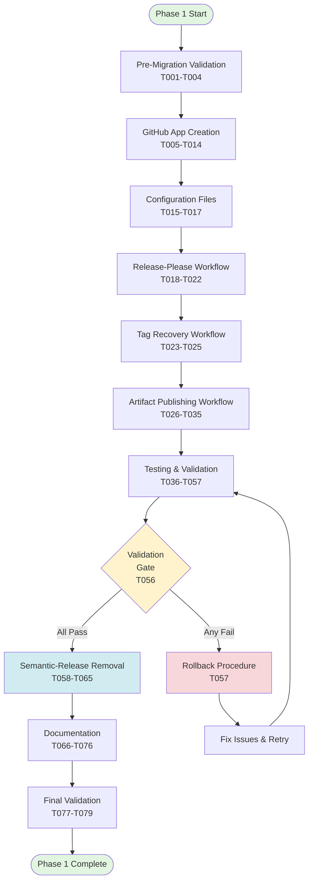
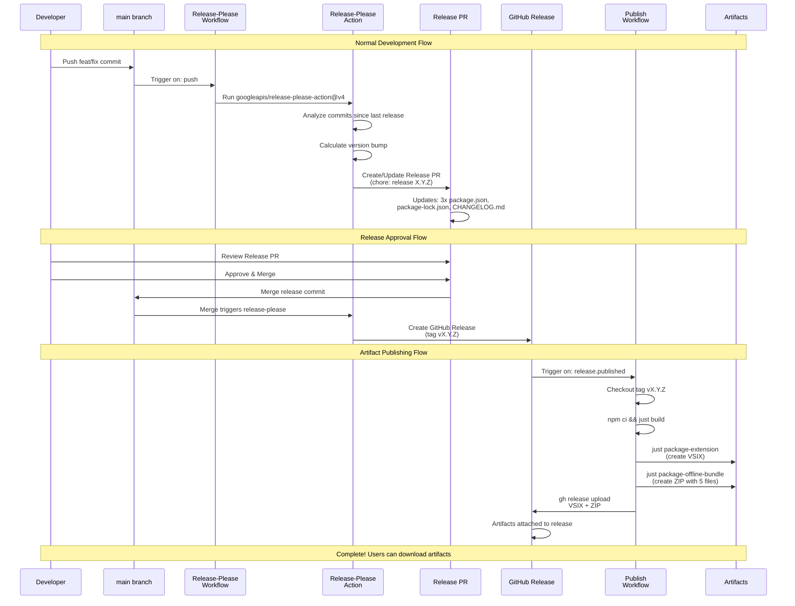

# Phase 1: Release-Please Migration - Tasks Dossier

**Phase**: Phase 1: Release-Please Migration
**Plan**: [release-please-integration-plan.md](../../release-please-integration-plan.md)
**Spec**: [release-please-integration-spec.md](../../release-please-integration-spec.md)
**Date Created**: 2025-11-10

---

## Tasks

| Status | ID | Task | Type | Dependencies | Absolute Path(s) | Validation | Subtasks | Notes |
|--------|-----|------|------|--------------|------------------|------------|----------|-------|
| **Pre-Migration Validation** |
| [ ] | T001 | Document current release workflow state | Setup | – | `/workspaces/vscode-bridge/.github/workflows/build-and-release.yml`, `/workspaces/vscode-bridge/CHANGELOG.md`, `/workspaces/vscode-bridge/docs/plans/28-release-please-integration/validation/pre-migration-baseline.md` | Screenshots captured showing: workflow execution logs, CHANGELOG.md content, v1.0.0 release artifacts. Baseline document created at validation/pre-migration-baseline.md | – | Per plan task 1.1. Creates comparison baseline |
| [ ] | T002 | Test organization token policy | Setup | T001 | `/workspaces/vscode-bridge/docs/plans/28-release-please-integration/validation/token-policy-test.md` | Test results documented showing: SEMANTIC_RELEASE_TOKEN behavior (works/blocked), GITHUB_TOKEN behavior (read-only confirmed) | – | Per plan task 1.2, Discovery 16. Determines GitHub App urgency |
| [ ] | T003 | Verify repository merge strategy | Setup | T001 | `/workspaces/vscode-bridge/docs/plans/28-release-please-integration/validation/merge-strategy.md` | Documented: merge strategy (squash/merge/rebase), whether PR title validation needed | – | Per plan task 1.3, Discovery 13. Affects Release PR requirements |
| [ ] | T004 | Verify current version baseline | Setup | T001 | `/workspaces/vscode-bridge/package.json`, `/workspaces/vscode-bridge/packages/extension/package.json`, `/workspaces/vscode-bridge/packages/shared-test/package.json`, `/workspaces/vscode-bridge/CHANGELOG.md` | Confirmed: all 3 package.json files at v1.0.0, git tag v1.0.0 exists, CHANGELOG has v1.0.0 entry | – | Per plan task 1.4. Baseline for manifest creation |
| **GitHub App Creation** |
| [ ] | T005 | Create GitHub App in organization | Core | T002 | `https://github.com/organizations/AI-Substrate/settings/apps/` (GitHub UI) | App exists at organization settings, app name recorded in validation docs | – | Per plan task 1.5, Discovery 03. Manual GitHub UI task |
| [ ] | T006 | Configure App permissions | Core | T005 | `https://github.com/organizations/AI-Substrate/settings/apps/{app-slug}` (GitHub UI) | Permissions set: contents=write, pull-requests=write; all others=disabled or none | – | Per plan task 1.6. Minimal permissions principle |
| [ ] | T007 | Set App homepage URL | Core | T005 | `https://github.com/organizations/AI-Substrate/settings/apps/{app-slug}` (GitHub UI) | Homepage URL set to https://github.com/AI-Substrate/wormhole | – | Per plan task 1.7 |
| [ ] | T008 | Generate and download private key | Core | T006 | External location (secure download), `/workspaces/vscode-bridge/docs/plans/28-release-please-integration/validation/app-key-location.md` (reference only, never commit key!) | Private key (.pem) downloaded to secure location, location documented (NOT key itself) | – | Per plan task 1.8, Discovery 14. NEVER commit key to git! |
| [ ] | T009 | Install App on AI-Substrate organization | Core | T007 | `https://github.com/organizations/AI-Substrate/settings/installations` (GitHub UI) | Installation confirmed at organization/settings/installations, installation ID recorded | – | Per plan task 1.9. Org-wide installation |
| [ ] | T010 | Add App to main branch bypass list | Core | T009 | `https://github.com/AI-Substrate/wormhole/settings/rules` (GitHub UI) | App visible in Repository Settings → Rules → Rulesets → main → Bypass list | – | Per plan task 1.10. Critical for Release PR creation |
| [ ] | T011 | Store App ID as repository secret | Core | T005 | `https://github.com/AI-Substrate/wormhole/settings/secrets/actions` (GitHub UI) | Secret RELEASE_PLEASE_APP_ID exists in repository secrets | – | Per plan task 1.11. GitHub Settings → Secrets → Actions |
| [ ] | T012 | Store private key as repository secret | Core | T008 | `https://github.com/AI-Substrate/wormhole/settings/secrets/actions` (GitHub UI) | Secret RELEASE_PLEASE_APP_PRIVATE_KEY exists in repository secrets (multi-line) | – | Per plan task 1.12. Multi-line secret |
| [ ] | T013 | Set APP_KEY_LAST_ROTATION variable | Core | T008 | `https://github.com/AI-Substrate/wormhole/settings/variables/actions` (GitHub UI) | Variable APP_KEY_LAST_ROTATION set to 2025-11-10 | – | Per plan task 1.13, Discovery 14. For 90-day rotation monitoring |
| [ ] | T014 | Test App token generation | Integration | T011, T012 | `/workspaces/vscode-bridge/.github/workflows/test-app-token.yml` (temp test workflow) | Test workflow successfully generates token using actions/create-github-app-token@v1, workflow deleted after verification | – | Per plan task 1.14. Validates credentials work. [P] eligible (separate test file) |
| **Configuration Files** |
| [ ] | T015 | Create .release-please-manifest.json | Core | T004 | `/workspaces/vscode-bridge/.release-please-manifest.json` | File exists with content: `{".": "1.0.0"}`. Passes `jq '.'` validation | – | Per plan task 1.15, Discovery 20. Bootstrap from v1.0.0 |
| [ ] | T016 | Create release-please-config.json with complete structure | Core | T004 | `/workspaces/vscode-bridge/release-please-config.json` | File contains: (1) `packages` object with keys ".", "packages/extension", "packages/shared-test" (each with release-type=node), (2) `plugins: ["node-workspace"]`, (3) `linked-versions` array with groupName "vsc-bridge-monorepo" containing all 3 packages, (4) `changelog-sections` array with 11 commit types (feat, fix, perf, revert, docs, refactor, test, build, ci, style, chore) with emoji headers matching .releaserc.json lines 76-126, (5) `bump-minor-pre-major: false`, (6) `commit-search-depth: 100`, (7) `bootstrap-sha: "6552cc9..."` (v1.0.0 commit SHA), (8) root package has `extra-files: ["packages/extension/package.json"]`. Validation: `cat release-please-config.json \| jq 'has("packages") and has("plugins") and has("linked-versions") and has("changelog-sections")'` returns `true` | – | Per plan tasks 1.16-1.24, Discoveries 01, 04, 09, 11, 12, 21. Master configuration file. See example in Alignment Brief |
| [ ] | T017 | Validate configuration JSON syntax | Integration | T015, T016 | `/workspaces/vscode-bridge/.release-please-manifest.json`, `/workspaces/vscode-bridge/release-please-config.json` | Both files pass `jq '.'` without errors. Config validation: `jq '.packages \| keys \| length' release-please-config.json` returns 3 | – | Per plan task 1.25. Prevents syntax errors |
| **Release-Please Workflow** |
| [ ] | T018 | Create release-please.yml workflow file | Core | T017 | `/workspaces/vscode-bridge/.github/workflows/release-please.yml` | Workflow file exists with: name="Release Please", on: push: branches=[main], permissions: contents=write + pull-requests=write | – | Per plan task 1.26, Discovery 10. Kebab-case naming (Discovery 17) |
| [ ] | T019 | Add GitHub App token generation step to release-please workflow | Core | T018 | `/workspaces/vscode-bridge/.github/workflows/release-please.yml` | Workflow contains step using actions/create-github-app-token@v1 with app-id=${{secrets.RELEASE_PLEASE_APP_ID}} and private-key=${{secrets.RELEASE_PLEASE_APP_PRIVATE_KEY}}, step id=app-token | – | Per plan task 1.29, Discovery 03. Serial (shared file with T018) |
| [ ] | T020 | Add release-please action step to workflow | Core | T019 | `/workspaces/vscode-bridge/.github/workflows/release-please.yml` | Workflow contains step using googleapis/release-please-action@v4 with token=${{steps.app-token.outputs.token}}, config-file=release-please-config.json, manifest-file=.release-please-manifest.json | – | Per plan task 1.30-1.31, Discovery 04. Serial (shared file) |
| [ ] | T021 | Add workflow job outputs | Core | T020 | `/workspaces/vscode-bridge/.github/workflows/release-please.yml` | Job outputs defined: new-release-published=${{steps.release.outputs.release_created}}, new-release-version=${{steps.release.outputs.tag_name}} | – | Per plan task 1.32, Discovery 06. Preserves semantic-release output contract. Serial (shared file) |
| [ ] | T022 | Verify singular release_created output used | Integration | T021 | `/workspaces/vscode-bridge/.github/workflows/release-please.yml` | Workflow uses `release_created` (singular) NOT `releases_created` (plural) in all conditionals and outputs | – | Per plan task 1.33, Discovery 05. Critical bug avoidance. Serial (shared file) |
| **Tag Recovery Workflow** |
| [ ] | T023 | Create release-tag-verification.yml workflow file | Core | T022 | `/workspaces/vscode-bridge/.github/workflows/release-tag-verification.yml` | Workflow file exists with: name="Verify Release Tags", on: schedule (daily cron) + workflow_dispatch, permissions: contents=write | – | Per plan task 1.34, Discovery 07. Idempotent recovery. [P] eligible (new file) |
| [ ] | T024 | Implement untagged release detection logic | Core | T023 | `/workspaces/vscode-bridge/.github/workflows/release-tag-verification.yml` | Workflow contains step that: searches git log for "chore: release X.Y.Z" commits, checks if corresponding vX.Y.Z tag exists, outputs list of untagged releases | – | Per plan task 1.35. Serial (shared file with T023) |
| [ ] | T025 | Implement missing tag creation logic | Core | T024 | `/workspaces/vscode-bridge/.github/workflows/release-tag-verification.yml` | Workflow contains step that: creates missing git tags, pushes tags to origin, creates GitHub Releases with CHANGELOG content, operates idempotently (skips if tag exists) | – | Per plan task 1.36. Serial (shared file) |
| **Artifact Publishing Workflow** |
| [ ] | T026 | Create publish-on-release.yml workflow file | Core | T025 | `/workspaces/vscode-bridge/.github/workflows/publish-on-release.yml` | Workflow file exists with: name="Publish Artifacts", on: release: types=[published], permissions: contents=write. **Include failure notification**: Configure GitHub Actions to send notification (email/Slack/issue) if workflow fails—method per team preference (GitHub notification settings, or Slack webhook, or create issue on failure) | – | Per plan task 1.37, Discovery 15. Separate workflow for artifact building with alerting. [P] eligible (new file) |
| [ ] | T027 | Add checkout with release tag reference | Core | T026 | `/workspaces/vscode-bridge/.github/workflows/publish-on-release.yml` | Workflow contains checkout step with ref=${{github.event.release.tag_name}}, fetch-depth=0 | – | Per plan task 1.38. Ensures correct version checked out. Serial (shared file) |
| [ ] | T028 | Add Node.js 22 setup with npm cache | Core | T027 | `/workspaces/vscode-bridge/.github/workflows/publish-on-release.yml` | Workflow contains step using actions/setup-node@v4 with node-version=22, cache=npm | – | Per plan task 1.39. Serial (shared file) |
| [ ] | T029 | Add just installation step | Core | T028 | `/workspaces/vscode-bridge/.github/workflows/publish-on-release.yml` | Workflow contains step installing just to /usr/local/bin using extractions/setup-just@v2 or manual curl install | – | Per plan task 1.40, Discovery 02. Serial (shared file) |
| [ ] | T030 | Add npm dependencies installation | Core | T029 | `/workspaces/vscode-bridge/.github/workflows/publish-on-release.yml` | Workflow contains step running `npm ci` | – | Per plan task 1.41. Serial (shared file) |
| [ ] | T031 | Add build step | Core | T030 | `/workspaces/vscode-bridge/.github/workflows/publish-on-release.yml` | Workflow contains step running `just build` | – | Per plan task 1.42, Discovery 09. Replicates semrel-prepare.mjs logic. Serial (shared file) |
| [ ] | T032 | Add VSIX packaging step | Core | T031 | `/workspaces/vscode-bridge/.github/workflows/publish-on-release.yml` | Workflow contains step running `just package-extension`, verifies activationEvents validation | – | Per plan task 1.43. Creates *.vsix artifact. Serial (shared file) |
| [ ] | T033 | Add offline bundle packaging step | Core | T032 | `/workspaces/vscode-bridge/.github/workflows/publish-on-release.yml` | Workflow contains step running `just package-offline-bundle`, depends on VSIX existing | – | Per plan task 1.44, Discovery 08. Creates *.zip with 5-file structure. Serial (shared file) |
| [ ] | T034 | Add artifact upload step with retry logic | Core | T033 | `/workspaces/vscode-bridge/.github/workflows/publish-on-release.yml` | Workflow contains step using `gh release upload` with 3-attempt retry loop (10s delays): `for attempt in 1 2 3; do gh release upload ${{github.event.release.tag_name}} artifacts/*.vsix artifacts/*.zip --clobber && break || ([ $attempt -lt 3 ] && sleep 10 || exit 1); done`. Validates both artifacts uploaded successfully | – | Per plan task 1.45, Discovery 08. Two-file contract with resilience. Serial (shared file) |
| [ ] | T035 | Add workflow artifact backup | Core | T034 | `/workspaces/vscode-bridge/.github/workflows/publish-on-release.yml` | Workflow contains step using actions/upload-artifact@v4 to backup both VSIX and ZIP with 90-day retention | – | Per plan task 1.46. Serial (shared file) |
| **Testing and Validation** |
| [ ] | T036 | Document rollback baseline before testing | Setup | T035 | `/tmp/pre-test-sha.txt`, `/tmp/pre-test-tags.txt`, `/tmp/pre-test-releases.txt` | Baseline recorded: `git rev-parse HEAD > /tmp/pre-test-sha.txt`, `git tag -l > /tmp/pre-test-tags.txt`, `gh release list > /tmp/pre-test-releases.txt` | – | Per plan task 1.46a. Rollback reference if validation fails |
| [ ] | T037 | Create test feature branch | Setup | T036 | `test/release-please-validation` branch | Branch created from main: `git checkout -b test/release-please-validation` | – | Per plan task 1.47. Safe testing branch |
| [ ] | T038 | Make test commit to trigger release | Core | T037 | Test file in `/workspaces/vscode-bridge/scratch/test-release-please.txt` | Test commit created: `feat(test): validate release-please` triggers minor bump (1.0.0 → 1.1.0). **Note**: This creates a permanent test release (v1.1.0) in production history—accepted as migration artifact, will be documented in CHANGELOG as test release | – | Per plan task 1.48. Creates real release for full validation |
| [ ] | T039 | Merge test PR to main | Integration | T038 | GitHub UI for PR merge | Test PR merged to main, merge commit visible in git log | – | Per plan task 1.49. Triggers release-please workflow |
| [ ] | T040 | Verify Release PR created | Integration | T039 | GitHub UI showing Release PR | Release PR exists with title "chore: release 1.1.0" (or next version), PR visible at https://github.com/AI-Substrate/wormhole/pulls | – | Per plan task 1.50. Confirms workflow triggered |
| [ ] | T041 | Verify Release PR contents | Integration | T040 | GitHub PR diff view | Release PR updates: package.json (root), packages/extension/package.json, packages/shared-test/package.json, package-lock.json, CHANGELOG.md (all 5 files modified). **Version sync verification**: Run `jq '.version' package.json packages/extension/package.json packages/shared-test/package.json \| sort -u \| wc -l` → must output `1` (all versions identical) | – | Per plan task 1.51, Discovery 01. Monorepo version sync with explicit validation command |
| [ ] | T042 | Verify CHANGELOG emoji format matches semantic-release | Integration | T040 | Release PR CHANGELOG.md diff | CHANGELOG sections use emojis: 🚀 Features, 🐛 Bug Fixes, ⚡ Performance, etc. Format matches current CHANGELOG.md | – | Per plan task 1.52, Discovery 12. Format consistency |
| [ ] | T043 | Verify version bump follows conventional commits | Integration | T040 | Release PR diff | Version bump: 1.0.0 → 1.1.0 (minor for feat:) or as expected based on commit type | – | Per plan task 1.53. Semver correctness |
| [ ] | T044 | Merge Release PR | Core | T043 | GitHub UI for PR merge | Release PR merged to main, merge commit triggers release creation | – | Per plan task 1.54. Triggers release event |
| [ ] | T045 | Verify GitHub Release created | Integration | T044 | `https://github.com/AI-Substrate/wormhole/releases/tag/vX.Y.Z` | GitHub Release exists at /releases/tag/vX.Y.Z with CHANGELOG content | – | Per plan task 1.55. Release created by release-please |
| [ ] | T046 | Verify release tag created | Integration | T044 | Git tags | Git tag vX.Y.Z exists: `git tag -l \| grep vX.Y.Z` returns match | – | Per plan task 1.56. Tag created by release-please |
| [ ] | T047 | Verify publish workflow triggered | Integration | T045 | `https://github.com/AI-Substrate/wormhole/actions/workflows/publish-on-release.yml` | Workflow run visible in Actions tab, triggered by release:published event | – | Per plan task 1.57, Discovery 15. Separate workflow |
| [ ] | T048 | Verify VSIX uploaded to release | Integration | T047 | Release assets view | vsc-bridge-X.Y.Z.vsix attached to release, downloadable | – | Per plan task 1.58. Artifact present |
| [ ] | T049 | Verify offline bundle uploaded to release | Integration | T047 | Release assets view | vsc-bridge-offline-X.Y.Z.zip attached to release, downloadable | – | Per plan task 1.59. Artifact present |
| [ ] | T050 | Download and inspect offline bundle structure | Integration | T049 | Downloaded `/tmp/vsc-bridge-offline-X.Y.Z.zip` | ZIP contains 5 files: VSIX, CLI tarball, install.sh, install.ps1, README.txt. README has correct version substitution | – | Per plan task 1.60, Discovery 08. 5-file contract |
| [ ] | T051 | Verify workflow outputs | Integration | T040 | Workflow run logs at Actions tab | Workflow outputs show: new-release-published=true, new-release-version=vX.Y.Z | – | Per plan task 1.61, Discovery 06. Contract preservation |
| [ ] | T052 | Verify no branch protection violations | Integration | T040, T047 | Workflow run logs | No errors containing "branch protection" or "protected branch" in workflow logs | – | Per plan task 1.62. App bypass working |
| [ ] | T053 | Test tag recovery workflow | Integration | T046 | `https://github.com/AI-Substrate/wormhole/actions/workflows/release-tag-verification.yml` | Manual workflow dispatch completes without errors, correctly detects no untagged releases | – | Per plan task 1.63. Recovery mechanism works. [P] eligible (separate workflow) |
| [ ] | T054 | Verify monorepo version sync | Integration | T041 | All 3 package.json files | All 3 package.json files show same version: root, packages/extension, packages/shared-test | – | Per plan task 1.64. Sync works |
| [ ] | T055 | Test breaking change handling | Integration | T044 | New test branch with BREAKING CHANGE commit | Create feat commit with `BREAKING CHANGE:` footer or `feat!:` syntax, verify Release PR proposes major bump (1.x → 2.x) | – | Per plan task 1.65, Discoveries 11, 22. Post-1.0 semver |
| [ ] | T056 | VALIDATION GATE - Confirm all tests passed | Integration | T037-T055 | Detailed validation checklist (plan lines 1199-1232) | ALL tasks T037-T055 show ✅ status AND detailed validation checklist shows zero failures across all 5 categories | – | Per plan task 1.65a. **BLOCKING**: If ANY failures, proceed to rollback T057 |
| [ ] | T057 | ROLLBACK PROCEDURE - Execute if validation failed | Integration | T056 (only if failed) | Multiple paths (release, tags, branches) | **ONLY run if T056 fails**: (1) Delete test release: `gh release delete vX.Y.Z --yes`, (2) Delete test tag: `git tag -d vX.Y.Z && git push --delete origin vX.Y.Z`, (3) Close Release PR: `gh pr close <pr-number> --delete-branch`, (4) Reset to baseline: `git reset --hard $(cat /tmp/pre-test-sha.txt)`, (5) Document failure in /workspaces/vscode-bridge/docs/plans/28-release-please-integration/validation/failure-report.md, (6) Fix issues before retrying | – | Per plan task 1.65b. Safety mechanism |
| **Semantic-Release Removal** (Only after validation passes) |
| [ ] | T058 | Delete .releaserc.json | Core | T056 | `/workspaces/vscode-bridge/.releaserc.json` | File deleted, `git status` shows deletion | – | Per plan task 1.66. Config removed. [P] eligible (separate file) |
| [ ] | T059 | Delete scripts/semrel-prepare.mjs | Core | T056 | `/workspaces/vscode-bridge/scripts/semrel-prepare.mjs` | File deleted, logic migrated to publish-on-release workflow | – | Per plan task 1.67. Logic migrated. [P] eligible (separate file) |
| [ ] | T060 | Remove semantic-release from package.json devDependencies | Core | T058 | `/workspaces/vscode-bridge/package.json` | semantic-release removed from devDependencies section | – | Per plan task 1.68. Serial (shared file with other package.json edits) |
| [ ] | T061 | Remove @semantic-release/* packages from package.json | Core | T060 | `/workspaces/vscode-bridge/package.json` | 7 packages removed: @semantic-release/changelog, commit-analyzer, exec, git, github, npm, release-notes-generator | – | Per plan task 1.69. All plugins removed. Serial (shared file) |
| [ ] | T062 | Remove semantic-release script from package.json | Core | T061 | `/workspaces/vscode-bridge/package.json` | "semantic-release" script removed from scripts section | – | Per plan task 1.70. Serial (shared file) |
| [ ] | T063 | Delete build-and-release.yml workflow | Core | T056 | `/workspaces/vscode-bridge/.github/workflows/build-and-release.yml` | Workflow deleted, replaced by release-please.yml + publish-on-release.yml | – | Per plan task 1.71. Replaced by new workflows. [P] eligible (separate file) |
| [ ] | T064 | Run npm install to update package-lock.json | Core | T062 | `/workspaces/vscode-bridge/package-lock.json` | package-lock.json updated reflecting semantic-release removal: `npm install` completes successfully | – | Per plan task 1.72. Clean deps. Serial (depends on prior package.json edits) |
| [ ] | T065 | Verify no semantic-release references remain | Integration | T064 | Entire repository | `grep -r "semantic-release" --exclude-dir=docs --exclude-dir=node_modules --exclude='*.md' .` returns no results (docs excluded - historical references OK) | – | Per plan task 1.73. Complete removal verification |
| **Documentation** |
| [ ] | T066 | Create docs/how/releases/ directory | Setup | T065 | `/workspaces/vscode-bridge/docs/how/releases/` | Directory exists, added to git | – | Per plan task 1.74. New docs location. [P] eligible (separate directory) |
| [ ] | T067 | Update README.md with release automation section | Doc | T066 | `/workspaces/vscode-bridge/README.md` | README has brief section mentioning automated releases via release-please + link to docs/how/releases/ | – | Per plan task 1.75. Hybrid approach. Serial (shared file if multiple README edits) |
| [ ] | T068 | Create 1-overview.md | Doc | T066 | `/workspaces/vscode-bridge/docs/how/releases/1-overview.md` | File contains: introduction to release-please, how it differs from semantic-release, workflow overview, Release PR concept | – | Per plan task 1.76. Overview. [P] eligible (new file) |
| [ ] | T069 | Create 2-github-app-setup.md | Doc | T066 | `/workspaces/vscode-bridge/docs/how/releases/2-github-app-setup.md` | File contains: (1) step-by-step app creation with screenshots, (2) permission configuration, (3) installation, (4) bypass list setup, (5) secret storage, (6) **DETAILED 90-day key rotation procedure** (copy-paste commands, numbered steps, zero ambiguity), (7) emergency recovery procedure (key lost/compromised scenarios with exact restoration steps). Validation: rotation section has ≥6 numbered steps with exact commands | – | Per plan task 1.77, Discovery 14. App setup guide with emphasis on painless rotation. [P] eligible (new file) |
| [ ] | T070 | Create 3-release-please-configuration.md | Doc | T066 | `/workspaces/vscode-bridge/docs/how/releases/3-release-please-configuration.md` | File explains: manifest file format, config file structure, workspace plugin, linked-versions, changelog sections, all config options with examples | – | Per plan task 1.78. Config reference. [P] eligible (new file) |
| [ ] | T071 | Create 4-release-workflow.md | Doc | T066 | `/workspaces/vscode-bridge/docs/how/releases/4-release-workflow.md` | File explains: how Release PRs work, what commits trigger them, how to review Release PR, merge process, what happens after merge, artifact publishing | – | Per plan task 1.79. User guide. [P] eligible (new file) |
| [ ] | T072 | Create 5-troubleshooting.md | Doc | T066 | `/workspaces/vscode-bridge/docs/how/releases/5-troubleshooting.md` | File contains: common issues (untagged releases, branch protection, workflow failures), recovery procedures, tag recovery workflow usage, manual release creation | – | Per plan task 1.80, Discovery 07. Troubleshooting. [P] eligible (new file) |
| [ ] | T073 | Document BREAKING CHANGE format requirements | Doc | T072 | `/workspaces/vscode-bridge/docs/how/releases/5-troubleshooting.md` or `/workspaces/vscode-bridge/docs/how/releases/4-release-workflow.md` | Documentation explains: `BREAKING CHANGE:` must be uppercase (footer) OR use `feat!:` syntax (case-insensitive), examples of both formats | – | Per plan task 1.81, Discovery 22. Case sensitivity warning. Serial (shared file) |
| [ ] | T074 | Document PR title requirements | Doc | T071 | `/workspaces/vscode-bridge/docs/how/releases/4-release-workflow.md` | Documentation explains: if squash merge enabled, PR titles must follow conventional commits format, provides examples | – | Per plan task 1.82, Discovery 13. Conditional requirement. Serial (shared file) |
| [ ] | T075 | Document major version bump behavior | Doc | T071 | `/workspaces/vscode-bridge/docs/how/releases/4-release-workflow.md` | Documentation explains: post-1.0 breaking changes trigger major bumps (1.x → 2.x), standard semver behavior, differs from pre-1.0 | – | Per plan task 1.83, Discovery 11. Semver behavior. Serial (shared file) |
| [ ] | T076 | Review all documentation for quality | Integration | T067-T075 | All docs/how/releases/*.md files, README.md | Peer review completed, no broken links, consistent formatting, accurate examples, clear writing | – | Per plan task 1.84. Quality gate |
| **Final Validation** |
| [ ] | T077 | Validate all checklists complete | Integration | T001-T076 | All task rows, detailed validation checklist (plan lines 1199-1232) | ALL tasks T001-T076 show ✅ status, detailed validation checklist (Workflow Execution, Content, Artifacts, Security, Edge Cases) shows ✅ for all items | – | Per plan task 1.85. Comprehensive validation |
| [ ] | T078 | Create validation report | Doc | T077 | `/workspaces/vscode-bridge/docs/plans/28-release-please-integration/validation/final-report.md` | Report contains: screenshots of workflow runs, CHANGELOG comparison, artifact checksums (sha256), test results summary, any issues encountered and resolutions | – | Per plan task 1.86. Evidence documentation |
| [ ] | T079 | Train team on Release PR merge process | Integration | T078 | Team members confirmed | Team training session completed, team members understand: when to merge Release PRs, how to review them, what triggers release, artifact publishing process | – | Per plan task 1.87. Knowledge transfer |

---

## Alignment Brief

### Objective and Acceptance Criteria

**Primary Objective**: Complete migration from semantic-release to release-please, eliminating branch protection violations and PAT dependency while maintaining monorepo version sync, emoji CHANGELOG format, and dual-artifact publishing.

**Behavior Checklist** (from PLAN acceptance criteria):

- [ ] **All 79 tasks (T001-T079) show ✅ status** - Every task completed successfully
- [ ] **Validation gate passed (T056)** - All testing tasks passed with zero failures
- [ ] **Detailed validation checklist passed** - All 5 validation categories (Workflow Execution, Content Validation, Artifact Validation, Security & Permissions, Edge Cases) verified
- [ ] **Validation report created** - Comprehensive report at validation/final-report.md with screenshots, checksums, test results
- [ ] **Semantic-release completely removed** - Tasks T058-T065 completed, no references remain
- [ ] **Build verification** - `just build` succeeds after semantic-release removal
- [ ] **Team handover complete** - Task T079 completed, team understands Release PR process

### Non-Goals (Scope Boundaries)

**❌ NOT doing in this phase:**

- **npm registry publication**: GitHub Releases only (Discovery 18)
- **VS Code Marketplace publication**: Not in scope
- **Automated PR title validation**: Only documenting requirement if squash merge enabled (Discovery 13)
- **Automated key rotation workflow**: Only documenting 90-day manual procedure (Discovery 14)
- **Pre-release versions**: No alpha/beta releases (assumption from plan)
- **Rollback of production releases**: Only test release rollback procedure
- **Migration of historical CHANGELOG**: Preserving existing v1.0.0 entry, prepending new entries (Discovery 20)
- **Custom commit types beyond 11 defined**: Using standard conventional commits types only (Discovery 12)
- **Advanced GitHub App monitoring**: Basic 90-day rotation tracking only

### Critical Findings Affecting This Phase

**All 24 discoveries impact this phase. Key discoveries by task:**

| Discovery | Title | Affects Tasks | Constraint/Requirement |
|-----------|-------|---------------|------------------------|
| 01 🚨 | Monorepo Version Sync | T016, T041, T054 | MUST use node-workspace plugin + linked-versions |
| 02 🚨 | Build Artifact Chain | T029-T035 | MUST invoke `just build/package-extension/package-offline-bundle` in order |
| 03 🚨 | GitHub App Bypass | T005-T014, T019 | MUST create GitHub App, add to bypass list, use app token (not GITHUB_TOKEN) |
| 04 🚨 | Config Externalization | T015-T017 | MUST use external JSON config files (not workflow YAML inputs) |
| 05 🚨 | release_created Bug | T022, T051 | MUST use singular `release_created` NOT plural `releases_created` |
| 06 🚨 | Output Contract | T021, T051 | MUST preserve `new-release-published`/`new-release-version` output names |
| 07 🚨 | Tag Recovery | T023-T025, T053 | MUST implement idempotent recovery workflow for failed tag creation |
| 08 🚨 | Two-File Artifact | T034, T050 | MUST upload both VSIX + offline ZIP (5-file internal structure) |
| 09 ⚠️ | Custom Prepare Script | T031-T033 | Replicate semrel-prepare.mjs logic in publish-on-release workflow |
| 10 ⚠️ | PR-Based Flow | T018, T026 | No [skip ci] needed, use correct triggers (push:main, release:published) |
| 11 ⚠️ | Breaking → Major | T016, T055, T075 | Post-1.0: breaking changes trigger major bump (1.x → 2.x) |
| 12 ⚠️ | Emoji Changelog | T016, T042, T070 | MUST map all 11 commit types with emojis matching .releaserc.json |
| 13 ⚠️ | Squash Merge | T003, T074 | If enabled, PR titles must follow conventional commits |
| 14 ⚠️ | Key Rotation | T013, T069 | Document 90-day manual rotation procedure |
| 15 ⚠️ | Separate Publish | T026-T035, T047 | Artifacts built AFTER release created (separate on:release workflow) |
| 16 ⚠️ | Org Token Policy | T002 | Test whether PAT blocked or only default GITHUB_TOKEN |
| 17 ℹ️ | Kebab-Case Naming | T018, T023, T026 | Use kebab-case for workflow filenames |
| 18 ℹ️ | GitHub Only | T016 | No npm publication config |
| 19 ℹ️ | CHANGELOG Mutation | T042 | Already covered by Discovery 12 |
| 20 ℹ️ | Bootstrap v1.0.0 | T015 | Manifest baseline: `{".": "1.0.0"}` |
| 21 ℹ️ | Commit Search Depth | T016 | Configure `commit-search-depth: 100` + bootstrap-sha |
| 22 ℹ️ | BREAKING Case | T055, T073 | Must be uppercase `BREAKING CHANGE:` OR use `feat!:` |
| 23 ℹ️ | Bootstrap Requirement | T015 | Already covered by Discovery 20 |
| 24 ℹ️ | Breaking Post-1.0 | T016, T055 | Already covered by Discovery 11 |

### Invariants and Guardrails

**Security**:
- GitHub App private key NEVER committed to git (T008 validation)
- Secrets accessed only via `${{ secrets.* }}` syntax in workflows
- Minimal permissions: contents:write + pull-requests:write only (T006)
- App added to auditable bypass list (T010), not silent PAT bypass

**Configuration Integrity**:
- All JSON files validated with `jq` before commit (T017)
- Workflow YAML syntax validated via `yamllint` or GitHub Actions validation
- No inline workflow config (externalized per Discovery 04)

**Artifact Contract**:
- Exactly 2 files uploaded per release: VSIX + offline ZIP (T034)
- Offline ZIP contains exactly 5 files: VSIX, tarball, 2 installers, README (T050)
- Filenames follow pattern: `vsc-bridge-{VERSION}.vsix`, `vsc-bridge-offline-{VERSION}.zip`

**Version Consistency**:
- All 3 package.json files MUST have identical version (T054)
- package-lock.json MUST reflect version bump (T041)
- CHANGELOG MUST match version (T042)

### Inputs to Read

**Existing Configuration** (for migration reference):
- `/workspaces/vscode-bridge/.releaserc.json` - Semantic-release config (emoji sections, commit types)
- `/workspaces/vscode-bridge/scripts/semrel-prepare.mjs` - Build orchestration logic to replicate
- `/workspaces/vscode-bridge/.github/workflows/build-and-release.yml` - Current workflow structure

**Package Structure**:
- `/workspaces/vscode-bridge/package.json` - Root package (current v1.0.0)
- `/workspaces/vscode-bridge/packages/extension/package.json` - Extension package
- `/workspaces/vscode-bridge/packages/shared-test/package.json` - Shared test package
- `/workspaces/vscode-bridge/package-lock.json` - Lock file

**Build System**:
- `/workspaces/vscode-bridge/justfile` - Commands: `just build`, `just package-extension`, `just package-offline-bundle`

**Documentation**:
- `/workspaces/vscode-bridge/README.md` - For adding release automation section
- `/workspaces/vscode-bridge/CHANGELOG.md` - Current format reference (v1.0.0 entry)

**Plan Documentation**:
- `/workspaces/vscode-bridge/docs/plans/28-release-please-integration/release-please-integration-plan.md` - This implementation plan
- `/workspaces/vscode-bridge/docs/plans/28-release-please-integration/release-please-integration-spec.md` - Original specification

### Visual Alignment Aids

#### System State Flow Diagram



#### Release PR Lifecycle Sequence Diagram



### Test Plan (Manual Validation Approach)

**Testing Philosophy**: Manual Only (from specification). No automated tests for configuration-only work involving GitHub workflows (YAML), GitHub App setup, and release-please configuration (JSON). Real GitHub Actions execution and GitHub API interactions required.

**Test Strategy**:

1. **Pre-Flight Validation (T001-T004)**:
   - Capture baseline state (current workflow, CHANGELOG, artifacts)
   - Test org token policy to determine GitHub App urgency
   - Verify merge strategy (affects PR title requirements)
   - Confirm v1.0.0 baseline for manifest

2. **Component Testing (T005-T035)**:
   - GitHub App: Test token generation works before proceeding (T014)
   - Config Files: Validate JSON syntax with `jq` (T017)
   - Workflows: Syntax validate each workflow file after creation

3. **Integration Testing (T036-T057)**:
   - Create test branch with feat: commit
   - Merge to main → verify Release PR created (T040)
   - Verify Release PR contents (version bump, CHANGELOG, monorepo sync) (T041-T043)
   - Merge Release PR → verify release created (T045)
   - Verify publish workflow triggered → artifacts uploaded (T047-T049)
   - Download and inspect offline bundle (5-file structure) (T050)
   - Verify workflow outputs match contract (T051)
   - Test tag recovery workflow (manual dispatch) (T053)
   - Test breaking change handling (major bump) (T055)

4. **Validation Gate (T056)**:
   - ALL tests T037-T055 MUST pass
   - Detailed validation checklist (5 categories) MUST show zero failures
   - If ANY failure → execute rollback T057
   - Rollback: delete test release, delete tag, close PR, reset git, document failure

5. **Cleanup Verification (T058-T065)**:
   - Only proceed after validation gate passes
   - Verify semantic-release completely removed (grep returns nothing)
   - Verify build still works: `just build` succeeds

6. **Documentation Review (T066-T076)**:
   - Peer review all docs
   - Verify no broken links
   - Test documented procedures

7. **Final Validation (T077-T079)**:
   - All 79 tasks complete
   - Validation report created
   - Team trained

**Test Fixtures**: None (manual UI interactions, GitHub API)

**Expected Outputs**:
- Release PR created automatically with correct version bump
- CHANGELOG format matches semantic-release (emojis, sections)
- All 3 package.json files synchronized
- GitHub Release created with tag
- VSIX + offline ZIP uploaded
- No branch protection violations
- Tag recovery workflow functions
- Breaking change triggers major bump

### Implementation Outline

**Phase Structure** (79 tasks, 10 groups):

1. **Pre-Migration Validation** (T001-T004): Document baseline, test token policy, verify merge strategy, confirm v1.0.0
2. **GitHub App Creation** (T005-T014): Create app, configure permissions, install, add to bypass list, store secrets, test token
3. **Configuration Files** (T015-T017): Create manifest + config JSON, validate syntax
4. **Release-Please Workflow** (T018-T022): Create workflow with app token, action, outputs
5. **Tag Recovery Workflow** (T023-T025): Create recovery workflow with detection + creation logic
6. **Artifact Publishing Workflow** (T026-T035): Create separate on:release workflow with build/package/upload steps
7. **Testing & Validation** (T036-T057): Test branch, Release PR, merge, artifacts, validation gate, rollback if needed
8. **Semantic-Release Removal** (T058-T065): Delete config/script/workflow, remove deps, verify cleanup
9. **Documentation** (T066-T076): Create docs/how/releases/ with 5 files + README update
10. **Final Validation** (T077-T079): Complete checklists, create report, train team

**Execution Order**: Sequential through groups, parallel within groups where marked [P]

**Key Milestones**:
- M1: GitHub App working (T014 complete)
- M2: Config files validated (T017 complete)
- M3: All 3 workflows created (T035 complete)
- M4: Validation gate passed (T056 complete) - **CRITICAL**
- M5: Semantic-release removed (T065 complete)
- M6: Documentation complete (T076 complete)
- M7: Phase complete (T079 complete)

### Commands to Run

**Pre-Migration Validation**:
```bash
# T001: Document baseline
gh workflow view build-and-release.yml
cat CHANGELOG.md | head -20
gh release view v1.0.0

# T002: Test token policy
GH_TOKEN=$GITHUB_TOKEN gh label list  # Should fail (read-only)
GH_TOKEN=$SEMANTIC_RELEASE_TOKEN gh label list  # Test if works

# T003: Check merge strategy
gh repo view --json mergeCommitAllowed,squashMergeAllowed,rebaseMergeAllowed

# T004: Verify v1.0.0 baseline
cat package.json | jq '.version'
cat packages/extension/package.json | jq '.version'
cat packages/shared-test/package.json | jq '.version'
git tag -l | grep v1.0.0
```

**Configuration File Validation**:
```bash
# T017: Validate JSON syntax
jq '.' .release-please-manifest.json
jq '.' release-please-config.json

# Validate structure
jq 'has("packages") and has("plugins") and has("linked-versions") and has("changelog-sections")' release-please-config.json
jq '.packages | keys | length' release-please-config.json  # Should return 3
```

**Testing Commands**:
```bash
# T036: Baseline before testing
git rev-parse HEAD > /tmp/pre-test-sha.txt
git tag -l > /tmp/pre-test-tags.txt
gh release list > /tmp/pre-test-releases.txt

# T037: Create test branch
git checkout -b test/release-please-validation

# T038: Test commit
echo "test" > scratch/test-release-please.txt
git add scratch/test-release-please.txt
git commit -m "feat(test): validate release-please"
git push -u origin test/release-please-validation

# T039: Create and merge PR (via GitHub UI)
gh pr create --title "feat(test): validate release-please" --body "Test release-please workflow"
gh pr merge --squash  # or --merge depending on strategy

# T040-T043: Verify Release PR (via GitHub UI)
gh pr list --search "chore: release" --state open
gh pr view <pr-number> --json files,title,body

# T044: Merge Release PR (via GitHub UI)
gh pr merge <release-pr-number> --squash

# T045-T046: Verify release and tag
gh release view v1.1.0  # Or whatever version
git fetch --tags
git tag -l | grep v1.1.0

# T047: Check publish workflow
gh run list --workflow=publish-on-release.yml

# T048-T050: Verify artifacts
gh release view v1.1.0 --json assets
gh release download v1.1.0
unzip vsc-bridge-offline-1.1.0.zip
ls -la  # Should show 5 files

# T053: Test tag recovery
gh workflow run release-tag-verification.yml
gh run watch

# T057: Rollback if validation fails
gh release delete v1.1.0 --yes
git tag -d v1.1.0
git push --delete origin v1.1.0
gh pr close <release-pr-number> --delete-branch
git reset --hard $(cat /tmp/pre-test-sha.txt)
```

**Cleanup Verification**:
```bash
# T065: Verify semantic-release removed
grep -r "semantic-release" --exclude-dir=docs --exclude-dir=node_modules --exclude='*.md' .

# Verify build still works
just build
```

### Risks and Unknowns

| Risk | Severity | Likelihood | Mitigation | Tasks |
|------|----------|------------|------------|-------|
| GitHub App requires org admin | High | Low | Request access before T005, document in T002 | T005 |
| Wrong output name breaks downstream | High | Medium | Use singular `release_created` in T022, validate in T051 | T022, T051 |
| Premature semantic-release removal | Critical | Medium | Only remove after T056 validation gate passes | T058-T065 |
| Test release pollutes git history | Low | Medium | Use chore: scope for test commits, or delete tag after testing | T038 |
| Tag creation fails mid-flow | High | Low | Implement recovery workflow T023-T025, test in T053 | T023-T025, T053 |
| Config file syntax errors | Medium | Medium | Validate all JSON with jq in T017, use examples from docs | T017 |
| Workflow YAML syntax errors | Medium | Medium | Use yamllint or GitHub Actions validation, test each workflow after creation | T018-T035 |
| Monorepo version desync | High | Low | Configure linked-versions in T016, validate in T054 | T016, T054 |
| CHANGELOG format breaks | Medium | Low | Map all 11 emoji sections in T016, validate in T042 | T016, T042 |
| Artifact upload fails | High | Low | Test publish workflow in T047-T050, implement backup in T035 | T035, T047-T050 |
| Rollback incomplete | High | Low | Document complete 6-step rollback in T057, test if validation fails | T057 |
| Team doesn't understand Release PRs | Medium | Medium | Create comprehensive docs T068-T075, train team in T079 | T068-T079 |

**Unknowns to Resolve During Execution**:
- Whether org token policy blocks PAT (T002 will determine)
- Whether repository uses squash merge (T003 will determine)
- Exact GitHub App slug/ID after creation (T005)
- Actual version bump in test (depends on commits: T043)
- Whether validation gate passes on first try (T056)

### Ready Check (GO/NO-GO)

**Before proceeding to implementation, confirm**:

- [ ] **Plan validation passed** - `/plan-4-complete-the-plan` showed no blocking issues
- [ ] **Spec reviewed** - Understand testing approach (Manual Only), documentation strategy (Hybrid), clarifications
- [ ] **All 24 discoveries understood** - Especially Critical discoveries 01-08 affecting architecture
- [ ] **GitHub org admin access** - Can create GitHub Apps, or know who to ask
- [ ] **Current main branch stable** - v1.0.0 released, no pending changes
- [ ] **Justfile commands verified** - `just build`, `just package-extension`, `just package-offline-bundle` work
- [ ] **No parallel release work** - No one else working on release automation changes
- [ ] **Time allocated** - Estimate 6-8 hours for 79 tasks + validation + documentation
- [ ] **Rollback plan understood** - Know how to execute T057 if validation fails
- [ ] **Team informed** - Team knows migration is happening, how Release PRs will work

**Critical Pre-Requisites**:
- GitHub organization admin access (for T005-T010)
- Repository write access (for creating branches, workflows, config files)
- Access to `SEMANTIC_RELEASE_TOKEN` secret (for testing in T002)
- Ability to merge PRs to main (for testing in T039, T044)

---

## Phase Footnote Stubs

**NOTE**: Footnotes will be added during implementation by `/plan-6a-update-progress`. This section serves as a placeholder.

| Footnote | Change Summary | Flowspace Node IDs |
|----------|----------------|-------------------|
| [^1] | (To be added during implementation) | |
| [^2] | (To be added during implementation) | |
| [^3] | (To be added during implementation) | |

---

## Evidence Artifacts

**Execution Log**: Implementation progress, decisions, and issues will be recorded in:
- `/workspaces/vscode-bridge/docs/plans/28-release-please-integration/tasks/phase-1/execution.log.md`

**Validation Evidence**: Screenshots, test results, and artifact checksums will be stored in:
- `/workspaces/vscode-bridge/docs/plans/28-release-please-integration/validation/`
  - `pre-migration-baseline.md` - T001 baseline documentation
  - `token-policy-test.md` - T002 token policy test results
  - `merge-strategy.md` - T003 merge strategy verification
  - `failure-report.md` - T057 rollback documentation (if needed)
  - `final-report.md` - T078 comprehensive validation report

**Supporting Files**: Configuration examples and references:
- `/workspaces/vscode-bridge/docs/plans/28-release-please-integration/examples/`
  - `release-please-config.example.json` - Full config example with annotations
  - `release-please-workflow.example.yml` - Workflow template with comments

---

## Directory Layout

```
docs/plans/28-release-please-integration/
├── release-please-integration-spec.md           # Specification document
├── release-please-integration-plan.md           # Implementation plan (this file references)
├── tasks/
│   └── phase-1/
│       ├── tasks.md                             # THIS FILE - Phase 1 tasks + alignment brief
│       └── execution.log.md                     # Created by /plan-6 during implementation
├── validation/
│   ├── pre-migration-baseline.md                # T001 - Baseline state
│   ├── token-policy-test.md                     # T002 - Token policy test results
│   ├── merge-strategy.md                        # T003 - Merge strategy docs
│   ├── app-key-location.md                      # T008 - Key location reference (NOT key itself!)
│   ├── failure-report.md                        # T057 - Rollback documentation (if needed)
│   └── final-report.md                          # T078 - Final validation report
└── examples/
    ├── release-please-config.example.json       # Config template with annotations
    └── release-please-workflow.example.yml      # Workflow template with comments
```

**Files Created During Implementation**:
- 3 workflow files in `.github/workflows/`
- 2 config files in repository root
- 5 documentation files in `docs/how/releases/`
- Updated `README.md`
- Execution log and validation evidence in `docs/plans/28-release-please-integration/`

**Files Deleted During Implementation**:
- `.releaserc.json` (semantic-release config)
- `scripts/semrel-prepare.mjs` (custom prepare script)
- `.github/workflows/build-and-release.yml` (old workflow)

---

## Example release-please-config.json Structure

**Complete example for reference** (to be created in T016):

```json
{
  "$schema": "https://raw.githubusercontent.com/googleapis/release-please/main/schemas/config.json",
  "commit-search-depth": 100,
  "bootstrap-sha": "6552cc9a7c76c8f0e5d8e4c3b2a19f8d7e6c5b4a",
  "packages": {
    ".": {
      "release-type": "node",
      "package-name": "vsc-bridge",
      "extra-files": [
        "packages/extension/package.json"
      ]
    },
    "packages/extension": {
      "release-type": "node",
      "package-name": "vsc-bridge-extension"
    },
    "packages/shared-test": {
      "release-type": "node",
      "package-name": "vsc-bridge-shared-test"
    }
  },
  "plugins": ["node-workspace"],
  "linked-versions": [
    {
      "groupName": "vsc-bridge-monorepo",
      "components": [
        ".",
        "packages/extension",
        "packages/shared-test"
      ]
    }
  ],
  "changelog-sections": [
    {"type": "feat", "section": "🚀 Features"},
    {"type": "fix", "section": "🐛 Bug Fixes"},
    {"type": "perf", "section": "⚡ Performance Improvements"},
    {"type": "revert", "section": "⏪ Reverts"},
    {"type": "docs", "section": "📚 Documentation"},
    {"type": "refactor", "section": "📦 Code Refactoring"},
    {"type": "test", "section": "🚨 Tests", "hidden": true},
    {"type": "build", "section": "🛠 Build System", "hidden": true},
    {"type": "ci", "section": "⚙️ Continuous Integration", "hidden": true},
    {"type": "style", "section": "💎 Styles", "hidden": true},
    {"type": "chore", "section": "🔧 Miscellaneous Chores", "hidden": true}
  ],
  "bump-minor-pre-major": false,
  "bump-patch-for-minor-pre-major": false
}
```

---

## Critical Insights Discussion

**Session**: 2025-11-10
**Context**: Phase 1: Release-Please Migration - Tasks Dossier (79 tasks, release automation migration)
**Analyst**: AI Clarity Agent
**Reviewer**: Development Team
**Format**: Water Cooler Conversation (5 Critical Insights)

### Insight 1: The Validation Gate (T056) Is a One-Way Door

**Did you know**: Once you execute tasks T058-T065 (semantic-release removal), there's no safe way to roll back if something goes wrong? The validation gate at T056 isn't just a checkpoint—it's the last moment where you can cleanly undo the migration.

**Implications**:
- Rollback procedure (T057) only works BEFORE semantic-release removal
- Premature deletion = project paralysis (can't release via either system)
- Pressure to "make it work" once semantic-release is gone
- Reconstructing semantic-release from memory/git history is error-prone

**Options Considered**:
- Option A: Extended Validation Period (keep semantic-release for 1 full release cycle) - High safety, 2-4 week delay
- Option B: Strict Validation Gate with Comprehensive Testing - Faster, all-or-nothing risk, requires discipline
- Option C: Parallel Systems with Feature Flag - Maximum flexibility, very high complexity
- Option D: Keep Semantic-Release as Dormant Backup (2 weeks) - Partial protection, false sense of security

**AI Recommendation**: Option B (Strict Validation Gate)
- Reasoning: Aligns with plan's design philosophy (T056 already blocking), avoids dual maintenance confusion, realistic effort for one-time migration

**Discussion Summary**:
Team confident in validation approach. Enhanced checklist already comprehensive. Zero-tolerance policy for validation failures ensures safety without extended dual-system period.

**Decision**: Strict Validation Gate (Option B) with enhanced checklist enforcement

**Action Items**:
- Execute validation with zero-tolerance policy (any failure → rollback T057)

**Affects**: T056 (validation gate enforcement), T057 (rollback procedure)

---

### Insight 2: GitHub App Private Key Becomes Critical Organizational Dependency

**Did you know**: The GitHub App private key created in T008 becomes a **critical organizational dependency** affecting all repositories using this app, and if compromised, corrupted, or deleted, your entire release automation stops dead with no recovery path except creating a new app from scratch?

**Implications**:
- No monitoring of key health - workflow only fails when you try to use it
- No backup of key material - if GitHub Secrets has issues, key is gone
- Rotation is manual and forgettable - easy to miss 90-day window
- Blast radius beyond this repo if app is org-wide
- Emergency response unclear without documented procedures

**Options Considered**:
- Option A: Automated Key Health Monitoring (daily workflow) - Proactive detection, catches issues early
- Option B: Enhanced Manual Documentation - Simple, relies on discipline, reactive not proactive
- Option C: Key Backup Strategy + Monitoring - Comprehensive but high complexity
- Option D: Short Rotation Cycle (30 days) - Reduced exposure, more maintenance burden
- Option E: Post-Release Verification Step - Detects failures, doesn't prevent them

**AI Recommendation**: Option A (Automated Key Health Monitoring) + Enhanced Recovery Documentation
- Reasoning: Proactive detection before releases, validates rotation reminders, reasonable security without backup storage, low ongoing cost

**Discussion Summary**:
Team prefers keeping automation minimal, trusts team discipline. Focus shifted to making rotation painless with comprehensive step-by-step documentation (≥6 numbered steps with exact commands).

**Decision**: Enhanced Manual Documentation (Option B) with comprehensive rotation procedure

**Action Items**:
- Ensure T069 includes detailed 90-day rotation guide (copy-paste commands, zero ambiguity)
- Document emergency recovery for key lost/compromised scenarios

**Affects**: T069 (GitHub App setup documentation) - validation criteria enhanced

---

### Insight 3: Monorepo Version Sync Can Silently Fail in Partial Ways

**Did you know**: The `node-workspace` plugin (T016) and `linked-versions` configuration might successfully update 2 out of 3 package.json files, leaving your monorepo in a "partially versioned" state that causes catastrophic npm installation failures?

**Implications**:
- No atomic version update guarantee - files updated sequentially
- Validation happens post-update (T041 checks after modification)
- Human review might miss it if 2/3 packages updated
- package-lock.json becomes inconsistent with mixed versions
- Hard to diagnose - appears as dependency resolution error

**Options Considered**:
- Option A: Pre-Merge Version Sync Verification Script - Automated CI enforcement, catches before merge
- Option B: Enhanced T041 Validation with Explicit Version Check - Simple one-line command, manual execution
- Option C: Trust release-please + Manual Fix If Needed - Simplest, risk of partial sync slipping through
- Option D: Fail-Fast Validation in Release-Please Workflow - Fully automated, most complex

**AI Recommendation**: Option B (Enhanced T041 Validation) + Document the Check
- Reasoning: Pragmatic balance, catches failure during Release PR review, simple enforcement, low risk (mature plugin), teaches pattern

**Discussion Summary**:
Discussed actual risk level (very low - release-please plugin is mature, git operations are atomic). Manual check reasonable for release cadence. Team comfortable with 15-second validation per Release PR. Multiple safety nets exist (T054, T064 npm install test).

**Decision**: Enhanced T041 Validation (Option B) with explicit version sync command

**Action Items**:
- Added explicit command to T041: `jq '.version' package.json packages/extension/package.json packages/shared-test/package.json | sort -u | wc -l` (must output `1`)
- Effort: 15 seconds per Release PR review
- Risk mitigation: Multiple checkpoints (T041, T054, T064)

**Affects**: T041 (Release PR contents verification) - validation criteria enhanced with command

---

### Insight 4: Test Release Creates Permanent Production History Artifact

**Did you know**: When you execute the test cycle (T037-T055), you're creating a **real production release** (v1.1.0) that will permanently appear in release history, git tags, and CHANGELOG—even if you execute rollback, the version number is **consumed forever**?

**Implications**:
- Test releases pollute production history (not separate test environment)
- Version numbers get wasted (v1.1.0 consumed, next is v1.2.0+)
- Git history is permanent (commits remain even after tag deletion)
- Rollback incomplete (can delete tags/releases, can't erase commits without rewriting history)
- User confusion potential ("Why jump from 1.0.0 to 1.2.0?")

**Options Considered**:
- Option A: Use Chore/CI Commits (skip version bump) - No version bump, doesn't fully test release creation
- Option B: Accept Test Release as Historical Artifact - Complete validation, honest historical record
- Option C: Test on Dedicated Branch - Zero main pollution, doesn't test real workflow
- Option D: Skip Version Bump in Manifest During Testing - Complex, error-prone
- Option E: Document + Clean Up Post-Validation - Deleted releases don't show, version still consumed

**AI Recommendation**: Option B (Accept Test Release) with Clear Documentation
- Reasoning: Validates the real thing (release creation is the point), honest and transparent, industry standard (many projects have test releases), doesn't complicate workflow

**Discussion Summary**:
Team comfortable with test release as migration artifact. Better to have documented test release than unexplained version gap. CHANGELOG will clearly note "v1.1.0 - Test release (release-please migration validation)".

**Decision**: Accept test release as historical artifact (Option B) with clear documentation

**Action Items**:
- T038 documents that test release is permanent migration artifact
- CHANGELOG will include migration note
- No need to delete test release (exists as transparent documentation)

**Affects**: T038 (test commit) - validation criteria updated to note permanent artifact

---

### Insight 5: Artifact Publishing Workflow Has No Failure Recovery

**Did you know**: If the artifact upload step (T034) fails due to network timeout, GitHub API error, or CLI bug, there's **no automated retry mechanism**, and the release will be published **without artifacts**—users see the release but can't download anything?

**Implications**:
- Single point of failure - one network glitch = incomplete release
- User-facing impact - users see release but can't install (bad UX)
- No built-in retry - GitHub Actions doesn't automatically retry failed steps
- Manual intervention required - on-call must notice and fix
- Time pressure - users might be blocked waiting for artifacts
- Monitoring gap - could go unnoticed without workflow failure alerts

**Options Considered**:
- Option A: Add Retry Logic to Upload Step - Resilient to transient failures, automatic recovery
- Option B: Backup Artifacts + Manual Recovery - Simple, already in plan (T035), requires monitoring
- Option C: Add Workflow Failure Notification - Team knows immediately, still manual fix
- Option D: Idempotent Manual Re-Upload Script - Fast manual recovery, doesn't prevent issue
- Option E: Post-Release Verification Step - Detects missing artifacts explicitly, doesn't fix

**AI Recommendation**: Option A (Retry Logic) + Option C (Failure Notifications)
- Reasoning: 90% of upload failures are transient (network, momentary API issues), automatic recovery best UX, team alerted if retries fail, minimal complexity (5 lines of shell)

**Discussion Summary**:
Team agreed on combining automatic resilience (retry logic) with safety net (failure notifications). Most failures will self-heal, users never see incomplete releases. Small upfront effort, massive reduction in manual toil.

**Decision**: Add retry logic to upload (Option A) + workflow failure notifications (Option C)

**Action Items**:
- T034 includes 3-attempt retry loop with 10s delays
- T026 includes failure notification configuration (email/Slack/issue per team preference)
- Document retry behavior in troubleshooting

**Affects**: T034 (artifact upload step), T026 (workflow creation with notifications)

---

## Session Summary

**Insights Surfaced**: 5 critical insights identified and discussed
**Decisions Made**: 5 decisions reached through collaborative discussion
**Action Items Created**: 0 new tasks (updated existing task validation criteria)
**Areas Updated During Session**:
- T069: Enhanced validation for key rotation documentation (≥6 numbered steps)
- T041: Added explicit version sync validation command
- T038: Documented test release as permanent artifact
- T034: Added 3-attempt retry logic for upload resilience
- T026: Added failure notification requirement

**Shared Understanding Achieved**: ✓

**Confidence Level**: High - We have high confidence in proceeding. Key risks identified (one-way validation gate, key management, version sync, test release permanence, upload failures) and mitigated through enhanced validation criteria, documentation requirements, and automated resilience.

**Next Steps**:
1. Review updated task validation criteria (T026, T034, T038, T041, T069)
2. Confirm GO/NO-GO via Ready Check in Alignment Brief
3. Proceed with `/plan-6-implement-phase --phase "Phase 1: Release-Please Migration" --plan "/workspaces/vscode-bridge/docs/plans/28-release-please-integration/release-please-integration-plan.md"`

**Notes**:
All task updates applied immediately during discussion (not deferred). Manual validation approach chosen consistently (strict validation gate, manual version check, manual key rotation, accept test release, retry + notifications). Reflects pragmatic balance for team size and release cadence.

---

**END OF TASKS DOSSIER**

**Next Steps**:
1. Human sponsor reviews this dossier for accuracy and completeness
2. Human sponsor confirms GO/NO-GO via Ready Check
3. Human sponsor runs `/plan-6-implement-phase --phase "Phase 1: Release-Please Migration" --plan "/workspaces/vscode-bridge/docs/plans/28-release-please-integration/release-please-integration-plan.md"` to begin implementation
