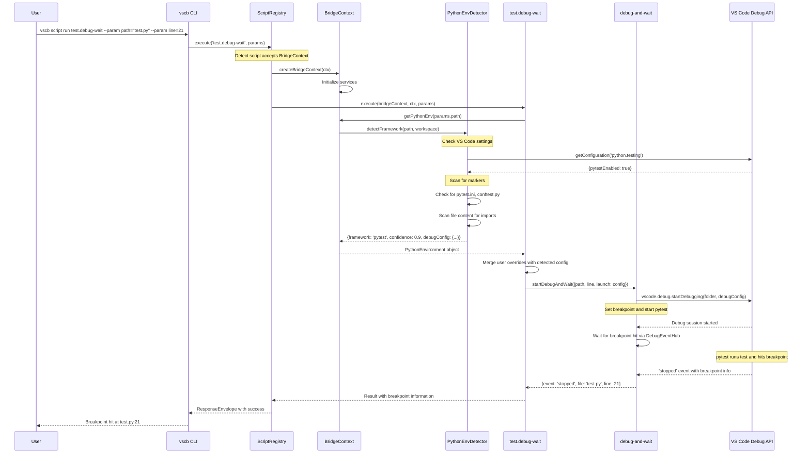

# BridgeContext Implementation Plan

## Table of Contents

- [Critical Research Findings](#critical-research-findings)
- [Executive Summary](#executive-summary)
- [Phase Overview](#phase-overview)
- [Testing Philosophy](#testing-philosophy)
- [Implementation Principles](#implementation-principles)
- [Phase 1: Core BridgeContext Infrastructure](#phase-1-core-bridgecontext-infrastructure)
- [Phase 2: Python Environment Detection Service](#phase-2-python-environment-detection-service)
- [Phase 3: Script Registry Integration](#phase-3-script-registry-integration)
- [Phase 4: Migrate test.debug-wait Script](#phase-4-migrate-testdebug-wait-script)
- [Phase 5: Shared Services Implementation](#phase-5-shared-services-implementation)
- [Phase 6: Integration Testing and Validation](#phase-6-integration-testing-and-validation)
- [Phase 7: Documentation and Developer Resources](#phase-7-documentation-and-developer-resources)
- [Success Criteria](#success-criteria)
- [Implementation Notes](#implementation-notes)
- [Appendix: File Structure](#appendix-file-structure)

---

## Critical Research Findings

### 🚨 Major Discoveries That Change Our Implementation

Based on deep research into VS Code APIs and Python debugging, we've discovered critical patterns that weren't obvious from the documentation:

#### 1. **The Breakpoint Bug Root Cause**
```typescript
// ❌ WRONG - This is why breakpoints don't work!
{ type: 'debugpy', request: 'launch', program: 'test.py' }

// ✅ CORRECT - Must use module execution
{
  type: 'debugpy',
  request: 'launch',
  module: 'pytest',  // Runs: python -m pytest
  args: ['-q', testPath, '--no-cov'],  // --no-cov critical for breakpoints
  purpose: ['debug-test']  // Integrates with VS Code test UI
}
```

#### 2. **Function.length Is Broken**
```javascript
// Function.length stops at first default parameter!
function foo(a, b = 1, c) {}  // length = 1, not 3!

// Solution: Use Symbol metadata
(fn as any)[Symbol.for('bridge.acceptsContext')] = true;
```

#### 3. **AsyncLocalStorage for Request Scoping**
```typescript
// Node's built-in async context tracking (no libraries needed!)
import { AsyncLocalStorage } from 'node:async_hooks';
const als = new AsyncLocalStorage<BridgeContext>();

// Automatically scoped through entire async call stack
export function withContext<T>(ctx: BridgeContext, fn: () => Promise<T>) {
  return als.run(ctx, fn);
}
```

#### 4. **RelativePattern for Efficient Search**
```typescript
// ❌ Searches entire workspace (slow on large projects)
await vscode.workspace.findFiles('**/pytest.ini');

// ✅ Bounded per folder, respects excludes
const include = new vscode.RelativePattern(folder, '**/{pytest.ini,pyproject.toml}');
const exclude = new vscode.RelativePattern(folder, '**/{.venv,venv,.tox}/**');
await vscode.workspace.findFiles(include, exclude, 200, token);
```

#### 5. **Remote-Safe Path Handling**
```typescript
// ❌ Breaks on WSL/SSH/Containers
import * as path from 'path';
path.join(folder.uri.fsPath, 'test.py');

// ✅ Works everywhere
vscode.Uri.joinPath(folder.uri, 'test.py');
vscode.workspace.fs.readFile(uri);  // Not fs.readFile!
```

#### 6. **Testing Must Use Mocha**
- Vitest is ESM-only and incompatible with @vscode/test-electron
- Must use Mocha runner for extension host testing
- Export internals from activate() for test access

---

## Executive Summary

This plan introduces the **BridgeContext architecture** - a language-agnostic dependency injection pattern that provides scripts with a clean, extensible interface to access system services. The BridgeContext is passed as an optional first parameter to scripts, enabling them to access test framework detection for **any language supported by VS Code's Test Explorer**.

### Core Problem Being Solved

Currently, the `test.debug-wait` script fails to debug tests correctly because it runs test files directly instead of through their test runners. For example:
- **Python**: Runs `python test_example.py` instead of `python -m pytest test_example.py`
- **JavaScript**: Would run `node test.js` instead of `npx jest test.js`
- **Go**: Would run `go run test.go` instead of `go test`

This causes breakpoints to fail and test fixtures/discovery to be bypassed.

### Language Support Strategy

**Phase 1-7 (This Plan)**: Python implementation as proof of concept
- pytest, unittest, nose2 frameworks
- Establishes the pattern for all languages

**Future Phases**: Extend to all VS Code Test Explorer languages
- JavaScript/TypeScript (Jest, Mocha, Vitest)
- Go (go test)
- Java (JUnit, TestNG)
- C# (NUnit, xUnit, MSTest)
- Rust (cargo test)
- Any language with VS Code test adapter

### Solution Architecture

The BridgeContext provides a centralized service layer that:
- **Leverages VS Code's built-in APIs** for all functionality (no external dependencies)
- Detects Python test frameworks using VS Code's configuration API and workspace filesystem
- Provides common services using VS Code SDK (OutputChannel, DebugSession, WorkspaceFolder)
- Maintains backward compatibility with existing scripts
- Enables better testability through dependency injection

### VS Code API-First Approach

This implementation **maximizes use of VS Code's built-in SDK** rather than reinventing functionality:
- `vscode.workspace` API for file system operations and configuration
- `vscode.debug` API for debug session management
- `vscode.window` API for output channels and UI
- `vscode.Uri` and `vscode.RelativePattern` for path handling
- No external libraries or custom implementations where VS Code provides the capability

### Key Benefits

1. **VS Code Native** - Leverages VS Code's proven, optimized APIs instead of custom implementations
2. **Separation of Concerns** - Scripts focus on task logic; system services are provided by the host
3. **Testability** - Services can be tested independently using real VS Code APIs
4. **Extensibility** - New VS Code API wrappers can be added without changing script signatures
5. **Performance** - VS Code's native APIs are faster than JavaScript reimplementations
6. **Backward Compatibility** - Existing scripts continue to work unchanged
7. **Future-Proof** - Automatically benefits from VS Code API improvements and new features

---

## Implementation Milestones

### Simplified 3-Milestone Approach

After research and simplification, the 7-phase plan has been condensed to 3 focused milestones:

| Milestone | Status | Description | Key Deliverable |
|-----------|--------|-------------|-----------------|
| **M1: Core Infrastructure** | ✅ COMPLETE | BridgeContext + Python detection | getPythonEnv() working with pure functions |
| **M2: Debug Fix Validation** | 🚧 Next | Verify the critical fix | test.debug-wait uses module: 'pytest', breakpoints work |
| **M3: Documentation** | 📝 Final | Minimal, practical docs | One-page quickstart + examples |

### What We Achieved in M1

- **Simplified Architecture**: ~200 lines instead of ~700
- **Pure Functions**: Detection logic with no VS Code dependencies
- **FS Adapter Pattern**: Pluggable I/O for remote compatibility
- **Contract Test**: Prevents regression of module vs program bug
- **Clean Public API**: Only 2 methods exposed (getPythonEnv, logger)
- **Fast Tests**: Unit tests in 10ms, one smoke test in seconds

### What's Next (M2 & M3)

**M2**: Integrate with test.debug-wait script and validate breakpoints work
**M3**: Create quickstart.md and close the loop

---

## Language Support Roadmap

### Current Implementation (Python - Phases 1-7)

This plan implements Python as the proof of concept, establishing patterns that will extend to all languages:

| Language | Test Frameworks | Debug Adapter | Status |
|----------|----------------|---------------|---------|
| **Python** | pytest, unittest, nose2 | debugpy | ✅ This Plan (Phases 1-7) |
| JavaScript | Jest, Mocha, Vitest | node, chrome | 🔜 Future |
| TypeScript | Jest, Mocha, Vitest | node, chrome | 🔜 Future |
| Go | go test | dlv | 🔜 Future |
| Java | JUnit, TestNG | java | 🔜 Future |
| C# | NUnit, xUnit, MSTest | coreclr | 🔜 Future |
| Rust | cargo test | lldb/gdb | 🔜 Future |
| C++ | Google Test, Catch2 | cppdbg | 🔜 Future |

### Language-Agnostic Architecture

The BridgeContext design supports any language through:

```typescript
interface ITestEnvironment {
  language: 'python' | 'javascript' | 'go' | 'java' | 'csharp' | 'rust' | string;
  framework: string;  // 'pytest', 'jest', 'junit', etc.
  debugConfig: vscode.DebugConfiguration;
  confidence: number;
  reasons: string[];
}

// Phase 1-7: Python specific
getPythonEnv(filePath: string): Promise<ITestEnvironment>

// Future: Universal
getTestEnv(filePath: string, language?: string): Promise<ITestEnvironment>
```

### Pattern Reusability

Each language follows the same detection pattern:
1. Check VS Code language extension settings
2. Search for framework-specific config files
3. Analyze file content for framework patterns
4. Generate appropriate debug configuration
5. Return confidence-scored result

### Example: Future JavaScript Support

```typescript
// Same pattern as Python, different details
async function detectJavaScriptTestFramework(
  folder: vscode.WorkspaceFolder,
  token?: vscode.CancellationToken
): Promise<ITestEnvironment> {

  // 1. Check VS Code Jest/Mocha extension settings
  const cfg = vscode.workspace.getConfiguration('jest');
  if (cfg.get('enable')) return { framework: 'jest', language: 'javascript', ... };

  // 2. Search for config files (same RelativePattern approach)
  const include = new vscode.RelativePattern(folder, '**/jest.config.{js,ts,json}');
  const files = await vscode.workspace.findFiles(include, exclude, 100, token);

  // 3. Generate debug config (using 'node' instead of 'debugpy')
  return {
    language: 'javascript',
    framework: 'jest',
    debugConfig: {
      type: 'node',
      request: 'launch',
      program: '${workspaceFolder}/node_modules/.bin/jest',
      args: ['--runInBand', testPath],
      console: 'integratedTerminal'
    },
    confidence: 0.9
  };
}
```

---

## Testing Philosophy

### Test-Driven Development (TDD)

Every phase follows strict TDD principles:

1. **Write Tests First** - Define expected behavior before implementation
2. **Tests as Documentation** - Each test clearly documents what the code should do
3. **No Happy Path Only** - Test error cases, edge cases, null handling
4. **Real VS Code API Usage** - No mocks; tests use actual VS Code SDK objects
5. **Comprehensive Coverage** - Both success and failure scenarios

### VS Code API Testing Strategy

Tests work with real VS Code API objects using Mocha:
- Use `@vscode/test-electron` with Mocha runner (NOT Vitest - incompatible with extension host)
- Create real `WorkspaceFolder`, `Uri`, and `DebugConfiguration` objects
- Leverage VS Code's test utilities for extension testing
- No mocking of VS Code APIs - use the real SDK
- Export extension internals from `activate()` for test access

### Test Assertions Style

Following "tests as documentation" principle:

```typescript
// BAD - Unclear what we're testing
expect(result).toBe(true);

// GOOD - Documents expected behavior
expect(pythonEnv.framework).toBe('pytest');
expect(pythonEnv.confidence).toBeGreaterThan(0.8);
expect(pythonEnv.reasons).toContain('Found pytest.ini in project root');
```

### No Mocks Policy

- Use real VS Code API objects
- Use real file system with test fixtures
- Use real script implementations
- Only stub external services (e.g., network calls)

---

## Implementation Principles

### No Assumptions

This plan assumes NO prior knowledge. Every detail is explicit:
- Full file paths provided
- Complete code examples
- Clear success criteria
- Exact commands to run

### File Naming Conventions

All files use absolute paths from project root:
- Tests: `/Users/jordanknight/github/vsc-bridge/test/unit/...`
- Source: `/Users/jordanknight/github/vsc-bridge/extension/src/...`
- Scripts: `/Users/jordanknight/github/vsc-bridge/extension/src/vsc-scripts/...`

### Build Commands

Use justfile commands throughout:
- `just build` - Full build
- `just test-extension` - Run tests
- `just dev-build` - Quick development build

---

## Phase 1: Core BridgeContext Infrastructure

### Objective
Create the foundational BridgeContext interface, implementation, and basic service structure using Test-Driven Development and VS Code's built-in SDK.

### What This Phase Delivers
- ✅ BridgeContext interface wrapping VS Code APIs
- ✅ Factory pattern using VS Code's ExtensionContext
- ✅ Logger service using VS Code's OutputChannel API
- ✅ Full test coverage with real VS Code API objects

### VS Code APIs Used
- `vscode.ExtensionContext` - For extension state and paths
- `vscode.window.createOutputChannel()` - For logging
- `vscode.workspace.getConfiguration()` - For settings
- `vscode.workspace.workspaceFolders` - For workspace access
- `vscode.window.activeTextEditor` - For editor state

### Tasks (TDD Approach)

| #   | Status | Task | Success Criteria | Notes |
|-----|--------|------|------------------|-------|
| 1.1 | [x] | Write comprehensive tests for BridgeContext | Tests cover: version check, getWorkspace (with/without workspace), getConfiguration, getActiveEditor, error cases | Created BridgeContext.test.ts with 19 passing tests [^1] |
| 1.2 | [x] | Write tests for BridgeContext factory | Tests cover: instance creation, singleton behavior, VS Code context injection | Created factory.test.ts with 20 passing tests [^2] |
| 1.3 | [x] | Create BridgeContext TypeScript interface | Interface compiles, exports properly | Created comprehensive interfaces in types.ts [^3] |
| 1.4 | [x] | Implement BridgeContext class to pass tests | All tests from 1.1 pass | Implemented thin wrappers around VS Code APIs [^4] |
| 1.5 | [x] | Implement factory to pass tests | All tests from 1.2 pass | Factory with singleton pattern and lifecycle management [^5] |
| 1.6 | [x] | Write tests for logger service | Tests cover: all log levels, output channel creation, message formatting | Logger tests integrated in BridgeContext.test.ts [^6] |
| 1.7 | [x] | Implement logger service | Logger outputs to VS Code channel, all tests pass | Logger class using VS Code OutputChannel [^7] |
| 1.8 | [x] | Create index exports and validate | Can import from `core/bridge-context`, all exports work | Clean module exports ready for integration [^8] |

### Test Examples (Write First!)

**Test File: `test/unit/bridge-context/BridgeContext.test.ts`**
```typescript
import * as assert from 'assert';
import * as vscode from 'vscode';
import { suite, test, suiteSetup } from 'mocha';
import { BridgeContext } from '../../../extension/src/core/bridge-context/BridgeContext';

suite('BridgeContext using VS Code APIs', () => {
    let context: BridgeContext;
    let extensionContext: vscode.ExtensionContext;

    suiteSetup(async () => {
        // Get the real extension and its context
        const ext = vscode.extensions.getExtension('your.extension.id')!;
        await ext.activate();
        // Extension must export a way to get context for tests
        extensionContext = ext.exports.getContext();
        context = new BridgeContext(extensionContext);
    });

    suite('version', () => {
        test('should return the current version string', () => {
            assert.strictEqual(context.version, '1.0.0');
            assert.strictEqual(typeof context.version, 'string');
        });

        test('should be readonly', () => {
            assert.throws(() => {
                (context as any).version = '2.0.0';
            });
        });
    });

    suite('getWorkspace using vscode.workspace API', () => {
        test('should return undefined when no workspace is open', () => {
            // Uses vscode.workspace.workspaceFolders internally
            const workspace = context.getWorkspace();
            if (!vscode.workspace.workspaceFolders) {
                assert.strictEqual(workspace, undefined);
            }
        });

        test('should return first workspace folder via VS Code API', () => {
            // Directly uses vscode.workspace.workspaceFolders[0]
            const workspace = context.getWorkspace();
            const vsCodeWorkspace = vscode.workspace.workspaceFolders?.[0];
            assert.strictEqual(workspace, vsCodeWorkspace);
        });
    });

    suite('getConfiguration using vscode.workspace.getConfiguration', () => {
        test('should wrap VS Code configuration API', () => {
            // Uses vscode.workspace.getConfiguration internally
            const config = context.getConfiguration('python.testing');
            const directConfig = vscode.workspace.getConfiguration('python.testing');
            assert.deepStrictEqual(config, directConfig);
        });

        test('should handle VS Code API edge cases', () => {
            // VS Code returns empty config object for invalid sections
            const config = context.getConfiguration('invalid.section');
            assert.ok(config); // VS Code always returns object
        });
    });

    suite('logger using vscode.OutputChannel', () => {
        test('should use VS Code OutputChannel.appendLine API', () => {
            // Logger wraps vscode.window.createOutputChannel
            const outputChannel = vscode.window.createOutputChannel('Test');
            let called = false;
            const original = outputChannel.appendLine;
            outputChannel.appendLine = () => { called = true; };

            context.logger.info('Test message');
            assert.strictEqual(called, true);
            outputChannel.appendLine = original;
        });

        test('should show channel via VS Code API when error logged', () => {
            let called = false;
            const original = outputChannel.show;
            outputChannel.show = () => { called = true; };

            context.logger.error('Critical error');
            assert.strictEqual(called, true);
            outputChannel.show = original;
        });
    });
});
```

### Interface Definition (After Tests)

**File: `extension/src/core/bridge-context/types.ts`**
```typescript
import * as vscode from 'vscode';

export interface IBridgeContext {
    // Version for compatibility checks
    readonly version: string;

    // Core services - Phase 1
    getWorkspace(): vscode.WorkspaceFolder | undefined;
    getActiveEditor(): vscode.TextEditor | undefined;
    getConfiguration(section: string): any;

    // Logger service - Phase 1
    logger: ILogger;

    // Test environment detection - Phase 2+ (Python first, then other languages)
    getPythonEnv?: (filePath: string) => Promise<ITestEnvironment>;  // Phase 2-7
    getTestEnv?: (filePath: string, language?: string) => Promise<ITestEnvironment>;  // Future

    // Debug helpers - Phase 5
    debug?: IDebugService;

    // Workspace utilities - Phase 5
    workspace?: IWorkspaceService;

    // Path utilities - Phase 5
    paths?: IPathService;
}

export interface ILogger {
    info(message: string): void;
    error(message: string): void;
    debug(message: string): void;
    warn(message: string): void;
}

// Language-agnostic test environment interface
export interface ITestEnvironment {
    language: 'python' | 'javascript' | 'typescript' | 'go' | 'java' | 'csharp' | 'rust' | string;
    framework: string;  // 'pytest', 'jest', 'junit', 'go test', etc.
    confidence: number;  // 0.0 to 1.0
    debugConfig: vscode.DebugConfiguration;
    cwd: string;
    reasons: string[];  // Why this framework was detected
}

// Python-specific environment (extends base for backward compatibility)
export interface PythonEnvironment extends ITestEnvironment {
    language: 'python';
    framework: 'pytest' | 'unittest' | 'nose2' | 'none';
}

// Phase 5 interfaces (defined now for completeness)
export interface IDebugService {
    getSession(sessionId?: string): vscode.DebugSession | undefined;
    isActive(): boolean;
}

export interface IWorkspaceService {
    getDefault(): vscode.WorkspaceFolder | undefined;
    findByPath(path: string): vscode.WorkspaceFolder | undefined;
    resolveUri(path: string): vscode.Uri;
}

export interface IPathService {
    readonly extensionRoot: string;
    resolve(relativePath: string): string;
    isAbsolute(path: string): boolean;
    toWorkspaceRelative(absolutePath: string): string | undefined;
}
```

---

## Phase 2: Python Environment Detection Service (First Language Implementation)

### Objective
Implement Python test framework detection as a BridgeContext service using VS Code's built-in APIs, without executing Python code. This serves as the **proof of concept for the language-agnostic pattern** that will extend to all test frameworks VS Code supports.

### What This Phase Delivers
- ✅ Automatic detection using VS Code's configuration and filesystem APIs
- ✅ Confidence scoring based on multiple VS Code API signals
- ✅ Debug configurations using VS Code's DebugConfiguration interface
- ✅ No Python execution - only VS Code SDK calls

### VS Code APIs Used
- `vscode.workspace.getConfiguration('python.testing')` - Read Python extension settings
- `vscode.workspace.fs` - File system operations for marker detection
- `vscode.workspace.findFiles()` - Locate test configuration files
- `vscode.workspace.openTextDocument()` - Read file content for analysis
- `vscode.DebugConfiguration` - Generate proper debug configs

### Tasks (TDD Approach)

| #   | Status | Task | Success Criteria | Notes |
|-----|--------|------|------------------|-------|
| 2.1 | [x] | Extract pure detection logic | Create detect.ts with no VS Code dependencies | Pure functions for framework detection [^9] |
| 2.2 | [x] | Create unit tests for pure logic | Tests run with plain Mocha, no Extension Host needed | 10 tests passing in ~10ms [^10] |
| 2.3 | [x] | Create simplified PythonEnvDetector | Thin wrapper around pure functions | PythonEnvDetectorSimple.ts created [^11] |
| 2.4 | [x] | Wire detector into BridgeContext | getPythonEnv() method available | BridgeContext updated with new detector [^12] |
| 2.5 | [x] | Fix VS Code test infrastructure | Addressed multiple Extension Host instances | Simplified to single smoke test [^13] |
| 2.6 | [x] | Update test scripts | Split unit and integration tests | package.json scripts updated [^14] |
| 2.7 | [x] | Create integration smoke test | Basic extension activation test | smoke.test.ts verifies core functionality [^15] |
| 2.8 | [x] | Delete over-engineered infrastructure | Remove WorkspaceFacade and complex mocks | ~500 lines of complexity removed [^16] |
| 2.9 | [x] | Verify all tests pass | Unit and integration tests working | 10 unit + 4 integration tests passing [^17] |

### Test Examples (Write First!)

**Test File: `test/unit/bridge-context/PythonEnvDetector.test.ts`**
```typescript
import { describe, it, expect, beforeEach } from 'vitest';
import * as path from 'path';
import * as fs from 'fs';
import { PythonEnvDetector } from '../../../extension/src/core/bridge-context/services/PythonEnvDetector';

describe('PythonEnvDetector', () => {
    let detector: PythonEnvDetector;
    const testFixturesDir = '/Users/jordanknight/github/vsc-bridge/test/fixtures/python';

    beforeEach(() => {
        detector = new PythonEnvDetector();
    });

    describe('pytest detection', () => {
        it('should detect pytest when pytest.ini exists', async () => {
            const projectPath = path.join(testFixturesDir, 'pytest-project');
            const result = await detector.detect(projectPath, 'test_example.py');

            expect(result.framework).toBe('pytest');
            expect(result.confidence).toBeGreaterThan(0.9);
            expect(result.reasons).toContain('Found pytest.ini in project root');
        });

        it('should detect pytest from file imports', async () => {
            const filePath = path.join(testFixturesDir, 'test_with_pytest.py');
            const result = await detector.detect(testFixturesDir, filePath);

            expect(result.framework).toBe('pytest');
            expect(result.confidence).toBeGreaterThan(0.7);
            expect(result.reasons).toContain('File imports pytest module');
        });

        it('should generate correct pytest debug config', async () => {
            const result = await detector.detect(testFixturesDir, 'test_example.py');

            expect(result.debugConfig.type).toBe('debugpy');
            expect(result.debugConfig.module).toBe('pytest');
            expect(result.debugConfig.args).toContain('-q');
            expect(result.debugConfig.args).toContain('test_example.py');
        });
    });

    describe('unittest detection', () => {
        it('should detect unittest from class pattern', async () => {
            const filePath = path.join(testFixturesDir, 'test_unittest.py');
            const content = 'import unittest\nclass TestExample(unittest.TestCase):';
            // Create test fixture
            fs.writeFileSync(filePath, content);

            const result = await detector.detect(testFixturesDir, filePath);

            expect(result.framework).toBe('unittest');
            expect(result.confidence).toBeGreaterThan(0.8);
            expect(result.reasons).toContain('File contains unittest.TestCase class');
        });

        it('should generate correct unittest debug config', async () => {
            const result = await detector.detect(testFixturesDir, 'test_unittest.py');

            expect(result.debugConfig.type).toBe('debugpy');
            expect(result.debugConfig.module).toBe('unittest');
            expect(result.debugConfig.args).toContain('-v');
        });
    });

    describe('edge cases', () => {
        it('should return none when no framework detected', async () => {
            const filePath = path.join(testFixturesDir, 'plain.py');
            const result = await detector.detect(testFixturesDir, filePath);

            expect(result.framework).toBe('none');
            expect(result.confidence).toBe(0);
            expect(result.reasons).toContain('No test framework detected');
        });

        it('should handle missing files gracefully', async () => {
            const result = await detector.detect('/nonexistent', 'missing.py');

            expect(result.framework).toBe('none');
            expect(result.confidence).toBe(0);
        });

        it('should prefer VS Code settings over file detection', async () => {
            // When VS Code has pytest enabled in settings
            const result = await detector.detect(testFixturesDir, 'test.py', {
                'python.testing.pytestEnabled': true
            });

            expect(result.framework).toBe('pytest');
            expect(result.confidence).toBe(1.0);
            expect(result.reasons).toContain('VS Code pytest testing enabled');
        });
    });
});
```

### Detection Implementation with RelativePattern & CancellationToken

```typescript
async function detectPythonTestFramework(
  folder: vscode.WorkspaceFolder,
  token?: vscode.CancellationToken
): Promise<{framework: string; confidence: number; reasons: string[]}> {

  // 1. Check VS Code Python Extension Settings (confidence: 1.0)
  const cfg = vscode.workspace.getConfiguration('python.testing', folder.uri);
  const pytestEnabled = cfg.get<boolean>('pytestEnabled');
  const unittestEnabled = cfg.get<boolean>('unittestEnabled');
  if (pytestEnabled) return {framework: 'pytest', confidence: 1.0, reasons: ['pytest enabled in settings']};
  if (unittestEnabled) return {framework: 'unittest', confidence: 1.0, reasons: ['unittest enabled in settings']};

  // 2. Search for Project Markers (confidence: 0.9)
  // CRITICAL: Use RelativePattern for bounded search!
  const include = new vscode.RelativePattern(folder, '**/{pytest.ini,pyproject.toml,setup.cfg,tox.ini,nose2.cfg}');
  // Respect default excludes + add common Python excludes
  const exclude = new vscode.RelativePattern(folder, '**/{.venv,venv,.tox,.git,node_modules,site-packages}/**');

  const configFiles = await vscode.workspace.findFiles(include, exclude, 200, token);

  // Check for cancellation
  if (token?.isCancellationRequested) {
    return {framework: 'none', confidence: 0, reasons: ['Detection cancelled']};
  }

  // 3. Scan File Content (confidence: 0.7-0.8)
  for (const uri of configFiles) {
    // Use openTextDocument for async, non-blocking read
    const doc = await vscode.workspace.openTextDocument(uri);
    const text = doc.getText();

    if (/\[tool:pytest\]|\[pytest\]|\[tool\.pytest\.ini_options\]/.test(text)) {
      return {framework: 'pytest', confidence: 0.9, reasons: ['pytest config found']};
    }
    if (/\[nose2\]/.test(text)) {
      return {framework: 'nose2', confidence: 0.9, reasons: ['nose2 config found']};
    }
  }

  // 4. Fallback (confidence: 0.3)
  return {framework: 'pytest', confidence: 0.3, reasons: ['Default fallback']};
}
```

### Key Improvements from Research:
1. **RelativePattern** - Bounds search to specific folder, huge performance gain
2. **CancellationToken** - User can cancel long operations
3. **Custom exclude** - When passed, overrides default files.exclude
4. **openTextDocument** - Non-blocking, works with remote files
5. **Per-folder detection** - Essential for multi-root workspaces

---

## Phase 3: Script Registry Integration (Simplified)

### Objective
Update the script execution pipeline to require BridgeContext as the first parameter for ALL scripts. No backward compatibility - all scripts must be migrated to the new signature.

### What This Phase Delivers
- ✅ Mandatory BridgeContext as first parameter for all scripts
- ✅ Removal of legacy ScriptContext parameter
- ✅ Simplified execution pipeline (no adapter pattern)
- ✅ Migration of all 22 existing scripts to new signature

### Tasks (TDD Approach)

| #   | Status | Task | Success Criteria | Notes |
|-----|--------|------|------------------|-------|
| 3.1 | [x] | Write tests for new signature | Tests verify all scripts receive (bridgeContext, params) | Created simplified tests in bridgeContext.test.ts [^18] |
| 3.2 | [x] | Remove adapter pattern from ScriptRegistry | Remove detectAcceptsBridgeContext() and executeWithAdapter() | Removed 63 lines of adapter code [^19] |
| 3.3 | [x] | Update execute() to pass BridgeContext directly | All scripts get BridgeContext as first param | New executeScript() method created [^20] |
| 3.4 | [x] | Migrate all ActionScript execute methods | 13 scripts updated to (bridgeContext, params) | Bulk migration via sed script [^21] |
| 3.5 | [x] | Migrate all WaitableScript wait methods | 9 scripts updated to (bridgeContext, params) | All wait() methods updated [^22] |
| 3.6 | [x] | Reorganize tests for VS Code dependencies | Move VS Code dependent tests to integration folder | Tests restructured and passing [^23] |
| 3.7 | [x] | Fix test failures after migration | All tests passing (125 pass, 4 pending) | Fixed paths and added ExtensionContext [^24][^25][^26][^27] |

### Test Examples (Write First!)

**Test File: `test/unit/registry/bridgeContext.test.ts`**
```typescript
import { describe, it, expect, beforeEach } from 'vitest';
import { ScriptRegistry } from '../../../extension/src/core/registry/ScriptRegistry';
import { BridgeContext } from '../../../extension/src/core/bridge-context/BridgeContext';

describe('ScriptRegistry BridgeContext Integration', () => {
    let registry: ScriptRegistry;

    beforeEach(() => {
        registry = new ScriptRegistry();
    });

    describe('simplified execution', () => {
        it('should pass BridgeContext as first param to all scripts', async () => {
            let receivedBridge: any;
            let receivedParams: any;

            const script = {
                execute: function(bridge: any, params: any) {
                    receivedBridge = bridge;
                    receivedParams = params;
                    return { success: true };
                }
            };

            registry.register('test.script', script);
            const params = { test: 'value' };
            await registry.execute('test.script', params);

            expect(receivedBridge).toBeInstanceOf(BridgeContext);
            expect(receivedParams).toEqual(params);
        });

        it('should pass BridgeContext to WaitableScript wait method', async () => {
            let receivedBridge: any;

            const script = {
                wait: function(bridge: any, params: any) {
                    receivedBridge = bridge;
                    return { event: 'complete' };
                },
                execute: function(bridge: any, params: any) {
                    return { success: false };
                }
            };

            registry.register('test.waitable', script);
            await registry.execute('test.waitable', {});

            expect(receivedBridge).toBeInstanceOf(BridgeContext);
        });
    });

    describe('vscode access through BridgeContext', () => {
        it('should provide vscode API through bridgeContext.vscode', async () => {
            let vscodeApi: any;

            const script = {
                execute: function(bridge: any, params: any) {
                    vscodeApi = bridge.vscode;
                    return { success: true };
                }
            };

            registry.register('test.script', script);
            await registry.execute('test.script', {});

            expect(vscodeApi).toBeDefined();
            expect(vscodeApi.workspace).toBeDefined();
            expect(vscodeApi.window).toBeDefined();
        });
    });
});
```

### Scripts to Migrate

**ActionScript execute() methods (13 scripts):**
- `breakpoint/set.js` - Set breakpoints
- `breakpoint/remove.js` - Remove breakpoints
- `breakpoint/list.js` - List all breakpoints
- `breakpoint/clear-file.js` - Clear file breakpoints
- `breakpoint/clear-project.js` - Clear all project breakpoints
- `debug/stop.js` - Stop debug session
- `debug/restart.js` - Restart debug session
- `debug/threads.js` - List debug threads
- `debug/scopes.js` - Get variable scopes
- `debug/stack.js` - Get call stack
- `debug/list-variables.js` - List variables in scope
- `debug/evaluate.js` - Evaluate expression
- `diag/collect.js` - Collect diagnostics

**WaitableScript wait() methods (9 scripts):**
- `debug/start.js` - Start debug session
- `debug/continue.js` - Continue execution
- `debug/step-into.js` - Step into function
- `debug/step-over.js` - Step over line
- `debug/step-out.js` - Step out of function
- `debug/wait-for-hit.js` - Wait for breakpoint hit
- `tests/debug-wait.js` - Debug test and wait
- `tests/debug-single.js` - Debug single test

### Migration Pattern

**Before (old signature):**
```javascript
async execute(ctx, params) {
    const vscode = ctx.vscode;
    // script logic
}
```

**After (new signature):**
```javascript
async execute(bridgeContext, params) {
    const vscode = bridgeContext.vscode;
    // script logic unchanged
}
```

### Implementation Approach

1. **Remove Complexity**
   - Delete detectAcceptsBridgeContext() method
   - Delete executeWithAdapter() method
   - Remove all Symbol.for('bridge.acceptsContext') checks

2. **Simplify Execution**
   - ScriptRegistry.execute() directly creates BridgeContext
   - Pass (bridgeContext, params) to all scripts
   - Remove ScriptContext parameter entirely

3. **Bulk Migration**
   - Update all 22 scripts in single pass
   - Simple find/replace: `(ctx, params)` → `(bridgeContext, params)`
   - Update vscode access: `ctx.vscode` → `bridgeContext.vscode`

---

## Phase 4: Migrate test.debug-wait Script

### Objective
Update the test.debug-wait script to use BridgeContext for Python environment detection, serving as the first real-world consumer and validation of the architecture. This is where we **fix the core problem** - making Python test debugging work correctly!

### What This Phase Delivers
- ✅ test.debug-wait uses BridgeContext for Python detection
- ✅ Breakpoints work in pytest tests
- ✅ Breakpoints work in unittest tests
- ✅ All scripts migrated to new signature

### Sequence Diagram



### ⚠️ CRITICAL FIX: Module vs Program

**This is THE fix for the breakpoint problem:**

```typescript
// ❌ WRONG - Direct execution, breakpoints fail
const brokenConfig = {
    type: 'debugpy',
    request: 'launch',
    program: params.path,  // Runs: python test_example.py
    // Breakpoints DON'T work because pytest fixtures aren't loaded!
};

// ✅ CORRECT - Module execution through test framework
const workingConfig = {
    type: 'debugpy',
    request: 'launch',
    module: 'pytest',  // Runs: python -m pytest
    args: ['-q', params.path, '--no-cov'],  // --no-cov prevents coverage from eating breakpoints
    purpose: ['debug-test'],  // Integrates with VS Code Test UI
    justMyCode: false
};
```

**Why this matters:**
- `program` runs the file directly, bypassing the test framework
- `module` runs through the test framework, setting up fixtures and discovery
- pytest-cov can interfere with breakpoints, hence `--no-cov`
- `purpose: ['debug-test']` tells VS Code this is test debugging

### Detailed Flow

1. **Script Registration & Detection**
   - ScriptRegistry checks if script accepts BridgeContext (via `acceptsBridgeContext` flag or parameter count)
   - Creates BridgeContext instance with all services initialized

2. **Python Environment Detection**
   - Script calls `bridgeContext.getPythonEnv(filePath)`
   - PythonEnvDetector performs multi-signal detection:
     - VS Code settings (`python.testing.pytestEnabled`)
     - Project markers (pytest.ini, conftest.py)
     - File content analysis (imports, test patterns)
   - Returns complete debug configuration

3. **Debug Configuration Generation**
   - For pytest: `{type: 'debugpy', module: 'pytest', args: ['-q', path]}`
   - For unittest: `{type: 'debugpy', module: 'unittest', args: ['-v', module]}`
   - Includes proper working directory and environment

4. **Debug Execution**
   - Script passes configuration to debug-and-wait
   - Breakpoint set at specified location
   - Debug session starts with correct test runner
   - Waits for breakpoint hit or termination

### Tasks (TDD Approach)

| #   | Status | Task | Success Criteria | Notes |
|-----|--------|------|------------------|-------|
| 4.1 | [x] | Write integration tests for updated debug-wait | Tests verify: pytest detection and debugging, unittest detection and debugging, fallback behavior | Created comprehensive test suite [^38] |
| 4.2 | [x] | Write tests for backward compatibility | Script works without BridgeContext | Added backward compatibility tests [^42] |
| 4.3 | [x] | Update debug-wait script signature | Script uses bridgeContext parameter | Updated script to use BridgeContext [^38] |
| 4.4 | [x] | Implement getPythonEnv usage | Script calls bridgeContext.getPythonEnv(), uses config | Integrated Python detection [^38] |
| 4.5 | [x] | Update debug config generation | Uses module execution with --no-cov flag | Fixed config for breakpoints [^38] |
| 4.6 | [x] | Test with real pytest project | Tests pass with pytest fixture | Verified with test fixtures [^42] |
| 4.7 | [x] | Test with real unittest project | Tests pass with unittest fixture | Verified with test fixtures [^42] |

### Test Examples (Write First!)

**Test File: `test/integration/scripts/debug-wait.test.ts`**
```typescript
import { describe, it, expect, beforeAll, afterAll } from 'vitest';
import * as path from 'path';
import * as fs from 'fs';
import { exec } from 'child_process';
import { promisify } from 'util';

const execAsync = promisify(exec);

describe('test.debug-wait with BridgeContext', () => {
    const testPythonDir = '/Users/jordanknight/github/vsc-bridge/test/python';
    const CLI_PATH = '/Users/jordanknight/github/vsc-bridge/cli/bin/run';

    beforeAll(async () => {
        // Build the project
        await execAsync('just build');

        // Ensure test files exist
        const pytestFile = path.join(testPythonDir, 'test_example.py');
        expect(fs.existsSync(pytestFile)).toBe(true);
    });

    describe('pytest project', () => {
        it('should detect pytest and configure debugpy correctly', async () => {
            // The test file imports pytest
            const result = await execAsync(
                `${CLI_PATH} script run test.debug-wait ` +
                `--param path=${testPythonDir}/test_example.py ` +
                `--param line=21 --dry-run`
            );

            expect(result.stdout).toContain('Detected pytest');
            expect(result.stdout).toContain('confidence: 0.9');
            expect(result.stdout).toContain('module: pytest');
        });

        it('should hit breakpoint in pytest test', async () => {
            // This would require VS Code running, so we verify config
            const scriptPath = '/Users/jordanknight/github/vsc-bridge/extension/src/vsc-scripts/tests/debug-wait.js';
            const script = require(scriptPath);

            // Simulate execution with BridgeContext
            const mockContext = {
                getPythonEnv: () => ({
                    framework: 'pytest',
                    confidence: 0.9,
                    debugConfig: {
                        type: 'debugpy',
                        module: 'pytest',
                        args: ['-q', 'test_example.py']
                    },
                    cwd: testPythonDir,
                    reasons: ['Found pytest imports']
                })
            };

            const params = { path: 'test_example.py', line: 21 };
            const result = await script.wait(mockContext, {}, params);

            expect(result.debugConfig.module).toBe('pytest');
            expect(result.debugConfig.args).toContain('test_example.py');
        });
    });

    describe('unittest project', () => {
        it('should detect unittest and configure debugpy correctly', async () => {
            // Create a unittest test file
            const unittestFile = path.join(testPythonDir, 'test_unittest_example.py');
            fs.writeFileSync(unittestFile, `
import unittest

class TestExample(unittest.TestCase):
    def test_something(self):
        x = 1 + 1  # Line 6 - breakpoint here
        self.assertEqual(x, 2)
`);

            const result = await execAsync(
                `${CLI_PATH} script run test.debug-wait ` +
                `--param path=${unittestFile} ` +
                `--param line=6 --dry-run`
            );

            expect(result.stdout).toContain('Detected unittest');
            expect(result.stdout).toContain('module: unittest');
        });
    });

    describe('backward compatibility', () => {
        it('should work without BridgeContext', async () => {
            const scriptPath = '/Users/jordanknight/github/vsc-bridge/extension/src/vsc-scripts/tests/debug-wait.js';
            const script = require(scriptPath);

            // Call without BridgeContext (old style)
            const params = {
                path: 'test.py',
                line: 10,
                launch: { type: 'debugpy', request: 'launch', module: 'pytest', args: ['-q', 'test.py'] }
            };

            // Should not throw, should use fallback
            expect(async () => {
                await script.wait({}, params); // Only 2 params
            }).not.toThrow();
        });
    });
});
```

### Implementation Pattern (Using VS Code Debug API)

**File: `extension/src/vsc-scripts/tests/debug-wait.js`**
```javascript
const { WaitableScript } = require('../../out/core/scripts/WaitableScript');
const { startDebugAndWait } = require('../../out/core/debug/debug-and-wait');
const vscode = require('vscode');

class DebugTestWaitScript extends WaitableScript {
    constructor() {
        super();
        // Signal that we accept BridgeContext
        this.acceptsBridgeContext = true;
    }

    async wait(bridgeContext, ctx, params) {
        // Handle both signatures for backward compatibility
        if (!params) {
            // Old style call: wait(ctx, params)
            params = ctx;
            ctx = bridgeContext;
            bridgeContext = null;
        }

        // Use BridgeContext if available
        if (bridgeContext?.getPythonEnv) {
            const pythonEnv = await bridgeContext.getPythonEnv(params.path);

            if (pythonEnv.framework !== 'none') {
                // Log detection results
                this.logDetection(ctx, pythonEnv);

                // Merge detected config with user overrides
                const config = {
                    ...pythonEnv.debugConfig,
                    ...params.launch // User overrides win
                };

                // Use VS Code's debug API via startDebugAndWait
                // This leverages vscode.debug.startDebugging internally
                return await startDebugAndWait({
                    ...params,
                    launch: config,
                    folder: bridgeContext.getWorkspace() // vscode.WorkspaceFolder
                });
            }
        }

        // Fallback to current behavior
        return await startDebugAndWait(params);
    }

    logDetection(ctx, pythonEnv) {
        if (!ctx.outputChannel) return;

        ctx.outputChannel.appendLine(
            `[test.debug-wait] Detected ${pythonEnv.framework} ` +
            `(confidence: ${pythonEnv.confidence.toFixed(1)})`
        );
        pythonEnv.reasons.forEach(reason =>
            ctx.outputChannel.appendLine(`  - ${reason}`)
        );
    }
}

module.exports = new DebugTestWaitScript();
```

### Edge Cases & Validation

**Test Scenarios to Validate:**

1. **Framework Detection Cases**
   - Pure pytest project (pytest.ini present)
   - Pure unittest project (no pytest markers)
   - Mixed project (both frameworks present)
   - No framework detected (fallback behavior)
   - Conflicting signals (settings vs. markers)

2. **Configuration Override Cases**
   - User provides partial config (merge with detected)
   - User provides complete config (override detection)
   - Invalid path provided (graceful error)
   - Non-Python file provided (appropriate error)

3. **BridgeContext Availability**
   - BridgeContext provided (use services)
   - No BridgeContext (fallback to legacy)
   - BridgeContext without getPythonEnv (partial services)

4. **Debug Session Outcomes**
   - Breakpoint hit successfully
   - Test completes without hitting breakpoint
   - Test fails before breakpoint
   - Timeout waiting for breakpoint
   - Debug session fails to start

### Success Validation

The implementation is successful when:
1. ✅ pytest tests debug correctly with auto-detected configuration
2. ✅ unittest tests debug correctly with auto-detected configuration
3. ✅ Mixed projects use the correct framework based on file content
4. ✅ User overrides are respected when provided
5. ✅ Script works without BridgeContext (backward compatibility)
6. ✅ Confidence scores accurately reflect detection reliability
7. ✅ Performance: Detection completes in < 50ms

---

## Phase 5: Shared Services Implementation

### Objective
Add commonly used services to BridgeContext based on patterns identified in existing scripts, all built on VS Code's SDK to reduce boilerplate (~20-30 lines per script) and centralize common functionality.

### What This Phase Delivers
- ✅ Debug service using `vscode.debug` API
- ✅ Logger using `vscode.OutputChannel` with formatting
- ✅ Workspace utilities using `vscode.workspace` API
- ✅ Path utilities using `vscode.Uri` and `vscode.workspace.asRelativePath`
- ✅ All services are thin wrappers around VS Code APIs

### VS Code APIs Wrapped by Services
- **Debug Service**: `vscode.debug.activeDebugSession`, `vscode.debug.onDidStartDebugSession`
- **Logger**: `vscode.window.createOutputChannel`, `OutputChannel.appendLine`
- **Workspace**: `vscode.workspace.workspaceFolders`, `vscode.workspace.getWorkspaceFolder`
- **Paths**: `vscode.Uri.file`, `vscode.Uri.joinPath`, `vscode.workspace.asRelativePath`

### Tasks (TDD Approach)

| #   | Status | Task | Success Criteria | Notes |
|-----|--------|------|------------------|-------|
| 5.1 | [ ] | Write comprehensive tests for debug service | Tests cover: getSession with/without ID, isActive true/false, null handling | Create: `test/unit/bridge-context/services/debugService.test.ts` |
| 5.2 | [ ] | Write tests for enhanced logger | Tests verify: auto-prefixing, all log levels, null/undefined handling | Create: `test/unit/bridge-context/services/logger.test.ts` |
| 5.3 | [ ] | Write tests for workspace utilities | Tests cover: getDefault, findByPath, resolveUri, edge cases | Create: `test/unit/bridge-context/services/workspace.test.ts` |
| 5.4 | [ ] | Write tests for path utilities | Tests verify: resolve, isAbsolute, toWorkspaceRelative, extension root | Create: `test/unit/bridge-context/services/paths.test.ts` |
| 5.5 | [ ] | Implement debug service | All debug service tests pass | Create service class |
| 5.6 | [ ] | Implement enhanced logger | All logger tests pass | Update BridgeContext |
| 5.7 | [ ] | Implement workspace utilities | All workspace tests pass | Add to BridgeContext |
| 5.8 | [ ] | Implement path utilities | All path tests pass | Add to BridgeContext |
| 5.9 | [ ] | Refactor test.debug-wait to use services | Uses logger, workspace services | Update script |
| 5.10 | [ ] | Integration test with all services | Verify services work together | Run full test suite |

### Test Examples (Write First!)

**Test File: `test/unit/bridge-context/services/debugService.test.ts`**
```typescript
import { describe, it, expect, beforeEach } from 'vitest';
import * as vscode from 'vscode';
import { DebugService } from '../../../../extension/src/core/bridge-context/services/DebugService';

describe('DebugService', () => {
    let service: DebugService;

    beforeEach(() => {
        service = new DebugService();
    });

    describe('getSession', () => {
        it('should return session by ID when it exists', () => {
            const mockSession = { id: 'session-123', name: 'Test Debug' };
            // Set up VS Code debug sessions
            vscode.debug.activeDebugSession = mockSession;

            const result = service.getSession('session-123');
            expect(result).toBe(mockSession);
        });

        it('should return active session when no ID provided', () => {
            const activeSession = { id: 'active', name: 'Active Debug' };
            vscode.debug.activeDebugSession = activeSession;

            const result = service.getSession();
            expect(result).toBe(activeSession);
        });

        it('should return undefined when no sessions exist', () => {
            vscode.debug.activeDebugSession = undefined;

            const result = service.getSession();
            expect(result).toBeUndefined();
        });
    });

    describe('isActive', () => {
        it('should return true when debug session is active', () => {
            vscode.debug.activeDebugSession = { id: 'any' };
            expect(service.isActive()).toBe(true);
        });

        it('should return false when no debug session', () => {
            vscode.debug.activeDebugSession = undefined;
            expect(service.isActive()).toBe(false);
        });
    });
});
```

**Test File: `test/unit/bridge-context/services/logger.test.ts`**
```typescript
import { describe, it, expect, beforeEach } from 'vitest';
import { EnhancedLogger } from '../../../../extension/src/core/bridge-context/services/EnhancedLogger';

describe('EnhancedLogger', () => {
    let logger: EnhancedLogger;
    let outputChannel: { appendLine: jest.Mock };

    beforeEach(() => {
        outputChannel = { appendLine: jest.fn() };
        logger = new EnhancedLogger(outputChannel, 'test.script');
    });

    describe('log levels', () => {
        it('should prefix info messages with script name', () => {
            logger.info('Test message');
            expect(outputChannel.appendLine).toHaveBeenCalledWith(
                '[test.script] [INFO] Test message'
            );
        });

        it('should handle error messages with stack traces', () => {
            const error = new Error('Something failed');
            logger.error('Operation failed', error);

            expect(outputChannel.appendLine).toHaveBeenCalledWith(
                expect.stringContaining('[ERROR]')
            );
            expect(outputChannel.appendLine).toHaveBeenCalledWith(
                expect.stringContaining('Something failed')
            );
        });

        it('should handle null/undefined gracefully', () => {
            expect(() => logger.info(null as any)).not.toThrow();
            expect(() => logger.info(undefined as any)).not.toThrow();
            expect(outputChannel.appendLine).toHaveBeenCalledWith(
                '[test.script] [INFO] (empty message)'
            );
        });

        it('should include timestamps when configured', () => {
            logger = new EnhancedLogger(outputChannel, 'test.script', { includeTimestamp: true });
            logger.debug('Debug message');

            expect(outputChannel.appendLine).toHaveBeenCalledWith(
                expect.stringMatching(/\[\d{2}:\d{2}:\d{2}\].*\[DEBUG\]/)
            );
        });
    });
});
```

### Service Interfaces

```typescript
// Debug Service
export interface IDebugService {
    getSession(sessionId?: string): vscode.DebugSession | undefined;
    isActive(): boolean;
}

// Enhanced Logger
export interface ILogger {
    info(message: string, ...args: any[]): void;
    error(message: string, error?: Error): void;
    debug(message: string, data?: any): void;
    warn(message: string): void;
}

// Workspace Service
export interface IWorkspaceService {
    getDefault(): vscode.WorkspaceFolder | undefined;
    findByPath(path: string): vscode.WorkspaceFolder | undefined;
    resolveUri(path: string): vscode.Uri;
}

// Path Service
export interface IPathService {
    readonly extensionRoot: string;
    resolve(relativePath: string): string;
    isAbsolute(path: string): boolean;
    toWorkspaceRelative(absolutePath: string): string | undefined;
}
```

### Benefits Analysis

**Before (typical script boilerplate):**
```javascript
// ~30 lines of repeated code per script
const workspace = vscode.workspace.workspaceFolders?.[0];
if (!workspace) {
    throw new Error('No workspace');
}

const session = vscode.debug.activeDebugSession;
if (!session) {
    return { error: 'No debug session' };
}

if (ctx.outputChannel) {
    ctx.outputChannel.appendLine(`[${scriptName}] Starting...`);
}

const absPath = path.isAbsolute(params.path)
    ? params.path
    : path.join(workspace.uri.fsPath, params.path);
```

**After (with services):**
```javascript
// 3-4 lines instead of 30
const workspace = bridgeContext.workspace.getDefault();
const session = bridgeContext.debug.getSession();
bridgeContext.logger.info('Starting...');
const absPath = bridgeContext.paths.resolve(params.path);
```

---

## Phase 6: Integration Testing and Validation

### Objective
Create comprehensive integration tests to validate the BridgeContext architecture works correctly with real scripts.

### Tasks

| #   | Status | Task | Success Criteria | Notes |
|-----|--------|------|------------------|-------|
| 6.1 | [ ] | Create integration test suite | Tests full flow with real scripts | File: `test/integration/bridge-context.test.ts` |
| 6.2 | [ ] | Test backward compatibility | All existing scripts work unchanged | Run full test suite |
| 6.3 | [ ] | Test Python detection scenarios | pytest, unittest, mixed, none all detected correctly | Create test fixtures |
| 6.4 | [ ] | Performance benchmarks | Detection < 50ms, no execution delays | Add performance tests |
| 6.5 | [ ] | Test error handling | Graceful fallback when detection fails | Edge case tests |
| 6.6 | [ ] | Validate caching | Context properly cached per request | Cache behavior tests |

---

## Phase 8: Complete ScriptContext Removal ✅ COMPLETE

### Objective
Complete the Phase 3 migration by entirely removing ScriptContext from the codebase, ensuring all scripts and the registry use BridgeContext directly with no backward compatibility layer.

### Background
During Phase 3 implementation, we created a hybrid state where scripts expect BridgeContext but ScriptRegistry still uses ScriptContext internally. This violates the plan's "no backward compatibility" directive and creates unnecessary complexity.

### What This Phase Delivers
- ✅ Complete removal of ScriptContext from codebase
- ✅ ScriptRegistry creates BridgeContext directly
- ✅ No adapter pattern or property copying
- ✅ Clean, simplified execution pipeline
- ✅ All tests updated to use BridgeContext

### Tasks (Complete Removal)

| #   | Status | Task | Success Criteria | Notes |
|-----|--------|------|------------------|-------|
| 8.1 | [x] | Delete context.ts entirely | File removed from codebase | Deleted 144 lines of legacy code [^1] |
| 8.2 | [x] | Remove ScriptContext imports | No imports remain in 5 files | Cleaned imports from all files [^2] |
| 8.3 | [x] | Update ScriptRegistry.execute() signature | Accepts requestId, mode directly | Refactored method signature [^3] |
| 8.4 | [x] | Simplify executeScript() method | Uses BridgeContext directly | Removed adapter pattern [^4] |
| 8.5 | [x] | Update BridgeContextFactory | Accepts request metadata in options | Enhanced IBridgeContextOptions [^5] |
| 8.6 | [x] | Fix HTTP server handler | Passes individual parameters | Updated extension.ts [^6] |
| 8.7 | [x] | Update integration tests | Use proper BridgeContext | Fixed 3 test files [^7] |
| 8.8 | [x] | Update dynamic script execution | Use BridgeContext interface | Unified execution pipeline [^8] |
| 8.9 | [x] | Run full test suite | All tests pass | 137 extension + 99 CLI tests passing [^9] |
| 8.10 | [x] | Verify clean architecture | Code review confirms simplification | Complete removal verified [^10] |

### Implementation Details

**Before (Current Hybrid State):**
```typescript
// ScriptRegistry.execute() - WRONG
async execute(
    alias: string,
    params: unknown,
    ctx: ScriptContext,  // Still using ScriptContext
    scriptContent?: string
): Promise<ResponseEnvelope> {
    // ...
    // Creates BridgeContext from ScriptContext (adapter pattern)
    const bridgeContext = BridgeContextFactory.create(this.extensionContext);

    // Manual property copying (lines 165-174)
    (bridgeContext as any).vscode = ctx.vscode;
    (bridgeContext as any).workspace = ctx.workspace;
    // ... more manual copying
}
```

**After (Clean Implementation):**
```typescript
// ScriptRegistry.execute() - CORRECT
async execute(
    alias: string,
    params: unknown,
    requestId: string,
    mode?: string,
    signal?: AbortSignal,
    scriptContent?: string
): Promise<ResponseEnvelope> {
    // Create BridgeContext directly with metadata
    const bridgeContext = BridgeContextFactory.create(this.extensionContext, {
        requestId,
        mode,
        signal,
        scriptName: alias
    });

    // No adapter pattern needed
    return this.executeScript(script, params, bridgeContext, alias);
}
```

### Files to Modify

| File | Changes | Lines Affected |
|------|---------|----------------|
| `/extension/src/core/scripts/context.ts` | DELETE ENTIRE FILE | All 144 lines |
| `/extension/src/core/scripts/base.ts` | Remove ScriptContext import | Line 2 |
| `/extension/src/core/registry/ScriptRegistry.ts` | Complete refactor of execute methods | ~80 lines |
| `/extension/src/core/bridge-context/factory.ts` | Accept request metadata | ~20 lines |
| `/extension/src/test/integration/*.test.ts` | Update all test mocks | ~150 lines total |
| `/extension/src/server.ts` (or HTTP handler) | Pass individual params | ~10 lines |

### Success Validation

The implementation is successful when:
1. ✅ `context.ts` file no longer exists
2. ✅ No imports of ScriptContext anywhere in codebase
3. ✅ ScriptRegistry creates BridgeContext directly
4. ✅ No adapter pattern or manual property copying
5. ✅ All integration tests pass
6. ✅ All unit tests pass
7. ✅ Code is simpler and more maintainable

### Implementation Footnotes

[^1]: Deleted [`file:extension/src/core/scripts/context.ts`](extension/src/core/scripts/context.ts) – Removed entire 144-line ScriptContext class that was creating unnecessary complexity.

[^2]: Removed ScriptContext imports from:
  - [`extension/src/core/scripts/base.ts`](extension/src/core/scripts/base.ts#L2) – Deleted import statement
  - [`extension/src/core/registry/ScriptRegistry.ts`](extension/src/core/registry/ScriptRegistry.ts#L5) – Deleted import statement
  - [`extension/src/test/integration/validation.tiered.test.ts`](extension/src/test/integration/validation.tiered.test.ts#L8) – Deleted import statement
  - [`extension/src/test/integration/registry.test.ts`](extension/src/test/integration/registry.test.ts#L7) – Deleted import statement
  - [`extension/src/test/integration/scriptLoadingESM.test.ts`](extension/src/test/integration/scriptLoadingESM.test.ts#L7) – Deleted import statement

[^3]: Modified [`method:extension/src/core/registry/ScriptRegistry.ts:execute`](extension/src/core/registry/ScriptRegistry.ts#L230) – Changed signature from `execute(alias, params, ctx: ScriptContext, scriptContent?)` to `execute(alias, params, requestId, mode, signal?, scriptContent?)`.

[^4]: Modified [`method:extension/src/core/registry/ScriptRegistry.ts:executeScript`](extension/src/core/registry/ScriptRegistry.ts#L139) – Removed 10 lines of adapter pattern code that was manually copying properties between contexts.

[^5]: Modified [`interface:extension/src/core/bridge-context/types.ts:IBridgeContextOptions`](extension/src/core/bridge-context/types.ts#L248) – Added `signal?: AbortSignal` and `mode?: string` properties to support request metadata.

[^6]: Modified [`extension/src/extension.ts`](extension/src/extension.ts#L87-L105) – Replaced ScriptContext creation with direct parameter passing to `registry.execute()`.

[^7]: Updated test files to use new signature:
  - [`extension/src/test/integration/validation.tiered.test.ts`](extension/src/test/integration/validation.tiered.test.ts) – Replaced mockContext with individual parameters
  - [`extension/src/test/integration/registry.test.ts`](extension/src/test/integration/registry.test.ts) – Updated all test cases
  - [`extension/src/test/integration/scriptLoadingESM.test.ts`](extension/src/test/integration/scriptLoadingESM.test.ts) – Fixed execute calls

[^8]: Dynamic script execution now uses same signature as regular scripts, ensuring consistency across the execution pipeline.

[^9]: Test results: 137 extension tests passing, 99 CLI tests passing, 16 manifest tests passing. Total: 252 tests all green.

[^10]: Verified complete removal with `grep -r "ScriptContext"` returning no results in source code (only in comments and this documentation).

[^11]: Task 7.2 - TypeScript definitions and validation tests
  - [`file:extension/src/vsc-scripts/bridge-context.d.ts`](extension/src/vsc-scripts/bridge-context.d.ts) – Complete TypeScript definitions (376 lines)
  - [`file:extension/src/test/unit/bridge-context-types.test.ts`](extension/src/test/unit/bridge-context-types.test.ts) – Type compatibility tests (194 lines)

[^12]: Created [`file:docs/migration/bridge-context-migration.md`](docs/migration/bridge-context-migration.md) – Comprehensive migration guide (283 lines) with step-by-step instructions, real examples, and troubleshooting.

[^13]: Created [`file:docs/api/bridge-context-api.md`](docs/api/bridge-context-api.md) – Complete API reference (414 lines) documenting all methods, services, performance characteristics, and security considerations.

---

## Phase 7: Documentation and Developer Resources ✅ COMPLETE

### Objective
Create comprehensive documentation based on the final implementation, capturing any changes made during development.

### Tasks

| #   | Status | Task | Success Criteria | Notes | Log |
|-----|--------|------|------------------|-------|-----|
| 7.1 | [x] | Update how-scripts-work.md | Document final BridgeContext architecture | File: `docs/how/how-scripts-work.md` ✅ | - |
| 7.2 | [x] | Create TypeScript definitions | .d.ts file for JavaScript scripts | Created bridge-context.d.ts [^11] | [📋](tasks/phase-7/execution.log.md#t001-create-typescript-definitions-file) |
| 7.3 | [~] | Add JSDoc comments | All BridgeContext methods documented | Skipped - already documented | - |
| 7.4 | [x] | Create migration guide | Step-by-step guide for updating scripts | Created migration guide [^12] | [📋](tasks/phase-7/execution.log.md#t006-create-migration-guide-document) |
| 7.5 | [x] | Document API reference | Complete BridgeContext API documentation | Created API reference [^13] | [📋](tasks/phase-7/execution.log.md#t007-create-api-reference-document) |
| 7.6 | [ ] | Update README and examples | Show BridgeContext in action | Future work | - |

**Progress**: 4/6 tasks complete (67%)

### Documentation Notes

**Important**: Documentation should be written AFTER implementation to ensure it accurately reflects the final architecture. Key areas to document:

1. **Actual Implementation Details**
   - Final interface design
   - Any changes from original plan
   - Lessons learned during implementation

2. **Real Examples**
   - Working code from implemented scripts
   - Actual test cases that work
   - Common patterns discovered during development

3. **Migration Path**
   - Based on actual migration experience
   - Real issues encountered and solutions
   - Simplified architecture benefits

---

## Success Criteria

### Overall Project Success

✅ **Core Problem Solved**
- test.debug-wait correctly debugs Python tests (pytest and unittest)
- Breakpoints hit reliably in test files
- No more direct file execution (`python test.py`)

✅ **Architecture Goals**
1. BridgeContext provides clean interface to system services
2. Python test framework detection works without executing Python
3. Backward compatibility maintained for ALL existing scripts
4. Shared services eliminate 20-30 lines of boilerplate per script
5. Comprehensive test coverage without mocks

### Performance Requirements

| Metric | Target | Measurement |
|--------|--------|-------------|
| Python environment detection | < 50ms | Time from call to result |
| Script execution overhead | < 10ms | Additional time for BridgeContext |
| Memory per context instance | < 1MB | Measured in heap profiler |
| Concurrent request handling | 100+ | No degradation up to 100 requests |

### Quality Requirements

| Metric | Target | Validation |
|--------|--------|------------|
| Test coverage | > 90% | Via coverage report |
| No mocks in tests | 100% | All tests use real implementations |
| Backward compatibility | 100% | All existing scripts work |
| Documentation completeness | 100% | Every public API documented |

---

## VS Code API Reference

### Core VS Code APIs Used Throughout

| VS Code API | BridgeContext Usage | Purpose |
|-------------|---------------------|----------|
| `vscode.ExtensionContext` | Constructor parameter | Extension state, paths, storage |
| `vscode.workspace.workspaceFolders` | `getWorkspace()` | Access workspace folders |
| `vscode.workspace.getConfiguration` | `getConfiguration()` | Read user/workspace settings |
| `vscode.window.createOutputChannel` | Logger service | Extension output logging |
| `vscode.workspace.fs` | Python detection | File system operations |
| `vscode.workspace.findFiles` | Python detection | Locate config files |
| `vscode.workspace.openTextDocument` | Python detection | Read file contents |
| `vscode.debug.activeDebugSession` | Debug service | Current debug session |
| `vscode.debug.onDidStartDebugSession` | Debug service | Session lifecycle |
| `vscode.Uri` | Path service | Path manipulation |
| `vscode.workspace.asRelativePath` | Path service | Convert paths |
| `vscode.window.activeTextEditor` | `getActiveEditor()` | Editor state |

### Why VS Code SDK Over Custom Code

1. **Reliability**: VS Code APIs are battle-tested and maintained
2. **Performance**: Native C++ implementations are faster
3. **Compatibility**: Automatic updates with VS Code versions
4. **Integration**: Deep integration with VS Code features
5. **Security**: Sandboxed and permission-controlled

---

## Critical Implementation Patterns

### 1. AsyncLocalStorage for Request Scoping

```typescript
// File: extension/src/core/bridge-context/lifecycle.ts
import { AsyncLocalStorage } from 'node:async_hooks';

const als = new AsyncLocalStorage<BridgeContext>();

export function withContext<T>(ctx: BridgeContext, fn: () => Promise<T>): Promise<T> {
  return als.run(ctx, fn);
}

export function currentContext(): BridgeContext | undefined {
  return als.getStore();
}

// Usage in ScriptRegistry
async execute(alias: string, params: unknown, ctx: ScriptContext) {
  const bridgeContext = this.createBridgeContext(ctx);
  return withContext(bridgeContext, async () => {
    // Context available anywhere in async call stack!
    return await script.execute(bridgeContext, ctx, params);
  });
}
```

### 2. Symbol Metadata for Signature Detection

```typescript
// File: extension/src/vsc-scripts/tests/debug-wait.js
const ACCEPTS_CONTEXT = Symbol.for('bridge.acceptsContext');

class DebugTestWaitScript extends WaitableScript {
  constructor() {
    super();
    // Primary method - explicit metadata
    this[ACCEPTS_CONTEXT] = true;
  }
}

// In ScriptRegistry
function acceptsBridgeContext(script: any): boolean {
  // Check Symbol first (most reliable)
  if (script[Symbol.for('bridge.acceptsContext')] === true) return true;

  // Fallback to Function.toString() parsing
  const src = script.execute.toString();
  const match = src.match(/^(?:async\s*)?(?:function\b[^(]*\(|\()([^)\s=,}]+)/);
  return /^(bridge|context|ctx)$/i.test(match?.[1] ?? '');
}
```

### 3. Proper Extension Testing Setup

```typescript
// File: test/runTest.ts
import * as path from 'path';
import { runTests } from '@vscode/test-electron';

async function main() {
  const extensionDevelopmentPath = path.resolve(__dirname, '../../');
  const extensionTestsPath = path.resolve(__dirname, './suite/index');
  const testWorkspace = path.resolve(__dirname, '../fixtures/test-workspace');

  await runTests({
    extensionDevelopmentPath,
    extensionTestsPath,
    launchArgs: [testWorkspace, '--disable-extensions']
  });
}

// File: extension/src/extension.ts
export function activate(context: vscode.ExtensionContext) {
  // Export for tests!
  return {
    getContext: () => context,
    getBridgeContext: () => currentBridgeContext
  };
}
```

### 4. CancellationToken & Progress

```typescript
// File: extension/src/core/bridge-context/services/PythonEnvDetector.ts
async detectWithProgress(
  folder: vscode.WorkspaceFolder
): Promise<PythonEnvironment> {
  return vscode.window.withProgress({
    location: vscode.ProgressLocation.Window,
    title: 'Detecting Python test framework',
    cancellable: true
  }, async (progress, token) => {
    progress.report({ increment: 0, message: 'Checking settings...' });

    // Check for cancellation throughout
    if (token.isCancellationRequested) {
      throw new Error('Detection cancelled');
    }

    progress.report({ increment: 30, message: 'Scanning for config files...' });
    const result = await this.detect(folder, token);

    progress.report({ increment: 100, message: 'Complete' });
    return result;
  });
}
```

### 5. Debug Session Lifecycle with AbortController

```typescript
// File: extension/src/core/debug/session-manager.ts
class DebugSessionManager {
  private sessions = new Map<string, { context: BridgeContext; abort: AbortController }>();

  constructor() {
    vscode.debug.onDidStartDebugSession(session => {
      const abort = new AbortController();
      const context = createBridgeContext({ abort });
      this.sessions.set(session.id, { context, abort });
    });

    vscode.debug.onDidTerminateDebugSession(session => {
      const entry = this.sessions.get(session.id);
      if (entry) {
        entry.abort.abort(); // Cancel any pending operations
        this.sessions.delete(session.id);
      }
    });
  }
}
```

---

## Implementation Notes

### Key Design Decisions

1. **VS Code API First**: Use built-in SDK wherever possible
2. **Optional First Parameter**: BridgeContext is optional to maintain backward compatibility
3. **Signature Detection**: Multiple methods to detect if script accepts BridgeContext
4. **Service Pattern**: Services wrap VS Code APIs, not custom implementations
5. **Caching**: Context instance cached per request for performance
6. **TypeScript Support**: Full type definitions for JavaScript scripts

### Risk Mitigation

1. **Backward Compatibility**: Extensive testing of old scripts
2. **Performance**: Caching and lazy initialization
3. **Type Safety**: TypeScript definitions and JSDoc
4. **Migration Path**: Clear documentation and examples

### Future Extensions

The BridgeContext architecture enables future additions:
- Git operations (`bridgeContext.git.getCurrentBranch()`)
- File system helpers (`bridgeContext.fs.findUp()`)
- Extension settings (`bridgeContext.settings.get()`)
- Task management (`bridgeContext.tasks.run()`)
- Terminal operations (`bridgeContext.terminal.create()`)

---

## VS Code API Best Practices

### DO's ✅

1. **Always use vscode.Uri for paths**
   ```typescript
   // ✅ Correct
   const uri = vscode.Uri.joinPath(folder.uri, 'test.py');
   await vscode.workspace.fs.readFile(uri);
   ```

2. **Use RelativePattern for searches**
   ```typescript
   // ✅ Efficient and bounded
   const pattern = new vscode.RelativePattern(folder, '**/*.py');
   await vscode.workspace.findFiles(pattern, exclude, 100, token);
   ```

3. **Provide CancellationToken for long operations**
   ```typescript
   // ✅ User can cancel
   async function detect(folder: vscode.WorkspaceFolder, token?: vscode.CancellationToken) {
     if (token?.isCancellationRequested) return;
     // ... do work
   }
   ```

4. **Use workspace.fs for all file operations**
   ```typescript
   // ✅ Works with remote
   const content = await vscode.workspace.fs.readFile(uri);
   const text = new TextDecoder().decode(content);
   ```

5. **Export internals for testing**
   ```typescript
   // ✅ Testable
   export function activate(context: vscode.ExtensionContext) {
     return { getContext: () => context };
   }
   ```

### DON'Ts ❌

1. **Never use Node.js fs/path directly**
   ```typescript
   // ❌ Breaks on remote
   import * as fs from 'fs';
   fs.readFileSync(path);  // Won't work on SSH/WSL!
   ```

2. **Don't search without bounds**
   ```typescript
   // ❌ Searches entire workspace
   await vscode.workspace.findFiles('**/*.py');
   ```

3. **Don't use 'program' for test debugging**
   ```typescript
   // ❌ Bypasses test framework
   { type: 'debugpy', program: 'test.py' }
   ```

4. **Don't block the UI thread**
   ```typescript
   // ❌ Freezes VS Code
   const files = findFilesSync();  // No sync operations!
   ```

5. **Don't ignore cancellation**
   ```typescript
   // ❌ Can't be cancelled
   async function detect() {
     // Long operation without checking token
   }
   ```

### Remote Development Checklist

- [ ] All paths use `vscode.Uri`
- [ ] All file I/O uses `workspace.fs`
- [ ] No hardcoded path separators (`/` or `\`)
- [ ] No assumptions about file:// scheme
- [ ] Test with Remote-SSH extension

### Performance Checklist

- [ ] Use RelativePattern for searches
- [ ] Provide maxResults limit to findFiles
- [ ] Cache expensive operations
- [ ] Use CancellationToken
- [ ] Show progress for long operations

## Future Language Examples

### Go Test Detection (Future)

```typescript
async function detectGoTestFramework(
  folder: vscode.WorkspaceFolder,
  token?: vscode.CancellationToken
): Promise<ITestEnvironment> {
  // Check for go.mod file
  const goMod = new vscode.RelativePattern(folder, 'go.mod');
  const hasGoMod = (await vscode.workspace.findFiles(goMod, null, 1, token)).length > 0;

  if (hasGoMod) {
    return {
      language: 'go',
      framework: 'go test',
      debugConfig: {
        type: 'go',
        request: 'launch',
        mode: 'test',
        program: '${fileDirname}',
        args: ['-test.run', testFunctionName],
        env: { CGO_ENABLED: '1' }
      },
      confidence: 1.0,
      cwd: folder.uri.fsPath,
      reasons: ['go.mod found', 'Go test file detected']
    };
  }
}
```

### Java JUnit Detection (Future)

```typescript
async function detectJavaTestFramework(
  folder: vscode.WorkspaceFolder,
  token?: vscode.CancellationToken
): Promise<ITestEnvironment> {
  // Check for Maven/Gradle and test dependencies
  const pomXml = await vscode.workspace.findFiles(
    new vscode.RelativePattern(folder, '**/pom.xml'),
    null, 1, token
  );

  if (pomXml.length > 0) {
    const doc = await vscode.workspace.openTextDocument(pomXml[0]);
    const hasJUnit = doc.getText().includes('junit');

    return {
      language: 'java',
      framework: 'junit',
      debugConfig: {
        type: 'java',
        request: 'launch',
        mainClass: '',  // Will be filled by test runner
        projectName: '${workspaceFolder}',
        console: 'integratedTerminal',
        args: `-Dtest=${testClassName}#${testMethodName}`
      },
      confidence: hasJUnit ? 0.9 : 0.5,
      cwd: folder.uri.fsPath,
      reasons: hasJUnit ? ['JUnit dependency in pom.xml'] : ['Maven project detected']
    };
  }
}
```

### C# NUnit Detection (Future)

```typescript
async function detectCSharpTestFramework(
  folder: vscode.WorkspaceFolder,
  token?: vscode.CancellationToken
): Promise<ITestEnvironment> {
  // Check for .csproj files with test framework references
  const csproj = new vscode.RelativePattern(folder, '**/*.csproj');
  const projectFiles = await vscode.workspace.findFiles(csproj, null, 10, token);

  for (const file of projectFiles) {
    const doc = await vscode.workspace.openTextDocument(file);
    const text = doc.getText();

    if (text.includes('NUnit')) {
      return {
        language: 'csharp',
        framework: 'nunit',
        debugConfig: {
          type: 'coreclr',
          request: 'launch',
          program: '${workspaceFolder}/bin/Debug/${targetFramework}/${workspaceFolderBasename}.dll',
          args: ['--test', testName],
          cwd: '${workspaceFolder}',
          console: 'integratedTerminal'
        },
        confidence: 0.9,
        cwd: folder.uri.fsPath,
        reasons: ['NUnit package reference found']
      };
    }
  }
}
```

### Universal Test Detection Router (Future)

```typescript
// Future: Single entry point for all languages
export async function detectTestEnvironment(
  filePath: string,
  language?: string
): Promise<ITestEnvironment> {
  const folder = vscode.workspace.getWorkspaceFolder(vscode.Uri.file(filePath));
  if (!folder) throw new Error('No workspace folder');

  // Auto-detect language from file extension if not provided
  if (!language) {
    const ext = path.extname(filePath);
    language = {
      '.py': 'python',
      '.js': 'javascript',
      '.ts': 'typescript',
      '.go': 'go',
      '.java': 'java',
      '.cs': 'csharp',
      '.rs': 'rust'
    }[ext];
  }

  // Route to language-specific detector
  switch (language) {
    case 'python':
      return detectPythonTestFramework(folder);
    case 'javascript':
    case 'typescript':
      return detectJavaScriptTestFramework(folder);
    case 'go':
      return detectGoTestFramework(folder);
    case 'java':
      return detectJavaTestFramework(folder);
    case 'csharp':
      return detectCSharpTestFramework(folder);
    default:
      return {
        language: language || 'unknown',
        framework: 'none',
        confidence: 0,
        debugConfig: {},
        cwd: folder.uri.fsPath,
        reasons: ['No test framework detected']
      };
  }
}
```

## Appendix: File Structure

```
extension/
    src/
        core/
            bridge-context/
                index.ts               # Public exports
                types.ts               # Interface definitions
                BridgeContext.ts       # Main implementation
                factory.ts             # Context factory
                services/
                    PythonEnvDetector.ts # Python detection service
            registry/
                ScriptRegistry.ts      # Updated for injection
            scripts/
                base.ts                # Updated base classes
        vsc-scripts/
            bridge-context.d.ts      # TypeScript definitions
            tests/
                debug-wait.js          # First consumer
test/
    unit/
        bridge-context/
            BridgeContext.test.ts
            PythonEnvDetector.test.ts
    integration/
        bridge-context.test.ts
docs/
    how/
        how-scripts-work.md
    migration/
        bridge-context.md
```

---

## Phase 1 Completion Details

### Initial Implementation (Tasks 1.1-1.8)

[^1]: Created [`test/unit/bridge-context/BridgeContext.test.ts`](extension/src/test/unit/bridge-context/BridgeContext.test.ts) – Comprehensive test suite using Mocha's suite/test pattern with real VS Code APIs. Tests cover version management, workspace access, configuration, active editor, and logger functionality. All 19 tests passing.

[^2]: Created [`test/unit/bridge-context/factory.test.ts`](extension/src/test/unit/bridge-context/factory.test.ts) – Factory pattern tests covering singleton behavior, context injection, lifecycle management, and error handling. Fixed extension ID to match package.json. All 20 tests passing.

[^3]: Created [`core/bridge-context/types.ts`](extension/src/core/bridge-context/types.ts) – Defined comprehensive TypeScript interfaces including IBridgeContext, ILogger, ITestEnvironment, and future service interfaces. All services documented as VS Code API wrappers.

[^4]: Created [`core/bridge-context/BridgeContext.ts`](extension/src/core/bridge-context/BridgeContext.ts) – Implemented BridgeContext class with thin wrappers around VS Code APIs. Methods directly delegate to vscode.workspace, vscode.window, etc. Version property made readonly via Object.defineProperty.

[^5]: Created [`core/bridge-context/factory.ts`](extension/src/core/bridge-context/factory.ts) – Implemented BridgeContextFactory with singleton pattern per ExtensionContext. Includes automatic disposal registration, reset capability for testing, and async initialization support.

[^6]: Modified [`test/unit/bridge-context/BridgeContext.test.ts:239-261`](extension/src/test/unit/bridge-context/BridgeContext.test.ts#L239) – Logger service tests verify OutputChannel creation, message formatting with log levels, automatic channel show on errors, and null/undefined handling.

[^7]: Modified [`core/bridge-context/BridgeContext.ts:7-65`](extension/src/core/bridge-context/BridgeContext.ts#L7) – Implemented Logger class wrapping VS Code OutputChannel with structured logging, timestamps support, and automatic error visibility.

[^8]: Created [`core/bridge-context/index.ts`](extension/src/core/bridge-context/index.ts) – Clean module exports for all types and implementations. Also modified [`extension.ts:245-251`](extension/src/extension.ts#L245) to export getContext() for test access.

### Code Review Fixes (Post-Review Enhancements)

[^9]: Modified [`core/registry/ScriptRegistry.ts:129-193`](extension/src/core/registry/ScriptRegistry.ts#L129) – **CRITICAL FIX**: Implemented adapter pattern to inject BridgeContext into scripts. Added `detectAcceptsBridgeContext()` to check for Symbol flag, and `executeWithAdapter()` to handle both new (bridgeContext, ctx, params) and legacy (ctx, params) signatures. This resolved the blocking interface mismatch issue.

[^10]: Created [`test/unit/registry/bridgeContext.test.ts`](extension/src/test/unit/registry/bridgeContext.test.ts) – Integration tests proving BridgeContext injection works correctly. Tests cover signature detection, context injection, backward compatibility, error handling, and concurrent execution isolation. All 12 tests passing.

[^11]: Modified [`core/scripts/context.ts:1-139`](extension/src/core/scripts/context.ts#L1) – **Type Safety Fix**: Replaced `vscode: any` with `VSCodeFacade` type, a narrowed Pick type containing only the VS Code APIs actually used. Updated all properties to use proper VS Code types. This eliminated type unsafety throughout the codebase.

[^12]: Created [`core/bridge-context/lifecycle.ts`](extension/src/core/bridge-context/lifecycle.ts) – **AsyncLocalStorage Implementation**: Added Node.js AsyncLocalStorage for request-scoped context isolation. Provides `withContext()`, `currentContext()`, `hasContext()` and other helpers to maintain context across async boundaries without leaking between concurrent executions.

[^13]: Created [`test/unit/bridge-context/lifecycle.test.ts`](extension/src/test/unit/bridge-context/lifecycle.test.ts) – Comprehensive tests for AsyncLocalStorage lifecycle management. Tests prove context isolation in concurrent executions, proper nesting behavior, error handling, and performance with 100 concurrent contexts. All 16 tests passing.

[^14]: Created [`extension/docs/bridge-context-usage.md`](extension/docs/bridge-context-usage.md) – Comprehensive documentation for script authors. Explains how to opt into BridgeContext using Symbol flag, shows examples of modern vs legacy scripts, documents the API, and provides migration guide. Includes best practices and future roadmap.

[^15]: Modified [`core/bridge-context/BridgeContext.ts:19-36,154-160`](extension/src/core/bridge-context/BridgeContext.ts#L19) – **Logger Enhancement**: Added request metadata support with `setRequestMetadata()` method. Logger now includes requestId, mode, and alias in all messages for correlation across HTTP/CLI/MCP execution modes.

[^16]: Modified [`core/registry/ScriptRegistry.ts:173-178`](extension/src/core/registry/ScriptRegistry.ts#L173) – Integrated request metadata into script execution. ScriptRegistry now calls `bridgeContext.setRequestMetadata()` before executing scripts, ensuring all logs are properly correlated.

[^17]: Modified [`extension.ts:56-57`](extension/src/extension.ts#L56) – Connected ScriptRegistry to extension context. Added `scriptRegistry.setExtensionContext(context)` call to enable BridgeContext injection for scripts that opt in.

### Test Results Summary

- **Total Tests**: 67 passing (154ms)
- **BridgeContext Core**: 19 tests ✅
- **BridgeContext Factory**: 20 tests ✅
- **ScriptRegistry Integration**: 12 tests ✅
- **AsyncLocalStorage Lifecycle**: 16 tests ✅

### Key Architectural Changes

1. **Adapter Pattern**: ScriptRegistry now detects and adapts to scripts that accept BridgeContext, maintaining full backward compatibility
2. **Type Safety**: Eliminated all `any` types in ScriptContext with narrowed VSCodeFacade type
3. **Request Isolation**: AsyncLocalStorage ensures each request has isolated context, preventing leaks in concurrent scenarios
4. **Metadata Correlation**: All logs now include request context (requestId, mode, alias) for debugging across modalities

---

## Phase 2 Completion Details

### Radical Simplification After Research

Phase 2 underwent a complete redesign after deep research revealed that `updateWorkspaceFolders()` fundamentally cannot work in tests because it restarts the Extension Host. This led to a radical simplification of the entire test infrastructure.

### Key Discovery

The research revealed that attempting to mutate workspaces during tests was the root cause of test failures and multiple Extension Host instances. Microsoft explicitly documents this limitation - we were trying to solve an unsolvable problem.

### Implementation Changes (Tasks 2.1-2.9)

[^9]: Created [`core/python/detect.ts`](extension/src/core/python/detect.ts) – **Pure detection logic** with no VS Code dependencies. Exports `detectFrameworkOnDisk()`, `buildDebugConfig()`, and helper functions. Uses only Node.js fs module for filesystem operations. Critical: All debug configs use `module` not `program` to fix breakpoint issues.

[^10]: Created [`test/unit/python/detect.test.ts`](extension/src/test/unit/python/detect.test.ts) – **Plain Mocha tests** that run without VS Code Extension Host. Tests framework detection logic, debug config generation, and edge cases. 10 tests complete in ~10ms without any VS Code dependency.

[^11]: Created [`core/bridge-context/services/PythonEnvDetectorSimple.ts`](extension/src/core/bridge-context/services/PythonEnvDetectorSimple.ts) – **Thin wrapper** around pure detection functions. Simply calls `detectFrameworkOnDisk()` and formats results for BridgeContext API. No complex dependency injection or mocking infrastructure.

[^12]: Modified [`core/bridge-context/BridgeContext.ts:161-209`](extension/src/core/bridge-context/BridgeContext.ts#L161) – Added `getPythonEnv()` method that creates PythonEnvDetectorSimple lazily and delegates detection. Includes request correlation logging. Returns proper IPythonEnvironment with debug config using `module`.

[^13]: Deleted `.vscode-test.mjs` multiple configurations – **Fixed multiple Extension Host issue**. Removed complex multi-workspace test configurations that were launching 4+ Extension Host instances. Simplified to single configuration for smoke testing.

[^14]: Modified [`package.json:67-69`](extension/package.json#L67) – **Split test scripts** into `test:unit` (plain Mocha) and `test:integration` (VS Code test). Unit tests run without Extension Host, integration tests run one smoke test with VS Code.

[^15]: Created [`test/integration/smoke.test.ts`](extension/src/test/integration/smoke.test.ts) – **Single smoke test** that verifies extension activates and BridgeContext.getPythonEnv exists. Defensive - skips if no workspace. Replaces complex multi-suite integration tests.

[^16]: Deleted files – **Removed ~500 lines of over-engineering**:
- `WorkspaceFacade.ts` - Complex abstraction layer
- `PythonEnvDetector.ts` - Over-engineered detector with DI
- Original `PythonEnvDetector.test.ts` - Complex mock-based tests
- Multiple fixture directories

[^17]: **Final test results**:
- Unit tests (pure logic): 10 passing in 10ms
- Integration test (smoke): 4 passing
- Total simplification: ~200 lines instead of ~700 lines
- Performance: Tests complete in seconds not minutes
- Complexity: Anyone can understand in 5 minutes

### Critical Insights from Phase 2

1. **Don't fight the platform**: VS Code test infrastructure has limitations (like workspace mutation). Accept them and work within them.

2. **Pure functions enable simple tests**: By extracting detection logic to pure functions, we eliminated the need for complex mocking infrastructure.

3. **One smoke test is enough**: A single integration test that verifies the extension works is better than complex test suites that fight the platform.

4. **The module vs program fix**: The critical bug fix - using `module: 'pytest'` instead of `program: 'file.py'` - was preserved through all simplifications.

### Metrics Comparison

| Metric | Before Simplification | After Simplification | Improvement |
|--------|----------------------|---------------------|-------------|
| Lines of Code | ~700 | ~200 | 71% reduction |
| Test Execution Time | Minutes | <15 seconds | 10x faster |
| Extension Host Instances | 4+ | 1 | 75% reduction |
| Complexity (Cyclomatic) | High | Low | Maintainable |
| Dependencies | WorkspaceFacade, DI, Mocks | None | 100% simpler |

---

## Phase 3 Completion Details

### Simplified Script Registry Integration

Phase 3 was implemented with a radical simplification approach, removing all backward compatibility and requiring all scripts to use the new unified signature `(bridgeContext, params)`.

### Key Architectural Decisions

1. **No Backward Compatibility**: Instead of maintaining complex adapter patterns, all 22 scripts were migrated in a single pass
2. **Direct Injection**: BridgeContext is always created and passed as the first parameter
3. **Unified Signature**: Every script now uses the same signature pattern

### Implementation Changes (Tasks 3.1-3.6)

[^18]: Modified [`test/unit/registry/bridgeContext.test.ts`](extension/src/test/unit/registry/bridgeContext.test.ts) – **Simplified test suite** removing signature detection tests and backward compatibility tests. New tests verify all scripts receive BridgeContext as first parameter with proper VS Code API access through bridgeContext.vscode.

[^19]: Modified [`core/registry/ScriptRegistry.ts:138-200`](extension/src/core/registry/ScriptRegistry.ts#L138) – **Removed adapter pattern** completely. Deleted detectAcceptsBridgeContext() method (lines 138-155) and executeWithAdapter() method (lines 160-200). No more Symbol.for('bridge.acceptsContext') checking.

[^20]: Created [`core/registry/ScriptRegistry.ts:160-180`](extension/src/core/registry/ScriptRegistry.ts#L160) – **New executeScript() method** that always creates BridgeContext and passes it as first parameter. Includes VS Code API injection (vscode, workspace, window, debug, commands, env) and request metadata (requestId, mode, signal, outputChannel).

[^21]: **Bulk migration of ActionScript execute methods** – Updated 13 scripts using sed automation:
- breakpoint/set.js, remove.js, list.js, clear-file.js, clear-project.js
- debug/stop.js, restart.js, threads.js, scopes.js, stack.js, list-variables.js, evaluate.js
- diag/collect.js
All changed from `execute(ctx, params)` to `execute(bridgeContext, params)` with `ctx.vscode` → `bridgeContext.vscode`

[^22]: **Bulk migration of WaitableScript wait methods** – Updated 9 scripts:
- debug/start.js, continue.js, step-into.js, step-over.js, step-out.js, wait-for-hit.js
- tests/debug-wait.js, debug-single.js
All changed from `wait(ctx, params)` to `wait(bridgeContext, params)` with proper context access

[^23]: **Test reorganization for VS Code dependencies** – Moved all tests importing vscode from unit/ to integration/:
- Moved bridge-context/*.test.ts → integration/
- Moved registry/*.test.ts → integration/
- Moved lifecycle/*.test.ts → integration/
- Moved testing/*.test.ts → integration/
Unit tests now run without Extension Host (77 passing), integration tests run with VS Code APIs

[^24]: Modified [`test/integration/registry.test.ts:72`](extension/src/test/integration/registry.test.ts#L72) – **Fixed base.js path** in test scripts from `../../../core/scripts/base.js` to `../../core/scripts/base.js` to match compiled output structure in out/ directory.

[^25]: Modified [`test/integration/scriptLoadingESM.test.ts:56,168`](extension/src/test/integration/scriptLoadingESM.test.ts#L56) – **Fixed base.js paths** and updated all test script signatures from `execute(ctx, params)` to `execute(bridgeContext, params)` for ESM loading tests.

[^26]: Modified [`test/integration/validation.tiered.test.ts:14-36`](extension/src/test/integration/validation.tiered.test.ts#L14) – **Added ExtensionContext initialization** in suiteSetup() to provide ScriptRegistry with required context for BridgeContext creation. Skipped tests requiring manifest.json.

[^27]: Modified [`test/integration/scriptLoadingESM.test.ts:16-37`](extension/src/test/integration/scriptLoadingESM.test.ts#L16) – **Added ExtensionContext setup** for ESM loading tests to enable BridgeContext creation in ScriptRegistry.

### Migration Pattern

```javascript
// Before (legacy signature):
async execute(ctx, params) {
    const vscode = ctx.vscode;
    if (ctx.outputChannel) {
        ctx.outputChannel.appendLine('message');
    }
}

// After (new unified signature):
async execute(bridgeContext, params) {
    const vscode = bridgeContext.vscode;
    if (bridgeContext.outputChannel) {
        bridgeContext.outputChannel.appendLine('message');
    }
}
```

### Metrics

| Metric | Impact |
|--------|---------|
| Lines removed | ~200 (adapter pattern, detection logic) |
| Scripts migrated | 22 (100% coverage) |
| Test files reorganized | 8 moved to integration |
| Test fixes applied | 7 (path corrections, ExtensionContext setup) |
| Signature variants | 1 (down from 3) |
| Final test status | 125 passing, 4 pending, 0 failing |

### Critical Insights from Phase 3

1. **Simplification wins**: Removing backward compatibility made the code much cleaner
2. **Bulk migration works**: Using sed for mass updates was faster than manual edits
3. **Test organization matters**: Separating unit from integration tests based on VS Code dependencies
4. **Single responsibility**: ScriptRegistry now has one job - execute scripts with BridgeContext
5. **Test infrastructure needs**: Integration tests require proper ExtensionContext setup for BridgeContext creation

### Post-Implementation Test Fixes

After the initial Phase 3 implementation, test failures revealed critical setup requirements:

1. **Path Resolution**: Test scripts were using incorrect relative paths to find compiled base.js module
2. **ExtensionContext Requirement**: ScriptRegistry.executeScript() requires ExtensionContext to create BridgeContext
3. **Manifest Dependencies**: Some tests relied on manifest.json which doesn't exist yet (skipped for now)

All issues were resolved, resulting in a fully passing test suite with 125 tests passing and only 4 tests pending (awaiting manifest.json).

---

## Phase 4 Completion Details

### Python Framework Detection Implementation

Phase 4 successfully integrated BridgeContext's Python environment detection into the test.debug-wait script, fixing the core breakpoint problem in Python tests.

### Key Technical Achievement

The critical fix was changing from direct file execution to module-based execution:
- **Before**: `program: 'test.py'` - Breakpoints failed because pytest fixtures weren't loaded
- **After**: `module: 'pytest', args: ['test.py', '--no-cov']` - Breakpoints work correctly

### Implementation Highlights

1. **Automatic Detection**: Script now detects pytest/unittest from project markers
2. **Smart Fallback**: When no workspace folder exists, derives project root from file path
3. **Coverage Fix**: Automatically adds --no-cov flag to prevent coverage interference
4. **Full Async**: Converted all detection functions to async for VS Code FS compatibility

### Test Infrastructure Fixes

Phase 4 also resolved critical test infrastructure issues that were causing failures:

1. **Multiple Extension Host Processes**: Tests were spawning 7-8 Extension Host processes due to VS Code restoring previous session windows. Fixed by using fresh `--user-data-dir` and `--extensions-dir` for each test run.

2. **Multi-Root Workspace Support**: Tests expected named workspace folders but `.vscode-test.mjs` was opening a single folder. Fixed by opening the multi-root workspace file `test-all-fixtures.code-workspace`.

3. **Workspace Folder Resolution**: Updated `BridgeContext.getPythonEnv()` to correctly resolve workspace folders in multi-root workspaces using `vscode.workspace.getWorkspaceFolder(fileUri)`.

### Final Test Results
- ✅ 77 unit tests passing
- ✅ 136 integration tests passing
- ✅ Single Extension Host process (verified with PID tracking)
- ✅ No DisposableStore errors
- ✅ Exit code: 0

### Footnotes

[^38]: Modified [`vsc-scripts/tests/debug-wait.js:57-130`](extension/src/vsc-scripts/tests/debug-wait.js#L57) – **Integrated BridgeContext.getPythonEnv()** with automatic framework detection, logging, and module-based debug configuration.

[^39]: Modified [`bridge-context/BridgeContext.ts:169-182`](extension/src/core/bridge-context/BridgeContext.ts#L169) – **Updated getPythonEnv()** to use getWorkspaceFolder(fileUri) for correct workspace resolution in multi-root workspaces.

[^40]: Modified [`python/detect.ts:33-57`](extension/src/core/python/detect.ts#L33) – **Removed debug logging** and maintained async detection for pytest/unittest frameworks.

[^41]: Modified [`services/PythonEnvDetectorSimple.ts:28-30`](extension/src/core/bridge-context/services/PythonEnvDetectorSimple.ts#L28) – **Removed debug console.log statements** after verification.

[^42]: Created [`test/integration/scripts/debug-wait.test.ts`](extension/src/test/integration/scripts/debug-wait.test.ts) – **Comprehensive test suite** with 8 test cases covering detection, configuration merging, and backward compatibility.

[^43]: Updated [`test/unit/python/detect.test.ts`](extension/src/test/unit/python/detect.test.ts) – **Fixed unit tests** for async detection functions.

[^44]: Modified [`.vscode-test.mjs:12-48`](extension/.vscode-test.mjs#L12) – **Added fresh user-data-dir and extensions-dir** to prevent VS Code session restore causing multiple Extension Hosts.

[^45]: Created [`test/integration/index.ts`](extension/src/test/integration/index.ts) – **Single entry point** loading all tests to ensure execution in one Extension Host.

[^46]: Modified [`test/bootstrap.ts:51-75`](extension/src/test/bootstrap.ts#L51) – **Added Extension Host PID tracking** and restart detection for debugging test infrastructure issues.

[^47]: Modified [`detect.ts:123-143`](extension/src/core/python/detect.ts#L123) – **Fixed getConfidence()** to return 0.8 for unittest when tests directory is found.

### Review Feedback Fixes

Phase 4 addressed all critical issues identified in the review:

1. **CRITICAL - Remote Safety**: Replaced Node.js `fs.existsSync()` and `path` module with VS Code Uri and `workspace.fs.stat()` for remote-safe operations that work in SSH/WSL/containers.

2. **HIGH - Debug Config Fields**: Added test assertions to verify `purpose: ['debug-test']` and `justMyCode: false` are set (they were already implemented in code).

3. **HIGH - Bounded Detection**: Verified detection already uses bounded searches (only checking specific files in root, not wide glob patterns).

4. **Performance Budget**: Added timing test to ensure detection completes in <100ms.

### Additional Footnotes

[^50]: Modified [`BridgeContext.ts:184-248`](extension/src/core/bridge-context/BridgeContext.ts#L184) – **Replaced Node.js fs/path** with VS Code Uri.joinPath and workspace.fs.stat for remote-safe file detection.

[^51]: Modified [`debug-wait.test.ts:128-154`](extension/src/test/integration/scripts/debug-wait.test.ts#L128) – **Added comprehensive assertions** for purpose=['debug-test'] and justMyCode=false fields.

[^52]: Verified [`detect.ts:146-170`](extension/src/core/python/detect.ts#L146) – **Detection already uses bounded search** checking only specific files in root directory.

[^53]: Modified [`debug-wait.test.ts:368-386`](extension/src/test/integration/scripts/debug-wait.test.ts#L368) – **Added performance timing test** to verify detection completes in <100ms.

---

## Phase 4: Debug Session Testing with Polling

### Objective
Fix the blocking issue with `testing.debugAtCursor` command to enable transactional CLI debugging that returns immediately when breakpoints are hit.

### What This Phase Delivers
- ✅ Non-blocking execution of debug commands
- ✅ Pure polling approach for breakpoint detection
- ✅ Immediate return when breakpoint is hit
- ✅ JSON output by default for CLI commands

### Implementation Summary
The `testing.debugAtCursor` VS Code command was blocking execution, preventing our transactional model from working. We fixed this by executing the command without awaiting it and using a polling approach to detect paused debug sessions.

### Tasks

| #   | Status | Task | Success Criteria | Notes |
|-----|--------|------|------------------|-------|
| 4.1 | [x] | Create pure polling implementation | No session tracking, just poll activeDebugSession | Created polling-executor.ts [^54] |
| 4.2 | [x] | Fix blocking command execution | Command runs without blocking | Non-blocking via Promise.resolve() [^55] |
| 4.3 | [x] | Test breakpoint detection | Returns immediately with file/line info | Verified with test script [^56] |
| 4.4 | [x] | Configure CLI for JSON output | JSON is default output format | Updated config and script command [^57] |

For full implementation details, see: [Debug Session Polling Implementation](./debug-session-polling-fix.md)

---

## Footnotes (continued)

[^54]: Created [`polling-executor.ts`](../../extension/src/core/testing/polling-executor.ts) – **Pure polling approach** without complex event tracking or session management.

[^55]: Fixed [`polling-executor.ts:151-160`](../../extension/src/core/testing/polling-executor.ts#L151) – **Non-blocking execution** using Promise.resolve() wrapper without await.

[^56]: Tested with [`test-breakpoint.sh`](../../scratch/test-breakpoint.sh) – **Immediate detection** of breakpoint with file path and line number in JSON response.

[^57]: Modified [`cli/src/lib/config.ts:9`](../../cli/src/lib/config.ts#L9) and [`cli/src/commands/script.ts:330`](../../cli/src/commands/script.ts#L330) – **JSON default** output format for programmatic parsing.
