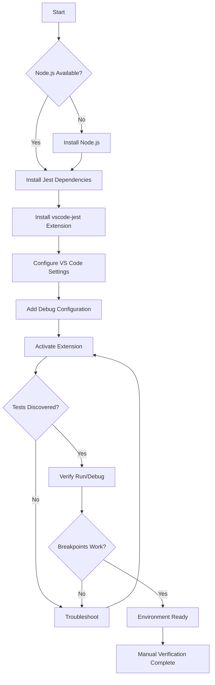
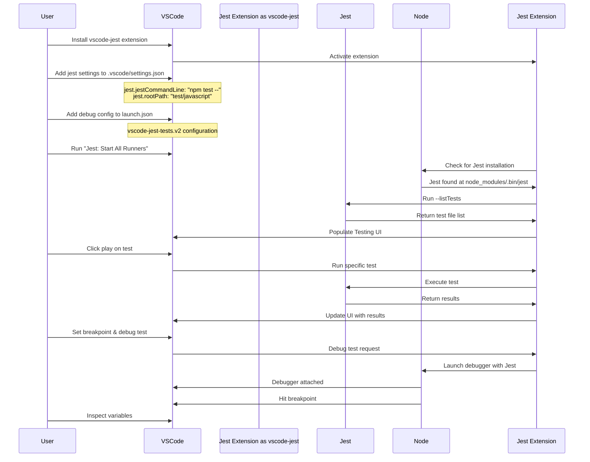

# Phase 0: Environment Preparation - Tasks & Alignment Brief

**Phase**: Phase 0: Environment Preparation
**Created**: 2025-01-29
**Plan**: [../../javascript-test-debugging-plan.md](../../javascript-test-debugging-plan.md)
**Spec**: [../../javascript-test-debugging-spec.md](../../javascript-test-debugging-spec.md)
**Status**: READY FOR IMPLEMENTATION

## Tasks

| Status | ID | Task | Type | Dependencies | Absolute Path(s) | Validation | Notes |
|--------|-----|------|------|--------------|------------------|------------|-------|
| [ ] | T001 | Check Node.js availability | Setup | - | Terminal/Shell | `node --version` returns v14+ | Prerequisite check |
| [ ] | T002 | Install Jest dependencies | Setup | T001 | `/Users/jordanknight/github/vsc-bridge/test/javascript/` | `npm list jest` shows installed | Run: `cd /Users/jordanknight/github/vsc-bridge/test/javascript && npm install` |
| [ ] | T003 | Verify Jest CLI functionality | Setup | T002 | `/Users/jordanknight/github/vsc-bridge/test/javascript/` | `npm test -- --listTests` lists example.test.js | Tests Jest can find test files |
| [ ] | T004 | Install vscode-jest extension | Setup | - | VS Code Extensions | Extension ID: Orta.vscode-jest visible in Extensions view | Install from marketplace or `code --install-extension Orta.vscode-jest` |
| [ ] | T005 | Create VS Code settings for Jest | Core | T004 | `/Users/jordanknight/github/vsc-bridge/.vscode/settings.json` | Jest configuration present in settings | Add jest.jestCommandLine and jest.rootPath [^1] |
| [ ] | T006 | Create debug launch configuration | Core | T004 | `/Users/jordanknight/github/vsc-bridge/.vscode/launch.json` | vscode-jest-tests.v2 configuration present | Add v2 debug config with variable substitution [^2] |
| [ ] | T007 | Activate vscode-jest extension | Integration | T004, T005 | VS Code UI | "Jest" appears in status bar | Run command: "Jest: Start All Runners" |
| [ ] | T008 | Verify test discovery in UI | Integration | T007 | VS Code Testing Sidebar | example.test.js visible with test hierarchy | Open Testing view, expand tree |
| [ ] | T009 | Test running via UI | Integration | T008 | VS Code Testing UI | Test runs show pass/fail status | Click play icon next to test |
| [ ] | T010 | Test debugging with breakpoints | Integration | T008, T006 | `/Users/jordanknight/github/vsc-bridge/test/javascript/example.test.js` | Debugger stops at breakpoint | Set breakpoint on line 8, click debug icon |
| [ ] | T011 | Verify Jest output channel | Integration | T007 | VS Code Output Panel | "Jest" channel shows test results | View > Output > Select "Jest" from dropdown |
| [ ] | T012 | Document manual verification steps | Doc | T010 | `/Users/jordanknight/github/vsc-bridge/docs/plans/6-javascript-test-debugging/tasks/phase-0/` | Checklist created for manual testing | Create manual-verification.md [^3] |

## Alignment Brief

### Objective

Set up a fully functional JavaScript test debugging environment using the vscode-jest extension, enabling manual discovery and debugging of Jest tests through VS Code's native Testing UI. This phase establishes the foundation for all subsequent JavaScript test integration work.

### Behavior Checklist

Upon completion of this phase:
- ✅ Jest is installed and functional in `/Users/jordanknight/github/vsc-bridge/test/javascript/`
- ✅ The vscode-jest extension is installed and activated
- ✅ JavaScript tests appear in the VS Code Testing sidebar
- ✅ Tests can be run individually or as a suite from the UI
- ✅ Breakpoints work when debugging tests
- ✅ Test results (pass/fail) display correctly
- ✅ The Jest output channel shows detailed test information

### Invariants & Guardrails

- **Node.js Version**: Must be v14.0.0 or higher
- **Jest Version**: Use the version specified in test/javascript/package.json (currently 29.7.0)
- **Extension Version**: vscode-jest must be latest stable version
- **No Code Changes**: This phase only configures the environment, no source code modifications
- **Manual Verification**: All acceptance requires human confirmation

### Inputs to Read

1. `/Users/jordanknight/github/vsc-bridge/test/javascript/package.json` - Jest configuration
2. `/Users/jordanknight/github/vsc-bridge/test/javascript/example.test.js` - Test file to verify
3. `/Users/jordanknight/github/vsc-bridge/.vscode/settings.json` - Existing VS Code settings (if any)
4. `/Users/jordanknight/github/vsc-bridge/.vscode/launch.json` - Existing debug configs (if any)

### Visual Alignment Aids

#### System Flow Diagram



#### Interaction Sequence Diagram



### Test Plan

**Testing Approach**: Manual verification only (no automated tests in this phase)

This phase focuses on environment setup and manual verification. The following manual tests must be performed:

1. **Jest Installation Test**
   - Navigate to test/javascript directory
   - Run `npm test -- --listTests`
   - **Expected**: Lists example.test.js

2. **Extension Activation Test**
   - Check VS Code status bar
   - **Expected**: "Jest" indicator visible

3. **Test Discovery Test**
   - Open Testing sidebar (beaker icon)
   - **Expected**: Tree shows example.test.js with nested describe/test blocks

4. **Test Execution Test**
   - Click play icon next to "Basic Math Operations"
   - **Expected**: Tests run, green checkmarks appear

5. **Debug Test**
   - Set breakpoint on line 8 of example.test.js (`expect(2 + 2).toBe(4)`)
   - Click debug icon next to test
   - **Expected**: Debugger stops at breakpoint, variables are inspectable

### Step-by-Step Implementation Outline

1. **Prerequisites Check (T001)**
   - Open terminal
   - Run `node --version`
   - Verify v14+ installed

2. **Jest Setup (T002-T003)**
   - `cd /Users/jordanknight/github/vsc-bridge/test/javascript`
   - `npm install`
   - `npm test -- --listTests`

3. **Extension Installation (T004)**
   - Open VS Code Extensions view (Cmd+Shift+X)
   - Search "vscode-jest"
   - Install "Jest" by Orta

4. **Configuration (T005-T006)**
   - Edit `.vscode/settings.json` - add Jest settings
   - Edit `.vscode/launch.json` - add debug configuration

5. **Activation & Verification (T007-T011)**
   - Command Palette: "Jest: Start All Runners"
   - Open Testing sidebar
   - Run tests via UI
   - Debug with breakpoints

6. **Documentation (T012)**
   - Create manual verification checklist
   - Document any issues encountered

### Commands to Run

```bash
# 1. Check Node.js
node --version

# 2. Install Jest dependencies
cd /Users/jordanknight/github/vsc-bridge/test/javascript
npm install

# 3. Verify Jest works
npm test -- --listTests
npm test

# 4. Install extension via CLI (alternative to UI)
code --install-extension Orta.vscode-jest

# 5. Open VS Code in project
cd /Users/jordanknight/github/vsc-bridge
code .

# 6. After configuration, reload window
# Cmd+Shift+P -> "Developer: Reload Window"
```

### Risks & Unknowns

| Risk | Mitigation |
|------|------------|
| Jest installation fails due to Node version | Ensure Node v14+ before starting |
| vscode-jest doesn't activate | Check for .vscode-jest marker file or jest.config.js |
| Tests don't appear in UI | Verify jest.rootPath points to test/javascript |
| Breakpoints don't work | Ensure launch.json uses correct paths |
| Extension conflicts | Test in clean VS Code profile if issues |

### Ready Check

Before proceeding with implementation:

- [ ] Node.js v14+ is installed and available
- [ ] You have access to VS Code marketplace for extensions
- [ ] The test/javascript directory exists with package.json
- [ ] You can modify .vscode/settings.json and launch.json
- [ ] You understand this is manual verification only
- [ ] You're prepared to document any issues encountered

**Human GO/NO-GO Decision Point**: Please confirm you're ready to proceed with Phase 0 implementation.

## Phase Footnote Stubs

| Footnote | Task | Planned Change |
|----------|------|----------------|
| [^1] | T005 | Add Jest configuration to .vscode/settings.json |
| [^2] | T006 | Add vscode-jest-tests.v2 debug configuration to launch.json |
| [^3] | T012 | Create manual-verification.md with checklist |

## Evidence Artifacts

The following artifacts will be created during implementation:

1. **Execution Log**: `/Users/jordanknight/github/vsc-bridge/docs/plans/6-javascript-test-debugging/tasks/phase-0/execution.log.md`
   - Record of all commands run
   - Screenshots of successful test discovery/debugging
   - Any issues encountered and resolutions

2. **Manual Verification Checklist**: `/Users/jordanknight/github/vsc-bridge/docs/plans/6-javascript-test-debugging/tasks/phase-0/manual-verification.md`
   - Step-by-step verification procedures
   - Expected vs actual results
   - Sign-off section

3. **Configuration Backups**:
   - `.vscode/settings.json.before` (if file existed)
   - `.vscode/launch.json.before` (if file existed)

## Directory Structure

```
docs/plans/6-javascript-test-debugging/
├── javascript-test-debugging-spec.md
├── javascript-test-debugging-plan.md
└── tasks/
    └── phase-0/
        ├── tasks.md (this file)
        ├── execution.log.md (created during implementation)
        ├── manual-verification.md (created during implementation)
        └── screenshots/ (if needed for evidence)
            ├── jest-status-bar.png
            ├── testing-ui-discovery.png
            └── breakpoint-debugging.png
```

---

**STOP**: This dossier is complete. Awaiting human **GO** signal to proceed with implementation via `/plan-6-implement-phase`.