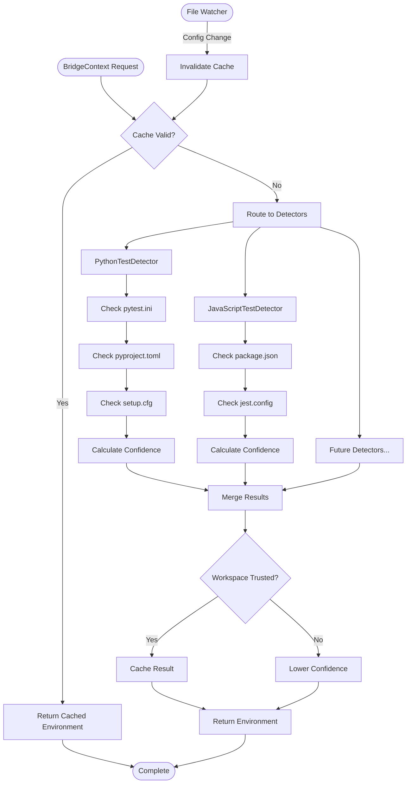
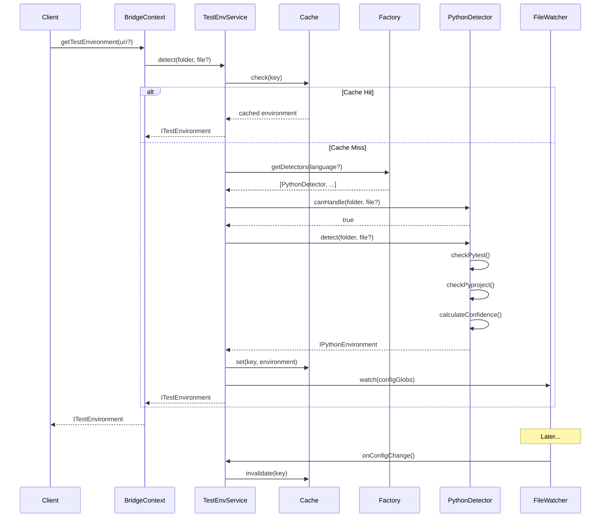

# Phase 1: Test Environment Service Layer Refactoring - Tasks & Alignment Brief

**Phase**: Phase 1
**Title**: Test Environment Service Layer Refactoring
**Slug**: phase-1
**Plan**: [/Users/jordanknight/github/vsc-bridge/docs/plans/6-javascript-test-debugging/javascript-test-debugging-plan.md](../../javascript-test-debugging-plan.md)
**Spec**: [/Users/jordanknight/github/vsc-bridge/docs/plans/6-javascript-test-debugging/javascript-test-debugging-spec.md](../../javascript-test-debugging-spec.md)
**Date**: 2025-01-29
**Status**: READY

## Tasks

| Status | ID | Task | Type | Dependencies | Absolute Path(s) | Validation | Notes |
|--------|-----|------|------|-------------|------------------|------------|-------|
| [ ] | T001 | Write tests for ITestEnvironmentDetector interface | Test | - | `/Users/jordanknight/github/vsc-bridge/extension/src/test-environments/__tests__/ITestEnvironmentDetector.test.ts` | Tests define detector contract, all initially fail | Tests-first TDD [^1] |
| [ ] | T002 | Write tests for TestEnvironmentService | Test | T001 | `/Users/jordanknight/github/vsc-bridge/extension/src/test-environments/__tests__/TestEnvironmentService.test.ts` | Tests verify service orchestration, all initially fail | Test language routing, caching [^2] |
| [ ] | T003 | Write tests for refactored Python detector | Test | T001 | `/Users/jordanknight/github/vsc-bridge/extension/src/test-environments/__tests__/PythonTestDetector.test.ts` | Tests verify Python detection compatibility, initially fail | Ensure backward compatibility [^3] |
| [ ] | T004 | Write tests for file watcher cache invalidation | Test | T002 | `/Users/jordanknight/github/vsc-bridge/extension/src/test-environments/__tests__/cache-invalidation.test.ts` | Tests verify cache clears on config change, initially fail | Test pytest.ini, package.json changes [^4] |
| [ ] | T005 | Write tests for workspace trust handling | Test | T002 | `/Users/jordanknight/github/vsc-bridge/extension/src/test-environments/__tests__/workspace-trust.test.ts` | Tests verify low confidence when untrusted, initially fail | Mock workspace trust API [^5] |
| [ ] | T006 | Write tests for monorepo routing | Test | T001,T002 | `/Users/jordanknight/github/vsc-bridge/extension/src/test-environments/__tests__/monorepo-routing.test.ts` | Tests verify quickScore and multi-detector, initially fail | Test package selection logic [^6] |
| [ ] | T008 | Create interface hierarchy | Core | - | `/Users/jordanknight/github/vsc-bridge/extension/src/test-environments/interfaces/index.ts` | TypeScript compiles, interfaces exported | ITestEnvironment, IPythonEnvironment, IJavaScriptEnvironment [^8] |
| [ ] | T009 | Implement TestEnvironmentService class | Core | T008 | `/Users/jordanknight/github/vsc-bridge/extension/src/test-environments/TestEnvironmentService.ts` | Service instantiates, T002 tests begin passing | With caching and logging [^9] |
| [ ] | T010 | Refactor PythonEnvDetectorSimple to PythonTestDetector | Core | T008,T009 | `/Users/jordanknight/github/vsc-bridge/extension/src/test-environments/detectors/PythonTestDetector.ts` | Implements ITestEnvironmentDetector, T003 tests pass | [P] with T011 - preserve existing logic [^10] |
| [ ] | T011 | Implement file watchers for cache invalidation | Core | T009 | `/Users/jordanknight/github/vsc-bridge/extension/src/test-environments/TestEnvironmentService.ts` | Watchers trigger on config changes, T004 tests pass | [P] with T010 - use vscode.workspace.createFileSystemWatcher [^11] |
| [ ] | T012 | Add workspace trust checks | Core | T009 | `/Users/jordanknight/github/vsc-bridge/extension/src/test-environments/TestEnvironmentService.ts` | Return low confidence when untrusted, T005 tests pass | Check vscode.workspace.isTrusted [^12] |
| [ ] | T013 | Implement cache logging | Core | T009,T011 | `/Users/jordanknight/github/vsc-bridge/extension/src/test-environments/TestEnvironmentService.ts` | Cache operations logged | Add to logger output [^13] |
| [ ] | T014 | Create TestDetectorFactory | Core | T008,T010 | `/Users/jordanknight/github/vsc-bridge/extension/src/test-environments/TestDetectorFactory.ts` | Factory creates detectors by language | Factory pattern implementation [^14] |
| [ ] | T015 | Update BridgeContext to use service | Integration | T009,T010,T014 | `/Users/jordanknight/github/vsc-bridge/extension/src/core/bridge-context/BridgeContext.ts` | getTestEnvironment() method works | Keep getPythonEnv() for compatibility [^15] |
| [ ] | T016 | Write integration tests for unified API | Integration | T015 | `/Users/jordanknight/github/vsc-bridge/extension/src/test-environments/__tests__/integration.test.ts` | Full flow from BridgeContext to detection works | Test both Python and placeholder JS [^16] |
| [ ] | T017 | Run all tests and fix failures | Polish | T001-T016 | `/Users/jordanknight/github/vsc-bridge/extension/` | All tests passing | npm test, fix any issues |
| [ ] | T018 | Run linting and type checking | Polish | T001-T017 | `/Users/jordanknight/github/vsc-bridge/extension/` | No lint or type errors | npm run lint, npx tsc |

## Alignment Brief

### Objective Recap

Create a unified, extensible service layer for test environment detection that supports multiple languages, starting with Python (existing) and preparing for JavaScript (upcoming phases). This refactoring establishes the architectural foundation for multi-language test support.

**Behavior Checklist**:
- ✅ Python test detection continues working identically
- ✅ New service layer provides unified API for all languages
- ✅ Caching for improved detection efficiency
- ✅ File watchers invalidate cache on config changes
- ✅ Workspace trust affects confidence scores
- ✅ Monorepo support via quickScore routing
- ✅ BridgeContext exposes unified getTestEnvironment() method
- ✅ Factory pattern enables easy addition of new detectors

### Invariants & Guardrails

**Resource Limits**:
- Memory: Reasonable cache storage
- File watchers: Limited active watchers

**Security**:
- Never expose file contents in logs
- Honor workspace trust settings
- Sanitize all file paths in error messages

**Backward Compatibility**:
- getPythonEnv() must continue working
- Existing Python detection logic preserved
- No changes to test.debug-wait script interface

### Inputs to Read

Before implementation, read these files to understand current state:

1. `/Users/jordanknight/github/vsc-bridge/extension/src/core/python/PythonEnvDetectorSimple.ts` - Current Python detection logic
2. `/Users/jordanknight/github/vsc-bridge/extension/src/core/bridge-context/BridgeContext.ts` - Current context API
3. `/Users/jordanknight/github/vsc-bridge/extension/src/core/bridge-context/IBridgeContext.ts` - Context interface
4. `/Users/jordanknight/github/vsc-bridge/docs/plans/6-javascript-test-debugging/javascript-test-debugging-spec.md` - Requirements

### Visual Alignment Aids

#### System Flow Diagram



#### Sequence Diagram



### Test Plan (Full TDD Approach)

Per spec requirement for Full TDD, all tests must be written before implementation:

**Unit Tests** (T001-T006):

1. **ITestEnvironmentDetector.test.ts** (T001)
   - Test detector contract compliance
   - Mock implementations for interface testing
   - Verify canHandle/detect/supportedLanguages/watchGlobs methods
   - Test optional quickScore method

2. **TestEnvironmentService.test.ts** (T002)
   - Test detector registration and routing
   - Test caching behavior (hit/miss/invalidation)
   - Test concurrent detection handling
   - Test error resilience

3. **PythonTestDetector.test.ts** (T003)
   - Test pytest.ini detection
   - Test pyproject.toml parsing
   - Test setup.cfg handling
   - Test confidence scoring algorithm
   - Fixture: sample Python projects with various configs

4. **cache-invalidation.test.ts** (T004)
   - Test file watcher setup
   - Test cache invalidation on config change
   - Test glob pattern matching
   - Mock file system events

5. **workspace-trust.test.ts** (T005)
   - Test trusted workspace behavior
   - Test untrusted workspace confidence reduction
   - Mock vscode.workspace.isTrusted API

6. **monorepo-routing.test.ts** (T006)
   - Test multi-package detection
   - Test quickScore routing
   - Test detector prioritization
   - Fixture: monorepo structure with multiple packages

**Integration Tests** (T016):
- Full flow from BridgeContext to detection
- Test Python detection end-to-end
- Test placeholder JavaScript detection
- Test cache integration
- Test file watcher integration

### Step-by-Step Implementation Outline

1. **Test Creation Phase** (T001-T006)
   - Write all unit tests first (they will fail initially)
   - Create test fixtures and mocks
   - Establish test expectations

2. **Interface Definition** (T008)
   - Create TypeScript interfaces
   - Define contracts for detectors
   - Export from index.ts

3. **Core Service Implementation** (T009)
   - Implement TestEnvironmentService with caching
   - Add detector registration
   - Implement routing logic

4. **Python Detector Refactoring** (T010)
   - Refactor existing PythonEnvDetectorSimple
   - Implement ITestEnvironmentDetector interface
   - Preserve all existing detection logic

5. **Enhanced Features** (T011-T014)
   - Add file watchers for cache invalidation
   - Implement workspace trust checks
   - Add cache metrics and logging
   - Create factory for detector instantiation

6. **Integration** (T015-T016)
   - Update BridgeContext with new API
   - Maintain backward compatibility
   - Write and run integration tests

7. **Polish** (T017-T018)
   - Fix all test failures
   - Run linting and type checking
   - Ensure all tests pass

### Commands to Run

```bash
# Setup (from extension directory)
cd /Users/jordanknight/github/vsc-bridge/extension

# Run tests during development
npm test -- --watch src/test-environments/__tests__

# Run specific test file
npm test -- src/test-environments/__tests__/TestEnvironmentService.test.ts

# Run all tests
npm test

# Type checking
npx tsc --noEmit

# Linting
npm run lint

# Coverage report
npm test -- --coverage src/test-environments
```

### Risks & Unknowns

| Risk | Mitigation | Rollback Plan |
|------|------------|---------------|
| Breaking Python detection | Comprehensive regression tests | Git revert to previous commit |
| Cache memory bloat | LRU cache with size limits | Clear cache on memory pressure |
| File watcher leaks | Dispose watchers properly | Manual watcher cleanup |
| Complex monorepo routing | Start simple, iterate | Fall back to single detector |

**Unknowns**:
- Exact cache size limits needed
- Optimal quickScore algorithm for monorepos
- Full list of config files to watch

### Ready Check

Before proceeding with implementation (Phase 6):

- [ ] Phase 0 manual verification complete
- [ ] Development environment ready
- [ ] Understand current Python detection code
- [ ] TypeScript/Jest tooling working
- [ ] Agreement on interface design
- [ ] Agreement on caching approach
- [ ] Agreement on test strategy

**Human GO/NO-GO Required**: _______________

## Phase Footnote Stubs

| Task | Footnote | Placeholder Description |
|------|----------|------------------------|
| T001 | [^1] | ITestEnvironmentDetector interface tests created |
| T002 | [^2] | TestEnvironmentService tests with caching created |
| T003 | [^3] | PythonTestDetector backward compatibility tests |
| T004 | [^4] | Cache invalidation file watcher tests |
| T005 | [^5] | Workspace trust handling tests |
| T006 | [^6] | Monorepo routing and quickScore tests |
| T008 | [^8] | Interface hierarchy definition |
| T009 | [^9] | TestEnvironmentService implementation |
| T010 | [^10] | PythonTestDetector refactoring |
| T011 | [^11] | File watcher implementation |
| T012 | [^12] | Workspace trust integration |
| T013 | [^13] | Cache logging |
| T014 | [^14] | TestDetectorFactory implementation |
| T015 | [^15] | BridgeContext API update |
| T016 | [^16] | Integration test suite |

## Evidence Artifacts

Implementation will generate the following evidence in this directory:

- `execution.log.md` - Detailed execution log with commands, outputs, and results
- `test-results.json` - Jest test results in JSON format
- `coverage-report.html` - Code coverage report

## Directory Structure

```
docs/plans/6-javascript-test-debugging/
├── javascript-test-debugging-spec.md
├── javascript-test-debugging-plan.md
└── tasks/
    ├── phase-0/
    │   ├── tasks.md
    │   ├── manual-verification.md
    │   └── execution.log.md
    └── phase-1/
        ├── tasks.md                    # This file
        ├── execution.log.md            # Created by /plan-6-implement-phase
        ├── test-results.json           # Test execution results
        └── coverage-report.html        # Code coverage
```

---

**Status**: READY - Awaiting human GO signal to proceed with `/plan-6-implement-phase --phase "Phase 1: Test Environment Service Layer Refactoring"`