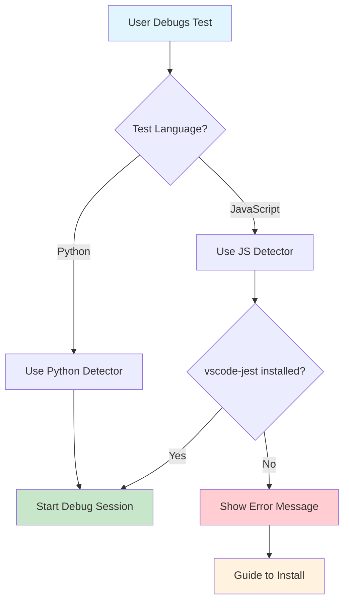
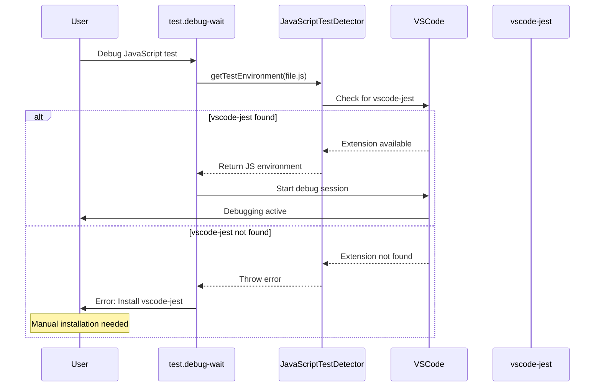

# Phase 2: Extension Integration - Tasks & Alignment Brief

**Phase**: 2
**Title**: Extension Integration
**Slug**: phase-2-extension-integration
**Plan**: [../../javascript-test-debugging-plan.md](../../javascript-test-debugging-plan.md)
**Spec**: [../../javascript-test-debugging-spec.md](../../javascript-test-debugging-spec.md)
**Date**: 2025-01-29

## Tasks

| Status | ID | Task | Type | Dependencies | Absolute Path(s) | Validation | Notes |
|--------|-----|------|------|--------------|------------------|------------|-------|
| [x] | T001 | Write tests for lazy dependency check | Test | - | `/Users/jordanknight/github/vsc-bridge/extension/src/test/unit/test-environments/JavaScriptTestDetector.test.ts` | Tests verify error thrown when vscode-jest missing | Add to detector tests [^1] |
| [x] | T002 | Write tests for dependency check in debug-wait | Test | T001 | `/Users/jordanknight/github/vsc-bridge/extension/src/test/unit/scripts/test.debug-wait.test.ts` | Tests verify error when attempting JS debug without extension | Test error case [^2] |
| [x] | T003 | Implement lazy check in JavaScriptTestDetector | Core | T001 | `/Users/jordanknight/github/vsc-bridge/extension/src/core/test-environments/detectors/JavaScriptTestDetector.ts` | Throws error if vscode-jest not found during detect() | Add extension check [^3] |
| [x] | T004 | Add error handling in test.debug-wait | Core | T002 | `/Users/jordanknight/github/vsc-bridge/extension/src/vsc-scripts/tests/debug-wait.js` | Catches and displays user-friendly error | Error handling [^4] |
| [x] | T005 | Create checkJestExtension helper | Core | T003 | `/Users/jordanknight/github/vsc-bridge/extension/src/core/test-environments/detectors/JavaScriptTestDetector.ts` | Helper function checks and returns boolean | Utility method [^5] |
| [x] | T006 | Document optional dependency | Doc | - | `/Users/jordanknight/github/vsc-bridge/README.md` | README explains vscode-jest needed for JS debugging | Documentation update [^6] |
| [x] | T007 | Add configuration examples | Doc | T006 | `/Users/jordanknight/github/vsc-bridge/docs/JAVASCRIPT_TESTING.md` | Examples for common Jest setups | New documentation file [^7] |

## Alignment Brief

### Objective Recap
Implement lazy dependency checking for vscode-jest - only verify its presence when actually attempting to debug JavaScript tests. This keeps the extension lightweight and doesn't force users to install Jest support unless they need it.

### Behavior Checklist
- [x] Extension works normally without vscode-jest installed
- [x] Error only appears when trying to debug JavaScript tests
- [x] Clear error message guides user to install vscode-jest
- [x] No conflicts with Python test discovery
- [x] Documentation explains optional dependency

### Invariants & Guardrails
- **Lazy Loading**: No checks until JavaScript debugging attempted
- **Graceful Degradation**: Extension fully functional for Python without vscode-jest
- **Non-breaking**: Python test functionality must remain unaffected
- **Clear Messaging**: Error message includes installation instructions

### Inputs to Read
1. `/Users/jordanknight/github/vsc-bridge/extension/package.json` - Current extension manifest
2. `/Users/jordanknight/github/vsc-bridge/extension/src/extension.ts` - Main activation function
3. `/Users/jordanknight/github/vsc-bridge/extension/src/core/bridge-context/BridgeContext.ts` - Context for compatibility check
4. `/Users/jordanknight/github/vsc-bridge/README.md` - Current documentation

### Visual Alignment Aids

#### System State Flow


#### Interaction Sequence


### Test Plan (TDD Approach)

#### Test 1: Lazy Dependency Check
**File**: `JavaScriptTestDetector.test.ts`
**Purpose**: Verify error thrown when vscode-jest missing
**Approach**: RED-GREEN-REFACTOR
```typescript
// RED: Write failing test first
test('should throw error when vscode-jest not installed', async () => {
    sandbox.stub(vscode.extensions, 'getExtension').returns(undefined);
    const detector = new JavaScriptTestDetector();

    await assert.rejects(
        detector.detect(mockFolder, jsFileUri),
        /vscode-jest extension required/
    );
});

// GREEN: Add check in detect() method
// REFACTOR: Extract to helper function
```

#### Test 2: Successful Detection with Extension
**File**: `JavaScriptTestDetector.test.ts`
**Purpose**: Verify normal operation when extension present
**Mock**: vscode.extensions.getExtension returns mock extension
**Expected**: Returns valid Jest environment

#### Test 3: Error Handling in debug-wait
**File**: `test.debug-wait.test.ts`
**Purpose**: Verify user-friendly error display
**Mock**: JavaScriptTestDetector throws error
**Expected**: Shows clear message with installation guide

#### Test 4: Python Unaffected
**File**: `backward-compatibility.test.ts`
**Purpose**: Python debugging works without vscode-jest
**Expected**: Python tests debug normally

### Step-by-Step Implementation Outline

1. **Test Phase** (T001-T002)
   - Write failing tests for lazy check (RED)
   - Test error cases in detector and debug-wait
   - Mock VS Code extension API

2. **Core Implementation** (T003-T005)
   - Add extension check to JavaScriptTestDetector.detect()
   - Create checkJestExtension helper method
   - Add error handling in test.debug-wait script
   - Throw clear error with installation instructions

3. **Documentation Phase** (T006-T007)
   - Update README with optional dependency note
   - Create JavaScript testing guide
   - Add Jest configuration examples

### Commands to Run

```bash
# Initial test setup (will fail - TDD)
cd /Users/jordanknight/github/vsc-bridge/extension
npm test -- --grep "vscode-jest"

# After implementation
npm test -- --grep "JavaScriptTestDetector"
npm test -- --grep "debug-wait"
npm run compile
npm run lint

# Manual validation - test without vscode-jest
code --uninstall-extension Orta.vscode-jest
# Try debugging JS test - should see error

# Install and retry
code --install-extension Orta.vscode-jest
# JS debugging should now work
```

### Risks & Unknowns

| Risk | Severity | Mitigation |
|------|----------|------------|
| User confusion about error | Low | Clear error message with installation link |
| vscode-jest API changes | Low | Simple presence check only |
| Extension not activating | Low | Check isActive property too |
| Multiple Jest extension variants | Low | Document supported extension ID |

### Ready Check

**Pre-Implementation Checklist:**
- [x] Phase 1 complete and all tests passing
- [x] JavaScriptTestDetector placeholder exists
- [x] test.debug-wait script accessible
- [x] Familiar with VS Code extension API
- [x] Can test with/without vscode-jest installed

**GO/NO-GO Decision Points:**
- [x] Ready to add lazy check to detector? ✅ DONE
- [x] Can modify debug-wait error handling? ✅ DONE
- [x] Can write clear error messages? ✅ DONE
- [x] Ready to test both success and error paths? ✅ DONE

## Phase Footnote Stubs

| Footnote | Description |
|----------|-------------|
| [^1] | JavaScriptTestDetector.test.ts - Added test for missing extension error |
| [^2] | test.debug-wait.test.ts - Added test for error handling |
| [^3] | JavaScriptTestDetector.ts - Added extension check in detect() |
| [^4] | test.debug-wait.js - Added try-catch for JS detection errors |
| [^5] | JavaScriptTestDetector.ts - Added checkJestExtension helper |
| [^6] | README.md - Updated with optional dependency note |
| [^7] | JAVASCRIPT_TESTING.md - New documentation file with Jest examples |

## Evidence Artifacts

### Execution Log
**Location**: `/Users/jordanknight/github/vsc-bridge/docs/plans/6-javascript-test-debugging/tasks/phase-2-extension-integration/execution.log.md`

This file will contain:
- Timestamp of each task completion
- Test execution results (pass/fail)
- Any errors or warnings encountered
- Performance metrics if relevant
- Links to changed files with line numbers

### Supporting Files
- `test-results.json` - Automated test results in JSON format
- `dependency-check.log` - Log of dependency verification process
- `activation-trace.log` - Extension activation sequence for debugging

## Directory Layout

```
docs/plans/6-javascript-test-debugging/
├── javascript-test-debugging-plan.md
├── javascript-test-debugging-spec.md
└── tasks/
    └── phase-2-extension-integration/
        ├── tasks.md                    # This file
        ├── execution.log.md             # Created by /plan-6
        ├── test-results.json            # Test output
        ├── dependency-check.log        # Verification log
        └── activation-trace.log        # Debug trace
```

---

**Status**: ✅ COMPLETE
**Implementation Date**: 2025-01-29
**Next Step**: Ready for `/plan-7-code-review --phase "Phase 2: Extension Integration" --plan "/Users/jordanknight/github/vsc-bridge/docs/plans/6-javascript-test-debugging/javascript-test-debugging-plan.md"`