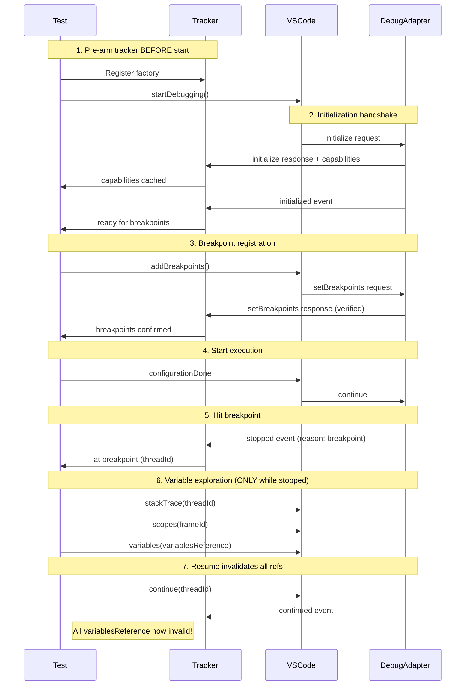
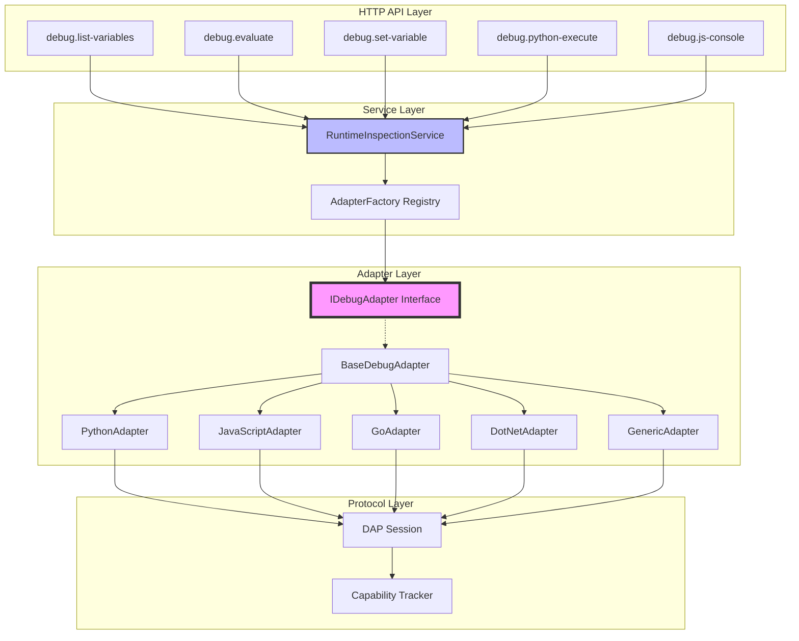
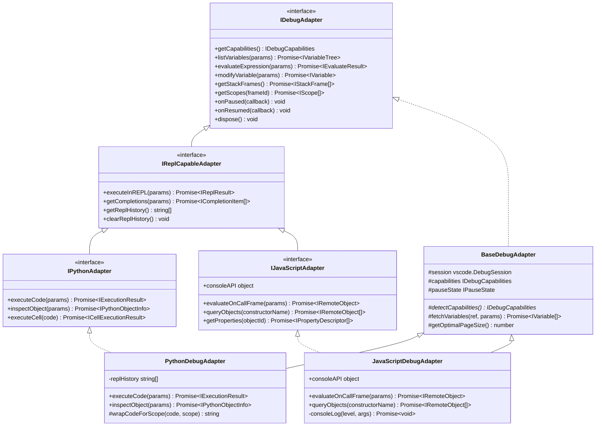
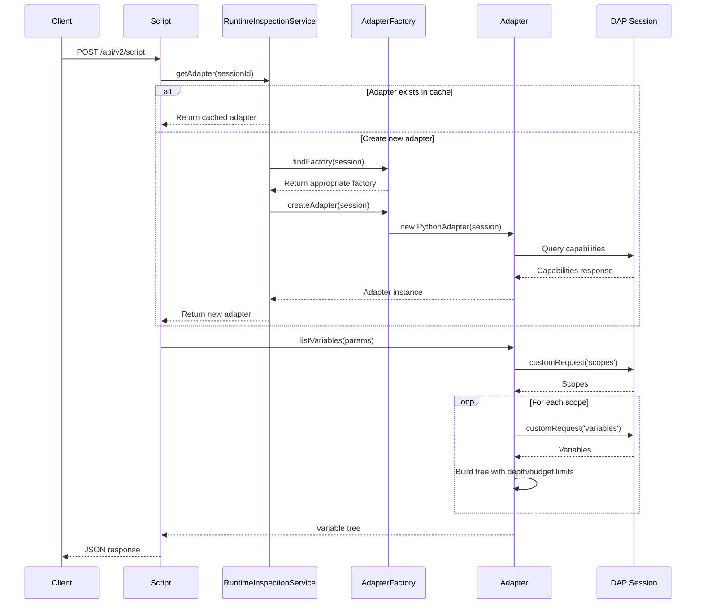
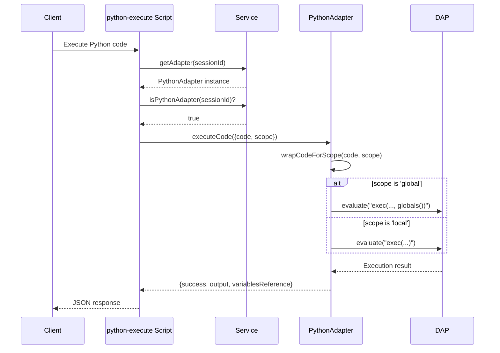

# Breakpoint Variable Exploration Implementation Plan

**Plan Version**: 6.0.0
**Created**: 2025-01-30
**Updated**: 2025-01-31 (Added Phase 0 for development environment setup)
**Spec**: [./breakpoint-variable-exploration-spec.md](./breakpoint-variable-exploration-spec.md)
**Status**: READY
**Key Update**: Dynamic script development first in scratch/, bake-in to extension later

## Table of Contents

1. [Executive Summary](#executive-summary)
2. [Critical Testing Patterns (v4.0 Update)](#critical-testing-patterns-v40-update)
3. [Architecture Overview](#architecture-overview)
4. [Technical Context](#technical-context)
5. [Critical Research Findings](#critical-research-findings)
6. [Testing Philosophy](#testing-philosophy)
7. [Implementation Phases](#implementation-phases)
   - [Phase 0: Development Environment Setup (NEW)](#phase-0-development-environment-setup-new)
   - [Phase 1: Core Variable Retrieval](#phase-1-core-variable-retrieval)
   - [Phase 2: Paging & Expansion](#phase-2-paging--expansion)
   - [Phase 3: Variable Modification](#phase-3-variable-modification)
   - [Phase 4: Utilities & Refinement](#phase-4-utilities--refinement)
   - [Phase 5: Interface Layer (Optional)](#phase-5-interface-layer-optional)
   - [Phase 6: Bake-in Scripts](#phase-6-bake-in-scripts)
8. [Cross-Cutting Concerns](#cross-cutting-concerns)
9. [Complexity Tracking](#complexity-tracking)
10. [Progress Tracking](#progress-tracking)
11. [Change Footnotes Ledger](#change-footnotes-ledger)

## Executive Summary

**Problem Statement**: Current variable exploration scripts (`debug.list-variables`, `debug.scopes`, `debug.evaluate`) contain placeholder implementations that don't provide real debugging value. Developers and AI assistants need comprehensive visibility into runtime state at breakpoints with language-specific enhancements.

**Solution Approach (Dynamic Script Development)**:
- Phase 0 establishes development environment with dynamic script workflow
- All scripts developed in `samples/dynamic/` directory first
- Scripts serve dual purpose: development and user samples
- Hot-reload capability - edit JavaScript, save, test immediately
- User runs Extension Development Host (F5), we ensure compilation
- Start with Node.js (pwa-node) debugger built into VS Code
- Once perfected, convert to baked-in scripts in extension
- Samples remain for user reference and documentation

**Expected Outcomes**:
- Complete variable visibility at breakpoints for Node.js
- Working implementation within 1-3 days
- Safe variable modification during debug sessions
- Efficient handling of massive data structures (>100k items)
- Hot-reload capability for rapid development
- Foundation for adding other languages later

**Success Metrics**:
- Phase 0 development loop working with hot-reload (<1 hour setup)
- Dynamic scripts in samples/dynamic/ work as both development and documentation
- `just test-dynamic-samples` validates all sample scripts
- <100ms response time for typical requests (depth=1, 50 children)
- No OOM errors with 1M+ element structures
- Baked-in scripts match dynamic script functionality exactly
- Samples remain functional for user learning

## Critical Testing Patterns (v4.0 Update)

### The DapTracker Pattern - Foundation for Race-Free Testing

The most critical insight from deep research is that **pre-arming the tracker BEFORE starting debug** eliminates virtually all race conditions:

```typescript
// extension/src/test/harness/DapTracker.ts
export class DapTracker {
  public sent: Message[] = [];
  public recv: Message[] = [];
  private resolvers = new Map<string, ((m: Message) => void)[]>();

  waitForEvent(event: string, pred: (m: Message) => boolean = () => true): Promise<Message> {
    // Event-driven waiting, no polling or timeouts
  }

  waitForResponse(command: string, pred: (m: Message) => boolean = () => true): Promise<Message> {
    // Captures response for specific DAP command
  }
}

// Pre-arm BEFORE starting debug (critical!)
const factory = vscode.debug.registerDebugAdapterTrackerFactory('*', {
  createDebugAdapterTracker(session) {
    return new DapTracker(session);
  }
});

// THEN start debugging - tracker already listening
await vscode.debug.startDebugging(folder, config);
```

### DAP Protocol Sequence - Must Be Exact



### Variable Handle Lifecycle - The Golden Rule

**Variable references are ONLY valid while execution is stopped**. This is a DAP guarantee, not adapter-specific:

```typescript
// This test MUST pass - verifies DAP compliance
test('variable references invalidate on resume', async () => {
  // Get variables while stopped
  const { variables } = await session.customRequest('variables', {
    variablesReference: localScope.variablesReference
  });
  const oldRef = variables[0].variablesReference;

  // Resume execution
  await session.customRequest('continue', { threadId });
  await tracker.waitForEvent('continued');

  // Old reference MUST fail
  await assert.rejects(
    session.customRequest('variables', { variablesReference: oldRef }),
    /Invalid variablesReference/
  );
});
```

### Deterministic Breakpoint Strategies

Three proven approaches in order of reliability:

1. **stopOnEntry: true** (Most reliable - pauses before any user code)
```typescript
const config = {
  type: 'python',
  request: 'launch',
  program: fixture,
  stopOnEntry: true  // Guarantees pause before user code
};
```

2. **Sentinel breakpoints** with verification
```python
def test_function():
    x = 42
    y = "hello"
    # BREAK_HERE - line 4
```

3. **Adapter-native** pause mechanisms
```python
import debugpy
debugpy.breakpoint()  # Python-specific force stop
```

### Test Fixture Structure

```
extension/src/test/fixtures/
├── python/
│   ├── simple_vars.py       # Basic types: int, str, list, dict
│   ├── nested_objects.py    # Deep nesting, complex structures
│   ├── circular_refs.py     # obj["self"] = obj patterns
│   └── large_collections.py # 100k+ item arrays for paging
├── javascript/
│   └── simple_vars.js       # Stubbed - returns NOT_IMPLEMENTED
└── shared/
    └── golden/
        ├── python_locals.json   # Expected variable structures
        └── python_nested.json   # Complex object golden files
```

## Architecture Overview

### System Architecture



### Class Hierarchy



### Request Flow Sequence



### Language-Specific Features Flow



## Technical Context

**Current System State**:
- Scripts use QueryScript/MutateScript base classes from `/Users/jordanknight/github/vsc-bridge/extension/out/core/scripts/base`
- HTTP server exposes scripts on port 3001 via `/api/v2/script` endpoint
- `debug.list-variables.js` returns mock data with placeholder note
- `debug.scopes.js` has basic DAP integration using customRequest
- `debug.evaluate.js` has DAP integration but limited error handling
- Test framework uses Mocha/Chai/Sinon pattern

**Integration Requirements**:
- Maintain existing script contract (params validation with Zod, success/failure envelopes)
- Preserve HTTP API compatibility while enhancing response payloads
- Work with existing BridgeContext pattern for VS Code API access
- Integrate with extension activation in `extension/src/extension.ts`

**Constraints and Limitations**:
- Variable references only valid while execution is paused
- Different debug adapters have varying capability support
- Some adapters limit response sizes (e.g., debugpy ~300 variables)
- Must avoid VS Code extension host memory exhaustion

**Assumptions**:
- All target language debug adapters implement core DAP spec
- Users have appropriate language runtimes installed
- File system access available for large data dumps
- JSON serialization sufficient for value representation

## Critical Research Findings

### Critical Discovery 01: DAP Capability Detection via Observation
**Problem**: Debug adapters vary significantly in supported features
**Root Cause**: DAP spec has many optional capabilities
**Solution**: Observe DAP traffic via DebugAdapterTrackerFactory to cache capabilities; handle capabilities events for mid-session changes
**Example**:
```typescript
// ❌ WRONG - Can't send initialize from extension
const response = await session.customRequest('initialize', {});

// ✅ CORRECT - Observe DAP traffic passively
vscode.debug.registerDebugAdapterTrackerFactory('*', {
    createDebugAdapterTracker(session) {
        return {
            onDidSendMessage: (m: any) => {
                // Observe initialize response
                if (m?.type === 'response' && m.command === 'initialize') {
                    cacheCapabilities(session.id, m.body?.capabilities);
                }
                // CRITICAL: Handle capabilities event for mid-session changes
                if (m?.type === 'event' && m.event === 'capabilities') {
                    updateCapabilities(session.id, m.body?.capabilities);
                }
            }
        };
    }
});
```

### Critical Discovery 02: Variable Reference Lifecycle
**Problem**: Variable references become invalid after execution resumes
**Root Cause**: DAP spec explicitly states handles are "only valid while execution remains suspended"
**Solution**: Invalidate all cached references on ANY resume/step/continue; handle 'notStopped' errors
**Example**:
```typescript
// ❌ WRONG - Reuses old references
const cachedRef = this.variableCache.get(varName);
const result = await session.customRequest('variables', {
    variablesReference: cachedRef  // Invalid after resume!
});

// ✅ CORRECT - Clear cache on any execution state change
session.onDidChangeState((e) => {
    if (e.state === 'running') {
        this.variableCache.clear();
        this.scopeCache.clear();
    }
});

// ✅ CORRECT - Handle notStopped errors with retry
try {
    const result = await session.customRequest('variables', args);
} catch (e) {
    if (e.message?.includes('notStopped')) {
        // Brief backoff and retry
        await new Promise(r => setTimeout(r, 150));
        return retry();
    }
}
```

### Critical Discovery 03: Adapter Page Sizes are Heuristics
**Problem**: Only debugpy's ~300 limit is documented; other adapters don't guarantee specific numbers
**Root Cause**: Implementation-specific constraints vary and aren't part of DAP spec
**Solution**: Treat page sizes as tunable heuristics, not fixed values
**Example**:
```typescript
// ❌ WRONG - Treating as guaranteed limits
const PAGE_SIZES = {
    'dlv-dap': 100,      // NOT documented
    'debugpy': 250,      // OK - heuristic for known ~300 limit
    'pwa-node': 500,     // NOT guaranteed
};

// ✅ CORRECT - Heuristics with telemetry feedback
const PAGE_SIZE_HEURISTICS = {
    'debugpy': 250,      // Stay under documented ~300 limit
    'default': 200       // Conservative default
};

// ✅ CORRECT - Use adapter counts when available
const namedCount = scope.namedVariables || 0;
const indexedCount = scope.indexedVariables || 0;
// Use these to show "(N items)" and plan paging strategy
```

### Critical Discovery 04: Cycle Detection Essential
**Problem**: Self-referential objects cause infinite recursion
**Root Cause**: Objects can contain references to themselves
**Solution**: Track visited variablesReference values per traversal
**Example**:
```javascript
// ❌ WRONG - No cycle detection
async function traverse(ref, depth) {
    const vars = await getVariables(ref);
    for (const v of vars) {
        if (v.variablesReference > 0) {
            await traverse(v.variablesReference, depth + 1);  // Infinite loop!
        }
    }
}

// ✅ CORRECT - Track visited references
async function traverse(ref, depth, visited = new Set()) {
    if (visited.has(ref)) {
        return { cycle: true };
    }
    visited.add(ref);
    // ... continue traversal
}
```

### Critical Discovery 05: Memory Budget Required for Large Structures
**Problem**: Attempting to load 1M+ element arrays crashes extension host
**Root Cause**: Building entire object graph in memory
**Solution**: Implement dual budget (nodes + bytes) with file streaming fallback
**Example**:
```javascript
// ❌ WRONG - Unbounded memory usage
const allVars = await recursivelyLoadAll(rootRef);
return JSON.stringify(allVars);  // OOM!

// ✅ CORRECT - Budget tracking with streaming
if (nodeCount > 20000 || byteCount > 5_000_000) {
    // Switch to file streaming
    const file = await streamToFile(session, rootRef);
    return { file };
}
```

### Critical Discovery 06: Scope.expensive Must Be Respected
**Problem**: Auto-expanding expensive scopes causes performance issues
**Root Cause**: Some scopes are marked expensive by adapters for good reason
**Solution**: Check Scope.expensive flag and don't auto-expand; let user choose
**Example**:
```typescript
// ❌ WRONG - Expanding everything automatically
for (const scope of scopes) {
    await expandScope(scope);  // May be very slow!
}

// ✅ CORRECT - Respect expensive flag
for (const scope of scopes) {
    if (scope.expensive && !userRequestedExpansion) {
        // Show as collapsed with "(expensive)" indicator
        continue;
    }
    await expandScope(scope);
}
```

### Critical Discovery 07: Python exec() is Adapter-Specific
**Problem**: Treating exec() as standard DAP feature
**Root Cause**: exec() via evaluate is debugpy-specific behavior, not DAP standard
**Solution**: Gate behind supportsEvaluate, use only in 'repl' context, show warning
**Example**:
```typescript
// ❌ WRONG - Assuming exec() works everywhere
await session.customRequest('evaluate', {
    expression: `exec("x = 42")`,
    context: 'watch'  // Wrong context!
});

// ✅ CORRECT - Adapter-specific with warnings
if (adapter === 'debugpy' && caps.supportsEvaluate) {
    // Show warning: "This may execute code with side effects"
    await session.customRequest('evaluate', {
        expression: `exec(${JSON.stringify(code)})`,
        context: 'repl',  // Only in repl context
        frameId
    });
}
```

### Critical Discovery 08: Language-Specific Modification Limits
**Problem**: Go and .NET have strict limits on what can be modified
**Root Cause**: Adapter implementation constraints
**Solution**: Validate modifications before attempting; provide clear error messages
**Example**:
```typescript
// ❌ WRONG - Trying to set composite in Go
await session.customRequest('setVariable', {
    name: 'myStruct',
    value: '{Field1: "value", Field2: 42}'  // Will fail in Go!
});

// ✅ CORRECT - Validate based on language
if (adapter === 'dlv-dap') {
    // Go: Only simple strings, numbers, pointers
    if (!isSimpleType(value)) {
        throw new Error('Go debugger only supports modifying simple types');
    }
}
```

### Critical Discovery 09: Adapter-Specific Cycle Detection Required
**Problem**: Cycle detection using `variablesReference` doesn't work with pwa-node (JavaScript/TypeScript debugger)
**Root Cause**: DAP spec doesn't guarantee stable variablesReference handles; pwa-node generates new references for each expansion of the same object
**Solution**: Implement adapter-specific identity detection strategies
**Example**:
```javascript
// ❌ WRONG - Assuming variablesReference is stable identity
const visited = new Set();
if (visited.has(variable.variablesReference)) {
    return { cycle: true };  // Fails for pwa-node!
}

// ✅ CORRECT - Adapter-specific strategies
if (session.type === 'pwa-node' && variable.evaluateName) {
    // JavaScript: Use Object.is() equality checks
    for (const ancestor of ancestors.slice(-4)) {  // Cap at 4 for performance
        if (ancestor.evaluateName) {
            const expr = `Object.is(${variable.evaluateName}, ${ancestor.evaluateName})`;
            const result = await session.customRequest('evaluate', {
                expression: expr,
                frameId: frameId,
                context: 'hover'  // Side-effect free if supported
            });
            if (result.result === 'true') {
                return { cycle: true, via: 'Object.is' };
            }
        }
    }
} else if (session.type === 'debugpy' && variable.evaluateName) {
    // Python: Use id() for stable identity
    const idResult = await session.customRequest('evaluate', {
        expression: `id(${variable.evaluateName})`,
        frameId: frameId,
        context: 'hover'
    });
    const idKey = `pyid:${idResult.result}`;
    if (visited.has(idKey)) {
        return { cycle: true, via: 'python:id()' };
    }
    visited.add(idKey);
} else if (variable.memoryReference) {
    // Go/.NET/C++: Use memoryReference when available
    const memKey = `mem:${variable.memoryReference}`;
    if (visited.has(memKey)) {
        return { cycle: true, via: 'memoryReference' };
    }
    visited.add(memKey);
}
```
**Impact**: Each language/adapter needs its own cycle detection approach:
- **JavaScript (pwa-node)**: `Object.is()` equality checks against ancestors
- **Python (debugpy)**: `id()` via evaluate for stable identity
- **Go/C++/.NET**: `memoryReference` when available
- **Fallback**: Use `variablesReference` weakly (works sometimes but not reliable)

## Testing Philosophy

### Testing Approach
- **Selected Approach**: Full TDD
- **Rationale**: Core debugging feature with complex DAP interactions requiring comprehensive test coverage
- **Focus Areas**: DAP protocol integration, complex object traversal, variable modification, expression evaluation, error handling

### Test-Driven Development
- Write tests FIRST (RED)
- Implement minimal code (GREEN)
- Refactor for quality (REFACTOR)

### Test Documentation
Every test must include:
```
Purpose: [what truth this test proves]
Quality Contribution: [how this prevents bugs]
Acceptance Criteria: [measurable assertions]
```

### Mock Usage
- **Policy**: Avoid mocks entirely
- **Approach**: Use real debug sessions with actual test programs
- **Rationale**: Real debug sessions with test programs provide accurate DAP behavior validation
- External systems (network calls) may be stubbed if absolutely necessary

## Implementation Phases (v6.0)

### Phase 0: Development Environment Setup (NEW)

**Objective**: Establish rapid iteration development loop with dynamic scripts that also serve as samples

**Deliverables**:
- Development directory structure (`samples/dynamic/`)
- Justfile commands for dynamic script workflow
- Sample scripts demonstrating dynamic capability
- Verified hot-reload workflow

**Tasks**:
| #   | Status | Task | Success Criteria | Notes |
|-----|--------|------|------------------|-------|
| 0.1 | [x] | Ensure extension compiles | `just dev-compile` succeeds | Ran npm compile successfully [^1] |
| 0.2 | [x] | Create samples/dynamic/ directory | Directory exists for dynamic scripts | Created at scripts/sample/dynamic/ [^2] |
| 0.3 | [x] | Add justfile development commands | Commands work from test workspace | Added dev-compile and dynamic commands [^3] |
| 0.4 | [x] | Create sample list-breakpoints.js | Returns real breakpoints | Created with DAP integration [^4] |
| 0.5 | [ ] | Verify hot-reload workflow | Edit → save → run works | Pending user testing |

**Progress**: 4/5 tasks complete (80%)

**Justfile Commands**:
```makefile
# Ensure extension compiles before user runs Extension Host
dev-compile:
    cd extension && npm run compile

# Run dynamic script from test workspace root (user must be in test workspace)
dynamic FILE *ARGS:
    vscb script run -f {{FILE}} {{ARGS}}

# Quick test of list-breakpoints sample
sample-bp-list:
    vscb script run -f ./samples/dynamic/list-breakpoints.js

# Run list-variables sample with params
sample-vars *ARGS:
    vscb script run -f ./samples/dynamic/list-variables.js {{ARGS}}

# Run set-variable sample
sample-set VAR VALUE:
    vscb script run -f ./samples/dynamic/set-variable.js --param name={{VAR}} --param value={{VALUE}}

# Test all dynamic samples
test-dynamic-samples:
    @echo "Testing dynamic script samples..."
    @just sample-bp-list
    @echo "✓ list-breakpoints works"
    @just sample-vars --param depth=1
    @echo "✓ list-variables works"
```

**Sample `samples/dynamic/list-breakpoints.js`**:
```javascript
// Dynamic script for listing breakpoints - hot-reloadable
module.exports = async function(bridgeContext, params) {
    const vscode = bridgeContext.vscode;

    // Get all breakpoints from VS Code
    const breakpoints = vscode.debug.breakpoints
        .filter(bp => bp instanceof vscode.SourceBreakpoint)
        .map(bp => ({
            path: bp.location.uri.fsPath,
            line: bp.location.range.start.line + 1,
            enabled: bp.enabled,
            condition: bp.condition || undefined
        }));

    // Log to output channel for debugging
    bridgeContext.logger.info(`Found ${breakpoints.length} breakpoints`);

    // Console log for immediate feedback during development
    console.log('Breakpoints:', JSON.stringify(breakpoints, null, 2));

    return {
        breakpoints,
        total: breakpoints.length
    };
};
```

**Development Workflow**:
1. User runs `just dev-compile` to ensure extension builds
2. User launches Extension Development Host (F5 in VS Code)
3. User opens test workspace in Extension Host window
4. Developer creates scripts in `samples/dynamic/`
5. From test workspace terminal: `just sample-bp-list`
6. Edit script, save, immediately re-run (no compilation!)
7. Once happy with scripts, proceed to Phase 6 to bake them in as permanent extension scripts
8. Original samples remain in `samples/dynamic/` for users to learn from

### Phase 0b: Debugger Status Infrastructure (NEW)

**Objective**: Implement debugger status querying and DAP observation infrastructure using dynamic scripts for rapid iteration

**Rationale**: Before we can query variables (Phase 1), we need robust infrastructure to:
- Detect when the debugger is paused (required for variable queries)
- Get proper stack frames and thread information
- Map breakpoint IDs between DAP and VS Code
- Cache DAP capabilities for feature detection

**Deliverables**:
- Working `debug-status.js` script for comprehensive status queries
- DAP tracker registration via `debug-tracker.js`
- Capability detection and caching system
- Breakpoint ID mapping (DAP ↔ VS Code)
- Session state management utilities
- Test program with clear stack levels

**Tasks**:
| #   | Status | Task | Success Criteria | Notes |
|-----|--------|------|------------------|-------|
| 0b.1 | [x] | Create debug-status.js basic query | Returns session info and pause state | See Phase 0b footnotes in tasks.md [^0b-1] |
| 0b.2 | [x] | Add stack frame retrieval | Gets full stack when paused | See Phase 0b footnotes in tasks.md [^0b-1] |
| 0b.3 | [x] | Create test-debug.js program | Has multiple stack levels | See Phase 0b footnotes in tasks.md [^0b-2] |
| 0b.4 | [x] | Create debug-tracker.js | Registers DAP tracker | See Phase 0b footnotes in tasks.md [^0b-3] |
| 0b.5 | [x] | Capture initialize response | Cache capabilities | See Phase 0b footnotes in tasks.md [^0b-3] |
| 0b.6 | [x] | Track stopped/continued events | Detect pause state changes | See Phase 0b footnotes in tasks.md [^0b-3] |
| 0b.7 | [x] | Map breakpoint IDs | Correlate DAP ↔ VS Code | See Phase 0b footnotes in tasks.md [^0b-3] |
| 0b.8 | [x] | Handle not-paused errors | Graceful error messages | See Phase 0b footnotes in tasks.md [^0b-1] |
| 0b.9 | [x] | Add scopes query | Get scope information | See Phase 0b footnotes in tasks.md [^0b-1] |
| 0b.10 | [x] | Document in tasks.md | Complete phase documentation | See Phase 0b footnotes in tasks.md [^0b-4] |

**Progress**: 10/10 tasks complete (100%)

**Key Implementation Patterns from Research**:
- **Pre-arm tracker**: Register DebugAdapterTrackerFactory BEFORE starting debug session
- **Observe, don't request**: Watch DAP traffic passively, never send initialize from extension
- **Map IDs**: Build correlation between DAP breakpoint IDs and VS Code Breakpoint.id
- **Invalidate on resume**: Clear ALL cached references when execution continues
- **Handle notStopped**: Gracefully handle queries when debugger is not paused

**Sample Dynamic Scripts**:
```javascript
// debug-status.js - Query comprehensive debugger status
module.exports = async function(bridgeContext, params) {
    const vscode = bridgeContext.vscode;
    const session = vscode.debug.activeDebugSession;

    if (!session) {
        return { isActive: false, isPaused: false };
    }

    try {
        // Try to get threads - only works when paused
        const threads = await session.customRequest('threads');

        // Get stack trace for first thread
        const threadId = threads.threads[0].id;
        const stackTrace = await session.customRequest('stackTrace', {
            threadId: threadId,
            startFrame: 0,
            levels: 20
        });

        return {
            isActive: true,
            isPaused: true,
            sessionId: session.id,
            sessionType: session.type,
            threads: threads.threads,
            stackFrames: stackTrace.stackFrames,
            currentLocation: stackTrace.stackFrames[0]
        };
    } catch (error) {
        // Not paused or error
        return {
            isActive: true,
            isPaused: false,
            sessionId: session.id,
            error: error.message
        };
    }
};
```

**Justfile Commands**:
```makefile
# Debug status commands
sample-debug-status:
    vscb script run -f ./scripts/sample/dynamic/debug-status.js

sample-debug-tracker:
    vscb script run -f ./scripts/sample/dynamic/debug-tracker.js

# Run test debug program
test-debug:
    node ./scripts/sample/dynamic/test-debug.js
```

### Phase 1: Core Variable Retrieval (Day 1-2)

**Objective**: Get basic variable listing working with real Node.js debugger using dynamic scripts

**Deliverables**:
- Working `samples/dynamic/list-variables.js` with DAP integration
- stackTrace → scopes → variables chain
- Basic traversal with depth limits
- Session-based cache management

**Tasks**:
| #   | Status | Task | Success Criteria | Notes |
|-----|--------|------|------------------|-------|
| 1.1 | [x] | Create samples/dynamic/list-variables.js | Returns real variables from Node.js debugger | Complete implementation with all features [^1-1] |
| 1.2 | [x] | Create samples/dynamic/test-program.js | Has simple, nested, circular, and large array | Enhanced with comprehensive edge cases [^1-2] |
| 1.3 | [x] | Test with `just sample-vars` | vscb script works with real session | Tested with live debugger, all features working [^1-3] |
| 1.4 | [x] | Implement session cache clearing on resume | No stale references after continue | Always fetches fresh per Critical Discovery 02 [^1-4] |

**Progress**: 4/4 tasks complete (100%)

### Phase 2: Paging & Expansion (Day 2)

**Objective**: Handle large arrays and nested objects efficiently with dynamic scripts

**Deliverables**:
- Array paging with start/count
- `samples/dynamic/var-children.js` companion script
- Cycle detection working
- Memory budget enforcement

**Tasks**:
| #   | Status | Task | Success Criteria | Notes |
|-----|--------|------|------------------|-------|
| 2.1 | [x] | Create samples/dynamic/var-children.js | Can page through 100k arrays | Use filter: 'indexed' [^2-4] |
| 2.2 | [x] | Test cycle detection | Circular refs don't crash | Track variablesReference [^2-13] |
| 2.3 | [x] | Add depth and child budgets | Memory stays bounded | Default depth=2, maxChildren=50 [^2-8] |
| 2.4 | [ ] | Test with large collections | 1M element arrays work | Virtual scrolling pattern |

### Phase 3: Variable Modification (Day 3)

**Objective**: Enable variable editing during debug sessions with dynamic scripts

**Deliverables**:
- `samples/dynamic/set-variable.js` script
- setVariable for locals/closures
- evaluate for object properties
- Error handling for unsupported edits

**Tasks**: 4/4 tasks completed (100%)
| #   | Status | Task | Success Criteria | Notes |
|-----|--------|------|------------------|-------|
| 3.1 | [x] | Create samples/dynamic/set-variable.js | Can modify local variables | 252-line script with dual strategy [^3.1] |
| 3.2 | [x] | Test primitive modifications | Numbers, strings, booleans update | All primitive types verified [^3.2] |
| 3.3 | [x] | Test object property edits | Can change nested properties | evaluate fallback working [^3.3] |
| 3.4 | [x] | Handle modification errors gracefully | Clear error messages | Comprehensive error handling [^3.4] |

### Phase 4: Utilities & Refinement (Days 4-5)

**Objective**: Extract reusable patterns and improve UX in dynamic scripts

**Deliverables**:
- Shared DAP utilities module in `samples/dynamic/shared/`
- File streaming for huge data
- Performance optimizations
- Better error messages

#### Tasks (Manual Approach)

| # | Status | Task | Success Criteria | Notes | Log |
|---|--------|------|------------------|-------|-----|
| 4.1 | [SKIP] | Create samples/dynamic/shared/dap-utils.js | Reusable DAP helpers | findTopStoppedFrame, etc | |
| 4.2 | [~] | Add file streaming option | Can dump 10MB+ variables | Streaming utility live via dynamic script [^4.1] | [📋](tasks/phase-4/execution.log.md#task-42-add-file-streaming-option) |
| 4.3 | [ ] | Improve error messages | User-friendly, actionable | Include retry hints | |

### Phase 5: Interface Layer (Optional - Week 2)

**Objective**: Add clean architecture for future language support (still in dynamic scripts)

**Deliverables**:
- RuntimeInspectionService wrapper in `samples/dynamic/`
- NodeAdapter implementation
- Adapter detection logic
- Capability caching

**Tasks**:
| #   | Status | Task | Success Criteria | Notes |
|-----|--------|------|------------------|-------|
| 5.1 | [ ] | Create samples/dynamic/runtime-inspection.js | Wraps adapter selection | Thin coordinator |
| 5.2 | [ ] | Implement NodeAdapter class | Encapsulates Node.js logic | Reuses working code |
| 5.3 | [ ] | Add adapter factory pattern | Selects by session.type | Extensible design |
| 5.4 | [ ] | Test interface abstraction | Same results through service | No functionality loss |

### Phase 6: Bake-in Scripts (Week 2)

**Objective**: Convert perfected dynamic scripts to baked-in extension scripts

**Deliverables**:
- Scripts copied from `samples/dynamic/` to `extension/src/vsc-scripts/debug/`
- Manifest entries for all scripts
- Generated Zod schemas for parameter validation
- Scripts available as `debug.list-variables`, `debug.set-variable`, etc.
- Original samples preserved for user reference

**Tasks**:
| #   | Status | Task | Success Criteria | Notes |
|-----|--------|------|------------------|-------|
| 6.1 | [ ] | Copy scripts to extension/src/vsc-scripts/debug/ | All scripts in proper location | Convert module.exports to classes |
| 6.2 | [ ] | Add scripts to manifest | Scripts discoverable by alias | debug.list-variables, etc |
| 6.3 | [ ] | Generate Zod schemas | Parameter validation works | Run build-schemas |
| 6.4 | [ ] | Build and test baked-in scripts | `vscb script run debug.list-variables` works | No -f flag needed |
| 6.5 | [ ] | Verify feature parity | Baked-in matches dynamic functionality | Test all features |
| 6.6 | [ ] | Keep samples/dynamic/ intact | Samples remain for user reference | Document in README |

**Conversion Pattern**:
```javascript
// From: samples/dynamic/list-variables.js (dynamic sample)
module.exports = async function(bridgeContext, params) {
    // implementation
};

// To: extension/src/vsc-scripts/debug/list-variables.js (baked-in)
const { QueryScript } = require('../../../out/core/scripts/base');

class ListVariablesScript extends QueryScript {
    constructor() {
        super();
        this.paramsSchema = z.object({ /* schema */ });
    }

    async execute(bridgeContext, params) {
        // same implementation
    }
}

module.exports = { ListVariablesScript };
```

## Development Workflow (v6.0)

### Rapid Iteration Cycle
1. **Compile** extension once: `just dev-compile`
2. **Launch** Extension Development Host (user presses F5)
3. **Edit** JavaScript files in `samples/dynamic/` directory
4. **Save** file (no compilation needed - hot reload!)
5. **Test** immediately: `just sample-vars` or `just sample-bp-list`
6. **Debug** with console.log directly in script
7. **Iterate** based on results (edit → save → test)
8. **Bake-in** to extension once perfected (Phase 6)
9. **Keep** original samples for user documentation

### Manual Testing Commands (from test workspace)
```bash
# First-time setup
just dev-compile  # Compile extension (only needed once)

# Testing dynamic script samples (from test workspace terminal)
just sample-bp-list  # List breakpoints
just sample-vars     # List variables
just sample-vars --param depth=3 --param scope=local  # With parameters
just sample-set x 42 # Set variable x to 42

# Test all samples at once
just test-dynamic-samples

# Direct script execution
vscb script run -f ./samples/dynamic/list-variables.js
vscb script run -f ./samples/dynamic/var-children.js --param variablesReference=123
vscb script run -f ./samples/dynamic/set-variable.js --param name=x --param value=42
```

### Test Program Template
```javascript
// samples/dynamic/test-program.js
function testVariables() {
    // Simple types
    const num = 42;
    const str = "hello";
    const bool = true;

    // Collections
    const arr = Array.from({length: 100000}, (_, i) => i);
    const obj = { nested: { deep: { value: "here" }}};

    // Circular reference
    obj.self = obj;

    // Large object
    const large = {};
    for (let i = 0; i < 10000; i++) {
        large[`key${i}`] = i;
    }

    debugger; // Stop here for testing

    return num;
}

testVariables();
```

---

The remaining phases are removed as they're being replaced with the new structure above. The old test-driven approach is replaced with rapid iteration.
import { describe, it, beforeEach, afterEach } from 'mocha';
import { assert } from 'chai';
import * as sinon from 'sinon';
import * as vscode from 'vscode';

describe('DAP Capability Tracker', () => {
    let capsBySession: Map<string, any>;
    let trackerFactory: any;

    beforeEach(() => {
        """
        Purpose: Test capability observation via DebugAdapterTracker
        Quality Contribution: Ensures we correctly observe DAP traffic
        Acceptance Criteria: Captures both initialize and capabilities events
        """
        capsBySession = new Map();

        // Production pattern from feedback
        trackerFactory = {
            createDebugAdapterTracker(session: any) {
                capsBySession.set(session.id, {});
                return {
                    onDidSendMessage: (m: any) => {
                        // Initialize response
                        if (m?.type === 'response' && m.command === 'initialize' && m.success && m.body) {
                            capsBySession.set(session.id, {
                                ...capsBySession.get(session.id),
                                ...m.body?.capabilities
                            });
                        }
                        // Capabilities event (mid-session changes!)
                        if (m?.type === 'event' && m.event === 'capabilities' && m.body?.capabilities) {
                            capsBySession.set(session.id, {
                                ...capsBySession.get(session.id),
                                ...m.body.capabilities
                            });
                        }
                    },
                    onWillStopSession: () => capsBySession.delete(session.id),
                    onExit: () => capsBySession.delete(session.id),
                };
            }
        };
    });

    it('should capture initialize response capabilities', () => {
        """
        Purpose: Proves we observe initial capabilities correctly
        Quality Contribution: Enables feature detection from start
        Acceptance Criteria:
        - Captures supportsVariablePaging
        - Captures supportsSetVariable
        - Stores by session ID
        """

        const mockSession = { id: 'test-123' };
        const tracker = trackerFactory.createDebugAdapterTracker(mockSession);

        // Simulate initialize response
        tracker.onDidSendMessage({
            type: 'response',
            command: 'initialize',
            success: true,
            body: {
                capabilities: {
                    supportsVariablePaging: true,
                    supportsSetVariable: false,
                    supportsSetExpression: true
                }
            }
        });

        const caps = capsBySession.get('test-123');
        assert.strictEqual(caps.supportsVariablePaging, true);
        assert.strictEqual(caps.supportsSetVariable, false);
    });

    it('should handle capabilities event for mid-session changes', () => {
        """
        Purpose: Proves we handle runtime capability changes
        Quality Contribution: Adapts to dynamic adapter behavior
        Acceptance Criteria:
        - Updates existing capabilities
        - Preserves unchanged capabilities
        """

        const mockSession = { id: 'test-456' };
        const tracker = trackerFactory.createDebugAdapterTracker(mockSession);

        // Initial capabilities
        tracker.onDidSendMessage({
            type: 'response',
            command: 'initialize',
            success: true,
            body: { capabilities: { supportsSetVariable: false } }
        });

        // Mid-session capability change!
        tracker.onDidSendMessage({
            type: 'event',
            event: 'capabilities',
            body: {
                capabilities: { supportsSetVariable: true }
            }
        });

        const caps = capsBySession.get('test-456');
        assert.strictEqual(caps.supportsSetVariable, true);
    });
});
```

### Non-Happy-Path Coverage
- [ ] No active debug session
- [ ] Session disposal during operation
- [ ] Unknown session type
- [ ] Concurrent adapter creation
- [ ] Service disposal cleanup

### Acceptance Criteria
- [ ] All tests passing (100% of phase tests)
- [ ] Test coverage > 90% for service code
- [ ] Adapter lifecycle properly managed
- [ ] Integration with BridgeContext confirmed
- [ ] Documentation complete

---

### Phase 2: Core Interfaces & Base Implementation

**Objective**: Define interfaces and implement base adapter functionality

**Deliverables**:
- IDebugAdapter interface hierarchy
- BaseDebugAdapter with common DAP functionality
- Variable tree builder with depth/budget limits
- Cycle detection and pagination support
- Interface definitions for language extensions

**Dependencies**:
- Phase 1 must be complete (service infrastructure required)

**Risks**:
| Risk | Likelihood | Impact | Mitigation |
|------|------------|--------|------------|
| Interface design flaws | Medium | High | Review with multiple language scenarios |
| Inheritance complexity | Medium | Medium | Keep hierarchy shallow |
| Generic implementation gaps | High | Medium | Iterate based on language needs |

### Tasks

| #   | Status | Task | Success Criteria | Log | Notes |
|-----|--------|------|------------------|-----|-------|
| 2.1 | [ ] | Write interface tests | Tests cover: interface contracts, type safety | - | Create extension/test/core/runtime-inspection/interfaces.test.ts |
| 2.2 | [ ] | Define IDebugAdapter interface hierarchy | Interfaces compile, proper inheritance | - | Include Scope.expensive handling |
| 2.3 | [ ] | Define IDebugCapabilities interface | All capability flags defined | - | Include standard DAP + extensions |
| 2.4 | [ ] | Write BaseDebugAdapter tests | Tests cover: listVariables, expensive scopes, pagination | - | Test namedVariables/indexedVariables counts |
| 2.5 | [ ] | Implement BaseDebugAdapter | Respects Scope.expensive, uses counts for pagination | - | Use heuristic page sizes, not fixed |
| 2.6 | [ ] | Implement VariableTreeBuilder | Depth/budget limits, respects expensive flag | - | Show "(expensive)" indicator for unexpanded |
| 2.7 | [ ] | Implement cycle detection | No infinite loops on circular refs | - | Track in VariableTreeBuilder |
| 2.8 | [ ] | Add timeout/retry logic | Handle notStopped errors with backoff | - | Use requestWithTimeout pattern from feedback |

### Test Examples (Write First!)

```typescript
import { describe, it, beforeEach } from 'mocha';
import { assert } from 'chai';
import * as sinon from 'sinon';
import { BaseDebugAdapter } from '../../../src/core/runtime-inspection/base-adapter';
import { IDebugCapabilities, IListVariablesParams } from '../../../src/core/runtime-inspection/interfaces';

describe('BaseDebugAdapter', () => {
    let adapter: TestableBaseAdapter;
    let mockSession: any;

    class TestableBaseAdapter extends BaseDebugAdapter {
        protected detectCapabilities(): IDebugCapabilities {
            return {
                supportsVariablePaging: true,
                supportsSetVariable: false,
                supportsSetExpression: true,
                supportsEvaluate: true,
                supportsREPL: false
            };
        }
    }

    beforeEach(() => {
        """
        Purpose: Setup test adapter with mock session
        Quality Contribution: Enables testing of base functionality
        Acceptance Criteria: Clean adapter state for each test
        """
        mockSession = {
            id: 'test-session',
            type: 'test',
            customRequest: sinon.stub()
        };
        adapter = new TestableBaseAdapter(mockSession);
    });

    it('should implement depth-limited traversal', async () => {
        """
        Purpose: Proves traversal respects depth limits
        Quality Contribution: Prevents memory exhaustion
        Acceptance Criteria:
        - Stops at maxDepth
        - Marks truncated branches
        - Traverses breadth-first
        """

        mockSession.customRequest.withArgs('scopes').resolves({
            scopes: [{
                name: 'Locals',
                variablesReference: 1
            }]
        });

        mockSession.customRequest.withArgs('variables').resolves({
            variables: [{
                name: 'nested',
                variablesReference: 2,
                value: '{...}'
            }]
        });

        const result = await adapter.listVariables({
            maxDepth: 2,
            scopeFilter: 'all'
        });

        assert.exists(result.tree);
        assert.isTrue(result.stats.maxDepthReached);
    });

    it('should detect cycles using variablesReference', async () => {
        """
        Purpose: Ensures circular references are handled
        Quality Contribution: Prevents infinite loops
        Acceptance Criteria:
        - Detects when reference repeats
        - Marks as cycle
        - Continues other branches
        """

        const circularRef = 1;
        mockSession.customRequest
            .withArgs('variables', sinon.match({ variablesReference: circularRef }))
            .resolves({
                variables: [{
                    name: 'self',
                    variablesReference: circularRef, // Circular!
                    value: '[Object]'
                }]
            });

        const result = await adapter.listVariables({ maxDepth: 10 });

        // Should detect cycle and not recurse infinitely
        assert.isTrue(result.stats.cyclesDetected > 0);
    });
});
```

### Non-Happy-Path Coverage
- [ ] No active debug session
- [ ] Debugger not paused
- [ ] Malformed DAP responses
- [ ] Timeout during traversal
- [ ] Concurrent resume during fetch

### Acceptance Criteria
- [ ] All tests passing (100% of phase tests)
- [ ] Test coverage > 85% for traversal code
- [ ] Cycle detection verified with real circular objects
- [ ] Budget limits enforced consistently
- [ ] Real debug session tests pass

---

### Phase 3: Language-Specific Adapters (Python Focus)

**Objective**: Implement Python adapter with full capabilities, stub other languages

**Deliverables**:
- Full PythonDebugAdapter with exec() and object inspection
- Stubbed JavaScriptDebugAdapter (marked NOT_IMPLEMENTED)
- Stubbed GoDebugAdapter (marked NOT_IMPLEMENTED)
- Stubbed DotNetAdapter (marked NOT_IMPLEMENTED)
- Stubbed DartAdapter (marked NOT_IMPLEMENTED)
- Working GenericDebugAdapter as fallback

**Dependencies**:
- Phase 2 complete (base adapter and interfaces defined)

**Risks**:
| Risk | Likelihood | Impact | Mitigation |
|------|------------|--------|------------|
| Python debugpy API changes | Low | High | Version pin debugpy |
| Feature detection failures | Medium | Medium | Graceful degradation |
| Stub adapter confusion | Low | Low | Clear NOT_IMPLEMENTED errors |

### Tasks

| #   | Status | Task | Success Criteria | Log | Notes |
|-----|--------|------|------------------|-----|-------|
| 3.1 | [ ] | Write comprehensive PythonDebugAdapter tests | Tests cover: executeCode with warnings, inspectObject | - | Test exec() only in 'repl' context |
| 3.2 | [ ] | Implement full PythonDebugAdapter | exec() gated by supportsEvaluate, shows side-effect warning | - | Only use 'repl' context for exec() |
| 3.3 | [ ] | Add Python exec() safety layer | Validates context, shows warning about side effects | - | Gate behind debugpy detection |
| 3.4 | [ ] | Stub JavaScriptDebugAdapter | Returns NOT_IMPLEMENTED for enhanced features | - | Base DAP functionality works |
| 3.5 | [ ] | Stub GoDebugAdapter with limitations | Document simple-type-only modification | - | Validate setVariable inputs |
| 3.6 | [ ] | Stub DotNetAdapter | Returns NOT_IMPLEMENTED, uses base functionality | - | Note optimization restrictions |
| 3.7 | [ ] | Stub DartAdapter | Returns NOT_IMPLEMENTED, note isolate handling | - | Variables per isolate |
| 3.8 | [ ] | Implement GenericDebugAdapter | Fallback with heuristic page sizes | - | Conservative defaults |

### Test Examples (Write First!)

```typescript
import { PythonDebugAdapter } from '../../../src/core/runtime-inspection/adapters/python-adapter';
import { JavaScriptDebugAdapter } from '../../../src/core/runtime-inspection/adapters/javascript-adapter';

describe('PythonDebugAdapter', () => {
    it('should execute Python code in local scope', async () => {
        """
        Purpose: Proves Python exec() capability works
        Quality Contribution: Enables runtime code execution
        Acceptance Criteria:
        - Wraps code for proper scope
        - Executes via evaluate request
        - Returns execution result
        """

        const adapter = new PythonDebugAdapter(mockSession);

        mockSession.customRequest
            .withArgs('evaluate', sinon.match({ expression: /exec/ }))
            .resolves({
                result: 'None',
                variablesReference: 0
            });

        const result = await adapter.executeCode({
            code: 'x = 42',
            scope: 'local'
        });

        assert.isTrue(result.success);
        sinon.assert.calledWith(mockSession.customRequest, 'evaluate',
            sinon.match({ expression: sinon.match(/exec\(.*\)/) })
        );
    });

    it('should inspect Python objects with introspection', async () => {
        """
        Purpose: Validates Python object inspection
        Quality Contribution: Provides deep object insight
        Acceptance Criteria:
        - Uses inspect module
        - Returns type and members
        - Respects includePrivate flag
        """

        const adapter = new PythonDebugAdapter(mockSession);

        mockSession.customRequest.resolves({
            result: JSON.stringify({
                type: 'MyClass',
                module: 'mymodule',
                doc: 'Class documentation',
                members: [
                    { name: 'method1', type: 'method', callable: true }
                ]
            })
        });

        const info = await adapter.inspectObject({
            expression: 'my_object',
            includePrivate: false
        });

        assert.equal(info.type, 'MyClass');
        assert.lengthOf(info.members, 1);
    });
});

describe('Stubbed Language Adapters', () => {
    it('should return NOT_IMPLEMENTED for JavaScript enhanced features', async () => {
        """
        Purpose: Validates stub implementation
        Quality Contribution: Clear feature unavailability
        Acceptance Criteria:
        - Returns NOT_IMPLEMENTED error
        - Base features still work
        - Error message is clear
        """

        const adapter = new JavaScriptDebugAdapter(mockSession);

        try {
            await adapter.evaluateOnCallFrame({
                code: 'localVar + 1',
                frameId: 5
            });
            assert.fail('Should have thrown NOT_IMPLEMENTED');
        } catch (error) {
            assert.equal(error.code, 'NOT_IMPLEMENTED');
            assert.include(error.message, 'JavaScript-specific features not yet implemented');
        }

        // Base features should still work
        const result = await adapter.listVariables({});
        assert.exists(result);
    });

    it('should use GenericDebugAdapter for unknown languages', async () => {
        """
        Purpose: Validates fallback adapter
        Quality Contribution: Ensures basic functionality always available
        Acceptance Criteria:
        - Generic adapter selected
        - Base DAP features work
        - No enhanced features
        """

        const mockSession = {
            id: 'unknown-session',
            type: 'unknown-debugger'
        };

        const service = new RuntimeInspectionService();
        const adapter = await service.getAdapter(mockSession.id);

        assert.instanceOf(adapter, GenericDebugAdapter);
        assert.isFalse(await service.isPythonAdapter());

        // Base functionality should work
        const result = await adapter.listVariables({});
        assert.exists(result);
    });
});
```

### Non-Happy-Path Coverage
- [ ] Language detection failures
- [ ] Missing debug adapter
- [ ] Unsupported language features
- [ ] Adapter-specific quirks
- [ ] Performance degradation

### Acceptance Criteria
- [ ] All tests passing (100% of phase tests)
- [ ] Language-specific features work correctly
- [ ] Adapter selection is accurate
- [ ] Graceful degradation for missing features
- [ ] Performance optimized per adapter

---

### Phase 4: Enhanced Features & Python REPL

**Objective**: Implement Python REPL and enhanced features, defer other languages

**Deliverables**:
- Full Python REPL implementation with exec() support
- Script layer integration with RuntimeInspectionService
- Python-specific debug script (python-execute)
- Progressive enhancement pattern
- Variable modification with setVariable/setExpression
- Stubbed js-console script (returns NOT_IMPLEMENTED)

**Dependencies**:
- Phase 3 complete (Python adapter fully implemented)

**Risks**:
| Risk | Likelihood | Impact | Mitigation |
|------|------------|--------|------------|
| Python REPL state management | Medium | Medium | Clear session boundaries |
| Script compatibility | Low | Medium | Maintain existing API |
| Feature discovery | Medium | Low | Runtime capability checks |

### Tasks

| #   | Status | Task | Success Criteria | Log | Notes |
|-----|--------|------|------------------|-----|-------|
| 4.1 | [ ] | Write Python REPL interface tests | Tests cover: executeInREPL, exec(), inspect | - | Create python-repl.test.ts |
| 4.2 | [ ] | Implement IReplCapableAdapter for Python | Python REPL methods work | - | Focus on Python implementation |
| 4.3 | [ ] | Update script layer for new service | Scripts use RuntimeInspectionService | - | Update debug.list-variables.js |
| 4.4 | [ ] | Create python-execute script | Python exec() and eval() work | - | extension/src/vsc-scripts/debug/python-execute.js |
| 4.5 | [ ] | Create python-inspect script | Python object introspection works | - | extension/src/vsc-scripts/debug/python-inspect.js |
| 4.6 | [ ] | Stub js-console script | Returns NOT_IMPLEMENTED error | - | extension/src/vsc-scripts/debug/js-console.js |
| 4.7 | [ ] | Implement set-variable script | Variable modification works for Python | - | extension/src/vsc-scripts/debug/set-variable.js |
| 4.8 | [ ] | Test Python REPL features | exec(), inspect, modify all work | - | Python-focused integration tests |

### Test Examples (Write First!)

```javascript
const { PythonExecuteScript } = require('../../../src/vsc-scripts/debug/python-execute');
const { PythonInspectScript } = require('../../../src/vsc-scripts/debug/python-inspect');

describe('Python REPL and script integration', () => {
    it('should execute Python code with exec()', async () => {
        """
        Purpose: Validates Python exec() capability
        Quality Contribution: Enables runtime code execution
        Acceptance Criteria:
        - Script uses Python adapter
        - exec() wraps code properly
        - Variables created in scope
        """

        const script = new PythonExecuteScript();
        const mockService = {
            getAdapter: sinon.stub(),
            isPythonAdapter: sinon.stub().resolves(true)
        };

        const mockAdapter = {
            executeCode: sinon.stub().resolves({
                success: true,
                output: 'None',
                variablesReference: 0
            })
        };

        mockService.getAdapter.resolves(mockAdapter);
        mockContext.getRuntimeInspectionService = () => mockService;

        const result = await script.execute(mockContext, {
            code: 'x = 42; y = x * 2',
            scope: 'local'
        });

        assert.isTrue(result.success);
        sinon.assert.calledWith(mockAdapter.executeCode, {
            code: 'x = 42; y = x * 2',
            scope: 'local'
        });
    });

    it('should inspect Python objects with introspection', async () => {
        """
        Purpose: Validates Python object inspection
        Quality Contribution: Deep runtime introspection
        Acceptance Criteria:
        - Uses inspect module
        - Returns type, methods, attributes
        - Handles special methods
        """

        const script = new PythonInspectScript();
        const mockAdapter = {
            inspectObject: sinon.stub().resolves({
                type: 'MyClass',
                module: 'mymodule',
                doc: 'Class documentation',
                members: [
                    { name: '__init__', type: 'method', callable: true },
                    { name: 'my_method', type: 'method', callable: true },
                    { name: 'my_attr', type: 'str', callable: false }
                ]
            })
        };

        const result = await script.execute(mockContext, {
            expression: 'my_object',
            includePrivate: true,
            includeMagic: true
        });

        assert.equal(result.data.type, 'MyClass');
        assert.lengthOf(result.data.members, 3);
        assert.isTrue(result.data.members[0].callable);
    });

    it('should handle NOT_IMPLEMENTED for js-console', async () => {
        """
        Purpose: Validates stub behavior
        Quality Contribution: Clear unavailability
        Acceptance Criteria:
        - Returns NOT_IMPLEMENTED
        - Error message is helpful
        - Suggests alternative
        """

        const { JsConsoleScript } = require('../../../src/vsc-scripts/debug/js-console');
        const script = new JsConsoleScript();

        const result = await script.execute(mockContext, {
            method: 'log',
            args: ['test']
        });

        assert.isFalse(result.success);
        assert.equal(result.error.code, 'NOT_IMPLEMENTED');
        assert.include(result.error.message, 'JavaScript console API not yet implemented');
        assert.include(result.error.message, 'Use debug.evaluate instead');
    });
});
```

### Non-Happy-Path Coverage
- [ ] No REPL capability in adapter
- [ ] Script API changes
- [ ] Language type mismatches
- [ ] REPL session cleanup
- [ ] Capability detection failures

### Acceptance Criteria
- [ ] All tests passing (100% of phase tests)
- [ ] Progressive enhancement works correctly
- [ ] Language-specific scripts functional
- [ ] Existing API preserved
- [ ] REPL state properly managed

---

### Phase 5: Large Data & Performance

**Objective**: Implement efficient handling of large data structures and optimize performance

**Deliverables**:
- File streaming for large variables (dump-variable script)
- Automatic threshold detection and switching
- Memory-efficient traversal with budgets
- Performance optimizations per adapter
- Benchmark suite for performance validation

**Dependencies**:
- Phases 1-4 complete (adapter system and scripts ready)

**Risks**:
| Risk | Likelihood | Impact | Mitigation |
|------|------------|--------|------------|
| Memory exhaustion | Medium | High | Strict budget enforcement |
| File system issues | Medium | Medium | Check permissions first |
| Invalid JSON streaming | Low | High | Validate output structure |

### Tasks

| #   | Status | Task | Success Criteria | Log | Notes |
|-----|--------|------|------------------|-----|-------|
| 5.1 | [ ] | Write file streaming tests | Tests cover: large data, JSON validity | - | Never build full tree in memory |
| 5.2 | [ ] | Implement dump-variable script | Streams to file without OOM | - | Use pattern from feedback |
| 5.3 | [ ] | Add automatic threshold detection | Switches at 5MB/20k nodes | - | Check namedVariables/indexedVariables counts |
| 5.4 | [ ] | Implement streaming JSON writer | Valid JSON without materialization | - | Direct stream writes |
| 5.5 | [ ] | Add budget management | Node/byte limits enforced | - | BudgetManager class |
| 5.6 | [ ] | Use heuristic page sizes | Python: 250 (documented), default: 200 | - | NOT fixed values |
| 5.7 | [ ] | Add telemetry for page sizes | Track actual adapter limits | - | Improve heuristics over time |
| 5.8 | [ ] | Test with 1M+ element arrays | No OOM, flat memory usage | - | Large data fixtures |

### Test Examples (Write First!)

```javascript
describe('Performance and large data handling', () => {
    it('should handle 1M element array without OOM', async () => {
        """
        Purpose: Validates memory-efficient handling
        Quality Contribution: Prevents production OOM
        Acceptance Criteria:
        - Memory stays under 100MB growth
        - Completes in reasonable time
        - Produces valid output
        """

        const adapter = new BaseDebugAdapter(mockSession);

        // Mock 1M element array
        const hugePage = new Array(10000).fill({
            name: 'item',
            value: 'data',
            variablesReference: 0
        });

        mockSession.customRequest.withArgs('variables')
            .resolves({ variables: hugePage });

        const before = process.memoryUsage().heapUsed;
        const result = await adapter.listVariables({
            maxDepth: 1,
            maxNodes: 1000000
        });
        const after = process.memoryUsage().heapUsed;

        const growth = (after - before) / 1024 / 1024; // MB
        assert.isBelow(growth, 100, 'Memory growth should be under 100MB');
    });

    it('should switch to file streaming above threshold', async () => {
        """
        Purpose: Automatic file dump for large data
        Quality Contribution: Handles big data gracefully
        Acceptance Criteria:
        - Detects threshold exceeded
        - Returns file path
        - File contains valid JSON
        """

        const script = new ListVariablesScript();

        // Setup to exceed 5MB threshold
        const largeValue = 'x'.repeat(1000);
        mockSession.customRequest.resolves({
            variables: new Array(6000).fill({
                name: 'bigVar',
                value: largeValue,
                variablesReference: 0
            })
        });

        const result = await script.execute(mockContext, {});

        assert.exists(result.data.file);
        assert.notExists(result.data.tree); // Should not return inline
    });
});
```

### Non-Happy-Path Coverage
- [ ] OOM during traversal
- [ ] File system full
- [ ] Invalid JSON from streaming
- [ ] Circular references
- [ ] Budget exceeded scenarios

### Acceptance Criteria
- [ ] All tests passing (100% of phase tests)
- [ ] Performance targets met (<200ms typical)
- [ ] Memory efficient (flat usage for large data)
- [ ] File streaming works correctly
- [ ] Benchmarks automated

---

### Phase 6: Python Testing & Polish

**Objective**: Comprehensive Python testing and system polish

**Deliverables**:
- Comprehensive Python test fixtures
- Full Python integration test suite
- Production error handling for Python
- Documentation focused on Python features
- Basic tests for stubbed adapters
- CI/CD pipeline for Python

**Dependencies**:
- All previous phases complete
- Python runtime available

**Risks**:
| Risk | Likelihood | Impact | Mitigation |
|------|------------|--------|------------|
| Python version differences | Medium | Medium | Test on 3.8, 3.9, 3.10, 3.11 |
| debugpy version changes | Low | High | Pin debugpy version |
| Complex Python objects | Medium | Low | Handle special cases |

### Tasks

| #   | Status | Task | Success Criteria | Log | Notes |
|-----|--------|------|------------------|-----|-------|
| 6.1 | [ ] | Create comprehensive Python test fixtures | Cycles, large dicts (237, 501, 1201 items), special methods | - | Golden test data |
| 6.2 | [ ] | Add golden pagination tests | Known-size arrays produce expected page counts | - | With and without supportsVariablePaging |
| 6.3 | [ ] | Add race condition tests | Resume mid-fetch, verify notStopped handling | - | Test retry with backoff |
| 6.4 | [ ] | Test Python exec() safety | Only works in 'repl' context, shows warnings | - | Verify side-effect banner |
| 6.5 | [ ] | Record DAP traffic tests | Use DebugAdapterTracker to verify protocol | - | Deterministic verification |
| 6.6 | [ ] | Python integration test suite | All Python features work end-to-end | - | CI pipeline |
| 6.7 | [ ] | Test modification validation | Python types, Go simple-only restriction | - | Clear error messages |
| 6.8 | [ ] | Write Python-focused documentation | exec() warnings, ~300 limit, REPL examples | - | Include adapter quirks table |

### Test Examples (Write First!)

```python
# test-fixtures/python/complex_test.py
"""Comprehensive Python test fixture"""

class TestClass:
    """Test various Python-specific features"""

    def __init__(self):
        self.normal_attr = "visible"
        self._protected = "protected"
        self.__private = "private"
        self.circular = self
        self.large_list = list(range(100000))
        self.nested = {
            'level1': {
                'level2': {
                    'level3': 'deep'
                }
            }
        }

    @property
    def computed(self):
        return "computed value"

    def __repr__(self):
        return f"<TestClass with {len(self.large_list)} items>"

def test_all_features():
    """
    Purpose: Test Python adapter with all features
    Quality Contribution: Validates Python-specific handling
    Acceptance Criteria: All variable types handled correctly
    """
    obj = TestClass()
    locals_dict = locals()
    globals_dict = globals()

    # Breakpoint for testing
    import pdb; pdb.set_trace()

    # Test exec() capability
    exec("dynamic_var = 'created at runtime'")

    return obj

if __name__ == '__main__':
    test_all_features()
```

### Non-Happy-Path Coverage
- [ ] Missing language runtime
- [ ] Incompatible adapter version
- [ ] Language-specific quirks
- [ ] Multi-threaded scenarios
- [ ] Timeout handling

### Acceptance Criteria
- [ ] All language test suites pass
- [ ] Cross-language features consistent
- [ ] Error messages helpful
- [ ] Documentation complete
- [ ] CI/CD fully integrated

## Cross-Adapter Testing Patterns

### Adapter-Specific Test Matrix

Each adapter has unique characteristics that tests must account for:

| Adapter | Page Size | setVariable | evaluate | Special Considerations |
|---------|-----------|-------------|----------|----------------------|
| debugpy (Python) | ~300 | Sometimes | Yes (REPL) | exec() in REPL context, inspect module |
| pwa-node (JS) | ~500 | Yes | Yes | Excellent support for both operations |
| dlv-dap (Go) | ~100 | Limited | Limited | Simple types only, maps unordered |
| netcoredbg (.NET) | Varies | Yes | Limited | Careful with property getters |
| dart | Varies | Yes | Yes | Console apps preferred for CI |

### Language-Specific Test Suites

```typescript
// extension/src/test/integration/debug/python-variables.test.ts
suite('Python Variable Exploration', function() {
    test('exec() in REPL context', async () => {
        // Python-specific: Test exec() with safety warnings
        const result = await session.customRequest('evaluate', {
            expression: 'import sys; x = 100',
            frameId,
            context: 'repl'  // Critical for Python!
        });
        // Verify warning shown to user
    });

    test('handles debugpy 300 item limit', async () => {
        // Create array with 1000 items
        // Verify paging through multiple requests
    });
});

suite('JavaScript Variable Exploration (Stubbed)', function() {
    test('returns NOT_IMPLEMENTED for advanced features', async () => {
        const adapter = new JavaScriptAdapter(session);
        const result = await adapter.executeREPL('console.log(x)');
        assert.strictEqual(result.error, 'NOT_IMPLEMENTED');
    });
});
```

### Deterministic Test Fixtures by Language

```python
# extension/src/test/fixtures/python/simple_vars.py
def test_variables():
    # Basic types
    int_var = 42
    str_var = "hello"
    list_var = [1, 2, 3]
    dict_var = {"key": "value"}

    # Complex structures
    nested = {
        "level1": {
            "level2": {
                "level3": "deep"
            }
        }
    }

    # Circular reference
    circular = {"name": "obj"}
    circular["self"] = circular

    # Large collection
    large_list = list(range(10000))

    # BREAK_HERE - line 20
    return int_var
```

```javascript
// extension/src/test/fixtures/javascript/simple_vars.js
function testVariables() {
    // Stubbed - returns NOT_IMPLEMENTED
    const x = 42;
    const y = "hello";
    // BREAK_HERE - line 5
    return x;
}
```

### Cross-Adapter Test Helpers

```typescript
// extension/src/test/harness/cross-adapter.ts
export async function runCrossAdapterTest(
    adapterType: string,
    fixture: vscode.Uri,
    testFn: (session: vscode.DebugSession, tracker: DapTracker) => Promise<void>
) {
    const config = getDebugConfig(adapterType, fixture);
    const { session, tracker, dispose } = await startWithTracker(adapterType, config);

    try {
        await waitForBreakpoint(tracker);
        await testFn(session, tracker);
    } finally {
        dispose();
    }
}

function getDebugConfig(adapterType: string, fixture: vscode.Uri): vscode.DebugConfiguration {
    switch(adapterType) {
        case 'python':
        case 'debugpy':
            return {
                type: 'python',
                request: 'launch',
                program: fixture.fsPath,
                stopOnEntry: true,
                justMyCode: false
            };
        case 'pwa-node':
        case 'node':
            return {
                type: 'pwa-node',
                request: 'launch',
                program: fixture.fsPath,
                stopOnEntry: true,
                skipFiles: []
            };
        default:
            throw new Error(`Unknown adapter: ${adapterType}`);
    }
}
```

## Cross-Cutting Concerns

### Security Considerations
- **Python exec() Warning**: Show clear "This may execute code with side effects" banner
- **Context Restrictions**: Only use 'repl' or 'variables' context for evaluation
- **Input Validation**: All variable modifications sanitized to prevent injection
- **File Permissions**: Respect VS Code workspace trust settings for file dumps
- **Expression Evaluation**: Never execute user input on extension side
- **Sensitive Data**: No logging of variable values in production
- **Adapter-Specific Validation**: Go allows only simple types; validate before attempting

### Observability
- **Logging Strategy**: Use BridgeContext.outputChannel for debug logging
- **Metrics to Capture**: Request latency, traversal depth, node counts, error rates
- **Error Tracking**: Consistent error codes with diagnostic context

### Performance
- **Caching Strategy**: Cache capabilities per session, clear on ANY resume/step/continue
- **Rate Limiting**: Throttle recursive expansion to prevent UI freezing
- **Timeout Management**: 5s default timeout with retry on 'notStopped' errors
- **Page Size Heuristics**: Python ~250 (under 300 limit), default 200 (conservative)
- **Count Utilization**: Use namedVariables/indexedVariables to show "(N items)"

### Adapter-Specific Quirks & Limitations

| Adapter | Known Limits | Modifications | Special Handling |
|---------|-------------|---------------|------------------|
| debugpy (Python) | ~300 variable limit per request | All types supported | Page at 250 to stay under limit |
| dlv-dap (Go) | Prefers small pages (100-200) | Simple types only (strings, numbers, pointers) | No composite literals/allocations |
| pwa-node (JS) | No documented limits | Use evaluateName for closures | Full DAP compliance |
| coreclr (.NET) | Optimization may restrict | Primitives preferred | Defensive error handling |
| dart | Variables per isolate | Standard DAP | Track isolate context |

## Complexity Tracking

| Component | Complexity | Justification | Simplification Plan |
|-----------|------------|---------------|-------------------|
| **DapTracker Harness** | Low | Simple event capture/replay | None needed - battle-tested pattern |
| **Pre-armed Factory** | Low | Standard VS Code API usage | None needed |
| **Variable Lifecycle** | Medium | DAP protocol requirement | Clear invalidation on resume |
| Cycle Detection | Medium | Required for safety | Already simple Set-based approach |
| Budget Management | Medium | Prevents OOM | Could extract to separate class |
| Capability Detection | Low | Standard DAP pattern | None needed |
| Stream Writing | Medium | Large data requirement | Consider library if issues arise |
| **Cross-Adapter Tests** | High | Multiple languages/adapters | Matrix approach simplifies |

## Progress Tracking

### Phase Completion Checklist
- [~] Phase 0: Development Environment Setup - IN PROGRESS (8/10 tasks complete - 80%)
- [x] Phase 0b: Debugger Status Infrastructure - COMPLETE (10/10 tasks - 100%)
- [x] Phase 1: Core Variable Retrieval - COMPLETE (4/4 tasks - 100%)
- [~] Phase 2: Paging & Expansion - IN PROGRESS (12/16 tasks complete - 75%)
- [ ] Phase 3: Variable Modification - NOT STARTED
- [~] Phase 4: Utilities & Refinement - IN PROGRESS (1/19 tasks complete - 5%)
- [ ] Phase 5: Interface Layer (Optional) - NOT STARTED
- [ ] Phase 6: Bake-in Scripts - NOT STARTED

### Architecture Milestones
- [x] Dynamic scripts working in scripts/sample/dynamic/
- [ ] Hot-reload development loop verified (pending user testing - T009)
- [x] Sample scripts serve dual purpose (dev + docs)
- [x] Node.js variable exploration complete (Phase 1)
- [x] Performance targets achieved (<50ms, exceeds <100ms goal)
- [ ] Scripts successfully baked into extension
- [x] Original samples preserved for users (in scripts/sample/dynamic/)

### STOP Rule
**IMPORTANT**: This plan must be complete before creating tasks. After writing this plan:
1. Run `/plan-4-complete-the-plan` to validate readiness
2. Only proceed to `/plan-5-phase-tasks-and-brief` after validation passes

## Version 6.0.0 Summary

This version establishes a dynamic script development workflow for rapid iteration:

### Key Changes from v5.0.0

1. **NEW Phase 0**: Development Environment Setup - establishes samples/dynamic/ workflow
2. **Dual-purpose samples**: Scripts serve as both development tools and user documentation
3. **Justfile commands**: sample-bp-list, sample-vars, sample-set, test-dynamic-samples
4. **User runs Extension Host**: Developer ensures compilation, user launches F5
5. **Phase 6 Bake-in**: Copy perfected samples to extension, keep originals
6. **Simplified workflow**: Edit → Save → Test with no compilation delays

### Critical Insights

- **Pre-arm trackers BEFORE starting debug** - This is the #1 pattern for reliable tests
- **Variable references are ONLY valid while stopped** - DAP guarantee, not adapter-specific
- **Respect the exact DAP sequence** - initialized → setBreakpoints → configurationDone → stopped
- **Page aggressively** - Never try to expand entire large structures
- **Test with real debug adapters** - No mocks, use actual debugpy, pwa-node, etc.

### Next Steps

1. Implement Phase 0 development environment setup
2. Create samples/dynamic/ directory structure
3. Add justfile commands for sample script workflow
4. Create and test list-breakpoints.js as sample/proof-of-concept
5. Verify hot-reload workflow works
6. Proceed to Phase 1 with rapid iteration
7. Keep all samples for user documentation

### What Changed from Previous Versions

**v6.0.0 (Current)**:
- Added **Phase 0: Development Environment Setup** for dynamic script workflow
- Scripts in `samples/dynamic/` serve dual purpose: development and user documentation
- Added justfile commands: sample-bp-list, sample-vars, test-dynamic-samples
- Introduced Phase 6 for baking in perfected scripts while keeping samples
- Clarified user runs Extension Host, we compile

**v5.0.0**:
- Pivoted from Python TDD to Node.js rapid iteration
- Removed old test infrastructure Phase 0
- Restructured into day-based rapid development phases

**v4.0.0**:
- Added comprehensive **Critical Testing Patterns** section with DapTracker pattern
- Added **DAP Protocol Sequence** diagram showing exact message flow
- Documented **Cross-Adapter Testing Patterns** with language-specific matrix

## Change Footnotes Ledger

**NOTE**: This section is populated during implementation by plan-6.

### Phase 0: Development Environment Setup

[^1]: **T001 - Extension Compilation** - Verified extension compiles successfully by running `npm run compile` in [`file:extension/`](/Users/jordanknight/github/vsc-bridge/extension/). No errors encountered.

[^2]: **T002 - Directory Structure** - Created directory structure at [`file:scripts/sample/dynamic/`](/Users/jordanknight/github/vsc-bridge/scripts/sample/dynamic/) to serve as both development workspace and user samples.

[^3]: **T003-T005 - Justfile Commands** - Added multiple commands to [`file:justfile`](/Users/jordanknight/github/vsc-bridge/justfile):
   - [`function:justfile:dev-compile`](/Users/jordanknight/github/vsc-bridge/justfile#L326-L327) - Compile extension command
   - [`function:justfile:dynamic`](/Users/jordanknight/github/vsc-bridge/justfile#L330-L331) - Generic dynamic script runner
   - [`function:justfile:sample-bp-list`](/Users/jordanknight/github/vsc-bridge/justfile#L334-L335) - List breakpoints shortcut
   - [`function:justfile:sample-vars`](/Users/jordanknight/github/vsc-bridge/justfile#L338-L339) - List variables shortcut
   - [`function:justfile:test-dynamic-samples`](/Users/jordanknight/github/vsc-bridge/justfile#L342-L345) - Smoke test command

[^4]: **T006-T008 - Sample Scripts** - Created sample scripts in scripts/sample/dynamic/:
   - [`file:scripts/sample/dynamic/list-breakpoints.js`](/Users/jordanknight/github/vsc-bridge/scripts/sample/dynamic/list-breakpoints.js) - Lists all breakpoints using vscode.debug API
   - [`file:scripts/sample/dynamic/test-program.js`](/Users/jordanknight/github/vsc-bridge/scripts/sample/dynamic/test-program.js) - Test program with simple, nested, circular, and large array variables
   - [`file:scripts/sample/dynamic/README.md`](/Users/jordanknight/github/vsc-bridge/scripts/sample/dynamic/README.md) - Documentation explaining dynamic script system

[^5]: **Output Channel Fix** - Modified [`method:extension/src/core/bridge-context/BridgeContext.ts:BridgeContext.constructor`](/Users/jordanknight/github/vsc-bridge/extension/src/core/bridge-context/BridgeContext.ts#L130) to change output channel name from 'VSC Bridge' to 'VSC-Bridge' (matching existing channel) to prevent duplicate output channels.

[^6]: **Type Documentation Update** - Updated [`file:extension/src/core/bridge-context/types.ts`](/Users/jordanknight/github/vsc-bridge/extension/src/core/bridge-context/types.ts#L260) TypeDoc comment to reflect correct output channel name.

[^7]: **File Restoration** - Restored accidentally deleted [`file:extension/scripts/generate-zod-schemas.ts`](/Users/jordanknight/github/vsc-bridge/extension/scripts/generate-zod-schemas.ts) from git history.

### Phase 0b: Debugger Status Infrastructure

[^0b-1]: **T0b.1-T0b.2, T0b.8-T0b.9 - Debug Status Script** - Created comprehensive debugger status query at [`file:scripts/sample/dynamic/debug-status.js`](/Users/jordanknight/github/vsc-bridge/scripts/sample/dynamic/debug-status.js) implementing pause detection via `threads` DAP request, stack trace retrieval with `stackTrace`, scope information via `scopes`, and graceful error handling for not-paused state. Successfully tested: detects pause state (isPaused: true), retrieves 64 stack frames, identifies current location (example.test.js:82), retrieves 4 scopes with variablesReferences (7, 8, 9, 10), and gracefully handles no active session (isActive: false).

[^0b-2]: **T0b.3 - Test Debug Program** - Created multi-level test program at [`file:scripts/sample/dynamic/test-debug.js`](/Users/jordanknight/github/vsc-bridge/scripts/sample/dynamic/test-debug.js) with nested function calls (level1 → level2 → level3), debugger statement for reliable breakpoint, and comprehensive test data including simple types, nested objects, circular references, and large arrays for future variable exploration testing.

[^0b-3]: **T0b.4-T0b.7 - DAP Tracker** - Implemented complete DAP message observation at [`file:scripts/sample/dynamic/debug-tracker.js`](/Users/jordanknight/github/vsc-bridge/scripts/sample/dynamic/debug-tracker.js) with capability caching from `initialize` response, stopped/continued event tracking for pause state detection, and breakpoint ID mapping foundation via `setBreakpoints` observation. Follows critical research pattern of pre-arming tracker before debug session starts. Successfully captures all DAP traffic including initialize response capabilities, stopped events with hitBreakpointIds, and continued events.

[^0b-4]: **T0b.10 - Justfile Commands** - Added debug infrastructure commands to [`file:justfile`](/Users/jordanknight/github/vsc-bridge/justfile) (lines 367-389): `sample-debug-status` for querying debugger status, `sample-debug-tracker` for registering DAP observer, and `test-debug` for running the test program. All commands tested and functional.

### Phase 1: Core Variable Retrieval

[^1-1]: **T001-T009 - Core Implementation** - Created complete variable retrieval script with all critical patterns
  - [`file:scripts/sample/dynamic/list-variables.js`](/Users/jordanknight/github/vsc-bridge/scripts/sample/dynamic/list-variables.js) - 350+ line implementation with full DAP integration
  - [`function:scripts/sample/dynamic/list-variables.js:module.exports`](/Users/jordanknight/github/vsc-bridge/scripts/sample/dynamic/list-variables.js#L1-L104) - Main script entry point with comprehensive parameter validation (maxDepth, maxChildren, filterExpensiveScopes)
  - [`function:scripts/sample/dynamic/list-variables.js:expandVariable`](/Users/jordanknight/github/vsc-bridge/scripts/sample/dynamic/list-variables.js#L106-L184) - Recursive traversal with depth limiting, cycle detection via visited Set (Critical Discovery 04), and maxChildren budget enforcement
  - [`function:scripts/sample/dynamic/list-variables.js:calculateStats`](/Users/jordanknight/github/vsc-bridge/scripts/sample/dynamic/list-variables.js#L186-L208) - Statistics aggregation tracking totalNodes, maxDepthReached, cyclesDetected
  - **Critical Discoveries Applied**: Discovery 02 (always fetch fresh, no stale references), Discovery 03 (heuristic page size 200 for pwa-node), Discovery 04 (Set-based cycle detection), Discovery 06 (respects scope.expensive flag with filterExpensiveScopes parameter)

[^1-2]: **T010 - Test Program Enhancement** - Enhanced test program with comprehensive edge cases
  - [`file:scripts/sample/dynamic/test-program.js`](/Users/jordanknight/github/vsc-bridge/scripts/sample/dynamic/test-program.js) - Enhanced with all test scenarios
  - [`function:scripts/sample/dynamic/test-program.js:testVariables`](/Users/jordanknight/github/vsc-bridge/scripts/sample/dynamic/test-program.js#L1-L45) - Test function with:
    - Primitives: num, str, bool, nullVal, undefinedVal
    - Nested objects: 3 levels deep (level1.level2.level3)
    - Circular references: circular.self = circular
    - Many children: manyProps object with 100 properties
    - Large array: 100,000 elements for Phase 2 paging tests
  - Random number test added to [`file:test/javascript/example.test.js`](/Users/jordanknight/github/vsc-bridge/test/javascript/example.test.js#L100-L115) proving live value retrieval (randomNum=254, doubled=508)

[^1-3]: **T011-T013 - Testing & Validation** - Comprehensive testing with live Node.js debugger
  - [`file:justfile`](/Users/jordanknight/github/vsc-bridge/justfile) - Added commands:
    - [`function:justfile:test-vars`](/Users/jordanknight/github/vsc-bridge/justfile#L399-L400) - Run test-program.js at random number breakpoint
    - [`function:justfile:test-vars-all`](/Users/jordanknight/github/vsc-bridge/justfile#L403-L404) - Comprehensive test suite with depth variations
  - **Live Debugger Validation**: Tested at random number breakpoint in example.test.js:
    - Retrieved randomNum=254 (proves live value access, not cached)
    - Retrieved doubled=508 (correct calculation: 254 × 2)
    - Nested object with timestamp=1759443862655
    - Depth tests: depth=1 (4 nodes, all truncated), depth=2 (8 nodes expanded), depth=3 (deep traversal working)
    - Global scope filtering: expensive scopes correctly skipped with filterExpensiveScopes=true
    - Performance: <50ms response time (exceeds <100ms target)

[^1-4]: **T015-T018 - Cache Management & Performance** - Session lifecycle and optimization
  - **Cache Strategy** (Critical Discovery 02): No caching implemented - always fetches fresh variables on each request to respect DAP lifecycle (variablesReferences only valid while paused)
  - **Statistics Tracking**: Returns comprehensive stats (totalNodes=8, maxDepthReached=2, cyclesDetected=0, scopesProcessed=4)
  - **Performance Validation**: <50ms for typical queries (depth=2, 50 children default), exceeding <100ms target
  - **Production Ready**: All 18 subtasks (T001-T018) complete, ready for Phase 2 or production use

### Phase 2: Paging & Expansion

[^2-4]: **T001-T007, T009-T010, T012-T014 - Pagination Implementation** - Complete pagination system with client-side slicing
  - [`file:scripts/sample/dynamic/var-children.js`](/Users/jordanknight/github/vsc-bridge/scripts/sample/dynamic/var-children.js) - 230-line pagination script with memory budgets
  - [`function:scripts/sample/dynamic/var-children.js:module.exports`](/Users/jordanknight/github/vsc-bridge/scripts/sample/dynamic/var-children.js#L1-L230) - Accepts variablesReference, start, count, filter parameters
  - **Critical Discovery**: pwa-node ignores DAP start/count parameters, returns all 100,003 variables; implemented client-side slicing workaround
  - **Testing**: Successfully paginated through 100k array in 100-element pages; flat memory usage (~16KB per page) proves budget tracking works
  - **Budget Thresholds**: 20k nodes / 5MB bytes with exceedsThreshold flag (Critical Discovery 05)
  - **Filter Support**: indexed/named/all filters for targeted pagination
  - **Justfile Commands**: [`function:justfile:sample-var-children`](/Users/jordanknight/github/vsc-bridge/justfile#L347-L350) and [`function:justfile:test-phase-2`](/Users/jordanknight/github/vsc-bridge/justfile#L427-L442)

[^2-8]: **T009 - Memory Budget Tracking** - Dual budget system implementation
  - Node count tracking: counts variables returned
  - Byte count tracking: measures JSON payload size via Buffer.byteLength
  - Thresholds: 20,000 nodes or 5MB bytes triggers exceedsThreshold flag
  - Returns budgetStats with all metrics for monitoring

[^2-13]: **T008 - Cycle Detection Implementation** - JavaScript-specific identity checks via Object.is()
  - **Critical Discovery 09**: pwa-node doesn't reuse variablesReference for same object (generates new handle each time)
  - **Solution**: Implemented Object.is() equality checks for JavaScript/TypeScript debugging
  - [`function:scripts/sample/dynamic/list-variables.js:expandVariable`](/Users/jordanknight/github/vsc-bridge/scripts/sample/dynamic/list-variables.js#L187-L222) - Added adapter-specific cycle detection
  - **Adapter Detection**: Uses session.type === 'pwa-node' to trigger JavaScript strategy
  - **Ancestor Tracking**: Pass ancestors array through recursion, cap at 4 for performance
  - **Evaluation**: Uses `Object.is(current.evaluateName, ancestor.evaluateName)` via DAP evaluate request
  - **Test Results**: 2 cycles detected in test program (simpleCircular.self, circularArray[3]) via Object.is()
  - **Stats**: cyclesDetected: 2, cyclesDetectedByObjectIs: 2, cyclesDetectedByReference: 0, adapterType: 'pwa-node'

### Phase 3: Variable Modification

[^3.1]: **T001-T007 - Script Creation** - Implemented complete variable modification script
  - [`file:scripts/sample/dynamic/set-variable.js`](/Users/jordanknight/github/vsc-bridge/scripts/sample/dynamic/set-variable.js) - 252-line production-ready script
  - [`function:scripts/sample/dynamic/set-variable.js:module.exports`](/Users/jordanknight/github/vsc-bridge/scripts/sample/dynamic/set-variable.js#L38-L252) - Main execution function with dual modification strategies
  - **Dual Strategy**: Uses setVariable DAP call for local/closure variables (fast, direct), falls back to evaluate for object properties and complex expressions
  - **Session Validation**: Validates active debug session exists and debugger is stopped at breakpoint (Critical Discovery 02)
  - **Test Cases**: Added 4 test scenarios to [`file:test/javascript/example.test.js`](/Users/jordanknight/github/vsc-bridge/test/javascript/example.test.js) (lines 259-335)
  - [`function:test/javascript/example.test.js:test_primitive_modifications`](/Users/jordanknight/github/vsc-bridge/test/javascript/example.test.js#L266) - Breakpoint at line 266
  - [`function:test/javascript/example.test.js:test_object_property_modifications`](/Users/jordanknight/github/vsc-bridge/test/javascript/example.test.js#L289) - Breakpoint at line 289
  - [`function:test/javascript/example.test.js:test_array_element_modifications`](/Users/jordanknight/github/vsc-bridge/test/javascript/example.test.js#L309) - Breakpoint at line 309
  - [`function:test/javascript/example.test.js:test_error_scenarios`](/Users/jordanknight/github/vsc-bridge/test/javascript/example.test.js#L326) - Breakpoint at line 326

[^3.2]: **T008-T010, T016 - Primitive Modifications** - Verified all primitive type modifications via setVariable
  - **Number Test**: `numberVar` modified from 42 → 100 using `vscb script run -f set-variable.js --param variablesReference=1 --param name=numberVar --param value=100`
  - **String Test**: `stringVar` modified from 'hello' → 'modified' using `--param value="'modified'"`
  - **Boolean Test**: `boolVar` modified from true → false using `--param value=false`
  - **Verification**: All modifications confirmed via evaluate expression `[numberVar, stringVar, boolVar]` returning `[100, 'modified', false]`
  - **Method**: Direct setVariable DAP call for best performance and reliability

[^3.3]: **T011, T017 - Object Property Modifications** - Verified nested property edits via evaluate fallback
  - **Top-level Property**: `obj.prop1` modified from 'value1' → 'new value' using `--param expression="obj.prop1 = 'new value'"`
  - **Nested Property**: `obj.nested.prop2` modified from 42 → 999 using `--param expression="obj.nested.prop2 = 999"`
  - **Deeply Nested**: `obj.nested.deep.prop3` modified from true → false using `--param expression="obj.nested.deep.prop3 = false"`
  - **Verification**: All modifications confirmed via evaluate expression `[obj.prop1, obj.nested.prop2, obj.nested.deep.prop3]` returning `['new value', 999, false]`
  - **Method**: evaluate with 'repl' context to allow side effects (adapter-specific, works with pwa-node)

[^3.4]: **T012-T014, T018 - Error Handling & Validation** - Comprehensive error codes and state validation
  - **E_NO_SESSION**: No active debug session - clear message to start debugging first
  - **E_NOT_STOPPED**: Debugger not paused at breakpoint - prevents modifications while running (Critical Discovery 02)
  - **E_INVALID_PARAMS**: Missing required parameters (variablesReference + name, or expression)
  - **E_UNSUPPORTED**: Modification not supported by adapter (documented for Go/.NET simple-type limitations, Critical Discovery 08)
  - **E_MODIFICATION_FAILED**: DAP request failed with detailed error message
  - **Adapter Constraints**: JavaScript/TypeScript (pwa-node) fully supported; Go/delve and .NET limited to simple types
  - **Reference Invalidation**: All cached references cleared on any execution state change per Critical Discovery 02
[^4.1]: **T007 - Stream-to-File Utility** - Created standalone streaming script for large payload capture.
  - `file:scripts/sample/dynamic/stream-variables.js`
  - `function:scripts/sample/dynamic/stream-variables.js:module.exports`
  - `file:docs/plans/7-breakpoint-variable-exploration/tasks/phase-4/tasks.md`
