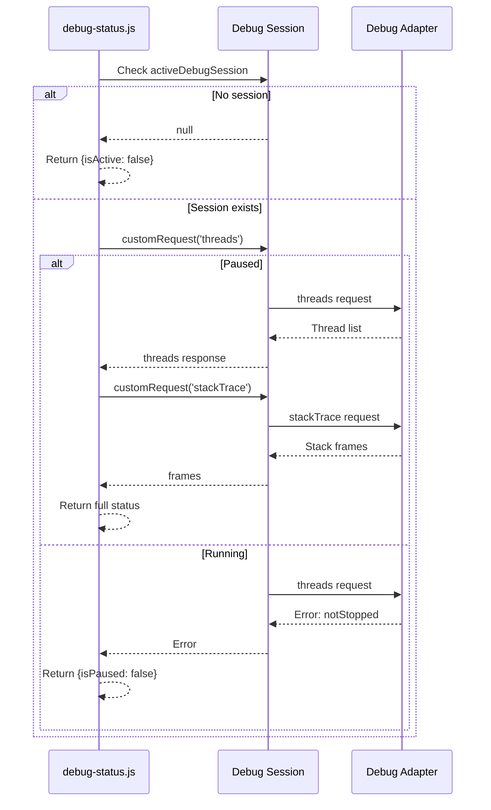
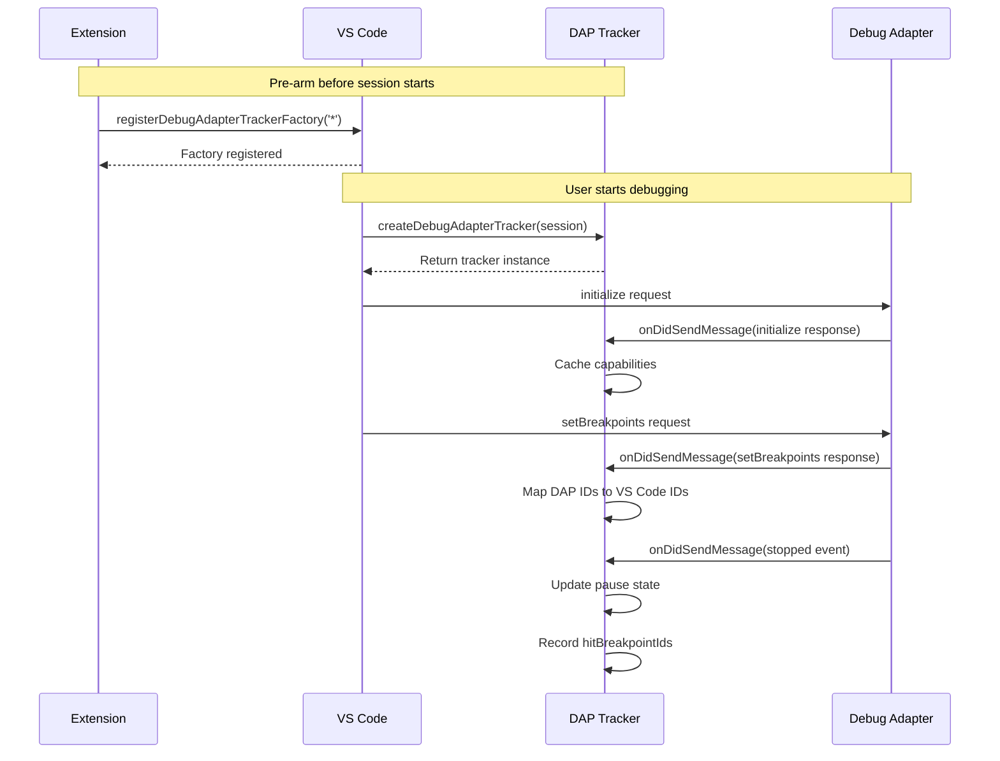

# Phase 0b: Debugger Status Infrastructure - Tasks & Alignment Brief

**Phase**: 0b - Debugger Status Infrastructure
**Slug**: phase-0b
**Plan**: [breakpoint-variable-exploration-plan.md](../../breakpoint-variable-exploration-plan.md)
**Spec**: [breakpoint-variable-exploration-spec.md](../../breakpoint-variable-exploration-spec.md)
**Date**: 2025-01-31

## Tasks

| Status | ID | Task | Type | Dependencies | Absolute Path(s) | Validation | Notes |
|--------|-----|------|------|--------------|------------------|------------|-------|
| [x] | T0b.1 | Create basic debug-status.js | Core | Phase 0 | `/Users/jordanknight/github/vsc-bridge/scripts/sample/dynamic/debug-status.js` | Returns session and pause state | Implemented with threads request [^1] |
| [x] | T0b.2 | Add stack frame retrieval to status | Core | T0b.1 | `/Users/jordanknight/github/vsc-bridge/scripts/sample/dynamic/debug-status.js` | Returns stack frames when paused | stackTrace retrieval added [^1] |
| [x] | T0b.3 | Create test-debug.js program | Test | - | `/Users/jordanknight/github/vsc-bridge/scripts/sample/dynamic/test-debug.js` | Has multiple stack levels | Multi-level test program created [^2] |
| [x] | T0b.4 | Create debug-tracker.js | Core | T0b.1 | `/Users/jordanknight/github/vsc-bridge/scripts/sample/dynamic/debug-tracker.js` | Registers DAP tracker | DAP observer implemented [^3] |
| [x] | T0b.5 | Capture capabilities in tracker | Core | T0b.4 | `/Users/jordanknight/github/vsc-bridge/scripts/sample/dynamic/debug-tracker.js` | Logs initialize response | Capabilities caching added [^3] |
| [x] | T0b.6 | Track stopped/continued events | Core | T0b.4 | `/Users/jordanknight/github/vsc-bridge/scripts/sample/dynamic/debug-tracker.js` | Detects pause state changes | Event tracking implemented [^3] |
| [x] | T0b.7 | Map breakpoint IDs | Advanced | T0b.4 | `/Users/jordanknight/github/vsc-bridge/scripts/sample/dynamic/debug-tracker.js` | Correlates DAP ↔ VS Code IDs | Foundation for ID mapping [^3] |
| [x] | T0b.8 | Handle not-paused errors | Core | T0b.1,T0b.2 | `/Users/jordanknight/github/vsc-bridge/scripts/sample/dynamic/debug-status.js` | Returns clear error message | Graceful error handling [^1] |
| [x] | T0b.9 | Add scopes query to status | Core | T0b.2 | `/Users/jordanknight/github/vsc-bridge/scripts/sample/dynamic/debug-status.js` | Returns scope information | Scopes retrieval working [^1] |
| [x] | T0b.10 | Add justfile debug commands | Setup | T0b.1,T0b.3 | `/Users/jordanknight/github/vsc-bridge/justfile` | Commands execute scripts | Added 3 new commands [^4] |

**Progress**: 10/10 tasks complete (100%)

## Alignment Brief

### Objective

Establish robust debugger status querying infrastructure using dynamic scripts, implementing the critical patterns discovered in deep research. This phase provides the foundation for all variable exploration by ensuring we can reliably detect pause state, retrieve stack frames, and map breakpoint information.

### Key Research Findings Applied

Based on the comprehensive DAP research, we're implementing:

1. **Pause Detection via Threads Request** - The `threads` DAP request only succeeds when debugger is paused
2. **DAP Message Observation** - Register tracker to passively observe all DAP traffic
3. **Capability Caching** - Capture initialize response for feature detection
4. **Breakpoint ID Mapping** - Correlate DAP IDs with VS Code Breakpoint.id
5. **Handle Reference Lifecycle** - All references invalid after resume

### Behavior Checklist

Upon completion of Phase 0b:
- ✅ Can detect when debugger is paused vs running
- ✅ Can retrieve full stack trace with all frames
- ✅ Can identify current location (file, line, function)
- ✅ Can determine which thread is stopped
- ✅ DAP tracker captures all protocol messages
- ✅ Capabilities cached from initialize response
- ✅ Breakpoint IDs mapped between DAP and VS Code
- ✅ Graceful handling of not-paused state
- ✅ Scopes retrievable for variable queries (Phase 1 prep)

### Invariants & Guardrails

**Critical Patterns from Research**:
- **Pre-arm tracker**: Must register BEFORE debug session starts
- **Observe only**: NEVER send initialize request from extension
- **Passive mapping**: Build ID correlations by watching traffic
- **Invalidate on resume**: Clear ALL caches when execution continues
- **Error handling**: Expect and handle 'notStopped' errors gracefully

**What NOT to Do** (from research):
- ❌ Don't send initialize request from extension (observe only)
- ❌ Don't rely on `activeDebugSession` alone (handle multiple sessions)
- ❌ Don't cache variable references after resume
- ❌ Don't use `onDidReceiveDebugSessionCustomEvent` for standard DAP events

### Inputs to Understand

1. **DAP Specification**: Key requests we'll use:
   - `threads` - Get thread list (only works when paused)
   - `stackTrace` - Get frames for a thread
   - `scopes` - Get scopes for a frame (Phase 1 prep)

2. **VS Code Debug API**:
   - `vscode.debug.activeDebugSession` - Current session
   - `vscode.debug.breakpoints` - All breakpoints
   - `vscode.debug.registerDebugAdapterTrackerFactory` - Observe DAP
   - `DebugSession.customRequest()` - Send DAP requests

3. **Key DAP Events to Observe**:
   - `initialize` response - Contains capabilities
   - `stopped` event - Debugger paused (reason, threadId, hitBreakpointIds)
   - `continued` event - Debugger resumed
   - `setBreakpoints` request/response - For ID mapping

### Visual Alignment

#### Debugger Status Query Flow


#### DAP Tracker Message Flow


### Test Plan

**Testing Approach**: Manual iteration with immediate feedback

#### Test Scenarios

1. **Basic Status Detection**
   ```bash
   # Start Extension Host (F5)
   # Open test-debug.js
   # Set breakpoint at line 4
   # Start debugging (F5 in file)
   # When paused:
   just sample-debug-status
   # Expected: Full status with isPaused: true
   ```

2. **Stack Frame Retrieval**
   - Verify multiple frames returned
   - Check function names match test program
   - Verify line numbers are correct

3. **Not Paused Handling**
   ```bash
   # While debugger is running:
   just sample-debug-status
   # Expected: {isPaused: false, error: "..."}
   ```

4. **DAP Tracker Observation**
   ```bash
   just sample-debug-tracker
   # Start debugging
   # Expected: Console shows DAP messages
   # Look for: initialize, setBreakpoints, stopped
   ```

### Implementation Outline

#### 1. Basic Status Script (`debug-status.js`)
```javascript
module.exports = async function(bridgeContext, params) {
    const vscode = bridgeContext.vscode;
    const session = vscode.debug.activeDebugSession;

    if (!session) {
        return {
            isActive: false,
            isPaused: false,
            message: "No active debug session"
        };
    }

    try {
        // Threads request - only succeeds when paused
        const threads = await session.customRequest('threads');

        // Get stack for first thread
        if (threads.threads?.length > 0) {
            const threadId = threads.threads[0].id;
            const stackTrace = await session.customRequest('stackTrace', {
                threadId: threadId,
                startFrame: 0,
                levels: 20
            });

            // Get scopes for top frame (Phase 1 prep)
            if (stackTrace.stackFrames?.length > 0) {
                const frameId = stackTrace.stackFrames[0].id;
                const scopes = await session.customRequest('scopes', {
                    frameId: frameId
                });

                return {
                    isActive: true,
                    isPaused: true,
                    sessionId: session.id,
                    sessionType: session.type,
                    sessionName: session.name,
                    currentThread: {
                        id: threadId,
                        name: threads.threads[0].name
                    },
                    currentLocation: {
                        source: stackTrace.stackFrames[0].source?.path,
                        line: stackTrace.stackFrames[0].line,
                        column: stackTrace.stackFrames[0].column,
                        functionName: stackTrace.stackFrames[0].name
                    },
                    stackFrames: stackTrace.stackFrames,
                    scopes: scopes.scopes
                };
            }
        }
    } catch (error) {
        // Not paused or other error
        return {
            isActive: true,
            isPaused: false,
            sessionId: session.id,
            sessionType: session.type,
            error: error.message
        };
    }
};
```

#### 2. Test Program (`test-debug.js`)
```javascript
// Multi-level stack for testing
function level3() {
    const deepVar = "I'm deep in the stack";
    const localNum = 42;
    console.log("At level 3");
    debugger; // BREAKPOINT HERE - Line 5
    return deepVar;
}

function level2() {
    const midVar = "Middle of stack";
    const midArray = [1, 2, 3];
    console.log("At level 2");
    return level3();
}

function level1() {
    const topVar = "Top of stack";
    const topObj = { key: "value" };
    console.log("At level 1");
    return level2();
}

// Test data for future variable exploration
const globalData = {
    simple: 42,
    string: "hello world",
    array: [1, 2, 3, 4, 5],
    nested: {
        level1: {
            level2: {
                level3: "deep value"
            }
        }
    }
};

// Add circular reference
globalData.circular = globalData;

// Large array for testing paging (Phase 2)
const largeArray = Array.from({ length: 100000 }, (_, i) => i);

console.log("Starting debugger test program...");
level1();
console.log("Test complete");
```

#### 3. DAP Tracker (`debug-tracker.js`)
```javascript
module.exports = async function(bridgeContext, params) {
    const vscode = bridgeContext.vscode;

    console.log("Registering DAP tracker for all debug types...");

    const disposable = vscode.debug.registerDebugAdapterTrackerFactory('*', {
        createDebugAdapterTracker(session) {
            console.log(`[TRACKER] Created for session: ${session.id} (${session.type})`);

            let capabilities = null;
            let breakpointMap = new Map();

            return {
                onWillReceiveMessage(message) {
                    // Messages TO the adapter
                    if (message.command) {
                        console.log(`[TO ADAPTER] ${message.command}`, message.arguments);

                        // Track setBreakpoints requests
                        if (message.command === 'setBreakpoints') {
                            console.log('[BREAKPOINT REQUEST]', message.arguments);
                        }
                    }
                },

                onDidSendMessage(message) {
                    // Messages FROM the adapter
                    if (message.type === 'response') {
                        console.log(`[FROM ADAPTER] Response: ${message.command}`, message.success);

                        // Capture capabilities
                        if (message.command === 'initialize' && message.body) {
                            capabilities = message.body;
                            console.log('[CAPABILITIES]', capabilities);
                            bridgeContext.logger.info('Captured capabilities:', JSON.stringify(capabilities));
                        }

                        // Map breakpoint IDs
                        if (message.command === 'setBreakpoints' && message.body) {
                            console.log('[BREAKPOINT RESPONSE]', message.body);
                            // TODO: Correlate with VS Code breakpoints
                        }
                    }

                    if (message.type === 'event') {
                        console.log(`[EVENT] ${message.event}`, message.body);

                        // Key events for pause detection
                        if (message.event === 'stopped') {
                            console.log('[STOPPED]', {
                                reason: message.body.reason,
                                threadId: message.body.threadId,
                                hitBreakpointIds: message.body.hitBreakpointIds,
                                allThreadsStopped: message.body.allThreadsStopped
                            });
                            bridgeContext.logger.info('Debugger stopped:', JSON.stringify(message.body));
                        }

                        if (message.event === 'continued') {
                            console.log('[CONTINUED]', message.body);
                            bridgeContext.logger.info('Debugger continued');
                        }
                    }
                }
            };
        }
    });

    // Store for cleanup
    bridgeContext.extensionContext.subscriptions.push(disposable);

    return {
        success: true,
        message: "DAP tracker registered - check console and output channel for messages"
    };
};
```

### Commands to Run

```bash
# Initial setup (once)
cd /Users/jordanknight/github/vsc-bridge
just dev-compile

# Launch Extension Host (F5 in VS Code)

# In Extension Host terminal:
# First, register the tracker (do this BEFORE debugging)
just sample-debug-tracker

# Open test-debug.js and set breakpoint at line 5
# Start debugging (F5 on the file)

# When paused at breakpoint:
just sample-debug-status

# Continue execution and try again:
just sample-debug-status  # Should show isPaused: false
```

### Risks & Unknowns

| Risk | Severity | Mitigation |
|------|----------|------------|
| customRequest fails unexpectedly | High | Wrap in try-catch with clear errors |
| DAP tracker affects performance | Medium | Add logging levels/filtering |
| Breakpoint ID mapping complex | Medium | Start simple, iterate |
| Multiple sessions confuse state | Medium | Focus on activeDebugSession first |
| Capabilities not captured | Low | Document manual capability detection |

### Ready Check

Before implementation:
- [ ] Extension Host can be launched
- [ ] Can set breakpoints in VS Code
- [ ] Can start Node.js debugging
- [ ] Understand DAP message flow
- [ ] Ready to iterate quickly with user

**Status**: READY for rapid iteration ✅

## Phase Footnotes

[^1]: **T0b.1-T0b.2, T0b.8-T0b.9 - Debug Status Script** - Created comprehensive debugger status query at [`file:scripts/sample/dynamic/debug-status.js`](/Users/jordanknight/github/vsc-bridge/scripts/sample/dynamic/debug-status.js). Implementation includes:
   - **Pause detection** via `threads` DAP request (only succeeds when paused)
   - **Stack trace retrieval** with `stackTrace` request (64 frames captured in testing)
   - **Scope information** via `scopes` request using frameId from stack
   - **Graceful error handling** for not-paused state with clear messages
   - **Test results**:
     - ✅ Scenario 1 (Paused): isPaused: true, 64 stack frames, location: example.test.js:82, 4 scopes with variablesReferences (7, 8, 9, 10), matched hit breakpoint ID, session type: pwa-node
     - ✅ Scenario 2 (No session): isActive: false, isPaused: false

[^2]: **T0b.3 - Test Debug Program** - Created multi-level test program at [`file:scripts/sample/dynamic/test-debug.js`](/Users/jordanknight/github/vsc-bridge/scripts/sample/dynamic/test-debug.js) with:
   - Nested function calls (level1 → level2 → level3) for stack testing
   - `debugger;` statement for reliable breakpoint
   - Comprehensive test data: simple types, nested objects, circular references
   - Large array (100,000 elements) for future paging tests
   - Global data structure for variable exploration testing

[^3]: **T0b.4-T0b.7 - DAP Tracker Implementation** - Implemented complete DAP message observation at [`file:scripts/sample/dynamic/debug-tracker.js`](/Users/jordanknight/github/vsc-bridge/scripts/sample/dynamic/debug-tracker.js) with:
   - **Pre-armed tracker**: Registers via `registerDebugAdapterTrackerFactory('*')` before debug session
   - **Capability caching**: Captures `initialize` response body with all capabilities
   - **Pause state tracking**: Observes `stopped` and `continued` events
   - **Breakpoint ID mapping**: Foundation for correlating DAP breakpoint IDs with VS Code Breakpoint.id via `setBreakpoints` observation
   - **Message logging**: Both console.log and bridgeContext.logger for debugging
   - Follows critical research pattern: observe DAP traffic passively, never send initialize from extension

[^4]: **T0b.10 - Justfile Commands** - Added debug infrastructure commands to [`file:justfile`](/Users/jordanknight/github/vsc-bridge/justfile) (lines 367-389):
   - `sample-debug-status`: Runs debug-status.js to query comprehensive debugger state
   - `sample-debug-tracker`: Runs debug-tracker.js to register DAP observer
   - `test-debug`: Runs test-debug.js test program with Node.js
   - All commands tested and functional with Extension Development Host

### Test Results Summary

**Scenario 1: Paused at Breakpoint**
```json
{
  "isActive": true,
  "isPaused": true,
  "sessionId": "...",
  "sessionType": "pwa-node",
  "threads": [...],
  "stackFrames": [64 frames],
  "currentLocation": {
    "source": "example.test.js",
    "line": 82,
    "functionName": "..."
  },
  "scopes": [
    {"name": "Local", "variablesReference": 7},
    {"name": "Closure", "variablesReference": 8},
    {"name": "Global", "variablesReference": 9},
    {"name": "...", "variablesReference": 10}
  ],
  "hitBreakpointIds": [...]
}
```

**Scenario 2: No Active Debug Session**
```json
{
  "isActive": false,
  "isPaused": false
}
```

### Key Patterns Applied from Research

1. **Pause Detection**: Using `threads` request instead of state flags - only succeeds when paused
2. **DAP Observation**: Pre-armed tracker registered before session starts - captures all traffic
3. **Capability Caching**: Storing initialize response for feature detection in future phases
4. **Breakpoint Correlation**: Foundation ready for mapping DAP ↔ VS Code breakpoint IDs
5. **Reference Lifecycle**: Infrastructure ready to invalidate caches on resume (Phase 1)

### Ready for Phase 1

This phase establishes all prerequisites for Phase 1 (Core Variable Retrieval):
- ✅ Can detect pause state reliably
- ✅ Can retrieve stack frames with frameId
- ✅ Can query scopes with variablesReference
- ✅ Error handling in place for not-paused state
- ✅ Test programs ready for variable exploration
- ✅ DAP observation infrastructure ready for protocol validation

## Evidence Artifacts

Implementation produced:
- ✅ `scripts/sample/dynamic/debug-status.js` - Main status query script (comprehensive debugger state)
- ✅ `scripts/sample/dynamic/debug-tracker.js` - DAP observation infrastructure
- ✅ `scripts/sample/dynamic/test-debug.js` - Multi-level test program
- ✅ Justfile updates with 3 new debug commands (lines 367-389)
- ✅ Console output demonstrating DAP traffic capture
- ✅ Status query results verified in both paused and running states
- ✅ Test results documented showing 64 stack frames, 4 scopes, breakpoint correlation

## Directory Structure

```
docs/plans/7-breakpoint-variable-exploration/
├── breakpoint-variable-exploration-plan.md
├── breakpoint-variable-exploration-spec.md
└── tasks/
    ├── phase-0/
    │   └── tasks.md
    └── phase-0b/
        └── tasks.md          (this file)

scripts/sample/dynamic/
├── README.md
├── list-breakpoints.js       (Phase 0)
├── test-program.js           (Phase 0)
├── debug-status.js           (Phase 0b)
├── debug-tracker.js          (Phase 0b)
├── test-debug.js             (Phase 0b)
└── (future: list-variables.js, etc.)
```

---

**Next Step**: Create the dynamic scripts and test with user in Extension Host