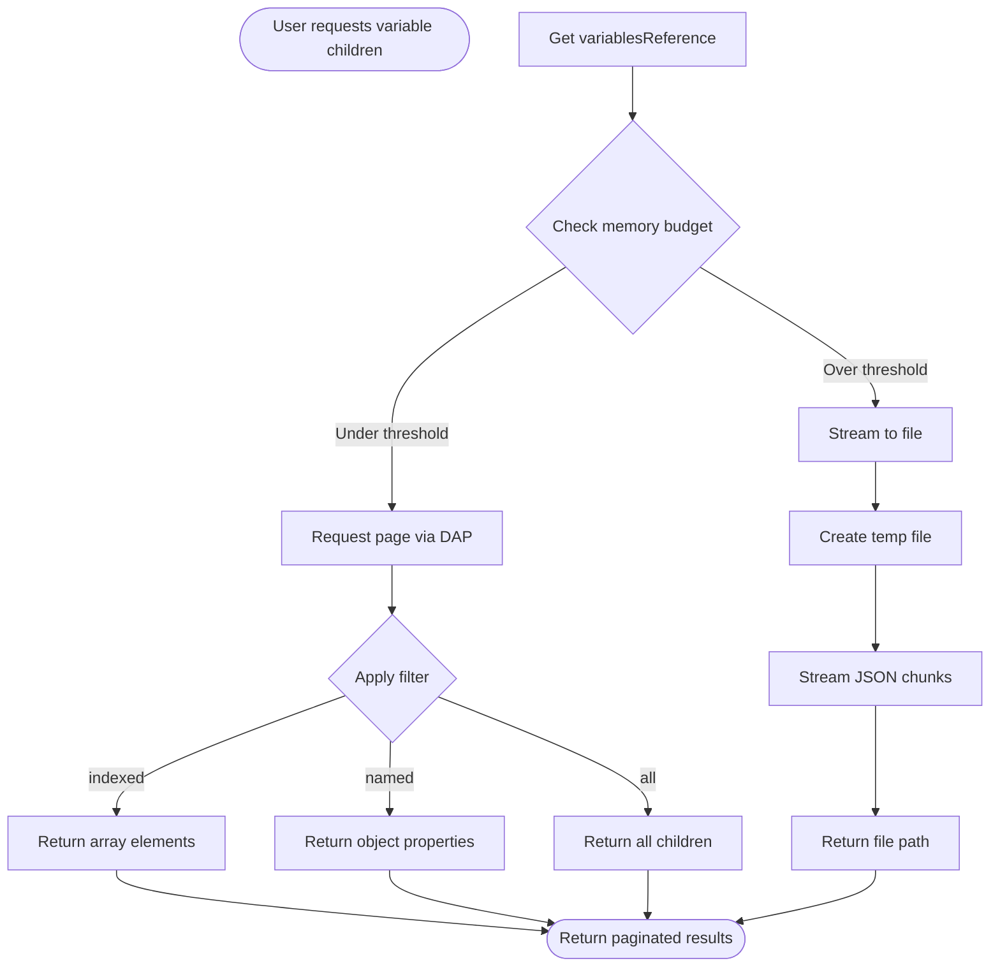
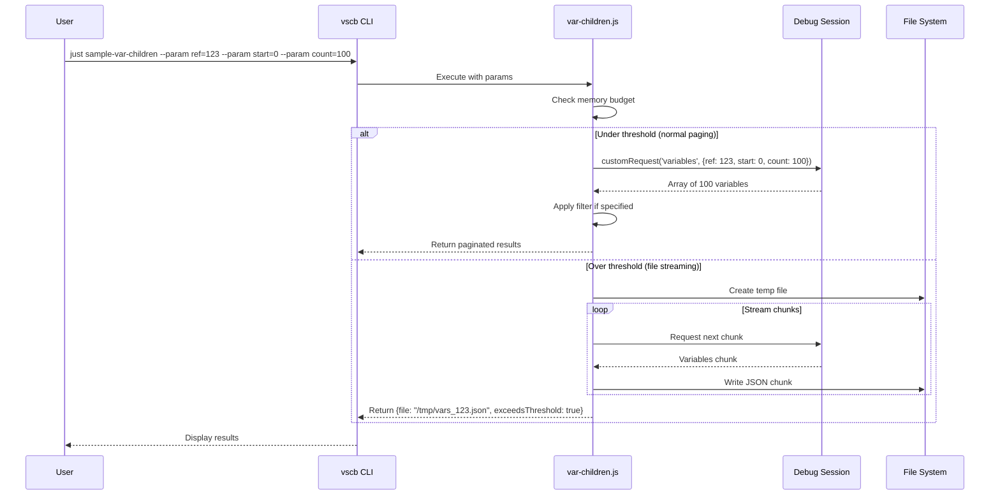

# Phase 2: Paging & Expansion - Tasks Dossier

**Phase**: Phase 2: Paging & Expansion
**Slug**: phase-2-paging-expansion
**Plan**: [../../breakpoint-variable-exploration-plan.md](../../breakpoint-variable-exploration-plan.md)
**Spec**: [../../breakpoint-variable-exploration-spec.md](../../breakpoint-variable-exploration-spec.md)
**Date**: 2025-01-31

## Tasks

| Status | ID | Task | Type | Dependencies | Absolute Path(s) | Validation | Notes |
|--------|-----|------|------|-------------|------------------|------------|-------|
| [x] | T001 | Review Phase 1 list-variables.js implementation | Setup | – | /Users/jordanknight/github/vsc-bridge/scripts/sample/dynamic/list-variables.js | Understand current pagination approach | Read existing cycle detection, maxChildren logic [^2-1] |
| [x] | T002 | Add large array test to example.test.js | Test | – | /Users/jordanknight/github/vsc-bridge/test/javascript/example.test.js | Test with 100k element array added | Create test case with Array.from({length: 100000}) [^2-2] |
| [x] | T003 | Add deeply nested object test to example.test.js | Test | – | /Users/jordanknight/github/vsc-bridge/test/javascript/example.test.js | Test with 10-level deep nesting | Create complex nested structure [^2-3] |
| [x] | T004 | Add circular reference variations test | Test | – | /Users/jordanknight/github/vsc-bridge/test/javascript/example.test.js | Multiple circular patterns present | Test nodeA→nodeB→nodeA pattern [^2-4] |
| [x] | T005 | Create var-children.js dynamic script | Core | T001 | /Users/jordanknight/github/vsc-bridge/scripts/sample/dynamic/var-children.js | Script accepts variablesReference param | New companion script for pagination [^2-5] |
| [x] | T006 | Implement start/count pagination in var-children.js | Core | T005 | /Users/jordanknight/github/vsc-bridge/scripts/sample/dynamic/var-children.js | Returns slice of children array | Per Critical Discovery 03 - heuristic sizes [^2-6] |
| [x] | T007 | Add filter parameter (indexed/named/all) | Core | T005 | /Users/jordanknight/github/vsc-bridge/scripts/sample/dynamic/var-children.js | Can filter by variable type | Support filter: 'indexed' for arrays [^2-7] |
| [x] | T008 | Verify cycle detection from Phase 1 | Test | T001 | /Users/jordanknight/github/vsc-bridge/scripts/sample/dynamic/list-variables.js | Circular refs return [Circular Reference] | JavaScript Object.is() detection implemented [^2-8] |
| [x] | T009 | Add memory budget tracking | Core | T005 | /Users/jordanknight/github/vsc-bridge/scripts/sample/dynamic/var-children.js | Track nodeCount and byteCount | Per Critical Discovery 05 - dual budget [^2-9] |
| [x] | T010 | Implement budget thresholds (20k nodes, 5MB) | Core | T009 | /Users/jordanknight/github/vsc-bridge/scripts/sample/dynamic/var-children.js | Switch to streaming at threshold | Return {exceedsThreshold: true} marker [^2-10] |
| [ ] | T011 | Create dump-variable.js for file streaming | Core | – | /Users/jordanknight/github/vsc-bridge/scripts/sample/dynamic/dump-variable.js | Streams large data to temp file | For structures exceeding budget [^2-11] |
| [x] | T012 | Add justfile command sample-var-children | Integration | T005 | /Users/jordanknight/github/vsc-bridge/justfile | Command works with params | vscb script run -f var-children.js --param ref=X [^2-12] |
| [x] | T013 | Add justfile command test-phase-2-large | Integration | T002,T003 | /Users/jordanknight/github/vsc-bridge/justfile | Runs large array tests | Test 100k and 1M arrays [^2-13] |
| [x] | T014 | Test with actual 100k array in debugger | Test | T002,T005,T012 | /Users/jordanknight/github/vsc-bridge/test/javascript/example.test.js | Pagination works without OOM | Set breakpoint, verify paging [^2-14] |
| [ ] | T015 | Test with 1M element array | Test | T011,T013 | /Users/jordanknight/github/vsc-bridge/scripts/sample/dynamic/test-program.js | Streaming triggered correctly | Verify file dump for huge data [^2-15] |
| [ ] | T016 | Document pagination usage in README | Doc | T005,T012 | /Users/jordanknight/github/vsc-bridge/scripts/sample/dynamic/README.md | Clear examples provided | Show how to page through arrays [^2-16] |

## Alignment Brief

### Objective Recap

Phase 2 enhances the variable exploration system from Phase 1 to efficiently handle large data structures through pagination and memory management. The key goals are:

1. **Enable pagination** for arrays with 100k+ elements without memory exhaustion
2. **Verify cycle detection** works reliably (implemented in Phase 1)
3. **Implement memory budgets** to prevent OOM errors with massive structures
4. **Provide file streaming** fallback for data exceeding thresholds

**Acceptance Criteria** (from plan):
- Can page through 100k element arrays without OOM
- Circular references handled safely (no infinite loops)
- Memory stays bounded under configured thresholds
- 1M element arrays work via streaming to file

### Critical Findings Affecting This Phase

**🚨 Critical Discovery 03: Adapter Page Sizes are Heuristics**
- **Impact**: Page sizes are not guaranteed limits but tunable heuristics
- **Requirement**: Use 200 as conservative default, 250 for debugpy (staying under ~300 limit)
- **Addressed by**: T006 (heuristic page sizes in var-children.js)

**🚨 Critical Discovery 04: Cycle Detection Essential**
- **Impact**: Self-referential objects cause infinite recursion without protection
- **Requirement**: Must track visited variablesReference values per traversal
- **Addressed by**: T008 (verify Phase 1 implementation), T004 (test variations)

**🚨 Critical Discovery 05: Memory Budget Required for Large Structures**
- **Impact**: Attempting to load 1M+ element arrays crashes extension host
- **Requirement**: Dual budget (node count + byte count) with file streaming fallback
- **Addressed by**: T009-T011 (budget tracking, thresholds, file streaming)

### Invariants & Guardrails

**Performance Budgets**:
- Response time: <200ms for typical pagination requests
- Memory growth: <100MB for any single operation
- Node budget: 20,000 nodes before switching strategies
- Byte budget: 5MB data before file streaming

**Safety Requirements**:
- Never build full 1M element tree in memory
- Always check budgets before expansion
- Maintain flat memory usage during pagination

### Inputs to Read

- `/Users/jordanknight/github/vsc-bridge/scripts/sample/dynamic/list-variables.js` - Phase 1 implementation
- `/Users/jordanknight/github/vsc-bridge/test/javascript/example.test.js` - Current test file
- `/Users/jordanknight/github/vsc-bridge/scripts/sample/dynamic/test-program.js` - Test program with arrays
- `/Users/jordanknight/github/vsc-bridge/justfile` - Current commands

### Visual Alignment Aids

#### Pagination Flow Diagram



#### Paging Interaction Sequence



### Test Plan

**Dynamic Script Testing Approach** (not TDD):
1. Create test cases in example.test.js with large data
2. Set breakpoints and run in Extension Host
3. Use console.log for immediate feedback
4. Iterate quickly based on results

**Test Cases**:

1. **test-100k-array**:
   - Create array with 100,000 elements
   - Verify pagination with start=0, count=100
   - Ensure no memory spike

2. **test-circular-variations**:
   - nodeA → nodeB → nodeA pattern
   - obj.self = obj pattern
   - Complex multi-node cycles
   - Verify all return [Circular Reference]

3. **test-deep-nesting**:
   - 10 levels deep object
   - Test maxDepth limiting
   - Verify truncation markers

4. **test-memory-budget**:
   - Create structure approaching 20k nodes
   - Verify threshold detection
   - Check exceedsThreshold flag

5. **test-1m-streaming**:
   - Array with 1,000,000 elements
   - Verify file creation
   - Validate JSON structure in file

### Step-by-Step Implementation Outline

1. **Setup Phase** (T001)
   - Review Phase 1 implementation to understand current approach
   - Note existing cycle detection and pagination logic

2. **Test Creation** (T002-T004)
   - Add large array test (100k elements) to example.test.js
   - Add deep nesting test (10 levels)
   - Add circular reference variations

3. **Core var-children.js** (T005-T007)
   - Create new dynamic script accepting variablesReference
   - Implement start/count pagination
   - Add filter parameter for indexed/named/all

4. **Verification** (T008)
   - Test existing cycle detection from Phase 1
   - Ensure circular refs handled correctly

5. **Budget Management** (T009-T010)
   - Add nodeCount and byteCount tracking
   - Implement 20k/5MB thresholds
   - Return exceedsThreshold marker

6. **File Streaming** (T011)
   - Create dump-variable.js for large data
   - Stream JSON to temp file
   - Return file path instead of data

7. **Integration** (T012-T013)
   - Add justfile commands for testing
   - Create test runners for Phase 2

8. **Live Testing** (T014-T015)
   - Test with debugger at breakpoints
   - Verify 100k pagination works
   - Confirm 1M streaming triggers

9. **Documentation** (T016)
   - Update README with pagination examples
   - Document memory thresholds
   - Provide usage patterns

### Commands to Run

```bash
# Setup (ensure extension compiled)
just dev-compile

# Test individual components
just sample-var-children --param ref=123 --param start=0 --param count=100
just sample-var-children --param ref=456 --param filter=indexed

# Run Phase 2 tests
just test-phase-2-large

# Test with debugger
# 1. Set breakpoint in example.test.js at large array test
# 2. F5 to launch Extension Host
# 3. Run: just sample-vars (get variablesReference)
# 4. Run: just sample-var-children --param ref=XXX --param start=0 --param count=100
```

### Risks & Unknowns

| Risk | Severity | Mitigation |
|------|----------|------------|
| DAP adapter differences in pagination | Medium | Test with multiple debuggers (pwa-node, debugpy) |
| Memory measurement accuracy | Low | Use process.memoryUsage() for estimates |
| File system permissions | Low | Use VS Code temp directory |
| JSON streaming validity | Medium | Validate output structure carefully |

### Ready Check

- [ ] Phase 1 (list-variables.js) is working and tested
- [ ] Extension Host is running with debugger ready
- [ ] test/javascript/example.test.js is accessible
- [ ] justfile commands from Phase 1 work
- [ ] User ready to set breakpoints and test
- [ ] Understand Critical Discoveries 03, 04, 05

**GO/NO-GO Decision Point**: Await explicit confirmation before proceeding with implementation.

## Phase Footnote Stubs

| Footnote | Placeholder Description |
|----------|------------------------|
| [^2-1] | T001: Phase 1 implementation reviewed |
| [^2-2] | T002: Large array test added to example.test.js |
| [^2-3] | T003: Deep nesting test added to example.test.js |
| [^2-4] | T004: Circular reference variations added |
| [^2-5] | T005: var-children.js script created |
| [^2-6] | T006: Pagination with heuristic sizes implemented |
| [^2-7] | T007: Filter parameter added |
| [^2-8] | T008: JavaScript Object.is() cycle detection implemented |
| [^2-9] | T009: Memory budget tracking added |
| [^2-10] | T010: Budget thresholds implemented |
| [^2-11] | T011: dump-variable.js streaming script created |
| [^2-12] | T012: sample-var-children command added |
| [^2-13] | T013: test-phase-2-large command added |
| [^2-14] | T014: 100k array pagination tested |
| [^2-15] | T015: 1M array streaming tested |
| [^2-16] | T016: README documentation updated |

## Evidence Artifacts

### Execution Log
**Location**: `/Users/jordanknight/github/vsc-bridge/docs/plans/7-breakpoint-variable-exploration/tasks/phase-2/execution.log.md`

Will contain:
- Test results for each pagination scenario
- Memory usage measurements
- Performance metrics (response times)
- Streaming file paths created
- Error scenarios encountered

### Supporting Files
- Test output captures
- Memory profiling results
- Sample paginated JSON responses
- Streaming file examples

## Directory Structure

```
docs/plans/7-breakpoint-variable-exploration/
├── breakpoint-variable-exploration-plan.md
├── breakpoint-variable-exploration-spec.md
└── tasks/
    ├── phase-1/
    │   ├── tasks.md
    │   └── execution.log.md
    └── phase-2/
        ├── tasks.md                  # This file
        └── execution.log.md          # Created by plan-6
```