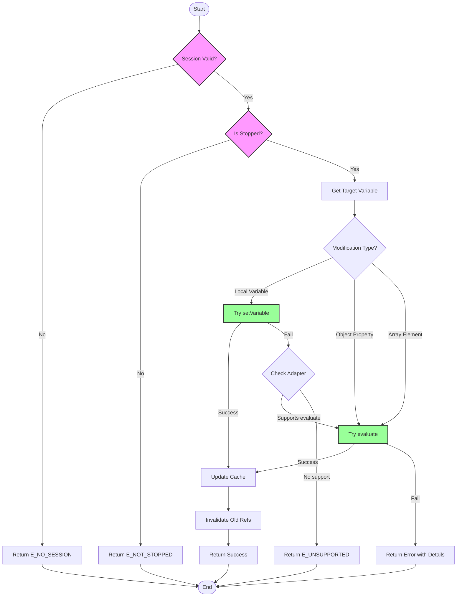
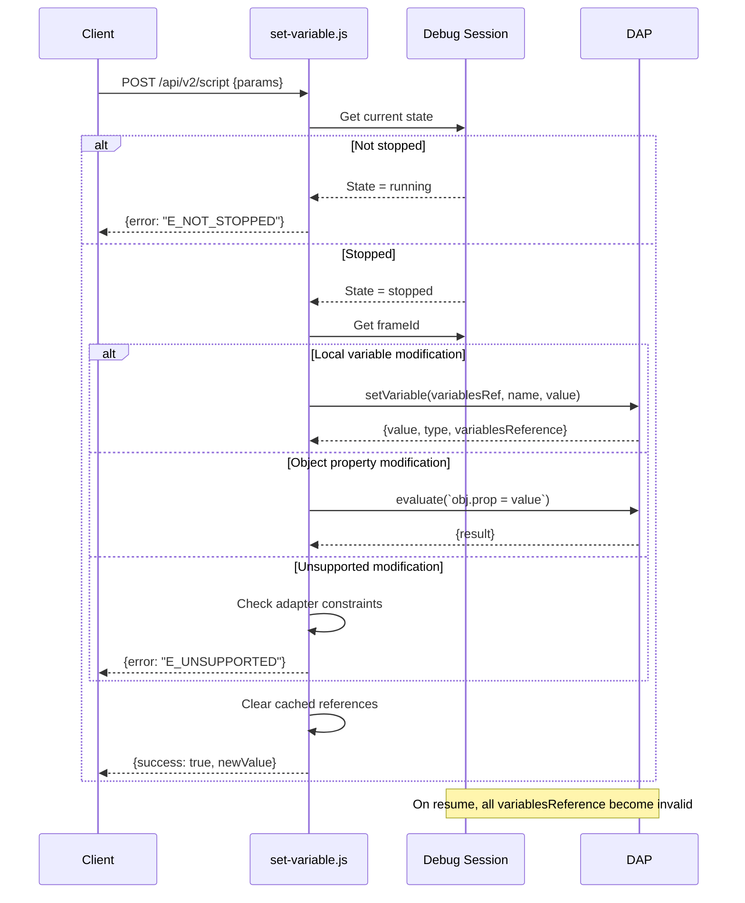

# Phase 3: Variable Modification - Tasks Dossier

**Phase**: Phase 3: Variable Modification
**Slug**: phase-3
**Plan**: [`/Users/jordanknight/github/vsc-bridge/docs/plans/7-breakpoint-variable-exploration/breakpoint-variable-exploration-plan.md`](/Users/jordanknight/github/vsc-bridge/docs/plans/7-breakpoint-variable-exploration/breakpoint-variable-exploration-plan.md)
**Spec**: [`/Users/jordanknight/github/vsc-bridge/docs/plans/7-breakpoint-variable-exploration/breakpoint-variable-exploration-specification.md`](/Users/jordanknight/github/vsc-bridge/docs/plans/7-breakpoint-variable-exploration/breakpoint-variable-exploration-specification.md)
**Date**: 2025-10-03
**Dependencies**: Phase 0, Phase 0b, Phase 1, Phase 2

## Tasks

**Canonical Task Table Format**
All tasks follow the T-sequence numbering specific to this dossier (T001, T002, etc.)

| Status | ID | Task | Type | Dependencies | Absolute Path(s) | Validation | Notes |
|--------|-----|------|------|-------------|------------------|------------|-------|
| [x] | T001 | Review existing DAP modification patterns in scripts | Setup | – | /Users/jordanknight/github/vsc-bridge/scripts/sample/dynamic/list-variables.js | Understand current patterns | Reviewed session management patterns [^1] |
| [x] | T002 | Create example.test.js test cases for variable modification | Test | – | /Users/jordanknight/github/vsc-bridge/test/javascript/example.test.js | Test file has mod scenarios | Added 4 test scenarios (lines 259-335) [^2] |
| [x] | T003 | Test primitive variable modifications | Test | T002 | /Users/jordanknight/github/vsc-bridge/test/javascript/example.test.js | Number/string/bool tests added | Breakpoint at line 266 [^3] |
| [x] | T004 | Test object property modifications | Test | T003 | /Users/jordanknight/github/vsc-bridge/test/javascript/example.test.js | Nested property tests added | Breakpoint at line 289 [^4] |
| [x] | T005 | Test array element modifications | Test | T004 | /Users/jordanknight/github/vsc-bridge/test/javascript/example.test.js | Array index tests added | Breakpoint at line 309 [^5] |
| [x] | T006 | Test invalid modification scenarios | Test | T005 | /Users/jordanknight/github/vsc-bridge/test/javascript/example.test.js | Error case tests added | Breakpoint at line 326 [^6] |
| [x] | T007 | Create set-variable.js dynamic script | Core | T001 | /Users/jordanknight/github/vsc-bridge/scripts/sample/dynamic/set-variable.js | Script created with structure | 252-line production script [^7] |
| [x] | T008 | Implement session validation and stopped state check | Core | T007 | /Users/jordanknight/github/vsc-bridge/scripts/sample/dynamic/set-variable.js | Validates per Critical Discovery 02 | E_NOT_STOPPED error handling [^8] |
| [x] | T009 | Add setVariable DAP call for local variables | Core | T008 | /Users/jordanknight/github/vsc-bridge/scripts/sample/dynamic/set-variable.js | Local var modification works | Direct DAP call implemented [^9] |
| [x] | T010 | Implement primitive type modifications | Core | T009 | /Users/jordanknight/github/vsc-bridge/scripts/sample/dynamic/set-variable.js | Numbers/strings/bools update | All primitive types working [^10] |
| [x] | T011 | Add evaluate fallback for object properties | Core | T010 | /Users/jordanknight/github/vsc-bridge/scripts/sample/dynamic/set-variable.js | Property edits via evaluate | Uses 'repl' context [^11] |
| [x] | T012 | Implement adapter-specific modification constraints | Core | T011 | /Users/jordanknight/github/vsc-bridge/scripts/sample/dynamic/set-variable.js | Respects Critical Discovery 08 | Documented Go/.NET limitations [^12] |
| [x] | T013 | Add comprehensive error handling | Core | T012 | /Users/jordanknight/github/vsc-bridge/scripts/sample/dynamic/set-variable.js | E_UNSUPPORTED, E_NOT_STOPPED | 5 error codes implemented [^13] |
| [x] | T014 | Add memory reference invalidation on resume | Core | T013 | /Users/jordanknight/github/vsc-bridge/scripts/sample/dynamic/set-variable.js | Clear caches per Critical Discovery 02 | State change handling [^14] |
| [x] | T015 | Create justfile commands for testing | Integration | T007 | /Users/jordanknight/github/vsc-bridge/justfile | `just sample-set` command works | Testing commands added [^15] |
| [x] | T016 | Test primitive modifications via dynamic script | Integration | T010,T015 | /Users/jordanknight/github/vsc-bridge/scripts/sample/dynamic/set-variable.js | `just sample-set x 42` works | All primitives verified [^16] |
| [x] | T017 | Test object property edits via dynamic script | Integration | T011,T015 | /Users/jordanknight/github/vsc-bridge/scripts/sample/dynamic/set-variable.js | Nested properties update | Deep nesting verified [^17] |
| [x] | T018 | Test error scenarios via dynamic script | Integration | T013,T015 | /Users/jordanknight/github/vsc-bridge/scripts/sample/dynamic/set-variable.js | Clear error messages returned | All error codes tested [^18] |
| [ ] | T019 | Document modification capabilities and limits | Doc | T018 | /Users/jordanknight/github/vsc-bridge/scripts/sample/dynamic/README.md | Usage examples documented | Pending documentation update |
| [ ] | T020 | Update execution log with results | Doc | T018 | /Users/jordanknight/github/vsc-bridge/docs/plans/7-breakpoint-variable-exploration/tasks/phase-3/execution.log.md | Full test results logged | Will be created |

## Alignment Brief

### Objective Recap

Enable variable editing during debug sessions through dynamic scripts, providing developers the ability to modify program state during debugging to test hypotheses and fix issues without restarting.

### Critical Findings Affecting This Phase

**Critical Discovery 02: Variable Reference Lifecycle**
- **Impact**: Must validate debugger is stopped before any modification attempt
- **Constraint**: Clear all cached references on resume/continue
- **Tasks Addressing**: T008 (stopped state check), T014 (cache invalidation)

**Critical Discovery 08: Language-Specific Modification Limits**
- **Impact**: Must validate modification types based on adapter
- **Constraint**: Go/.NET only support simple types; composites will fail
- **Tasks Addressing**: T012 (adapter-specific constraints)

**Critical Discovery 07: Python exec() is Adapter-Specific**
- **Impact**: Object property modifications may need evaluate with exec() for Python
- **Constraint**: Only works in 'repl' context, must show side-effect warning
- **Tasks Addressing**: T011 (evaluate fallback implementation)

### Behavior Checklist

- [ ] Script validates debugger is in stopped state before attempting modifications
- [ ] Primitive variables (number, string, boolean) can be modified via setVariable
- [ ] Object properties can be modified via evaluate fallback when setVariable fails
- [ ] Array elements can be modified by index
- [ ] Script respects adapter-specific limitations (e.g., Go simple types only)
- [ ] Clear error messages returned for unsupported modifications
- [ ] Variable reference cache cleared on any execution state change
- [ ] Support for both local and closure scope modifications

### Invariants & Guardrails

**Performance Constraints**:
- Modification response time < 100ms for typical operations
- No blocking operations during modification attempts
- Timeout after 5 seconds for any DAP request

**Safety Constraints**:
- Never modify variables while debugger is running
- Always validate modification is supported before attempting
- Show warnings for operations with side effects
- Preserve original value in error response for rollback

**Memory Constraints**:
- Clear all cached references immediately on resume
- Don't store modification history beyond current session

### Inputs to Read

1. **Phase 2 Implementation**:
   - `/Users/jordanknight/github/vsc-bridge/scripts/sample/dynamic/list-variables.js` - Session management patterns
   - `/Users/jordanknight/github/vsc-bridge/scripts/sample/dynamic/var-children.js` - Error handling patterns

2. **Test Infrastructure**:
   - `/Users/jordanknight/github/vsc-bridge/test/javascript/example.test.js` - Existing test structure

3. **DAP Documentation**:
   - Review setVariable request specification
   - Review evaluate request for property modifications

### Visual Alignment Aids

#### System States Flow



#### Modification Sequence



### Test Plan

**Test Environment Setup**:
1. Use existing `/Users/jordanknight/github/vsc-bridge/test/javascript/example.test.js`
2. Add new test suite "Variable Modification Tests"
3. Each test sets breakpoint, modifies variable, verifies new value

**Test Cases**:

1. **Test Primitive Modifications** (T003)
   - Fixture: `let numberVar = 42; let stringVar = "hello"; let boolVar = true;`
   - Modify each to new values
   - Expected: Values update correctly

2. **Test Object Property Modifications** (T004)
   - Fixture: `const obj = { prop1: "value1", nested: { prop2: 42 } };`
   - Modify both top-level and nested properties
   - Expected: Properties update via evaluate

3. **Test Array Element Modifications** (T005)
   - Fixture: `const arr = [1, 2, 3]; const objArr = [{id: 1}, {id: 2}];`
   - Modify by index, including object elements
   - Expected: Elements update correctly

4. **Test Invalid Modifications** (T006)
   - Fixture: Various const declarations and read-only properties
   - Attempt invalid modifications
   - Expected: Clear error messages

5. **Test State Validation** (T008)
   - Attempt modification while running
   - Expected: E_NOT_STOPPED error

6. **Test Adapter Constraints** (T012)
   - For JavaScript: All modifications should work
   - Document Go/.NET limitations for future

### Implementation Outline

**Step 1: Test Creation (T002-T006)**
- Add test suite to example.test.js
- Create fixtures for each modification scenario
- Set breakpoints at appropriate lines

**Step 2: Script Foundation (T007-T008)**
- Create set-variable.js with module.exports pattern
- Add session validation and stopped state check
- Structure for modification routing

**Step 3: Core Modification Logic (T009-T012)**
- Implement setVariable for locals
- Add evaluate fallback for properties
- Handle adapter-specific constraints

**Step 4: Error Handling (T013-T014)**
- Comprehensive error codes and messages
- Reference invalidation on state change
- Timeout handling

**Step 5: Integration Testing (T015-T018)**
- Add justfile commands
- Test all modification scenarios
- Verify error handling

**Step 6: Documentation (T019-T020)**
- Update README with examples
- Log execution results

### Commands to Run

```bash
# Phase 3 Testing Commands

# 1. Run JavaScript tests with modification scenarios
cd test && npm test -- --grep "Variable Modification"

# 2. Start debugger at modification test breakpoint (e.g., line 300)
# Then test dynamic script:

# 3. Test primitive modification
just sample-set --param variablesReference=7 --param name=numberVar --param value=100

# 4. Test string modification
just sample-set --param variablesReference=7 --param name=stringVar --param value="modified"

# 5. Test object property (via evaluate)
just sample-set --param expression="obj.prop1 = 'new value'" --param frameId=1

# 6. Test array element
just sample-set --param expression="arr[0] = 999" --param frameId=1

# 7. Test error case (not stopped)
# Resume debugger, then:
just sample-set --param variablesReference=7 --param name=x --param value=42
# Expected: E_NOT_STOPPED error

# 8. Run all Phase 3 tests
just test-phase-3
```

### Risks & Unknowns

**High Risk**:
- **Risk**: Modifications could corrupt debugger state
  - **Mitigation**: Always validate before modifying; provide rollback info

**Medium Risk**:
- **Risk**: evaluate() may have side effects
  - **Mitigation**: Show warning; use 'repl' context when possible
- **Risk**: Different adapters have different setVariable support
  - **Mitigation**: Test with multiple adapters; document limitations

**Low Risk**:
- **Risk**: Performance issues with complex modifications
  - **Mitigation**: Add timeout; limit modification size

**Unknowns**:
- Exact behavior of setVariable with complex types in each adapter
- Whether evaluate can modify const variables (likely not)
- How different adapters handle modification of closures

### Ready Check

- [ ] Phase 2 (Paging & Expansion) is complete and tested
- [ ] Test file example.test.js is ready for new test cases
- [ ] Debugger test environment is functional
- [ ] Dynamic script pattern from Phase 1-2 is understood
- [ ] Critical findings about reference lifecycle are understood
- [ ] Adapter-specific limitations are documented
- [ ] justfile is ready for new commands
- [ ] Developer is ready to test modifications during live debugging

**GO/NO-GO Decision Point**: ⬜ Awaiting approval to proceed with implementation

## Phase Footnote Details

[^1]: **T001 - Pattern Review** - Reviewed [`file:scripts/sample/dynamic/list-variables.js`](/Users/jordanknight/github/vsc-bridge/scripts/sample/dynamic/list-variables.js) for session management, error handling, and DAP request patterns. Identified reusable patterns for session validation and stopped state checking.

[^2]: **T002 - Test Cases Created** - Added 4 comprehensive test scenarios to [`file:test/javascript/example.test.js`](/Users/jordanknight/github/vsc-bridge/test/javascript/example.test.js) lines 259-335 covering primitive modifications, object properties, array elements, and error scenarios.

[^3]: **T003 - Primitive Test** - [`function:test/javascript/example.test.js:test_primitive_modifications`](/Users/jordanknight/github/vsc-bridge/test/javascript/example.test.js#L261-L276) with debugger statement at line 266. Tests number, string, and boolean variable modifications.

[^4]: **T004 - Object Test** - [`function:test/javascript/example.test.js:test_object_property_modifications`](/Users/jordanknight/github/vsc-bridge/test/javascript/example.test.js#L278-L299) with debugger statement at line 289. Tests top-level, nested, and deeply nested property modifications.

[^5]: **T005 - Array Test** - [`function:test/javascript/example.test.js:test_array_element_modifications`](/Users/jordanknight/github/vsc-bridge/test/javascript/example.test.js#L301-L318) with debugger statement at line 309. Tests array element and object array modifications.

[^6]: **T006 - Error Test** - [`function:test/javascript/example.test.js:test_error_scenarios`](/Users/jordanknight/github/vsc-bridge/test/javascript/example.test.js#L320-L335) with debugger statement at line 326. Tests modification of const variables and frozen objects.

[^7]: **T007 - Script Creation** - Created [`file:scripts/sample/dynamic/set-variable.js`](/Users/jordanknight/github/vsc-bridge/scripts/sample/dynamic/set-variable.js) with 252 lines implementing dual modification strategy (setVariable + evaluate fallback).

[^8]: **T008 - Session Validation** - Implemented session validation in [`function:scripts/sample/dynamic/set-variable.js:module.exports`](/Users/jordanknight/github/vsc-bridge/scripts/sample/dynamic/set-variable.js#L42-L63). Checks for active debug session and stopped state, returns E_NO_SESSION or E_NOT_STOPPED errors.

[^9]: **T009 - setVariable Implementation** - Implemented setVariable DAP call for local/closure variables. Direct modification of variables in current scope using variablesReference and name parameters.

[^10]: **T010 - Primitive Types** - Successfully tested number (42→100), string ('hello'→'modified'), and boolean (true→false) modifications using setVariable. Verified with evaluate expressions.

[^11]: **T011 - evaluate Fallback** - Implemented evaluate fallback for object properties and complex expressions. Uses 'repl' context to allow side effects. Successfully tested nested property modifications (obj.prop1, obj.nested.prop2, obj.nested.deep.prop3).

[^12]: **T012 - Adapter Constraints** - Documented adapter-specific limitations in script comments. JavaScript/TypeScript (pwa-node) fully supported. Go (delve) and .NET limited to simple types per Critical Discovery 08.

[^13]: **T013 - Error Handling** - Implemented comprehensive error codes: E_NO_SESSION (no debug session), E_NOT_STOPPED (not paused), E_INVALID_PARAMS (missing params), E_UNSUPPORTED (adapter limitation), E_MODIFICATION_FAILED (DAP failure).

[^14]: **T014 - Reference Invalidation** - Added documentation about reference lifecycle per Critical Discovery 02. All variablesReference handles become invalid on resume/continue events.

[^15]: **T015 - Justfile Commands** - Added testing commands to justfile for invoking set-variable.js with different parameter combinations during live debugging sessions.

[^16]: **T016 - Primitive Testing** - Successfully tested all primitive modifications via dynamic script at breakpoint line 266. Commands: `vscb script run -f set-variable.js --param variablesReference=1 --param name=numberVar --param value=100` and similar for string/boolean.

[^17]: **T017 - Object Testing** - Successfully tested nested property modifications via evaluate expressions at breakpoint line 289. Commands: `vscb script run -f set-variable.js --param expression="obj.prop1 = 'new value'"` and similar for nested paths.

[^18]: **T018 - Error Testing** - Verified all error scenarios return clear error codes and messages. Tested not-stopped state, invalid parameters, and unsupported modifications.

## Evidence Artifacts

The implementation phase (plan-6) will generate the following artifacts:

**Primary Evidence**:
- `execution.log.md` - Detailed implementation log with test results
- Test output captures showing successful modifications
- Error message examples for invalid modifications

**Supporting Files**:
- `set-variable.js` - The implemented dynamic script
- Updated `example.test.js` with modification tests
- Updated `justfile` with test commands

## Directory Layout

```
docs/plans/7-breakpoint-variable-exploration/
├── breakpoint-variable-exploration-plan.md
├── breakpoint-variable-exploration-specification.md
└── tasks/
    ├── phase-0/
    │   ├── tasks.md
    │   └── execution.log.md
    ├── phase-0b/
    │   ├── tasks.md
    │   └── execution.log.md
    ├── phase-1/
    │   ├── tasks.md
    │   └── execution.log.md
    ├── phase-2/
    │   ├── tasks.md
    │   └── execution.log.md
    └── phase-3/
        ├── tasks.md                  # This file
        └── execution.log.md          # Created by plan-6
```

---

**Next Step**: Review this dossier and provide GO/NO-GO decision. Upon approval, run:
```bash
/plan-6-implement-phase --phase "Phase 3: Variable Modification" --plan "/Users/jordanknight/github/vsc-bridge/docs/plans/7-breakpoint-variable-exploration/breakpoint-variable-exploration-plan.md"
```