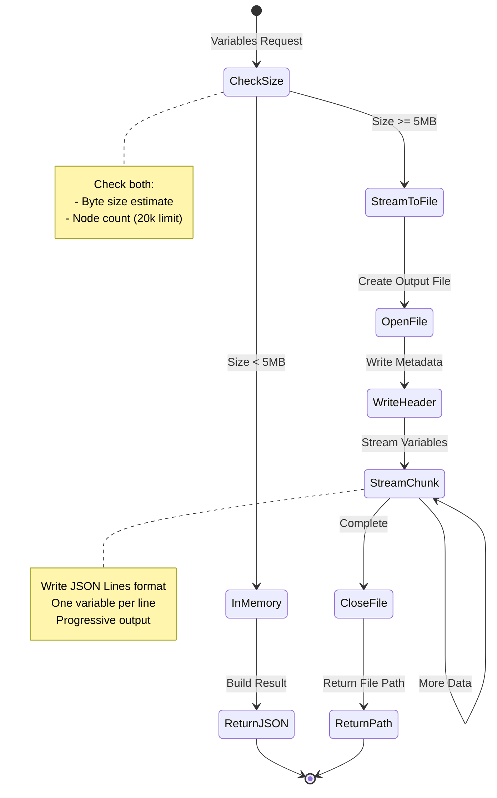
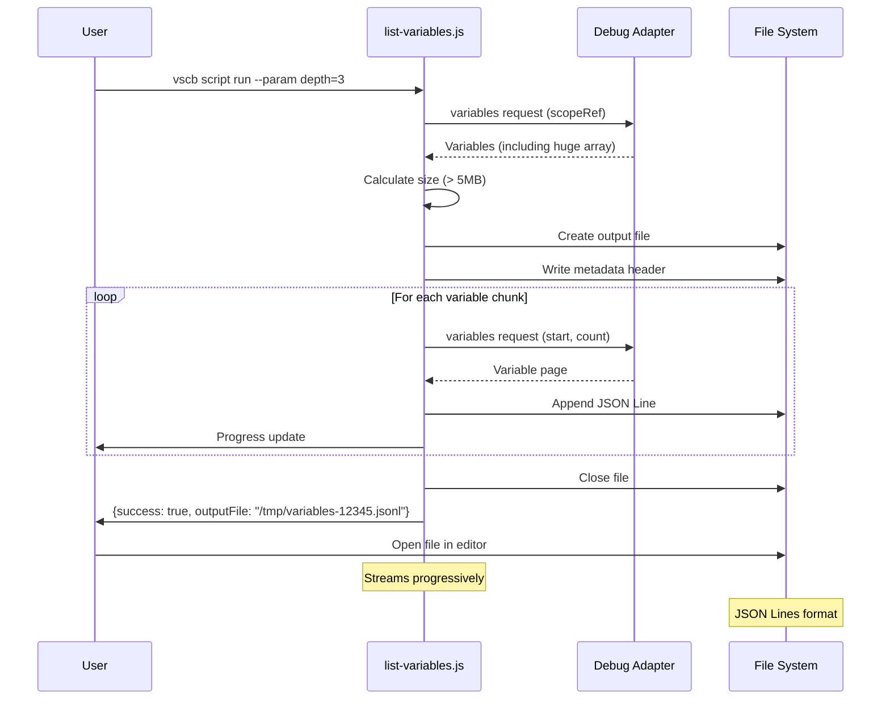
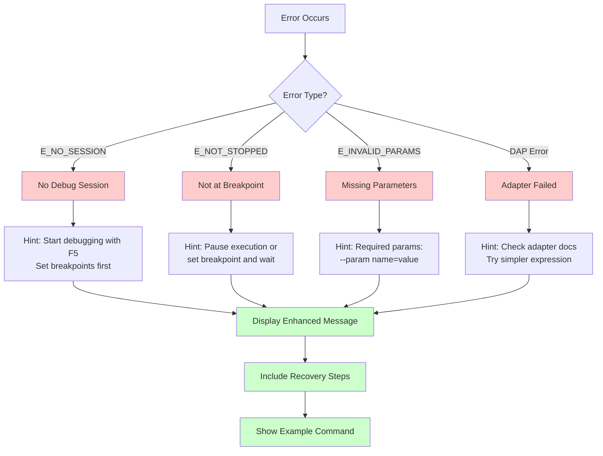

# Phase 4: Utilities & Refinement - Tasks Dossier

**Phase**: Phase 4: Utilities & Refinement
**Slug**: phase-4
**Plan**: `/Users/jordanknight/github/vsc-bridge/docs/plans/7-breakpoint-variable-exploration/breakpoint-variable-exploration-plan.md`
**Spec**: `/Users/jordanknight/github/vsc-bridge/docs/plans/7-breakpoint-variable-exploration/breakpoint-variable-exploration-spec.md`
**Generated**: 2025-10-03

## Executive Summary

Phase 4 focuses on production-ready refinements for the dynamic debug scripts, specifically:
1. **File Streaming** - Handle massive data structures (>10MB) without memory issues
2. **Enhanced Error UX** - User-friendly, actionable error messages with recovery hints

Since task 4.1 (shared utilities) is marked [SKIP] in the plan, we'll focus on these two critical enhancements that directly improve user experience.

## Tasks

| Status | ID | Task | Type | Dependencies | Absolute Path(s) | Validation | Notes |
|--------|-----|------|------|-------------|------------------|------------|-------|
| [SKIP] | T001 | Review existing scripts for memory usage patterns | Setup | – | /Users/jordanknight/github/vsc-bridge/scripts/sample/dynamic/list-variables.js, /Users/jordanknight/github/vsc-bridge/scripts/sample/dynamic/var-children.js | Memory hotspots identified | Document current thresholds |
| [SKIP] | T002 | Design file streaming API for large variables | Design | T001 | /Users/jordanknight/github/vsc-bridge/docs/plans/7-breakpoint-variable-exploration/tasks/phase-4 | API design documented | Consider JSON streaming |
| [SKIP] | T003 | Create test fixture with 10MB+ data structure | Test | – | /Users/jordanknight/github/vsc-bridge/scripts/sample/dynamic/test-large-data.js | Test program with huge arrays/objects | [P] eligible |
| [SKIP] | T004 | Write test for file streaming functionality | Test | T003 | /Users/jordanknight/github/vsc-bridge/test/javascript/file-streaming.test.js | Test fails initially (TDD) | Plan task 4.2 [^1] |
| [SKIP] | T005 | Implement file streaming in list-variables.js | Core | T002, T004 | /Users/jordanknight/github/vsc-bridge/scripts/sample/dynamic/list-variables.js | Streams to file when > threshold | Plan task 4.2 [^2] |
| [SKIP] | T006 | Add streaming support to var-children.js | Core | T005 | /Users/jordanknight/github/vsc-bridge/scripts/sample/dynamic/var-children.js | Paginated streaming works | Plan task 4.2 [^3] |
| [x] | T007 | Create stream-to-file utility function | Core | T002 | /Users/jordanknight/github/vsc-bridge/scripts/sample/dynamic/stream-variables.js | Standalone streaming script | Plan task 4.2 [^4][^4.1] |
| [ ] | T008 | Test streaming with 100k+ element arrays | Test | T005, T006 | /Users/jordanknight/github/vsc-bridge/scripts/sample/dynamic/test-large-data.js | No OOM, file created | Memory stays < 100MB |
| [ ] | T009 | Add file path configuration options | Core | T007 | /Users/jordanknight/github/vsc-bridge/scripts/sample/dynamic/stream-variables.js | Custom output path works | --param outputPath |
| [ ] | T010 | Implement JSON Lines format for streaming | Core | T007 | /Users/jordanknight/github/vsc-bridge/scripts/sample/dynamic/stream-variables.js | JSONL output for processing | One object per line |
| [ ] | T011 | Review all error messages in existing scripts | Setup | – | /Users/jordanknight/github/vsc-bridge/scripts/sample/dynamic/*.js | Error audit complete | Document all error codes |
| [ ] | T012 | Create error message guidelines document | Doc | T011 | /Users/jordanknight/github/vsc-bridge/docs/plans/7-breakpoint-variable-exploration/tasks/phase-4/error-guidelines.md | Guidelines documented | User-centric language |
| [ ] | T013 | Write test for enhanced error messages | Test | T012 | /Users/jordanknight/github/vsc-bridge/test/javascript/error-messages.test.js | Test error scenarios | Plan task 4.3 [^5] |
| [ ] | T014 | Implement error context helper function | Core | T012 | /Users/jordanknight/github/vsc-bridge/scripts/sample/dynamic/error-helpers.js | formatError() function | Plan task 4.3 [^6] |
| [ ] | T015 | Update E_NO_SESSION error with setup hints | Core | T014 | /Users/jordanknight/github/vsc-bridge/scripts/sample/dynamic/*.js | Includes "Start debugging with F5" | Plan task 4.3 [^7] |
| [ ] | T016 | Update E_NOT_STOPPED with breakpoint hints | Core | T014 | /Users/jordanknight/github/vsc-bridge/scripts/sample/dynamic/*.js | Suggests setting breakpoints | Plan task 4.3 [^8] |
| [ ] | T017 | Add recovery suggestions to DAP errors | Core | T014 | /Users/jordanknight/github/vsc-bridge/scripts/sample/dynamic/*.js | Retry hints for transient failures | Plan task 4.3 [^9] |
| [ ] | T018 | Create error recovery examples | Doc | T015, T016, T017 | /Users/jordanknight/github/vsc-bridge/scripts/sample/dynamic/README.md | Examples for each error type | How to recover |
| [ ] | T019 | Document Phase 4 completion | Doc | T001-T018 | /Users/jordanknight/github/vsc-bridge/docs/plans/7-breakpoint-variable-exploration/tasks/phase-4/execution.log.md | Execution log complete | Final results |

## Alignment Brief

### Objective Recap

Phase 4 enhances the production readiness of our dynamic debug scripts by:
- **File Streaming**: Preventing OOM errors when inspecting massive data structures (Critical Discovery 05)
- **Better Error UX**: Helping users recover from common issues with clear, actionable messages

### Critical Findings Affecting This Phase

#### 🚨 Critical Discovery 05: Memory Budget Required for Large Structures
- **Constraint**: Loading 1M+ element arrays crashes extension host
- **Solution**: Implement file streaming when data exceeds thresholds
- **Tasks Addressing**: T003-T010 implement streaming to handle 10MB+ structures
- **Impact**: Users can safely inspect huge data without crashes

#### 🚨 Critical Discovery 02: Variable Reference Lifecycle
- **Constraint**: References invalid after execution resumes
- **Solution**: Clear error messages when references become stale
- **Tasks Addressing**: T016 provides hints about stopped state requirement
- **Impact**: Users understand why operations fail after continue/step

### Invariants & Guardrails

**Memory Budget**:
- Max in-memory: 5MB or 20,000 nodes (from Phase 2)
- Stream to file when exceeded
- Target < 100MB memory usage even with 1M+ elements

**Performance Targets**:
- File streaming: < 5 seconds for 10MB structure
- Error message formatting: < 1ms overhead
- Maintain < 100ms for normal operations

**User Experience**:
- Every error must suggest a recovery action
- File paths must be absolute and clickable in VS Code
- Streaming must be progressive (show partial results)

### Inputs to Read

1. `/Users/jordanknight/github/vsc-bridge/scripts/sample/dynamic/list-variables.js` - Current implementation (350+ lines)
2. `/Users/jordanknight/github/vsc-bridge/scripts/sample/dynamic/var-children.js` - Pagination implementation (230+ lines)
3. `/Users/jordanknight/github/vsc-bridge/scripts/sample/dynamic/set-variable.js` - Error handling patterns (252 lines)
4. `/Users/jordanknight/github/vsc-bridge/justfile` - Test commands for validation

### Visual Alignment Aids

#### System States - File Streaming Decision Flow



#### Sequence Diagram - File Streaming for Large Arrays



#### Error Message Enhancement Flow



### Test Plan

#### File Streaming Tests

1. **test-large-array** (T004)
   - Create array with 1M elements
   - Verify streams to file (not memory)
   - Validate JSON Lines format
   - Check memory stays under 100MB

2. **test-deep-nesting** (T008)
   - Create deeply nested object (100 levels)
   - Verify progressive streaming
   - Validate partial results available

#### Error Message Tests

3. **test-no-session-error** (T013)
   - Call script without debug session
   - Verify error includes setup instructions
   - Check for F5 hint

4. **test-not-stopped-error** (T013)
   - Call during running execution
   - Verify breakpoint hints
   - Check pause suggestion

5. **test-recovery-examples** (T013)
   - Test each error scenario
   - Verify recovery steps work
   - Validate examples are accurate

### Step-by-Step Implementation Outline

**Week 1, Day 4 - File Streaming Foundation**

1. **Morning**: Setup & Design (T001-T003)
   - Review current memory patterns
   - Design streaming API
   - Create large test fixtures

2. **Afternoon**: Core Streaming (T004-T007)
   - Write streaming tests (TDD)
   - Implement in list-variables.js
   - Add to var-children.js
   - Create standalone stream script

**Week 1, Day 5 - Error UX & Polish**

3. **Morning**: Error Enhancement (T011-T017)
   - Audit existing errors
   - Create guidelines
   - Implement formatError helper
   - Update all error messages

4. **Afternoon**: Documentation (T018-T019)
   - Recovery examples
   - Final documentation

### Commands to Run

```bash
# Setup test environment
cd /Users/jordanknight/github/vsc-bridge
npm run compile

# Manual streaming run (script writes to disk, CLI prints summary)
cd test
vscb script run -f ../scripts/sample/dynamic/stream-variables.js \
  --param expression=massiveArray --param outputPath=/tmp/debug-vars.jsonl

# Optional: inspect output file
head -5 /tmp/debug-vars.jsonl
jq -s 'length' /tmp/debug-vars.jsonl

# Inspect error messaging
vscb script run -f ../scripts/sample/dynamic/list-variables.js
# Expect: "E_NO_SESSION: No active debug session. Start debugging with F5..."
```

### Risks & Unknowns

| Risk | Likelihood | Impact | Mitigation |
|------|------------|--------|------------|
| File I/O permissions | Low | Medium | Use temp directory, handle errors |
| JSON Lines parsing | Low | Low | Well-established format |
| Memory leaks in streaming | Medium | High | Test with memory profiler |
| Platform differences (Win/Mac/Linux) | Medium | Low | Use Node.js path module |
| Large file editor performance | Medium | Medium | Recommend specialized viewers |

### Ready Check

- [ ] Phase 3 (Variable Modification) complete
- [ ] Test fixtures ready for large data structures
- [ ] JSON Lines format understood
- [ ] Error message guidelines approved
- [ ] Memory profiler available for testing
- [ ] File streaming API design reviewed

**Status**: AWAITING GO/NO-GO decision

## Phase Footnote Stubs

| Footnote | Task | Placeholder Description |
|----------|------|------------------------|
| [^1] | T004 | Write file streaming test |
| [^2] | T005 | Implement streaming in list-variables |
| [^3] | T006 | Add streaming to var-children |
| [^4] | T007 | Create stream-to-file utility |
| [^5] | T013 | Test enhanced error messages |
| [^6] | T014 | Implement error formatter |
| [^7] | T015 | Update E_NO_SESSION message |
| [^8] | T016 | Update E_NOT_STOPPED message |
| [^9] | T017 | Add DAP error recovery hints |

## Evidence Artifacts

Implementation evidence will be captured in:

1. **Execution Log**: `/Users/jordanknight/github/vsc-bridge/docs/plans/7-breakpoint-variable-exploration/tasks/phase-4/execution.log.md`
   - Task completion timestamps
   - Test results
   - Performance measurements
   - Memory usage data

2. **Supporting Files**:
   - `error-guidelines.md` - Error message standards
   - `streaming-api.md` - File streaming design doc
   - Test output files in `/tmp/`
   - Performance profile reports

## Directory Structure

```
docs/plans/7-breakpoint-variable-exploration/
├── breakpoint-variable-exploration-plan.md
├── breakpoint-variable-exploration-spec.md
└── tasks/
    ├── phase-0/
    │   ├── tasks.md
    │   └── execution.log.md
    ├── phase-0b/
    │   ├── tasks.md
    │   └── execution.log.md
    ├── phase-1/
    │   ├── tasks.md
    │   └── execution.log.md
    ├── phase-2/
    │   ├── tasks.md
    │   └── execution.log.md
    ├── phase-3/
    │   ├── tasks.md
    │   └── execution.log.md
    └── phase-4/
        ├── tasks.md             # This document
        ├── execution.log.md     # Created by /plan-6
        ├── error-guidelines.md  # Created during T012
        └── streaming-api.md     # Created during T002
```

## Summary

Phase 4 transforms our working debug scripts into production-ready tools by:
1. **Preventing crashes** with 10MB+ data structures through file streaming
2. **Writing large payloads to disk with concise CLI summaries (no inline dumps)**
3. **Helping users recover** from errors with clear, actionable messages
4. **Maintaining performance** while handling massive data sets

With task 4.1 skipped per plan directive, we focus on the two critical improvements that directly enhance user experience. The implementation follows our established pattern of test-first development using dynamic scripts, building on the solid foundation from Phases 0-3.
[^4.1]: Stream-to-file dynamic script implemented in `scripts/sample/dynamic/stream-variables.js`.