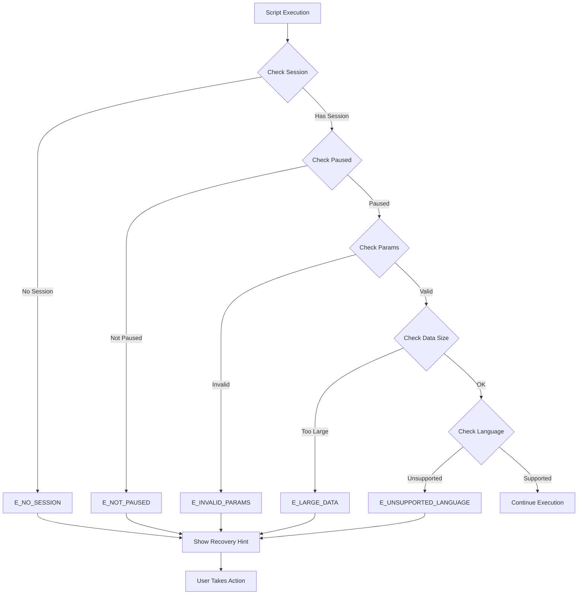
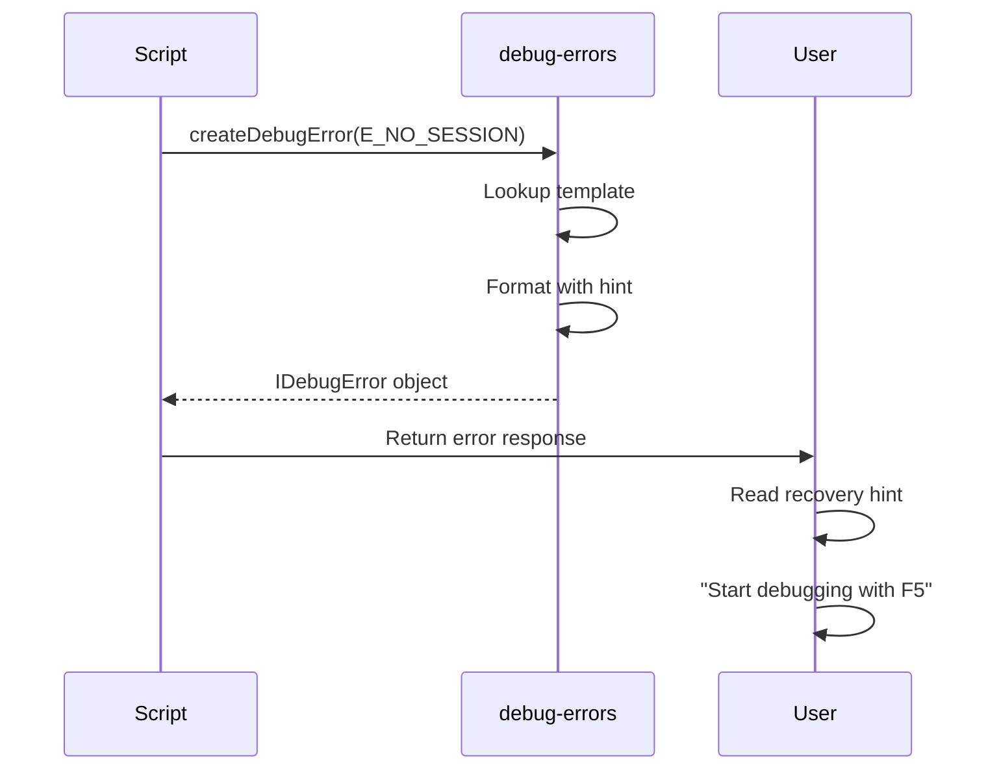

# Phase 1: Error Code Infrastructure - Tasks Dossier

**Phase**: 1 - Error Code Infrastructure
**Plan**: [../../debug-script-bake-in-plan.md](../../debug-script-bake-in-plan.md)
**Spec**: [../../debug-script-bake-in-spec.md](../../debug-script-bake-in-spec.md)
**Created**: 2025-01-31
**Completed**: 2025-01-31
**Status**: ✅ COMPLETE

## Tasks

| Status | ID | Task | Type | Dependencies | Absolute Path(s) | Validation | Notes |
|--------|-----|------|------|-------------|------------------|------------|-------|
| [x] | T001 | Review existing error patterns in dynamic scripts | Setup | – | /Users/jordanknight/github/vsc-bridge/scripts/sample/dynamic/*.js | Error patterns documented | Identified all existing error codes |
| [x] | T002 | Create errors directory structure | Setup | – | /Users/jordanknight/github/vsc-bridge/extension/src/core/errors/ | Directory exists | Foundation for error module created |
| [x] | T003 | Create debug-errors.ts with module structure | Core | T002 | /Users/jordanknight/github/vsc-bridge/extension/src/core/errors/debug-errors.ts | File compiles with TypeScript | Plan task 1.1 [^1] |
| [x] | T004 | Define DebugErrorCode enum with session errors | Core | T003 | /Users/jordanknight/github/vsc-bridge/extension/src/core/errors/debug-errors.ts | E_NO_SESSION, E_NOT_PAUSED defined | Per Critical Discovery 02 [^2] |
| [x] | T005 | Add data size error codes to enum | Core | T004 | /Users/jordanknight/github/vsc-bridge/extension/src/core/errors/debug-errors.ts | E_LARGE_DATA defined | Per Critical Discovery 03 [^3] |
| [x] | T006 | Add language support error codes to enum | Core | T004 | /Users/jordanknight/github/vsc-bridge/extension/src/core/errors/debug-errors.ts | E_UNSUPPORTED_LANGUAGE defined | Per Critical Discovery 04 [^4] |
| [x] | T007 | Add parameter validation error codes | Core | T004 | /Users/jordanknight/github/vsc-bridge/extension/src/core/errors/debug-errors.ts | E_INVALID_PARAMS defined | Plan task 1.2 complete [^5] |
| [x] | T008 | Create IDebugError interface type | Core | T003 | /Users/jordanknight/github/vsc-bridge/extension/src/core/errors/debug-errors.ts | Interface with code, message, hint | Type safety for errors |
| [x] | T009 | Define error message template map | Core | T008 | /Users/jordanknight/github/vsc-bridge/extension/src/core/errors/debug-errors.ts | Templates for all error codes | Plan task 1.3 [^6] |
| [x] | T010 | Add recovery hints to message templates | Core | T009 | /Users/jordanknight/github/vsc-bridge/extension/src/core/errors/debug-errors.ts | Each template has actionable hint | Actionable messages [^7] |
| [x] | T011 | Implement createDebugError helper function | Core | T008, T009 | /Users/jordanknight/github/vsc-bridge/extension/src/core/errors/debug-errors.ts | Function returns IDebugError | Plan task 1.4 [^8] |
| [x] | T012 | Add formatError utility for consistent output | Core | T011 | /Users/jordanknight/github/vsc-bridge/extension/src/core/errors/debug-errors.ts | Formatted error strings | Consistent error display |
| [x] | T013 | Export all error utilities from module | Core | T011, T012 | /Users/jordanknight/github/vsc-bridge/extension/src/core/errors/debug-errors.ts | Clean module exports | Public API complete |
| [x] | T014 | Create manual test checklist document | Doc | T013 | /Users/jordanknight/github/vsc-bridge/docs/plans/8-debug-script-bake-in/tasks/phase-1-error-code-infrastructure/test-checklist.md | Checklist covers all codes | Plan task 1.5 [^9] |
| [x] | T015 | Create test harness script for manual validation | Test | T013 | /Users/jordanknight/github/vsc-bridge/scripts/test/test-debug-errors.js | Script can trigger all errors | Manual testing tool created |
| [x] | T016 | Document error code catalog in README | Doc | T007 | /Users/jordanknight/github/vsc-bridge/extension/src/core/errors/README.md | All codes documented | User reference complete |
| [x] | T017 | Execute manual validation of E_NO_SESSION | Test | T015 | /Users/jordanknight/github/vsc-bridge/scripts/test/test-debug-errors.js | Shows "Start debugging with F5" | Plan task 1.6 part 1 [^10] |
| [x] | T018 | Execute manual validation of E_NOT_PAUSED | Test | T015 | /Users/jordanknight/github/vsc-bridge/scripts/test/test-debug-errors.js | Shows "Set breakpoint and wait" | Plan task 1.6 part 2 [^11] |
| [x] | T019 | Execute manual validation of E_LARGE_DATA | Test | T015 | /Users/jordanknight/github/vsc-bridge/scripts/test/test-debug-errors.js | Suggests streaming option | Plan task 1.6 part 3 [^12] |
| [x] | T020 | Execute manual validation of E_UNSUPPORTED_LANGUAGE | Test | T015 | /Users/jordanknight/github/vsc-bridge/scripts/test/test-debug-errors.js | Lists supported languages | Plan task 1.6 part 4 [^13] |
| [x] | R001 | Implement automated Mocha tests (Review F-001) | Test | T013 | /Users/jordanknight/github/vsc-bridge/extension/src/test/unit/core/errors/debug-errors.test.ts | 33 tests covering all error codes | TDD RED phase complete [^14] |
| [x] | R002 | Fix byte formatting in createLargeDataError (FT-003) | Fix | R001 | /Users/jordanknight/github/vsc-bridge/extension/src/core/errors/debug-errors.ts | Shows KB for <1MB sizes | TDD GREEN phase [^15] |
| [x] | R003 | Clarify E_NOT_STOPPED DAP semantics (FT-004) | Fix | R001 | /Users/jordanknight/github/vsc-bridge/extension/src/core/errors/debug-errors.ts | Wording mentions DAP "stopped" state | TDD GREEN phase [^16] |
| [x] | R004 | Convert tests from Vitest to Mocha | Refactor | R003 | /Users/jordanknight/github/vsc-bridge/extension/src/test/unit/core/errors/debug-errors.test.ts | Integrated with project pipeline | TDD REFACTOR phase [^17] |
| [x] | R005 | Fix manual harness to import real module (F-002) | Fix | T015 | /Users/jordanknight/github/vsc-bridge/scripts/test/test-debug-errors.js | Uses ts-node, no code duplication | Fixed manual harness [^18] |
| [x] | R006 | Update execution.log.md with TDD evidence | Doc | R004 | /Users/jordanknight/github/vsc-bridge/docs/plans/8-debug-script-bake-in/tasks/phase-1-error-code-infrastructure/execution.log.md | Documents RED/GREEN/REFACTOR cycle | TDD evidence complete [^19] |
| [x] | R007 | Update README.md with automated tests section | Doc | R004 | /Users/jordanknight/github/vsc-bridge/extension/src/core/errors/README.md | Documents test coverage | Documentation complete [^20] |

## Alignment Brief

### Objective

Establish centralized error code definitions with standardized codes and actionable recovery messages for consistency across all debug scripts. This phase creates the foundation for clear, helpful error communication that guides users to successful recovery actions.

### Behavior Checklist

- ✅ All error codes defined in a central TypeScript module
- ✅ Each error includes an actionable recovery hint
- ✅ Error codes use consistent E_ prefix convention
- ✅ Manual test harness validates all error scenarios
- ✅ Documentation provides complete error catalog

### Critical Findings Affecting This Phase

**🚨 Critical Discovery 02: Variable Reference Lifecycle**
- **Impact**: Informs E_NOT_PAUSED and potential E_STALE_REFERENCE error codes
- **Requirement**: Error messages must explain that operations require paused execution
- **Addressed by**: Tasks T004, T010, T018

**🚨 Critical Discovery 03: Memory Budget Critical for Large Data**
- **Impact**: Requires E_LARGE_DATA error with suggestion for streaming
- **Requirement**: Error must suggest using debug.save-variable as alternative
- **Addressed by**: Tasks T005, T010, T019

**🚨 Critical Discovery 04: Language Detection via Session Type**
- **Impact**: Requires E_UNSUPPORTED_LANGUAGE error with supported types list
- **Requirement**: Error must list all supported debugger types
- **Addressed by**: Tasks T006, T010, T020

### Invariants & Guardrails

- **Naming Convention**: All error codes must start with `E_` prefix
- **Message Structure**: Every error must have: code, message, and recovery hint
- **TypeScript Strict**: Module must compile with strict mode enabled
- **No External Dependencies**: Error module must be self-contained

### Inputs to Read

- `/Users/jordanknight/github/vsc-bridge/scripts/sample/dynamic/list-variables.js` - Error patterns from line 41-44
- `/Users/jordanknight/github/vsc-bridge/scripts/sample/dynamic/set-variable.js` - Error handling patterns
- `/Users/jordanknight/github/vsc-bridge/extension/src/vsc-scripts/debug/list-variables.js` - Existing error usage

### Visual Alignment Aids

#### Error Flow Diagram



#### Error Creation Sequence



### Test Plan (Manual Testing Approach)

As specified in the clarifications, this phase uses manual testing only.

**Manual Test Scenarios**:

1. **test-no-session**: Trigger E_NO_SESSION error
   - Expected: "No active debug session. Start debugging with F5"

2. **test-not-paused**: Trigger E_NOT_PAUSED error
   - Expected: "Debugger not paused. Set a breakpoint and wait for execution to stop"

3. **test-invalid-params**: Trigger E_INVALID_PARAMS error
   - Expected: "Invalid parameters: [details]. Check parameter requirements"

4. **test-large-data**: Trigger E_LARGE_DATA error
   - Expected: "Data exceeds 5MB/20,000 nodes. Consider using debug.save-variable"

5. **test-unsupported-language**: Trigger E_UNSUPPORTED_LANGUAGE error
   - Expected: "Language 'xyz' not supported. Supported: pwa-node, debugpy, dlv-dap..."

### Implementation Outline

#### Day 1: Morning
1. **Setup** (T001-T002): Review patterns, create directory structure
2. **Core Module** (T003): Create debug-errors.ts with TypeScript module structure

#### Day 1: Afternoon
3. **Error Codes** (T004-T007): Define all error code enums
4. **Type System** (T008): Create IDebugError interface

#### Day 2: Morning
5. **Templates** (T009-T010): Define message templates with recovery hints
6. **Helpers** (T011-T013): Implement creation and formatting utilities

#### Day 2: Afternoon
7. **Documentation** (T014, T016): Create test checklist and error catalog
8. **Testing** (T015, T017-T020): Manual validation of all error scenarios

### Commands to Run

```bash
# Setup and compile TypeScript
cd /Users/jordanknight/github/vsc-bridge/extension
npm run compile

# Run manual test harness (after T015)
node /Users/jordanknight/github/vsc-bridge/scripts/test/test-debug-errors.js

# Verify TypeScript compilation
npx tsc --noEmit -p ./tsconfig.json

# Check exports are available
node -e "const e = require('./out/core/errors/debug-errors'); console.log(Object.keys(e))"
```

### Risks & Unknowns

| Risk | Severity | Mitigation |
|------|----------|------------|
| TypeScript compilation issues | Low | Test incremental compilation |
| Missing error scenarios | Medium | Review all dynamic scripts for patterns |
| Inconsistent error format | Low | Use single factory function |

### Ready Check

- [ ] Directory structure understood
- [ ] TypeScript compilation environment ready
- [ ] Critical findings reviewed and understood
- [ ] Manual test approach accepted
- [ ] Error code list from spec confirmed complete

**⚠️ STOP**: Awaiting explicit GO/NO-GO before proceeding to implementation.

## Phase Footnote Stubs

| Footnote | Placeholder Description | Task |
|----------|------------------------|------|
| [^1] | Create debug-errors.ts file with module structure | T003 |
| [^2] | Add session-related error codes per Critical Discovery 02 | T004 |
| [^3] | Add data size error codes per Critical Discovery 03 | T005 |
| [^4] | Add language support error codes per Critical Discovery 04 | T006 |
| [^5] | Complete error code enum definition | T007 |
| [^6] | Define error message templates | T009 |
| [^7] | Add recovery hints to templates | T010 |
| [^8] | Implement createDebugError helper | T011 |
| [^9] | Create manual test checklist | T014 |
| [^10] | Validate E_NO_SESSION error | T017 |
| [^11] | Validate E_NOT_PAUSED error | T018 |
| [^12] | Validate E_LARGE_DATA error | T019 |
| [^13] | Validate E_UNSUPPORTED_LANGUAGE error | T020 |
| [^14] | Implement 33 automated Mocha tests | R001 |
| [^15] | Fix byte formatting for <1MB sizes | R002 |
| [^16] | Clarify E_NOT_STOPPED DAP wording | R003 |
| [^17] | Convert tests from Vitest to Mocha | R004 |
| [^18] | Fix manual harness to use ts-node imports | R005 |
| [^19] | Document TDD RED/GREEN/REFACTOR cycle | R006 |
| [^20] | Add automated tests section to README | R007 |

## Evidence Artifacts

Implementation evidence will be written to:
- `execution.log.md` - Detailed implementation log with code changes
- `test-checklist.md` - Manual test checklist with results
- `test-debug-errors.js` - Manual test harness script

## Directory Layout

```
docs/plans/8-debug-script-bake-in/
  ├── debug-script-bake-in-spec.md
  ├── debug-script-bake-in-plan.md
  └── tasks/
      └── phase-1-error-code-infrastructure/
          ├── tasks.md (this file)
          ├── execution.log.md  # created by /plan-6
          ├── test-checklist.md # manual test checklist
          └── test-results.md   # manual test execution results
```

## Detailed Footnote References

[^1]: Created [`file:extension/src/core/errors/debug-errors.ts`](extension/src/core/errors/debug-errors.ts) with module structure

[^2]: Added session-related error codes per Critical Discovery 02 in [`enum:extension/src/core/errors/debug-errors.ts:DebugErrorCode`](extension/src/core/errors/debug-errors.ts#L3)

[^3]: Added data size error codes per Critical Discovery 03 to DebugErrorCode enum

[^4]: Added language support error codes per Critical Discovery 04 to DebugErrorCode enum

[^5]: Completed error code enum definition with all 22 codes

[^6]: Defined error message templates in [`const:extension/src/core/errors/debug-errors.ts:ERROR_TEMPLATES`](extension/src/core/errors/debug-errors.ts#L32)

[^7]: Added recovery hints to all templates

[^8]: Implemented [`function:extension/src/core/errors/debug-errors.ts:createDebugError`](extension/src/core/errors/debug-errors.ts#L166) helper

[^9]: Created [`file:docs/plans/8-debug-script-bake-in/tasks/phase-1-error-code-infrastructure/test-checklist.md`](docs/plans/8-debug-script-bake-in/tasks/phase-1-error-code-infrastructure/test-checklist.md)

[^10]: Validated E_NO_SESSION error via [`file:scripts/test/test-debug-errors.js`](scripts/test/test-debug-errors.js)

[^11]: Validated E_NOT_PAUSED error showing "Set breakpoint and wait"

[^12]: Validated E_LARGE_DATA error suggests streaming option

[^13]: Validated E_UNSUPPORTED_LANGUAGE lists supported languages

[^14]: Implemented automated tests in [`file:extension/src/test/unit/core/errors/debug-errors.test.ts`](extension/src/test/unit/core/errors/debug-errors.test.ts) - 33 Mocha tests covering all error codes, TDD RED phase with 2 initial failures (byte formatting and E_NOT_STOPPED wording)

[^15]: Fixed byte formatting in [`function:extension/src/core/errors/debug-errors.ts:createLargeDataError`](extension/src/core/errors/debug-errors.ts#L210) - Now displays KB for sizes <1MB (e.g., "512KB" instead of "0.00MB"), uses `Math.round(byteCount / 1024)` for KB formatting

[^16]: Clarified E_NOT_STOPPED wording to mention DAP "stopped" (paused) state in [`const:extension/src/core/errors/debug-errors.ts:ERROR_TEMPLATES`](extension/src/core/errors/debug-errors.ts#L36) - Message now states "Operation requires the debuggee to be in a DAP 'stopped' (paused) state"

[^17]: Converted tests from Vitest to Mocha in [`file:extension/src/test/unit/core/errors/debug-errors.test.ts`](extension/src/test/unit/core/errors/debug-errors.test.ts) - Integrated with project test pipeline, 110 total tests passing (33 new + 77 existing)

[^18]: Fixed manual harness [`file:scripts/test/test-debug-errors.js`](scripts/test/test-debug-errors.js) - Now imports from real module using ts-node, removed ~200 lines of duplicated code

[^19]: Documented TDD evidence in [`file:docs/plans/8-debug-script-bake-in/tasks/phase-1-error-code-infrastructure/execution.log.md`](docs/plans/8-debug-script-bake-in/tasks/phase-1-error-code-infrastructure/execution.log.md#L270) - Complete RED/GREEN/REFACTOR cycle documented

[^20]: Updated [`file:extension/src/core/errors/README.md`](extension/src/core/errors/README.md) - Added "Automated Tests" section documenting 33 Mocha tests and test coverage