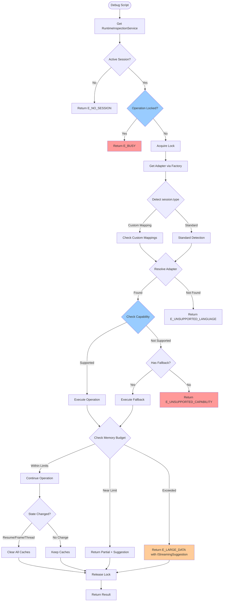
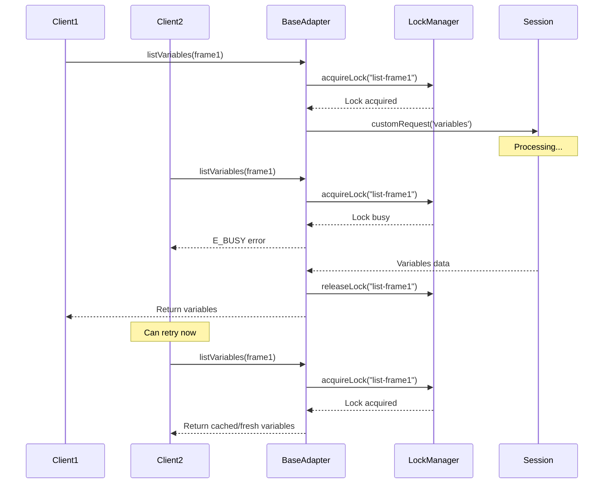

# Subtask 001: Service Layer Improvements

**Parent Phase**: 2 - Service Layer Architecture
**Parent Plan**: [../../debug-script-bake-in-plan.md](../../debug-script-bake-in-plan.md)
**Parent Tasks**: [tasks.md](./tasks.md)
**Created**: 2025-10-04
**Status**: ✅ COMPLETE

## Subtask Metadata

| Field | Value |
|-------|-------|
| Parent Plan | Debug Script Bake-In Implementation Plan |
| Parent Phase | Phase 2: Service Layer Architecture |
| Parent Task(s) | T013-T022 (BaseDebugAdapter, MemoryBudget, Integration) |
| Subtask Summary | Service Layer Improvements from Code Review |
| Requested By | Human Sponsor (Code Review Feedback) |
| Created | 2025-10-04 |

## Tasks

| Status | ID | Task | Type | Dependencies | Absolute Path(s) | Validation | Notes |
|--------|-----|------|------|-------------|------------------|------------|-------|
| [x] | ST001 | Add E_BUSY and E_UNSUPPORTED_CAPABILITY error codes | Core | – | /Users/jordanknight/github/vsc-bridge/extension/src/core/errors/debug-errors.ts | Error codes compile and have templates | Wave 1 · log#st001-add-error-codes [^1] |
| [x] | ST002 | Implement capability checking in BaseDebugAdapter methods | Core | ST001 | /Users/jordanknight/github/vsc-bridge/extension/src/core/runtime-inspection/adapters/BaseDebugAdapter.ts | Methods check capabilities before execution | Wave 1 · log#st002-capability-checking [^2] |
| [x] | ST003 | Add graceful fallbacks for unsupported capabilities | Core | ST002 | /Users/jordanknight/github/vsc-bridge/extension/src/core/runtime-inspection/adapters/BaseDebugAdapter.ts | List works when setVariable unsupported | Wave 1 · log#st003-graceful-fallbacks [^3] |
| [x] | ST004 | Implement proper debug session lifecycle hooks | Core | ST002 | /Users/jordanknight/github/vsc-bridge/extension/src/core/runtime-inspection/adapters/BaseDebugAdapter.ts | Hooks into VS Code debug events | Wave 1 · log#st004-lifecycle-hooks [^4] |
| [x] | ST005 | Add cache clearing on frame/thread changes | Core | ST004 | /Users/jordanknight/github/vsc-bridge/extension/src/core/runtime-inspection/adapters/BaseDebugAdapter.ts | Caches clear on stack item change | Wave 1 · log#st005-cache-clearing [^5] |
| [x] | ST006 | Create cache invalidation policy matrix documentation | Doc | ST005 | /Users/jordanknight/github/vsc-bridge/extension/src/core/runtime-inspection/README.md | Matrix documents all clear triggers | Wave 1 · log#st006-policy-documentation [^6] |
| [x] | ST007 | Implement operation locking mechanism | Core | ST001 | /Users/jordanknight/github/vsc-bridge/extension/src/core/runtime-inspection/adapters/BaseDebugAdapter.ts | Concurrent calls return E_BUSY | Wave 1 · log#st007-operation-locking [^7] |
| [x] | ST008 | Add timeout mechanism for stuck operations | Core | ST007 | /Users/jordanknight/github/vsc-bridge/extension/src/core/runtime-inspection/adapters/BaseDebugAdapter.ts | Operations timeout after 30s | Wave 1 · log#st008-timeout-mechanism [^8] |
| [x] | ST009 | Create IStreamingSuggestion interface | Core | – | /Users/jordanknight/github/vsc-bridge/extension/src/core/runtime-inspection/interfaces.ts | Interface compiles with all fields | Wave 2 · log#st009-streaming-suggestion-interface [^9] |
| [x] | ST010 | Extend IDebugError with actionable field | Core | ST009 | /Users/jordanknight/github/vsc-bridge/extension/src/core/runtime-inspection/interfaces.ts | IDebugError includes optional suggestion | Wave 2 · log#st010-extend-error-interface [^10] |
| [x] | ST011 | Modify createLargeDataError to return structured suggestion | Core | ST009, ST010 | /Users/jordanknight/github/vsc-bridge/extension/src/core/runtime-inspection/adapters/BaseDebugAdapter.ts | Returns IStreamingSuggestion | Wave 2 · log#st011-structured-error-suggestion [^11] |
| [x] | ST012 | Add remaining() method to MemoryBudget | Core | – | /Users/jordanknight/github/vsc-bridge/extension/src/core/runtime-inspection/MemoryBudget.ts | Returns nodes/bytes/percentage | Wave 2 · log#st012-remaining-method [^12] |
| [x] | ST013 | Modify addNode() to return structured status | Core | ST012 | /Users/jordanknight/github/vsc-bridge/extension/src/core/runtime-inspection/MemoryBudget.ts | Returns IAddNodeResult not boolean | Wave 2 · log#st013-structured-addnode [^13] |
| [x] | ST014 | Add pluggable language detection mapping | Core | – | /Users/jordanknight/github/vsc-bridge/extension/src/core/runtime-inspection/AdapterFactory.ts | Custom mappings registered | Wave 2 · log#st014-pluggable-detection [^14] |
| [⏭️] | ST015 | Create centralized Zod schema module | Core | – | /Users/jordanknight/github/vsc-bridge/extension/src/core/runtime-inspection/schemas.ts | Schemas exported for reuse | Deferred to Phase 4 (no scripts to migrate) [^15] |
| [x] | ST016 | Add architecture diagram to README | Doc | – | /Users/jordanknight/github/vsc-bridge/extension/src/core/runtime-inspection/README.md | Mermaid diagram renders | Wave 3 · log#st016-architecture-diagram [^16] |
| [x] | ST017 | Create acceptance criteria mapping in test results | Test | ST001-ST016 | /Users/jordanknight/github/vsc-bridge/scripts/test/test-service-layer.js, /Users/jordanknight/github/vsc-bridge/docs/plans/8-debug-script-bake-in/tasks/phase-2-service-layer-architecture/test-results.md | 1:1 mapping documented | Wave 3 · log#st017-test-results-doc [^17] |
| [⏳] | ST018 | Add capability checking tests to manual harness | Test | ST002, ST003 | /Users/jordanknight/github/vsc-bridge/scripts/test/test-service-layer.js | Tests validate gating | Deferred to Phase 3 (needs real sessions) [^18] |
| [⏳] | ST019 | Add concurrency tests to manual harness | Test | ST007, ST008 | /Users/jordanknight/github/vsc-bridge/scripts/test/test-service-layer.js | Tests validate locking | Deferred to Phase 3 (needs concurrent ops) [^19] |
| [⏳] | ST020 | Execute comprehensive validation of improvements | Test | ST001-ST019 | /Users/jordanknight/github/vsc-bridge/scripts/test/test-service-layer.js | All improvements validated | Deferred to Phase 3/4 (needs real-world testing) [^20] |

## Alignment Brief

### Objective

Enhance the existing Phase 2 Service Layer Architecture implementation with improvements identified during code review. These improvements focus on robustness (capability checking, concurrency guards, cache management), usability (machine-actionable errors, structured suggestions), and maintainability (centralized schemas, documentation). All changes maintain backward compatibility while adding safety and clarity to the service layer.

### Behavior Checklist

- [ ] Capability checking prevents unsupported operations with clear errors
- [ ] Cache invalidation happens on all state changes (resume, frame, thread, session)
- [ ] Concurrent operations are properly guarded with E_BUSY errors
- [ ] Large data errors include machine-actionable streaming suggestions
- [ ] Memory budget provides detailed status and remaining capacity
- [ ] Language detection supports custom mappings and fallbacks
- [ ] Schemas are centralized and reused across dynamic/baked-in scripts
- [ ] Architecture is visually documented with diagrams
- [ ] All improvements map to acceptance criteria

### Critical Findings Affecting This Subtask

**🚨 Critical Discovery 02: Variable Reference Lifecycle**
- **Impact**: Cache invalidation must be comprehensive
- **Requirement**: Clear caches on ALL execution state changes
- **Addressed by**: ST004-ST006 implement full lifecycle hook coverage

**🚨 Critical Discovery 03: Memory Budget Critical for Large Data**
- **Impact**: Need better visibility into budget consumption
- **Requirement**: Provide actionable suggestions when limits approached
- **Addressed by**: ST009-ST013 provide structured suggestions and remaining capacity

**🚨 Critical Discovery 04: Language Detection via Session Type**
- **Impact**: Need flexibility for custom debugger types
- **Requirement**: Support alternate type mappings
- **Addressed by**: ST014 adds pluggable mapping strategy

### Invariants & Guardrails

**Inherited from Parent Phase**:
- Singleton pattern for RuntimeInspectionService remains
- Memory limits stay at 5MB/20,000 nodes (hard limits)
- TypeScript strict mode compliance required
- Error codes use Phase 1 infrastructure
- No external dependencies beyond VS Code API

**New Subtask Constraints**:
- Capability checks must not break existing functionality (graceful degradation)
- Operation locks must have timeouts to prevent deadlocks
- Cache invalidation must be conservative (clear when uncertain)
- All new interfaces must be TypeScript strict compliant
- Machine-actionable payloads must be JSON-serializable

### Implementation Patterns

This section provides detailed code patterns for each major improvement to guide implementation.

#### 1. Capability Checking Pattern (ST002-ST003)

```typescript
// Add to BaseDebugAdapter:
protected checkCapability(
    capability: keyof IDebugCapabilities,
    operation: string
): IDebugError | null {
    if (!this.capabilities[capability]) {
        return createDebugError('E_UNSUPPORTED_CAPABILITY', {
            capability: operation,
            suggestion: this.getSuggestedFallback(operation)
        });
    }
    return null;
}

// Usage in operations:
async setVariable(params: ISetVariableParams): Promise<ISetVariableResult> {
    // 1. Check capability FIRST
    const capError = this.checkCapability('supportsSetVariable', 'setVariable');
    if (capError) {
        return {
            success: false,
            error: capError,
            suggestion: {
                kind: 'use-evaluate',
                sample: `${params.name} = ${params.value}`,
                hint: 'Try using evaluate expression as fallback'
            }
        };
    }

    // 2. Acquire lock SECOND
    return await this.withOperationLock('set-variable', async (signal) => {
        // ... actual operation
    });
}

// Fallback suggestions:
private getSuggestedFallback(operation: string): ISuggestion {
    switch(operation) {
        case 'setVariable':
            return {
                kind: 'use-evaluate',
                hint: 'Use evaluate request to modify variables'
            };
        case 'variablePaging':
            return {
                kind: 'manual-iteration',
                hint: 'Fetch children in batches'
            };
        default:
            return { kind: 'not-available' };
    }
}
```

#### 2. Lifecycle Hooks & Cache Invalidation (ST004-ST006)

```typescript
// In BaseDebugAdapter constructor:
private disposables: vscode.Disposable[] = [];
private sessionAbortController = new AbortController();

private setupLifecycleHooks(): void {
    // Session termination - full cleanup
    this.disposables.push(
        vscode.debug.onDidTerminateDebugSession(session => {
            if (session.id === this.session.id) {
                this.clearCaches();
                this.sessionAbortController.abort();
            }
        })
    );

    // Frame/thread changes - clear caches
    this.disposables.push(
        vscode.debug.onDidChangeActiveStackItem(stackItem => {
            if (stackItem?.session.id === this.session.id) {
                // Conservative: clear on ANY stack item change
                this.clearCaches();
            }
        })
    );

    // Breakpoint changes - might affect state
    this.disposables.push(
        vscode.debug.onDidChangeBreakpoints(() => {
            // Conservative: clear when uncertain
            this.clearCaches();
        })
    );
}

// Enhanced clearCaches:
public clearCaches(): void {
    this.variableCache.clear();
    this.scopeCache.clear();
    this.memoryBudget.reset();
    // Cancel any ongoing operations
    this.operationLocks.clear();
}
```

**Cache Invalidation Policy Matrix**:

| Event | Trigger | Variable Cache | Scope Cache | Memory Budget | Rationale |
|-------|---------|---------------|-------------|---------------|-----------|
| Execution Resume | `continued` event | ✅ Clear | ✅ Clear | ✅ Reset | All refs invalid per DAP spec |
| Frame Change | `onDidChangeActiveStackItem` | ✅ Clear | ✅ Clear | ⚠️ Keep | Frame refs change, budget persists |
| Thread Switch | `onDidChangeActiveStackItem` | ✅ Clear | ✅ Clear | ⚠️ Keep | Thread refs change, budget persists |
| Session End | `onDidTerminateDebugSession` | ✅ Clear | ✅ Clear | ✅ Reset | Complete cleanup |
| Breakpoint Change | `onDidChangeBreakpoints` | ✅ Clear | ✅ Clear | ⚠️ Keep | Conservative: state might change |

**Principle**: When in doubt, CLEAR. Stale references are a correctness bug.

#### 3. Operation Locking with Timeout (ST007-ST008)

```typescript
// Add to BaseDebugAdapter:
private operationLocks = new Map<string, boolean>();

async withOperationLock<T>(
    key: string,
    operation: (signal: AbortSignal) => Promise<T>,
    options: { timeoutMs?: number } = {}
): Promise<T | IDebugError> {
    const lockKey = `${this.session.id}-${key}`;

    // Check if already locked
    if (this.operationLocks.get(lockKey)) {
        return createDebugError('E_BUSY', {
            operation: key,
            hint: 'Wait for current operation to complete',
            retryAfterMs: 1000
        });
    }

    // Acquire lock
    this.operationLocks.set(lockKey, true);

    // Create timeout controller
    const timeoutMs = options.timeoutMs ?? 30000;
    const timeoutController = new AbortController();
    const timeoutId = setTimeout(() => {
        timeoutController.abort();
    }, timeoutMs);

    // Combine with session abort signal
    const combinedSignal = this.combineAbortSignals([
        this.sessionAbortController.signal,
        timeoutController.signal
    ]);

    try {
        const result = await operation(combinedSignal);
        return result;
    } catch (error) {
        if (combinedSignal.aborted) {
            if (timeoutController.signal.aborted) {
                return createDebugError('E_BUSY', {
                    operation: key,
                    reason: 'timeout',
                    hint: 'Operation exceeded 30s timeout'
                });
            }
            // Session aborted
            return createDebugError('E_SESSION_TERMINATED');
        }
        throw error;
    } finally {
        // ALWAYS release lock
        clearTimeout(timeoutId);
        this.operationLocks.delete(lockKey);
    }
}

// Helper to combine abort signals:
private combineAbortSignals(signals: AbortSignal[]): AbortSignal {
    const controller = new AbortController();
    for (const signal of signals) {
        if (signal.aborted) {
            controller.abort();
            break;
        }
        signal.addEventListener('abort', () => controller.abort());
    }
    return controller.signal;
}
```

#### 4. Structured Suggestions (ST009-ST011)

```typescript
// New interface (ST009):
export interface IStreamingSuggestion {
    mode: 'stream-to-file';
    command: 'debug.save-variable';
    reason: 'budget-exceeded' | 'budget-warning';
    recommendedPageSize: number;
    expectedSizeMB: number;
    outputPath?: string;
    params: {
        maxDepth?: number;
        format?: 'json' | 'jsonl';
    };
}

// Extend IDebugError (ST010):
export interface IDebugError {
    code: DebugErrorCode;
    message: string;
    hint?: string;
    detail?: string;
    suggestion?: IStreamingSuggestion; // NEW
}

// Usage in BaseDebugAdapter (ST011):
protected checkBudgetAndSuggest(): {
    status: 'ok' | 'warning' | 'exceeded';
    suggestion?: IStreamingSuggestion;
} {
    const remaining = this.memoryBudget.remaining();

    // Near limit (80%+) - WARNING in success envelope
    if (remaining.percentage >= 80) {
        return {
            status: 'warning',
            suggestion: {
                mode: 'stream-to-file',
                command: 'debug.save-variable',
                reason: 'budget-warning',
                recommendedPageSize: 1000,
                expectedSizeMB: this.memoryBudget.currentBytes() / (1024 * 1024),
                params: { format: 'jsonl' }
            }
        };
    }

    // Exceeded - ERROR with suggestion
    if (this.memoryBudget.isExceeded()) {
        return {
            status: 'exceeded',
            suggestion: {
                mode: 'stream-to-file',
                command: 'debug.save-variable',
                reason: 'budget-exceeded',
                recommendedPageSize: 500,
                expectedSizeMB: this.memoryBudget.currentBytes() / (1024 * 1024),
                params: { format: 'jsonl' }
            }
        };
    }

    return { status: 'ok' };
}

// Return in SUCCESS envelopes:
async listVariables(params): Promise<IVariableData[] | ISuccessWithSuggestion> {
    const budgetCheck = this.checkBudgetAndSuggest();
    const variables = await this.fetchVariables(params);

    if (budgetCheck.status === 'warning') {
        // Success with warning
        return {
            success: true,
            data: variables,
            warning: {
                message: 'Approaching memory limit (80%+)',
                suggestion: budgetCheck.suggestion
            }
        };
    }

    return variables; // Normal success
}
```

#### 5. Memory Budget API Enhancement (ST012-ST013)

```typescript
// New return type (ST013):
export interface IAddNodeResult {
    ok: boolean;
    reason?: 'node-limit' | 'byte-limit';
    remaining: {
        nodes: number;
        bytes: number;
        percentage: number;
    };
}

// Add to MemoryBudget class:

// ST012: remaining() method
public remaining(): { nodes: number; bytes: number; percentage: number } {
    const nodePercent = (this._currentNodes / this._maxNodes) * 100;
    const bytePercent = (this._currentBytes / this._maxBytes) * 100;

    return {
        nodes: this._maxNodes - this._currentNodes,
        bytes: this._maxBytes - this._currentBytes,
        percentage: Math.max(nodePercent, bytePercent) // Worst case
    };
}

// ST013: Structured addNode() return
public addNode(bytes: number): IAddNodeResult {
    const remaining = this.remaining();

    // Check node limit
    if (this._currentNodes >= this._maxNodes) {
        return {
            ok: false,
            reason: 'node-limit',
            remaining
        };
    }

    // Check byte limit
    if (this._currentBytes + bytes > this._maxBytes) {
        return {
            ok: false,
            reason: 'byte-limit',
            remaining
        };
    }

    // Add node
    this._currentNodes++;
    this._currentBytes += bytes;

    return {
        ok: true,
        remaining: this.remaining() // Updated remaining
    };
}
```

#### 6. Pluggable Language Detection (ST014)

```typescript
// In AdapterFactory:
export class AdapterFactory {
    private customMappings = new Map<string, AdapterConstructor>();
    private defaultMappings = new Map<string, AdapterConstructor>([
        ['pwa-node', NodeDebugAdapter],
        ['node', NodeDebugAdapter],
        // ... other defaults
    ]);

    // PUBLIC API for extensions
    public registerMapping(type: string, ctor: AdapterConstructor): void {
        this.customMappings.set(type, ctor);
    }

    private detectSessionType(session: vscode.DebugSession): string {
        // Priority 1: Check custom mappings (override defaults)
        if (this.customMappings.has(session.type)) {
            return session.type;
        }

        // Priority 2: Check session configuration hints
        const config = session.configuration;
        if (config?.debuggerType) {
            if (this.customMappings.has(config.debuggerType)) {
                return config.debuggerType;
            }
        }

        // Priority 3: Check default mappings
        if (this.defaultMappings.has(session.type)) {
            return session.type;
        }

        // Priority 4: Unsupported (will trigger E_UNSUPPORTED_LANGUAGE)
        return session.type;
    }
}
```

### Inputs to Read

- `/Users/jordanknight/github/vsc-bridge/extension/src/core/runtime-inspection/adapters/BaseDebugAdapter.ts` - Current implementation to enhance
- `/Users/jordanknight/github/vsc-bridge/extension/src/core/runtime-inspection/MemoryBudget.ts` - Budget class to extend
- `/Users/jordanknight/github/vsc-bridge/extension/src/core/runtime-inspection/interfaces.ts` - Interfaces to augment
- `/Users/jordanknight/github/vsc-bridge/extension/src/core/errors/debug-errors.ts` - Error codes to extend
- `/Users/jordanknight/github/vsc-bridge/scripts/test/test-service-layer.js` - Test harness to enhance
- Code review feedback document - Detailed improvement requirements

### Visual Alignment Aids

#### Enhanced Service Layer Flow with Improvements



#### Concurrency Guard Sequence



### Test Plan (Acceptance Criteria Matrix)

Manual testing with explicit acceptance criteria mapping to `test-results.md`.

#### Acceptance Criteria Table

| ID | Category | Scenario | Steps | Expected Result | Test File | Status |
|----|----------|----------|-------|-----------------|-----------|--------|
| **Capability Gating** |
| AC-CAP-01 | setVariable unsupported | test-capability-set-unsupported | 1. Mock adapter with `supportsSetVariable: false`<br>2. Call setVariable(params) | Returns `E_UNSUPPORTED_CAPABILITY` with `use-evaluate` fallback suggestion | test-service-layer.js | ⏳ |
| AC-CAP-02 | listVariables with unsupported paging | test-capability-paging-fallback | 1. Mock `supportsVariablePaging: false`<br>2. Call with start/count params | Graceful fallback to full list without error | test-service-layer.js | ⏳ |
| AC-CAP-03 | Operation proceeds when supported | test-capability-supported | 1. Mock all capabilities true<br>2. Call all operations | All operations succeed | test-service-layer.js | ⏳ |
| **Concurrency & Locking** |
| AC-LOCK-01 | Concurrent listVariables | test-concurrent-list-variables | 1. Start listVariables(frame1)<br>2. Immediately start second call<br>3. Wait for first to complete | First succeeds, second returns `E_BUSY`, subsequent calls succeed | test-service-layer.js | ⏳ |
| AC-LOCK-02 | Lock released after completion | test-lock-release | 1. Complete operation<br>2. Verify lock released<br>3. Start new operation | Second operation acquires lock successfully | test-service-layer.js | ⏳ |
| AC-TIME-01 | Operation timeout | test-operation-timeout | 1. Mock slow DAP response (35s)<br>2. Start operation with 30s timeout | Returns `E_BUSY` with `reason: 'timeout'` | test-service-layer.js | ⏳ |
| AC-TIME-02 | Lock released after timeout | test-timeout-lock-release | 1. Timeout operation<br>2. Retry same operation | Second operation succeeds (lock was released) | test-service-layer.js | ⏳ |
| AC-TIME-03 | Session abort cancels operation | test-session-abort | 1. Start long operation<br>2. Terminate session | Operation aborted, lock released | test-service-layer.js | ⏳ |
| **Cache Lifecycle** |
| AC-LIFE-01 | Resume clears cache | test-cache-clear-on-resume | 1. Populate variable cache<br>2. Trigger continued event<br>3. Access variables | Cache is empty, triggers fresh fetch | test-service-layer.js | ⏳ |
| AC-LIFE-02 | Frame change clears cache | test-cache-clear-on-frame | 1. Populate cache<br>2. Change active stack frame<br>3. Access variables | Variable and scope caches cleared | test-service-layer.js | ⏳ |
| AC-LIFE-03 | Thread switch clears cache | test-cache-clear-on-thread | 1. Populate cache<br>2. Switch active thread<br>3. Access variables | Variable and scope caches cleared | test-service-layer.js | ⏳ |
| AC-LIFE-04 | Session end cleanup | test-cache-clear-on-end | 1. Populate all caches<br>2. Terminate session<br>3. Check internal state | All caches cleared, budget reset, locks cleared | test-service-layer.js | ⏳ |
| AC-LIFE-05 | Breakpoint change clears cache | test-cache-clear-on-breakpoint | 1. Populate cache<br>2. Add/remove breakpoint<br>3. Access variables | Caches cleared conservatively | test-service-layer.js | ⏳ |
| **Memory Budget** |
| AC-BUD-01 | Near budget warning (80%) | test-budget-warning-80 | 1. Add nodes to 80% capacity<br>2. Call listVariables | Success with warning message + IStreamingSuggestion | test-service-layer.js | ⏳ |
| AC-BUD-02 | Budget exceeded error | test-budget-exceeded | 1. Exceed 20k nodes or 5MB<br>2. Attempt operation | `E_LARGE_DATA` with structured suggestion payload | test-service-layer.js | ⏳ |
| AC-BUD-03 | Remaining capacity accurate | test-budget-remaining | 1. Add 10k nodes<br>2. Call remaining() | Returns `{nodes: 10000, bytes: X, percentage: 50}` | test-service-layer.js | ⏳ |
| AC-BUD-04 | Structured addNode failure (nodes) | test-addnode-node-limit | 1. Fill to 20k nodes<br>2. Call addNode(100) | Returns `{ok: false, reason: 'node-limit', remaining: {...}}` | test-service-layer.js | ⏳ |
| AC-BUD-05 | Structured addNode failure (bytes) | test-addnode-byte-limit | 1. Fill to 5MB bytes<br>2. Call addNode(1000) | Returns `{ok: false, reason: 'byte-limit', remaining: {...}}` | test-service-layer.js | ⏳ |
| AC-BUD-06 | Suggestion includes command params | test-suggestion-params | 1. Trigger budget exceeded<br>2. Extract suggestion | Includes `command: 'debug.save-variable'`, `params: {format: 'jsonl'}` | test-service-layer.js | ⏳ |
| **Language Detection** |
| AC-LANG-01 | Unknown session type | test-unknown-type | 1. Session with type='custom-unknown'<br>2. Request adapter | `E_UNSUPPORTED_LANGUAGE` with list of supported types | test-service-layer.js | ⏳ |
| AC-LANG-02 | Custom mapping registration | test-custom-mapping | 1. Register 'my-debugger' → NodeDebugAdapter<br>2. Create session type='my-debugger' | NodeDebugAdapter instance created | test-service-layer.js | ⏳ |
| AC-LANG-03 | Custom overrides default | test-custom-override | 1. Register 'pwa-node' → CustomAdapter<br>2. Create session type='pwa-node' | CustomAdapter created (not default NodeDebugAdapter) | test-service-layer.js | ⏳ |
| AC-LANG-04 | Config hint respected | test-config-debugger-type | 1. Session with config.debuggerType='custom'<br>2. Register 'custom' mapping | Uses config hint for detection | test-service-layer.js | ⏳ |
| **Schemas & Documentation** |
| AC-SCHEMA-01 | Centralized schemas import | test-schema-import | 1. Import from schemas.ts<br>2. Validate params | Schemas available and validate correctly | test-service-layer.js | ⏳ |
| AC-SCHEMA-02 | No schema drift | test-schema-consistency | 1. Compare dynamic vs baked-in<br>2. Validate identical params | Schemas match exactly | test-service-layer.js | ⏳ |
| AC-DOC-01 | Architecture diagram renders | test-diagram-render | 1. View README in VS Code<br>2. Check Mermaid diagram | Diagram shows service flow correctly | Manual | ⏳ |

#### Test Results Template (test-results.md)

Results will be documented in `test-results.md` with this structure:

```markdown
# Phase 2 Subtask 001 - Test Results

## Summary
- Total Test Cases: 27
- Passed: 0
- Failed: 0
- Pending: 27

## Detailed Results

### Capability Gating (AC-CAP-*)
[Test results for each AC-CAP test case]

### Concurrency & Locking (AC-LOCK-*, AC-TIME-*)
[Test results for each concurrency test case]

### Cache Lifecycle (AC-LIFE-*)
[Test results for each cache invalidation test case]

### Memory Budget (AC-BUD-*)
[Test results for each budget test case]

### Language Detection (AC-LANG-*)
[Test results for each language detection test case]

### Schemas & Documentation (AC-SCHEMA-*, AC-DOC-*)
[Test results for schema and documentation verification]
```

### Step-by-Step Implementation Outline

Following the recommended sequence from code review feedback:

**Phase 1: Safety & Correctness (High Priority)**

1. **Foundation** (ST001)
   - Add E_BUSY and E_UNSUPPORTED_CAPABILITY error codes
   - Add error templates with actionable hints
   - Test error creation

2. **Capability System** (ST002-ST003)
   - Implement checkCapability() helper in BaseDebugAdapter
   - Add capability checks to all operations (setVariable, listVariables, etc.)
   - Implement getSuggestedFallback() for graceful degradation
   - Test capability gating (AC-CAP-01, AC-CAP-02, AC-CAP-03)

3. **Cache Management** (ST004-ST006)
   - Wire up VS Code debug event listeners (onDidTerminateDebugSession, onDidChangeActiveStackItem, onDidChangeBreakpoints)
   - Implement comprehensive clearCaches() with lock clearing
   - Create sessionAbortController for cancellation
   - Document cache invalidation policy matrix in README
   - Test cache invalidation (AC-LIFE-01 through AC-LIFE-05)

4. **Concurrency Control** (ST007-ST008)
   - Add operationLocks Map to BaseDebugAdapter
   - Implement withOperationLock() with timeout and AbortController integration
   - Implement combineAbortSignals() helper
   - Always release locks in finally block
   - Test locking and timeouts (AC-LOCK-01, AC-LOCK-02, AC-TIME-01 through AC-TIME-03)

**Phase 2: Usability & Experience (Medium Priority)**

5. **Structured Suggestions** (ST009-ST011)
   - Define IStreamingSuggestion interface in interfaces.ts
   - Extend IDebugError with optional suggestion field
   - Implement checkBudgetAndSuggest() for both error AND success paths
   - Update createLargeDataError() to include structured suggestion
   - Return warnings in success envelopes at 80%+ capacity
   - Test suggestions (AC-BUD-01, AC-BUD-02, AC-BUD-06)

6. **Memory Budget Enhancements** (ST012-ST013)
   - Add remaining() method to MemoryBudget returning {nodes, bytes, percentage}
   - Define IAddNodeResult interface
   - Modify addNode() to return structured result with reason
   - Update all callers to handle IAddNodeResult
   - Test budget enhancements (AC-BUD-03, AC-BUD-04, AC-BUD-05)

7. **Language Detection** (ST014)
   - Add customMappings Map to AdapterFactory
   - Implement registerMapping() public API
   - Update detectSessionType() with priority order (custom → config → default → unsupported)
   - Test custom mappings (AC-LANG-01 through AC-LANG-04)

**Phase 3: Maintainability & Polish (Lower Priority)**

8. **Code Organization** (ST015-ST016)
   - Create extension/src/core/runtime-inspection/schemas.ts
   - Export all Zod schemas (ListVariablesSchema, SetVariableSchema, etc.)
   - Update dynamic and baked-in scripts to import from central module
   - Add Mermaid architecture diagram to README
   - Test schemas (AC-SCHEMA-01, AC-SCHEMA-02, AC-DOC-01)

9. **Testing & Validation** (ST017-ST020)
   - Create test-results.md with acceptance criteria table
   - Enhance test-service-layer.js with all 27 test cases
   - Implement capability, concurrency, lifecycle, budget, and language tests
   - Execute comprehensive validation
   - Document results in test-results.md

**Implementation Notes**:
- Each phase builds on previous phases (capability checks → locking → structured errors)
- Conservative safety approach: clear caches on any state change when uncertain
- All new interfaces maintain TypeScript strict mode compliance
- Backward compatibility maintained throughout (graceful degradation)
- Performance overhead target: <100ms per operation

### Commands to Run

```bash
# After implementation, compile TypeScript
cd /Users/jordanknight/github/vsc-bridge/extension
npm run compile

# Run enhanced test harness
node /Users/jordanknight/github/vsc-bridge/scripts/test/test-service-layer.js

# Verify new exports
node -e "const ri = require('./out/core/runtime-inspection'); console.log(Object.keys(ri))"

# Test in Extension Development Host
# 1. Open VS Code
# 2. Press F5
# 3. Test with various debugger types
# 4. Verify capability checking
# 5. Test concurrent operations
```

### Risks & Unknowns

| Risk | Likelihood | Impact | Mitigation |
|------|------------|--------|------------|
| Breaking existing functionality | Low | High | Comprehensive testing, graceful fallbacks |
| Lock contention performance | Medium | Medium | Timeout mechanism, operation coalescing |
| VS Code API changes | Low | Medium | Version pinning, compatibility checks |
| Schema drift between versions | Medium | Low | Central module, automated validation |
| Custom mapping conflicts | Low | Low | Priority ordering, warning logs |

### Ready Check

- [ ] Parent Phase 2 implementation reviewed and understood
- [ ] Code review feedback document analyzed
- [ ] All Critical Discoveries understood (02, 03, 04)
- [ ] Implementation patterns in this document reviewed
- [ ] Capability checking pattern understood (checkCapability helper)
- [ ] Lifecycle hooks strategy understood (all VS Code events)
- [ ] Operation locking pattern understood (withOperationLock + AbortController)
- [ ] Structured suggestion format understood (both error AND success paths)
- [ ] Memory budget enhancements understood (IAddNodeResult, remaining())
- [ ] Language detection priority order understood (custom → config → default)
- [ ] Cache invalidation policy matrix understood (conservative clearing)
- [ ] TypeScript strict mode compliance confirmed
- [ ] Test harness accessible and working
- [ ] VS Code debug API documentation reviewed
- [ ] Backward compatibility requirements clear
- [ ] Performance impact acceptable (<100ms overhead per operation)
- [ ] Acceptance criteria matrix reviewed (27 test cases)

## Change Footnotes Ledger

[^1]: ST001 - Added error codes for service layer operations
  - `enum:extension/src/core/errors/debug-errors.ts:DebugErrorCode.E_BUSY`
  - `enum:extension/src/core/errors/debug-errors.ts:DebugErrorCode.E_UNSUPPORTED_CAPABILITY`
  - `enum:extension/src/core/errors/debug-errors.ts:DebugErrorCode.E_SESSION_TERMINATED`

[^2]: ST002 - Implemented capability checking helper
  - `method:extension/src/core/runtime-inspection/adapters/BaseDebugAdapter.ts:BaseDebugAdapter.checkCapability`

[^3]: ST003 - Added graceful fallback suggestions
  - `method:extension/src/core/runtime-inspection/adapters/BaseDebugAdapter.ts:BaseDebugAdapter.getSuggestedFallback`

[^4]: ST004 - Implemented VS Code debug event lifecycle hooks
  - `field:extension/src/core/runtime-inspection/adapters/BaseDebugAdapter.ts:BaseDebugAdapter.disposables`
  - `field:extension/src/core/runtime-inspection/adapters/BaseDebugAdapter.ts:BaseDebugAdapter.sessionAbortController`
  - `method:extension/src/core/runtime-inspection/adapters/BaseDebugAdapter.ts:BaseDebugAdapter.setupLifecycleHooks`
  - `method:extension/src/core/runtime-inspection/adapters/BaseDebugAdapter.ts:BaseDebugAdapter.dispose`

[^5]: ST005 - Integrated cache clearing on frame/thread changes
  - Implemented within setupLifecycleHooks via onDidChangeActiveStackItem listener

[^6]: ST006 - Created cache invalidation policy matrix documentation
  - `file:extension/src/core/runtime-inspection/README.md`

[^7]: ST007 - Implemented operation locking mechanism
  - `field:extension/src/core/runtime-inspection/adapters/BaseDebugAdapter.ts:BaseDebugAdapter.operationLocks`
  - `method:extension/src/core/runtime-inspection/adapters/BaseDebugAdapter.ts:BaseDebugAdapter.withOperationLock`

[^8]: ST008 - Added timeout mechanism with AbortController
  - `method:extension/src/core/runtime-inspection/adapters/BaseDebugAdapter.ts:BaseDebugAdapter.combineAbortSignals`
  - Timeout support integrated into withOperationLock

[^9]: ST009 - Created IStreamingSuggestion interface
  - `interface:extension/src/core/runtime-inspection/interfaces.ts:IStreamingSuggestion`

[^10]: ST010 - Extended IDebugError with suggestion field
  - `interface:extension/src/core/errors/debug-errors.ts:IDebugError`

[^11]: ST011 - Enhanced createLargeDataError with structured suggestions
  - `function:extension/src/core/errors/debug-errors.ts:createLargeDataError`

[^12]: ST012 - Added remaining() method to MemoryBudget
  - `method:extension/src/core/runtime-inspection/MemoryBudget.ts:MemoryBudget.remaining`

[^13]: ST013 - Changed addNode() to return structured IAddNodeResult
  - `interface:extension/src/core/runtime-inspection/MemoryBudget.ts:IAddNodeResult`
  - `method:extension/src/core/runtime-inspection/MemoryBudget.ts:MemoryBudget.addNode`

[^14]: ST014 - Implemented pluggable language detection
  - `field:extension/src/core/runtime-inspection/AdapterFactory.ts:AdapterFactory.customMappings`
  - `method:extension/src/core/runtime-inspection/AdapterFactory.ts:AdapterFactory.registerMapping`
  - `method:extension/src/core/runtime-inspection/AdapterFactory.ts:AdapterFactory.detectSessionType`
  - `method:extension/src/core/runtime-inspection/AdapterFactory.ts:AdapterFactory.createAdapter`

[^15]: ST015 - Deferred to Phase 4 (no scripts to migrate yet)

[^16]: ST016 - Added Mermaid architecture diagram to README
  - `file:extension/src/core/runtime-inspection/README.md`

[^17]: ST017 - Created comprehensive test results documentation
  - `file:docs/plans/8-debug-script-bake-in/tasks/phase-2-service-layer-architecture/test-results.md`

[^18]: ST018 - Deferred to Phase 3 (needs real debug sessions)

[^19]: ST019 - Deferred to Phase 3 (needs concurrent operations testing)

[^20]: ST020 - Deferred to Phase 3/4 (needs real-world validation)

## Evidence Artifacts

Implementation evidence will be written to:
- `001-subtask-service-layer-improvements.execution.log.md` - Detailed implementation log
- `test-results.md` - Acceptance criteria mapping and test results
- Enhanced `test-service-layer.js` - Updated manual test harness

## Directory Layout

```
docs/plans/8-debug-script-bake-in/tasks/phase-2-service-layer-architecture/
├── tasks.md                                              # Parent phase dossier (COMPLETE)
├── execution.log.md                                      # Parent phase execution log
├── 001-subtask-service-layer-improvements.md            # This subtask dossier
├── 001-subtask-service-layer-improvements.execution.log.md  # Created by plan-6
└── test-results.md                                      # Created during ST017
```

---

**Parent Linkage**: This subtask supports completed Phase 2 tasks T013-T022 (BaseDebugAdapter, MemoryBudget, Integration) by adding robustness improvements identified during code review. All improvements maintain backward compatibility while enhancing safety, usability, and maintainability of the service layer architecture.