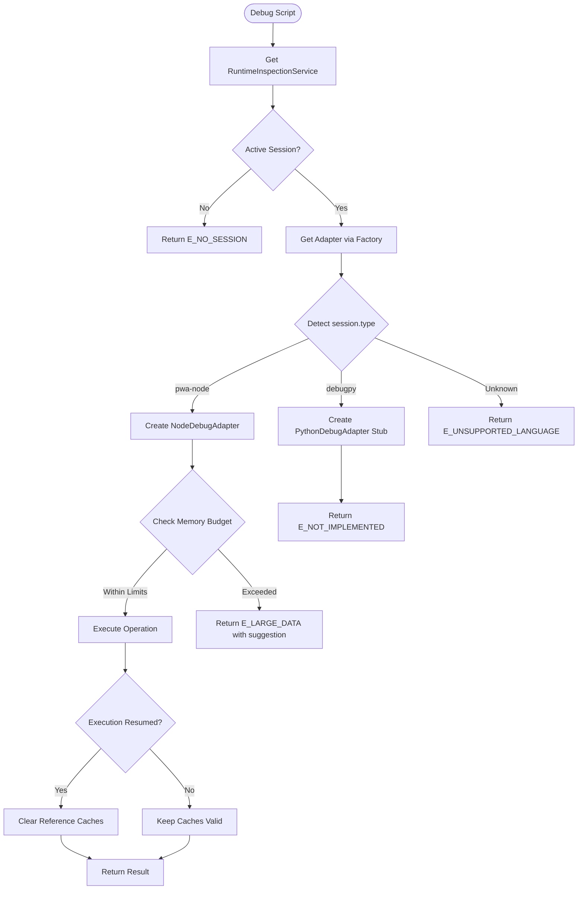
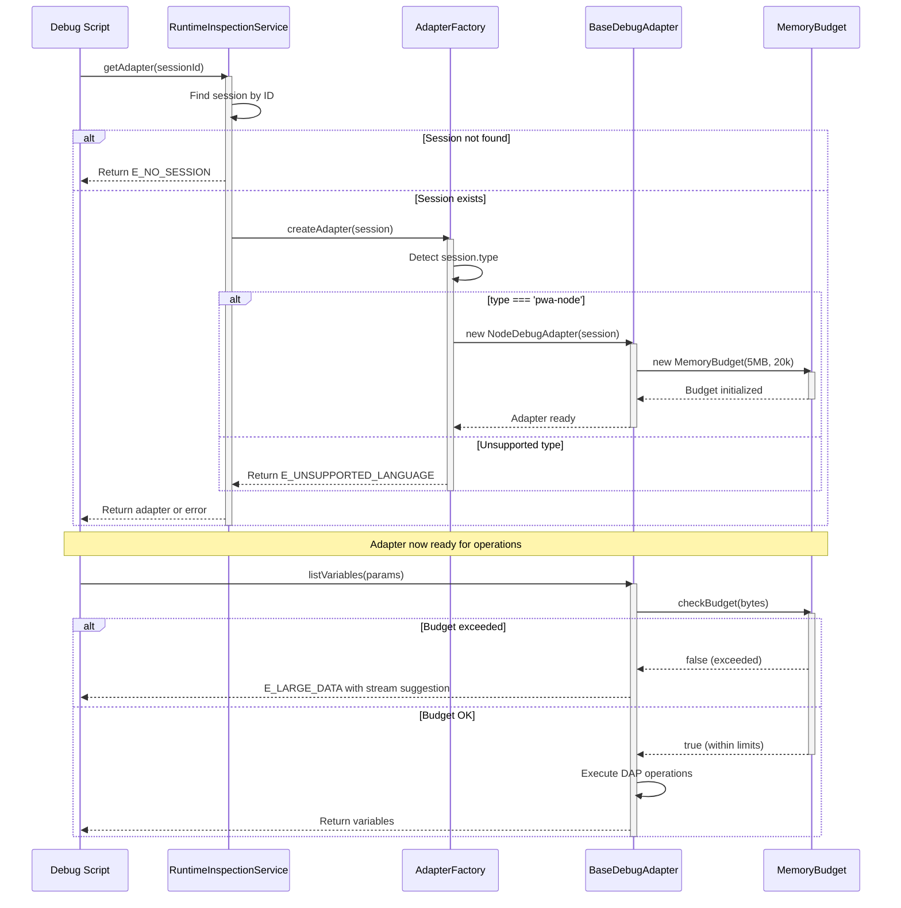

# Phase 2: Service Layer Architecture - Tasks Dossier

**Phase**: 2 - Service Layer Architecture
**Plan**: [../../debug-script-bake-in-plan.md](../../debug-script-bake-in-plan.md)
**Spec**: [../../debug-script-bake-in-spec.md](../../debug-script-bake-in-spec.md)
**Created**: 2025-01-31
**Completed**: 2025-01-31
**Status**: ✅ COMPLETE

## Tasks

| Status | ID | Task | Type | Dependencies | Absolute Path(s) | Validation | Notes |
|--------|-----|------|------|-------------|------------------|------------|-------|
| [x] | T001 | Review existing debug script base classes and DAP patterns | Setup | – | /Users/jordanknight/github/vsc-bridge/extension/src/core/scripts/base.ts, /Users/jordanknight/github/vsc-bridge/scripts/sample/dynamic/*.js | Patterns documented | Understand QueryScript/MutateScript, DAP operations |
| [x] | T002 | Create runtime-inspection directory structure | Setup | – | /Users/jordanknight/github/vsc-bridge/extension/src/core/runtime-inspection/ | Directory exists with /interfaces, /adapters subdirs | mkdir -p structure |
| [x] | T003 | Design IDebugAdapter interface with core debug operations | Core | T001 | /Users/jordanknight/github/vsc-bridge/extension/src/core/runtime-inspection/interfaces.ts | Interface compiles with TypeScript strict | Plan task 2.1, includes listVariables, setVariable, etc. [^1] |
| [x] | T004 | Define IDebugCapabilities interface for feature detection | Core | T003 | /Users/jordanknight/github/vsc-bridge/extension/src/core/runtime-inspection/interfaces.ts | All DAP capabilities represented | Plan task 2.1, boolean flags for features [^2] |
| [x] | T005 | Create IVariableData and related DAP type definitions | Core | T003 | /Users/jordanknight/github/vsc-bridge/extension/src/core/runtime-inspection/interfaces.ts | Types match DAP specification exactly | Plan task 2.2, includes variablesReference, evaluateName [^3] |
| [x] | T006 | Define parameter interfaces for all adapter methods | Core | T003, T005 | /Users/jordanknight/github/vsc-bridge/extension/src/core/runtime-inspection/interfaces.ts | All method params strongly typed | Plan task 2.2, IListVariablesParams, ISetVariableParams, etc. [^4] |
| [x] | T007 | Create RuntimeInspectionService skeleton class | Core | T002 | /Users/jordanknight/github/vsc-bridge/extension/src/core/runtime-inspection/RuntimeInspectionService.ts | Class instantiates without errors | Plan task 2.3, central coordinator [^5] |
| [x] | T008 | Implement singleton pattern for RuntimeInspectionService | Core | T007 | /Users/jordanknight/github/vsc-bridge/extension/src/core/runtime-inspection/RuntimeInspectionService.ts | getInstance() returns same instance | Plan task 2.3, only one service instance [^6] |
| [x] | T009 | Add session management with Map for active sessions | Core | T008 | /Users/jordanknight/github/vsc-bridge/extension/src/core/runtime-inspection/RuntimeInspectionService.ts | Sessions tracked by ID | Store vscode.DebugSession instances [^7] |
| [x] | T010 | Implement session lifecycle hooks (register/unregister) | Core | T009 | /Users/jordanknight/github/vsc-bridge/extension/src/core/runtime-inspection/RuntimeInspectionService.ts | Sessions added/removed correctly | Handle debug start/stop events [^8] |
| [x] | T011 | Create AdapterFactory class skeleton | Core | T004 | /Users/jordanknight/github/vsc-bridge/extension/src/core/runtime-inspection/AdapterFactory.ts | Factory class compiles | Plan task 2.4, adapter creation pattern [^9] |
| [x] | T012 | Implement session.type detection logic (Critical Discovery 04) | Core | T011 | /Users/jordanknight/github/vsc-bridge/extension/src/core/runtime-inspection/AdapterFactory.ts | Correctly identifies pwa-node, debugpy, dlv-dap | Per Critical Discovery 04, auto-detect language [^10] |
| [x] | T013 | Add supported language registry with constructor mapping | Core | T012 | /Users/jordanknight/github/vsc-bridge/extension/src/core/runtime-inspection/AdapterFactory.ts | Registry maps type strings to constructors | Map<string, AdapterConstructor> [^11] |
| [x] | T014 | Implement error handling for unsupported debugger types | Core | T013 | /Users/jordanknight/github/vsc-bridge/extension/src/core/runtime-inspection/AdapterFactory.ts | Returns E_UNSUPPORTED_LANGUAGE | Use error codes from Phase 1 [^12] |
| [x] | T015 | Create BaseDebugAdapter abstract class skeleton | Core | T003, T004 | /Users/jordanknight/github/vsc-bridge/extension/src/core/runtime-inspection/adapters/BaseDebugAdapter.ts | Abstract class compiles | Plan task 2.5, common DAP operations [^13] |
| [x] | T016 | Implement common DAP operations (threads, stack, scopes) | Core | T015 | /Users/jordanknight/github/vsc-bridge/extension/src/core/runtime-inspection/adapters/BaseDebugAdapter.ts | Methods return DAP responses | getThreads(), getStackFrames(), getScopes() [^14] |
| [x] | T017 | Add variable reference cache management | Core | T016 | /Users/jordanknight/github/vsc-bridge/extension/src/core/runtime-inspection/adapters/BaseDebugAdapter.ts | Caches store references | Map<number, IVariableData[]> [^15] |
| [x] | T018 | Implement cache clearing on resume (Critical Discovery 02) | Core | T017 | /Users/jordanknight/github/vsc-bridge/extension/src/core/runtime-inspection/adapters/BaseDebugAdapter.ts | Caches cleared when execution resumes | Per Critical Discovery 02, references invalidate [^16] |
| [x] | T019 | Create IMemoryBudget interface | Core | T002 | /Users/jordanknight/github/vsc-bridge/extension/src/core/runtime-inspection/MemoryBudget.ts | Interface defines budget methods | Plan task 2.6, dual tracking [^17] |
| [x] | T020 | Implement MemoryBudget class with node and byte tracking | Core | T019 | /Users/jordanknight/github/vsc-bridge/extension/src/core/runtime-inspection/MemoryBudget.ts | Tracks both metrics | Per Critical Discovery 03, 5MB/20k nodes [^18] |
| [x] | T021 | Add budget enforcement to BaseDebugAdapter | Core | T020, T015 | /Users/jordanknight/github/vsc-bridge/extension/src/core/runtime-inspection/adapters/BaseDebugAdapter.ts | Stops at thresholds | Plan task 2.6, prevent crashes [^19] |
| [x] | T022 | Create helper for E_LARGE_DATA with streaming suggestion | Core | T021 | /Users/jordanknight/github/vsc-bridge/extension/src/core/runtime-inspection/adapters/BaseDebugAdapter.ts | Returns helpful error | Suggest debug.save-variable [^20] |
| [x] | T023 | Wire adapter factory to RuntimeInspectionService | Integration | T010, T014 | /Users/jordanknight/github/vsc-bridge/extension/src/core/runtime-inspection/RuntimeInspectionService.ts | Service uses factory for adapters | getAdapter() method [^21] |
| [x] | T024 | Add adapter disposal and cleanup logic | Core | T023 | /Users/jordanknight/github/vsc-bridge/extension/src/core/runtime-inspection/RuntimeInspectionService.ts | Adapters disposed properly | Prevent memory leaks [^22] |
| [x] | T025 | Export all public interfaces and classes from index | Integration | T024 | /Users/jordanknight/github/vsc-bridge/extension/src/core/runtime-inspection/index.ts | Clean public API | Module exports [^23] |
| [x] | T026 | Create manual test harness script | Test | T025 | /Users/jordanknight/github/vsc-bridge/scripts/test/test-service-layer.js | Script validates all components | Plan task 2.7, manual testing [^24] |
| [x] | T027 | Document service layer architecture in README | Doc | T025 | /Users/jordanknight/github/vsc-bridge/extension/src/core/runtime-inspection/README.md | Architecture documented | Include Critical Discoveries [^25] |
| [x] | T028 | Execute manual validation with test harness | Test | T026, T027 | /Users/jordanknight/github/vsc-bridge/scripts/test/test-service-layer.js | All tests pass | Plan task 2.8, validate functionality [^26] |

## Alignment Brief

### Objective

Establish the service layer architecture with RuntimeInspectionService as the central coordinator and a flexible adapter pattern for language-specific debugging capabilities. This phase creates the foundation for all debug scripts to interact with different language debuggers through a unified interface.

### Behavior Checklist

- [x] RuntimeInspectionService manages debug session lifecycle
- [x] Adapter factory automatically selects correct adapter based on session.type
- [x] BaseDebugAdapter provides common DAP operations for all languages
- [x] Memory budget tracking prevents extension host crashes
- [x] Clear error messages for unsupported languages
- [x] Proper cleanup and disposal of adapters

### Critical Findings Affecting This Phase

**🚨 Critical Discovery 02: Variable Reference Lifecycle**
- **Constraint**: Variable references become invalid after execution resumes
- **Requirement**: Clear all caches when debugger continues/steps
- **Addressed by**: Tasks T017-T018 implement cache management with automatic clearing

**🚨 Critical Discovery 03: Memory Budget Critical for Large Data**
- **Constraint**: Large data structures (>5MB or >20k nodes) crash extension host
- **Requirement**: Implement dual budget tracking with hard limits
- **Addressed by**: Tasks T019-T022 implement MemoryBudget class with enforcement

**🚨 Critical Discovery 04: Language Detection via Session Type**
- **Constraint**: Different debuggers have different session.type identifiers
- **Requirement**: Auto-detect language from session.type property
- **Addressed by**: Task T012 implements type detection in AdapterFactory

### Invariants & Guardrails

- **Singleton Pattern**: Only one RuntimeInspectionService instance exists (enforced by private constructor)
- **Memory Limits**: Hard stop at 5MB or 20,000 nodes - no exceptions
- **Type Safety**: All interfaces use strict TypeScript types with no 'any' types
- **Error Standardization**: All errors use standardized codes from Phase 1 (/Users/jordanknight/github/vsc-bridge/extension/src/core/errors/debug-errors.ts)
- **No External Dependencies**: Service layer is self-contained except for VS Code API

### Inputs to Read

- `/Users/jordanknight/github/vsc-bridge/extension/src/core/scripts/base.ts` - Understand QueryScript/MutateScript patterns
- `/Users/jordanknight/github/vsc-bridge/extension/src/core/errors/debug-errors.ts` - Import error codes from Phase 1
- `/Users/jordanknight/github/vsc-bridge/scripts/sample/dynamic/list-variables.js` - Reference for adapter interface design
- `/Users/jordanknight/github/vsc-bridge/scripts/sample/dynamic/set-variable.js` - Reference for modification operations

### Visual Alignment Aids

#### Service Layer Flow Diagram



#### Adapter Creation Sequence Diagram



### Test Plan (Manual Testing Approach)

Manual testing as specified in the plan - no automated unit tests required.

**Test Scenarios**:

1. **test-singleton-pattern** (T008)
   - Call `RuntimeInspectionService.getInstance()` multiple times
   - Expected: Same instance returned each time
   - Validation: Object equality check

2. **test-session-management** (T009-T010)
   - Register/unregister mock sessions
   - Expected: Sessions tracked and removed correctly
   - Validation: Check internal Maps

3. **test-adapter-factory-node** (T012)
   - Create mock session with `type: 'pwa-node'`
   - Expected: NodeDebugAdapter created
   - Validation: instanceof check

4. **test-adapter-factory-unsupported** (T014)
   - Create mock session with `type: 'custom-debugger'`
   - Expected: E_UNSUPPORTED_LANGUAGE error
   - Validation: Error code check

5. **test-memory-budget-nodes** (T020)
   - Add nodes until 20,000 limit
   - Expected: Budget exceeded at threshold
   - Validation: isExceeded() returns true

6. **test-memory-budget-bytes** (T020)
   - Add bytes until 5MB limit
   - Expected: Budget exceeded at threshold
   - Validation: isExceeded() returns true

7. **test-cache-clearing** (T018)
   - Add items to cache, trigger resume
   - Expected: Caches empty after resume
   - Validation: Cache size === 0

8. **test-large-data-suggestion** (T022)
   - Trigger budget exceeded condition
   - Expected: Error includes save-variable suggestion
   - Validation: Error message contains "debug.save-variable"

### Step-by-Step Implementation Outline

1. **Setup Phase** (T001-T002)
   - Review existing patterns and understand DAP operations
   - Create directory structure for runtime-inspection module

2. **Interface Design** (T003-T006)
   - Define IDebugAdapter as main adapter interface
   - Create IDebugCapabilities for feature detection
   - Define all DAP-related types (IVariableData, etc.)
   - Create parameter interfaces for type safety

3. **Service Implementation** (T007-T010)
   - Create RuntimeInspectionService with singleton pattern
   - Implement session management with Maps
   - Add lifecycle hooks for session tracking

4. **Factory Pattern** (T011-T014)
   - Create AdapterFactory with type detection
   - Implement language registry
   - Add error handling for unsupported types

5. **Base Adapter** (T015-T018)
   - Create BaseDebugAdapter abstract class
   - Implement common DAP operations
   - Add cache management with clearing on resume

6. **Memory Budget** (T019-T022)
   - Create MemoryBudget class with dual tracking
   - Add enforcement to BaseDebugAdapter
   - Create helpful error messages with suggestions

7. **Integration** (T023-T025)
   - Wire factory to service
   - Add disposal logic
   - Export public API

8. **Testing & Documentation** (T026-T028)
   - Create manual test harness
   - Document architecture
   - Execute validation

### Commands to Run

```bash
# Compile TypeScript after implementation
cd /Users/jordanknight/github/vsc-bridge/extension
npm run compile

# Verify compilation success
npx tsc --noEmit -p ./tsconfig.json

# Run manual test harness (after T026)
node /Users/jordanknight/github/vsc-bridge/scripts/test/test-service-layer.js

# Check that exports are available
node -e "const ri = require('./out/core/runtime-inspection'); console.log(Object.keys(ri))"

# Launch Extension Development Host for integration testing
# 1. Open VS Code in project root
# 2. Press F5 to launch Extension Development Host
# 3. Start a Node.js debug session
# 4. Test adapter creation through debug console
```

### Risks & Unknowns

| Risk | Likelihood | Impact | Mitigation |
|------|------------|--------|------------|
| Complex inheritance hierarchy | Low | Medium | Keep to 2 levels max (Interface -> Base -> Concrete) |
| Session lifecycle edge cases | Medium | Low | Handle all VS Code debug events properly |
| Memory budget calculation inaccuracy | Low | Low | Use conservative estimates, test with real data |
| TypeScript compilation issues | Low | Low | Incremental compilation, strict mode |
| Factory pattern complexity | Low | Medium | Simple Map-based registry |

### Ready Check

- [x] Phase 1 (Error Codes) completed and available
- [x] Understanding of DAP protocol and VS Code debug API
- [x] Directory structure planned
- [x] Critical Discoveries 02, 03, 04 understood
- [x] Manual testing approach accepted
- [x] Memory budget thresholds confirmed (5MB/20,000 nodes)
- [x] TypeScript strict mode requirements understood

**✅ COMPLETE**: Phase 2 implementation completed successfully on 2025-01-31.

## Phase Footnote Stubs

| Footnote | Placeholder Description | Task |
|----------|------------------------|------|
| [^1] | Create IDebugAdapter interface with core operations | T003 |
| [^2] | Define IDebugCapabilities for feature detection | T004 |
| [^3] | Create DAP variable data types | T005 |
| [^4] | Define parameter interfaces | T006 |
| [^5] | Create RuntimeInspectionService class | T007 |
| [^6] | Implement singleton pattern | T008 |
| [^7] | Add session tracking with Maps | T009 |
| [^8] | Implement lifecycle hooks | T010 |
| [^9] | Create AdapterFactory skeleton | T011 |
| [^10] | Implement session.type detection per Critical Discovery 04 | T012 |
| [^11] | Add language registry mapping | T013 |
| [^12] | Handle unsupported types with error | T014 |
| [^13] | Create BaseDebugAdapter abstract class | T015 |
| [^14] | Implement common DAP operations | T016 |
| [^15] | Add variable reference caching | T017 |
| [^16] | Clear caches on resume per Critical Discovery 02 | T018 |
| [^17] | Create IMemoryBudget interface | T019 |
| [^18] | Implement dual budget tracking per Critical Discovery 03 | T020 |
| [^19] | Add budget enforcement to adapter | T021 |
| [^20] | Create streaming suggestion helper | T022 |
| [^21] | Wire factory to service | T023 |
| [^22] | Add disposal logic | T024 |
| [^23] | Export public API | T025 |
| [^24] | Create manual test harness | T026 |
| [^25] | Document architecture | T027 |
| [^26] | Execute validation | T028 |

## Evidence Artifacts

Implementation evidence will be written to:
- `execution.log.md` - Detailed implementation log with code changes and decisions
- `test-service-layer.js` - Manual test harness script for validation
- `test-results.md` - Manual test execution results and observations

## Directory Layout

```
docs/plans/8-debug-script-bake-in/
  ├── debug-script-bake-in-spec.md
  ├── debug-script-bake-in-plan.md
  └── tasks/
      ├── phase-1-error-code-infrastructure/
      │   ├── tasks.md
      │   ├── execution.log.md
      │   ├── test-checklist.md
      │   └── supplemental-mocha-conversion.md
      └── phase-2-service-layer-architecture/
          ├── tasks.md          # This file
          ├── execution.log.md  # Created by /plan-6-implement-phase
          └── test-results.md   # Manual test results
```