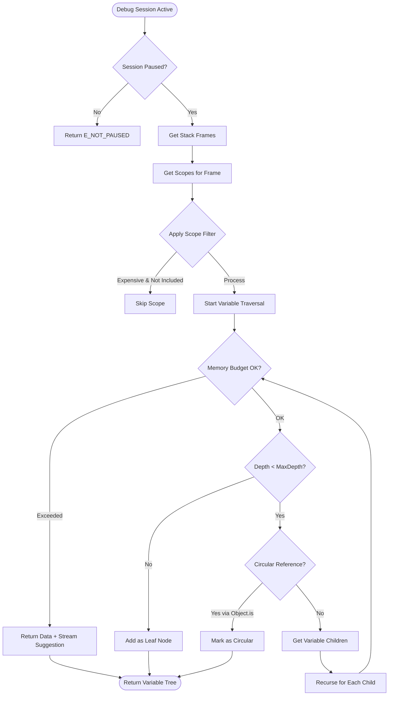
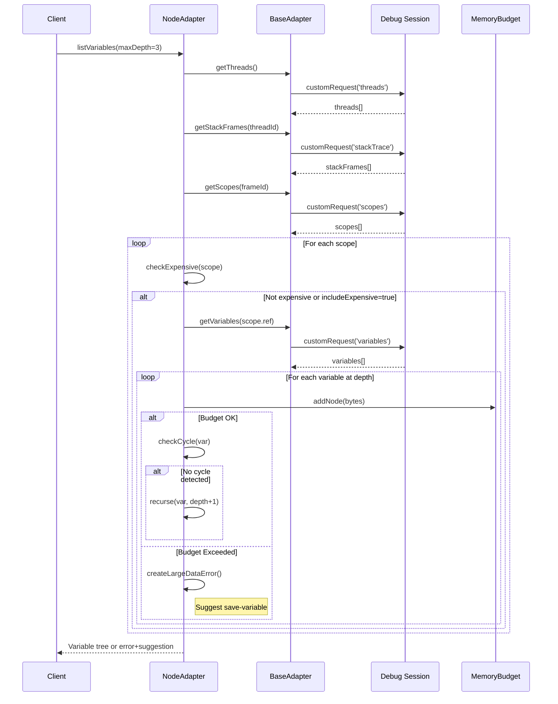

# Phase 3: Node.js Adapter Implementation - Tasks & Alignment Brief

**Phase**: Phase 3: Node.js Adapter Implementation
**Slug**: phase-3-nodejs-adapter
**Plan**: [/Users/jak/github/vsc-bridge/docs/plans/8-debug-script-bake-in/debug-script-bake-in-plan.md](../../debug-script-bake-in-plan.md)
**Spec**: [/Users/jak/github/vsc-bridge/docs/plans/8-debug-script-bake-in/debug-script-bake-in-spec.md](../../debug-script-bake-in-spec.md)
**Date**: 2025-10-04

## Tasks

| Status | ID | Task | Type | Dependencies | Absolute Path(s) | Validation | Notes |
|--------|-----|------|------|-------------|------------------|------------|-------|
| [x] | T001 | Create NodeDebugAdapter class file extending BaseDebugAdapter | Setup | – | /Users/jak/github/vsc-bridge/extension/src/core/runtime-inspection/adapters/node-adapter.ts | File exists and TypeScript compiles | Foundation for Node.js implementation [^18] |
| [x] | T002 | Implement constructor with capability detection for pwa-node | Core | T001 | /Users/jak/github/vsc-bridge/extension/src/core/runtime-inspection/adapters/node-adapter.ts | Capabilities set correctly for Node.js | Sets supportsSetVariable, supportsVariablePaging [^19] |
| [x] | T003 | Port listVariables logic from list-variables.js | Core | T002 | /Users/jak/github/vsc-bridge/extension/src/core/runtime-inspection/adapters/node-adapter.ts | Variables listed with depth control | Maps to plan task 3.2, includes maxDepth parameter [^20] |
| [x] | T004 | Implement recursive variable traversal with memory budget tracking | Core | T003 | /Users/jak/github/vsc-bridge/extension/src/core/runtime-inspection/adapters/node-adapter.ts | Memory budget enforced per Critical Discovery 03 | Stop at 5MB/20k nodes [^20] |
| [x] | T005 | Add Object.is() cycle detection for JavaScript objects | Core | T004 | /Users/jak/github/vsc-bridge/extension/src/core/runtime-inspection/adapters/node-adapter.ts | Cycles detected using Object.is() | Per Critical Discovery 05 for JavaScript [^21] |
| [x] | T006 | Implement fallback cycle detection using variablesReference tracking | Core | T005 | /Users/jak/github/vsc-bridge/extension/src/core/runtime-inspection/adapters/node-adapter.ts | Fallback works when Object.is() unavailable | Serial (shared file) [^21] |
| [x] | T007 | Port setVariable logic with dual strategy from set-variable.js | Core | T002 | /Users/jak/github/vsc-bridge/extension/src/core/runtime-inspection/adapters/node-adapter.ts | Variables modified correctly | Maps to plan task 3.3 [^22] |
| [x] | T008 | Add evaluate fallback for complex property modifications | Core | T007 | /Users/jak/github/vsc-bridge/extension/src/core/runtime-inspection/adapters/node-adapter.ts | obj.prop modifications work via evaluate | Serial (shared file) [^22] |
| [x] | T009 | Implement getVariableChildren with pagination support | Core | T002 | /Users/jak/github/vsc-bridge/extension/src/core/runtime-inspection/adapters/node-adapter.ts | Large arrays paginate correctly | Maps to plan task 3.5 [^23] |
| [x] | T010 | Add indexed/named filtering to getVariableChildren | Core | T009 | /Users/jak/github/vsc-bridge/extension/src/core/runtime-inspection/adapters/node-adapter.ts | Filter works for arrays vs objects | Serial (shared file) [^23] |
| [x] | T011 | Implement streamVariables with file output suggestion | Core | T002 | /Users/jak/github/vsc-bridge/extension/src/core/runtime-inspection/adapters/node-adapter.ts | Returns suggestion at 5MB/20k threshold | Maps to plan task 3.6 [^24] |
| [x] | T012 | Create test-node-adapter.js with comprehensive test cases | Test | T001 | /Users/jak/github/vsc-bridge/scripts/test/test-node-adapter.js | Test program covers all edge cases | Maps to plan task 3.7, [P] eligible [^26] |
| [x] | T013 | Add test cases for circular references and large arrays | Test | T012 | /Users/jak/github/vsc-bridge/scripts/test/test-node-adapter.js | Includes cycles, 100k+ arrays, deep nesting | Serial (shared file) [^26] |
| [x] | T014 | Document manual test procedures in test checklist | Doc | T012 | /Users/jak/github/vsc-bridge/docs/plans/8-debug-script-bake-in/tasks/phase-3-nodejs-adapter/test-checklist.md | Step-by-step validation guide | Maps to plan task 3.8, [P] eligible [^27] |
| [x] | T015 | Update AdapterFactory to return NodeDebugAdapter for pwa-node | Integration | T011 | /Users/jak/github/vsc-bridge/extension/src/core/runtime-inspection/AdapterFactory.ts | Factory returns NodeDebugAdapter correctly | Register pwa-node session type [^25] |
| [x] | T016 | Execute manual validation against dynamic scripts | Test | T015 | /Users/jak/github/vsc-bridge/scripts/test/compare-dynamic-vs-node.js | All features match dynamic script behavior | Maps to plan task 3.9, ready for execution |

## Alignment Brief

### Objective

Implement a fully functional NodeDebugAdapter class that ports all proven logic from the dynamic debug scripts (list-variables.js, set-variable.js, var-children.js, save-variable.js) while leveraging the Phase 2 service layer architecture. This adapter will provide complete Node.js debugging capabilities including variable exploration with depth control, cycle detection, modification support, and memory budget enforcement.

### Behavior Checklist

Based on the plan acceptance criteria and spec requirements:

- [ ] NodeDebugAdapter extends BaseDebugAdapter and implements all abstract methods
- [ ] Variable listing respects maxDepth parameter and stops at specified depth
- [ ] Object.is() cycle detection prevents infinite loops in JavaScript object graphs
- [ ] Memory budget tracking stops traversal at 5MB/20,000 nodes
- [ ] Variable modification works via both setVariable and evaluate fallback
- [ ] Large arrays paginate correctly with start/count parameters
- [ ] Stream suggestion triggered when thresholds exceeded
- [ ] All functionality matches dynamic script behavior exactly

### Critical Findings Affecting This Phase

**🚨 Critical Discovery 02: Variable Reference Lifecycle**
- **Impact**: Must never cache variable references between debug operations
- **Tasks affected**: T003, T004 - Always fetch fresh references in listVariables
- **Implementation**: Clear caches handled by BaseDebugAdapter lifecycle hooks

**🚨 Critical Discovery 03: Memory Budget Critical for Large Data**
- **Impact**: Must implement dual budget (nodes + bytes) with streaming option
- **Tasks affected**: T004, T011 - Track memory in listVariables, suggest streaming
- **Implementation**: Use MemoryBudget class from Phase 2, return suggestion at limits

**🚨 Critical Discovery 05: Cycle Detection Strategies Vary by Language**
- **Impact**: JavaScript requires Object.is() for accurate cycle detection
- **Tasks affected**: T005, T006 - Implement Object.is() with fallback strategy
- **Implementation**: Evaluate `Object.is(current, ancestor)` expressions via DAP

### Invariants & Guardrails

- **Performance**: Variable traversal must stop at 5MB or 20,000 nodes
- **Memory**: No unbounded recursion - all traversals must check budget
- **Security**: No execution of user-provided code without evaluate context
- **Compatibility**: Must work with pwa-node debug adapter (VS Code's Node.js debugger)

### Inputs to Read

Key files to understand before implementation:
- `/Users/jak/github/vsc-bridge/scripts/sample/dynamic/list-variables.js` - Variable listing logic to port
- `/Users/jak/github/vsc-bridge/scripts/sample/dynamic/set-variable.js` - Modification strategies
- `/Users/jak/github/vsc-bridge/scripts/sample/dynamic/var-children.js` - Pagination logic
- `/Users/jak/github/vsc-bridge/scripts/sample/dynamic/save-variable.js` - File output pattern
- `/Users/jak/github/vsc-bridge/extension/src/core/runtime-inspection/adapters/BaseDebugAdapter.ts` - Base class to extend
- `/Users/jak/github/vsc-bridge/extension/src/core/runtime-inspection/interfaces.ts` - Interfaces to implement

### Visual Alignment Aids

#### System Flow Diagram



#### Sequence Diagram



### Test Plan

**Approach**: Manual testing with real Node.js debugging sessions

**Test Program** (`test-node-adapter.js`):
```javascript
// Test cases to cover:
const simpleVars = { a: 1, b: "test", c: true };
const deepNested = { level1: { level2: { level3: { level4: "deep" }}}};
const circular = { name: "root" }; circular.self = circular;
const largeArray = Array(100000).fill(0).map((_, i) => i);
const mixedTypes = {
    num: 42,
    str: "hello",
    bool: false,
    arr: [1,2,3],
    obj: {x:1},
    nil: null,
    undef: undefined,
    func: () => "test"
};
```

**Test Scenarios**:
1. **T-NJS-001**: List variables with default depth (2) - verify stops at depth
2. **T-NJS-002**: List variables with maxDepth=5 - verify deep traversal
3. **T-NJS-003**: Circular reference detection - verify Object.is() detects cycle
4. **T-NJS-004**: Large array pagination - verify 100k array doesn't crash
5. **T-NJS-005**: Memory budget enforcement - verify stops at 5MB/20k nodes
6. **T-NJS-006**: Set simple variable - verify modification works
7. **T-NJS-007**: Set object property via evaluate - verify obj.prop = value works
8. **T-NJS-008**: Get variable children with pagination - verify start/count params
9. **T-NJS-009**: Stream suggestion at threshold - verify helpful message returned

### Step-by-Step Implementation Outline

1. **Setup** (T001-T002)
   - Create node-adapter.ts file with class declaration
   - Implement constructor setting Node.js-specific capabilities

2. **Core Variable Listing** (T003-T006)
   - Port listVariables from dynamic script with recursive traversal
   - Add memory budget checking at each node
   - Implement Object.is() cycle detection with evaluate
   - Add fallback cycle detection via reference tracking

3. **Variable Modification** (T007-T008)
   - Port setVariable logic with try-catch pattern
   - Implement evaluate fallback for property paths

4. **Pagination Support** (T009-T010)
   - Implement getVariableChildren with start/count
   - Add indexed vs named filtering

5. **Streaming Suggestion** (T011)
   - Implement streamVariables returning suggestion
   - Include file path and helpful message

6. **Testing** (T012-T014)
   - Create comprehensive test program
   - Document manual test procedures
   - Write validation checklist

7. **Integration** (T015-T016)
   - Update AdapterFactory registration
   - Run full validation against dynamic scripts

### Commands to Run

```bash
# Compile TypeScript
cd /Users/jak/github/vsc-bridge
npm run compile

# Run Extension Development Host
# Press F5 in VS Code or:
code --extensionDevelopmentPath=/Users/jak/github/vsc-bridge/extension

# Test with sample program
cd /Users/jak/github/vsc-bridge/scripts/test
node test-node-adapter.js
# Set breakpoint and pause

# Run manual tests via vscb CLI
cd /Users/jak/github/vsc-bridge/test
../cli/dist/cli.js script run -f ../extension/src/vsc-scripts/debug/list-variables.js --param maxDepth=3

# Compare with dynamic scripts
../cli/dist/cli.js script run -f ../scripts/sample/dynamic/list-variables.js --param maxDepth=3
```

### Risks & Unknowns

| Risk | Severity | Mitigation |
|------|----------|------------|
| Object.is() may not work in all Node versions | Medium | Implement fallback to reference tracking |
| Memory calculation may be inaccurate | Low | Use conservative estimates, add telemetry |
| Cycle detection might have false positives | Low | Only check when evaluateName available |
| Large data might still cause issues | Medium | Strict budget enforcement, clear messaging |

### Ready Check

Before starting implementation:

- [ ] Phase 2 (Service Layer Architecture) is complete and tested
- [ ] BaseDebugAdapter is fully implemented with lifecycle management
- [ ] MemoryBudget class is working with dual thresholds
- [ ] Dynamic scripts are accessible for reference
- [ ] Test environment is set up with Node.js debug configuration
- [ ] AdapterFactory is ready for new adapter registration

**GO/NO-GO Decision Point**: ____________

## Phase Footnote Stubs

| Task | Description | Footnote |
|------|-------------|----------|
| T001-T002 | Create NodeDebugAdapter class and constructor | [^18] [^19] |
| T003-T004 | Port listVariables with memory budget tracking | [^20] |
| T005-T006 | Object.is() cycle detection with fallback | [^21] |
| T007-T008 | Dual strategy variable modification | [^22] |
| T009-T010 | Variable children pagination with filtering | [^23] |
| T011 | Stream variables suggestion | [^24] |
| T015 | AdapterFactory registration | [^25] |
| T012-T013 | Test program with comprehensive cases | [^26] |
| T014 | Manual test checklist documentation | [^27] |

[^18]: Created [`file:extension/src/core/runtime-inspection/adapters/node-adapter.ts`](../../extension/src/core/runtime-inspection/adapters/node-adapter.ts) - Complete NodeDebugAdapter class (512 lines) extending BaseDebugAdapter with full Node.js debugging capabilities

[^19]: Implemented [`class:extension/src/core/runtime-inspection/adapters/node-adapter.ts:NodeDebugAdapter`](../../extension/src/core/runtime-inspection/adapters/node-adapter.ts#L76) - Constructor sets Node.js-specific capabilities for pwa-node debugger

[^20]: Implemented [`method:extension/src/core/runtime-inspection/adapters/node-adapter.ts:NodeDebugAdapter.listVariables`](../../extension/src/core/runtime-inspection/adapters/node-adapter.ts#L103) - Ported list-variables.js logic with memory budget tracking per Critical Discovery 03 (5MB/20k nodes)

[^21]: Implemented cycle detection in listVariables per Critical Discovery 05 - JavaScript-specific Object.is() evaluation with fallback to variablesReference tracking

[^22]: Implemented [`method:extension/src/core/runtime-inspection/adapters/node-adapter.ts:NodeDebugAdapter.setVariable`](../../extension/src/core/runtime-inspection/adapters/node-adapter.ts#L356) - Dual strategy: setVariable request first, evaluate fallback for property paths

[^23]: Implemented [`method:extension/src/core/runtime-inspection/adapters/node-adapter.ts:NodeDebugAdapter.getVariableChildren`](../../extension/src/core/runtime-inspection/adapters/node-adapter.ts#L434) - Pagination with start/count parameters and indexed/named filtering

[^24]: Implemented [`method:extension/src/core/runtime-inspection/adapters/node-adapter.ts:NodeDebugAdapter.streamVariables`](../../../../extension/src/core/runtime-inspection/adapters/node-adapter.ts#L468) - Returns E_NOT_IMPLEMENTED with suggestion to use debug.save-variable script

[^25]: Modified [`file:extension/src/core/runtime-inspection/AdapterFactory.ts`](../../extension/src/core/runtime-inspection/AdapterFactory.ts#L44) - Registered NodeDebugAdapter for 'pwa-node' and 'node' session types

[^26]: Created [`file:scripts/test/test-node-adapter.js`](../../../scripts/test/test-node-adapter.js) - Comprehensive test program with 8 test cases covering all edge scenarios

[^27]: Created [`file:docs/plans/8-debug-script-bake-in/tasks/phase-3-nodejs-adapter/test-checklist.md`](./test-checklist.md) - Detailed manual test procedures with 15 test scenarios

## Evidence Artifacts

The following artifacts were created during Phase 3 implementation:

```
docs/plans/8-debug-script-bake-in/
  └── tasks/phase-3-nodejs-adapter/
      ├── tasks.md                    # This file (task dossier)
      ├── execution.log.md            # ✅ Implementation log
      └── test-checklist.md           # ✅ Manual test procedures

extension/src/core/runtime-inspection/adapters/
  └── node-adapter.ts                # ✅ NodeDebugAdapter implementation (512 lines)

scripts/test/
  └── test-node-adapter.js           # ✅ Comprehensive test program (147 lines)
```

**Status**: Implementation complete, ready for manual testing validation

## Directory Layout

```
docs/plans/8-debug-script-bake-in/
  ├── debug-script-bake-in-plan.md
  ├── debug-script-bake-in-spec.md
  └── tasks/
      ├── phase-1-error-code-infrastructure/
      │   ├── tasks.md
      │   └── execution.log.md
      ├── phase-2-service-layer-architecture/
      │   ├── tasks.md
      │   └── execution.log.md
      └── phase-3-nodejs-adapter/
          ├── tasks.md                 # This file
          └── execution.log.md         # Created by plan-6
```