# Subtask 001: Fix tests.debug-wait to Use VS Code Testing API

**Parent Plan**: [debug-script-bake-in-plan.md](../../debug-script-bake-in-plan.md)
**Parent Phase**: Phase 4: Script Conversion & Integration
**Created**: 2025-10-05
**Completed**: 2025-10-05
**Status**: ✅ COMPLETE

## Subtask Metadata

| Field | Value |
|-------|-------|
| **Parent Plan** | [8-debug-script-bake-in](../../debug-script-bake-in-plan.md) |
| **Parent Phase** | Phase 4: Script Conversion & Integration |
| **Parent Tasks** | Task 4.3 (and all testing tasks) |
| **Subtask Summary** | Fix tests.debug-wait to use VS Code Testing API instead of manual debug config construction |
| **Requested By** | Human Sponsor |
| **Discovery Context** | Found while validating Task 4.3 (list-variables) - tests.debug-wait fails to run Jest tests because it manually constructs debug configs with hardcoded paths instead of using VS Code's Testing API |
| **Created** | 2025-10-05 |

## Tasks

| Status | ID | Task | Type | Dependencies | Absolute Path(s) | Validation | Notes |
|--------|-----|------|------|--------------|------------------|------------|-------|
| [x] | ST001 | Add Testing API imports to debug-wait.js | Core | – | /Users/jordanknight/github/vsc-bridge/extension/src/vsc-scripts/tests/debug-wait.js | Imports compile | Import TestExecutor and TestingApiChecker (same as debug-single.js); supports parent Task 4.3 [^ST.1] |
| [x] | ST002 | Add Testing API availability check | Core | ST001 | /Users/jordanknight/github/vsc-bridge/extension/src/vsc-scripts/tests/debug-wait.js | Check returns correct boolean | Mirror debug-single.js lines 47-54; check before attempting test execution [^ST.2] |
| [x] | ST003 | Create Testing API execution path | Core | ST002 | /Users/jordanknight/github/vsc-bridge/extension/src/vsc-scripts/tests/debug-wait.js | Uses testing.debugAtCursor | When Testing API available, use TestExecutor.debugTestAtCursor() instead of manual config [^ST.3] |
| [x] | ST004 | Preserve manual launch config fallback | Core | ST003 | /Users/jordanknight/github/vsc-bridge/extension/src/vsc-scripts/tests/debug-wait.js | Falls back for non-test files | Keep existing manual approach for plain Node.js files (non-test scenarios) [^ST.4] |
| [x] | ST005 | Update startDebugAndWait to support both paths | Core | ST003, ST004 | /Users/jordanknight/github/vsc-bridge/extension/src/core/debug/debug-and-wait.ts | Accepts both config types | No changes needed - Testing API uses DebugEventHub directly [^ST.5] |
| [x] | ST006 | Preserve conditional breakpoint support | Core | ST003 | /Users/jordanknight/github/vsc-bridge/extension/src/vsc-scripts/tests/debug-wait.js | Conditions still work | Ensure condition, hitCondition, logMessage params still function [^ST.6] |
| [x] | ST007 | Preserve event tracking logic | Core | ST003 | /Users/jordanknight/github/vsc-bridge/extension/src/vsc-scripts/tests/debug-wait.js | Returns stopped/terminated/error events | Keep all Debug Adapter Tracker logic intact [^ST.7] |
| [x] | ST008 | Test with Jest example.test.js | Test | ST001-ST007 | /Users/jordanknight/github/vsc-bridge/test/javascript/example.test.js | Successfully debugs Jest test | ✅ VALIDATED: Jest debugging works, hit breakpoint in ~5s [^ST.8] |
| [x] | ST009 | Test with standalone Node.js file | Test | ST001-ST007 | /Users/jordanknight/github/vsc-bridge/test/javascript/simple-debug-test.js | Falls back to manual config | ✅ VALIDATED: Fallback works, hit breakpoint in ~2.5s [^ST.9] |
| [x] | ST010 | Update documentation | Doc | ST001-ST009 | /Users/jordanknight/github/vsc-bridge/extension/src/vsc-scripts/tests/debug-wait.js | Docs reflect new architecture | ✅ COMPLETE: Architecture documented, section headers added [^ST.10] |

**Progress**: 10/10 tasks complete (100%) ✅ **SUBTASK COMPLETE**

## Alignment Brief

### Objective

Fix the architectural flaw in `tests.debug-wait` where it manually constructs debug configurations with hardcoded paths (e.g., `${workspaceFolder}/node_modules/.bin/jest`) instead of delegating to VS Code's Testing API. This causes failures in complex project structures where test frameworks are installed in subdirectories or use custom execution methods.

The fix preserves all valuable features of `tests.debug-wait` (conditional breakpoints, event tracking, detailed results) while making it work reliably across all project structures and test frameworks.

### Behavior Checklist

Based on discovering this bug during Phase 4 Task 4.3 validation:

- [ ] tests.debug-wait uses Testing API when available (like tests.debug-single)
- [ ] tests.debug-wait still supports conditional breakpoints
- [ ] tests.debug-wait still tracks events (stopped/terminated/error)
- [ ] tests.debug-wait returns detailed event information
- [ ] tests.debug-wait falls back to manual config for non-test files
- [ ] Jest tests can be debugged via tests.debug-wait
- [ ] Standalone Node.js files still work (fallback path)
- [ ] No regression in existing functionality
- [ ] Documentation updated to reflect architecture

### Critical Findings Affecting This Subtask

**🚨 Discovery from Task 4.3 Validation: Manual Debug Config Construction Fails**
- **Problem**: tests.debug-wait manually builds debug configs assuming `${workspaceFolder}/node_modules/.bin/jest`
- **Root Cause**: JavaScriptTestDetector.ts lines 151-165 hardcode Jest binary path
- **Impact**: Fails when Jest is in subdirectory (e.g., `/test/javascript/node_modules/`)
- **Why VS Code UI Works**: Uses `npm run test` via Testing API, which resolves paths correctly
- **Solution**: Delegate to Testing API like tests.debug-single does

**🚨 Existing Pattern: tests.debug-single Already Does This Right**
- **Evidence**: debug-single.js uses `TestExecutor.debugTestAtCursor()`
- **API**: Calls `vscode.commands.executeCommand('testing.debugAtCursor')`
- **Benefit**: Test extensions (vscode-jest, Python, etc.) handle all path/config logic
- **Pattern**: tests.debug-wait should adopt same approach + keep tracker logic

**🚨 tests.debug-wait Has Unique Value - Don't Remove, Fix!**
- **Features tests.debug-single lacks**: Conditional breakpoints, event tracking, detailed outcomes
- **Architecture**: Should be `tests.debug-single + event tracking + conditions`
- **Scope**: This is an architecture fix, not feature addition

### Invariants & Guardrails

**Architectural Invariants**:
- Testing API is the PRIMARY path for test files
- Manual launch config is FALLBACK for non-test files
- All existing params must continue to work (condition, hitCondition, logMessage)
- Event tracking must remain race-free (Debug Adapter Trackers)

**Compatibility Requirements**:
- Must work with vscode-jest extension
- Must work with standalone Node.js files (fallback)
- Must not break any existing tests.debug-wait users
- Python/other language support deferred to future work

**Code Quality**:
- Follow patterns from tests.debug-single
- Preserve all comments about race conditions and trackers
- Add clear comments explaining Testing API vs fallback paths

### Inputs to Read

**Existing Implementations**:
- `/Users/jordanknight/github/vsc-bridge/extension/src/vsc-scripts/tests/debug-single.js` - THE REFERENCE (correct pattern)
- `/Users/jordanknight/github/vsc-bridge/extension/src/vsc-scripts/tests/debug-wait.js` - File to fix
- `/Users/jordanknight/github/vsc-bridge/extension/src/core/testing/test-executor.ts` - TestExecutor implementation
- `/Users/jordanknight/github/vsc-bridge/extension/src/core/testing/availability.ts` - TestingApiChecker

**Files That Currently Cause Failure**:
- `/Users/jordanknight/github/vsc-bridge/extension/src/core/test-environments/detectors/JavaScriptTestDetector.ts` - Hardcoded paths (lines 151-165)

**Debug Helper**:
- `/Users/jordanknight/github/vsc-bridge/extension/src/core/debug/debug-and-wait.ts` - May need updates to support both paths

**Test Files**:
- `/Users/jordanknight/github/vsc-bridge/test/javascript/example.test.js` - Jest test that currently fails
- `/Users/jordanknight/github/vsc-bridge/test/javascript/simple-debug-test.js` - Standalone file for fallback testing

### Visual Alignment Aids

#### Current (Broken) Architecture

```mermaid
flowchart TD
    Start([User calls tests.debug-wait])

    DetectEnv[Detect test environment]
    BuildConfig[Manually build debug config]
    HardcodePath[Hardcode Jest path:<br/>${workspaceFolder}/node_modules/.bin/jest]
    PathNotFound{Jest binary<br/>exists?}
    Fail[❌ FAIL: describe is not defined]

    SetTracker[Set up Debug Adapter Tracker]
    StartDebug[Start debug with manual config]
    WaitEvent[Wait for events]
    Return[Return event details]

    Start --> DetectEnv
    DetectEnv --> BuildConfig
    BuildConfig --> HardcodePath
    HardcodePath --> PathNotFound
    PathNotFound -->|No| Fail
    PathNotFound -->|Yes| SetTracker
    SetTracker --> StartDebug
    StartDebug --> WaitEvent
    WaitEvent --> Return

    style Fail fill:#f66,stroke:#c33
    style HardcodePath fill:#fc9,stroke:#f90
```

#### Target (Fixed) Architecture

```mermaid
flowchart TD
    Start([User calls tests.debug-wait])

    CheckAPI{Testing API<br/>available?}
    IsTestFile{File is<br/>test?}

    UseTestingAPI[Use testing.debugAtCursor<br/>Delegate to test extension]
    ManualConfig[Build manual debug config<br/>For standalone files]

    SetTracker[Set up Debug Adapter Tracker]
    WaitEvent[Wait for events<br/>stopped/terminated/error]
    Return[✅ Return detailed event info]

    Start --> CheckAPI
    CheckAPI -->|Yes| IsTestFile
    CheckAPI -->|No| ManualConfig
    IsTestFile -->|Yes| UseTestingAPI
    IsTestFile -->|No| ManualConfig

    UseTestingAPI --> SetTracker
    ManualConfig --> SetTracker
    SetTracker --> WaitEvent
    WaitEvent --> Return

    style UseTestingAPI fill:#9f9,stroke:#6c6
    style Return fill:#9f9,stroke:#6c6
```



#### Execution Sequence Comparison

```mermaid
sequenceDiagram
    participant User
    participant DebugWait as tests.debug-wait
    participant TestAPI as VS Code Testing API
    participant JestExt as vscode-jest Extension
    participant Tracker as Debug Adapter Tracker
    participant DAP as Debug Adapter

    Note over User,DAP: NEW APPROACH (Testing API)
    User->>DebugWait: tests.debug-wait path=example.test.js line=266
    DebugWait->>DebugWait: Check Testing API available
    DebugWait->>TestAPI: testing.debugAtCursor(uri, position)
    TestAPI->>JestExt: Resolve test + create debug config
    JestExt->>JestExt: Use npm run test (correct paths!)
    DebugWait->>Tracker: Register adapter tracker
    JestExt->>DAP: Start debug session
    DAP-->>Tracker: Session started event
    DAP-->>Tracker: Stopped at breakpoint event
    Tracker-->>DebugWait: Event: stopped, reason: breakpoint
    DebugWait-->>User: ✅ { event: 'stopped', file, line, reason }

    Note over User,DAP: OLD APPROACH (Manual Config) - BROKEN
    User->>DebugWait: tests.debug-wait (old way)
    DebugWait->>DebugWait: Detect Jest manually
    DebugWait->>DebugWait: Build config: program=${workspaceFolder}/node_modules/.bin/jest
    DebugWait->>DAP: Start debug with config
    DAP-->>DebugWait: ❌ Error: Jest binary not found
    DebugWait-->>User: ❌ { event: 'error', message: 'describe is not defined' }
```



### Test Plan

**Approach**: Manual testing + integration tests

**Test Scenarios**:

1. **Jest Test (Primary Fix Validation)**
   - File: `/test/javascript/example.test.js:266`
   - Command: `vscb script run tests.debug-wait --param path=... --param line=266`
   - Expected: Uses Testing API, debugs successfully, hits breakpoint
   - Validates: ST001-ST003, ST008

2. **Jest Test with Condition**
   - File: Same as above
   - Command: Add `--param condition="numberVar > 40"`
   - Expected: Conditional breakpoint works
   - Validates: ST006

3. **Standalone Node.js File (Fallback)**
   - File: `/test/javascript/simple-debug-test.js:11`
   - Command: `vscb script run tests.debug-wait --param path=... --param line=11`
   - Expected: Falls back to manual config, still works
   - Validates: ST004, ST009

4. **Event Tracking**
   - Any test file
   - Expected: Returns `{event: 'stopped', reason: 'breakpoint', file, line, functionName}`
   - Validates: ST007 (no regression)

### Implementation Outline

1. **Preparation** (ST001):
   - Study `debug-single.js` lines 1-100
   - Understand TestExecutor API
   - Understand TestingApiChecker API

2. **Add Testing API Path** (ST002-ST003):
   - Import TestExecutor and TestingApiChecker
   - Add availability check (if statement)
   - Call `TestExecutor.debugTestAtCursor()` in new branch
   - Pass result to existing tracker logic

3. **Preserve Fallback** (ST004):
   - Keep existing manual config code path
   - Make it conditional (else branch)
   - Add comments explaining when each path is used

4. **Update startDebugAndWait** (ST005):
   - Handle TestExecutor result format
   - Support both config types
   - Preserve all tracker logic

5. **Preserve Features** (ST006-ST007):
   - Ensure conditional breakpoint params flow through Testing API path
   - Verify all tracker logic remains intact
   - Test event return format unchanged

6. **Testing** (ST008-ST009):
   - Manual test with example.test.js
   - Manual test with standalone file
   - Verify both scenarios work

7. **Documentation** (ST010):
   - Add architecture comments
   - Explain Testing API vs fallback
   - Update any user-facing docs

### Commands to Run

```bash
# Development workflow
cd /Users/jordanknight/github/vsc-bridge

# Build after changes
just dev-build

# Test 1: Jest test (primary validation)
cd test
vscb script run tests.debug-wait \
  --param path=/Users/jordanknight/github/vsc-bridge/test/javascript/example.test.js \
  --param line=266

# Test 2: Jest with condition
vscb script run tests.debug-wait \
  --param path=/Users/jordanknight/github/vsc-bridge/test/javascript/example.test.js \
  --param line=266 \
  --param condition="numberVar > 40"

# Test 3: Standalone file (fallback)
vscb script run tests.debug-wait \
  --param path=/Users/jordanknight/github/vsc-bridge/test/javascript/simple-debug-test.js \
  --param line=11

# Verify no regressions in tests.debug-single
vscb script run tests.debug-single \
  --param path=/Users/jordanknight/github/vsc-bridge/test/javascript/example.test.js \
  --param line=266
```

### Risks & Unknowns

**Risk**: Testing API might not support all conditional breakpoint features
- **Severity**: Medium
- **Mitigation**: Test early; if unsupported, set breakpoints manually via DAP after debugging starts
- **Status**: Unknown - need to verify

**Risk**: startDebugAndWait may need significant refactoring
- **Severity**: Low
- **Mitigation**: Keep changes minimal; TestExecutor result should be compatible
- **Status**: Low likelihood based on code review

**Risk**: Fallback path might break existing users
- **Severity**: Medium
- **Mitigation**: Extensive testing of fallback scenarios; keep exact same code path as before
- **Status**: Mitigated by preserving original logic

**Unknown**: Does testing.debugAtCursor support conditional breakpoints?
- **Investigation**: Check VS Code Testing API docs + TestExecutor implementation
- **Fallback**: Set breakpoints programmatically after session starts

**Unknown**: How does TestExecutor handle non-test files?
- **Investigation**: Read TestExecutor.debugTestAtCursor() error handling
- **Expected**: Returns error, triggers fallback to manual config

### Ready Check

Before invoking `/plan-6-implement-phase --subtask 001-subtask-fix-test-debug-wait-to-use-vs-code-testing-api`:

- [x] Subtask dossier created and reviewed
- [x] Parent Task 4.3 context understood (this bug blocks validation)
- [x] Reference implementation studied (debug-single.js)
- [x] Test files identified (example.test.js, simple-debug-test.js)
- [x] Architecture diagrams show clear before/after
- [ ] All ST tasks (ST001-ST010) understood and sequenced
- [ ] Test plan covers all scenarios (Jest, standalone, conditions)
- [ ] Risk mitigations planned
- [ ] Commands ready to execute

**Blocking Issues**: None - ready for implementation

**Next Step**: Await GO from human sponsor, then invoke `/plan-6-implement-phase --subtask 001-subtask-fix-test-debug-wait-to-use-vs-code-testing-api`

## Phase Footnotes

| Footnote | File | Description |
|----------|------|-------------|
| [^ST.1] | [`file:extension/src/vsc-scripts/tests/debug-wait.js#L9-11`](extension/src/vsc-scripts/tests/debug-wait.js#L9-11) | Added Testing API imports (TestExecutor, TestingApiChecker) following debug-single.js pattern |
| [^ST.2] | [`file:extension/src/vsc-scripts/tests/debug-wait.js#L108-148`](extension/src/vsc-scripts/tests/debug-wait.js#L108-148) | Added Testing API availability check with TestingApiChecker.isAvailable() |
| [^ST.3] | [`file:extension/src/vsc-scripts/tests/debug-wait.js#L112-203`](extension/src/vsc-scripts/tests/debug-wait.js#L112-203) | Implemented complete Testing API execution path using TestExecutor.debugTestAtCursor() and DebugEventHub.waitForOutcome() |
| [^ST.4] | [`file:extension/src/vsc-scripts/tests/debug-wait.js#L205-216`](extension/src/vsc-scripts/tests/debug-wait.js#L205-216) | Preserved manual config fallback with error handling for API_UNAVAILABLE and NO_TEST_AT_CURSOR cases |
| [^ST.5] | No changes needed | Testing API path uses DebugEventHub directly, manual path continues using startDebugAndWait unchanged - natural separation |
| [^ST.6] | [`file:extension/src/vsc-scripts/tests/debug-wait.js#L133-153`](extension/src/vsc-scripts/tests/debug-wait.js#L133-153) | Added conditional breakpoint support in Testing API path using vscode.debug.addBreakpoints() |
| [^ST.7] | [`file:extension/src/vsc-scripts/tests/debug-wait.js#L155-203`](extension/src/vsc-scripts/tests/debug-wait.js#L155-203) | Used DebugEventHub for race-free event tracking, transforms all outcome types (stopped/terminated/exited/error) |
| [^ST.8] | Validated 2025-10-05 | Jest test debugging successful - hit breakpoint at example.test.js:266 in ~5s using Testing API delegation to vscode-jest extension |
| [^ST.9] | Validated 2025-10-05 | Standalone Node.js file debugging successful - hit breakpoint at simple-debug-test.js:11 in ~2.5s using manual config fallback |
| [^ST.10] | [`file:extension/src/vsc-scripts/tests/debug-wait.js#L37-58,124-132,242-250`](extension/src/vsc-scripts/tests/debug-wait.js#L37-58) | Added comprehensive architecture documentation explaining dual-path approach, Testing API benefits, and when each path is used |

## Evidence Artifacts

**Execution Log**: `001-subtask-fix-test-debug-wait-to-use-vs-code-testing-api.execution.log.md`
- Task-by-task implementation evidence
- Test results for all three scenarios (Jest, Python, standalone)
- Before/after comparisons showing fix

**Supporting Files**:
- Test output from Jest debugging
- Test output from Python debugging
- Test output from standalone file debugging
- Screen recordings or terminal captures (optional)

## Directory Structure

```
docs/plans/8-debug-script-bake-in/
├── debug-script-bake-in-plan.md
└── tasks/
    └── phase-4-script-conversion/
        ├── tasks.md                                                    # Parent phase dossier
        ├── execution.log.md                                           # Parent phase log
        ├── 001-subtask-fix-test-debug-wait-to-use-vs-code-testing-api.md          # This file
        └── 001-subtask-fix-test-debug-wait-to-use-vs-code-testing-api.execution.log.md  # Created by plan-6
```

---

**Supports**: Parent Task 4.3 (Update list-variables to use RuntimeInspectionService) - discovered this bug while attempting to validate that task via tests.debug-wait

## Return Context: What We Were Doing Before This Subtask

**Prior Task**: Validating Task 4.4 (set-variable.js) - the variable modification script

**Status Before Subtask**:
- ✅ Task 4.1 (debug-status.js) - COMPLETE
- ✅ Task 4.2 (debug-tracker.js) - COMPLETE
- ✅ Task 4.3 (list-variables.js) - COMPLETE (fixed API mismatches)
- 🔄 Task 4.4 (set-variable.js) - READY TO TEST
  - Fixed API mismatches (getAdapter call, parameter names, return values)
  - Created set-variable.meta.yaml
  - Need to validate it works at a breakpoint

**What to Do After This Subtask Completes**:
1. Complete this subtask (fix tests.debug-wait)
2. Use the FIXED tests.debug-wait to test set-variable.js
3. Set breakpoint at test file with simple variables
4. Run: `vscb script run tests.debug-wait --param path=<test-file> --param line=<line>`
5. Once stopped at breakpoint, test set-variable:
   ```bash
   vscb script run debug.set-variable --param name=numberVar --param value=100
   ```
6. Validate the variable was modified
7. Mark Task 4.4 complete
8. Move to Task 4.5 (var-children.js)

**Files Ready for Testing**:
- `/Users/jordanknight/github/vsc-bridge/extension/src/vsc-scripts/debug/set-variable.js` - Fixed, awaiting validation
- `/Users/jordanknight/github/vsc-bridge/extension/src/vsc-scripts/debug/set-variable.meta.yaml` - Created
- `/Users/jordanknight/github/vsc-bridge/test/javascript/simple-debug-test.js` - Simple test file with variables

**Phase 4 Progress**: 3/6 core scripts validated (50% complete)
