# Subtask 003: Fix step commands using polling pattern (abandoned event-based approach)

**Parent Plan**: [debug-script-bake-in-plan.md](../../debug-script-bake-in-plan.md)
**Parent Phase**: Phase 4: Script Conversion & Integration
**Parent Phase Slug**: phase-4-script-conversion
**Subtask Summary**: Fix step commands using polling pattern instead of DebugEventHub
**Created**: 2025-10-05
**Updated**: 2025-10-05 - Pivoted from event-based to polling approach

## 🚨 CRITICAL PIVOT: Event-Based Approach Abandoned

**Initial Approach** (FAILED): Use DebugEventHub to wait for DAP stopped events after step commands
**Problem Discovered**: Test Explorer creates parent→child→grandchild session hierarchies. Step commands operate on grandchild session but event buffers don't exist or use different session IDs, causing timeouts.
**Investigation Time**: ~4 hours debugging session attachment, buffer creation, tracker installation
**Pivot Decision**: 2025-10-05T10:00 - User suggested using same pattern as `debug.status` (polling)

**New Approach** (SUCCESS ✅): Poll `customRequest('threads')` until paused, then query stack location
**Why It Works**:
- No session ID matching required - polls the active session directly
- No race conditions - retry-based by nature
- Same proven pattern as `debug.status` which already works
- Simpler code (80 lines vs 180 lines)
- Faster (15ms vs 5000ms timeout)

**Key Innovation**: Created reusable `debug-polling-helpers.js` with:
- `waitUntilPausedAndGetLocation()` - Reusable polling function
- `formatPausedLocation()` - **Single source of truth** for paused location format (ready for future local variable enhancement)

**Implementation Evidence**: step-over.js converted and validated ✅ - completes in 15ms, timeout eliminated

## Subtask Metadata

| Field | Value |
|-------|-------|
| Parent Plan | [debug-script-bake-in-plan.md](../../debug-script-bake-in-plan.md) |
| Parent Phase | Phase 4: Script Conversion & Integration |
| Parent Tasks | T4.9 (Execute manual validation) |
| Parent Plan Table Refs | Phase 4, Task 4.9 |
| Subtask Summary | Fix step commands using polling pattern instead of DebugEventHub |
| Requested By | Human Sponsor |
| Created | 2025-10-05 |
| Updated | 2025-10-05 - **PIVOT**: Switched from event-based to polling approach |
| Status | ✅ COMPLETE - All step commands working with polling pattern |

## Tasks

**NEW APPROACH**: Create reusable polling helpers, apply to all step commands

| Status | ID | Task | Type | Dependencies | Absolute Path(s) | Validation | Notes |
|--------|-----|------|------|-------------|------------------|------------|-------|
| [x] | ST000 | Create debug-polling-helpers.js module | Core | – | /Users/jordanknight/github/vsc-bridge/extension/src/core/debug/debug-polling-helpers.js | Module exports waitUntilPausedAndGetLocation and formatPausedLocation | ✅ Created with reusable polling + centralized location formatting [^ST000] |
| [x] | ST000b | Add webpack alias for polling helpers | Build | ST000 | /Users/jordanknight/github/vsc-bridge/extension/webpack.config.js | Alias resolves correctly | ✅ Added @core/debug/debug-polling-helpers |
| [x] | ST000c | Enhance helper to detect termination and errors | Core | ST000 | /Users/jordanknight/github/vsc-bridge/extension/src/core/debug/debug-polling-helpers.js | Helper returns stopped/terminated/error events | ✅ Added vscode param, checks activeDebugSession, returns event objects instead of throwing [^ST000c] |
| [x] | ST001 | Fix debug.step-over to use polling pattern | Core | ST000c | /Users/jordanknight/github/vsc-bridge/extension/src/vsc-scripts/debug/step-over.js | Step-over completes without timeout | ✅ VALIDATED: 26ms completion, 180→80 lines, passes vscode param [^ST001] |
| [x] | ST002 | Fix debug.step-into to use polling pattern | Core | ST000c | /Users/jordanknight/github/vsc-bridge/extension/src/vsc-scripts/debug/step-into.js | Step-into completes without timeout | ✅ VALIDATED: 24ms, stepped into processCalculation at line 44 [^ST002] |
| [x] | ST003 | Fix debug.step-out to use polling pattern | Core | ST000c | /Users/jordanknight/github/vsc-bridge/extension/src/vsc-scripts/debug/step-out.js | Step-out completes without timeout | ✅ VALIDATED: 24ms, returned from function to line 536 [^ST003] |
| [x] | ST004 | Fix debug.continue to use polling pattern | Core | ST000c | /Users/jordanknight/github/vsc-bridge/extension/src/vsc-scripts/debug/continue.js | Continue completes without timeout, detects termination | ✅ VALIDATED: 1510ms, returns {event: 'terminated'} when program exits [^ST004] |
| [x] | ST005 | Add test utilities to example.test.js | Test | – | /Users/jordanknight/github/vsc-bridge/test/javascript/example.test.js | Calculator class and step test cases added | ✅ Added Calculator class, processCalculation helper, 3 step command tests [^ST005] |
| [x] | ST006 | Test all step commands with Calculator tests | Test | ST001-ST004, ST005 | Extension Development Host | All commands work without timeout | ✅ step-over: 26ms, step-into: 24ms, step-out: 24ms, continue: 1510ms with termination [^ST006] |

## Alignment Brief

### Objective

~~Fix the stepping debug scripts to use **DebugEventHub**~~ **PIVOTED**: Use **polling pattern** instead of event-based approach.

**New Objective**: Fix the stepping debug scripts (`debug.step-over`, `debug.step-into`, `debug.step-out`, `debug.continue`) to use **polling pattern** (same as `debug.status`) instead of event-based waiting. This eliminates session ID mismatches, race conditions, and timeout errors.

**Context**: During Phase 4 (baking in dynamic debug scripts as permanent extension scripts), we successfully converted and validated:
- ✅ debug.status (Task 4.1)
- ✅ debug.tracker (Task 4.2)
- ✅ debug.list-variables (Task 4.3)
- ✅ debug.get-variable (Task 4.5, just renamed from var-children)

While testing these baked-in scripts, we discovered the existing step commands timeout. This subtask fixes them so Task 4.9 (Execute manual validation) can proceed.

### Parent Context

This subtask supports **Task 4.9** from the parent Phase 4 dossier:
- **Parent Task**: "Execute manual validation" - testing all converted scripts work identically to dynamic versions
- **Discovery**: During validation, stepping scripts (`step-over`, `step-into`, `step-out`) timeout after executing the step, even though the debugger correctly moves to the next line
- **Root Cause**: Scripts use `onDidChangeActiveStackItem` which only fires when user clicks on stack frames in UI, not when debugger stops after stepping
- **Solution**: Use `DebugEventHub.waitForOutcome()` (same approach as `tests.debug-wait`) which uses Debug Adapter Trackers to capture raw DAP 'stopped' events

### Behavior Checklist

Based on parent Phase 4 acceptance criteria, this subtask addresses:
- [ ] Step commands execute without timeout errors
- [ ] Step commands detect when debugger stops at new location
- [ ] Step commands handle all outcomes (stopped, terminated, error)
- [ ] Step commands work identically to manual stepping in VS Code UI
- [ ] All step commands follow same implementation pattern for consistency

### Critical Findings Affecting This Subtask

**🚨 New Discovery: VS Code Debug Events Don't Fire After Steps**
- **Problem**: `vscode.debug.onDidChangeActiveStackItem` is for UI stack frame selection, not debug stops
- **Impact**: All stepping scripts (`step-over`, `step-into`, `step-out`) timeout waiting for wrong event
- **Evidence**: User manually confirmed step-over worked (debugger at line 254) but script timed out
- **Root Cause**: Event listener waits for user UI interaction, not debug adapter 'stopped' event
- **Solution**: Use Debug Adapter Trackers via `DebugEventHub.waitForOutcome()` to capture raw DAP messages

**Relevant Parent Findings**:
- **Critical Discovery 01**: Script base class loading pattern - must use dynamic path resolution for imports
- Scripts extend `WaitableScript` base class - pattern established and working

### Invariants & Guardrails

**Implementation Constraints**:
- Must use existing `DebugEventHub` infrastructure (no new event tracking mechanisms)
- Must handle all outcome types: stopped, terminated, error (like `tests.debug-wait`)
- Must install event hub before executing step command (race condition prevention)
- Timeout values stay at 5 seconds default (user-configurable via timeoutMs param)

**Compatibility Requirements**:
- Scripts remain `WaitableScript` subclasses (no base class changes)
- Zod schemas remain unchanged (sessionId, timeoutMs params)
- Return format stays compatible with existing callers

**Testing Requirements**:
- Manual testing only (consistent with Phase 4 approach)
- Test each command in active debug session with breakpoints
- Verify no timeout errors and correct location detection

### Inputs to Read

**Reference Implementation**:
- `/Users/jordanknight/github/vsc-bridge/extension/src/vsc-scripts/tests/debug-wait.js` - Working example using DebugEventHub
- `/Users/jordanknight/github/vsc-bridge/extension/src/core/debug/debug-and-wait.ts` - Helper using DebugEventHub.waitForOutcome()
- `/Users/jordanknight/github/vsc-bridge/extension/src/core/debug/event-hub.ts` - DebugEventHub implementation

**Files to Fix**:
- `/Users/jordanknight/github/vsc-bridge/extension/src/vsc-scripts/debug/step-over.js` - Current broken implementation
- `/Users/jordanknight/github/vsc-bridge/extension/src/vsc-scripts/debug/step-into.js` - Same issue
- `/Users/jordanknight/github/vsc-bridge/extension/src/vsc-scripts/debug/step-out.js` - Same issue
- `/Users/jordanknight/github/vsc-bridge/extension/src/vsc-scripts/debug/continue.js` - Partially correct (handles termination) but uses wrong event

**Test File**:
- `/Users/jordanknight/github/vsc-bridge/test/javascript/example.test.js` - For manual testing with breakpoints

### Visual Alignment Aids

#### Current (Broken) Flow

```mermaid
flowchart TB
    Start([Script executes]) --> GetSession[Get active debug session]
    GetSession --> SetupListener[Setup onDidChangeActiveStackItem listener]
    SetupListener --> ExecStep[Execute step command]
    ExecStep --> WaitEvent{Wait for event}
    WaitEvent -->|Event fires| Success[Return location]
    WaitEvent -->|Timeout 5s| TimeoutError[❌ E_TIMEOUT]

    Note1[Step actually works<br/>but event never fires] -.-> WaitEvent

    style TimeoutError fill:#f88
    style Note1 fill:#ff8
```



#### Fixed Flow


#### Sequence Diagram


### Test Plan

**Approach**: Manual testing with Extension Development Host

**Test Scenarios**:

| ID | Scenario | Script | Setup | Expected Outcome | Validation |
|----|----------|--------|-------|------------------|------------|
| TST-001 | Step over from line 251 | `debug.step-over` | Pause at `debugger;` line 251 | Stops at line 254, no timeout | `vscb script run debug.step-over` completes in <1s |
| TST-002 | Step into function call | `debug.step-into` | Pause before function call | Stops inside function, no timeout | `vscb script run debug.step-into` |
| TST-003 | Step out from function | `debug.step-out` | Pause inside function body | Stops at caller, no timeout | `vscb script run debug.step-out` |
| TST-004 | Continue to next breakpoint | `debug.continue` | Two breakpoints, pause at first | Stops at second breakpoint, no timeout | `vscb script run debug.continue` |
| TST-005 | Step over at last line | `debug.step-over` | Pause at last line before test ends | Returns terminated or error (not timeout) | Script completes with meaningful result |

**Test Environment**:
- Extension Development Host (F5)
- Active jest debug session
- Test file: `test/javascript/example.test.js`
- Breakpoints at lines 251, 254

### Step-by-Step Implementation Outline

**Phase 1: Fix step-over (ST001)**
1. Read current `step-over.js` implementation
2. Import DebugEventHub at top: `const { DebugEventHub } = require(...)`
3. Replace event listener logic:
   - Remove `onDidChangeActiveStackItem` listener and promise setup
   - Add `DebugEventHub.instance.install()` before step
   - Call `DebugEventHub.instance.waitForOutcome(session, params.timeoutMs)`
4. Transform outcome to return format:
   - `kind: 'stopped'` → return `{path, line, frame}`
   - `kind: 'terminated'` → return `{terminated: true}` or throw appropriate error
   - `kind: 'error'` → throw error
5. Verify script compiles

**Phase 2: Fix step-into and step-out (ST002, ST003) [P]**
1. Apply same pattern as ST001 to both files
2. These can be done in parallel - identical changes

**Phase 3: Fix continue (ST004)**
1. Similar to ST001 but note it already handles termination
2. Just replace event listener with DebugEventHub

**Phase 4: Build and Test (ST005-ST009)**
1. Run `just dev-build` (compiles extension + regenerates manifests)
2. Reload Extension Development Host (F5)
3. Run test scenarios TST-001 through TST-005
4. Verify all stepping commands work without timeouts

### Commands to Run

```bash
# After making code changes
cd /Users/jordanknight/github/vsc-bridge
just dev-build

# Testing workflow (manual)
# 1. Press F5 to reload Extension Development Host
# 2. Set breakpoints in test file
cd /Users/jordanknight/github/vsc-bridge/test

# 3. Start debug session
vscb script run tests.debug-wait --param path=/Users/jordanknight/github/vsc-bridge/test/javascript/example.test.js --param line=251

# 4. Test each stepping command
vscb script run debug.step-over      # Should work without timeout
vscb script run debug.step-into      # Test with function call
vscb script run debug.step-out       # Test from inside function
vscb script run debug.continue       # Test with multiple breakpoints

# Verify no timeout errors in output
```

### Risks & Unknowns

| Risk | Severity | Mitigation |
|------|----------|------------|
| DebugEventHub not installed early enough | Low | Call `.install()` immediately before stepping; tests.debug-wait shows this works |
| Different outcome types for different scenarios | Medium | Handle all outcome kinds (stopped/terminated/error); test edge cases |
| Race condition between step execution and event capture | Low | DebugEventHub uses trackers which capture all events; no known race conditions |
| Breaking changes to return format | Low | Keep return format identical to current (just fix the timeout); existing callers work |

**Unknowns**:
- Whether `debug.continue` needs different handling vs stepping commands → Investigate during implementation; likely same pattern works

### Ready Check

Before starting implementation (`/plan-6-implement-phase --subtask 003-subtask-fix-step-commands-to-use-debugeventhub-for-reliable-event-detection`):

- [x] Parent Phase 4 is approved and active
- [x] DebugEventHub infrastructure exists and is proven (used by tests.debug-wait)
- [x] Test environment available (Extension Development Host with breakpoints)
- [x] Reference implementation reviewed (tests.debug-wait and debug-and-wait.ts)
- [x] Manual test scenarios defined
- [x] Build and reload procedure understood

**GO/NO-GO Decision Point**: ____________

## Footnotes

[^ST000]: **Created debug-polling-helpers.js** - Reusable polling module with `waitUntilPausedAndGetLocation()` and `formatPausedLocation()`. Initial version only detected paused state. File: [`extension/src/core/debug/debug-polling-helpers.js`](../../../extension/src/core/debug/debug-polling-helpers.js)

[^ST000c]: **Enhanced helper for termination detection** - Added `vscode` parameter to `waitUntilPausedAndGetLocation()`. Now checks `vscode.debug.activeDebugSession` to detect session termination. Returns event objects (`{event: 'stopped'|'terminated'|'error'}`) instead of throwing on timeout. File: [`extension/src/core/debug/debug-polling-helpers.js`](../../../extension/src/core/debug/debug-polling-helpers.js)

[^ST001]: **Fixed step-over.js** - Replaced event-based waiting with polling pattern. Reduced from 180 lines to 80 lines. Now passes `vscode` parameter to helper. Validated: 26ms completion (was 5000ms timeout). File: [`extension/src/vsc-scripts/debug/step-over.js`](../../../extension/src/vsc-scripts/debug/step-over.js)

[^ST002]: **Fixed step-into.js** - Applied same polling pattern as step-over. Uses DAP `customRequest('stepIn')` instead of UI command. Validated: 24ms completion, successfully entered `processCalculation` function at line 44. File: [`extension/src/vsc-scripts/debug/step-into.js`](../../../extension/src/vsc-scripts/debug/step-into.js)

[^ST003]: **Fixed step-out.js** - Applied same polling pattern. Uses DAP `customRequest('stepOut')`. Validated: 24ms completion, successfully returned from function to line 536. File: [`extension/src/vsc-scripts/debug/step-out.js`](../../../extension/src/vsc-scripts/debug/step-out.js)

[^ST004]: **Fixed continue.js** - Applied polling pattern with enhanced termination detection. Removed manual try/catch wrapper. Uses helper to detect all outcomes. Validated: 1510ms completion, properly returns `{event: 'terminated'}` when program exits. File: [`extension/src/vsc-scripts/debug/continue.js`](../../../extension/src/vsc-scripts/debug/continue.js)

[^ST005]: **Added test utilities** - Created `Calculator` class with `add()`, `multiply()`, `getResult()`, `reset()` methods. Added `processCalculation()` helper function. Added 3 test cases with strategic debugger statements for testing step-into, step-out, and nested calls. File: [`test/javascript/example.test.js`](../../../../test/javascript/example.test.js) lines 8-565

[^ST006]: **Validated all step commands** - Manual testing results:
- `step-over`: 26ms, line 530 → 533 ✅
- `step-into`: 24ms, entered processCalculation at line 44 ✅
- `step-out`: 24ms, returned to line 536 ✅
- `continue`: 1510ms, returned `{event: 'terminated', sessionId: '...'}` ✅
All commands now properly detect stopped/terminated/error outcomes.

## Evidence Artifacts

**Execution Log**: `003-subtask-fix-step-commands-to-use-debugeventhub-for-reliable-event-detection.execution.log.md`
- Task-by-task implementation evidence
- Code change diffs for each file
- Manual test results with screenshots/output
- Performance metrics (timeout → <1s completion)

**Files Modified** (will be documented in execution log):
- `extension/src/vsc-scripts/debug/step-over.js`
- `extension/src/vsc-scripts/debug/step-into.js`
- `extension/src/vsc-scripts/debug/step-out.js`
- `extension/src/vsc-scripts/debug/continue.js`

**Test Artifacts**:
- Manual test output logs
- Comparison: timeout errors (before) vs successful completion (after)

## Directory Structure

```
docs/plans/8-debug-script-bake-in/
└── tasks/
    └── phase-4-script-conversion/
        ├── tasks.md                                                                           # Parent phase dossier
        ├── execution.log.md                                                                   # Parent execution log
        ├── 001-subtask-fix-test-debug-wait-to-use-vs-code-testing-api.md
        ├── 001-subtask-fix-test-debug-wait-to-use-vs-code-testing-api.execution.log.md
        ├── 002-subtask-fix-scope-cache-invalidation-causing-stale-variable-data.md
        ├── 003-subtask-fix-step-commands-to-use-debugeventhub-for-reliable-event-detection.md  # This file
        └── 003-subtask-fix-step-commands-to-use-debugeventhub-for-reliable-event-detection.execution.log.md  # Created by plan-6
```

---

## Parent Task Linkage

This subtask supports **Task 4.9 (Execute manual validation)** in Phase 4 by fixing broken stepping scripts that currently timeout. Without this fix, manual validation cannot proceed for step-over, step-into, step-out, and continue commands.

## After Subtask Completion

Once this subtask is complete and stepping commands work reliably, Phase 4 can proceed with:

**Immediate Next Steps**:
1. **Return to Task 4.6** - Validate `debug.save-variable` (created but not yet tested)
2. **Complete Task 4.9** - Execute full manual validation of all converted scripts with working step commands
3. **Update parent tasks.md** - Mark stepping commands as validated in behavior checklist

**Phase 4 Remaining Work** (after this subtask):
- Task 4.6: Create save-variable.js for file output (created, needs validation)
- Task 4.7: Add Zod schemas for all parameters (mostly done, verify completeness)
- Task 4.8: Document conversion pattern (create guide showing module.exports → class pattern)
- Task 4.9: Execute manual validation (enabled by this subtask fix)

**Phase 4 Completion Criteria** (to achieve 6/6 scripts validated):
- [ ] debug.status ✅ (validated)
- [ ] debug.tracker ✅ (validated)
- [ ] debug.list-variables ✅ (validated)
- [ ] debug.set-variable ⛔ (blocked by DAP limitation - accepted as correct)
- [ ] debug.get-variable ✅ (validated, just renamed)
- [ ] debug.save-variable ⏳ (awaiting validation after subtask)

**Success Metric**: All stepping commands work without timeout, enabling comprehensive manual validation of the entire baked-in debug script suite.

## Implementation Sequence

**Next Steps**: Await GO decision, then execute via `/plan-6-implement-phase --subtask 003-subtask-fix-step-commands-to-use-debugeventhub-for-reliable-event-detection`.
