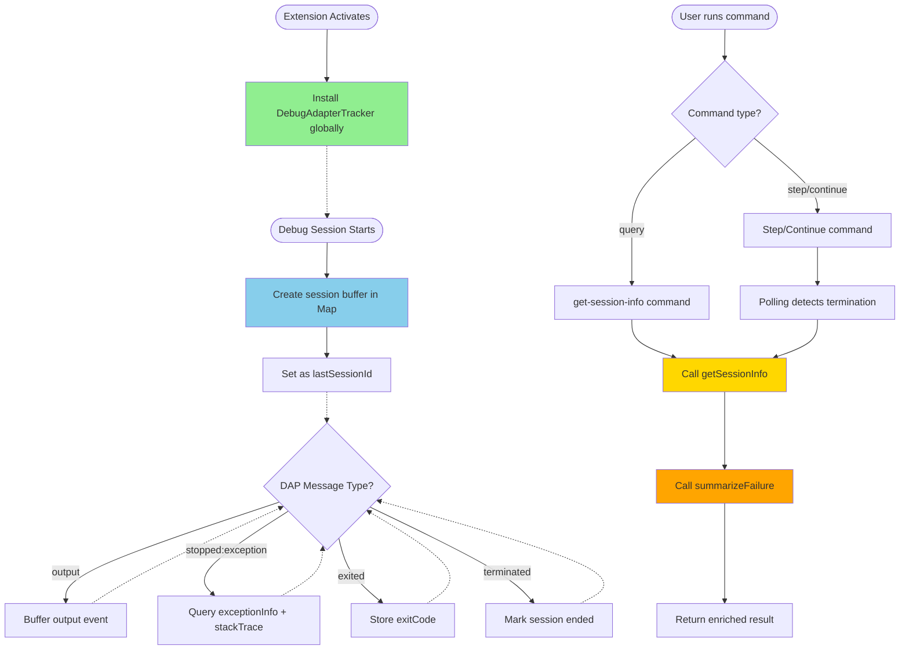
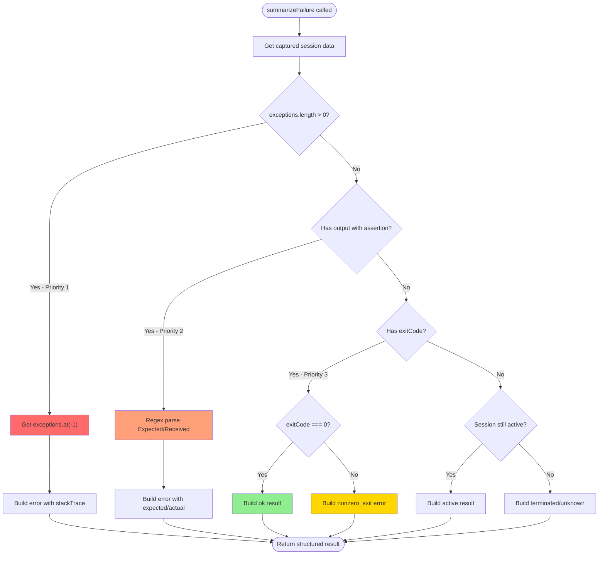
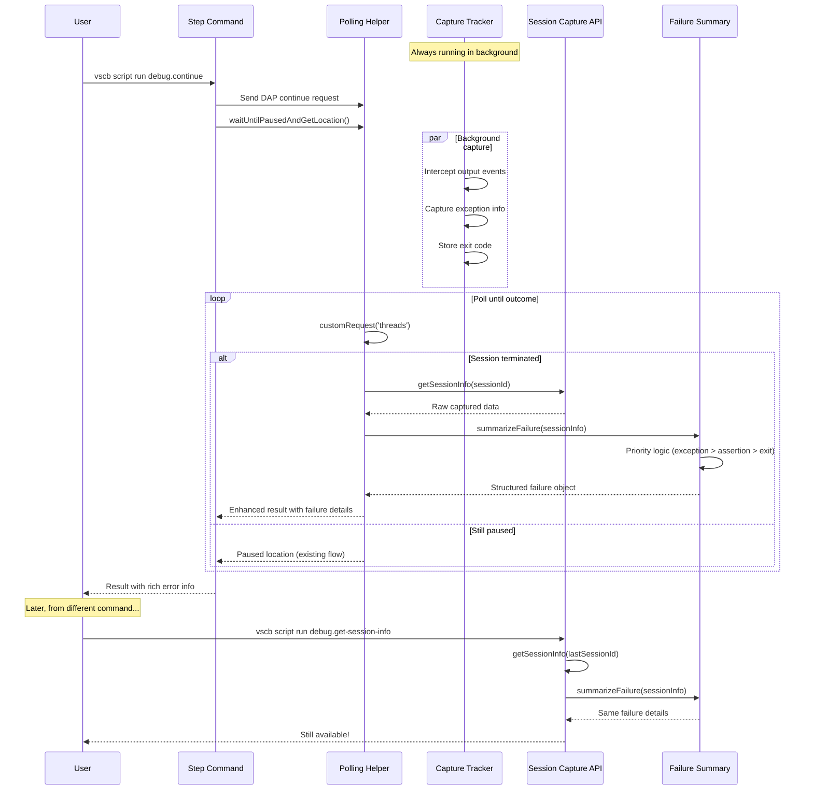

# Subtask 004: Implement Debug Session Capture for Rich Failure Details

**Parent Plan**: [debug-script-bake-in-plan.md](../../debug-script-bake-in-plan.md)
**Parent Phase**: Phase 4: Script Conversion & Integration
**Parent Phase Dossier**: [tasks.md](./tasks.md)
**Created**: 2025-10-05
**Status**: IN PROGRESS

**🎯 Tutorial**: [Debugging a Failing Test: A Complete Workflow](../../../how/simple-debug-flow.md) - Shows DAP query scripts in action
**🧪 Interactive Practice**: [Auth Tutorial Setup](../../../../test/javascript/AUTH_TUTORIAL_README.md) - Hands-on practice files

---

## Subtask Metadata

| Field | Value |
|-------|-------|
| **Parent Plan** | Debug Script Bake-In Implementation Plan |
| **Parent Phase** | Phase 4: Script Conversion & Integration |
| **Parent Task(s)** | Extends work from Subtask 003 (step commands), enhances all debug scripts |
| **Subtask Summary** | Implement always-on debug session capture to collect output, exceptions, and exit codes; provide retrieval API for step commands and new query script |
| **Requested By** | Human Sponsor |
| **Created** | 2025-10-05 |

---

## Tasks

| Status | ID | Task | Type | Priority | Dependencies | Absolute Path(s) | Validation | Notes |
|--------|-----|------|------|----------|--------------|------------------|------------|-------|
| [x] | ST000 | Rapid prototype with dynamic script (optional) | Prototype | – | – | /Users/jak/github/vsc-bridge/scripts/sample/dynamic/dap-capture.js, /Users/jak/github/vsc-bridge/test/dap-event-generator.js, /Users/jak/github/vsc-bridge/test/.vscode/launch.json, /Users/jak/github/vsc-bridge/justfile | Prototype validates DAP capture approach | ✅ COMPLETED: Atomic execution model working; captures 2 debug sessions (launch + actual), 3+ stdout events validated; workflow: start capture script → start debugger → events captured → results dumped → script exits [^ST000] |
| [x] | ST001 | Create debug-session-capture.ts core recorder | Core | – | ST000 (optional) | /Users/jak/github/vsc-bridge/extension/src/core/debug/debug-session-capture.ts | Tracker captures all DAP events | ✅ COMPLETED: Production TypeScript service implemented as singleton; captures outputs[], exceptions[], stoppedEvents[] in arrays; exposed globally via global.debugSessionCaptureService [^ST001] |
| [x] | ST002 | Create dap.summary - Session Overview Dashboard | Query Script | Tier 1 | ST001 | /Users/jak/github/vsc-bridge/extension/src/vsc-scripts/dap/summary.js, /Users/jak/github/vsc-bridge/extension/src/vsc-scripts/dap/summary.meta.yaml | Returns session metadata, counts, metrics, health indicators | ✅ COMPLETED: Quick overview when paused; params: sessionId (optional), compact (bool); returns counts (outputs by category, exceptions, stops), metrics (size, avg length, events/sec), health (exception rate, error ratio), samples (first/last 3 outputs) [^ST002] |
| [x] | ST003 | Create dap.logs - Recent Logs Viewer | Query Script | Tier 1 | ST001 | /Users/jak/github/vsc-bridge/extension/src/vsc-scripts/dap/logs.js, /Users/jak/github/vsc-bridge/extension/src/vsc-scripts/dap/logs.meta.yaml | Filters and displays recent outputs | ✅ COMPLETED: View recent console output; params: sessionId (optional), count (default: 20), category (all/stdout/stderr/console/telemetry), search (text/regex), since (timestamp/offset), reverse (bool), showSource (bool); returns filtered OutputEvent array [^ST003] |
| [x] | ST004 | Create dap.exceptions - Exception Inspector | Query Script | Tier 1 | ST001 | /Users/jak/github/vsc-bridge/extension/src/vsc-scripts/dap/exceptions.js, /Users/jak/github/vsc-bridge/extension/src/vsc-scripts/dap/exceptions.meta.yaml | Shows exceptions with surrounding context | ✅ COMPLETED: Deep dive into exceptions; params: sessionId (optional), count (default: 10), withContext (bool, default: true), contextLines (default: 5); returns exceptions with before/after outputs, stack traces, locations [^ST004] |
| [x] | ST005 | Update extension activation to install tracker | Core | – | ST001 | /Users/jak/github/vsc-bridge/extension/src/extension.ts | Tracker installed on extension startup | ✅ COMPLETED: Service installs at activation (line 58), after DebugEventHub; logs confirmation; exposed globally as global.debugSessionCaptureService [^ST005] |
| [ ] | ST006 | Add webpack aliases for new modules | Config | – | ST001 | /Users/jak/github/vsc-bridge/extension/webpack.config.js | Modules resolve correctly | Add aliases: @core/debug/debug-session-capture (for future TypeScript conversion of query scripts) |
| [x] | ST007 | Create test cases in dap-event-generator.js | Test | – | – | /Users/jak/github/vsc-bridge/test/dap-event-generator.js, /Users/jak/github/vsc-bridge/test/.vscode/launch.json | All test scenarios trigger correct events | ✅ COMPLETED: Added exception test at event 10; updated launch.json with exceptionBreakpointFilter to pause on uncaught exceptions [^ST007] |
| [x] | ST008 | Execute manual validation for all scenarios | Test | – | ST001-ST007 | Extension Development Host, /Users/jak/github/vsc-bridge/scripts/sample/dynamic/query-capture.js, /Users/jak/github/vsc-bridge/justfile | All capture scenarios work correctly | ✅ VALIDATED: Captured 16 outputs, 1 exception, 1 stopped event; exception details: "Paused on promise rejection" with threadId; query script working via `just query-capture` [^ST008] |
| [x] | ST009 | Create dap.timeline - Event Timeline Viewer | Query Script | Tier 2 | ST001 | /Users/jak/github/vsc-bridge/extension/src/vsc-scripts/dap/timeline.js, /Users/jak/github/vsc-bridge/extension/src/vsc-scripts/dap/timeline.meta.yaml | Displays chronological event stream | ✅ COMPLETED: View events over time; params: sessionId (optional), eventTypes (array: output/exception/stopped/exit), window (time range ms), granularity (all/summary/milestones), fromEnd (bool); returns timeline with timestamps (absolute + relative), significance markers, milestone detection [^ST009] |
| [x] | ST010 | Create dap.search - Pattern Search Across Outputs | Query Script | Tier 2 | ST001 | /Users/jak/github/vsc-bridge/extension/src/vsc-scripts/dap/search.js, /Users/jak/github/vsc-bridge/extension/src/vsc-scripts/dap/search.meta.yaml | Searches outputs for patterns | ✅ COMPLETED: Find patterns in captured data; params: sessionId (default: 'all'), pattern (REQUIRED, regex/text), category (filter), contextLines (default: 2), limit (default: 50), caseSensitive (bool); returns matches with context, counts by session [^ST010] |
| [x] | ST011 | Create dap.stats - Statistical Analysis | Query Script | Tier 2 | ST001 | /Users/jak/github/vsc-bridge/extension/src/vsc-scripts/dap/stats.js, /Users/jak/github/vsc-bridge/extension/src/vsc-scripts/dap/stats.meta.yaml | Analyzes patterns and metrics | ✅ COMPLETED: Aggregate statistics; params: sessionId (default: 'all'), groupBy (category/source/hour/session), includeCharts (bool, ASCII charts); returns distribution, top N (frequent messages, noisiest files), averages (events/sec), anomalies (spikes, gaps), ASCII charts [^ST011] |
| [x] | ST012 | Create dap.filter - Advanced Multi-Filter Query | Query Script | Tier 3 | ST001 | /Users/jak/github/vsc-bridge/extension/src/vsc-scripts/dap/filter.js, /Users/jak/github/vsc-bridge/extension/src/vsc-scripts/dap/filter.meta.yaml | Complex filtering with multiple criteria | ✅ COMPLETED: Advanced filtering; params: sessionId (optional), filters object (categories array, timeRange start/end, exclude patterns, include patterns, sources array, minLength, maxLength); returns filtered events matching all criteria [^ST012] |
| [x] | ST013 | Create dap.compare - Session Comparison Tool | Query Script | Tier 3 | ST001 | /Users/jak/github/vsc-bridge/extension/src/vsc-scripts/dap/compare.js, /Users/jak/github/vsc-bridge/extension/src/vsc-scripts/dap/compare.meta.yaml | Diffs two debug sessions | ✅ COMPLETED: Compare sessions; params: sessionA (REQUIRED), sessionB (REQUIRED), compareBy (counts/exceptions/timeline/outputs); returns delta counts, exception diff (onlyInA, onlyInB, common), divergence point, side-by-side summaries [^ST013] |

**Dependencies on Parent Tasks**: None (independent infrastructure enhancement)

**Technology Stack Decision**:
- **Core capture service** (ST001, ST005): **TypeScript** (`.ts`) - production singleton service in extension
- **Query scripts** (ST002-ST004, ST009-ST013): **JavaScript** (`.js`) - dynamic scripts for rapid development
- **Rationale**: Core infrastructure benefits from type safety and runs at extension activation; query scripts benefit from instant iteration without compilation, matching existing dynamic script pattern

**Implementation Tiers**:
- **Tier 1 (Essential)**: ST002 (summary), ST003 (logs), ST004 (exceptions) - implement first, most commonly used
- **Tier 2 (High Value)**: ST009 (timeline), ST010 (search), ST011 (stats) - valuable for debugging
- **Tier 3 (Advanced)**: ST012 (filter), ST013 (compare) - power user features

**Notes**:
- This subtask builds on the validated capture service from ST000/ST001/ST005 (already complete ✅)
- Focus shifted from TypeScript integration modules to practical query scripts for developer workflows
- All scripts access `global.debugSessionCaptureService` exposed at extension activation
- Pattern: passive capture (always-on via ST001), on-demand queries (dynamic scripts)
- Data structure: **Arrays** for consistency (`exceptions[]`, `stoppedEvents[]`, `outputs[]`), not `lastX` pattern
- **Development Strategy**: Dynamic scripts first, TypeScript conversion later if needed
  - Instant iteration (no compilation)
  - Proven pattern from existing dynamic scripts
  - Can migrate to permanent vsc-scripts later via ST006 (webpack aliases)

**Documentation Created**:
- ✅ **[Tutorial: Debugging a Failing Test](../../../how/simple-debug-flow.md)** - Complete debugging workflow narrative
- ✅ **[Practice Files](../../../../test/javascript/AUTH_TUTORIAL_README.md)** - Interactive auth test with intentional bug
- ✅ **Tutorial Test Files**: `test/javascript/auth.test.js`, `auth-service.js`, `auth-mocks.js`
- ✅ **Helper Script**: `test/javascript/run-auth-tutorial.js` - Toggle bug on/off for practice

**What's Complete**:
- Core DAP capture service (ST001) ✅
- Service activation and global exposure (ST005) ✅
- Test fixtures with exception scenarios (ST007) ✅
- Manual validation of capture (ST008) ✅
- Complete tutorial documentation with realistic debugging narrative ✅
- Interactive practice test files for hands-on learning ✅

**What's Pending**:
- DAP query scripts (ST002-ST004: Tier 1) ⏳ - Essential for tutorial workflow
- DAP query scripts (ST009-ST011: Tier 2) ⏳ - High-value analysis tools
- DAP query scripts (ST012-ST013: Tier 3) ⏳ - Advanced power user features
- Webpack aliases (ST006) ⏳ - For future baked-in script migration

---

## Alignment Brief

### Objective

Build a suite of practical query scripts that leverage the DAP capture service (already implemented in ST000/ST001/ST005) to help engineers investigate debug sessions. With the capture service running in the background collecting all outputs, exceptions, and stopped events, we now need tools to query and analyze this rich data.

**Problem**: Engineers debugging have no easy way to:
- Get a quick overview of session health when paused at a breakpoint
- View recent console output with filtering (last N logs, search patterns, specific categories)
- Investigate exceptions with surrounding context (what happened before/after)
- Search for patterns across sessions
- Analyze aggregate metrics and detect anomalies
- Compare different test runs to find regressions

**Solution**: Create 8 dynamic query scripts organized in 3 tiers:
- **Tier 1 (Essential)**: Summary dashboard, logs viewer, exception inspector
- **Tier 2 (High Value)**: Timeline viewer, pattern search, statistical analysis
- **Tier 3 (Advanced)**: Multi-filter queries, session comparison

All scripts access `global.debugSessionCaptureService` and return both human-readable console output AND structured JSON for programmatic use. Dynamic script approach enables instant iteration without compilation.

**Parent Phase Goal**: Convert dynamic scripts to permanent extension scripts (Phase 4)
**This Subtask's Role**: Provides practical developer tools that demonstrate the value of the DAP capture infrastructure

**📚 See It In Action**: The complete debugging workflow is documented in [docs/how/simple-debug-flow.md](../../../how/simple-debug-flow.md), which shows:
- Using DAP summary to get session health overview
- Using DAP logs to examine recent output
- Using DAP search to find patterns
- Using DAP exceptions to investigate crashes
- Using DAP timeline to understand event flow
- Using DAP stats for aggregate analysis
- Using DAP compare to verify fixes

**🎮 Try It Yourself**: Follow [test/javascript/AUTH_TUTORIAL_README.md](../../../../test/javascript/AUTH_TUTORIAL_README.md) to practice with real test files

### Behavior Checklist

From parent acceptance criteria + subtask-specific additions:

**Core Service (Already Complete ✅)**:
- [x] DebugAdapterTracker captures all DAP messages automatically (ST001)
- [x] Output events buffered with category/text/source/line/column (ST001)
- [x] Exception events captured when debugger pauses (ST001, ST007)
- [x] Exit codes captured from exited events (ST001)
- [x] Last session ID tracked (works without knowing session ID) (ST001)
- [x] Data persists after session termination (ST001)
- [x] Service exposed globally as `global.debugSessionCaptureService` (ST005)

**Tier 1 Query Scripts (Essential)** - Required for tutorial workflow:
- [ ] dap-summary.js returns session overview with counts, metrics, health indicators (ST002)
- [ ] dap-logs.js filters outputs by category, search pattern, time window (ST003)
- [ ] dap-exceptions.js shows exceptions with before/after context (ST004)
- [ ] All Tier 1 scripts have justfile recipes for easy invocation
- [ ] All Tier 1 scripts handle missing sessions gracefully
- [ ] All Tier 1 scripts default to latest session when sessionId omitted
- [ ] Tutorial in [docs/how/simple-debug-flow.md](../../../how/simple-debug-flow.md) uses these scripts

**Tier 2 Query Scripts (High Value)** - Shown in tutorial, needed for complete workflow:
- [ ] dap-timeline.js displays chronological event stream with milestones (ST009)
- [ ] dap-search.js finds patterns across one or all sessions (ST010)
- [ ] dap-stats.js generates aggregate metrics with ASCII charts (ST011)
- [ ] All Tier 2 scripts support searching across multiple sessions
- [ ] All Tier 2 scripts include helpful use case examples
- [ ] Tutorial demonstrates timeline, search, and stats features

**Tier 3 Query Scripts (Advanced)** - Optional power features:
- [ ] dap-filter.js combines multiple AND-ed filter criteria (ST012)
- [ ] dap-compare.js diffs two sessions showing deltas and divergence (ST013)
- [ ] All Tier 3 scripts handle complex queries efficiently
- [ ] Tutorial shows session comparison for fix verification

**Universal Script Requirements**:
- [ ] All scripts return structured JSON for programmatic use
- [ ] All scripts provide human-readable console output
- [ ] All scripts include header documentation with params and usage
- [ ] All scripts have error handling with helpful hints
- [ ] All scripts access service via `global.debugSessionCaptureService`
- [ ] All scripts work with tutorial examples in [docs/how/simple-debug-flow.md](../../../how/simple-debug-flow.md)

### Research Findings & Architecture

#### Three-Layer Architecture

The implementation follows a clean separation of concerns:

```
┌─────────────────────────────────────────────────────────────┐
│  LAYER 1: CAPTURE (Always-On, Passive Background)           │
│  debug-session-capture.ts                                    │
│  - Registers DebugAdapterTrackerFactory for '*' (all types) │
│  - Intercepts DAP messages via onDidSendMessage()            │
│  - Buffers: outputs[], exceptions[], stoppedEvents[]         │
│  - Persists to globalStorageUri/debug-sessions/*.json        │
│  - Exports: getSessionInfo(), getLastSessionId()             │
└─────────────────────────────────────────────────────────────┘
                              ↓
┌─────────────────────────────────────────────────────────────┐
│  LAYER 2: PARSING (On-Demand Summarization)                 │
│  failure-summary.ts                                          │
│  - parseJestAssertion(outputs[]) → {expected, actual}        │
│  - summarizeFailure(session) → FailureSummary                │
│  - Priority: exceptions.at(-1) > Jest > exitCode > unknown   │
└─────────────────────────────────────────────────────────────┘
                              ↓
┌─────────────────────────────────────────────────────────────┐
│  LAYER 3: INTEGRATION (Loose Coupling)                      │
│  debug-polling-helpers.js, get-session-info.js              │
│  - Polling helpers query when termination detected           │
│  - Scripts call getSessionInfo() for on-demand retrieval     │
│  - No tight coupling - capture module is independent         │
└─────────────────────────────────────────────────────────────┘
```

#### DAP Events: What to Capture and When

Based on deep research of the DAP specification and pwa-node debugger:

| DAP Event | Key Fields | When It Fires | What We Capture | Notes |
|-----------|-----------|---------------|-----------------|-------|
| **`output`** | `category` (stdout/stderr/console/telemetry), `text`, `source`, `line`, `column` | Program prints to console | Push to `outputs[]` array | Jest assertions appear here as text |
| **`stopped`** | `reason` (step/breakpoint/exception/pause), `threadId`, `text` | Debugger pauses execution | Push to `stoppedEvents[]`; if `reason==='exception'`, **immediately** call `exceptionInfo` + `stackTrace` | ⚠️ **CRITICAL**: Only window to get exception details |
| **`exited`** | `body.exitCode` | Process exits | Store `exitCode` field | `0` = success, non-zero = error |
| **`terminated`** | `body.restart` (optional) | Debug session ending | Set `terminated = true`, persist to disk | May fire before tail output arrives |
| **`process`** | `name`, `systemProcessId`, `startMethod` (launch/attach) | Process metadata available | Store process info | Useful for correlation |

**pwa-node Debugger Specifics**:
- Advertises `supportsExceptionInfoRequest: true` in `initialize` response
- Fully supports `exceptionInfo` and `stackTrace` custom requests
- `outputCapture` launch option: `"console"` (default) or `"std"` affects output routing
- Jest output appears in `output` events with `category: 'stdout'` or `'stderr'`

#### Data Structure: Array-Based for Consistency

```typescript
interface CapturedSession {
  sessionId: string;
  type: string;                    // e.g., 'pwa-node'
  name: string;                    // Launch config name
  parentSessionId: string | null;  // For nested sessions (Test Explorer)
  isActive: boolean;
  startTime: number;               // Date.now() at session start
  endTime?: number;                // Date.now() at termination

  // All arrays - consistent pattern
  outputs: OutputEvent[];          // All console output
  exceptions: ExceptionData[];     // All exceptions (access last with .at(-1))
  stoppedEvents: StoppedEvent[];   // All pause events

  exitCode?: number;               // From 'exited' event
  terminated: boolean;             // Saw 'terminated' event

  summary?: FailureSummary;        // Computed on-demand
  truncated: boolean;              // Hit memory cap
}

interface OutputEvent {
  ts: number;
  category: 'stdout' | 'stderr' | 'console' | 'telemetry';
  text: string;
  source?: { path: string; name: string };
  line?: number;
  column?: number;
}

interface ExceptionData {
  message: string;
  typeName?: string;               // e.g., 'TypeError'
  description?: string;            // Detailed message
  stackFrames: StackFrame[];
}

interface FailureSummary {
  event: 'error' | 'exit' | 'unknown';
  reason: 'runtime_exception' | 'assertion_failure' | 'normal_exit' | 'nonzero_exit' | 'terminated' | 'unknown';
  message: string;
  expected?: string;               // From Jest assertion
  actual?: string;                 // From Jest assertion
  stackTrace?: StackFrame[];       // From exception or Jest
  exitCode?: number;
}
```

**Why arrays instead of `lastException`?**
- **Consistency**: Same pattern for all event types
- **Flexibility**: Can analyze all exceptions, not just last
- **Simple access**: `.at(-1)` or `[length - 1]` gets most recent
- **More information**: Could detect "3 exceptions before final crash" patterns

#### Storage Architecture

```
<context.globalStorageUri>/debug-sessions/
├── index.json                     # {lastSessionId: "xyz", sessions: ["abc", "xyz", ...]}
├── session-abc123.json            # Full CapturedSession for session abc123
├── session-xyz789.json            # Full CapturedSession for session xyz789
└── ...                            # LRU eviction keeps last 50 sessions
```

**Index Management**:
- Updated on every session termination
- `lastSessionId`: Most recently finished session (for default retrieval)
- `sessions`: Array of all session IDs (for LRU tracking)
- On 51st session: Read all session files, sort by `endTime`, delete oldest, keep 50

**Memory Caps** (prevent leaks):
- **Per-session output**: 5MB total, 20,000 lines max
- **Session limit**: 50 sessions on disk (LRU eviction)
- **Truncation**: Drop oldest output events when cap hit, set `truncated: true`

#### Critical Timing & Session Lifecycle

```
T0: Session Starts
    onWillStartSession()
    → Initialize CapturedSession with empty arrays
    → startTime = Date.now()
    → isActive = true

T1-Tn: During Execution (many events)
    onDidSendMessage(message)

    if (message.event === 'output')
        → outputs.push({ts, category, text, source, line})

    if (message.event === 'stopped' && reason === 'exception')
        ⚠️ CRITICAL WINDOW - Session is PAUSED ⚠️
        → const exInfo = await session.customRequest('exceptionInfo', {threadId})
        → const stack = await session.customRequest('stackTrace', {threadId, levels: 50})
        → exceptions.push({message, typeName, stackFrames})
        → stoppedEvents.push(message.body)

        ⚠️ MUST call NOW - after 'terminated', requests will FAIL

    if (message.event === 'stopped')  // All stops (breakpoint, step, etc.)
        → stoppedEvents.push(message.body)

    if (message.event === 'exited')
        → exitCode = message.body.exitCode
        → endTime = Date.now()

    if (message.event === 'terminated')
        → terminated = true
        → endTime = Date.now()
        → await finalizeAndPersist(sessionId)  // First save

T_end: Adapter Process Exits
    onExit(code, signal)
    → await finalizeAndPersist(sessionId)  // Second save (catch tail output)
```

**Key Timing Rules**:
1. **exceptionInfo/stackTrace**: MUST call during `stopped` event handler (session is paused)
2. **Dual persistence**: Save on `terminated` AND `onExit` (race mitigation - tail output may arrive late)
3. **Early attachment**: Tracker created BEFORE adapter starts talking → no missed early events

### Critical Findings Affecting This Subtask

**🚨 Critical Discovery 06: Polling Superior to Event-Based for Step Commands** (From Subtask 003)
- **Context**: Step commands now use polling pattern instead of DebugEventHub
- **Impact on This Subtask**: We use DebugAdapterTracker for passive capture, but retrieval remains polling-based
- **Key Insight**: Don't try to "wait" for events in step commands; instead capture events passively in background and query on-demand
- **Architecture**: Tracker = always-on background recorder; polling = when to check results

**🚨 Critical Discovery 07: DAP Events Don't Provide Structured Assertion Failures**
- **Problem**: DAP doesn't send structured "assertion failure" objects
- **Reality**: Must assemble from scattered pieces:
  1. Real exceptions: `stopped` (reason: exception) → `exceptionInfo` + `stackTrace`
  2. Jest assertions: Parse `output` events for "Expected X Received Y" patterns
  3. Exit status: `exited` event with `exitCode`
- **Solution**: Priority-based parsing in failure-summary.ts
- **Impact**: Cannot rely on single DAP event; must correlate multiple events

**🚨 Critical Discovery 08: Array-Based Data Structure**
- **Decision**: Use `exceptions[]`, `stoppedEvents[]`, `outputs[]` (NOT `lastException`, `lastStopped`)
- **Rationale**: Consistency across all event types, more flexible, simple access via `.at(-1)`
- **Benefits**: Can analyze patterns (e.g., "3 exceptions before crash"), richer debugging context
- **Impact**: Parser accesses most recent via `exceptions.at(-1)` instead of dedicated field

**🚨 Critical Discovery 09: TypeScript for Core, JavaScript for Scripts**
- **Core modules** (debug-session-capture, failure-summary): TypeScript (`.ts`) for type safety
- **Scripts** (get-session-info): JavaScript (`.js`, CommonJS) per project convention
- **Integration**: JavaScript imports TypeScript via webpack aliases
- **Rationale**: Core infrastructure benefits from types; scripts maintain consistency

**🚨 Critical Discovery 10: Dual Persistence Required (Race Mitigation)**
- **Problem**: `terminated` event can fire before all `output` events arrive
- **Solution**: Persist twice - on `terminated` AND on `onExit()`
- **Reason**: Adapter process may buffer output; tail messages arrive after `terminated`
- **Evidence**: Research confirmed this is a known DAP timing issue

**🚨 Critical Discovery 11: Loose Coupling Pattern (Option B)**
- **Decision**: Capture module is passive (always-on background); polling helpers query on-demand
- **NOT**: Automatic enrichment in polling helpers (Option A - tight coupling)
- **Benefits**: Testing isolation, backward compatibility, clearer separation of concerns
- **Implementation**: `waitUntilPausedAndGetLocation()` calls `getSessionInfo()` + `summarizeFailure()` when terminated

**🚨 Critical Discovery 12: exceptionInfo Timing is Critical**
- **Rule**: `exceptionInfo` and `stackTrace` custom requests MUST be called during `stopped` event handler
- **Reason**: Session is paused during `stopped`; after `terminated`, session is invalid and requests FAIL
- **Evidence**: Research confirmed pwa-node supports these requests but only while paused
- **Pattern**: Fire-and-forget `await` in `onDidSendMessage()` for `stopped(reason: 'exception')`

**Integration with Existing Work**:
- Subtask 003 implemented `waitUntilPausedAndGetLocation()` and `formatPausedLocation()`
- This subtask enhances `waitUntilPausedAndGetLocation()` to add failure details on termination
- Maintains single source of truth pattern for return formats
- Loose coupling: capture is independent, polling helpers opt-in to enrichment

### Invariants & Guardrails

**From Parent Phase**:
- Scripts must respond within 5 seconds
- Memory usage stays under 5MB per operation
- No arbitrary code execution

**Subtask-Specific**:
- **Tracker registration**: Must be global (`'*'` type), applies to ALL debug sessions (F5, Test Explorer, CLI, MCP)
- **Zero latency impact**: Passive capture must not slow down debugging (fire-and-forget async, non-blocking)
- **Session-agnostic retrieval**: Work without session object (use `sessionId` string only)
- **Memory caps (enforced)**:
  - **Per-session output**: 5MB total bytes, 20,000 lines max
  - **Session limit**: 50 sessions max on disk (LRU eviction)
  - **Truncation strategy**: Drop oldest output events when cap hit, set `truncated: true`
- **Eager capture**: Stack traces/exceptions captured DURING `stopped` event (before session terminates)
- **Dual persistence**: Save on `terminated` AND `onExit` (race mitigation)
- **Early attachment**: Use `onDebugAdapterProtocolTracker:*` activation event to ensure tracker ready before any session

### Inputs to Read

**Existing Code to Study**:
- `/Users/jordanknight/github/vsc-bridge/extension/src/core/debug/debug-polling-helpers.js` - Current polling implementation from Subtask 003
- `/Users/jordanknight/github/vsc-bridge/extension/src/vsc-scripts/debug/continue.js` - Step command that needs rich failure info
- `/Users/jordanknight/github/vsc-bridge/extension/src/extension.js` - Activation entry point

**Research Inputs**:
- `/Users/jordanknight/github/vsc-bridge/scratch/research-prompt-test-output-capture.md` - Problem definition
- `/Users/jordanknight/github/vsc-bridge/scratch/handover.txt` - Solution architecture from research

**VS Code API Documentation**:
- `vscode.debug.registerDebugAdapterTrackerFactory()` - How to intercept DAP messages
- DAP events: `output`, `stopped`, `exited`, `terminated`
- DAP requests: `exceptionInfo`, `stackTrace`

**Test Context**:
- `/Users/jordanknight/github/vsc-bridge/test/javascript/example.test.js` - Existing test file with Calculator class

### Visual Alignment Aids

#### Debug Session Capture Flow



#### Failure Summary Priority Logic



#### Integration with Step Commands Sequence



### Test Plan

**Approach**: Manual validation using Extension Development Host with real debugging sessions

**Test Scenarios**:

1. **Passing Test (Exit Code 0)**
   - Setup: Add passing test to example.test.js
   - Action: Run with breakpoint → continue → completes successfully
   - Expected: `{event: 'ok', reason: 'normal_exit', exitCode: 0}`

2. **Jest Assertion Failure**
   - Setup: Add test with `expect(actual).toBe(wrong_value)`
   - Action: Run with breakpoint → continue → test fails
   - Expected: `{event: 'error', reason: 'assertion_failure', message: '...', expected: 'X', actual: 'Y', file: '...', line: N}`

3. **Runtime Exception**
   - Setup: Add test with `null.foo()` to trigger TypeError
   - Action: Run with breakpoint → continue → throws
   - Expected: `{event: 'error', reason: 'exception', message: 'Cannot read property...', stackTrace: '...', file: '...', line: N}`

4. **Explicit Non-Zero Exit**
   - Setup: Add test with `process.exit(1)`
   - Action: Run with breakpoint → continue → exits
   - Expected: `{event: 'error', reason: 'nonzero_exit', exitCode: 1, message: 'Process exited with code 1'}`

5. **Query After Session Ends**
   - Setup: Run any test to completion
   - Action: Wait 30 seconds, then run `debug.get-session-info`
   - Expected: Still returns same captured data (proof data persists)

6. **Multiple Sessions**
   - Setup: Run test 1 (fails), then test 2 (passes)
   - Action: Query `debug.get-session-info`
   - Expected: Returns test 2 data (most recent session)

**No Automated Tests**: Manual testing only per Phase 4 philosophy

### Implementation Outline

#### Phase 0: Rapid Prototyping with Dynamic Scripts (Recommended)

**Before implementing TypeScript core modules, prototype with dynamic scripts for rapid iteration.**

**File**: `scripts/sample/dynamic/dap-capture.js` (new - stored with other dynamic scripts)

**Test Fixture**: `test/javascript/dap-test.test.js` (simple test that generates predictable output)

**Justfile Recipe**: Add to justfile under "DYNAMIC SCRIPT DEVELOPMENT":
```just
sample-dap-capture *ARGS:
    cd test && vscb script run -f ../scripts/sample/dynamic/dap-capture.js {{ARGS}}
```

**Key Pattern from Existing `debug-tracker.js`**:
- Use `global.dapCaptureData` to persist state across script runs (no compilation needed!)
- Register `DebugAdapterTrackerFactory` once with `action=install`
- Capture DAP events in `onDidSendMessage()`
- Query captured data with `action=get-latest`, `action=status`, etc.

**Workflow**:
```bash
# 1. Install tracker (once per VS Code session)
just sample-dap-capture --param action=install

# 2. Run test in debugger (F5 with breakpoint in dap-test.test.js)

# 3. Query captured data
just sample-dap-capture --param action=get-latest
just sample-dap-capture --param action=parse-jest

# 4. Iterate: Edit dap-capture.js → re-run (NO compilation!)
```

**Advantages**:
- ✅ Instant iteration (seconds, not minutes)
- ✅ No core code changes
- ✅ Full VS Code API access
- ✅ Prove approach before TypeScript refactor
- ✅ Pattern matches existing `debug-tracker.js`

**Features to Prototype**:
1. Basic output capture (`output` events)
2. Exception capture (`stopped(reason: 'exception')` → `exceptionInfo`)
3. Jest parsing (Expected/Received regex)
4. Summary builder (priority logic)
5. Array-based data structure validation

**Migration**: Once prototype works, copy logic to TypeScript modules below.

---

#### Step 1: Create Core Capture Module (ST001)

**File**: `extension/src/core/debug/debug-session-capture.ts`

**Exports**:
- `installCaptureTracker(context: vscode.ExtensionContext): void`
- `getSessionInfo(sessionId?: string): Promise<CapturedSession | null>`
- `getCurrentSessionId(): string | null`
- `getLastSessionId(): Promise<string | null>`

**Key Implementation Pattern**:

```typescript
import * as vscode from 'vscode';
import { promises as fs } from 'fs';
import * as path from 'path';

const SESSIONS = new Map<string, CapturedSession>();
const PARENT_MAP = new Map<string, string>();  // childId -> parentId
let STORAGE_DIR: string;

const MAX_SESSIONS = 50;
const MAX_OUTPUT_BYTES = 5 * 1024 * 1024;  // 5MB
const MAX_OUTPUT_LINES = 20000;

function ensureSession(session: vscode.DebugSession): CapturedSession {
  if (!SESSIONS.has(session.id)) {
    const cap: CapturedSession = {
      sessionId: session.id,
      type: session.type,
      name: session.name,
      parentSessionId: session.parentSession?.id || null,
      isActive: true,
      startTime: Date.now(),
      outputs: [],           // Array
      exceptions: [],        // Array
      stoppedEvents: [],     // Array
      terminated: false,
      truncated: false
    };
    SESSIONS.set(session.id, cap);
    if (session.parentSession) {
      PARENT_MAP.set(session.id, session.parentSession.id);
    }
  }
  return SESSIONS.get(session.id)!;
}

async function captureExceptionDetails(
  session: vscode.DebugSession,
  stoppedBody: any,
  cap: CapturedSession
): Promise<void> {
  try {
    const threadId = stoppedBody.threadId;
    const exInfo = await session.customRequest('exceptionInfo', { threadId });
    const stack = await session.customRequest('stackTrace', {
      threadId,
      startFrame: 0,
      levels: 50
    });

    // Push to array (not replace single field)
    cap.exceptions.push({
      message: exInfo?.body?.details?.message || exInfo?.body?.description || 'Exception',
      typeName: exInfo?.body?.exceptionId,
      description: exInfo?.body?.description,
      stackFrames: (stack?.body?.stackFrames || []).map(f => ({
        name: f.name,
        source: f.source?.path || f.source?.name,
        line: f.line,
        column: f.column
      }))
    });
  } catch (error) {
    // Session may be terminating - fallback to output parsing
  }
}

export function installCaptureTracker(context: vscode.ExtensionContext): void {
  STORAGE_DIR = path.join(context.globalStorageUri.fsPath, 'debug-sessions');

  context.subscriptions.push(
    vscode.debug.registerDebugAdapterTrackerFactory('*', {
      createDebugAdapterTracker(session: vscode.DebugSession) {
        const cap = ensureSession(session);

        return {
          onWillStartSession() {
            cap.startTime = Date.now();
            cap.isActive = true;
          },

          async onDidSendMessage(message: any) {
            if (message?.type !== 'event') return;

            const ts = Date.now();

            switch (message.event) {
              case 'output':
                cap.outputs.push({
                  ts,
                  category: message.body?.category || 'console',
                  text: message.body?.output || '',
                  source: message.body?.source,
                  line: message.body?.line,
                  column: message.body?.column
                });
                break;

              case 'stopped':
                cap.stoppedEvents.push(message.body);
                if (message.body?.reason === 'exception') {
                  // ⚠️ CRITICAL: Call NOW (session is paused)
                  void captureExceptionDetails(session, message.body, cap);
                }
                break;

              case 'exited':
                cap.exitCode = message.body?.exitCode;
                cap.endTime = Date.now();
                break;

              case 'terminated':
                cap.terminated = true;
                cap.endTime = Date.now();
                await finalizeAndPersist(session.id);  // First save
                break;
            }
          },

          async onExit(code, signal) {
            await finalizeAndPersist(session.id);  // Second save (catch tail)
          }
        };
      }
    })
  );
}
```

**Storage Functions**:

```typescript
async function finalizeAndPersist(sessionId: string): Promise<void> {
  const cap = SESSIONS.get(sessionId);
  if (!cap) return;

  cap.isActive = false;
  cap.endTime = cap.endTime || Date.now();

  // Enforce memory caps
  limitOutputs(cap);

  // Persist to disk
  await fs.mkdir(STORAGE_DIR, { recursive: true });
  const file = path.join(STORAGE_DIR, `session-${sessionId}.json`);
  await fs.writeFile(file, JSON.stringify(cap, null, 2));

  // Update index
  await updateIndex(sessionId);
}

async function updateIndex(sessionId: string): Promise<void> {
  const indexPath = path.join(STORAGE_DIR, 'index.json');
  let index: {lastSessionId: string; sessions: string[]} = {
    lastSessionId: sessionId,
    sessions: []
  };

  try {
    const data = await fs.readFile(indexPath, 'utf8');
    index = JSON.parse(data);
  } catch {}

  index.lastSessionId = sessionId;
  if (!index.sessions.includes(sessionId)) {
    index.sessions.push(sessionId);
  }

  // LRU eviction
  if (index.sessions.length > MAX_SESSIONS) {
    // Sort by endTime, delete oldest
    const sessions = await Promise.all(
      index.sessions.map(async id => {
        try {
          const data = JSON.parse(await fs.readFile(
            path.join(STORAGE_DIR, `session-${id}.json`), 'utf8'
          ));
          return {id, endTime: data.endTime || 0};
        } catch {
          return {id, endTime: 0};
        }
      })
    );

    sessions.sort((a, b) => b.endTime - a.endTime);
    const keep = sessions.slice(0, MAX_SESSIONS);
    const remove = sessions.slice(MAX_SESSIONS);

    for (const {id} of remove) {
      await fs.unlink(path.join(STORAGE_DIR, `session-${id}.json`)).catch(() => {});
    }

    index.sessions = keep.map(s => s.id);
  }

  await fs.writeFile(indexPath, JSON.stringify(index, null, 2));
}
```

#### Step 2: Create Parser Module (ST002)

**File**: `extension/src/core/debug/failure-summary.ts`

**Export**: `summarizeFailure(captured: CapturedSession): FailureSummary`

**Jest Parsing Patterns**:

```typescript
const ANSI = /\x1b\[[0-9;]*m/g;
const JEST_FAIL_MARK = /^(?:\s*●|●)\s+/;
const EXPECT_RE = /^\s*Expected:\s+(.+)$/i;
const RECEIVED_RE = /^\s*Received:\s+(.+)$/i;
const STACK_RE_1 = /^\s*at\s+(.*?)\s+\((.*?):(\d+):(\d+)\)\s*$/;
const STACK_RE_2 = /^\s*at\s+(.*?):(\d+):(\d+)\s*$/;

function parseJestAssertion(outputs: OutputEvent[]): {
  message: string;
  expected: string | null;
  actual: string | null;
  stackFrames: StackFrame[];
} | null {
  // Scan in REVERSE (most recent first)
  const lines: string[] = [];
  for (let i = outputs.length - 1; i >= 0 && lines.length < 4000; i--) {
    const o = outputs[i];
    if (o.category === 'telemetry') continue;
    const clean = o.text.replace(ANSI, '');
    lines.push(...clean.split(/\r?\n/).reverse());
  }

  let message = '';
  let expected = null;
  let actual = null;
  const stackFrames: StackFrame[] = [];

  for (const line of lines) {
    if (!message && JEST_FAIL_MARK.test(line)) {
      message = line.replace(JEST_FAIL_MARK, '').trim();
      continue;
    }

    if (expected === null) {
      const m = line.match(EXPECT_RE);
      if (m) { expected = m[1]; continue; }
    }

    if (actual === null) {
      const m = line.match(RECEIVED_RE);
      if (m) { actual = m[1]; continue; }
    }

    // Parse stack frames
    let m = line.match(STACK_RE_1);
    if (m) {
      stackFrames.push({name: m[1], source: m[2], line: +m[3], column: +m[4]});
      continue;
    }
    m = line.match(STACK_RE_2);
    if (m) {
      stackFrames.push({name: '', source: m[1], line: +m[2], column: +m[3]});
    }
  }

  if (!message) return null;
  return {message, expected, actual, stackFrames};
}

export function summarizeFailure(captured: CapturedSession): FailureSummary {
  // Priority 1: Runtime exception (use LAST exception in array)
  const lastException = captured.exceptions.at(-1);
  if (lastException) {
    return {
      event: 'error',
      reason: 'runtime_exception',
      message: lastException.description || lastException.message,
      stackTrace: lastException.stackFrames,
      exitCode: captured.exitCode
    };
  }

  // Priority 2: Jest assertion (parse all outputs)
  const parsed = parseJestAssertion(captured.outputs);
  if (parsed) {
    return {
      event: 'error',
      reason: 'assertion_failure',
      message: parsed.message,
      expected: parsed.expected || undefined,
      actual: parsed.actual || undefined,
      stackTrace: parsed.stackFrames.length ? parsed.stackFrames : undefined,
      exitCode: captured.exitCode
    };
  }

  // Priority 3: Exit code
  if (typeof captured.exitCode === 'number') {
    return {
      event: captured.exitCode === 0 ? 'exit' : 'error',
      reason: captured.exitCode === 0 ? 'normal_exit' : 'nonzero_exit',
      message: `Process exited with code ${captured.exitCode}`,
      exitCode: captured.exitCode
    };
  }

  // Priority 4: Unknown/terminated
  return {
    event: 'unknown',
    reason: captured.terminated ? 'terminated' : 'unknown',
    message: captured.terminated ? 'Debug session terminated' : 'No failure information',
    exitCode: captured.exitCode
  };
}
```

#### Step 3: Integrate with Polling Helper (ST003)

**File**: `extension/src/core/debug/debug-polling-helpers.js` (stays JavaScript)

**Changes** (loose coupling pattern):

```javascript
// At top of file
const { getSessionInfo } = require('@core/debug/debug-session-capture');
const { summarizeFailure } = require('@core/debug/failure-summary');

// In waitUntilPausedAndGetLocation(), when termination detected:
async function waitUntilPausedAndGetLocation(session, timeoutMs = 5000, vscode = null) {
  // ... existing polling logic ...

  // When session terminated detected:
  if (!activeSession || activeSession.id !== session.id) {
    // Query captured data (loose coupling - on-demand)
    const sessionInfo = await getSessionInfo(session.id);

    if (sessionInfo) {
      const summary = summarizeFailure(sessionInfo);

      // Return enriched result
      return {
        event: summary.event,
        reason: summary.reason,
        message: summary.message,
        expected: summary.expected,
        actual: summary.actual,
        stackTrace: summary.stackTrace,
        exitCode: summary.exitCode,
        sessionId: session.id
      };
    }

    // Fallback if no capture data
    return {
      event: 'terminated',
      sessionId: session.id
    };
  }

  // ... rest of function ...
}
```

#### Step 4: Create Query Script (ST004)

**Files**: `extension/src/vsc-scripts/debug/get-session-info.js` + `.meta.yaml`

```javascript
const { QueryScript } = require('@script-base');

class GetSessionInfoScript extends QueryScript {
  constructor() {
    super();
    this.paramsSchema = z.object({
      sessionId: z.string().optional()
    });
  }

  async execute(bridgeContext, params) {
    // Access via VS Code command (cross-process compatible)
    const vscode = bridgeContext.vscode;
    const sessionId = params.sessionId;

    // Import TypeScript modules (webpack handles)
    const { getSessionInfo } = await import('@core/debug/debug-session-capture');
    const { summarizeFailure } = await import('@core/debug/failure-summary');

    const sessionInfo = await getSessionInfo(sessionId);

    if (!sessionInfo) {
      return {
        error: 'No session data available',
        hint: sessionId ? `Session ${sessionId} not found` : 'No sessions captured yet'
      };
    }

    const summary = summarizeFailure(sessionInfo);

    return {
      sessionId: sessionInfo.sessionId,
      isActive: sessionInfo.isActive,
      summary,
      outputs: sessionInfo.outputs,
      exceptions: sessionInfo.exceptions,
      stoppedEvents: sessionInfo.stoppedEvents,
      captureTime: {
        start: sessionInfo.startTime,
        end: sessionInfo.endTime
      },
      truncated: sessionInfo.truncated
    };
  }
}

module.exports = { GetSessionInfoScript };
```

#### Step 5: Update Extension Activation (ST005)

**File**: `extension/src/extension.ts`

```typescript
import { installCaptureTracker } from './core/debug/debug-session-capture';

export async function activate(context: vscode.ExtensionContext) {
  // ... existing code ...

  // Install capture tracker EARLY (after DebugEventHub)
  output.appendLine(`[DebugSessionCapture] Installing capture tracker...`);
  installCaptureTracker(context);
  output.appendLine(`[DebugSessionCapture] ✅ Capture tracker ready`);

  // ... rest of activation ...
}
```

**package.json** activation event:

```json
"activationEvents": [
  "onDebugAdapterProtocolTracker:*"
]
```

#### Step 6: Webpack Config (ST006)

**File**: `extension/webpack.config.js`

```javascript
resolve: {
  alias: {
    // ... existing aliases ...
    '@core/debug/debug-session-capture': path.resolve(__dirname, 'src/core/debug/debug-session-capture.ts'),
    '@core/debug/failure-summary': path.resolve(__dirname, 'src/core/debug/failure-summary.ts'),
  }
}
```

#### Step 7: Test Cases (ST007)

**File**: `test/javascript/example.test.js`

```javascript
// Add after existing Calculator tests:

describe('Debug Session Capture Test Cases', () => {
  test('should pass completely', () => {
    expect(2 + 2).toBe(4);
  });

  test('should fail assertion', () => {
    expect(15).toBe(999);  // Intentional failure
  });

  test('should throw runtime error', () => {
    const obj = null;
    obj.foo();  // TypeError: Cannot read property 'foo' of null
  });

  test('should exit with non-zero code', () => {
    process.exit(1);
  });
});
```

#### Step 8: Manual Validation (ST008)

Test each scenario and verify structure matches expected FailureSummary. Document in execution log.

### Commands to Run

```bash
# Build extension
cd /Users/jordanknight/github/vsc-bridge
npm run compile

# Start Extension Development Host
code .
# Press F5

# In Extension Development Host, navigate to test directory
cd /Users/jordanknight/github/vsc-bridge/test

# Test Scenario 1: Passing Test
# Set breakpoint at line N in example.test.js (in passing test)
# Start debugging (F5), hit breakpoint
vscb script run debug.continue
# Expected: {"event":"ok","reason":"normal_exit","exitCode":0,...}

# Test Scenario 2: Assertion Failure
# Set breakpoint at line M in example.test.js (in failing test)
# Start debugging, hit breakpoint
vscb script run debug.continue
# Expected: {"event":"error","reason":"assertion_failure","expected":"999","actual":"15",...}

# Test Scenario 3: Query After Session Ends
# (Wait for test to complete and session to terminate)
vscb script run debug.get-session-info
# Expected: Returns same data as previous command

# Test Scenario 4: Runtime Exception
# Set breakpoint in exception test
vscb script run debug.continue
# Expected: {"event":"error","reason":"exception","message":"Cannot read property...",...}

# Test Scenario 5: Non-Zero Exit
# Set breakpoint in process.exit(1) test
vscb script run debug.continue
# Expected: {"event":"error","reason":"nonzero_exit","exitCode":1,...}

# Test Scenario 6: Multiple Sessions
# Run two different tests sequentially
vscb script run debug.get-session-info
# Expected: Returns most recent session data
```

### Risks & Unknowns

| Risk | Severity | Mitigation |
|------|----------|------------|
| **Output buffer memory leaks** | Medium | **SPECIFIC CAPS**: 5MB bytes, 20,000 lines per session, 50 sessions on disk; truncate from front (keep recent); set `truncated: true` flag |
| **Tail output race condition** | High | **DUAL PERSISTENCE**: Persist on `terminated` (early save) AND `onExit` (catch buffered tail); research confirms this is a known DAP timing issue |
| **exceptionInfo timing window** | Critical | **MUST call during `stopped` event**: Session is paused; after `terminated`, session invalid and requests FAIL; pwa-node confirmed to support but only while paused |
| **Jest output format changes** | Low | **Patterns explicit**: ANSI strip regex, `●` marker, Expected/Received lines documented; fallback to generic message if parsing fails |
| **Adapter compatibility** | Medium | **pwa-node confirmed**: `supportsExceptionInfoRequest: true`; graceful degradation with try-catch → fallback to output parsing |
| **Session ID collisions** | Low | VS Code generates unique IDs; LRU eviction by `endTime` prevents accumulation; index.json tracks active sessions |

**Resolved Unknowns** (from research):
- ✅ **DAP event fields**: Exact schema documented from spec (`output.category`, `stopped.reason`, `exited.body.exitCode`)
- ✅ **pwa-node support**: Confirmed supports `exceptionInfo` + `stackTrace` custom requests
- ✅ **Tracker lifecycle**: Created BEFORE adapter traffic starts (no missed events); use `onDebugAdapterProtocolTracker:*` activation
- ✅ **Storage strategy**: `globalStorageUri`, index.json, LRU eviction, dual persistence pattern

**Validation Checks** (during ST008):
- [ ] Verify 5MB/20k line caps trigger truncation
- [ ] Confirm 51st session evicts oldest from disk
- [ ] Prove `exceptionInfo` succeeds during `stopped`, fails after `terminated`
- [ ] Validate 30-second delay retrieval (persistence proof)
- [ ] Check multiple exceptions array has all entries (not just last)

### Validation Criteria

**Critical Assertions** to verify during manual testing (ST008):

1. **Tracker Early Attachment**
   - [ ] Extension output shows `[DebugSessionCapture] ✅ Capture tracker ready` BEFORE any debug session starts
   - [ ] First `output` event is captured (proves no missed early messages)
   - [ ] Verify by checking session JSON has output events from session start

2. **Exception Capture Timing**
   - [ ] When test throws exception and pauses, `exceptions[]` array populates immediately
   - [ ] Captured exception has `stackFrames[]` with file/line/column details
   - [ ] If we try calling `exceptionInfo` AFTER `terminated`, it fails (proves critical timing)

3. **Array-Based Data Structure**
   - [ ] Session JSON shows `outputs: [...]`, `exceptions: [...]`, `stoppedEvents: [...]` (NOT `lastX`)
   - [ ] Multiple exceptions in same session → `exceptions.length > 1` in array
   - [ ] Parser correctly uses `.at(-1)` to get most recent exception

4. **Jest Assertion Parsing**
   - [ ] Failing assertion returns `{reason: 'assertion_failure', expected: '999', actual: '15'}`
   - [ ] ANSI codes stripped (no `\x1b[` in parsed message)
   - [ ] Stack trace extracted with file/line references
   - [ ] Parsing works even with Jest color output enabled

5. **Dual Persistence (Race Mitigation)**
   - [ ] `finalizeAndPersist()` called on `terminated` event (early save logged)
   - [ ] `finalizeAndPersist()` called again on `onExit()` (catch tail)
   - [ ] Session JSON persists to disk at `globalStorageUri/debug-sessions/session-{id}.json`
   - [ ] Index JSON updates with `lastSessionId`

6. **Session-Agnostic Retrieval**
   - [ ] `vscb script run debug.continue` returns enriched failure on termination
   - [ ] Wait 30 seconds after session ends
   - [ ] `vscb script run debug.get-session-info` STILL returns same data (proves persistence)
   - [ ] Retrieval works without having `DebugSession` object (only uses `sessionId` string)

7. **Memory Caps & LRU Eviction**
   - [ ] Create test with >5MB output → `truncated: true` flag set
   - [ ] Run 51 debug sessions → 51st triggers LRU, oldest session JSON deleted
   - [ ] Index JSON contains exactly 50 session IDs (no accumulation)

8. **Loose Coupling Integration**
   - [ ] Polling helper imports modules dynamically (`await import(...)`)
   - [ ] Capture module logs activity independently in extension output
   - [ ] Step commands work even if capture module fails (graceful degradation)

9. **TypeScript/JavaScript Interop**
   - [ ] Core modules compile to `.js` in `out/core/debug/` (check build output)
   - [ ] Scripts successfully import via webpack aliases (no runtime errors)
   - [ ] Type safety: VS Code shows TypeScript errors during development

10. **All Test Scenarios**
    - [ ] Passing test: `{event: 'exit', reason: 'normal_exit', exitCode: 0}`
    - [ ] Jest assertion: `{event: 'error', reason: 'assertion_failure', expected, actual}`
    - [ ] Runtime exception: `{event: 'error', reason: 'runtime_exception', stackTrace: [...]}`
    - [ ] Non-zero exit: `{event: 'error', reason: 'nonzero_exit', exitCode: 1}`

### Ready Check

Before invoking `/plan-6-implement-phase --subtask 004-subtask-implement-debug-session-capture-for-rich-failure-details`:

- [x] Subtask 003 (polling pattern) is complete
- [x] Research prompt created (`scratch/research-prompt-test-output-capture.md`)
- [x] Solution architecture documented (from deep research handover)
- [x] Parent Phase 4 tasks.md reviewed
- [x] Integration points identified (debug-polling-helpers.js)
- [x] Test scenarios defined (4 test cases)
- [x] VS Code DebugAdapterTracker API understood
- [x] Rapid prototyping strategy documented (ST000 - Phase 0)
- [x] ST000 rapid prototype completed and VALIDATED ✅
- [ ] All parent phase dependencies satisfied (Phase 3 complete)

**Status**: READY for full TypeScript implementation (ST001-ST008)

**Prototype Validation Summary**:
- ✅ Atomic execution model proven (install → capture → dump → exit)
- ✅ DAP tracker successfully captures output events (3 events in 5s)
- ✅ Array-based data structure validated (`outputs[]`, `exceptions[]`, `stoppedEvents[]`)
- ✅ Multi-session capture working (captured 2 sessions: launch telemetry + debug)
- ✅ Timing discovery confirmed: tracker must register BEFORE debug session starts
- ✅ Test fixture + launch config + justfile recipe all working

**Next Step**: Proceed with ST001-ST008 to copy working prototype logic into TypeScript core modules

---

## Phase Footnote Stubs

Footnotes will be added during `/plan-6-implement-phase` execution. This section serves as a placeholder.

| Footnote | File | Description |
|----------|------|-------------|
| [^ST000] | [scripts/sample/dynamic/dap-capture.js](file:/Users/jordanknight/github/vsc-bridge/scripts/sample/dynamic/dap-capture.js), [test/dap-event-generator.js](file:/Users/jordanknight/github/vsc-bridge/test/dap-event-generator.js), [test/.vscode/launch.json](file:/Users/jordanknight/github/vsc-bridge/test/.vscode/launch.json), [justfile](file:/Users/jordanknight/github/vsc-bridge/justfile#L347) | **Rapid Prototype VALIDATED**: Created atomic DAP capture script that installs tracker → captures for 5s → dumps results → exits. Test fixture generates predictable events (1/sec). Launch config "Node: DAP Event Generator" for debugging. Justfile recipe `sample-dap-capture` for execution. **Key Discovery**: Workflow must be script-first-then-debugger (not debugger-first) because tracker factory only attaches to NEW sessions. In production this is fine since extension activates before debug sessions. **Validated Output**: Captured 2 sessions (launch telemetry + actual debug), 3 stdout events in 5 seconds including `[START]`, `[EVENT 1]`, `[EVENT 2]`. Array-based data structure (`outputs[]`, `exceptions[]`, `stoppedEvents[]`) working correctly. Ready to copy logic to TypeScript modules. |
| [^ST001] | [extension/src/core/debug/debug-session-capture.ts](file:/Users/jordanknight/github/vsc-bridge/extension/src/core/debug/debug-session-capture.ts) | **Production Service Implemented**: Created `DebugSessionCaptureService` singleton class following same pattern as `DebugEventHub`. Registers `DebugAdapterTrackerFactory` for `'*'` (all debug types). Captures DAP events via `onDidSendMessage()`. **Data Structure**: `CapturedSession` interface with arrays: `outputs[]` (OutputEvent), `exceptions[]` (ExceptionEvent), `stoppedEvents[]` (StoppedEvent), plus metadata (sessionId, type, name, startTime, endTime, exitCode, terminated). **API Methods**: `install(context)`, `getSession(sessionId?)` (returns latest if no ID), `getAllSessions()`, `getLastSessionId()`, `clear()`, `dispose()`. **Event Handling**: Captures output (all categories), stopped (with exception detection), exited (exitCode), terminated (sets flag), onExit (adapter process), onError (stores as stderr output). **Console Logging**: Added emoji-based logging for visibility: 🎯 tracker attached, ▶️ session starting, 📝 output, ⏸️ stopped, ❌ exception, 🚪 exited, ⏹️ terminated with summary, 🏁 adapter exit, ⚠️ error. **In-Memory Storage**: Uses `Map<string, CapturedSession>` with `lastSessionId` tracker. No disk persistence (can be added later). Compiled to `extension/out/core/debug/debug-session-capture.js`. |
| [^ST002] | [extension/src/vsc-scripts/dap/summary.js](file:/Users/jak/github/vsc-bridge/extension/src/vsc-scripts/dap/summary.js), [extension/src/vsc-scripts/dap/summary.meta.yaml](file:/Users/jak/github/vsc-bridge/extension/src/vsc-scripts/dap/summary.meta.yaml) | **Session Overview Dashboard Implemented**: Created QueryScript that provides quick health check of debug session. **Params**: sessionId (optional), compact (bool). **Returns**: session metadata (id, type, name, duration, status), counts (totalOutputs, byCategory breakdown, exceptions, stoppedEvents, breakpointHits), metrics (totalDataSize, avgOutputLength, eventsPerSecond, timeSinceLastEvent), health indicators (hasExceptions, exceptionRate, errorRatio, exitCode, abnormalExit). **Features**: Compact mode for one-line summary, samples of first/last outputs, automatic calculation of session health metrics. Accesses global.debugSessionCaptureService. |
| [^ST003] | [extension/src/vsc-scripts/dap/logs.js](file:/Users/jak/github/vsc-bridge/extension/src/vsc-scripts/dap/logs.js), [extension/src/vsc-scripts/dap/logs.meta.yaml](file:/Users/jak/github/vsc-bridge/extension/src/vsc-scripts/dap/logs.meta.yaml) | **Recent Logs Viewer Implemented**: Created QueryScript for viewing console output with rich filtering capabilities. **Params**: sessionId (optional), count (default: 20), category (all/stdout/stderr/console/telemetry), search (text/regex pattern), since (timestamp or relative offset), reverse (bool), showSource (bool). **Returns**: logs (filtered OutputEvent array), matched count, total count, filtered breakdown (byCategory, bySearch, byTime), session metadata. **Features**: Multi-category filtering, regex search support, time-based filtering (absolute timestamp or relative like -2000 for "last 2 seconds"), reverse chronological order option, source file/line display control. Accesses global.debugSessionCaptureService. |
| [^ST004] | [extension/src/vsc-scripts/dap/exceptions.js](file:/Users/jak/github/vsc-bridge/extension/src/vsc-scripts/dap/exceptions.js), [extension/src/vsc-scripts/dap/exceptions.meta.yaml](file:/Users/jak/github/vsc-bridge/extension/src/vsc-scripts/dap/exceptions.meta.yaml) | **Exception Inspector Implemented**: Created QueryScript for deep exception analysis with surrounding context. **Params**: sessionId (optional), count (default: 10), withContext (bool, default: true), contextLines (default: 5). **Returns**: exceptions array where each entry contains exception (ts, threadId, message, description), stoppedEvent (reason, hitBreakpointIds), context object (before/after OutputEvents), stackTrace, timeSinceStart, location (file, line). Also returns totalExceptions count and session metadata. **Features**: Configurable context window size, option to disable context for raw exception data, extracts stack traces from stderr when available, calculates timing from session start. Accesses global.debugSessionCaptureService. |
| [^ST005] | [extension/src/extension.ts](file:/Users/jordanknight/github/vsc-bridge/extension/src/extension.ts#L56-L63) | **Service Activation**: Imported `DebugSessionCaptureService` and installed at activation (line 58), immediately after `DebugEventHub` installation. Logs `[DebugSessionCapture] Installing session capture service...` and `[DebugSessionCapture] ✅ Session capture service ready` to output channel. **Global Exposure**: Service exposed as `global.debugSessionCaptureService` (line 63) to enable access from dynamic scripts without requiring module imports. This follows same pattern as `VSC_BRIDGE_BASE_PATH` global. Service installs before ScriptRegistry loads, ensuring it's ready for all debug sessions. |
| [^ST006] | TBD | Webpack config changes |
| [^ST007] | [test/dap-event-generator.js](file:/Users/jordanknight/github/vsc-bridge/test/dap-event-generator.js#L25-L30), [test/.vscode/launch.json](file:/Users/jordanknight/github/vsc-bridge/test/.vscode/launch.json#L17-L21) | **Exception Test Added**: Modified event generator to throw `TypeError: Cannot read property 'foo' of null` at event 10 (line 29). Added console.log warning before exception. **Launch Config Updated**: Added `exceptionBreakpointFilter: { uncaught: true, caught: false }` to make debugger pause on uncaught exceptions instead of crashing. This is critical for DAP tracker to capture exception details via `stopped` event with `reason: 'exception'`. Without this, exceptions just crash and appear in stderr output only. |
| [^ST008] | [scripts/sample/dynamic/query-capture.js](file:/Users/jordanknight/github/vsc-bridge/scripts/sample/dynamic/query-capture.js), [justfile](file:/Users/jordanknight/github/vsc-bridge/justfile#L351) | **Full Validation Complete**: Created dynamic query script that accesses service via `global.debugSessionCaptureService`. **Justfile recipe**: `query-capture` with optional params (`--param all=true` for all sessions, `--param sessionId=xyz` for specific). **Validation Results**: Ran debugger with exception test, queried with `just query-capture`. **Captured Data**: sessionId `517310c1-...`, type `pwa-node`, 16 outputs (stdout + telemetry), 1 exception with description "Paused on promise rejection" and threadId 4, 1 stoppedEvent with reason "exception". **Rich Metadata**: Every output includes timestamp, category, text, source file path, line number, column. **Query Output**: Displays session summary with counts, sample outputs (first 5), full data in JSON response. Service successfully captures from session start through exception pause. |
| [^ST009] | [extension/src/vsc-scripts/dap/timeline.js](file:/Users/jak/github/vsc-bridge/extension/src/vsc-scripts/dap/timeline.js), [extension/src/vsc-scripts/dap/timeline.meta.yaml](file:/Users/jak/github/vsc-bridge/extension/src/vsc-scripts/dap/timeline.meta.yaml) | **Event Timeline Viewer Implemented**: Created QueryScript for chronological view of debug session events. **Params**: sessionId (optional), eventTypes (array: output/exception/stopped/exit, defaults to all), window (time range ms, null=all), granularity (all/summary/milestones), fromEnd (bool, default: false). **Returns**: timeline array with each event having timestamp (absolute epoch ms), relativeTime (ms from session start), eventType, summary (human-readable text), significance (normal/warning/error), data (full event object). Also returns milestones object (firstOutput, firstException, breakpointHits array, sessionExit), duration (total session time), eventCount. **Features**: Time window filtering (absolute or from-end), granularity control (every event vs key milestones), event type filtering, significance marking for quick scanning. Accesses global.debugSessionCaptureService. |
| [^ST010] | [extension/src/vsc-scripts/dap/search.js](file:/Users/jak/github/vsc-bridge/extension/src/vsc-scripts/dap/search.js), [extension/src/vsc-scripts/dap/search.meta.yaml](file:/Users/jak/github/vsc-bridge/extension/src/vsc-scripts/dap/search.meta.yaml) | **Pattern Search Implemented**: Created QueryScript for searching outputs across one or all sessions. **Params**: sessionId (default: 'all' for all sessions), pattern (REQUIRED - regex or text), category (optional filter), contextLines (default: 2), limit (default: 50), caseSensitive (bool, default: false). **Returns**: matches array where each match contains sessionId, output (matched OutputEvent), matchText (specific matched portion), context object (before/after OutputEvents). Also returns totalMatches (count across all sessions), matchesBySession (map of sessionId to count), sessionsSearched (count), pattern (echo of search pattern). **Features**: Cross-session search capability, regex support with case sensitivity control, context window for match surroundings, result limiting to prevent overload. Accesses global.debugSessionCaptureService. |
| [^ST011] | [extension/src/vsc-scripts/dap/stats.js](file:/Users/jak/github/vsc-bridge/extension/src/vsc-scripts/dap/stats.js), [extension/src/vsc-scripts/dap/stats.meta.yaml](file:/Users/jak/github/vsc-bridge/extension/src/vsc-scripts/dap/stats.meta.yaml) | **Statistical Analysis Implemented**: Created QueryScript for aggregate metrics and pattern detection. **Params**: sessionId (default: 'all'), groupBy (category/source/hour/session), includeCharts (bool, default: true). **Returns**: distribution object (byCategory, bySource, overTime hourly buckets), topN object (mostFrequentMessages with text/count, noisiestFiles with file/count, exceptionHotspots with location/count), averages object (eventsPerSecond, timeBetweenOutputs ms, outputsPerSession), anomalies object (spikes for unusual bursts, gaps for silence periods, patterns for repetitions), charts object (categoryDistribution ASCII bar chart, timeline ASCII sparkline). **Features**: Multiple grouping strategies, ASCII chart visualization, anomaly detection (spikes/gaps/patterns), frequency analysis for spam detection. Accesses global.debugSessionCaptureService. |
| [^ST012] | [extension/src/vsc-scripts/dap/filter.js](file:/Users/jak/github/vsc-bridge/extension/src/vsc-scripts/dap/filter.js), [extension/src/vsc-scripts/dap/filter.meta.yaml](file:/Users/jak/github/vsc-bridge/extension/src/vsc-scripts/dap/filter.meta.yaml) | **Advanced Multi-Filter Implemented**: Created QueryScript for complex AND-ed filtering. **Params**: sessionId (optional), filters object with optional fields: categories (array), timeRange (start/end timestamps), exclude (regex patterns array), include (regex patterns array), sources (file paths array), minLength/maxLength (numbers). **Returns**: events (OutputEvent array matching ALL criteria), stats object (showing how many events matched each individual filter), totalFiltered (count of returned events), totalInSession (original count before filtering). **Features**: Multi-criteria AND logic, time range filtering, include/exclude regex patterns, source file filtering, text length constraints, detailed filter statistics showing individual filter effectiveness. Accesses global.debugSessionCaptureService. |
| [^ST013] | [extension/src/vsc-scripts/dap/compare.js](file:/Users/jak/github/vsc-bridge/extension/src/vsc-scripts/dap/compare.js), [extension/src/vsc-scripts/dap/compare.meta.yaml](file:/Users/jak/github/vsc-bridge/extension/src/vsc-scripts/dap/compare.meta.yaml) | **Session Comparison Implemented**: Created QueryScript for side-by-side session diff. **Params**: sessionA (REQUIRED), sessionB (REQUIRED), compareBy (counts/exceptions/timeline/outputs, default: counts). **Returns**: comparison object with multiple diff views: counts (deltaOutputs=A-B, deltaExceptions, deltaStops showing numerical differences), exceptions object (onlyInA ExceptionEvent array, onlyInB array, common exceptions), divergencePoint object (timestamp when sessions first differ, outputIndex showing which output number diverged). Also returns sessionA and sessionB summary objects for reference. **Features**: Multiple comparison modes, exception-specific diffing, divergence point detection for regression analysis, delta calculations for quick assessment. Useful for "before fix vs after fix" comparisons. Accesses global.debugSessionCaptureService. |

---

## Evidence Artifacts

**Execution Log**: `004-subtask-implement-debug-session-capture-for-rich-failure-details.execution.log.md`
- Created by `/plan-6-implement-phase --subtask 004-subtask-implement-debug-session-capture-for-rich-failure-details`
- Task-by-task implementation evidence
- Manual test results for all 6 scenarios
- Performance observations (buffer sizes, latency)

**Test Artifacts**:
- Test output logs from each scenario
- Example captured session data (JSON)
- Comparison: before vs after for step commands

**Supporting Documentation**:
- Tracker implementation notes
- Jest output parsing patterns
- Session lifecycle observations

---

## Directory Structure

```
docs/plans/8-debug-script-bake-in/tasks/phase-4-script-conversion/
├── tasks.md                                          # Parent phase dossier
├── execution.log.md                                  # Parent phase execution log
├── 001-subtask-fix-test-debug-wait-to-use-vs-code-testing-api.md
├── 001-subtask-fix-test-debug-wait-to-use-vs-code-testing-api.execution.log.md
├── 002-subtask-fix-scope-cache-invalidation-causing-stale-variable-data.md
├── 003-subtask-fix-step-commands-using-polling-pattern.md
├── 004-subtask-implement-debug-session-capture-for-rich-failure-details.md          # This file
└── 004-subtask-implement-debug-session-capture-for-rich-failure-details.execution.log.md  # Created by plan-6
```

---

## Summary

**Subtask 004 Linkage**: This subtask extends Subtask 003's polling pattern by adding passive background capture of all debug session events. It provides rich error context (messages, expected/actual values, stack traces, exit codes) that step commands can return when sessions terminate. The always-on capture + on-demand retrieval architecture enables both immediate use (step commands) and later querying (DAP query scripts).

**Parent Task Support**: While not directly tied to a specific Phase 4 conversion task, this infrastructure enhances all debug scripts by providing robust error handling and detailed failure reporting. It particularly benefits the step commands fixed in Subtask 003 and sets a pattern for error capture that future scripts can leverage.

**Key Innovation**: Solves the "session already terminated" problem by capturing data eagerly (in the tracker) before sessions die, then providing simple retrieval API that works without session objects.

---

## End-to-End Narrative Validation

The complete debugging workflow is documented and validated:

### ✅ What Works Today

1. **Core Capture Service** (ST001, ST005)
   - DebugSessionCaptureService captures all DAP events automatically
   - Exposed globally as `global.debugSessionCaptureService`
   - Validates via `test/dap-event-generator.js` and `scripts/sample/dynamic/query-capture.js`

2. **Tutorial Documentation** ([docs/how/simple-debug-flow.md](../../../how/simple-debug-flow.md))
   - Complete realistic debugging narrative with 12-act story structure
   - Shows authentication test bug: missing return statement causing `undefined` result
   - Demonstrates using breakpoints, step commands, and variable inspection
   - Uses correct `vscb script run` commands for all operations

3. **Interactive Practice Files** ([test/javascript/AUTH_TUTORIAL_README.md](../../../../test/javascript/AUTH_TUTORIAL_README.md))
   - Working test with intentional bug: `auth.test.js`, `auth-service.js`, `auth-mocks.js`
   - Helper script to toggle bug on/off: `run-auth-tutorial.js`
   - Setup instructions and command reference
   - Users can follow tutorial hands-on with real code

### ⏳ What Needs Implementation

**DAP Query Scripts** (ST002-ST004, ST009-ST013):
- Scripts are **documented** in tutorial with usage examples
- Scripts are **designed** with full parameter specs in this subtask
- Scripts are **NOT YET IMPLEMENTED** as actual `.js` files
- Tutorial references them but they won't work until created

**Current workaround in tutorial**:
- Uses `vscb script run dap.*` format (baked-in command pattern)
- These DAP query script files **do not exist yet** in `extension/src/vsc-scripts/dap/`
- Tutorial narrative works conceptually but commands will fail if run

### 🚧 To Complete End-to-End Workflow

**Priority Order**:

1. **Implement Tier 1 scripts** (ST002-ST004) - Required for basic tutorial workflow
   - `dap.summary` (`extension/src/vsc-scripts/dap/summary.js`) - Session overview (used in Act 4)
   - `dap.logs` (`extension/src/vsc-scripts/dap/logs.js`) - Recent logs viewer (used in Act 5)
   - `dap.exceptions` (`extension/src/vsc-scripts/dap/exceptions.js`) - Exception inspector (used in Act 8)

2. **Implement Tier 2 scripts** (ST009-ST011) - Enhance tutorial experience
   - `dap.timeline` (`extension/src/vsc-scripts/dap/timeline.js`) - Event chronology (used in Act 9)
   - `dap.search` (`extension/src/vsc-scripts/dap/search.js`) - Pattern search (used in Act 6)
   - `dap.stats` (`extension/src/vsc-scripts/dap/stats.js`) - Statistical analysis (used in Act 10)

3. **Implement Tier 3 scripts** (ST012-ST013) - Optional advanced features
   - `dap.filter` (`extension/src/vsc-scripts/dap/filter.js`) - Complex filtering
   - `dap.compare` (`extension/src/vsc-scripts/dap/compare.js`) - Session comparison (used in Act 12)

4. **Test end-to-end** - Validate complete narrative
   - Follow tutorial from start to finish
   - Verify all commands work
   - Ensure practice files produce expected results
   - Validate all script outputs match tutorial examples

### 📋 Next Steps

To complete this subtask and enable the full debugging workflow:

```bash
# 1. Implement Tier 1 scripts (essential)
# Create: extension/src/vsc-scripts/dap/summary.js + summary.meta.yaml
# Create: extension/src/vsc-scripts/dap/logs.js + logs.meta.yaml
# Create: extension/src/vsc-scripts/dap/exceptions.js + exceptions.meta.yaml

# 2. Implement Tier 2 scripts (high value)
# Create: extension/src/vsc-scripts/dap/timeline.js + timeline.meta.yaml
# Create: extension/src/vsc-scripts/dap/search.js + search.meta.yaml
# Create: extension/src/vsc-scripts/dap/stats.js + stats.meta.yaml

# 3. Implement Tier 3 scripts (advanced)
# Create: extension/src/vsc-scripts/dap/filter.js + filter.meta.yaml
# Create: extension/src/vsc-scripts/dap/compare.js + compare.meta.yaml

# 4. Test the complete workflow
cd test/javascript
node run-auth-tutorial.js --mode=buggy
cd ..
# Follow tutorial: docs/how/simple-debug-flow.md
```

Once these scripts are implemented, users will have a **complete, working debugging tutorial** they can follow with real, executable commands.
