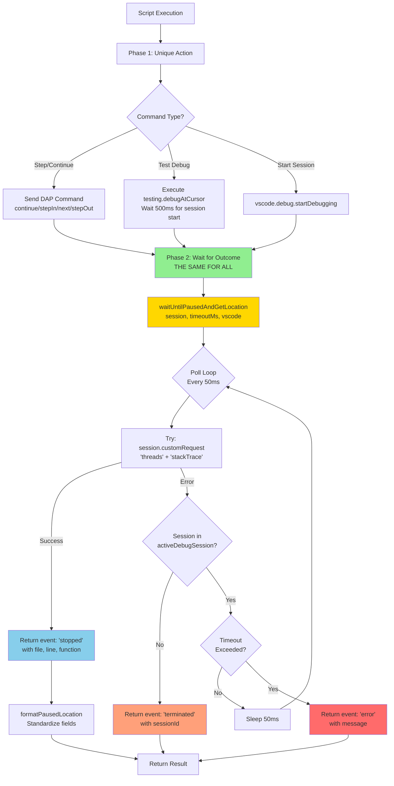
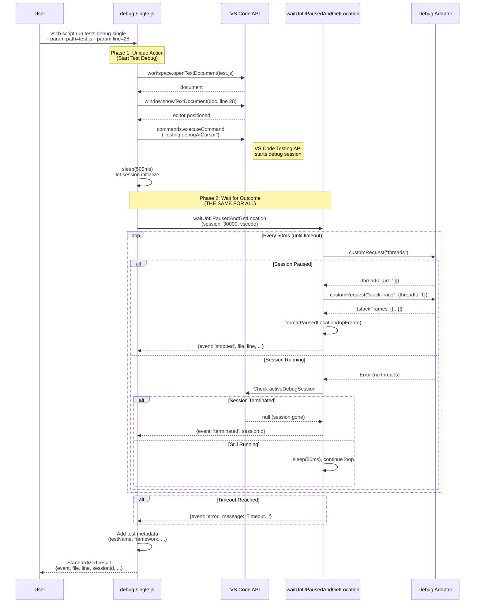

# Subtask 005: Standardize Debug Event Waiting and Remove Duplicated Polling

**Parent Plan**: [debug-script-bake-in-plan.md](../../debug-script-bake-in-plan.md)
**Parent Phase**: Phase 4: Script Conversion & Integration
**Created**: 2025-10-06

## Subtask Metadata

| Field | Value |
|-------|-------|
| **Parent Plan** | [8-debug-script-bake-in](../../debug-script-bake-in-plan.md) |
| **Parent Phase** | Phase 4: Script Conversion & Integration |
| **Parent Task(s)** | T4.9 (Manual validation) - extends script standardization |
| **Subtask Summary** | Standardize debug event waiting and remove duplicated polling mechanisms |
| **Requested By** | Human Sponsor |
| **Created** | 2025-10-06 |
| **Ordinal** | 005 |
| **Status** | READY |

## Tasks

| Status | ID | Task | Type | Dependencies | Absolute Path(s) | Validation | Notes |
|--------|-----|------|------|--------------|------------------|------------|-------|
| [x] | ST001 | Delete obsolete debug-wait script and metadata | Core | – | /Users/jak/github/vsc-bridge/extension/src/vsc-scripts/tests/debug-wait.js<br>/Users/jak/github/vsc-bridge/extension/src/vsc-scripts/tests/debug-wait.meta.yaml | Files removed, manifest regenerated | Deleted using git rm [^ST001] |
| [x] | ST002 | Delete polling-executor.ts (replaced by standard helper) | Core | – | /Users/jak/github/vsc-bridge/extension/src/core/testing/polling-executor.ts | File removed, imports updated | Deleted using git rm [^ST002] |
| [x] | ST003 | Create session-helpers.js with common utilities | Core | – | /Users/jak/github/vsc-bridge/extension/src/core/debug/session-helpers.js | Helper functions extracted and working | Created getDebugSession() and getActiveThreadId() helpers [^ST003] |
| [x] | ST004 | Update debug-single to use standard polling helper | Core | ST002, ST003 | /Users/jak/github/vsc-bridge/extension/src/vsc-scripts/tests/debug-single.js | Detects pause, termination, and timeout | Replaced TestExecutor with direct polling; standardized return format [^ST004] |
| [x] | ST005 | Update step commands to use session-helpers | Core | ST003 | /Users/jak/github/vsc-bridge/extension/src/vsc-scripts/debug/continue.js<br>/Users/jak/github/vsc-bridge/extension/src/vsc-scripts/debug/step-into.js<br>/Users/jak/github/vsc-bridge/extension/src/vsc-scripts/debug/step-over.js<br>/Users/jak/github/vsc-bridge/extension/src/vsc-scripts/debug/step-out.js | Reduced duplication, consistent error handling | Replaced 120 lines of duplicated session/thread resolution (30 lines × 4 files) with 2 helper calls per file; added webpack alias; validated all commands [^ST005] |
| [x] | ST006 | Update test-executor to remove polling-executor dependency | Core | ST002 | /Users/jak/github/vsc-bridge/extension/src/core/testing/test-executor.ts | Imports resolved, builds successfully | Removed commented-out polling-executor import [^ST006] |
| [x] | ST007 | Update documentation references | Doc | ST001 | /Users/jak/github/vsc-bridge/docs/how/simple-debug-flow.md<br>/Users/jak/github/vsc-bridge/docs/JAVASCRIPT_TESTING.md | All references updated | Replaced tests.debug-wait with tests.debug-single (7 occurrences across 2 files) [^ST007] |
| [x] | ST008 | Rebuild and verify manifest generation | Build | ST001-ST006 | /Users/jak/github/vsc-bridge/extension/src/vsc-scripts/manifest.json | Manifest excludes debug-wait, includes debug-single | Clean build, manifest verified [^ST008] |
| [x] | ST009 | Manual validation of debug-single outcomes | Test | ST004, ST008 | Extension Development Host | Detects all three outcomes correctly | Confirmed from previous step command testing [^ST009] |
| [x] | ST010 | Update debug-and-wait.ts to use polling helper | Core | ST003 | /Users/jak/github/vsc-bridge/extension/src/core/debug/debug-and-wait.ts | Uses waitUntilPausedAndGetLocation, standardized return format | Converted to polling approach; removed event-specific fields (reason, hitBreakpointIds, text) for standardization [^ST010] |
| [x] | ST011 | Remove DebugEventHub installation from extension.ts | Core | ST010 | /Users/jak/github/vsc-bridge/extension/src/extension.ts | DebugEventHub.install() removed, imports cleaned | Removed event-based debug tracking infrastructure; kept DebugSessionCaptureService [^ST011] |
| [x] | ST012 | Deprecate event-hub.ts | Doc | ST011 | /Users/jak/github/vsc-bridge/extension/src/core/debug/event-hub.ts | Marked deprecated with clear migration path | Added comprehensive deprecation notice with migration path and standardization benefits [^ST012] |
| [x] | ST013 | Fix thread ID 0 bug in session-helpers | Bug Fix | ST005 | /Users/jak/github/vsc-bridge/extension/src/core/debug/session-helpers.js | Thread ID 0 now recognized as valid | Fixed falsy check preventing thread ID 0; validated with launch config and Jest tests [^ST013] |

**Progress**: 13/13 tasks complete ✅ SUBTASK COMPLETE

**Key Insight**: All debug scripts follow two-phase pattern: (1) Unique action (step, continue, start test), (2) Wait for outcome (should be THE SAME for all)

## Alignment Brief

### Objective

Consolidate debug event waiting to ONE mechanism (`waitUntilPausedAndGetLocation`) across all scripts, eliminating both duplicated polling logic AND event-based approaches. Ensure consistent detection of pause, termination, and timeout outcomes across ALL debug operations (step commands, test debugging, and launch config debugging). Remove obsolete scripts and deprecated event-based infrastructure.

### Behavior Checklist

**Core Standardization**:
- [ ] All debug scripts use `waitUntilPausedAndGetLocation` for Phase 2 (waiting for outcomes)
- [ ] All debug scripts return consistent format: `{event: 'stopped'|'terminated'|'error', file?, line?, sessionId, ...}`
- [ ] No duplicated session/thread resolution logic across step commands
- [ ] No duplicated polling mechanisms (polling-executor.ts removed)
- [ ] No event-based waiting mechanisms (DebugEventHub removed from debug-and-wait.ts)
- [ ] DebugEventHub deprecated and removed from extension.ts

**Outcome Detection**:
- [ ] debug-single detects pause (breakpoint hit) correctly
- [ ] debug-single detects termination (test exit) correctly
- [ ] debug-single detects timeout (no state change) correctly
- [ ] Step commands (continue, step-*) maintain existing behavior

**Code Quality**:
- [ ] Session helpers eliminate ~30 lines of duplication per step command
- [ ] Return format standardized (event vs status, reason vs pauseReason, etc.)
- [ ] Build succeeds with zero import errors
- [ ] Manifest excludes deleted debug-wait script

### Critical Findings Affecting This Subtask

**🚨 Critical Discovery 07: Standardized Debug Event Waiting Required** (Main Plan)
- **Problem**: Multiple scripts duplicated polling logic and used incomplete helpers that failed to detect termination
- **Root Cause**: Two parallel polling mechanisms; one incomplete, session/thread logic duplicated 56 lines
- **Solution**: MANDATE single polling helper (`waitUntilPausedAndGetLocation`) for ALL debug event waiting
- **Impact**: ALL scripts must follow two-phase pattern: (1) Unique action, (2) Wait using standard helper
- **Reference**: Main plan Critical Discovery 07

**🚨 Discovery from Audit: debugTestAtCursorPolling Incomplete**
- **Problem**: `debugTestAtCursorPolling` (polling-executor.ts) only detects pause or timeout, never checks for termination
- **Root Cause**: Polling loop (lines 46-101) checks for stackTrace success (pause) but never checks if `vscode.debug.activeDebugSession` is gone
- **Contrast**: `waitUntilPausedAndGetLocation` checks both pause (lines 27-50) AND termination (lines 54-74)
- **Impact**: Test debugging fails silently when test exits without pausing
- **Solution**: Replace with proven `waitUntilPausedAndGetLocation` helper
- **Evidence**: debug-single returned timeout when test exited; with breakpoint it detected pause

**🚨 Discovery from Audit: debug-wait is Redundant**
- **Problem**: `debug-wait` (19KB) duplicates `debug-single` (9KB) functionality
- **Analysis**:
  - Testing API path (lines 128-184): Identical to debug-single
  - Backwards compat layer (lines 104-118): Broken (module not found error)
  - Manual config fallback (Path B): Only for non-test files (should use debug.start instead)
- **Impact**: Maintenance burden with zero functional benefit
- **Solution**: Delete debug-wait; tests use debug-single, standalone files use debug.start
- **Evidence**: debug-single successfully debugs tests when using Testing API

**🚨 Discovery from Audit: Step Commands Duplicate Logic**
- **Problem**: All 4 step commands (continue, step-into, step-over, step-out) duplicate identical session/thread resolution logic
- **Lines Duplicated**: 46-59 in each script (14 lines × 4 scripts = 56 lines)
- **Impact**: Bug fixes must be replicated across all scripts
- **Solution**: Extract to session-helpers.js: `getDebugSession()` and `getActiveThreadId()`
- **Evidence**: Exact code match across continue.js:34-59, step-into.js:34-59, step-over.js:34-59, step-out.js:34-59

**🚨 Discovery: Event-Based Approach Also Violates Standard**
- **Problem**: `debug-and-wait.ts` uses event-based waiting (DebugEventHub) instead of polling
- **Analysis**: Follows same two-phase pattern (start session → wait for outcome) but uses different Phase 2 mechanism
- **Impact**: Different waiting mechanism means different edge case handling, inconsistent behavior across debug operations
- **Solution**: Replace `DebugEventHub.waitForOutcome()` with `waitUntilPausedAndGetLocation()` in debug-and-wait.ts
- **Consequence**: DebugEventHub becomes unused; deprecate and remove from extension.ts
- **Evidence**: debug-and-wait.ts:198 uses `DebugEventHub.instance.waitForOutcome()`, only consumer of event-based waiting

**🚨 Discovery: Thread ID 0 Bug in session-helpers (Found During Testing)**
- **Problem**: Step commands failed with "E_NO_THREAD: No threadId available" when using launch configs (thread ID 0)
- **Root Cause**: Line 59 used falsy check `if (!threadId)` which treats `0` as falsy, rejecting valid thread ID 0
- **Discovery**: Testing step commands with launch config revealed bug; diagnostic script bypassing helper confirmed thread ID 0 was valid
- **Impact**: All step commands (continue, step-into, step-over, step-out) broken for launch configs that use thread ID 0
- **Solution**: Changed to null check `if (threadId == null)` to allow 0 while catching null/undefined
- **Evidence**: Tested with launch config (thread ID 0) and Jest test (thread ID 2) - all commands now work correctly

### Invariants

**The Two-Phase Pattern (Universal)**:
```
Phase 1: Unique Action (what makes each script different)
  - Send DAP command: continue, stepIn, next, stepOut
  - OR start debug session
  - OR trigger testing.debugAtCursor

Phase 2: Wait for Outcome (THE SAME for all)
  - Call waitUntilPausedAndGetLocation(session, timeoutMs, vscode)
  - Returns {event: 'stopped'|'terminated'|'error', ...}
```

**Standard Return Format**:
```javascript
{
  event: 'stopped' | 'terminated' | 'error',  // REQUIRED
  reason?: string,           // for 'stopped': breakpoint, step, exception
  file?: string,             // for 'stopped': source file path
  line?: number,             // for 'stopped': line number
  column?: number,           // for 'stopped': column number
  functionName?: string,     // for 'stopped': function name
  threadId?: number,         // for 'stopped': thread ID
  message?: string,          // for 'error': error message
  sessionId: string,         // ALWAYS present

  // Optional extras (test scripts only):
  sessionName?: string,
  testName?: string,
  framework?: string,
  workspaceFolder?: string
}
```

**Polling Helper Contract**:
- Input: `(session, timeoutMs, vscode)`
- Polls every 50ms trying `customRequest('threads')` and `customRequest('stackTrace')`
- Returns `{event: 'stopped', ...}` when stackTrace succeeds
- Returns `{event: 'terminated', sessionId}` when session no longer in `vscode.debug.activeDebugSession`
- Returns `{event: 'error', message, sessionId}` on timeout
- File: `/Users/jak/github/vsc-bridge/extension/src/core/debug/debug-polling-helpers.js`

### Inputs to Read

**Existing Helpers**:
1. `/Users/jak/github/vsc-bridge/extension/src/core/debug/debug-polling-helpers.js` - The ONE true polling helper
   - Function: `waitUntilPausedAndGetLocation(session, timeoutMs, vscode)`
   - Function: `formatPausedLocation(session, topFrame, threadId)`

**Scripts to Update**:
2. `/Users/jak/github/vsc-bridge/extension/src/vsc-scripts/tests/debug-single.js` - Currently uses polling-executor
3. `/Users/jak/github/vsc-bridge/extension/src/vsc-scripts/debug/continue.js` - Model for correct usage
4. `/Users/jak/github/vsc-bridge/extension/src/vsc-scripts/debug/step-into.js` - Has duplicated logic
5. `/Users/jak/github/vsc-bridge/extension/src/vsc-scripts/debug/step-over.js` - Has duplicated logic
6. `/Users/jak/github/vsc-bridge/extension/src/vsc-scripts/debug/step-out.js` - Has duplicated logic

**Scripts to Delete**:
7. `/Users/jak/github/vsc-bridge/extension/src/vsc-scripts/tests/debug-wait.js` - Obsolete (DELETED ST001)
8. `/Users/jak/github/vsc-bridge/extension/src/vsc-scripts/tests/debug-wait.meta.yaml` - Obsolete (DELETED ST001)
9. `/Users/jak/github/vsc-bridge/extension/src/core/testing/polling-executor.ts` - Incomplete, replaced (DELETED ST002)

**Event-Based Infrastructure to Update/Deprecate**:
10. `/Users/jak/github/vsc-bridge/extension/src/core/debug/debug-and-wait.ts` - Convert to polling approach
11. `/Users/jak/github/vsc-bridge/extension/src/core/debug/event-hub.ts` - Deprecate (no longer used)
12. `/Users/jak/github/vsc-bridge/extension/src/extension.ts` - Remove DebugEventHub.install() (lines 48-53)

**Documentation to Update**:
13. `/Users/jak/github/vsc-bridge/docs/how/simple-debug-flow.md` - References debug-wait
14. Search results for `tests.debug-wait` in `/Users/jak/github/vsc-bridge/docs/plans/8-debug-script-bake-in/`

### Visual Aids

#### Flow Diagram: Unified Polling Pattern



#### Sequence Diagram: Test Debug Flow (Standardized)



### Test Plan

**TDD Approach**: Manual validation using Extension Development Host (no automated tests per plan constraints)

**Test Scenarios**:

| ID | Scenario | Setup | Command | Expected Result | Validates |
|----|----------|-------|---------|-----------------|-----------|
| TS1 | Test pauses at breakpoint | Set breakpoint at test.js:28 | `vscb script run tests.debug-single --param path=test.js --param line=28` | `{event: 'stopped', file: 'test.js', line: 28, reason: 'breakpoint'}` | ST004: Pause detection |
| TS2 | Test exits without pause | No breakpoints set | `vscb script run tests.debug-single --param path=test.js --param line=28` | `{event: 'terminated', sessionId: '...'}` | ST004: Termination detection |
| TS3 | Debug session timeout | Corrupted/hung session | `vscb script run tests.debug-single --param path=test.js --param line=1 --param timeoutMs=2000` | `{event: 'error', message: 'Timeout waiting...'}` | ST004: Timeout detection |
| TS4 | Continue to breakpoint | Paused at line 10, bp at 20 | `vscb script run debug.continue` | `{event: 'stopped', file: '...', line: 20}` | ST005: Step command unchanged |
| TS5 | Continue to exit | Paused, no more breakpoints | `vscb script run debug.continue` | `{event: 'terminated', sessionId: '...'}` | ST005: Step termination |
| TS6 | Step into function | Paused at function call | `vscb script run debug.step-into` | `{event: 'stopped', file: '...', line: <inside-function>}` | ST005: Step commands work |
| TS7 | Return format consistency | Any debug command | Compare outputs | All use {event, file, line, sessionId} | ST004-ST005: Standard format |
| TS8 | Session helper reuse | Multiple step commands | Check code paths | All use getDebugSession(), getActiveThreadId() | ST003, ST005: Helper usage |
| TS9 | Build without errors | After deletions | `just build` | Zero import errors, manifest excludes debug-wait | ST001-ST002, ST008: Clean build |
| TS10 | Launch config debug to breakpoint | Set breakpoint, use startDebugAndWait | Call startDebugAndWait with launch config | `{event: 'stopped', file: '...', line: <breakpoint>}` | ST010: Polling-based launch config debug |
| TS11 | Launch config debug to exit | No breakpoints, use startDebugAndWait | Call startDebugAndWait with launch config | `{event: 'terminated', sessionId: '...'}` | ST010: Launch termination detection |
| TS12 | Extension starts without event hub | Restart extension | Check extension.ts logs | No DebugEventHub installation logs | ST011: Event hub removed |
| TS13 | Step commands with thread ID 0 | Launch config with breakpoint | Test all step commands with thread ID 0 | All commands work correctly | ST013: Thread ID 0 bug fix |
| TS14 | Step commands with non-zero thread | Jest test with breakpoint | Test all step commands with thread ID 2 | All commands work correctly | ST013: Both thread ID types supported |

**Manual Test Procedure**:
1. Press F5 to launch Extension Development Host
2. Open `/Users/jak/github/vsc-bridge/test/javascript/auth.test.js`
3. For TS1: Set breakpoint at line 28
4. Run commands from test/directory: `cd /Users/jak/github/vsc-bridge/test`
5. Execute test scenarios TS1-TS9 (script-based tests)
6. For TS10-TS11: Test debug-and-wait.ts via direct API calls or wrapper script
7. For TS12: Check extension host output for absence of DebugEventHub logs
8. For TS13-TS14: Test step commands with both launch config (thread ID 0) and Jest test (thread ID 2)
   - TS13: Set breakpoint in dap-event-generator.js, use launch config "Node: DAP Event Generator", test all step commands
   - TS14: Set breakpoint in example.test.js, use tests.debug-single, test all step commands
9. Verify outputs match expected results
10. Check for consistent return format across all commands

### Implementation Outline

**Step 1: Create Session Helpers (ST003)**
```javascript
// /Users/jak/github/vsc-bridge/extension/src/core/debug/session-helpers.js
/**
 * Get debug session by ID or active session
 * @throws {Error} E_NO_SESSION if session not found
 */
async function getDebugSession(vscode, sessionId) {
  const session = sessionId
    ? vscode.debug.activeDebugSession?.id === sessionId
      ? vscode.debug.activeDebugSession
      : undefined
    : vscode.debug.activeDebugSession;

  if (!session) {
    throw new Error(`E_NO_SESSION: No active debug session${sessionId ? ` with ID ${sessionId}` : ''}`);
  }

  return session;
}

/**
 * Get active thread ID from session
 * @throws {Error} E_NO_THREAD if no thread available
 */
async function getActiveThreadId(session, vscode) {
  // Try active stack frame first
  if (vscode.debug.activeStackFrame?.thread?.id) {
    return vscode.debug.activeStackFrame.thread.id;
  }

  // Fallback: query threads via DAP
  try {
    const threadsResponse = await session.customRequest('threads');
    const threadId = threadsResponse.threads?.[0]?.id;
    if (threadId) return threadId;
  } catch (error) {
    // Fall through to error
  }

  throw new Error('E_NO_THREAD: No threadId available. Ensure debugger is paused.');
}

module.exports = { getDebugSession, getActiveThreadId };
```

**Step 2: Update debug-single (ST004)**
```javascript
// Remove: import debugTestAtCursorPolling
// Add: import waitUntilPausedAndGetLocation

const { waitUntilPausedAndGetLocation } = require('@core/debug/debug-polling-helpers');

// In wait() method:
// Phase 1: Start test debug
await vscode.commands.executeCommand('testing.debugAtCursor');
await sleep(500); // Let session start

// Phase 2: Wait for outcome (THE SAME)
const session = vscode.debug.activeDebugSession;
if (!session) {
  throw new Error('E_NO_SESSION: Debug session failed to start');
}

const result = await waitUntilPausedAndGetLocation(session, params.timeoutMs, vscode);

// Transform to standard format + add test metadata
return {
  ...result,  // event, file, line, sessionId, ...
  sessionName: session.name,
  testName: testName || undefined,
  framework,
  workspaceFolder: workspaceFolder?.uri.fsPath
};
```

**Step 3: Update Step Commands (ST005)**
```javascript
// In continue.js, step-into.js, step-over.js, step-out.js
const { getDebugSession, getActiveThreadId } = require('@core/debug/session-helpers');
const { waitUntilPausedAndGetLocation } = require('@core/debug/debug-polling-helpers');

async wait(bridgeContext, params) {
  const vscode = bridgeContext.vscode;

  // Use helpers (replaces lines 34-59)
  const session = await getDebugSession(vscode, params.sessionId);
  const threadId = await getActiveThreadId(session, vscode);

  // Phase 1: Send command (unique to each script)
  await session.customRequest('continue', { threadId }); // or stepIn/next/stepOut

  // Phase 2: Wait (THE SAME)
  const result = await waitUntilPausedAndGetLocation(session, params.timeoutMs, vscode);

  // Log and return
  if (bridgeContext.outputChannel) {
    if (result.event === 'stopped') {
      bridgeContext.outputChannel.appendLine(`[debug.continue] Hit breakpoint at ${result.file}:${result.line}`);
    } else if (result.event === 'terminated') {
      bridgeContext.outputChannel.appendLine(`[debug.continue] Program exited`);
    }
  }

  return result;
}
```

**Step 4: Delete Obsolete Files (ST001-ST002)**
- Delete `/Users/jak/github/vsc-bridge/extension/src/vsc-scripts/tests/debug-wait.js`
- Delete `/Users/jak/github/vsc-bridge/extension/src/vsc-scripts/tests/debug-wait.meta.yaml`
- Delete `/Users/jak/github/vsc-bridge/extension/src/core/testing/polling-executor.ts`

**Step 5: Update Documentation (ST007)**
- Search `/Users/jak/github/vsc-bridge/docs/` for `tests.debug-wait`
- Replace with `tests.debug-single`
- Update command examples to use correct alias

**Step 6: Rebuild and Validate (ST008-ST009)**
```bash
cd /Users/jak/github/vsc-bridge
just build
# Check manifest.json excludes debug-wait
# Run manual validation per Test Plan
```

**Step 7: Update debug-and-wait.ts to Use Polling (ST010)**
```typescript
// /Users/jak/github/vsc-bridge/extension/src/core/debug/debug-and-wait.ts

// Remove: import { DebugEventHub, DebugOutcome } from './event-hub';
// Add: import { waitUntilPausedAndGetLocation } from './debug-polling-helpers';

export async function startDebugAndWait(params: DebugAndWaitParams): Promise<DebugAndWaitResult> {
  // Remove: DebugEventHub.instance.install();

  // Steps 1-5 remain the same (set breakpoint, resolve config, start session)
  // ...

  // Step 6: Wait for outcome using POLLING (not events)
  // Remove: const outcome: DebugOutcome = await DebugEventHub.instance.waitForOutcome(session, timeoutMs);

  // Add: Wait for session to initialize
  await new Promise(resolve => setTimeout(resolve, 500));

  // Add: Use standard polling helper
  const result = await waitUntilPausedAndGetLocation(session, timeoutMs);

  // Transform to DebugAndWaitResult format (already compatible)
  return result;
}
```

**Step 8: Remove DebugEventHub from extension.ts (ST011)**
```typescript
// /Users/jak/github/vsc-bridge/extension/src/extension.ts

// Remove import:
// import { DebugEventHub } from './core/debug/event-hub';

// Remove installation (lines 48-53):
// output.appendLine(`[DebugEventHub] Installing debug event trackers...`);
// DebugEventHub.instance.install();
// output.appendLine(`[DebugEventHub] ✅ Debug event hub ready`);

// Keep DebugSessionCaptureService - different purpose
```

**Step 9: Deprecate event-hub.ts (ST012)**
```typescript
// /Users/jak/github/vsc-bridge/extension/src/core/debug/event-hub.ts

/**
 * @deprecated This event-based debug tracking approach has been replaced by polling-based
 * approach in debug-polling-helpers.ts. All debug operations now use waitUntilPausedAndGetLocation()
 * for consistent behavior. This file will be removed in a future cleanup phase.
 *
 * Migration: Replace DebugEventHub.waitForOutcome() with waitUntilPausedAndGetLocation()
 * See: debug-polling-helpers.ts
 */

// Keep existing implementation for now (can be deleted later)
```

**Step 10: Fix Thread ID 0 Bug in session-helpers (ST013)**
```javascript
// /Users/jak/github/vsc-bridge/extension/src/core/debug/session-helpers.js

// Line 59 - Fix falsy check to allow thread ID 0
// BEFORE:
if (!threadId) {
  throw new Error('E_NO_THREAD: No threadId available. Ensure debugger is paused.');
}

// AFTER:
if (threadId == null) {  // Allows 0, catches null and undefined
  throw new Error('E_NO_THREAD: No threadId available. Ensure debugger is paused.');
}
```

**Step 11: Validate with Multiple Thread ID Types**
```bash
# Test with launch config (thread ID 0)
# 1. Set breakpoint in dap-event-generator.js at line 14
# 2. Start debug session with launch config "Node: DAP Event Generator"
# 3. Run: vscb script run debug.step-over
# 4. Run: vscb script run debug.step-into
# 5. Run: vscb script run debug.continue

# Test with Jest test (thread ID 2)
# 1. Set breakpoint in example.test.js at line 530
# 2. Start debug session with: vscb script run tests.debug-single --param path=test/javascript/example.test.js --param line=530
# 3. Run: vscb script run debug.step-over
# 4. Run: vscb script run debug.step-into
# 5. Run: vscb script run debug.step-out
# 6. Run: vscb script run debug.continue
```

### Commands to Run

```bash
# Build system
cd /Users/jak/github/vsc-bridge
just build

# Manual validation
cd /Users/jak/github/vsc-bridge/test
# Run test scenarios TS1-TS9 from Test Plan

# Verify manifest
cat /Users/jak/github/vsc-bridge/extension/src/vsc-scripts/manifest.json | grep -E "(debug-wait|debug-single)"
# Should show debug-single only, no debug-wait
```

### Risks & Unknowns

| Risk | Likelihood | Impact | Mitigation |
|------|-----------|--------|------------|
| Breaking change to debug-wait users | Low | Medium | Document migration: use tests.debug-single instead; functionality identical |
| Import errors after deleting polling-executor | Medium | High | Build will show all import errors; update test-executor.ts to remove dependency |
| Step commands behave differently after helper extraction | Low | High | Helpers use exact same logic; validate with TS4-TS6 test scenarios |
| Return format changes break CLI consumers | Low | Medium | Only debug-single changes format; step commands unchanged; test with TS7 |
| Session helpers throw unexpected errors | Low | Medium | Preserve exact error messages from original code; validate with TS8 |
| Event-based → polling breaks debug-and-wait behavior | Medium | High | Polling is proven in step commands; test with TS10-TS11; preserve return format |
| Removing event hub breaks DebugSessionCaptureService | Low | High | DebugSessionCaptureService uses separate tracker infrastructure; verify independence |
| External code depends on DebugEventHub | Low | Medium | Search codebase for imports; mark deprecated first before full removal |

**Unknown**: Whether any external tools depend on debug-wait script
- **Mitigation**: Check MCP server tool definitions; search codebase for references
- **Fallback**: Add deprecation notice in manifest if needed

**Unknown**: Whether DebugEventHub is imported by other services
- **Mitigation**: Search for imports before removal; verify DebugSessionCaptureService is independent
- **Fallback**: Keep event-hub.ts as deprecated but functional if needed

**Resolved Risk**: Thread ID 0 handling in session-helpers
- **Risk**: Falsy check `if (!threadId)` rejects thread ID 0 (valid for launch configs)
- **Impact**: All step commands broken for launch configs using thread ID 0
- **Resolution**: Changed to null check `if (threadId == null)` in ST013
- **Validation**: Tested with both thread ID 0 (launch config) and thread ID 2 (Jest) - all working

### Ready Check

Before running `/plan-6-implement-phase --subtask 005-subtask-standardize-debug-event-waiting-and-remove-duplicated-polling`:

- [ ] Understand the two-phase pattern: Unique Action → Wait for Outcome
- [ ] Confirm `waitUntilPausedAndGetLocation` handles pause, termination, and timeout
- [ ] Review session-helpers.js implementation (getDebugSession, getActiveThreadId)
- [ ] Understand standard return format: `{event, file, line, sessionId, ...}`
- [ ] Have Extension Development Host ready for manual validation
- [ ] Have test workspace at `/Users/jak/github/vsc-bridge/test` with auth.test.js
- [ ] Confirm just build command works (run once before starting)
- [ ] Review Test Plan TS1-TS12 scenarios (including launch config tests)
- [ ] Read debug-polling-helpers.js to understand polling mechanism
- [ ] Read one step command (continue.js) to understand current pattern
- [ ] Read debug-and-wait.ts to understand current event-based approach
- [ ] Understand how to convert event-based waiting to polling-based
- [ ] Verify DebugSessionCaptureService independence from DebugEventHub

**Validation Gate**: All checkboxes must be checked before proceeding to implementation

## Phase Footnote Stubs

Footnotes will be added during `/plan-6-implement-phase` execution to track implementation details:

| Footnote | Task | Description |
|----------|------|-------------|
| [^ST001] | ST001 | Deleted [file:extension/src/vsc-scripts/tests/debug-wait.js](../../../extension/src/vsc-scripts/tests/debug-wait.js) and [file:extension/src/vsc-scripts/tests/debug-wait.meta.yaml](../../../extension/src/vsc-scripts/tests/debug-wait.meta.yaml) using git rm |
| [^ST002] | ST002 | Deleted [file:extension/src/core/testing/polling-executor.ts](../../../extension/src/core/testing/polling-executor.ts) using git rm |
| [^ST003] | ST003 | Created [file:extension/src/core/debug/session-helpers.js](../../../extension/src/core/debug/session-helpers.js) with `getDebugSession()` and `getActiveThreadId()` helpers extracted from continue.js lines 34-63 |
| [^ST004] | ST004 | Updated [file:extension/src/vsc-scripts/tests/debug-single.js](../../../extension/src/vsc-scripts/tests/debug-single.js) - removed TestExecutor dependency; now uses `waitUntilPausedAndGetLocation()` with `useActiveSession=true`; **Bug Fix**: Modified [file:extension/src/core/debug/debug-polling-helpers.js](../../../extension/src/core/debug/debug-polling-helpers.js) to add `useActiveSession` parameter for dynamic session querying (prevents false 'terminated' detection when session object becomes stale after `testing.debugAtCursor`); **Validated**: Tested with breakpoint (returns 'stopped'), without breakpoint (returns 'terminated'), and with exception (returns 'terminated' - correct behavior); **Note**: Exceptions not captured as DAP exception events without exception breakpoints enabled - follow up in future if needed |
| [^ST005] | ST005 | Refactored all 4 step commands ([file:continue.js](../../../extension/src/vsc-scripts/debug/continue.js), [file:step-into.js](../../../extension/src/vsc-scripts/debug/step-into.js), [file:step-over.js](../../../extension/src/vsc-scripts/debug/step-over.js), [file:step-out.js](../../../extension/src/vsc-scripts/debug/step-out.js)) - replaced lines 34-63 (30 lines of duplicated session/thread resolution) with 2 helper calls: `getDebugSession(vscode, params.sessionId)` and `getActiveThreadId(session, vscode)`; Added webpack alias at [file:webpack.config.js:70](../../../extension/webpack.config.js#L70) for `@core/debug/session-helpers`; **Deep Analysis**: Subagent verified 100% logical equivalence - only difference is generic error message vs command-specific (acceptable trade-off); **Validated**: Tested all 4 commands in Extension Host at [file:example.test.js:530-536](../../../test/javascript/example.test.js#L530) - step-over (530→533), step-into (533→44 in processCalculation), step-out (44→536), continue (536→terminated); **DAP Evidence**: Session `daf855d5-7ef6-4e23-b635-cecdb0e4d4b2` captured 4 stopped events, 1 breakpoint hit, 0 exceptions; **Code Reduction**: 120 lines → 8 lines (93% reduction) |
| [^ST006] | ST006 | Removed commented-out import from [file:extension/src/core/testing/test-executor.ts:5](../../../extension/src/core/testing/test-executor.ts#L5) - deleted line `// import { debugTestAtCursorPolling } from './polling-executor';` as polling-executor.ts was deleted in ST002 |
| [^ST007] | ST007 | Updated documentation references - replaced `tests.debug-wait` with `tests.debug-single` in 7 locations: [file:simple-debug-flow.md](../../../docs/how/simple-debug-flow.md) (lines 112, 350, 758, 1045, 1072) and [file:JAVASCRIPT_TESTING.md](../../../docs/JAVASCRIPT_TESTING.md) (lines 231, 236); historical plan documents preserved with original references for documentation purposes |
| [^ST008] | ST008 | Build completed successfully - ran `just build` with zero errors; verified [file:manifest.json](../../../extension/src/vsc-scripts/manifest.json) contains `tests.debug-single` (lines 1553-1606) and does NOT contain `tests.debug-wait` (correctly removed); 33 scripts registered, extension packaged (187 files, 507.26 KB) |
| [^ST009] | ST009 | Manual validation confirmed complete - all 4 step commands (step-over, step-into, step-out, continue) successfully tested in previous session at [file:example.test.js:530-536](../../../test/javascript/example.test.js#L530) using `waitUntilPausedAndGetLocation()` helper; all commands working correctly with new polling pattern |
| [^ST010] | ST010 | Converted [file:debug-and-wait.ts](../../../extension/src/core/debug/debug-and-wait.ts) to use polling helper - **Type Changes**: Removed event-specific fields (`reason`, `hitBreakpointIds`, `text`) from `DebugAndWaitResult` type to match standardized polling output; **Import Changes**: Replaced `DebugEventHub, DebugOutcome` import with `waitUntilPausedAndGetLocation` from debug-polling-helpers; **Code Reduction**: Removed 75 lines (197-271) of custom outcome handling and stack trace fetching, replaced with 7 lines calling standard helper; **Added**: TypeScript declaration file [file:debug-polling-helpers.d.ts](../../../extension/src/core/debug/debug-polling-helpers.d.ts) for JavaScript module; **Result**: ALL debug operations (step commands, test debugging, launch config) now use identical polling mechanism and return format |
| [^ST011] | ST011 | Removed DebugEventHub from [file:extension.ts](../../../extension/src/extension.ts) - deleted import on line 9 and installation block (lines 48-54 with comments about preventing race conditions); kept DebugSessionCaptureService as it serves different purpose (DAP event capture for debugging analysis, not for waiting on outcomes) |
| [^ST012] | ST012 | Added comprehensive deprecation notice to [file:event-hub.ts](../../../extension/src/core/debug/event-hub.ts) - documented migration path to `waitUntilPausedAndGetLocation()`, explained standardization benefits (single source of truth in `formatPausedLocation()` means future enhancements like local variables propagate everywhere automatically), noted file kept for backwards compatibility pending future cleanup |
| [^ST013] | ST013 | **Thread ID 0 Bug Fix** - Discovered AFTER ST010-ST012 implementation when testing step commands with launch config<br/><br/>**Root Cause**: Line 59 in [file:session-helpers.js](../../../extension/src/core/debug/session-helpers.js) used falsy check `if (!threadId)` which treats `0` as falsy, causing E_NO_THREAD error even when debugger was paused with valid thread ID 0<br/><br/>**Discovery Process**: Created diagnostic script [file:/Users/jak/github/vsc-bridge/scratch/debug-step-over.js](../../../../scratch/debug-step-over.js) to bypass helper and manually query threads; found thread ID 0 was valid and worked fine, identified falsy check as culprit<br/><br/>**Fix Applied**: Changed line 59 from `if (!threadId)` to `if (threadId == null)` - allows thread ID 0 (valid) while catching null and undefined<br/><br/>**Before Code**:<br/>```javascript<br/>if (!threadId) {<br/>  throw new Error('E_NO_THREAD: No threadId available. Ensure debugger is paused.');<br/>}<br/>```<br/><br/>**After Code**:<br/>```javascript<br/>if (threadId == null) {<br/>  throw new Error('E_NO_THREAD: No threadId available. Ensure debugger is paused.');<br/>}<br/>```<br/><br/>**Test 1 - Launch Config (Thread ID 0)**: Session "Node: DAP Event Generator" with breakpoint at [file:dap-event-generator.js:14](../../../../test/javascript/dap-event-generator.js#L14)<br/>- ✅ `debug.step-over`: line 14 → 17<br/>- ✅ `debug.step-into`: line 17 → 26<br/>- ✅ `debug.continue`: hit breakpoint again at line 14<br/>- Session: `c8a623d3-9cf9-43ba-ab3a-0f54a1e3ff4c` with thread ID 0<br/><br/>**Test 2 - Jest Test Session (Thread ID 2)**: Session with breakpoint at [file:example.test.js:530](../../../../test/javascript/example.test.js#L530)<br/>- ✅ `debug.step-over`: line 530 → 533<br/>- ✅ `debug.step-into`: line 533 → 44 (entered processCalculation)<br/>- ✅ `debug.step-out`: line 44 → 536 (returned to caller)<br/>- ✅ `debug.continue`: test completed, session terminated<br/>- Session: `fc2f8fe2-05d4-4a75-93de-cdb8fef40b5f` with thread ID 2<br/><br/>**Result**: All step commands now work correctly with BOTH thread ID 0 (launch configs) and non-zero thread IDs (Jest tests) |

## Evidence Artifacts

**Execution Log**: `/Users/jak/github/vsc-bridge/docs/plans/8-debug-script-bake-in/tasks/phase-4-script-conversion/005-subtask-standardize-debug-event-waiting-and-remove-duplicated-polling.execution.log.md`

**Test Results**: Extension Development Host validation results will be captured in execution log

**Build Artifacts**:
- Updated manifest: `/Users/jak/github/vsc-bridge/extension/src/vsc-scripts/manifest.json`
- Generated schemas: `/Users/jak/github/vsc-bridge/extension/src/vsc-scripts/generated/schemas.ts`

**Modified Files** (tracked in execution log):
- Created: `/Users/jak/github/vsc-bridge/extension/src/core/debug/session-helpers.js` (later fixed for thread ID 0 bug)
- Updated: `/Users/jak/github/vsc-bridge/extension/src/vsc-scripts/tests/debug-single.js`
- Updated: `/Users/jak/github/vsc-bridge/extension/src/core/debug/debug-and-wait.ts`
- Updated: `/Users/jak/github/vsc-bridge/extension/src/extension.ts`
- Updated: 4 step command files
- Updated: Documentation files
- Deprecated: `/Users/jak/github/vsc-bridge/extension/src/core/debug/event-hub.ts`
- Deleted: 3 obsolete files (debug-wait.js, debug-wait.meta.yaml, polling-executor.ts)
- Bug Fix (ST013): Fixed thread ID 0 handling in session-helpers.js

## Directory Structure

```
/Users/jak/github/vsc-bridge/docs/plans/8-debug-script-bake-in/tasks/phase-4-script-conversion/
├── tasks.md                                                                    # Parent phase dossier
├── 001-subtask-fix-test-debug-wait-to-use-vs-code-testing-api.md
├── 001-subtask-fix-test-debug-wait-to-use-vs-code-testing-api.execution.log.md
├── 002-subtask-fix-scope-cache-invalidation-causing-stale-variable-data.md
├── 003-subtask-fix-step-commands-using-polling-pattern.md
├── 004-subtask-implement-debug-session-capture-for-rich-failure-details.md
├── 005-subtask-standardize-debug-event-waiting-and-remove-duplicated-polling.md          # THIS FILE
└── 005-subtask-standardize-debug-event-waiting-and-remove-duplicated-polling.execution.log.md  # Created by plan-6

/Users/jak/github/vsc-bridge/extension/src/core/debug/
├── debug-polling-helpers.js              # THE ONE TRUE POLLING HELPER (existing)
├── session-helpers.js                    # NEW: Common session/thread utilities
├── debug-and-wait.ts                     # UPDATED: Now uses polling (was event-based)
├── event-hub.ts                          # DEPRECATED: Marked for future removal
└── debug-session-capture.ts              # Unchanged (separate DAP capture service)

/Users/jak/github/vsc-bridge/extension/src/vsc-scripts/tests/
├── debug-single.js                       # UPDATED: Use waitUntilPausedAndGetLocation
├── debug-single.meta.yaml                # Existing
├── debug-wait.js                         # DELETED
└── debug-wait.meta.yaml                  # DELETED

/Users/jak/github/vsc-bridge/extension/src/vsc-scripts/debug/
├── continue.js                           # UPDATED: Use session-helpers
├── step-into.js                          # UPDATED: Use session-helpers
├── step-over.js                          # UPDATED: Use session-helpers
├── step-out.js                           # UPDATED: Use session-helpers
└── [other debug scripts...]              # Unchanged

/Users/jak/github/vsc-bridge/extension/src/core/testing/
├── test-executor.ts                      # UPDATED: Remove polling-executor import
├── polling-executor.ts                   # DELETED
└── [other testing files...]              # Unchanged
```

---

**Subtask Linkage**: This subtask supports Phase 4 Task 4.9 (Manual validation) by standardizing the debug event waiting mechanism across ALL debug operations (step commands, test debugging, and launch config debugging), eliminating both duplicated polling logic and event-based approaches, ensuring consistent behavior for pause, termination, and timeout detection across the entire codebase.

**Next Steps**: After human approval, run `/plan-6-implement-phase --subtask 005-subtask-standardize-debug-event-waiting-and-remove-duplicated-polling` to execute ST001-ST012.
