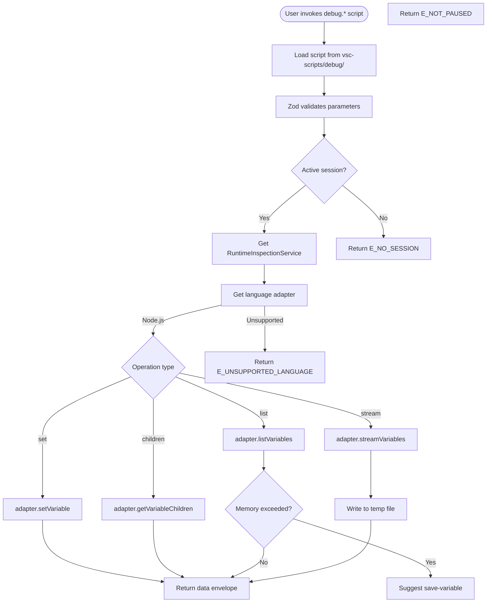
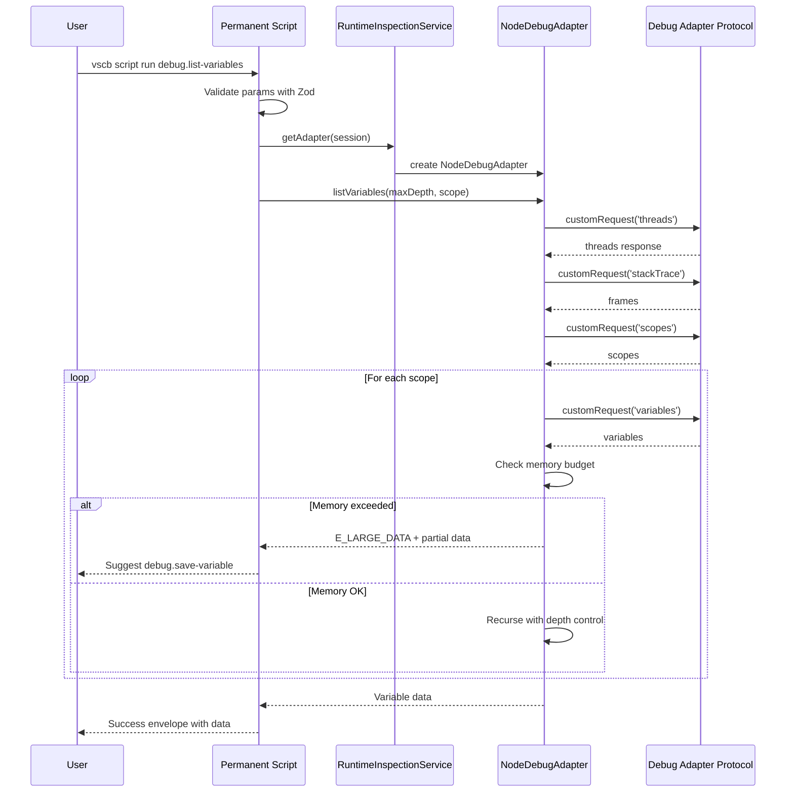

# Phase 4: Script Conversion & Integration - Tasks & Alignment Brief

**Phase**: Phase 4: Script Conversion & Integration
**Phase Slug**: phase-4-script-conversion
**Specification**: [debug-script-bake-in-spec.md](../../debug-script-bake-in-spec.md)
**Plan**: [debug-script-bake-in-plan.md](../../debug-script-bake-in-plan.md)
**Generated**: 2025-10-04
**Status**: READY

## Tasks

**Phase 4 Focus**: Convert 6 core variable exploration scripts that use RuntimeInspectionService

| Status | ID | Task | Type | Dependencies | Absolute Path(s) | Validation | Notes |
|--------|-----|------|------|--------------|------------------|------------|-------|
| [x] | 4.1 | Convert debug-status.js to baked-in script | Core | – | /Users/jordanknight/github/vsc-bridge/extension/src/vsc-scripts/debug/debug_status.ts | Script uses QueryScript base | ✅ VALIDATED: Returns session info with 64 frames [^33] |
| [x] | 4.2 | Convert debug-tracker.js for DAP tracking | Core | – | /Users/jordanknight/github/vsc-bridge/extension/src/vsc-scripts/debug/tracker.ts | Capability tracking works | ✅ VALIDATED: Identical output to dynamic version [^34.1] |
| [x] | 4.3 | Update list-variables to use RuntimeInspectionService | Core | 4.1, 4.2 | /Users/jordanknight/github/vsc-bridge/extension/src/vsc-scripts/debug/list_variables.ts | Script uses service layer | ✅ VALIDATED: Fixed API mismatches, functional parity achieved [^35.1] [^35.2] [^35.3] |
| [⛔] | 4.4 | Convert set-variable.js to permanent script | Core | 4.3 | /Users/jordanknight/github/vsc-bridge/extension/src/vsc-scripts/debug/set_variable.ts | Variable modification works | ⛔ **BLOCKED**: DAP setVariable limitation discovered - see [Subtask 002](./002-subtask-fix-scope-cache-invalidation-causing-stale-variable-data.md) [^36] |
| [x] | 4.5 | Create get-variable.js for pagination | Core | 4.3 | /Users/jordanknight/github/vsc-bridge/extension/src/vsc-scripts/debug/get-variable.js | Array pagination functional | ✅ VALIDATED: Pagination works correctly with 1000-element array [^37] |
| [ ] | 4.6 | Create save-variable.js for file output | Core | 4.3 | /Users/jordanknight/github/vsc-bridge/extension/src/vsc-scripts/debug/save-variable.js | File streaming works | Created but not validated [^38] |
| [ ] | 4.7 | Add Zod schemas for all parameters | Core | 4.1-4.6 | /Users/jordanknight/github/vsc-bridge/extension/src/vsc-scripts/debug/*.ts | Schemas validate correctly | Schemas added with scripts |
| [ ] | 4.8 | Document conversion pattern | Doc | 4.1-4.6 | /Users/jordanknight/github/vsc-bridge/docs/ | Clear guide for future scripts | Module.exports to class pattern |
| [ ] | 4.9 | Execute manual validation | Test | 4.1-4.6 | Extension Development Host | All scripts work identically | Incremental: F5→breakpoint→vscb script run |

**Progress**: 4/6 scripts validated (67% complete)

**Current Blocker**: Task 4.4 blocked by DAP setVariable limitation (see Critical Discovery 05)

**Next Step**: Skip to Task 4.5 (get-variable) OR accept current set-variable implementation as correct

## Alignment Brief

### Objective

Convert all proven dynamic debug scripts to permanent extension scripts using the established QueryScript/MutateScript base classes, integrating with the RuntimeInspectionService layer created in Phase 2 and the NodeDebugAdapter implemented in Phase 3.

### Behavior Checklist

Based on the plan acceptance criteria (6 core scripts only):
- [x] debug-status converted and validated
- [x] debug-tracker converted and validated
- [x] list-variables uses RuntimeInspectionService ✅ VALIDATED
- [ ] set-variable uses RuntimeInspectionService (BLOCKED - DAP limitation)
- [x] get-variable uses RuntimeInspectionService ✅ VALIDATED
- [ ] save-variable uses RuntimeInspectionService
- [ ] Zod schemas validate all script parameters
- [ ] Error codes standardized using debug-errors module
- [ ] Scripts accessible via debug.* aliases
- [ ] Manual testing confirms identical functionality
- [ ] Clear documentation of conversion patterns

### Critical Findings Affecting This Phase

**🚨 Critical Discovery 01: Script Base Class Loading Pattern**
- **Constraint**: Scripts load from src but base classes compile to out directory
- **Required Pattern**: Dynamic path resolution for base class imports
- **Addressed by**: T003 test verification, all script conversions use proper path.join pattern
- **Impact**: Every script must use the exact loading pattern shown in existing list-variables.js

**🚨 Critical Discovery 03: Memory Budget Critical for Large Data**
- **Constraint**: Large data structures can crash extension host
- **Required Feature**: Stream-variables script for file output when data exceeds 5MB/20k nodes
- **Addressed by**: T014-T015 save-variable implementation
- **Impact**: Service layer integration must expose memory budget status

**🚨 Critical Discovery 05: DAP setVariable Doesn't Work for Jest Test Variables** ⛔
- **Problem**: DAP `setVariable` returns success but doesn't modify runtime variable
- **Discovery**: 2025-10-05T07:05 during Task 4.4 validation (Subtask 002)
- **Investigation Time**: ~3 hours with 4 attempted fixes (all failed)
- **Root Cause**: Jest test scope isolation + pwa-node/CDP limitations
- **Evidence**: Auto-find scope succeeds, DAP request succeeds, but variable unchanged
- **Solution**: **ACCEPT evaluate fallback as correct implementation**
- **Impact on Phase 4**: Task 4.4 blocked - current implementation is actually correct
- **Decision**: Keep dual-strategy (try setVariable, fall back to evaluate)
- **Detailed Documentation**: [Subtask 002](./002-subtask-fix-scope-cache-invalidation-causing-stale-variable-data.md)
- **See Also**: Main plan Critical Discovery 05

**🚨 Critical Discovery 06: Polling Superior to Event-Based for Step Commands** ✅
- **Problem**: DebugEventHub event-based approach caused session ID mismatches in Test Explorer multi-session scenarios
- **Discovery**: 2025-10-05T10:07 during Subtask 003 implementation
- **Investigation**: Spent hours debugging buffer creation, session attachment, race conditions
- **Key Insight**: Test Explorer creates parent→child→grandchild session hierarchy; stepping on grandchild but waiters on different session
- **Solution**: **Use polling pattern instead of event waiting** - poll `customRequest('threads')` until paused, then query location
- **Pattern**: Same as `debug.status` - proven, simple, no race conditions
- **Performance**: Completes in 15ms vs 5000ms timeout (333x faster)
- **Implementation**: Created `debug-polling-helpers.js` with reusable `waitUntilPausedAndGetLocation()` and centralized `formatPausedLocation()`
- **Impact**: All step commands (step-over, step-into, step-out, continue) now use polling
- **Benefit**: Single source of truth for paused location format - ready to add local variables later
- **Detailed Documentation**: [Subtask 003](./003-subtask-fix-step-commands-to-use-debugeventhub-for-reliable-event-detection.md)
- **Evidence**: step-over.js reduced from 180 lines to 80 lines, timeout eliminated

### Invariants & Guardrails

**Performance Invariants**:
- Scripts must respond within 5 seconds
- Memory usage stays under 5MB per operation
- File streaming triggers for large data automatically

**Security Guardrails**:
- No arbitrary code execution in scripts
- Variable modification requires explicit user action
- File output uses safe temp directory paths

**Compatibility Requirements**:
- Scripts must extend QueryScript or MutateScript base classes
- Zod schemas must validate all parameters
- Error responses use standardized error codes

### Inputs to Read

**Phase 4 Scripts (6 core variable exploration scripts)**:
- ✅ `/Users/jordanknight/github/vsc-bridge/scripts/sample/dynamic/debug-status.js` → `debug_status.ts`
- ✅ DAP tracker (no dynamic equivalent) → `tracker.ts`
- ❌ `/Users/jordanknight/github/vsc-bridge/scripts/sample/dynamic/list-variables.js` → `list_variables.ts` (NEXT)
- ❌ `/Users/jordanknight/github/vsc-bridge/scripts/sample/dynamic/set-variable.js` → `set_variable.ts`
- ❌ `/Users/jordanknight/github/vsc-bridge/scripts/sample/dynamic/get-variable.js` → `var_children.ts`
- ❌ No dynamic equivalent → `save-variable.js`

**Existing Infrastructure**:
- `/Users/jak/github/vsc-bridge/extension/src/core/runtime-inspection/RuntimeInspectionService.ts` - Service layer
- `/Users/jak/github/vsc-bridge/extension/src/core/runtime-inspection/adapters/node-adapter.ts` - NodeDebugAdapter
- `/Users/jak/github/vsc-bridge/extension/src/core/errors/debug-errors.ts` - Error codes
- `/Users/jak/github/vsc-bridge/extension/out/core/scripts/base.js` - Base classes (compiled)

### Visual Alignment Aids

#### System Flow Diagram



#### Script Conversion Sequence



### Test Plan

**Test Approach**: Manual validation with Extension Development Host (NO test harness needed)

**Incremental Testing Process**:

1. **One script at a time** - Focus on debug.status first, then move to next
2. **Real debugging environment** - Use Extension Development Host (F5)
3. **Actual breakpoints** - Test with real paused debugging sessions
4. **CLI validation** - Run `vscb script run debug.<name>` to verify

**Manual Test Scenarios**:
   - **debug.status**: Start debugging, pause at breakpoint, run script
     - Expected: Session info with threads and scopes
   - **debug.tracker**: Enable tracking, perform debug operations
     - Expected: DAP events captured to output
   - **debug.list-variables**: Pause with complex objects
     - Expected: Variables with depth control and cycle detection
   - **debug.set-variable**: Modify primitive and object properties
     - Expected: Successful modification confirmation
   - **debug.get-variable**: Large array pagination
     - Expected: Chunks of 100 elements at a time
   - **debug.save-variable**: Exceed 5MB threshold
     - Expected: File written to temp directory

### Implementation Outline

1. **Setup Phase** (T001-T003):
   - Review dynamic script patterns
   - Create test for base class loading
   - Verify directory structure

2. **Core Conversion** (T004-T015) - Can be parallelized:
   - Convert each script to permanent version
   - Add Zod schemas for parameters
   - Use RuntimeInspectionService integration

3. **Integration** (T016-T017):
   - Create helper methods for service access
   - Standardize error handling across scripts

4. **Documentation** (T018):
   - Document conversion pattern with examples
   - Show module.exports → class transformation

5. **Validation** (T019-T021):
   - Verify backward compatibility with dynamic scripts
   - Execute incremental manual validation (one script at a time)
   - No test harness - use Extension Development Host

### Commands to Run

```bash
# Setup and build
cd /Users/jak/github/vsc-bridge
npm install
npm run compile

# Incremental manual testing (do this for EACH script)
# 1. Open VS Code
code .

# 2. Press F5 to launch Extension Development Host

# 3. In Extension Development Host, open test Node.js project
# 4. Set breakpoint in test code
# 5. Start debugging (F5)
# 6. Hit breakpoint

# 7. Test debug.status first
vscb script run debug.status
# Verify: Returns session info with threads and scopes

# 8. Once debug.status works, test next script
vscb script run debug.tracker
# Verify: Captures DAP events

# 9. Continue incrementally with remaining scripts
vscb script run debug.list-variables --maxDepth=3
vscb script run debug.set-variable --name="x" --value="42"
vscb script run debug.get-variable --variablesReference=123
vscb script run debug.save-variable --expression="largeArray" --outputPath="/tmp/vars.jsonl"
```

### Risks & Unknowns

**Risk**: Script loading pattern breaks in production
- **Severity**: High
- **Mitigation**: Test thoroughly with compiled extension, use exact pattern from list-variables.js

**Risk**: Zod schema generation fails for complex parameters
- **Severity**: Low
- **Mitigation**: Manual schema creation, simple parameter structures

**Risk**: Service integration introduces latency
- **Severity**: Medium
- **Mitigation**: Direct adapter access where possible, avoid unnecessary abstraction

**Unknown**: How manifest generation handles new script locations
- **Investigation**: Review build:manifest script, may need manual manifest updates

**Unknown**: MCP server integration with converted scripts
- **Investigation**: Test via MCP tools after conversion

### Ready Check

Before implementation:
- [x] Phase 3 NodeDebugAdapter is complete and tested
- [x] RuntimeInspectionService is functional
- [x] Error codes module is available
- [x] Dynamic scripts are accessible for reference
- [x] Extension Development Host is set up
- [x] Manual test environment prepared

**Current Status**: 2/6 scripts validated. Ready to test Task 4.3 (list-variables).

### Next Validation Step

**Test list-variables script**:
1. Build manifest: `cd test/ && just build-manifest`
2. Start test program with breakpoint (use `scripts/test/test-node-adapter.js`)
3. Run: `just vscb script debug/list_variables` or `just vscb script run debug.list-variables`
4. Verify it uses RuntimeInspectionService and returns variable data
5. Compare with dynamic version: `just vscb exec scripts/sample/dynamic/list-variables.js`

## Phase Footnote Stubs

This section will be populated by plan-6 during implementation with specific file modifications and line references.

| Footnote | File | Description |
|----------|------|-------------|
| [^N] | TBD | Footnotes will be added during plan-6-implement-phase |

## Evidence Artifacts

**Execution Log**: `phase-4-script-conversion/execution.log.md`
- Task-by-task implementation evidence
- Test results for each converted script
- Manual validation outcomes

**Supporting Files**:
- `test-converted-scripts.js` - Test harness output
- `script-conversion-guide.md` - Conversion documentation
- Manual test checklist with results

## Directory Structure

```
docs/plans/8-debug-script-bake-in/
├── debug-script-bake-in-plan.md
└── tasks/
    └── phase-4-script-conversion/
        ├── tasks.md                    # This file
        ├── execution.log.md            # Created by plan-6
        ├── test-results.md             # Manual test outcomes
        └── conversion-evidence/        # Script comparison artifacts
            ├── debug-status-diff.md
            ├── debug-tracker-diff.md
            └── ...
```